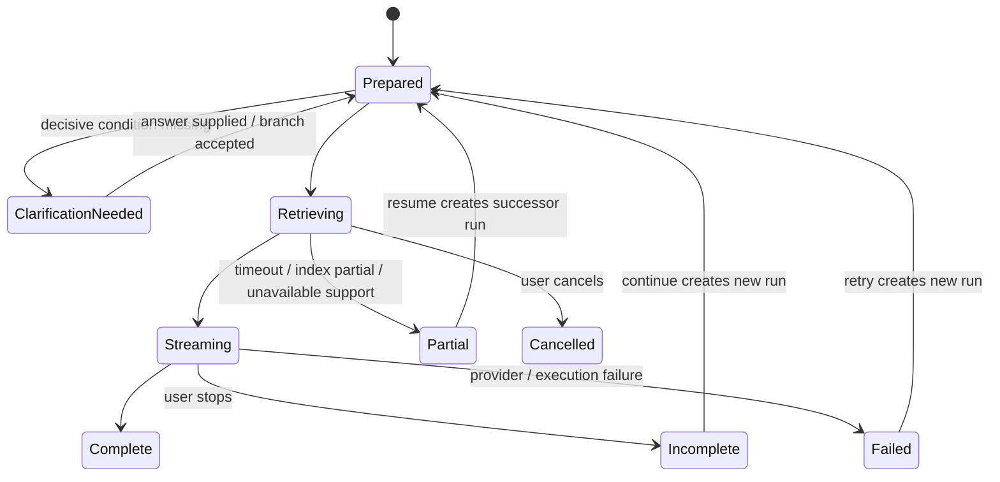

# AI-native 个人知识库

## AI 查询与知识回答合同 v1.0 — Query Context、Grounding、Answer Claim 与历史重评

> 文档日期：2026-08-06  
> 文档性质：产品本体合同，不是 Prompt、RAG 技术方案、聊天页面线框或原型规格  
> Canonical 产品定义：`AI-native-个人知识库-终局产品设计文档-v4.0.md`；本合同只证明 AI 查询与回答责任，不得反向改写 v4.0  
> v4.0 Answer 覆写：八类回答责任是底层完整性模型，不是八个常驻视觉区块；默认使用 P0 直接回答、P1 依据与路径、P2 判断与写回的渐进呈现  
> v4.0 粒度覆写：检索可以内部命中 Block / Anchor，但结果身份必须是 Knowledge + Anchor + Placement；Answer Claim 只属于本次 Query Run，不因引用 Anchor 而成为 Inline Claim 或 Claim Knowledge；写回已有知识必须是 block-level patch  
> v4.0 Relation 覆写：Knowledge Route 中 direct Relation、derived path、cross-group exit 与 retrieval jump 分层；AI 不能把本次共现、共享 Source、相似度或多步 path 压成新 Relation / Group Relation，保存只能产生带完整陈述的 RelationCandidate  
> v4.0 Query 覆写：Ask 是对明确知识范围的临时、可核验视图；默认外部资料关闭；Requested / Effective / Used Context、六种 Answer Basis、Coverage 与 Context Delta 必须成立；Saved Answer 只保存历史，具体 Claim 写回才可能改变当前 Knowledge  
> v4.0 探索连续性覆写：QueryRoute 属于具体 Query Run，不自动进入 ExplorationTrail 或 SavedPath；只有用户显式选择并经过 connector 检查，才转换为 SavedPath draft，PathProgress 另行保存  
> 2026-08-09 Question-first 覆写：完全空的 Library 可以先 Ask，但 Requested Context 必须明确为空，不运行冒充内部依据的回答；原问题保留，可转为加入资料、写已有理解、保存 Question Knowledge 或按次允许外部资料。Source-only Ask 使用 Source Statement basis；外部权限不继承；Answer 仍不自动成为 Knowledge。完整规则见`AI-native-个人知识库-首日到日常核心旅程合同-v1.0.md`  
> 2026-08-09 Scale Invariance 覆写：宽泛全库 Ask 以 Groups 作为 coverage units；必须说明 eligible、covered、excluded、unavailable 与 index-partial Groups，不能用少量检索样本代言“整个知识库”；Used Context 仍只显示真正支撑 Claim 的 Knowledge / Evidence  
> 2026-08-10 Relation Lifecycle 覆写：Ask 引用具体 relation_revision_id；maintained / ended / superseded / retracted、review_due、open Challenge 与 archived 分别决定当前使用和说明；RelationCandidate 永不冒充内部已知事实。完整合同见`AI-native-个人知识库-关系陈述生命周期与网络可信性合同-v1.0.md`  
> 2026-08-10 Group Relation Aggregation 覆写：Ask 可以描述当前观察到的跨群联系，但只有通过 Effective Support Unit collapse、Boundary coverage、type-specific policy、CounterSignal 与 removal test 的建议才有 Group RelationCandidate 资格；回答本身不写入任何关系。完整合同见`AI-native-个人知识库-群级关系聚合门槛与支撑充分性合同-v1.0.md`  
> 2026-08-10 Group Relation Type Registry 覆写：Ask 只把当前维护中的十一种正式类型作为群关系真相；`shares_core_knowledge_with`不再是正式类型，共享核心知识只作为可重建 observation；`influences`仅在无法使用更窄类型且机制、受影响维度与限制完整时使用。回答引用所用类型定义版本，但不把 enum 暴露给 P0。完整合同见`AI-native-个人知识库-群级关系类型注册表与语义互斥合同-v1.0.md`  
> 2026-08-10 Group Pair Ask 覆写：从 Pair Comparison 提问时，Requested Scope 固定两侧 Groups；Current Relations、Shared Observation、exits、Candidates 与 History按意图分层纳入。回答可以进入 Compare，但不因比较或问答写关系；返回必须恢复原 Claim / Pair snapshot。完整合同见`AI-native-个人知识库-知识群对照与关系检查器合同-v1.0.md`  
> 2026-08-10 Knowledge Relation Type Registry 覆写：Ask 只把当前维护中的二十五种 `knowledge.*` types 作为 Knowledge-level relation truth；EvidenceBinding support、Answer ClaimSupport 与 `knowledge.supports` 是三个对象；`applies_to`不声称真实采用，`implements`才表达落实；`supersedes / retracts / reopens / uncertain_about`不进入 ordinary route edge。完整合同见`AI-native-个人知识库-知识关系类型注册表与跨层语义合同-v1.0.md`  
> 2026-08-10 Question Resolution 覆写：Query Turn、Runtime Unknown、Gap Marker、Conflict、Annotation 与 Question Knowledge 分开；Answer Snapshot、形成 Knowledge、链接依据、采纳 Resolution 与停止追问是不同写入。AI 只可提出 Question / Resolution Change Set，不能自动 resolved、concluded 或 reopen。完整合同见`AI-native-个人知识库-问题知识、未知与求解生命周期合同-v1.0.md`  
> 2026-08-10 真实端到端夹具覆写：资格 / 规则型 Answer 必须按需要区分 Source Statement、Contextual Inference 与 Operational Outcome；用户情境只按 Run / Question Applicability 使用，来源或条件变化先产生可检查的 criterion impact。完整流程见`AI-native-个人知识库-真实端到端使用样例与设计数据夹具-v1.0.md`  
> 2026-08-10 概念研究夹具覆写：研究型 Answer 必须区分 acquisition performance、delayed retention 与 transfer，并按需要展示 StudyConditionSnapshot；只在策略群提问而核心依据位于理论群时，系统请求 per-run expansion，不静默全库扩大。方法学评论先影响具体 ClaimSupport / criterion，不自动生成 Conflict。完整流程见`AI-native-个人知识库-第二真实端到端夹具-概念学习、多语境复用与群关系-v1.0.md`  
> 术语兼容：本合同早期细节中的 `Node` 均按 v4.0 的 `Knowledge` 理解；不得由旧术语新增一种日常本体  
> 历史深层模型：`AI-native-个人知识库-产品定义-v3.0.md`  
> 相邻合同：`AI-native-个人知识库-知识深度与关系探索合同-v1.0.md`、`AI-native-个人知识库-知识形成与维护循环-v1.0.md`、`AI-native-个人知识库-知识节点粒度与内容组成合同-v1.0.md`、`AI-native-个人知识库-Overview形成编辑与更新合同-v1.0.md`、`AI-native-个人知识库-搜索定位与知识找回合同-v1.0.md`、`AI-native-个人知识库-来源证据与可追溯性合同-v1.0.md`、`AI-native-个人知识库-直接创作编辑与版本历史合同-v1.0.md`、`AI-native-个人知识库-属性Facet与适用条件合同-v1.0.md`、`AI-native-个人知识库-产品对象层级与身份治理合同-v1.0.md`、`AI-native-个人知识库-关系陈述生命周期与网络可信性合同-v1.0.md`  
> 核心问题：用户怎样向自己的知识世界提问，怎样知道系统实际查了什么、每个结论依据什么、哪里不知道，以及一次回答怎样被保存、重评或转化而不污染长期知识

---

# 0. 执行决定

本轮冻结六十一项产品决定。

1. **Ask 是知识操作，不是独立聊天产品。** 回答必须保持当前 Scope、Selection、知识对象、证据和返回路径，不能把用户带离知识库进入无边界对话流。
2. **Search、Ask 与 Explore 是三种不同承诺。** Search 定位已有对象；Ask 综合回答问题；Explore 展开可解释连接。系统可以建议转换，但不能静默切换。
3. **用户的问题与一次模型执行不是同一对象。** `Query Turn` 保存用户意图；`Query Run` 保存某次实际使用的上下文、索引、模型、策略和结果。两者是可追溯 Supporting Records，不与 Node / Group 平级进入 Library 或 Atlas。
4. **每次重试、追问和 Re-evaluate 都创建新的 Query Run。** 原问题、原运行和原回答保持可追溯，不做 last-write-wins。
5. **Query Context 是一次运行的不可变快照。** 当前 Group、Selection 或设置之后变化，不反向改变历史运行的实际范围。
6. **Requested、Effective 与 Used Context 必须分开。** 用户请求的范围、系统解析后的范围、最终真正使用的对象可能不同，回答中要能解释差异。
7. **Scope Anchor 与 Expansion Policy 分开。** “当前 Node”不等于默认可读取整个 Space；是否展开 descendants、正式关系、Saved Path 或指定来源必须显式可见。
8. **当前焦点不等于知识作用域。** `current_focus` 帮助解释代词和返回位置；`knowledge_scope` 决定允许检索的边界。
9. **默认只查询 active 的当前个人知识。** Contested 可以包含但必须标明；显式 Draft、Superseded、Archived 与历史 Snapshot 只有用户选择或问题语义需要时才进入。
10. **Stale 与 Source unavailable 不自动排除。** 它们仍可能是用户当前采用的知识，但回答必须显示 freshness / availability 影响。
11. **外部知识默认关闭。** 开启后只使用可引用的外部来源；模型无来源的通用记忆不能作为事实依据偷偷填补个人知识缺口。
12. **推理不是来源。** AI 可以综合、比较和推导，但必须分别显示输入依据与“这是基于这些知识的推论”，不能写成某个来源直接陈述。
13. **Answer 是一次运行的输出，不是 Knowledge Truth。** 普通 Save、复制、继续追问或关闭窗口都不会创建 Node、Relation、Overview revision 或 Source。
14. **Answer Claim 是回答内部的可核验陈述单元，但不是 Knowledge Node。** 只有执行明确的 Claim Promotion，才获得长期知识 identity。
15. **每个主要 Answer Claim 必须有可检查 basis。** basis 可以是 Node / Relation、Source Evidence、当前用户输入、可引用外部来源或明确推论；不能只有一段统一的“参考资料”。
16. **Citation 必须落到可核验位置。** 个人知识进入 Node + Anchor + Placement；来源进入 Evidence Fragment + Source locator；外部资料进入 URL / external Source snapshot。
17. **引用 Node 不等于宣称它有外部证据。** 用户原创知识可合法支撑回答，但必须写成“来自你的知识 / 用户综合”，不能伪造 Source citation。
18. **引用来源不等于接受来源中的内容。** 回答必须区分“来源写道”和“你当前采用的知识”；Source Truth 不自动升级为 Knowledge Truth。
19. **引用数量不代表答案可靠。** 系统按 Claim 支撑角色、Applicability、版本、冲突和覆盖解释答案，不显示单一 confidence 百分比。
20. **Coverage 与 Answer certainty 分开。** 系统必须说明检索覆盖是否 sufficient、partial、insufficient 或 indeterminate，以及为什么。
21. **“没有找到”不等于“不存在”。** 负面回答必须限定所查 Scope、索引状态、排除项、有效时间和来源可用性。
22. **缺少决定性 Applicability 时先澄清或分支回答。** 不暗自假设用户身份、地点、组织、日期或适用条件。
23. **每次最多先问一个真正会改变答案的澄清问题。** 其他不确定性在回答中以分支、限制或 Unknown 表达，避免把 Ask 变成表单。
24. **原问题与系统重写必须同时保留。** Query planner 可以拆解或规范化问题，但用户始终能看到原文，不能用隐藏重写改变意图。
25. **追问继承上一 Run 的实际 Context，但必须显示 Context Delta。** Scope、as-of、Applicability、状态或外部知识发生变化时，提交前或回答头部明确说明。
26. **上一条 AI Answer 默认不能作为下一条事实依据。** 追问需要重新回到原始 Node、Relation 与 Evidence；只有“比较刚才的回答”这类元问题才直接引用 Answer Snapshot。
27. **对话线程是连续交互容器，不是知识对象。** 未保存线程只用于恢复和历史查看，不进入 Library、Overview、Graph 或默认 Ask 检索。
28. **Saved Answer 是 Knowledge Snapshot 的一种，不是 Node。** 它可以被搜索和历史查询，但不参与当前事实回答，除非用户显式选择历史回答或 as-of 语境。
29. **Re-evaluate 创建新 Answer Snapshot。** 它复用原 Requested Context，在当前知识版本上创建新 Run，并提供 Claim / support / unknown diff，不覆盖旧答案。
30. **Answer Impact 与知识状态分开。** `inputs_changed`、`support_unavailable`、`scope_changed` 或 `relation_changed` 只说明旧答案受到什么影响，不宣称旧答案自动错误。
31. **Knowledge Route 只在能解释真实连接时显示。** 没有可靠路径时使用 Used Knowledge List + Claim Support，不用图形完整性制造假边。
32. **Retrieval Jump 永远是运行时连接。** 它可以解释为什么本次一起使用两个对象，但关闭 Answer 后不会进入长期 Graph。
33. **回答中的路径必须与 Claim 对齐。** 点击一个 Claim 只高亮真正支撑它的 Route Steps、Nodes 与 Evidence，不高亮整次检索的全部对象。
34. **Streaming 状态不等于完成答案。** stopped、cancelled、partial、failed 与 complete 分开；不完整答案不能以普通完成态被保存或引用。
35. **生成中的文字可以显示，但 Claim grounding 状态必须随之可见。** 最终 `complete` 前不能把尚未解析 support 的段落当作已核验答案。
36. **Query Run 记录实际索引与 policy snapshot。** 包括 index coverage、model / execution mode、local / cloud、external policy、actual refs 和 exclusions，保证历史可解释。
37. **AI unavailable 不让产品失去知识能力。** Search、阅读、Graph、Evidence、Saved Answers 与手工创作仍可用；只有需要模型的综合、重评和建议暂停。
38. **Index partial 时可以回答，但必须标记 partial coverage。** “未命中”不能伪装成“知识库没有”。
39. **Source unavailable 时保留 Node 支撑与历史引用。** Citation 明确当前无法核验，不能删掉 Answer Claim 或改写旧 Snapshot。
40. **保存动作必须选择结果对象。** Saved Answer、Knowledge Draft、Question / Inquiry Knowledge、Merge Patch、Saved Path、RelationCandidate / Direct Relation、Overview Semantic Diff 与 Save Source 是不同动作。
41. **整段 Answer 不一键升级为当前 knowledge。** 新知识按 Claim 逐项检查 identity、Applicability、support 和影响，默认先成为 Draft / Proposal Branch。
42. **Ask 不执行外部动作或高影响知识变更。** “删除、合并、发送、提交、更新全部”只能形成可检查建议或转交正式 Change Set，不因出现在问题中直接执行。
43. **Query History 不成为红点 Inbox。** 未保存查询可自动本地恢复，但不会因数量、时间或未整理状态催促用户处理。
44. **答案默认简洁，但不是省略依据。** Direct Answer 先给结论；Route、Evidence、Conflict、Unknown、Coverage 与 History 按问题后果渐进披露；没有真正有价值的后续方向时不强行生成推荐。
45. **回答质量不以长度、速度、Token 数或生成次数衡量。** Scope 可预测、Claim 可核验、缺口诚实、进入知识连续、保存后果正确才是质量。
46. **AI 查询不改变 canonical graph 布局。** Query Highlight 是临时 overlay；清除后 Atlas、Group Map 与 Local Graph 返回原稳定状态。
47. **完整导出必须保留 Saved Answer、Query Context、Run、Claim Support、Route、Evidence Snapshot 与 impact lineage。** 普通聊天文本导出不能冒充可重建历史。
48. **本合同不授权开始原型或技术实现。** 产品定义确认前，不能用一个看起来顺畅的聊天界面掩盖尚未解决的 Scope、Grounding 与写回问题。
49. **宽泛全库 Ask 以 Groups 作为覆盖单位。** 系统先枚举 eligible Groups，再记录 covered、excluded、unavailable 与 index-partial，不以少量高相关结果冒充“查过整个知识库”。
50. **Coverage Receipt 与 Used Context 分开。** Group coverage 证明本次范围处理到哪里；Used Knowledge 只列真正支撑 Claims 的 identities / revisions / anchors，两者都不展示全部 candidates 或 chunks。
51. **全库综合必须校准措辞。** 只有 Group coverage 足够且关键排除项可见时，才能写“在当前知识库范围内”；否则写“在已覆盖的 X 个知识群中”，并明确仍有多少未覆盖及原因。
52. **数量增长不创建另一套 Ask 模式。** F1 / F10 / F100 / F10K 共享同一 Query Turn / Run / Context / Claim Support / Return 语义；大库只增加范围解析、进度与 Coverage 可见性。
53. **Runtime Unknown 不是持久 Question。** 它只解释本次 Run 为什么不能充分回答；只有用户显式提升才创建 Question Knowledge。
54. **Question 的当前回答不是最新 Answer。** 只有用户采纳的 `QuestionResolutionRevision` 才是 current resolution，并固定 exact question / basis revisions、criteria、Applicability 与剩余未知。
55. **Answer、Knowledge 与 Resolution 三层分权。** 保存回答不写知识；形成知识不自动采纳为问题答案；链接 basis 也只形成 Proposal，不能自动 resolved。
56. **解决与停止追问分开。** Ask 可以建议 partial / provisional / resolved coverage，但不改变 `active / paused / concluded`；组合动作必须预览两个独立后果。
57. **依据变化只触发 changes_available / review_due。** Re-evaluate、Source update、Relation retraction 或 target revision 不静默覆盖 adopted Resolution，也不自动 reopen。
58. **实质改题建立 successor。** Follow-up 只有在保持同一核心求知意图时继续同一 Question；改变答案类别、criteria 或决策后果时建立新 identity 与 lineage。
59. **高后果 Answer 分开规则、推断与结果。** Source 明确声明、结合本次条件的 Contextual Inference、以及机构 / 系统已产生的 Operational Outcome 分别保存 Claim standing；语言流畅度不能抹平它们。
60. **个人情境默认属于本次 Context。** 用户输入的身份、职业、奖学金、住房或日期只进入 Query Context / Question Applicability；除非显式写成可修订 Profile / Property Knowledge，不在后续问题中静默继承。
61. **变化检测只提出受影响部分。** Source material change、Applicability 或 personal context 改变可以产生 Context Delta、criterion impact 与 Resolution Proposal；AI 不自动宣布旧 Answer 错误、不整体降级 Question，也不自动 reopen。

---

# 1. 当前规格中的十一个结构缺口

## 1.1 Query 把问题、执行和回答混成一个对象

旧结构：

```text
Query
  question
  context
  retrieval_path
  answer
  supporting_nodes
```

这无法解释：同一问题重试两次、改用历史时点、切换外部知识、停止生成后继续、或按当前知识重评时，哪些东西保持、哪些东西变化。

## 1.2 “当前 Scope”是 live pointer 还是历史快照不清楚

若 Answer 只保存 `group_id`，Group 后续 Split / Merge、Topic 移动或 Node Placement 改变后，用户无法知道当时实际查了哪些 revisions。历史回答会被当前结构重新解释。

## 1.3 请求范围、系统扩大范围和实际使用对象混在一起

用户选择“法国租房”，系统可能又查询“法国行政手续”、几个 Sources 和外部网页。只显示一个 Scope chip 会隐藏实际扩大，用户无法判断答案来自哪里。

## 1.4 Follow-up 可能暗中继承错误条件

“那学生呢？”可能只改变主体，也可能需要改变地区、日期或 Source Policy。若上一轮 Context 被不可见地整体继承，回答表面连贯，实际适用范围却不可检查。

## 1.5 Answer 缺少 Claim-level support

页面底部列出几个来源，不能证明哪一个结论由哪段知识支撑，也无法表达一条结论来自用户综合、另一条来自政策原文、第三条只是系统推论。

## 1.6 无结果、缺知识与索引不完整可能被写成同一句话

“知识库里没有”可能真实含义是：当前 Group 没有、全局有但被排除、Source 尚未解析、历史版本没被索引、来源权限丢失，或真正不存在相关知识。

## 1.7 内部知识、来源原文、外部网页和模型常识可能混流

如果 Answer 用统一语气输出，用户无法知道哪部分是自己的知识、哪部分只是来源写过、哪部分来自 Web、哪部分是 AI 推导。

## 1.8 Knowledge Route 可能沦为装饰

检索系统常常并列取回对象，并不拥有从 A 到 B 的真实路径。为了让图谱“看起来完整”补一条边，会污染用户对长期知识网络的理解。

## 1.9 对话历史可能递归成为“证据”

如果下一轮直接把上一轮回答当 Context，模型生成的错误会在多轮中不断被引用和强化，却绕开 Node、Evidence 与 Knowledge Commit。

## 1.10 Saved Answer 是否参与当前查询不清楚

保存回答若默认进入检索，就会让过去的生成文本与当前 Knowledge Truth 竞争；若完全不可查，又失去历史研究价值。必须定义历史专用的进入语义。

## 1.11 Save 仍可能退化成“把聊天变成知识”

一条回答可能同时包含事实、推论、未知、建议和临时表达。整段保存会制造没有 identity、Applicability、状态和准确 Evidence 映射的混合 Node。

---

# 2. 产品目标与非目标

## 2.1 产品目标

AI 查询必须同时做到：

1. 用户在提交前能预测系统将查询什么；
2. 回答后能检查系统实际使用了什么；
3. 每个主要结论能回到个人知识、来源或外部证据的精确位置；
4. 事实、来源陈述、用户知识、AI 推论、冲突和未知不混成同一种声音；
5. 追问保持自然，同时所有 Context 变化可检查；
6. 从 Answer 可以无损进入 Node、Relation、Evidence、Path 与 Atlas，再返回原 Claim；
7. 保存、重评和知识变化不改写历史；
8. AI、索引或来源不完整时仍诚实表达覆盖，并保留非 AI 核心能力。

## 2.2 非目标

- 不做一个以聊天列表为一级导航的通用 AI 客户端；
- 不让模型替用户自动决定哪些回答是真正知识；
- 不把 chain-of-thought、模型内部推理或检索日志全部暴露为“透明度”；
- 不把 Web 搜索默认混入所有个人知识问题；
- 不把所有回答都变成长报告、研究任务或图谱；
- 不因本合同增加新的顶层知识对象或新的一级导航；
- 不执行邮件、支付、删除、提交或外部系统写入；
- 不以一次 Answer 的流畅程度代替长期可维护性。

---

# 3. Search、Ask、Explore、Author 与 Review 的边界

| 模式 | 用户承诺 | 默认结果 | 是否写入 Knowledge Truth |
|---|---|---|---:|
| Search | 找到已经存在的对象或片段 | 分组结果 + 路径 + Anchor | 否 |
| Ask | 在明确 Context 下回答一个问题 | Answer Claims + Support + Unknown | 否 |
| Explore | 从当前对象看见可解释邻接 | Relation / Structure / Path | 否 |
| Author | 写下或修改用户知识 | Current Revision / explicit Draft | 本地持久化后默认写入当前知识 |
| Review | 判断高影响建议或冲突 | Change Set decision | 明确提交后 |

## 3.1 Search 不能做什么

- 不生成综合结论；
- 不自动扩大到外部知识；
- 不把语义相似结果画成 Relation；
- 不把 Answer 或 Source 片段伪装成 Node；
- 不因输入看起来像问题就自动切换 Ask。

Search 的 Scope、Result Identity、Ranking、Deep Anchor、Coverage、Find / Picker / Command 与 Saved Search View 由 `AI-native-个人知识库-搜索定位与知识找回合同-v1.0.md` 统一定义。Ask 转 Search 或使用用户选中的 Search results 时，必须传递 canonical identities / revisions / anchors，不能把 snippets 或 relevance score 当成事实依据。

## 3.2 Ask 不能做什么

- 不静默保存；
- 不把检索顺序变成知识路径；
- 不把模型常识写成个人知识；
- 不通过一次问句执行高影响修改；
- 不把全部候选对象展示成 hairball；
- 不要求用户先清空 Review 才能提问。

## 3.3 Explore 不能做什么

- 不默认生成长答案；
- 不把点击路径变成正式 Relation；
- 不使用无限推荐流；
- 不因 Query Highlight 改变 canonical graph layout。

## 3.4 合法转换

| 当前状态 | 用户信号 | 提供动作 | 结果 |
|---|---|---|---|
| Search | 输入完整问题 | 用这些知识回答 | 创建 Query Turn，不自动提交 |
| Search | 打开对象 | 查看关系 | 进入 Explore |
| Ask | 点击 Claim | 打开知识与依据 | 改变 Selection，保留 Answer |
| Ask | 点击 Route | 沿这条路径探索 | 进入 Explore，保留 Return Stack |
| Ask | 发现稳定理解 | 保存为独立知识 | 进入 Claim Promotion / Proposal 或用户 Edit Buffer |
| Ask | 发现关系 | 保存为关系建议 | 进入 Proposal，不直接建边 |
| Explore | 选中 Path | 基于这条路径提问 | 创建带 Path Scope 的 Query Turn |
| Evidence | 选中片段 | 询问这段 / 保存为证据 | Ask 或 Knowledge Proposal |

---

# 4. 对象模型：问题、运行、回答和知识快照分开

这些对象是查询运行与历史的内部记录，不增加新的顶层知识本体。只有 Saved Answer 复用既有 `Knowledge Snapshot` 正式对象。

## 4.1 Query Session

```text
QuerySession
  session_id
  created_at
  last_active_at
  entry_selection_snapshot
  turn_refs[]
  retention_state: active | locally_recoverable | discarded | saved_as_snapshot
```

Session 只负责多轮连续性和恢复。它不成为 Group member、Relation endpoint、Overview support 或默认 Search 结果。

## 4.2 Query Turn

```text
QueryTurn
  turn_id
  session_id
  parent_turn_id?
  original_user_text
  clarification_answers[]
  interpreted_intent
  requested_context
  context_delta_from_parent?
  created_at
```

`original_user_text` 永远保留。`interpreted_intent` 用于执行与说明，不覆盖用户原话。

## 4.3 Query Run

```text
QueryRun
  run_id
  turn_id
  run_reason: initial | retry | rephrased | follow_up | resume | re_evaluate | branch
  context_snapshot_ref
  retrieval_receipt_ref
  execution_policy_snapshot
  model_or_engine
  index_snapshot
  run_state
  started_at
  completed_at?
  answer_snapshot_ref?
```

同一 Turn 可以有多个 Runs。Retry 不覆盖失败 Run，换模型也不改变问题 identity。

## 4.4 Query Context Snapshot

```text
QueryContextSnapshot
  requested
    scope_anchors[]
    expansion_policy
    current_focus?
    knowledge_as_of?
    valid_at?
    status_filter
    applicability_bindings{}
    source_policy
    external_knowledge_policy
    excluded_refs[]
  effective
    resolved_scope_refs[]
    resolved_applicability{}
    resolved_knowledge_as_of?
    resolved_valid_at?
    inherited_from_turn_ref?
    context_delta
  used
    node_revision_refs[]
    relation_revision_refs[]
    overview_revision_refs[]
    source_revision_refs[]
    evidence_fragment_refs[]
    external_source_refs[]
  coverage
    index_state
    unavailable_refs[]
    excluded_relevant_refs[]
    temporal_gaps[]
```

Requested 回答“你让我查什么”，Effective 回答“系统最终怎样解释”，Used 回答“答案实际用了什么”。

## 4.5 Retrieval Receipt

```text
RetrievalReceipt
  run_id
  stages[]
    stage_kind
    candidate_ref_count
    selected_refs[]
    rejected_reason_summary
  relation_traversal_policy
  external_search_policy
  index_coverage
  partial_reasons[]
```

Receipt 是 P3 核验材料，不默认展示模型内部推理、embedding 分数或所有候选文本。

## 4.6 Answer Snapshot

```text
AnswerSnapshot
  answer_id
  run_id
  answer_state
  direct_answer
  claim_refs[]
  route_snapshot_ref?
  used_knowledge_refs[]
  conflict_refs[]
  unknowns[]
  coverage_summary
  suggested_next_paths[]
  generated_at
```

## 4.7 Answer Claim

```text
AnswerClaim
  answer_claim_id
  answer_id
  claim_text
  claim_kind
  applicability
  answer_state
  basis_kind
  support_refs[]
  conflict_refs[]
  qualification
  claim_order
```

Answer Claim 只在 Answer 内稳定，用于引用、Support、Diff 和 Claim Promotion。它不进入 Atlas，也不因被保存 Answer 就成为 Knowledge Node。

## 4.8 Claim Support

```text
ClaimSupport
  support_id
  answer_claim_id
  support_kind:
    accepted_knowledge
    source_statement
    current_user_input
    external_source
    reasoned_derivation
    historical_answer_reference
  target_ref
  target_revision_ref?
  target_anchor_ref?
  evidence_binding_refs[]
  support_role: supports | qualifies | contradicts | context_only
  availability_state
```

`evidence_binding_refs[]` 指向确定 Source Revision / Fragment 与其对当前 Claim 的作用；Fragment 自身不拥有全局 evidence role。`reasoned_derivation` 必须同时列出输入 support refs；它不能把自己作为最终来源。Material Origin、Derivation Distance、Extraction Fidelity 与 Verification State 由 Binding / Fragment provenance 提供，不压进 `support_kind`。

ClaimSupport 的 `supports / qualifies / contradicts`只解释**本次 Answer Claim**。它们不解析为 `knowledge.supports / qualifies / contradicts`，不拥有 Knowledge Relation identity，也不因 Saved Answer 或 Re-evaluate 进入 Local Graph。若用户认为两条 Knowledge 之间存在可长期维护的论证关系，必须另行经过 RelationCandidate / direct relation authoring，并固定 `KnowledgeRelationTypeDefinitionRevision`。

## 4.9 Saved Answer / Knowledge Snapshot

```text
KnowledgeSnapshot
  snapshot_kind: saved_answer
  saved_answer
    question
    requested_context
    effective_context
    answer_snapshot_ref
    knowledge_revision_set
    route_snapshot
    evidence_snapshot
    external_source_snapshot?
    generated_at
    impact_state
    predecessor_snapshot_ref?
    successor_snapshot_refs[]
```

Saved Answer 是“当时怎样回答”，不是“现在应该相信什么”。

---

# 5. Query Context 合同

## 5.1 Scope Anchors

允许的显式 Scope anchors：

- Space；
- 一个或多个 Groups；
- 当前 Topic subtree；
- 一个或多个 Nodes；
- 当前 Node Anchor / selection；
- Saved Path；
- 一个或多个 Sources；
- 一组手工选择对象；
- Historical Snapshot。

View 可以提供对象集合，但 Query 保存的是解析后的 Scope refs 与 View rule snapshot，不能只保存一个日后会变化的 View 指针。

## 5.2 Expansion Policy

Scope 与如何扩展分开：

```text
ExpansionPolicy
  include_structural_descendants: true | false
  formal_relation_radius: 0 | 1 | selected_path
  include_node_evidence: true | false
  include_backlinks: true | false
  include_saved_paths: selected_only | false
  allow_scope_expansion: never | ask | explain_after
```

默认：

- Space：全部 active accepted knowledge；
- Group：该 Group 的 active Placements、accepted Nodes、Relations、Overview 与 Evidence；
- Topic：该 Topic descendants 内 Placements，保留 resolved Group；
- Node：Node + Evidence；只有界面明确写“及直接关系”时才展开 formal Relation radius 1；
- Anchor selection：该 Anchor、所在 Node、直接 Evidence，其他内容按问题需要但须说明；
- Saved Path：路径对象与 steps，是否允许旁路知识由用户选择。

## 5.2.1 从 Editor 发起 Ask 的读前提交

Editor 中有 dirty Buffer 时，Ask 在创建 Query Turn 前先等待 IME composition 结束并尝试 Direct Edit Commit：

- 成功：Requested / Effective Context 指向新的 Current Revision；
- 失败：保留原问题，不把 Buffer / Recovery Checkpoint 冒充 current；
- 用户可选择`修复保存后提问`，或明确把选区 / 未提交文字作为`仅本次临时信息`；
- 临时信息拥有独立 Answer Basis，不写入 current、History、Overview、Graph 或后续默认 Follow-up Context；
- Explicit Draft 仍需用户单独选择`包含草稿`，不能因 Editor 正打开它就自动加入。

## 5.3 Status Filter

| 状态 | 默认是否包含 | 回答要求 |
|---|---:|---|
| Current Knowledge / maintained current Relation | 是 | 正常使用 |
| Open Challenge 且 Applicability 重叠 | 是 | 不得压成单一结论，显示挑战陈述与依据 |
| 无外部 Evidence | 是 | 说明用户理解或依据限制，不冒充无知识 |
| Review due Relation | 是 | 显示具体变化与当前影响，不写成已失效 |
| Source unavailable | 是 | 显示当前无法核验 |
| Explicit Draft | 否 | 用户显式允许后标明“草稿”，并与 Current 分层 |
| Recovery Checkpoint | 否 | 永不作为 Query corpus；只能恢复到 Buffer / Draft 后再处理 |
| Ended | 否 | 历史、as-of 或演化问题才包含 |
| Superseded | 否 | 默认沿 successor；历史、演化或对照问题包含旧 Revision |
| Retracted | 否 | 只有撤回原因、争议史或显式历史查询包含 |
| Archived | 否 | 显式历史范围才包含 |
| Trashed | 否 | 只在恢复或审计语境使用 |

## 5.4 Applicability Bindings

每个 binding 记录：

```text
ApplicabilityBinding
  dimension
  value
  origin: user_explicit | current_selection | saved_user_context | inferred_for_clarification
  certainty: bound | unresolved
```

系统可以继承用户已经明确保存的住所或对象，但回答头部需用人话说明。推断值不能静默成为 `bound`。`saved_user_context` 不是 Property Profile；后者只用于 Primary Kind / Facet 的字段建议，不能成为 Query 对用户身份的隐藏假设。

Query Applicability Binding 与知识对象上的 Property Assertion / Applicability reference 永久分开：

- 在一次问题中选择“法国、学生、2026 年”只属于该 Run；
- 它可以被显式保存为 Saved View criteria、用户上下文偏好或某条 Node / Claim 的 Applicability；
- 保存前不回写 Node、Group、Source、Placement 或 Profile；
- 从 Property filter 建立 Ask 时，Query 保存 stable Definition / option refs 和解析后的值，不保存会漂移的 label；
- `unknown / no_value / not_applicable / unset` 作为知识值状态进入 Coverage，不被模型当成 false 或无约束；
- Source metadata 未经 Mapping 只能作为 Source statement，不能通过 Ask 直接升级为 Node Property。

当回答比较 Property Assertions 时，先按 target、Applicability、valid time、qualifier / basis 与 supersession 分组，再声明 true conflict。Node-reference Property 只可作为值或导航；Knowledge Route 不因此生成正式 Relation。

## 5.5 As-of

`as_of` 有两种时间语义：

1. **Knowledge time**：在某时点用户的 Knowledge Truth 是什么；
2. **Valid time**：某条规则或事实在什么时候适用。

历史问题必须区分二者。例如“2025 年我当时采用什么租房判断”与“2025 年法国规则是什么”不是同一个 Query。

若历史 revision、Source snapshot 或 valid-time metadata 不足，Coverage 进入 partial / indeterminate，不能用当前网页反推过去事实而不说明。

## 5.6 Source Policy

用户可选择：

- personal knowledge only；
- accepted knowledge + underlying Evidence；
- direct Evidence only；
- selected Sources only；
- include user-authored knowledge；
- include secondary synthesis；
- external cited sources allowed。

默认使用 Accepted Knowledge，并在需要核验时进入其 Evidence。默认不把全部 Source 全文作为与 Knowledge Truth 同权的答案材料。

## 5.7 Exclusions

排除对象必须进入历史快照。系统发现被排除内容可能改变答案时，只能提示：

> 当前范围排除了 2 条可能相关知识；本回答没有使用它们。

不能悄悄重新加入，也不能把未使用对象写进引用。

## 5.8 Scope Summary 的默认语言

默认一句：

> 在“法国租房”中，按你当前的学生身份和 2026 年 8 月条件回答；使用已接受知识，不使用外部资料。

展开后才显示完整 refs、状态过滤、Source Policy、索引覆盖和排除项。

---

# 6. Query Intent 与回答形态

Intent 用于选择检索和表达，不改变 Scope，也不成为用户必须选择的模式按钮。

## 6.1 Direct Understanding

问题：某个概念、规则、对象或决定是什么。

回答优先：一句定位、必要条件、关键支撑、进入 Node。

## 6.2 Synthesis

问题：多个 Nodes / Groups 共同表达什么。

回答优先：共同点、差异、适用范围、各 Claim support。综合结论必须标为 synthesis，而不是某一来源原话。

## 6.3 Compare

问题：两个或多个概念、方案、时期或来源有何差异。

回答优先：统一比较维度、相同点、差异、条件与缺口。没有共同维度时先说明不可直接比较。

## 6.4 Explain Relation / Path

问题：为什么 A 与 B 相连，或中间路径是什么。

回答优先：正式 Relations、结构、Evidence 与 Retrieval Jumps 的区别；没有真实路径时不补边。

## 6.5 Evidence Audit

问题：什么支持、反驳或限定某个 Claim。

回答优先：Claim、direct / secondary / user / system roles、Applicability、版本和无法核验项。

## 6.6 Conflict & Applicability

问题：哪些观点冲突，哪个适用于当前条件。

回答先比较 Applicability，再判断 qualified branches 或 true conflict，不以来源票数裁决。

## 6.7 Change & Historical

问题：最近什么变化、为什么旧答案不同、某时点怎样理解。

回答优先：revision diff、changed inputs、当时 Snapshot 与当前版本，不重写历史。

## 6.8 Gap Discovery

问题：缺什么知识或证据才能回答。

回答优先：已有范围、缺口类型、为什么缺、最小补充来源或问题；不生成泛化学习清单。

## 6.9 Decision Support

问题：根据已有知识应怎样选择。

回答必须分开：已知事实、用户约束、推论、权衡、未知与可逆下一步。Ask 不替用户提交决定或执行动作。

---

# 7. Query Run 与检索合同

## 7.1 Run 生命周期



Retry 是新 Run，并通过 `run_reason` 与 predecessor 关联。

## 7.2 Retrieval stages

典型运行可以包含：

1. Scope resolution；
2. identity / alias match；
3. lexical + semantic candidate retrieval；
4. structural / accepted Relation traversal；
5. Anchor selection；
6. Evidence resolution；
7. external cited source retrieval（仅显式允许）；
8. Claim drafting and support alignment；
9. coverage and conflict check。

这些是质量阶段，不要求界面展示全部内部步骤。

## 7.3 Candidate 不是知识

检索候选：

- 不创建 Node；
- 不创建 Relation；
- 不改变 ranking / salience truth；
- 不进入 Overview；
- 不因多次共同出现自动成为长期连接。

## 7.4 Actual Used Set

`used` 只包含真正支撑或限定 Answer Claims 的对象。被检索但最终未使用的 candidates 不显示成“回答依据”；P3 可以显示其被排除的类别性原因，但不暴露无意义分数墙。

## 7.5 Relation traversal

默认只遍历：

- 当前 Scope 内 maintained + current lifecycle formal Relations；review_due 仍可遍历，但相关 Answer Claim 必须说明变化；
- Structural connections；
- Node → Evidence；
- 用户指定 Saved Path。

Ended 只服务历史 / as-of；Superseded 默认切到 successor；Retracted 与 Archived 默认排除。Backlink、semantic similarity 与共同 Source 可以发现 candidates，但只能作为 Retrieval Jump 或 RelationCandidate，不成为 formal Route Step。

## 7.6 Index coverage

```text
IndexCoverage
  canonical_store: complete | partial | rebuilding | unavailable
  sources: complete | partial | unavailable
  historical_revisions: complete | partial | unavailable
  external: not_requested | complete | partial | failed
```

Index 状态属于 Query Run，不改变 Node lifecycle。

## 7.7 Stop、Cancel 与 Resume

- Stop streaming：保留已生成文字，状态为 incomplete；
- Cancel before answer：保留 Question 与 Context，不产生普通 Answer；
- Resume：创建 successor Run，说明复用哪些 retrieval results；
- Retry：使用同一 Requested Context，但允许用户查看 model / policy 是否变化；
- Partial external search：内部知识部分仍可完成，但外部部分必须单独标记失败。

---

# 8. Answer Claim、Grounding 与 Citation

## 8.1 哪些文字必须成为 Answer Claim

需要独立 support 的主要内容：

- 对问题的直接结论；
- 事实陈述；
- 跨对象综合；
- 条件、限制与例外；
- 对两个观点冲突与否的判断；
- 推荐或权衡的关键前提；
- “没有找到 / 缺少”一类 coverage statement。

过渡句、导航句和界面提示不需要伪造 Claim。

## 8.2 Basis kinds

### Accepted Knowledge

显示：`来自你的知识`。进入 Node / Relation revision + Anchor + Placement；再按需进入 Evidence。

### Source Statement

显示：`来源原文写道`。必须进入 Evidence Fragment 与 exact locator；不暗示用户已经接受这条陈述。

### Current User Input

显示：`根据你在本次问题中提供的信息`。它只属于当前 Run，除非用户另行保存。

### External Source

显示：`外部资料`。必须有 URL / source identity、访问时间、引用位置与 external policy；不自动进入 Sources。

### Reasoned Derivation

显示：`基于这些知识可以推断`。列出输入 Claims / Nodes / Evidence 和推导限制；不能写成某个来源直接支持最终结论。

### Historical Answer Reference

只用于“刚才为什么这样回答”“比较两个历史回答”等元问题。必须继续可展开到原 Run 的底层 support，不能让 Answer 引用 Answer 无限递归。

## 8.3 Claim support roles

同一个 Claim 可以同时有：

- supports；
- qualifies；
- contradicts；
- context_only。

`context_only` 不计作结论证据。例如一个 Group Overview 帮助定位 Scope，但不能代替 Claim Evidence。

这些是 Answer support roles，不是 Relation types。P0 语言分别说“这条知识是本次回答的依据”“这段来源支持该陈述”“这条知识支持另一条主张”，避免把三种 `supports`压成同一个图标或标签。

## 8.4 Citation fidelity

Citation 至少保证：

1. 点击后进入实际被使用的 revision；
2. Anchor 高亮与 Claim 相关部分；
3. Source 显示足够上下文，而不只截取一句；
4. Back 返回原 Answer Claim；
5. 当前内容变化后仍可查看 historical target；
6. 无法重定位时保留引用文字并显示 ambiguous / orphaned；
7. Quote、翻译、OCR、转写与 AI paraphrase 不混淆。

## 8.5 Citation completeness

每个主要 Claim 必须达到以下之一：

- fully supported；
- supported with qualifications；
- contested；
- evidence limited；
- reasoned inference；
- unknown / cannot establish。

界面不显示伪精确百分比。系统内部可审计 unsupported major claim rate。

## 8.6 Overview 边界

Overview 可以作为 Scope orientation / context-only support。若 Answer 使用 Overview 中一段独立事实 Claim：

- 已有 Node support：引用 Node / Relation；
- 只有 user-authored Overview prose：标为用户在 Overview 中的表述；
- 需要长期核验：建议 Claim Promotion；
- 不得把 Overview 自己伪装成 Evidence endpoint。

## 8.7 Source / Knowledge 双真相

一个 Source 与当前 Node 不一致时，Answer 不能只选更“新”的一句：

```text
来源原文：新版本写道 X
你的当前知识：仍采用 Y
当前影响：Y 需要检查，但尚未被自动替代
```

## 8.8 Recommendation grounding

推荐必须显示：

- 用户目标或约束；
- 使用的 Current knowledge；
- 关键未知；
- 哪个环节是价值判断而非事实；
- 是否可逆。

Ask 不把推荐语气伪装成事实确定性。

---

# 9. Answer 的信息结构

默认顺序保持稳定，但各区块按问题需要出现。

## 9.1 Question + Actual Context

显示原问题、一句话 Scope Summary、关键 Context Delta 与 coverage warning。系统重写只在“查看查询解释”中出现。

## 9.2 Direct Answer

先用最短充分答案回应，不先陈列检索过程。必须包含会改变结论的条件或限定。

## 9.3 Key Claims

复杂回答拆成少量主要 Claims。每个 Claim 可聚焦 support、Evidence、Relation Lens 与保存动作。

## 9.4 Knowledge Route 或 Used Knowledge

- 有真实可解释路径：显示 Knowledge Route；
- 只有并列支撑：显示 Used Knowledge List；
- 单一 Node 回答：显示 Node + Evidence，不强行画图；
- 外部资料为主：显示 Source list，不伪造个人 Graph。

## 9.5 Evidence

按 Claim 分组，不按来源数量平铺。优先展示最直接、最能改变判断的片段；其余按 role、条件和版本展开。

## 9.6 Conflict & Unknown

只有真实分歧或缺口时出现。它与 Coverage Notice 分开：知识可能充分覆盖但仍 contested，也可能没有冲突却 coverage partial。

## 9.7 Explore Next

只提供 2–4 个与当前问题直接相关的动作：

- 进入一个关键 Node；
- 查看一条真实 Relation；
- 比较一个条件分支；
- 补充一种决定性 Evidence；
- 沿已使用 Path 继续。

不生成通用“你还可以问……”列表。

## 9.8 Save / Transform

只显示与答案内容真实匹配的动作，不让用户先学习全部对象类型。

---

# 10. Conflict、Unknown、Coverage 与负面回答

## 10.1 Conflict 先检查 Applicability

两条文字不同的 Claims 先比较：

- subject；
- organization；
- jurisdiction；
- location；
- conditions；
- valid time；
- Source revision。

不同条件优先形成 qualified branches；相同条件下不能同时成立才是 true conflict。

## 10.2 Unknown taxonomy

```text
UnknownReason
  no_relevant_knowledge
  relevant_but_evidence_limited
  scope_too_narrow
  decisive_applicability_missing
  source_unavailable
  index_partial
  historical_gap
  external_knowledge_disabled
  unresolved_conflict
  answer_requires_user_judgment
```

这是一项 `Query Run` 内部分类，不是 Question lifecycle。它与以下持久语义分开：

- `unknown value`：知道某项值存在，但当前不知道具体值；
- `no value`：已经知道不存在该值；
- `not applicable`：这个属性不适用于当前对象；
- `Persistent Gap Marker`：某个 Knowledge / Anchor / Property / Relation 的局部缺口；
- `Question Knowledge`：用户决定长期保留并持续求解的已知未知。

Runtime Unknown 只有在用户执行`保存为问题`或`标记为局部缺口`时才产生持久写入。

## 10.3 Coverage state

| 状态 | 含义 | 默认语言 |
|---|---|---|
| sufficient | 当前 Context 足以回答 | 默认不显示额外状态 |
| partial | 可以回答一部分 | “以下结论只覆盖……” |
| insufficient | 缺少决定性内容 | “现有知识还不足以回答……” |
| indeterminate | 因索引、权限或历史缺口无法判断 | “当前无法确认知识库是否包含完整答案……” |

## 10.4 负面回答

禁止：

> 你的知识库里没有关于 X 的信息。

除非已证明全 Scope、索引完整、相关状态已包含、无排除且所有来源可用。通常应写：

> 在当前选择的“法国租房”知识群和已完成索引的内容中，没有找到 X；另有 2 个来源尚未解析。

## 10.5 Conflicting sources

来源冲突不等于 Knowledge Truth 已冲突。回答依次说明：

1. Sources 各自说什么；
2. Applicability / 版本是否不同；
3. 当前 Accepted Node 采用什么；
4. 为什么尚未更新或已进入 Review；
5. 当前问题能得到什么有限结论。

## 10.6 No answer 之后的动作

动作必须对应原因：

- Scope too narrow → 扩大范围预览；
- Missing applicability → 回答一个必要问题；
- Evidence limited → 查看或添加来源；
- Index partial → 使用已索引部分 / 等待重建；
- External disabled → 允许本次使用外部资料；
- Conflict → 打开条件对照；
- AI unavailable → Search instead / 稍后重试。

还可以在确有长期价值时选择`保存为问题`。该动作必须预览 Question statement、Context、Scope、targets、Placement 与 origin Run；不能把整组 Unknown 自动倒入 Library。

---

# 11. Knowledge Route 与网络联动

## 11.1 Route 的责任

Route 必须解释：

- 当前 Claim 用了哪些知识；
- 为什么每一步可连接；
- 哪些连接长期存在；
- 哪些仅属于本次 Run；
- 哪些进入 Evidence 或外部 Source。

## 11.2 Route Step

```text
RouteStep
  route_step_id
  from_ref
  to_ref
  step_kind:
    structural_connection
    formal_relation
    evidence_connection
    retrieval_jump
    external_source_connection
  relation_ref?
  evidence_refs[]
  reason
  supports_answer_claim_refs[]
```

## 11.3 禁止的伪路径

以下不能画成 formal edge：

- 两个 Nodes 在同次向量检索中出现；
- 两个 Sources 包含相同词；
- Answer 先写 A 后写 B；
- AI 认为二者“有关”；
- 两个 Groups 共享一个 tag 或对象类型。

## 11.4 询问两个知识群的关系

当用户问“Group A 与 Group B 有什么关系”，Answer 必须按 standing 分层：

1. **当前正式关系**：列出 maintained + current lifecycle + applicable Group Relations，引用具体 Relation Revision，并说明 review_due / Challenge；
2. **可走的具体路径**：列出 cross-group Knowledge exits，明确它们只说明“可以沿这里走过去”，不代表两个知识群整体；
3. **可重建观察**：若两群当前确实共享同一 canonical Knowledge identity，可单独说明“两个知识群都包含这条核心知识”，并列出 exact Placements；这不是正式关系、RelationCandidate 或历史陈述；
4. **观察到的可能关系**：系统可以临时综合 Aggregation Signals，说明可能的 typed statement、覆盖范围、重复来源、反例和缺口，但不把它写成“知识库已知”；若存在相邻类型歧义，必须用自然语言列出为什么倾向某一类型；
5. **当前无法判断**：区分没有正式关系、支撑只触及 fringe、type / direction ambiguous、存在核心冲突、索引不完整与范围不可解析；
6. **继续动作**：沿具体 path 探索、打开现有 Relation Inspector、主动查看 Suggested，或在语义完整时保存 RelationCandidate / 用户直接提交 Relation。

Ask 不需要为了回答而创建 Candidate。只有用户明确选择保存，或后台 Signal 通过九道资格门且满足 attention / suppression budget 时，才产生 RelationCandidate；Query 共现、共同 Source、raw path count 与模型置信度都不能成为写入理由。保存 Answer、保存 Path 和保存 RelationCandidate 是三个独立动作。

用户选择`在知识库中比较`时进入同一 `GroupPairComparisonState`：两侧 Boundary、Current Relation revisions、shared observation、exits、Candidates、History 与 coverage 使用同一 snapshot。Close / Back 恢复原 Claim、Run、Answer scroll 与 Query highlight；比较本身不创建 Saved Answer、Path、Candidate 或 Relation。

## 11.5 Claim focus

选中 Claim 后：

- Reading Path 打开主要 Node + Anchor；
- Relation Companion 只高亮其 steps；
- Evidence Rail 只显示其 support；
- Atlas / Group Map 保持其他对象位置稳定；
- Back 返回 Claim 原位置。

## 11.6 Query overlay

Query Highlight 是临时视图层：

- session / run 结束后可清除；
- 不改变 canonical layout anchors；
- 不改变 Relation salience history；
- `进入探索`以当前 Answer / Claim 为 origin 新建 ExplorationSession，不把所有 Used Knowledge 写入 Trail；
- `整理成探索路线`先创建 SavedPath draft，不自动保存所有 Retrieval Jumps。

## 11.6 List Equivalent

Route 列表需要表达：step kind、起点、解释、终点、对应 Claim、是否长期存在与 Evidence。它不是无障碍附录，而是大规模、窄屏、键盘和低图谱偏好下的完整替代。

---

# 12. 多轮 Follow-up 与 Query Session

## 12.1 继承规则

追问默认继承上一 Run 的：

- requested Scope anchors；
- effective expansion policy；
- bound Applicability；
- as-of；
- status / source / external policies；
- current answer focus。

但继承产生新的 Context Snapshot，不复用 live object。

## 12.2 Context Delta

追问中的自然语言可能改变：

| 用户追问 | Delta |
|---|---|
| “那学生呢？” | subject binding |
| “只看我自己的知识” | external off + source policy |
| “把认知科学也算上” | add Group scope |
| “去年当时怎么说？” | knowledge time / as-of |
| “不要用那份 PDF” | excluded source ref |
| “再展开一跳关系” | relation radius |

Delta 在提交前用一句话呈现；不改变的 Context 不重复堆成 chips。

## 12.3 代词与指代

“它”“刚才第二点”“这条关系”优先绑定：

1. 用户当前选中的 Answer Claim；
2. 明确 Selection；
3. 上一 Turn 的焦点对象。

无法唯一解析时询问一个指代问题，不按相似度静默选择。

## 12.4 上一 Answer 的使用边界

追问允许上一 Answer 帮助理解意图，但事实 Claim 必须重新映射到底层 support。若底层已变化：

- 使用当前 knowledge 时重新检索；
- 使用历史语境时引用旧 revisions；
- 不能因为上一 Answer 写过一句话就把它当 Evidence。

## 12.5 Rephrase、Branch 与 Retry

- Rephrase：保留原 Turn，创建 sibling Turn；
- Branch：从某个历史 Turn 创建新分支，继承其 Context Snapshot；
- Retry：同一 Turn 创建新 Run；
- Edit previous question：不删除后续分支，只标记当前可见 branch；
- Delete session：只删除查询历史，不删除由其显式形成的 Nodes / Paths / Sources。

## 12.6 Session 保存策略

- 运行中与最近 Session 本地自动恢复；
- 未保存 Session 不进入 Library 或默认 Search；
- 用户可以保存单个 Answer Snapshot，不要求保存整段对话；
- 若保存整段研究过程，它成为包含多个 Saved Answers / Paths 的阅读导出或历史集合，不自动成为 Knowledge Node；
- Query History 不显示未处理计数。

---

# 13. Save、Transform 与写回边界

## 13.1 保存为 Saved Answer

保存：

- 原问题；
- Requested / Effective / Used Context；
- Answer Claims；
- Support / Route / Evidence Snapshot；
- external source snapshot；
- coverage、conflict、unknown；
- model / policy / index snapshot；
- generated_at。

不改变任何 Knowledge Truth。

## 13.2 从所选 Claims 形成 Knowledge Draft

系统先把 Answer 拆成候选 Claims：

- 选择一个主要理解任务；
- 检查是否已有相同 Knowledge identity；
- 迁移可复用 support；
- 保留 Reasoned Derivation；
- 默认创建可编辑 AI draft / proposal；
- 用户接受后才进入当前知识。

## 13.3 Merge into Existing Knowledge

生成 block-level patch：

- add / replace / qualify / retract / add evidence；
- Anchor impact；
- Applicability；
- Evidence；
- Placements / Relations / Overviews / Answers impact；
- accepted / rejected Blocks。

不把 Answer 全文粘贴到 Knowledge 底部。

## 13.4 形成 Question / Inquiry Knowledge

创建或复用 Question Knowledge 时保留：

- 当前问题表述、Context、Applicability 与为什么重要；
- 怎样算回答的 Resolution Criteria；
- Group / Topic Placement 与 QuestionTargetReferences；
- 当前候选答案、已有 support、remaining unknowns 与 origin Query Run；
- 必要的 Subquestions 与可选探索路径。

Answer 只是候选答案或形成 Question 的历史输入，不成为 adopted resolution。后续动作严格分开：

1. `保存这次回答`只写 Answer Snapshot；
2. `链接为回答依据`只写 basis / Resolution Proposal；
3. `从回答形成知识`按 Claim 写 Knowledge Draft / Revision；
4. `采纳为当前回答`写 QuestionResolutionRevision；
5. `标记已充分回答`固定 criteria results 与 Applicability；
6. `暂停 / 停止追问`写 QuestionLifecycleEvent。

AI 可以建议 partial / provisional / resolved，但不能自动提交任何 Resolution、pursuit change 或 reopen。实质改变核心未知的 follow-up 建立 successor Question，不覆盖旧 identity。

## 13.5 保存 Path

这个动作更准确地写作`把这条回答路线整理成探索路线`：

1. 从 QueryRoute 建立可编辑 draft；
2. 标出 structural、formal relation、evidence、reference、runtime retrieval jump；
3. 用户删除纯检索步骤、选择顺序、补 title / purpose；
4. runtime jump 只有在用户保留并写明手工理由时成为 manual step；
5. 保存 SavedPathRevision，不把 Answer、RouteStep 或相邻对象自动写入 Relation truth；
6. 若用户立即开始阅读，另建 PathProgress / ResumePoint，不能把 current step 写进 Path identity。

## 13.6 保存 RelationCandidate

必须给出候选 endpoints、类型、方向、Applicability、理由、support 与 exact type definition revision：Knowledge↔Knowledge 使用 `KnowledgeRelationTypeDefinitionRevision`，Group↔Group 使用 `GroupRelationTypeDefinitionRevision`，不可因同名谓词跨层复用。

对 Knowledge↔Knowledge，系统先用五个 intent families 收敛类型，并运行相邻检查：classification / instance / example / component、cause / contribution / enable / prevent / depend、semantic support / Evidence support / Answer support、similar / partial overlap / identity、applies / implements、refine / revision / successor 必须分开。`related_to`不能提交；`blocks / overlaps_with`只进入 MigrationReview；`supersedes / retracts / reopens / uncertain_about`分别转入 IdentityTransition、disposition、QuestionLifecycleEvent 与 QuestionTargetReference。

对 Group↔Group，系统建议还必须引用 Aggregation Assessment，显示 Boundary coverage、Effective Support Units、collapsed / excluded signals、CounterSignals 与 strongest-unit removal result；若 `TypeValidationReport` 指出相邻类型，必须用意图问题让用户在包含 / 部分交叉、基础 / 方法 / 应用、互补 / 对照 / 挑战、约束 / 影响等真实差异间选择。共享核心 observation 不能被“保存为关系”；`influences`缺少机制、受影响维度或“为何没有更窄类型”时不能提交。

Candidate 不是 Relation；只有用户检查并采用后，才原子物化正式 Relation、首个 RelationRevision；Group relation 另外建立相应 Support Set Revision。未满足资格时只能保留更窄 Candidate、Saved Path、Reference、Question target 或 exits，回答完成本身永远不是写入理由。

## 13.7 建议更新 Overview

只创建 Overview Semantic Diff：

- 对应 Overview Anchors；
- Boundary / Structure / Synthesis 变化组；
- Support Map；
- locked / rejected Blocks；
- alignment impact。

普通“保存回答”不触发此流程。

## 13.8 保存外部 Source

External citation 只有用户选择“保存来源”后才成为 Source：

- 保存 URL / identity / fetched_at / snapshot policy；
- 保留本次 external evidence；
- 后续是否形成 Node 走独立 Knowledge Proposal；
- 保存 Answer 不隐式保存全部外部网页。

## 13.9 高影响动作

Ask 中出现“删除这条知识”“合并两个群”“更新概览全部段落”时：

- 回答可以解释影响；
- 可以准备 Proposal；
- 必须转入 Author / Review / Change Set；
- Query Run 本身无 mutation side effects。

---

# 14. Saved Answer、Re-evaluate 与影响传播

## 14.1 Saved Answer 状态

```text
AnswerImpactState
  unchanged
  inputs_changed
  support_unavailable
  scope_structure_changed
  relation_changed
  applicability_changed
  historical_gap
  superseded_by_re_evaluation
```

Impact 是多值原因，不压成 stale / wrong 一个标签。

## 14.2 上游影响矩阵

| 上游变化 | Saved Answer 原文 | Impact | Re-evaluate |
|---|---|---|---|
| Node revision | 保持 | 对应 Claim 标记 inputs_changed | 使用新 revision |
| Relation changed | 保持旧 Route | relation_changed | 重建 Route |
| Source unavailable | 保持 Evidence Snapshot | support_unavailable | 使用可用支撑并说明 |
| Topic / Placement move | 保持旧 path | scope_structure_changed | 解析 redirects |
| Group Merge / Split | 保持旧 Scope 与 relation_revision_id | scope_structure_changed / relation_transition_pending | 只使用已确认 successor；不把旧 Relation静默 retarget |
| Applicability changed | 保持原 binding | applicability_changed | 重新绑定或澄清 |
| External page changed | 保持 fetched snapshot | inputs_changed / unavailable | 重新获取并对比 |

## 14.3 Re-evaluate

Re-evaluate 默认：

1. 复制原 original question；
2. 保留原 Requested Context；
3. 解析当前 canonical identities / redirects；
4. 使用当前 maintained Knowledge / Relation revisions；ended 仅按原 as-of 需求纳入，superseded 解析 successor，retracted 默认排除；
5. 保留原 external policy，但重新确认外部访问；
6. 创建新 Query Run 与 Answer Snapshot；
7. 输出 Claim、Support、Coverage、Conflict、Unknown 与 Route diff。

## 14.4 Answer Diff

Diff 不只比较文字：

- conclusion changed；
- qualification changed；
- support added / removed / unavailable；
- Applicability changed；
- Unknown resolved / introduced；
- Route changed；
- wording only。

## 14.5 当前答案与历史答案

Saved Answer 不显示“最新版答案”覆盖旧记录。用户可以：

- View original；
- View latest re-evaluation；
- Compare；
- Pin original as historical；
- 将某个新 Claim 提升为 Node。

## 14.6 Saved Answer 的检索语义

- Search 可以找到 Saved Answer；
- Ask 默认不把 Saved Answer 当事实来源；
- “我当时为什么这样决定”可显式包含 Saved Answer / Decision Snapshot；
- 当前事实问题优先使用 current Knowledge Truth；
- 若用户明确引用历史 Answer，Claim basis 标为 historical_answer_reference，并展开到底层 support。

---

# 15. External Knowledge 合同

## 15.1 默认策略

个人知识库 Ask 默认：

```text
personal_knowledge = on
underlying_evidence = on_demand
external_cited_sources = off
uncited_model_knowledge = disallowed_for_factual_claims
```

## 15.2 开启方式

用户可以：

- 本次允许 Web；
- 只查外部资料；
- 个人知识 + 外部资料；
- 指定域名、来源类型或时间；
- 排除某些外部来源。

系统不能因内部知识不足自动打开 Web，除非策略是 `ask` 并由用户确认。

## 15.3 回答分层

外部开启时：

- `你的知识`：Node / Relation / Evidence；
- `外部资料`：external sources；
- `综合判断`：说明如何组合；
- `尚未进入知识库`：明确外部内容没有被保存。

## 15.4 外部 Source snapshot

Saved Answer 至少保留：

- URL / source identity；
- title / author / publication date（若可得）；
- accessed_at；
- used excerpt / locator；
- content hash 或可用 snapshot ref；
- permission / availability。

无法保存快照时标记 `link_only / reproducibility_limited`。

## 15.5 外部与个人知识冲突

外部新信息不会自动覆盖 Node。Answer 显示差异并提供：查看来源、保存 Source、提出 Node revision、保留当前知识。真正写入走 Knowledge Compiler / Review。

## 15.6 Model selection

模型选择属于 execution policy，不属于 Knowledge Context。切换模型：

- 创建新 Run；
- 保留同一问题与 Context；
- 可以比较 Answer；
- 不改变哪个答案更接近 Knowledge Truth 的判定；
- 不能因模型支持 Web 而静默改变 external policy。

---

# 16. Failure、Offline、Privacy 与退化

## 16.1 AI unavailable

- 问题和 Context 保留；
- 提供 Search instead；
- 当前知识、Overview、Graph、Evidence 与 Saved Answer 可用；
- 若配置了可用本地模型，创建明确标记的 local Run；
- 不把 provider failure 写成“知识库没有答案”。

## 16.2 Index unavailable / partial

- canonical objects 仍可手工选择为 Context；
- exact Search 可使用可用索引或退化扫描；
- Ask 可以使用明确选中对象，但 Coverage 标记 partial；
- index rebuild 不改变 Query history 或 Knowledge Truth。

## 16.3 Source permission lost

- historical citation 保留 identity、locator 与 snapshot；
- 当前无法打开时显示 unavailable；
- Answer Claim 不删除；
- Re-evaluate 说明哪些 support 无法重新核验；
- 提供 reconnect / replace source。

## 16.4 Model / policy mismatch

若选择的模型不能读取本地知识、连接器或指定 Source：

- 提交前提示能力差异；
- 不悄悄改成 Web-only；
- 用户可以换模型、缩小任务或取消；
- Run 记录实际能力。

## 16.5 Sensitive Scope

隐私不是本产品主要叙事，但每次云 Ask 仍需保存实际发送范围。默认不展示全文 payload；P3 可以检查对象、Source、Block / Anchor、模型与外部策略。Local-only policy 下不得回退云模型。

## 16.6 Cancellation

- cancel 不丢 Question；
- incomplete answer 与 complete answer 视觉不同；
- 被取消 Run 不进入 Saved Answer，除非用户明确“保存未完成结果”；
- 保存未完成结果必须保留 incomplete state 和缺失 support。

## 16.7 Invalid grounding

若生成文本无法对齐 support：

- Claim 标为 unsupported / withheld；
- 默认不进入 Direct Answer；
- 可以在 P3 诊断查看；
- 不能以流畅措辞掩盖 grounding failure。

---

# 17. 大规模、性能与可访问性

## 17.1 10,000 Nodes / 100 Groups

- Scoped Ask 先按 Group / Topic / Placement 收窄；
- 宽泛全库 Ask 先冻结 eligible Group set，并逐项结算 covered / excluded / unavailable / index-partial；
- Retrieval 只命中部分 Groups 时，答案写`在已覆盖的 X / Y 个知识群中`，不写`整个知识库认为`；
- Answer 默认只展示真正 used 的少量对象；
- candidate count 不成为价值指标；
- Coverage Receipt 说明 Group coverage，Used Knowledge 说明 Claim support；两者不展示几千条 candidates / chunks；
- Query Route 遵守路径预算；
- List Equivalent 始终可用。

## 17.2 Long Node / deep Anchor

检索可以命中 Block，但结果身份为 Node + Anchor + Placement。Answer Citation 返回 exact Anchor；Anchor moved 使用 redirect，ambiguous / orphaned 需要修复。

## 17.3 Many sources

Evidence 默认按 Claim 与 role 聚合：代表直接依据、关键反方、重要限定、Show more。不能按 300 个来源生成 300 张 citation 卡片。

## 17.4 Latency

- Quick Ask 可以先返回已支撑的 Direct Answer；
- 深层 Route / external search 可以继续；
- 已完成与仍在扩展部分分开；
- 速度目标不能通过省略 Coverage / Grounding 实现；
- 用户可以停止耗时阶段并保留当前完整部分。

## 17.5 Keyboard / screen reader

阅读顺序：Question → Actual Context → Direct Answer → Claims → Support → Conflict / Unknown → Actions。Claim 与 Citation 使用可描述关系；Route 图有 List Equivalent；焦点进入 Evidence 后 Back 恢复原 Claim。

## 17.6 200% zoom / narrow screen

双镜改为顺序视图：Answer → Used Knowledge / Route → Evidence。Context Delta 与 Coverage Notice 不缩成只有图标的 chips。

---

# 18. 代表性场景

## 18.1 空知识库先问一个问题

当前 Library 没有 Current Knowledge 或 Source，用户问“长期记忆为什么是 AI Agent 的产品基础？”

预期：

- Requested Context 明确为`你的知识库（当前为空）`；
- 不生成冒充内部知识的答案，不静默开启外部资料；
- 原问题在转去写作、加入 Source、建立 Group 或返回 Ask 后保持；
- 提供`为这个问题加入资料`、`写下我已经知道的`、`保存这个问题`与`这次允许查找外部资料`；
- `保存这个问题`形成 Question Knowledge，可以归入 Group 或暂不归类；
- 按次开启外部资料后，Basis 只标 External Source / Runtime Input / Derivation；
- 保存 Answer 不创建 Current Knowledge；具体写回仍需预览内容、位置、来源与影响。

## 18.2 “入住前还需要准备什么？”

当前 Scope 是“法国租房”，但身份、城市和日期会改变答案。

预期：

- 先继承已经明确保存的学生身份与当前日期；
- 地区缺失且决定性时只问一个问题；
- 回答按条件分支；
- 当前采用知识与政策原文分开；
- stale / unavailable 来源可见；
- 不开启 Web，除非用户允许。

## 18.3 “为什么这个产品不是 Cognitive OS？”

预期：

- 使用 Decision、Principle、历史产品定义和 supersede relations；
- Route 区分历史结构与正式演化关系；
- 可切换“当时为什么”与“现在为什么”；
- 保存 Answer 不修改产品定义；
- Merge Learning 形成 Decision / Principle block patch。

## 18.4 “概览一下认知科学”

预期：

- Answer 是 Query Result；
- Overview 只作为 Scope orientation；
- 主要 Claims 回到 Nodes / Relations / Evidence；
- `保存回答`与`建议更新概览`分开；
- 关闭后 Overview revision 不变。

## 18.5 比较三个 Groups 对“长期记忆”的定义

预期：

- 明确三个 Scope anchors；
- 使用同一比较维度；
- Contextual Placement 与 canonical Node 区分；
- 相同 Node 的三种语境不计作三条独立知识；
- 综合结论标为 Reasoned Derivation。

## 18.6 两个 Nodes 没有正式 Relation

预期：

- 二者分别支撑一个 Answer Claim；
- 显示 Retrieval Jump reason；
- 使用 Used Knowledge List；
- 关闭 Answer 后 Graph 不新增边；
- 可显式保存 RelationCandidate，或补全语义后直接提交 maintained Relation。

## 18.7 当前 Scope 没有结果，但全局有

预期：

- 写“当前知识群没有找到”；
- 显示全局存在可能相关对象，但未使用；
- 询问是否扩大范围；
- 不直接使用全局对象生成答案。

## 18.8 Index partial

预期：

- Answer Coverage = partial；
- 列出尚未索引范围；
- 不说“知识库没有”；
- 用户可使用已完成内容或等待；
- Re-run 建立新 Run。

## 18.9 开启外部知识

预期：

- Context Delta 显示 Web on；
- 个人知识与外部资料分层；
- 外部 Claim 有 citations；
- 模型常识不代替来源；
- 保存 Answer 不自动保存网页；
- Save Source 是独立动作。

## 18.10 Follow-up 只改变 Applicability

第一问谈所有租房者，追问“那国际学生呢？”

预期：

- Scope 保持“法国租房”；
- subject binding 更新为国际学生；
- Context Delta 明确；
- 新 Run 重新检索底层知识；
- 不直接复用上一 Answer 文字作 Evidence。

## 18.11 Saved Answer 受知识变化影响

预期：

- Original 不改；
- 具体 Claims 显示 changed inputs；
- Re-evaluate 使用当前 revisions；
- Diff 区分结论、限定、support 和 wording；
- 新答案不取代历史 identity。

## 18.12 用户原创知识没有外部 Source

预期：

- 可以支撑 Answer；
- 显示“来自你的知识 / 用户综合”；
- 不标成系统低置信；
- 不伪造 citation；
- 若需要外部核验，显示 knowledge gap。

## 18.13 Ask 中要求删除 Group

预期：

- Query Run 不删除任何对象；
- 回答解释影响；
- 提供“查看删除影响”进入 Lifecycle / Change Set；
- 用户取消后知识不变；
- Answer 不显示已经执行。

## 18.14 AI unavailable

预期：

- Question、Context 和 Selection 保留；
- Search instead 可用；
- Saved Answers、Nodes、Relations 与 Evidence 可读；
- 不改变 Scope、Graph 或 History；
- 恢复后 Retry 创建新 Run。

## 18.15 显式查询历史回答

问题：“我去年为什么认为方向 2 更合适？”

预期：

- Scope 显式包含 Saved Answer / Decision Snapshot；
- historical Answer reference 可展开原 Run；
- 继续回到底层旧 Node revisions 与 Evidence；
- 与当前判断分开展示；
- 不让旧 Answer 进入普通当前事实检索。

---

# 19. 产品质量指标与反指标

## 19.1 核心指标

- **Scope Prediction Success**：用户提交前能否说清系统将查什么；
- **Actual Context Comprehension**：回答后能否说清系统实际使用什么；
- **Claim Support Coverage**：主要 Answer Claims 是否拥有可解释 support state；
- **Citation Fidelity**：点击 citation 是否到达实际 revision、Anchor 与上下文；
- **Unknown Honesty**：partial / insufficient / indeterminate 是否被正确表达；
- **Negative Answer Precision**：absence claim 是否限定 Scope 与 coverage；
- **Query-to-Knowledge Continuity**：从 Claim 进入 Node / Evidence 并返回的成功率；
- **Context Drift Detection**：追问中会改变答案的 Context Delta 被发现比例；
- **Writeback Correctness**：保存动作是否创建用户预期对象且没有额外写入；
- **Historical Answer Comprehension**：用户能否区分 original、impact 与 re-evaluation；
- **Route Fidelity**：展示的 Route Steps 中真实连接与 runtime jump 的区分正确率；
- **External Boundary Comprehension**：用户能否分清个人知识、外部资料与 AI 推论。

## 19.2 反指标

- 每日查询数；
- 对话长度；
- Token 使用量；
- 平均 Answer 字数；
- 用户保存回答比例；
- Follow-up 数越多越好；
- Citation 数越多越好；
- Route 节点越多越好；
- “无答案”率越低越好；
- 所有 Query 都生成 Knowledge；
- 为提高速度跳过 scope / support 检查。

---

# 20. 可验证验收标准

## 20.1 Query 与 Run 分离

**Given** 同一问题先失败、后换模型重试、再按当前知识重评  
**When** 用户查看 History  
**Then**：

- 一个 Turn 对应三个 Runs；
- 每个 Run 有独立 Context / policy / model / state；
- 原问题不被覆盖；
- 失败与历史回答仍可检查。

## 20.2 Requested / Effective / Used Context

**Given** 用户请求 Group A，系统建议扩大到 Group B  
**When** 用户未同意扩大  
**Then**：

- Requested = A；
- Effective 不包含 B；
- Used 不包含 B；
- 回答说明 B 可能相关但未使用；
- Citation 不出现 B。

## 20.3 Follow-up Context Delta

**Given** 上一问绑定法国、2026 年与所有租房者  
**When** 用户追问“国际学生呢”  
**Then**：

- 只改变 subject binding；
- Scope / date 保持；
- Delta 可见；
- 新 Run 重新检索；
- 上一 Answer 不是事实依据。

## 20.4 Claim-level Grounding

**Given** Answer 包含一个 Node 结论、一个 Source 原文陈述和一个 AI 综合判断  
**When** 用户逐项查看依据  
**Then**：

- 三种 basis 文案不同；
- Node 进入 Anchor；
- Source 进入 locator；
- AI 综合列出输入 supports；
- 不把三者压成统一 citation 列表。

## 20.5 负面回答

**Given** 当前 Group 无命中，但全局有相关 Node 且两份 Source 尚未索引  
**When** Ask 回答  
**Then**：

- 不说“知识库没有”；
- 限定当前 Scope；
- 显示 index partial；
- 提供扩大范围；
- 不静默使用全局 Node。

## 20.6 Internal / External 分层

**Given** 用户允许本次使用 Web  
**When** Answer 同时使用个人 Node 与外部网页  
**Then**：

- Context 显示 external on；
- Claims 可按 basis 检查；
- 外部来源有 citation / accessed_at；
- uncited model knowledge 不作为事实 support；
- 关闭 Answer 不保存 Web Source。

## 20.7 Route 不造假

**Given** Node A 与 B 同时被检索但没有正式关系  
**When** Answer 生成  
**Then**：

- A / B 分别连接 Claim；
- Retrieval Jump 明确；
- 不生成 `related_to`；
- Graph 清除 overlay 后不新增边；
- 可显式进入 RelationCandidate review，或补全语义后直接提交 maintained Relation。

## 20.8 Saved Answer 不进入当前事实

**Given** 旧 Saved Answer 与当前 Node revision 不同  
**When** 用户普通询问当前事实  
**Then**：

- 使用当前 Node；
- 不引用旧 Answer 作为事实；
- 用户问“当时为什么”时才包含旧 Snapshot；
- 历史引用可以展开到底层旧 support。

## 20.9 Re-evaluate 不覆盖

**Given** Saved Answer 的两个 Nodes 与一条 Relation 已变化  
**When** 用户 Re-evaluate  
**Then**：

- 创建新 Run 与 Answer Snapshot；
- Original 可查看；
- 显示 Claim / Support / Route diff；
- 文字没变但 support 变化也可见；
- 新答案不改变旧 snapshot_id。

## 20.10 保存为知识

**Given** Answer 含三条语义不同的 Claims  
**When** 用户选择保存其中一条  
**Then**：

- 只处理所选 Claim；
- 先做 identity / Applicability / support 检查；
- 默认形成可编辑 AI draft / proposal；
- 其他 Claims 与 Saved Answer 不自动写入；
- Change Set 可撤销。

## 20.11 Overview 写回

**Given** 用户问“概览一下这个 Group”  
**When** 保存回答  
**Then**：

- 只创建 Saved Answer；
- canonical Overview 不变；
- 只有“建议更新概览”创建 Semantic Diff；
- independent Claim 通过 Claim Promotion 进入 Node；
- Projection 不因 Answer 自动刷新。

## 20.12 Streaming 与 Cancel

**Given** Answer 正在生成且部分 Claims 尚未对齐 support  
**When** 用户 Stop  
**Then**：

- Run = incomplete；
- 已生成文字保留；
- 未完成 support 清楚；
- 不显示普通完成态；
- Retry / Continue 创建 successor Run。

## 20.13 AI unavailable

**Given** 模型服务不可用  
**When** 用户提交 Ask  
**Then**：

- Question / Context / Selection 不丢；
- Search instead 可用；
- 核心知识库不锁死；
- 不显示 No knowledge；
- 恢复后 Retry 形成新 Run。

## 20.14 Export / Restore

**Given** 一个 Saved Answer 含内部知识、外部 Source、历史 Route 和两次 Re-evaluation  
**When** 导出并隔离恢复  
**Then**：

- snapshot ids、Run lineage、Contexts 与 Claims 相同；
- citations 能恢复或明确 link-only；
- originals 与 successors 可比较；
- personal / external basis 不混淆；
- 可读 Markdown fallback 成立。

## 20.15 QueryRoute 转探索路线不污染知识

**Given** Answer Route 含 formal Relation、Evidence connection 与两个 runtime retrieval jumps  
**When** 用户选择`把这条回答路线整理成探索路线`  
**Then**：

- 先打开可编辑 SavedPath draft；
- 每种 connector 可识别；
- runtime jump 不冒充 Relation；
- 用户可删除、重排并补 purpose / manual reason；
- 保存不改变 Answer、Knowledge、Relation、Placement 或 Overview；
- 开始阅读只新建 PathProgress / ResumePoint，不修改 Path revision。

## 20.16 空 Library、Question Knowledge 与 Source-only 的真值边界

**Given** 用户分别在完全空的 Library、只有一条 Question Knowledge、只有一份 Source-only Attachment 三种状态下 Ask  
**When** 未开启外部资料，并在其中一次按次允许外部查询  
**Then**：

- 空 Library 明确 Requested Context 为空，不生成冒充内部依据的 Answer，并完整保留原问题；
- Question Knowledge 可以作为用户当前问题与背景，但不被当成问题答案；
- Source-only 只有被选择或从 Source 发起时才进入 Used Context，Basis 明确为 Source Statement；
- 外部资料只进入用户明确允许的 Run，后续 Run 默认关闭；
- Saved Answer、Question Knowledge 与 Current Knowledge identity 分开；
- 任何 Answer 内容只有通过具体写回预览与 commit 才改变当前知识。

## 20.17 宽泛全库 Ask 不由样本代言

**Given** Library 有 100 个 Groups，其中 78 个可完整索引、12 个 index partial、6 个 unavailable、4 个被用户排除  
**When** 用户问“我的整个知识库对长期记忆有哪些共同判断？”  
**Then**：

- Requested Context 保留“整个知识库”；
- Effective Context 冻结 100 个 eligible / excluded Groups 与原因；
- Coverage Receipt 明确 78 complete、12 partial、6 unavailable、4 excluded，不把召回到的少量 Groups 当成全部；
- Answer 只能在实际 coverage 内综合，并用`在已覆盖的…中`校准措辞；
- Used Knowledge 只列支撑 Claims 的 identities / revisions / anchors，不列全部 candidates；
- 扩大、重试或索引完成创建新 Run，不覆盖旧 Answer；
- 结果不改变 Catalog 排序、Group 权威或 canonical Network。

## 20.18 Question Ask 不自动解决、关闭或重开

**Given** 一个 Question 同时有 required criteria、历史 adopted Resolution、changes_available 与新的 grounded Answer  
**When** 用户查看 Answer、形成 Knowledge、链接 basis、采纳新 Resolution、结束追问或重新打开  
**Then** 每个动作分别写 Query / Knowledge / Proposal / Resolution / Lifecycle 对象；AI 只生成可检查建议；Resolution 固定 exact revisions、Applicability、criterion results 与 remaining unknowns；结束追问不冒充已充分回答，reopen 不覆盖旧 closure 或旧 Resolution。

## 20.19 资格型 Answer 不把规则推断冒充机构结果

**Given** 官方 Source 对某类人写明资格规则，本次用户条件支持一项推断，但机构尚未处理具体申请；后来只有一项个人条件改变  
**When** AI 首次回答并在变化后 Re-evaluate  
**Then** 首次 Answer 分别标明 source_statement、contextual_inference、operational_outcome pending 与 remaining verification；变化后只突出受影响 criterion 和新旧 Context，不把旧 Answer 静默改错、不保存全局个人事实、不自动 reopen；新的结果仍需用户采纳为 Resolution。

---

# 21. 研究依据与产品推论

本轮只采用官方产品资料验证成熟交互模式，不把竞品当前实现直接复制成本产品需求。

## 21.1 NotebookLM：Source grounding、精确 citation 与显式保存

NotebookLM 官方帮助说明，普通 Chat 回答基于用户选择的 Sources；citation 可以预览原文并进入上下文；回答需要显式 `Save to note` 才固定到 noteboard，Chat history 可以单独保留或清除。[NotebookLM — Use chat](https://support.google.com/notebooklm/answer/16179559?hl=en)

产品推论：Query Result、Source Grounding、Citation 与 Save 必须分开。对本产品而言，仅引用 Source 仍不足够，还需要区分 Source Truth 与用户当前采用的 Knowledge Truth。

## 21.2 Capacities：Context 可以逐消息改变，但 Chat object 不应等于知识

Capacities 官方文档允许每条消息通过 `@` 选择 Objects / Blocks 作为 Context，也允许 AI 搜索 Notes、读取连接并继续追问；它还会把 Chat 保存为可搜索对象。[Capacities — AI Assistant](https://docs.capacities.io/reference/ai-assistant)

产品推论：per-message Context 与 follow-up continuity 是有效模式；但本产品不把每段 Chat 自动提升为 Knowledge Object，而是让 Session、Saved Answer、Node Promotion 分开，避免聊天历史成为第二知识库。

## 21.3 Notion Enterprise Search：Source Scope 与 citation 必须可见

Notion 官方帮助说明，AI Search 可以显式添加页面 / teamspace / 人员 Context，切换 Workspace、Connected Apps 与 Web 范围；基于 Workspace 或 connected apps 回答时提供返回原来源的 citation。[Notion — Enterprise Search](https://www.notion.com/en-gb/help/enterprise-search)

产品推论：Scope selection 与 citation 是基础信任能力；本产品进一步要求保存 Requested / Effective / Used Context，避免系统扩大范围后仍只显示一个模糊 Scope 标签。

## 21.4 Perplexity：Web / Files source selector 与文件 citation

Perplexity 官方帮助把 Web、Org Files、Web + Org Files 与 None 作为显式 Source 选择，并说明内部文件结论带 inline citations。[Perplexity — Internal Knowledge Search](https://www.perplexity.ai/help-center/en/articles/10352914-what-is-internal-knowledge-search)

产品推论：个人知识与外部资料必须是可选择边界。与通用搜索不同，本产品默认关闭外部知识，因为用户的首要问题是“我的知识现在怎么说”，而不是总是获得互联网的最新综合。

## 21.5 研究推论边界

以上资料证明：明确 Context、Source selector、精确 Citation、follow-up 与显式 Save 是成熟 AI knowledge experiences 的真实需求。它们不证明本合同的 Query object model、Claim Support taxonomy、Saved Answer exclusion 或 External-off default 已通过用户测试；这些仍需以后用真实内容与可用性任务验证。

---

# 22. 对后续视觉设计的约束

本合同不授权开始原型。未来进入视觉阶段时必须证明：

1. Quick Ask 与 Full Answer 使用同一 Query object model，不形成两个答案系统；
2. 提交前 Scope Summary 可预测，回答后 Actual Context 可检查；
3. Context Delta 在追问中可见但不形成 chips 墙；
4. Direct Answer 先回答，Claim Support 又能一跳展开；
5. `来自你的知识`、`来源原文`、`外部资料`、`基于这些知识推断`不会混成一种 citation；
6. Answer Claim → Node Anchor / Evidence → Back 的返回链成立；
7. Route 与 Used Knowledge List 使用同一真实连接语义；
8. 两个无正式 Relation 的 Nodes 不被画出假边；
9. sufficient、partial、insufficient、indeterminate Coverage 有人话状态；
10. No relevant knowledge、Scope too narrow、Index partial、Source unavailable、Conflict 与 AI failure 不共享一个空状态；
11. Streaming、Incomplete、Cancelled、Failed、Complete 不被一个 loading / done 二元状态代替；
12. Follow-up、Rephrase、Branch、Retry 与 Re-evaluate 的历史关系可以理解；
13. 保存回答、保存 Claim、Merge Node、保存 Path、关系建议、Overview Diff 与保存 Source 的后果不同；
14. Saved Answer Original、Impact、Re-evaluation 与 Diff 可比较；
15. External off / on 与 local / cloud policy 在需要时可检查，但不让普通提问先填设置表；
16. 100 Groups / 10,000 Nodes / 300 Sources 时，Answer 仍围绕少量 Claims、support 与高价值 Evidence；
17. 200% zoom、键盘与屏幕阅读器可以完整使用 Claim、Citation、List Route 与保存动作；
18. Query overlay 清除后，Graph layout、Selection 与长期 Relation truth 恢复。
19. 两群共享核心知识的回答明确标为当前 observation；它随 Placement / Boundary 变化刷新，不出现在 Current / Suggested / History 关系层。
20. 资格 / 规则型真实内容可以在不形成四张常驻卡片的前提下，让用户辨认“官方怎么说”“按我的当前条件能推断什么”“机构是否已经决定”，并能检查 `as_of`、subject snapshot 与 changed criterion。

---

# 结论

AI 查询真正属于知识库，不是因为产品里放了一个聊天框，而是因为问题、范围、运行、结论、依据、未知、路径、保存和历史都与知识对象共享同一套身份与时间语义。

> **用户问的是自己的知识世界；系统回答时必须说清查了哪里、用了什么、哪些是事实、哪些是来源陈述、哪些是推论、哪里不知道，并保证一次流畅回答永远不能绕过知识形成合同。**

因此，Ask 的价值不是“比 Search 更聪明”，而是把一个问题转化为一条可核验、可探索、可保存但不会自动污染长期知识的理解路径。
