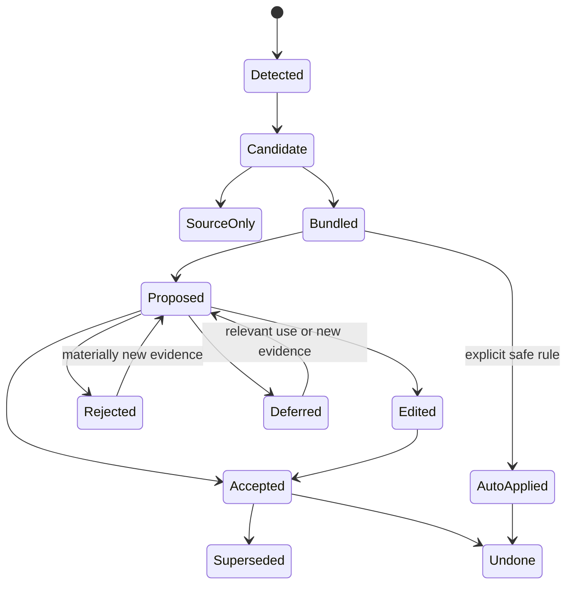

# AI-native 个人知识库

## 交互架构与设计系统规格 v1.0

> **权威状态（2026-08-10）：MIGRATION_QUEUE，当前非规范。Shared Shell、selection 与设计 token 可候选迁移；旧 Home / Atlas / Places、14 resources 与 25 + 11 types 不得指导新设计。**  
> 日期：2026-08-05  
> 最近修订：2026-08-10（同步 Question Knowledge 求解生命周期、Knowledge-level 25-type registry、跨对象语义，以及群级关系与 lifecycle）  
> 文档性质：产品交互架构、状态与设计系统定义；不是视觉概念图，也不是原型  
> 当前 Canonical：`AI-native-个人知识库-终局产品设计文档-v6.0.md`；v5.0 只是本规格的历史形成来源，本文完成迁移前不得作为现行交互规格  
> 2026-08-07 写入冻结：用户直接写入经安全 Direct Edit Commit 更新当前知识；Edit Buffer、Recovery Checkpoint、Explicit Draft、Proposal、Sync 与 Projection 分开，普通路径没有 Working-first / 完成并采用  
> 2026-08-08 Group Formation 冻结：Blank、Knowledge selection、Source bundle、Topic promotion、View / Search snapshot 与 imported hierarchy 最终创建同一种 Group；Blank 只需名称，其他路径按影响预览；AI cluster 只产生可拒绝的 Group Candidate，future View matches 不继承 membership  
> 2026-08-08 Library Entry 冻结：普通启动、新窗口与 unsafe restore 均保留 Stable Library catalog 主权；最多一条 Resume 等待显式`继续`，不自动恢复 deep Reading；普通 Group open 进入 canonical Overview  
> 2026-08-08 Topic Opening 冻结：Topic disclosure / Focus / Inspect / Open 与 direct Knowledge open 分权；Open Topic 进入同一 Topic Reading 顶部的局部开场，Bare / Compact / Editorial 不形成三套页面  
> 2026-08-08 Relation Presentation 冻结：普通阅读 Quiet；explicit Inspect 进入 Peek；explicit Show Relations 打开唯一 Companion；explicit Explore 才让 Relation Space 成为 Primary。Presentation 与 Radius 正交，ordinary open 不恢复关系面  
> 2026-08-09 First-value 冻结：Empty Library 的写、建群、加资料、迁入与提问五种起点使用真实终局对象；`写第一条知识`拥有最低交互成本；Empty Bare Group 使用一个首要动作 + 两个安静替代；Empty Group、Question retained、Current Knowledge 与 Source-only 的成功语义分开；Relation 不是首日门槛  
> 2026-08-09 Scale Invariance 冻结：F1 / F10 / F100 / F10K 共享同一 Shell、Library、Reading、Network 与 Ask；Catalog 始终穷尽，Recent 只作次级 View；Network 超预算先呈现 Scope Summary + List Equivalent 并要求 Anchor，不创建大库模式、自动 Group regions 或 degree / AI Top N  
> 2026-08-09 Group State 冻结：旧互斥 `formation_phase` 失效；Orientation、Change、Attention、Lifecycle 与 Boundary continuity 正交，同一 Group 可以同时 Oriented、review_due、Paused 与 Current。所有组合使用同一 shell，P0 最多一条事实说明。完整合同见`AI-native-个人知识库-知识群状态演化与身份连续性合同-v1.0.md`  
> 2026-08-10 Relation Lifecycle 冻结：RelationCandidate 与 Relation 分离；Inspector / Editor / Graph / List 使用 assertion disposition、change condition、Evidence / Challenge、time 与 lifecycle；Split / Merge 产生逐边 Transition，不静默 retarget。完整合同见`AI-native-个人知识库-关系陈述生命周期与网络可信性合同-v1.0.md`  
> 2026-08-10 Group Relation Aggregation 冻结：多个 raw paths 先成为 Signal；Candidate Inspector 必须解释 Effective Support Unit collapse、Boundary coverage、type-specific gates、CounterSignals、removal result 与 eligibility / prominence 分离。完整合同见`AI-native-个人知识库-群级关系聚合门槛与支撑充分性合同-v1.0.md`  
> 2026-08-10 Group Relation Type Registry 冻结：群关系使用十一种互斥优先的正式类型、版本化定义与意图优先选择；`shares_core_knowledge_with`降为 Shared Knowledge observation，`influences`是高级兜底。视觉以关系家族、方向、standing 与完整标签组织，禁止为十一种类型各造一种颜色。完整合同见`AI-native-个人知识库-群级关系类型注册表与语义互斥合同-v1.0.md`  
> 2026-08-10 Group Pair Comparison 冻结：显式 Compare 打开临时 pair Workspace State；Current / Shared / Paths / Suggested / History 使用同一 snapshot，交换左右不反转 direction，Graph / List / mobile 同义，Close / Back 恢复 exact origin。完整合同见`AI-native-个人知识库-知识群对照与关系检查器合同-v1.0.md`  
> 2026-08-10 Knowledge Relation Type Registry 冻结：Knowledge Relation 使用二十五种精确类型、五个 intent / visual families 与独立 `knowledge.*` definition revisions；Editor 不展示二十五项菜单，Graph 不使用二十五种颜色；Evidence / Answer support、identity transition、Question state 与 disposition 不画成 ordinary relation edge。完整合同见`AI-native-个人知识库-知识关系类型注册表与跨层语义合同-v1.0.md`  
> 2026-08-10 Question Resolution 冻结：Question Workspace 读取同一 Knowledge Paper；Resolution Inspector 固定 criteria、Applicability、exact basis revisions 与 remaining unknowns；resolution / pursuit / change / library 四轴正交。保存 Answer、形成 Knowledge、链接依据、采纳、停止、重开与 successor 分别提交。完整合同见`AI-native-个人知识库-问题知识、未知与求解生命周期合同-v1.0.md`  
> 历史深层模型：`AI-native-个人知识库-产品定义-v3.0.md`  
> 审查输入：`design-audit-ardot/Ardot-设计审查与全量设计蓝图-v1.0.md`  
> 场景验证：`AI-native-个人知识库-场景压力测试与产品修订-v1.0.md`  
> 流程板与状态图：`AI-native-个人知识库-产品流程板与组件状态图-v1.0.md`  
> 完整性修订：`AI-native-个人知识库-完整性审计与产品修订-v1.1.md`  
> 产品语言：`AI-native-个人知识库-产品语言与渐进披露规范-v1.0.md`  
> 核心体验：`AI-native-个人知识库-核心体验与知识群生命周期-v1.0.md`  
> 知识深度与关系：`AI-native-个人知识库-知识深度与关系探索合同-v1.0.md`  
> 关系陈述生命周期与网络可信性：`AI-native-个人知识库-关系陈述生命周期与网络可信性合同-v1.0.md`  
> 知识形成与维护：`AI-native-个人知识库-知识形成与维护循环-v1.0.md`  
> 知识群边界与跨群架构：`AI-native-个人知识库-知识群边界与跨群架构合同-v1.0.md`  
> 知识节点粒度与内容组成：`AI-native-个人知识库-知识节点粒度与内容组成合同-v1.0.md`  
> Overview 形成编辑与更新：`AI-native-个人知识库-Overview形成编辑与更新合同-v1.0.md`  
> AI 查询与知识回答：`AI-native-个人知识库-AI查询与知识回答合同-v1.0.md`  
> 搜索定位与知识找回：`AI-native-个人知识库-搜索定位与知识找回合同-v1.0.md`  
> Library 浏览与动态视图：`AI-native-个人知识库-Library浏览与动态视图合同-v1.0.md`  
> 来源、证据与可追溯性：`AI-native-个人知识库-来源证据与可追溯性合同-v1.0.md`  
> 直接创作、编辑与版本历史：`AI-native-个人知识库-直接创作编辑与版本历史合同-v1.0.md`  
> 核心心智模型：`AI-native-个人知识库-核心心智模型与连续探索合同-v1.0.md`  
> **2026-08-07 表面架构覆写：**旧 `Home / Library / Atlas / Sources` 四 Places 与 `Overview / Contents / Relations / Sources` 四 Roots 不再是有效导航数量。当前组件语义以一个 Knowledge Library 主入口、Groups / Network views、连续 Scope / Knowledge Reading、Structure controls、R0–R3 Relation Companion 和 supporting utilities 为准。本文关于 Shell、Primary / Companion / Rail、Focus / Inspect / Open、Return Envelope、状态与 design tokens 的规则继续有效；后文旧 PlaceNav / GroupRootSwitcher 规格分别映射为 LibraryNav / ContextControls，冲突的数量与顺序要求不再约束设计。
> 属性、Facet 与适用条件：`AI-native-个人知识库-属性Facet与适用条件合同-v1.0.md`  
> 产品对象层级与身份治理：`AI-native-个人知识库-产品对象层级与身份治理合同-v1.0.md`  
> 产品表面架构与完整设计证明：`AI-native-个人知识库-产品表面架构与完整设计证明合同-v1.0.md`  
> 地点编排与跨地点连续性：`AI-native-个人知识库-地点编排信息归属与跨地点连续性合同-v1.0.md`  
> 知识群工作区与双镜连续性：`AI-native-个人知识库-知识群工作区与双镜连续性合同-v1.0.md`  
> 核心导航与复杂度收敛：`AI-native-个人知识库-核心导航与复杂度收敛合同-v1.0.md`  
> 视觉约束：保留温暖阅读空间与深色关系空间的双重气质，但真实产品结构不得由整图或星云素材代替

---

# 0. 执行决定

## 0.1 这份规格解决什么

此前文档已经定义了 Knowledge Group、Knowledge Node、Relation、Overview、Source 和 L0–L5 Semantic Zoom，但尚未把它们组织为同一套可操作产品。

当前设计稿的问题不是“页面少”，而是缺少统一交互语法。本规格冻结二十三个基础决定：

1. **产品只有一个稳定 App Shell。** 所有知识工作在同一空间里发生。
2. **产品只有一个共享 Selection State。** 层级、正文、图谱、AI 回答和来源始终围绕同一焦点同步。
3. **L0–L5 是六种语义表达，不是六张彼此断裂的页面。** 深入时内容密度和操作改变，但上下文连续。
4. **阅读镜头与关系镜头是同一知识的两种视图。** 用户可以调整视觉权重，但不能产生两套互相矛盾的选择状态。
5. **内部模型与用户语言分层。** 十四类主要产品资源由五个日常核心名词承载，Supporting / Embedded / Derived / Workspace 记录默认通过 owner 与动作后果出现。
6. **知识群拥有长期连续 identity 与正交状态配置。** Orientation 只改变同一 Overview 的信息权重；Change、Attention、Lifecycle 与 Boundary continuity 各自回答一个问题，不形成评分、等级或五套页面。
7. **范围、阅读深度与关系半径彼此独立。** 五类连接具有不同语义，AI 的检索路径不会自动升级为正式知识关系。
8. **来源、用户 Current Knowledge、显式 Draft / conflict、提案保持不同落点。** Placement / 未归类状态独立表达；Capture 先保护真实输入，Proposal 围绕少量决定组织，Knowledge Decision 只在真正需要用户判断时按上下文出现，不成为 AI 卡片收件箱。
9. **结构只有一份可重建真相。** 产品不设 Subgroup；Group membership 由 Placement 推导，Topic 只保存直接父级，群级变换保留 Gateway、redirect 与历史。
10. **Node 只有一份连续正文真相。** Block 是写作单元、Anchor 是定位机制；D0–D2 从同一 Content Revision 投影，Search、Ask 与 Evidence 以 Node + Anchor 精确进入。
11. **Overview 只有一份 current editorial truth。** 动态 Structure / Change 由 Projection 刷新，用户认可的整体解释通过直接编辑 commit 或 reviewed Diff 演化；两者以 Support Map 连接而不互相冒充。
12. **Ask 只有一套可核验运行语义。** Quick Ask 与 Full Answer 共享 Query Turn / Run、Requested / Effective / Used Context 和 Claim Support；追问、保存与重评不会形成第二知识库。
13. **Search 只有一套对象定位语义。** Global、Scoped、Find、Picker 与 Saved Search 共用 identity / anchor / coverage，不让 chunk、相似度或动态结果制造第二对象系统。
14. **Library 只有一套稳定目录语义。** 全部知识按 identity 去重，群内层级按 Placement 显示；View 只保存规则而不拥有成员，Pin、Recent、临时排序与布局都不改变知识身份、权威或正式结构。
15. **来源与证据只有一套可追溯语义。** Source identity、Revision 与 Representation 分开；Fragment 保存可定位片段，Binding 保存其对具体 Claim 的作用，Annotation 不自动成为 Evidence，来源变化只产生影响与修复状态而不静默改写知识。
16. **直接创作只有一套可恢复写入语义。** Object Lifecycle、Current Revision、Edit Buffer / Recovery、Explicit Draft / Proposal、Sync / Projection 与 Edit Session 分开；普通写作经安全 Direct Edit Commit 更新 current，历史恢复向前生成新版本，并发不使用不可见 last-write-wins。
17. **结构化知识只有一套可演化语义。** Property Definition、Assertion、Profile、Applicability 与 Migration 分开；属性按需帮助比较和找回，不成为写作门槛、任意数据库或正式关系的替身。
18. **深模型只有一套对象层级语义。** stable ID 不等于 Primary Resource；Knowledge、Source、Structure、History、Definition、Projection / Workspace 六平面分开；Search、Deep Link、Delete、Export 和 AI 都先判断 owner 与 Truth Role。
19. **产品只有一套表面架构语义。** Knowledge Library 是唯一长期主地点，`知识群 / Knowledge Network`是同一 Library 的视图；Scope Reading 承载当前范围；Lenses 只改变看法；Overlays / Inspectors 暂时查找或核验；Source / History / Decision / Recovery Surfaces 承载按需支撑任务，所有跨表面动作通过 Return Envelope 恢复现场。
20. **产品只有一套 Library 编排语义。** Active Library Surface、Surface Owner、Entry Context 与 Selection 分开；Resume 是 Library 内的区域；每个 event 只有一个 Primary Destination；Capture、deep link、多窗口和 scoped Lens 使用统一 receipt、handoff 与 Surface State 恢复。
21. **产品只有一套连续知识阅读语义。** Group、Topic、Knowledge 共用一个 reading shell；Overview、Structure、Relations、Sources 是四类责任而非四个同权 Roots；Change / History / Decision 由对象影响触发；Focus / Inspect / Open / Compare 控制联动，一个 Primary + 一个按需 Companion + Rail 控制层级阅读与关系空间的主次。
22. **产品只有一套关系呈现语义。** Quiet → Peek → Companion → Explore 控制关系占用的注意力，R0–R3 控制关系半径；ordinary open 保持 Quiet，Companion 只 follow explicit Open，Explore 必须显式进入，Resume 才可恢复安全 scene。
23. **产品只有一套规模语义。** F1 / F10 / F100 / F10K 只是设计夹具；数量跨档不改变 Shell、目录顺序、Scope / Depth / Radius、Open / Return 或对象身份。大规模只增加焦点、渐进披露、Coverage 与性能状态，不增加首页、容器或 AI 核心排序。

## 0.2 交互一句话

> **用户始终知道自己正在看哪一部分知识、处于多深、答案依据什么，以及下一步可以向下深入还是沿关系横向探索。**

## 0.3 设计北极星

任何核心交互都必须同时维持三种连续性：

- **空间连续性**：我在知识世界的哪里；
- **认识连续性**：我现在理解到什么深度；
- **证据连续性**：这条知识从哪里来、当前是否可靠。

如果一个设计提高了视觉冲击但破坏其中任何一种连续性，应当被拒绝。

## 0.4 产品语言北极星

中文界面默认只要求用户理解：**知识群、主题、知识、关系、来源**。

文档继续使用 Node、Placement、canonical、Applicability、Query Context、Snapshot 与 Change Set 精确定义系统；实际界面使用“知识”“出现位置”“修改所有位置”“适用范围”“本次回答范围”“回答时的知识版本”“本次更改”。

每个核心 Frame 必须标明 P0 Calm、P1 Focused、P2 Decision 或 P3 Forensic。默认阅读不提前暴露编辑影响、状态枚举或诊断字段；高风险动作也不能因为表面简洁而隐藏后果。

---

# 1. 用户的五种工作模式

产品不以页面名称组织心智，而以五种用户意图组织。

## 1.1 Orient / 定位

用户问题：

- 我有哪些知识；
- 这个知识群整体是什么；
- 最近哪些地方发生了变化；
- 我上次探索到了哪里。

主要表面：Home、Library、Atlas、Group Overview。

## 1.2 Explore / 探索

用户问题：

- 这个主题由哪些部分组成；
- 它还与什么有关；
- 这条关系为什么存在；
- 还有哪些值得继续看的路径。

主要表面：Topic Structure、Group Map、Local Graph、Saved Path。

## 1.3 Ask / 查询

用户问题：

- 我的知识库对这个问题知道什么；
- 哪些群、节点和来源共同支持答案；
- 是否存在冲突或缺口；
- 我能否从答案继续进入知识。

主要表面：Scoped Ask、Answer Workspace、Knowledge Route、Evidence。

## 1.4 Create & Organize / 创作与组织

用户问题：

- 我能否直接写一个知识节点，而不先导入资料；
- 我是在编辑全局 Node，还是当前 Group 中的语境说明；
- 如何建立 Topic、Placement 与正式 Relation；
- 如何让人工 Overview 与 AI 建议共存。

主要表面：Group / Topic Authoring、Node Editor、Placement Manager、Relation Editor、Overview Editor。

## 1.5 Maintain / 维护

用户问题：

- 新资料如何进入；
- AI 提出的知识是否正确；
- 新证据改变了什么；
- 重复、冲突和过时知识如何处理；
- 如何归档、删除、恢复、迁入和带走知识。

主要表面：Capture、Knowledge Proposal、按需 Knowledge Decision、Overview Diff、Source Reader、对象 History / Impact、Trash、Storage & Backup。

这五种模式不是五个相互隔离的应用。用户可从任何模式进入另一模式，并保留当前 Selection State。

---

# 2. 信息架构重新收敛

## 2.1 一级导航 [产品决策]

经过产品定义、设计审查与复杂度复核，一级入口收敛为四个：

1. **Home / 首页**：知识空间的整体入口、最近焦点与重要变化；
2. **Library / 知识库**：按知识群和层级稳定浏览；
3. **Atlas / 图谱**：按知识群与关系空间浏览；
4. **Sources / 来源**：原始材料、同步、解析和版本。

以下不是一级导航：

- **Ask** 是全局动作，可在任何范围调用；
- **Search** 是全局动作，可在任何范围定位对象；
- **Capture** 是全局动作，可在任何范围添加材料；
- **Explore** 是贯穿 Library 与 Atlas 的交互模式，而不是另一个目的地。
- **需要你判断 / Knowledge Decision** 是由冲突、合并、重要更新或结构变化触发的上下文工作区；完成或暂缓后回到触发它的知识、来源或历史，不常驻一级导航。

这样减少了“我该进入 Atlas 还是 Explore”“我该进入 Knowledge 还是 Search”的导航歧义。

## 2.2 左侧导航结构

```text
Knowledge Space Header
  Space name（默认唯一）
  Space status

Primary
  Home
  Library
  Atlas
  Sources

Pinned Knowledge Groups
  AI Agent 产品设计
  长期记忆系统
  认知科学

Recent
  最近打开的 Node / Path

Bottom
  Sync status
  Settings
  Trash
```

默认不显示 Space Switcher。只有用户主动创建了用于硬隔离的额外 Vault / Space 后，Header 才出现切换入口；它不能与 Group Switcher 混为一谈。

左侧导航默认 232–264px；可折叠为 56–64px 图标轨。折叠后 Pinned 与 Recent 移入切换浮层，不允许被完全隐藏。

## 2.3 顶部全局栏

顶栏从左到右：

```text
Back / Forward
DepthTrail / 当前路径
Flexible space
Search
Ask
Capture
System status
```

以上英文是规格名；中文产品中的默认标签为“搜索”“提问”“添加”。“添加”打开添加来源、写下知识与导入旧知识库三条入口，不要求用户理解 Capture。

顶栏高度建议 56–64px。DepthTrail 是导航核心，不应被长标题挤没。

## 2.4 Context Rail

右侧 Context Rail 不是固定信息堆。它根据当前对象提供最多五个页签：

- **Relations**：关键关系与 Local Graph；
- **Evidence**：证据片段、来源和引用；
- **Placements**：当前节点在其他群和层级路径的位置；
- **Suggestions**：AI 建议、冲突和更新；
- **History**：版本、纠正和探索历史。

规则：

- 默认只打开与当前任务最相关的页签；
- Rail 可以关闭，但重要冲突不能因此消失，只降为可见状态标记；
- Rail 宽度 320–420px，可调节；
- 宽度不足时 Rail 变为右侧覆盖层，不把正文压缩到不可读。

## 2.5 Home 与 Library 的区别

| 表面 | 回答 | 不承担 |
|---|---|---|
| Home | 我现在最值得进入哪里 | 完整知识目录、所有来源和所有变化 |
| Library | 我稳定拥有哪套知识结构 | 推荐 feed、AI 总结瀑布流 |
| Atlas | 我的知识群如何相连 | 长文阅读、全部节点编辑 |

---

# 3. App Shell 规格

## 3.1 桌面布局

以 1440×900 以上为主设计视口：

```text
┌─────────────┬────────────────────────────────────────────┐
│             │ Global Bar                                 │
│ Left Nav    ├───────────────────────────┬────────────────┤
│             │ Main Workspace            │ Context Rail   │
│             │                           │                │
│             │                           │                │
└─────────────┴───────────────────────────┴────────────────┘
```

宽度分配不是固定比例：

- Left Nav：56px 折叠 / 248px 展开；
- Main Workspace：最小 640px，优先获得剩余空间；
- Context Rail：320–420px；
- 阅读正文有效行宽：640–760px；
- 关系图可扩展到整个 Main Workspace。

## 3.2 三种工作区布局

### Reading Dominant

- 阅读区占主导；
- 关系显示在 Context Rail；
- 适合 Overview、Node 和 Deep Detail。

### Balanced Dual Lens

- 阅读与关系各占约一半；
- 两者共享当前选择；
- 适合 Topic Structure、复杂关系与 Ask 结果。

### Map Dominant

- 图谱占 Main Workspace；
- 选中对象的摘要进入 Context Rail；
- 适合 Atlas、Group Map 和路径探索。

用户切换布局不改变当前对象、深度、查询或阅读位置。

## 3.3 系统状态位置

全局状态只在顶栏右侧显示一个综合入口：

- Synced；
- Indexing；
- Offline；
- AI unavailable；
- Source permission lost；
- Attention required。

状态影响当前任务时，使用页面内 Status Banner 解释；不能只改变一个小图标。

## 3.4 响应式原则

本规格优先桌面，但不允许将桌面布局缩小成移动端：

- 1200px 以下：Left Nav 默认折叠，Rail 为覆盖层；
- 900px 以下：双镜变为可切换单镜，保留 Selection State；
- 移动端：以捕获、阅读、Ask 和轻量确认优先，不尝试完整展示大图谱；
- 所有核心流程在 200% zoom 下仍可完成。

---

# 4. Selection State

## 4.1 唯一状态模型

```text
SelectionState
  space_id
  group_id
  hierarchy_path[]
  topic_id?
  node_id?
  detail_anchor?: ContentAnchor
  relation_id?
  evidence_fragment_id?
  source_id?
  scope_level
  reading_depth
  relation_radius
  view_mode
  query_session_id?
  query_context?
  highlighted_path[]
  return_stack[]
  reading_position?
```

## 4.2 状态责任

| 字段 | 谁可以改变 | 改变后必须同步 |
|---|---|---|
| group_id | Home、Library、Atlas、Switcher | DepthTrail、Workspace、Rail、Ask Scope |
| hierarchy_path | Tree、Breadcrumb、Overview | Map 聚焦、返回栈 |
| node_id | Tree、Map、Search、Answer | 正文、Local Graph、Evidence |
| detail_anchor | Search、Answer、Reference、Evidence、Deep link | 正文位置、引用高亮、Evidence target、返回位置 |
| relation_id | Map、Relation list | 两端节点、关系说明、证据 |
| scope_level | 进入 Group / Topic / Node、Up、深链接 | DepthTrail、当前 Scope、Ask 默认范围 |
| reading_depth | 展开解释、打开 / 关闭 Evidence | 正文密度、Outline、Evidence Rail、返回 anchor |
| relation_radius | Show neighbours、Open Path、Atlas、图 / 列表切换 | Relation Lens、可见边集合、过滤、图布局 |
| query_context | Ask Composer、历史时间切换、状态与来源策略 | 检索范围、适用条件、回答标签、图谱高亮、Evidence 过滤 |
| highlighted_path | Answer、Saved Path、Explore | Map、Tree、相关节点 |

## 4.3 返回行为

产品区分三种返回：

- **Back**：返回上一个用户焦点，包括视图和阅读位置；
- **Up**：返回当前层级的父级；
- **Close Detail**：关闭 Rail 或 Detail，但不离开当前群与节点。

不能用同一个“返回”同时承担这三件事。

## 4.4 深链接

每个稳定对象都可生成深链接；Node 内部还可生成随 Node 一起解析的精确 Anchor 链接：

- Group；
- Topic placement；
- Node；
- Relation；
- Evidence Fragment；
- Saved Path；
- Query Result（若被保存）。
- Node + Content Anchor（不产生新的知识对象）。

深链接恢复完整 Selection State，而不仅打开某篇正文。Anchor 按 `block_id + revision + quote context + position hint` 解析；失配时显示 redirected、ambiguous 或 orphaned，不静默跳到错误段落。

## 4.5 多路径节点

当一个 Node 出现在多个群：

- 打开时保留进入它的当前路径；
- Placements 显示其他路径；
- 切换路径改变 contextual summary 和邻接结构；
- canonical content 和版本保持相同；
- 用户可固定默认路径，但系统不得丢失其他路径。

---

# 5. L0–L5 Semantic Zoom 规格

## 5.1 L0 — Knowledge Atlas

### 用户目标

理解自己拥有哪些知识群，以及少量最重要的群关系。

### 主视图

- 6–20 个当前可见 Knowledge Group；
- 群以稳定区域或大节点表达；
- 只显示高价值、已确认或当前查询相关的群关系；
- 新形成、未连接和存在冲突的群有不同状态；
- 允许按 Domain、Activity、Recency、Pinned 过滤。

### Group 表现

每个群显示：

- 名称；
- 一句边界；
- 3–5 个代表主题；
- 最近更新时间；
- 只有影响当前进入选择时才显示一句人话状态，例如“正在形成”或“有重要变化”；
- 进入动作。

不默认显示节点数量、来源数量和置信度百分比，除非它们支持当前判断。

### 主动作

- 进入 Group；
- 在 Group 中 Ask；
- 查看群关系；
- 固定 / 隐藏。

### 禁止

- 显示全部 Node；
- 通过随机位置和星云装饰制造“复杂感”；
- 只靠缩小字号容纳更多内容；
- 将向量相似度直接画成正式关系。

### 异常态

- 0 个群：引导添加来源或创建群；
- 1 个群：不伪造网络，直接提供 Group Overview；
- 100+ 群：All Groups 仍穷尽；Network 先显示 Scope Summary、hidden counts 与 List Equivalent，并要求 Group、Search、Facet、Saved View 或 Path Anchor；
- Large Graph：保留已选路径，隐藏非相关边；不按 degree / recency / AI relevance 截 Top N，不把自动 cluster 固化成 Group regions。

## 5.2 L1 — Group Overview

### 用户目标

在不阅读全部内容前理解一个知识群的整体。

### 页面结构

```text
Group Header
  Title
  Boundary sentence
  Overview alignment / primary state
  Group actions: Ask (secondary / contextual, never the permanent dominant CTA)
  View switcher

Orientation
  Editorial Blocks
  Boundary / Status projection

Structure
  Topic projection
  Representative Node references
  Navigation Blocks

Synthesis
  Editorial Synthesis
  Node / Relation Support
  Conflict / Unknown / Change projections

Related Groups
Sources coverage
```

Orientation、Structure、Synthesis 是同一 Overview Content Revision 的阅读语义区，不是三份存储字段或三张固定卡。Editorial prose 使用 revision；Projection 保存规则并按 canonical objects 刷新；Reference 明确 Link / Live / Pinned / Quote；Navigation 不创建 Placement 或 Relation。

### 主动作

- 进入 Topic；
- Ask 当前群；
- 切到 Map；
- 查看变化；
- 编辑 Overview。

### 关键状态

- Overview aligned；
- changes available；
- review due；
- knowingly diverged；
- Coverage thin；
- Conflict present；
- Group forming；
- content / structure locked；
- Projection incomplete；
- Support missing。

## 5.3 L2 — Topic Structure

### 用户目标

理解知识群由哪些主题和子主题构成，并选择深入方向。

### 双重表达

- Hierarchy Lens：主题树、排序、展开与代表节点；
- Map Lens：主题区域、桥接节点、跨主题关系。

两者必须同时表达：

- 当前 Topic；
- 父级与同级；
- 子主题；
- 代表 Node；
- 跨群出口；
- 该主题的知识缺口。

### 主动作

- 展开主题；
- 打开 Node；
- 在主题内 Ask；
- 比较两个主题；
- 保存探索 Path。

### Topic 不等于文件夹

Topic 是 Group 内具有稳定身份、顺序、局部 Overview 和修订历史的结构对象；Placement 是 Topic 指向 canonical Node 的当前语境位置。

- Topic 只属于一个 Group，并且只保存一个直接父级；children、ancestors 与 DepthTrail 由系统推导；
- Topic 不采用多父 DAG；同一知识的多重语境由多个 Placements、Reference、Saved Path 或正式 Relation 表达；
- 一个 Node 可出现在多个 Topic；
- 移除 Placement 不删除 canonical Node；
- 删除 Topic 只移除该分支结构，不静默删除其中 Nodes；
- Topic 改名、移动、拆分或合并后保留旧路径重定向；
- Topic Overview 只解释当前分支，不复制 Group Overview；
- Topic 同时形成独立边界、独立使用意图与独立结构时，可以建议提升为 Group；内容数量不能单独触发；
- 提升后原 Topic 成为“已成为独立知识群”的 Gateway，保留旧路径并进入新 Group，不复制 Node 正文。

在 L2，选择 Topic 时主区显示其 Orientation、Structure、代表 Nodes 与知识缺口；Hierarchy Lens 与 Map Lens 同步聚焦该 Topic。

## 5.4 L3 — Knowledge Node

L3、L4 与 Node 内部大纲使用同一 accepted Content Revision。L3 不是另存的一张摘要卡：它从 semantic roles 投影 Identity、Orientation 与核心理解；继续阅读只是展开同一 Knowledge Paper，而不是切换到另一份“详细正文”。

### 用户目标

理解一个可复用知识单元，并知道它在当前群里的意义。

### 页面结构

```text
Identity
  Type / Current placement / Title
Orientation
  Concise definition or current conclusion
Core Understanding
  Contextual Summary / Explanation / Key points
Conditions & Limits
  Applicability / Exceptions / Conflict / Freshness
Connections
  Formal Relations / Reference Links / Other placements
Evidence & History
  Evidence Preview / Origin / Versions / Changes
```

默认展开 Identity、Orientation 与 Core Understanding。Conditions & Limits 在影响判断时提高优先级；Connections 根据当前任务显示；Evidence & History 一跳可达。Concept、Claim、Method、Decision、Question、Principle、Entity、Event 与 Example 使用相同六段语义，但 D2 正文结构按类型适配，不渲染空模板区块。

### 主动作

- 深入 Detail；
- 打开 Relation；
- 查看 Evidence；
- Ask 当前 Node；
- 编辑、纠正或固定；
- 在另一个 Group placement 中查看。

### Node、Revision 与编辑状态

Node identity、Current Revision、Buffer / Recovery / Draft / Proposal 与知识质量回答不同问题，必须按正交轴表达：

```text
object_lifecycle: active | archived | trashed | tombstoned
identity_standing: canonical | redirected | merged | split_lineage
current_revision_ref?: RevisionRef
buffer_state: clean | dirty | composing | save_failed
recovery_state: unprotected | protected | recovery_failed
draft_state: none | explicit | conflict | recovery
proposal_state: none | proposed | partially_applied | stale | rejected
sync_state: local_current | sync_queued | synced | conflicted
projection_state: current | updating | partial | failed
epistemic: supported | evidence_limited | contested | unknown
freshness: current | review_due | stale
availability: available | source_degraded | source_unavailable
```

`Current` 不再是 Node lifecycle 值，而是 current pointer 指向的一份不可变 Revision。普通用户直接编辑在 composition 结束并到达安全边界后推进 Current；一个 active Node 仍可同时拥有 Current Revision 7、dirty Buffer / Recovery、Explicit Draft / conflict、待处理 AI Proposal、sync queued、projection updating、`review_due` 与 `source_degraded`。界面不把这些轴平铺成徽章墙：普通编辑按需表达“正在修改 / 近期修改已在本机保护 / 已更新当前知识”“等待同步 / 已同步”“索引正在更新”；只有 Draft / Conflict 存在时才表达“草稿不用于默认回答 / 有冲突待合并”。阅读面默认只用一句人话解释当前最重要影响。完整状态在 Status Detail 中展开，且必须通过文字和图标表达，不能只靠颜色。

## 5.5 L4 — Deep Detail

### 用户目标

理解机制、论证、条件、例子、限制和对照。

### 内容结构

- Mechanism / Why；
- Steps / How；
- Conditions / When；
- Examples；
- Counterexamples；
- Limitations；
- Comparison；
- Open questions。

### 交互原则

- 保持正文连续阅读；
- Block handle、稳定 ID 与结构边界默认隐藏，只在编辑、引用、Evidence 核验或“成为独立知识”时出现；
- 关系与证据进入 Rail，不把正文切碎成卡片墙；
- 选中一段文字可查看其 Anchor、引用与关联 Node，并可把完整 Section 提升为独立 Node；
- 长内容有可折叠大纲，但不默认全部折叠；
- Ask 可以限定选中段落；回答中的引用返回同一 Node + Anchor + Placement；
- 阅读位置记录 Anchor 与邻近上下文，不只记录易漂移的像素或字符 offset。

## 5.6 L5 — Evidence

### 用户目标

核验知识的原始依据与上下文。

### Source Reader

- 原始页面、段落、时间戳或媒体位置；
- 引用高亮；
- 上下文前后段；
- 来源元数据与版本；
- 该片段支持 / 反驳 / 限定哪些 Node；
- OCR、转写、翻译与原文明确区分。

### 主动作

- 回到 Node；
- 展开上下文；
- 查看来源版本；
- 创建新的 Node / Relation；
- 标记引用错误；
- 在来源内搜索。

### 关键状态

- Source available；
- Permission lost；
- Source changed；
- Exact location unavailable；
- OCR uncertain；
- Deleted source with retained citation metadata。

## 5.7 深度转场

### 进入更深

- 点击对象，而不是依赖滚轮；
- 地图可用几何缩放辅助，但对象点击决定语义层级；
- DepthTrail 增加一级；
- Return Stack 记录原视图与位置；
- Context Rail 根据新对象更新。

### 返回更浅

- 保留已访问路径高亮；
- 父级视图恢复滚动或地图位置；
- 已展开层级不重置；
- Query 高亮在用户清除前保留。

## 5.8 Scope、Reading Depth 与 Relation Radius

L0–L5 不再由一个含糊 Zoom 状态承担全部变化：

```text
scope_level: L0 Space | L1 Group | L2 Topic | L3 Node
reading_depth: D0 Orientation | D1 Synthesis | D2 Explanation | D3 Evidence
relation_radius: R0 Hidden/List | R1 Direct | R2 Path | R3 Atlas
```

交互规则：

- 选择 Group、Topic 或 Node 改变 `scope_level`；
- 展开完整解释或打开 Evidence 改变 `reading_depth`；
- Show neighbours、Open Path 或 Atlas 改变 `relation_radius`；
- 滚轮只改变图谱几何比例，不改变以上三个语义状态；
- 三个维度独立写入 Selection State / View State；
- 任一维度变化都不重置其他两维的焦点和位置；
- L4 是当前 Node 的 D2 表达，L5 是 D3 核验，不要求独立数据库对象或固定子页面。

例如，用户可以保持 L3 Node 和 D2 Explanation，只把 R1 Direct 扩展为 R2 Path；DepthTrail 不增加，正文滚动位置不变。

---

# 6. 双镜工作区

## 6.1 双镜的本质

双镜不是两块同权内容并排，而是一个 Primary Task 与一个可选 Companion：

- Reading / Structure Primary 回答“它是什么、怎样组成、细节是什么”；
- Relation Companion 回答“当前对象与什么相连、为什么相连”；
- Map Primary 回答“这个 Group 的网络怎样组成”；
- Reading Preview Companion 为 Map 的 Inspect target 提供足够语境。

两者共享 identity、ReadingPath、Query Context 和 Return Stack，但 selection 后果分为 Focus、Inspect、Open、Compare。任一时刻只有一个 Primary Surface 拥有主标题、主动作与默认快捷键。

## 6.2 同步规则

| 用户行为 | Primary / Reading | Relation / Companion |
|---|---|---|
| Tree disclosure / expand Topic | 不变；只更新 expansion state | 不变 |
| Tree focus Topic | 不变 | 只显示 focus cue |
| Tree Inspect Topic | 不变；显示 Bare / Compact preview | 保持当前 scene，最多显示 inspect highlight |
| Tree Enter / label Open Topic | 显示 Topic Reading 顶部的局部开场；保存 caller / tree state | 按 follow-open 聚焦 Topic 后代的有界投影 |
| Tree Enter / click Knowledge Placement | 直接显示 canonical Knowledge + current Placement | 按 follow-open 显示 Local Graph |
| 在正文 Open Node | 显示 Node | 按 follow-open 显示 Local Graph |
| 在图谱 Inspect Node | 保持正文或显示 Preview | 保留 selected highlight |
| 在图谱 Enter / double-click Open | 切为 Node Reading | 以 Node 为 Local Graph center |
| 在图谱选择 Relation | 显示关系解释 | 高亮两端与路径 |
| 在 Answer 点结论 | 跳到 supporting Node | 高亮 Knowledge Route |
| 在 Evidence 点引用 | 显示 Source Reader | 保留来源到 Node 的 provenance path |

Topic Reading 的局部开场与 direct children 使用同一 scroll surface：Bare 只有身份、路径、真实结构和动作；Compact 加局部 Orientation 与 stable start / structure fallback；Editorial 再加 accepted synthesis、条件 / 分歧与少量出口。密度变化不能重建 Route、丢失 Anchor 或改变 keyboard reading order。

Hit target contract：disclosure control 必须有独立可访问名称`展开/折叠「Topic」`；Topic label / Open action 名称为`打开「Topic」`；Knowledge Placement 明确读出对象类型与当前位置。Single-child Topic 不让同一 control 有时 Open Topic、有时 redirect child。

## 6.3 布局切换

Relation Presentation 先决定关系占用多少注意力：

| State | Trigger | Surface | Durable effects |
|---|---|---|---|
| Quiet | ordinary open / reading / writing | inline Cue only | none |
| Peek | explicit Inspect relation / endpoint | transient Inspector / preview | no Reading Target / ReturnStack / Trail change |
| Companion | explicit `查看相关知识 / 显示关系` | one supporting pane / list / map | follows explicit Open; Pin is Workspace State |
| Explore | explicit `在地图中探索 / 打开知识网络` | Relation Space Primary + Reading Preview | true endpoint Open writes ReturnEnvelope / Trail |

Presentation 与 Radius 分开保存；用户无需看见术语。Quiet / Peek 通常呈现 Reading-dominant，Companion 可形成 Reading-dominant 或 Balanced，Explore 才形成 Map-dominant。Profile 是动作后的结果，不是 ordinary open 前要求用户选择的模式。

规则：

- 切换不触发新导航；
- Presentation / Profile / Radius 都不改变 active context responsibility、Reading Target、Relation truth 或 Ask Context；
- Primary 和 Companion 各有局部 viewport，但共享对象与可解释 Return history；
- Map-dominant 下 Reading Preview 默认 follow-inspect；
- Reading-dominant 下 Local Graph 默认 follow-open；
- Companion 可以 pinned，并必须显示固定 target；
- 默认最多一个 Companion，第三种 context 进入 Rail / overlay / full owner surface；
- Split 允许拖动分隔线，但任一 surface 不小于可用宽度；compact / mobile 自动改为顺序而不删责任。
- ordinary Group / Topic / Knowledge open、Search / Ask open supporting Knowledge 始终进入 Quiet；只有 explicit Continue / Resume 可恢复安全 Companion / Explore；
- hover、Focus、text cursor、selection、scroll、AI proposal、Answer rendering 与 background refresh 最多改变 Cue / highlight，不自动升级 Presentation；
- Relation deep link 默认打开 relation-focused Peek；只有 deep link 明确携带 Map / Network scene 才进入 Explore；
- 0 maintained current relation 不画空图，1 条优先完整 statement / list，2–8 条可用图 / 列表，dense state 初始只保留 4–8 条 current / applicable / task-relevant relations；Candidate 只在显式 Suggested layer，History 只在显式历史语境。

## 6.4 Relation Inspector

选中一条 Relation 后显示：

- 完整 relation statement；
- 类型、canonical direction 与 inverse reading；
- from → to 与 endpoint resolution；
- Applicability、qualifiers、time 与 exceptions；
- 为什么重要；
- 形成依据：用户建立 / 来源表达 / 系统推断 / 带类型导入；
- 当前陈述：maintained / ended / superseded / retracted；
- 变化：no material change / changes available / review due / transition in progress；
- Evidence Bindings / Group Relation Support Set；
- open Challenges；
- lifecycle：current / archived / trash；
- 创建者与时间；
- Maintain、Revise、End、Supersede、Retract、Archive / Restore、Defer 和 History；
- affected Overview、Saved Path、Answer 与 successor。

RelationCandidate 使用独立 Candidate Inspector：展示建议陈述、端点、方向、限定、为什么被建议、basis、重复 / 冲突比较，以及 Adopt / Edit / Dismiss / Defer。被拒绝的是 Candidate，不是正式 Relation。

Candidate Inspector 必须引用与 endpoints 对应的 exact type definition revision：Knowledge↔Knowledge 使用 `KnowledgeRelationTypeDefinitionRevision`，Group↔Group 使用 `GroupRelationTypeDefinitionRevision`。P0 只显示完整关系句与一个“为什么是这种关系”，不能因两层出现同名动词而共用定义。

Knowledge Relation 创建 / 改类型先按`分类与组成 / 解释与因果 / 论证与推导 / 比较与应用 / 时间与演化`五类意图选择；Group Relation 继续按`范围 / 作用 / 协同 / 比较 / 限制 / 演化`六类意图选择。两者都只在第二步显示 3–5 个相邻完整句。`TypeValidationReport`只提出诊断与可选修正，不自动改写 Candidate 或 Current Relation；Registry migration 进入独立 review，不能因定义更新批量静默换类型。

当 Candidate 为 Group↔Group 聚合建议时，Inspector 按以下顺序追加：

1. 两侧 Boundary 中到底哪些核心 / 代表范围被触及；
2. coverage shape：bilateral-core / anchor-and-spread / named-subscope；
3. 去重后的 Effective Support Units，而不是 raw path count；
4. 同一 assertion、Knowledge、Source lineage 与 traversal 被折叠了什么；
5. 哪些信号因 fringe、过期、Applicability 不兼容或类型不合法被排除；
6. CounterSignals、exceptions 与 open Challenges；
7. strongest-unit removal 后仍成立、只适合按需出现，还是应退回 exit-only；
8. 采用后 Current Network、Overview 与 Ask 会发生什么。

P0 使用人话：`它们的核心内容在两个独立方面相连`、`这项建议主要依赖一条核心知识`、`目前只有几条具体路径，还不足以代表两个知识群整体`。`9/9 gates`、unit IDs、origin clusters 与 assessment versions 只进入 P2 / P3。禁止以 confidence 百分比、关系强度、边宽、path count 或绿色通过色取代上述解释。

`related_to` 不能成为默认万能关系。系统无法形成精确类型时，保留 Reference、manual Path step 或 ambiguous Candidate；不得伪装成“稍后再补类型”的 Current edge。

Knowledge-level 旧 `blocks / overlaps_with` 只在 Migration Review 出现：分别检查 `prevents / depends_on` 与 `partially_overlaps_with / identity / taxonomy / composition`。`supersedes / retracts / reopens / uncertain_about`不出现在 Relation Editor 类型选项；它们分别进入 Identity Transition、Disposition、Question Lifecycle 与 Question Target surfaces。

`influences`也不是新的万能关系。只有用户明确说明作用机制、受影响维度以及为何不能使用基础 / 方法 / 应用 / 挑战 / 约束等更窄类型时才可提交；系统不在 resting Network 中主动批量建议它。

从 Relation Inspector、Bundle、Overview、Ask Claim 或 cross-group exit 选择`比较两个知识群`后，进入同一 Pair Comparison：先读两侧 Boundary，再依次读 Current Relations、Shared Knowledge、Paths、Suggestions / Unknown、Evidence 与 History。Compare 只有两个 Groups，一个 Primary 与最多一个 Companion；它不是永久新地点或 N×N 矩阵。交换左右只改变显示顺序；选择 Relation、Inspect、Open endpoint、Ask 与 Back 的后果继续分开。

## 6.5 图谱视觉规则

- 同一层级的 Node 使用同一形状语法；
- 类型通过图标与标签表达，颜色只做辅助；
- 当前选中对象有明确外圈与标题；
- 当前路径比邻接内容更显著；
- Suggested layer 中的 RelationCandidate 使用虚线轮廓和“建议”标签；当前 Relation 的 Evidence、Challenge、review_due、ended / superseded / retracted 原因另行用文字说明；
- Aggregation Signal、fringe-only 与 exit-only 不画成 Candidate edge；它们只在具体 Knowledge path、按需 comparison 或 assessment detail 中出现；
- Shared Knowledge observation 只在“共同知识”Lens、Group pair comparison 或 Relation Inspector 的解释区出现，使用相同 Knowledge identity 的双侧 Placement 标记；它不占用 resting edge budget、不改变节点布局，也没有 Current / Suggested / History standing；
- 关系标签在选中、hover 或路径高亮时出现；
- 节点位置稳定；
- 图谱有 List View；
- 不在缩放后隐藏所有文字，只保留关键标签并提供搜索。

### 五类连接语法

| 连接 | 默认表达 | 主要动作 |
|---|---|---|
| Structural | 层级线 / 区域归属 + 明确“位于” | Open parent / child / placement |
| Evidence | 证据标记 + Binding 作用 / 可核验状态 | Open source context |
| Reference | backlink / 提及分组 | Open mention / Suggest relation |
| Formal Relation | 类型、方向、状态与 Inspector | Open endpoint / Inspect / Edit |
| Retrieval Jump | “本次问题中一起使用” | Inspect reason / Propose relation |

颜色只辅助，不能承担连接类别。只有 Formal Relation 使用完整 Relation Inspector；Retrieval Jump 在退出本次 Answer 后消失。

正式群关系的视觉语法按语义家族收敛，而不是十一种颜色：范围家族、作用家族、比较家族、限制家族、演化家族可以使用有限的线形 / 端点 / 图标差异；精确类型、方向与限定始终由可读标签和 List Equivalent 承担。`complements`与`contrasts_with`虽为对称关系，仍要用不同完整句说明“共同完成”与“并列差异”；`challenges`必须显示挑战方向和被削弱的对象；`evolved_from`显示 direct / indirect，间接沿革默认作为路径或历史而非伪装为直接邻接。

正式 Knowledge Relation 同样只使用五个 family tokens：分类与组成、解释与因果、论证与推导、比较与应用、时间与演化。它们可以借有限的 icon / endpoint cue 帮助扫读，但二十五种精确类型不能获得二十五种颜色、线型或动画。`supports` 的 semantic edge、Evidence connector 与 Answer ClaimSupport connector 必须使用不同连接类别语法；`applies_to`与`implements`至少通过完整动词句明确“可能适用 / 已实际落实”，不能靠实线 / 虚线暗示采用。

### 起始显示预算

- Atlas resting：只保留固定、基础性与高解释价值群关系；
- Selected Group：重点约 3–7 条直接正式关系；
- Group Map：主要 Topics、少量 bridge Nodes、1–3 个跨群出口；
- Local Graph：当前 Node + 约 4–8 个当前任务相关一跳对象；
- Query Route：一条主路径，最多两条真正改变答案的替代分支。

预算只决定初始表达，不限制数据。Show more 必须按关系家族、方向或 Group 展开，而不是一次性显示全部。

当 effective scope 超出预算时，不执行“先画一个看起来重要的子集”。交互顺序固定为：Scope Summary → exhaustive List Equivalent → 选择或恢复 Anchor → selected Group + 约 3–7 个 accepted neighbours → 按 family / direction / standing 展开。Graph 与 List 共用同一 selection、filter、open、Back 与 assistive semantics。

---

# 7. Ask 交互系统

## 7.1 两种 Ask

### Quick Ask

- 从任何位置打开；
- 默认继承当前 Scope；
- 适合定义、定位、简短综合；
- 结果显示在可扩展浮层；
- 用户可以进入 Full Answer Workspace。

### Full Answer Workspace

- 保留 App Shell 与 DepthTrail；
- 主区显示 Direct Answer；
- Relation Lens / Atlas 显示 Knowledge Route；
- Rail 显示 Evidence、Conflict & Unknown；
- 用户可继续沿 Node 或 Relation 探索。

两种 Ask 只是同一回答系统的不同密度。Quick Ask 不是少字段、少证据的“轻版聊天”；它与 Full Answer 共享 Query Turn、Query Run、Context Snapshot、Answer Claim 与 Claim Support。升级到 Full Answer 只展开相同对象，不重新执行或换一套答案。

## 7.2 Ask Composer

```text
Scope chip(s)
Question input
Current selection indicator
Requested context summary
Include / exclude controls
Submit
```

作用域默认规则：

- Home：全部知识；
- Group：当前群；
- Topic：当前分支；
- Node：当前节点 + 直接关系；
- Evidence：当前来源片段；
- 用户可以扩大、缩小或组合 Scope。

`Requested context summary` 默认用“你让我查的范围”显示一句人话，例如：

```text
当前知识 · 仅 Accepted 与 Contested · 当前住所 · 不使用外部知识
```

展开后可以设置：

- As-of / 历史时点；
- Status filter；
- Applicability bindings；
- Source policy；
- External knowledge policy；
- Explicit exclusions。

系统不能要求用户在每次普通提问前填写所有字段。能够从 Selection State 可靠继承的条件自动填充；只有缺少会改变答案的必要条件时，才在提交前或回答开头请求澄清。

Composer 只创建 `Query Turn`；提交后系统为本次执行创建 `Query Run`。原问题始终保留，系统识别到的意图或规范化解释可检查但不替换原文。Retry、Stop 后继续和 Rephrase 创建新 Run；它们不覆盖旧结果。

## 7.3 Requested、Effective 与 Used Context

提交前显示：

- 将查询哪些群；
- 当前焦点与适用对象；
- 使用当前知识还是某个历史时点；
- 包含哪些知识状态；
- 是否包含来源全文；
- 是否允许外部知识；
- 当前排除项。

回答后用 `Actual Context` 分两层显示：

- **系统实际采用**：Scope Anchors、Expansion、As-of、Applicability、状态、来源与外部资料政策；
- **这次真正用到**：实际支撑 Answer Claims 的 Nodes、Anchors、Relations、Evidence、Sources 与外部资料。

Current Focus 只帮助解析指代与返回位置，不自动成为整个知识范围。Scope Anchor 与 Expansion 分开；“当前 Node”默认不能静默扩大到全部 Space。系统如果扩大、排除、降级或遇到索引不完整，提交前说明真正会改变意图的变化，其余在回答头部明确标注。

## 7.4 回答版式

```text
Question + Scope

Direct Answer
  concise answer
  key distinctions

Key Claims
  basis and applicability
  claim-level support

Knowledge Route
  RouteStep[]
    structural connection
    formal relation
    evidence connection
    retrieval jump
    external knowledge

Evidence
  cited fragments

Conflict & Unknown
  contradictory sources
  missing knowledge

Coverage
  sufficient / partial / insufficient / indeterminate

Explore Next
  2–4 paths, not generic follow-up questions

Save
  Saved Answer / Synthesis / Question / Path / Merge / Relation / Overview / Source
```

每个主要 Claim 使用四类清楚声音：`来自你的知识`、`来源原文`、`外部资料`、`基于这些知识可以推断`。引用必须落到 Node + Anchor + revision、Evidence Fragment + Source locator 或 external Source snapshot；页面底部的统一参考列表不能代替 Claim-level support。Citation 多寡和单一 confidence 百分比都不作为可靠性表达。

## 7.5 回答与网络联动

- 全局 Ask：Atlas 高亮使用的群；
- Group Ask：Group Map 高亮 Node 与关系；
- Topic Ask：Hierarchy Tree 展开使用分支；
- Node Ask：Local Graph 高亮邻接；
- Evidence Ask：Source Reader 高亮使用片段。

用户点击 Answer 中的名词时，不只是滚动到正文，而是改变 Selection State 并进入对应知识位置。

忠实度规则：

- 每个主要 Answer Claim 能高亮它使用的 RouteSteps；
- formal relation 显示真实类型、方向与 relation_ref；
- structural connection 只表达 Group / Topic / Placement 路径；
- evidence connection 进入对应 Evidence Fragment；
- retrieval jump 显示“本次问题中一起使用”和具体原因，不进入长期图谱；
- external knowledge 与个人知识分层并保存实际 Source Policy；
- 两个 Nodes 没有正式 Relation 时，分别连接到 Answer Claim，不自动生成 `related_to`；
- 无法形成可靠路径时显示 Used Knowledge List + Evidence，不绘制假 Route。

点击 Answer Claim 时，Reading Path 打开主要 Node + Anchor，Relation Companion 只高亮对应 steps，Evidence Rail 只显示支撑该结论的片段；Back 恢复 Answer 的原结论位置。

Query highlight 是临时 overlay。关闭或清除后，图谱布局、Selection 和正式关系恢复原状态。上一条 AI Answer 默认不成为追问的事实 support；系统重新回到原始 Nodes、Relations 与 Evidence。只有“比较刚才两个回答”这样的元问题才直接使用 Answer Snapshot。

## 7.6 Answer 保存

保存动作不是“Save Chat”。用户选择：

| 保存类型 | 结果 |
|---|---|
| Saved Answer | 保存原问题、Run、Actual Context、Claims、Route、Evidence 与 impact lineage；默认不参与当前事实查询 |
| Synthesis | 创建综合 Knowledge Draft / Proposal Branch，保留 route 与 evidence |
| Question | 创建 Inquiry Node，保留当前回答和缺口 |
| Path | 保存本次探索顺序，不复制 Node |
| Merge into Node | 只对选中 Claims 预览 block-level patch，再合入已有 Node |
| RelationCandidate | 保存一个可核验关系建议，不直接建立正式边；用户补全并提交后才物化 Relation |
| Overview Diff | 建议更新 canonical Overview，不直接覆盖 accepted prose |
| Save Source | 保存本次外部资料及引用快照，不自动接受其中内容 |

保存后不是一份会被后台改写的“活聊天”。Answer Detail 提供：

- **View original**：查看当时正文、Query Context、Knowledge Route 与 Evidence Snapshot；
- **Re-evaluate now**：按当前知识重新回答并显示变化；
- **Pin as historical**：作为当时研究或决策记录；
- **Merge learning**：把稳定理解提交到 Node。

引用的 Node、Decision、Relation 或 Source 发生变化后，保存回答显示影响摘要，但不静默覆盖 original snapshot。`Re-evaluate now` 创建新的 Query Run 与 Answer Snapshot，并以 Claim / support / unknown / coverage / Context diff 与 Original 比较。`inputs changed`、`support unavailable`、`scope changed` 和 `relation changed` 是影响说明，不自动宣判旧答案错误。

整段 Answer 不能一键成为 Current Knowledge。每个进入 Node 或 Relation 的 Claim 都要经过 identity、Applicability、support、冲突和影响检查，默认先形成 Proposal；用户确认后可原子 commit 到 current。

## 7.7 无答案与失败

系统明确区分：

- No relevant knowledge；
- Evidence insufficient；
- Conflicting evidence；
- Scope too narrow；
- Index partial / unavailable；
- Source unavailable；
- AI unavailable；
- Streaming；
- Incomplete；
- Request cancelled；
- Grounding invalid。

每种状态提供不同下一步，不能统一显示“请重试”。负面回答不能写成无边界的“知识库里没有”，而应说明“在当前选择、状态、时间、排除项、来源可用性和已完成索引中没有找到”。AI unavailable 时，Search、阅读、图谱、Evidence、Saved Answers 与直接创作保持可用。

## 7.8 Follow-up 与 Context Delta

追问自然继承上一 Run 的 Effective Context，但任何 Scope、Expansion、As-of、Applicability、状态、来源或 External policy 变化都生成 `Context Delta`。真正改变答案的变化在提交前提示；轻微变化在 Answer header 中可查。用户可以从指定历史 Run Branch，也可以 Rephrase 或 Retry；这些动作的历史关系必须可理解，不能压扁为一条不断改写的聊天记录。

---

# 8. Search 交互系统

## 8.1 Search 的交互承诺

Search 的承诺是找到已经存在的对象或位置，不生成综合答案。默认按知识角色分组：

- `你的知识`：Groups、Topics、Nodes、canonical Overviews；
- `来源`：Sources，Evidence Fragment 只作为 Source locator；
- `保存的回答与路径`：Knowledge Snapshots、Saved Paths；
- `视图`：Saved Search Views；
- `已归档 / 历史版本`：只有用户显式包含时；
- `动作`：只在 Command-capable 入口独立分区。

同一 Node 的多处 Block / Anchor 命中聚合为一个 result；多 Placements 展示一个 identity 与其他位置；同名不同 identity 在打开前通过定义、Group、Applicability 和状态消歧。

## 8.2 Search Surface 与当前模式

- 全局快捷键打开；
- 模式标题明确写 `搜索全部知识`、`在当前知识群搜索`、`在本页查找`、`选择要关联的知识`或`查找动作`；
- Query 输入不因模式切换丢失，但每次改变创建新的 Search Request / Run；
- 支持当前 Scope 与 All Knowledge 显式切换，Scoped no result 不混入全局结果；
- 支持 Best Match、Exact Words 与 Similar Meaning；
- Exact title / Alias / phrase 先于 semantic，recentness 只作 tie-break；
- 输入过程中 Exact / identity results 可先到达，semantic results 后到时不推走当前 Selection。

## 8.3 Scope 与 Coverage Summary

默认 summary 以一句人话说明：

> 搜索“法国租房”里的当前知识与未完成修改；包含所有主题，不包含来源正文、已归档和历史版本。

P1 可切换对象类型、状态、Applicability、Sources 与 revisions；P3 才显示 Index snapshot、OCR / transcription、exclusions 与 last indexed time。当前焦点只帮助恢复位置，不暗中扩大 Scope。

## 8.4 Search Result Row

每项显示：

1. 人话对象类型 + 标题；
2. orientation / definition 或真实命中句；
3. 父 Section 与 Group / Topic / Placement 路径；
4. 状态 / Applicability（相关时）；
5. `标题完全匹配`、`通过别名找到`、`正文包含原句`或`含义相近`等原因；
6. 多 Anchor 命中数量；
7. OCR、Historical 或 Index 限制。

结果不显示裸 relevance 百分比。Semantic 命中没有词面高亮时明确写 `含义相近`，不伪造原文出现了 Query。

## 8.5 Open、Back 与 Refresh

- 打开传递 target identity、matched revision、Anchor、display Placement 与 origin Session；
- 目标页精确定位，短暂 highlight 不写入正文；
- Back 恢复 Query、Scope、filters、mode、排序、result order、scroll、Anchor 展开与 Selection；
- Back 不重新搜索；
- 知识或 Index 变化显示 `刷新结果`，Refresh 创建 successor Run；
- 当前列表不在用户阅读时静默重排。

## 8.6 Search 与 Ask / Explore 转换

当用户输入完整问题时，可以提示“Ask this question”，但不能自动改变模式。反之，Ask 找到明确对象时可提供“Open in Library”。

选择 Search Hits 后转 Ask，只传递 canonical identities、revisions 与 selected Anchors，不把 snippets 或 ranking score 当事实 Context。转 Explore 只打开对象已有 Structure / Relations / Placements；semantic similarity 保持临时 overlay，不生成 formal Relation。

## 8.7 无结果与失败

空状态必须区分：

- 拼写或别名问题；
- 当前 Scope 无结果、全局有结果；
- filters / Archived / Historical 排除；
- Index partial / stale / rebuilding；
- Source 尚未解析、OCR 不确定或格式不支持；
- Semantic unavailable 但 exact 可用；
- Search Run failed / cancelled；
- 本次已完成覆盖内真正无匹配。

主文案限定为 `在本次搜索范围内没有找到匹配`，并说明 Scope、exclusions 与 Coverage。AI / network unavailable 时 local exact、alias、full-text 与 property Search 继续可用。

## 8.8 Find、Picker 与 Commands

- Find 只查当前对象的当前可读 revision；折叠内容可命中，嵌入对象边界可见；Replace 转 Editor；
- Picker 先按 edit contract 限定 target types，Block match 回到父 Node；选择后仍需提交才建 Link / Relation / Placement；
- Commands 与知识结果分区，使用自己的可执行性排序；高影响命令不因一次 Enter 直接执行。

## 8.9 Saved Search View

Saved Search 保存 query / scope / filters / sort / presentation，不保存静态 member ids。打开时产生新的 Search Run 并动态求值；冻结一批结果使用 Knowledge Snapshot 或导出。Recent Searches 是本地便利，不是 View、Inbox 或知识。

完整交互、状态与验收合同见 `AI-native-个人知识库-搜索定位与知识找回合同-v1.0.md`。

---

# 9. Capture 与 Knowledge Proposal

## 9.1 Capture Entry

全局 Capture 支持：

- 粘贴链接；
- 上传文件；
- 粘贴文本；
- 快速笔记；
- 浏览器选区；
- 图片 / 截图；
- 音视频；
- 保存 AI 对话片段。

默认继承当前 Group / Topic，但 Placement 永远可选。输入形态决定默认落点：

| 输入 | 默认落点 | 完成文案 |
|---|---|---|
| 文件、链接、媒体、外部选区 | Source | 来源已保存 |
| 用户直接输入的想法 | Current Knowledge，可无 Placement | 已更新当前知识；可稍后归类 |
| AI 回答或片段 | Query Result / Knowledge Draft / Merge Proposal 选择 | 已保存回答 / 保存所选内容为知识草稿 |
| 旧知识库 | Migration batch | 已保存导入批次 |

若粘贴文本无法判断是用户原创还是外部材料，只问“这是你写下的知识，还是要保存的一份来源？”。不先要求用户选择 Node / Source schema。

## 9.2 五步流程

```text
1. Source Added
2. Source Commit
3. Parse + Source Preview
4. Optional Knowledge Proposal
5. Knowledge Commit + Undo
```

第 2 步完成后来源已经安全进入 Registry。此时用户可选择：

- **仅保存来源并索引**；
- **稍后生成知识提案**；
- **现在继续审查提案**。

这三条路径同等真实，不把“仅保存来源”藏在次要菜单中。

Sources 的“新添加”、Library 的“草稿”和“未归类”都是动态 View，不新增一级 Inbox。“草稿”承载 Explicit Draft；“未归类”承载没有 active Placement 的 Current Knowledge；Recovery-only 内容只在异常恢复入口出现。同一 Node 可以同时出现在“草稿”和“未归类”，也可以只出现于其中一个；它们都不会仅因等待而触发“需要你判断”。

## 9.3 Parsing

显示：

- 当前处理阶段；
- 已可用部分；
- 预计范围，而不是虚假精确时间；
- 后台继续；
- 停止本次解析；
- 部分失败详情。

用户可以在解析未完成时阅读来源，但不能把未完成提取伪装为完整 Overview。停止解析不会删除已经 Source Commit 的来源。

Parsing 完成后允许 `zero semantic yield`：界面显示“没有发现值得形成知识的变化，来源仍已保存并可搜索”。该状态必须与“解析不完整，暂时无法判断”分开。

## 9.4 Source Preview

用户核对：

- 标题、作者、时间；
- 文档结构；
- OCR / 转写质量；
- 可引用位置；
- 是否为重复来源；
- 是否需要排除某些部分。

## 9.5 Knowledge Proposal

内部 Candidate 不直接倾倒给用户。提案先按目标 Node、主张族、Topic 结构、identity ambiguity 或同一来源更新影响合并为 Decision Bundle，再按四类展开：

- Node candidates；
- Relation candidates；
- Group / Topic placement；
- Existing knowledge impact。

每个 Decision Bundle 首先用一句话说明用户要做的决定，并支持：

- Accept；
- Edit；
- Ignore；
- View evidence；
- Why suggested；
- Apply to similar。

默认只呈现 3–7 个最高价值决策包，并显示其余候选如何被归并。它是呈现预算，不是后台检测上限。

不显示百分比或 High / Medium / Low 置信标签。提案必须以 identity evidence、semantic importance、Applicability、downstream impact、reversibility 与 Why suggested 表达依据。

Identity Resolution 至少支持：Same Source Revision、Duplicate Source、Evidence for Existing Node、Revision of Existing Node、Contextual Placement、Distinct Node、Source Only。不确定时保留候选或只保存来源，不能静默合并。

## 9.6 Knowledge Commit

提交前摘要：

- 创建几个尚待 review 的新 Node Proposals；
- 更新几个现有 Nodes；
- 提出几个 Relations；
- 影响哪些 Groups / Overviews。
- 哪些历史 Answers / Views 只受影响但不会被改写；
- 哪些用户锁定内容保持不变；
- 哪些建议被排除或延后。

提交后形成 Change Set，并提供批次 Undo：

- changed objects；
- affected Overviews；
- affected Saved Answers；
- affected Views；
- new decision-required items；
- undo lineage。

Undo 通过 lineage 撤销本批次派生变化，不删除批次前的用户知识，也不默认删除已经保存的 Source。

## 9.7 Proposal 与写入状态



普通用户直接创作的 Direct Edit Commit 推进 Current Revision，但不等于同步或 projection complete；历史按连续编辑会话分组。Recovery Checkpoint 只保护现场，显式 Draft / conflict / restore 与 AI Proposal 使用独立分支；reviewed AI Patch 的确认可原子 commit，不再二次采用。即使开启自动化，identity merge、Current claim 状态变化、正式 Relation、关键 Applicability、锁定文本和删除也不能静默发生。

---

# 10. Knowledge Decision 与知识维护

## 10.1 “需要你判断”不是常驻收件箱

只有以下事项触发 Knowledge Decision Workspace：

- 可能改变正式知识；
- 身份合并 / 拆分；
- 冲突无法自动限定；
- 群边界大幅变化；
- 用户锁定内容将受影响；
- 来源更新可能改变重要知识；
- 新 Evidence 可能推翻、限定或 supersede 当前知识；
- 正式 Relation、关键 Applicability 或用户锁定内容将改变。

标签、格式和低价值元数据不制造 decision debt。
新来源、普通未归类对象、Explicit Draft / Recovery、zero-yield 编译和只改变 availability 的来源失效也不触发判断工作区。

Decision Workspace 没有独立全局目的地，也不要求用户先清空队列才能阅读。它从受影响的 Node、Group、Source、Overview、History / Impact 或 Home 的一条高影响提示进入；标题明确回答“你正在判断什么”，完成、暂缓或关闭后返回原 owner 与现场。

## 10.2 判断事项的局部分组与顺序

当同一来源变更或同一结构动作产生多个相关判断时，在这个 owner / event bundle 内按影响而不是时间排序：

```text
Identity ambiguity × Epistemic impact × Reach × Reversibility × Relevance × Time sensitivity
```

用户看到：

- 发生了什么；
- 为什么需要我；
- 影响哪些知识；
- 建议动作；
- 暂不处理的后果。

跨 owner 不生成一个要求清空的全局队列；Home 最多投影一条真正影响当前理解的提醒，其余事项在相关对象、来源和历史中安静保留。

## 10.3 Overview Diff

先按语义影响排序，再显示文字变化：

- Boundary、stable understanding、Structure / Relation、Conflict / Unknown、entry path、wording、projection-only；
- 当前 Current Revision 与 proposed revision；
- 新增 / 删除 / 改写 / 移动；
- 每处变化原因与对应 Node Anchor、Relation、Structure Projection 或 Boundary；
- authorship、update policy、content / structure lock；
- Accept all、逐项接受、改写、拒绝；
- 更新后的下游影响。

Projection refresh 不与 prose Diff 混为同一提交。确认变化前先显示 Change Set 范围，包括受影响的 Topic Overviews、Saved Answers 与已保存 Paths；不把文本 diff 等同于完整影响。Partial apply 形成新的 Current Revision，未选择部分保持 Proposal。

## 10.4 Conflict Resolution

```text
Conflict Summary
Claim A + evidence + Applicability + time
Claim B + evidence + Applicability + time
Applicability comparison
System interpretation
Actions
  Both valid in different scopes
  Prefer A
  Prefer B
  Keep disputed
  Add clarification
  Need more evidence
```

系统先比较对象、组织、地点、条件与有效时间。Applicability 不同的两条 Claim 优先进入 `Both valid in different scopes` 或更窄 Claim 流程；只有相同条件下无法同时成立才标为 contested。系统不得把用户选择“Prefer A”转换为删除 B，除非用户明确撤回 B。

## 10.5 Node Merge / Split

### Merge Preview

- canonical identity；
- aliases；
- content diff；
- placements；
- relations；
- sources；
- redirect behavior；
- undo。

### Split Preview

- 新 Node 候选；
- 内容与关系如何分配；
- 不确定项；
- 旧链接如何重定向；
- 对 Overview 与 Answer 的影响。

## 10.6 Correction Propagation

一次纠正后显示影响清单：

- updated Node；
- relations to recalculate；
- Overview Projections refreshed；
- Overview Editorial Semantic Diffs / alignment notices；
- saved answers now stale；
- paths unaffected；
- sources unchanged。

用户可查看传播结果，而不是只收到“已保存”。

传播规则按内容类型与治理轴分层：Projection 依据规则刷新；accepted Editorial prose 无论 authorship 都只形成待确认 Semantic Diff；lock 控制能否应用，alignment 独立显示是否仍一致。Source unavailable 只改变 availability；Source revision 先比较 locator 与 Applicability。Saved Answer original 永不改写，只显示 affected 并允许按当前知识重新回答。

---

# 11. Sources 与 Evidence

## 11.1 Source Registry

列表按 Source identity 呈现，不按附件、URL、Representation 或解析任务重复。默认 Row 包含：

- 类型；
- creator / origin；
- current Revision；
- 可用 Representations；
- availability 与 parse coverage；
- 只有真正高影响时才显示的知识影响；
- 一句最重要状态和合法操作。

支持按 Recently added、Changed、Unavailable / permission changed、Parsing partial / failed、Reference-only risk、Source-only、Evidence needs repair、Archived 等动态 Views 过滤。`Recently added` 只表示进入时间，不暗示待审查；Source-only 仍是完整成功。引用次数、Fragment 数和“产出知识数”不作为主视觉或权威排序。

同一论文的 PDF、HTML、snapshot 和本地镜像默认聚合为一个 Source；详情展开 Revisions、Representations、locations 与 metadata assertions。Duplicate Resolution 区分 same revision mirror、new revision、derived work 与 merely similar。

## 11.2 Source Detail

包含：

- Source identity 与有 provenance 的 metadata assertions；
- current / historical Revisions；
- remote original、linked local、managed copy、snapshot、OCR、transcript 与 translation Representations；
- Reader 与 stable Selector resolution；
- Parsing / Indexing / extraction coverage；
- Knowledge created from this source；
- Annotations、Evidence Fragments 与对具体 Claims 的 Evidence Bindings；
- Revision diff、Fragment repair 与 impact history；
- Permissions / connection；
- Re-parse / Re-index；
- Disconnect、Archive、Trash 与 Permanent Delete impact；
- export / show original / verify integrity。

Source、Revision 与 Representation 使用三层选择：切 Representation 不制造新 Source，切历史 Revision 不覆盖 current；从 Citation 进入时锁定 binding 所用 Revision，用户可显式比较 current。

## 11.3 Evidence Citation

引用组件必须显示：

- 来源名；
- 作者或发布者；
- Revision 日期 / label；
- 位置；
- 片段预览；
- 对当前 Claim 的作用：supports、challenges、qualifies、defines、exemplifies、documents occurrence、provides method / context 或 originates quote；
- 是否为 native、OCR、transcript、translation、summary 或 inference；
- 当前可核验状态和必要限制。

Material Origin、Derivation Distance、Support Role、Extraction Fidelity 与 Verification State 使用文字说明并按 P0–P3 渐进披露，不只依靠图标；任何一轴都不直接等于可信度分数。

点击 Citation 先打开 Evidence Inspector：片段、前后上下文、为何用于当前 Claim、Revision、其他支持 / 挑战材料与打开原文。继续进入 Reader 后 Back 恢复原 Claim、Anchor、Reading Depth、Placement、scroll 与 Inspector 状态。Citation number 只是当前版式编号，不是 Evidence identity。

Evidence Fragment 本身不保存 `supports_or_challenges[]`；同一 Fragment 通过不同 Evidence Bindings 对不同 targets 表达不同作用。

## 11.4 Source Changed

来源新版本进入后：

- 创建 immutable Source Revision，不覆盖旧 Revision 或历史 Citation；
- 对旧 Fragments 解析 resolved、relocated、changed、ambiguous、orphaned 或 unavailable；
- 唯一且由 digest / exact quote / context 验证的 relocation 才可自动建立 redirect，其余只产生修复候选；
- 显示内容、结构与 locator diff；
- 按 citation-only、support-changed、knowledge-review 与 historical-only 计算受影响 Node、Relation、Overview 与 Saved Answer；
- 分别更新 freshness、availability 与 epistemic 状态，不擅自改变 lifecycle；
- 未经检查不自动覆盖用户锁定知识；
- 用户可保留历史依据、接受 relocated locator、更换 Binding、增加限定、更新 Claim、标记争议或 defer；
- 阅读过程中只显示“来源有新版本”，不静默替换当前片段。

## 11.5 Disconnect

断开前说明：

- future sync 是否停止；
- remote original 是否仍可手工访问；
- managed copy / snapshot / derived Representations 是否保留；
- 哪些 Fragments 继续 resolved、哪些降为 snapshot-only；
- 已形成知识与 Bindings 是否保留；
- 如何重新连接以及是否产生 Change Set。

Disconnect、Archive、Trash、Permanent Delete、删除 Annotation 与删除 Binding 分别拥有独立动作。删除 Annotation 不删除已提升 Fragment；删除 Binding 不删除 Fragment、Source 或 Target；来源 bytes 永久删除也不自动删除 Knowledge Node，而是生成 tombstone 与 provenance impact。

## 11.6 Annotation → Evidence → Knowledge

选中来源内容后的动作按语义分层：

1. Highlight / comment / bookmark：只创建 Source Annotation；
2. `用作当前知识的依据`：选择 Target 与 support role，创建 Fragment + Binding；
3. `保存为知识`：进入 Knowledge Proposal / Commit；
4. `建立关系建议`：进入 RelationCandidate，并让 Evidence 只支撑 proposed statement / limit；若用户补全并明确提交，则物化 maintained Relation。

颜色只是一种个人阅读 style hint，默认不代表事实、反驳、重要性或置信度。Annotation 提升后保存 `promoted_fragment_id`，任一方删除不级联。

## 11.7 Stable Locator 与多媒体 Reader

- 文本：block / heading path + exact quote / prefix / suffix + position；
- 网页：semantic / DOM path + quote + captured Revision；
- PDF：page object / text coordinates + page label / quote / region；
- 表格：sheet id + record key / cell range + headers / row digest；
- 代码：repository + commit + path + symbol / line range + blob digest；
- 图像：normalized region + full-image context；
- 音视频：time range + track + transcript quote；
- 对话：thread + message id / range + author / timestamp；
- 数据：dataset Revision + stable key / fields + query snapshot。

Position 失败后使用 Revision、digest、quote、context 与结构逐级恢复。Reader 默认在完整上下文中显示 fragment；音视频从范围起点播放并保留前后语境，图像区域不只显示裁剪。

## 11.8 OCR、Transcript、Translation 与 AI

derived Representations 各自保存 transform activity、agent / model / rule、used Representation 与 revision。用户修正 OCR / transcript 形成 successor derived Revision；旧 Citation 不被覆盖。Summary 与 inference 不能用引号或 native-source voice 显示，并必须链接所用原始 Fragments。

## 11.9 Source-only、离线与恢复

- Source-only 可长期阅读、Find、标注、建立 Evidence、稍后形成知识或 Archive；
- AI / OCR service 不可用不阻塞 managed original 与 native-text 引用；
- 离线继续使用本地 Representations、snapshots、Annotations、Fragments、Bindings 与已有解析；
- Re-parse / Re-index 只重建派生数据，失败保留上一份可用结果；
- 完整导出保留 Sources、Revisions、Representations、Selectors、Fragments、Bindings、Annotations、Activities、digests、redirects 与 tombstones；
- Restore 只有在 bytes / digests、Revision lineage、locator 和 Source → Target 抽样可达通过后才算成功。

详细定义见 `AI-native-个人知识库-来源证据与可追溯性合同-v1.0.md`。

---

# 12. Home、Library 与 Atlas 详细规格

## 12.1 Home

### 首屏顺序

1. **继续**：上次阅读位置与一条未完成 Path；没有历史时不占位；
2. **知识群**：Pinned + Recently opened，保持稳定人工顺序；
3. **探索路径**：Saved Paths 与少量可继续进入的关系方向；
4. **上下文提醒（可选）**：仅当某个变化真的影响当前理解时显示一条，并直接进入 owner 或“需要你判断”；
5. **安静动作**：搜索、提问、添加，不把输入框或任务数做成首屏主视觉。

### 不显示

- 今日统计；
- AI 处理条数；
- 节点总数作为主视觉；
- 通知红点矩阵；
- 泛化任务列表；
- 自动生成的“每日总结”。

## 12.2 Library

Library 是不依赖提问、推荐或最近活动的稳定知识目录。它回答“我长期拥有什么、它在哪里、我怎样按自己的结构重新进入”，不是 Home 的完整列表版，也不是文件夹管理器。

### 根目录与一级入口

默认根目录固定为：

1. **知识群**：独立知识边界的稳定目录；
2. **全部知识**：跨群按 identity 去重的完整知识清单；
3. **路线与回答**：Saved Paths 与可找回的 Saved Answers，各自保持对象身份；
4. **视图**：系统 View 与用户保存的动态规则；
5. **已归档**：显式进入的历史状态。

Sources utility、Library Network、Trash 与 Knowledge Decision / History / Impact 各从当前对象或 supporting navigation 进入，不为了“全部放进 Library”而复制成第二套管理页。Library Root 是唯一主地点的导航表面，不是 Group、Topic、View 或 Overview，也不拥有自己的成员表。

### 两种结果单位

- **Identity Row**：用于“全部知识”和跨范围 View；同一 Node 无论有多少 Placements 只显示一条，附 `出现在 3 个位置`；
- **Placement Row**：用于 Group / Topic 层级；同一 Node 在两个结构位置出现两行，但每行都明确指向同一内容身份；
- 同名不同 identity 不合并，至少显示定义、所在 Group、Applicability 或状态作为消歧；
- 当前选择同时保存 `identity_ref`、可选 `placement_ref` 与 `presentation_row_key`，因此打开、移动和返回不会混淆“知识本身”与“这个位置”。

### Group 与 Topic 浏览

- Group 目录支持标题、边界摘要、少量必要状态与稳定人工顺序；不以活跃度替换目录顺序；
- 进入 Group 后显示 Overview 入口和 Topic Tree；Topic 是层级组织，不表现为独立知识群或文件夹副本；
- `新建知识群` 创建独立边界，`新建主题` 创建群内结构，`加入主题` 创建 Placement；三者不能共用“新建文件夹”；
- Topic 重排属于 semantic order；临时按标题、更新时间或状态排序不改写该顺序；
- 拖动前预览目标路径和结果语义：移动此位置、再添加一个位置、跨群共享或迁移；不能只显示一条落点线。

### 全部知识

- 默认包含有 Current Revision 的 active Node identities；Explicit Draft 只在 Draft scope / View，Recovery-only 内容不进入 Library；Archived 需显式进入，Trash 只在 Trash；
- 可按类型、Group、状态、Applicability、更新时间和来源情况过滤，但过滤只改变当前呈现；
- 每行提供标题、简短 orientation、主要位置、其他位置数量、状态和必要的适用范围；
- 打开后可回到原 scope、filter、sort、grouping、layout、scroll、expanded rows 与 selection；
- 无 Placement 的 Current Knowledge 在系统 View“未归类”中可见；有 Explicit Draft 的对象在“草稿”中可见。两者不被写成欠账或失败，且 current 但未归类的 Node 不会被误标成草稿。

### 动态 View

View 是带名字的规则化观察方式，不是装知识的容器。它保存：

- scope；
- criteria / filters；
- sort；
- grouping；
- layout；
- property visibility；
- revision 与 owner metadata。

View 不保存 `member_ids`。当前成员由规则评估得到；打开时必须区分 **View Definition**、**Evaluation Result** 与只属于本次会话的 **Workspace State**。用户临时改筛选、排序或布局时显示“仅这次调整”，只有明确保存才产生新 View revision；知识变化导致结果变化时不制造“成员被移出”的假历史。

系统 Views 至少包括：全部知识、未归类、未完成、最近打开、最近更新、需要检查时效、存在争议、已归档。系统 View 的定义可解释；用户可复制为自己的 View，而不是静默改写系统规则。

### 六种组织机制不能混合

| 用户意图 | 正确机制 | 不应表现为 |
|---|---|---|
| 独立知识边界 | Group | 普通文件夹 / 手工 Collection |
| 群内层级 | Topic + Placement | 内容副本 |
| 按规则动态聚合 | View | 拥有成员的容器 |
| 按顺序策展和讲解 | Saved Path | 排序后的 View |
| 快速回到对象或表面 | Pin | 重要性 / 权威评分 |
| 冻结某一刻结果 | Snapshot | 不会变化的 View |

产品不新增泛化 Manual Collection：边界、结构、动态规则、顺序策展、快捷入口与冻结记录分别由现有机制承担，避免第十五种容器概念。

### Pin、Recent 与排序

- Pin 是用户快捷入口，可固定 Group、Topic、Node、Path、View 或特定表面；不改变 Ask 检索权重、Overview 编排、Search factual ranking、Graph 显著性或知识状态；
- Recent 明确区分“最近打开”“最近编辑”“最近更新”“最近提问”“最近使用的 View / Path”；不合并成来源不明的“最近”；
- 临时 sort、grouping 与 layout 只改变显示；Topic semantic order、Path step order 与 Placement 结构只有通过正式结构动作才改变；
- 自动建议的 Group、Topic 或 View 只作为建议，不可借排序悄悄写入结构。

### 选择、批量动作与生命周期

- 多选工具栏必须先声明当前单位是 identities、placements 还是 presentation rows；
- `加入主题` 可为多个 identities 新建 Placements；`从此主题移除` 只移除所选 Placements；`移到废纸篓` 才作用于 identity；
- 跨 Group 拖动必须区分 share、move placement 与 move all placements，并在提交前显示其他位置和受影响 Overview；
- 删除 View 只删除规则，删除 Pin 只删除快捷入口，删除 Topic 先处理 Placements，均不删除 Node；
- Library 状态可导出并恢复：Group / Topic order、View definitions、Pins、Saved Paths、Archive state 与最后工作区状态分层保存，不能把临时筛选误当知识结构。

### 空态、退化与规模

- 真空 Library：提供“新建知识群”“写下第一条知识”“添加来源”，不要求先导入或让 AI 生成；
- 当前筛选无结果：显示清除条件和扩大范围，不显示“知识库为空”；
- View 评估部分完成：保留已知结果并说明缺少的索引、来源或离线能力；
- 离线时 Group / Topic / Placement、本地 identity 列表、Pins、Paths、已有 View 结果与可本地评估规则继续可用；
- 100+ Groups / 10k Nodes 使用虚拟化、渐进展开、键盘快速跳转和稳定 Selection；列表或树始终提供图形以外的可访问等价物。

Library 的详细对象、状态、恢复和验收合同见 `AI-native-个人知识库-Library浏览与动态视图合同-v1.0.md`。

## 12.3 Atlas

### 默认

- Groups only；
- Major relations；
- Stable layout；
- Search and filters；
- Selected Group summary；
- List equivalent。

### 进入 Group

双击或 Enter 进入 L1；单击只选择并显示摘要。这样区分“查看”与“进入”，避免误导航。

### 关系选择

选择一条群关系打开 Relation Inspector，不直接进入任一群。

## 12.4 Group 与 Topic Authoring

### Create Group

全局 `New Group` 与 Library 空白区建立 Blank Group；All Knowledge / Unplaced、Sources、Topic、View / Search 与 Import preview 也可以用当前选择建立 Group。六种入口最终创建同一种 Group identity。

Blank 路径第一步只要求名称，Boundary sentence 可选；提交后立即进入 L1 Group Overview。空 Group 主区按顺序显示：写一条 Knowledge、建立 Topic、添加 Source；不显示空白星图、不要求先设类型 / facets / projection rules，也不要求先运行 AI。

非 Blank 路径先显示与影响相称的 Formation Preview：

- 暂定 Boundary、当前选择与明确排除项；
- Knowledge 按 identity 去重，existing Placements 可逐项选择`两处保留 / 移动当前位置 / 仅引用`；
- Source bundle 只建立 Attachments，不自动形成 Knowledge；
- Topic promotion 保留 Gateway / lineage；
- View / Search 固定显示`当前结果 N 条，已选择 M 条；未来匹配不会自动加入`；
- imported hierarchy 先映射 Group / Topic / Source / 保持原路径；
- AI suggestion 只保存为 Group Candidate，Accept 才建立 Group，Reject / Cancel 不产生空壳或结构副作用。

初始 Topics、Boundary 补写与 primary kind / facets 可以在进入 Group 后继续完善；它们不能变成创建资格考试。

### Topic editing

Topic Tree 进入 edit mode 后支持新建、rename、reorder、indent / outdent、move、split、merge 与 archive。拖动前显示目标层级；拖动后先以可撤销临时状态呈现，复杂影响再打开 Change Set。

删除菜单默认动词是“移除这个主题”，并明确“其中的知识仍会保留”。真正删除主题本身时，再以“查看影响”显示旧路径、概览与已保存探索的变化。

`成为独立知识群` 是 Topic 的高影响动作：先让用户确认新 Group 的边界、是否在原位置保留入口、以及 Placements 采用 move 还是 share；提交后原 Topic 变为 Gateway。该动作必须预览两侧 Overview、Group Relations、Saved Paths 与历史链接。

Group 菜单不提供普通“降级为主题”。需要收回独立边界时使用 `并入另一个知识群`：选择目标 Topic，映射原根 Topics 与 Placements，逐项处理 Group Relations，并保留原 Group identity、Overview snapshot 与 redirect。Group Split / Merge 同样不能顺带自动合并 Node identities。

## 12.5 Node Editor 与编辑作用域

Node Editor 使用与阅读态相同的连续 Knowledge Paper，不切换成独立 CMS 后台。Knowledge identity、Current Revision、Edit Buffer / Recovery、Explicit Draft / Proposal、Sync / Projection 与 Edit Session 分开；一个 Node 可以已经有 current，同时保留 Buffer、Draft 或 Proposal。进入编辑时，标题上方必须显示作用域：

```text
正在修改这条知识 · 完成后会影响它出现的所有位置
```

或：

```text
只修改它在「AI Agent 产品设计 / 知识模型」中的说明和位置
```

规则：

- 从 Node 主正文进入，默认 canonical edit；
- 从 Topic row 的 contextual summary 进入，默认 contextual edit；
- 用户可以显式切换为 Fork as new Node；
- Edit Buffer 可被 Recovery Checkpoint 高频保护；composition 结束并到达 idle / blur / navigation / save / normal close / pre-read flush 等安全边界后，Direct Edit Commit 更新 Current Revision；
- `正在修改 / 近期修改已在本机保护 / 正在保存 / 已更新当前知识`、`等待同步 / 已同步`与`索引正在更新`分别表达；
- 离开普通 Editor 不弹传统 Save dialog；显式 Draft 则保留 Branch；
- Direct Edit Commit 固化 immutable Revision、计算 Anchors 与影响；用户可见 History 按编辑会话分组；显式 Draft / conflict merge 使用`设为当前知识 / 使用这个合并结果`动作；
- 后台 AI 或同步产生新 Revision 时，确定不重叠的变化可合并，真正冲突保留共同 Base 和全部竞争内容，不 last-write-wins；
- 冲突至少区分 content、structure、property、delete-vs-edit、scope 与 identity，并先生成 Conflict Draft；
- AI 合入既有知识必须生成绑定 Base Revision 的独立 Proposal / block-level Patch；支持 partial accept、stale 与 rebase，不得整篇覆盖 current revision；
- Link、显示最新内容、固定这个版本与保留一份引用是四个不同动作，不能共用含糊的 Embed 开关；
- 选中完整 Section 可“成为独立知识”，预览新 identity、原处引用方式、Anchor redirects、Evidence、Placements 与 Relations；
- Node Split / Merge 单独处理身份；Merge 先选 canonical Node，再合并内容和 redirect，不能拼接正文即视为同一知识；
- 影响多个 Overview、Answers 或 Relations 时，完成动作打开 Change Set Preview；
- Undo、Accepted Version History、Recovery Checkpoints 与 Change Set History 使用不同入口；
- 历史版本只读，恢复默认创建 Recovery Draft，用户确认后向前形成新 Revision；
- 显式 Draft / conflict content 可由 Library / Search 找回，Ask / Overview / Atlas 默认仍只使用 Current；
- 离线时直接写作、更新 Current、History 与 Recovery 成立；storage write failed 时持续显示未写入范围并提供 recovery export。

Editor 顶部的状态顺序固定为：Edit Scope → current knowledge / Working difference → persistence / sync → conflict / impact → 完成动作。普通 clean editing 只显示最必要信息，P2 / P3 才展开 Revision、Branch、Anchor 与 Change Set。

## 12.6 Relation、Overview 与对象生命周期编辑

### Relation Editor

从正文选区、Node menu、Relation Inspector 或图谱拖线进入。浮层必须要求完整 statement、类型与方向；Applicability 和依据可按关系类型渐进显示。用户直接表达可保存为正式 maintained Relation；AI / 来源 / 自动聚合只能保存为 RelationCandidate；也可改为 Reference 或 Path step。

### Overview Editor

阅读与编辑使用同一连续 Overview Paper。编辑态显示 Block type、authorship、update policy、lock 与 support：

- Editorial Block 直接编辑；
- Projection Block 只编辑规则和显示方式，不手改结果；
- Reference Block 可切换 Link / Live / Pinned / Quote；
- Navigation Block 只改变入口；
- Status Block 可查看原因或转为 Historical Note。

AI prose 更新只能形成 Diff；锁定段落不会被覆盖，但输入变化时仍显示“需要检查”。选中独立 Claim 可以“保存为独立知识”，预览 Support、Anchor、Placement、Relation 与 Answer impact。

### Lifecycle actions

对象菜单把以下动作分开并使用完整文字：

- Remove from this Topic / Group；
- Archive；
- Move to Trash；
- Restore；
- Delete permanently（仅 Trash 内）。

共享引用存在时，菜单先打开 Impact Preview。危险动作不能只由垃圾桶图标表达。

## 12.7 Ownership & Configuration

Settings 不成为第二个产品后台，而围绕五个用户问题组织：

1. **Storage & Index**：数据位置、容量、Sources、附件、索引覆盖与重建；
2. **Backup & Restore**：最近恢复点、备份计划、验证状态与恢复预览；
3. **Import & Export**：迁移映射、Knowledge Package 与阅读导出；
4. **AI Policy**：本地/云模型、外部知识、发送范围、默认 Query Context；
5. **Preferences & Accessibility**：默认布局、字号、快捷键、reduced motion、Graph / List 默认。

默认单 Space 不出现 Space 管理页。额外 Vault / Space 的创建被放在 Storage 边界设置中，并明确说明它会切断隐式跨群关系。

## 12.8 Knowledge Group 正交状态与默认 Overview

Group 不再使用互斥 `formation_phase`。它同时拥有：

```text
orientation_profile  bare | structuring | oriented
change_condition     no_material_change | changes_available | review_due | transition_in_progress
attention_mode       normal | paused
lifecycle_state      current | archived | trash
boundary_condition   continuous | tension | revision_available | identity_transition_required
```

内部状态为产品正确性服务，用户不需要学习枚举值。

### 永久 Overview 结构

所有状态配置都尽可能用同一个 Overview 回答：

1. 这是什么；
2. 由什么组成；
3. 目前知道什么；
4. 哪里不确定或在变化；
5. 下一步去哪里。

Orientation 只改变 `OverviewPresentationProfile`：语义区顺序、默认折叠、主要动作与 Relation Lens 权重。其他维度只叠加必要 notice、权限或恢复行为。任何状态都不改变 overview_id，不复制正文，也不自动创建 Editorial revision。

| Condition | P0 首要说明 | 默认首要动作 | Relation Lens 权重 |
|---|---|---|---|
| Empty Bare | 这个知识群刚刚开始 | 写下第一条知识；添加资料 / 建立主题安静并列 | 主动退让；无真实关系时不出现空图 |
| Structuring | 已有几个真实方向，整体说明仍在形成 | stable start；无策展时使用确定性 structure fallback | 显示已成立关系，候选单独披露 |
| Oriented | 默认不显示 Profile | 进入主要主题；显式 Continue 才恢复上次焦点 | 与层级同步可用，但不抢正文主轴 |
| Changes available / review due | 有一项变化可能影响具体对象 | ordinary open 仍定位；Impact entry 才理解变化 | 高亮受影响路径并保留原布局 |
| Paused | 你曾暂停关注这个知识群 | 从概览开始 / 继续原位置 / 保持暂停 | 默认 Quiet；显式打开后按正常关系语法 |
| Archived | 此知识群已归档，内容和历史仍可查看 | 查看历史 / 恢复 | 关系可解释，默认不进入 current Network |

交互约束：

- Orientation 不使用进度环、百分比、等级和成就文案；
- Bare 可以没有 Editorial prose；名称、可选边界、已有内容与一个首要开始动作就是合法 Overview；
- Projection refresh 与 Editorial Diff 分开显示；Profile / overlay 变化不会触发 AI 重写；
- Profile / condition 依据位于 P1，详细 evaluated basis 位于 P3；
- 用户活跃频率只可提出 Paused 建议，不能判断知识质量或自动执行；
- Change overlay 不阻断阅读，也不强制先处理“需要你判断”；
- Oriented 没有影响任务的状态时，Profile 完全退到背景；
- 状态改变不重置 Selection State、Graph layout、Saved Path 或阅读位置；
- AI unavailable 不改变 canonical state；
- Attention 与 Lifecycle 由用户显式控制；Orientation / Change / Boundary conditions 可重建且必须有依据。

### Library 编排

- Bare：刚创建后可形成一次 safe Resume，但不因 Profile 长期占据顶部；
- Structuring：catalog 显示真实方向，不显示“还有多少没整理”；
- Oriented：只显示名称、边界、稳定入口与真正相关状态；
- Changes available / review due：只有高影响事实可以形成一条 contextual notice，不重排 catalog；
- Paused：仍在 All Groups、Search 与 Ask；不主动制造 Resume / 提醒；
- Archived：进入 Archived View，不进入默认 catalog / broad Ask；
- Trash：只进入 Trash。

完整产品原因、状态组合和场景验收见 `AI-native-个人知识库-知识群状态演化与身份连续性合同-v1.0.md`。

---

# 13. 关键组件规范

## 13.1 AppNavItem

状态：default、hover、focus、selected、has-attention、disabled。

规则：

- selected 使用背景、字重和图标三重表达；
- has-attention 不使用永久红点；
- focus ring 2px，与背景对比明确。

## 13.2 DepthTrail

```text
Space / Group / Topic / Node / Detail / Evidence
```

规则：

- 当前层级不可点击；
- 父级可点击；
- 中间层过长时折叠，但当前、父级和 Space 保留；
- 只显示当前 scope path；Reading Depth 与 Relation Radius 由各自控件表达；
- 不用面包屑替代 Back。

## 13.3 ScopePicker

状态：全部知识、单群、多群、当前分支、当前 Node、Sources、排除项。

规则：

- Scope 以对象 chip 表达；
- 提交后仍可见；
- 系统扩大 Scope 时明确标注；
- 删除最后一个 Scope 时回到当前上下文默认，而不是无声变成全部知识。

ScopePicker 只控制 Knowledge Scope；时间、状态、Applicability 与来源策略由 QueryContextSummary 聚合显示，避免把所有概念塞进一组 chips。

## 13.4 AskComposer

状态：idle、focused、composing、resolving-context、retrieving、streaming-ungrounded、streaming-grounded、incomplete、cancelled、failed、complete、offline。

规则：

- 输入框不使用“问我任何事”；
- placeholder 反映当前 Scope；
- Enter 提交，Shift+Enter 换行；
- streaming 可停止；
- 失败保留问题文本；
- Stop 只结束当前 Query Run，不删除 Query Turn；
- incomplete / cancelled 不能使用普通完成态保存或引用。

## 13.5 KnowledgeGroupTile

内容：title、boundary、representative topics、state、updated time。

变体：compact list、home tile、atlas node、switcher row。

禁止把每个群画成通用 KPI 卡片。

## 13.6 TopicTreeItem

状态：collapsed、expanded、selected、contains-current-node、has-conflict、drop-target。

规则：

- 拖动改变 placement，不移动 canonical Node；
- 拖动 Topic 改变结构，拖动 Node row 只改变 Placement；
- 删除 Topic 前明确说明 Nodes 不会被删除；
- 展开状态持久化；
- 节点数量不默认显示。

## 13.7 GraphNode

状态：default、hover、selected、path-highlighted、suggested-layer、challenge-notice、historical-layer、dimmed。

规则：

- selected 与 path-highlighted 不混淆；
- suggested 使用虚线轮廓和标签；
- dimmed 仍保持最小可识别度；
- 键盘选中时显示 focus ring。

## 13.8 RelationChip / Edge

内容：可读 statement / 短 label、direction、一个当前最重要的状态说明。

规则：

- 不只用颜色；
- 可打开 Inspector；
- 支持隐藏某关系类型；
- review_due 不使用断线暗示失效；ended / superseded / retracted 只在 History layer；
- 关系边在视觉上不压过节点标题。

## 13.9 EvidenceCitation

状态：resolved、relocated、changed、ambiguous、orphaned、unavailable、OCR-uncertain、transcript-uncertain、translation。

规则：

- 默认显示 Source identity、Revision、human locator、对当前 Claim 的作用和必要 fidelity / verification 限制；
- 点击先打开带上下文的 Evidence Inspector，再进入绑定 Revision 的 Source Reader；
- hover 只显示短片段，但不能用脱离上下文的 tooltip 承担核验；
- 引用编号只在当前排版中稳定，binding_id / fragment_id 才是长期 identity；
- 同一 Fragment 对不同 Claims 的 role 来自不同 Bindings，不使用全局 evidence role；
- 返回恢复原 Claim、Anchor、Scope、Reading Depth、Placement、scroll 与 Inspector；
- 来源状态变化后旧引用保留历史 Revision，并显示 current impact。

## 13.10 SuggestionCard

内容：建议、原因、依据、影响范围、动作。

状态：new、accepted、edited、rejected、deferred、superseded。

不得只有“插入”按钮。

## 13.11 ChangeDiff

支持：inline、side-by-side、structure change。

每处变化必须能查看对应 Node / Evidence，用户锁定文本有独立标记。

## 13.12 StatusBanner

用于当前任务受影响的：offline、partial、conflict、permission lost、indexing。

结构：发生了什么、影响什么、可做什么、是否可关闭。

## 13.13 QueryContextSummary

提交前默认以“你让我查的范围”显示一句自然语言摘要，例如：

```text
当前知识 · 当前分支 · 包含争议知识 · 不使用外部知识
```

展开后分别编辑 Scope Anchor、Expansion、As-of、Status Filter、Applicability、Source Policy、External Knowledge 与 Exclusions。回答后切换为“系统实际采用 / 这次真正用到”，并显示 index coverage 与不可用项。缺少会改变答案的必要条件时显示阻塞性澄清；其他高级条件不阻塞普通 Ask。

## 13.14 ApplicabilitySummary

用“对谁 / 对什么、在哪里、何时、满足什么条件”表达 Claim 或 Relation 的适用边界。比较两条 Claim 时优先显示条件差异，不能先显示红色“冲突”。

## 13.15 KnowledgeStatusDetail

把 lifecycle、epistemic、freshness、availability 转译为一个首要状态说明和可展开详情。每个轴对应具体原因、影响与动作，避免四排徽章和含混 confidence 百分比。

## 13.16 AnswerVersionNotice

当保存回答引用的知识发生变化时显示：

- 回答生成时间与 Knowledge Snapshot；
- 受影响的 Node / Decision / Source 数量；
- View original；
- Re-evaluate now；
- 查看变化。

## 13.17 ChangeSetSummary

在 Knowledge Commit、Overview Diff、Correction Propagation 和批次 Undo 中复用。显示 changed objects、affected Overviews、Saved Answers、Views、decision-required items 与 undo 范围。

## 13.18 EditScopeBanner

状态：canonical、contextual、fork、structure、historical read-only、scope conflict。始终用一句完整文字说明“正在编辑什么”和“完成后会影响哪里”，不能只依赖图标或颜色。已有修改时切换作用域，先选择保留当前 Branch、迁移合法部分或放弃；不能把 contextual prose 静默升级为 canonical。

## 13.19 NodeEditor

状态：clean accepted、dirty working、saving local、saved local、sync queued、synced working、accepting、accepted、save failed、conflict、offline working、read-only historical。正文允许连续写作；属性、Applicability、Relations 与 Evidence 进入侧栏或渐进区域，不把空表单放在写作前。任何状态都分别说明 persistence、acceptance 和 conflict，禁止一个 `Saved` 对勾包办。

## 13.20 PlacementManager

默认文案显示“它还出现在哪里”、每个位置中的说明、默认进入位置与受影响概览。界面使用“只从这里移除”与“移动到其他主题”两个不同动作；出现在多处不是“内容重复”错误。

## 13.21 RelationEditor

状态：new-direct、intent-selecting、type-qualifying、candidate-review、formal-editing、invalid-direction、invalid-endpoint-kind、adjacent-type-review、duplicate-review、type-migration-review、challenge-review、review-due、ended、superseded、retracted、archived、transition-pending。提交前检查 endpoint、statement、type definition revision、direction、required qualifiers、Applicability 与可选依据；图谱拖线只负责预填 endpoints。Supersede 必须提供 successor Relation；Archive 不改变 assertion disposition。

Knowledge endpoints 的第一屏只问五个 intent questions；选定 family 后显示 3–5 个完整候选句和“为什么不是相邻类型”。选择 `applies_to`时明确`只说明适用，尚未说明已经采用`；选择 `implements`时要求 implementation trace。Evidence support、Answer support、Question state、successor 与 retraction 被识别时，Editor 切换到对应专属 surface，不允许强行提交成 Relation。

## 13.22 OverviewBlockGovernance

三个治理轴与一个独立 alignment 状态同时表达但不混合：

- authorship：user-authored、AI-drafted、system-projected、imported；
- update policy：manual-only、propose-diff、live-reference、auto-refresh-projection；
- lock：unlocked、content-locked、structure-locked；
- alignment：aligned、changes-available、review-due、knowingly-diverged。

默认阅读态只显示一句影响说明；P2 / P3 才展开三条治理轴与 alignment。`AI-drafted + user last editor + content-locked + review-due` 是合法组合。

## 13.23 LifecycleActionSheet

按 Remove Placement、Archive、Trash、Permanent Delete 分组。每个动作显示对象范围、共享引用、可恢复性与下一步；Permanent Delete 只在 Trash context 中出现。

## 13.24 MigrationMapping

显示旧 folder / page / link / tag / property / attachment 到 Group / Node / Placement / Relation / metadata 的映射，包含 ignored、unsupported、duplicate 与 manual mapping 状态。Import 不在映射未确认时静默启动。

## 13.25 KnowledgePackageSummary

显示将导出的 Groups、Topics、Nodes、Placements、Relations、Sources、Evidence、Overviews、Snapshots、Change Sets、attachments 与 manifest 校验状态。区分“完整备份”和“阅读导出”。

## 13.26 StorageHealth

状态：healthy、space low、index partial、index corrupted、backup stale、backup failed、restore available、read-only recovery。每个状态提供受影响能力和最小恢复动作，不能用一个红点概括。

## 13.27 AIPolicySummary

在 Settings 与每次 Ask 中复用。用自然语言说明实际策略：使用哪个模型、哪些内容离开本机、是否允许外部知识、保留哪些日志。全局默认可被单次 Query Context 覆盖，但回答中保留实际策略快照。

## 13.28 GroupStateSummary

用于 Group Overview、Library 和状态解释，不作为彩色徽章常驻。

输入：orientation profile、change condition、attention mode、lifecycle state、boundary condition 与 evaluated basis。

规则：

- P0 只在某个 condition 会改变当前任务时显示一句人话说明；多个条件合成为至多一句；
- P1 展开“为什么这样呈现”，列出少量可理解原因；
- P3 才显示 evaluated basis、系统建议历史与显式 Attention / Lifecycle event；
- 不显示成熟度、质量分数或内容数量进度；
- 不把 freshness、epistemic、availability 压成 Group health；
- `oriented + review_due + paused + current` 等组合必须合法；
- Orientation / Change / Boundary projections 保存 reason facts；Attention / Lifecycle 保存显式 state events；Restore 重新解析 current truth，不恢复 previous phase。

## 13.29 ConnectionTypeSummary

用于 Graph、Relation List、Knowledge Route 与 Evidence Rail。状态：structural、evidence、reference、formal-relation、retrieval-jump、external-knowledge。

每项必须同时提供：连接类别的人话、具体意义、方向（若有）、形成原因和可用动作。不能只显示线型图例；屏幕阅读器名称使用“对象 A — 连接意义 — 对象 B — 当前状态”。

## 13.30 KnowledgeRouteStep

内容：from、to、step kind、relation type / retrieval reason、Evidence、supports Answer Claim、scope transition。

状态：formal、structural、evidence-backed、retrieval-only、external、unavailable、historical-impact。`retrieval-only` 不能提供普通 Save Relation；首要动作是“查看为什么使用”，次要动作是“建立关系建议”。

## 13.31 RelationListEquivalent

以列表完整表达图谱当前可见对象：relation statement、family、from、direction、to、Applicability、formation basis、assertion disposition、change / challenge 的一句说明、Evidence / Support Set、current reason 与 successor。Suggested / Current / History 分层；过滤、Selection、Open endpoint、Inspect、Save Path 与 Back 必须与 Graph 一致；列表不是只读无障碍附录。

## 13.32 CaptureLandingSummary

状态：source-saved、working-saved、proposal-ready、knowledge-accepted、partial、zero-yield；另用 `unplaced: true / false` 表达归类。首句只说明本次输入当前成为什么；第二层才显示所在 View、是否影响当前知识和可用下一步。`zero-yield` 不使用失败色，`partial` 不使用完成色。

## 13.33 DecisionBundle

内容：decision sentence、representative evidence、included candidate count、identity alternatives、Applicability、changed / affected / locked、primary action、alternatives、defer consequence、undo scope。

状态：proposed、edited、accepted、rejected、deferred、superseded、new-evidence。默认列表最多显示 3–7 个 bundles；展开才显示内部 Candidate。不能以 confidence badge 取代 reason，也不能把 Accept all 设为无法理解影响时的主动作。

## 13.34 GroupBoundarySummary

P0 显示一句“这个知识群包含什么”；P1 显示 includes、excludes 与相邻 Groups；P2 编辑 purpose、边界、默认 Applicability 与来源范围策略；P3 显示 boundary revision history。Bare / Structuring Group 可以拥有不完整 Boundary，系统不能用模型常识替用户补成完整边界。

## 13.35 TopicGateway

状态：promotion-proposed、promoting、promoted、redirect-warning、target-archived。默认文案是“已成为独立知识群”，显示新 Group 的一句边界和“进入知识群”。Gateway 保留旧 Topic identity、历史路径与少量代表 Nodes，但不维护一棵与新 Group 分叉的内容树。

## 13.36 GroupRelationInspector

按固定顺序显示：完整群关系陈述、关系类型与自然语言反向读法、为什么是这种关系、为什么重要、Applicability / exceptions、通过哪些知识相连、Support Set Revision、Evidence / open Challenges、assertion disposition、change condition、所用 Type Definition Revision、affected paths / overviews / answers、History / successor、继续探索。支持 direct assertion 与 aggregated paths；底层依据变化先产生 Support Set Revision 与 Review Case，并显示`主要依据有变化，需要检查`，不能静默删除边。类型定义变化进入 migration review，不静默改写 Relation Revision。Atlas 与 List Equivalent 复用同一 Inspector 数据。

## 13.36A KnowledgeRelationInspector

按固定顺序显示：完整关系句、五个 family 之一、精确中文类型、方向 / 反向读法、required qualifiers、Applicability / exceptions、为什么是这种关系、为什么不是相邻类型、形成依据、Evidence Bindings / open Challenges、assertion disposition、change condition、exact `KnowledgeRelationTypeDefinitionRevision`、affected Overviews / Answers / Paths、History / successor 与继续探索。

Inspector 必须把 EvidenceBinding、Answer ClaimSupport、Reference、derived path 与 ordinary semantic Relation 标成不同对象。旧 `blocks / overlaps_with` 显示 Migration Review；旧 `supersedes / retracts / reopens / uncertain_about`显示已重分类的 Transition / Disposition / Question state，不允许以 legacy edge 混入 Current。Local Graph、Relation List、正文 Companion 与 Ask Relation Lens 复用同一数据与句子。

## 13.37 GroupStructureChangePreview

用于 Topic Promotion、Group Absorb、Split 与 Merge。显示 boundary / Overview diff、Topic mapping、Placement move / share / keep、Group Relations、Saved Paths、Answers、redirect 与 undo scope。Node identity 冲突被送入独立 Identity Resolution，不提供含混的“全部合并”。

## 13.38 NodeContentAnchor

阅读态以轻量高亮和“复制此处链接”出现；核验态显示 Node、revision、block、quote context 与 resolved / redirected / ambiguous / orphaned。Anchor 失配时保留引用文本与最后可靠位置，提供重新定位，不伪装为正常命中。

## 13.39 NodeReferenceBlock

状态：link、live-current、live-updated、pinned-current、pinned-update-available、explicit-quote、source-missing。始终显示来源 Node identity；编辑 Live excerpt 时先说明会修改所有引用该 Node 的位置，Pinned excerpt 与 Explicit quote 不被远端更新覆盖。

## 13.40 SectionPromotionPreview

显示被选 Section、新 Node 标题 / 类型、原处采用 Link / Live / Pinned 的选择、Evidence 迁移、Anchor redirects、Placement / Relation 建议与 Undo。取消后不改变原正文。

## 13.41 NodeIdentityChangePreview

用于 Node Split / Merge。按 identity、content blocks、Evidence、Placements、Relations、Overview、Saved Answers、redirect 与历史分区展示；禁止用“合并内容”掩盖身份冲突。

## 13.42 BlockPatchDiff

显示 add、replace、move、delete、ownership change 与 Anchor impact。默认先呈现可读语义变化，再按需展开 block IDs 和 revision；Accept 只提交明确勾选的 patch。

## 13.43 OverviewProjectionBlock

类型：topic-structure、representative-nodes、key-relations、related-groups、conflicts-unknowns、coverage-boundary、high-impact-changes、continue-path、source-coverage。状态：evaluating、current、changed、incomplete、unavailable、empty-valid。阅读态只显示结果与“根据当前知识显示”；编辑态显示 query、scope、sort、limit 与 empty behavior。

## 13.44 OverviewSupportInspector

从一个 Overview Anchor 展示支持它的 Node Anchors、Relations、Structure Projection、Boundary 或 Historical Overview。支持状态：current、changed、missing、intentionally-unlinked。它继续进入 Evidence，但不把 Overview 自身变成 Evidence endpoint。

## 13.45 OverviewAlignmentNotice

状态：aligned、changes-available、review-due、knowingly-diverged。默认只在影响当前理解时显示一句人话；支持 View accepted、查看建议修改、Why changed、Keep this wording。不能与 Group Orientation、Attention、Lifecycle、freshness 或 confidence 合并。

## 13.46 OverviewClaimPromotion

用于把需要独立 Evidence、Applicability、Relation 或复用的 Overview prose 保存为 Node。显示新 Node identity、support migration、原处 Link / Live / Pinned、Placement、Relation、Answer impact 与 Undo；取消后保持 Overview 原文。

## 13.47 OverviewSemanticDiff

按 Boundary、stable understanding、structure / relation、conflict / unknown、entry path、wording、projection-only 分组。逐项显示 reason、support、governance、accepted / proposed text 和 downstream impact；partial accept 形成新 revision，未接受项保留 Proposal。

## 13.48 QueryContextDelta

比较上一 Run 与本 Run 的 Scope Anchor、Expansion、As-of、Applicability、Status、Source 与 External policy。默认只显示真正改变答案的一句话；P3 可展开 before / after、变化原因与用户 / 系统来源。它不能只用新增 / 删除 chips 表达，也不能隐藏系统扩大范围。

## 13.49 AnswerClaimSupport

把一个主要 Claim 与 `来自你的知识`、`来源原文`、`外部资料`、`基于这些知识可以推断`中的 basis 对齐。状态：grounding-pending、grounded、partially-grounded、conflicted、support-unavailable、invalid。打开后精确进入 Node Anchor、Evidence locator 或 external snapshot，并保留 Back to claim。

## 13.50 QueryCoverageNotice

状态：sufficient、partial、insufficient、indeterminate。用一句人话说明检查了哪些允许范围、哪些未完成或不可访问，以及负面回答能够证明到什么边界。Coverage 不与 Claim certainty、freshness、availability 或 confidence 合成单分数。

## 13.51 QueryRunHistory

按 Query Turn 组织 Runs，区分 initial、retry、rephrase、follow-up、branch、resume 与 re-evaluate。每个 Run 显示时间、Context summary、completion state 与 successor；默认不展示模型日志。选择历史 Run 必须恢复其 Answer Snapshot、Actual Context、Claim support 和临时 Route，不用当前图谱重算旧页面。

## 13.52 AnswerSnapshotDiff

用于 Original 与 Re-evaluation 比较。按 Claim added / removed / changed、support changed、unknown resolved / added、coverage changed、context changed 分组；不以整篇红绿文本 diff 替代语义差异，也不自动标记 Original 为错误。

## 13.53 AnswerTransformMenu

分别呈现 Saved Answer、Knowledge Draft、Merge selected Claims、Question Knowledge、Saved Path、RelationCandidate / Direct Relation、Overview Diff 与 Save Source。每项先说明“会创建或改变什么”；高影响动作进入对应 Preview / Change Set，不使用一个含混的 Save 或 Accept all。

## 13.54 SearchComposer

状态：idle、composing、searching-exact、searching-fulltext、searching-semantic、partial、complete、cancelled、failed、offline-degraded。内容：raw Query、current surface、Scope summary、mode、filters、Coverage entry。中文 IME composition 期间 Enter 只完成输入，不误提交或执行结果。

## 13.55 SearchResultRow

内容：object role、title、orientation / matched snippet、parent section、path / Placement、status / Applicability、match reason、Anchor count、Index limitation。状态：default、focused、selected、multi-selected、expanded-anchors、target-unavailable。一个 target identity 在同一 Result Set 只拥有一条主 Row。

## 13.56 SearchCoverageNotice

用一句人话表达 canonical objects、Sources、OCR / transcription、Historical Revisions 与 exclusions。状态：complete、partial、stale、rebuilding、degraded、unavailable。它不显示“知识置信度”，也不把 Source parsing 与 AI service 状态合并。

## 13.57 SearchScopeSummary

把 Scope Anchor、descendants、Source expansion、relation expansion、Revision policy 与状态过滤翻译成一句可扫描说明。P0 只显示当前范围；P1 展开可改条件；P3 显示 resolved refs 和 exclusions。Scoped no result / Global yes 时，扩展按钮必须创建新 Run。

## 13.58 SearchMatchReason

允许：标题完全匹配、Alias / 曾用名、正文原句、全部关键词、属性匹配、Applicability 匹配、含义相近、历史版本、OCR 不确定。默认只显示决定性 1–2 项；不显示裸 embedding / relevance 百分比，不把 semantic match 表达为 Relation。

## 13.59 SearchAnchorList

聚合同一对象的多处命中。主 Row 先显示一个高价值 Anchor 与总数，展开后显示父 Section、真实 snippet 与每个 locator。选择 Anchor 只改变打开位置，不复制 object result；Back 恢复展开与当前 Anchor。

## 13.60 SearchRefreshNotice

当 canonical knowledge 或 Index snapshot 变化时显示 `知识有更新，刷新结果`。Refresh 创建 successor Run，并可显示 added / removed / reordered / coverage-changed 摘要；不在用户阅读中静默重排当前 Result Set。

## 13.61 LibraryScopeSwitcher

在知识群、全部知识、路线与回答、视图、已归档之间切换。每项显示对象角色而不是混合计数；切换前保存当前 scope 的 scroll、expanded rows、sort、filter 与 Selection，返回时恢复。

## 13.62 IdentityRow

用于全部知识与跨范围 View。内容：identity role、title、orientation、primary Placement、other-placement count、state、Applicability 与必要限制。状态：default、focused、selected、multi-selected、expanded-placements、unplaced、archived、unavailable。同一 identity 在当前结果中只出现一次。

## 13.63 PlacementRow

用于 Group / Topic hierarchy。内容：title、当前 Topic path、canonical identity indicator、contextual summary、other-placement count。状态：default、focused、selected、dragging、drop-target、removed、redirected。它代表“这个位置”，不能看起来像第二份内容。

## 13.64 ViewSwitcher

区分 System View、User View 与临时组合。显示名称、简短规则摘要和是否有未保存调整；切换 View 不覆盖前一个 View 的 Workspace State，也不把结果成员变成固定清单。

## 13.65 ViewCriteriaSummary

P0 用一句人话说明“正在看什么”；P1 展开 scope、filters、sort、grouping 与 layout；P3 显示规则 revision、评估时间、index / source limitations。不得显示查询语言作为默认界面。

## 13.66 ViewAdjustmentNotice

当用户临时改变 View 时显示 `仅这次调整`，提供“恢复已保存设置”“保存修改”“另存为新视图”。知识变化导致成员变化不触发此提示，避免把动态评估冒充用户编辑。

## 13.67 LibrarySelectionBar

始终标明 `已选择 4 条知识` 或 `已选择 4 个位置`。动作集合按选择单位变化；跨单位选择被阻止或要求先转换，不能用同一“移动/删除”按钮猜测作用域。

## 13.68 PlacementDropPreview

拖放前显示来源路径、目标路径、将创建/移动/移除的 Placements、是否跨 Group，以及受影响的 Overview / Paths。提供 share、move this placement、move all placements 的合法选项；无效 cycle 或跨群 Topic parent 直接说明原因。

## 13.69 PinShortcut

显示被固定对象的角色、标题与可选位置；失效时保留标题和修复入口。Pin 只影响快捷访问，不承载 importance、authority、truth 或 retrieval boost。

## 13.70 RecentEntry

显式标注事件类型：最近打开、编辑、更新、提问或使用；显示时间与对象身份。清除 Recent 不删除对象，Recent 不作为默认知识排序的唯一依据。

## 13.71 LibraryRestoreState

保存 scope、View revision、temporary adjustments、sort、grouping、layout、expanded nodes、scroll anchor、identity / placement selection 与 return target。遇到对象移动、归档或规则更新时，以 redirect / nearest-valid-state 恢复并说明变化。

## 13.72 ViewCoverageNotice

区分 complete、partial、stale、offline-local、index-unavailable 与 source-unavailable。保留已知结果并说明哪些规则尚未评估；不把 View coverage 写成知识置信度，也不在 partial 时宣称“没有结果”。

## 13.73 SourceIdentityRow

用于 Source Registry。内容：title、kind、creator / origin、current Revision、available Representations、parse coverage 与一条首要状态。状态：active、source-only、changed、reference-only、unavailable、archived、trash。附件数、Fragment 数和引用数不作为主排序。

## 13.74 SourceRevisionSwitcher

区分 current、historical、new-unreviewed 与 imported-historical。切换时同时更新 Representation 和 Fragment resolution，但不覆盖 Citation 原绑定 Revision；可比较 published / observed / captured time，不能只显示“版本 2”。

## 13.75 RepresentationSwitcher

在 original、linked file、managed copy、snapshot、normalized text、OCR、transcript、translation 之间切换。显示 storage / fidelity / availability；切换 Representation 不创建 Source 或 Revision，也不把 derived text 标成原文。

## 13.76 SourceAnnotationTool

状态：highlight、underline、comment、bookmark、question、tagging。保存 Source Revision + selector + body / style hint；颜色默认没有 epistemic role。提供“用作当前知识的依据”和“保存为知识”两个独立升级动作。

## 13.77 EvidenceFragmentFocus

在 Source Reader 中用完整上下文突出当前 Fragment，显示 Selector resolution 与历史 snapshot。文本、区域、表格、代码、时间段和消息范围使用真实媒体语法；不能统一画成黄色高亮矩形。

## 13.78 EvidenceBindingInspector

内容：Fragment、Knowledge Target + Anchor、support role、Applicability alignment、target revision、creation activity 与 current alignment。支持 replace、qualify、remove binding 和 open target；删除 Binding 不删除 Fragment、Source 或 Target。

## 13.79 LocatorResolutionNotice

状态：resolved、relocated、changed、ambiguous、orphaned、unavailable。每种状态显示原因、当前可打开内容与下一动作；ambiguous 并列候选，orphaned 保留 snapshot，unavailable 提供本地 copy / reconnect。禁止统一“来源失效”。

## 13.80 SourceChangeImpact

按 citation-only、support-changed、knowledge-review、historical-only 分组 affected targets。显示旧 / 新 Fragment、Revision、locator 和用户锁定内容；动作是 keep history、accept redirect、replace binding、qualify、update through Diff、contest 或 defer。

## 13.81 EvidenceAxisSummary

将 Material Origin、Derivation Distance、Support Role、Extraction Fidelity 与 Verification State 合成为一句人话。P0 只显示影响当前判断的轴，P1 展开五轴，P3 显示 Activity / agent / selectors / digest；不生成综合 confidence 分。

## 13.82 SourceLifecycleImpactSheet

分别处理 Disconnect、Archive、Trash、Permanent Delete、delete Annotation、delete Binding 与 delete managed bytes。逐项显示 future sync、local snapshot、Fragment resolution、affected Targets、tombstone、reconnect / restore 和 Undo。

## 13.83 SourceIntegritySummary

显示 managed / external representations、digest verification、last verified、missing bytes 与 package coverage。Integrity failed 不等于来源为假；digest valid 也不等于来源可信。Restore 只有在 lineage、locator 与 Source → Target 抽样通过后完成。

## 13.84 SourceReturnContext

保存 return target、Knowledge Target / Anchor、binding、fragment、Revision、Representation、selector、Reader scroll 与 panel state。从 Reader Back 时恢复原 Scope、Reading Depth、Placement 和 Citation Inspector；若 Target 已移动，使用 redirect / nearest valid state 并说明。

## 13.85 PersistenceStatus

组合 `saving locally / saved locally / save failed` 与 `sync queued / syncing / synced`，但不显示 Accepted。正常状态保持低噪声；失败持续可见并显示最后 durable checkpoint、未写入范围、copy / recovery export / retry。

## 13.86 AcceptanceStatus

状态：no current revision、buffer dirty、recovery protected、committing current、current updated、explicit draft、proposal、sync queued、projection updating、save failed。默认文案为“正在修改”“近期修改已在本机保护”“已更新当前知识”“已保存为草稿”“建议尚未改变当前知识”；不使用发布或审批语义。

## 13.87 WorkingBranchSummary

显示 Branch kind、Base Revision、last local checkpoint、scope、pending patches / conflict 和 resume action。P0 只显示“有未完成修改”，P2 才显示 Branch difference，P3 显示 lineage。

## 13.88 AcceptancePreview

提交前 flush 输入，显示 changed Blocks、metadata、Anchors、Placements、Relations、Overview Alignment、Saved Answers 与 undo scope。Local change 只用一句摘要；multi-object / identity change 才展开完整 Preview。

## 13.89 ProposalPatchReview

状态：generating、fresh、partially applied、stale、rebasing、rebase conflict、rejected。按 Patch group 显示 Base、before / proposed、support、Applicability 与 Anchor effect；选择操作先进入可编辑 Merge Result，用户确认后才更新 Current Revision，未选部分不写入。

## 13.90 ConflictResolver

状态：content、structure、property、delete-vs-edit、scope、identity。显示 common Base、你的修改、另一 Branch、auto-merged ranges 与可编辑 result；所有竞争值可找回。解决后得到 Merge Result，并显示`确认合并后更新当前知识`。

## 13.91 AcceptedVersionHistory

按明确采用的 Revision 列出时间、actor、change summary、changed Blocks、support / impact 与 comparison。历史正文只读；动作是从此开始修改、取回选中内容、Fork 或引用，不能原位编辑。

## 13.92 RecoveryCheckpointPicker

显示设备、时间、Draft / session / scope、last durable checkpoint、与 current diff、retention 和保护范围。恢复整篇或部分 Blocks 时先创建 Recovery Draft；明确说明 Recovery 不是 Current、History 或 Backup。

## 13.93 PartialBlockRecovery

允许把历史 / Recovery Blocks 插回原位置、当前 Selection、替换对应 Block、作为 Pinned excerpt 或 Fork。目标 ambiguous 时显示候选，不自动猜测。

## 13.94 OfflineAuthoringNotice

用一句话说明“已保存到本机；联网后同步”，并列出确实不可用的远程 Source、cloud AI、permissions 与未下载媒体。它不覆盖 Editor，也不阻止普通 Current update 或显式 Draft / conflict merge。

## 13.95 IdentityOperationPreview

用于 Section Promotion、Node Split / Merge、Topic Promotion 与 Group 变换。显示新 / 保留 identity、Content、Anchors、Evidence、Placements、Relations、Overview、Saved Paths / Answers、redirect 与 Undo；失败时原对象不变。

## 13.96 EditReturnState

保存 object / branch / scope、Placement context、cursor / selection、scroll、Outline、open panels、pending Patch / Conflict 与 return target。Crash、Back、重启和 Source / Evidence 往返后恢复最近合法现场。

## 13.97 PropertyContextRail

按 Identity facts、current content assertions、Applicability、current Placement、Source metadata、Derived 与 Working / Proposed 分层。默认折叠在连续 Knowledge Paper 旁；200% zoom 时移到正文之后。每层有文字 heading，禁止把所有字段压成无来源的平面表格。

## 13.98 PropertyDefinitionPicker

输入名称时同时展示 existing definition 的语义目的、目标对象、值型和例值；用户选择复用、查看详情或明确新建。同名不自动合并，alias 命中不直接接管输入。P0 使用“这个属性描述什么”，P2 才显示 Definition identity。

## 13.99 PropertyValueEditor

根据有限类型提供 Text、Number + Unit、Boolean、Enum、Date / Interval、Node Reference 与 External ID / URL 编辑。保存 raw input、precision 和 unit；invalid input 不清空。Node Reference 提供导航，但不显示 Relation edge affordance。

## 13.100 PropertyValueStateControl

明确提供具体值、未知、无、不适用和删除为未填写五种动作。Boolean false 是具体值，不与后三者共用 indeterminate checkbox。组件 accessible name 同时读出 property、state 与当前 value。

## 13.101 ApplicabilityBuilder

以自然语言逐步编辑 subject、organization、location、conditions、valid time 与 exclusions；默认先显示一句摘要。系统只在这些维度改变真值时建议使用，不能让用户把普通 metadata 填进适用条件。

## 13.102 PropertyOriginEvidenceSummary

组合 user / source extracted / imported / AI suggested / default prefill / derived、Accepted standing、qualifier、Evidence 与 observed / valid time。它不生成综合 confidence 分，也不把 Accepted 解释为正确。

## 13.103 PropertyProfileEditor

显示 Primary Kind、Facets、Group overrides 与合成后的推荐 Properties。添加或移除 Facet 只改变建议、顺序和显著性；预览明确“不会创建空字段，不会删除已有值”。Profile conflict 只改变呈现配置。

## 13.104 PropertyImpactPreview

用于 rename、target scope、cardinality、enum、archive 与 Definition merge / split。显示 Assertions、Views、Profiles、Imports、Saved Queries、legacy values 与 index rebuild；按 clean / ambiguous / unsupported / conflict 分组，不使用单一受影响数量代替语义。

## 13.105 PropertyMigrationReview

展示 source / target Definition Revision、mapping rule、raw → proposed value、precision / unit、Applicability 和 rollback。支持提交 clean subset、保留 Legacy、逐项 review 与失败隔离；进行中或中断时显示 View / Search partial coverage。

## 13.106 PropertyConflictResolver

先比较 target identity、Applicability、valid time、qualifier / basis 与 supersession，再进入真正 value conflict。Definition conflict 保留共同 Current schema 和两条版本线；解决先产生 Draft Definition / Assertion，不直接推进 Current pointer。

## 13.107 PropertyViewCoverageNotice

说明当前 View 使用的 Definition revisions、Accepted-only policy、missing-value policy、index coverage 与 migration / offline omissions。`0 results` 只在覆盖完整时出现；否则使用“当前找到 0 项，仍有 N 项未完成评估”。

## 13.108 PropertyReturnState

保存 target、Context Rail layer、property / assertion、Definition revision、Facet profile、filter、migration group、scroll、selection 与 return target。从 View、Source Mapping、History 或 Relation Promotion 返回时恢复同一语义位置，而不是只回到 Node 顶部。

## 13.109 PrimaryResourceContext

说明当前内容最终属于哪个主要产品资源，以及用户正在查看资源本身、一个支持记录、一次历史、一个投影结果还是工作现场。P0 默认不显示内部分类；从深链或 P2 / P3 进入时先用人话说明“这是「长期记忆系统」2026-07-12 的知识版本”。

## 13.110 SupportingRecordHeader

用于 Content / Source Revision、Evidence Binding、Query Run、Property Definition、Migration 与 Recovery。固定显示 owner、record role、historical / current standing、打开原因和返回目标；禁止只显示 UUID、表名或内部 object kind。

## 13.111 RecordRoleSummary

把 Truth Role 翻译为当前后果：当前知识、来源原文、定义规则、当时记录、根据当前知识生成的结果或仅当前布局。它不能用相同“对象”徽章表达六种责任，也不能把 derived observation 写成“已采用”。

## 13.112 EvaluationBasisSummary

用于 View、Overview Projection、Search Result Set 与 Graph layer。显示 definition revision、evaluated at、coverage、index / source limitations、stale reason 与 refresh / rebuild；P0 只在结果可能不完整或过期时出现一句说明。

## 13.113 OwnerBacklink

从 Fragment、Binding、Revision、Assertion、Run、Answer Claim 或 Migration 返回 owner Primary Resource 与原 entry context。Backlink 同时恢复 Selection、Anchor、result set、scroll 和 pane；owner archived / trashed 时进入只读恢复态。

## 13.114 ProjectionRebuildStatus

区分 clearing、rebuilding、partial-ready、complete、failed-with-last-good 与 unavailable。重建 Search / View / Projection / Graph cache 不锁定 canonical reading / editing；失败保留上一份可用结果和 basis，不回滚已经采用的知识。

## 13.115 WorkspaceResetPreview

在重置布局、Selection、temporary filters、Return Stack、graph viewport、cursor 或 disclosure 前，用一句话说明“只重置当前工作现场，不会更改知识、视图规则、关系或来源”。若用户同时选择删除 Saved Path / View Definition，必须拆成另一个动作。

## 13.116 LibraryNav

固定承载唯一主入口`知识库`，并在其内部提供`知识群 / 知识网络`两种视图；进入 Group、Topic、Knowledge 后显示当前层级和返回目标，不再生成 Home / Atlas / Sources 并列导航。Search、Ask、Add、Command 与 Knowledge Decision 不进入主地点列表。需要用户判断时，在触发对象、Library Resume 可选提醒或 owner History / Impact 中出现明确入口；Sources / History / Recovery 以任务型 supporting utility 打开并返回原现场。

## 13.117 SurfaceRoleHeader

以用户语言说明当前 Library view、owner、层级路径、当前 Lens 和可返回目标。P0 只显示知识库、对象与动作；P3 才显示内部 surface role。Supporting Record 从 deep link 打开时必须先显示 owner 与“你为什么来到这里”。

## 13.118 LensSwitcher

Group 中此组件的当前用户语义改为 **ContextControls**：`概览`是进入 Group / Topic 时的连续阅读起点，`结构`控制层级，`关系`调出 R1–R2 Companion 或 Explore，`来源`在当前内容需要核验时出现。四者是责任入口，不要求常驻为同权 tablist。打开 Topic / Node / Anchor 后由 ReadingPath 表达对象深度；变化、历史和判断只从受影响内容的 Notice、History / Impact 或 Decision Surface 出现。若实现为可切换控件，focus 与 activation 分开，Enter / Space 才改变当前表面，并分别恢复 overview / tree / map / source state；不得把层级路径、关系半径与 inspector tabs 混成一条 tablist。

## 13.119 ReturnContextSummary

在 Search、Ask、Evidence、Inspector、跨群 Relation 与 History 中提示“返回「长期记忆系统」的上一阅读位置”。恢复 Place、owner、Selection、Anchor、scroll、expanded rows、filters、pane 与 graph viewport；目标失效时解释 redirect、nearest valid state 或 recovery path。

## 13.120 GraphListEquivalent

与当前 Graph 共享 Selection、filters、relation family、direction、standing、expansion budget 与 open action。它是正式视图，不是错误降级；键盘、screen reader、200% zoom、reduced motion、large graph 和 mobile 默认可以用它完成同一任务。

## 13.121 DecisionSurfaceHeader

用于 Change、Conflict、Migration、Restore、Identity Change 与 Permanent Delete。固定显示 Base、proposed change、affected、locked / preserved、failure isolation、undo、defer 与 return target；高影响决定不能被简化为只有 Confirm / Cancel 的 Modal。

## 13.122 CoverageEvidenceCard

把 Coverage ID、user goal、surface / state、entry、primary action、exit / recovery、viewport、accessibility note 和 evidence type 绑定到具体设计证据。状态：missing、partial、ready-for-review、validated、invalidated；Screen 数或一个 happy-state Full Frame 不能把它标为完成。

## 13.123 ActivePlaceIndicator

与 PlaceNav 的 current state 共用一个来源，只表达当前全局地点，不把 Surface Owner、Selection 或 keyboard focus 当成地点。owner Workspace 继承 Place 时保持原高亮；只有显式 Place switch / handoff 后才更新。窄屏 Nav 收起时仍以 accessible name 和轻量 header location 保持可知。

## 13.124 EntryContextSummary

用一句用户语言表达进入原因与返回对象，例如`从图谱中的「支持」关系进入`、`从回答第 3 条结论进入`、`返回“长期记忆系统”的上一阅读位置`。它保存 origin result / relation / claim、return action 与 stale / redirected 状态，不显示内部 Entry Context schema。

## 13.125 PlaceStateRestorer

按 Place、window 与 Space 保存 scope、owner、lens、selection、filters、sort、scroll、pane、graph viewport、focus return 与 last-safe timestamp。恢复前验证 owner、权限和 schema version；失败只回退当前 Place 的 nearest safe state，并说明哪些局部状态没有恢复，不清空知识或其他窗口。

## 13.126 PlaceHandoffSummary

用户从 scoped Map / Group Sources 显式进入 global Atlas / Sources，或从 Notice / History / Impact 进入 contextual Knowledge Decision 时，说明`正在打开什么、为何转到这里、原现场在哪里`。handoff 状态为 pending、committed、partial、failed、returned；失败保留原 Place 和 owner，不能出现两个 current Places，也不能把 Decision 伪装成新的 current Place。

## 13.127 DestinationReceipt

Capture 完成后逐项列出 saved identity、目的地、processing state、knowledge outcome、下一步与 undo / retry。状态包括 complete、partial、queued、source-only、working-only、proposal-required、failed-but-retained；禁止用一个成功 toast 抹平来源已保存但知识编译失败。

## 13.127A FirstValueStart

只用于真实 Empty Library，不是 onboarding modal。包含一个主动作`写第一条知识`、两个次动作`建立知识群 / 加入资料`与两个文字入口`迁入已有内容 / 问一个问题`。状态为 empty-ready、writing、group-created-empty、source-saving、migration-preview、question-retained、durable-asset、partial、offline；任一分支都使用正常 Library / Editor / Capture / Ask 表面，不创建第一天专用对象。响应式重排后五种入口语义与可访问名称保持完整。

## 13.127B PlacementPrompt

在用户已经写出有意义内容后按需出现，提供`新建知识群 / 放入已有知识群或主题 / 暂不归类`。它不得在开始输入前成为阻断对话框；选择新 Group 时只要求名称。提交结果按 Group、Knowledge Current Revision 与 Placement 独立结算：Placement 失败时 Knowledge 回退到未归类，正文不回滚。

## 13.127C FirstValueReceipt

以 identity、current / source-only 状态、实际位置、可返回入口与下一步表达首份资产。它复用 DestinationReceipt 的真值，不显示 activation、onboarding complete、完成度或庆祝动画。部分成功先列已经保住的 canonical object，再列 Recovery / parse / index / placement 尚未完成项；重试以 identity 去重。

## 13.128 AttentionProjection

把 event 的 Primary Destination、projection eligibility、impact、requires-decision、grouping、suppress / defer 与 handoff action 转为安静提示。Home 最多显示一条真正影响当前理解的方向性变化，不提供通用 unread badge 或 To organize count；同一 event 在其他表面只能标明完整处理位置和当前状态。

## 13.129 PrimaryTaskIndicator

用日常语境表达当前 Group 任务是整体理解、浏览结构、阅读知识、探索关系、核验来源或了解变化。P0 不显示 Orient / Browse / Read / Explore / Verify / Understand Change；通过 active Root、Reading breadcrumb、页面 title 与一个 Primary Action 共同表达。并列布局中始终只有一个 Primary Surface 拥有主标题与默认快捷键。

## 13.130 ReadingPath

表达`Group > Topic > Node > Anchor`，保存 placement context、current revision、origin Root / Notice / History 与 exact return。它不是第五 Root 或 tab；从 Overview / Contents / Relations / Sources、变化提示或历史记录打开同一 Node，都进入同一 Reading Target。redirect、removed placement、orphaned anchor 与 historical revision 使用专用状态。

## 13.131 SelectionLayerState

在统一 target identity 上区分 focus、inspect、open 与 compare。Focus 只导航；Inspect 更新 Preview / Inspector；Open 改 durable Reading Target、Return Stack 与 recent；Compare 是明确且有界的临时集合。事件必须携带 layer 与 origin，禁止继续用裸 `selection.changed`让全文、Map、Rail、Ask 与 History 同时跳转。

## 13.132 CompanionHeader

固定显示 Companion kind、target、follow / pinned 状态、与 Primary 的关系、`设为主视图 / 打开完整内容 / 关闭`。它不复制 Group Header 或 Root switcher。target stale / deleted / redirected 时显示 recovery，不静默跟随新 target。

## 13.133 FollowPinnedControl

状态：follow-open、follow-inspect、pinned。Reading-dominant 默认 follow-open，Map-dominant Reading Preview 可 follow-inspect；Pinned 显示`已固定：{target}`。切换只改变 Workspace State，不创建 Pin、Saved Path、Relation 或 knowledge history。

## 13.134 GroupSourceReason

同一 Source identity row 展开`直接加入这个知识群 / 用于当前知识 / 通过共享知识被引用`及其 target paths。移除 direct attachment 不删除 Source、Fragment 或 Binding；打开完整来源进入 Source Workspace，并保存 Group Sources return state。

## 13.135 GroupChangeEvent

这是按需出现的事件组件，而不是 Group Root。它显示发生了什么、affected accepted targets、Base / basis、observed / proposed / accepted / deferred / superseded / resolved、旧理解如何保留和 Primary Destination。它可出现在 Overview Notice、owner History / Impact 或 Knowledge Decision 中；完整 source repair 进入 Sources，需要判断的 knowledge change 进入 contextual Decision Workspace，并共享同一 event identity。

## 13.136 RelationPresentationControl

状态：quiet、peek、companion、explore。P0 不显示内部状态名，只通过`查看`、`查看相关知识`、`在地图中探索`与 Close / Back 表达后果；当前有 Companion / Explore 时显示 target、radius、follow / pinned 与`返回阅读`。

规则：

- hover / focus 不能激活 control；Enter / Space 或明确 click 才升级；
- `查看`打开 Peek，`查看相关知识`打开 Companion，`在地图中探索`进入 Explore；
- Close / Escape 从 Peek 回 triggering cue，从 Companion 回 Reading，从 Explore 通过 ReturnEnvelope 回原 scene；
- ordinary open reset 到 Quiet，Resume 可恢复 safe state；
- `aria-expanded / aria-controls`、pane landmark、active Primary、pinned label 与 focus return 必须与视觉一致；
- relation count = 0 / 1 / many、loading、unavailable、stale target 与 graph-render-failed 都有 List / prose equivalent。

---

# 14. 视觉系统

## 14.1 视觉角色

### Knowledge Paper

用于 Home、Library、Overview、Node、Detail、Sources 与 Knowledge Decision。

- 温暖但高对比；
- 大面积真实内容；
- 边框和阴影克制；
- 长文阅读优先。

### Relation Night

用于 Atlas、Group Map、Local Graph、Knowledge Route。

- 深石墨 / 深蓝背景；
- 金色为当前路径；
- 青绿色为支持 / 可用关系；
- 暖红只用于冲突或失效；
- 背景不使用不可控生成星云承载数据。

两种模式可以并置，但切换边界必须清楚。

## 14.2 建议色彩角色

以下是语义角色，不是最终品牌色：

| Token | 用途 | 建议方向 |
|---|---|---|
| canvas.paper | 阅读背景 | 温暖象牙白 |
| canvas.subtle | 次级背景 | 浅米灰 |
| canvas.graph | 关系背景 | 深石墨蓝 |
| text.primary | 正文 | 近黑棕 / 深灰 |
| text.secondary | 辅助 | 满足对比的中灰 |
| path.active | 当前知识路径 | 克制金色 |
| relation.support | 支持 / 可用 | 青绿 |
| relation.conflict | 冲突 | 暖红 |
| state.suggested | AI 候选 | 紫灰或虚线，不依赖颜色 |
| focus | 键盘焦点 | 高对比蓝 |

## 14.3 字体

- 中文长文：系统可用高品质宋体 / Serif；
- UI：系统 Sans；
- 正文 15–17px；
- 辅助文字不低于 12px，但核心说明不低于 13–14px；
- 行高正文 1.6–1.8；
- 行宽 40–70 个中文字符；
- 图谱标签最小 13px，并支持放大与列表视图。

## 14.4 间距与表面

- 4px 基础网格；
- 页面主间距 24 / 32 / 48；
- 紧凑控件 8 / 12；
- 圆角分为 6、10、16 三档；
- 卡片不是默认容器，优先用分组、间距和分隔线；
- 阴影只用于浮层、拖动和覆盖关系。

## 14.5 动效

动效只帮助保持空间连续：

- 进入更深层级：当前对象扩展，周围淡出；
- 返回父级：对象回到原位置；
- Query Route：路径逐段出现，但可关闭；
- Relation 选择：两端节点保持位置；
- Layout 切换：内容重排不重置焦点；
- 遵守 reduced motion。

不使用持续闪烁的星点、漂浮粒子或自动旋转图谱。

---

# 15. 系统状态矩阵

| 状态 | Home | Group | Ask | Capture | Sources | Contextual Decision |
|---|---|---|---|---|---|---|
| Empty | 建立知识入口 | 空群边界与添加 | 说明无知识 | 主入口 | 无来源 | 无事项 |
| Loading | 骨架 + 可用旧数据 | 保留旧 Overview | 检索进度 | 解析进度 | 同步中 | 保留当前判断上下文 |
| Partial | 显示可用范围 | 标注覆盖不足 | 限定回答 | 部分成功 | 解析覆盖 | 只呈现可判断项 |
| Conflict | 高影响变化 | 先显示适用条件差异 | 并列观点与条件 | 标记候选 | 来源条件对照 | 解决流程 |
| Historical impact | 必要时一条变化摘要 | 受影响知识可定位 | Original / Re-evaluate | Change Set | 版本保留 | owner / event 内的影响比较 |
| Source degraded | 只显示高影响 | Node 保留并解释证据影响 | 降低证据说明 | 已提交来源保留 | 重连 / 替代来源 | 按影响进入 |
| Failure | 局部失败 | 保留已保存内容 | 保留问题 | 重试 / 保留来源 | 连接错误 | 不丢操作 |
| Offline | 本地知识可用 | 浏览编辑可用 | AI 不可用提示 | 本地排队 | 本地来源可用 | 已打开判断仍可处理或暂缓 |
| Recovery | 恢复位置 | 恢复 selection | 恢复问题 | 批次撤销 | 重连 | 撤销决定 |

创作与所有权状态补充：

| 状态 | Authoring | Organize | Import / Export | Storage / Backup |
|---|---|---|---|---|
| Empty | 空 Group 可直接写 Node | 可先建 Topic | 可选择迁移 | 创建第一个恢复点 |
| Current editing | 本地持久化后更新 Current；显式 Draft 才保持 pointer 不变 | 显式结构动作单独提交 | Branch / Current 分层保留 | recovery checkpoint 不冒充备份 |
| Save failed | 保留内存内容，显示未写入范围和 recovery export | 不确认未持久化结构变化 | 失败项可导出 | 先恢复可写存储 |
| Conflict | 共同 Base + 所有竞争值 + Working result | 区分结构、作用域与 identity 冲突 | 重复与覆盖逐项选择 | 恢复前显示冲突 |
| Partial | 已保存内容继续可编辑 | 已成功动作保留 | 失败项可单独重试 | 标明未覆盖对象 |
| Offline | 本地直接写作、Current update、Draft / conflict 与 History 可用 | 本地 Change Set 可提交 | 本地包可导入导出 | 本地 Recovery / Backup 可用 |
| Storage low | 阻止大附件但不阻止文字 | 不丢结构更改 | 预估空间并允许缩小范围 | 提供释放空间与改位置 |
| Index corrupted | 正文和对象仍可读写 | 层级可用、语义查找降级 | 不把坏索引写进备份 | 提供验证后重建 |
| Recovery | 恢复 Buffer / Draft content | Undo Change Set | 从报告继续失败项 | 原子恢复或完整回滚 |

Group state configuration 与系统状态交叉约束：

| 组合 | 正确表达 | 禁止推断 |
|---|---|---|
| Bare + Offline | 仍可写知识与建主题；AI 建议暂不可用 | 空群失败或无法开始 |
| Structuring + Partial index | 明确哪些内容已参与结构建议 | 已形成完整结构 |
| Oriented + Stale object | 群结构可稳定使用，但相关知识需要检查 | Group 退化或不再成熟 |
| Oriented + Source degraded | 知识保留，说明证据核验影响 | lifecycle 自动改变 |
| Review due + AI unavailable | 稳定旧版本可读；待计算 Diff 延后 | 变化消失或静默接受 |
| Paused + Reliable | 暂停关注但知识仍可可靠调用 | 内容一定过期 |
| Archived + Referenced | 历史引用可解释，可从引用查看归档内容 | 引用目标被删除 |

---

# 16. 核心任务验收

## 16.1 从 Home 进入证据

**Given** 用户有至少三个知识群，且一个 Node 有来源证据  
**When** 用户从 Home 进入 Group、Topic、Node、Detail 并打开 Evidence  
**Then**：

- DepthTrail 始终正确；
- Back 返回原阅读位置；
- 当前群和路径不丢失；
- Evidence 显示原始上下文；
- 不超过五次主要导航完成 L0→L5。

## 16.2 沿关系跨群探索

**Given** 一个 Node 同时属于两个群  
**When** 用户从 Local Graph 选择跨群 Relation  
**Then**：

- Relation Inspector 解释类型与依据；
- 用户可选择是否切换群语境；
- 切换后 canonical Node 不复制；
- Placements 显示两个路径；
- Back 返回原群与地图位置。

## 16.3 Ask 进入网络

**Given** 用户在 Group 内提问  
**When** 系统生成 Answer  
**Then**：

- Query Context 在回答前后均可检查；
- 提交前显示 Requested Context，回答后可检查 Effective 与 Used Context；
- 有真实连接时显示 Knowledge Route，无可靠路径时显示 Used Knowledge List；
- supporting Nodes 在 Group Map 高亮；
- 点击结论只高亮其 Claim Support 并进入对应 Node Anchor；
- Evidence 一跳可达；
- 冲突和未知不会被隐藏；
- Coverage 明确且负面回答限定范围；
- 用户可分别保存 Answer、Synthesis、Path 或选中 Claim。

## 16.4 新来源改变 Overview

**Given** 新来源表面上与已接受 Claim 不同  
**When** 编译完成  
**Then**：

- 原 Claim 不被静默覆盖；
- 系统先比较 Applicability；
- 条件不同则建议限定、拆分或并列适用，而不是制造冲突；
- 条件相同且无法同时成立时，才触发 Knowledge Decision 并显示 contested 影响；
- Overview Diff 标出受影响段落；
- 用户可保留争议或限定 Scope；
- 选择传播到未来 Answer；
- 操作可以撤销。

## 16.5 AI 不可用

**Given** AI 服务不可用  
**When** 用户打开产品  
**Then**：

- Knowledge Library、知识群 / Knowledge Network 两种视图与已有 Group / Topic / Knowledge 可浏览；
- Search 可使用本地索引；
- Node 与 Evidence 可读；
- Capture 可本地排队；
- Ask 明确不可用但不阻塞其他工作；
- 已保存 Answer 标注生成时间。

## 16.6 大规模图谱

**Given** 空间有 100+ Groups 或 10,000+ Nodes  
**When** 用户打开 Atlas  
**Then**：

- 默认依靠 Search、Filter、pinned / recent 与用户 View 定位；`scope_within` 可按需聚合，但不产生 Subgroup；
- 不显示全部边；
- Search 与 Filter 可定位；
- 选中路径保持可读；
- List View 等价可用；
- 交互不依赖小字和无限缩放。

## 16.7 Topic 结构不会删除知识

**Given** 一个 Node 出现在两个 Groups、三个 Topics  
**When** 用户移动、改名或删除其中一个 Topic  
**Then**：

- canonical Node 不改变；
- 其他 Placements 保留；
- 删除确认说明只移除结构位置；
- 旧路径可以重定向；
- 仅受影响的 Topic / Group Overview 进入 Diff。

## 16.8 条件化 Ask

**Given** 用户问题的答案取决于对象与日期  
**When** Query Context 中缺少决定性 Applicability  
**Then**：

- Composer 或 Answer 只询问必要条件；
- 不默认猜测身份、地点或日期；
- 条件无法确定时给出清楚的分支答案；
- Effective 与 Used Context 在回答后可检查。

## 16.9 保存回答受知识变化影响

**Given** Saved Answer 引用的 Decision 已被 supersede  
**When** 用户再次打开 Answer  
**Then**：

- original snapshot 不被改写；
- 显示受影响原因和对象；
- 可 View original；
- 可 Re-evaluate now 并比较差异；
- 新答案不会覆盖历史答案。

## 16.10 仅保存来源

**Given** 用户添加一份大型 Source  
**When** 用户选择“仅保存来源并索引”  
**Then**：

- Source 立即进入 Registry；
- 解析可后台继续或停止；
- 不创建 Draft Nodes 或 Current Knowledge；
- 不生成 decision debt；
- 可从 Source Detail 稍后启动 Knowledge Proposal。

## 16.11 来源失效但知识保留

**Given** Accepted Node 的一个关键 Source 暂时不可访问  
**When** 用户浏览或 Ask  
**Then**：

- Node 不被删除；
- lifecycle 不被擅自改变；
- availability 与 epistemic 影响被分别说明；
- Evidence 显示不可核验状态；
- 提供重连或补充来源动作。

## 16.12 Atlas 不制造伪关系

**Given** 两个 Group 只共享标签或 embedding 相似  
**When** Atlas 加载默认关系  
**Then**：

- 不显示正式群边；
- 候选关系不进入默认图；
- 查看候选时能理解形成依据不足；
- 用户可固定真正有意义的 typed path。

## 16.12A Group、Topic、Node 与 View 可区分

**Given** 用户看到“知识模型”“长期记忆系统”“未归入知识群”和一条具体主张  
**When** 用户判断如何组织  
**Then**：

- 独立可进入、查询并维护边界的范围成为 Group；
- 依赖父 Group 的结构分支保持 Topic；
- 可复用正文保持 Node；
- 筛选结果保持 View；
- 任一路径都不出现 Subgroup 对象。

## 16.12B Placement 可重建成员关系

**Given** 同一 Node 在一个 Group 的两个 Topics 和另一个 Group 各有 Placement  
**When** 用户移除其中一个位置  
**Then**：

- Node identity 与另外两个 Placements 不变；
- 只要 Group 内仍有 active Placement，membership 仍成立；
- 最后一个 active Placement 被移除后，Node 才不再属于该 Group；
- 产品不需要另行修改 `member_node_refs`。

## 16.12C Topic Promotion 保留 Gateway

**Given** 一个 Topic 已形成独立边界、使用意图和结构  
**When** 用户选择“成为独立知识群”并确认 Placement 策略  
**Then**：

- 创建新 Group，不复制 Node、Evidence 或 Source；
- 原 Topic 显示 TopicGateway；
- 旧链接、DepthTrail、Saved Path 与历史 Overview 可解释；
- 新旧 Group 建立准确、已接受的 `scope_within` 或其他群关系；
- 变更可撤销。

## 16.12D Group Relation 可以解释

**Given** Atlas 显示一条已接受群关系  
**When** 用户打开 Inspector  
**Then**：

- 能读到 relation statement 与 why it matters；
- 能进入 supporting Nodes、typed paths 和 Evidence；
- 能看到 applicability、limits、formation basis 与 review state；
- 底层依据变化后关系进入 review_due，而不是消失或换类型；
- Graph 与 List Equivalent 表达同一真相。

## 16.13 空 Group 直接创作

**Given** 用户没有任何 Source  
**When** 用户新建 Group 并写下第一个 Node  
**Then**：

- 创建 Group 只需名称即可完成；
- 用户可以选择写 Node、建 Topic 或加 Source；
- Node 的 origin 明确为 user-authored / user synthesis；
- 不伪造 Evidence，也不显示 AI 低置信警告；
- 本地 auto-save 与 Accepted 状态可区分；
- 重新打开后 Group、Node 与阅读位置可恢复。

## 16.14 Canonical 与 Contextual 编辑

**Given** 同一 Node 出现在两个 Groups  
**When** 用户从其中一个 Topic 的 contextual summary 进入编辑  
**Then**：

- 默认作用域是当前 Placement；
- EditScopeBanner 写明影响范围；
- 切换到 canonical edit 前预览其他 Placements 与 Overviews；
- Fork 创建新 identity 并保留演化关系；
- 保存后未受影响 Group 的 contextual summary 不改变。

## 16.15 手工建立关系

**Given** 用户在图谱中从 Node A 拖向 Node B  
**When** 松开指针  
**Then**：

- 打开 Relation Editor 而不是立即画正式边；
- endpoints、type 与 direction 必填；
- Applicability 和依据按需补充；
- 重复或方向冲突可见；
- 提交后 Relation Inspector、List Equivalent 与 Ask 使用同一关系。

## 16.16 删除不丢失共享知识

**Given** Node 有三个 Placements、两条 Relations 和一个 Saved Path 引用  
**When** 用户从一个 Topic 菜单发起删除  
**Then**：

- 首要动作是 Remove from this Topic；
- Archive、Trash 与 Permanent Delete 分离；
- Impact Preview 显示共享引用；
- Remove Placement 后 canonical Node 和其他路径保留；
- Trash 中可以恢复全部 identity 与 redirects；
- Permanent Delete 只可从 Trash 发起。

## 16.17 旧知识库迁移

**Given** 用户导入含 folders、internal links、tags、frontmatter 与 attachments 的旧库  
**When** Migration Mapping 完成  
**Then**：

- 每种旧结构的目标对象可检查；
- unsupported 与 ignored 不被隐藏；
- 重复项不以文件名简单覆盖；
- 部分失败保留成功结果与报告；
- Commit 形成可撤销 Migration Change Set；
- 导入后抽样链接、附件和层级可回到原始位置。

## 16.18 完整导出与恢复

**Given** Space 包含共享 Nodes、Relations、Sources、Evidence、Saved Answers 与历史  
**When** 用户导出 Knowledge Package 并在隔离位置恢复  
**Then**：

- manifest 校验通过；
- stable IDs、Placements、redirects 与版本保留；
- Source locator 与附件缺失被逐项报告；
- Answer Original Snapshot 不被当前知识覆盖；
- 恢复前可预览新增、覆盖与冲突；
- 失败时回滚到恢复前状态。

## 16.19 AI Policy 可检查

**Given** 全局允许云模型，但当前 Query 设为 only local knowledge  
**When** 用户提交 Ask  
**Then**：

- Composer 预提交摘要显示实际模型与发送范围；
- 外部知识保持关闭；
- Answer 保存实际 policy snapshot；
- 模型不可用时提供本地 Search 与稍后重试；
- 不因全局默认而静默扩大当前问题的范围。

## 16.20 Bare Group 不制造模板压力

**Given** 用户只输入一个 Group 名称  
**When** 首次进入 Overview  
**Then**：

- `写下第一条知识`是主动作；`建立主题 / 添加资料`安静并列；
- Boundary 和类型可以稍后补充；
- Relation Lens 没有真实关系时主动退让；
- 不生成长篇假 Overview、空 Topic 骨架或完成度；
- 用户退出再回来时恢复名称、Buffer / Draft content 和位置。

## 16.21 Oriented Group 保持低噪声

**Given** Group 结构稳定且没有高影响变化  
**When** 用户进入 Overview  
**Then**：

- Orientation Profile 不作为醒目标签；
- Overview、主要主题和继续上次焦点优先；
- Group Map 围绕同一 Selection State 同步；
- 状态原因和 evaluated basis 按需展开；
- 没有“待判断清零”、增长指标或维护催促。

## 16.22 Change Overlay 保留旧理解

**Given** 新知识显著改变 Overview 或结构  
**When** Group 形成 `changes_available / review_due`  
**Then**：

- 原稳定内容仍可阅读；
- 变化摘要说明发生了什么和影响哪里；
- Relation Lens 保持原布局并高亮受影响路径；
- View before change、Diff 与受影响 Saved Answers 可达；
- 用户可以继续阅读，不被强制先接受变更；
- 确认 Change Sets 后 affected owners 收敛；Orientation 不被强制改变。

## 16.23 Paused Group 恢复而不惩罚

**Given** 用户一段时间未进入某 Group  
**When** 从 Library 或 Search 重新进入  
**Then**：

- 显示最后稳定 Overview 与上次焦点；
- 活跃程度与 freshness 分开；
- 只聚合暂停关注期间的高影响变化；
- 不显示负面评分、过期倒计时或连续使用中断；
- 用户可恢复 Attention、临时进入或保持 Paused；last-safe scene 与状态维度分开。

## 16.24 Library 十秒定位

**Given** Space 同时有 Bare、Structuring、Oriented、review_due、Paused 与 Archived Groups  
**When** 用户打开 Library  
**Then**：

- 最多一条 Resume、Pins 与穷尽 All Groups 的稳定顺序保持；
- 只有真正影响用户理解的 change condition 形成一条 contextual notice，不重排 catalog；
- Bare 的“继续开始”只在存在 safe checkpoint 时成为短期 Resume；
- Paused 仍在 All Groups，Archived 进入 Archived View；
- 用户十秒内能选择一个 Group 或恢复 Saved Path；
- 首屏不出现任务仪表盘、每日总结或状态分数。

## 16.25 三维深入互不重置

**Given** 用户在 L3 Node 阅读 D2 Explanation，并打开 R1 Local Graph  
**When** 展开一条 R2 Path  
**Then**：

- Scope 仍为当前 Node；
- Reading Depth 和正文滚动位置不变；
- 只改变 Relation Radius；
- DepthTrail 不增加虚假层级；
- Back 恢复原邻接集合和图位置。

## 16.26 五类连接可区分

**Given** 当前 Node 同时有 Placement、backlink、正式 Relation、Evidence 与 retrieval jump  
**When** 打开 Relation Lens 或 List Equivalent  
**Then**：

- 五类连接使用文字和动作区分；
- 只有正式 Relation 打开完整知识状态与 Relation Editor；
- Retrieval Jump 不进入长期图；
- Reference Link 可由系统提升为 RelationCandidate；用户补全并提交后可成为 maintained Relation；
- 图和列表表达相同语义。

## 16.27 Knowledge Route 不制造关系

**Given** Ask 同时使用两个没有正式 Relation 的 Nodes  
**When** Answer 生成 Route  
**Then**：

- 两个 Nodes 分别支撑对应 Answer Claim；
- 显示本次检索原因或共同 Evidence；
- 不自动生成 `related_to`；
- 关闭 Answer 后长期图没有新增边；
- 用户可以显式补全类型、方向、statement、Applicability 与依据并提交 maintained Relation。

## 16.28 高连接 Node 保持可读

**Given** 当前 Node 有 60 个一跳连接  
**When** 打开 Local Graph  
**Then**：

- 初始只显示约 4–8 个当前任务最相关对象；
- 明确说明还有更多；
- 可按 family、direction、state 和 Group 展开；
- 选择、Back 和 layout 保持稳定；
- 200% zoom 或键盘模式通过 Relation List 完成同一任务。

## 16.29 Saved Path 历史影响

**Given** Saved Path 中一条正式 Relation 已被 supersede  
**When** 重新打开  
**Then**：

- 原 Path 按历史 revision set 保留；
- 受影响 step 有清楚说明；
- 可以查看当前等价路线；
- 当前路线不覆盖原路线；
- 未受影响的 Placement 与 last position 恢复。

## 16.30 无归属快速记录

**Given** 用户当前不在任何 Group / Topic  
**When** 全局写下一条自己的想法  
**Then**：

- 首个安全 Direct Edit Commit 后立即建立 user-authored Current Knowledge；
- 不要求 Group、Topic 或 Source；
- 在 Library 的 All Knowledge 与“未归入知识群”可找回；普通写作不进入“未完成”；
- 可以继续未归类、直接放在 Group root 或加入 Topic，不需要二次采用；
- 保持 unplaced 不制造 judgment item。

## 16.31 零知识产出

**Given** 一份 Source 已完整解析但没有值得改变现有知识的内容  
**When** Compiler 完成  
**Then**：

- 显示来源已保存且可搜索；
- 明确“没有发现值得形成知识的变化”；
- 不创建空 Node、Topic、Relation 或 judgment item；
- 与 parse incomplete 使用不同状态；
- 可从 Source Detail 稍后重新编译。

## 16.32 大型导入的决策预算

**Given** 用户导入 300 份来源  
**When** 样本解析、身份对照与候选分组完成  
**Then**：

- Source Commit 逐项保留成功结果；
- 默认只呈现 3–7 个高价值 Decision Bundles；
- 显示剩余候选的总量与归并方式；
- 不产生与文件或片段数量等量的红点；
- Apply to similar 先预览规则命中范围并支持批次 Undo。

## 16.33 身份解析不等于相似度

**Given** 新材料与既有 Node 名称相同但适用条件不同  
**When** Identity Resolution 运行  
**Then**：

- 显示 identity evidence 与 Applicability difference；
- 可以选择补充 Evidence、形成 revision、新 Placement、独立 Node 或 Source-only；
- 不显示一个置信度按钮直接合并；
- 用户拒绝后无新证据不再提出；
- 所有结果均可追溯到 Source 与 Change Set。

## 16.34 用户纠正后的传播

**Given** 用户修正一条 AI-assisted 解释  
**When** 保存新 revision  
**Then**：

- 下游 Projection 依据规则刷新；
- accepted Overview Editorial prose 只形成 Semantic Diff / alignment notice，不按 authorship 静默更新；
- 旧 Saved Answer 保留 original；
- Source 与历史 revision 不被删除；
- 同一错误无新依据不再生成。

## 16.35 长短 Node 使用同一内容合同

**Given** 一个只有一句结论的 Decision 与一个包含多节解释的 Concept  
**When** 用户分别阅读、编辑和引用  
**Then**：

- 两者都保持一个 Node identity 与一棵 content tree；
- D0–D2 是同一 revision 的渐进投影；
- 长 Concept 不被自动切成卡片，短 Decision 不被强迫补空模板；
- Block controls 只在相关动作时出现；
- 两者都可精确进入 Evidence 与 History。

## 16.36 Search 精确进入 Anchor

**Given** Search 命中一个长 Node 中部的具体段落  
**When** 用户打开结果并返回  
**Then**：

- 结果显示 Node identity、命中 excerpt 与当前 Placement；
- 打开后定位 Node + Anchor，不创建片段对象；
- DepthTrail、reading depth、context 与 Return Stack 正确；
- 文本改写后 Anchor 可 resolved / redirected，不能静默落到错误段落；
- orphaned 时保留引用文本并提供重新定位。

## 16.37 四种复用不会混淆

**Given** 用户要在另一个 Node 中复用一段方法  
**When** 选择 Link、显示最新内容、固定这个版本或保留一份引用  
**Then**：

- 每种方式都在提交前说明更新后果；
- Live excerpt 显示来源 identity 并同步当前内容；
- Pinned excerpt 保持 revision，并提示有更新可用；
- Explicit quote 保留原文与出处，不随 Node 改写；
- 任一种普通引用都不自动创建 Placement 或正式 Relation。

## 16.38 Section Promotion 与 Node Merge 保持身份

**Given** 用户把 Section 提升为 Node，随后又考虑与既有 Node 合并  
**When** 打开两次身份变更预览  
**Then**：

- Promotion 显示原处引用方式、Evidence、Anchor redirects 与结构影响；
- Merge 先选择 canonical identity，再显示 block-level diff；
- Placements 与 Relations 不按文本相似度静默合并；
- 旧链接、Saved Answers 与历史可通过 redirect 解释；
- 两个提交都可在允许范围内 Undo。

## 16.39 Evidence 精确支撑 Node 内部内容

**Given** 一份来源只支持 Node 中的一条限定  
**When** 用户查看或修正 Evidence Connection  
**Then**：

- Evidence target 是 Node Anchor，而不是伪造一个新 Node；
- Source Reader 高亮原始上下文；
- Anchor 与引用任一端变化时进入可解释修复状态；
- Relation 可引用该 Anchor 解释依据，但 endpoint 不变成 Anchor；
- AI unavailable 时仍能沿 Node → Anchor → Source 核验。

## 16.40 Projection 刷新不改用户文字

**Given** 用户移动一个 Topic，且 Group Overview 有用户写的 Boundary  
**When** 再次打开 Overview  
**Then**：

- Structure Projection 显示新路径；
- Boundary prose 保持 accepted text；
- 相关 prose 进入 changes available；
- Projection refresh 不创建 Overview revision；
- 用户可以查看原因和 Undo 结果。

## 16.41 Accepted AI prose 不静默更新

**Given** 一段 AI draft 已被用户接受并锁定  
**When** 支撑 Nodes 变化  
**Then**：

- authorship origin 仍可追溯；
- accepted text 和 lock 保留；
- alignment 变为 review due；
- Proposed Diff 显示 support 与影响；
- 页面打开不替换原文。

## 16.42 Ask for Overview 不写入

**Given** 用户要求“概览这个知识群”  
**When** Answer 返回新的整体解释  
**Then**：

- Answer 保持 Query Result；
- accepted Overview 不变；
- “建议更新概览”是独立显式动作；
- 进入 OverviewSemanticDiff 后才能提交；
- 关闭 Answer 不产生 Change Set。

## 16.43 Overview Claim 提升为 Node

**Given** Overview prose 中出现需要 Evidence 与跨 Group 复用的 Claim  
**When** 用户选择“保存为独立知识”  
**Then**：

- 新 Node identity、support、Placement 与 Relation 影响可预览；
- 原处可保留 Link / Live / Pinned；
- Evidence 继续以 Node / Relation 为正式 endpoint；
- 旧 Overview Anchor 可 redirect；
- 取消后正文完全不变。

## 16.44 State Configuration 不复制 Overview

**Given** Group 从 Structuring 重新解析为 Oriented，随后形成 review_due 并被 Paused  
**When** 用户再次进入和查看 History  
**Then**：

- overview_id 始终相同；
- Orientation 只改变 Presentation Profile，Change / Attention 只叠加必要说明；
- Current Revision 不因 state refresh 自动新增；
- Selection、Anchors、Saved Paths 与 user prose 保留；
- Paused return 显示最后 accepted Overview、last-safe position 与 since-last-focus changes。

## 16.45 Query Turn 与 Run 不互相覆盖

**Given** 用户提交一个问题后 Retry 两次并停止第二次生成  
**When** 打开 QueryRunHistory  
**Then**：

- 原问题只保存一份 Query Turn；
- 三次执行拥有不同 Run identity；
- complete、cancelled 与 failed / incomplete 状态不混淆；
- 任一历史 Run 可恢复自己的 Context、Answer 与 support；
- 最新 Run 不覆盖旧 Run。

## 16.46 Follow-up 显示 Context Delta

**Given** 上一回答限定“法国、2026、学生”，用户追问“那非学生呢”  
**When** 系统创建 Follow-up Run  
**Then**：

- 只把对象条件从学生改为非学生；
- 地区、时间、Scope 与 external policy 的继承可检查；
- Answer header 显示 Context Delta；
- 上一 Answer 不作为本轮事实 support；
- Back 可回到上一 Claim 与 Run。

## 16.47 负面回答受 Coverage 限定

**Given** 当前 Group 无命中、全局有相关 Node，且另一个 Source 尚未完成索引  
**When** 用户在当前 Group Ask  
**Then**：

- 系统不写“知识库里没有”；
- 明确当前选择无结果、全局存在可能相关知识；
- Coverage 显示 partial 及未完成索引；
- 扩大范围是显式动作；
- 未开启外部知识时不自动补充 Web 答案。

## 16.48 内部知识、来源、外部资料与推论分层

**Given** 一个回答同时使用用户原创 Node、政策 Source、外部网页和系统综合  
**When** 用户展开任一主要 Claim  
**Then**：

- 四种 basis 使用不同标签与 locator；
- 用户原创 Node 不被伪装成有外部证据；
- Source statement 不被写成用户已接受知识；
- 推论显示输入 support，不冒充来源原文；
- External off 后重跑会生成新 Run，而不删除旧 Answer。

## 16.49 Saved Answer 不成为当前事实

**Given** 用户保存过一份后来受知识变化影响的 Answer  
**When** 在默认当前知识范围提出相同问题  
**Then**：

- Saved Answer 不进入 factual support；
- 当前 Nodes、Relations 与 Evidence 重新检索；
- 显式选择“包含历史回答”时才出现历史 basis；
- Re-evaluate 创建新 Answer Snapshot；
- Original 与 Diff 始终可达。

## 16.50 Answer Transform 不混成 Save

**Given** Answer 含事实 Claim、推论、未知、Relation 建议和 Overview 建议  
**When** 用户打开 AnswerTransformMenu  
**Then**：

- 每种动作说明将创建或改变的对象；
- 不能一键把整段 Answer 设为 Accepted；
- Merge 只包含选中 Claims 的 block-level patch；
- Relation 与 Overview 分别进入 Proposal / Semantic Diff；
- 取消任一流程不改变知识。

## 16.51 Annotation 不自动成为 Evidence

**Given** 用户在一份 PDF 中高亮并批注多段内容  
**When** 没有选择“用作当前知识的依据”或“保存为知识”  
**Then**：

- 只创建 Source Annotations；
- 不创建 Evidence Bindings、Nodes、Relations 或 judgment items；
- 颜色不获得 supports / challenges / importance 语义；
- 用户可稍后提升其中一段；
- 删除高亮不影响已经独立提交的 Evidence。

## 16.52 同一 Fragment 的作用属于 Binding

**Given** 一段研究结果支持一个 Claim，同时限定另一个 Claim  
**When** 用户分别建立依据  
**Then**：

- 创建一个 Fragment 与两个 Bindings；
- 每个 Binding 保存独立 target、anchor、support role 与 Applicability alignment；
- Fragment 不拥有全局 supports / challenges 状态；
- 删除其中一个 Binding 不影响另一个 Binding、Fragment 或 Source。

## 16.53 Source Revision 变化不静默改知识

**Given** 当前 Node 使用网页旧 Revision 中的一段内容  
**When** 网页新 Revision 移动、修改或删除该段  
**Then**：

- 旧 Revision 与 Citation 永久可达；
- 系统分类 resolved / relocated / changed / ambiguous / orphaned / unavailable；
- 只有唯一可验证 relocation 自动 redirect；
- changed / ambiguous 进入 impact / repair，而不是直接修改 Node；
- Back 仍恢复原 Claim 与阅读现场。

## 16.54 Derived Representation 不冒充原文

**Given** 音频有 AI transcript、用户修正和机器翻译  
**When** Citation 在 Answer 中出现  
**Then**：

- 显示当前是转写或译文，并可回到原语言时间段；
- uncertain span 局部可见；
- 用户修正形成 successor derived Revision；
- Summary / inference 不使用原文引号；
- AI unavailable 时原音频、已有 transcript、Annotations 与 Bindings 继续可用。

## 16.55 Source 生命周期与恢复不误删知识

**Given** 一份 Source 有 managed copy、snapshot、Annotations、Fragments 和多个 Targets  
**When** 用户依次查看 Disconnect、Archive、Trash、Permanent Delete 或 export / restore  
**Then**：

- 每个动作分别说明 future sync、bytes、snapshot、locator、Bindings 和知识影响；
- 删除 Annotation / Binding / bytes / Source 不发生隐式级联；
- Permanent Delete 留下 tombstone 和 provenance impact；
- 恢复只有在 digest、Revision lineage、locator 与 Source → Target 抽样可达后成功；
- partial failure 原子回滚并保留现有知识库。

## 16.56 Buffer、Recovery、Current、同步与投影不混淆

**Given** 一个已有 Current Revision 的 Node  
**When** 用户编辑、形成 Recovery、完成 Direct Edit Commit、断网后离开并重新打开  
**Then**：

- Current Knowledge、scope、selection 和 scroll 恢复；
- 页面分别显示 Buffer / Recovery、Current update、sync queued 与 projection updating；
- Ask / Overview 使用最新 durable Current Revision；
- 显式 Draft / conflict branch 不移动 current pointer，并使用单独文案；
- 任何状态都不只显示一个 `Saved` 对勾。

## 16.57 历史恢复向前演化

**Given** current Revision 10，用户需要 Revision 6 的一段内容  
**When** 用户从 Version History 取回该 Section  
**Then**：

- 历史 Revision 保持只读；
- 创建 Recovery Draft；
- 可以只取回选中 Blocks 并预览 Anchor / Evidence 影响；
- 完成后形成 Revision 11；
- Revision 7–10 不消失，Recovery 不被标成 Backup。

## 16.58 并发不丢失

**Given** 两台离线设备修改同一 Block，且一端同时改变另一个 Block  
**When** 重连  
**Then**：

- 非重叠 Block 自动合并；
- 重叠内容显示 common Base 与两份修改；
- 所有竞争值可恢复，不使用不可见 last-write-wins；
- 解决先形成可编辑 Merge Result；
- 用户确认合并后才更新 current knowledge。

## 16.59 AI Patch 不覆盖 Current 或 Buffer

**Given** AI Proposal 基于旧 Revision，用户已经继续编辑  
**When** 用户打开 ProposalPatchReview  
**Then**：

- Patch 显示 Base、changed Blocks、support、Applicability 与 impact；
- 非重叠操作可 rebase；重叠操作 stale / conflict；
- 用户可逐组 Accept / Edit / Reject；
- Inline Accept 只进入 Buffer；Structured Patch review 后确认动作可直接 commit；
- 整篇 current prose 不被替换，也不要求第二次采用。

## 16.60 离线完整创作与故障恢复

**Given** 网络、云 AI、远程 Sources 与 semantic index 均不可用  
**When** 用户新建 Group、写 Node、添加 Topic / Placement / Relation、完成本地 commit 并重启应用  
**Then**：

- 全部 canonical objects 和 Current Revision 本地成立；
- Writing、History、Recovery、exact Search 与导出可用；
- 不可用增强按能力说明，不阻断 Editor；
- storage write failed 时不显示保存成功，并提供 copy / recovery export；
- 重连后安全 merge，只有真实冲突要求决定。

## 16.61 属性不成为写作门槛

**Given** 用户进入一个没有 Type、Facet、Property 或 Source 的空 Group  
**When** 直接写下并安全提交第一条知识  
**Then**：

- Editor 不显示 schema error、必填字段或完成度；
- Node 正常成为 Current Knowledge；
- PropertyContextRail 默认退让；
- 用户之后可以添加结构化事实而不重写正文；
- AI unavailable 不影响完整路径。

## 16.62 五种值状态可区分

**Given** 同一 Boolean Property 在五个 Nodes 中分别为未填写、false、未知、无与不适用  
**When** 用户在 Context Rail、Search、View 与 Ask 中查看  
**Then**：

- 五种状态使用不同文案和可访问名称；
- false 作为 known value；
- `!= true` 不静默纳入 unknown / unset / N/A；
- 清空 value 默认回到未填写，不创建“无”；
- Answer 能说明真实覆盖与未知。

## 16.63 Property 不制造 Relation

**Given** 一个 Node-reference Property 指向另一个 Node  
**When** 用户从 Context Rail 进入引用对象并打开 Local Graph  
**Then**：

- 导航成立且 Return State 恢复；
- 图谱没有新增正式边；
- 用户可选择“建议建立关系”；
- Relation Editor 要求类型、方向、statement、Applicability 与依据；
- 取消后 canonical graph 零变化。

## 16.64 Schema Migration 无损

**Given** Text Property 含 exact date、month-only、approximate 与 unparseable values，并被 Views / Profiles 引用  
**When** 用户发起 Date type change  
**Then**：

- Impact Preview 显示 Assertions、Views、Profiles 和 Index；
- clean、ambiguous、unsupported、conflict 分组准确；
- precision 和 raw input 保留，unsupported 成为 Legacy；
- 用户可只提交 clean subset，取消或 rollback；
- View 在重建期间显示 partial coverage，不静默变空。

## 16.65 Facet 与 Profile 只提供建议

**Given** 一个 Group 使用 Practice Primary Kind 和 Domain + Project Facets  
**When** 用户移除 Project Facet 并调整 Group Profile  
**Then**：

- 已有 Assertions 不删除；
- 推荐字段与默认顺序更新；
- 未填写字段不被创建；
- Overview 可保留明确的 local override；
- Search、Views 与 Property IDs 继续稳定工作。

## 16.66 Supporting Record 保留 owner 语境

**Given** 用户从外部 deep link 打开一个 Content Revision、Evidence Binding 或 Query Run  
**When** record 仍有效  
**Then**：

- 首屏先说明所属知识 / 来源 / 回答与 record role；
- current / historical / derived standing 可读；
- 一步返回 owner 与原 Anchor / result context；
- 不出现孤立内部对象主页；
- stable ID 只在 P3 按需显示。

## 16.67 Projection 清除后可重建

**Given** View Evaluations、Overview Projection cache、Search index 与 Graph layout 全部被清除  
**When** 用户继续浏览、编辑并触发 rebuild  
**Then**：

- accepted knowledge、Sources、Definitions、History 与 View rules 不变；
- 可用 canonical reading / exact Search 不被无关缓存阻断；
- rebuilt result 保存新 basis 与 coverage；
- partial / failed 状态不显示成 0 results；
- last good result 与 stale reason 可查。

## 16.68 Workspace Reset 不改知识

**Given** 当前有 Selection、Return Stack、temporary filters、custom pane 与 graph viewport  
**When** 用户选择“重置当前布局”  
**Then**：

- Preview 明确只改变工作现场；
- View Definition、Saved Path、Placement、Relation 与 content 均不改变；
- Undo 可恢复本次 workspace reset；
- 不生成 Knowledge Change Set；
- 清除后回到稳定默认表面。

## 16.69 深层命中聚合到 owner identity

**Given** Search 同时命中 Block、historical Revision、Property Assertion、Fragment 与 Answer Claim  
**When** 用户使用默认 Search  
**Then**：

- 当前 Node / Group / Source / Snapshot 作为主要结果单位；
- match reason 与 exact locator 保留；
- historical / Evidence / Answer 专用模式可展开支持记录；
- supporting records 不与 owner 平级竞争；
- 打开和返回保持 result set 与 Anchor。

## 16.70 分层导出与无缓存恢复

**Given** Knowledge Package 不包含 optional projections 或 Workspace Continuity  
**When** 在新环境 Restore  
**Then**：

- Primary Resources、supporting records、Definitions、provenance、history、redirects 与 tombstones 可达；
- accepted pointers、Group → Placement → Node、Fragment → Binding → Target 可验证；
- Search、Views、Overview Projection 与 Graph 可重新生成；
- 缺少 layout / scroll 不影响知识完整性；
- Restore 不以文件解压成功代替语义验证。

## 16.71 Knowledge Library 可预测且全局动作不冒充地点

**Given** 用户正在任意核心 Workspace 深处  
**When** 打开全局导航或调用 Search / Ask / Add  
**Then**：

- Knowledge Library 始终可达，知识群 / Knowledge Network 两种视图共享对象、选择与返回现场；
- Search、Ask、Add、Command 作为动作出现，不占用主地点位置；
- Knowledge Decision 由受影响 owner / event 进入，完成后返回原现场，不占用主地点位置；
- 关闭或完成全局动作后能返回原 Workspace；
- AI unavailable 不改变 Library-first 架构。

## 16.72 Group 责任与阅读路径保持连续

**Given** 用户在一个 Group 的 Node Anchor 阅读 D2，并查看 R1 关系  
**When** 在概览、目录、关系、来源之间切换，或从目录 / 关系打开当前知识  
**Then**：

- Group identity、Selection、Anchor、Ask Scope 与 Return Envelope 不变；
- canonical content 不复制；
- 关系视图没有真实关系时可以退让，不伪造空星图；
- 阅读不是第六个入口，而是保留 Group > Topic > Node > Anchor 的上下文路径；
- Back 恢复切换前的入口、阅读位置与局部状态。

## 16.73 Overlay 与 Inspector 原路返回

**Given** 用户从 Search 打开 Node，再从 Answer Claim 打开 Evidence Inspector 和 Source Reader  
**When** 连续执行 Close / Back  
**Then**：

- 依次恢复 Claim、Answer、Search Result Set 与最初 Place；
- Selection、Anchor、scroll、filters、expanded result 与 pane 位置保留；
- Supporting Record 不形成孤立页面；
- 目标失效时给出 redirect 或 recovery，而不是默认跳 Home。

## 16.74 Graph 与 List Equivalent 同义

**Given** 当前图包含正式 Relation、结构、Evidence、引用与 retrieval jumps  
**When** 用户切换到 List Equivalent  
**Then**：

- selection、filter、direction、standing 与数量一致；
- 五类连接仍可文字区分；
- 选中和打开动作进入同一目标；
- 切回图时恢复当前焦点和展开预算。

## 16.75 响应式不缩减产品责任

**Given** 同一 Group Workspace 从 desktop wide 缩到 compact 或 mobile  
**When** Split 改为顺序、Rail 改为 Sheet、Nav 折叠  
**Then**：

- 阅读、Search、Ask、Capture、Evidence、History 与返回仍可达；
- Selection 与正在编辑的 Buffer / Draft 不丢失；
- Graph 默认可用 List Equivalent 完成任务；
- 200% zoom 不遮挡当前焦点或唯一操作。

## 16.76 设计覆盖可以追踪到证据

**Given** 一个 Coverage ID 被标记为 ready-for-review  
**When** 审查 CoverageEvidenceCard  
**Then**：

- 可定位对应 Full Frame、Overlay / Rail、Component Variant、Flow Annotation 或 State Matrix；
- entry、normal、failure、recovery、return 与必要 viewport 有明确证据；
- 缺少关键状态时仍标为 partial；
- 当前七张旧设计图不能单独满足任何完整 Journey。

## 16.77 owner Workspace 继承当前地点

**Given** 用户从 Library Groups、Library Network 与 Search 分别打开同一个 Group  
**When** 进入 Group Overview、打开 Node 并形成 Reading Path  
**Then**：

- Surface Owner 始终是同一 Group / Node identity；
- Active Place 分别保持原入口地点；
- EntryContextSummary 能解释进入与返回；
- canonical content、Buffer / Draft 与 Workspace 不因入口复制。

## 16.78 启动与新窗口不争夺现场

**Given** 已存在一个 last-safe Group reading workspace  
**When** 用户重启产品、新开窗口，并显式选择一次`继续`  
**Then**：

- 重启窗口进入上次稳定 Library catalog，并显示最多一条可预测的 Resume；
- 只有显式`继续`恢复原 Group、Anchor、Lens 与 Reading scene；
- 新窗口进入独立 Stable Library，不复制现有 live scene；
- 两个窗口拥有独立 Place State；
- 任何恢复失败都只把当前窗口带到 nearest safe reading fallback，不修改知识或其他窗口。

## 16.79 一个变化只有一个完整处理地点

**Given** 一个 Source Revision 变化同时影响两个 Accepted Claims  
**When** Sources、Library Resume、受影响 Group 与 contextual Decision 都可感知该 event  
**Then**：

- Sources 处理 revision / locator；只有需要人判断时，contextual Decision 才成为该 event 的 Primary Destination；
- Library Resume 与受影响 Group 只投影方向和 handoff；
- 用户处理一次后所有投影共享状态；
- 不产生重复未读数或第二份任务。

## 16.80 Capture 显示真实目的地

**Given** 一次 Capture 已保存 Source、创建 Current Knowledge，但 Proposal 生成失败  
**When** 系统完成本次操作  
**Then**：

- DestinationReceipt 分别显示三项结果；
- Source 与 Current Knowledge 可直接打开；
- 失败项可重试且不回滚成功项；
- 界面不显示含混的`全部完成`。

## 16.81 scoped Lens 与 global Place 连续 handoff

**Given** 用户在 Group Map 查看一条跨群 Relation  
**When** 选择`在图谱中打开`后再返回  
**Then**：

- Atlas 成为 Active Place，Relation 与 Selection identity 不变；
- PlaceHandoffSummary 保存 origin Group、lens、viewport 与 anchor；
- Back 恢复 Group Map，而非 Group Overview 或 Home；
- handoff 失败时继续留在原 Place。

## 16.82 deep link、state corruption 与窄屏保持归属

**Given** 用户在窄屏打开无显式 Place 的 Evidence Fragment deep link，且旧 Sources Place State 已损坏  
**When** 产品解析 owner、Default Place 与恢复状态  
**Then**：

- Active Place 确定为 Sources；
- owner Source、Fragment 与返回语境可解释；
- 只重置损坏的 Sources workspace state；
- Source / knowledge truth、其他 Places 与其他窗口不受影响。

## 16.83 四个 Roots 与 Reading Path 不重叠

**Given** 用户从 Group Structure 打开一个 Node  
**When** 进入正文、打开 Evidence 并逐层返回  
**Then**：

- Root switcher 只有概览、目录、关系、来源；
- 变化、历史与判断从受影响内容按需进入，不占据 Root；
- ReadingPath 显示 Group / Topic / Node / Anchor；
- Node content 不复制；
- 返回恢复 Structure expansion、placement、scroll 与 focus。

## 16.84 Focus、Inspect 与 Open 后果分开

**Given** Structure Tree 与 Group Map 都显示 Node A / B  
**When** keyboard focus 经过 A、单击 B、再按 Enter 打开 B  
**Then**：

- Focus A 不改变 Main Paper、Ask Context 或 History；
- Inspect B 只更新 Preview / Inspector 与 map highlight；
- Enter 才让 B 成为 Reading Target；
- assistive state 与视觉状态都能区分三者。

## 16.85 Group Map、Local Graph 与 Pinned Companion

**Given** Group Map 展示 Topics，Reading Node A 打开 Local Graph  
**When** 用户固定 A 的 Local Graph 后打开 Node B  
**Then**：

- Group Map、Local Graph 范围与预算不同；
- Companion 标明`已固定：A`；
- B 的正文与 Ask Scope 不把 A 图误写成 B；
- 关闭 Companion 后 focus 回触发动作。

## 16.86 Group Sources、History 与 Decision 不复制全局地点

**Given** 一个 Source 同时 direct / used / referenced，且 revision change 影响 accepted Claim  
**When** 用户从 Group Sources 查看影响记录，再进入 Sources 或“需要你判断”处理  
**Then**：

- Source identity 只一份，进入原因分别可解释；
- Notice、History / Impact 与 Decision 共享一个 event identity；
- Sources 修复 locator，contextual Decision 判断 knowledge change；
- 返回后四个 scoped roots 读取最新状态，不保留重复任务。

## 16.87 Editing 跨 Root 与响应式保留

**Given** Node 有 dirty Buffer、Recovery protection 和 active IME composition  
**When** desktop 从 Reading 切 Relations，再缩到 mobile 并返回  
**Then**：

- Buffer、Recovery、Base、undo、cursor 与 save status 保留；
- Primary / Companion 只重排；
- ReadingPath 与 exact anchor 不丢；
- current pointer 不因 Root / viewport change 移动。

## 16.88 多窗口与 state corruption 隔离

**Given** 两个窗口打开同一 Group，窗口 A 的 map state 损坏  
**When** 产品恢复两个 Workspace instances  
**Then**：

- A 只重置 relation filters / viewport；
- A 的 Reading / Buffer / Draft 和 B 的全部 state 保留；
- canonical knowledge / current revisions 共享；
- 界面说明布局重置而非知识损坏。

## 16.89 Topic 层级交互不制造中转页

**Given** Topic tree 同时包含 Bare、Compact、Editorial 与 single-child Topics  
**When** 用户用 mouse、keyboard 与 screen reader 分别 Expand、Inspect、Open Topic、Open Knowledge、Up、Back 与 Resume  
**Then** disclosure、Topic label 与 Knowledge row 拥有不同可访问名称和后果；Topic Open 在同一 Reading surface 顶部显示真实密度的局部开场；Knowledge / Anchor 直达；single-child 不自动 redirect；Up、Back、Resume 分别恢复父 Scope、caller scene 与 exact last-safe scene；200% zoom 和单列重排不改变语义顺序。

## 16.90 关系呈现阶梯的因果完整

**Given** 同一 Knowledge 有 6 条 maintained current Relations、2 条 RelationCandidates，并存在一个旧 Explore scene  
**When** 用户 ordinary open、hover / focus、Inspect、Open Companion、Pin、Explore、切 R1 / R2、Open endpoint、Back、Close，并在 desktop / mobile / Graph / List 重复流程  
**Then** ordinary open 是 Quiet；hover / focus 不升级；Inspect 只 Peek；Companion 只 follow explicit Open 且最多一个；Pin 明示 target；Explore 才交换 Primary；Presentation 与 Radius 分开；Proposal 不混入 accepted；ReturnEnvelope 恢复 exact Anchor / scroll / Ask scope / viewport；跨端与 Graph / List 产生相同 selection、history、Trail 和 focus return。

## 16.91 首日五入口与首次返回使用同一终局产品

**Given** 完全空的本地 Library，并分别关闭 AI、网络、同步或索引派生  
**When** 用户从写、建群、加资料、迁入与提问五个入口开始，形成 Current Knowledge、Source-only、Empty Group、Question retained 或部分成功，再关闭并重新进入  
**Then** FirstValueStart 不成为强制 onboarding；写作可先于 Placement；新 Group 只要求名称；Source 先保存后解析；迁移拒绝零正式副作用；空库 Ask 保留问题且不伪造内部回答；外部资料按次开启；FirstValueReceipt 只把 Current Knowledge 或 Source-only 记为首份可返回资产；普通 Group open 进入 Overview，显式`继续`恢复 exact safe scene；Topic / Relation / AI / 账号均不成为门槛，mobile、keyboard 与 screen reader 后果等价。

## 16.92 F1 / F10 / F100 / F10K 不触发第二套产品

**Given** 同一用户的 Library 从 1 个 Group 增长到 100+ Groups、10,000+ Knowledge，并包含 deep Topics、dormant / unconnected Groups 与 partial indexes  
**When** 用户浏览 Catalog、恢复现场、进入深层 Knowledge、打开 Network、切 Graph / List 并提出宽泛全库 Ask  
**Then** Shell、Library、Scope / Depth / Radius、Open 与 Return 语义不变；All Groups 穷尽且 stable order；Resume / Pins / Recent 分权；Network 超预算先 Summary + List + Anchor；只显示 accepted local neighbours；全库 Ask 说明 Group coverage；不存在 Large mode、Top N core、auto Group regions 或新增 Shelf。

## 16.93 Question Workspace 保持阅读、求解与关系探索连续

**Given** 一个 Question 同时有 Context、partial adopted Resolution、required criteria、remaining unknowns、多个 targets、Subquestions、ordinary Relations、Answer candidates 与 changes_available  
**When** 用户从 Group Overview 打开，逐层阅读当前回答与依据，在 Companion 切换 Target / Basis / Subquestion / ordinary Relation layers，从 Ask 形成 Knowledge、链接 basis、采纳新 Resolution、暂停或重开，再从 Evidence Back  
**Then** Main 始终是同一 Question Knowledge Paper；P0 用组合人话区分求解程度与继续意愿；Resolution Inspector 只在判断时展开；四类 connection 不混边；Answer 不自动 resolved / concluded；每项写入后果可预览；Back 恢复原 Anchor、expanded section、Companion layer、selection、viewport、scroll 与 focus；Graph / List / mobile 同义。

---

# 17. 设计交付结构

下一版设计文件应按以下 Page 组织，而不是把所有 Screen 横排在一个 Page：

```text
00 Foundations + Data Key
  Objects / Tokens / Type / Spacing / Icons / Motion / Fixture legend

01 Components + State Graphs
  Navigation / Knowledge / Graph / Query / Answer / Capture / Decision / History / Evidence / Status

02 PB-00 Shared Spine
03 PB-01 Orient
04 PB-02 Read Deeply
05 PB-03 Explore Relations
06 PB-04 Ask & Find
07 PB-05 Capture & Compile
08 PB-06 Maintain Knowledge
09 PB-07 Sources & Provenance
10 PB-08 Resilience
11 PB-09 Author & Organize
12 PB-10 Own & Configure

13 Coverage Index
  81-item matrix / scenario regression / accessibility checklist

99 Archive
  Previous visual explorations
```

## 17.1 Frame 命名

```text
[Board]/[Stage]/[Surface]/[State]/[Viewport]
```

例如：

- `PB02/S04/KnowledgeNode/SourceDegraded/Desktop`；
- `PB04/S05/Answer/TrueConflict/Desktop`；
- `PB05/S02/SourceCommit/Success/Desktop`。

## 17.2 组件命名

```text
Category/Component/Variant/State
```

例如：

- `Knowledge/GraphNode/Group/Selected`；
- `Evidence/Citation/Inline/PermissionLost`。

## 17.3 每个 Frame 的说明

必须附：

- User goal；
- Entry conditions；
- Primary action；
- State assumptions；
- Exit / next state；
- Data dependencies；
- Accessibility notes；
- 对应产品定义章节。

---

# 18. 文档与设计同步矩阵

| 产品定义 | 本规格 | 设计 Page |
|---|---|---|
| §4 顶层对象 | §4、§5、§13 | 01 Components、PB-02、03、07 |
| §5 Knowledge Group | §5.2、§12 | PB-01、02、06 |
| §5.9 Group Formation | §12.8、§13.28、§16.20–24 | PB-01、02、06、08、09 |
| §5.8 Topic / Branch | §5.3、§13.6、§16.7 | 01 Components、PB-02、06 |
| §6 Node 状态与 Applicability | §5.4、§13.14–13.15、§16.8/11 | 01 Components、PB-02、08 |
| §7 Relations | §6 | 01 Components、PB-03、06 |
| §8 Semantic Zoom | §5 | PB-02 |
| §9 Overview | §5.2、§10.3 | PB-01、02、06 |
| §10 Explore | §5、§6、§12.3 | PB-03 |
| §11 Ask / Query Context / Saved Answer | §7、§13.4/13/16/48–53、§16.3/8/9/45–50 | PB-04 |
| §12 Search | §8 | PB-04 |
| §13 Capture 双提交 | §9、§16.10 | PB-05 |
| §13.6–13.10 Direct Authoring / Lifecycle | §12.4–12.6、§13.18–23、§16.13–16 | PB-09 |
| §14 Maintenance | §10 | PB-06 |
| §15 IA | §2、§3、§12 | PB-00、01 |
| §16 Flows | §16 | PB-00–10 |
| §18 Ownership & Portability | §12.7、§13.24–27、§16.17–19 | PB-10 |
| §18 Product Boundary | 全文 | 全部 Pages |
| §20 Acceptance | §16 | PB-08、13 Coverage Index |
| §24 Design Contract | §17、§18 | 01 State Graphs、13 Coverage Index |
| §24.11 Product Language | §0.4、§20 | 全部 Frames、Components 与 Copy annotations |
| §24.12 Core Experience & Group State | §12.8、§13.28、§16.20–24 | Library 与 Bare / Oriented + review_due / Paused / Archived composite fixtures |
| §24.13 Knowledge Depth & Relations | §5.8、§6.4–6.5、§7.4–7.5、§13.29–31、§16.25–29 | PB-02、03、04 与 Relation state graphs |
| §24.14 Knowledge Formation & Maintenance | §9、§10、§13.32–33、§16.30–34 | PB-05、06、07、09 与 Capture / Proposal state graphs |
| §24.15 Group Boundary & Cross-group Architecture | §5.3、§12.2–12.4、§13.34–37、§16.12A–D | PB-02、03、06、08、09 与 Gateway / Group Relation states |
| §24.16 Node Granularity & Content Composition | §4、§5.4–5.5、§12.5、§13.38–42、§16.35–39 | PB-02、04、06、07、09 与 Anchor / Reference / Identity change states |
| §24.17 Overview Formation, Editing & Updates | §5.2、§10.3、§12.6/8、§13.43–47、§16.40–44 | PB-01、02、04、06、09 与 Projection / Support / Alignment / Semantic Diff states |
| §24.18 AI Query & Knowledge Answer | §7、§13.48–53、§16.45–50 | PB-04 与 Context / Run / Claim Support / Coverage / Answer Diff states |
| §24.22 Direct Authoring, Editing & History | §12.4–7、§13.85–96、§16.56–60 | PB-08、09、10 与 Persistence / Acceptance / Branch / Conflict / Recovery states |
| §24.23 Property, Facet & Applicability | §5.4、§8、§10、§13.97–108、§16.61–65 | PB-02、04、05、06、09、10 与 Property / Applicability / Migration states |
| §24.24 Product Resource Hierarchy & Identity Governance | §0.1、§3、§8、§12、§13.109–115、§16.66–70 | PB-00、04、06、07、08、10 与 Owner / Record / Projection / Workspace states |
| §24.25 Product Surface Architecture & Design Proof | §0.1、§2–3、§12–13、§13.116–122、§16.71–76 | PB-00–10、01 Components、13 Coverage Index 与 responsive / accessibility equivalents |
| §24.26 Place Orchestration & Cross-place Continuity | §0.1、§2–4、§13.123–128、§16.77–82 | PB-00、01、05–08、01 Components 与 Place / Handoff / Receipt / Attention states |
| §24.27 Knowledge Group Workspace & Dual-lens Continuity | §0.1、§3–6、§13.118、§13.129–136、§16.83–90 | PB-01–03、05–08、09、01 Components 与 Reading / Selection / Relation Presentation / Companion states |

---

# 19. 尚未视觉冻结的内容

以下已经定义行为，但仍需在下一轮视觉方案中验证：

- Left Nav 展开与折叠的最终视觉；
- 四个 Places 如何在 desktop、compact 与 mobile 中保持同一心智顺序；
- Place、Workspace、Lens、Overlay / Inspector 与 Decision Surface 如何不靠内部术语仍能被用户理解；
- Return Envelope 如何轻量提示“能回到哪里”，又不成为导航噪声；
- 每个 Graph 与 List Equivalent 的选择、筛选、展开和返回如何做到逐项同义；
- Coverage Evidence 如何在设计文件中可追踪，却不污染用户界面；
- Reading / Split / Map 的比例与切换控件；
- Atlas 的稳定群布局算法如何表现；
- Relation 类型的最终色彩与线型；
- Warm Paper 与 Relation Night 的转场；
- Overview Orientation / Structure / Synthesis 的排版；
- Answer Workspace 的信息密度；
- Query Context 如何保持可理解而不变成高级筛选表单；
- Requested / Effective / Used Context 如何分层可查又不形成运行日志墙；
- Claim-level support 如何一跳核验，但默认 Answer 仍能先读结论；
- Follow-up Context Delta 在何处出现、何时阻塞提交；
- Coverage、No result、Index partial、Source unavailable 与 AI failure 的人话状态；
- QueryRunHistory 与 AnswerSnapshotDiff 如何表达分支、重试和重评；
- 八种 Answer Transform 如何清楚表达不同长期后果；
- Question Workspace 怎样让问题、当前回答、criteria、remaining unknowns 与历史保持连续阅读，而不是状态卡片墙；
- `已充分回答 · 正在追问`、`尚未回答 · 已停止追问`、`暂时可用 · 需要复核`等组合语言是否无需教学即可理解；
- Target / Basis / Subquestion / ordinary Relation 四层怎样在 Screen 2 / 3 同义，并有 List / mobile 等价物；
- 保存 Answer、形成 Knowledge、链接 basis、采纳 Resolution、停止追问、reopen 与 successor 的原子后果怎样清楚但不繁琐；
- Applicability 对照如何用自然语言呈现；
- 正交状态轴如何形成一个首要解释而不是徽章墙；
- Saved Answer Original / Re-evaluate 的版本差异；
- Source-only Capture 与 Knowledge Proposal 的路径权重；
- 空 Group 与直接创作的第一屏；
- canonical / contextual 编辑作用域的表达；
- Relation Editor 如何保留图谱流动感而不牺牲语义确认；
- Archive、Trash 与 Remove Placement 的危险层级；
- Migration Mapping、Knowledge Package 与 Restore Preview 的事务界面；
- 200% zoom 与小屏折叠；
- 图谱 List View；
- Motion 速度与 reduced motion。
- Bare、Oriented + review_due、Paused 与 Archived 如何在同一 Overview 构图中改变内容权重、权限与一条说明；
- 复合状态的一句合成说明与 P1 / P3 披露是否足够且不产生评分感；
- Library 同时存在多种状态配置时，十秒定位是否成立。
- Scope、Reading Depth 与 Relation Radius 三种状态变化是否能被用户自然理解；
- 五类连接在 Graph、List、Answer 与 Evidence 中是否使用同一语法；
- Atlas、Group Map、Local Graph 与 Query Route 的起始预算在真实密度下是否足够；
- Answer Claim → Route Step → Evidence → Back 的可逆链路；
- 无可靠 Route 时 Used Knowledge List 是否比勉强画路径更清楚。
- 来源已保存、已更新当前知识、显式草稿 / 建议尚未采用、未归入知识群与来源加入路径能否清楚区分而不形成徽章墙；
- Source-only zero yield 与 parse partial / failed 能否在完成语义上准确区分；
- 3–7 个 Decision Bundles 是否能压缩大型导入的判断负担，又不隐藏剩余候选；
- “未归类”与“未完成”能否作为两个低压力 Library Views，而不变成另一个 Inbox；
- Identity Resolution 的多种结果能否用人话解释，不依赖置信度分数。
- Primary Resource、supporting record、derived result 与 workspace state 是否无需教学就能通过 owner 和动作后果区分；
- Revision、Binding、Run、Definition 与 Evaluation 的 deep link 是否能保留 owner、历史 basis 与返回现场；
- 清除全部 Projection / Index / Graph cache 后，重建状态是否诚实又不打断 canonical reading；
- Workspace reset 是否不会被误解为删除 View、Path 或知识。
- Group、Topic、Node 与 View 是否无需教学即可在外观和动作上区分；
- 深层 Topic 的 Focus + Context 是否既保留完整 DepthTrail，又不显示成目录迷宫；
- TopicGateway 是否清楚表达“已成为独立知识群”，且不会被误认为复制内容；
- GroupStructureChangePreview 能否让 Promotion、Absorb、Split、Merge 的结构影响可判断；
- GroupRelationInspector 是否能让用户解释每条 Atlas 群边，而不是只感到“看起来有关”。
- 连续 Knowledge Paper 如何在编辑时显示 Block 边界，又不退化为卡片编辑器；
- Search / Ask 命中 Anchor 后，正文定位、Selection State 与返回是否自然；
- resolved、redirected、ambiguous 与 orphaned Anchor 如何用人话表达；
- Link、显示最新内容、固定这个版本与保留一份引用的视觉差异；
- SectionPromotionPreview、NodeIdentityChangePreview 与 BlockPatchDiff 是否让身份影响可判断但不过载。
- Editorial prose、Projection result、Reference、Navigation 与 Status 是否在阅读态自然共存、编辑态又可区分；
- changes available、review due 与 knowingly diverged 是否能说明 Overview alignment 而不制造状态墙；
- OverviewSupportInspector 与 Claim Promotion 是否阻止影子知识，又不打断普通概览阅读；
- Bare 无 prose、Oriented 低噪声、Change Overlay 的稳定理解 + Diff 是否能共享同一构图；
- Projection incomplete、missing support 与 AI unavailable 是否保持 Overview 可用。

这些应通过基于本规格的真实界面设计验证，不能再次由单张生成图片直接决定。

---

# 20. 产品语言与渐进披露

## 20.1 五个核心名词

| 内部模型 | 中文界面 |
|---|---|
| Knowledge Group | 知识群 |
| Topic | 主题 |
| Knowledge Node | 知识，或具体类型：概念 / 观点 / 方法 / 问题 / 决定 |
| Relation | 关系 |
| Source | 来源 |

Overview、Evidence、Path、Version 与 Suggestion 使用“概览、证据、路径、版本、建议”。其余内部术语必须翻译为当前动作后果。

## 20.2 P0–P3

| 层级 | 进入条件 | 设计责任 |
|---|---|---|
| P0 Calm | 默认进入 | 当前位置、主要内容、一个主动作；不展示状态枚举与诊断 |
| P1 Focused | 选择对象或打开 Context Rail | 关键关系、来源预览、其他位置与一句首要状态 |
| P2 Decision | 编辑、接受、删除、保存或恢复 | 作用域、会改变什么、不会改变什么、能否撤销 |
| P3 Forensic | 主动查看证据、历史、诊断或完整恢复 | 版本链、来源链、状态轴、manifest 与校验细节 |

## 20.3 默认复杂度预算

- 一个 Frame 只有一个主动作；
- 默认同时出现的核心产品名词不超过五个；
- 默认只显示一个最重要状态说明；
- 一个视图最多一个主要 disclosure control；
- Graph 只常驻当前对象、选中路径和少量高价值邻接标签；
- 没有写入动作时，不提前显示影响矩阵；
- P2 和 P3 一跳可达，不以“简洁”为由隐藏高风险后果。

## 20.4 关键翻译

| 规格术语 | 实际界面文案 |
|---|---|
| canonical / contextual | 修改所有位置 / 只修改这里 |
| Placement | 在这里的位置 / 它还出现在哪里 |
| Applicability | 适用范围 |
| Query Context | 本次回答范围 |
| Knowledge Snapshot | 回答时的知识版本 |
| Change Set | 本次更改 / 影响预览 |
| Source Commit | 来源已保存 |
| Knowledge Commit | 将草稿 / 建议更新为当前知识 |
| re-evaluate | 根据当前知识重新回答 |
| List Equivalent | 切换到列表 |
| Source-only success | 来源已保存，可稍后整理 |
| Explicit Draft / Recovery | 草稿不用于默认回答 / 近期修改只在本机保护 |
| Unplaced | 未归入知识群 |
| Decision Bundle | 这项整理 / 这次变化 |
| zero semantic yield | 没有发现值得形成知识的变化 |
| Source Revision | 这份来源的 2026-03 版 / 当时保存的版本 |
| Representation | 原网页 / 本地 PDF / 保存的网页 / 文字识别 / 转写 / 翻译 |
| Evidence Fragment | 这段来源内容 |
| Evidence Binding | 为什么用于这条知识 / 不再用于这里 |
| Selector resolution | 已定位 / 内容已移动 / 内容已改变 / 找到多个位置 / 原位置不存在 |
| Verification State | 仍可查看原文 / 只能查看保存的版本 / 当前无法重新核验 |
| Edit Buffer / Recovery | 正在修改 / 近期修改已在本机保护 / 最近修改尚未安全保存 |
| Explicit Draft | 已保存为草稿，不用于默认回答 |
| Direct Edit Commit | 正在保存 / 已更新当前知识 |
| sync state | 等待同步 / 正在同步 / 已同步 |
| Current Revision | 当前知识版本 / 已更新当前知识 |
| projection state | 索引正在更新 / 概览正在刷新 |
| Draft / Proposal / Conflict commit | 设为当前知识 / 应用所选修改 / 使用这个合并结果 |
| canonical / contextual / fork | 修改这条知识 / 只修改这里的说明 / 另存为独立知识 |
| Conflict Record | 另一设备也修改了这里；两份内容都已保留 |
| Recovery Checkpoint | 近期编辑恢复点；不等于完整备份 |

四轴状态不作为徽章串出现。默认主句示例：

> 这条知识仍被采用，但唯一来源已经更新，需要检查。

## 20.5 Frame 注释新增字段

每个 Frame 除现有 User goal、Entry、Selection、Mutation 与 Recovery 外，增加：

- `Internal object`；
- `Default user copy`；
- `Disclosure level`；
- `Reveal trigger`；
- `Primary term count`；
- `State sentence`。

完整文案、表面合同和验收标准见 `AI-native-个人知识库-产品语言与渐进披露规范-v1.0.md`。

---

## 结论

完整产品设计的核心不是 81 张孤立图，而是一套稳定语法：

> **App Shell 保持空间，Selection State 保持焦点，Semantic Zoom 保持深度，Dual Lens 保持层级与关系，Authoring 让用户亲手建设，Ask 保持问题与知识网络相连，Evidence 保持可信度，按需 Decision / History 让知识能够演化但不争夺产品中心，Ownership 让全部知识可带走和恢复，Progressive Disclosure 让这些能力不变成用户负担。**

十一块流程板和 81 项唯一主归属见 `AI-native-个人知识库-产品流程板与组件状态图-v1.0.md`。下一轮视觉打磨必须逐板构建设计组件和真实状态，而不是继续为每个功能生成一张独立海报。
