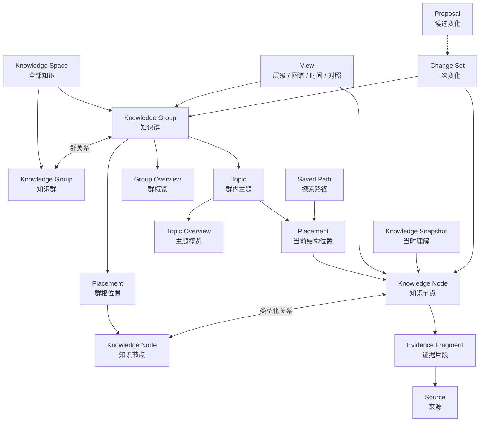

# AI-native 个人知识库

## 产品定义文档 v3.0 — Knowledge Groups, Semantic Zoom, Relational Exploration

> 文档日期：2026-08-05  
> 最近修订：2026-08-07（历史模型边界澄清：Library-first 与连续探索由 v4.0 及核心心智模型接管）  
> 文档状态：**历史完整模型；已不再是产品入口**  
> 当前唯一产品定义：`AI-native-个人知识库-终局产品设计文档-v6.0.md`；本文状态为 HISTORICAL  
> 当前核心心智模型：`AI-native-个人知识库-核心心智模型与连续探索合同-v1.0.md`；它取代本文关于四 Places、四 Group Roots、独立 Home / Atlas / Sources 和“81 个屏幕”的旧数量结论  
> 使用规则：本文档仅保留决策历史、深层模型与验收证据；任何与 v4.0 冲突的产品表面、概念、入口或优先级均以 v4.0 为准  
> 原文档性质：终局模型定义，不是 MVP 规格，也不是界面稿  
> 当前工作名：Personal Knowledge Atlas（仅用于讨论，不代表最终品牌名）  
> 当前状态：产品本体已完成对象完整性、产品语言、核心体验、知识深度与关系忠实度、知识形成与维护、知识群边界与跨群架构、知识节点粒度与内容组成、Overview 形成编辑与更新、AI 查询与知识回答、搜索定位与知识找回、Library 浏览与动态视图、来源证据与可追溯性、直接创作编辑与版本历史、属性 Facet 与适用条件、产品对象层级与身份治理、产品表面架构与完整设计证明、地点编排与跨地点连续性、知识群工作区与双镜连续性、核心导航与复杂度收敛十九轮修订；视觉偏好已收敛为方向 3 的层级阅读与方向 2 的关系空间结合，但仍未进入 Frame 系统或原型制作

---

## 阅读说明

本文重新定义此前以 Project Continuity / Continue 为中心的方向。最新、最高优先级的用户意图是：

> 产品本质上是一个个人知识库。知识以一个个知识群存在；知识群之间可以建立并看见关系；知识具有从 Overview 到细节与来源的丰富层级；用户既能用 AI 查询，也能在知识网络中主动探索。

本文使用四种标记，避免把判断伪装成事实：

- **[用户确认]**：用户已经明确表达的需求或偏好。
- **[产品决策]**：本文基于目标作出的设计决定。
- **[研究事实]**：来自公开产品文档或研究的可核验信息。
- **[待验证假设]**：需要通过用户访谈、可用性测试或真实数据验证。

本文暂时不定义视觉皮肤、工程排期、商业模式和首发版本。视觉探索中“层级阅读优先”与“网络和阅读双镜联动”的结合，只作为交互原则记录，不在本文中固化成最终布局。

本文不再是产品本体的最高层定义，只保留历史深层模型。当前产品入口先读 v4.0 与核心心智模型；更细的界面语法、共享状态、语义缩放和核心工作流见：

- `outputs/AI-native-个人知识库-交互架构与设计系统-v1.0.md`
- `outputs/AI-native-个人知识库-场景压力测试与产品修订-v1.0.md`
- `outputs/AI-native-个人知识库-产品流程板与组件状态图-v1.0.md`
- `outputs/AI-native-个人知识库-完整性审计与产品修订-v1.1.md`
- `outputs/AI-native-个人知识库-产品语言与渐进披露规范-v1.0.md`
- `outputs/AI-native-个人知识库-核心体验与知识群生命周期-v1.0.md`
- `outputs/AI-native-个人知识库-知识深度与关系探索合同-v1.0.md`
- `outputs/AI-native-个人知识库-知识形成与维护循环-v1.0.md`
- `outputs/AI-native-个人知识库-知识群边界与跨群架构合同-v1.0.md`
- `outputs/AI-native-个人知识库-知识节点粒度与内容组成合同-v1.0.md`
- `outputs/AI-native-个人知识库-Overview形成编辑与更新合同-v1.0.md`
- `outputs/AI-native-个人知识库-AI查询与知识回答合同-v1.0.md`
- `outputs/AI-native-个人知识库-搜索定位与知识找回合同-v1.0.md`
- `outputs/AI-native-个人知识库-Library浏览与动态视图合同-v1.0.md`
- `outputs/AI-native-个人知识库-来源证据与可追溯性合同-v1.0.md`
- `outputs/AI-native-个人知识库-直接创作编辑与版本历史合同-v1.0.md`
- `outputs/AI-native-个人知识库-属性Facet与适用条件合同-v1.0.md`
- `outputs/AI-native-个人知识库-产品对象层级与身份治理合同-v1.0.md`
- `outputs/AI-native-个人知识库-产品表面架构与完整设计证明合同-v1.0.md`
- `outputs/AI-native-个人知识库-地点编排信息归属与跨地点连续性合同-v1.0.md`
- `outputs/AI-native-个人知识库-知识群工作区与双镜连续性合同-v1.0.md`
- `outputs/AI-native-个人知识库-核心导航与复杂度收敛合同-v1.0.md`
- `outputs/AI-native-个人知识库-核心心智模型与连续探索合同-v1.0.md`

文档职责边界是：v4.0 与核心心智模型回答“产品是什么、用户从哪里进入、如何连续深入与横向探索”；本文保存对象、状态和演化的决策历史。核心体验文档回答“谁每天如何使用、知识群如何形成”；知识深度与关系文档回答“如何逐层深入、哪些连接是真实关系”；知识形成、来源、编辑、属性和对象合同保留完整内部责任。交互、流程、语言、场景和审计负责把这些决定转换为可验证证据。若文档冲突，用户最新意图、v4.0、核心心智模型依次优先，随后必须同步修订旧文本。

---

# 0. 执行决策

## 0.1 最终产品类别

**[产品决策] 产品首先是一个 AI-native 个人知识库。**

它不是：

- 以项目恢复为唯一目标的 Project Continuity 工具；
- 在外部文件上临时叠加摘要的 AI 助手；
- 以聊天记录为主要资产的问答产品；
- 只有全局节点图、缺少阅读深度的知识图谱可视化工具；
- 要求用户先设计数据库、页面模板和标签体系的手工 PKM 系统。

Project Continuity、Resume Brief、Working Set、任务恢复等能力可以保留，但它们是知识库利用项目知识的一组场景，不再定义整个产品。

## 0.2 一句话定义

> **一个会把资料持续组织为知识群、层级与关系，并允许用户通过 AI 查询或沿知识网络逐层探索的个人知识库。**

更完整的产品承诺是：

> 用户不必先成为知识架构师。系统帮助用户把来源转化为可拥有、可编辑、可追溯、可连接、会演化的知识；用户既能从全局 Overview 一路深入到概念、主张和原始证据，也能从任意问题进入相关知识路径，并继续探索相邻领域。

## 0.3 核心价值不是“存得更多”，而是“形成可用的理解结构”

传统文件系统保存材料；笔记工具保存用户写下的文本；搜索返回匹配项；聊天生成一次性回答。本产品需要完成不同的价值闭环：

```text
来源或用户想法进入
  → 先保存真实输入
  → 系统理解、拆解并判断是否存在知识变化
  → 形成零个或多个知识节点、证据连接或修订提案
  → 组织为知识群与层级
  → 建立有含义的关系
  → 生成可读 Overview
  → 用户查询或探索
  → 形成新的理解、修正与知识
  → 知识网络继续演化
```

终点不是“找到一个文件”，也不是“得到一段 AI 文本”，而是：

1. 用户获得问题的可靠回答；
2. 用户知道回答位于自己的哪一部分知识中；
3. 用户能继续深入、横向跳转或回到证据；
4. 有价值的新理解能回到知识库，而不是留在聊天历史里消失。

## 0.4 完整产品合同

只要产品成立，就必须同时满足以下十条：

1. **它是一处持久知识空间。** 用户可以浏览、搜索、编辑和拥有其中的知识。
2. **它有可理解的宏观结构。** 用户能看到有哪些知识群、它们分别关于什么。
3. **它有丰富但不僵硬的层级。** 用户能从全局到群、主题、节点、细节和证据逐层深入。
4. **它有真实语义的关系。** 关系有类型、有方向、有依据，不是装饰性连线。
5. **AI 查询与知识空间是一体的。** 回答能定位、解释并高亮相关知识路径。
6. **探索不依赖用户先会提问。** 用户可从 Overview、邻接关系、反向链接和推荐路径出发。
7. **知识能够被维护。** 新来源、冲突、纠正、过时和合并会改变知识，而不是不断堆积副本。
8. **来源始终可达。** AI 生成的概述与结论不能切断原始材料、上下文和版本。
9. **用户能直接建设知识。** 空群、手工 Node、人工关系、层级编辑与 Overview 编辑都是正式路径，不依赖先导入资料或调用 AI。
10. **知识可以完整带走并恢复。** 导出、备份和恢复保留对象身份、层级、关系、来源、版本与 provenance，而不是只导出扁平文本。

任何只满足其中一部分的实现，都只能算相关功能，不是这个产品。

## 0.5 产品北极星

> **让用户在最少整理负担下，形成一张自己可以理解、信任、查询并持续探索的个人知识世界。**

北极星不应是：

- 导入文件数量；
- 图谱节点数量；
- AI 对话轮数；
- 自动生成摘要数量；
- 用户手工建立的链接数量；
- 每日停留时长本身。

真正的成功是：用户更快建立理解、更容易找回知识、更能发现连接，并且愿意把系统视为长期知识资产。

---

# 1. 用户问题

## 1.1 信息很多，但没有形成一张可进入的“知识世界”

知识工作者拥有文档、网页、PDF、对话、会议、笔记、截图和 AI 生成内容。这些材料通常存在三个断裂：

- **容器断裂**：内容散落在不同应用、文件夹与时间里；
- **结构断裂**：用户知道材料大致相关，却没有稳定的主题层级与对象关系；
- **理解断裂**：摘要可以快速生成，但很难回答“这部分知识在整体里处于什么位置”。

结果是用户拥有大量材料，却没有一个能从宏观进入微观的知识空间。

## 1.2 手工知识管理把结构成本推给了用户

现有 PKM 往往要求用户主动决定：

- 这条内容应该放在哪里；
- 它属于哪个标签或数据库；
- 应该拆成几条笔记；
- 应该链接到哪些概念；
- 什么时候该重构目录；
- 重复、冲突与过时内容如何处理。

这套劳动对于热衷维护系统的少数用户可接受，但对大多数人，整理行为会和真正的阅读、研究、思考发生竞争。

## 1.3 纯 AI 问答解决“这一问”，但不建设长期知识

一次 AI 回答可能准确、流畅、有引用，但仍然存在：

- 回答与用户已有知识结构脱离；
- 用户不知道还能沿哪些方向深入；
- 回答中的新综合没有成为可复用知识；
- 多轮对话形成新的上下文孤岛；
- 下次再问时，系统重新生成另一版答案。

因此，聊天只能是知识库的一种入口，不能成为产品结构。

## 1.4 纯图谱通常只能“看见连接”，不能“理解内容”

全局图谱常见的问题是：节点过多、标签过小、关系意义不清、没有阅读顺序、无法判断重要性。它对展示“我有很多连接”有效，对解决真实问题却未必有效。

产品必须同时支持：

- 图的横向关系；
- 树的纵向层级；
- 页面的连续阅读；
- 来源的证据追溯；
- AI 的自然语言入口。

## 1.5 核心 Jobs to Be Done

### 建立理解

> 当我收集了大量资料时，我希望系统帮助我看见主题、层级和主要关系，让我不用先手工设计知识结构，也能形成对领域的整体理解。

### 查询知识

> 当我有一个具体问题时，我希望向全部知识或某个知识群提问，得到基于我的知识库、有证据、能继续深入的回答。

### 探索知识

> 当我还不知道该问什么时，我希望从一个 Overview、知识群或节点出发，沿层级与关系发现相邻概念、不同观点和意外连接。

### 深入细节

> 当概览不足以支持判断时，我希望逐层进入主题、概念、主张、例子和来源，而不是在摘要与原文之间直接跳跃。

### 维护理解

> 当新信息出现、旧结论过时或系统理解错误时，我希望纠正一次后，相关 Overview、关系和回答都能随之更新。

---

# 2. 首要用户与使用情境

## 2.1 首要用户 [产品决策，待实证验证]

首要用户不是“所有需要记笔记的人”，也不由研究、工作或生活其中一种内容类型定义。产品首先服务于**长期处理多个复杂知识范围，并需要反复返回、深化和调用这些知识的个人**：

- 长期处理多个复杂主题或项目；
- 输入材料跨格式、跨来源、跨时间；
- 需要理解、研究、写作、策划、决策或学习；
- 已感受到文件夹、搜索或聊天不足；
- 希望拥有结构，但不愿持续承担全部整理劳动；
- 对知识之间的关系和完整上下文有较高要求。

典型但尚未验证的群体包括：产品经理、研究者、策略人员、创作者、创始人、咨询顾问、高强度学习者和跨领域专业人士。研究学习、专业工作与复杂生活决策是三类代表内容场景，不是三套产品。首要用户的共同特征和后续验证计划详见 `outputs/AI-native-个人知识库-核心体验与知识群生命周期-v1.0.md`。

## 2.2 高频情境

1. 研究一个新领域并逐步形成自己的理解地图；
2. 在已有大量资料中回答跨来源问题；
3. 从一个熟悉主题探索到相邻领域；
4. 写作或决策前，查看某主题的 Overview、分歧与来源；
5. 新资料进入后，理解它改变了哪些已有知识；
6. 回到长期项目时，从项目知识群恢复整体与细节；
7. 将 AI 对话中真正有价值的内容沉淀为长期知识。

## 2.3 非目标用户

- 只需要短期备忘录或简单待办的人；
- 只需要团队 Wiki 发布与权限管理的人；
- 主要需求是数据库应用搭建或业务流程自动化的人；
- 只想让 AI 对一批文件做一次性问答、不需要长期知识维护的人；
- 只追求自由画布、脑图绘制或视觉创作的人。

这些人可以使用产品的局部能力，但不应决定产品本体。

---

# 3. 产品宪法

## 3.1 Knowledge before Documents

来源文档是输入和证据，不是最终导航结构。产品需要让用户围绕概念、主张、问题、人物、事件、方法和它们的关系工作。

## 3.2 Groups before Global Hairball

全局首先显示知识群与群之间的重要关系，而不是一次性展示所有节点。图谱必须服从理解，不以复杂度证明产品能力。

## 3.3 Overview before Detail

每个可进入的知识范围都应有可读 Overview。用户先获得地形，再决定深入哪里。

## 3.4 Semantic Zoom, not Page Hopping

从全局到证据应保持上下文连续。进入更深层级时，父级位置、当前路径、邻接关系与返回方式始终清楚。

## 3.5 Hierarchy and Graph are Complementary

层级回答“它属于什么、如何从大到小理解”；关系回答“它还与什么有关、为什么有关”。两者不能互相替代。

## 3.6 AI is a Knowledge Navigator

AI 不只是写答案。它需要确定作用域、检索相关节点与证据、显示推理所经过的知识路径，并帮助用户继续探索。

## 3.7 User-owned Canonical Knowledge

AI 可以建议结构和生成综合，但用户确认、修改或锁定的知识拥有更高权威。聊天输出不能默认成为正式知识。

## 3.8 Evidence Adjacent to Knowledge

重要主张、关系和综合必须能回到来源片段。证据不是隐藏在“了解更多”之后的审计功能，而是知识可信度的一部分。

## 3.9 One Knowledge, Multiple Contexts

同一知识节点可以同时出现在多个知识群、多个层级路径和多个视图中，但其身份、版本与来源保持一致。

## 3.10 Structure is Living

目录、Overview、群边界和关系都可以随知识变化。自动维护要提出可理解的变更，而不是在后台静默重排用户的世界。

## 3.11 Unknown and Conflict are Knowledge

“不知道”“存在分歧”“证据不足”“两种观点在不同条件下成立”都必须是一等状态，不能被流畅摘要抹平。

## 3.12 The Product Must Remain Browsable Without AI

即使 AI 暂时不可用，用户仍能通过层级、搜索、关系和来源使用知识库。AI 增强知识库，而不是让知识库依赖聊天才能存在。

## 3.13 Local-first Personal Ownership

核心知识库默认属于单个用户，并保存在用户可控制的本地知识存储中。来源解析、结构浏览、搜索、阅读、编辑、版本与撤销不能以云服务在线为前提；云端模型、同步和连接器可以增强能力，但不能成为用户取回自己知识的唯一通道。

“本地优先”在本文中首先是所有权与可用性决定，不扩展为复杂安全产品：它要求知识资产可导出、可备份、可恢复，AI 不可用时仍可工作；协作、发布和多端同步可以以后增加，但不得改变个人知识的 canonical identity。

## 3.14 Direct Authoring is First-class

用户直接写下、编辑、组织和连接的知识，与 AI 从来源中提取的知识使用同一套 canonical model。手工创作不是 AI 失败时的替代方案，也不要求先绑定 Source。

系统必须明确区分用户观察、用户综合、用户假设、外部证据与系统推断；“暂无外部引用”不等于“低质量”，但作者、依据类型、适用条件和状态必须可见。

## 3.15 One Personal Knowledge World by Default

默认只有一个连续的个人 Knowledge Space，不在首屏引入 Workspace 管理和跨空间切换。额外 Space / Vault 只服务真正的硬隔离需求，例如不同本地存储位置、独立同步策略或不可混合的数据边界；跨 Space 不产生隐式关系。

## 3.16 Deep Model, Simple Surface

系统内部可以拥有严谨对象、状态轴、版本与影响传播；用户默认界面不能因此变成知识治理后台。

日常产品语言只围绕五个核心名词：**知识群、主题、知识、关系、来源**。Overview、Evidence、Path、Version 与 Suggestion 使用普通语言按需出现；Placement、canonical、Applicability、Query Context、Snapshot、Change Set 和四轴状态默认由人话后果代替。

复杂度只在改变当前判断或动作时披露：默认阅读保持安静；选择对象时显示局部语境；编辑或删除前显示影响；历史、证据和恢复中才显示完整取证信息。简化表面不能删除内部能力，但严谨内部模型也不能成为用户的学习成本。

---

# 4. 顶层概念模型

## 4.1 十四类主要产品资源，五个日常概念

| 主要产品资源 | 用户理解 | 主要作用 |
|---|---|---|
| Knowledge Space / 知识空间 | 我的全部知识 | 全局边界与入口 |
| Knowledge Group / 知识群 | 围绕一个领域、问题或长期对象形成的知识整体 | 组织、概览、探索与查询作用域 |
| Topic / Knowledge Branch / 知识主题 | 某个知识群中的一条稳定理解分支 | 组织层级、局部 Overview 与节点位置；不复制节点正文 |
| Knowledge Node / 知识节点 | 一个可以独立理解、复用和连接的知识单元 | 承载概念、主张、事件、方法等 |
| Placement / 语境位置 | 某个节点在一个 Group / Topic 中的具体出现位置 | 支持多重归属、局部说明与顺序，同时保持 Node 身份唯一 |
| Relation / 关系 | 两条知识或两个知识群为什么相连 | 表达类型化语义、认识论、因果和演化；结构与证据连接另行表示 |
| Overview / 概览 | 当前范围最重要的地形说明 | 从整体进入细节 |
| Source / 来源 | 原始文档、网页、对话、媒体或记录 | 提供原始上下文与权威边界 |
| Evidence Fragment / 证据片段 | 来源中直接支持某条知识的具体位置 | 精确引用与核验 |
| Saved Path / 已保存路径 | 一段有顺序的探索路线 | 继续探索、复现思路和保存跨群路径 |
| Knowledge Snapshot / 知识快照 | 某次问题、作用域与回答在当时的状态 | 保留历史理解并允许按当前知识重新求值 |
| Change Set / 变更集 | 一次操作改变和影响了什么 | 提交前预览、下游传播、历史与撤销 |
| Proposal / 建议项 | 尚未进入正式知识的候选变化 | 隔离 AI 建议与 Knowledge Truth；只有需要用户判断的高影响 Proposal 才进入 Review View |
| View / 视图 | 按规则观察一批知识的方式 | 保存 scope、criteria、filter、sort、group、layout 与字段显示；动态求值但不保存成员、不创造归属 |

十四类 Primary Product Resources 是产品必须独立维护的主要责任，不是系统全部持久记录、十四张页面或用户必须记住的十四个名词。Content Revision、Evidence Binding、Query Run、Property Definition、View Evaluation 与 Workspace State 等支持身份、内嵌记录和可重建结果仍然存在，但默认通过所属主要资源进入。默认界面只要求理解：知识群、主题、知识、关系、来源。

界面翻译规则：

- Knowledge Node 默认称“知识”，或直接显示其类型“概念 / 观点 / 方法 / 问题 / 决定”；
- Placement 称“在这里的位置”或“它还出现在哪里”；
- canonical / contextual edit 称“修改所有位置 / 只修改这里”；
- Applicability 称“适用范围”；
- Query Context 称“本次回答范围”；
- Knowledge Snapshot 称“回答时的知识版本”；
- Change Set 称“本次更改”或“影响预览”；
- 四轴状态默认合成为一句最重要的人话说明。

完整映射与 P0–P3 渐进披露合同见 `outputs/AI-native-个人知识库-产品语言与渐进披露规范-v1.0.md`。用户日常无需理解向量、embedding、RAG、三元组、chunk、compiler 或 projection。

## 4.2 对象关系



## 4.3 三张图与一条时间轴

产品内部不应把所有结构压成一张“知识图谱”。至少有四种相互关联但职责不同的结构：

1. **Structural Graph / 结构图**：知识空间、群、主题、Placement 与节点的直接结构；主要支持层级导航。产品不设 Subgroup 对象。
2. **Semantic Graph / 语义图**：概念、主张、实体和方法之间的关系；主要支持横向探索与查询。
3. **Provenance Graph / 来源图**：知识如何由来源片段、提取、综合和修订产生；主要支持可信度与重建。
4. **Temporal History / 演化时间轴**：知识、关系、群与 Overview 如何变化；主要支持历史理解与纠错。

界面根据任务组合这些结构，但不能让用户误以为“屏幕上的一条线”天然等同于真实知识关系。

## 4.4 双重真相与独立知识存储 [产品决策]

产品不能把本地文件夹直接伪装成知识库，也不能让 AI 生成内容覆盖原始来源。它需要明确区分两种真相：

| 层 | 负责回答 | 权威边界 |
|---|---|---|
| Source Truth / 来源真相 | 原始材料当时写了什么 | 由原文件、导入快照、版本和精确片段决定；系统不能静默改写 |
| Knowledge Truth / 知识真相 | 用户当前如何理解、组织和接受这些材料 | 由 Knowledge Store 中的 Group、Node、Relation、Overview、状态和版本决定 |

因此，产品拥有一套独立的本地 canonical knowledge store：

- 文件、网页、对话和媒体以 Source 身份进入，可以引用原位置，也可以在允许时保存可校验快照；
- Group、Node、Relation、Overview、Placement、Conflict 与 History 保存在知识存储中，不依赖某个来源文件的目录位置；
- 编辑 Node 不会反向篡改 Source；来源发生变化时生成新版本并执行影响分析；
- 删除或失去来源权限不会自动删除已经形成的知识，但受影响知识会显示 provenance 缺失或无法核验；
- 用户可以完整导出来源索引、知识对象、关系、版本与 provenance，避免被某个模型或专有界面锁定；
- AI 输出在被保存前只是 Query Result 或 Proposal；只有用户接受或明确允许的规则提交后，才进入 Knowledge Truth。

这套分层让产品既能尊重原始材料，也能成为真正可编辑、可演化的知识库，而不是文件浏览器上的一层临时摘要。

Source Truth 内部进一步分为六层：


- **Source identity**：这份可引用材料是什么；
- **Source Revision**：材料在确定时间的不可变内容状态；
- **Representation**：该 Revision 的 PDF、HTML、snapshot、OCR、transcript 或 translation 形态；
- **Evidence Fragment**：绑定 Revision、Representation 和多重 Selectors 的可定位片段；
- **Evidence Binding**：该片段对某个 Node Anchor、Relation statement、Overview Claim 或 Answer Claim 起什么作用；
- **Knowledge Target**：用户当前理解，不反向覆盖 Source Truth。

Highlight / Annotation 只是阅读标记；它只有在用户或明确规则选择 Target 与作用后才提升为 Evidence。Evidence Binding 是 provenance / support edge，不是正式 Semantic Relation。

## 4.5 六平面与身份等级 [产品决策]

稳定 ID 不等于主要产品资源，更不等于 Knowledge Truth。产品内部使用六个平面：

1. **Knowledge Plane**：Group、Topic、Node、Relation、Overview 的 accepted knowledge；
2. **Source & Provenance Plane**：Source、Revision、Representation、Fragment、Binding、Annotation 与 Activity；
3. **Structure & Curation Plane**：Placement、Topic order、Saved Path、View Definition、Pin 与 Navigation；
4. **Governance & History Plane**：Proposal、Change Set、Content Revision、Branch、Snapshot、Query Run、Migration 与 Recovery；
5. **Definition & Policy Plane**：Property / Facet / Relation Type Definitions、Profiles、AI 与 Import policies；
6. **Projection & Workspace Plane**：View Evaluation、Overview Projection result、Search index、Graph layout、Selection、Return Stack 与 Edit Session。

记录同时拥有一个 identity class：Primary Resource、Supporting Identity、Embedded Record、Derived Evaluation 或 Workspace State，以及一个主 Truth Role：knowledge truth、source truth、definition truth、decision history、derived observation 或 workspace continuity。两者正交：Property Definition 有稳定身份但属于 Definition Truth；View Evaluation 可缓存但属于可重建观察；Edit Session 可恢复但不进入知识历史。

新增 Primary Resource 必须证明独立用户意图、不可重建真相、独立生命周期、deep link / history / export 需求、删除后果和无法由现有 Group / Topic / Node / View / Path / Snapshot / Proposal / Change Set 表达。新增数据库表、API object、ID、组件或页面不构成准入理由。完整合同见 `outputs/AI-native-个人知识库-产品对象层级与身份治理合同-v1.0.md`。

---

# 5. Knowledge Group / 知识群

## 5.1 定义

> **知识群是围绕一个稳定主题、问题域、长期对象或实践领域形成的、可独立进入和理解的知识范围。**

它既不是文件夹，也不是标签，也不是自由白板。一个知识群同时拥有：

- 稳定身份与名称；
- 适用范围与边界说明；
- 一个可读 Overview；
- 主要主题与层级结构；
- 成员知识节点；
- 与其他知识群的类型化关系；
- 来源覆盖、冲突、未知和更新状态；
- 用户维护与 AI 建议的历史。

例子：

- “认知科学”是一个领域型知识群；
- “长期记忆系统”是一个主题型知识群；
- “AI Agent 产品设计”是一个实践领域型知识群；
- “法国留学住房”可以是一个生活问题域知识群；
- “某次产品发布”更适合作为项目知识群或事件群，而不是所有知识的默认组织方式。

## 5.2 知识群不是互斥容器

同一节点可以出现在多个知识群中。例如“情境依赖检索”既属于“长期记忆系统”，也可能被“认知科学”和“AI Agent 产品设计”引用。

产品采用：

```text
Canonical Node（全局唯一知识身份）
  + Contextual Placement（在某个群 / 主题中出现并承担何种角色）
  + Contextual Summary（在该群语境下如何解释）
```

Placement 是唯一的结构归属真相：当且仅当一个 Node 在某 Group 中至少有一个 active Placement，它才属于该 Group。`Group Membership` 只是由 Placements 推导的结果，不再单独存储。这样既避免复制内容和双写漂移，也允许同一知识在不同语境中承担不同作用。

## 5.3 知识群的最小结构

```text
KnowledgeGroup
  identity
    group_id
    title
    aliases[]
  boundary
    purpose_or_governing_question
    includes[]
    excludes[]
    default_applicability?
    source_scope_policy?
  organization
    primary_kind_ref
    facet_refs[]
    property_profile_ref?
    overview_ref
  knowledge_state
    formation_phase
    lifecycle_state
    freshness_state
    unresolved_question_refs[]
    conflict_refs[]
  ownership
    curation_mode
    created_by
    created_at / updated_at
  lineage
    origin_topic_snapshot_ref?
    previous_group_refs[]
    successor_group_refs[]
    redirect_refs[]
    revision_history
```

产品不设 Subgroup 对象；`member_node_refs`、`root_topic_refs`、`root_placement_refs` 与 `group_relation_refs` 只能作为可重建索引，不能成为 canonical Group 字段。成员 Node 由 active Placements 推导，Topic roots / descendants 由直接父级推导，群关系由 Relation endpoints 推导，Group 之间的范围包含只存一条 `scope_within`，反向 `contains_scope` 由系统显示。

## 5.4 知识群类型

类型用于提供合理默认结构，不是限制用户：

| 类型 | 典型内容 | 默认 Overview 结构 |
|---|---|---|
| Domain / 领域 | 认知科学、经济学、AI | 核心概念、主要分支、争议、方法、前沿 |
| Focus Area / 专题域 | 情境检索、RAG 评估 | 定义、机制、方法、证据、限制、关联 |
| Project / 项目 | 产品发布、论文写作 | 目标、当前状态、决定、材料、问题、进展 |
| Entity / 对象 | 某公司、某产品、某人物 | 基本信息、时间线、关系、主张、来源 |
| Practice / 实践 | 产品设计、写作、健身 | 原则、方法、流程、案例、失败模式 |
| Inquiry / 问题域 | “如何设计可信 Agent” | 子问题、现有答案、证据、分歧、未知 |

每个群使用一个 `primary_kind` 决定默认 Overview 和结构建议，同时允许多个 `facets` 表达附加性质。例如“AI Agent 产品设计”可以以 Practice 为 primary kind，同时具有 Domain 与 Project facets。类型服务默认体验，不限制知识群只能属于一个抽屉。

## 5.5 创建方式

知识群可以由用户创建，也可以由 AI 建议：

- 用户从全局或任一 Library 位置直接创建空 Group；
- 用户先写名称并立即进入，Boundary、类型、Topic 骨架与来源均可稍后补充；
- 导入一批来源时生成候选群；
- 多个节点长期形成稳定簇时建议建群；
- 一个知识群过大且内部结构稳定时建议拆分；
- 两个群高度重叠时建议合并或建立明确关系。

空 Group 不是错误状态。它必须提供三条平行开始路径：直接写 Node、添加 Source、建立 Topic 骨架。模板只提供建议，不在用户确认前生成大量空 Topic。

AI 不应静默创建大量知识群。建议必须解释：

- 为什么形成这个群；
- 预计包含哪些节点与来源；
- 与现有群有什么区别；
- 接受、合并、改名或忽略后会发生什么。

## 5.6 群之间的关系

群关系不是简单的“相关”，而是关于两个独立知识范围如何互相改变理解的陈述。正式端点只能是 Group↔Group，并使用受限类型：

- 范围：`scope_within`（反向显示为 `contains_scope`）、`overlaps_with`；
- 基础与应用：`builds_on`、`provides_foundation_for`、`applies_to`、`provides_method_for`；
- 对照与影响：`contrasts_with`、`influences`、`constrains`；
- 演化与共享：`evolved_from`、`shares_core_knowledge_with`。

`scope_within` 只保存直接范围陈述，反向 `contains_scope` 与 transitive closure 均为派生视图；它允许多个真实上位范围但禁止 cycle，不产生容器所有权、级联删除或 Subgroup。系统可以根据多条已接受的跨群 Node paths、core / bridge Placements 和 Overview 依赖生成聚合候选，但共享标签、单一来源共现或 embedding 相似度不能形成正式关系。聚合结果在用户接受前是 Proposal；正式关系必须能解释 statement、why it matters、supporting paths、Evidence 与 limits。

## 5.7 拆分、合并与演化

知识群会变化，因此必须支持：

- 改名而不改变稳定身份；
- 拆分为多个群，逐项决定 Placement 的 move / share / keep，并保留历史路径；
- 合并重复群并重定向旧链接，但不在同一步自动合并 Node identity；
- 将 Topic 提升为独立 Group，并让原 Topic 作为 Gateway 保留旧路径；
- 在确需收回独立边界时执行高影响的 `Absorb Group into Group`，保留原 Group identity、Overview 历史与 redirect；
- 保留群 Overview 与层级的历史版本；
- 撤销 AI 重组。

产品不提供普通菜单中的“一键把 Group 降级为 Topic”。“整理”不能等同于删除旧结构，用户需要理解知识世界如何演化。

Topic Promotion 的来源由 `origin_topic_snapshot_ref` 与 Gateway 记录，不靠强制群关系证明。只有新 Group 的最终边界确实仍位于原 Group 内时，Change Set 才建议 `scope_within`；边界扩大时应改为 `overlaps_with`、`builds_on` 或不建立正式关系。

## 5.8 Topic / Knowledge Branch [产品决策]

> **Topic 是某个知识群中的稳定理解分支，负责组织 Placement；Knowledge Node 负责可跨群复用的知识身份。**

Topic 不是文件夹，也不是缩小版 Knowledge Group：

- Topic 只能在一个 Group 的结构语境中存在；
- Topic 只持久化一个直接父级；children、ancestors 与 breadcrumb 由系统推导；
- Topic 可以拥有顺序、局部 Overview、知识缺口和修订历史；
- Topic 不拥有 canonical Node 正文，而是包含指向 Node 的 Contextual Placements；
- 同一 Node 可以出现在多个 Topic，且每个 Placement 可以有不同 contextual summary；
- 删除 Topic 只移除该结构及 Placements，不删除 canonical Node；
- Topic 可以被移动、改名、拆分与合并，并保留旧路径重定向；
- Topic 在一个 Group 内只有一个直接父级；多重语境由 Placements、Reference、Saved Path 与 Relation 表达，不把结构变成 DAG；
- 层级不设硬上限，界面用 Focus + Context 管理深度；
- 只有同时具备边界独立、使用独立和结构独立时，系统才建议提升为 Knowledge Group；Node 数量或相似度不能单独触发；
- 提升后原 Topic 成为 `promoted` Gateway，并记录 `promoted_group_ref`，不复制 Node、Evidence 或 Source。

```text
Topic
  topic_id
  group_id
  title
  parent_topic_id?
  overview_ref?
  order_key
  knowledge_gap_refs[]
  lifecycle_state
  promoted_group_ref?
  redirect_ref?
  revision_history
```

这样，L2 不再是数据库对象缺席的“目录页面”，而是产品中可以持续演化的知识结构层。

## 5.9 知识群形成阶段 [产品决策]

知识群不是创建完成后永远使用同一种 Overview。产品使用独立的 `formation_phase` 调整默认体验：

| 阶段 | 含义 | 默认体验重点 |
|---|---|---|
| Seed / 种子 | 已有稳定身份，但内容与结构很少 | 写知识、建主题、加来源三条平行开始路径 |
| Forming / 成形 | 已出现候选主题与边界，结构仍可能大幅变化 | 覆盖说明、候选主题、未归位内容和少量结构建议 |
| Established / 稳定 | 边界、Overview 与主要路径足以支持日常使用 | 低噪声阅读、查询、探索与继续上次焦点 |
| Evolving / 演化 | 新知识正在显著改变原有理解或结构 | 稳定内容、变化摘要、Diff、历史和受影响路径 |
| Dormant / 休眠 | 暂时不是活跃焦点，但仍是完整知识资产 | 最后稳定状态、休眠后变化与恢复入口 |

`formation_phase` 与其他状态严格分开：

- 它不是知识质量分数，不显示完成环、等级或百分比；
- Dormant 不等于 stale，活跃频率不判断知识是否正确；
- Archived 属于 `lifecycle_state`，不属于形成阶段；
- 一个 Established Group 仍可有未知、争议和来源不足；
- 阶段可以回退，回退不是惩罚；
- 系统可以解释并建议阶段变化，用户可以修正或固定；
- 高影响结构不能只因为阶段变化而静默提交。

无论阶段如何，Group Overview 始终尽量回答：这是什么、由什么组成、目前知道什么、哪里不确定或在变化、下一步去哪里。阶段只改变这五部分的权重，不把 Overview 变成互不相干的页面。

---

# 6. Knowledge Node / 知识节点

## 6.1 节点是可独立理解的最小知识单位

节点不是任意文本块，也不要求每句话都原子化。一个合格节点应当：

- 能被单独命名或识别；
- 在脱离原文后仍有足够上下文；
- 可以被多个群引用；
- 可以与其他节点建立有意义的关系；
- 可以回到来源证据；
- 可以被修订、反驳或细化。

## 6.2 节点类型

| 节点类型 | 回答的问题 | 示例 |
|---|---|---|
| Concept / 概念 | 这是什么 | 情境依赖检索 |
| Entity / 实体 | 它是谁或是什么对象 | NotebookLM、某公司、某人物 |
| Claim / 主张 | 关于某事目前认为成立什么 | “全局图在大规模下会产生视觉噪声” |
| Event / 事件 | 发生了什么 | 某产品发布、一次实验、一次决策会议 |
| Decision / 决策 | 选择了什么及为什么 | “全局只展示知识群，不展示全部节点” |
| Method / 方法 | 如何做 | 对来源做证据化摘要的方法 |
| Example / 例子 | 一个具体实例是什么 | 某个 AI 查询如何进入图谱 |
| Question / 问题 | 仍不知道什么 | “群边界应自动变化到什么程度” |
| Principle / 原则 | 什么规则应约束行为 | “Evidence adjacent to knowledge” |

来源、文件、PDF 和网页本身不是知识节点；它们是 Source。来源中的材料经用户书写或系统编译后，才形成节点。

## 6.3 节点结构

```text
KnowledgeNode
  identity
    node_id
    node_type
    title
    aliases[]

  content
    accepted_revision_ref
    working_revision_ref?
    preferred_orientation_anchor_ref?

  epistemics
    lifecycle_state
    epistemic_state
    freshness_state
    availability_state
    applicability?
    conflict_refs[]
    assumption_refs[]

  authorship
    origin: user_authored | source_derived | user_synthesis | system_inference
    author_ref
    created_at

  lineage
    previous_node_refs[]
    successor_node_refs[]
    split_from_ref?
    merged_into_ref?
    redirect_refs[]
    revision_history
```

Node schema 不保存 `group_memberships` 或 `hierarchy_placements`；它们由 Placements 推导。`concise_definition / overview / examples / caveats` 也不再与正文各存一份副本，而是由同一 Content Revision 中带 semantic role 的 Blocks 投影。`source_support` 由 Evidence Connections 重建。

Accepted revision 的内部内容基底为：

```text
NodeContentRevision
  revision_id
  node_id
  revision_state: working | accepted | historical
  orientation_block_ref?
  content_root_refs[]
  block_records[]
  anchor_redirects[]
  change_summary
  formation_basis
  created_by / created_at
  previous_revision_ref?
```

Content Block 是连续写作、排版和局部编辑单元；Content Anchor 是 Node 内部稳定 locator。二者随 Node / Overview 导出，但不是新的顶层知识对象，不能拥有 Placement、进入 Atlas 或成为正式 Relation endpoint。

## 6.4 粒度规则

系统不应机械追求“越原子越好”。建议规则：

- 一个节点只承担一个主要理解任务；
- 需要多段解释才能成立的概念可以保留为一个节点；
- 可独立被引用、反驳或更新的主张应拆分；
- 拥有独立 Applicability、Evidence、正式 Relations、跨群复用或更新节奏的 Section 应建议提升为 Node；
- 只用于解释、步骤、例子、过渡或版式的内容保持为 Block / Section；
- 只有上下文不同、内容实质相同的节点应合并身份；
- 同名但含义不同的节点必须分离；
- 长文档不自动等于一个巨型节点，也不自动切成数百碎片。

字符数、Heading 数、Block 数、阅读时长、token 数或 embedding cluster 只能成为提示信号，不能独立触发 Split。

## 6.5 对象、版本、编辑与知识状态必须正交 [产品决策]

`Draft`、`Accepted`、`Superseded`、`Archived`、`Contested`、`Stale` 与 `Source unavailable` 回答的是不同问题。旧的 `lifecycle: draft | accepted | superseded | archived` 同时混合内容是否采用、identity 是否被替代和对象是否退出日常使用，无法表达“当前已有 Accepted Revision、另有未完成修改、对象已归档、来源又暂时不可用”的真实状态。

修订后的模型：

```text
KnowledgeObjectState
  object_lifecycle: active | archived | trashed | tombstoned
  identity_standing: canonical | superseded | merged_redirect | split_redirect
  current_accepted_revision_ref?
  working_branch_refs[]
  proposal_branch_refs[]
  epistemic: supported | evidence_limited | contested | unknown
  freshness: current | review_due | stale
  availability: available | source_degraded | source_unavailable
```

一个 Node 可以同时拥有：

```text
object_lifecycle = active
identity_standing = canonical
current_accepted_revision = Revision 7
working_branch = based on Revision 7, saved locally
epistemic = supported
freshness = review_due
availability = source_degraded
```

其含义是：知识库仍以 Revision 7 为当前知识，用户另有未完成修改；现有证据总体支持，但需要复核且一部分来源暂时不可核验。自动保存 Working Branch 不移动 Accepted pointer；来源失效、时间流逝或争议出现也不把对象改回 Draft。

AI 生成的新综合进入 Proposal Branch 或没有 Accepted Revision 的 Working Node。只有用户“完成并采用”或命中明确、有限、可撤销的用户规则后，才创建 immutable Accepted Revision。用户直接写下的观察、综合或假设可以没有外部 Source；它们通过 origin、作者、Applicability 与 epistemic state 说明依据，不能被显示成 AI 的低置信结果，也不能伪造引用。

直接创作、Working Branch、Accepted Revision、冲突与恢复的完整合同见：

- `outputs/AI-native-个人知识库-直接创作编辑与版本历史合同-v1.0.md`

## 6.6 Applicability / 适用条件

Claim、Decision、Method、Relation 与 Property Assertion 在成立边界会改变真值时，可以引用一等 Applicability：

```text
Applicability
  subject_refs[]
  subject_classes[]
  organization_refs[]
  locations[]
  conditions[]
  valid_time: from? / to? / precision?
  exclusions[]
  source_scope?
```

Applicability 只表达“这条知识对谁、何时、在何条件成立”，不是通用 metadata bag。作者、颜色、页数和个人评分属于 Property；测量口径和“不含水电”属于 qualifier；依据来自哪里属于 Evidence / provenance；两个对象如何相连属于 Relation。

系统在把两条主张或属性值标为 `contested` 前，必须依次比较 target identity、Applicability、valid time、qualifier / measurement basis 与 supersession。条件、对象或有效时间不同的结论优先形成更窄 Claim、`qualifies` 关系或并列适用分支，不能因为文本或值不同就制造伪冲突。

## 6.7 Property、Facet 与结构化事实 [产品决策]

结构化知识分为七层：System / Identity Fields、Property Definition、Property Profile、Property Assertion、Applicability、Projection / Index 与 Schema Change History。

```text
PropertyDefinition
  property_id
  canonical_name / aliases
  semantic_purpose
  value_type / cardinality
  allowed_target_types[]
  validation / unit / enum policy
  search / display / evidence policy
  accepted_definition_revision_ref

PropertyAssertion
  assertion_id
  property_ref
  target_ref
  assertion_location:
    identity | content_revision | placement | source
  value_state:
    unset | known | unknown | no_value | not_applicable
  value?
  qualifiers{}
  applicability_ref?
  origin / evidence_binding_refs[]
  standing:
    working | proposed | accepted | superseded | deprecated
```

Property Definition 是有稳定 identity、可版本化与迁移的 Supporting Identity；Property Assertion 是归属于目标对象、Revision、Placement 或 Source 的 Embedded Record。二者都不获得 Primary Resource 的 Library / Atlas / Relation endpoint 权利。Primary Kind 决定默认理解骨架，Facets 提供可组合的附加结构建议，二者通过 Property Profile 推荐字段、顺序和显著性，但不制造空值、不要求填表，也不删除既有 Assertions。

系统不再使用无语义的统一 `tag`：Source Tag、User Facet、System Marker、Alias 与正文关键词分别保存。同名不等于同义，Definitions 不按 label 自动合并；View、Search 与 Assertion 按稳定 `property_id` 引用。Node-reference Property 只提供原子特征和导航，不能自动生成正式 Relation 或图谱边。

支持的核心类型限定为 Text、Number + Unit、Boolean、Enum、Date / DateTime / Interval + Precision、Node Reference、External Identifier / URL 与 Structured Applicability。不提供通用公式、Rollup、任意嵌套对象和数据库应用搭建；Derived Value 只作为可重建 Projection。`unset`、`unknown`、`no_value`、`not_applicable` 与 `known false` 不得混淆。

Source metadata 先属于 Source；Query Context 只属于一次查询；只有经过显式 Mapping / Save 才能成为 Node / Group Assertion 或 Saved View。AI 只能提出绑定 Base Revision、support、Applicability 与影响的 Property Patch。类型、cardinality、enum option、Definition merge / split 与 archive 是需要影响预览、Legacy retention、失败隔离、History 与 rollback 的 Schema Change Set，不能原地清空不兼容值。

完整定义、迁移、搜索、动态视图、导出和验收合同见：

- `outputs/AI-native-个人知识库-属性Facet与适用条件合同-v1.0.md`

## 6.8 Node 阅读骨架 [产品决策]

所有 Node 共享六段稳定信息语义，但不强迫显示六张卡或填满空模板：

1. **Identity**：名称、类型和当前语境；
2. **Orientation**：一句定义、结论或作用；
3. **Core Understanding**：当前最重要的解释；
4. **Conditions & Limits**：适用条件、例外、争议与新鲜度；
5. **Connections**：关键正式关系、其他出现位置和探索入口；
6. **Evidence & History**：来源、形成方式、版本和变化。

默认阅读只展开前三段；第四段在影响判断时提高优先级，第五段随当前任务显示，第六段一跳可达。Concept、Claim、Method、Decision、Question、Principle、Entity、Event 与 Example 在这套骨架上使用不同内容合同，不能让所有 Node 退化为同一种“标题 + AI 摘要”卡片。

## 6.9 Content Block、Anchor 与复用 [产品决策]

Node 是知识身份，Block 只是同一 Node Content Revision 内的连续写作与局部编辑单元。用户可以写一条只有一句结论的 Decision，也可以写一个包含多节机制、例子和限制的 Concept；产品不以长度、段落数或卡片数量决定二者是否是知识。

Node 内的标题、段落、列表、引用、代码、表格和媒体都可以拥有稳定 `block_id`。一个可外部定位的 Content Anchor 组合：

```text
ContentAnchor
  node_id
  revision_ref
  block_ref?
  quote_exact?
  quote_prefix?
  quote_suffix?
  position_hint?
  anchor_state: resolved | redirected | ambiguous | orphaned
```

`block_ref` 负责稳定身份，revision 与 quote context 负责在内容变化后重新解析，position 只作为弱提示。Anchor 是 Embedded locator value，不能拥有 Placement、独立 lifecycle 或进入 Atlas；它只让 Search、Ask、Evidence、引用和历史记录精确回到一条知识内部的位置。

跨 Node 复用必须显式选择语义：

| 复用方式 | 显示内容 | 原内容变化后 | 适合场景 |
|---|---|---|---|
| Link | 标题与进入链接 | 始终进入当前 Node | 只需建立入口 |
| Live excerpt | 指定 Anchor 的最新内容 | 同步更新并显示来源身份 | 共享定义或方法 |
| Pinned excerpt | 固定 revision + Anchor | 保持原版本并提示已有更新 | 决策依据、历史语境 |
| Explicit quote | 独立保存引文与出处 | 不随正文改写 | 需要原话核验 |

Evidence Connection 可以指向整个 Node、Node Anchor 或正式 Relation；Relation 的 endpoint 仍然是 Node / Group，Anchor 只解释一条关系在正文中由哪一段陈述或论证。普通 Reference 不自动创建 Placement，也不自动升级为正式 Relation。

当 Section 获得独立标题、适用条件、证据、正式关系、跨群复用价值或独立更新节奏时，用户可以“成为独立知识”。系统只给带原因的建议，不自动按 Heading、段落或 token 切分。Split 保留来源 Node redirect、Anchor 重定向和所有下游引用预览；Merge 先确认 canonical identity，再把内容作为 block-level diff 合并，不能用拼接正文代替身份判断。

完整合同、研究依据与验收见：

- `outputs/AI-native-个人知识库-知识节点粒度与内容组成合同-v1.0.md`

---

# 7. Relation / 关系

## 7.1 关系是一等对象

关系不只是两条知识或两个知识群之间的一条线。每条关系至少需要：

```text
Relation
  relation_id
  from_ref: Node | Group
  relation_type
  to_ref: same endpoint kind as from_ref
  direction
  meaning
    scope_ref?
    applicability?
    qualifiers[]
    explanation
  assertion
    formation_basis:
      user_asserted
      source_expressed
      system_inferred
      imported_typed
    proposal_state:
      proposed
      accepted
      rejected
  epistemics
    evidence_refs[]
    lifecycle_state: active | superseded | archived
    epistemic_state: supported | evidence_limited | contested | unknown
    freshness_state: current | review_due | stale
  presentation
    user_pinned
    visibility_scopes[]
    derived_salience
  created_by
  valid_from / valid_to
  revision_history
```

`from_ref / to_ref` 表示关系端点；`evidence_refs` 表示关系依据。正式 Semantic Relation 只允许同类端点 `Node↔Node` 或 `Group↔Group`。Topic↔Topic 使用 parent-child 或 Saved Path，Topic↔Node 使用 Placement，Node / Relation→Evidence 使用 Evidence Connection，Query Result→Node 使用 Answer Claim support；它们不能混入正式 Relation。原来的 `source_ref` 同时像“起点”和“来源”，必须弃用。`formation_basis`、`proposal_state`、知识状态和当前显示优先级是四个独立维度：一条系统推断但已被用户接受、证据仍有限的关系，应被准确表达为 `system_inferred + accepted + evidence_limited`，而不是用一条含糊虚线同时表示全部状态。

## 7.2 关系类型体系

### 定义与分类关系

- `subtype_of / supertype_of`
- `instance_of`
- `exemplifies`
- `defines / defined_by`
- `has_component / component_of`，仅表达领域中的组成关系，不复制 Topic 层级

### 语义关系

- `similar_to`
- `contrasts_with`
- `overlaps_with`
- `explains`
- `applies_to`

### 认识论关系

- `supports`
- `contradicts`
- `qualifies`
- `assumes`
- `derived_from`
- `uncertain_about`

### 因果与依赖关系

- `causes`
- `contributes_to`
- `enables`
- `blocks`
- `depends_on`
- `risks`

### 时间与演化关系

- `precedes`
- `supersedes`
- `refines`
- `retracts`
- `reopens`
- `evolved_from`

Group membership 由 active Placements 推导，Topic parent-child 由直接父级产生，它们都不重复存成 `contains / belongs_to_group` 正式 Relation。`related_to` 不作为系统生成或 Atlas 默认的万能正式关系；旧库导入的无类型链接、用户尚未补语义的引用和 AI 暂时无法定型的候选可以保留导航能力，但不进入高显著正式关系层。

## 7.3 显示规则

不是所有内部关系都应同时显示。界面按四个条件决定可见性：

1. 当前作用域；
2. 当前选择；
3. 用户任务或查询；
4. 关系的知识状态、当前显著性与依据可用性。

默认全局视图只显示：

- 群与群之间的重要关系；
- 用户明确固定的关系；
- 能显著帮助理解整体的桥接关系。

默认局部视图只显示：

- 当前节点一跳关系；
- 与当前问题相关的少量二跳路径；
- 支持、反驳、上位、下位等高解释价值关系。

## 7.4 关系候选与正式关系

AI 可以从文本、共同来源、共现、相似度和图路径提出候选，但必须分别记录：

- **Formation basis / 形成依据**：用户明确建立、来源直接表达、系统推断或带类型导入；
- **Proposal state / 提案状态**：proposed、accepted、rejected；
- **Knowledge state / 知识状态**：lifecycle、epistemic、freshness；
- **Presentation / 当前显示**：固定、当前问题相关、桥接或外围。

相似度不是关系类型。系统不能把“向量接近”直接展示成“相关”。

## 7.5 群关系的形成门槛 [产品决策]

Group Relation 只有 Group↔Group 端点，分为直接断言与底层路径聚合。Atlas 中的正式群关系至少满足一项：

1. 用户明确创建或固定；
2. 存在被实际使用的 typed cross-group path；
3. 多个高价值 canonical Nodes 在两个群中承担清楚角色；
4. 一个群的 Overview、Decision 或 Method 明确引用另一个群；
5. 可靠来源直接表达群级依赖。

单一共享标签、单个低价值共享 Node、embedding 相似、一次偶然跳转或来源中的共同提及，都不足以生成正式群关系。它们最多产生可解释的候选，不进入默认 Atlas。

路径聚合产生的关系在用户接受前保持 Proposal。每条正式群关系必须可展开显示：关系陈述、为什么重要、支持它的 Node / Relation paths、Evidence、适用范围与限制。主要 supporting path 被撤回、Group boundary 发生重大变化或 Split / Merge 后，关系进入 `review_due`，不能静默消失或自动换类型。

## 7.6 五类连接 [产品决策]

界面中能把对象连接起来的线索有五类，只有第四类是正式 Relation：

| 连接 | 来源 | 回答的问题 | 是否进入正式关系层 |
|---|---|---|---|
| Structural Connection | Group、Topic、Placement | 它在哪里 | 否，由结构对象直接产生 |
| Evidence Connection | Node / Relation → Evidence | 依据是什么 | 否，进入 Evidence / Source |
| Reference Link | 正文引用和 backlink | 哪里提到它 | 否，可升级为候选关系 |
| Semantic Relation | typed Relation | 它们以什么方式相连 | 是 |
| Retrieval Jump | 本次 Search / Ask 检索 | 为什么这次一起使用 | 否，只属于 Query Route |

五类连接必须使用文字和交互语义区分，不能只靠五种颜色。特别是 Retrieval Jump 不得在回答结束后留在长期图谱；用户选择保存并补充类型后，才能形成 Relation Proposal。

## 7.7 关系显著性与显示预算 [产品决策]

Relation truth 与当前是否显示严格分开。`derived_salience` 可以由用户固定、当前 Selection、当前 Query、跨群桥接、关键 Claim、受影响路径和当前 Scope 等信号决定，但不能改变 Relation 的类型和状态，也不显示成关系置信度百分比。

默认预算：

- Atlas resting state 只显示少量固定、基础性和高解释价值群关系；
- 选中 Group 后重点显示约 3–7 条直接正式关系；
- Group Map 只显示主要 Topics、少量 bridge Nodes 和 1–3 个跨群出口；
- Local Graph 初始显示当前 Node 与约 4–8 个任务相关的一跳对象；
- Query Route 默认一条主要解释路径，最多同时呈现两条真正改变答案的替代分支；
- 其余关系通过 `Show more`、过滤和 List Equivalent 按需展开。

这些数字是首轮设计压力测试预算，不是知识容量限制。

---

# 8. 层级与 Semantic Zoom

## 8.1 层级是探索尺度，不只是目录深度

用户说的“从 Overview 深入到细节”不是简单的无限子页面。产品定义六个语义尺度：

| 层级 | 用户看到什么 | 主要问题 | 默认信息密度 |
|---|---|---|---|
| L0 Knowledge Atlas | 全部知识群与主要群关系 | 我拥有哪些知识领域，它们如何关联 | 极低 |
| L1 Group Overview | 一个知识群的地形、边界与主要主题 | 这个领域整体是什么 | 低 |
| L2 Topic Structure | 主题、子主题与主要分支 | 这个领域由哪些部分构成 | 中 |
| L3 Knowledge Node | 一个概念、主张、方法、问题或实体 | 这个知识具体是什么 | 中高 |
| L4 Deep Detail | 机制、论证、例子、限制、对照 | 为什么、如何、在什么条件下 | 高 |
| L5 Evidence | 来源片段、上下文、版本与引用 | 凭什么相信、原文是什么 | 精确 |

这些层级是显示协议，不要求每一级都对应一个独立数据库对象或页面。更精确地说：L0–L3 改变知识范围，L4 是当前 Node 同一 accepted Content Revision 的深度解释，L5 是当前知识的证据核验；L4、L5 不应被误做成每个 Node 固定拥有的两个子页面，也不应复制一份独立“详细正文”。

## 8.2 语义缩放规则

进入更深层级时，不只是把画面放大，而是改变信息表达：

- L0 节点显示知识群名称和一句定位；
- L1 显示 Overview、主题骨架和群关系；
- L2 显示主题内部结构与代表节点；
- L3 从同一内容树投影 Orientation、核心理解、上下位与关键关系；
- L4 展开同一内容树中的机制、论证、例子、限制与对照，并保留当前 Anchor；
- L5 打开支撑当前 Node、Anchor 或 Relation 的来源片段、页面位置和版本。

返回更高层级时，系统折叠细节，但保留：

- 当前焦点；
- 已走过的路径；
- 查询高亮；
- 用户展开状态；
- 阅读位置。

## 8.3 层级与多重归属

同一节点可以拥有多个 hierarchy placement。例如：

```text
情境依赖检索
  ↳ 长期记忆系统 / 记忆分层 / 检索机制
  ↳ 认知科学 / 记忆研究 / 提取线索
  ↳ AI Agent 产品设计 / 系统架构 / Retrieval
```

界面展示“当前路径”与“其他出现位置”。用户切换路径时改变语境，不复制节点。

## 8.4 Focus + Context

深层探索仍需保留周围地形：

- 当前内容占主要视觉权重；
- 父级 Overview 与同级主题保持可达；
- 直接关系以局部图或关系列表出现；
- 全局 Atlas 不持续占用大量空间；
- 用户可一键回到当前节点在群中的位置。

这一原则吸收了信息可视化中“先概览、再缩放和过滤、最后按需查看细节”的经典模式，同时避免把所有信息压在一个屏幕上。[研究参考](https://infovis-wiki.net/wiki/Visual_Information-Seeking_Mantra)

## 8.5 三个独立维度 [产品决策]

“深入”由三个可以独立变化的维度组成：

| 维度 | 状态 | 回答的问题 |
|---|---|---|
| Scope Level | L0 Space → L1 Group → L2 Topic → L3 Node | 我在看哪一部分知识 |
| Reading Depth | D0 Orientation → D1 Synthesis → D2 Explanation → D3 Evidence | 我需要理解到多细 |
| Relation Radius | R0 Hidden/List → R1 Direct → R2 Path → R3 Atlas | 我需要看多远的连接 |

用户展开更多关系时不应改变正文深度；打开 Evidence 不应扩大图谱半径；从 Search 直接打开 Node + Anchor 不要求逐级点击，但必须恢复当前 Placement、DepthTrail、内容位置与 Anchor 状态。滚轮只负责几何缩放，对象选择改变 Scope，正文展开改变 Reading Depth，邻接展开改变 Relation Radius。

这一拆分是“2 + 3 结合”的产品基础：层级阅读承担 Scope 与 Reading Depth，关系空间承担 Relation Radius；两者共享 Selection State，但不在每次动作后同时重排。

---

# 9. Overview / 概览

## 9.1 Overview 是 Scope 的知识产品，不是一次性摘要

Overview 是某个范围当前最好的、可维护的整体解释。它应回答：

- 这是什么；
- 为什么重要；
- 主要由哪些部分构成；
- 最关键的关系是什么；
- 当前有哪些争议、未知或变化；
- 从哪里开始深入。

Overview 不只属于 Knowledge Group。当前只允许四种稳定 Scope 拥有一个 canonical Overview identity：

```text
Overview
  identity
    overview_id
    scope_ref: Space | Group | Topic | SavedPath
    canonical_role: scope_orientation
  content
    accepted_revision_ref
    working_revision_ref?
  policy
    default_generation_policy
    accepted_knowledge_only: true
    projection_refresh_policy
  state
    lifecycle: active | archived
    alignment: aligned | changes_available | review_due | knowingly_diverged
    last_alignment_check_at
  lineage
    previous_overview_refs[]
    successor_overview_refs[]
    origin_scope_snapshot_ref?
    revision_history
```

- Space Overview 支持 L0 全局定位；
- Group Overview 支持 L1 群边界与主要地形；
- Topic Overview 支持 L2 局部分支理解；
- Saved Path Overview 解释这条路径为什么值得按此顺序阅读。

这些 Overview 共享维护机制，但不能把同一段 AI 摘要复制到不同层级。越局部的 Overview 越强调当前分支、代表 Nodes、适用边界和知识缺口。

Home 不是 Space Overview：Home 是由稳定 Space Orientation、最近焦点和高影响变化组成的情境入口。View 也不是 Overview：View 保存筛选、排序与布局；Overview 还保存有作者、有版本、有进入意图的编辑性叙事。AI Answer、Search result 和临时 Selection 不创建 Overview identity。

## 9.2 单一 Content Revision 与五类 Blocks [产品决策]

Overview 不再分别存储 `orientation / structure / synthesis / coverage / conflicts / unknowns` 文本字段。它只有一棵 canonical content tree：

```text
OverviewContentRevision
  revision_id
  overview_id
  revision_state: working | accepted | historical
  content_root_refs[]
  block_records[]
  support_map_ref
  scope_basis
    boundary_revision_ref
    topic_structure_revision_ref
    accepted_node_revision_refs[]
    accepted_relation_revision_refs[]
    projection_evaluated_at
  formation_basis
  change_summary
  previous_revision_ref?
  anchor_redirects[]
```

内容由五类 Blocks 组成：

| Block | 作用 | 更新语义 |
|---|---|---|
| Editorial | Boundary、Orientation、Scope Synthesis、Reading Guidance | 有 revision；只通过编辑或 Diff 更新 |
| Projection | Topic structure、representative Nodes、Relations、changes、coverage | 保存规则，结果可自动刷新 |
| Reference | 引用 Node / Anchor | Link、Live、Pinned、Quote 语义 |
| Navigation | 进入 Topic、Node、Relation、Path 或 Ask | 只导航，不创造结构或关系 |
| Status | 当前变化、缺口、来源或 alignment 说明 | 派生显示，不形成永久知识正文 |

Projection result 不是第二份成员、结构或关系真相；Editorial prose 也不能藏入需要独立 Evidence、Applicability 或正式 Relation 的 Claim。

## 9.3 Orientation、Structure、Synthesis 是阅读语义区

每个 Overview 按需呈现：

1. **Orientation / 定位**：一至三句话建立边界、意义和首要状态；
2. **Structure / 结构**：Topic、代表 Nodes、主要关系和进入路径，优先使用 Projection；
3. **Synthesis / 综合**：当前整体理解、条件、分歧、未知与变化，使用 Editorial + References。

用户可以只看第一层，也可以继续展开，不必直接面对长篇 AI 总结。

三个语义区不是三份字段、三张固定卡或三栏布局。Seed 可以只有名称、边界与动作；Established 可以低噪声展开；Evolving 先保留最后 accepted Overview，再显示 Proposed Diff。Formation phase 只改变 Presentation Profile，不改变 overview_id 或自动创建 revision。

## 9.4 Support Map 与影子知识边界 [产品决策]

Overview Anchor 通过 Support Map 回到：

- Node Anchor；
- Relation；
- Structure Projection；
- Scope Boundary；
- Historical Overview Anchor。

Support Map 是 provenance / dependency，不是 Semantic Relation。Evidence 的正式知识端点仍是 Node 或 Relation：

```text
Overview Anchor
  → Node / Relation support
  → Evidence Connection
  → Evidence Fragment
  → Source Revision
```

用户的 Scope 目的、主观阅读建议、过渡句和开放问题可以没有 Node support；系统不得把它们统一标成低置信。但一段 Overview prose 若需要独立 Evidence、可能被反驳、具有 Applicability、会跨 Scope 复用或被 Ask 当成结论，编辑器应建议“保存为独立知识并在此引用”。用户暂时保留时，它是 `knowledge_candidate`，不能伪装成 accepted Node truth。

## 9.5 Authorship、Update Policy 与 Lock [产品决策]

原先 `User-owned / AI-assisted / Generated` 混合了作者、更新权和锁定。本轮拆为三个正交轴：

```text
authorship.origin:
  user_authored | ai_drafted | system_projected | imported

update_policy:
  manual_only | propose_diff | live_reference | auto_refresh_projection

lock_state:
  unlocked | content_locked | structure_locked
```

用户修改 AI draft 后，origin 仍可追溯；锁定不改变作者；普通 Editorial prose 不能变成 auto-refresh。只有 Projection Block 可以自动刷新。

## 9.6 生成、编辑与 Alignment

Overview 可以由系统根据 accepted Nodes、Relations、Scope structure 和明确 source policy 形成 Proposal / Diff，但必须：

- 标明最后更新时间；
- 保存形成时的 scope basis 与 support；
- 标出冲突与知识缺口；
- 支持用户编辑、固定文字或锁定结构；
- 在新知识进入时展示差异，而不是静默重写；
- 能回到构成 Overview 的节点。

AI 生成的 Editorial prose 一旦被接受，就是稳定 revision；后续只产生 Proposed Diff。只有 Projection result 自动刷新。Overview alignment 独立表示：

| 状态 | 含义 |
|---|---|
| aligned | 没有需要解释的高影响输入变化 |
| changes_available | 有可选更新，当前仍可继续使用 |
| review_due | 变化可能使重要叙事失准 |
| knowingly_diverged | 用户明确保留历史或不同表述 |

用户手工编辑或锁定的句子不能在没有 Diff 和影响解释的情况下被下一次生成覆盖。Ask 产生的“概览回答”仍是 Query Result；只有用户选择“建议更新概览”才进入 Overview Diff / Change Set。

完整对象、传播矩阵、场景与验收见：

- `outputs/AI-native-个人知识库-Overview形成编辑与更新合同-v1.0.md`

---

# 10. Explore / 知识探索

## 10.1 探索是一级产品模式

探索不是搜索结果页之后的附加图谱。它服务于用户“还不知道该问什么”的状态。

探索入口包括：

- Knowledge Atlas；
- 知识群 Overview；
- 主题骨架；
- 节点局部关系；
- 反向链接与其他出现位置；
- 支持、反驳和对照路径；
- AI 推荐的下一步探索路径。

## 10.2 Knowledge Atlas

Atlas 的对象是知识群，不是所有节点。它显示：

- 主要知识群；
- 群的规模与状态，但不以数字制造负担；
- 重要群关系；
- 当前正在形成的新群；
- 未连接或边界不清的区域；
- 用户固定的导航位置。

Atlas 的价值是方向感，不是精确编辑所有关系。

## 10.3 Group Map

进入知识群后，地图显示：

- 主要主题区域；
- 子主题和代表节点；
- 桥接节点；
- 当前查询或阅读路径；
- 与其他知识群相连的出口。

Group Map 应采用稳定布局与聚类，避免每次打开节点位置变化。

## 10.4 Local Graph

节点层只展示当前相关的局部关系。用户可以：

- 展开一跳邻居；
- 选择某一关系类型；
- 查看某条关系的证据；
- 沿路径前进；
- 返回上一个焦点；
- 将一个偶然发现固定为知识路径。

## 10.5 探索路径

用户的一段探索可以被保存为 Path：

```text
AI Agent 产品设计
  → 信任与权限
  → 可逆行动
  → 审计与追溯
  → 人机协作中的可控性
```

Path 不是复制节点，而是保存用户为何按这个顺序理解知识。它可以成为写作提纲、学习路线或以后继续探索的入口。

```text
SavedPath
  path_id
  title
  purpose
  ordered_steps[]
    object_ref
    placement_ref?
    relation_ref?
    step_note?
  start_scope
  end_scope
  knowledge_revision_set
  last_position
  impact_state
  created_by / created_at
```

Path 与 Relation 不同：Relation 说明两个 Nodes 或两个 Groups 如何相连，Path 保存用户为何按这个顺序理解多个对象。Path 可以包含一次没有正式 Relation 的 manual step，但必须明确是用户路线，不能因此伪造语义关系。Node 移动、Relation 被替代、Source 失效或 Group 归档后，原 Path 按历史 snapshot 保留，并允许查看当前等价路线。

## 10.6 防止图谱失效的规则

- 不提供默认“显示全部节点”；
- 不用颜色代表超过 5–7 个同时重要的类别；
- 默认关系必须有标签或可快速解释；
- 聚类布局稳定，避免节点漂移；
- 缩放改变语义密度，而不只是几何大小；
- AI 高亮查询路径后允许一键清除；
- 图谱永远有等价的层级或列表入口；
- 低置信关系不与确认关系同等展示。

---

# 11. Ask / AI 查询知识

## 11.1 AI Query 是知识操作，不是独立聊天产品

查询入口可以常驻，但回答必须与当前知识范围、节点、关系、来源和返回路径联动。Ask 的承诺不是“生成一段像答案的文字”，而是把一个问题变成一条可核验、可继续探索、可选择保存且不会自动污染长期知识的理解路径。

Search、Ask 与 Explore 保持三个不同承诺：Search 定位已经存在的对象；Ask 在明确 Context 下综合回答；Explore 展开可解释的结构和关系。系统可以建议转换，但不能因为输入像问题、结果较少或模型认为“更有帮助”而静默切换模式。

## 11.2 问题、执行、回答与历史记录必须分开 [产品决策]

同一个问题可以重试、追问、停止、切换外部资料或按当前知识重评。为避免覆盖和语义混乱，运行时模型拆为：

```text
QuerySession
  QueryTurn
    original_question
    interpreted_intent
    requested_context
    QueryRun[]
      effective_context_snapshot
      retrieval_receipt
      answer_snapshot
        AnswerClaim[]
          ClaimSupport[]
```

- `Query Session` 是连续交互容器，不是知识对象；
- `Query Turn` 保存一次用户问题、原文和系统解释；
- `Query Run` 保存一次真实执行所用的上下文、索引、策略、模型和结果；
- 每次 Retry、Follow-up、Resume 与 Re-evaluate 都创建新 Run，不覆盖旧 Run；
- `Answer Snapshot` 是某次 Run 的输出，不是 Knowledge Truth；
- `Saved Answer` 是 `Knowledge Snapshot` 的一种，不是 Node，也不是默认事实来源。

这些运行记录不增加一级导航或顶层知识对象。普通用户只看到问题、这次回答范围、答案依据和历史差异；内部身份用于保证历史能够解释、导出和恢复。

## 11.3 Query Context：Requested、Effective 与 Used 分开 [产品决策]

用户可以明确选择：

- 全部知识；
- 一个或多个知识群；
- 当前主题分支；
- 当前节点及邻接关系；
- 选中的节点；
- 一组来源；
- 当前知识减去指定群或来源。

Knowledge Scope 必须在提问前可见、回答后仍可检查，但它只是 Query Context 的一部分。每次 Run 保存三层事实：

1. **Requested Context / 你让我查的范围**：用户显式选择和自然语言提出的条件；
2. **Effective Context / 系统实际采用的范围**：系统解析 Applicability、时间、状态、展开规则与来源政策后的不可变快照；
3. **Used Context / 这次真正用到的知识**：最终支撑 Answer Claims 的 Nodes、Anchors、Relations、Evidence、Sources 与外部资料。

Requested 不等于 Effective，Effective 也不等于 Used。任何扩大、排除、降级或来源不可用都必须能在回答中解释。Context 至少包含：

```text
QueryContextSnapshot
  scope_anchors[]
  expansion_policy
  current_focus?
  knowledge_as_of?
  valid_at?
  status_filter
  applicability_bindings{}
  source_policy
  external_knowledge_policy
  excluded_refs[]
  index_coverage
```

- `scope_anchors` 指定全部知识、Group、Topic、Node、Selection、Saved Path 或 Sources；
- `expansion_policy` 单独决定是否展开 descendants、正式关系、Evidence、指定路径或其他 Groups；当前 Node 不等于整个 Space；
- `current_focus` 只解释“这个、刚才、它”等指代和返回位置，不自动扩大知识范围；
- `knowledge_as_of` 询问用户在某时点拥有怎样的知识，`valid_at` 询问某结论在什么时间适用，两者不能混用；
- `status_filter` 决定是否包含 Working、Contested、Superseded 或 Stale；
- `applicability_bindings` 绑定当前对象、组织、地点、日期或其他必要条件；
- `source_policy` 决定是否只使用直接证据、是否允许用户笔记与二次综合；
- `external_knowledge_policy` 默认关闭；开启后只允许可引用外部资料，模型无来源常识不能作为事实补洞；
- `excluded_refs` 保存用户明确排除的群、来源或节点。

默认查询 Accepted、active 的个人知识；Contested 可以进入但必须标明。Working Branch、Superseded、Archived 与历史 Snapshot 只有显式选择或问题语义确实需要时才进入。Stale 与 Source unavailable 不自动排除，但必须说明 freshness / availability 影响。

如果回答所需的关键条件缺失，系统每次最多先问一个真正会改变答案的问题；其余不确定性用分支、限制或 Unknown 表达，不能暗自假设用户身份、地点、时间或适用规则。系统也不应悄悄从全局引入不在用户选择中的知识。

## 11.4 查询意图与回答任务

Ask 支持九类稳定意图；它们共享同一对象模型，但 Direct Answer、Claim、Route 和 Evidence 的权重不同：

1. **Direct Understanding**：解释一个已知概念或结论；
2. **Synthesis**：综合一个或多个范围的当前理解；
3. **Compare**：比较不同群、观点、时间或适用条件；
4. **Explain Relation / Path**：解释两个对象为什么相连；
5. **Evidence Audit**：检查某个 Claim 的支持、反对与来源可用性；
6. **Conflict & Applicability**：区分真正冲突与适用边界差异；
7. **Change & Historical**：解释新增资料或知识修订改变了什么；
8. **Gap Discovery**：说明目前为什么答不全、缺什么知识或证据；
9. **Decision Support**：基于用户当前知识给出选项和取舍，但明确事实、推论与价值判断。

“给我这个知识群的 Overview”仍先产生 Query Result，不自动创建或覆盖 canonical Overview。只有用户选择“建议更新概览”时，相关 Claims 才进入 Overview Semantic Diff / Change Set。

## 11.5 Answer Claim、Grounding 与 Citation [产品决策]

默认回答由八层组成，并按问题后果渐进披露：

1. **Question + Actual Context**：原问题与系统实际采用的范围；
2. **Direct Answer**：先回答，不用方法声明替代结论；
3. **Key Claims**：可核验的主要陈述；
4. **Knowledge Route / Used Knowledge**：真实路径，或诚实的使用清单；
5. **Evidence**：精确来源位置；
6. **Conflict & Unknown**：分歧、缺口和限制；
7. **Explore Next**：少量高价值深入方向；
8. **Save / Transform**：说明保存后会变成什么对象。

回答中的每个主要 `Answer Claim` 都必须拥有可检查的 basis 与 support：

```text
AnswerClaim
  statement
  basis_kind
  applicability
  support_refs[]
  conflicts[]
  unknowns[]

ClaimSupport
  support_role
  target_ref
  exact_locator
  knowledge_revision_ref?
  source_snapshot_ref?
```

合法 basis 包括：

- Accepted personal knowledge；
- Source statement；
- Current user input；
- Cited external source；
- Reasoned derivation；
- 用户明确要求比较时使用的 Historical Answer reference。

这些 basis 必须使用不同语言：

- **来自你的知识**：Node / Relation 是用户当前采用的知识，但不暗示存在外部证据；
- **来源原文**：Source 曾这样陈述，但不暗示用户已经接受；
- **外部资料**：本次开启外部知识后使用的可引用材料；
- **基于这些知识可以推断**：AI 的综合或推导，不伪装成来源原话。

Citation 必须到达可核验位置：个人知识是 Node + Anchor + Placement + revision；内部来源是 Evidence Fragment + Source locator；外部资料是 URL / external Source snapshot。页面底部列出几个来源不能代替 Claim-level mapping。引用多不等于答案可靠；产品不显示单一 confidence 百分比，而是说明适用范围、冲突、来源角色和检索覆盖。

## 11.6 Knowledge Route 必须解释真实连接

Knowledge Route 必须忠实区分每一步的连接种类：

```text
RouteStep
  from_ref
  to_ref
  step_kind:
    structural_connection
    formal_relation
    evidence_connection
    retrieval_jump
    external_knowledge
  relation_ref?
  evidence_refs[]
  reason
  supports_answer_claim_refs[]
```

- `formal_relation` 显示真实类型和方向；
- `structural_connection` 只表达所在路径；
- `evidence_connection` 进入 Source / Evidence；
- `retrieval_jump` 明确写成“本次问题中一起使用”；
- `external_knowledge` 与个人知识分层并标明来源策略。

如果回答同时使用 Node A 和 Node B，但知识库没有正式 Relation，系统可以让二者分别支撑某个 Answer Claim，不能自动生成 `A → related_to → B`。若无法形成可靠 Route，宁可显示 Used Knowledge List 与 Evidence，也不能制造一条完整但虚假的路径。

`retrieval_jump` 永远是一次 Run 的临时连接；关闭回答后不进入 canonical graph。点击某个 Claim 时，只高亮真正支撑它的 Route Steps、Nodes 与 Evidence，而不是整次检索的全部对象。Query overlay 清除后，Atlas、Group Map 与 Local Graph 恢复原有布局、Selection 和长期 Relation truth。

## 11.7 查询与视图联动

提问后，知识空间同步变化：

- 相关知识群在 Atlas 中高亮；
- 相关节点与关系路径在 Group Map 中高亮；
- 阅读面板定位到回答的主要节点；
- 证据面板显示关键片段；
- 用户点击回答中的概念会进入其知识位置；
- 用户在图上选中节点后可继续限定追问。

这使查询成为探索路径的入口，而不是离开知识库进入聊天。

## 11.8 Coverage、Unknown 与负面回答

系统单独记录并展示 `sufficient / partial / insufficient / indeterminate` Coverage。它回答“系统有多完整地查过允许范围”，不与 Claim 是否确定、来源是否权威或结论是否一致混成一个分数。

“没有找到”必须限定为：在当前选择、状态、有效时间、排除项、来源可用性与已完成索引中没有找到。系统要区分：

- 当前 Scope 没有，但全局有；
- 相关内容被显式排除或只存在于历史 / Working Branch；
- 有相关知识但证据不足；
- 来源相互冲突；
- 关键 Applicability 缺失；
- Source 无法访问；
- Index partial / unavailable；
- 当前允许范围内确实没有相关知识。

“我不知道”之后可以建议扩大范围、补充来源、查看冲突、修正条件或改写问题，但外部知识仍需用户明确开启。

## 11.9 Follow-up 与运行历史

追问可以自然继承上一 Run 的 Effective Context，但必须显示 `Context Delta`：本次哪些 Scope Anchors、Expansion、时间、Applicability、状态或外部资料策略改变了。用户原问题与系统解释同时保留，隐藏 query rewrite 不能替换用户意图。

上一条 AI Answer 默认不能成为下一条事实依据。追问重新回到原始 Node、Relation 与 Evidence；只有“比较刚才两个回答”这类元问题才直接引用 Answer Snapshot。Rephrase 保留同一 Turn 意图并创建新 Run；Retry 在同一 Context 下新建 Run；Branch 从指定历史 Run 建立新 Turn；Re-evaluate 属于 Saved Answer 的新 Run。Streaming、Incomplete、Cancelled、Failed 与 Complete 是不同状态，不完整回答不能被伪装成完成答案保存或引用。

## 11.10 AI 回答如何成为知识

AI 回答默认是 Query Result，不自动进入正式知识。用户可选择：

- 保存为 Saved Answer；
- 保存为 Synthesis 节点；
- 将选定 Claim 以 block-level patch 合并进现有节点；
- 创建一个 Question 节点；
- 保存本次探索 Path；
- 建立 Relation Proposal；
- 建议更新 Overview；
- 保存本次使用的外部 Source；
- 不保存，只保留查询历史。

这些不是同一个“Save”动作。提交为知识时必须按 Claim 检查 identity、Applicability、support、冲突与影响，默认先形成 Working / Proposal Branch；不能把包含事实、推论、未知和建议的整段 Answer 一键升级为 Accepted knowledge。Ask 也不执行删除、合并、发送、提交或批量更新等高影响动作，只能形成可检查建议或进入正式 Change Set。

保存 Answer 时创建 `Knowledge Snapshot` subtype：

```text
SavedAnswer
  query_turn_ref
  query_run_ref
  requested_context
  effective_context
  answer_snapshot_ref
  knowledge_revision_set
  route_snapshot
  evidence_snapshot
  generated_at
  impact_state
```

之后知识发生变化，用户可以：

- **View original**：查看当时答案、当时知识版本和原始路径；
- **Re-evaluate now**：按当前知识重新回答，并显示变化摘要；
- **Pin as historical**：把它固定为某次研究或决策的历史记录；
- **Merge learning**：把稳定的新理解提交到 Node，而不是把 Answer 本身视为事实。

Saved Answer 默认不参与当前事实问答，只有用户显式选择“历史回答”或历史 as-of 语境时进入。系统不能静默重写保存回答，也不能让明显受新知识影响的旧回答继续看起来是当前结论。

`Re-evaluate now` 复用原 Requested Context，在当前知识、索引和政策上创建新 Run 与新 Answer Snapshot，显示 Claim、support、unknown、coverage 与 Context 差异；Original 永远保留。`inputs_changed`、`support_unavailable`、`scope_changed` 与 `relation_changed` 只说明旧回答受到怎样的影响，不自动判定旧答案错误。

## 11.11 退化、可恢复与所有权

AI unavailable 时，Search、阅读、层级、Graph、Evidence、Saved Answers 和手工创作仍然成立；模型综合、重评和建议可以暂停。Index partial 时允许回答，但必须显示 partial coverage。Source permission lost 时保留历史引用、Node support 与 Answer Claim，并标明当前无法核验，不能重写旧 Snapshot。

每个 Run 保存实际 index coverage、model / execution mode、local / cloud policy、external policy、actual refs 与 exclusions。完整导出必须保留 Saved Answer、Query Context、Run lineage、Claim Support、Route、Evidence Snapshot 与 impact history；普通聊天文本只是一种可读 fallback，不能冒充可重建历史。

完整对象、状态、场景与验收合同见：

- `outputs/AI-native-个人知识库-AI查询与知识回答合同-v1.0.md`

---

# 12. Search / 搜索

## 12.1 搜索与 AI 查询的分工

| 模式 | 用户意图 | 默认输出 | 绝不自动做什么 |
|---|---|---|---|
| Search | 我记得这里有一个对象、原句或意思 | 对象结果 + 精确位置 + 匹配原因 | 不生成答案、不建关系 |
| Browse | 我想从结构里看这里有什么 | 稳定层级与成员 | 不要求查询词 |
| Find | 我想在当前对象里定位一段话 | 当前 revision 内的位置 | 不搜索整个 Group |
| Ask | 我有一个需要回答的问题 | Claims、依据、未知与知识路径 | 不自动写回知识 |
| Explore | 我想理解周围还有什么 | 层级、正式关系与解释性邻接 | 不把相似结果变成边 |
| Filter / View | 我只看已知集合中符合条件的内容 | 动态子集 | 不创建静态成员关系 |

它们共享同一知识底座和 Selection / Return Stack，但不能因为使用同一个入口而混成无法预测的万能框。全局搜索、范围内搜索、页内查找、链接或关系目标选择器、命令面板和 Saved Search 可以复用索引能力，但各自拥有不同的合法结果和提交后果。

## 12.2 搜索结果的 identity

Search 的第一结果单位是稳定对象 identity，不是检索 chunk：

- Block、Section、Evidence Fragment 与 Answer Claim 只说明命中位置；
- 同一 Node 有十处命中，仍是一条 Node result，内部展开 Anchors；
- 同一 Node 有多个 Placements，仍是一条 identity，显示最相关位置和其他位置；
- 两个同名 Nodes 仍是两个 identities，必须用定义、Group、Applicability 与状态消歧；
- Source 命中聚合到 Source identity，再以 page / paragraph / timestamp 定位；
- Saved Answer 可以搜索，但作为历史 Knowledge Snapshot 独立分组，不因此成为当前事实。

每个 Search Hit 同时保存 `target identity + matched revision + matched anchor + display placement`。打开后精确进入命中位置，Back 恢复 Query、Scope、filters、结果顺序、scroll 和 Selection。

## 12.3 Scope、状态与覆盖

Scope Anchor 与 Expansion Policy 分开。`当前 Group`不自动等于：

- 包含正式关系邻居；
- 包含跨群的所有其他 Placements；
- 包含 Sources 全文；
- 包含 Archived、Trash 或 Historical Revisions；
- 包含 All Knowledge。

默认 Search 包含 Accepted active knowledge 和用户自己的 Working content；Archived 与 Historical 显式开启；Trash 只在 Trash 内搜索。Search 和 Ask 默认不同：未完成修改必须容易找回，但不默认成为事实回答依据。

Scoped Search 无结果而全局有结果时，只提供明确的 `搜索全部知识`；全局结果不混入原 Result Set。无结果的正确语义是“在本次搜索覆盖中没有找到匹配”，并说明 canonical objects、Sources、OCR / transcription、历史版本、索引状态和 exclusions。

## 12.4 混合检索与模式

提供三种人话模式：

- **Best Match**：默认，融合 title / alias / exact phrase / full-text / structured properties / semantic；
- **Exact Words**：只找真正出现的词、短语和字段；
- **Similar Meaning**：找措辞不同但意思相近的对象，并明确标注。

排序不以“模型认为相关”统治一切，而按：

```text
匹配忠实度
  > identity / type intent
    > Scope / Applicability / 状态
      > 当前上下文
        > 近期性 tie-break
```

Exact canonical title、confirmed Alias 与精确短语优先于 semantic similarity。近期编辑只用于相近结果之间的 tie-break，不代表知识更新、正确或权威。

用户看到可解释原因，而不是裸露 relevance / confidence 百分比：

- 标题精确匹配；
- 通过别名或曾用名找到；
- 正文包含原句；
- 满足当前 Applicability；
- 与搜索的含义相近；
- 历史版本包含该内容；
- 来自可能有误的 OCR 文本。

语义相似、共同命中和结果共现永远不是正式 Relation，也不改变 Atlas canonical layout。

## 12.5 Search 的运行对象

Search 使用运行时对象，不增加新的知识本体：

```text
Search Session
  → Search Request
    → Search Run
      → Search Result Set
        → Search Hits
```

- Request 保存 raw query、interpreted query、Scope、filters、mode 与 sort；
- Run 保存一次实际 Index snapshot、Coverage、exclusions 与执行状态；
- Result Set 是稳定运行时快照，不进入 Library、Overview 或 Graph；
- Query、Scope、filter、mode 或 sort 变化都创建新 Run；
- 当前知识变化后显示 Refresh，不能在阅读中静默重排；
- Recent Searches 是本地便利，不是 Inbox 或知识对象。

## 12.6 Index 与本地退化

Canonical knowledge store 与 Search Index 分离。Identity、Revision、Placement、Relation、Source 和 Snapshot 属于 canonical data；title、full-text、property、anchor、OCR 与 semantic index 都可重建。清空、损坏或重建 Index 不能删除知识。

本地 exact、alias、full-text 与 property Search 在离线和 AI unavailable 时仍可用。Semantic 不可用时明确降级，不让核心知识库失去查找能力。刚保存的 Working Checkpoint 通过 identity / direct content fallback 立即可找，不等待完整索引。

## 12.7 Result Anatomy 与深层定位

每条主要结果至少说明：

1. 人话对象类型；
2. 标题与一句 orientation / definition；
3. 真正命中的片段与父 Section；
4. Group / Topic / Placement 路径；
5. 状态和 Applicability（相关时）；
6. 匹配原因与命中数量；
7. Coverage / OCR / revision 限制（存在时）。

打开结果传递 `target identity + revision + anchor + placement + origin session`。定位强调只是临时 overlay，不写入正文；Anchor redirect、ambiguous 和 orphaned 分别处理，不能静默跳到相似段落。

## 12.8 Find、Picker 与 Command

- **Find in Current Object**只查当前对象的当前可读 revision；折叠内容可命中，嵌入对象边界必须可见；Replace 属于 Editor，不属于 Find；
- **Link / Relation Target Picker**只返回该编辑动作允许的对象 identity；Block match 仍回到父 Node；选择后还要在 Editor 提交才建立 Link / Relation / Placement；
- **Command Palette**查动作，Search 查知识。两者可同入口分区，但 ranking 与 Enter 后果不同；高影响动作不能一次 Enter 直接执行。

## 12.9 Search 与 Ask / Explore 转换

完整问题只提供 `用这些知识提问`，不自动切 Ask。用户选择结果后转 Ask，传递 canonical object identities、revisions 与 selected anchors，不传 snippets 或 ranking score 作为事实依据。

Search result 转 Explore 只打开对象已有 Structure、Relations 与 Placements；semantic similarity 保持临时推荐层。无结果后可进入 Author 创建 Working Node，但 Search 不自动保存 Query 或执行知识修改。

## 12.10 Saved Search

Saved Search 是既有 `View` subtype，保存 query、Scope、filters、sort 与 presentation，不保存结果成员。每次打开按当前知识动态求值；新符合条件的对象出现，不再符合的对象离开，都不改变原知识身份。

若用户要保留“某一时刻的这些结果”，必须创建 Knowledge Snapshot 或导出，而不是把动态 View 偷换成静态集合。View 没有 canonical Overview，不形成 Group membership 或 Relation。

完整对象、状态、16 个场景和 16 条验收合同见：

- `outputs/AI-native-个人知识库-搜索定位与知识找回合同-v1.0.md`

---

# 13. Capture 与 Knowledge Compiler

## 13.1 收集不是最终价值，但必须顺畅

产品支持：

- 文件与文件夹；
- 网页与选区；
- PDF、电子书与演示文稿；
- 文字、语音、图片与截图；
- 手工笔记；
- 导入其他知识工具；
- 明确保存的 AI 对话与输出；
- 未来的受控连接器。

用户可以先放入来源，再逐步形成结构；也可以在某个知识群内直接创建节点。

## 13.2 编译流水线

```text
Ingest 来源接入
  → Source Commit 保存来源、元数据与版本
  → Parse 解析结构
  → Segment 定位可引用片段
  → Candidate Signal 发现实体、主张、条件、关系与问题信号
  → Identity Resolution 判断来源版本、重复、既有身份、新身份或只保留来源
  → Applicability Resolution 识别对象、地点、时间、条件与例外
  → Knowledge Difference 比较补证、修订、冲突、重复与无变化
  → Proposal Grouping 按用户要做的决定合并候选
  → Impact Preview 计算正式对象、派生内容、锁定内容与历史影响
  → Knowledge Commit 合入 Accepted Revision，或把未采用部分保留在 Working / Proposal Branch
  → Refresh 更新搜索、图谱、Overview Projections 与 AI 检索视图；必要时提出 Editorial Semantic Diff
```

`Source Commit` 与 `Knowledge Commit` 是两个独立事务。用户可以只保存来源并建立索引，之后再生成 Knowledge Proposal；解析失败或用户暂时不想整理，都不能阻止来源安全进入 Registry。

一份来源可以合法地产生零个 Node。Parse / Segment 产生的 Evidence Fragment 也不会因为可引用就自动成为知识。编译结束时必须区分“没有发现知识变化”与“解析不完整、暂时无法判断”。

## 13.3 自动整理的边界

系统可以自动完成低风险、可逆、可解释的工作：

- 提取标题、作者、时间与文档结构；
- 建立来源片段索引；
- 推荐已有知识群，但不默认创建新的 Group；
- 推荐潜在重复节点；
- 生成 Overview working proposal 或 Semantic Diff，不写入 accepted prose；
- 发现可能的支持、反驳或主题关系；
- 标记过时、冲突和缺少证据。

系统不应无提示地：

- 合并身份不确定的节点；
- 删除用户知识；
- 覆盖用户编辑的 Overview；
- 把模型推断升级为已确认主张；
- 大规模重排用户固定的层级；
- 把一次聊天答案自动写入正式知识。
- 把检索中临时同时使用的两个 Node 建立为正式 Relation；
- 因文本相似就复制、合并或创建 `same_as`；
- 把解析片段、摘要或高亮自动升级为独立 Node。

## 13.4 Review Queue 必须很轻

Review Queue 只处理真正需要用户判断的高价值事项：

- “这两个节点是否是同一个概念？”
- “新来源是否推翻了已接受主张？”
- “是否将这个稳定主题提升为知识群？”
- “这个 AI 综合是否应成为正式节点？”

低价值元数据修正不应积累成整理债务。

Review 默认按 identity ambiguity、epistemic impact、reach、reversibility、current relevance 与 time sensitivity 排序，而不是按存在时间或 AI 置信度排序。`稍后决定` 只有在新证据、相关使用语境或时间条件发生变化时重新浮现；没有新依据的 Rejected Proposal 不重复出现。

## 13.5 双提交与延迟编译 [产品决策]

Capture 提供三条同等真实的结束方式：

1. **仅保存来源并索引**：不创建 Working Nodes 或 Accepted knowledge，不制造 Review Debt；
2. **稍后生成知识提案**：来源先可阅读、搜索，编译可在后台或用户指定时运行；
3. **现在审查知识提案**：继续完成 Node、Relation、Placement 与 Overview 变更。

每次 Knowledge Commit 形成可撤销的 Change Set：

```text
ChangeSet
  trigger
  changed_objects[]
  affected_overviews[]
  affected_saved_answers[]
  affected_views[]
  review_items[]
  committed_by
  committed_at
  undo_lineage
```

这样，批量导入、来源更新、纠错传播和结构重组都可以显示明确影响范围，而不是在后台制造不可解释变化。

来源保存后的默认状态只属于 Sources；它不会因为尚未整理而进入 Review。Sources 提供“新添加”动态视图，Review 仍只属于需要判断的知识变化。

## 13.6 Direct Authoring / 直接创作 [产品决策]

Capture 既可以接收 Source，也可以直接形成用户原创知识。直接创建 Node 的入口包括：

- Group Overview 或 Topic 中的“新建知识”；
- 全局 Capture 中的“写一个 Node”；
- 阅读正文时把选中文本转换为新 Node；
- 从未完成 Ask 结果中提取一个尚未提交的 Synthesis / Question；
- 快捷键或命令面板。

直接创作流程不经过 Source Proposal：

```text
Create local buffer
  → create stable Node identity after meaningful input
  → choose Node type or keep General
  → write title and body
  → optionally choose current Placement
  → optionally add Relations / Sources / Applicability
  → durable local Working Checkpoints
  → keep Working or 完成并采用
  → create immutable Accepted Revision
```

系统自动保存 Working Branch，但“已保存到本机”“已同步”和“已作为当前知识采用”必须有清楚差别。一个 Node 可以同时保留 current Accepted Revision 与未完成 Working Branch；短笔记不应被迫填写完整属性或过早采用。

在既有 Node 中选择一个 Section 时，默认动作是“成为独立知识”，不是“拆成卡片”。预览必须显示：新 Node 的标题与类型、留在原处的 Link / Live excerpt / Pinned excerpt、迁移的 Evidence、需要重定向的 Anchors、受影响的 Placements / Relations，以及 Undo。用户取消后原内容完全不变。

全局快速记录默认形成 `origin = user_authored`、没有 Accepted Revision 的 Working Node，可以暂时没有 active Placement，并通过 Library 的“未完成的知识”动态视图找回。该视图不是新对象、一级导航或高压 Inbox。用户原创内容不需要制造虚假 Source；用户选择“完成并采用”后才创建 Accepted Revision，Ask 与 Overview 默认只使用 Accepted knowledge。

## 13.7 Canonical Edit 与 Contextual Edit

同一 Node 可以出现在多个 Group，因此所有编辑入口都要明确作用域：

| 编辑范围 | 改变什么 | 默认影响 |
|---|---|---|
| Edit Node | title、canonical body、全局状态、核心 Relations | 所有 Placements、相关 Overview、Search 与 Ask |
| Edit in this context | contextual summary、当前 Placement、局部顺序与强调 | 当前 Group / Topic |
| Fork as new Node | 创建新 identity，并保留来源与演化关系 | 当前语境先切换到新 Node |

从 Topic 列表进入时默认编辑当前 Placement；从 Node 详情主内容进入时默认编辑 canonical Node。扩大作用域前显示 Change Set Preview。

编辑冲突不能依靠“最后写入者覆盖”。即使当前产品默认单人使用，后台 AI、来源重编译、多窗口、恢复和多设备同步也可能产生并发 Branch。确定不重叠的变化可以自动合并；内容、结构、属性、删除对编辑、作用域或 identity 冲突必须保留共同 Base 和所有竞争值，提供逐 Block / 字段比较。解决冲突先形成 Working Result，仍需用户完成并采用。

AI 从来源、Ask 或维护流程提出“合入现有知识”时，必须生成独立 Proposal Branch 和针对明确 Base Revision 的 block-level Patch：哪些段落新增、替换、移动或删除，哪些 Anchors 会 redirect / orphan，哪些 Evidence 与 Applicability 随之变化。Patch 允许部分接受；Base 变化后需要 rebase / stale 处理。系统不能用一份重新生成的完整正文覆盖用户已经接受的组织和措辞。

Undo、Accepted Version History、Recovery Checkpoints 与 multi-object Change Set History 是四套不同能力。历史恢复默认创建新的 Working Branch，用户比较、局部取回或整体恢复后再形成新的 Accepted Revision；中间版本永不因 Restore 消失。Recovery 保护近期误删和未完成编辑，但不冒充完整 Backup。

## 13.8 Topic、Placement 与关系的直接组织

用户可以直接：

- 创建、改名、排序、缩进、移动、拆分和合并 Topic；
- 把 Node 加入一个或多个 Topic；
- 从当前位置移除 Placement，而不删除 Node；
- 选择另一个 Placement 作为进入该 Node 的默认语境；
- 创建、修改、反向或撤销类型化 Relation；
- 把一条探索线索升级为正式关系，或保留为 Saved Path。

图谱中的拖线只能打开 Relation Editor，不能直接生成无类型边。Relation Editor 至少确认起点、终点、类型、方向、Applicability 和可选依据。

## 13.9 Overview 编辑权与锁定

Overview Editor 使用与阅读态相同的连续内容面；编辑态才显示 Block 类型、authorship、update policy、lock 和 support。用户直接编辑 Editorial Block；Projection Block 只编辑规则与显示方式，不能手改投影结果。

作者来源、更新策略和锁定状态使用 §9.5 的三个正交轴。锁定只保护文本或结构不被替换，不阻止系统提示它可能已经与当前知识不一致；`content_locked + review_due` 是合法状态。任何 AI prose 更新都通过 Overview Diff 显示原因、support、删除、修改、新增和接受后的影响。

用户在 Overview 中写下需要独立知识 identity 的 Claim 时，可以“保存为独立知识”，并在原处保留 Link / Live / Pinned；该动作预览 support、Anchors、Placements、Relations 与 Answer impact。Ask 的一次性概览回答不能直接覆盖 Overview。

## 13.10 对象生命周期与删除语义

产品严格区分：

1. **Remove Placement**：只移除当前结构位置；
2. **Archive**：从默认导航隐藏，对象、关系、引用和历史仍可访问；
3. **Move to Trash**：进入可恢复区，并冻结新的自动派生；
4. **Delete Permanently**：从 Trash 发起的不可逆删除，提交前列出共享引用与无法恢复的内容。

删除 Topic 不删除 canonical Nodes；删除 Group 只处理它独占的 Placements、Overview 与设置，共享 Nodes 继续存在；删除 Source 不静默删除知识。批量操作先形成 Change Set，提交后可以在允许范围内 Undo。

## 13.11 四种内容落点、独立归类状态与提案预算 [产品决策]

所有输入最终先落入四种清楚结果之一；“有没有被放入知识群”由 Placement 独立表达，不再夹在内容采用状态里：

| 落点 | 含义 | 默认是否影响正式知识 |
|---|---|---:|
| 来源已保存 | 外部材料已经安全保存、可读、可搜 | 否 |
| 已保存到本机，尚未采用 | 没有 current Accepted Revision，或 Accepted 之外另有 Working Branch；可继续编辑 | 否 |
| 整理建议 | 对 Node、Relation、Placement、Overview 或状态的可撤回建议 | 否 |
| 已作为当前知识采用 | 用户或明确安全规则创建的 current Accepted Revision | 是 |

任何 Working 或 Accepted Node 都可能有或没有 active Placement。“未归类”是一个独立 Library View，不代表内容未完成、未采用或质量较低。

Proposal 必须围绕一个用户决定组织。系统可以在后台检测任意数量的 Candidate Signals，但一次默认只展示 3–7 个最高价值决策包，并说明其余候选如何被归并。一个决策包可以包含同一 Node 的多个证据、同一主张的定义与反例、同一身份冲突的多个候选，或同一来源版本的一组下游影响。

Identity Resolution 必须允许七种结果：同一来源新版本、重复来源、既有 Node 的新证据、既有 Node 的新修订、新 Placement、独立 Node、只保留 Source。界面用身份依据、适用条件、影响范围与可逆性解释建议，不使用裸百分比或 High / Medium / Low 代替判断。

完整状态、批量导入、自动化边界与验收见：

- `outputs/AI-native-个人知识库-知识形成与维护循环-v1.0.md`

---

# 14. 知识维护、冲突与版本

## 14.1 知识不是静态真值

每个主张、关系和 Overview 都需要区分：

- 来源何时产生；
- 内容描述的事实何时有效；
- 系统何时知道；
- 用户何时接受或纠正；
- 当前是否仍有效。

## 14.2 版本动作

- `refine`：增加精度，不否定旧知识；
- `supersede`：新版本取代旧版本；
- `retract`：原主张被撤回；
- `dispute`：存在未解决反方；
- `expire`：超过适用期限；
- `merge`：多个身份被确认合一；
- `split`：一个节点被发现混合了不同含义。

这些动作会传播到 Overview、搜索、关系和未来 AI 回答。

## 14.3 冲突体验

冲突不能只显示一个警告图标。用户需要看到：

- 冲突双方分别声称什么；
- 各自来源和时间；
- 是否可能因作用域不同而同时成立；
- 系统为何没有自动裁决；
- 用户可以接受、限定、保留争议或继续补充证据。

## 14.4 纠错传播

当用户纠正节点或关系时，系统应：

1. 保存纠正内容与原因；
2. 找到受影响的 Overview、回答和关系；
3. 重建派生视图与 Overview Projections；
4. 对受影响的 accepted Overview Editorial prose 更新 alignment 并生成可选择 Semantic Diff；
5. 避免再次提出同一错误候选；
6. 允许撤销纠正。

纠错传播不静默重写历史：Projection 可以按规则刷新；accepted Editorial prose 无论 authorship 都只形成 Semantic Diff / alignment notice，locked 内容保持不变；Saved Answer 保留 original snapshot，并允许按当前知识重新回答。来源失效只改变 availability，不能自动撤销已经接受的知识；来源新版本则先比较 locator、Applicability 和受影响对象，再提出修订。

---

# 15. 产品信息架构

## 15.1 一级导航

一级导航只保留四个稳定的“地点”：

1. **Home / 首页**：看见整个知识世界的入口、最近焦点与重要变化；
2. **Library / 知识库**：按知识群、层级和对象稳定浏览全部知识；
3. **Atlas / 关系图谱**：从知识群与重要语义关系进入全局或局部网络；
4. **Sources / 来源**：阅读、核验和管理原始材料、版本、证据与导入过程。

`Review / 待确认`不再是第五个地点。真正需要判断的冲突、合并、拆分和语义变化从受影响知识、来源影响或 Home notice 打开同一个 **Knowledge Decision Workspace / 需要你判断**；完成后回到触发位置。

`Ask`、`Search` 与 `Capture` 是随处可用的全局动作，不占一级导航：

- Ask 可以继承当前 Selection State，也可以显式切换作用域；
- Search 用于定位已有对象，并可以把搜索意图升级为 Ask；
- Capture 在当前知识群或节点内可继承上下文，但归属可清除；全局快速记录不要求先选择 Group，外部来源也可以只进入 Sources。

`Explore` 不是一个独立目的地，而是用户在 Home、Library、Atlas、Answer 与任意知识节点中都可以进入的交互模式。把 Explore 做成一级入口会造成“探索页里的知识”和“知识库里的知识”概念分裂。

一级导航因此只表达稳定空间，动作表达用户意图，当前深度由路径与 Selection State 表达。

## 15.2 Library / 稳定知识目录

Library 是用户不依赖 Search 或 Ask 也能完整进入知识世界的目录层。它不是 Home feed、Atlas 缩略图、Sources 后台或通用内部对象表。

Library Root 提供五个稳定入口：

1. **Knowledge Groups**：独立知识范围；
2. **All Knowledge**：当前 Space 的 Node identities；
3. **Paths & Saved Answers**：人工路线与历史回答；
4. **Views**：System / User dynamic observations；
5. **Archived**：显式进入的可恢复内容。

`未归类`是高价值 System View，不是对象类型、一级导航或待清空 Inbox；`未完成`是另一个按 Working 状态求值的 View。Sources、Relations、Knowledge Decisions 与 Trash 分别回到 Sources、Atlas / Inspector、受影响 owner / Decision Workspace 与 Trash。

Library 使用两种结果单位：

| 表面 | Result unit | 同一 Node 多位置 |
|---|---|---|
| All Knowledge / dynamic View | identity | 默认一行，展开所有 Placements |
| Group / Topic hierarchy | placement | 每个结构位置一行，明确是同一知识 |

Identity Row 回答“这是什么”；Placement Row 回答“它在这里怎样出现”。Selection 同时保存 `identity + placement context + presentation row`，避免同一 Node 在目录、正文和跨群位置间失去方向。

### Library 的六种组织机制

| 机制 | 产品语义 |
|---|---|
| Group | 具有边界、Overview 与关系的知识范围 |
| Topic | Group 内的有序分支 |
| View | 按规则动态观察，不拥有成员 |
| Saved Path | 用户选择的有序路线 |
| Pin | 快捷入口，不表示重要性或归属 |
| Snapshot | 冻结某次结果与 revisions |

产品不新增通用 Manual Collection：若范围有独立边界，用 Group；若是群内结构，用 Topic；若是规则，用 View；若是有序精选，用 Saved Path；若只是常用入口，用 Pin；若要保留当时成员，用 Snapshot。这样保留人工判断与动态规则的差别，而不制造第三套 membership truth。

### View Definition

```text
View
  owner: system | user
  base_scope
  result_unit: identity | placement
  criteria
  filters
  sorts
  grouping
  layout
  property_visibility
  open_behavior
  revision_history
```

View Definition、一次 View Evaluation 与当前 Workspace State 分开。临时 filter / sort 不静默修改 View；对象条件变化后显示 Refresh，不在用户阅读时移除当前 Row；删除 View 不删除任何结果对象。

System Views 至少包括 All Knowledge、Unplaced、Unfinished、Recently Opened、Recently Updated、Needs Freshness Review、Contested 与 Archived。`Recently Opened`、`Recently Edited`和`Recently Created`必须分别命名；Recent 是访问 / 事件投影，不参与 Knowledge Truth 或重要性排序。

### 排序与结构

- Topic sibling 与 Placement semantic order 是结构真相；
- 按 title / updated / state / applicability 的 Sort 只是 View；
- 计算排序下不能拖拽伪装结构编辑；
- Grouping 不创建 Group / Topic；
- Layout 不改变 identity、membership 或 order；
- All Knowledge 默认稳定标题排序，不提供无 Query 的 AI relevance sort。

### 组织与删除

- 跨 Topic drag 默认移动当前 Placement，并显式提供“在两处都保留”；
- 跨 Group 创建新 Placement，不复制 Node；
- 移除最后一个 Placement 让 Node 进入 Unplaced，不删除正文；
- multi-select 先说明选中的是 identities 还是 placements；
- 删除 View、Path、Pin 或 Recent record 不删除知识；
- Archive、Remove Placement、Trash 与 permanent delete 继续使用独立合同。

Library 的 Back / restart 必须恢复 scope、View revision / Evaluation、temporary filters / sorts、layout、tree expansion、scroll、selected identity / placement、reading anchor 与 pane state。核心浏览、Views、Pins、Recent 与 Paths 完全本地、离线可用。

完整对象、状态、16 个场景和 16 条验收合同见：

- `outputs/AI-native-个人知识库-Library浏览与动态视图合同-v1.0.md`

## 15.3 Knowledge Home

首页不是任务仪表盘，也不是 Continue 单卡。它应提供：

- **Resume**：最多一个可以恢复的知识现场，普通启动优先恢复上次安全现场时 Home 不必强行出现；
- **Knowledge Groups**：3–7 个可解释的群入口，优先表达用户拥有的知识范围；
- **Paths**：0–2 条尚未走完或明确固定的知识路线；
- **Contextual Notice**：最多一条会改变当前理解、并可去 Source Impact 或 Knowledge Decision Workspace 完整处理的高影响事件；
- **Quiet actions**：搜索、提问、添加保持随处可用，但不成为首屏英雄区。

首页的第一印象必须是“这是我的知识世界”，不是“这是 AI 给我的待办摘要”。

Home 不展示“未归类对象数量”“未完成修改数量”或“新来源待整理”红点。只有与当前知识理解直接相关且尚未解决的一条高影响事件可以进入 Contextual Notice；Working content 与 Source 通过 Library / Sources 的稳定 View 自然找回。

首页不是每次启动都必须经过的门厅。首次使用、新窗口或无法安全恢复现场时进入 Home；普通启动恢复最近一次安全 Workspace。Home 的 `最近`只帮助重新进入，不复制 Library 的完整 Recently Opened / Edited / Created 视图，也不制造统一 Attention Inbox。

## 15.4 Group Workspace

知识群是日常核心工作区，但不是一张`Group page`或功能 Tabs 集合。它拥有四个稳定群级入口：

1. **概览**：这个 Group 是什么，从哪里开始；
2. **目录**：Topic、Placement 与 semantic order 怎样组成；
3. **关系**：主要 Topics、formal Relations 与跨群出口怎样相连；
4. **来源**：哪些材料直接附着、支撑当前知识或通过共享知识进入。

**Reading 不是第五个群级入口。** 用户从概览、目录、关系、来源或外部 Search / Answer 打开 Topic、Node 或 Anchor 后，进入连续的 Reading Path：`Group → Topic → Node → Anchor`。系统保存 origin root、placement context 与返回现场；同一 Node 不因入口不同生成目录版、图谱版和搜索版三套页面。

Group Workspace 任一时刻只有一个 Primary Task：Orient、Browse、Read、Explore、Verify 或 Understand Change。宽屏可以组合一个 Primary Surface、一个 Companion 和一个 Context Rail；窄屏可以顺序呈现，但主任务、对象身份与返回路径不变。双镜因此不是固定 60/40 分屏：

- **Reading-dominant**：Knowledge Paper 为主，Local Graph / Structure / Evidence 按需跟随；
- **Balanced dual lens**：Reading 或 Structure 为主，Map / List 为 Companion；
- **Map-dominant**：Group Map 为主，Reading Preview / Inspector 提供语境。

统一选择进一步分成四种后果：Focus 只移动导航位置，Inspect 更新 Preview / Inspector，Open 才改变 durable Reading Target，Compare 是显式且有界的临时集合。Graph 单击 / Space Inspect，double-click / Enter Open；Structure tree 的方向键只 focus / expand，Enter 才 Open。这样双镜同步不会因 hover 或键盘浏览让正文、Ask Scope 和 History不断跳变。

Group Header 默认只显示 identity、Reading Path / root context、一句必要状态、一个 Primary Action 与 overflow。Ask、Search、Add 已是全局能力，不在每个 Group 永久占据主按钮。Overview、Contents、Relations 与 Sources 共享 Group identity 和 canonical truth，但各自保留局部状态。普通历史从 owner 打开；高影响变化最多形成一条 contextual notice，并进入 Source Impact 或 Knowledge Decision Workspace。

完整 Entry Intent、Root / Reading、Selection Layers、Overview / Contents / Relations / Sources、Formation phase、Workspace State、responsive 与 contextual change 合同见：

- `outputs/AI-native-个人知识库-知识群工作区与双镜连续性合同-v1.0.md`

## 15.5 Node Detail

节点详情包含：

- 定义或结论；
- 当前知识群语境；
- 完整内容；
- 上位、下位与关键关系；
- 其他出现位置；
- 支持与反驳证据；
- 版本与修改；
- 继续提问或探索。

## 15.6 Source Reader

来源阅读器不是附件预览，而是阅读优先的核验工作区。它需要：

- 始终显示 Source identity、当前 / 历史 Revision 和正在阅读的 Representation；
- 使用适合文本、PDF、网页、表格、代码、图像、音视频、对话与数据记录的 Selector Bundle；
- 从 Citation 打开时同时保留 Knowledge Target、Claim Anchor、Binding 与返回现场；
- 在完整上下文中标出 Fragment，不只显示裁剪摘录；
- 区分 Annotation、Evidence Fragment、Evidence Binding 与 Knowledge Proposal；
- 从片段查看它分别支持、挑战、限定、定义或举例了哪些具体 Targets；
- 区分 native text、OCR、transcript、translation、summary 与 inference，并能回到原媒体；
- 对 Source changed 执行 resolved / relocated / changed / ambiguous / orphaned / unavailable 的定位与影响分析；
- 在 remote unavailable 时优先使用合法本地 snapshot，并诚实说明当前可核验边界；
- 允许 Source-only 长期阅读、标注、搜索与归档，不显示知识产出债务。

```text
EvidenceFragment
  fragment_id
  source_id
  source_revision_id
  representation_id
  selector_bundle_id
  content_snapshot
  context_snapshot
  origin_axis
  derivation_axis
  extraction_axis
  verification_state

EvidenceBinding
  binding_id
  fragment_id
  target_ref
  target_revision_or_snapshot_id
  target_anchor
  support_role
  applicability_alignment
  creation_activity_id
```

Evidence 不再用单一 Role 枚举混合“谁产生材料、离原始记录多远、如何抽取、对 Claim 起什么作用、当前能否核验”。Material Origin、Derivation Distance、Extraction Fidelity、Support Role 与 Verification State 是五个正交维度。它们都不是质量分数；产品仍需结合具体 Claim、方法、Applicability、版本、反证和用户判断解释证据强弱。

完整 Source identity、Revision、Representation、Annotation、Locator、Binding、变更影响、删除、导出与恢复合同见 `outputs/AI-native-个人知识库-来源证据与可追溯性合同-v1.0.md`。

## 15.7 产品表面架构

产品不能再以“一个功能画一张 Screen”的方式扩张。所有可见界面先归入五类责任：

| 表面角色 | 回答的问题 | 允许承担 | 不允许承担 |
|---|---|---|---|
| **Place / 稳定地点** | 我长期可以从哪里进入 | Home、Library、Atlas、Sources | 临时搜索、一次提问、某个内部记录或维护队列 |
| **Scope Workspace / 范围工作区** | 我正在处理哪一部分知识 | Group、Topic、Node、Source、Answer、View、Path / Snapshot | 创造第二份对象身份或复制 canonical content |
| **Root / Lens / Panel** | 我从什么稳定问题进入、怎样看同一范围 | 四个 Group Roots、Reading Path、Local Graph、Evidence Rail | 改变 Group identity、Query Scope 或知识真相；把 Focus 当成 Open |
| **Overlay / Inspector** | 我如何临时查找、添加或核验局部依据 | Search、Quick Ask、Add、Relation / Evidence / Property Inspectors | 成为隐藏导航、永久字段墙或孤立后台页 |
| **Decision / Recovery Surface** | 我即将改变什么、失败后如何回来 | Diff、Impact Preview、Conflict、Restore、Migration、Delete | 用轻量确认替代高影响判断 |

Knowledge Decision、Settings 与 Trash 分别是按需 Decision、Service 与 Recovery Workspace。它们共享 App Shell、deep link 与 Return Envelope，但不成为第五、第六、第七个 Place；来源阅读与核验也不迁入 Settings。

Group Workspace 是方向 3 与方向 2 的产品结合点：方向 3 通过 Overview / Structure 进入 Group > Topic > Node > Anchor 的连续阅读，再深入 Evidence；方向 2 通过 Relations、Group Map、Local Graph 与跨群路径探索同一知识。它们共享 owner identity，却不是默认常驻的左右两栏。一次只有一个 Primary Task，必要时增加一个 Companion；Focus、Inspect、Open、Compare 明确分层，宽屏可以并列，窄屏可以顺序展开，但已打开目标、Relation Radius、Ask Scope 与返回现场不变。

全局 Search、Ask、Add 与 Command 从任意表面调用。每次调用都保存 `ReturnEnvelope`：来源 Place、owner Workspace、Selection、Anchor、scroll、展开状态、临时 filter、pane 与 graph viewport。打开命中、证据或跨群关系后，Back / Close 必须恢复原现场，而不是只回到一个默认页面。

每个 Graph 都有使用相同 Selection、filter、relation family、direction 与进入动作的 List Equivalent；响应式只改变布局，不删除核验能力。完整表面分类、转场、状态族、二十个代表场景、二十条 Given / When / Then 与设计证明方法见：

- `outputs/AI-native-个人知识库-产品表面架构与完整设计证明合同-v1.0.md`

## 15.8 地点编排与跨地点连续性

四个 Places 不能只靠侧边栏名称成立。产品在任何时刻都分开保存三层位置：

1. **Active Place**：全局导航中当前仍亮起的地点；
2. **Surface Owner**：当前完整工作表面属于哪个 Group、Node、Source、Answer、View 或 Change Set；
3. **Entry Context**：用户从哪个结果、关系、来源、回答或通知进入，以及怎样返回。

Selection State 与这三层正交：它表达“当前选中什么”，不决定当前地点。打开 owner Workspace 默认继承原 Active Place；只有用户点击 PlaceNav、选择明确的`在图谱中打开 / 在来源中打开`或打开带显式 Place 的分享链接，才改变 Active Place。`需要你判断`打开 Decision Workspace，但不切换到虚构的 Review Place。同一个 Group / Node 不因为从 Home、Library 或 Atlas 进入而复制成三套页面。

每个事件只能有一个 **Primary Destination** 承担完整处理；它可以是一个 Place，也可以是 owner / Decision Workspace。其他表面只做可解释投影：

| 事件 | Primary Destination | 其他位置允许显示 |
|---|---|---|
| 新 Source、解析状态、来源版本变化 | Sources | 受影响 owner 的核验入口 |
| 身份冲突、结构变更、证据冲突、Schema / Migration 判断 | Knowledge Decision Workspace | Home 最多一条 notice；受影响 owner 入口 |
| 未归类或未完成 Working knowledge | Library | Home 的 Resume，不显示待清空数量 |
| 正式 Relation 与跨群路径 | Atlas | Group Map / Relation Inspector |
| 最近打开与恢复现场 | Home | Library 的完整事件视图 |

Home、Library、Atlas、Sources 不共享一个通用 Inbox，也不靠未读数制造使用压力。Attention Signal 先根据对象、影响、是否需要人判断与失败隔离路由到唯一 Primary Destination，再决定是否在 Home 或 owner 投影、合并、静音或延后。

Capture 完成后必须显示 **Destination Receipt**：保存了什么、落到哪里、是否仍在处理、是否形成知识、下一步在哪里；即使一次 Capture 产生 Source、Working Node 和 Proposal，也逐项说明归属，不用`已完成`掩盖部分成功。

普通启动恢复最近安全现场，新窗口进入 Home；深链接在没有明确 Place 时使用确定映射：Group / Topic / Node / Overview / View / Path / Saved Answer → Library，Formal Relation → Atlas，Source / Revision / Fragment / Binding → Sources。Proposal / Conflict / Change Set 先解析 owner，再以 Library、Atlas 或 Sources 为 Active Place 打开 Knowledge Decision Workspace。每个窗口独立保存 Place State，切 Space、返回、失败恢复与窄屏重排都不改写其他窗口或知识真相。

完整位置模型、Home 顺序、Primary Destination matrix、Attention routing、Destination Receipt、Deep link、窗口 / Space、二十个场景与二十条验收合同见：

- `outputs/AI-native-个人知识库-地点编排信息归属与跨地点连续性合同-v1.0.md`

---

# 16. 核心用户流程

## 16.1 第一次建立知识空间

1. 用户选择“从空白开始”“迁移旧知识库”或“添加首批来源”；
2. 从空白开始时，只需命名一个 Group，即可直接写 Node、建立 Topic 或稍后添加 Source；
3. 迁移或添加来源时，Source Commit 先保存来源、元数据与版本；
4. 用户可停在“仅保存并索引”，也可继续生成 Knowledge Proposal；
5. 系统解析来源并展示“将形成什么”，而不是长时间黑盒扫描；
6. 系统提出少量候选知识群及其边界；
7. 用户接受、合并、改名或暂不分组；
8. Knowledge Commit 生成第一个 Group Overview、Topic 骨架与 Change Set；
9. 用户打开或写下一个节点，看到知识、语境、关系与可选来源；
10. 用户提出第一个带明确 Query Context 的问题，回答高亮知识路径并允许继续探索。

首次价值不是“导入完成”，而是用户第一次感到：这些资料已经形成了一个可以进入和理解的知识结构。

## 16.2 从 Overview 深入

1. 用户进入“长期记忆系统”；
2. 阅读三句话定位与主题骨架；
3. 展开“记忆分层”；
4. 打开“情境依赖检索”；
5. 查看机制、例子与限制；
6. 展开来源证据；
7. 查看它在“认知科学”中的另一个语境；
8. 保存一条跨群探索 Path。

## 16.3 AI 查询进入知识网络

1. 用户在“AI Agent 产品设计”作用域内提问；
2. 系统明确显示 Knowledge Scope、当前焦点、历史时点、状态与来源策略；
3. 回答列出主要结论；
4. 图谱高亮“原则与价值观 → 可逆行动 → 审计与追溯”；
5. 用户点击“可逆行动”；
6. 阅读区进入该节点；
7. 用户沿“支持”关系查看证据，或跨到“人机协作”知识群；
8. 用户把此次路径保存为一个 Synthesis 或 Path。

## 16.4 新资料改变旧知识

1. 新来源进入已有知识群；
2. 系统先比较 Applicability，再识别它支持、限定或真正反驳某个主张；
3. 知识群显示一条可理解的变化摘要；
4. 用户查看差异和来源；
5. 用户接受新版本、保留争议或限定适用范围；
6. Overview、关系与未来 AI 回答同步更新；
7. 受影响的 Saved Answers 保留 Original Snapshot，并提供 Re-evaluate。

## 16.5 项目继续工作

1. 项目作为一种 Knowledge Group；
2. 项目 Overview 包含目标、当前理解、决定、材料、问题与进展；
3. Continue / Resume 是该群的一个视图；
4. 它从节点、事件和来源中生成恢复摘要；
5. 用户可以回到知识群继续探索，而不是停留在一次性 Brief。

因此，Project Continuity 被正确安置在知识库内，而不是被删除。

## 16.6 直接创建并组织知识

1. 用户从 Library 新建“AI Agent 产品设计”空 Group；
2. 系统立即进入 Group Overview，不强迫导入或生成模板；
3. 用户建立“知识模型”Topic，并直接写下“Knowledge Group”Node；
4. Node 以 `user_synthesis` 来源进入 Working Branch，完成并采用后形成 Accepted Revision；
5. 用户把同一 Node 放入“认知科学 / 外部记忆”作为第二个 Placement；
6. 系统询问是编辑 canonical Node，还是只写当前语境说明；
7. 用户创建 `provides_foundation_for` Relation，并补充关系说明；
8. Overview 以 Diff 建议加入新主题；
9. Change Set 说明两个 Group、两个 Overview 与 Search index 的影响；
10. 用户提交后仍可通过同一个 Change Set 撤销。

## 16.7 安全归档、删除与恢复

1. 用户在 Topic 中选择一个 Node Placement；
2. 菜单分别提供“从此主题移除”“归档 Node”“移到废纸篓”，不使用含糊的单一 Delete；
3. 若 Node 仍被其他 Group、Relation、Overview 或 Saved Path 使用，影响预览逐项说明；
4. Remove Placement 立即只改变当前结构；
5. Move to Trash 后旧链接进入只读恢复态；
6. Restore 恢复 identity、Relations、Placements 与 redirects；
7. Permanent Delete 只能从 Trash 发起，并说明哪些内容无法重建。

## 16.8 迁入、备份与迁出

1. 用户选择一个旧 Obsidian / Markdown 文件夹或其他受支持导出包；
2. 系统预览文件夹、链接、附件、重复项，以及旧标签与 frontmatter 的逐项映射；旧标签必须明确映射为 Source Tag、Alias、Facet、Property Definition / Assertion 或 Relation Candidate，不能原样汇入一个通用 `tags[]`；未映射字段保留为可追溯的原始导入数据，不悄悄丢弃；
3. 用户先导入到隔离预览，检查失败与丢失字段；
4. Commit 后形成 Migration Change Set 与可恢复点；
5. Storage & Index Health 显示本地知识、Source、附件与索引覆盖；
6. 用户创建完整 Knowledge Package；
7. 系统校验 manifest、对象数量、关系、版本与附件，不以“压缩完成”冒充成功；
8. Restore 先展示将新增、覆盖、冲突和保留什么，再执行原子恢复或完整回滚。

## 16.9 每次使用的核心循环

所有入口最终都应回到同一个知识循环，而不是形成彼此孤立的浏览器、聊天框和编辑器：

```text
Orient 定位知识范围
  → Understand 先理解当前整体
  → Act 阅读 / 探索 / 提问 / 建设
  → Verify 按需核验语境、关系与来源
  → Consolidate 保存或修正有价值的理解
  → Return 下次从同一知识世界继续
```

这个循环必须在四种时间尺度成立：十秒定位、两分钟找回或回答、十五至四十五分钟深化、周期性维护。Home 只负责恢复知识上下文、最近路径和高影响变化，不承担每日简报、任务中心、统计仪表盘或整理打卡。

知识群形成阶段会改变默认入口，但不改变循环本身：Seed 强调开始建设，Forming 强调理解正在出现的结构，Established 强调低噪声调用，Evolving 强调理解变化，Dormant 强调恢复上下文。

---

# 17. AI 的角色与边界

## 17.1 AI 应承担的工作

- 解析来源与识别结构；
- 提取候选知识节点；
- 推荐群归属和层级位置；
- 推荐类型化关系；
- 生成可检查的 Overview Proposal / Diff；
- 回答限定作用域的问题；
- 解释群、节点和关系；
- 找出冲突、重复、过时和知识缺口；
- 将用户的查询转化为可探索路径；
- 在用户确认后保存综合知识。

## 17.2 AI 不应成为最终权威

AI 不得单独决定：

- 用户真正相信什么；
- 两个实体是否一定相同；
- 一个冲突的最终裁决；
- 用户编辑内容是否可以覆盖；
- 某条低证据推断是否成为正式知识；
- 大规模重组是否静默生效；
- 删除与不可逆合并。

## 17.3 AI 建议的解释格式

每个重要建议回答四件事：

1. 建议做什么；
2. 为什么；
3. 会影响哪些知识；
4. 用户可以如何修改或撤销。

不展示模型的隐藏思维链，只展示可核验依据、引用节点、来源和结构化规则。

---

# 18. 完整产品边界

## 18.1 终局必须具备

### 知识建设

- 多格式来源接入；
- 手工与 AI 共同创建知识；
- 不依赖来源的空 Group 与直接 Node 创作；
- canonical / contextual 编辑作用域；
- Topic、Placement、Relation 与 Overview 的直接编辑；
- Archive、Trash、Restore 与可解释的永久删除；
- 节点类型与正式知识状态；
- 知识群与多重归属；
- 层级与 Overview；
- 类型化关系；
- 版本、冲突与纠正。

### 知识使用

- 全局与限定搜索；
- AI 查询；
- Atlas、Group Map 与 Local Graph；
- 从 Overview 到 Evidence 的语义缩放；
- 跨群探索与保存 Path；
- 写作、研究、项目恢复等派生视图。

### 知识维护

- 新来源影响分析；
- 重复与合并建议；
- 群拆分与合并；
- Overview 差异更新；
- 过时与冲突管理；
- 可撤销的自动整理。

### 所有权与持久性

- 本地 canonical knowledge store；
- Source Truth 与 Knowledge Truth 分离；
- 默认一个连续的个人 Knowledge Space，额外 Space 只服务硬隔离；
- 完整 Knowledge Package 可重建对象、Placement、关系、Overview、版本和 provenance；
- 备份、恢复点、恢复预览与失败回滚；
- 本地存储位置、容量、索引覆盖与重建状态可见；
- 每次 Ask 的本地/云模型、外部知识和发送范围策略可检查；
- AI 或网络不可用时，核心知识仍可浏览、搜索和编辑；
- 外部来源失效后保留知识并明确降低可核验状态。

## 18.2 永久非目标

- 不成为通用项目管理、任务排期或团队协同套件；
- 不成为 Notion 式任意业务数据库搭建平台；
- 不以全量生活监控作为产品成立前提；
- 不把全局关系图作为唯一导航；
- 不把模型生成文本自动当作事实；
- 不要求用户维护复杂本体才能开始使用；
- 不以“AI 自动做一切”牺牲知识所有权与可理解性。

## 18.3 暂不在本文决定

- 首发来源范围；
- 默认使用哪个本地模型或云模型；
- 可选同步和多端的具体协议；
- 可选的协作、分享和发布形态；
- 商业模式；
- 品牌名；
- 具体视觉系统；
- 版本路线和工程切片。

这些实现选择应在产品本体确认后进入后续规格，但操作合同已经冻结：模型与外部知识策略必须可见，未启用同步时产品完整成立，导出与恢复必须保持语义完整。实现选择不能反过来改变“本地优先、个人所有、独立知识存储”的产品合同。

---

# 19. 产品质量与成功指标

## 19.1 核心结果指标

| 指标 | 定义 | 为什么重要 |
|---|---|---|
| Knowledge Orientation Success | 用户能否在短时间内说清某知识群整体结构 | 验证 Overview 与层级是否有效 |
| Answer-to-Exploration Rate | AI 回答后进入节点、关系或证据继续探索的比例 | 验证问答是否真正连接知识空间 |
| Evidence Reachability | 重要结论一跳或两跳内到达证据的比例 | 验证可信度 |
| Cross-group Discovery | 用户通过关系进入另一个群并继续阅读的有效会话比例 | 验证网络价值 |
| Knowledge Reuse | 同一节点在多个查询、群或产出中被复用的比例 | 验证知识是否成为资产 |
| Correction Propagation | 纠正后受影响视图与回答正确更新的比例 | 验证系统可维护性 |
| Organization Burden | 用户为维持结构投入的主动整理时间 | 验证 AI-native 的真实价值 |
| Direct Authoring Success | 用户不依赖导入或 AI，能否创建、放置并再次找到自己的知识 | 验证产品是否真的是知识库 |
| Semantic Portability | 导出—恢复后对象、层级、关系、来源与历史保持完整的比例 | 验证长期所有权而非表面“本地” |
| Time to First Reusable Knowledge | 首次输入到真实查询或探索中可复用的知识所需时间 | 验证形成流程是否产生价值而非卡片数量 |
| Review Load per Meaningful Import | 一次真实导入需要用户做出的知识判断数 | 验证 AI 是否减轻而非转嫁整理工作 |
| Identity Resolution Error | 错误合并、错误复制与用户重新拆分的比例 | 验证知识身份是否稳定 |
| Unplaced / Unfinished Recovery | 无 Placement 的对象与未采用的 Working content 能否分别在相关语境中被找回并继续使用 | 验证低摩擦记录不是遗忘入口 |

## 19.2 反指标

- 节点越多越好；
- 关系越多越好；
- 知识群越多越好；
- AI 建议接受率越高越好；
- 用户停留越久越好；
- 每次回答越长越好。
- 每份来源平均生成的 Node 越多越好；
- Review 清零率越高越好；
- Knowledge Proposal 数量越多越好。

这些指标可能诱导碎片化、关系噪声、错误自动化和认知负担。

## 19.3 产品成立门槛 [待验证假设]

在正式设定数值目标前，应通过真实任务测试建立基线。最少验证：

1. 用户能否在 30 秒内理解一个陌生知识群的整体；
2. 能否从 Overview 在 3 次以内进入目标细节；
3. AI 回答能否让用户说清“依据来自哪里”；
4. 用户能否区分层级关系与横向关系；
5. 图谱是否在 100、1,000、10,000 节点规模下仍提供方向感；
6. 新来源改变旧知识时，用户能否理解变化；
7. 一次纠正是否确实影响后续回答；
8. 用户一周内是否主动回到同一个知识群继续探索。
9. 用户能否不借助 AI 在 2 分钟内创建 Group、Node、Topic 与一条正式 Relation；
10. 完整导出恢复后，核心场景是否在对象 identity、路径、证据与历史上等价。

---

# 20. 关键体验验收场景

以下不是界面测试，而是产品定义测试。

## 20.1 空知识库

- 用户可以从添加来源、创建知识群或直接记下一条知识开始；
- 不展示空图谱；
- 清楚解释知识群会如何形成；
- 第一份 Overview 只有在有足够内容时生成。

## 20.2 一个群包含大量节点

- 默认不展开全部节点；
- 用户先看主题骨架；
- 系统先建议整理稳定分支；只有边界、使用和结构独立时才建议将 Topic 提升为 Group；
- 搜索与 Ask 可以限定当前分支。

## 20.3 同一节点属于三个群

- 节点只有一个正式身份；
- 三条路径分别保留；
- 当前语境可见；
- 修改正文后所有引用更新；
- 各群的 contextual summary 可以不同。

## 20.4 两个群关系不确定

- 显示建议关系而非正式边；
- 用户可查看共享节点与依据；
- 用户可以确认、改类型或拒绝；
- 被拒绝后不反复提示。

## 20.5 AI 回答涉及多个群

- 回答明确列出作用域；
- Atlas 高亮相关群；
- 显示跨群知识路径；
- 用户可排除某群后重新生成；
- 保存回答时保留群和来源引用。

## 20.6 来源互相冲突

- 回答不强行给单一结论；
- 冲突节点和证据并列；
- Overview 标记存在争议；
- 用户可以限定适用条件；
- 后续查询尊重限定结果。

## 20.7 AI 不可用

- 层级、图谱、搜索、来源和已保存知识仍可用；
- 已生成 Overview 有清楚的最后更新时间；
- 用户可以手工创建和编辑节点；
- 不用假输入框假装 AI 仍在线。

## 20.8 用户纠正了一个错误节点

- 保存修订与原版本；
- 相关关系重新检查；
- 受影响 Overview 显示更新差异；
- 旧回答被标记为基于旧版本；
- 新回答使用修正结果。

## 20.9 从概览到来源

- 用户始终知道当前层级；
- 不超过合理次数即可到达证据片段；
- 来源阅读器显示原始上下文；
- 返回时恢复原探索位置。

## 20.10 图谱出现视觉拥挤

- 自动提高聚合层级；
- 默认隐藏低价值边；
- 保留当前焦点与查询路径；
- 提供等价层级列表；
- 不以缩小文字作为主要解决办法。

## 20.11 一份来源没有产生知识

- 来源仍然安全保存、可阅读和搜索；
- 系统说明“没有发现值得形成知识的变化”；
- 不创建空 Working Node、空 Topic 或 Review Item；
- 用户以后可以从真实问题或使用语境重新编译。

## 20.12 无知识群时快速写下一条想法

- 输入立即建立 user-authored Working Node，并写入 durable local Working Checkpoint；
- 不要求先选择 Group、Topic 或 Source；
- 可在“未完成”与“未归类”两个动态视图中找回；
- AI 只建议少量 Placement 并解释边界匹配；
- 用户明确“完成”后才成为 Accepted revision。

## 20.13 大型资料导入

- 先 Source Commit，再做样本解析与映射预览；
- 批次部分失败不要求重传已成功来源；
- 默认只呈现 3–7 个最高价值决策包；
- 不产生与文件数或片段数等量的待确认事项；
- 用户规则应用前显示命中范围并可撤销。

## 20.14 用户纠正 AI 生成的解释

- 用户正文成为新 revision；
- 下游 Overview Projection 按规则刷新，accepted Editorial prose 只形成 Semantic Diff / alignment notice；
- 旧 Saved Answer 保持原文并标记受影响；
- 同一错误在无新依据时不再生成。

---

# 21. 竞争研究与设计推论

## 21.1 研究范围

本轮只研究四个与用户目标直接相关的维度：

1. 知识如何形成群或对象；
2. 层级如何从 Overview 进入细节；
3. 关系如何可视化与探索；
4. AI 如何查询已有知识。

研究基于 2026-08-05 可访问的公开产品资料，不代表完整实测结论。

## 21.2 对照

| 产品 | 已验证能力 [研究事实] | 对本文的启发 | 本产品不能照搬的限制 |
|---|---|---|---|
| Capacities | 以对象类型组织内容，支持双向链接、数据视图和局部图；AI 可检索笔记、探索相关对象并基于上下文回答 | 对象身份、多视图和局部关系是可靠基础 | 用户仍需较多地定义对象类型、属性和集合；AI 与整体语义缩放尚非同一主界面 |
| TheBrain | 将笔记、文件、链接、项目和 AI 放入一个可导航视觉网络，支持有含义的链接类型 | 关系可以成为主要导航语言 | 纯图优先容易增加学习成本；需要更强 Overview 与长文阅读层 |
| Heptabase | 白板、卡片、思维导图、表格与子白板支持视觉组织；AI/MCP 可搜索对象、读取白板结构并写回卡片 | AI 应理解用户组织出的空间结构，而不只检索文本 | 自由白板在规模扩大时容易出现拥挤与维护成本；卡片和白板仍需较多人工作业 |
| NotebookLM | 基于用户来源回答并提供引用；Mind Map 支持展开/折叠分支，并可从节点直接提问 | “节点 → 提问 → 回答 → 继续深入”是强交互；来源限定增强信任 | Notebook 彼此独立，难以形成跨群、长期演化的统一知识网络 |
| Obsidian / Anytype 类工具 | 链接、反向链接、图谱与对象关系支持个人知识网络 | 本地可拥有内容、链接与多视图已有明确需求 | 大量结构和连接通常依赖用户手工维护，AI-native 维护闭环仍不完整 |

公开依据：

- [Capacities：Objects、bi-directional links 与 graph](https://capacities.io/product)
- [Capacities：局部 Graph 与多种 Object Views](https://docs.capacities.io/reference/views)
- [Capacities：有价值的连接，而非尽可能多的链接](https://docs.capacities.io/tutorials/networked-note-taking)
- [Capacities：AI Assistant 的笔记检索与关系探索](https://docs.capacities.io/reference/ai-assistant)
- [TheBrain：视觉知识网络与 AI](https://thebrain.com/)
- [Heptabase：白板、思维导图与多种视觉组织](https://heptabase.com/)
- [Heptabase MCP：搜索知识库、读取白板结构、写回卡片](https://support.heptabase.com/en/articles/12679581-how-to-use-heptabase-mcp)
- [NotebookLM：基于来源并带引用的查询](https://support.google.com/notebooklm/answer/16179559?hl=en)
- [NotebookLM Mind Maps：展开分支并从节点提问](https://support.google.com/notebooklm/answer/16212283?hl=en)
- [Anytype：对象与关系的全局图](https://doc.anytype.io/anytype-docs/espanol/nociones-basicas/graph)
- [Heptabase：白板规模与性能边界](https://support.heptabase.com/en/articles/11430704-troubleshooting-performance-and-lag-issues-in-heptabase)

## 21.3 研究结论

市场上已经分别存在：

- 对象化知识库；
- 图优先知识网络；
- 白板式视觉组织；
- 基于来源的 AI 问答；
- 层级式脑图与节点提问。

真正值得建立的组合不是把这些功能堆在一起，而是形成一个统一交互：

> **知识群提供宏观边界，层级提供深入路径，关系提供横向跳转，AI 将问题映射为知识路径，证据保证每次理解都可核验。**

## 21.4 知识图谱研究带来的约束

知识图谱研究通常把知识表示为实体、关系和语义描述，并强调关系类型和实体含义应清晰；有些定义还将 provenance、justification 与 attribution 视为知识图谱的重要组成。[IEEE survey](https://doi.org/10.1109/TNNLS.2021.3070843)、[Semantic Web Journal definition](https://www.semantic-web-journal.net/node/1954)

因此本产品不把“模型认为相似”直接升级成关系，也不允许无来源、无类型、无状态的线条成为正式知识。

## 21.5 关系探索研究带来的约束

NotebookLM 官方 Mind Maps 把 Overview、分支展开和从节点提问连接在一起，证明“地图选择 → Ask”是一条自然交互；但一次生成的 Mind Map 不是长期可维护知识，因此本产品必须让 Selection 共享，而不能把生成结构直接写成 canonical graph。

Capacities 当前官方 Views 文档把 Graph 明确收敛为单个 Object 的 local context，并通过 `Show more` 按需扩展；其网络化笔记指南也明确提醒链接越多不一定越有帮助。由此推论，本产品需要分开的 Group Atlas 与 Local Graph，以及明确的初始关系预算，而不是一个显示全部对象的万能图。

Anytype 官方 Graph 提供方向、标题、箭头、图标与连接过滤，说明方向和显示层是基础能力；本产品进一步要求五类连接与 Relation 四维状态分离。Heptabase 官方白板与 MCP 文档说明空间布局能保存思考语境，但其性能文档也显示高密度白板存在实际负担；因此自由布局最多属于派生 View，默认图必须聚合、稳定并按需展开。

---

# 22. 已冻结与待确认的产品决定

## 22.1 已冻结

1. 产品类别是 AI-native 个人知识库；
2. 核心组织单位是 Knowledge Group；
3. 群之间存在可见、类型化关系；
4. 知识支持 Overview 到 Evidence 的丰富层级；
5. 层级与关系图同时存在；
6. AI 查询与知识网络联动；
7. 探索与查询同为一级使用模式；
8. 来源、版本、冲突和纠正属于产品本体；
9. Project Continuity 只是项目知识群的一种视图；
10. 产品默认是本地优先、单用户拥有的个人知识空间；
11. 原始来源与 canonical knowledge store 分别承担 Source Truth 与 Knowledge Truth；
12. Topic 是群内稳定结构对象，Node 是可跨群复用的知识身份；
13. Overview 可以属于 Space、Group、Topic 或 Saved Path；
14. Claim 与 Relation 使用 Applicability 表达成立边界；
15. 知识状态拆分为 lifecycle、epistemic、freshness 与 availability 四个轴；
16. Query Context 包含知识范围、历史时点、状态、适用条件与来源政策；
17. Saved Answer 保留 Knowledge Snapshot，并支持按当前知识重新评估；
18. Source Commit 与 Knowledge Commit 相互独立；
19. 正式群关系需要可解释形成依据，不由相似度直接生成；
20. 手工创作、编辑与组织是一等路径，不依赖 Source 或 AI；
21. 默认只有一个连续的个人 Knowledge Space，额外 Space 只用于硬隔离；
22. Remove Placement、Archive、Trash 与 Permanent Delete 具有不同语义；
23. 完整导出必须保留可重建的知识语义；
24. 十四类主要产品资源只形成五个日常用户概念，复杂度按 P0–P3 渐进披露；
25. L0–L3 表达知识范围，L4 表达深度解释，L5 表达证据核验；
26. Scope Level、Reading Depth 与 Relation Radius 是三个独立维度；
27. 结构连接、证据连接、普通引用、正式关系与本次检索跳转具有不同语义；
28. AI Knowledge Route 不得把 retrieval jump 伪造成正式 Relation；
29. `related_to` 不作为系统生成或 Atlas 默认的万能正式关系；
30. 当前不进入原型实现；
31. 来源已保存、本地 Working、整理建议与 Accepted knowledge 具有不同落点；Placement / 未归类状态与采用状态正交；
32. 一份来源可以合法地产生零个 Node；
33. 全局快速记录允许形成没有 Accepted Revision、没有 Placement 的用户原创 Working Node；
34. Proposal 按用户决策而非 AI 卡片数量组织，默认只呈现 3–7 个高价值决策包；
35. Identity Resolution 支持来源版本、重复、补证、修订、新 Placement、独立 Node 与 Source-only 七种结果；
36. Knowledge Decision 只在真正需要判断的高影响变化中按上下文打开，不承担新来源和普通 Working content 收件箱，也不成为稳定 Place；
37. 用户纠正与来源更新通过 Change Set 传播，但历史快照不静默改写；
38. 产品不设 Subgroup 对象，独立范围使用 Group，群内分支使用 Topic；
39. Placement 是唯一结构归属真相，Group membership 由 active Placements 推导；
40. Topic 只保存一个直接父级，children、ancestors 与 breadcrumb 由系统推导；
41. Topic Promotion 保留原 Topic Gateway、旧路径与历史，不复制 Node identity；
42. 产品不提供轻率的 Group 一键降级，需要时使用保留 identity 与 redirect 的 Absorb；
43. Group Split / Merge 与 Node Identity Resolution 分开提交；
44. 正式 Semantic Relation 端点只允许 Node↔Node 或 Group↔Group；
45. Group Relation 必须包含 relation statement、why it matters、supporting paths、Evidence 与 limits。
46. Node 是最小可独立理解、维护与复用的知识身份，不是最小文本 Block；
47. Block 与 Content Anchor 是 Node / Overview 的内部组成和定位机制，不是新的顶层知识对象；
48. Node 只有一棵 canonical content tree，Orientation、Overview、Examples 与 Caveats 由同一 revision 投影，不重复存正文真相；
49. Search 与 Ask 可以在 Block 粒度检索，但结果身份始终是 Node + Anchor + Placement；
50. Evidence 可以精确支撑 Node Anchor，正式 Relation 的 endpoint 仍只允许 Node / Group；
51. Link、Live excerpt、Pinned excerpt 与 Explicit quote 具有不同更新语义，必须由用户明确选择；
52. Section → Node、Node Split 与 Node Merge 都是身份变更，需要影响预览、Anchor 重定向、历史与 Undo；
53. AI 修改既有 Node 使用 block-level patch，不以整篇重生成覆盖 accepted content。
54. 每个 Space、Group、Topic 或 Saved Path 只有一个 canonical Overview identity；Home、View 与 AI Answer 不创建 Overview；
55. Overview 只有一棵 canonical content tree，Orientation / Structure / Synthesis 是阅读语义区而非重复正文；
56. Overview 明确区分 Editorial、Projection、Reference、Navigation 与 Status Blocks；只有 Projection result 自动刷新；
57. Overview authorship、update policy 与 lock 是三个正交轴，不再由 User-owned / AI-assisted / Generated 单枚举混合表达；
58. Accepted AI prose 不静默更新，只通过 Proposed Diff 演化；formation phase 只改变 Presentation Profile；
59. Overview 使用 Support Map 回到 Node、Relation、Structure 与 Boundary，但不成为 Evidence Connection 的正式知识端点；
60. 需要 Evidence、Applicability、正式 Relation 或跨 Scope 复用的 Overview Claim 应提升为 Node，不能形成影子知识；
61. Overview alignment 使用 aligned / changes_available / review_due / knowingly_diverged，且不与 formation、freshness 或 epistemic state 混合；
62. Ask 生成的概览回答仍是 Query Result，只有显式“建议更新概览”才进入 Overview Diff / Change Set。
63. Query Turn 保存用户问题，Query Run 保存一次实际执行；Retry、Follow-up 与 Re-evaluate 新建 Run，不覆盖历史；
64. Query Context 是不可变快照，并分别保存 Requested、Effective 与 Used Context；
65. Scope Anchor、Expansion Policy 与 Current Focus 分开；当前焦点不自动扩大知识范围；
66. 个人 Accepted active knowledge 是默认查询基线，外部知识默认关闭且只允许可引用资料；
67. Answer 是 Query Result，不是 Knowledge Truth；Answer Claim 是可核验陈述单元，但不是 Node；
68. 每个主要 Answer Claim 都要映射 basis、support role 与精确 locator；用户知识、来源原文、外部资料和 AI 推论不共用一种声音；
69. Coverage 与答案确定性分开，“没有找到”必须限定查询范围、索引状态、排除项与来源可用性；
70. Follow-up 显示 Context Delta；上一条 AI Answer 默认不能递归成为下一条事实依据；
71. Saved Answer 是 Knowledge Snapshot subtype，不是 Node，默认不参与当前事实检索；
72. Re-evaluate 创建新 Run 和 Answer Snapshot，并与 Original 比较，不覆盖历史；
73. Knowledge Route 只表达真实结构、关系、证据与明确标注的 retrieval jump；没有可靠路径时使用 Used Knowledge List；
74. Streaming、Incomplete、Cancelled、Failed 与 Complete 分开，不完整回答不能伪装成普通完成态；
75. 保存回答、提升 Claim、合入 Node、保存 Path、关系建议、Overview Diff 与保存 Source 是不同对象后果；
76. 每个 Query Run 保存实际索引、模型 / 执行方式、local / cloud 与外部知识政策，完整导出保留可重建 lineage。
77. Search 的结果单位是稳定对象 identity；Block、Evidence Fragment 与 Answer Claim 只作为 Anchor / locator，不成为顶层结果对象。
78. 同一对象的多处命中与多个 Placements 需要聚合；相同标题的不同对象必须通过定义、Group、Applicability 与状态消歧，不能自动合并。
79. Search 默认包含 Accepted 与用户 Working content；Archived / Historical 显式进入，Trash 只在 Trash 内搜索；Search 与 Ask 的默认知识集合不同。
80. Best Match 中 exact title、confirmed Alias、精确短语与全文匹配优先于 semantic；近期性只作 tie-break，结果不显示裸相关性百分比。
81. Search Scope 不静默扩大；Scoped no result / Global yes 只给明确转接，无结果必须说明 Coverage、exclusions、Index 与 Source / OCR 状态。
82. Canonical knowledge store 与可重建 Search Index 分离；本地 exact / full-text / property search 在离线和 AI unavailable 时继续成立。
83. Search → Ask 传递 identities / revisions / anchors，Search → Explore 不生成 semantic edge；Find、Picker 与 Command 各有独立结果和提交边界。
84. Saved Search 是动态 View，保存 criteria 而不是成员；冻结结果使用 Knowledge Snapshot 或导出。
85. Library 是稳定、可穷尽的知识目录；Home 选择当前入口，Atlas 表达关系，Search 定位对象，Sources 独立承担材料与证据；Knowledge Decision 由 owner / event 按需进入。
86. Group / Topic hierarchy 以 Placement 为结果单位，All Knowledge 与跨范围 View 以 identity 为结果单位；每个表面必须说明单位。
87. 同一 Node 多 Placements 不复制正文；同名 Nodes 不自动合并；Selection 同时保存 identity、placement context 与 presentation row。
88. View 保存 scope、criteria、filters、sort、group、layout 与 property visibility，不保存 member ids；Definition、Evaluation 与 Workspace State 分开。
89. 产品不新增通用 Manual Collection；长期范围、群内结构、动态规则、有序精选、快捷入口与历史冻结分别使用 Group / Topic、View、Saved Path、Pin 与 Snapshot。
90. Topic / Placement semantic order 是结构真相；temporary sort、grouping 与 layout 不改写结构，计算排序下不允许拖拽误写 order。
91. Pin 与 Recent 只帮助进入和恢复，不改变知识状态、Ask Context、Overview、Search factual rank 或 Atlas salience。
92. Library 的 Back / restart / offline / export 必须保留 identity / placement、View、tree、scroll、Selection 与 reading context；删除 View / Path / Pin / Recent 不删除知识。
93. Source 是可引用材料 identity，不等于文件；Revision 是同一 Source 的不可变内容状态，Representation 是该 Revision 的 PDF / HTML / snapshot / OCR / transcript / translation 形态。
94. Evidence Fragment 永久绑定确定 Revision、Representation、Selector Bundle 与内容快照；Citation 不能只指向会变化的 URL、路径或 current version。
95. Highlight / Annotation 只是阅读标记；Evidence Fragment 保存片段，Evidence Binding 保存片段对具体 Knowledge Target 的作用，二者只有显式提升才形成。
96. Evidence 的 Material Origin、Derivation Distance、Support Role、Extraction Fidelity 与 Verification State 分开；同一 Fragment 可通过不同 Bindings 支持、挑战或限定不同 Claims。
97. Source changed 不自动改写 Knowledge；Fragment resolution 区分 resolved、relocated、changed、ambiguous、orphaned 与 unavailable，只有唯一可验证匹配才自动 re-anchor。
98. native text、OCR、transcript、translation、summary 与 inference 不能共享原文声音；derived Representation 修正形成新 revision / activity，不覆盖历史引用。
99. Disconnect、Archive、Trash、Permanent Delete、删除 Annotation 与删除 Binding 是不同动作；来源失效或删除不自动删除 Node，影响通过 Change Set 与 provenance 状态表达。
100. Source-only 是完整长期状态；Registry 按 Source identity 而不是附件列出，引用数、高亮数和每份 Source 产出 Nodes 数不是质量指标。
101. 完整导出与恢复保留 Sources、Revisions、Representations、Selector Bundles、Fragments、Bindings、Annotations、Activities、digests、redirects 与 tombstones，并验证 Source → Evidence → Target 可达性。
102. Object Lifecycle、Identity Standing、Accepted Revision pointer、Working / Proposal Branch、Epistemic、Freshness 与 Availability 分开；Node 不再整体使用 draft / accepted / superseded / archived 单轴。
103. Accepted Content Revision 不可变；自动保存只推进基于明确 Base Revision 的本地 Working Checkpoint，不移动 current Accepted pointer。
104. 用户明确“完成并采用”才创建 Accepted Revision；保存到本机、同步完成与成为当前知识必须使用不同状态和语言。
105. Canonical、Contextual、Fork、Structure 与 Historical Read-only 是不同 Edit Scopes；切换或扩大作用域必须说明影响并保护已有 Working changes。
106. Undo、Accepted Version History、Recovery Checkpoints 与 Change Set History 分别承担短期撤销、正式修订、近期找回与多对象影响；Restore 向前创建新 Branch / Revision，不删除中间历史。
107. 多设备、AI、恢复和后台任务的并发不使用不可见 last-write-wins；确定安全的变化可合并，真实冲突保留共同 Base 和全部竞争值。
108. AI 对既有知识只能提出基于明确 Revision 的 Proposal Branch / block-level Patch；支持部分接受、stale / rebase，并在用户完成采用前不改变 Accepted knowledge。
109. Working content 可由 Library / Search 找回，但 Ask、Overview Projection、Atlas 与正式关系默认只使用 Accepted knowledge；显式包含 Working 时必须分层说明。
110. 离线时 Group、Topic、Node、Overview、Placement、Relation、History、Recovery 与 Accepted Commit 完整成立；网络只影响同步、远程 Source、云 AI 与权限操作。
111. Section Promotion、Node Split / Merge、Topic Promotion 与 Group 变换是 identity Change Sets，不藏在普通 Cut / Paste、拖动或 Save 中。
112. Property Definition 与 Property Assertion 分开；Definition 是稳定、版本化、可迁移的 Supporting Identity，Assertion 是归属于目标 identity、content revision、Placement 或 Source 的 Embedded Record，二者都不自动获得 Primary Resource 的入口与图谱权利。
113. Applicability 不是普通属性集合；它只表达 Claim、Relation 或 Assertion 对谁、何时、在何条件成立，并在冲突判断中先于文本和值差异。
114. Primary Kind 决定一个 Group 的默认理解骨架，多个 Facets 只组合 Property Profile 与呈现建议；二者不形成刚性 schema、不自动填值，也不阻止 Direct Authoring。
115. Source Tag、User Facet、System Marker、Alias 与正文关键词分别保存，产品不再使用一个无语义的统一 `tag` 列表。
116. `unset`、`known`、`unknown`、`no_value` 与 `not_applicable` 是不同值状态；Boolean false、0 与空白均不得被推断为其中其他状态。
117. View、Search、Profile 与 Assertion 按稳定 `property_id` / option ID 引用，不按可变 label；同名不等于同义，Definition merge 必须经过语义与影响审查。
118. Node-reference Property 只表达原子特征和导航，不生成正式 Relation 或图谱边；提升为 Relation 需要独立 Proposal、类型、方向、陈述、Applicability 与依据。
119. Source metadata 与 Query Context 不静默写回知识对象；AI 属性提取只能进入带 Base、support、origin、Applicability 与 collision 的 Patch / Proposal。
120. 类型、cardinality、enum option、Definition merge / split 与 archive 属于 Schema Change Set；不可转换值保留 Legacy representation，Migration 支持 Preview、部分提交、History、rollback 与 partial index coverage。
121. 属性系统只服务知识识别、比较、找回和维护，不提供通用公式、Rollup、任意嵌套对象、业务工作流或低代码数据库搭建；日常阅读仍以 Overview → Detail → Evidence 为主。
122. 稳定 identity、可深链或可导出不等于主要产品资源；十四类 Primary Resources 是产品责任清单，不是全部持久记录、页面清单或 Knowledge Truth 清单。
123. Product model 使用 Knowledge、Source & Provenance、Structure & Curation、Governance & History、Definition & Policy、Projection & Workspace 六平面；每个记录另有独立 Truth Role。
124. Content Revision、Source Revision、Evidence Binding、Query Run、Property Definition 等支持身份默认通过 owner Primary Resource 进入，不在 Library、Search 或 Atlas 与用户知识 identity 平级竞争。
125. View Evaluation、Overview Projection result、Search index、Graph cluster 与推荐结果属于可重建观察；可以缓存和离线使用，但不能直接编辑为知识真相。
126. Selection、Return Stack、temporary filter、graph viewport、cursor 与 Edit Session 只保存工作现场；重置或恢复失败不改变知识、结构、来源或 View Definition。
127. 新对象必须通过独立意图、不可重建真相、生命周期、历史、删除、导出、表面与现有模型不可替代性准入测试；不能用新增表、页面或 AI 输出绕过。
128. Search 命中 Block、Revision、Assertion、Fragment、Binding 或 Answer Claim 时聚合到 owner identity，并保留 exact locator；检索颗粒度不制造新对象。
129. Knowledge Package 分层保存主要资源、支持记录、Definitions、provenance、history、redirects 与 tombstones；派生投影和 Workspace continuity 可选，清除后必须可重建。
130. 一级 Places 固定为 Home、Library、Atlas、Sources；它们表达长期知识地点，不随当前内容、AI 能力、维护状态或视觉布局变化。
131. Search、Ask、Add 与 Command 是随处可调用并返回原现场的全局动作，不是一级 Place；Orient、Explore、Ask、Create & Organize、Maintain 是工作模式，不是五套导航。
132. 产品表面分为 Place、Scope Workspace、Lens / Panel、Overlay / Inspector 与 Decision / Recovery Surface；表面角色不创建知识资源，对象 identity 也不自动要求独立全页。
133. Group Workspace 是产品核心工作空间；概览、目录、关系、来源是四个稳定 Roots，Reading 是 Group > Topic > Node > Anchor 的上下文路径；它们共享 identity、Ask Scope 与返回现场，但 Focus / Inspect / Open / Compare 后果不同。
134. Deep link、Back、Forward 与 Close 使用 Return Envelope 保存来源 Place、owner、Selection、Anchor、scroll、展开、filter、pane 与 graph viewport；Supporting Record 先恢复 owner 语境。
135. 每个 Graph 必须拥有语义和选择完全等价的 List View；关系类型、方向、状态与重要性不能只靠颜色、亮度、距离、线宽或动效表达。
136. 响应式只改变布局，不改变产品责任；窄屏可以折叠导航、把 Rail 变 Sheet、把 Split 变顺序，但阅读、查询、来源核验、返回与恢复能力不能消失。
137. 完整设计以 Surface + Transition + State + Evidence Bundle 证明；Full Frame、Overlay / Rail、Component Variant、Flow Annotation 与 State Matrix 可以共同证明一个 Coverage ID，静态正常态或 Screen 数量不能证明完整。
138. 当前七张 Ardot 画面只作为视觉气质、局部模式或旧语义证据保存；它们不作为产品覆盖完成证明，也不授权进入原型。
139. Active Place、Surface Owner 与 Entry Context 是三层独立位置；Selection State 与它们正交，不能用被选对象反推当前地点。
140. 打开 Group、Node、Source、Answer 等 owner Workspace 默认继承原 Active Place；只有明确 Place action 或带 Place 的链接才切换全局地点，同一 owner 不因入口不同复制页面。
141. 普通启动恢复最近一次安全 Workspace；首次使用、新窗口或无法安全恢复时进入 Home，Home 不是每次启动必经门厅。
142. Home 以 Resume、Knowledge Groups、Paths 与最多一条 contextual notice 开始；Search、Ask、Add 是安静的全局动作，不形成 Ask hero、AI 日报、变化流或待整理仪表盘。
143. 每个 Attention event 只有一个 Primary Destination 完整处理，其他表面只能投影、解释并 handoff；同一任务不得在 Home、Sources、owner 与 Knowledge Decision Workspace 重复要求处理。
144. Group 的 Contents / Relations / Sources scoped Roots 与 Library / Atlas / Sources global Places 共享同一 truth；根入口切换不自动切 Place，显式进入全局地点才保存 handoff。
145. 产品不新增通用 Inbox / Today / Activity；Unplaced、Working、source status、knowledge judgment 与 recent activity 分别归 Library、Sources、owner / Decision Workspace 与 Home / Library event views。
146. Capture 必须产生 Destination Receipt，逐项说明保存对象、目的地、处理状态、知识结果和下一步；partial success 不得显示成单一完成。
147. 无显式 Place 的 deep link 使用确定 Default Place map；分享链接可以选择保留推荐 Place 或只分享对象，让接收端按默认映射打开。
148. 每个 Place 保存独立且有版本的 Place State；每个窗口 / Space 分开恢复，state corruption 只重置当前工作现场，不改变知识真相或其他窗口。
149. Group Workspace 只有概览、目录、关系、来源四个稳定群级 Roots；Reading 是打开 Topic / Node / Anchor 后的对象深度路径，不是第五 Root。
150. 普通打开 Group 进入 Overview，显式 Continue 恢复 last-safe Reading Path，deep target 进入 exact object / anchor / relation / source / contextual event；三种入口不共享随机 landing。
151. Group 内任一时刻只有一个 Primary Task；宽屏最多组合一个 Primary Surface、一个 Companion 与一个 Context Rail，分栏不制造多个同权任务或新对象。
152. 方向 3 + 2 是 Reading-dominant、Balanced dual lens 与 Map-dominant 三种 presentation profile，不是固定 60/40 分屏；Profile 不改变 truth、scope 或 history。
153. Selection 使用 Focus、Inspect、Open、Compare 四层后果；Focus 不改内容，Inspect 只更新局部语境，Open 才改变 Reading Target，Compare 不创建知识对象。
154. Contents（内部责任名 Structure）是完整群内层级浏览与结构编辑入口；Overview 只投影主要骨架，Node outline 只组织当前正文，Library 只承担跨群稳定目录。
155. Group Map 与 Reading Target 的 Local Graph 使用不同范围与预算；前者围绕 Topics / bridge / cross-group exits，后者围绕当前 Node 的 4–8 个任务相关一跳对象。
156. Group Sources 将直接附着、支撑 accepted knowledge、通过共享 knowledge 引用三种原因分开；同一 Source identity 不复制，Evidence Rail 仍只围绕具体 Claim / Anchor。
157. Changes 不成为 Group Root；高影响 knowledge / structure / relation / evidence change 在 Overview notice、affected owner、History / Impact 中解释，完整判断与来源修复分别打开 Knowledge Decision Workspace / Sources。
158. Group Header 使用身份、路径、一句必要状态、一个 Primary Action 与 overflow 的复杂度预算；Ask、Search、Add 不在每个 Group 重复成永久主按钮。
159. Companion 使用 follow-open、follow-inspect 与 pinned 状态；默认最多一个 Companion，Pinned target 必须显式标注，关闭后恢复触发 focus。
160. GroupWorkspaceState 按 Space + window / tab + Group instance 隔离，保存四 Roots、Reading Target、selection layers、map / source / contextual-event state、Companion、Rail 与 Return Stack；corruption 只局部恢复，不改变 knowledge truth。
161. Review 不再是稳定 Place，而是按需 Knowledge Decision Workspace；移出导航不删除 conflict、merge / split、transformation、migration、undo、history 或 recovery 能力。
162. Change 是 event / history / impact，不是长期内容容器；普通编辑只进入 owner History，高影响事件最多在 Home 与 Group Overview 各投影一条且共享 identity。
163. 稳定 Place 与 Group Root 必须通过独立长期问题、稳定用户资产、主动浏览价值与非状态依赖准入；内部责任、空队列和罕见维护动作不能升级。
164. P0 可见骨架固定为四 Places、四 Group Roots、Reading Path 与 Search / Ask / Add；Decision、History、Recovery、Settings 按需出现。
165. Knowledge Decision Workspace 可从受影响知识、Overview notice、Source impact、Search / Command 打开；完成后回到触发现场，没有 caller 时按 owner 映射 Active Place。
166. Home 最多出现一条会改变当前理解的 contextual notice，不显示 Review count、变化流、知识健康分或清零压力。
167. Group Overview 最多出现一条高影响 notice；Contents、Relations、Sources 与 Reading 的默认显著性不因维护状态下降。
168. 删除 Review Place 与 Changes Root 是信息架构收敛，不是功能删减；所有维护能力仍需 entry、deep link、failure、return、responsive 与 accessibility 证据。
169. AI unavailable、Source unavailable、Decision empty 与 index partial 都不改变四地点和四 Roots；知识空间先成立，增强与维护层再退化。
170. 在四地点、四 Roots、Decision entry、返回与产品语言完成同步并通过矛盾 QA 前，不授权原型或高保真重画。

## 22.2 本文给出的建议决定

1. 全局图只展示知识群，不展示全部节点；
2. 知识节点拥有全局稳定身份，并允许多群、多路径归属；
3. Overview 是可维护的知识对象，而非一次性摘要；
4. AI 回答默认不自动写入正式知识；
5. 关系候选与确认关系必须视觉区分；
6. Group Workspace 同步层级阅读与关系探索两个镜头；
7. Search、Ask、Explore 保持职责区分；
8. AI 不可用时知识库仍完整可浏览；
9. 直接编辑必须区分 canonical Node 与 contextual Placement；
10. 人工正式关系与 AI 关系建议使用同一关系模型；
11. Overview Block 分别记录 authorship、update policy 与 lock；Editorial prose 使用 Diff 更新，Projection result 才允许自动刷新；
12. 备份、恢复、存储健康和模型策略必须拥有用户可操作界面；
13. 中文界面默认只使用知识群、主题、知识、关系、来源五个核心名词；
14. 内部术语必须翻译为动作后果，不能成为普通任务的前置知识；
15. 首要用户按“长期复杂知识工作”而非职业或单一内容场景定义；
16. Group 使用 Seed、Forming、Established、Evolving、Dormant 五个形成阶段适配默认体验，但不显示成熟度分数；
17. AI 的低风险派生可自动发生，结构建议必须可解释，正式高影响变化必须预览与确认；
18. 核心采用稳定层级与稳定关系地图，不把自由白板作为 canonical knowledge structure；
19. 手工知识与 AI 形成的知识共享同一对象模型，不设生成比例目标；
20. 协作不是产品本体，只读分享、阅读导出和 Knowledge Package 是可派生能力；
21. Home 只服务定位知识群、恢复路径和理解高影响变化，不引入每日总结、增长统计和整理游戏化；
22. 所有 Node 共享稳定阅读骨架，并按类型适配 Orientation、Core、Conditions、Connections、Evidence 与 History；
23. Group membership 由 Placement 推导，Topic hierarchy 由直接父级推导，二者不重复存成正式 Relation；
24. Relation 的 formation basis、proposal state、knowledge state 与 derived salience 必须独立；
25. Atlas、Group Map、Local Graph 与 Query Route 各自拥有关系显示预算；
26. Saved Path 保存理解顺序和历史语境，不复制 Node，也不自动生成 Relation；
27. Search、Ask、Explore 可以互相建议转换，但不静默改变模式或写入知识。
28. AI 默认由 A0 读取辅助与 A1 低风险派生支持日常使用；A2 结构 / 知识建议只在相关语境少量呈现，A3 正式变更需要预览确认或命中明确有限规则；
29. 提案解释使用身份依据、适用条件、影响与可逆性，不使用裸置信度等级；
30. 大型导入先保证来源安全、映射可信和当前知识可继续使用，不追求一次性知识化。
31. 默认阅读保持连续 Knowledge Paper；Block handle、Anchor 与结构操作只在编辑、引用或核验时出现；
32. 长 Node 与短 Node 都是合法形态，粒度建议只解释独立性，不显示字符数或原子化评分。
33. Ask 提交前用一句话说明“你让我查的范围”，回答后允许检查“系统实际使用”；
34. Answer 先给 Direct Answer，再按需展开 Claims、Route、Evidence、Conflict、Unknown 与 Coverage；
35. Query Session 提供连续追问，但不进入 Library、Atlas、Overview 或默认检索；
36. Answer 的质量以范围可预测、Claim 可核验、缺口诚实和保存后果正确衡量，不以长度、速度或引用数量衡量。

## 22.3 后续需要实证验证，但不再作为产品方向悬案

- 哪类长期复杂知识工作者最早感到强价值并愿意迁入真实资料；
- A1 低风险派生与 A2 结构建议的频率阈值何时会被感到打扰；
- Seed、Forming、Established、Evolving、Dormant 是否需要在 P1 显示名称，还是只显示一句人话状态；
- 十秒定位、两分钟恢复和十五至四十五分钟深化是否能在真实任务中成立；
- 哪些用户确有派生 Canvas 的综合思考需要，而稳定层级与地图无法满足；
- 硬隔离、多 Space、只读分享和导出的真实频率、边界与失败风险；
- 不同 Group 类型中，用户写作、来源提取和 AI 综合的实际构成如何变化；
- Atlas、Group Map 与 Local Graph 的起始关系预算在真实密度下是否过多或过少；
- 用户能否正确区分结构、引用、正式关系、证据和本次检索跳转；
- Node 类型化阅读骨架是否提升理解，还是产生不必要的模板感；
- Knowledge Route 何时应显示路径，何时更适合 Used Knowledge List。
- 不同类型 Node 的 Orientation / Synthesis / Explanation 投影能否保持连续阅读，而不产生模板感；
- 用户在多次改写后能否理解 resolved、redirected、ambiguous 与 orphaned Anchor，并完成恢复；
- Live excerpt、Pinned excerpt 和 Explicit quote 的默认选择是否符合真实复用与历史核验任务。
- 用户能否自然区分“根据当前知识显示”的 Projection 与“我当前认可的整体解释”的 Editorial prose；
- Support Map 与 knowledge candidate 提示能否阻止影子知识，又不打断普通写作；
- aligned / changes available / review due / knowingly diverged 是否足够解释 Overview 与当前 Scope 的关系；
- Topic / Group 的长短不同、内容密度不同情况下，Orientation / Structure / Synthesis 是否需要不同默认权重。
- 用户能否理解 Requested / Effective / Used Context 的差异，而不感到被迫阅读运行日志；
- Claim-level support 是否能提高信任与继续探索，又不把简短答案变成 citation 墙；
- sufficient / partial / insufficient / indeterminate 是否足够解释 Coverage，负面回答是否仍会被误读为全库不存在；
- Follow-up 的 Context Delta 在多大变化时必须提交前提示，在多小变化时只需回答后可查；
- 用户是否能正确区分 Saved Answer、Synthesis Node、Merge Patch 与 Overview Diff 的长期后果；
- 外部知识默认关闭是否符合个人知识查询的真实心智模型，何时需要会话级临时开启。

---

# 23. 当前阶段与原型门槛

产品对象、完整终局边界和交互语法已经进入一组相互校验的同步文档：

1. 本文定义产品本体、对象、原则和长期边界；
2. `outputs/AI-native-个人知识库-交互架构与设计系统-v1.0.md` 定义 App Shell、Selection State、L0–L5、核心工作流、组件与系统状态；
3. `outputs/design-audit-ardot/Ardot-设计审查与全量设计蓝图-v1.0.md` 保存现有视觉证据、缺口与设计覆盖清单；
4. `outputs/AI-native-个人知识库-场景压力测试与产品修订-v1.0.md` 使用研究、产品实践与生活决策三类代表场景验证对象模型；
5. `outputs/AI-native-个人知识库-产品流程板与组件状态图-v1.0.md` 把完整覆盖合同编排为连续流程板、共享组件状态图和唯一主归属矩阵；
6. `outputs/AI-native-个人知识库-完整性审计与产品修订-v1.1.md` 证明旧 62 项遗漏了直接创作与长期所有权，并冻结 81 项新基线；
7. `outputs/AI-native-个人知识库-产品语言与渐进披露规范-v1.0.md` 把十四类主要产品资源及必要支撑身份翻译为五个日常概念与 P0–P3 披露合同；
8. `outputs/AI-native-个人知识库-核心体验与知识群生命周期-v1.0.md` 冻结首要用户、核心使用循环、Group 形成阶段、阶段化 Overview 与 AI 主动性边界；
9. `outputs/AI-native-个人知识库-知识深度与关系探索合同-v1.0.md` 冻结范围、阅读深度、关系半径、连接类型、图谱预算、Saved Path 与忠实 Knowledge Route。
10. `outputs/AI-native-个人知识库-知识形成与维护循环-v1.0.md` 冻结四种落点、零知识产出、Identity Resolution、Proposal Bundling、写入边界、Review 门槛与纠错传播。
11. `outputs/AI-native-个人知识库-知识群边界与跨群架构合同-v1.0.md` 冻结 Group / Topic / Node / View 边界、Placement 单一归属真相、Topic Promotion、Group Split / Merge 与 Group Relation 解释合同。
12. `outputs/AI-native-个人知识库-知识节点粒度与内容组成合同-v1.0.md` 冻结 Node / Block / Anchor 边界、单一内容真相、精确 Evidence、跨 Node 复用与 Split / Merge 合同。
13. `outputs/AI-native-个人知识库-Overview形成编辑与更新合同-v1.0.md` 冻结 Overview identity、Editorial / Projection 分工、Support Map、三轴编辑治理、Alignment 与更新传播合同。
14. `outputs/AI-native-个人知识库-AI查询与知识回答合同-v1.0.md` 冻结 Query Turn / Run、Requested / Effective / Used Context、Claim-level Grounding、Coverage、Follow-up、Saved Answer 与 Re-evaluate 合同。
15. `outputs/AI-native-个人知识库-搜索定位与知识找回合同-v1.0.md` 冻结 Search Scope、Result Identity、Deep Anchor、Ranking、Coverage、Find / Picker / Command 边界与 Saved Search View 合同。
16. `outputs/AI-native-个人知识库-Library浏览与动态视图合同-v1.0.md` 冻结 Library Root、identity / placement browse、View Definition / Evaluation、Pin / Recent / Path / Snapshot、排序、结构编辑与返回恢复合同。
17. `outputs/AI-native-个人知识库-来源证据与可追溯性合同-v1.0.md` 冻结 Source / Revision / Representation、Evidence Fragment / Binding、Selector Bundle、Annotation、变更影响、可核验状态、导出与恢复合同。
18. `outputs/AI-native-个人知识库-直接创作编辑与版本历史合同-v1.0.md` 冻结 Knowledge Identity、Working / Proposal Branch、Accepted Revision、Edit Scope、Conflict、History、Recovery 与离线写入合同。
19. `outputs/AI-native-个人知识库-属性Facet与适用条件合同-v1.0.md` 冻结 Property Definition / Assertion、Primary Kind / Facet / Profile、五种值状态、Applicability、View 依赖、Schema Migration 与无损导出合同。
20. `outputs/AI-native-个人知识库-产品对象层级与身份治理合同-v1.0.md` 冻结十四类主要产品资源、六平面、identity class / Truth Role、owner-first Search / deep link、Projection rebuild、Workspace boundary 与分层导出合同。
21. `outputs/AI-native-个人知识库-产品表面架构与完整设计证明合同-v1.0.md` 冻结四个 Places、Surface taxonomy、Group Workspace 多镜头、Return Envelope、响应式责任、状态族与完整设计证明合同。
22. `outputs/AI-native-个人知识库-地点编排信息归属与跨地点连续性合同-v1.0.md` 冻结 Active Place / Surface Owner / Entry Context、Home knowledge-first 顺序、Primary Destination、Attention routing、Destination Receipt、Default Place 与多窗口连续性合同。
23. `outputs/AI-native-个人知识库-知识群工作区与双镜连续性合同-v1.0.md` 冻结四个 Group Roots、Reading Path、Entry Intent、Primary Task、Focus / Inspect / Open / Compare、Group Map / Local Graph、Sources 与 contextual changes 归属及双镜主次合同。
24. `outputs/AI-native-个人知识库-核心导航与复杂度收敛合同-v1.0.md` 冻结知识库唯一中心、四 Places、四 Roots、Review / Changes 降级、Contextual Decision / History 与可见复杂度准入合同。

进入高保真视觉或可点击原型前，产品定义必须能够无矛盾地回答：

- 用户在 Home、Library 与 Atlas 中分别完成什么；
- Knowledge Group、Topic、Node 与 Source 为什么不是文件夹的不同名字；
- 从 L0 到 L5 每深入一级，语义和主要动作如何改变；
- Ask 如何进入知识网络，而不是产生一次性聊天答案；
- 新来源、冲突与纠错如何改变已有知识；
- AI 不可用、来源失效和图谱极大时，知识库如何继续成立；
- Source Truth 与 Knowledge Truth 如何分离并保持可追溯；
- 用户如何在没有来源和 AI 的情况下直接创建、编辑、组织与删除知识；
- 用户如何迁入、备份、完整迁出并验证可恢复性。
- 一个知识群从 Seed 到 Forming、Established、Evolving 与 Dormant 时，默认 Overview、Home 优先级与主要动作如何变化。
- 用户如何在不混淆 Scope、Reading Depth 与 Relation Radius 的前提下，从 Overview 连续进入 Explanation 与 Evidence；
- 正式 Relation、结构连接、Evidence、普通引用与本次检索跳转如何在图和列表中被准确区分；
- Ask 使用多个没有正式关系的 Nodes 时，如何忠实呈现而不污染长期知识网络。
- 用户的一条想法、一个外部来源和一次 AI 回答为何进入不同落点；
- 一份来源为何可以零 Node 成功，以及大型导入如何不制造 Review Debt；
- Identity Resolution、Proposal Bundling 与 Change Set 如何把内部检测压缩成少量可理解决定。
- 一个范围何时是 Group、Topic、Node 或 View，以及产品为何不再设 Subgroup；
- Group membership 如何只由 Placement 推导，而不产生第二份成员真相；
- Topic Promotion、Group Absorb、Split 与 Merge 如何保留 identity、redirect、Overview 与 Saved Path；
- Group Relation 如何从底层路径成立、何时进入 review_due，以及为何不会由共享标签或相似度生成。
- 一段内容何时留在 Node 内部、何时成为独立 Node，以及产品为何不按长度或 Heading 自动碎片化；
- Search、Ask、Evidence 与普通引用如何精确进入 Node Anchor，同时保持 Node 与 Placement 身份；
- Live excerpt、Pinned excerpt、Explicit quote 与普通 Link 如何在更新、历史和所有权上保持不同语义；
- Node Split / Merge 后，旧链接、Anchors、Evidence、Placements、Relations 与 Saved Answers 如何继续可解释。
- Overview 如何只保存一份 accepted editorial truth，同时动态反映 Topic、Node、Relation、coverage 与 changes；
- Home、View、AI Answer、Node 和 Overview 如何保持对象边界，不生成第二份 Scope truth；
- 一段 Overview prose 何时只是范围说明，何时必须提升为可证据化 Node；
- AI、结构和来源变化如何分别刷新 Projection、提出 Editorial Diff、保留 Pinned 内容与历史版本。
- 一次用户问题和一次实际模型执行为何不是同一对象，以及 Retry、Follow-up 与 Re-evaluate 怎样保留历史；
- 系统如何分别说明用户请求范围、系统采用范围和真正使用对象，避免查询暗中扩张；
- 每个 Answer Claim 如何回到个人知识、来源原文、外部资料或明确推论，而不把它们混成统一“引用”；
- 负面回答怎样限定 Coverage、索引、排除项与来源可用性，不把“没查到”写成“不存在”；
- Saved Answer 为什么不默认成为未来事实依据，以及如何在当前知识上重评而不覆盖 Original；
- Follow-up 如何自然连续又显示 Context Delta，并阻止上一条 AI Answer 递归强化错误。
- Search 如何用一个稳定 identity 聚合多 Anchors 与多 Placements，同时在打开前消歧同名对象；
- Scoped Search 无结果、全局有结果、过滤排除、Index partial、Source unparsed 与真正无匹配如何使用不同语义；
- exact title / phrase、Alias、full-text 与 semantic similarity 如何排序且不把近期性或相似度误写为权威；
- Search 打开深层 Anchor、进入 Evidence、转 Ask / Explore 后如何完整返回原 Result Set；
- Saved Search 为什么是动态 View，何时才需要冻结为 Knowledge Snapshot。
- Library 为什么是稳定目录而不是 Home feed、Atlas 缩略图或内部对象后台；
- All Knowledge 为什么按 identity 一次显示，Group hierarchy 为什么按 Placement 显示，并怎样让用户理解同一知识多位置；
- View、Saved Path、Pin、Recent、Snapshot 与 Group / Topic 各自保存什么，为什么不再增加 Manual Collection；
- 临时 Sort / Group / Layout 为什么不能改写 Topic 与 Placement 的 semantic order；
- multi-select、drag、remove、archive 与 delete 如何明确作用于 identity 或 placement；
- 切 View、深入阅读、跨 Evidence 并返回后如何恢复完整 Library 浏览现场。
- 同一材料的 Source identity、历史 Revision 与 PDF / HTML / snapshot / OCR / transcript / translation Representations 为什么不是同一个字段；
- Highlight、Annotation、Evidence Fragment、Evidence Binding 与 Knowledge Proposal 怎样逐层提升而不制造卡片洪水；
- 同一片段怎样支持一个 Claim、同时限定另一个 Claim，而不把 role 固化在 Fragment 上；
- PDF 页码、网页 DOM、exact quote、表格 record、代码 commit、音视频 time range 与对话 message id 怎样组成可修复 Selector Bundle；
- Source changed、relocated、ambiguous、orphaned、permission lost 与 remote unavailable 怎样分别影响 Citation 和 Knowledge；
- Disconnect、删除 Annotation、删除 Binding、Trash Source 与 Permanent Delete 怎样避免误删知识；
- 完整导出与恢复后怎样逐跳验证 Source Revision → Fragment → Binding → Knowledge Target。
- 用户输入、已保存到本机、已同步与已作为当前知识采用为什么不是同一状态；
- 同一 Node 怎样同时保留 current Accepted Revision 与未完成 Working Branch，而不把整个对象标成 Draft；
- Canonical、Contextual、Fork、Structure 与 Historical Read-only 编辑怎样说明作用范围并保护已有修改；
- Undo、Accepted Version History、Recovery Checkpoints 与 Change Set History 各自恢复什么，为什么 Restore 只能向前形成新 Revision；
- 多设备、AI、来源更新和删除对编辑发生竞争时，哪些变化可以自动合并、哪些必须保留两份内容让用户决定；
- AI Patch 怎样绑定 Base Revision、支持部分接受并在 stale 时避免覆盖新内容；
- Working content 为什么 Search 可找回、Ask 默认不采用、Atlas 不显示为正式稳定知识；
- 网络、AI、Source 和 Index 同时不可用时，用户怎样继续写、采用、重启、恢复和重连。
- Property Definition 与某个对象上的 Property Assertion 为什么不是同一件事，以及值究竟属于 identity、content revision、Placement 还是 Source；
- Primary Kind、Facet、Source Tag、System Marker、Alias 与正文关键词为什么不能继续显示成一个万能 tag；
- `unset`、known false、`unknown`、`no_value` 与 `not_applicable` 如何分别影响 Search、View、Ask 和比较；
- Applicability 如何先于属性值差异判断真正冲突，qualifier、Evidence、provenance 与 Relation 又分别承担什么；
- Node-reference Property 为什么不能自动生成图谱边，以及怎样通过独立 Relation Proposal 升级；
- Definition rename、type / cardinality change、option merge、Definition merge / split 与 archive 怎样不损坏 Assertions、Views、Profiles 和 Imports；
- Index partial、Legacy values 与 Migration failure 时，动态 View 如何保持诚实而不把不完整结果写成零；
- 属性怎样在需要比较和维护时足够强，又在日常 Overview → Detail → Evidence 阅读中安静退后。
- 十四类主要产品资源为什么不是全部持久记录、页面或知识真相，以及 Supporting Identity 如何回到 owner；
- Revision、Binding、Run、Definition、Evaluation 与 Workspace State 如何分别被引用、搜索、导出、删除和恢复；
- 清除全部 Index、Projection、View Evaluation、Graph cache 与 Workspace State 后，产品如何从 canonical inputs 完整重建；
- 新增 Insight、Collection、Thread、Agent Memory 或其他 object 时，怎样阻止它形成第二套知识真相。
- Home、Library、Atlas、Sources 为什么是四个稳定地点，Review 为什么是按需 Decision Workspace，而 Search、Ask、Add 与 Command 为什么只是能返回原现场的全局动作；
- Group、Topic、Node、Source、Answer、View 与 Path / Snapshot 何时需要 Scope Workspace，何时只需要 Lens、Overlay、Inspector 或 Decision Surface；
- Group Workspace 在宽屏并列与窄屏顺序布局下，如何保持同一 Selection、Reading anchor、Relation Radius、Ask Scope 与 Return Envelope；
- 每个 Graph 如何提供同语义 List Equivalent，并在 keyboard、screen reader、200% zoom、reduced motion 与 non-color cues 下完成同一任务；
- 一个 Coverage ID 需要哪些 Full Frame、Overlay / Rail、Component Variant、Flow Annotation 或 State Matrix 才能被视为完成，而不是只计算 Screen 数量。
- 用户在打开 Group、Node、Source 或 Answer 时，怎样同时知道当前全局地点、当前 owner 与从哪里进入，而不让三者互相覆盖；
- 普通启动恢复上次现场、新窗口进入 Home 时，怎样避免 Home 既是首页又变成强制中转页；
- 同一个变化怎样只在一个 Primary Destination 完整处理，并在 Home、owner 或其他地点只做可解释投影；
- Capture 同时保存 Source、Working content 与 Proposal 时，Destination Receipt 怎样逐项说明真实结果和下一步；
- 从 scoped Relations / Sources 或 contextual notice 进入 global Atlas / Sources / Knowledge Decision Workspace 时，怎样共享 truth、保存 handoff 并完整返回；
- deep link、Space 切换、多窗口、窄屏与 state corruption 时，Place State 怎样局部恢复而不改写知识。
- 为什么概览、目录、关系、来源是四个群级入口，Reading 是进入 Topic / Node / Anchor 后的连续路径，而变化 / 历史只按需出现；
- 普通打开、继续上次现场、Search deep hit、Relation / Source / Change entry 各自如何决定 Primary Task；
- Focus、Inspect、Open 与 Compare 怎样让 Tree、Map、正文、Rail 与 Ask Context 联动而不跳变；
- Group Map、Local Graph 与 Relation Rail 分别回答什么，为什么不能共享一个无范围的 Graph；
- Group Sources 怎样区分 direct / used / referenced，contextual notice / History 怎样解释影响但不复制 Sources / Decision；
- Reading-dominant、Balanced dual lens 与 Map-dominant 怎样在 desktop、mobile 与 screen reader 中保持同一主次和返回；
- 同一 Group 在两个窗口、不同 Root、Working edit 与 state corruption 中怎样保持 truth 共享、Workspace state 隔离。

第一轮场景压力测试已修订 Topic、Applicability、状态轴、Query Context、Saved Answer、Capture 与群关系门槛；第二轮完整性审计进一步发现“能读、能问、能维护”不等于“能亲手建设并长期拥有”，因此加入 Direct Authoring、编辑作用域、对象生命周期、迁移、备份、恢复、存储与模型策略。覆盖基线由 62 项升级为 81 项，并需要从九块流程板扩展为十一块。第三轮核心体验复核又发现：对象齐全仍不能回答空群如何开始、稳定群如何低噪声使用、变化群如何保留旧理解、休眠群如何恢复，因此冻结首要用户、核心循环、Group 形成阶段、阶段化 Overview 与 AI 主动性边界。第四轮知识深度与关系复核进一步拆开 Scope、Reading Depth 与 Relation Radius，修正 Relation 状态混用，并禁止 AI Route 把检索跳转升级为长期关系。第五轮知识形成复核进一步发现，“Source Commit 与 Knowledge Commit 分离”仍不足以阻止 AI 卡片工厂，因此冻结四种落点、Source-only Success、七种身份解析结果、决策包预算和传播合同。第六轮知识群架构复核继续发现：未定义的 Subgroup、独立 Group Membership 与双向 Topic child refs 会制造多份结构真相，Topic 提升与 Group 合并也缺少 identity / redirect 语义；因此统一以 Placement 和直接 parent 为真相，并补齐跨群变换与关系解释合同。第七轮 Node 粒度复核进一步发现：把 Node 等同卡片或最小 Block 会制造碎片化，把 Definition / Overview / Body 分存会制造重复正文真相，缺少稳定 Anchor 则 Search、Ask、Evidence 与引用都无法精确落点；因此冻结 Node / Block / Anchor 边界、单一内容树、复用模式与身份变换合同。第八轮 Overview 复核又发现：旧 schema 重复保存 Orientation / Structure / Synthesis，Generated ownership 混合作者与更新权，动态结构与 accepted prose 缺少不同时间语义；因此冻结单一 Overview content tree、Editorial / Projection 分工、Support Map、三轴治理、Alignment 与传播矩阵。第九轮 AI 查询复核进一步发现：旧 Query 把用户问题、模型执行、回答与历史保存混为一体，也没有区分 Requested / Effective / Used Context；因此冻结 Query Turn / Run、Claim-level Grounding、Coverage、Follow-up Context Delta、Saved Answer exclusion 与 Re-evaluate lineage。第十轮搜索复核进一步发现：结果分组仍可能让 chunk 冒充对象、Scope 与 Coverage 仍不足以解释无结果、Saved Search 与历史结果仍可能混为一体；因此冻结对象 identity 聚合、深 Anchor 定位、exact-first ranking、诚实无结果、本地 Index 退化与动态 View 合同。第十一轮 Library 复核进一步发现：旧规格只定义三栏页面，仍没有解释 All Knowledge 与 Group hierarchy 的结果单位、动态 View 与人工精选、Pin 与重要性、Recent 与内容变化、临时排序与语义结构的差别；因此冻结 identity / placement 双单位、View Definition / Evaluation、Pin / Recent / Path / Snapshot 分工与完整返回现场。第十二轮来源证据复核进一步发现：旧 Evidence Role 混合材料来源、派生距离、对 Claim 的作用、抽取方式和可核验状态，Source 又缺少 identity / Revision / Representation 分层，导致同一片段无法对不同 Claims 表达不同作用，来源更新也无法可靠重定位；因此冻结六层 provenance、五轴 Evidence、Selector Bundle、Annotation 提升、Source change、删除影响与导出恢复合同。第十三轮直接创作复核进一步发现：旧 `draft / accepted / superseded / archived` 把采用状态、identity 与对象 lifecycle 混在一起，auto-save、Accepted Revision、并发、History 与 Recovery 又只有交互口号；因此冻结 Working / Proposal Branch、不可变 Accepted Revision、五类 Edit Scope、四种历史、非 LWW 冲突、离线写入与 forward-only restore。第十四轮属性系统复核继续发现：Search、View、Migration 与 AI 已依赖 Properties / Facets，却没有 Definition identity、Assertion 归属、五种值状态、Applicability 边界或 schema evolution 合同；若不补齐，产品要么只剩随意 tags，要么滑向任意数据库，并可能用字段引用制造伪关系。因此冻结 Property Definition / Assertion、Primary Kind / Facet / Profile、Property / Applicability / Relation 边界、无损 Migration 与动态视图依赖。第十五轮对象层级复核进一步发现：十四类主要资源之外已经存在大量稳定 supporting identities，Projection 与 Workspace 也有持久状态；若没有统一准入、owner-first Search / deep link、rebuild 与 export 规则，系统会把内部记录做成对象星云，或在简化界面时丢掉必须保留的历史与证据。因此冻结六平面、identity class / Truth Role、Projection 可重建、Workspace 不写知识和 Primary Resource 准入门槛。第十六轮产品表面架构复核当时先把长期地点定义为五个 Places，并冻结五类 Surface roles、Group Workspace 多镜头、Return Envelope、Graph List Equivalent、状态族与 Evidence Bundle。第十七轮地点编排复核也在该旧前提下冻结 Active Place / Surface Owner / Entry Context、Home knowledge-first、Primary Place、Attention routing、Destination Receipt、Default Place 与 per-window Place State。这两轮对 continuity 的要求仍有效，但“五 Places / Review Place / Primary Place”已被第十九轮的四 Places、contextual Decision 与 Primary Destination 取代。视觉偏好虽已收敛为方向 3 + 2，但在用户确认产品定义前，高保真和可点击原型仍保持关闭。原型不能反过来替代尚未做出的产品决定。

第十八轮知识群工作区复核继续发现：旧规格一处列出五个 Group Lenses，另一处又把 Reading 写成第六个 Lens；单一 Selection 又会让 hover、keyboard focus、Map click、正文打开与 Ask Scope 同时变化；Group Sources / Changes 也可能分别复制 Evidence / Sources 与 Review。因此当时先冻结五个 Group Roots + contextual Reading Path、六种 Entry Intent、一个 Primary Task、Focus / Inspect / Open / Compare、一个 Companion 上限、Group Map / Local Graph、direct / used / referenced Sources 与 non-queue Changes。除“五 Roots / Changes Root”被第十九轮改为四 Roots + contextual History / Impact 外，其余 continuity 合同仍有效。方向 3 + 2 从视觉偏好升级为可验证的因果与连续性合同，但仍不等于真实任务验证完成，也不授权先制作原型。

第十九轮知识库本质复核进一步发现：即使 Review 被限制为高影响判断、Changes 被限制为高影响事件，只要二者仍常驻全局导航和每个 Group，维护系统就会继续与知识争夺产品中心；“五 Places + 五 Roots”的数量对称也没有用户问题依据。因此稳定骨架收敛为 Home、Library、Atlas、Sources 四个 Places 与概览、目录、关系、来源四个 Group Roots；Review 改为按需 Knowledge Decision Workspace，Changes 改为 Overview notice、owner History / Impact 与 shared event。完整维护、恢复和证据责任不被删除，但只在改变当前理解或动作后果时披露。本轮仍不等于用户验证，也不授权原型。

---

# 24. 设计完整性合同

本章根据 2026-08-05 对 Ardot《AI-native 个人知识库 · 设计探索 v2（星图手稿）》的实际逐屏审查补充。完整审查与截图证据见：

- `outputs/design-audit-ardot/Ardot-设计审查与全量设计蓝图-v1.0.md`

## 24.1 产品定义不能只对应“几张页面”

产品设计完整性必须由五种证据共同证明：

1. **主要资源覆盖**：Space、Group、Topic、Node、Placement、Relation、Overview、Source、Evidence、Saved Path、Knowledge Snapshot、Change Set、Proposal 与 View 都有适时可见的表示；Supporting / Embedded records 只在所属资源、决策或核验语境出现；
2. **深度覆盖**：L0 Atlas 至 L5 Evidence 均有真实可操作状态；
3. **流程覆盖**：直接创作、来源编译、深入阅读、关系探索、AI 查询、知识更新、迁移与恢复均可连续走通；
4. **状态覆盖**：正常、空、加载、部分成功、冲突、失败、离线与恢复都被定义；
5. **系统覆盖**：组件、token、交互、可访问性和开发交付不依赖整张静态图片。

画出 Home、Workspace、Graph、Capture、Answer、Overview Editor 和 Sources，不等于完成了产品设计。它们只有在共享稳定 App Shell、Selection State 和对象状态机后，才构成同一个产品。

## 24.2 统一 Selection State [产品决策]

层级阅读、图谱探索、AI 回答、搜索与来源阅读必须共享同一个选择状态：

```text
SelectionState
  knowledge_space
  knowledge_group
  hierarchy_path
  topic
  knowledge_node
  relation
  evidence_fragment
  query_context
  highlighted_path
  scope_level
  reading_depth
  relation_radius
  view_mode
```

任何视图改变 Selection State 后，其他可见视图同步响应。例如：

- 在目录选择一个节点，Local Graph 聚焦该节点；
- 在图谱选择一条关系，阅读区打开关系解释；
- 在 AI 回答点击一个结论，Group Map 高亮使用路径；
- 在 Evidence 中打开来源片段，返回时恢复原节点与探索位置。
- 展开正文 Explanation 不改变 scope_level 或 relation_radius；展开 Query Path 不改变 reading_depth。

如果多个区域各自保存选择，双镜工作区将退化成两个并排但互不理解的产品。

## 24.3 稳定 App Shell [产品决策]

所有核心知识工作共享：

- 一级区域：Home、Library、Atlas、Sources；
- 全局动作：Search、Ask、Capture；
- 按需责任：Knowledge Decision、History / Impact、Recovery；
- 当前路径：Space / Group / Topic / Node / Detail / Evidence；
- Context Rail：Relations、Evidence、Placements、Suggestions、History；
- 系统状态：Indexing、Offline、AI unavailable、Source permission lost。

App Shell 的目的是建立空间记忆，不是增加导航元素。它必须让用户在任何深度知道：自己在哪里、当前作用域是什么、如何回到上层、还能沿什么方向前进。

## 24.4 六级设计必须分别成立

| 层级 | 设计交付必须证明 |
|---|---|
| L0 Atlas | 能理解有哪些知识群及重要群关系，不出现全节点 hairball |
| L1 Group Overview | 能理解群边界、主要主题、变化、未知与进入路径 |
| L2 Topic Structure | 能展开主题层级并看见代表节点和相邻分支 |
| L3 Knowledge Node | 能阅读定义、当前语境、关系与其他出现位置 |
| L4 Deep Detail | 能理解机制、论证、例子、限制和对照 |
| L5 Evidence | 能核验来源片段、版本、上下文与引用关系 |

底部放置 L0-L5 刻度不构成语义缩放设计。每一级必须分别有信息密度、对象表现、主要动作、返回规则和异常状态。

## 24.5 AI 查询的设计完成标准

完整 Ask 体验必须同时设计：

- 明确查询作用域；
- Direct Answer；
- Knowledge Route；
- Evidence；
- Conflict & Unknown；
- Explore Next；
- Atlas / Group Map 同步高亮；
- Query Result 保存为 Synthesis、Question 或 Path；
- No Relevant Knowledge、Evidence Insufficient、Conflicting Sources 与 AI unavailable。

只有线性回答正文、引用卡片和相关问题的页面，仍然是带引用聊天产品，不足以证明本产品的差异。

## 24.6 知识维护必须成为可见体验

设计必须覆盖：

- Relation Suggestion；
- Node Merge / Split；
- Conflict Resolution；
- Overview Diff；
- Correction Propagation；
- Group Split / Merge；
- Stale Knowledge；
- Source Version Impact。

如果知识如何变化没有被设计，产品只能“建立一张图”，不能维持长期知识库。

设计还必须证明：

- Topic 重组不会被误解为删除 Node；
- Applicability 不同的主张不会先被画成红色冲突；
- lifecycle、epistemic、freshness 与 availability 可以被分别解释；
- Saved Answer 能保留 Original Snapshot 并按当前知识 Re-evaluate；
- Source Commit 与 Knowledge Commit 是两条清楚、可撤销的路径；
- Change Set 能说明一次变化影响哪些 Overview、Answer、View 与 Review。

## 24.7 完整覆盖基线

第二轮完整性审计后，完整设计至少需要覆盖 81 个屏幕或关键状态，分为：

- 产品壳层与全局导航：6；
- 知识群与语义缩放：12；
- Ask、Search 与 Explore：10；
- Capture 与 Knowledge Compiler：8；
- 知识维护：10；
- 来源与证据：7；
- 系统状态与恢复：9；
- 直接创作与组织：11；
- 迁移、所有权与配置：8。

总数为 6 + 12 + 10 + 8 + 10 + 7 + 9 + 11 + 8 = 81。这不是要求生产 81 张孤立大图。一个状态可以通过流程画板、组件变体或交互规范表达，但每项必须存在可验证设计证据。

## 24.8 视觉方向的约束

当前“温暖纸张阅读 + 深色关系星图”方向保留，但需遵守：

- 星图是关系模式，不是所有页面背景；
- 真实知识数据不能由生成式星云图片代替；
- 深色只服务聚焦关系与路径，高密度阅读保持高对比浅色基底；
- 关系意义同时依靠文字、方向、线型和状态，不只靠颜色；
- 图谱必须有列表等价入口；
- 节点位置应稳定，不因每次进入重新漂移；
- 正文以 14–16px 为基线，辅助文字不能缩成装饰纹理；
- 下一版必须由可复用组件构成，不再使用整张图片作为最终 Screen。

## 24.9 设计与文档双向同步

此后每轮变更都需要一张 Coverage Matrix：

| 变更来源 | 必须同步检查 |
|---|---|
| 产品对象变化 | 受影响 Screen、组件、状态、数据与术语 |
| 信息架构变化 | App Shell、路径、返回与跨群跳转 |
| AI 行为变化 | Query Context、回答结构、建议、知识快照与失败状态 |
| 视觉组件变化 | 所有使用位置、状态变体与可访问性 |
| 设计发现缺口 | 产品定义、对象模型、流程和验收标准 |

文档不再只是设计稿的说明，设计稿也不再只是文档的插图。两者必须共同定义并证明同一个产品。

当前交互架构的完整同步基线见：

- `outputs/AI-native-个人知识库-交互架构与设计系统-v1.0.md`

其中已经具体定义 App Shell、Selection State、L0–L5、双镜联动、Ask、Search、Capture、Review、Sources、组件与系统状态；后续界面设计需要以该规格为输入，不再直接从七张概念图扩展页面。

## 24.10 十一块流程板合同

81 项覆盖必须按十一块连续任务组织：Shared Spine、Orient、Read Deeply、Explore Relations、Ask & Find、Capture & Compile、Maintain Knowledge、Sources & Provenance、Resilience、Author & Organize、Own & Configure。

每项覆盖拥有唯一 Primary Board，同时允许在其他 Board 作为共享组件或恢复状态出现。完整主归属、状态图与 Board handoff 见：

- `outputs/AI-native-个人知识库-产品流程板与组件状态图-v1.0.md`
- `outputs/AI-native-个人知识库-完整性审计与产品修订-v1.1.md`

设计完整性的判断单位由此从“有多少张页面”转为：主路径是否连续、分支是否清楚、Recovery 是否存在、共享状态是否一致、变更是否可追踪。

## 24.11 产品语言与复杂度合同

每个视觉 Frame 和交互状态必须同时标注：

- `Default user copy`：P0 / P1 时实际显示给用户的词；
- `Disclosure level`：P0 Calm、P1 Focused、P2 Decision 或 P3 Forensic；
- `Internal object`：设计与工程实际操作的正式对象；
- `Reveal trigger`：什么明确用户意图使更多复杂度出现。

默认界面不能直接要求用户理解 Node、Placement、canonical、Applicability、Query Context、Snapshot、Change Set 或状态枚举。它们分别翻译为“知识”“出现位置”“修改所有位置”“适用范围”“本次回答范围”“回答时的知识版本”“本次更改”和一句状态说明。

这不是删除能力。P2 决策层必须完整说明写入影响，P3 核验层必须一跳到达版本、来源链、状态轴、manifest 与恢复证据。完整规范见：

- `outputs/AI-native-个人知识库-产品语言与渐进披露规范-v1.0.md`

## 24.12 核心体验与知识群形成阶段合同

完整设计不能只证明一个资料充足、结构完美的 Established Group。第一批核心 Frame 必须同时证明：

1. **Seed**：空群可以只凭名称建立，写知识、建主题、加来源平行存在，没有模板压力、空图谱或完成度；
2. **Forming**：候选结构与正式结构可区分，覆盖不足诚实可见，拒绝建议不损失内容；
3. **Established**：形成阶段主动退到背景，Overview、层级、关系、查询和继续路径低噪声成立；
4. **Evolving**：稳定内容仍可阅读，变化摘要、Diff、历史与受影响对象可理解，不强迫清空 Review；
5. **Dormant**：最后稳定状态、休眠后变化和恢复入口清楚，不以不活跃惩罚用户；
6. **Home**：多个阶段共存时，用户仍能十秒定位，Dormant 与 Archived 不制造噪声；
7. **AI 主动性**：A0/A1 自动辅助、A2 建议、A3 正式变更在视觉和交互上有清楚边界；
8. **反游戏化**：不出现成熟度百分比、成长等级、连续使用或知识增长 KPI。

“视觉 2 + 3 的结合”只能在这一合同之上解释：方向 3 的阅读层级承担主轴，方向 2 的关系空间承担可调权重的探索镜头；两者共享 Selection State，并随 Group phase 改变视觉权重，而不是把树、正文和图永久平均切成三栏。

完整决策与验收见：

- `outputs/AI-native-个人知识库-核心体验与知识群生命周期-v1.0.md`

## 24.13 知识深度与关系探索合同

完整设计必须分别证明三个独立维度：

1. **Scope Level**：L0 Space、L1 Group、L2 Topic、L3 Node 的对象身份、路径与直接跳转；
2. **Reading Depth**：D0 Orientation、D1 Synthesis、D2 Explanation、D3 Evidence 的连续展开和返回；
3. **Relation Radius**：R0 List / Hidden、R1 Direct、R2 Path、R3 Atlas 的按需扩展。

并且必须证明：

- Structural Connection、Evidence Connection、Reference Link、Semantic Relation 与 Retrieval Jump 使用不同语义；
- Relation 的 formation basis、proposal state、knowledge state 与 derived salience 不被一条虚线或一个 confidence 数字合并；
- Atlas、Group Map、Local Graph 与 Query Route 遵守各自的可见性预算和稳定布局；
- List Equivalent 能完成与图谱相同的关系检查和路径探索；
- AI Answer 的每个主要结论能回到 Route Steps 与 Evidence；
- 没有正式 Relation 时，Answer 使用并列支撑或 Used Knowledge List，不生成假边；
- Saved Path 保留用户理解顺序和历史 snapshot，不复制 Node 或污染 Relation truth。

完整合同与场景验收见：

- `outputs/AI-native-个人知识库-知识深度与关系探索合同-v1.0.md`

## 24.14 知识形成与维护循环合同

完整设计必须证明知识不是“导入后自动生成的一堆卡片”，而是沿可理解边界形成：

1. **四种内容落点**：来源已保存、本地已保存但尚未采用、整理建议、已作为当前知识采用能被用户区分；未归类由 Placement 独立表达；
2. **Source-only Success**：来源可以零 Node 成功，不把 parse failure 与 zero semantic yield 混为一谈；
3. **Direct Authoring**：用户可以无 Group、无 Source、无 AI 写下并找回尚未采用的 Working Node；
4. **Identity Resolution**：补证、修订、新 Placement、新 Node、重复来源与来源版本不被相似度混合；
5. **Proposal Bundling**：一次默认只出现 3–7 个围绕真实决定的高价值包，而不是按片段生成 Review 项；
6. **写入边界**：auto-save 只形成 durable local Working Checkpoint；Accepted Revision、正式 Relation、身份合并与用户锁定内容变化需要明确规则或确认；
7. **维护传播**：新来源、来源失效、用户纠正和关系变化分别影响 availability、revision、Overview、Saved Answer 与 View；
8. **历史忠实**：纠错会标记旧回答受影响，但不改写 original snapshot；
9. **降级成立**：AI、解析或连接器不可用时，来源、用户正文与已接受知识仍可使用；
10. **反整理债务**：新来源、普通 Working content 和低风险元数据不会被推入 Review。

完整合同与验收见：

- `outputs/AI-native-个人知识库-知识形成与维护循环-v1.0.md`

## 24.15 知识群边界与跨群架构合同

完整设计还必须证明知识库只有一份可重建的结构真相，并让范围变换保持历史可解释：

1. **对象分工**：Group 是可独立进入、理解、查询和维护的知识范围；Topic 是单一 Group 内的有序分支；Node 是可复用知识 identity；View 是筛选与布局；
2. **没有 Subgroup**：独立范围成为 Group，群内结构保持 Topic；`scope_within` 表达边界关系，但不产生容器所有权；
3. **Placement 单一真相**：Node 是否属于 Group 只由 active Placements 推导，`member_node_refs` 只能是可重建索引；
4. **直接父级**：Topic 只保存 `parent_topic_id`，children、ancestors 与 breadcrumb 派生，且一个 Topic 不跨 Group、不多父；
5. **丰富深度**：Topic 深度不设硬上限，视觉通过 Focus + Context、DepthTrail 与按需展开维持方向感；
6. **Promotion Gateway**：Topic 成为 Group 后，旧 Topic 保留“已成为独立知识群”的 Gateway、redirect、历史 Overview 与 Saved Path；
7. **高影响变换**：Group Absorb、Split 与 Merge 显示 Placement、Overview、Relation、Answer 和 Saved Path impact，并与 Node identity merge 分开；
8. **Relation endpoint**：正式 Semantic Relation 只允许 Node↔Node 或 Group↔Group，Topic、Placement、Evidence 与 Query Route 使用各自连接；
9. **群关系解释**：Atlas 每条正式群边都能展示 statement、why it matters、supporting paths、Evidence、limits 与 review state；
10. **退化成立**：100+ Groups、深层 Topic、没有关系的 Group 和 AI unavailable 均保持可定位、可阅读与可维护。

完整合同、研究依据与场景验收见：

- `outputs/AI-native-个人知识库-知识群边界与跨群架构合同-v1.0.md`

## 24.16 知识节点粒度与内容组成合同

完整设计必须让“一条知识”既能连续阅读，又能精确引用、局部更新和跨语境复用：

1. **身份与内容分离**：Node 是可独立理解、维护和复用的知识 identity；Block 是 Accepted Revision 或 Working Branch 内的写作单元；
2. **单一正文真相**：D0 Orientation、D1 Synthesis 与 D2 Explanation 从同一 content tree 投影，不分别保存摘要、概览和详细正文；
3. **丰富但不碎片化**：短 Decision 和长 Concept 都合法；长度、Heading、Block、token 和 embedding cluster 不能单独触发拆分；
4. **稳定 Anchor**：Block identity、revision、quote context 与 position hint 共同支持 resolved、redirected、ambiguous 与 orphaned 状态；
5. **精确进入**：Search / Ask 以 Block 粒度召回时，必须返回 Node + Anchor + Placement，并恢复 Selection State 和返回路径；
6. **精确证据**：Evidence 可支撑整个 Node、某个 Anchor 或一条 Relation，但 Anchor 不成为正式关系端点；
7. **复用语义**：Link、Live excerpt、Pinned excerpt 与 Explicit quote 的同步、历史和所有权不同，不能以一个含糊的 Embed 代替；
8. **可解释编辑**：Block handle 只在编辑与引用时出现，AI 合入形成 block-level patch，用户连续正文不被整篇重生成覆盖；
9. **身份变换**：Section Promotion、Split 与 Merge 显示内容、Evidence、Anchor、Placement、Relation、Overview、Saved Answer 和 redirect 影响；
10. **退化成立**：AI 不可用、Anchor 失配、来源失效或跨工具导出时，Node 正文、标题路径、引用文本和历史版本仍可读可修复。

完整合同、研究依据与验收见：

- `outputs/AI-native-个人知识库-知识节点粒度与内容组成合同-v1.0.md`

## 24.17 Overview 形成、编辑与更新合同

完整设计必须证明 Scope Overview 既能动态反映当前知识，又不会成为 AI 静默改写或复制 Node 正文的第二数据库：

1. **单一 identity**：Space、Group、Topic、Saved Path 各自最多一个 canonical Overview；Home、View、Answer 与不同 phase 不复制 identity；
2. **单一正文**：Orientation、Structure、Synthesis 来自同一 Overview Content Revision，不存三份平行文本；
3. **Block 分工**：Editorial、Projection、Reference、Navigation、Status 使用不同更新语义；
4. **动态与稳定分开**：Projection result 自动刷新，Accepted Editorial prose 只通过 Diff 演化；
5. **三轴治理**：authorship、update policy 与 lock 独立，AI origin、用户修改和锁定可以同时准确表达；
6. **Support Map**：重要 Overview 叙事能回到 Node Anchor、Relation、Structure 或 Boundary，并继续进入 Evidence；
7. **没有影子知识**：需要 Evidence、Applicability、正式 Relation 或跨 Scope 复用的 Claim 可提升为 Node，Overview 不直接成为 Evidence endpoint；
8. **Alignment 独立**：aligned、changes_available、review_due、knowingly_diverged 不与 formation、freshness 或 epistemic state 混合；
9. **阶段连续**：Seed、Forming、Established、Evolving、Dormant、Archived 只改变 Presentation Profile 与 snapshot policy；
10. **写入边界**：Ask for Overview、Search 命中和 AI rewrite 都不直接改变 accepted Overview；
11. **变换忠实**：Topic Promotion、Group Split / Merge / Absorb 保留 Overview lineage、historical refs、projections 与 redirects；
12. **退化成立**：AI / index unavailable、missing support、10,000 Nodes、无关系、无外部来源与完整 restore 均可读、可写、可解释。

完整合同、研究依据与场景验收见：

- `outputs/AI-native-个人知识库-Overview形成编辑与更新合同-v1.0.md`

## 24.18 AI 查询与知识回答合同

完整设计必须证明 Ask 是知识库中的可核验理解路径，而不是与知识空间并列的一套聊天产品：

1. **问题与执行分离**：Query Turn 保留用户问题，Retry、Follow-up、Resume 与 Re-evaluate 分别创建 Query Run；
2. **范围可预测**：提交前可用人话理解 Requested Context，回答后可检查 Effective 与 Used Context；
3. **上下文不漂移**：Scope Anchor、Expansion、Current Focus、As-of、Applicability、状态与来源政策分别保存；
4. **Claim 可核验**：每个主要 Answer Claim 都映射 basis、support role、精确 Node Anchor / Evidence locator 与适用边界；
5. **声音不混流**：来自你的知识、来源原文、外部资料与基于这些知识的推论分别表达；
6. **Route 不造假**：正式关系、结构路径、证据连接和 retrieval jump 语义不同；无真实 Route 时提供 Used Knowledge List；
7. **未知诚实**：Coverage 与结论确定性分开，负面回答限定 Scope、索引、排除项、时间与来源可用性；
8. **追问可检查**：Follow-up 显示 Context Delta，上一条 AI Answer 默认不作为下一条事实依据；
9. **写入有对象后果**：Saved Answer、Synthesis Node、Merge Patch、Question Node、Saved Path、Relation Proposal、Overview Diff 与 Source 分开；
10. **历史不覆盖**：Saved Answer 保留 Original；Re-evaluate 创建新 Run / Answer Snapshot 并提供 Claim、support、unknown 与 Context diff；
11. **状态完整**：Streaming、Incomplete、Cancelled、Failed、Complete 与 partial indexing 分别成立；
12. **知识库可退化运行**：AI / index / source unavailable 时，Search、阅读、Graph、Evidence、Saved Answers 与直接创作仍可使用；
13. **临时视图不污染**：Query overlay 清除后恢复 canonical graph、Selection 与长期 Relation truth；
14. **所有权可重建**：导出恢复保留 Context、Run lineage、Claim Support、Route、Evidence Snapshot 与 impact history。

完整对象、研究依据、十四个场景与十四项 Given / When / Then 验收见：

- `outputs/AI-native-个人知识库-AI查询与知识回答合同-v1.0.md`

## 24.19 搜索定位与知识找回合同

完整设计必须证明 Search 找回稳定对象，而不是把 chunk、相似度和当前索引状态变成新的知识身份：

1. 结果以 identity 聚合，多 Anchors / Placements 不复制对象，同名不同 identity 可消歧；
2. Global、Scoped、Find、Picker、Command 与 Saved Search 各有明确承诺和 Enter 后果；
3. exact title、Alias、exact phrase 与 full-text 优先于 semantic，recentness 只作 tie-break；
4. Scope、状态过滤、Source / Relation expansion 与 Revision policy 可检查且不静默扩大；
5. Hit 保存 identity、revision、Anchor 与 Placement，打开深层位置后 Back 恢复完整结果现场；
6. Scoped no result / Global yes、filter excluded、index partial、source unparsed、OCR uncertain 与 true no match 分开；
7. Search → Ask 只传 identities / revisions / anchors，Search → Explore 不生成 semantic edge；
8. Saved Search 是动态 View，冻结结果使用 Snapshot / export；
9. canonical store 与可重建 Index 分开，本地 exact / full-text / property Search 在离线时成立；
10. 10k Nodes、中文 IME、200% zoom、键盘和 screen reader 下仍能精确找回。

完整合同见 `outputs/AI-native-个人知识库-搜索定位与知识找回合同-v1.0.md`。

## 24.20 Library 浏览与动态视图合同

完整设计必须证明 Library 是稳定知识目录，而不是 Home feed、文件树或万能 Collection：

1. Root 稳定区分 Groups、All Knowledge、Paths / Answers、Views 与 Archived；
2. All Knowledge / cross-scope View 按 identity，Group / Topic hierarchy 按 Placement；
3. 同一 Node 多位置不复制正文，同名不同 Nodes 不合并；
4. View Definition、Evaluation Result 与 Workspace State 分开，View 不保存成员；
5. Group、Topic、View、Saved Path、Pin 与 Snapshot 分担边界、结构、动态规则、叙事顺序、快捷入口和历史冻结；
6. Pin / Recent 不改变权威、Ask、Search、Overview 或 Atlas；
7. temporary sort / grouping / layout 不改写 semantic order；
8. multi-select 和 drag 明确作用于 identities 或 placements；
9. Back / restart 恢复 scope、View、tree、filters、scroll 与 selection；
10. true empty、filtered empty、partial View、offline 与大规模状态都完整成立。

完整合同见 `outputs/AI-native-个人知识库-Library浏览与动态视图合同-v1.0.md`。

## 24.21 来源、证据与可追溯性合同

完整设计必须证明每条重要 Claim 能回到确定材料状态和上下文，而不是只有漂亮 Citation：

1. Source identity、immutable Revision 与 PDF / HTML / snapshot / OCR / transcript / translation Representation 分开；
2. Fragment 永久绑定 Revision、Representation、Selector Bundle 与必要内容快照；
3. Annotation 是阅读标记，Fragment 是片段，Binding 是片段对具体 Target 的作用，Knowledge Proposal 才可能改变正式知识；
4. Material Origin、Derivation Distance、Support Role、Extraction Fidelity 与 Verification State 五轴独立；
5. 文本、PDF、网页、表格、代码、图像、音视频、对话与数据记录采用适合媒体的多重 Selectors；
6. resolved、relocated、changed、ambiguous、orphaned 与 unavailable 有不同视觉状态和修复路径；
7. Source changed 只产生 impact analysis / Change Set，不静默更新 Node、Relation、Overview 或 Answer；
8. native、OCR、transcript、translation、summary 与 inference 使用不同声音并可回到原媒体；
9. Disconnect、Archive、Trash、Permanent Delete、删除 Annotation 与 Binding 的知识后果不同；
10. Source-only 长期可读、可搜、可标注、可归档，不显示零产出债务；
11. Citation → Source context → Back 恢复 Claim、Anchor、Revision、Placement、Reading Depth 与 scroll；
12. export / restore 验证 bytes、digests、Revision lineage、Selectors、Bindings、redirects 和 Source → Target 可达性；
13. 300 Sources / 100k Fragments、离线、200% zoom、键盘和 screen reader 状态成立；
14. provenance graph 只在 Forensic 层出现，不把视觉连线冒充正式 Relation。

完整合同见 `outputs/AI-native-个人知识库-来源证据与可追溯性合同-v1.0.md`。

## 24.22 直接创作、编辑作用域与版本历史合同

完整设计必须证明知识库长期可写，而不是只在正常网络与单一当前版本下提供富文本输入：

1. Knowledge identity、current Accepted Revision、Working / Proposal Branch 与 Edit Session 分开；
2. Object Lifecycle、Identity Standing、Accepted pointer、Epistemic、Freshness 与 Availability 不再混成单轴；
3. 输入、已保存到本机、等待同步、已同步与已作为当前知识采用分别表达；
4. Canonical、Contextual、Fork、Structure 与 Historical Read-only 五类 Edit Scope 在开始和提交时说明影响；
5. 自动保存只推进 durable Working Checkpoint，完成并采用才创建 immutable Accepted Revision；
6. Undo、Accepted Version History、Recovery Checkpoints 与 Change Set History 分别可用；
7. Restore 默认创建 Recovery Working Branch，局部或整体接受后形成新 Revision，中间历史不消失；
8. AI 只提出绑定 Base Revision 的 block-level Patch，支持 partial accept、stale 与 rebase；
9. 多设备、AI、恢复和删除对编辑的竞争修改全部可找回，不使用不可见 last-write-wins；
10. Search 可找回 Working，Ask / Overview / Atlas 默认只使用 Accepted；
11. Section Promotion、Node Split / Merge 与 Topic Promotion 拥有独立 identity Impact Preview；
12. 离线、崩溃、存储不可写、Index / AI / Source failure 和 reconnect merge 均不丢失输入；
13. 连续 Knowledge Paper、按需 Block controls、键盘、200% zoom、screen reader、IME 和 long document 状态成立；
14. 方向 3 承载纵向写作，方向 2 承载关系、作用域和影响，不把 Editor 变成常驻控制台。

完整合同见 `outputs/AI-native-个人知识库-直接创作编辑与版本历史合同-v1.0.md`。

## 24.23 属性、Facet 与适用条件合同

完整设计必须证明结构化知识足够精确，却不会把产品变成任意数据库或用字段制造伪关系：

1. Property Definition、Property Assertion、Property Profile 与 Schema Change History 分开；
2. Assertion 明确属于 identity、content revision、Placement 或 Source，Query Context 不回写；
3. Primary Kind 决定默认理解骨架，Facets 只组合建议，不制造空字段或写作门槛；
4. Source Tag、User Facet、System Marker、Alias 与正文关键词不再混成万能标签；
5. `unset`、known false、`unknown`、`no_value` 与 `not_applicable` 在语言、Search、Ask 和 View 中分别成立；
6. Applicability、qualifier、Evidence、provenance、Property 与 Relation 各有唯一职责；
7. Node-reference Property 只提供原子特征和导航，不能自动产生 Atlas / Local Graph 边；
8. View 保存 typed criteria 与 stable property IDs，不保存成员；visibility 只改呈现；
9. AI 和 Source mapping 先进入带 origin、support、Base、collision 与 Applicability 的 Proposal；
10. type / cardinality / option / Definition merge / split / archive 使用 Impact Preview、Legacy retention、History 与 rollback；
11. index partial、migration failure、offline、schema conflict 与 restore-forward 状态完整；
12. canonical export 保留 Definitions、Assertions、value states、qualifiers、Applicability、Evidence、Profiles、Views、migrations 与 tombstones；
13. 日常阅读仍是连续 Knowledge Paper；Property Rail 和高密度比较表面只在需要时出现；
14. 产品不提供通用公式、Rollup、任意嵌套对象、业务工作流和低代码数据库搭建。

完整合同见 `outputs/AI-native-个人知识库-属性Facet与适用条件合同-v1.0.md`。

## 24.24 产品对象层级与身份治理合同

完整设计必须证明深模型不会变成内部对象后台，也不会因为表面简洁而丢失必须保留的身份：

1. 十四类 Primary Product Resources 是产品责任，不是全部持久记录、十四张页面或 Knowledge Truth 清单；
2. Supporting Identity、Embedded Record、Derived Evaluation 与 Workspace State 都有明确 owner、Truth Role 与进入方式；
3. Knowledge、Source & Provenance、Structure & Curation、Governance & History、Definition & Policy、Projection & Workspace 六平面不互相写入；
4. Search 命中 Block、Revision、Assertion、Fragment、Binding 或 Answer Claim 时聚合到 owner identity 并保留 locator；
5. Library 不提供 All Records；Atlas 不把 provenance、history、view membership、similarity 或 workspace 画成 canonical semantic nodes；
6. View Evaluation、Overview Projection、Search index、Graph cluster 与推荐结果可缓存、可离线、可重建，但不能直接编辑为真相；
7. Selection、Return Stack、temporary filters、graph viewport、cursor 与 Edit Session 只恢复工作现场；
8. supporting record deep link 显示“这是谁的什么记录”、历史 basis 与返回路径，不形成孤立技术页面；
9. 删除 Projection、View、Binding、Annotation、Source、Node 或 Definition 使用不同 ownership / derivability 规则，跨平面默认不级联；
10. 新 Insight、Collection、Thread、Memory 或其他 object 必须通过十项准入测试，不能用新表、ID、页面或 AI 输出绕过；
11. AI 按 Truth Role 读取，Answer、Projection、Proposal、Working Patch 与 Knowledge Change 是五种不同写入后果；
12. Knowledge Package 分层保留主要资源、supporting records、Definitions、provenance、history、redirects 与 tombstones；派生层和 Workspace 可选且可重建；
13. 清除全部索引、Evaluation、Projection cache、Graph layout 与 Workspace State 后，知识、来源、历史与 Definitions 仍完整成立；
14. P0 继续只显示五个日常核心名词，P2 / P3 才披露 record role、basis、migration 与 integrity。

完整合同见 `outputs/AI-native-个人知识库-产品对象层级与身份治理合同-v1.0.md`。

## 24.25 产品表面架构与完整设计证明合同

完整设计必须证明用户知道自己长期在哪里、此刻处理什么、只是换了什么镜头，以及怎样回到原现场：

1. Home、Library、Atlas、Sources 是四个稳定 Places，全部核心 desktop Surface 可直接到达；Knowledge Decision、Settings 与 Recovery 是按需 Workspace；
2. Search、Ask、Add、Command 是可从任何 Place 调用并返回的全局动作；
3. Group、Topic、Node、Source、Answer、View、Path / Snapshot 使用 Scope Workspace 承载任务，但不复制对象或 canonical content；
4. Overview、Contents、Relations、Sources 是四个 Group Roots；Reading Path 由 Topic / Node / Anchor 打开形成；Changes 通过 notice / History / Impact 出现。根入口与阅读之间切换不复制 owner、正文、Ask Scope 或返回栈；
5. Overlay、Inspector、Modal、Sheet、Rail 与 Decision Surface 有不同责任，不互相冒充 Place；
6. Supporting Record deep link 先恢复 owner 与进入语境，高影响 Change / Conflict / Migration / Delete 不藏在轻量 Modal；
7. Return Envelope 保存 Place、surface role、owner、Selection、Anchor、scroll、expanded、filter、pane 与 graph viewport；
8. First-use、Empty、Partial、Stale、Rebuilding、Offline、AI / Source / Index unavailable、write failed、Conflict、Recovery 与 large-scale 各有真实表面；
9. 每个 Graph 有共享 selection、filter、relation semantics 与进入动作的 List Equivalent；关系不只靠颜色、亮度、位置、线宽或动效；
10. desktop wide、compact / tablet 与 mobile 只重排责任，不删除阅读、Search、Ask、Capture、Evidence、返回或恢复能力；
11. 完整设计证明由 Full Frame、Overlay / Rail、Component Variant、Flow Annotation 与 State Matrix 组成，每个 Coverage ID 可追踪到证据；
12. 当前七张 Ardot 画面只作为视觉和旧语义输入，不作为 81 项 Coverage 完成证明，也不授权原型。

完整合同见 `outputs/AI-native-个人知识库-产品表面架构与完整设计证明合同-v1.0.md`。

## 24.26 地点编排、信息归属与跨地点连续性合同

四个 Places 必须像一个知识产品，而不是四个功能页拼盘：

1. 每个可见现场分开保存 Active Place、Surface Owner、Entry Context 与 Selection；导航高亮、owner 身份、返回路径与选中项互不冒充；
2. owner Workspace 默认继承原 Active Place，只有明确的 Place switch / handoff 才改变地点；同一 Group、Node、Source 或 Answer 保持一份 surface identity；
3. 普通启动恢复最近安全现场，first use / New Window / unsafe restore 才进入 Home；Home 不成为强制中转页；
4. Home 先显示 Resume、Knowledge Groups、Paths；只有会改变当前理解时才显示最多一条 contextual notice；Ask、Search、Add 安静常驻；
5. Recent、Resume、Importance 与 Attention 是不同信号；Home 只负责定向，Library 保留完整事件视图，Pin 不改变重要性；
6. 一个 event 只有一个 Primary Destination 完整处理；其他表面只投影、说明来源并 handoff，不复制任务、未读数或处理状态；
7. Sources 承担材料、解析与版本，Knowledge Decision Workspace 承担高影响判断，Library 承担稳定拥有与 Working 找回，Atlas 承担正式关系，Home 不接管这些完整流程；
8. scoped Contents / Relations / Sources 与 global Library / Atlas / Sources 共享同一 truth；contextual notice / History 进入 owner 或 Decision，并保存返回目标；
9. Capture 无论 complete、partial、queued、source-only、working-only 或 proposal-required，都产生逐项 Destination Receipt；
10. 无显式地点的 deep link 使用确定 Default Place map；Back / Forward / Close 使用 Entry Context 与 Return Envelope 逐层恢复；
11. 每个 Place 的 scope、filters、sort、selection、scroll、pane、graph viewport 与 last safe owner 独立版本化保存；窗口和 Space 之间不泄漏；
12. state corruption、partial handoff、owner unavailable、offline 与 narrow viewport 只改变工作现场或布局，不改变知识 truth，也不把失败显示成空知识库。

完整合同见 `outputs/AI-native-个人知识库-地点编排信息归属与跨地点连续性合同-v1.0.md`。

## 24.27 知识群工作区与双镜连续性合同

方向 3 + 2 必须在 Group Workspace 的产品行为中成立，而不是只在一张宽屏构图中成立：

1. Group 只有概览、目录、关系、来源四个稳定 Roots；Reading 是打开 Topic / Node / Anchor 后的 contextual path；
2. ordinary open、Continue、Search hit、Relation / Source / contextual-event entry 分别解析 Entry Intent 与 Primary Task，不统一跳 Overview 或随机恢复；
3. Focus、Inspect、Open、Compare 使用同一 identity 的不同 interaction layer，focus / hover 不改变 durable Reading、Ask Scope 或 History；
4. Overview 只定向与投影，Contents 承担完整 hierarchy / Placement browse 与 authoring，Node outline 只组织当前正文；
5. Group Map 围绕 Topics / bridge / exits，Local Graph 围绕 Reading Target 的有限一跳；两者都有同义 List Equivalent；
6. Group Sources 区分 directly attached、used by accepted knowledge、referenced through shared knowledge，同一 Source identity 不复制；
7. 高影响 knowledge change 通过 Overview notice、owner History / Impact 解释；完整 source repair 与 judgment 分别去 Sources / Knowledge Decision Workspace，并共享 event state；
8. Group Header 使用 identity、path、必要状态、一个 Primary Action 与 overflow 的复杂度预算；Ask / Search / Add 不重复成 Hero；
9. 一个 Workspace instance 只有一个 Primary Task；desktop 最多一个 Primary + 一个 Companion + Rail，mobile 使用顺序但责任不缩减；
10. Companion 分 follow-open、follow-inspect、pinned，Pinned 必须显示 target；默认不无限追加 panels；
11. formation phase 只改变 Root presentation 与 Primary Action 权重，不改变 Root taxonomy、Reading Path、identity 或 accepted content；
12. GroupWorkspaceState 按 Space + window / tab + Group instance 隔离；corruption、partial index、graph failure 与 Source unavailable 只局部恢复。

完整合同见 `outputs/AI-native-个人知识库-知识群工作区与双镜连续性合同-v1.0.md`。

## 24.28 核心导航与复杂度收敛合同

产品必须始终让用户感到自己在知识里，而不是在知识治理后台里：

1. 用户确认的知识群、群关系、层级阅读、AI 查询与网络探索直接决定稳定可见架构；
2. 一级 Places 只有 Home、Library、Atlas、Sources；Review、Settings、Trash、Backup、History 与 Decision 按需打开；
3. Group Roots 只有概览、目录、关系、来源；Reading 是 contextual path，Changes 是 contextual event / history；
4. Home 最多显示一条会改变当前理解的 notice，不展示 unread、Review count、整理债务或健康分；
5. Knowledge Decision Workspace 从受影响知识、Overview notice、Source impact 或 Search / Command 打开，完成后回原现场；
6. 普通编辑只进入 owner History；true conflict、identity / Group transformation 与 destructive migration 才升级为 Decision；
7. P0 只显示四 Places、四 Roots、Reading 与 Search / Ask / Add，P1–P3 再披露影响、依据、历史、内部记录与诊断；
8. 收敛入口不删除数据、版本、冲突、撤销、恢复、响应式或可访问性责任；
9. AI、Source、Index 或 Decision 状态异常不改变稳定导航；
10. 本合同同步完成并通过矛盾 QA 前，不授权原型或高保真重画。

完整合同见 `outputs/AI-native-个人知识库-核心导航与复杂度收敛合同-v1.0.md`。

---

## 结论

这个产品的独特性不应再被表述为“它不是知识库”。相反：

> **它必须先成为一个优秀、完整、可长期居住的知识库；它的差异在于，知识不是依赖用户手工搭建，而是在 AI 协助下持续形成群、层级、关系、Overview 和证据结构，并且查询与探索从一开始就是同一个知识空间的两种进入方式。**

视觉方向“2 + 3”的真正含义也由此确定：不是把树和图并排放在屏幕上，而是让用户始终拥有两种同步认知能力——知道自己在知识层级中的位置，也能看见这条知识通向哪里。
