# AI-native 个人知识库

## 产品流程板与组件状态图 v1.0

> **权威状态（2026-08-10）：MIGRATION_QUEUE，当前非规范。81 项仅作历史状态责任，不是现行产品结构；后续设计以 v6 AC-01–AC-32 与十一条核心 Journey 为准。**  
> 日期：2026-08-06；结构修订：2026-08-07  
> 文档性质：产品流程设计、状态转换与设计证据编排；不是视觉皮肤、线框图、高保真稿或可点击原型  
> 当前 Canonical：`AI-native-个人知识库-终局产品设计文档-v6.0.md`；v5.0 只是本流程板的历史形成来源，本文完成迁移前不得作为现行流程规格  
> 2026-08-07 写入冻结：普通直接写作经安全 Direct Edit Commit 更新 current；Edit Buffer、Recovery、Explicit Draft、Proposal、Sync 与 Projection 分开，流程板不再用 Working-first / “完成并采用”表达普通路径  
> 2026-08-08 Group Formation 冻结：PB09 的 Create Group 读取为 Blank、Knowledge selection、Source bundle、Topic promotion、View / Search snapshot 与 imported hierarchy 六种入口；Group Candidate 是临时 Formation State，Accept 才提交，Reject / Cancel 零副作用，future View matches 不继承 membership  
> v4.0 探索连续性覆写：PB-03 分别证明 DepthTrail、ReturnStack、ExplorationTrail、SavedPath 与 PathProgress / ResumePoint；SavedPath 不包含 `last_position`，scene operations 不进入 Trail / Path  
> 2026-08-07 Library-first 覆写：PB00 / PB02 / PB03 当前按一个 Knowledge Library、Groups / Network views、连续 Group / Topic / Knowledge Reading 和 R0–R3 Relation Radius解释；Sources / History / Decision 是 supporting utilities。旧四 Places / 四 Roots 画面编号保留为历史映射，不能作为新设计结构。新完整性基线以`AI-native-个人知识库-核心心智模型与连续探索合同-v1.0.md`的十二个 proof families 为准，旧 81 项继续作为状态责任而非 81 个屏幕  
> 2026-08-08 Library Entry 冻结：PB01 旧 Home 读取为 Stable Library Groups catalog；普通启动与新窗口不自动恢复 deep Reading，最多一条 Resume 等待显式`继续`，普通 Group open 始终进入 canonical Overview  
> 2026-08-08 Topic Opening 冻结：PB02-S2 的 disclosure / Inspect 不改变 Main Reading；Open Topic 进入 PB02-S3 同一 Topic Reading surface 顶部的局部开场，direct Knowledge / deep link 直接进入目标，不串行经过独立 Overview 页面  
> 2026-08-08 Relation Presentation 冻结：PB03 先证明 Quiet → Peek → Companion → Explore，再证明 R1–R3 范围；ordinary open 保持 Quiet，hover / Focus 不升级，Companion 只 follow explicit Open，Resume 才可恢复安全 relation scene  
> 2026-08-09 First-value 冻结：PB09 / PB10 共同证明写、建群、加资料、迁入与提问五种起点汇入同一 durable asset，并由 Library return proof 结束首日旅程。Empty Group 合法但不冒充 First Returnable Asset；PB09 旧“三个平行动作”改为一个首要动作 + 两个安静替代；首日不要求 Topic / Relation。完整合同见`AI-native-个人知识库-首日到日常核心旅程合同-v1.0.md`  
> 2026-08-09 Scale Invariance 冻结：PB01 / PB03 / PB04 / PB08 必须共同证明 F1 / F10 / F100 / F10K 是同一产品；Library 保持穷尽 Catalog，Network 超预算进入 Anchor Required，全库 Ask 结算 Group coverage；禁止自动 Group regions、Top N 核心图与大库专用首页  
> 2026-08-09 Group State 冻结：流程板不再按 Seed / Forming / Established / Evolving / Dormant 五个互斥阶段分镜；改为 Bare / Structuring / Oriented Presentation 与 Change / Attention / Lifecycle / Boundary overlays 的组合 fixture，且全部证明同一 Group shell。完整合同见`AI-native-个人知识库-知识群状态演化与身份连续性合同-v1.0.md`  
> 2026-08-10 Relation Lifecycle 冻结：PB03 与 §13.3 / §13.13 改用独立 RelationCandidate、Relation / Revision、Evidence / Challenge、Assertion Disposition、Change Condition、Lifecycle 与 RelationTransitionCase；不再使用 proposal / epistemic / freshness / active-superseded-archived 混合状态。完整合同见`AI-native-个人知识库-关系陈述生命周期与网络可信性合同-v1.0.md`  
> 2026-08-10 Group Relation Aggregation 冻结：PB03 必须先证明 exit → signal → qualified candidate → adoption → support reassessment；raw paths 不直接进入 Candidate，资格评估与正式 Relation lifecycle 分开。完整合同见`AI-native-个人知识库-群级关系聚合门槛与支撑充分性合同-v1.0.md`  
> 2026-08-10 Group Relation Type Registry 冻结：PB03 还必须证明 intent → type validation → typed Candidate / direct Relation → pinned type revision，以及 Registry definition change → migration review；Shared Knowledge observation 作为派生比较层刷新，不进入 Relation lifecycle。完整合同见`AI-native-个人知识库-群级关系类型注册表与语义互斥合同-v1.0.md`  
> 2026-08-10 Group Pair Comparison 冻结：PB03 还必须证明 Pair open → consistent snapshot → Current / Shared / Paths / Suggested / History → Inspect / Ask / write-back → exact return；Swap、refresh、Graph / List、mobile 与 failure 不改变 pair / relation truth。完整合同见`AI-native-个人知识库-知识群对照与关系检查器合同-v1.0.md`  
> 2026-08-10 Knowledge Relation Type Registry 冻结：PB03 还必须证明五类 intent → 25-type validation → required qualifiers → direct / Candidate commit → pinned Knowledge type revision；并证明 Evidence / Answer support、IdentityTransition、QuestionTarget 与 disposition 不进入 ordinary relation flow。完整合同见`AI-native-个人知识库-知识关系类型注册表与跨层语义合同-v1.0.md`  
> 2026-08-10 Question Resolution 冻结：PB02 / PB05 / PB10 必须共同证明 Question Knowledge、Runtime Unknown、Gap / Conflict、targets、criteria、Resolution Proposal / Revision、partial / provisional / resolved、active / paused / concluded、change review、reopen 与 successor；Answer 不能自动解决或关闭。完整合同见`AI-native-个人知识库-问题知识、未知与求解生命周期合同-v1.0.md`  
> 历史深层模型：`AI-native-个人知识库-产品定义-v3.0.md`  
> 交互基线：`AI-native-个人知识库-交互架构与设计系统-v1.0.md`  
> 场景验证：`AI-native-个人知识库-场景压力测试与产品修订-v1.0.md`  
> 覆盖合同：`design-audit-ardot/Ardot-设计审查与全量设计蓝图-v1.0.md`
> 完整性修订：`AI-native-个人知识库-完整性审计与产品修订-v1.1.md`
> 产品语言：`AI-native-个人知识库-产品语言与渐进披露规范-v1.0.md`
> 核心体验：`AI-native-个人知识库-核心体验与知识群生命周期-v1.0.md`
> 知识深度与关系：`AI-native-个人知识库-知识深度与关系探索合同-v1.0.md`
> 关系陈述生命周期与网络可信性：`AI-native-个人知识库-关系陈述生命周期与网络可信性合同-v1.0.md`
> 知识形成与维护：`AI-native-个人知识库-知识形成与维护循环-v1.0.md`
> 知识群边界与跨群架构：`AI-native-个人知识库-知识群边界与跨群架构合同-v1.0.md`
> 知识节点粒度与内容组成：`AI-native-个人知识库-知识节点粒度与内容组成合同-v1.0.md`
> Overview 形成编辑与更新：`AI-native-个人知识库-Overview形成编辑与更新合同-v1.0.md`
> AI 查询与知识回答：`AI-native-个人知识库-AI查询与知识回答合同-v1.0.md`
> 搜索定位与知识找回：`AI-native-个人知识库-搜索定位与知识找回合同-v1.0.md`
> Library 浏览与动态视图：`AI-native-个人知识库-Library浏览与动态视图合同-v1.0.md`
> 来源、证据与可追溯性：`AI-native-个人知识库-来源证据与可追溯性合同-v1.0.md`
> 直接创作、编辑与版本历史：`AI-native-个人知识库-直接创作编辑与版本历史合同-v1.0.md`
> 属性、Facet 与适用条件：`AI-native-个人知识库-属性Facet与适用条件合同-v1.0.md`
> 产品对象层级与身份治理：`AI-native-个人知识库-产品对象层级与身份治理合同-v1.0.md`
> 产品表面架构与完整设计证明：`AI-native-个人知识库-产品表面架构与完整设计证明合同-v1.0.md`
> 地点编排与跨地点连续性：`AI-native-个人知识库-地点编排信息归属与跨地点连续性合同-v1.0.md`
> 知识群工作区与双镜连续性：`AI-native-个人知识库-知识群工作区与双镜连续性合同-v1.0.md`
> 核心导航与复杂度收敛：`AI-native-个人知识库-核心导航与复杂度收敛合同-v1.0.md`
> 探索路径、回返与继续：`AI-native-个人知识库-探索路径、回返与继续合同-v1.0.md`

---

# 0. 执行决定

## 0.1 为什么不能直接画 81 张页面

81 项覆盖合同描述的是必须被设计证明的产品问题，不是 81 个彼此独立的 URL。若逐项生成页面，会产生三个错误：

1. 同一个对象在不同页面拥有不同状态和选择逻辑；
2. 正常态很多，跨页面失败、返回、恢复和历史状态仍然缺失；
3. 设计看似丰富，却无法回答用户如何从一个状态连续走到下一个状态。

因此，本文件把 81 项重新编排成十一块连续流程板，并让每项拥有唯一主归属：

| 流程板 | 核心问题 | 主覆盖数 |
|---|---|---:|
| PB-00 Shared Spine | 产品如何始终保持位置、焦点与全局动作 | 2 |
| PB-01 Orient | 用户如何理解自己的知识世界并选择入口 | 3 |
| PB-02 Read Deeply | 如何从 Group Overview 连续进入 Evidence | 6 |
| PB-03 Explore Relations | 如何沿关系、跨群并保存理解路径 | 5 |
| PB-04 Ask & Find | 如何定位知识、提问、理解答案并处理历史回答 | 11 |
| PB-05 Capture & Compile | 来源如何安全进入并可选地形成知识 | 8 |
| PB-06 Maintain Knowledge | 知识如何纠错、合并、限定、重组和传播 | 11 |
| PB-07 Sources & Provenance | 来源、证据、版本和权限如何被核验 | 7 |
| PB-08 Resilience | 空、处理中、离线、失败、大规模与历史变化如何恢复 | 9 |
| PB-09 Author & Organize | 用户如何直接创建、编辑、放置、连接与删除知识 | 11 |
| PB-10 Own & Configure | 用户如何迁入、备份、恢复、迁出并控制本地知识资产 | 8 |
| **合计** |  | **81** |

## 0.2 本文件冻结什么

本文件冻结：

- 每块流程板的用户目标、入口、主路径、分支、失败与出口；
- 81 项设计证据的唯一主归属；
- 跨屏共享组件的状态转换；
- App Shell、Selection State、Query Context、Change Set 与 Source / Knowledge 双提交的不变量；
- 来源已保存、Current Knowledge、Explicit Draft、Recovery、整理建议的不同落点，Placement 独立状态，以及 Proposal 决策包预算；
- Group / Topic / Node / View 的对象边界、Placement 单一归属真相、Topic Gateway 与 Group Structure Change 影响；
- Node / Block / Anchor 的边界、单一 Content Revision、精确 Evidence、四种复用语义与 Node identity change 影响；
- Overview Editorial / Projection / Reference / Navigation / Status 分工、Support Map、三轴治理、Alignment 与 Semantic Diff；
- Query Turn / Run、Requested / Effective / Used Context、Answer Claim Support、Coverage、Follow-up Delta、Saved Answer 与 Re-evaluate lineage；
- Search identity / anchor / scope / coverage，以及 Library 的 Identity Row / Placement Row、View Definition / Evaluation / Workspace State、Pin / Recent 与恢复语义；
- Source / Revision / Representation、Annotation / Fragment / Binding、五轴 Evidence、Selector Bundle、locator repair、Source change impact 与 provenance restore；
- Property Definition / Assertion / Profile、Primary Kind / Facet、五种值状态、Applicability、Property / Relation 边界、Schema Migration 与动态 View coverage；
- 十四类主要产品资源、Supporting / Embedded / Derived / Workspace records、六平面、owner-first Search / deep link、Projection rebuild 与分层 export；
- 四个 Places、Scope Workspaces、Lenses、Overlays / Inspectors、contextual Decision / Recovery Surfaces、Return Envelope 与 Graph List Equivalent；
- Active Place、Surface Owner、Entry Context、Primary Destination、Attention routing、Place handoff、Destination Receipt、Default Place 与 per-window Place State；
- Group 四 Roots、contextual Reading Path、Entry Intent、Primary Task、Focus / Inspect / Open / Compare、Primary / Companion / Rail，以及 Group Sources / History / Decision 边界；
- DepthTrail / ReturnStack / ExplorationTrail / SavedPath / PathProgress 分工、scene operations、branch、Path impact 与 Resume；
- 十四类主要产品资源到五个日常概念的翻译，以及 P0–P3 披露层级；
- 后续设计文件应如何组织 Frame，而不是应采用什么视觉皮肤。

本文件不冻结：

- 最终颜色、字体、圆角、阴影和图标；
- Warm Paper 与 Relation Night 的最终比例；
- 桌面面板的精确像素；
- 动效曲线；
- 品牌名；
- 可点击原型、技术架构与实现排期。

## 0.3 设计证据不是同一种形态

81 项可以由五类证据证明：

| 证据类型 | 适合证明 | 例子 |
|---|---|---|
| Full Frame | 页面结构、任务主次、整体上下文 | Group Overview、Answer Workspace |
| Overlay / Rail / Dialog | 局部决策、检查与不中断上下文的操作 | Query Context、Relation Inspector |
| Component Variant | 跨页面复用状态 | Evidence unavailable、Answer impacted |
| Flow Annotation | 进入条件、状态变化、返回与影响范围 | Topic 删除、Batch Undo |
| State Matrix | 跨 Surface / viewport / failure 的系统等价 | Offline、Source unavailable、mobile Graph List |

一个覆盖项可以在多个流程板出现，但只能有一个 Primary Board 对其完成负责。

---

# 1. 所有流程板共享的画板语法

## 1.1 每块流程板必须包含五条泳道

1. **User Intent**：用户此刻想完成什么；
2. **Visible Surface**：用户实际看见的 Frame、Overlay、Rail 或 Component；
3. **Selection / Context**：Selection State 或 Query Context 如何变化；
4. **Knowledge Mutation**：是否创建、修改或只读取知识；
5. **Recovery**：失败、取消、返回、撤销或恢复到哪里。

## 1.2 每个 Stage 的标注合同

每个 Stage 必须附：

- Stage ID；
- Entry condition；
- Current scope / selection；
- Scope Level / Reading Depth / Relation Radius；
- User goal；
- Primary action；
- Secondary actions；
- Data dependencies；
- State assumptions；
- Exit state；
- Back / Up / Close Detail 行为；
- Empty / Loading / Partial / Failure 变体；
- Coverage ID；
- 对应组件与产品定义章节。
- Internal object；
- Default user copy；
- Disclosure level（P0 / P1 / P2 / P3）；
- Reveal trigger；
- 默认首要状态句。

## 1.3 跨流程不变量

以下规则不能由单个页面自行决定：

1. 布局切换不改变 Selection State；
2. Back 恢复历史焦点，Up 返回父级，Close Detail 只关闭局部层；
3. canonical Node 不因跨群浏览而复制；
4. Topic 变更只改变结构与 Placement，不静默删除 Node；
5. RelationCandidate 不能表现得像 maintained current Relation；
6. Search 不自动生成答案，Ask 不伪装为搜索结果；
7. Applicability 比较发生在声明冲突之前；
8. Original Answer Snapshot 永不被后台重写；
9. Source Commit 不因 Knowledge Commit Undo 被默认撤销；
10. Source unavailable 不等于知识已删除；
11. AI unavailable 不阻断浏览、搜索、阅读、编辑与来源核验；
12. Map 必须存在 List Equivalent；
13. 任何知识变化都通过 Change Set 说明影响；
14. 用户取消一次生成不会丢失已输入问题、已保存 Source 或当前阅读位置。
15. 手工创建的知识不要求伪造 Source，origin 与作者必须明确；
16. canonical edit 与 contextual edit 不能共享一个含糊 Save；
17. 图谱拖线只预填 Relation endpoints，正式边必须确认类型与方向；
18. Remove Placement、Archive、Trash 与 Permanent Delete 不能合并为一个动作；
19. 完整备份与阅读导出必须被明确区分；
20. 默认单 Space，额外 Vault / Space 只由硬隔离需求触发。
21. 中文界面的日常核心名词只有知识群、主题、知识、关系、来源；
22. Node、Placement、canonical、Applicability、Query Context、Snapshot、Change Set 与状态枚举不得在 P0 默认出现；
23. P0 简洁不能隐藏 P2 高风险后果，P2 决定必须说明改变、未改变和恢复；
24. P3 证据、历史、诊断和恢复信息一跳可达，但先显示人话摘要。
25. Orientation、Change、Attention、Lifecycle、Boundary、epistemic、freshness 与 availability 分权；任何一轴都不推断 Group quality；
26. Bare、Structuring、Oriented、Change、Paused、Archived 不显示分数、进度环、等级或成就；
27. Orientation Profile 只改变默认信息权重；其他 conditions 只叠加必要说明、权限或恢复行为，不重置 Selection State、Graph layout、Saved Path 与阅读位置；
28. Change Overlay 不阻断稳定内容阅读，Paused 不等于 stale，Archived / Trash 只属于 Lifecycle；
29. Home 只服务知识定位、路径恢复和高影响变化，不成为每日总结、任务列表或增长仪表盘。
30. Scope Level、Reading Depth 与 Relation Radius 独立变化，任一变化不重置另外两维；
31. Structural、Evidence、Reference、Formal Relation 与 Retrieval Jump 五类连接不能共享含糊边语义；
32. Relation formation basis、Candidate decision、assertion disposition、change condition、Evidence / Challenge、time、lifecycle 与 derived salience 不能被合并为一个状态；
33. Retrieval Jump 只属于当前 Query Route，不自动写入正式 Relation；
34. 无可靠路径时使用 Used Knowledge List，不为视觉完整制造假 Relation；
35. Saved Path 可以包含 manual step，但不能因此改变 Relation truth；
36. Atlas、Group Map、Local Graph 与 Query Route 各自遵守初始可见性预算并提供 List Equivalent。
37. Property Definition 与 Property Assertion 分开，字段改名、显示变化或 Facet 调整不重写值 identity；
38. `unset`、known false、`unknown`、`no_value` 与 `not_applicable` 不能共享空白、checkbox 或筛选语义；
39. Applicability 决定真值范围，Property 描述原子事实，Relation 表达语义连接；Node-reference Property 不自动画边；
40. Source metadata 与 Query Context 不静默写回 Node / Group Assertions；
41. Primary Kind / Facet / Profile 只建议结构，不创建空字段、不形成必填门槛、不因移除而删除值；
42. Property / option / View 按 stable ID 引用，不按 label；同名不等于同义；
43. type、cardinality、option、Definition merge / split / archive 使用可撤销 Schema Change Set，不清空不兼容值；
44. View 在 migration、offline 或 index partial 时显示 Coverage，不把未评估对象写成零结果。

---

# 2. PB-00 Shared Spine / 共享产品脊柱

## 2.1 用户目标

无论用户正在阅读、探索、Ask、Capture 或处理 contextual Decision，都知道：

- 自己在哪个 Space、Group、Topic、Node 或 Source；
- 当前选择与查询范围是什么；
- 哪些动作是全局的；
- 如何返回、上移或关闭局部详情；
- 系统是否正在索引、离线或需要注意。

## 2.2 主覆盖

- A01 App Shell；
- A03 Knowledge Group Switcher。

## 2.3 主流程

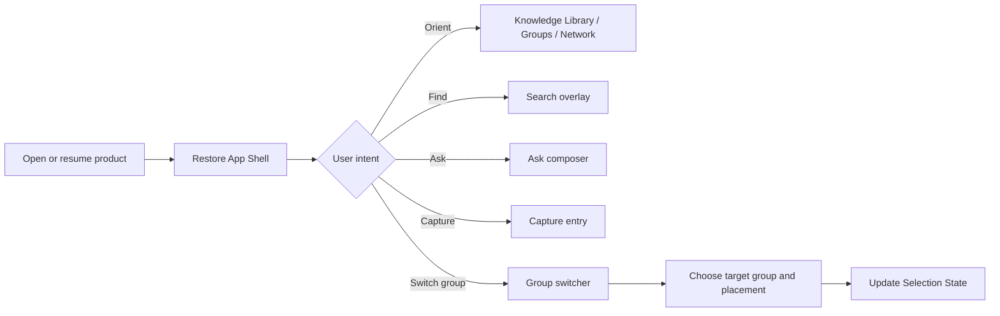

## 2.4 Stage 定义

### PB00-S1 Restore Shell

- 恢复上次可恢复的 Selection State、阅读位置和 Return Stack；
- Left Nav 只显示 Knowledge Library；Groups / Network 是 view control，Sources / History / Settings 进入 utility menu；
- Global Bar 显示 Back / Forward、DepthTrail、Search、Ask、Capture 与 System Status；
- 恢复失败时进入最近稳定父级，并说明未恢复的局部状态；
- 不自动重新触发上次未完成的 Ask 或 Knowledge Commit。

### PB00-S2 Switch Group

- 打开 Group Switcher 不改变当前选择；
- Switcher 显示 pinned、recent、all groups 和当前 Group；
- 选择目标 Group 后，若目标 Node 有多个 Placements，先显示 placement choice；
- 切换后写入 Back history，Back 能恢复原 Group、view mode 与位置；
- “打开另一个群”不等于改变 Ask 的已提交 Query Context。

### PB00-S3 Global Actions

- Search、Ask、Capture 从任意位置可打开；
- 默认继承当前上下文，但继承值必须可见；
- 关闭 Overlay 恢复原 Selection 和 focus；
- 提交动作后才进入对应流程板。

### PB00-S4 Deep Link

- 深链接恢复 Space、Group、Topic Placement、Node、Relation、Evidence 或 Saved Answer；
- 对象已移动时使用 redirect 恢复新位置；
- 对象不可用时保留父级上下文和替代入口；
- 深链接不能把用户送到没有 App Shell 的孤立页面。

## 2.5 设计证据

- Desktop Shell 正常态；
- Compact Shell / 200% zoom；
- Group Switcher overlay；
- Deep link moved / unavailable annotation；
- Back、Up、Close Detail 的并列行为说明。

## 2.6 验收门槛

- 任一核心流程的截图都能指出同一套导航、路径和全局动作；
- 从任意 L1–L5 状态切换布局，选择和阅读位置不变；
- Group Switch 后 Back 精确恢复原语境；
- 键盘只使用可预测 tab order，Overlay 关闭后 focus 返回触发点。

---

# 3. PB-01 Orient / 定位与进入

## 3.1 用户目标

用户打开产品后，不需要先回忆文件名或提出问题，就能理解：

- 自己拥有哪些主要 Knowledge Groups；
- 最近正在形成或变化的知识在哪里；
- 上次探索停在哪里；
- 从 Home、Library 或 Atlas 进入哪个范围最合适。

## 3.2 主覆盖

- A02 Knowledge Home；
- A06 Notifications / Knowledge Changes；
- B01 Knowledge Atlas。

## 3.3 主流程

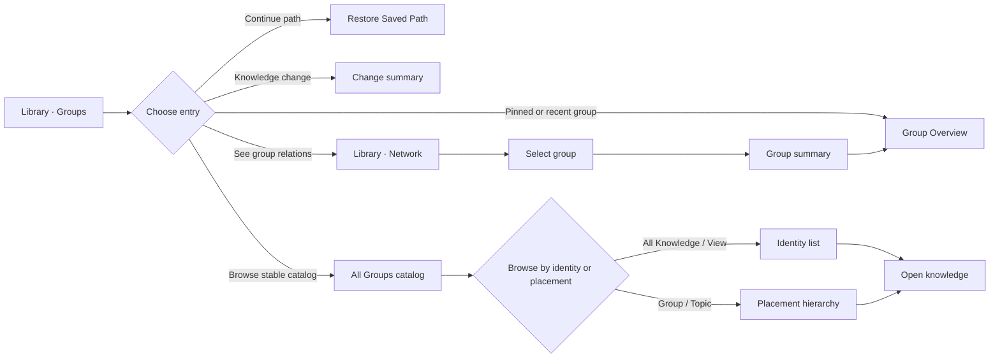

## 3.4 Stage 定义

### PB01-S1 Stable Library Groups catalog

首屏顺序固定为：

1. Resume：最多一个最近安全知识现场；
2. Pins：用户显式固定的少量快捷入口，没有则整区消失；
3. All Groups：按 stable catalog order 穷尽 active / dormant Groups，并拥有页面主体；
4. Secondary browse：Paths / Answers / Views / Recent / Archived，按需进入而不形成 feed；
5. Contextual notice：0–1 条真正影响当前理解的高影响变化；
6. Quiet actions：Search / Ask / Add 保持随处可用，但不占据首屏英雄区。

Library 不显示节点总数、处理条数、通知红点矩阵或泛化任务列表。它的第一印象必须是“我的知识世界”，不是工作队列。

普通启动恢复上次稳定的 Library mode、catalog scope、filter、selection hint 与 scroll，但不自动打开 last-safe Reading Workspace。存在 safe checkpoint 时最多显示一条 Resume，只有显式`继续`才恢复 exact target / Anchor / scroll / companion；普通点击 Group 始终进入 canonical Overview。first use 进入 Empty Library；New Window 进入独立 Stable Library；unsafe restore 进入 nearest safe reading fallback 并提供 repair。Recent / Resume 不复制完整 Recently Opened / Edited / Created 视图，也不创建统一 Inbox、AI 每日总结或待整理计数。

状态配置编排：

- Bare 只在刚创建且留下 safe checkpoint 时提供短期 Resume，不长期常驻；
- Structuring 显示已成立的主要方向，不显示整理完成度；
- Oriented 以名称、边界、稳定入口和少量必要状态呈现；
- Changes available / review due 只形成一条 contextual notice，不重排 catalog；
- Paused 仍在 All Groups、Search 与 Ask，但不主动竞争 Resume；
- Archived 进入 Archived View，Trash 只进入 Trash。

### PB01-S2 Knowledge Change Summary

- 只显示会改变用户理解或需要判断的变化；
- 每项说明发生什么、影响什么、为什么现在出现；
- 低价值自动元数据更新不进入 Home；
- 打开变化可以去 affected Overview、Saved Answer、Source Version、owner History / Impact 或 Decision Item；
- defer 不等于忽略，用户可在受影响对象或来源的 History / Impact 中找回。

### PB01-L Library Browse

Library 是 PB-01 内的稳定目录子流程，不新增 Coverage ID；它加深 A02 的“我的知识世界”与 PB-00 的 Selection / Return 通过标准。

- Library Root 固定提供知识群、全部知识、路线与回答、视图、已归档；Sources、Atlas、contextual Decision、History 与 Trash 不复制进目录；
- “全部知识”和跨范围 View 使用 Identity Row：同一 Node 多个 Placements 仍是一条，显示其他位置数量；
- Group / Topic hierarchy 使用 Placement Row：同一 Node 可以在多个位置出现，但都回到同一 canonical identity；
- View 由 scope、criteria、filter、sort、grouping、layout 与 property visibility 定义，评估结果动态变化，不保存 `member_ids`；
- 临时调整显示“仅这次调整”；保存修改产生 View revision，另存为产生新 View；
- Pin 只提供快捷入口，Recent 明确事件类型；两者不改变权威、检索或正式结构；
- 非空 Library 的注意力顺序固定为最多一条 Resume → 紧凑 Pins → 穷尽 All Groups；Recent 是次级 View，Paused Group 仍在 Catalog；
- Topic semantic order、Path order 与临时 sort / grouping 分开；拖放在提交前说明是在移动位置、增加位置还是跨群迁移；
- 打开 Node / Group / Path / View 后返回，恢复 Library scope、View revision、filters、sort、grouping、layout、expanded rows、scroll 与 identity / placement selection；
- filtered empty、View partial、offline-local 与 true empty 使用不同状态，不把“当前没有结果”写成“知识库为空”。

### PB01-S3 Atlas

- 默认只显示 Groups 和高价值正式群关系；
- 一个 Group 也不伪造网络；
- effective scope 在预算内可直接显示；超预算先显示 Scope Summary、hidden counts 与穷尽 List Equivalent，并进入 Anchor Required；
- Anchor 来自 Group、Search、Facet、Saved View 或 Path；定位后围绕 selected Group 展开约 3–7 个 accepted neighbours；
- 不按 degree / recency / AI relevance 选 Top N，不创建 canonical Group regions；自动 cluster 只作为可清除 overlay；
- 单击选择并显示摘要，双击或 Enter 进入；
- 候选群关系不进入默认图；
- List Equivalent 与图使用同一 Selection State。

### PB01-S4 Group Handoff

- 普通`打开知识群`以 Orient 到达 L1 Group Overview；`继续`恢复 last-safe Primary Task + Reading Path；deep target 直接进入 Read / Explore / Verify / Understand Change；
- DepthTrail 明确从 Space 到 Group；
- Home / Atlas 的视觉位置写入 Return Stack；
- Group 加载失败时保留群摘要和重试，不回到空白页。
- Handoff 保留完整 `state_configuration`，但普通 Group Overview 只根据 Orientation 与至多一条 overlay 组合内容；
- 从 change notice 进入时高亮受影响路径，从普通 Group tile 进入时仍回到 Overview 主轴。
- Group 内固定 Roots 为概览、目录、关系、来源；Reading 使用 Group > Topic > Node > Anchor，不成为第五 Root；变化、历史与判断按需进入；
- Root switch 只改变群级 Primary Task，Open Node 才改变 Reading Target；
- Group Workspace 继承 origin Active Place，除非用户显式进入 global Atlas / Sources；contextual Decision 不改变 Active Place。

## 3.5 数据夹具

使用场景压力测试中的三个 Groups：

- 认知科学；
- AI-native 个人知识库产品设计；
- 法国租房与入住房手续。

Atlas 只默认显示“认知科学 provides_foundation_for AI 产品设计”；第三个群保持未连接，除非形成被实际复用的正式 Method path。

Library 额外使用：

- Node“外部记忆”同时出现在“认知科学 / 记忆系统”和“AI 产品设计 / 知识模型”，用于验证 Identity Row 去重与 Placement Row 双位置；
- 两个同名“Context”，identity、定义与 Group 不同，用于验证消歧；
- 用户 View“本月需要复查”，在一条知识更新后动态加入成员；临时按标题排序但不改写 View definition；
- 无 Placement 的 Current / Draft Nodes、失效 Pin、部分可评估 View、100+ Groups / 10k Nodes，用于恢复和退化状态。

## 3.6 设计证据

- Home populated；
- Home high-impact change；
- Atlas 3 groups；
- Atlas 1 group；
- Atlas 100+ Anchor Required + Scope Summary + exhaustive List；
- Atlas List Equivalent；
- Group summary → enter annotation。
- Library with mixed state configurations；
- Bare / Oriented + review_due / Paused / Archived handoff variants。
- Library Root populated / empty；
- All Knowledge Identity Row + expanded Placements；
- Group hierarchy Placement Rows + semantic order；
- System / User View、temporary adjustment、evaluation changed；
- Pin / five Recent event types / Saved Path / Snapshot differences；
- filtered empty / View partial / offline-local / return restored；
- Library keyboard tree / 200% zoom / 10k Nodes virtualized。

## 3.7 验收门槛

- 用户能在 10 秒内选择要进入的群或恢复上次路径，并在 30 秒内说出至少三个群的边界；
- Atlas 不因共享词或相似度显示伪关系；
- Home 的变化入口能解释影响，而不是只有时间和标题；
- Home、Library、Atlas 三者职责不重叠。
- 复合状态共存不形成状态徽章墙，Paused 与 Archived 不制造 Library 噪声。
- 用户能解释为什么“全部知识”只有一条“外部记忆”，群内层级却有两个位置；移动一个位置不会改写或删除另一处内容；
- 用户能区分 Group、Topic、View、Saved Path、Pin 与 Snapshot，并且产品没有模糊的 Manual Collection；
- View 结果随规则与知识变化更新，但用户临时调整、规则 revision 与当前评估结果不会混为一条状态；
- 打开深层知识再返回时目录语境完整恢复；partial / offline / filter-empty 不产生虚假的空库结论。

---

# 4. PB-02 Read Deeply / 从 Overview 到 Evidence

## 4.1 用户目标

用户从一个知识群的整体地形逐层深入，最终核验原始来源，同时始终保留所在位置、父级范围、相邻分支和返回路径。

## 4.2 主覆盖

- B02 Group Overview；
- B03 Topic Structure；
- B04 Knowledge Node；
- B05 Deep Detail；
- B06 Evidence View；
- B11 Topic Overview。

## 4.3 主流程

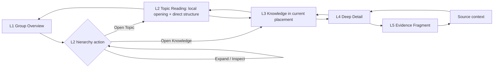

## 4.4 Stage 定义

### PB02-S1 Group Overview / L1

必须同时包含：

- Boundary / Orientation Editorial Blocks；
- Topic structure Projection；
- Representative Node References；
- Scope Synthesis Editorial Blocks；
- Conflict / Unknown / Change / Coverage Projections；
- Related Groups Projection；
- Navigation / Continue Path；
- 进入 Topic、Ask、Map、Changes 的动作。

这些内容来自同一 Overview Content Revision。Editorial prose 通过 revision / Diff 更新，Projection results 按 canonical objects 刷新；Reference 明确 Link / Live / Pinned / Quote；Navigation 不创造 Placement / Relation。Overview alignment 使用 aligned / changes available / review due / knowingly diverged，不与 Group Orientation / Attention / Lifecycle 混合。

Group Root switcher 固定为概览、目录、关系、来源；Overview 是 Orient Root，不包含 Reading tab。点击 Topic / Node 后进入 contextual Reading Path，并保存 origin Overview anchor。变化 Notice、History / Impact 与 Knowledge Decision 由受影响内容按需进入，不成为 Root。

同一 L1 构图必须支持复合状态：

- Empty Bare：名称和边界优先；`写下第一条知识`为主动作，`添加资料 / 建立主题`安静并列；无真实关系时 Map 主动退让；
- Structuring：覆盖说明、accepted Topics、root content 和少量可解释 proposals 分层；
- Oriented：Profile 退到背景，Overview、主题、稳定入口和稳定关系优先；
- Oriented + review_due：先保留仍成立的 Overview，再显示一条变化摘要及 affected path；
- Oriented + Paused + changes available：显示最后稳定 Overview、上次焦点和 since-last-focus impact；
- Archived：只读历史 Overview、引用位置、归档原因和恢复入口。

复合状态不能产生不同的导航、对象身份或图谱位置；它只改变真实信息权重、权限和至多一条必要说明。

### PB02-S2 Topic Structure / L2

- 展示父级、同级、子 Topic 与代表 Nodes；
- 只持久化直接 `parent_topic_id`，children、ancestors 与 DepthTrail 为派生结果；
- Topic 只有一个直接父级且不可跨 Group；多重语境由 Node Placements 表达；
- 结构树和 Topic Map 共享选择；
- Topic row 与 Node placement row 使用不同视觉语法；
- 展开状态持久化；
- 不默认显示所有节点数量；
- 当前分支有知识缺口时可见但不抢占主阅读。
- promoted Topic 使用 TopicGateway 显示“已成为独立知识群”，保留旧路径但不复制新 Group 的内容树。
- Tree focus / expand 不改变 Main Paper；Inspect 更新 Topic preview；Enter / explicit Open 才进入 Reading Path。

### PB02-S3 Topic Overview / L2

- 它是 Topic Reading 顶部的局部开场，与 direct children 位于同一 scroll surface；不是 Overview page 后再跳 Structure page；
- Editorial Orientation 只解释当前分支；
- Structure Projection 展示子 Topic 与代表 Nodes；
- Editorial Synthesis 只覆盖当前 Topic，并通过 Support Map 回到 Nodes / Relations；
- 不复制 Group Overview；
- Topic Overview 显示 coverage、conflict、unknown 与最后修订；
- 没有足够 prose 时，Structure Projection + 一句说明就是合法 Overview；
- 进入 Node 时保留当前 Topic placement。
- Bare / Compact / Editorial 由 accepted prose 与真实结构决定：Bare 不生成占位内容，Compact 是默认，Editorial 只在存在长期局部综合时展开；
- 默认只投影 direct children；`包含子主题`是显式 rollup，按 identity 去重并保留 paths；
- single-child Topic 不自动 redirect；可提出 flatten Change Set，Reject 零副作用；
- Search / Ask / Relation 的 Knowledge / Anchor deep link 直接进入目标；Up 才进入 Topic，Back 返回 caller，Resume 恢复 exact scene。

### PB02-S4 Knowledge Node / L3

- 使用 Identity、Orientation、Core Understanding、Conditions & Limits、Connections、Evidence & History 六段稳定语义；
- L3 与 L4 从同一 accepted Content Revision 投影，不保存第二份摘要或详细正文；
- 默认展开前三段，按任务披露后三段；
- Contextual Summary 解释它为何在当前 Group / Topic 中重要；
- Concept、Claim、Method、Decision、Question 等类型使用不同 D2 内容合同，不显示空模板；
- canonical content 与 contextual summary 清楚分离；
- 一个 Node 在不同 Group 打开时正文身份不变。
- ReadingTarget 保存 origin Root、placement context、Anchor、Current Revision 与 optional Explicit Draft context；它不是第六 Group Root。

### PB02-S5 Deep Detail / L4

- 以连续正文承载 mechanism、conditions、examples、counterexamples、limitations 与 comparison；
- Block 是编辑单元而非知识卡片；Block handles 默认隐藏，阅读态保持连续 Knowledge Paper；
- 关系和证据优先进入 Context Rail，不把正文切成卡片墙；
- 选中文本可限定 Ask、查看 Evidence 或复制 Node + Anchor 链接；完整 Section 可预览“成为独立知识”；
- 长内容保留大纲和阅读位置；
- Applicability 使用自然语言摘要。

### PB02-S6 Evidence / L5

- 显示 Source identity、Revision、Representation、human locator、原始片段和前后文；
- Evidence Binding target 明确为 whole Node、Node Anchor、Relation statement 或 Claim；Anchor 不成为正式 Relation endpoint；
- 区分原文、snapshot、翻译、OCR、转写、summary 与 inference；
- 以人话显示 Material Origin、Derivation Distance、Support Role、Extraction Fidelity 与 Verification State 中影响当前判断的部分；
- 同一 Fragment 通过不同 Bindings 显示它分别支持、反驳、限定、定义或举例哪些 Targets；
- 返回后恢复 L4 Anchor、Rail tab、Revision、Placement 与滚动位置；失配时显示 relocated / changed / ambiguous / orphaned / unavailable 并允许修复。

## 4.5 深度转场规则

- 点击对象决定语义层级，滚轮只辅助几何缩放；
- 每深入一级，DepthTrail 增加稳定对象；
- Up 返回父级语义范围；
- Back 返回用户上一个焦点，即使它位于另一个 Group；
- Close Detail 只关闭 Evidence / Relation Rail；
- L5 不把 App Shell 隐藏成独立 PDF 阅读器。
- Scope 变化、Reading Depth 展开和 Relation Radius 扩展分别记录；
- 展开 D2 不改变 L3 Scope，打开 R2 Path 不改变 D2 正文位置；
- 从 Search 直接进入 L3 + Anchor 合法，但必须恢复 Placement、DepthTrail、正文位置、Anchor state 和 Up path。
- Focus 不写 Return Stack，Inspect 不写 recent open；只有 Open 改变 durable Reading Target。

## 4.6 数据夹具

使用“认知科学 / 记忆 / 编码与线索 / 情境依赖检索”路径，并让同一 Node 同时出现在“AI Agent 产品设计 / 长期记忆 / Context Reconstruction”。

## 4.7 设计证据

- L1 Group Overview；
- L1 Bare / Oriented + review_due / Paused / Archived variants，保持同一 `overview_id` 与 content tree；
- L1 aligned / changes available / review due / knowingly diverged variants；
- Projection current / refreshed / incomplete 与 Editorial prose unchanged 对照；
- Overview Anchor → Support Inspector → Node Anchor / Relation → Evidence return strip；
- L2 Topic Structure；
- L2 Topic Overview；
- L3 Node；
- L4 Detail；
- L5 Evidence；
- L5 source unavailable variant；
- Back / Up / Close Detail transition strip。
- L3 Concept / Claim / Method / Decision reading variants；
- L3 + D2 + R1 → L3 + D2 + R2 transition strip。

## 4.8 验收门槛

- 从 Group Overview 到 Evidence 不超过四次对象进入；
- 每一级都能说清“我在哪里、为什么来到这里、如何返回”；
- Topic 和 Node 不会被用户理解为同一对象；
- Evidence 一跳回到使用它的 Node / Relation；
- 200% zoom 下流程仍可完成。
- Change Overlay 不阻断进入 L2–L5，Paused 恢复不改变原 DepthTrail 与 Saved Path。
- 用户能分别预测“进入子对象”“展开更多解释”“展开更多关系”的结果。
- 深层 Topic 仍能恢复完整路径；TopicGateway 能进入新 Group 并通过 Back 回到原父级语境。
- 长 Node 与短 Node 均可完成 D0–D3；产品不按 Heading、Block 或长度自动拆分。
- Search 命中、Ask 引用与 Evidence 能精确进入同一 Node Anchor，返回不丢失上下文。
- Topic move 只刷新 Structure Projection；不静默改写 accepted Editorial prose。
- Orientation refresh 只改变 Overview Presentation Profile；其他 conditions 只叠加 notice / permission，不复制 overview_id 或自动生成 revision。
- Ask for Overview 保持 Query Result；只有显式“建议更新概览”才进入 Semantic Diff。
- Overview Support Map 不以 Overview 自身作为 Evidence endpoint；独立 Claim 通过 Promotion 进入 Node。
- 用户能分别解释 active Root、Reading Path、focused item、inspected target 与 opened target；keyboard focus 或 Map single-click 不让正文和 Ask Scope 跳变。

---

# 5. PB-03 Explore Relations / 关系探索与跨群路径

## 5.1 用户目标

用户不必先知道问题，可以从当前 Topic、Node、Relation 或推荐路径发现相邻知识，理解一条关系为何存在，跨到另一个 Group，并保存这段理解顺序。

## 5.2 主覆盖

- B07 Cross-group Placement；
- B08 Group Relation Inspector；
- B09 Local Graph；
- B10 Saved Path；
- C08 Explore Recommendations。

## 5.3 主流程

```mermaid
flowchart LR
    A["Current Topic or Node · Quiet"] --> B{"Explicit relation intent"}
    B -->|"Inspect one"| C["Peek · Relation Inspector"]
    B -->|"Show relations"| D["Companion · Local Graph / List"]
    B -->|"Explore map"| E0["Explore · Relation Space Primary"]
    C -->|"Close"| A
    C -->|"Show relations"| D
    C -->|"Explore map"| E0
    D -->|"Inspect"| D0["Inspect Relation"]
    D -->|"Explore map"| E0
    E0 -->|"Inspect"| D0
    D0 --> E{"Target has placements?"}
    E -->|"One"| F["Open target + ReturnEnvelope"]
    E -->|"Several"| G["Choose placement context"]
    G --> F
    F --> H["Continue / Back / branch"]
    H --> I["Select meaningful Trail steps"]
    I --> J["Save Path revision"]
    J --> K["Continue with separate Progress"]
```

## 5.4 Stage 定义

### PB03-S0 Relation Presentation Ladder

- ordinary Group / Topic / Knowledge open、Search / Ask open supporting Knowledge 从 Quiet 开始；只有 explicit Continue / Resume 可恢复安全 Companion / Explore；
- Quiet 只显示可读 Relation Cue；hover、Focus、cursor、scroll、AI proposal、Answer Route render 与 background refresh 不升级；
- explicit `查看`进入 Peek；Close / Escape 回触发点，不改变 Reading Target、ReturnStack、Trail、Recent 或 Ask Scope；
- explicit `查看相关知识 / 显示关系`打开唯一 Companion；Reading 保持 Primary，默认只随 explicit Open target 更新；
- explicit `在地图中探索 / 打开知识网络`进入 Explore；Relation Space 成为 Primary，Reading 变为 Preview / Companion；
- Presentation 与 R0–R3 分开；切换任一维度不重置 Anchor、scroll、DepthTrail、Ask scope、Trail 或另一维的 scene state；
- Relation deep link 默认进入 relation-focused Peek；只有 link 携带 Map / Network scene 才进入 Explore；
- 0 条 maintained current Relation 显示诚实说明，1 条使用完整 statement / list，2–8 条允许 graph / list，dense state 初始只显示 4–8 条 current / applicable / task-relevant Relations；Candidate 与 History 必须显式开启各自 layer。

### PB03-S1 Local Graph

- 当前选择保持中心或稳定高权重位置；
- 初始只显示当前 Node 与约 4–8 个当前任务相关的一跳对象；
- 高价值二跳只在当前 Query Route 或用户明确展开时出现；
- 可按 relation type 过滤；
- selected、path-highlighted、suggested-layer、challenge-notice 与 historical-layer 不混淆；
- List Equivalent 与图同步；
- 节点位置稳定，重新进入不漂移。
- Structural、Evidence、Reference、Formal Relation 与 Retrieval Jump 分组并使用不同动作；
- `Show more` 按 relation family、direction、state 或 Group 展开，不一次性加入全部对象。
- hover / focus / inspect 不写 ReturnStack 或 Trail；Open 才改变 primary target；
- expand / filter / dismiss / group / pan / zoom 是可恢复 scene state，不成为 Path step。

### PB03-S2 Relation Inspector

必须显示：

- 完整 relation statement；
- from / to endpoints、endpoint resolution 与 snapshots；
- relation type、canonical direction 与 inverse reading；
- Applicability / qualifiers / valid time / exceptions；
- formation basis 与 adoption event；
- assertion disposition：maintained / ended / superseded / retracted；
- change condition：no material change / changes available / review due / transition in progress；
- Evidence Bindings / open Challenges；
- lifecycle：current / archived / trash；
- created by；
- 为什么显示在当前路径；
- Open source、Open target、Maintain、Revise、End、Supersede、Retract、Defer、Archive / Restore 或 History。
- derived salience 只解释“为什么现在显示”，不冒充知识状态。

RelationCandidate 使用单独 Inspector，展示 proposed statement / endpoints / type / Applicability、why suggested、basis、duplicate / conflict compare 与 Adopt / Edit / Dismiss / Defer。被拒绝的是 Candidate，不是正式 Relation。

当 endpoints 为 Group↔Group 时，Inspector 额外显示 why it matters、GroupRelationSupportSetRevision、各 supporting path 的 role / removal impact 与 exclusions。路径聚合产生的群关系在采用前保持 RelationCandidate；主要依据变化后创建 Support Set Revision 与 Review Case，Relation 仍 maintained + review_due，不静默删除或改类型。

PB03 的 Group Relation fixture 必须完整覆盖：

```text
cross-group exit
  → aggregation signal observed
  → raw paths collapsed to Effective Support Units
  → boundary / type / direction / counter / removal assessment
  → ambient candidate | on-demand candidate | exit-only | needs-more-support | ambiguous | conflicting
  → user adopt / edit / dismiss / defer
  → maintained current Relation
  → support reassessment / review_due / history
```

Signal、Assessment、Candidate 与 Relation 是不同记录；任一失败或取消都不能留下半条 Current edge。Candidate 被拒绝后仍保留底层 exits；正式 Relation 后来低于主动建议门槛时只触发 review，不自动退回 Candidate。

### PB03-S3 Cross-group Placement

- 目标 Node 有多个 Placements 时不自动替用户选择 Group；
- 默认推荐与当前 path 最连续的 Placement，并解释原因；
- 用户可以选择“保持当前群语境”或“切换到目标群”；
- 切换改变 contextual summary 和邻接结构，不复制 canonical content；
- Back 恢复原地图位置、缩放和过滤。
- Back 后 Open 新目标形成当前探索分支；Forward 可以失效，但`刚才的另一条分支`仍可恢复。

### PB03-S4 Explore Recommendation

- 每次只提供 2–4 条高价值路径；
- 说明推荐依据：结构缺口、关键对照、桥接关系或用户上次路径；
- 不使用“你可能感兴趣”式黑盒 feed；
- rejected recommendation 在无新证据时不重复出现；
- recommendation 只是入口，不自动创建 Relation。

### PB03-S5 Saved Path

保存：

- title 与 purpose；
- 用户从 Trail / branches 主动选择并重排的 ordered steps；
- 每步 target identity、可选 placement context 与保存时 revision；
- structural / formal relation / evidence / reference / manual connector；
- manual step 的 step rationale；
- Path revision basis。

Path 不复制 Nodes，也不保存 last position、completed steps、scroll 或 viewport。路径中对象移动、被替代或不可用时显示 current / redirected / changed / historical-only / unavailable，不让路径静默断裂。

Path 可以包含没有正式 Relation 的 manual step，但保存时明确标注；manual step 不进入 Atlas 或 Local Graph 的正式关系层。`Re-evaluate Path` 可以提出当前等价路线，但不覆盖 original revision set。

### PB03-S6 Continue / Progress / Resume

- PathProgress 单独保存 current / completed / skipped steps 与 current anchor；
- Continue Path 只更新 Progress 与 ResumePoint，不创建 Path revision；
- Reset Progress 不删除 Path 或 Scope 推荐引用；
- ordinary Group open 进入 Overview，只有 explicit Continue 恢复 exact step；
- Home Resume 说明 Group、Knowledge、Anchor、Path title 与 step；
- Path revision 变化后按 step compatibility 迁移 Progress，并让 ambiguous split 由用户选择。

### PB03-S7 Path Impact / Re-evaluate

- current、redirected、changed、historical-only、unavailable 使用可读状态；
- 可查看保存时路线与当前对象；
- Relation superseded、Topic split、Source unavailable 分别有修复；
- Re-evaluate 生成 successor / draft revision，不覆盖 original；
- Graph 与 List、mobile 与 keyboard 完成相同影响判断。

## 5.5 数据夹具

路径：

```text
认知科学
  → 情境依赖检索
  → 检索线索
  → Context Reconstruction
  → AI-native 个人知识库产品设计
```

“法国租房”不因共享“证据”一词自动连入；只有正式 Method Node 被两个群实际采用时才形成桥接。

## 5.6 设计证据

- Relation Presentation transition strip：Quiet / Cue → Peek → Companion → Explore → exact return；
- ordinary open vs Resume、follow-open vs pinned、Relation deep link、0 / 1 / dense relation matrix；
- Local Graph normal / selected / filtered；
- Local Graph five connection classes / 60-neighbour budget；
- Relation Inspector accepted / suggested；
- Placement choice overlay；
- Cross-group transition；
- Explore recommendations rail；
- Back → new Open branch 与 alternate branch recovery；
- Saved Path draft / normal / impacted / historical；
- PathProgress / Resume normal / reset / revision mismatch；
- scene undo / restore 与 Trail 不污染证明。

## 5.7 验收门槛

- 用户无需知道状态名，也能预测`查看 / 查看相关知识 / 在地图中探索`分别是否改变正文、Primary、history 与 return；
- ordinary open 不恢复旧 Companion / Explore，hover / Focus 不升级，Companion 只 follow explicit Open 且最多一个；
- Presentation 与 Radius 正交；0 / 1 / dense relation、accepted / suggested、desktop / mobile、Graph / List 语义等价；
- 用户能解释当前边的类型、方向和依据；
- Suggested Relation 不会被误认成正式知识；
- 跨群后 Back 精确恢复原图；
- List Equivalent 可以完成相同探索任务；
- 保存 Path 后重新进入不会复制 Node 或丢失 placement context。
- 用户能说清当前线是结构、证据、普通引用、正式关系还是本次检索跳转。
- 每条正式 Atlas 群边都能解释“为什么相连、为什么重要、通过哪些知识相连、依据和限制是什么”。
- 用户能区分上一处、上一级、当前分支、已保存路线与继续进度。
- Continue / Reset Progress 不改变 Path revision；manual step 不创建 Relation。
- hover、Inspect、scene operations 不进入 ReturnStack / Trail / SavedPath。

---

# 6. PB-04 Ask & Find / 查询、定位与历史回答

## 6.1 用户目标

用户既能快速找到已知对象，也能向自己的知识库提出问题；回答不脱离知识空间，而是显示用户要求查什么、系统实际采用什么、真正用了什么，以及每个主要结论的依据、知识路径、证据、冲突、未知、Coverage 和继续探索入口。

## 6.2 主覆盖

- A04 Global Search；
- A05 Global Ask；
- C01 Scoped Ask Composer；
- C02 Answer + Knowledge Route；
- C03 Answer Conflict；
- C04 Answer Unknown；
- C05 Answer-to-Graph；
- C06 Save as Knowledge；
- C07 Search Results；
- C09 Query Context；
- C10 Saved Answer Version。

## 6.3 Search 与 Ask 双入口

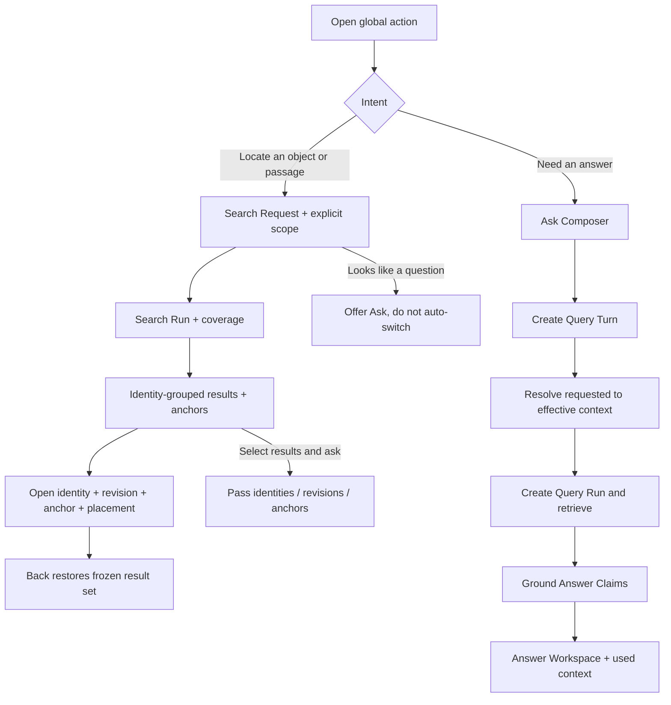

## 6.4 Ask 主流程

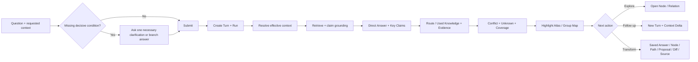

## 6.5 Stage 定义

### PB04-S1 Search Overlay

- 当前表面明确为 Global、Scoped、Find in Object、Picker、Command 或 Saved Search；共享入口不隐藏不同合法结果与动作；
- 输入、Scope、Mode、Filter 或 Sort 每次变化创建 Search Request / Run；Result Set 在当前 Session 内冻结，知识变化只提示 Refresh；
- 默认 Best Match，Exact title / confirmed Alias / exact phrase / lexical full-text 先于 Similar Meaning；近期性只作 tie-break；
- 输入时按 `你的知识`、`来源`、`保存的回答与路径`、`视图`分组；Commands 只在允许时独立分区；
- Block / Evidence Fragment / Answer Claim 粒度命中仍聚合到父对象 identity + Anchor / locator，不生成片段对象；
- 同一 identity 的多 Anchors 与 Placements 聚合；同名不同 identity 用 definition、Group、Applicability 与状态消歧；
- 每项显示对象角色、真实 snippet、匹配原因、所在路径、状态、Applicability、Anchor 数和 Index 限制；不显示裸 relevance 百分比；
- 默认 Search 包含 Current Revision；Explicit Draft 只在 Draft scope 中带标记出现，Recovery Checkpoint 永不进入；Archived / Historical 显式进入，Trash 只在 Trash 内搜索；
- 当前 Scope / All Knowledge 可切换；Scoped no result / Global yes 只显示明确扩大建议，不混排；
- 打开传递 identity + revision + Anchor + Placement；Back 恢复 Query、filters、结果顺序、scroll 与 Selection；
- 无结果区分 typo / Alias、filters、Scope、excluded states、Index partial / stale、Source unparsed、OCR uncertain、semantic unavailable、failure 与 true no match；
- 完整问题只提示 Ask，不自动改变模式；选择结果转 Ask 只传 identities / revisions / anchors；
- AI / network unavailable 时 local exact、alias、full-text 与 property Search 保持可用。

### PB04-S2 Ask Composer

- Quick Ask 默认继承当前 Selection；
- ScopePicker 只表达 Knowledge Scope；
- QueryContextSummary 用“你让我查的范围”表达 Scope Anchor、Expansion、as-of、status、applicability、source policy 和 external knowledge；
- 高级条件可展开，但不要求普通问题填写数据库表单；
- submit 只创建 Query Turn，不把问题与一次模型执行混成同一个对象；
- 从 Editor submit 前先 flush Direct Edit Commit；失败时保留问题，并让用户选择修复保存或明确仅本次使用未提交文字；
- submit 前显示用户请求范围，保留 original question 与系统 interpreted intent；
- AI offline 时保留问题并提供 Search。

### PB04-S3 Query Context Resolution

- 自动继承能可靠确定的 Group、Topic、Node、Source 与日期；
- 缺少会改变答案的必要条件时只问一个最关键问题；
- 条件仍不确定时输出清楚的分支答案；
- Current Focus 只解释指代与返回位置，不自动扩大 Scope；
- Scope Anchor 与 Expansion Policy 分开；
- 系统扩大、排除或降级范围必须说明；
- Run 分别冻结 Requested、Effective 与 Used Context；
- 宽泛全库 Ask 以 Groups 结算 eligible、covered、excluded、unavailable 与 index-partial；只覆盖部分时用`在已覆盖的 X / Y 个知识群中`，不让少量检索样本代言全库；
- 默认 active Current Revision，外部知识关闭且只允许可引用资料；Explicit Draft 与本次未提交文字都需单独、可见地加入。

### PB04-S4 Retrieval / Streaming

- 每次执行创建独立 Query Run，记录实际 index、model / execution mode、local / cloud、source policy 与 exclusions；
- 显示正在检索的 Effective Context、index coverage 和可取消状态；
- 候选召回不等于 Used Context，只有实际支撑 Claim 的 refs 进入 Used；
- streaming-ungrounded、streaming-grounded、incomplete、cancelled、failed 与 complete 分开；
- Stop 结束当前 Run，保留 Question、Context 与已生成部分，但 incomplete 不能伪装为普通完成态；
- Source unavailable、scope too narrow、index partial、invalid grounding 与 AI failure 使用不同恢复动作。

### PB04-S5 Answer Workspace

固定信息顺序：

1. Question + Actual Context；
2. Direct Answer；
3. Key Claims + Claim Support；
4. Knowledge Route / Used Knowledge；
5. Evidence；
6. Conflict & Unknown；
7. Coverage；
8. Explore Next；
9. Transform actions。

回答不是长报告默认态。复杂内容逐层展开，关键结论可点击进入相关 Node + Anchor + Placement、关系或证据，并通过 Return Stack 回到原 Claim。

Knowledge Route 中每个 step 必须标明：structural connection、formal relation、evidence connection、retrieval jump 或 external knowledge。每个主要 Answer Claim 能高亮其 steps；若无法形成可靠 Route，使用 Used Knowledge List + Evidence。

Claim basis 使用四类人话：来自你的知识、来源原文、外部资料、基于这些知识可以推断。Citation 精确进入 Node + Anchor + revision、Evidence Fragment + Source locator 或 external snapshot；统一 references footer 不代替 Claim-level mapping。

### PB04-S6 Conflict / Unknown

- Conflict 先比较 Applicability；
- 不同条件下同时成立显示为 qualified branches；
- 真正冲突并列双方、来源、时间和条件；
- Unknown 区分当前范围无相关知识、证据不足、范围过窄、来源不可用、Index partial 与外部知识未允许；
- Coverage 单独显示 sufficient / partial / insufficient / indeterminate；
- 负面回答限定 Scope、状态、时间、排除项、来源可用性和已完成索引，不把“未找到”写成“不存在”；
- 不用模型常识无标注填补知识库缺口。

### PB04-S7 Answer-to-Graph

- 全局 Ask 高亮 Groups；
- Group Ask 高亮 Nodes / Relations；
- Topic Ask 展开使用的 hierarchy branches；
- Node Ask 高亮 Local Graph；
- 点击回答对象改变 Selection State，并写入 Return Stack；
- 清除高亮不离开当前 Answer。
- 两个被同时检索但没有 formal Relation 的 Nodes 分别连接到 Answer Claim，不互相画 `related_to`；
- retrieval jump 关闭 Answer 后消失；用户可另存 RelationCandidate，或补全语义后直接提交 maintained Relation；
- 点击 Answer Claim 只显示支撑它的 RouteSteps 与 Evidence，Back 返回原 Claim 位置。
- 清除 Query overlay 后恢复 canonical graph layout、Selection 与长期 Relation truth。

### PB04-S8 Save

- Synthesis：创建新 Node Proposal；用户检查并确认后形成 Current Revision；
- Question：创建 Inquiry Node；
- Path：保存探索顺序；
- Merge into Node：先预览 diff；
- Answer Snapshot：保存原始回答、Context、route、evidence 与 revision set；
- RelationCandidate：保存关系建议，不直接建立正式边；Direct Relation：补全并提交后创建 maintained Relation；
- Overview Diff：进入 Semantic Diff，不直接覆盖 accepted Overview；
- Save Source：保存外部资料与 snapshot，不自动接受其中内容；
- 不提供含混的 Save Chat 作为主要知识动作。
- 不能把整段 Answer 一键升级为 Accepted；Node / Relation 写入只处理选中 Claim 并进入对应 Preview。

### PB04-S9 Saved Answer Impact

- Original Snapshot 永不改写；
- 受影响时显示 changed objects 与原因；
- View Original 始终可用；
- Re-evaluate Now 创建新的回答版本并显示差异；
- Re-evaluate 创建新 Query Run / Answer Snapshot，并按 Claims、support、unknown、coverage 与 Context 比较；
- Pin as Historical 保持当时语境；
- Merge Learning 把稳定理解提交到 Node，而不是改写历史 Answer。
- Merge Learning 生成 block-level patch，并显示 Anchor、Evidence 与 ownership 影响，不整篇覆盖正文。
- Saved Answer 默认不参与当前事实查询；只有显式历史范围或元问题才进入。

### PB04-S10 Follow-up / Branch / Retry

- Follow-up 创建新 Query Turn，并从上一 Run 继承 Effective Context；
- Scope、Expansion、As-of、Applicability、状态、Source 或 External policy 变化显示 Context Delta；
- 上一 AI Answer 默认不成为事实 support，系统重新回到原始 Knowledge / Evidence；
- Rephrase、Retry、Branch、Resume 与 Re-evaluate 拥有不同 history relation；
- 任一历史 Run 可恢复自己的 Answer、Actual Context、Claims、Route 和临时 Query overlay。

## 6.6 数据夹具

使用两个问题：

1. “为什么这个产品最终不是 Project Continuity 工具？”验证 historical as-of、superseded Decision 与 Saved Answer；
2. “入住前还需要准备什么？”验证对象、日期、source policy 与 Applicability 缺失时的澄清。

另用六组变体强制验证：当前 Group 无结果但全局有且索引 partial；同一 Claim 同时使用用户知识、来源原文、外部资料和推论；“那非学生呢”只改变 Applicability 的 Follow-up；同一长 Node 有七处 Anchor 命中且有两个 Placements；两个同名 Nodes 具有不同 Applicability；Source 原文、Accepted Node 与 Saved Answer 同时包含同一句话。

## 6.7 设计证据

- Search Overlay：Global / Scoped / Find / Picker / Command / Saved View；
- Search exact / alias / full-text / semantic、对象 identity 聚合、多 Anchor、多 Placement、同名消歧；
- Search result row + match reason + coverage summary + partial / stale / refreshing；
- Search no result：scope / filter / excluded state / unparsed source / true empty / failure；
- Search → Node Anchor → Evidence → Back state restoration；
- Search → Ask identity transfer、Search → Explore no false edge；
- Saved Search dynamic View 与 frozen Snapshot 对比；
- Quick Ask；
- Query Context collapsed / expanded / missing condition；
- Requested / Effective / Used Context + Context Delta；
- Retrieval / cancelled / AI failure；
- Answer streaming-ungrounded / grounded / incomplete / complete；
- Answer normal / conflict / unknown / partial coverage / no relevant knowledge；
- Answer Claim support internal / source / external / derivation；
- Answer-to-Graph synchronized state；
- Answer Route formal / structural / evidence / retrieval / external variants；
- Used Knowledge List fallback；
- Save options；
- Saved Answer impacted / compare versions。
- Query Run history + retry / branch / follow-up / re-evaluate lineage；
- Answer transform menu 的八种对象后果。

## 6.8 验收门槛

- 用户能预测 Search 与 Ask 的不同结果；
- 同一对象的多 Block 命中与多 Placements 不产生重复 identity，同名对象也不被自动合并；
- exact title / phrase / Alias 不被 semantic 或近期性压过，Similar Meaning 不被误读为正式 Relation；
- Scoped no result 不混入全局结果；无结果必须说明 Scope、filters、Index、Source / OCR 与 exclusions；
- Search 打开深层 Anchor 后，Back 恢复原 Request、Result Set、scroll 与 Selection，不静默重跑；
- Explicit Draft 可以在 Draft scope 找回但不自动进入 Ask；Recovery Checkpoint 不进入 Search；Archived / Historical / Trash 的进入边界可预测；
- Saved Search 动态求值且不保存成员，冻结结果使用 Snapshot；
- Answer 前能预测 Requested Context，之后能检查 Effective 与 Used Context；
- 点击结论一跳进入知识位置，返回时恢复 Answer；
- Conflict 与不同 Applicability 不被混淆；
- 旧 Answer 不被新知识静默改写；
- AI failure 不阻止 Search 和知识浏览。
- 关闭 Answer 后，长期 Graph 的正式边数量不因本次检索变化。
- Block 检索命中、Answer Claim 与 Evidence 使用同一 Node Anchor；定位失败不会静默跳到相似段落。
- 负面回答只能证明当前 Coverage 边界，不暗示全库或现实世界不存在；
- Follow-up 显示 Context Delta，上一 AI Answer 不递归成为事实支持；
- Saved Answer 默认不进入当前事实检索，Re-evaluate 不覆盖 Original；
- Quick Ask 与 Full Answer 使用同一 Turn / Run / Claim Support model。

---

# 7. PB-05 Capture & Compile / 来源进入与知识编译

## 7.1 用户目标

用户可以把外部资料安全收进知识库，也可以在没有 Group 的情况下快速写下自己的想法；是否让 AI 形成 Nodes、Relations、Placements 与 Overview，是之后独立、可理解、可撤销的决定。

## 7.2 主覆盖

- D01 Capture Entry；
- D02 Parsing Progress；
- D03 Source Preview；
- D04 Knowledge Proposal；
- D05 Duplicate Match；
- D06 Partial / Failed Import；
- D07 Batch Commit；
- D08 Source Commit。

## 7.3 主流程

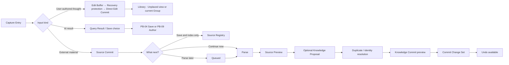

## 7.4 Stage 定义

### PB05-S1 Capture Entry

- 支持 link、file、folder、text、note、selection、image、audio/video 与 saved AI excerpt；
- 默认继承当前 Group / Topic，但 Placement 永远可选；
- file / link / external selection 默认是 Source；用户直接输入默认建立 user-authored Current Knowledge；AI excerpt 默认是 Query Result；
- 粘贴文本来源不明时只问“这是你写下的知识，还是要保存的一份来源？”；
- Explicit Draft 进入 Library“草稿”View；没有 active Placement 的 Current Knowledge 进入“未归类”View；Recovery-only 内容只从异常恢复入口出现。三者独立，均不因等待而触发 Knowledge Decision；
- 创建 Source 前显示待保存内容和明显错误；
- 多文件批次不要求为每个文件立即选择 Group。

### PB05-S2 Source Commit

Source Commit 保存：

- Source identity；
- 原始位置或可校验 snapshot；
- metadata 与 observed_at；
- initial revision；
- connection / permission state；
- indexing intent。

完成后 Source 已在 Registry 中可见。用户关闭 Capture 不会丢失已提交 Source，也不会因此创建 Draft 或 Current Knowledge。

### PB05-S3 Parse / Index

- 显示实际阶段和已可用范围，不显示虚假精确倒计时；
- 支持后台继续、停止解析和稍后重试；
- partial success 保留已完成片段；
- 停止解析不删除 Source；
- 多来源批次显示逐项状态和批次整体状态。
- 完整解析允许 zero semantic yield；此时 Source 保持可读、可搜，不创建空 Node、Topic 或 Decision Item；
- “没有发现知识变化”与“解析不完整，暂时无法判断”使用不同状态。

### PB05-S4 Source Preview

用户核对：

- title、author、date、structure；
- OCR / transcription quality；
- exact locators；
- excluded sections；
- suspected duplicate Source；
- version relationship。

用户可在此结束，不被迫进入 Knowledge Proposal。

### PB05-S5 Knowledge Proposal

候选先按 target Node、claim family、Topic structure、identity decision 或同一来源更新影响合并为 Decision Bundle，再按四类展开：

1. Node candidates；
2. Relation candidates；
3. Group / Topic Placements；
4. Existing knowledge impact。

每个 Bundle 先用一句话说明用户要做的决定，再支持 Accept、Edit、Ignore、Evidence、Why Suggested 与 Apply to Similar。默认只呈现 3–7 个最高价值 bundles，并说明其余候选如何归并。

解释使用 identity evidence、semantic importance、Applicability、downstream impact 与 reversibility；不使用百分比或 High / Medium / Low 置信标签代替判断。

### PB05-S6 Duplicate / Identity Resolution

- 分别判断 same Source revision、duplicate Source、evidence for existing Node、revision of existing Node、contextual Placement、distinct Node 与 source-only；
- 提供 side-by-side identity evidence；
- Add Evidence、Update Existing、Add Placement、Create Separate、Link as Version、Keep Duplicate、Source Only；
- 不确定时保留两个 Proposal candidates，不静默合并；
- 被拒绝的 match 在无新证据时不重复出现。

### PB05-S7 Knowledge Commit Preview

显示：

- creates / updates / unchanged；
- affected Groups、Topics、Overviews、Relations；
- affected Saved Answers 与 Views；
- new decision-required items；
- user-locked content；
- undo scope。
- deferred / excluded candidates；

用户可逐类排除；排除一个 Relation 不自动排除其 Evidence Source。

### PB05-S8 Commit / Undo

- Knowledge Commit 形成 Change Set；
- 批次内只提交已确认或规则允许的变化；
- Undo 撤销派生知识变化，默认保留 Source Commit；
- Undo 后所有 Overview、Search index 和 Answer impact 同步重建；
- 失败时显示已提交、未提交和可重试部分。

## 7.5 数据夹具

同时使用三个数据夹具：

1. “法国租房”大型合同 PDF：先 Source Commit，之后触发 Parse，再审查当前住所要求的 Claim 与 Applicability；
2. 全局输入“图谱不应替代层级阅读”：首个安全 Direct Edit Commit 形成无 Placement 的 Current Knowledge，不制造 Source；
3. 300 份旧资料批次：样本解析、identity mapping、3–7 个 Decision Bundles、部分失败与批次 Undo。

## 7.6 设计证据

- Capture Entry single / batch；
- Source Commit success；
- next-step choice；
- parsing active / partial / failed / stopped；
- zero semantic yield；
- Source Preview；
- Knowledge Proposal bundled / expanded；
- Duplicate Match；
- Recovery / Draft / Current / Unplaced 分离；
- Change Set preview；
- commit success / partial / undo。

## 7.7 验收门槛

- 仅保存 Source 的路径和“现在生成知识”同等清楚；
- parse failure 不导致 Source 丢失；
- Source-only 不创建 Draft、Current Knowledge 或 decision debt；
- 用户原创快速记录不要求 Source 或 Placement，并能从 Library 找回；
- zero semantic yield 不被当作失败，也不创建空知识；
- 一次默认审查不超过 3–7 个 Decision Bundles；
- identity 建议能区分补证、修订、新位置、新身份与只保留来源；
- Knowledge Commit 前能理解对已有知识的影响；
- Undo Knowledge Commit 不默认删除 Source；
- 批次部分失败不会让用户重新上传全部资料。

---

# 8. PB-06 Maintain Knowledge / 知识维护与演化

## 8.1 用户目标

用户只处理真正会改变理解的事项，并能在提交前看清：发生了什么、为什么需要判断、哪些对象会受影响、决定后如何传播、能否撤销。

## 8.2 主覆盖

- B12 Topic Reorganization；
- E01 Contextual Knowledge Decision；
- E02 Relation Suggestion；
- E03 Node Merge / Split；
- E04 Conflict Resolution；
- E05 Overview Diff；
- E06 Correction Propagation；
- E07 Group Split / Merge；
- E08 Stale Knowledge；
- E09 Applicability Comparison；
- E10 Change Set Impact。

## 8.3 共享 Decision 生命周期

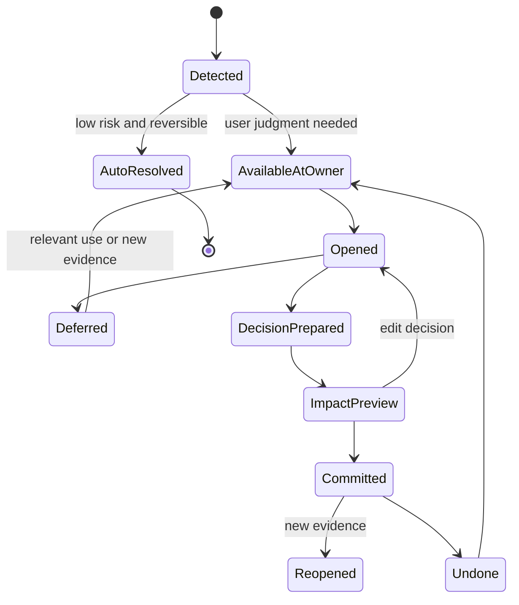

## 8.4 Contextual Knowledge Decision

- 只在 identity、conflict、locked content、group boundary、stale high-impact 或 source impact 等确实需要判断时，从受影响 owner、来源、Overview Notice 或 History / Impact 进入；
- 没有独立全局队列；同一 owner / event bundle 内才按 Identity ambiguity × Epistemic impact × Reach × Reversibility × Relevance × Time sensitivity 排序；
- 每项显示 event、reason、affected scope、suggested action、defer consequence；
- formatting 和低价值 metadata 不制造 decision debt；
- 新来源、普通未归类对象、Explicit Draft、zero-yield 编译和只改变 availability 的事件不制造 decision debt；
- 无需判断时不显示空页面、零计数、未读徽章或奖励式清零动画。

## 8.5 三类维护子流程

### PB06-A Identity & Structure

覆盖 Topic Reorganization / Promotion、Node Merge / Split、Group Absorb / Split / Merge。

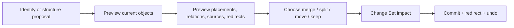

规则：

- Topic 删除只移除结构和 Placements；
- Topic Promotion 创建新 Group，并让旧 Topic 成为 Gateway；Placements 可 move / share，Node、Evidence 与 Source 不复制；
- Node Merge 选择 canonical identity，保留 aliases、sources、relations、Anchors 与 redirects，再以 block-level diff 合并内容；
- Node Split 预览哪些 blocks、anchors、placements、relations 和 evidence 去向哪个新 Node；
- Group Absorb / Split / Merge 保留旧 identity、links、Saved Paths、redirect 和历史 Overviews；
- Group Split / Merge 不自动合并 Node identities，identity ambiguity 进入 contextual Decision；
- 不允许把“整理”表达成简单删除确认。

### PB06-B Epistemic & Applicability

覆盖 Relation Suggestion、Conflict Resolution、Stale Knowledge 与 Applicability Comparison。

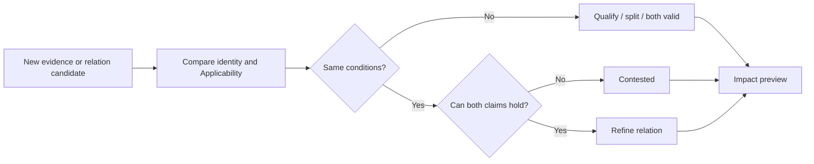

规则：

- Applicability 对照优先显示 subject、organization、location、conditions 和 valid time；
- “Prefer A”不自动删除 B；
- Stale 只改变 freshness，不能自动改变 lifecycle；
- Relation Suggestion 显示 why、evidence、type、direction 与 downstream impact；
- Rejected Suggestion 只有出现新证据时才可重新提出。

### PB06-C Derived Knowledge

覆盖 Overview Diff、Correction Propagation 与 Change Set Impact。

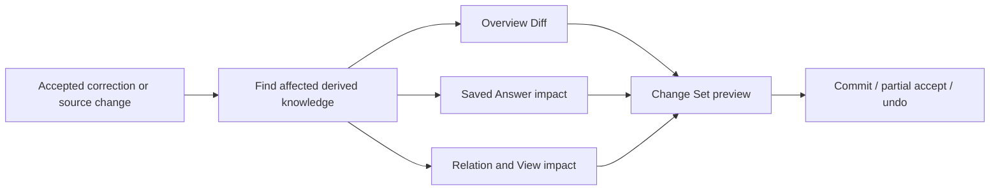

规则：

- Overview Semantic Diff 先区分 Boundary、stable understanding、structure / relation、conflict / unknown、entry path、wording 与 projection-only；
- 每处 prose 变化通过 Support Map 指向 Node Anchor、Relation、Structure Projection 或 Boundary，再进入 Evidence；
- Projection result 可以刷新，但不会与 Editorial prose 作为同一次改写提交；
- 用户锁定段落不被自动改写，`content_locked + review_due` 可以同时成立；
- Saved Answer 只标记 impact，不改写 Original；
- 不能自动重建的用户文本进入明确 Decision Item；
- Change Set 显示 changed、affected、review 和 undo 四个范围。

## 8.6 数据夹具

使用产品方向从 Project Continuity 转向 AI-native 个人知识库的真实方向变化：旧 Decision 被 supersede，仍有价值的能力重挂到项目型 Group / View，产品 Overview 局部 Diff，旧 Saved Answer 被标记 affected。

## 8.7 设计证据

- contextual Decision from owner / event bundle；
- Relation Suggestion；
- Node Merge / Split；
- Topic move / delete；
- Group Split / Merge；
- Topic Promotion / Gateway 与 Group Absorb；
- Applicability Compare；
- true Conflict；
- Stale but Accepted；
- Overview Diff；
- Correction Propagation；
- Change Set preview / committed / undo。

## 8.8 验收门槛

- 用户能区分“条件不同”和“真正冲突”；
- Topic / Group / Node 重组不会丢失 canonical knowledge；
- 每次重大决定都能看见 downstream impact；
- 低价值事项不触发 Knowledge Decision；
- 用户锁定内容不被静默覆盖；
- Commit 后可以通过同一 Change Set 精确 Undo。
- Group structure change 前能逐项检查 Placement move / share / keep、Overview、Relations、Saved Paths 与 redirects。

---

# 9. PB-07 Sources & Provenance / 来源、证据与版本

## 9.1 用户目标

用户可以管理原始材料、核验证据、理解来源变化的影响，并在权限或连接失效时知道保留了什么、失去了什么、如何恢复。

## 9.2 主覆盖

- F01 Source Registry；
- F02 Source Reader；
- F03 Annotation / Evidence Fragment / Binding；
- F04 Source Revision Diff；
- F05 Disconnect Impact；
- F06 Re-index / Re-parse；
- F07 Evidence 五轴。

## 9.3 主流程

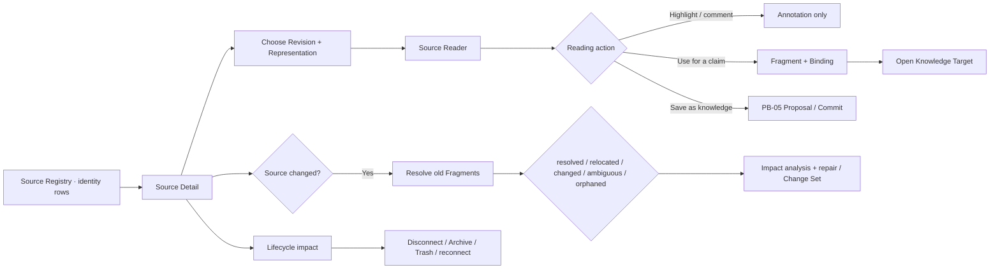

## 9.4 Stage 定义

### PB07-S1 Source Registry

- 按 Source identity 列出 title、type、creator / origin、current Revision、available Representations、availability、parse coverage 与必要 knowledge impact；
- 同一 Source 的 PDF、HTML、snapshot、OCR、transcript、translation 与镜像不重复为多 Rows；
- 可过滤 Recently added、Changed、Unavailable / permission changed、Parsing partial、Reference-only risk、Source-only、Evidence needs repair 与 Archived；
- Source-only Capture 立即出现；
- 解析中 Source 可阅读已可用部分；
- Registry 不等于文件管理器，不以目录树作为唯一结构；
- citation / fragment / node count 不作为权威排序或产出评分。

### PB07-S2 Source Detail / Reader

- Source identity、metadata assertions、connection 与 current / historical Revisions；
- original、linked file、managed copy、snapshot、normalized text、OCR、transcript 与 translation Representations；
- 原始结构与媒体专属 Selector Bundle；
- Knowledge created from this Source；
- Annotations、Evidence Fragments 与 Evidence Bindings；
- search in source；
- Re-parse / Re-index、Disconnect、Archive、Trash 与 impact actions；
- PDF、网页、表格、代码、图像、音视频、对话与数据使用各自真实位置语法；
- 从 Citation 进入时锁定 binding 所用 Revision，并保留 Knowledge Target / Anchor 与 Return Context。

### PB07-S3 Evidence Fragment

- Source Revision、Representation 与 Selector Bundle；
- content snapshot + surrounding context + normalized digest；
- Material Origin、Derivation Distance、Extraction Fidelity 与 Verification State；
- Fragment 不保存 supports / contradicts；Evidence Binding 分别保存对具体 Node Anchor、Relation statement、Overview / Answer Claim 的 support role；
- 同一 Fragment 可通过多个 Bindings 分别 supports / challenges / qualifies / defines / exemplifies；
- 一跳进入 target，并从 target 返回相同 Fragment / Revision；
- 不用 citation number 隐藏来源状态。

### PB07-S3A Annotation Promotion

- Highlight、underline、comment、bookmark、question 与 tagging 默认只创建 Annotation；
- `用作当前知识的依据`创建 Fragment + Binding，`保存为知识`进入 PB-05，两者不同；
- Annotation color 只是一种 style hint，不代表事实、反驳、重要性或 confidence；
- 提升后删除 Annotation 不删除 Fragment / Binding；删除 Binding 不删除 Fragment、Source 或 Target。

### PB07-S4 Source Version Diff

- immutable old / new Revision 与 Representation diff；
- Fragment resolution：resolved、relocated、changed、ambiguous、orphaned、unavailable；
- 只有 digest / exact quote / context 唯一验证的 relocation 才自动 redirect，多候选只产生 repair proposal；
- affected Nodes、Relations、Overviews、Saved Answers 按 citation-only、support-changed、knowledge-review、historical-only 分组；
- user-locked knowledge；
- keep historical、accept redirect、replace Binding、qualify、update through Diff、contest、defer；
- current Revision 到达不在阅读中静默替换旧片段。

### PB07-S5 Re-index / Re-parse

- 预览将重建的 normalized text、OCR / transcript / translation、selector resolution、embeddings、proposals 与 derived views；
- 不把 Re-index 表现为删除知识；
- Source Revision、managed bytes、Annotations、Fragments、Bindings 与 Knowledge Targets 都不是重建目标；
- partial failure 保留旧可用 parse / index 并标记范围；
- 完成后产生 Change Set；
- 用户可比较处理前后 locator、fidelity 与引用稳定性。

### PB07-S6 Disconnect Impact

断开前必须回答：

- future sync 是否停止；
- remote original 是否仍可手工访问；
- managed copy、snapshot 与 derived Representations 是否保留；
- 哪些 Fragments 继续 resolved、哪些降为 snapshot-only / unavailable；
- 已形成知识与 Bindings 是否保留；
- 哪些 Nodes / Answers 进入 provenance degraded；
- 如何 reconnect。

Disconnect 不等于 Archive / Trash / Permanent Delete。删除 Annotation、Binding、managed bytes 和整个 Source 也分别进入自己的 Impact Sheet；永久删除 bytes 不自动删除 Node，而是留下 tombstone 与影响记录。

## 9.5 Evidence 五轴与 Binding 规则

旧单轴 Evidence Role 被替换为五个正交维度：

1. Material Origin：谁产生材料；
2. Derivation Distance：primary record、quote、transformed、secondary、synthesis、inference；
3. Support Role：supports、challenges、qualifies、defines、exemplifies、documents occurrence、provides method / context、originates quote；
4. Extraction Fidelity：native、copied exact、OCR、transcript、translation、normalized、summary、inference；
5. Verification State：local / remote / snapshot verified、snapshot-only、relocated、ambiguous、unavailable、integrity failed。

五轴按 P0–P3 合成为人话，不直接映射为 confidence 分数。系统仍结合具体 Claim、方法、Applicability、版本和反证解释证据强弱。

## 9.6 数据夹具

使用法国租房场景中的官方指南旧版 / 新版、PDF + HTML representations、网页 snapshot、具体住所合同、运营方邮件、OCR 扫描、音频沟通与用户付款记录，验证 identity、Revision、selector repair、support role、fidelity、valid time 与 availability。

## 9.7 设计证据

- Source Registry normal / changed / unavailable；
- one Source with PDF / HTML / snapshot / OCR / translation Representations；
- Source Detail + Reader；
- Annotation only / promoted Fragment / Binding / Knowledge Proposal；
- Evidence resolved / relocated / changed / ambiguous / orphaned / unavailable；
- five Evidence axes + same Fragment / different roles；
- Source Version Diff；
- Re-index impact；
- Disconnect / Archive / Trash / Permanent Delete impact；
- Reconnect recovery。
- historical Citation + current Revision compare；
- offline Source-only；
- export / restore Source → Fragment → Binding → Target proof。

## 9.8 验收门槛

- Source、Evidence 和 Node 的身份不会混淆；
- 用户能从结论一跳核验确定 Revision / Representation 的上下文，并完整返回原 Claim；
- Annotation 不自动成为 Evidence 或 Knowledge；
- 同一 Fragment 对不同 Claims 的作用由独立 Bindings 表达；
- Source changed 不静默覆盖旧 Revision、Fragment 或 Knowledge；
- relocated、changed、ambiguous、orphaned 与 unavailable 能正确分类和修复；
- Disconnect / Archive / Delete 前能理解 downstream impact；
- unavailable Source 不删除已形成知识；
- Re-parse 后旧引用有明确稳定或失效状态；
- Source-only、AI unavailable、offline、100k Fragments 和 restore 后仍可完成核验。

---

# 10. PB-08 Resilience / 系统状态与恢复

## 10.1 用户目标

产品在没有知识、后台处理中、离线、AI 失败、来源失效、图谱过大或知识发生历史变化时，仍然保持可理解、可恢复，并尽量让非受影响能力继续工作。

## 10.2 主覆盖

- G01 Empty Space；
- G02 Indexing；
- G03 Offline；
- G04 AI Failure；
- G05 Permission Lost；
- G06 Undo / History；
- G07 Large Graph；
- G08 Knowledge State Detail；
- G09 Historical Impact。

## 10.3 状态不是全屏错误页

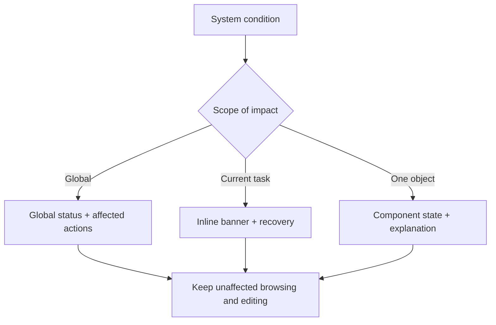

## 10.4 状态场景

### G01 Empty Space

- 提供 Add Source、Create Group、Quick Note 三个真实入口；
- 解释知识群如何形成；
- 不显示空图谱、虚构推荐或 AI feed；
- 第一份 Overview 只在内容足够时生成。

### G02 Indexing

- 显示当前阶段、已可用范围和后台继续；
- Library / Reading / Source utility 使用已可用内容；
- Ask 说明 coverage；
- Search 分别说明 canonical objects、current revisions、Sources、OCR / transcription、Historical Revisions 与 semantic index 覆盖；
- 新保存对象通过 identity / direct content fallback 立即可找；
- 更新期间当前 Result Set 不静默重排，只显示 Refresh；
- Rebuild 只重建 Search Index，不删除 canonical knowledge；
- 不把未完成解析伪装为完整知识。

### G03 Offline

- Knowledge Library、Groups / Network、local exact / alias / full-text / property Search、Knowledge、Evidence、手工编辑可用；
- Similar Meaning 和 remote Source coverage 可以降级，但不能把降级写成 No Knowledge；
- Ask 明确不可用或仅提供已缓存结果；
- Capture 进入本地队列；
- 恢复网络后不重复 Source Commit。

### G04 AI Failure

- 保留 Question、Query Context 和 current selection；
- 区分 provider failure、timeout、cancelled 与 policy / scope issue；
- 提供 Retry、Search instead、Open used knowledge；
- 不阻塞非 AI 工作。

### G05 Permission Lost

- Source 标为 unavailable；
- Node lifecycle 不自动改变；
- availability / epistemic 影响分别说明；
- Evidence 显示无法核验；
- 提供 reconnect、replace source、retain historical metadata。

### G06 Undo / History

- 按 Change Set 展示触发、对象、影响和提交者；
- Undo 范围在执行前可见；
- Knowledge Undo 不默认删除 Source；
- 已被后续 Change Set 依赖时说明级联影响；
- Undo failure 不进入更强制的破坏操作。

### G07 Large Graph

- Atlas / Network 超出预算时先显示 Scope Summary、hidden counts 与穷尽 List，并进入 Anchor Required；
- Anchor 可来自 Group、Search、Facet、Saved View 或 Path；
- 不按度数、最近使用、AI relevance 或 embedding cluster 截取 Top N；自动 cluster 只作临时 overlay；
- Local Graph 只显示当前高价值邻接；
- 保留 selected path；
- filter、search 与 List Equivalent 可用；
- 不以缩小文字、无限缩放或随机漂移解决拥挤。

### G08 Knowledge State Detail

- lifecycle、epistemic、freshness、availability 四轴独立；
- 默认用一个最重要的人话结论；
- 展开后说明每个轴的原因、影响和动作；
- 状态变化由 Change Set 或 Source impact 可追溯；
- 不使用单一 confidence 百分比代替解释。

### G09 Historical Impact

- Saved Answer、Decision、Path 与 Overview 显示当时 revision set；
- 当前知识变化以 impact notice 出现；
- Original 永远可查看；
- Re-evaluate 创建新版本，不覆盖历史；
- moved / superseded objects 使用 redirect 与历史标签。

## 10.5 恢复优先级

1. 保住用户已经提交或输入的内容；
2. 保住 Selection、阅读位置和 Query Context；
3. 保持未受影响能力可用；
4. 解释影响范围；
5. 提供最小可逆恢复动作；
6. 恢复后避免重复提交、重复 Source 或重复 Node。

## 10.6 设计证据

- Empty Space；
- Indexing partial；
- Offline global + local action；
- AI Failure in composer / answer；
- Permission Lost citation / source / node；
- History + Undo impact；
- Large Graph + List Equivalent；
- Knowledge Status collapsed / expanded；
- Historical Impact on Answer / Path / Decision。

## 10.7 验收门槛

- 任一错误状态都能说清“还能做什么”；
- 用户输入、Source Commit 和已保存知识不会因局部失败丢失；
- Offline 时产品仍然是知识库，而不是不可用聊天壳；
- Permission Lost 不被表现为 Node 删除；
- Large Graph 能在不读小字的情况下定位对象；
- Undo 范围和历史影响可预测。

---

# 11. PB-09 Author & Organize / 直接创作与组织

## 11.1 用户目标

用户不依赖导入资料或 AI，也能创建一个知识群，写下并编辑自己的知识，把它放入合适层级，建立有语义的关系，并在重组或删除时理解影响。

## 11.2 主覆盖

- H01 Create Knowledge Group；
- H02 Group Setup & Boundary；
- H03 Create Knowledge Node；
- H04 Edit Scope Choice；
- H05 Node Editor；
- H06 Topic Authoring；
- H07 Placement Manager；
- H08 Manual Relation Editor；
- H09 Overview Editor & Locking；
- H10 Archive / Trash / Restore；
- H11 Bulk Organize。

## 11.3 主流程

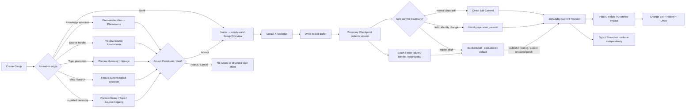

## 11.4 Stage 定义

### PB09-S1 Create Group

- 从 Library、Group switcher、命令面板、All Knowledge / Unplaced、Sources、Topic、View / Search 或 Import preview 进入；
- 最低必填只有名称，提交后立即获得稳定 group_id；
- Blank Group 的 Boundary、primary kind、facets 与模板均可跳过；
- 非 Blank 路径按 identity 去重并预览 included / excluded、Placements / Attachments、Topic mapping 与下游影响；
- View / Search 只冻结当前显式选择，future matches 不进入 Group；
- AI cluster 不创建 Group，只建立不进入 canonical Library 的 Group Candidate；
- 重名时说明是 alias、相似群还是不同 identity，不用文件名式自动加“(2)”掩盖问题；
- Cancel 不产生空壳 Group。

### PB09-S2 Group Setup & Empty-valid

- 空 Group 明确显示它已经创建成功；
- 新 Group 的 Orientation 解析为 Bare；P0 只显示“这个知识群刚刚开始”的人话说明，不暴露内部枚举；
- 一个首要动作：Write first Knowledge；两个安静替代：Add Sources、Create a Topic；三项能力都存在，但不再以同权 Hero 要求用户在空群里先选结构；
- AI 可以在进入后提出初始 Topics / Boundary Diff，但只作为可拒绝建议；
- Boundary 用一句自然语言回答“属于什么 / 不属于什么”；
- Primary Kind 只有一个，Facets 可组合；改类型或移除 Facet 只改变 Overview / Property Profile 建议，不搬移知识、不创建空 Assertions、不删除已有值；
- 后续可从 Group Settings 重新进入。
- 不显示成熟度、完成环、属性覆盖率、空白关系大图或要求用户补齐模板字段。

### PB09-S3 Create / Convert Node

- 从 Group、Topic、全局 Capture、正文选区或未完成 Answer 进入；
- 只选几句话默认建立 Node + Anchor 引用；选择具备独立语义的完整 Section 才提供“成为独立知识”；
- Section Promotion 预览原位置保留 Link / Live excerpt / Pinned excerpt、Evidence 与 Anchor redirects，不丢上下文；
- 默认继承当前 Placement，但可在保存前更改；
- Node type 可以先保持 General，之后再细化；
- 用户原创设置 origin，不要求 Source；
- 首个有意义且安全的 Direct Edit Commit 创建稳定 node_id 与 Current Revision；Recovery protection 可以更早发生，但完全空 buffer 不制造 Untitled 对象；
- title-only 对 Question / Concept 合法；无意义空白关闭不创建 identity；
- Edit Buffer、Recovery Checkpoint、Current Revision、Explicit Draft、Proposal、sync 与 projection 使用不同状态；
- 发现可能重复时提供 Compare / Reuse / Create distinct，不阻塞用户把直接写作提交为 current。

### PB09-S4 Node Editor + Edit Scope

- 编辑顶部始终显示 canonical、contextual、fork、structure 或 historical read-only scope；
- 阅读与编辑使用同一连续 content tree；Block handles 只在 hover / focus / selection 或结构模式出现；
- Edit Buffer 可以被高频 Recovery Checkpoint 保护；只有 composition 结束、内容合法且到达 idle / blur / navigation / explicit save / normal close / pre-read flush 等安全边界时，Direct Edit Commit 才原子推进 current pointer；
- 页面分别显示 buffer dirty / composing、recovery protected、committing current / current updated、sync queued / synced 与 projection updating；
- 普通 direct edit 没有`完成并采用`；Close / Back 先 flush，成功后直接离开，失败时保留 Buffer 并提供复制、导出与重试；
- Explicit Draft 可由 Library / Search 找回并标记；Recovery Checkpoint 不进入 Search；Ask / Overview / Atlas 默认只使用 Current Revision；
- 后台 Revision 到达时，非重叠变化可安全合并；content / structure / property / delete-vs-edit / scope / identity 冲突保留 common Base 与全部竞争值；
- Conflict resolution 先生成 Conflict Draft；用户检查合并结果并确认后原子更新 current，不再经过另一个完成动作；
- AI 使用独立 Proposal Branch 和 Base Revision；Patch 支持 partial accept、stale / rebase，不允许整篇重生成覆盖；
- 复用菜单明确区分 Link、显示最新内容、固定这个版本、保留一份引用；
- Split / Merge 打开 NodeIdentityChangePreview，先处理 identity，再处理 blocks、Anchors、Evidence、Placements 与 Relations；
- PropertyContextRail 按 identity、content revision、Placement、Source、Derived 与 Working / Proposed 分层；普通阅读默认退让；
- 新增结构化事实优先复用 stable Property Definition；同名字段先显示语义、目标、类型与例值，不自动合并；
- Value Editor 区分具体值、未知、无、不适用与删除为未填写；Node Reference 只提供导航，不自动生成 Relation；
- Applicability 只用于改变真值的 subject / organization / location / conditions / valid time，并先于真正属性冲突比较；
- AI 属性提取进入独立 Property Patch；review 前不改变 current，review 后确认本身可原子提交，不再要求第二次采用；
- 扩大影响范围前显示其他 Placements、Overviews 与 Answers；
- Undo、Current Version History、Explicit Draft History、Recovery Checkpoints 与 Change Set History 分开；
- Historical Revision 只读，Restore 创建 Recovery Draft 并通过 forward restore commit 形成新 Revision；
- Offline 可以完成本地 Direct Edit Commit / Decision Change Set，不降低为只读；storage write failure 固定显示并提供 recovery export；
- 索引、Overview、Graph 或 embedding 失败不回滚 current；owner 立即读取新 Revision，Search / Ask 优先使用 local delta，无法保证时显示`索引正在更新`。

### PB09-S5 Topic & Placement Authoring

- 支持 create、rename、reorder、indent、outdent、move、split、merge 与 archive；
- Topic 只选择一个同 Group 的直接父级，系统阻止 cycle、跨 Group parent 与多父结构；
- 拖动目标在放下前显示新路径；
- 同一 Node 加入多个 Topic 时创建 Placement，不复制 canonical content；
- Group membership 只由 active Placements 推导；Placement 的唯一 `container_ref` 指向 Group root 或一个 Topic，resolved Group 由此推导；
- Placement Manager 显示 contextual summary、默认进入路径与受影响 Overview；
- Remove Placement 的文字必须包含“仅从此位置移除”；
- 错误移动可以立即 Undo，复杂批次进入 Change Set。
- `成为独立知识群` 需要确认边界、原位置 Gateway 与 Placement move / share；普通菜单不提供 Group 一键降级。

### PB09-S6 Manual Relation Editor

- 正文选区、Node menu、Relation Inspector 与 graph drag 共用同一 Editor；
- graph drag 只预填 endpoints；
- type 与 direction 必须确认；
- 正式 Semantic Relation 只接受 Node↔Node 或 Group↔Group 同类 endpoints；Topic↔Node 使用 Placement，Topic↔Topic 使用结构或 Path；
- Applicability、依据与说明按关系类型渐进出现；
- 可选择 formal Relation、Suggestion 或 Path step；
- 重复、反向冲突和环状结构风险有清楚说明。

### PB09-S7 Overview Editor

- 阅读态保持连续 Overview Paper；编辑态区分 Editorial、Projection、Reference、Navigation 与 Status；
- 每个 Block 分别显示 authorship、update policy、lock 与 support，不使用单一 ownership 枚举混合表达；
- 用户可以直接写正文，不通过 Prompt 间接编辑；
- Projection 只编辑规则，结果按当前结构刷新；
- AI prose update 只产生 OverviewSemanticDiff；
- locked + out-of-sync 可以同时显示；
- 独立 Claim 可进入 OverviewClaimPromotion，Evidence 端点保持 Node / Relation；
- 接受部分 Diff 不影响被拒绝段落；
- 保存后形成 revision 与 affected scope。

### PB09-S8 Lifecycle & Bulk Organize

- 对象菜单分开 Remove Placement、Archive、Move to Trash；
- Permanent Delete 只在 Trash 内出现；
- 共享 Nodes、Relations、Overviews、Paths 与 Answers 的引用进入 Impact Preview；
- Bulk 工具栏先声明选择单位是 identities、placements 还是 presentation rows；跨单位选择不能用同一动作猜测作用域；
- Bulk move / add placement / remove placement / relate / archive / state change 先展示选择集、目标和实际受影响对象；
- Bulk property edit、option replacement、type / cardinality change 与 Definition merge / split 进入 PropertyImpactPreview / MigrationReview，按 clean、ambiguous、unsupported、conflict 分组；
- 不可转换值保留 raw / Legacy representation；用户可以只提交 clean subset，失败项保持原值，Index / View 暂时显示 partial coverage；
- Group / Topic hierarchy 拖放区分 move this placement、add another placement 与 move all placements；跨 Group 时同时显示其他位置和受影响 Overview；
- 删除 View 只删除规则，取消 Pin 只删除快捷入口，删除 Topic 先处理 Placements；这些操作都不删除 canonical Node；
- 部分失败保留成功项和失败报告；
- Restore 恢复 identity、Placements、Relations、redirects 与历史。

## 11.5 关键状态图

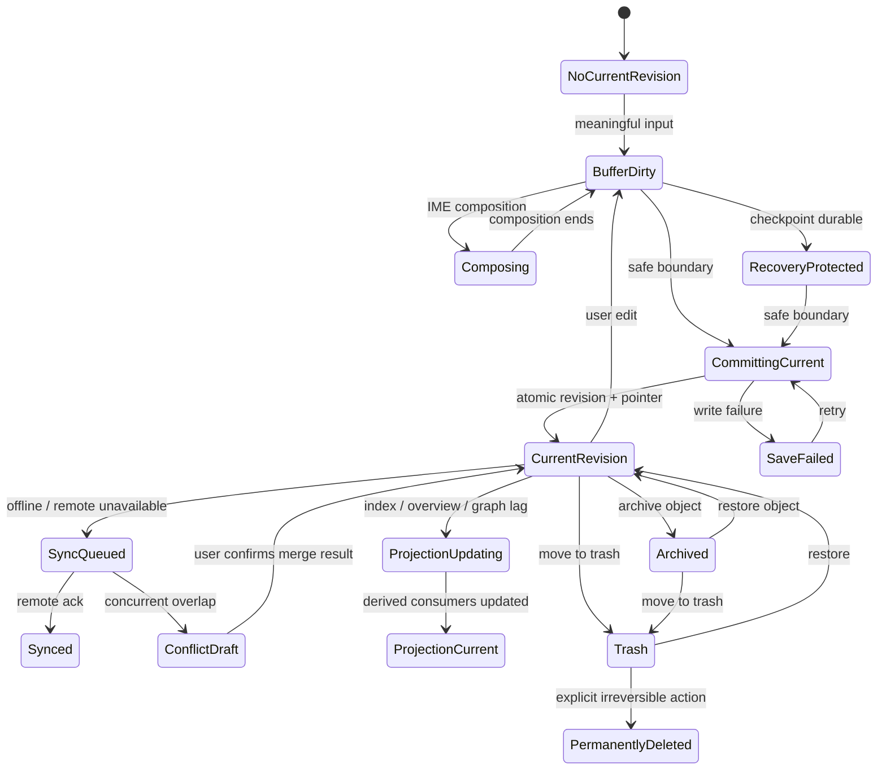

图中 `CurrentRevision` 是对象指针状态，不等于 object lifecycle。一个 active / archived Node 都可能同时拥有 Explicit Draft、Proposal 或 Recovery record；Archive、Trash 与 Supersede 不再和 Draft / Current 共用同一枚举。Sync / Projection 是平行传播轴，图中连线仅用于证明责任，不表示它们能回滚 current。

Placement lifecycle 独立于 Node lifecycle：

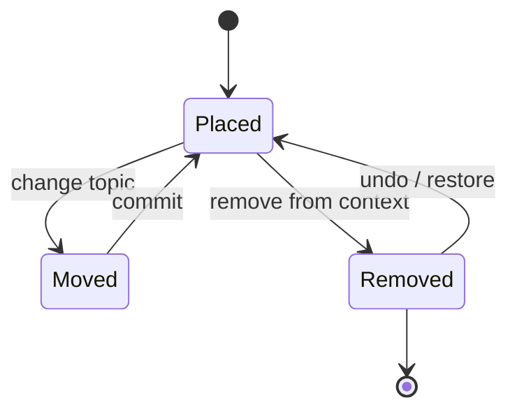

## 11.6 数据夹具

使用“AI Agent 产品设计”空 Group：

- 新建 Topic“知识模型”；
- 创建 user_synthesis Node“Knowledge Group”；
- 加入“认知科学 / 外部记忆”作为第二 Placement；
- 建立 `provides_foundation_for` Relation；
- 更新 Group Overview；
- 从第一个 Topic 移除 Placement，再从 Trash / History 恢复相关对象。

## 11.7 设计证据

- Create Group blank / selection / source bundle / topic promotion / view snapshot / imported hierarchy；
- Group Candidate accept / reject / cancel / repeated-evidence suppression；
- Empty-valid Group；
- Orientation Profile evaluated basis；Profile refresh 不提供“升级确认”，也不改 accepted content；
- Change / Attention / Lifecycle / Boundary condition 的独立 events 与组合 notice；
- Create / Convert Node；
- Node Editor canonical / contextual / fork / conflict；
- Node Editor short Decision / long Concept / block-level patch；
- Anchor resolved / redirected / ambiguous / orphaned；
- Reference Link / Live / Pinned / Explicit quote variants；
- Section Promotion + Node Split / Merge impact preview；
- Topic drag + keyboard move；
- Placement Manager；
- Property Context Rail identity / revision / placement / source / derived layers；
- Property Definition Picker same-name / reuse / new；
- Value State known false / unknown / no value / N/A / unset；
- Applicability Builder + Property Conflict Compare；
- Node Reference navigation + Relation Promotion preview；
- Property Profile add / remove Facet；
- Property Migration clean / ambiguous / legacy / conflict；
- Relation Editor new / duplicate / invalid direction；
- Overview Editor reading / block-aware editing；
- Overview governance axes + alignment combinations；
- Projection refresh / Semantic Diff partial accept / locked reject；
- Overview Support Inspector + Claim Promotion；
- Lifecycle Action Sheet；
- Trash detail + Restore；
- Bulk Organize preview / partial / undo。
- Library bulk identity selection / placement selection / cross-group drop preview。

## 11.8 验收门槛

- 用户不导入资料、不使用 AI、Topic 或 Relation，也能直接写第一条 Knowledge，并以新建 Group、既有 Group 或未归类完成本地 current commit；
- Empty Group 可以长期合法存在，但不被统计成首份可返回资产；Relation 只有在两个稳定端点与可读陈述成立后才按明确意图出现；
- user-authored 内容不伪造 Source，也不被显示为 AI 低置信；
- 用户在保存前能说清 canonical 与 contextual edit 的差异；
- 用户能说清“段落”和“独立知识”的差异，系统不以长度或 Heading 自动切分；
- Search / Ask / Evidence 可回到稳定 Anchor；失配时保留引用文本并提供修复；
- 四种复用方式的更新后果可预测；Node identity change 不丢失旧链接和历史；
- Topic / Placement 操作不删除 Node；
- graph drag 不产生无类型正式边；
- Archive、Trash 和 Permanent Delete 不会被误认为同一动作；
- 每个高影响操作有可理解的 Change Set 与恢复路径。
- Bare Group 可以在没有 Source、AI 和完整边界的情况下长期保持合法；Profile / condition 变化不静默创建正式 Topics 或 Relations。
- 最后一个 Placement 被移除时 Group membership 才消失，且 canonical Node 保留；Topic Promotion 后旧路径通过 Gateway 成立。
- accepted Overview prose 无论 authorship 都不静默更新；Projection refresh、alignment notice 与 Editorial revision 在 History 中分开。
- `locked + review due` 可以同时表达；Ask 的保存回答、建议更新概览与保存 Claim 为 Node 不共享一个含混动作。
- 批量操作的计数与预览能让用户在提交前说清是在改变知识身份、结构位置还是临时呈现；删除 View、Pin 或 Topic 均不会误删 Node。
- 用户能区分 Property、Applicability 与 Relation；Node-reference field 不会在图中制造边，系统发现只形成独立 RelationCandidate，用户补全并提交后才升级为 maintained Relation。
- 用户能分别理解未填写、known false、未知、无与不适用；Search / View 不用否定条件吞并未知。
- Primary Kind、Facet 与 Profile 不形成写作门槛；Schema Migration 不清空 raw values，并能回退与解释 partial coverage。

---

# 12. PB-10 Own & Configure / 迁移、所有权与配置

## 12.1 用户目标

用户知道知识实际保存在哪里、AI 实际使用什么、索引和备份是否健康；能从旧工具迁入，在需要时完整迁出，并在故障或误操作后可靠恢复。

## 12.2 主覆盖

- I01 First-run Knowledge Space；
- I02 Library Migration Mapping；
- I03 Full Export / Knowledge Package；
- I04 Backup & Restore；
- I05 Storage & Index Health；
- I06 AI & External Knowledge Policy；
- I07 Optional Sync & Device Conflict；
- I08 Preferences & Accessibility。

## 12.3 主流程

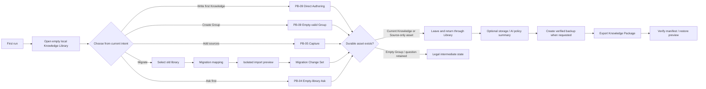

## 12.4 Stage 定义

### PB10-S1 First-run Knowledge Space

- 五个合法入口：Write first Knowledge、Create Group、Add first sources、Migrate existing library、Ask first；它们是当前意图，不是五种产品模式；
- 产品直接打开默认本地个人 Knowledge Library，不要求用户先创建、命名或理解 Workspace；
- First Returnable Asset 只在 Current Knowledge 或 Source-only Asset 本地持久化且可再次到达时成立；Source identity 至少从 Sources 返回，Attachment 只在用户选择 Group / Topic 时建立；Empty Group 与保留问题是合法中间状态；
- Question-first 在内部范围为空时不生成冒充知识库依据的回答；它保留问题，并可转为写已有理解、加入资料、保存 Question Knowledge或按次允许外部资料；
- 数据位置使用人话解释并可查看；
- 云模型、同步、连接器、Topic 与 Relation 均不是形成首份可返回资产的前提；
- 用户跳过所有高级设置后仍得到完整本地知识库；
- 中断后恢复到最近已提交步骤，不重复导入。

### PB10-S2 Migration Mapping

- 识别 folders、notes、internal links、tags、frontmatter、attachments 与 unsupported syntax；
- 用户检查它们到 Group、Topic、Node、Placement、Relation、Property Definition / Assertion、Source Tag、Facet、Alias、Source metadata 与 raw metadata 的映射；
- 外部 `author / date / tags` 默认先属于 Source；映射到 Node / Group knowledge 需要显示目标、值型、origin、Applicability 与冲突；
- 旧链接先分类为普通 Reference、Placement candidate 或 Relation candidate，不因 URL / wikilink 自动建立正式 Relation；
- 同名 frontmatter key 不自动合并 Definition；Picker 显示语义、target、type 与例值，unsupported values 保留 raw；
- 不默认把每个文件都等同为 canonical Node；
- duplicate 根据 identity、content 与 link context 判断，不只看文件名；
- unsupported、ignored、lossy 与 manual mapping 有独立状态；
- 先导入隔离预览，再进入正式 Commit。

### PB10-S3 Migration Commit & Report

- 显示 will create、reuse、merge、skip、fail；
- Property mapping 分为 clean、ambiguous、unsupported、conflict 与 legacy，并列出受影响 Views / Profiles / Index；
- Commit 形成 Migration Change Set 与恢复点；
- partial failure 保留成功项；
- 报告可以一跳打开抽样对象与原始文件；
- Undo 不删除用户原始库；
- 重新运行同一导入不会制造重复对象。

### PB10-S4 Storage & Index Health

- 分别显示 canonical knowledge、Sources、attachments、search index 与 cache；
- 显示本地位置、占用、最近验证和受影响能力；
- index partial / corrupted 时正文和层级仍可用；
- Rebuild 先说明范围、预计影响与可取消性；
- 磁盘空间不足时优先保护文字和 committed knowledge；
- 清缓存不能伪装成删除 Source 或知识。

### PB10-S5 Backup & Restore

- 备份显示范围、目标位置、加密策略（若有）、最近成功和校验；
- “备份文件已写入”不等于成功，必须完成 manifest / checksum 校验；
- Restore 先预览 add、overwrite、conflict、missing 与 preserve；
- 默认恢复到新隔离位置或创建原子恢复点；
- 中断或校验失败完整回滚；
- 恢复完成后抽样验证核心对象路径与 Evidence locator。

### PB10-S6 Full Export / Knowledge Package

- 区分完整 Knowledge Package 与 Markdown / HTML / PDF 阅读导出；
- Summary 列出十四类核心知识对象，以及 Property Definitions / Assertions、Facets / Profiles、Applicability、Schema History、attachments、history 与 redirects；Property Definition 不因此成为新的顶层知识对象；
- 用户可以导出全部 Space 或明确 Scope；
- 导出完成后显示 manifest 校验、缺失项和重建能力；
- 不把“生成 zip”当成成功；
- 可以在隔离位置运行 Restore Preview 验证。

### PB10-S7 AI Policy、Sync 与 Preferences

- AI Policy 显示模型位置、发送范围、外部知识、日志与单次 Ask 覆盖规则；
- Query 提交前和 Answer 中保留实际 policy snapshot；
- Sync 默认为 optional，关闭时产品不降级；
- 启用后显示 device、last sync、pending changes 与 conflict，不用模糊云朵图标；
- Preferences 包含字号、布局、快捷键、reduced motion 与 Graph / List 默认；
- 额外 Vault / Space 只在 Storage boundary 中创建，并解释关系隔离。

## 12.5 关键状态图

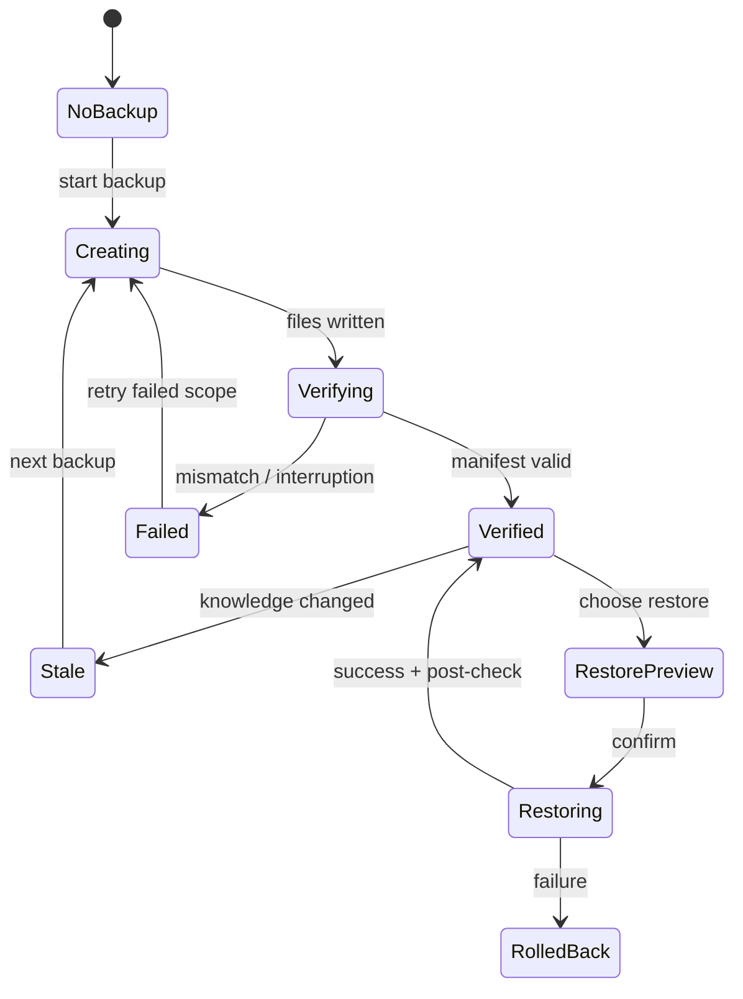

## 12.6 数据夹具

使用一个含以下内容的旧库：

- 120 个 Markdown notes；
- 6 个 folders、34 个 tags、82 条 internal links；
- 12 个 attachments；
- 7 处 broken links、3 个 duplicate candidates、2 种 unsupported plugin syntax；
- 18 个 frontmatter keys，其中 4 组同名不同义、3 组 mixed types、5 个 unknown / N/A / empty ambiguity；
- 导入后形成 3 Groups、14 Topics、96 canonical Nodes、17 Sources 与 2 个 unresolved mappings。

导出夹具必须包含共享 Node、多 Placements、typed Relations、Overview governance / alignment / Support Map、Saved Answer Snapshot、Source version、Evidence locator、Property Definitions / Assertions、五种 value states、Applicability、Facet Profiles、Legacy values、Schema Migration、Trash object 与 redirect。

## 12.7 设计证据

- First run three paths；
- Migration Mapping normal / lossy / duplicate；
- Property Mapping source metadata / accepted assertion / raw / conflict；
- Definition same-name reuse / create / merge impact；
- type migration clean / ambiguous / unsupported / legacy；
- Isolated preview；
- Migration report partial / completed / undo；
- Storage Health healthy / low / index corrupted；
- Backup creating / verifying / failed / verified；
- Restore Preview / conflict / rollback / completed；
- Knowledge Package scope / manifest / missing item；
- AI Policy global / per-query snapshot；
- Sync disabled / pending / conflict；
- Preferences keyboard / text / motion / graph equivalent。

## 12.8 验收门槛

- 首次使用不启用云、同步或 AI 也能建立知识库；
- 迁移前后抽样链接、附件、层级和对象 identity 可核对；
- unsupported 与 lossy mapping 不被“成功”吞掉；
- 完整导出恢复后稳定 ID、Placements、Relations、Sources、Evidence、Property Definitions / Assertions、Applicability、Profiles、Views、Migration History 与 value states 等价；
- 备份只有校验通过才显示成功；
- 索引损坏不导致正文看起来丢失；
- 用户在 Ask 前能说清哪些内容会离开本机；
- 设置不会把默认单 Space 变成 Workspace 管理负担。

---

# 13. 核心组件状态图

组件状态图不是开发实现细节。它们确保同一个对象在 Home、Library、Atlas、Answer、Sources 与 contextual Decision 中不会拥有互相矛盾的行为。

## 13.1 Selection + DepthTrail

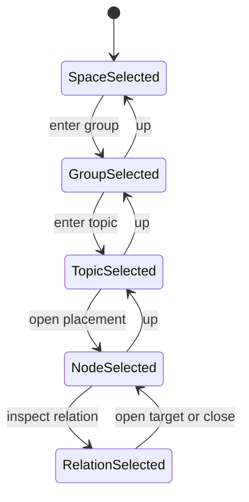

Reading Depth 独立：

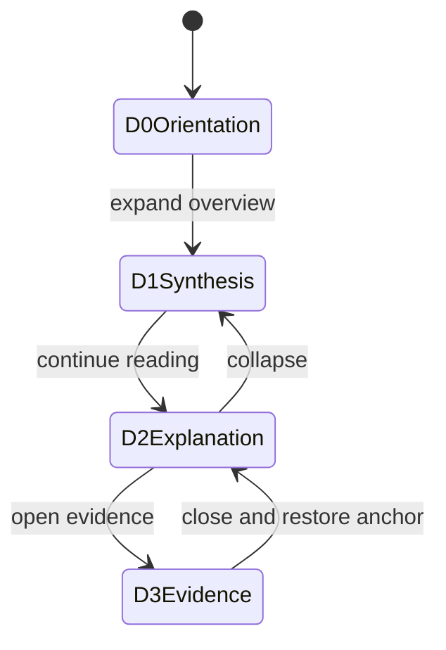

Relation Radius 独立：

```mermaid
stateDiagram-v2
    [*] --> R0ListOrHidden
    R0ListOrHidden --> R1Direct: view relations
    R1Direct --> R2Path: expand route
    R2Path --> R1Direct: close route
    R1Direct --> R3Atlas: view all groups
    R3Atlas --> R1Direct: return to focus
```

附加规则：

- Back 不沿此层级图机械上移，而是读取 Return Stack；
- Layout change、Rail tab change 和 graph/list change 不改变 object selection；
- Deep link 可以直接进入任一稳定状态，但必须恢复父级路径；
- 对象 moved / merged 时通过 redirect 恢复；
- Evidence / Relation 进入 Close Detail 语义，不与 Up 混用。
- D2 / D3 和 R1 / R2 / R3 不进入 DepthTrail；它们分别更新 reading_depth 与 relation_radius；
- 任一轴变化不重置另两轴的 Selection、滚动、过滤和布局。

## 13.2 TopicTreeItem + Placement

```mermaid
stateDiagram-v2
    [*] --> Stable
    Stable --> Expanded
    Expanded --> Selected
    Selected --> ReorderPreview: drag topic
    Selected --> PlacementMovePreview: drag node placement
    Selected --> DeletePreview: delete topic
    ReorderPreview --> ChangeSetPreview
    PlacementMovePreview --> ChangeSetPreview
    DeletePreview --> ChangeSetPreview: confirm structure removal
    DeletePreview --> Selected: cancel
    ChangeSetPreview --> Committed
    ChangeSetPreview --> Selected: edit or cancel
    Committed --> Stable
    Committed --> Undone
    Undone --> Stable
```

不变量：

- 拖动 Topic 改结构；拖动 Node row 改 Placement；
- Delete Topic 文案明确“不会删除知识节点”；
- contains-current-node、has-conflict、drop-target 和 selected 可以组合；
- 展开状态与 Selection 分开保存；
- 移动后旧深链接使用 redirect。

## 13.3 GraphNode + RelationEdge

### GraphNode 表现维度

| 维度 | 允许值 | 视觉优先级 |
|---|---|---|
| focus | default / hover / focused / selected | selected 最高 |
| path | none / highlighted / origin / destination | 低于 selected |
| knowledge | normal / open-challenge / review-due / source-degraded | 使用一句解释，不压成质量分 |
| layer | current / suggested / history | suggested 与 history 不得像 current |
| density | full-label / key-label / aggregate | 由语义尺度决定 |

### Relation 状态

形成依据是稳定元数据，不是状态机：`user_asserted / source_expressed / system_inferred / imported_typed`。Candidate 是独立对象：

Group Relation 聚合评估先于 Candidate：

```mermaid
stateDiagram-v2
    [*] --> ExitOnly
    ExitOnly --> SignalObserved: typed cross-group evidence changes
    SignalObserved --> Assessing: collapse and qualify
    Assessing --> ExitOnly: fringe or insufficient
    Assessing --> Ambiguous: type or direction unresolved
    Assessing --> Conflicting: core counter signal
    Assessing --> OnDemandEligible: anchor-dependent
    Assessing --> AmbientEligible: all gates and attention budget
    OnDemandEligible --> CandidateOpen: user asks or opens suggested
    AmbientEligible --> CandidateOpen: candidate is proposed
```

该状态图只决定是否有资格形成 Candidate；它不表达 Relation truth。Policy / Boundary 更新可以重跑 Assessment，但不改写旧 Assessment 与已采用 Relation。

```mermaid
stateDiagram-v2
    [*] --> Open
    Open --> Open: edit statement / direction / applicability
    Open --> Adopted: user adopts and Relation materializes
    Open --> Dismissed: dismiss
    Open --> Expired: basis expires
    Dismissed --> Open: materially new semantic basis
```

正式 Relation 的 assertion disposition 独立：

```mermaid
stateDiagram-v2
    [*] --> Maintained
    Maintained --> Ended: valid time or old scope ends
    Maintained --> Superseded: successor Relation adopted
    Maintained --> Retracted: no longer adopted
```

Change Condition 独立：`no_material_change / changes_available / review_due / transition_in_progress`。Evidence 通过 Bindings 表达 supports / challenges / qualifies，open Challenge 绑定具体 Revision 与重叠 Applicability；时间通过 qualifiers / valid_from / valid_to；Lifecycle 独立为 `current / archived / trash`。Applicability 被收窄创建 RelationRevision，不是 lifecycle。

不变量：formation basis、Candidate decision、assertion disposition、change condition、Evidence / Challenge、time、lifecycle 与 derived salience 都可分别查看；任何 Edge 线型或颜色都不得同时代替多个维度。Superseded 必须指向 successor；Ended、Retracted 与 Archived 不可互换。

## 13.4 ScopePicker + QueryContextSummary

```mermaid
stateDiagram-v2
    [*] --> Inherited
    Inherited --> Ready: decisive context available
    Inherited --> NeedsCondition: decisive context missing
    NeedsCondition --> Ready: user binds condition
    NeedsCondition --> BranchedAnswer: user leaves unknown
    Ready --> Modified: user changes scope or policy
    Modified --> Ready
    Ready --> Submitted
    Submitted --> ActualContextResolved
    ActualContextResolved --> SnapshotSaved
    Submitted --> Failed
    Failed --> Ready: retry with context preserved
```

不变量：

- ScopePicker 只表达 knowledge_scope；
- QueryContextSummary 聚合 as-of、status、applicability、source、external knowledge 与 exclusions；
- 系统扩大范围必须显式进入 Modified / ActualContextResolved；
- missing condition 只阻塞会实质改变答案的问题；
- 失败、取消和关闭都保留用户 Question 与 context edits。

## 13.5 AskComposer + Answer

```mermaid
stateDiagram-v2
    [*] --> Idle
    Idle --> Composing
    Composing --> ResolvingContext: submit creates Turn
    ResolvingContext --> Clarifying: decisive condition missing
    Clarifying --> ResolvingContext: answer or choose branch
    ResolvingContext --> Retrieving: create Run
    Retrieving --> StreamingUngrounded
    Retrieving --> Failed
    StreamingUngrounded --> StreamingGrounded: claims gain support
    StreamingUngrounded --> Cancelled: stop
    StreamingGrounded --> Complete
    StreamingGrounded --> Incomplete: stopped before complete
    StreamingGrounded --> Failed
    Cancelled --> Composing: retry or edit
    Incomplete --> Composing: resume creates new Run
    Failed --> Composing: retry creates new Run
    Complete --> Exploring: open node or relation
    Complete --> FollowUp: new Turn plus Context Delta
    FollowUp --> ResolvingContext
    Complete --> TransformPreview
    TransformPreview --> SavedSnapshot: Save Answer
    TransformPreview --> KnowledgeProposal: Node Relation Overview or Source
    SavedSnapshot --> Impacted: knowledge revisions change
    Impacted --> ReEvaluating
    ReEvaluating --> Compared: new Run plus Answer Snapshot
    Compared --> SavedSnapshot: keep both versions
```

Complete Answer 的内部内容状态可以是 normal、qualified branches、true conflict、evidence insufficient、scope too narrow、index partial、source unavailable；Coverage 独立为 sufficient、partial、insufficient、indeterminate。这些是回答结构变体，不是同一个模糊 error。Query Turn、Run、Context Snapshot 与 Answer Snapshot 的历史关系不能被 UI 状态机压扁。

## 13.6 SourceCapture + KnowledgeProposal

```mermaid
stateDiagram-v2
    [*] --> Staged
    Staged --> WorkingNode: user-authored thought
    WorkingNode --> WorkingCheckpoint: durable local save
    Staged --> SourceCommitted
    Staged --> QueryResult: saved AI result
    Staged --> Discarded
    SourceCommitted --> IndexedOnly
    SourceCommitted --> ParseQueued
    SourceCommitted --> Parsing
    ParseQueued --> Parsing
    Parsing --> Partial
    Parsing --> ParseFailed
    Parsing --> PreviewReady
    Parsing --> ZeroKnowledgeChange: complete, no semantic change
    Partial --> PreviewReady
    ParseFailed --> Parsing: retry
    PreviewReady --> IndexedOnly: stop here
    PreviewReady --> CandidateReady
    CandidateReady --> DecisionBundles
    DecisionBundles --> ProposalReady
    ProposalReady --> KnowledgeCommitPreview
    KnowledgeCommitPreview --> KnowledgeCommitted
    KnowledgeCommitPreview --> ProposalReady: edit
    KnowledgeCommitted --> KnowledgeUndone
    KnowledgeUndone --> IndexedOnly
    ZeroKnowledgeChange --> IndexedOnly
    WorkingCheckpoint --> KnowledgeCommitted: complete and accept
    QueryResult --> ProposalReady: save as knowledge
```

不变量：

- SourceCommitted 是持久边界；
- ParseFailed 不退回 Staged；
- IndexedOnly 是完整成功状态，不是 skipped error；
- ZeroKnowledgeChange 是完整成功状态，不能与 Partial / ParseFailed 合并；
- WorkingNode / WorkingCheckpoint 是合法落点，不要求 Source；Placement 是独立条件，采用前后都可以为空；
- DecisionBundles 默认只呈现 3–7 个高价值决定，Candidate 不直接倾倒给用户；
- KnowledgeUndone 默认回到 IndexedOnly，不删除 Source；
- Proposal candidates 与正式知识视觉区分。

## 13.7 DecisionItem + ChangeSet

### DecisionItem

```mermaid
stateDiagram-v2
    [*] --> New
    New --> Opened
    Opened --> Deferred
    Deferred --> New: relevant use or new evidence
    Opened --> DecisionPrepared
    DecisionPrepared --> ImpactPreview
    ImpactPreview --> Resolved: commit
    ImpactPreview --> Opened: revise
    Resolved --> Reopened: new evidence
    Resolved --> Undone
    Undone --> New
    New --> Rejected
    Rejected --> New: materially new evidence
```

### ChangeSet

```mermaid
stateDiagram-v2
    [*] --> Calculating
    Calculating --> PreviewReady
    Calculating --> Incomplete: dependencies unavailable
    Incomplete --> Calculating: retry
    PreviewReady --> Edited
    Edited --> PreviewReady
    PreviewReady --> Committing
    Committing --> Committed
    Committing --> PartialCommit
    PartialCommit --> RecoveryRequired
    Committed --> UndoPreview
    UndoPreview --> Undone
    UndoPreview --> Committed: cancel
```

不变量：Change Set 必须区分 changed objects、affected derived objects、new decision-required items 与 undo lineage；Partial Commit 不能用普通 success banner 掩盖。

## 13.8 Source + EvidenceCitation

### Source availability

```mermaid
stateDiagram-v2
    [*] --> Available
    Available --> Changed: new revision
    Available --> PermissionLost
    Available --> Disconnected
    Changed --> Available: review or accept revision
    PermissionLost --> Available: reconnect
    PermissionLost --> HistoricalMetadataOnly
    Disconnected --> Available: reconnect
    Disconnected --> HistoricalMetadataOnly
```

### Evidence meaning

| 维度 | 状态 |
|---|---|
| locator resolution | resolved / relocated / changed / ambiguous / orphaned / unavailable |
| Material Origin | user / organization / publication / observation / conversation / system |
| Derivation Distance | primary record / quote / transformed / secondary / synthesis / inference |
| Support Role | supports / challenges / qualifies / defines / exemplifies / documents / method / context / quote origin |
| Extraction Fidelity | native / copied exact / OCR / transcript / translation / normalized / summary / inference |
| Verification State | local verified / remote verified / snapshot verified / snapshot-only / ambiguous / unavailable / integrity failed |

不变量：作用属于 Evidence Binding 而不是 Fragment；任一维度变化都不自动删除引用目标；Citation 必须能解释当前材料、对这个 Claim 的作用和还能核验到什么。

## 13.9 KnowledgeStatusSummary

对象、内容采用、编辑与知识质量不是单一状态机：

| 轴 | 值 | 首要问题 |
|---|---|---|
| object lifecycle | active / archived / trashed / tombstoned | 这个对象是否还在日常使用 |
| identity standing | canonical / superseded / merged redirect / split redirect | 它是否仍是当前 canonical identity |
| accepted pointer | none / current revision | 知识库当前采用哪个版本 |
| working / proposal | none / saved locally / sync queued / conflict / stale proposal | 是否有未完成或竞争变化 |
| epistemic | supported / evidence_limited / contested / unknown | 当前依据如何 |
| freshness | current / review_due / stale | 是否仍需要复核 |
| availability | available / source_degraded / source_unavailable | 原始依据还能否核验 |

显示算法：

1. 先判断是否影响当前任务；
2. 选择一个最高影响原因写成人话主句；
3. 给出一个主要动作；
4. 其余轴进入展开详情；
5. 颜色只辅助，不把四轴压成彩色徽章串。

示例：

> 当前知识仍是上一个版本，你有未完成修改；唯一来源也已经更新，需要复核。

展开后才显示：`active + canonical + accepted Revision 7 + working saved locally + supported + review_due + source_degraded`。

## 13.10 SystemStatus

```mermaid
stateDiagram-v2
    [*] --> Synced
    Synced --> Indexing
    Synced --> Offline
    Synced --> AttentionRequired
    Indexing --> Synced
    Indexing --> Partial
    Partial --> Synced
    Offline --> Recovering
    Recovering --> Synced
    AttentionRequired --> Synced: issue resolved
```

Global Bar 只显示综合状态；当前任务受影响时必须在页面内出现具体 StatusBanner。一个小图标不能独自承担失败解释。

## 13.11 EditScope + NodeEditor

```mermaid
stateDiagram-v2
    [*] --> Reading
    Reading --> CanonicalEditing: edit node body
    Reading --> ContextualEditing: edit placement summary
    Reading --> HistoricalReadOnly: open old revision
    CanonicalEditing --> BufferDirty
    ContextualEditing --> BufferDirty
    BufferDirty --> Composing: IME
    Composing --> BufferDirty: composition end
    BufferDirty --> RecoveryProtected: checkpoint
    BufferDirty --> CommittingCurrent: safe boundary
    RecoveryProtected --> CommittingCurrent: safe boundary
    CommittingCurrent --> CurrentRevision: atomic local commit
    CommittingCurrent --> SaveFailed
    CurrentRevision --> ConflictDraft: newer overlapping revision
    ConflictDraft --> CurrentRevision: confirm merge
    CanonicalEditing --> Forking: scope diverges
    Forking --> IdentityPreview
    IdentityPreview --> CurrentRevision: commit new node identity
    HistoricalReadOnly --> RecoveryDraft: edit from this version
    RecoveryDraft --> CurrentRevision: forward restore commit
    BufferDirty --> ExplicitDraft: user chooses draft
    ExplicitDraft --> CurrentRevision: publish draft
    CurrentRevision --> Reading
    SaveFailed --> CommittingCurrent: retry
```

不变量：Recovery protection 不等于 Current；Current 不等于 sync / projection；scope 在整个编辑期间可见；active IME 不 commit；Conflict resolution 先保留 Draft result；历史恢复向前创建 Revision；普通 direct edit 没有审批动作；canonical change 触发完整 impact calculation。

## 13.12 Placement + Lifecycle Actions

| 对象 / 动作 | Remove Placement | Archive | Trash | Permanent Delete |
|---|---|---|---|---|
| Node | 只移除当前语境 | 默认浏览隐藏 | 只读可恢复 | 仅 Trash，检查共享引用 |
| Topic | 移除分支位置 | 隐藏结构 | 结构可恢复 | 不删除共享 Nodes |
| Group | 不适用 | 从 Home / Library 默认隐藏 | 保留 redirects | 先分离共享知识 |
| Source | 移除某个 scope 引用 | Registry 归档 | 历史 metadata 可恢复 | 不自动删除知识 |

不变量：菜单使用完整动词；用户不需要靠理解数据库级联规则来判断风险。

## 13.13 RelationEditor

```mermaid
stateDiagram-v2
    [*] --> EndpointsSelected
    EndpointsSelected --> TypeRequired
    TypeRequired --> StatementRequired
    StatementRequired --> SemanticCheck
    SemanticCheck --> DuplicateReview
    SemanticCheck --> DirectionConflict
    DuplicateReview --> SemanticCheck: reuse / merge review / distinct
    DirectionConflict --> SemanticCheck: reverse / choose type
    SemanticCheck --> MaintainedRelation: direct user commit
    SemanticCheck --> RelationCandidate: AI / source / aggregation suggestion
    SemanticCheck --> PathStep: exploratory only
    MaintainedRelation --> ReviewCase: evidence / endpoint / scope change
    ReviewCase --> MaintainedRelation: maintain / revise / defer
    ReviewCase --> Ended: end
    ReviewCase --> Superseded: adopt successor
    ReviewCase --> Retracted: retract
    MaintainedRelation --> Archived: archive object
    Archived --> MaintainedRelation: restore object
```

## 13.14 OverviewBlockGovernance

Overview Block 使用三个治理轴，并关联一个独立 alignment 状态：

| 维度 | 状态 |
|---|---|
| authorship | user-authored / AI-drafted / system-projected / imported |
| update policy | manual-only / propose-diff / live-reference / auto-refresh-projection |
| lock | unlocked / content-locked / structure-locked |
| alignment | aligned / changes-available / review-due / knowingly-diverged |

只有 Projection 可 auto-refresh；AI-drafted prose 一旦 accepted 也只能 propose Diff。Lock 不改变 authorship；任意 prose 都可以 `locked + review-due`。

## 13.15 MigrationItem

状态：mapped、manual mapping、duplicate candidate、reuse、merge、skip、unsupported、lossy、failed、committed。每项保留 source locator 与 target preview；批次成功不能覆盖单项失败。

## 13.16 Backup + Restore

```mermaid
stateDiagram-v2
    [*] --> NotCreated
    NotCreated --> Writing
    Writing --> Verifying
    Verifying --> Verified
    Verifying --> Failed
    Verified --> Stale: knowledge changes
    Stale --> Writing
    Verified --> RestorePreview
    RestorePreview --> Restoring
    Restoring --> Restored
    Restoring --> RolledBack: failure
```

## 13.17 KnowledgePackage + AIPolicy

KnowledgePackage 状态：scoping、building、verifying、verified、partial、failed、restore-tested。AIPolicy 状态不是“开 / 关”，而是 local model、cloud model、external knowledge、sent scope、retention 与 per-query override 的组合；Answer 保存实际快照。

## 13.18 ContentAnchor + Reference + Identity Change

```mermaid
stateDiagram-v2
    [*] --> Resolved
    Resolved --> Redirected: block moved or node split
    Resolved --> Ambiguous: quote matches multiple locations
    Resolved --> Orphaned: target removed without reliable redirect
    Redirected --> Resolved: follow redirect
    Ambiguous --> Resolved: user chooses location
    Orphaned --> Resolved: user reattaches
```

Reference 状态独立于 Anchor：Link、Live current、Live updated、Pinned current、Pinned update available、Explicit quote、Source missing。Node identity change 使用 prepared → impact-preview → committed / cancelled → redirect-active → undo-expired 的状态；内容 patch 与 identity change 必须分别可检查。

## 13.19 Overview Content + Alignment

```mermaid
stateDiagram-v2
    [*] --> Aligned
    Aligned --> ChangesAvailable: relevant input changed
    ChangesAvailable --> ReviewDue: boundary or stable understanding affected
    ChangesAvailable --> Aligned: projection only / dismiss
    ReviewDue --> Aligned: accept or edit semantic diff
    ReviewDue --> KnowinglyDiverged: keep current wording with reason
    KnowinglyDiverged --> ReviewDue: reconsider
    KnowinglyDiverged --> Aligned: reconcile
```

Overview content 同时存在 Accepted、Working、Proposed、Historical，但默认阅读只展示 Accepted + current Projections。Group Orientation 只改变 Presentation Profile，不进入此状态机；Change / Attention / Lifecycle / Boundary 也不与 Overview alignment 合并。

## 13.20 Question Workspace + Resolution Inspector

Question 不使用单一 open / closed state。组件读取四个正交维度：

```mermaid
stateDiagram-v2
    state "求解程度" as Resolution {
      [*] --> Unresolved
      Unresolved --> PartiallyResolved: adopt partial basis
      PartiallyResolved --> ProvisionallyResolved: required criteria temporarily usable
      ProvisionallyResolved --> Resolved: user confirms sufficient
      Resolved --> PartiallyResolved: user adopts revised affected resolution
    }
    state "继续意愿" as Pursuit {
      [*] --> Active
      Active --> Paused: user pauses
      Paused --> Active: user continues
      Active --> Concluded: user ends pursuit
      Concluded --> Active: user reopens
    }
    state "变化提醒" as Change {
      [*] --> NoMaterialChange
      NoMaterialChange --> ChangesAvailable: basis or target changed
      ChangesAvailable --> ReviewDue: validity or decisive support affected
      ChangesAvailable --> NoMaterialChange: inspected and dismissed
      ReviewDue --> NoMaterialChange: new resolution adopted
    }
```

Question Workspace 显示同一 Knowledge Paper；Resolution Inspector 只固定 exact question / basis revisions、criteria、Applicability、remaining unknowns 与 adoption。`保存回答`、`形成知识`、`链接依据`、`采纳当前回答`、`标记充分回答`、`暂停 / 停止追问`分别提交，不使用一个`完成`按钮代替。

---

# 14. 跨组件事件合同

| 事件 | 产生者 | 必须响应的组件 / 流程 | 不允许发生 |
|---|---|---|---|
| `place.entered` | PlaceNav、deep link、restore | App Shell、SurfaceRoleHeader、Return Stack、System Status | 进入新 Place 后沿用错误 owner / selection，或要求先回 Home |
| `active_place.changed` | PlaceNav、explicit handoff、Place-aware link | ActivePlaceIndicator、PlaceNav、Place State、Return Envelope | 仅因打开 owner、切 Lens、改变 Selection 或 keyboard focus 而切 Place |
| `place.state_restored` | launch、window resume、Back / Forward、Space switch | PlaceStateRestorer、owner Workspace、Selection、filters、focus return | 恢复失败时清空知识、重置全部 Places 或影响其他窗口 |
| `place.handoff_committed` | `在图谱中打开 / 在来源中打开 / 需要你判断` | PlaceHandoffSummary、Active Place、origin Return Envelope、target owner | 在 target 未就绪前破坏 origin，或把 contextual Decision 伪装成新 current Place |
| `destination.receipt_created` | Capture / import completion | DestinationReceipt、Sources、Library / Working、Proposal / Decision、Undo / retry | 用单一成功 toast 隐藏 partial、queued、source-only 或 failed-but-retained |
| `attention.signal_routed` | Source / knowledge / system event | Primary Destination resolver、grouping、suppress / defer、Home eligibility | 一个 event 在 Home、Sources、Decision 形成三份独立任务 |
| `attention.projection_resolved` | Primary Destination state change | Home optional notice、owner History / Impact、summary projections | 已处理事件继续显示未读，或投影状态与 Primary Destination 状态分叉 |
| `lens.changed` | LensSwitcher、responsive reflow | Group / Node / Source Workspace、Selection、Depth、Return Envelope | 把换镜头当成换对象，重置正文、Ask Scope 或关系选择 |
| `group.root_activated` | GroupRootSwitcher | PrimaryTaskIndicator、Root state、Group Header、Return Envelope | 把 Reading 当第五 Root，或因 keyboard focus 自动切 Root |
| `reading.target_opened` | Overview / Structure / Map / Search / Answer | ReadingPath、Knowledge Paper、Local Graph follow-open、Rail、Recent | 复制 Node content，丢 origin Root / placement / anchor，或把 Inspect 当 Open |
| `selection.layer_changed` | Tree / Map / List / Preview / Compare | Primary Surface、Companion、Rail、Ask Context、History 按 layer 响应 | 裸 selection 让 Focus / Inspect / Open / Compare 产生相同后果 |
| `companion.follow_mode_changed` | CompanionHeader / FollowPinnedControl | Companion target、label、Workspace State、focus return | pinned target 静默跟随或被显示成当前 Reading Target |
| `group.source_reason_changed` | attachment / Binding / Placement change | Group Sources row、coverage、Source Workspace backlink | 复制 Source identity，或移除 attachment 时删除 Binding / Source |
| `group.change_event_routed` | knowledge / structure / relation / source impact | Overview notice、owner History / Impact、Sources / Decision handoff、Primary Destination status | 创建第二 Decision Item、重复 unread，或让 Changes 重新成为 Root / activity log |
| `overlay.opened` | Search、Quick Ask、Add、Command | ReturnContextSummary、focus trap / restore、underlying Workspace | 覆盖层成为第二导航，或底层现场被销毁 |
| `overlay.returned` | Close、Back、selection commit | Place、owner Workspace、Selection、Anchor、scroll、filters、pane | 只返回默认页或 Group 顶部 |
| `surface.return_envelope_restored` | Back、Forward、deep-link exit | PlaceNav、SurfaceRoleHeader、Workspace、Graph / List、assistive focus | 只恢复 URL，不恢复用户可感知现场 |
| `graph.equivalent_view_changed` | Graph / List switch | Selection、filters、relation families、direction、standing、viewport focus | 图和列表显示不同对象或把非关系连接升级为 Relation |
| `coverage.evidence_linked` | Design review | Coverage Index、Frame annotation、State Matrix、audit status | 用 Screen 数、symbol 数或单一 happy state 标记完成 |
| `selection.changed` | Tree、Graph、Search、Answer | DepthTrail、Workspace、Rail、Map / List | 各区域保留互相矛盾的选择 |
| `placement.changed` | Topic reorg、cross-group choice | Tree、Contextual Summary、Map、Back stack | 复制 canonical Node |
| `edit_scope.changed` | Node / Placement editor | EditScopeBanner、Impact Preview、Buffer / Draft lineage | 扩大影响但不告知用户，或把 contextual prose 静默升级为 canonical |
| `node.user_authored` | Node Editor | Group / Topic、Search、Overview suggestion、History | 因无 Source 伪造低置信或引用 |
| `edit.recovery_checkpoint_saved` | Node / Overview Editor | RecoveryStatus、EditReturnState | 把 recovery protection 误报成 current / synced |
| `edit.direct_commit_succeeded` | Local canonical store | Current pointer、owner reader、History、sync / projection jobs | 在 IME composition 中提交、要求二次采用或等待远端才更新 current |
| `edit.sync_queued` | Local store | PersistenceStatus、SystemStatus、Revision Summary | 因网络不可用阻断 Direct Edit Commit |
| `edit.sync_merged` | Sync engine | Revision Summary、History、Conflict detector | 静默隐藏竞争值或移动 Current pointer |
| `content.revision_committed` | Direct edit / reviewed proposal / explicit rule | Current pointer、Search / Ask delta、Overview / Graph impact、History | 把 Recovery Checkpoint、未确认 Proposal 或未提交 Buffer 当成 current |
| `proposal.patch_applied` | ProposalPatchReview | Edit Buffer 或 proposal_accept commit、Undo、stale detector | 跳过 review、要求双重采用或整篇覆盖 |
| `edit.conflict_created` | Sync / AI / recovery | ConflictResolver、Branch Summary、PersistenceStatus | last-write-wins、丢弃 loser 或把 conflict 当 error page |
| `edit.conflict_resolved` | ConflictResolver | Conflict Draft、Undo、CommitStatus | 未经确认就变成 Current Knowledge |
| `property.definition_changed` | Property Definition Editor | Picker、Profiles、Views、Search、Imports、Impact Preview、History | 按 label 重绑引用、直接重写 Assertions 或静默改变 View members |
| `property.definition_archived` | Property Impact Preview | Picker、Assertions、Views、Search、Export、Restore | 删除历史值、让 View 静默失效或回收 property ID |
| `property.assertion_proposed` | AI / Source Mapping / Import | Property Rail、Patch Review、Search proposed layer、Conflict detector | 提议值直接进入 Accepted View / Ask / Overview |
| `property.assertion_accepted` | User / explicit bounded rule | Property Rail、Search / View index、Overview projection、History | 把 accepted 解释成 proven，或将 Placement / Source 值写到 identity |
| `property.applicability_changed` | Property / Claim / Relation editor | Conflict compare、Ask Context、Search / View、History | 只改 chip 文案而不重新判断 truth overlap |
| `property.migration_previewed` | Definition change | MigrationReview、Views、Profiles、Imports、Index coverage | 未展示 legacy / unsupported / conflicts 就允许提交 |
| `property.migration_committed` | MigrationReview | Definitions、Assertions、Views、Profiles、Search index、History、Rollback | 清空不可转换值、半提交不报告或让 partial index 冒充完整 |
| `property.conflict_created` | Sync / migration / new evidence | PropertyConflictResolver、Working Definition / Assertion、View coverage | 使用 last-write-wins 或在比较 Applicability 前任取一个值 |
| `facet.profile_changed` | Group / Facet settings | Overview profile、Property Rail、Definition suggestions、History | 创建空 Assertions、删除已有值或改变 object identity |
| `supporting_record.opened` | Deep link / History / Evidence / Definition | PrimaryResourceContext、SupportingRecordHeader、OwnerBacklink、Return Stack | 显示孤立内部对象主页或丢失 owner / entry context |
| `projection.evaluation_stale` | Definition / input / index / source change | EvaluationBasisSummary、View / Overview / Search / Graph status | 把旧缓存当当前全量结果或静默显示 0 |
| `projection.rebuild_requested` | Index / View / Overview / Graph maintenance | ProjectionRebuildStatus、last good result、coverage、History when material | 清除 canonical truth、阻断无关编辑或以重建完成冒充知识更新 |
| `workspace.state_reset` | Layout / Selection / temporary filter reset | WorkspaceResetPreview、stable default surface、session undo | 删除 View Definition、Saved Path、Placement、Relation 或 content |
| `resource.admission_reviewed` | Product schema evolution | Object admission record、Definition impact、migration plan | 因新增表 / API object / AI output 自动创建第十五类主要资源 |
| `recovery.branch_created` | History / crash / Recovery picker | NodeEditor、EditReturnState、AcceptancePreview | 原地改写历史 Revision 或覆盖 current |
| `storage.write_failed` | Local persistence | Persistent StatusBanner、copy / recovery export、retry | 继续显示 Saved 或关闭 Editor |
| `node.anchor_resolved` | Search、Answer、Reference、Evidence | Selection、Knowledge Paper、Citation、Return Stack | 以相似段落冒充精确命中 |
| `node.anchor_changed` | Node Editor、Split / Merge | References、Evidence、Saved Answers、History | 静默断开或错误重绑 |
| `node.reference_mode_changed` | Node Editor | ReferenceBlock、History、export | 把 pinned / quote 自动转为 live |
| `node.identity_changed` | Section Promotion、Split / Merge | Placements、Relations、Evidence、Overview、Answers、redirects | 仅拼接正文即视为同一 identity |
| `node.patch_committed` | Acceptance Change Set | Accepted revision、Anchors、Evidence、Overview impact | 整篇重生成覆盖 accepted content，或把 Patch apply 当作 acceptance |
| `overview.projection_refreshed` | Structure / Relation / change index | ProjectionBlock、OverviewSupport、Selection | 把刷新结果当作 prose revision |
| `overview.inputs_changed` | Node、Relation、Boundary、Source impact | AlignmentNotice、SemanticDiff、Home change | 静默重写 accepted Editorial prose |
| `overview.diff_committed` | Overview Editor / Decision | Accepted revision、Support Map、History、Answers | 覆盖 locked / rejected Blocks |
| `overview.claim_promoted` | Overview Editor | Node、ReferenceBlock、Support Map、Placements、Answers | 把 Overview 直接作为 Evidence endpoint |
| `group.orientation_profile_refreshed` | State projection | Presentation Profile、Library summary、Relation Lens weight | 复制 overview_id、自动创建 revision 或改变其他状态轴 |
| `relation.user_committed` | Relation Editor | Graph、List Equivalent、Inspector、Ask index | 图谱先显示无类型正式边 |
| `knowledge_relation.type_validated` | Knowledge Relation Editor / Candidate Inspector / import mapping | `KnowledgeRelationTypeValidationReport`、五类 intent、required qualifiers、adjacent-type explanation、selected `KnowledgeRelationTypeDefinitionRevision` | 自动改写 Candidate / Relation；把 Evidence / Answer support 当 semantic edge；用 `related_to`兜底 |
| `knowledge_relation.candidate_created` | AI / source extraction / similarity / user save-as-suggestion | Suggested layer、Knowledge Candidate Inspector、suppression policy、no Current projection | 因 embedding、共现或共同回答直接画边 |
| `knowledge_relation.type_migration_review_created` | Knowledge type definition changed / `blocks / overlaps_with / related_to` legacy encountered | `KnowledgeRelationTypeMigrationReview`、old/new semantics、identity / structure / lifecycle alternatives、per-item decision、History | 批量字符串替换、静默改方向或把非 Relation 对象继续留在 Current graph |
| `knowledge_identity.transition_created` | replacement / split / merge / promotion / identity correction | current standing、redirect、RelationTransitionCases、Overview / Answer / Path impact、History | 创建 `supersedes` ordinary edge、静默 retarget Relations 或覆盖 predecessor history |
| `question.created` | direct authoring / save Runtime Unknown / promote Annotation or Gap | Question Workspace、Library / Search index、Placement、origin lineage、History | 把所有 Unknown 自动变成 Question、要求先有 target / criteria、继承外部权限 |
| `question.revision_committed` | Question direct edit / reviewed frame change | QuestionFrameRevision、criteria / target impact、Ask Context、History | 实质改题时覆盖旧 identity，或把正文与 frame 存成两份真相 |
| `question.applicability_context_changed` | explicit Question condition update / referenced Profile or Property revision | new QuestionFrameRevision、old/new Applicability diff、affected criteria、`changes_available`、History | 把个人条件自动写成全局 Knowledge、整体降级 Resolution、自动 reopen 或反向改写旧 Snapshot |
| `question.target_reference_changed` | Question authoring / uncertainty migration / target resolution | versioned QuestionTargetReference、Question view、Ask scope suggestion、History | 创建 `uncertain_about` ordinary edge、改变 target Knowledge truth 或自动关闭 / reopen Question |
| `question.resolution_proposed` | Ask / manual basis link / source or knowledge update | Resolution Proposal、criterion coverage、remaining unknowns、no current-state mutation | AI Answer 自动成为 current resolution、用 confidence 触发 resolved |
| `question.resolution_committed` | explicit user adoption | QuestionResolutionRevision、Question header、Overview / Search projection、History | 同时停止追问、覆盖 substantive Knowledge、丢失 exact basis revisions |
| `question.review_trigger_fired` | time / material source / target-basis / subject context / applicability / unavailable / manual | trigger reason、affected criteria、change event、Review surface、old Resolution `as_of` | 把 Source Revision 当语义变化、自动宣布旧答案错误、改 pursuit 或提交新 Resolution |
| `question.pursuit_changed` | pause / continue / conclude action | pursuit state、closure reason、review trigger、History | 改变 resolution state、归档或删除 Question |
| `question.reopened` | explicit user action | pursuit active、reopen reason、previous closure / resolution refs、History | 自动降级 resolution、删除旧 closure、创建 `reopens` Relation |
| `question.successor_created` | reframing / split / merge / scope fork | new identity、QuestionIdentityTransition、criterion / target mapping、redirect / History | 把实质新问题当普通 edit 或 reopen，复制 adopted Resolution 为新真相 |
| `group_relation.signal_observed` | current typed cross-group paths / boundary change | Aggregation Signal store、pair fingerprint、no Current projection | 直接创建 Candidate 或按 raw path count 画边 |
| `group_relation.assessment_completed` | aggregation evaluator | Gate results、Effective Support Units、origin clusters、coverage、counter、removal result | 用单一 confidence 分抵消失败 gate |
| `group_relation.type_validated` | Relation Editor / Candidate Inspector / import mapping | TypeValidationReport、intent questions、adjacent-type explanation、selected TypeDefinitionRevision | 自动改写 Candidate / Relation，或用 `related_to` / `influences`吞掉未解决歧义 |
| `group_relation.candidate_created` | eligible Assessment + trigger | Suggested layer、Candidate Inspector、suppression / attention policy | 污染 Current、Overview 或默认 Ask truth |
| `group_relation.candidate_adopted` | Candidate Inspector atomic commit | Relation、first RelationRevision、SupportSetRevision、Network / Overview / Ask index | 先画边后保存、留下 Candidate duplicate 或部分提交 |
| `group_relation.support_reassessed` | path / source / boundary / policy change | new Assessment / SupportSetRevision、Review Case、History | 因低于建议门槛自动删除、降级或改类型 |
| `group_relation.type_migration_review_created` | GroupRelationTypeDefinitionRevision changed / deprecated alias encountered | MigrationReview、affected Relations / Candidates、old/new semantics、per-item decision、History | 批量静默重写类型、方向、statement 或 applicability |
| `group_connection.observation_refreshed` | canonical Knowledge Placement / curation role / Boundary Revision changed | Shared Knowledge Lens、pair comparison、Ask / Overview projection cache | 创建 Relation / Candidate / History，改变 resting layout，或留下过期 observation |
| `group_pair.comparison_opened` | explicit Compare from Network / Overview / Ask / exit / command | Pair state、consistent snapshot、ReturnEnvelope、Current / Shared / Paths / Suggested / History inventory | 普通 Open 或 hover 触发 Compare，或因进入比较创建知识对象 |
| `group_pair.snapshot_refreshed` | explicit refresh after Boundary / Relation / Placement / Registry / index change | new comparison snapshot、selection / focus restore、draft stale check、diff notice | 半边旧半边新、静默 rebase Draft 或重置现场 |
| `group_pair.returned` | Close / Back / endpoint return | origin edge / viewport、Claim / Answer scroll、Knowledge Anchor、List filter、focus target | 一律回到 Library 顶部或丢失 caller context |
| `relation.candidate_created` | AI / source extraction / aggregated paths | Suggested layer、Candidate Inspector、suppression policy | 在默认 Network 创建边或写入 Relation proposal_state |
| `relation.candidate_adopted` | Candidate Inspector | Relation identity、first Revision、adoption event、Graph / Ask index | 保留 Candidate 与正式 Relation 两条边或丢失 formation basis |
| `relation.revision_committed` | Relation Editor / Review Case | Current Revision、Overview / Path / Answer impact、History | 因新增 Evidence 制造语义 Revision，或原地覆盖旧 statement |
| `relation.support_changed` | Evidence / Group Support Set | Bindings、Support Set Revision、evidence summary、Review trigger | 直接改 assertion disposition 或自动改 relation type |
| `relation.challenge_opened` | Evidence / user decision | Relation Inspector、Ask conflict disclosure、Review Case | 用全局 contested chip 替代 Applicability overlap |
| `relation.disposition_changed` | Review Decision | Current / History Network layers、Ask filter、successor、downstream impact | 把 ended / superseded / retracted / archived 混为一个失效状态 |
| `relation.endpoint_transition_created` | Knowledge / Group split / merge / successor | Transition Case、Candidates、Path / Answer historical refs、Network | 静默 retarget、复制 maintained edges 或制造 self-edge |
| `overview.governance_changed` | Overview Editor | authorship / update policy / lock、History、Diff policy、Compiler | 用一个 ownership 值覆盖其他轴，或因治理变化改写 prose |
| `lifecycle.changed` | Action Sheet、Trash | Navigation、Search、Relations、redirects、History | Remove Placement 级联删除 Node |
| `query.turn_created` | Ask Composer | Query history、Run creation、original question | 把问题和一次执行保存为同一可覆盖对象 |
| `query.context_resolved` | Ask | Composer、Answer header、Route、Snapshot | 不区分 Requested、Effective 与 Used Context |
| `query.context_delta_created` | Follow-up / Branch | Composer、Answer header、Run history | 追问静默继承或扩大条件 |
| `query.run_started` | Ask runtime | Streaming state、index coverage、policy snapshot | Retry / Re-evaluate 覆盖上一 Run |
| `query.run_completed` | Ask runtime | Answer Snapshot、Actual Context、Run history | incomplete / failed 伪装为 complete |
| `answer.claim_grounded` | Retrieval / grounding | Claim Support、Citation、Route、Evidence | 用统一 references footer 冒充 Claim support |
| `source.committed` | Capture | Registry、Index queue、Source Detail | 因未生成知识而显示失败 |
| `knowledge_changeset.committed` | Capture、Decision | Overview、Search、Graph、Saved Answer impact、History | 后台静默改写派生知识 |
| `source.revision_changed` | Sources | Fragment resolver、Evidence、Node status、Overview Diff、Saved Answers | 直接覆盖旧 revision、旧 fragment 或当前阅读内容 |
| `source.representation_derived` | OCR / transcript / translation | RepresentationSwitcher、Evidence fidelity、History | 把 derived text 标成 original 或覆盖 Source Revision |
| `source.annotation_promoted` | Source Reader | Evidence Fragment、Binding Inspector、History | 高亮自动成为 Evidence / Node 或删除时级联 |
| `evidence.binding_created` | Source Reader、Knowledge Commit | Target Claim、Citation、Evidence Inspector、History | 把 Binding 写成 Semantic Relation 或 Fragment global role |
| `evidence.locator_resolved` | Source resolver | Citation、Reader、Return Stack、repair history | 多候选时随机 re-anchor 或覆盖历史 selector |
| `evidence.binding_removed` | Evidence Inspector | Target Claim、History、coverage | 删除 Fragment、Source 或 Target |
| `source.lifecycle_changed` | Source impact sheet | Registry、Representations、Citations、Targets、History | 把 Disconnect、Archive、Trash 与 Permanent Delete 合并 |
| `source.permission_lost` | Sources | Citation、Node availability、Ask evidence、Decision when needed | 删除 Node 或改写 lifecycle |
| `decision.superseded` | contextual Decision | Overview、Relations、Saved Answers、Paths | 静默重写历史答案 |
| `answer.saved` | Ask | Library / Saved Answers、History、impact index | 把 Answer 自动升级为 Accepted Node |
| `answer.impacted` | Change Set | AnswerVersionNotice、Home notice、Decision when needed | 覆盖 Original Snapshot |
| `answer.re_evaluated` | Saved Answer | AnswerSnapshotDiff、Run history、impact index | 用当前答案覆盖 Original |
| `relation.rejected` | Decision / Inspector | Graph candidate index、Suggestions | 无新证据反复推荐 |
| `undo.requested` | History / Change Set | Impact preview、dependent changes、Source boundary | 默认删除 Source Commit |
| `system.offline` | System | Ask、Capture、Sources、StatusBanner | 锁死整个产品 |
| `ai.failed` | Ask / Compiler | Composer、Question、Context、non-AI paths | 丢失输入或 Selection |
| `migration.committed` | Import | Library、Sources、Search、History、Backup | 重复运行制造重复 identity |
| `backup.verified` | Backup | Storage Health、Restore points | 未校验完成就显示成功 |
| `restore.requested` | Restore Preview | Conflict resolver、atomic checkpoint、post-check | 失败后留下半恢复状态 |
| `knowledge_package.exported` | Export | Manifest status、download history、restore test | 用扁平阅读导出冒充完整备份 |
| `ai_policy.resolved` | Settings / Ask | Composer、Answer header、Snapshot、audit trail | 静默扩大本次发送范围 |

---

# 15. 设计文件组织

下一版设计文件按流程语法组织，而不是按“画了哪些页面”横向堆叠：

```text
00 Foundations + Data Key
  Objects / Product language / P0–P3 / Tokens / Type / Spacing / Icons / Motion / Fixture legend

01 Components + State Graphs
  Navigation / Knowledge / Graph / Query / Answer / Capture / Decision / History / Evidence / Status

02 PB-00 Shared Spine
03 PB-01 Orient
04 PB-02 Read Deeply
05 PB-03 Explore Relations
06 PB-04 Ask & Find
07 PB-05 Capture & Compile
08 PB-06 Maintain Knowledge
09 PB-07 Sources & Provenance
10 PB-08 Resilience
11 PB-09 Author & Organize
12 PB-10 Own & Configure

13 Coverage Index
  81-item matrix / scenario regression / accessibility checklist

99 Archive
  Existing seven Ardot concept screens and superseded explorations
```

## 15.1 Frame 命名

```text
[Board]/[Stage]/[Surface]/[State]/[Viewport]
```

例如：

- `PB02/S04/KnowledgeNode/SourceDegraded/Desktop`；
- `PB04/S05/Answer/TrueConflict/Desktop`；
- `PB05/S02/SourceCommit/Success/Desktop`；
- `PB08/G03/AppShell/Offline/Compact`。

## 15.2 Frame 排列

- 每个 Board 左到右表达主路径；
- 分支放在对应 Stage 下方，不放到页面末尾；
- Recovery 放在失败 Stage 正下方；
- Component variants 靠近首次使用它的 Stage，并链接回 01 Components；
- 进入与退出其他 Board 使用明确 handoff connector；
- 历史 / impacted 版本与 current 版本上下对照；
- 不把不同视口和不同业务状态混在同一行。

## 15.3 每个 Frame 的最小注释

- User goal；
- Entry condition；
- Selection / Query Context；
- Primary action；
- Knowledge mutation；
- Exit and recovery；
- Coverage ID；
- Component dependencies；
- Data fixture；
- Accessibility / keyboard / focus notes。
- Internal object / Default user copy；
- Disclosure level / Reveal trigger；
- Primary term count / State sentence。

## 15.4 原有七张概念图的位置

原有 Ardot Screen 1–7 进入 `99 Archive / Visual Direction Evidence`：

- 保留温暖阅读、深色关系空间和星图气质的参考价值；
- 不再承担 App Shell、流程、状态或组件完成度证明；
- 不直接复制其中已经被修订的信息架构；
- 未来视觉设计可引用局部气质，但必须从新组件和流程板重建。

---

# 16. 81 项主归属追踪矩阵

每个 ID 恰好出现一次 Primary Board。Secondary appearances 由跨组件事件和 Board handoff 处理，不计入主覆盖数。

| ID | Primary Board | Primary Stage | 设计证据 | 关键组件 | 通过条件 |
|---|---|---|---|---|---|
| A01 | PB-00 | PB00-S1 / S3 | Full Frame + annotation | AppShell、DepthTrail、SystemStatus | 所有核心任务共享同一壳层与全局动作 |
| A02 | PB-01 | PB01-S1 | Full Frame | Home sections、GroupTile | 首屏表达知识世界而非任务仪表盘 |
| A03 | PB-00 | PB00-S2 | Overlay + transition | GroupSwitcher、ReturnStack | 切群后 Back 恢复原语境 |
| A04 | PB-04 | PB04-S1 | Overlay variants | SearchOverlay、ResultGroup | Search 定位对象且不自动变 Ask |
| A05 | PB-04 | PB04-S2 | Overlay variants | AskComposer、ScopePicker | 任意位置 Ask 且继承范围可见 |
| A06 | PB-01 | PB01-S2 | Home section + detail | ChangeSummary、ChangeSetLink | 只呈现高影响变化并说明影响 |
| B01 | PB-01 | PB01-S3 | Full Frame variants | Atlas、GroupNode、ListEquivalent | 群级地形稳定且无 hairball |
| B02 | PB-02 | PB02-S1 | Full Frame | ScopeOverview、GroupHeader | 理解群边界、结构、变化与入口 |
| B03 | PB-02 | PB02-S2 | Full Frame | TopicTree、TopicMap | 主题层级与代表 Nodes 清楚 |
| B04 | PB-02 | PB02-S4 | Full Frame variants | NodeReadingAnatomy、StatusSummary | 类型化六段骨架成立，不显示空模板 |
| B05 | PB-02 | PB02-S5 | Full Frame | DetailOutline、ContextRail | D2 连续阅读且不改变 Scope / Relation Radius |
| B06 | PB-02 | PB02-S6 | Full Frame + return | SourceReader、EvidenceCitation | 从证据返回恢复原阅读位置 |
| B07 | PB-03 | PB03-S3 | Overlay + transition | PlacementPicker、ContextualSummary | 跨群不复制 Node 且由用户选语境 |
| B08 | PB-03 | PB03-S2 | Context Rail | RelationInspector | 形成依据、提案状态、知识状态与显著性独立 |
| B09 | PB-03 | PB03-S1 | Full Frame / Rail | LocalGraph、ConnectionSummary、RelationListEquivalent | 五类连接与高密度预算成立 |
| B10 | PB-03 | PB03-S5 | Full Frame + impacted variant | SavedPath、PathStep | 保存顺序不复制 Node、不造 Relation，变化可恢复 |
| B11 | PB-02 | PB02-S3 | Full Frame | TopicOverview、CoverageState | 局部 Overview 不复制 Group Overview |
| B12 | PB-06 | PB06-A | Flow + dialog | TopicTreeItem、ChangeSet | 重组 Topic 不删除 canonical knowledge |
| C01 | PB-04 | PB04-S2 | Overlay variants | AskComposer、ScopePicker | 当前焦点和作用域在提交前可见 |
| C02 | PB-04 | PB04-S5 | Full Frame + fallback | AnswerLayout、KnowledgeRoute、UsedKnowledgeList | Route step 忠实；无可靠路径不造假 |
| C03 | PB-04 | PB04-S6 | Component / Full variant | ConflictBlock、ApplicabilityCompare | 真冲突并列呈现且不强行裁决 |
| C04 | PB-04 | PB04-S6 | Component variant | UnknownBlock、RecoveryActions | 缺知识、缺证据和范围过窄可区分 |
| C05 | PB-04 | PB04-S7 | Synchronized frames | RouteHighlight、KnowledgeRouteStep、SelectionState | Claim、Route、Evidence 同步且 retrieval 不写回 |
| C06 | PB-04 | PB04-S8 | Dialog / action sheet | SaveAsKnowledge、MergePreview | 保存类型和知识后果清楚 |
| C07 | PB-04 | PB04-S1 | Overlay / result frame | SearchResults、MatchReason | 结果按对象分组并恢复位置 |
| C08 | PB-03 | PB03-S4 | Context Rail | ExploreRecommendation | 推荐少而可解释，不生成正式关系 |
| C09 | PB-04 | PB04-S3 | Component + overlay | QueryContextSummary | as-of、状态、条件和来源策略可检查 |
| C10 | PB-04 | PB04-S9 | Full Frame + notice | AnswerVersionNotice、VersionCompare | Original 永不改写且可 Re-evaluate |
| D01 | PB-05 | PB05-S1 | Dialog / entry frame | CaptureEntry、BatchList | 多格式进入且不强迫立即分组 |
| D02 | PB-05 | PB05-S3 | Progress frame / banner | ParseProgress、CoverageState | 显示已可用范围并可后台继续 |
| D03 | PB-05 | PB05-S4 | Full Frame | SourcePreview、LocatorCheck | 用户可核对结构、时间与解析质量 |
| D04 | PB-05 | PB05-S5 | Full Frame | ProposalGroup、SuggestionCard | 候选 Nodes、Relations、Placements 可解释 |
| D05 | PB-05 | PB05-S6 | Dialog / comparison | DuplicateMatch、IdentityEvidence | 区分重复、版本、相同身份与相似 |
| D06 | PB-05 | PB05-S3 / S8 | Component variants | PartialResult、RecoveryActions | 部分成功可保留，不重传全部资料 |
| D07 | PB-05 | PB05-S7 / S8 | Preview + confirmation | ChangeSetSummary、Undo | 批次影响和撤销范围明确 |
| D08 | PB-05 | PB05-S2 | Success frame + choice | SourceCommit、NextStepChoice | Source-only 是完整成功路径 |
| E01 | PB-06 | PB06 contextual entry | Full Frame | DecisionWorkspace、ImpactRank | 只从相关 owner / event 显示需要用户判断的高价值事项 |
| E02 | PB-06 | PB06-B | Full Frame / Rail | RelationSuggestion、RelationInspector | 候选依据、类型和影响可检查 |
| E03 | PB-06 | PB06-A | Full comparison flow | MergeSplitPreview、RedirectPlan | 身份、Placements、Relations、Sources 不丢失 |
| E04 | PB-06 | PB06-B | Full Frame | ConflictResolution、DecisionActions | 用户可限定、保留争议或补证据 |
| E05 | PB-06 | PB06-C | Full diff frame | OverviewDiff、LockedFragment | 每处变化可回到 Node 与 Evidence |
| E06 | PB-06 | PB06-C | Impact flow | CorrectionPropagation、ChangeSet | 一次纠正的下游影响可见可撤销 |
| E07 | PB-06 | PB06-A | Full comparison flow | GroupStructureChangePreview、TopicGateway、RedirectPlan | Promotion、Absorb、Split、Merge 保留 identity、links 与 history |
| E08 | PB-06 | PB06-B | Row / detail variant | KnowledgeStatusSummary、DecisionAction | stale 与 contested、superseded 分离 |
| E09 | PB-06 | PB06-B | Full comparison | ApplicabilitySummary、ClaimCompare | 先比较条件，再声明冲突 |
| E10 | PB-06 | PB06-C | Full impact / dialog | ChangeSetSummary、DependencyList | changed、affected、review、undo 四范围清楚 |
| F01 | PB-07 | PB07-S1 | Full Frame variants | SourceRegistry、SourceFilter | 来源状态、引用与知识影响可浏览 |
| F02 | PB-07 | PB07-S2 | Full Frame | SourceReader、SourceDetail | 原文阅读、搜索和稳定定位成立 |
| F03 | PB-07 | PB07-S3 / S3A | Rail / inline component | AnnotationTool、EvidenceFragment、EvidenceBinding、Citation | 阅读标记、片段、作用和知识写入分开，且可双向返回 |
| F04 | PB-07 | PB07-S4 | Full diff frame | SourceRevisionDiff、LocatorResolution、ImpactSummary | 历史版本、定位状态与下游影响可理解且不静默改写 |
| F05 | PB-07 | PB07-S6 | Impact dialog | DisconnectImpact、ReconnectAction | 断开前说明保留、失去和恢复 |
| F06 | PB-07 | PB07-S5 | Preview + progress | ReparsePreview、ChangeSet | 重新处理不被误解为删除知识 |
| F07 | PB-07 | PB07-S3 / 9.5 | Component variants | EvidenceAxisSummary、BindingRole、ExtractionState、VerificationState | 材料来源、派生距离、对 Claim 的作用、抽取方式与可核验状态分别表达 |
| G01 | PB-08 | G01 | Full Frame | EmptyState、CaptureEntry | 无知识时提供真实开始路径而非空图 |
| G02 | PB-08 | G02 | Banner + partial frames | IndexingStatus、CoverageState | 后台处理时旧数据和已完成范围可用 |
| G03 | PB-08 | G03 | Shell + feature variants | OfflineBanner、LocalQueue | AI 离线不阻断知识库核心能力 |
| G04 | PB-08 | G04 | Composer / answer variants | AIFailure、RetryActions | 保留问题、Context 和非 AI 路径 |
| G05 | PB-08 | G05 | Citation / Source / Node variants | PermissionLost、AvailabilityState | 来源失效不表现为知识删除 |
| G06 | PB-08 | G06 | Full history + dialog | ChangeHistory、UndoPreview | Undo 影响和依赖可预测 |
| G07 | PB-08 | G07 | Full Frame + List | GraphAggregation、ListEquivalent | 大规模图仍可定位与探索 |
| G08 | PB-08 | G08 | Component + detail | KnowledgeStatusSummary | 四轴状态被翻译为人话与动作 |
| G09 | PB-08 | G09 | Notice + comparison | HistoricalImpact、VersionCompare | 历史对象保留当时状态并显示当前变化 |
| H01 | PB-09 | PB09-S1 | Dialog + entry frame | CreateGroup、GroupHeader | 不导入资料也能创建稳定 Group identity |
| H02 | PB-09 | PB09-S2 | Full Frame + setup sheet | GroupSetup、BoundaryEditor | 空 Group 合法，类型与模板不强迫 |
| H03 | PB-09 | PB09-S3 | Editor entry variants | CreateNode、ConvertSelection | 从 Group、Topic、选区或快捷入口直接创作 |
| H04 | PB-09 | PB09-S4 | Banner + choice | EditScopeBanner、WorkingBranchSummary、ImpactSummary | canonical、contextual、fork、structure 与 historical scope 可理解且切换不丢修改 |
| H05 | PB-09 | PB09-S4 | Full Frame variants | NodeEditor、PersistenceStatus、AcceptanceStatus、ConflictResolver、VersionHistory、Recovery | local save / sync / Accepted、Working / Proposal Branch、conflict、history、recovery 与 offline 不混淆 |
| H06 | PB-09 | PB09-S5 | Full Frame + transition | TopicAuthoring、TreeDropTarget、TopicGateway | Topic 单父结构与 Promotion 保持路径、Nodes 与 Undo |
| H07 | PB-09 | PB09-S5 | Dialog / Rail | PlacementManager、ContextualSummary | Placement 是成员归属真相，多重位置不复制 Node |
| H08 | PB-09 | PB09-S6 | Dialog + graph transition | RelationEditor、RelationInspector | 人工关系有类型、方向、条件与依据 |
| H09 | PB-09 | PB09-S7 | Full Frame + diff | OverviewEditor、BlockGovernance、Projection、SupportInspector | accepted prose、动态投影、AI Diff、锁定与 alignment 共存 |
| H10 | PB-09 | PB09-S8 | Action sheet + Trash detail | LifecycleActions、ImpactPreview | Remove、Archive、Trash、Delete 语义清楚 |
| H11 | PB-09 | PB09-S8 | Batch tray + preview | MultiSelect、BulkChangeSet | 批量操作可预览、部分恢复与 Undo |
| I01 | PB-10 | PB10-S1 | Onboarding flow | FirstRunChoice、SpaceSummary | 无云、同步或 AI 也能完成首次建立 |
| I02 | PB-10 | PB10-S2 / S3 | Mapping + report | MigrationMapping、ImportReport | 结构映射、损失、重复与失败可检查 |
| I03 | PB-10 | PB10-S6 | Scope + completion | KnowledgePackageSummary、ManifestCheck | 完整包与阅读导出分离且可重建 |
| I04 | PB-10 | PB10-S5 | Full flow + state variants | BackupStatus、RestorePreview | 校验后才成功，恢复失败原子回滚 |
| I05 | PB-10 | PB10-S4 | Full Frame variants | StorageHealth、IndexRebuild | 数据、来源、附件、索引与缓存不混淆 |
| I06 | PB-10 | PB10-S7 | Settings + per-query summary | AIPolicySummary、QueryPolicy | 实际模型、发送范围与外部知识可检查 |
| I07 | PB-10 | PB10-S7 | Settings + conflict flow | SyncStatus、RevisionCompare | 同步可选，冲突不 last-write-wins |
| I08 | PB-10 | PB10-S7 | Settings + component variants | Preferences、AccessibilityControls | 字号、快捷键、动效与图谱等价视图可配置 |

## 16.1 计数校验

```text
PB-00  2
PB-01  3
PB-02  6
PB-03  5
PB-04 11
PB-05  8
PB-06 11
PB-07  7
PB-08  9
PB-09 11
PB-10  8
Total 81
```

---

# 17. 场景回归矩阵

| 场景 | 必须跑过的 Boards | 关键断言 |
|---|---|---|
| 认知科学深度学习 | PB-01、02、03、04、07 | 从 Overview 到论文证据；条件差异不变成伪冲突；跨到 Agent 设计不复制 Node |
| 产品方向演化 | PB-00、01、04、06、08 | 新 Decision supersede 旧方向；Overview Diff；旧 Answer 保留 Snapshot |
| 法国租房手续 | PB-04、05、06、07、08 | Source-only Capture；Applicability；来源版本、权限与日期不被抹平 |
| AI unavailable | PB-00、02、04、05、07、08 | Ask 失败但浏览、Search、Capture queue、Node、Evidence 仍可用 |
| 100+ Groups / 10k Nodes | PB-01、03、04、08 | 穷尽 Catalog、Anchor Required、Group coverage、稳定选择与 List Equivalent |
| 从空白亲手建设 | PB-00、01、02、09 | 空 Group 合法；user-authored Node 无需伪造 Source；canonical / contextual scope 清楚 |
| 旧知识库迁移 | PB-05、08、09、10 | 映射、损失、重复、部分失败和 Undo 可检查；不把每个文件机械等同 Node |
| 完整导出恢复 | PB-07、08、10 | manifest 校验；identity、Placements、Relations、Evidence、Snapshots 与历史等价 |
| AI policy / sync optional | PB-04、08、10 | 每次 Ask 的实际发送范围可见；关闭云与同步仍是完整知识库 |
| Group 状态与恢复 | PB-01、02、06、08、09 | Bare 易开始；Oriented 低噪声；Change Overlay 保留历史；Paused 不等于 stale；Archive / Trash 分开；无状态分数 |
| 深度与关系忠实度 | PB-02、03、04、07、08 | Scope / Reading / Radius 独立；五类连接可区分；Route 不造假边；高密度有预算与列表 |
| 知识形成与大型导入 | PB-04、05、06、07、09 | 四种落点分明；zero yield 合法；identity 七种结果；3–7 个决策包；纠错传播不改写历史 |
| Group / Topic 边界与跨群变换 | PB-02、03、06、08、09 | 无 Subgroup；Placement 单一归属；Topic 单父；Promotion Gateway；Group Merge 不合并 Node；群边可解释 |
| Node 粒度、Anchor 与内容复用 | PB-02、04、06、07、09 | 长短 Node 同一合同；D0–D2 单一正文；Search / Ask 精确落点；四种复用可区分；Split / Merge 保留 redirect 与历史 |
| Overview 形成、编辑与更新 | PB-00、01、02、04、06、08、09 | 每个合法 scope 只有一个 Overview identity；Editorial 与 Projection 不互相覆盖；Ask 不写入；Claim 提升后才成为 Node；Orientation 只改变 Presentation Profile |
| AI 查询与知识回答 | PB-00、02、03、04、06、07、08、10 | Turn / Run 不覆盖；Requested / Effective / Used 可查；Claim-level support；Coverage 限定负面回答；Follow-up Delta；Saved Answer 默认排除；Re-evaluate 保留 Original |
| 属性、Facet 与适用条件 | PB-02、04、05、06、08、09、10 | Definition / Assertion / Profile 分开；五种值状态；Applicability 先于冲突；Property 不造 Relation；Source / Query 不静默回写；Migration 无损；View 显示 Coverage |
| 产品对象层级与身份治理 | PB-00、04、06、07、08、10 | Primary / Supporting / Embedded / Derived / Workspace 分开；owner-first Search / deep link；Projection 可重建；Workspace reset 不写知识；分层 export / restore |

---

# 18. 进入完整视觉设计前的完成门槛

三个候选视觉方向只用于选择设计语言。只有以下规格证据存在，且所选方向通过首批 Frame 验证，才扩展为完整视觉设计或可点击原型：

1. 十一块流程板均有主路径、分支、Recovery 和 Board handoff；
2. 81 个覆盖 ID 均有唯一 Primary Board；
3. 每个 ID 指定 Full Frame、Overlay / Rail、Component Variant 或 Flow Annotation；
4. Selection、Topic、Placement、Edit Scope、Relation、Query、Answer、Capture、Decision、Lifecycle、Source、Migration、Backup、Knowledge Status 与 System Status 使用统一状态图；
5. 三个内容场景与直接创作、迁移、导出恢复三个所有权场景可以连续走通；
6. Search / Ask、Source / Knowledge、Topic / Node、different conditions / true conflict 均有清楚边界；
7. Offline、AI Failure、Permission Lost、Partial Commit 与 Historical Impact 不丢失用户内容；
8. 每个 Map 状态存在 List Equivalent；
9. 200% zoom、keyboard focus、screen reader reading order 和 reduced motion 有设计注释；
10. 原有七张 Ardot 概念图进入 Archive，不再被当作完成度证据。
11. 完整 Knowledge Package 与 Markdown / HTML / PDF 阅读导出有清楚边界；
12. 默认单 Space，额外 Vault / Space 不成为首屏认知负担。
13. 每个 Coverage ID 都有 Default user copy 与 P0–P3 披露级别；
14. P0 默认界面不要求用户理解内部对象名，P2 / P3 又能完整表达影响和核验信息。
15. Library 与 L1 Group Overview 已定义 Bare、Structuring、Oriented、review_due、Paused、Archived 的组合；状态只改变信息权重、权限与必要说明，不形成评分系统。
16. 首批视觉证据必须同时包含 Empty Bare、Source-heavy Structuring、Oriented + no change、Oriented + review_due、Paused + changes available、Archived 与 mixed-state Library，不能只画理想 Oriented Group。
17. Scope Level、Reading Depth 与 Relation Radius 分别拥有状态与转场，任一变化不重置另两维。
18. 五类连接、Relation 四维状态、图谱预算、Used Knowledge List fallback 与忠实 Knowledge Route 均有设计证据。
19. Capture 能区分外部 Source、用户原创 Current Knowledge、Explicit Draft / Recovery 与 AI Query Result，Placement 不是快速记录的前置条件。
20. Source-only zero yield、Parse Partial 与 Parse Failed 有不同完成语义。
21. Decision Bundle 能显示代表证据、候选范围、identity alternatives、changed / affected / locked 与 undo scope。
22. 一次默认审查只呈现 3–7 个高价值 Decision Bundles，其余候选可解释地归并。
23. Contextual Decision 不承载新来源、普通未归类对象、Explicit Draft、Recovery 或低风险 Direct Edit Commit，也不成为常驻入口。
24. 用户纠正、来源版本与来源失效沿不同传播规则处理，Saved Answer original 不被改写。
25. Group、Topic、Node 与 View 的职责、入口和删除语义可以被区分；产品不设 Subgroup。
26. Group membership 与 Topic descendants 分别可从 active Placements 和直接 parent 完整重建。
27. Topic Promotion、Group Absorb / Split / Merge 有 Gateway、redirect、Overview / Relation / Path impact 与可撤销 Change Set。
28. 正式 Relation 只连接 Node↔Node 或 Group↔Group；每条 Atlas 群边有可核验解释包。
29. Node 与 Block 在阅读、编辑和导出中保持不同身份；不按长度、Heading 或 token 自动切成知识卡片。
30. D0 Orientation、D1 Synthesis 与 D2 Explanation 来自同一 Content Revision；没有重复正文真相。
31. Search / Ask / Evidence / Reference 能以 Node + Anchor + Placement 精确进入，并覆盖 redirected、ambiguous 与 orphaned 修复。
32. Link、Live excerpt、Pinned excerpt 与 Explicit quote 的更新、历史和编辑后果有一致组件状态。
33. Section Promotion、Node Split / Merge 与 AI block-level patch 有 impact preview、redirect、History 与 Undo 证据。
34. 每个 Space / Group / Topic / Saved Path 至多一个 canonical Overview identity；Home、View、Search Result 与 AI Answer 不创建平行 Overview。
35. Overview 使用单一连续 content tree；Editorial、Projection、Reference、Navigation 与 Status 五类 Block 可辨认，Projection 刷新不会产生 prose revision。
36. authorship、update policy、lock 与 alignment 分开表达；`locked` 可以与 `changes available`、`review due` 或 `knowingly diverged` 同时成立。
37. Overview Anchor 的 Support Map 可回到 Node Anchor、Relation、Structure Projection、Boundary 或 Historical Overview；Overview 自身不成为 Evidence endpoint。
38. Ask for Overview 默认仍是 Query Result；只有显式“建议更新概览”才产生 Semantic Diff，独立 Claim 必须提升为 Node，Orientation refresh 只更新 Presentation Profile。
39. Quick Ask 与 Full Answer 使用同一 Query Turn / Run / Context / Claim Support 对象，不形成两个答案系统。
40. Composer 提交前可预测 Requested Context；Answer 后可检查 Effective 与 Used Context，Scope Anchor 与 Expansion 分开。
41. 每个主要 Answer Claim 能区分个人知识、来源原文、外部资料与推论，并精确返回 Node Anchor / Evidence locator / external snapshot。
42. sufficient / partial / insufficient / indeterminate Coverage 与结论确定性分开；所有负面回答限定范围、索引、排除项、时间与来源可用性。
43. Follow-up、Rephrase、Retry、Branch、Resume 与 Re-evaluate 的 Run lineage 和 Context Delta 有设计证据，上一 AI Answer 默认不成为事实 support。
44. Streaming ungrounded / grounded、Incomplete、Cancelled、Failed 与 Complete 分开；Stop 不丢问题，也不把半成品伪装成完成答案。
45. Saved Answer 默认不进入当前事实查询；Answer、Node、Merge、Question、Path、Relation、Overview 与 Source 八种 Transform 具有不同预览和对象后果。
46. Node identity、Current Revision、Edit Buffer / Recovery、Explicit Draft / Proposal、Sync / Projection、Edit Session 与 object lifecycle 有独立组件状态。
47. buffer dirty、IME composing、recovery protected、committing current、current updated、sync queued、synced、projection updating、save failed 与 conflict 不共享单一 `Saved` 状态。
48. Undo、Current Version History、Explicit Draft History、Recovery Checkpoints 与 Change Set History 各有真实恢复流程；Restore 向前创建 Revision。
49. Canonical、Contextual、Fork、Structure 与 Historical Read-only Edit Scope 在入口、切换和提交时说明影响。
50. AI Proposal 绑定 Base Revision，支持 block-level partial acceptance、stale / rebase；确认前不改变 current，确认后的结构化 Patch 不再要求第二次采用。
51. 多设备内容、结构、属性、删除对编辑、作用域和 identity 冲突保留所有竞争值；非重叠变化才自动合并。
52. Offline、crash、storage write failed、AI / index / Source unavailable 与 reconnect merge 均有写作、Direct Edit Commit 和恢复证据。
53. Explicit Draft 可由 Library / Draft Search 找回，Recovery 只从恢复入口出现，Ask / Overview / Library Network 默认只使用 Current；显式包含 Draft 或本次未提交文字时分层表达。
54. Section Promotion、Node Split / Merge、Topic Promotion 与 Group 变换使用 IdentityOperationPreview，不藏在普通保存或拖动中。
55. Property Definition、Assertion、Profile、Applicability 与 Schema History 具有独立组件状态；Definition 不进入顶层知识图。
56. Identity、content revision、Placement、Source 与 Query Context 的属性归属可被用户用人话理解，Source / Query 不静默写回知识。
57. `unset`、known false、`unknown`、`no_value` 与 `not_applicable` 在 Property Rail、Search、View、Ask 和辅助技术中分别成立。
58. Primary Kind、Facets 与 Group Profile 只改变建议、顺序和显著性；不产生必填 schema、空 Assertions 或值删除。
59. Node-reference Property 提供导航但不画正式边；Relation Promotion 使用独立 Editor 与 Impact Preview。
60. View criteria、Definition 和 enum option 按 stable ID 引用；rename 不破坏成员，同名不自动合并。
61. type / cardinality / option / Definition merge / split / archive 覆盖 clean、ambiguous、unsupported、conflict、legacy、partial failure、rollback 与 History。
62. migration、offline 或 index partial 时，Search / View 显示实际 Coverage，不把未评估对象伪装为零结果。
63. stable ID、deep link 与 exportability 不自动赋予 Primary Resource、Library row、Network node 或 Relation endpoint 身份。
64. Supporting Record 的每个 deep link 都显示 owner、record role、historical / current standing、basis 与可恢复返回现场。
65. Search 命中 Block、Revision、Assertion、Fragment、Binding 或 Answer Claim 时聚合到 owner identity，并保留 exact locator 与专用模式。
66. View Evaluation、Overview Projection、Search index、Graph cluster 与 recommendation cache 可清除和重建；重建失败不改变 canonical truth。
67. Selection、Return Stack、temporary filters、graph viewport、cursor、pane 与 Edit Session 只属于 Workspace Continuity；reset 不生成 Knowledge Change Set。
68. Knowledge Package 分层保留 Primary Resources、supporting records、Definitions、provenance、history、redirects 与 tombstones；optional projections / workspace 缺失不影响语义恢复。
69. Knowledge Library 在所有核心 desktop Surface 可达且语义稳定；Groups / Network 是同义 view，Search、Ask、Add、Command 只作为全局动作出现；Sources / Knowledge Decision 由 utility 或上下文触发且可返回。
70. Group reading shell 的 Overview、Structure、Relations、Sources 是四类完整责任而非稳定 Roots；Reading 通过 Group > Topic > Knowledge > Anchor > Evidence contextual path 形成；Changes / History / Decision 按需出现；共享 Group identity、Ask Scope 与 Return Envelope，但 Focus / Inspect / Open / Compare 不得混同。
71. Search、Ask、Evidence、跨群关系、History 与 supporting-record deep link 的关闭 / 返回逐层恢复 Library / Reading surface、owner、Selection、Anchor、result set、scroll、filters、pane 与 graph viewport。
72. 每个 Graph 都有选择、筛选、关系 family、direction、standing 与进入动作同义的 List Equivalent，并覆盖 keyboard、screen reader、200% zoom、reduced motion、large graph 与 mobile。
73. responsive reflow 只改变 Nav、Split、Rail、Sheet 与顺序，不删除阅读、Search、Ask、Capture、Evidence、History、返回或恢复责任。
74. 每个 Coverage ID 通过 Full Frame、Overlay / Rail、Component Variant、Flow Annotation 或 State Matrix 形成可追踪 Evidence Bundle；缺少 entry、failure、recovery、return 或必要 viewport 时仍标记 partial。
75. Active Library Surface、Surface Owner、Entry Context 与 Selection 使用独立组件状态；同一 owner 从不同入口打开不复制 Workspace，只有显式 Open 改变 Reading Target。
76. 普通启动进入上次 Library view 并提供 explicit Resume；first use / New Window / unsafe restore 进入 Empty / Stable Library；恢复失败只回退当前窗口 nearest safe surface。
77. Library 首屏顺序固定为最多一条 Resume、紧凑 Pins、穷尽 All Groups、secondary browse、optional contextual notice、quiet actions；Recent 不成为 feed，不以 Ask hero、AI 日报、unread matrix 或待整理数量定义产品。
78. 每个 attention event 拥有唯一 Primary Destination；其他表面的 projection、defer、suppress、merge 与 resolution 共用 event identity，不产生重复任务。
79. Capture 的 complete、partial、queued、source-only、current-unplaced、explicit-draft、proposal-required 与 failed-but-retained 都有 Destination Receipt，逐项说明目的地与下一步。
80. scoped Contents / Map / Sources 与 global Library / Atlas / Sources 的 explicit handoff、contextual Decision entry / return、Default Place deep link、per-Place / per-window State、state corruption 与窄屏等价均有流程证据。
81. Group root switcher 固定为概览、目录、关系、来源；Reading 使用 Group > Topic > Node > Anchor contextual path，不出现第五 Root 或第二正文；变化、历史与判断不占 Root。
82. ordinary open、Continue、deep target 分别进入 Orient Overview、last-safe Primary Task、exact Read / Explore / Verify / Change target；Entry Intent 与返回可预测。
83. Focus、Inspect、Open、Compare 在 Tree、Map、List、Preview、Rail、Ask 与 History 中拥有不同后果；focus / hover 不驱动 expensive context switch。
84. Group Map、Local Graph 与 Relation Rail 的 scope、预算、selection 和 open action可区分；Companion 支持 follow-open、follow-inspect、pinned 与 target recovery。
85. Group Sources 的 direct / used / referenced，以及 Notice / History / Decision 的 event / Primary Destination / handoff 状态可解释，不复制 Source identity、Evidence Rail、Sources 或判断任务。
86. 中文 IME composition、语音输入中间态和未完成结构拖拽只进入 Buffer / Recovery，不触发 Direct Edit Commit 或派生刷新。
87. Normal Close / Back 先 flush Direct Edit Commit；成功时无审批对话，失败时保持 Buffer、Recovery、复制、导出和重试入口。
88. Editor 中发起 Ask 先 flush；失败时`本次未提交文字`只在明确选择后成为临时 Query Basis，不改变 current 或后续默认 Context。
89. Current Revision、Sync State 与 Projection State 正交；owner 立即读 current，local delta 尽可能补齐 Search / Ask，派生失败不回滚 canonical truth。
90. 普通 direct edit、显式 Draft publish、reviewed Proposal、conflict resolution、restore forward 与 identity Change Set 使用不同提交证据；任何正常写作路径都没有`完成并采用`。
91. Reading-dominant、Balanced dual lens、Map-dominant、mobile sequence、multi-window 与 GroupWorkspaceState corruption 证明一个 Primary + 一个 Companion + Rail 的责任等价。
92. F1 / F10 / F100 / F10K 使用同一 Library / Reading / Network / Ask 心智模型；All Groups 穷尽，Recent 不夺权，Network 超预算先 Summary + List + Anchor，全库 Ask 说明 Group coverage，数量跨档不新增模式、容器或返回语义。

本文件已经满足 1–6、11–13、15–92 的规格定义，并为 7–10、14 提供了明确设计合同；真实视觉是否满足这些门槛，仍需在产品定义确认并进入设计阶段后逐板验证，不能由本文自行宣称通过。

---

# 19. 结论

完整产品设计不应被组织成“Home、Graph、Ask、Capture 各画一张”，而应被组织成十一块连续认知任务：

> **共享产品脊柱维持位置；定位帮助进入知识世界；语义缩放支持纵向理解；关系探索支持横向发现；Ask 与 Search 连接问题和对象；Capture 先保护来源与用户想法；Compiler 把内部信号压缩为少量可理解决定；按需 Decision / History 让知识可演化但不占据产品中心；Sources 保持证据可达；Resilience 保证产品在不完美状态下仍然成立；Authoring 让用户亲手建设；Property / Applicability 为比较提供精确而低噪声的语义骨架；Resource Hierarchy 让深模型不变成对象后台；Ownership 让全部知识能够迁入、带走和恢复。**

81 项覆盖合同现在已经具有唯一主归属、流程上下文、组件状态与验收条件；新增 AI 查询合同作为跨覆盖完整性门槛，不伪造新的覆盖计数。下一阶段若开始视觉设计，应先用 PB-00、01、02、09、10 验证所选视觉语言能同时承载阅读、探索、创作与所有权，再扩展其余 Boards，而不是回到孤立概念图。
