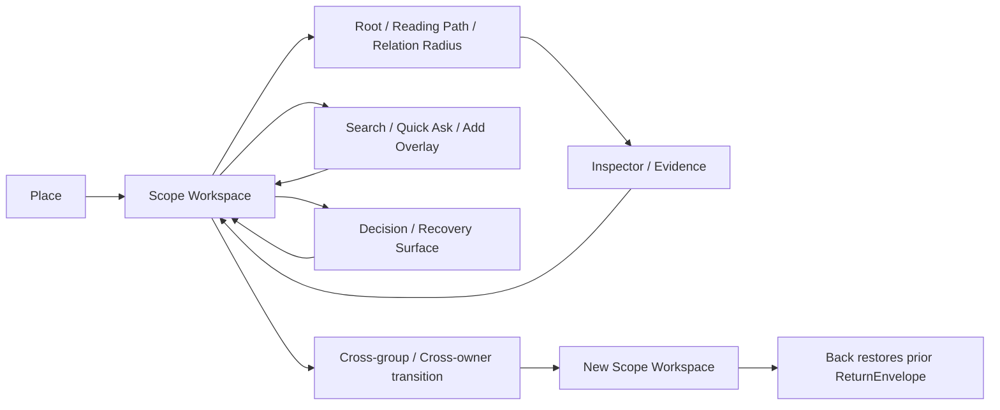

# AI-native 个人知识库

## 产品表面架构与完整设计证明合同 v1.0 — Places、Workspaces、Modes、Layers、States 与 Coverage

> **权威状态（2026-08-10）：MIGRATION_QUEUE，当前非规范。正文仍含旧四 Places / 旧编号，只能按 `文档权威注册表 v1.0` 作为候选历史规则读取。**  
> 日期：2026-08-06；结构修订：2026-08-07  
> 文档性质：终局产品表面、本体到交互的桥接合同与完整设计证明标准；不是页面清单、视觉皮肤、MVP 范围或原型授权  
> 当前 Canonical：`AI-native-个人知识库-终局产品设计文档-v6.0.md`；v5.0 只是本合同的历史形成来源，本文完成迁移前不得作为现行表面规格  
> 2026-08-07 写入表面冻结：用户直接编辑经安全 Direct Edit Commit 更新 current，不展示“完成并采用”；未来设计必须分别证明 Buffer、Recovery、Current、Draft、Proposal、Sync 与 Projection  
> 2026-08-08 Group Formation 证明冻结：未来设计必须证明 Blank、Knowledge selection、Source bundle、Topic promotion、View / Search snapshot 与 imported hierarchy 六种入口，及 Group Candidate accept / reject、existing Placements、Source-only、future-match 不继承与零副作用；本文仍不授权作图  
> v4.0 Query 覆写：未来设计必须证明 Scope Summary、Requested / Effective / Used Context、六种 Answer Basis、Coverage、Context Delta、Claim → Evidence → Back 与 Saved Answer / 写回分离；本合同仍不授权制作原型  
> v4.0 Scope 证明覆写：未来设计还必须证明 Boundary ≠ membership、Topic direct ≠ descendants、Group root placement ≠ Unplaced、Source Attachment ≠ Evidence Binding，以及 Topic merge / split / transfer 后的 lineage / return continuity；这些要求当前只进入定义与证明清单，不授权作图  
> v4.0 探索连续性证明覆写：未来设计必须分别证明 DepthTrail、ReturnStack、ExplorationTrail、SavedPath 与 PathProgress / ResumePoint；SavedPath 不得保存 `last_position`，scene 操作不得冒充 Path step；详情以`AI-native-个人知识库-探索路径、回返与继续合同-v1.0.md`为准  
> 历史深层模型：`AI-native-个人知识库-产品定义-v3.0.md`  
> 对象层级：`AI-native-个人知识库-产品对象层级与身份治理合同-v1.0.md`  
> 交互基线：`AI-native-个人知识库-交互架构与设计系统-v1.0.md`  
> 流程与覆盖：`AI-native-个人知识库-产品流程板与组件状态图-v1.0.md`  
> 产品语言：`AI-native-个人知识库-产品语言与渐进披露规范-v1.0.md`  
> 知识群工作区：`AI-native-个人知识库-知识群工作区与双镜连续性合同-v1.0.md`  
> 复杂度收敛：`AI-native-个人知识库-核心导航与复杂度收敛合同-v1.0.md`  
> 视觉证据与审查：`design-audit-ardot/Ardot-设计审查与全量设计蓝图-v1.0.md`  
> 当前 Ardot 证据：`design-audit-ardot/current-run/01-current-ardot.png` 与 `02-screen-1-home.png` 至 `08-screen-7-sources-storage.png`
> **2026-08-07 Library-first 领域覆写：**本文原 `Home / Library / Atlas / Sources` 四 Places 与四 Group Roots 数量决定已被`AI-native-个人知识库-核心心智模型与连续探索合同-v1.0.md`取代。当前 Surface taxonomy 以 `Knowledge Library（Groups / Network views）→ Scope Reading → Knowledge Reading`为主轴，Sources / History / Decision / Recovery 为 supporting utilities，关系以 R0–R3 按需出现。本文关于 Surface roles、Return Envelope、state families、responsive equivalence、Evidence Bundle 与 design proof 的方法继续有效；后文与本覆写冲突的 Place / Root 列表只保留为历史。完整性证明基线改为新核心合同的十二个 proof families；旧 81 项仍作为责任清单，不再被称为 81 个屏幕。
> **2026-08-08 Relation Presentation 领域覆写：**关系的 surface 强度与 R0–R3 半径分离。ordinary open 为 Quiet；explicit Inspect 为 Peek；explicit Show Relations 打开唯一 Companion；explicit Explore 才让 Relation Space 成为 Primary。旧文任何“Relations 作为固定 pane / Root”或 ordinary open 自动恢复 relation surface 的表述均失效；只有显式 Resume 可以恢复安全 scene。
> **2026-08-10 Relation Lifecycle 证明覆写：**未来设计必须分别证明 RelationCandidate、Current Relation、RelationRevision、EvidenceBinding、Challenge、Review、ended、superseded、retracted、archived 与 RelationTransitionCase，并证明 Network 的 Current / Suggested / History 三层不会互相冒充；本文仍不授权制作原型。完整合同见`AI-native-个人知识库-关系陈述生命周期与网络可信性合同-v1.0.md`。
> **2026-08-10 Group Relation Aggregation 证明覆写：**未来设计必须用真实 fixture 证明 cross-group exit → Aggregation Signal → Effective Support Unit collapse → Boundary / type / direction / counter / removal assessment → ambient / on-demand Candidate → adoption → support reassessment；raw path count、confidence、degree 与视觉线条不得替代 standing。本文仍不授权制作原型。完整合同见`AI-native-个人知识库-群级关系聚合门槛与支撑充分性合同-v1.0.md`，当前视觉证据见`design-audit-ardot/群级关系升级门槛与视觉证明缺口审计-v1.0.md`。
> **2026-08-10 Question Resolution 证明覆写：**未来 Screen 2 / 3 必须证明 Question Knowledge 的连续正文、current Resolution、criteria、remaining unknowns、targets、basis、Subquestions、resolution / pursuit / change 四轴、原子写入、review / reopen / successor 与 exact return；AI Answer 不自动 resolved / concluded。本文仍不授权制作原型。完整合同见`AI-native-个人知识库-问题知识、未知与求解生命周期合同-v1.0.md`。
> **2026-08-10 真实内容证明覆写：**未来 Screen 2 / 3 必须使用`AI-native-个人知识库-真实端到端使用样例与设计数据夹具-v1.0.md`这类真实长标题、官方规则、`as_of`、主体条件、changed criterion、cross-group exit 与 provisional Resolution 证明方向 3 + 2；抽象节点、短占位符和概念海报不再计为真实性证明。本文仍不授权制作原型。
> **2026-08-10 第二真实内容证明覆写：**未来 Screen 2 / 3 还必须使用`AI-native-个人知识库-第二真实端到端夹具-概念学习、多语境复用与群关系-v1.0.md`证明低时效概念主题：三层 Topic、长 Knowledge、Study Conditions、同一 Knowledge 双 Placement、parent + required Subquestions、same-pair foundation / method Bundle、3 条 Shared observations、rejected Candidate、challenge 与 exact Anchor return。只证明资格规则或只画论文卡片墙均不完整；本文仍不授权制作原型。
> **2026-08-10 Group Relation Type Registry 证明覆写：**未来设计还必须证明 intent-first type choice、相邻类型消歧、完整 statement / inverse reading、definition revision、migration review 与 Shared Knowledge observation；十一种正式类型按家族组织，不用十一种颜色。本文仍不授权制作原型。完整规则见`AI-native-个人知识库-群级关系类型注册表与语义互斥合同-v1.0.md`。
> **2026-08-10 Group Pair Comparison 证明覆写：**未来设计必须证明两侧 Boundary、同一 snapshot、Current / Shared / Paths / Suggested / History、Bundle / Inspector、Pair Ask、Graph / List / mobile 与 exact return；比较本身不写入。本文仍不授权制作原型。完整规则见`AI-native-个人知识库-知识群对照与关系检查器合同-v1.0.md`。
> **2026-08-10 Knowledge Relation Type Registry 证明覆写：**未来设计必须证明五类 intent-first choice、25-type adjacent checks、三种 support、`applies_to / implements`、direct / derived，以及 Relation 与 Reference / Evidence / Answer / IdentityTransition / Question state / disposition 的视觉分权；不得为二十五种类型各造颜色。本文仍不授权制作原型。完整规则见`AI-native-个人知识库-知识关系类型注册表与跨层语义合同-v1.0.md`。
> **2026-08-09 First-value 证明覆写：**未来完整设计必须用同一真实产品证明五种首日入口、Current Knowledge / Source-only 首份资产、Empty Group 合法、Question-first 空范围、部分成功、离开与首次返回，再接入稳定日常循环；不能用 onboarding screens、Demo library、完成进度或首日 Relation 代替。`写第一条知识`是空 Library 主动作，Empty Bare Group 采用一个首要动作 + 两个安静替代。本文仍不授权制作原型；完整合同见`AI-native-个人知识库-首日到日常核心旅程合同-v1.0.md`。
> **2026-08-09 Scale Invariance 证明覆写：**未来完整设计必须在同一产品中证明 F1 / F10 / F100 / F10K：All Groups 穷尽与 stable order、Resume / Pins / Recent 分权、深层 focus + ancestor context、Network 的 Scope Summary / exhaustive List / Anchor Required、全库 Ask 的 Group coverage，以及 Graph / List / mobile / keyboard 等价。自动 Top N、canonical Group regions、第二层 Shelf 与“大库首页”均判为失败；完整合同见`AI-native-个人知识库-规模化知识空间与长期可浏览性合同-v1.0.md`。
> **2026-08-09 Group State 证明覆写：**未来完整设计必须证明 Bare、Structuring、Oriented、review_due、Paused、Archived 可组合并共享同一 Group shell；P0 最多一条合成说明。任何五张互斥阶段页、阶段徽章墙或“休眠前 phase 恢复”均判为失败。本文仍不授权制作原型；完整合同见`AI-native-个人知识库-知识群状态演化与身份连续性合同-v1.0.md`。

---

# 0. 执行决定

2026-08-06 重新捕获的 Ardot Page 1 仍只有七个静态 Screen；Page 2 为空。七张图已经表达视觉气质，却没有形成一套可连续进入、返回、失败、恢复、扩展和验证的产品表面系统。

本合同冻结七十项决定：

1. **七张 Ardot Screen 是视觉与概念样本，不是完整产品设计。** 完整度不能按 Screen 数、画布面积或功能名数量判断。
2. **完整产品设计的单位是责任明确的 Surface + Transition + State + Evidence。** 一张静态正常态不能证明一个任务成立。
3. **产品只有一个稳定 App Shell。** Knowledge Library、Group、Topic、Knowledge、Answer、supporting utility 和编辑都共享位置、返回、全局动作与系统状态。
4. **一级产品地点只有 Knowledge Library。** `知识群 / Knowledge Network`是同一 Library 的两种视图；Resume 是其中的区域，Sources / History / Decision / Recovery 是 supporting utilities。
5. **Search、Ask、Add、Command 是全局动作，不是一级地点。** 用户从任意知识现场调用后仍能返回原现场。
6. **Orient、Explore、Ask、Create & Organize、Maintain 是工作模式，不是五套导航。** 同一 Place 可以承载多个模式，但一次主任务只有一个焦点。
7. **连续 Group / Topic / Knowledge Reading 是产品核心工作空间。** Overview、Structure、Relations、Sources 是四类完整责任，不要求成为四个同权根入口；打开 Topic / Node / Anchor 只让阅读继续深入，不创建第二工作台。
8. **L0–L5 是语义表达层，不是六条固定 Route。** Scope、Reading Depth 与 Relation Radius 独立变化，不能用页面跳转把三者锁死。
9. **全产品共享一套选择语义，但不把浏览等同于打开。** Focus、Inspect、Open、Compare 分层；Hierarchy、正文、图谱、Answer、Evidence 与 Context Rail 响应同一对象身份，而只有 Open 才改变可恢复的当前阅读目标。
10. **Surface identity 与 Product Resource identity 分开。** 页面、Rail、Overlay、Inspector 或 Modal 的存在不创造知识对象。
11. **Primary Resource 不自动拥有独立全页。** Placement、Relation、Evidence Fragment、Proposal、Change Set 可以通过所属 Scope 的 row、Inspector 或 Decision Surface 完整操作。
12. **Supporting Record deep link 先恢复 owner 与进入语境。** Revision、Binding、Run、Assertion 或 Definition 不打开孤立后台主页。
13. **Library Resume 只回答“我从哪里继续”。** 它不成为独立首页，不承担完整目录、全部变化、AI 摘要流或全量图谱。
14. **Library Groups view 回答“我稳定拥有哪些知识群、它们如何组织”。** 它不依赖推荐、最近行为或 AI 服务，也不成为文件夹后台。
15. **Library Network / R3 回答“知识群如何相连、我可以沿什么关系探索”。** 它不成为并列 Atlas 地点，也不承载长文编辑、全部对象或 provenance 图。
16. **Sources 是材料与证据的正式 supporting utility，不是一级地点或 Settings 连接器页。** Registry、Reader、Revision、Annotation、Fragment、Binding 和 impact 责任均必须成立，并从知识或全局 Add / Search 可进入后返回原现场。
17. **Knowledge Decision Workspace 只承载高影响判断，但不成为稳定 Place。** 新来源、未归类、普通 Working、低风险派生和所有 AI 候选都不能把它变成 Inbox。
18. **四类 Group 责任与上下文阅读路径共享 Group identity。** 从概览使用结构、关系或来源责任、打开正文与返回时，不复制内容，不重置已打开目标、Ask Scope 或返回栈。
19. **Node Reader 与 Node Editor 是同一知识表面的不同 mode。** 编辑不打开第二份正文，也不复制 canonical content。
20. **Source Reader 与 Source Registry 分工。** Registry 管理来源 identity 与状态；Reader 负责原文、版本、定位、标注和证据核验。
21. **Full Answer 是任务 Workspace，不是聊天页。** 它的数据模型保留 Question、Context、Claims、Route、Evidence、Unknown、Coverage、History 与保存后果；表面首先只显示 Direct Answer、Scope、内联依据和重要限制，其余按后果渐进展开。
22. **Quick Ask 是 Overlay，Full Answer 是 Workspace。** 两者共享 Query Turn / Run / Context / Claim Support，不形成两套回答模型。
23. **Global Search 是可恢复 Overlay。** 打开结果后 Back 返回 Request、Result Set、Anchor、scroll 与原工作现场。
24. **Capture 是可中断 Flow，不是一个“确认提取”页面。** Source Commit、Draft / Current Node、Proposal、Knowledge Commit 与 zero-yield 是不同完成结果。
25. **Context Rail 只承载当前主任务所需的局部关系、证据、位置、建议和历史。** 它不能成为永久字段墙、隐藏的第二导航，或与 Companion 重复的第三块内容面板。
26. **Inspector 用于检查关系与依据，不用于建立新 Place。** Relation、Evidence、Property、Support 与 Impact 从 owner Surface 打开并原路返回。
27. **高影响 Decision Surface 必须显示 base、change、affected、locked、failure isolation、undo 与 defer。** 不能用一个轻量确认弹窗提交身份或真相变化。
28. **History 与 Recovery 有真实表面。** Current History、Draft / Recovery、Change Set History 与 Query History 不共用一条含混时间线。
29. **Primary、Companion、Rail、Tabs、pane 比例与跟随 / 固定状态属于 Workspace State。** 用户调整布局不改变知识结构、View Definition、关系或当前知识身份；desktop 同时最多一个 Primary 与一个 Companion。
30. **Warm Paper 表达可阅读的 canonical content；Relation Night 表达选中范围内的关系观察。** 两种语言服务不同认知任务，但共享 Shell、Selection 和语义组件。
31. **星云图片不能承载真实图谱数据。** 真实 label、edge、selection、direction、type、state 和 keyboard focus 必须是可操作界面元素。
32. **关系显著性不能只依赖亮度、颜色、距离和线宽。** Relation type、direction、standing 与 why it matters 需要文本或形状等价表达。
33. **不显示裸 AI confidence 百分比作为接受依据。** 提案解释使用来源、identity match、Applicability、差异、影响和可逆性。
34. **Deep link 同时保存 Place、Surface role、owner、Selection 与可选 Anchor。** 链接不是只打开一个技术 ID。
35. **Back / Forward 是产品合同。** Overlay、Inspector、跨群跳转、Evidence、Search、Ask 与历史查看都必须恢复来源现场。
36. **同一时刻最多一个主 Decision Surface。** Inspector 可以并列，Modal 不嵌套；高风险动作关闭前不能丢失 draft decision。
37. **Modal 只用于范围有限、完成后回到原任务的决定。** 长内容、复杂比较、批量迁移、冲突和恢复使用全 Workspace 或 Sheet。
38. **Knowledge Library 与必要 supporting utilities 在所有核心 desktop Surface 中可达。** 用户不需要返回独立 Home 才能回 Library、Search / Ask / Add、Sources、History 或 Settings；Network 是 Library view，Decision 从受影响语境打开。
39. **响应式改变布局，不改变产品责任。** 窄屏可以折叠 Nav、把 Rail 变 Sheet、把 Split 变顺序，但不能隐藏唯一入口或删除核验能力。
40. **移动端是同一 Knowledge Space 的 companion Surface。** 阅读、Search、Ask、Capture、基本创作、Evidence 和恢复现场必须成立；复杂图谱可以默认使用列表等价视图。
41. **每个可视图谱都有 List Equivalent。** 列表不是失败降级，而是同一 selection、filter、relation semantics 与进入动作的正式表达。
42. **每个核心 Surface 至少覆盖 Calm、Focused、Decision、Forensic 四种披露级别。** 披露级别不等于对象状态。
43. **First-use / Empty 是正式状态。** 空 Space、空 Group、无 Source、无 Relation 与无 Search result 需要各自正确入口，不能统一成“让 AI 生成”。
44. **Partial / Stale / Rebuilding 保留 last good result 与 canonical reading。** 派生层异常不显示为 zero 或删除真相。
45. **Offline、AI unavailable、Source unavailable、Index unavailable 与 write failed 分开。** 每种状态说明仍可做什么、丢失什么和下一步。
46. **Conflict、destructive action 与 recovery 是核心状态，不是错误页附录。** 它们必须出现在真实任务流与设计证明中。
47. **Large Graph、10k Nodes、长正文与大量历史需要专门状态。** 不能从小型演示外推完整产品成立。
48. **Keyboard、screen reader、200% zoom、reduced motion 与 non-color cues 是表面合同。** 可访问性不能留到实现后补救。
49. **完整设计证明是 Evidence Bundle，不是所有组合都画一张。** Full Frame、Overlay / Rail、Component Variant、Flow Annotation 和 State Matrix 可以共同证明一个 Coverage ID。
50. **81 个 Coverage ID 继续保持唯一 Primary Board。** 本合同不新增 Coverage ID，只明确每项需要哪一种表面证据。
51. **共享组件必须通过跨 Surface 使用证明。** 只有画出复用、状态和行为一致性，才算组件，不以命名或 symbol 数量证明。
52. **核心 Journey 必须连续捕获。** 进入、选择、动作、结果、失败、恢复和返回不能由互不相干的静态画面拼接推断。
53. **设计 Fixture 必须包含多 Group、多 Placement、不同形成阶段、Working / Accepted、历史版本、冲突、缺证和来源变化。** 不能只用成熟、干净、全量索引数据。
54. **设计必须证明手工路径与 AI 路径同等成立。** 用户不导入来源、不启用 AI，也能建立、阅读、连接、维护和带走知识。
55. **当前七屏分别被重新分类为视觉参考、局部模式样本或待替换语义。** 它们不再作为覆盖完成证据。
56. **本合同不授权原型。** 先确认 Places、Surface roles、transitions、state families 与 proof model，再进入完整 Frame 系统。
57. **未来 Group Surface 必须同时证明 Boundary 与 Current Contents。** 两者使用不同语言和编辑入口；Boundary revision 不得以目录自动重排冒充完成。
58. **未来目录表面必须证明 direct / descendants / root / Unplaced 四种范围。** 不能只画一棵小树并假设成员语义成立。
59. **未来 Sources 表面必须证明 Source Attachment。** 同一 Source 的多个 exact Group / Topic paths、detach 后果、Source-only parse failure 与 Evidence Binding 独立性都需要状态证据。
60. **未来结构变换必须证明 identity continuity。** Topic merge / split / transfer 至少需要 Before、Impact Preview、Committed、Partial Failure / Rollback 与 Old Deep Link resolution；一张成功 Toast 不算证明。
61. **未来设计必须把结构位置与访问历史分开。** DepthTrail 只回答“我在哪里”；Back / Forward 恢复 ReturnEnvelope；Up、Back、Close 与 Resume 需要可辨认的不同后果。
62. **探索行为必须按副作用分层。** Hover / Focus / Inspect 不写历史，Open 才改变 primary target；Expand / Filter / Dismiss / Pan / Zoom 只改变 scene state。
63. **PB-03 必须证明探索分支。** Back 后 Open 新目标形成 current branch，旧分支以`刚才的另一条分支`可恢复；不能用线性 breadcrumb 掩盖分支。
64. **Saved Path 设计必须是编辑性策展。** 用户能从 Trail 删除弯路、重排、补目的与 manual reason；不能把 Recent 或完整访问流水直接保存为 Path。
65. **Path identity 与进度使用不同 Surface responsibility。** Path revision 编辑步骤；Continue / Reset 只修改 PathProgress / ResumePoint；Home Resume 不成为 Path editor。
66. **Path impact 必须同时证明当前与历史。** current、redirected、changed、historical-only、unavailable 与 Re-evaluate / successor 都要有状态证据，不能静默替换步骤。
67. **QueryRoute 转 SavedPath 必须经过显式 draft。** Runtime retrieval jump 与 formal Relation 在设计上可识别；转换不生成知识边。
68. **Graph / List / mobile / keyboard 使用同一连续性语义。** 相同 Open 形成相同 ReturnEnvelope、TrailStep、PathStep 与 Progress；空间位置和颜色不能成为唯一依据。
69. **关系表面使用 Quiet → Peek → Companion → Explore 的显式阶梯。** Presentation 与 R0–R3 Radius 分开；ordinary open 是 Quiet，Peek 不写导航，Companion 只 follow explicit Open 且最多一个，Explore 才交换 Primary；Resume 之外不得自动恢复关系面。
70. **规模变化必须由同一 Surface system 吸收。** F1 / F10 / F100 / F10K 不产生新的 Place、Mode、Root、对象或首页；Catalog 保持穷尽，深层阅读保持 focus + context，Network 超预算进入 Anchor Required，全库 Ask 显示 Group coverage，所有状态保留 List / mobile / keyboard 等价。

---

# 1. 当前设计证据与十八个结构缺口

## 1.1 证据范围

本轮实际检查：

1. Page 1：七个 1440 × 920 Screen；
2. Page 2：空画布；
3. 七屏均为单张 image fill，未发现可检查的内部组件、auto layout、prototype connection 或状态 variant；
4. 只检查可见结构，不从模糊小字推断隐藏需求。

证据截图：

- `design-audit-ardot/current-run/03-screen-1-knowledge-home.png`
- `design-audit-ardot/current-run/04-screen-2-dual-lens-workspace.png`
- `design-audit-ardot/current-run/05-screen-3-ia-concept-map.png`
- `design-audit-ardot/current-run/06-screen-4-capture-flow.png`
- `design-audit-ardot/current-run/07-screen-5-answer.png`
- `design-audit-ardot/current-run/08-screen-6-overview-editor.png`
- `design-audit-ardot/current-run/09-screen-7-sources-storage.png`

## 1.2 七个功能名替代了产品结构

Home、Workspace、Map、Capture、Answer、Overview Editor、Sources 看起来覆盖广，但没有说明哪些是 Places、哪些是 Scope Workspace、哪些是 Overlay、哪些只是 Settings。

## 1.3 每张图都拥有自己的临时 Header

七张图缺少同一 App Shell。用户无法推断：我在哪里、如何跨群、如何去 Library、怎样返回、后台状态在哪里。

## 1.4 Home 同时冒充首页、Ask、Capture 与 Atlas

Screen 1 的星图、输入框、最近变化和知识群卡片混在同一首屏，却没有稳定目录与范围说明。

## 1.5 Group Workspace 只是文章与星图图片并排

Screen 2 没有 Topic hierarchy、DepthTrail、Selection、Relation Inspector、Evidence、Placements 与真正联动。

## 1.6 IA 概念图被误当产品 Surface

Screen 3 用“八类对象 + 三种进入模式 + L0–L5”解释概念，却不是可操作界面；对象清单也已落后于当前十四类主要资源与五个日常名词合同。

## 1.7 生成式星云承担了数据可视化

随机星点、发光与连线没有可验证 node identity、relation type、direction、state、selection 或列表等价物。

## 1.8 Capture 仍是 AI 卡片工厂

Screen 4 假设输入必然生成 Node、Relation 和 Source，并逐条显示置信度与接受按钮；它没有 Source-only、Working Node、Identity Resolution、Decision Bundle 或 zero-yield。

## 1.9 Answer 仍是引用版长文本

Screen 5 有问题、正文和三张来源卡，但没有 Requested / Effective / Used Context、Claim boundaries、Coverage、Unknown、Conflict、Route、Run history 与 transform consequences。

## 1.10 Overview 编辑仍是建议卡片侧栏

Screen 6 表达“AI 不自动覆盖”是正确方向，但没有 Proposal、Base Revision、block-level Diff、Current commit、Projection rule、Support Map、Alignment 与 partial accept。

## 1.11 Sources 被压缩为连接器设置

Screen 7 没有 Source Registry、Reader、Revision、Representation、Annotation、Fragment、Binding、locator repair 与 change impact。

## 1.12 “双向同步自动合并”制造危险承诺

来源与知识真相不同，外部文件、Notion 与本地知识不能用一个双向同步选项处理；冲突、映射、写回范围和权限必须分别定义。

## 1.13 没有 Library

七屏没有一个稳定、可穷尽、不依赖 AI 的知识目录。用户不能证明“我的知识长期在哪里”。

## 1.14 没有真实 Node Reader

文章式 Overview 不能替代 Knowledge Node、Deep Detail、Evidence、Placements、History 与编辑作用域。

## 1.15 没有高影响 Decision Surface

冲突、合并、纠正、来源变化、结构建议、身份变化和 schema migration 都没有可从受影响对象进入并返回的完整表面。

## 1.16 没有失败与恢复

七屏全部是假设数据完整、AI 可用、来源在线、写入成功、索引新鲜的理想状态。

## 1.17 没有响应式与可访问性等价物

关系信息依赖图片、亮度、小字和空间位置；没有 keyboard、focus、200% zoom、screen reader 或 graph list 证据。

## 1.18 没有完整设计证明方法

设计团队无法判断应画新页面、组件 variant、状态注释还是流程证据，因此容易继续追加孤立 Screen。

---

# 2. 产品目标、非目标与证据边界

## 2.1 终局目标

1. 让用户在任何时刻知道当前 Place、Scope、Depth、Selection 与主要任务；
2. 让层级阅读、关系探索、AI 查询、直接创作、来源核验和知识维护共享同一产品骨架；
3. 让复杂内部对象通过正确 Surface 出现，不变成内部数据库后台；
4. 让每个任务拥有失败、恢复、返回和规模状态；
5. 让完整设计可以被逐项证明，而不是由视觉相似度或页面数量猜测。

## 2.2 永久非目标

- 不把产品变成以 Dashboard、Chat Timeline、Canvas 或 Database Builder 为中心的通用工具；
- 不让所有 Primary Resources 拥有独立一级页面；
- 不为每个 Coverage ID 创建一条 Route；
- 不把星图视觉隐喻当作图谱组件实现；
- 不用 AI confidence、资料数量、节点数量或关系数量证明知识质量；
- 不在本合同冻结最终颜色、字体、布局比例、图谱算法或动画曲线；
- 不因 desktop 优先而把移动端定义成只读壳；
- 不因本地优先而省略失败、备份、恢复与可迁出 Surface。

## 2.3 证据边界

- **[用户确认]**：产品本质是个人知识库；核心是知识群、群关系、Overview 到细节、AI 查询与网络探索；视觉偏好是方向 3 的层级阅读与方向 2 的关系空间结合；当前先定义产品，不做原型。
- **[当前设计事实]**：Ardot Page 1 有七个静态 Screen，Page 2 为空；七屏未共享稳定 Shell，也未展示 Library、contextual Decision、Node Reader、Source Reader 或失败恢复。
- **[研究事实]**：成熟知识工具使用稳定导航、full-page / preview / side panel / tabs、局部图谱与列表入口等不同表面责任；可访问性标准要求位置、键盘、焦点、reflow 与非颜色线索。
- **[产品决定]**：四个 Places、四个 Group Roots、contextual Decision / History、Surface taxonomy、transition rules、state families 与 design proof model 是本产品选择。
- **[待验证假设]**：用户是否自然理解五 Places、双镜联动、P0–P3 披露和 owner-first supporting record，需要后续真实任务验证。

---

# 3. 核心术语

## 3.1 Knowledge Library / 稳定主地点

在整个 Knowledge Space 中长期存在、可以直接进入并同时承载稳定浏览与网络探索的唯一一级目的地。

唯一主地点：Knowledge Library。其内含`知识群 / Knowledge Network`视图与 Resume region；Knowledge Decision、Sources、Settings、Trash、History 与 Recovery 是按需 Workspace / utility，不是额外 Place。

## 3.2 Scope Workspace / 范围工作区

围绕一个 Group、Topic、Node、Source、Answer、View、Path 或 Snapshot 完成连续任务的主工作区域。它继承 App Shell，不新增一级导航。

## 3.3 Mode / 工作模式

用户当前的主要意图：Orient、Explore、Ask、Create & Organize、Maintain。Mode 决定动作优先级，不创建对象或 Route。

## 3.4 Responsibility、Lens 与 Reading Path

- **Group Responsibility**：同一连续 Group 场景必须完整回答 Overview、Structure、Relations、Sources 四类问题，但不规定为四个同权标签；
- **Lens / View**：主任务或伴随任务的一种表达，例如 hierarchy、local graph、list equivalent、source usage；
- **Reading Path**：从 Group 经 Topic、Node 到 Anchor 的上下文路径，不是第六个 Tab，也不保存第二份正文。

Responsibility、Lens 与 Reading Path 共享 owner identity 与 return context，但 Focus、Inspect、Open、Compare 的后果必须区分。

## 3.5 Inspector / 检查器

从当前对象检查 relation、evidence、placement、property、support、history 或 impact 的局部表面。它始终显示 owner 和返回路径。

## 3.6 Overlay / 覆盖层

在不离开当前任务的情况下完成 Search、Quick Ask、Add 或 Command。Overlay 关闭后恢复原工作现场。

## 3.7 Decision Surface / 决策表面

为高影响变化提供 base、diff、alternatives、impact、defer、commit 与 undo 的 Sheet 或 Workspace。

## 3.8 Surface State / 表面状态

当前表面如何表现 empty、loading、partial、stale、offline、failure、conflict、destructive、recovery、large-scale 或 accessibility 情况。它不等于对象 lifecycle 或 epistemic state。

## 3.9 Design Proof / 设计证明

能够证明一条产品合同在可见结构、交互、状态、返回和辅助技术中成立的证据。可以是 Full Frame、Overlay、Component Variant、Flow Annotation、State Matrix 或经过捕捉的交互步骤。

---

# 4. Surface taxonomy 与责任准入

## 4.1 五类 Surface

| Surface class | 责任 | 是否改变一级位置 | 典型例子 |
|---|---|---:|---|
| Knowledge Library | 全局稳定主地点 | 是 | Groups view、Network view、Resume region |
| Scope Workspace | 围绕一个 owner 持续工作 | 否 | Group、Node、Source、Answer |
| Root / Lens / Panel | 改变同一 Scope 的入口或观察方式 | 否 | Group Roots、Local Graph、Evidence Rail |
| Overlay / Inspector | 局部定位、检查或轻量动作 | 否 | Search、Quick Ask、Relation Inspector |
| Decision / Recovery | 提交高影响变化或恢复 | 否 | Merge、Conflict、Restore、Migration |

`Settings / 设置`与`Trash / 废纸篓`不成为第六、第七个 Place：

- **Settings 是 Space-owned Service Workspace**，从用户菜单或相关状态进入，围绕 Storage & Index、Backup & Restore、Import & Export、AI Policy、Preferences & Accessibility 组织；关闭后回到原任务。Sources 的材料阅读、版本、标注、Evidence 与 lifecycle 不迁入 Settings。
- **Trash 是 Space-owned Recovery Workspace**，从 Library Archived、对象 lifecycle action 或设置中的数据管理进入；只处理可恢复 identity、impact、restore 与 permanent delete。它不成为日常知识目录，也不把 Remove Placement、Archive 与 Trash 混成一个动作。
- Knowledge Decision、Settings 与 Trash 共享 App Shell、deep link 与 Return Envelope，但不进入用户每日定位知识世界的四个稳定地点。

## 4.2 一个新 Surface 的准入问题

新增 Route、page、panel 或 modal 前必须回答：

1. 它属于哪个 Place 或 owner Scope？
2. 用户的独立意图是什么？
3. 为什么现有 Lens、Inspector、Overlay 或 Decision Surface 不能承担？
4. 打开和关闭如何恢复 Selection 与返回现场？
5. 它读写哪个 Truth Role？
6. 默认、empty、partial、offline、failure 和权限状态是什么？
7. 窄屏与辅助技术的等价表达是什么？
8. 它证明哪些现有 Coverage ID，而不是制造哪些新功能名？

无法回答时，不新增 Surface。

## 4.3 Surface 不创造对象

- History page 不创造 History Object；
- Evidence Inspector 不创造 Evidence Page resource；
- Search result page 不创造 Search Result knowledge；
- Graph view 不创造 Graph Object；
- Settings section 不创造新的 Knowledge Space；
- AI sidebar 不创造 Agent Memory 或 Thread resource。

## 4.4 对象不强迫独立 Surface

| Product Resource | 默认表达 |
|---|---|
| Placement | hierarchy row、Context Rail、Impact Preview |
| Relation | edge / list row + Relation Inspector |
| Evidence Fragment | Source Reader focus + Evidence Inspector |
| Change Set | Impact / History Surface |
| Proposal | inline Decision Bundle / contextual Decision Workspace |
| Knowledge Snapshot | Paths & Answers / History Workspace |
| View | Library saved surface + definition controls |

---

# 5. App Shell 与全局位置合同

## 5.1 Shell 必须持续回答五个问题

1. 我在哪个 Place？
2. 我当前在看哪个 Scope / owner？
3. 我深入到什么层级与正文深度？
4. 当前选中了什么？
5. 我怎样 Search、Ask、Add、返回或检查系统状态？

## 5.2 Shell 语义结构

```text
App Shell
  Primary Navigation
    Home
    Library
    Atlas
    Sources
  Global Bar
    Back / Forward
    DepthTrail
    Search
    Ask
    Add
    System Status
  Main Workspace
  Context Rail / Inspector Host
  Overlay Host
  Decision Surface Host
```

最终视觉可以折叠、重排或转为窄屏导航，但语义入口不能丢失。

## 5.3 Selection 与 Return Envelope

```text
ReturnEnvelope
  place
  surface_role
  owner_primary_resource_ref?
  scope_ref?
  placement_context_ref?
  reading_depth
  relation_radius
  selected_identity_ref?
  anchor_ref?
  view_definition_ref?
  view_evaluation_basis?
  filters / sort / grouping / layout
  expanded_rows
  scroll_anchor
  focused_control
  overlay_stack
```

打开新对象不要求保存每个像素，但必须恢复用户能够继续原任务的最小现场。

## 5.4 Shell 系统状态

全局状态只显示会影响当前任务的首要变化：

- local save / write failure；
- sync optional status；
- index partial / rebuilding；
- AI unavailable；
- Source unavailable；
- storage health；
- restore / migration in progress。

多个后台状态不得聚合成一个含混红点；当前任务不受影响时退到状态中心。

---

# 6. 四个 Places 与按需 Decision 的精确边界

## 6.1 Home

回答：**我现在最值得重新进入哪里？**

主要内容：

- 3–7 个高价值 Group entrances；
- 恢复最近 Path / reading position；
- 仅显示会改变当前理解的变化；
- scoped Ask 入口，默认范围明确；
- Bare / Oriented + review_due / Paused / Archived 的复合状态；
- 空 Space 的三条合法起点：建 Group、写知识、加来源。

不显示：

- 全量对象计数墙；
- AI 每日总结流；
- 全空间 node graph；
- 全部 Decision items 或维护队列；
- 以活跃度驱动的整理焦虑。

## 6.2 Library

回答：**我长期拥有什么，它在什么结构和视图中？**

主要 Lens：

- Knowledge Groups hierarchy；
- All Knowledge identity list；
- Paths & Answers；
- Saved Views；
- Archived；
- Unfinished 与 Unplaced 动态 Views。

必须区分 identity row 与 placement row。临时 sort / filter / layout 不改写 semantic structure。

## 6.3 Atlas

回答：**知识群如何相连，我怎样沿真实关系探索？**

默认只显示 Groups 与已接受的 Group Relations。用户选中一个 Group 后：

- 高亮一跳关系；
- 显示 relation statement 与 why it matters；
- 提供 supporting paths、Evidence 与 limits；
- 可以进入 Group Workspace 或保存 Path；
- 提供同义 List Equivalent；
- 不画 similarity、shared Source、View membership 或 Query overlay 为 canonical edge。

## 6.4 Sources

回答：**我的原始材料是什么、现在能否核验、它支撑了什么？**

至少包含：

- Source Registry；
- Source Detail / Reader；
- Revision 与 Representation；
- Annotation；
- Evidence Fragment / Binding；
- Source Change Impact；
- managed / linked / reference-only；
- parse / locator / availability / rights；
- archive、disconnect、trash 与 reconnect。

## 6.5 Knowledge Decision Workspace（非 Place）

回答：**这个变化为什么需要我判断，会改变什么？**

只从受影响知识、Overview notice、Source impact、Search / Command 或 deep link 进入。准入条件：

- true conflict；
- identity merge / split；
- Group / Topic transformation；
- high-impact RelationCandidate / Relation change；
- Overview semantic change；
- Source change affects accepted knowledge；
- destructive / schema / migration decision。

不进入 Decision：

- 新 Source；
- 普通 Working；
- Unplaced；
- zero-yield；
- low-risk projection refresh；
- 所有 AI candidate。

Decision 完成或关闭后回到触发现场。没有 Decision 时，导航不显示空 Place、0 badge 或清零状态。

---

# 7. Scope Workspaces

## 7.1 Group Workspace

Group Workspace 是方向 3 + 2 的主要落点：层级阅读负责理解，关系空间负责定位、发现与比较。两者共享知识身份，但界面一次只突出一个主任务。

```text
Group Workspace
  Group Header
    title / current Boundary Revision / boundary-content tension when relevant
    four roots: Overview | Contents | Relations | Sources
    contextual actions; Ask is available but not a permanent dominant CTA
  Reading Path
    Group > Topic > Node > Anchor
  Primary Surface
    exactly one current task: orient / browse / read / explore / verify / decide when contextual
  Companion
    optional hierarchy / local graph / list / source usage / comparison
    follows opened target, follows inspected target, or stays pinned
  Context Rail
    Relations | Evidence | Placements | Suggestions | History
```

呈现只有三种可预期 profile：Reading-dominant、Balanced dual lens、Map-dominant。它们改变空间权重，不改变 Root、Reading Path 或知识状态。Split 不是默认强制；desktop 同时最多一个 Primary、一个 Companion 与一个 Rail，compact / mobile 依次展开同一责任。

用户在 Contents 或 Relations 中移动焦点只改变浏览位置；Inspect 打开可关闭的局部说明；Open 才让 Topic / Node / Anchor 成为当前阅读目标；Compare 明确进入双对象比较。普通打开 Group 到 Overview，`继续`才恢复 last-safe 深层阅读，deep link 则进入精确目标。Changes 通过 Overview notice、owner History / Impact 或 Decision 出现，不占第五 Root。

## 7.2 Topic Workspace

Topic 是 Group 内稳定分支，不是独立 Knowledge Group。

Topic Surface 必须提供：

- breadcrumb 与 parent；
- Topic Overview；
- semantic child order；
- direct Placement rows；
- explicit include-descendants projection with exact paths；
- direct Sources projection；Topic 不增加第五个 Root；
- local relations / paths；
- create / move / promote / archive；
- merge / split / cross-group transfer impact entry；
- Gateway state；
- 回到 Group Overview 或进入 Node。

## 7.3 Node Workspace

Node Surface 同时承担阅读、编辑、关系、证据和历史入口：

```text
Node Workspace
  Orientation
  Synthesis
  Explanation
  Context Rail
    Relations
    Evidence
    Other placements
    Properties / Applicability
    History
```

Reading 与 Edit mode 共享同一 content tree。进入 L4 增加解释密度，进入 L5 打开核验语境，不创建第二份正文。

## 7.4 Source Workspace

Source Workspace 以原媒体为主，不以提取卡片为主：

- Reader；
- Revision / Representation switcher；
- find；
- Annotation tools；
- current Fragment focus；
- Binding Inspector；
- locator resolution；
- affected knowledge；
- back to Claim / Answer / Node。

## 7.5 Answer Workspace

```text
Answer Workspace
  Question + Run standing
  Requested Context
  Direct Answer
  Claims
    voice / basis / support / limitations
  Conflict / Unknown / Coverage
  Knowledge Route or Used Knowledge List
  Effective / Used Context
  Follow-up + Context Delta
  Run History / Re-evaluate
  Transform actions with distinct consequences
```

Answer 默认先可读，再按需展开 forensic details；不使用引用 footer 替代 Claim support。

## 7.6 View Workspace

View Workspace 显示 Definition 与当前 Evaluation 的区别：

- natural-language criteria；
- scope / filters / sort / grouping / layout；
- current members and coverage；
- stale / partial / rebuild；
- temporary adjustment；
- save / save as；
- workspace restore。

成员不是 View truth，不能直接编辑 Evaluation 来改变知识。

## 7.7 Path / Snapshot Workspace

Saved Path 负责理解顺序；Knowledge Snapshot 负责当时语境。表面必须区分：

- current object；
- saved revision / placement context；
- redirects；
- what changed since；
- continue current vs inspect historical；
- re-evaluate Answer without overwriting Original。

---

# 8. L0–L5、Depth 与 Relation Radius 的表面表达

## 8.1 三个正交维度

| 维度 | 问题 | 合法变化 |
|---|---|---|
| Scope Level | 我在整个空间、Group、Topic 还是 Node？ | L0–L3 |
| Reading Depth | 我需要 orientation、synthesis、explanation 还是 evidence？ | D0–D3 |
| Relation Radius | 我是否看关系、一跳、路径或 Atlas？ | R0–R3 |

## 8.2 典型组合

| 用户任务 | Scope | Depth | Radius |
|---|---|---|---|
| 浏览整个知识世界 | L0 Space | D0 | R1 Atlas |
| 读一个 Group 概览 | L1 Group | D0–D1 | R0 / R1 |
| 查看 Topic 结构 | L2 Topic | D0 | R0 / R1 |
| 阅读 Node | L3 Node | D1–D2 | R0 |
| 理解相邻观点 | L3 Node | D1 | R1 / R2 |
| 核验证据 | L3 Node | D3 | R0 / provenance lens |

设计不能把“打开图”自动解释为返回 L0，也不能把“看证据”解释为离开当前 Node identity。

## 8.3 DepthTrail

DepthTrail 至少表达：

```text
Knowledge Space / Group / Topic / Node / Section / Evidence
```

它按需折叠，但不能只显示当前标题。相同 Node 在多个 Placements 中需要说明当前路径并允许查看其他位置。

---

# 9. Overlay、Inspector 与 Decision Surface

## 9.1 Global Search Overlay

打开前保存当前 ReturnEnvelope。Overlay 包含：

- Request；
- Scope summary；
- exact-first result groups；
- owner-first rows；
- deep anchors；
- Coverage；
- Search → Ask / Explore 转换；
- no result 的 scoped / global 区分。

## 9.2 Quick Ask Overlay

Quick Ask 只适合短问题与当前上下文预览：

- 提交前显示 Requested Scope；
- 结果仍有 Claim support 与 Coverage；
- “打开完整回答”进入同一 Run 的 Answer Workspace；
- 关闭后恢复原 selection；
- 不把临时回答保存为知识。

## 9.3 Add Overlay

中文默认动作是“添加”，内部路由三条一等路径：

1. 写下知识；
2. 添加来源；
3. 导入旧知识库。

AI 不可用时三条路径仍能进入合法 local state。

## 9.4 Inspectors

| Inspector | 首屏必须回答 |
|---|---|
| Relation | 两端、statement、方向、why、support、limits、standing |
| Evidence | Fragment、Source Revision、Target、role、locator、verification |
| Placement | 当前路径、其他位置、contextual content、move / remove impact |
| Property | Definition、value state、origin、Applicability、Evidence |
| Supporting Record | owner、role、current / historical、basis、back |
| Impact | changed、affected、locked、failed、undo scope |

## 9.5 Decision Surfaces

以下动作默认不能使用普通确认弹窗：

- Node merge / split；
- Topic promotion；
- Group split / merge / absorb；
- canonical vs contextual scope expansion；
- true conflict resolution；
- Overview semantic diff；
- Source permanent delete；
- schema migration；
- restore；
- bulk knowledge change。

---

# 10. Create、Edit、Maintain 与 History 表面

## 10.1 直接创作

不经过 Source 或 AI 的完整路径：

```text
New Group
  → optional boundary / type suggestions
  → empty Group Workspace
  → write first Working Node
  → durable local save
  → organize with Topic / Placement
  → complete and accept
```

## 10.2 Editor persistence

Editor 必须区分：

- input received；
- saving local；
- saved local；
- sync queued / synced；
- Working；
- accepted；
- conflict；
- save failed；
- storage full / permission lost。

## 10.3 Edit Scope

开始与提交时用人话说明：

- 修改所有位置；
- 只修改这里；
- 另存为独立知识；
- 调整结构；
- 历史只读。

已有 Working changes 不能静默迁到另一个 Scope。

## 10.4 AI Patch

AI 对 accepted content 的修改显示：

- Base Revision；
- changed Blocks；
- support / reason；
- stale / rebase；
- accept selected；
- reject / defer；
- reviewed proposal confirm 可原子形成 current commit，不再二次采用。

## 10.5 History surfaces

| History | 回答 | 恢复动作 |
|---|---|---|
| Session Undo | 刚才做了什么 | undo / redo |
| Current Revision History | 当前知识怎样演化 | 从此创建 Recovery Draft / 取回部分 |
| Explicit Draft History | 主动保留的草稿怎样演化 | 继续 / 设为当前 / 放弃 |
| Recovery Checkpoints | 异常后能否找回近期现场 | 恢复到 Buffer / Recovery Draft |
| Change Set History | 一次多对象变化影响什么 | inverse / forward correction |
| Query Run History | 同一问题怎样执行 | open snapshot / re-evaluate |

---

# 11. Capture 与来源表面重构

## 11.1 Capture 五段而非单页

1. Input protection；
2. Parse / Source Preview；
3. Identity Resolution；
4. Decision Bundles；
5. Source Commit / Knowledge Commit summary。

每段可以后台、暂停或恢复。用户不需要等待全部 AI 处理才能保存真实输入。

## 11.2 合法完成结果

| 结果 | 含义 | 是否进入 Knowledge Decision |
|---|---|---:|
| Source saved | 材料安全保存 | 否 |
| Working Node saved | 用户原创内容本地保存 | 否 |
| Proposal deferred | 建议稍后判断 | 仅高影响才可能 |
| Knowledge committed | 正式知识变化已提交 | 否，显示 Change Set |
| Zero-yield | 没有产生新知识仍成功 | 否 |
| Partial parse | 可用部分保留 | 否 |
| Failed input protection | 真实输入尚未安全 | 是系统错误，不是 Decision |

## 11.3 Proposal 不是候选列表

大型输入默认呈现 3–7 个 Decision Bundles：

- same Source revision；
- update existing Node；
- add Evidence；
- new Placement；
- new Node；
- conflict / applicability split；
- source-only。

其余 raw candidates 被解释性聚合，不逐卡要求用户清理。

---

# 12. State families

## 12.1 State family matrix

| Family | Surface 必须说明 | 不能发生 |
|---|---|---|
| First-use | 合法起点与最小下一步 | 强迫导入或 AI 生成 |
| Empty | 为什么为空、当前 Scope / filters | 把 filter empty 写成 no knowledge |
| Loading | 正在等什么、可否继续 | skeleton 冒充完成 |
| Partial | 哪些已可用、哪些未覆盖 | 显示 zero result |
| Stale | last good basis、变化原因 | 静默重排或覆盖 |
| Rebuilding | canonical content 仍可用 | 删除 View / knowledge |
| Offline | 本地可读写能力 | 整个产品不可用 |
| AI unavailable | 手工与 local paths | 阻塞阅读、编辑、Search |
| Source unavailable | snapshot / provenance / reconnect | 删除 target knowledge |
| Write failed | last durable checkpoint、copy / retry | 误报 Saved |
| Conflict | common Base 与竞争值 | last-write-wins |
| Destructive | exact targets、impact、restore | 跨平面静默级联 |
| Recovery | protection scope、forward restore | 时间倒退删历史 |
| Large-scale | filter、virtualize、cluster / list | 全图全边 |

## 12.2 空态不是一张插画

不同空态的下一步不同：

- Empty Space：建 Group / 写知识 / 加来源；
- Empty Group：写第一条 / 建 Topic / 加已有知识；
- No Relations：建立关系 / 查看结构，不推荐随机相似；
- No Sources：继续原创知识或添加来源；
- Search true empty：调整词或范围；
- Search filter empty：清除过滤；
- No Decision：不显示空 Workspace、0 badge 或清零提示；
- View partial empty：等待 / rebuild，不宣称零成员。

---

# 13. 响应式、移动端与跨设备连续性

## 13.1 Desktop wide

允许 Left Nav + Main + Context Rail；Split Lens 可以并列。最终比例由视觉验证决定，不在产品合同写死。

## 13.2 Desktop compact / tablet

- Nav 可折叠；
- Rail 可变为 overlay / side sheet；
- Reading 与 Relation Lens 可切换；
- global actions 仍一跳可达；
- current Scope 与 DepthTrail 保留。

## 13.3 Mobile

- 四个 Places 有稳定导航入口；
- Search、Ask、Add 从所有核心位置可达；
- Graph 默认 List Equivalent，可按能力提供触控图；
- Node / Source 以内容为主，Inspector 变 bottom sheet；
- Quick Capture 支持文字、链接、照片、文件与分享入口；
- Offline local reading / writing 明确；
- 高影响批量或复杂 migration 可以提示到 desktop 完成，但不能导致数据不可读、不可导出或无法恢复。

## 13.4 Cross-device return

跨设备可以恢复 owner、Scope、selected object、reading anchor 与 Explicit Draft；Recovery Checkpoint 默认 device-specific。像素滚动与 pane width 可以 device-specific；不能让旧设备的 workspace state 覆盖知识。

---

# 14. 可访问性与图谱等价合同

## 14.1 Hierarchy tree

- Focus 与 Selection 分开；
- arrow keys 遍历 siblings / parent / children；
- expand / collapse state 可读；
- level、position 与 set size 有 programmatic meaning；
- multi-select 与 drag 有 keyboard action；
- 200% zoom 不隐藏当前路径。

## 14.2 Graph

- node、edge、direction、type、standing 有文本等价；
- Graph 与 List 共享 Selection、filters 和 Inspector；
- zoom / pan 不作为唯一进入方式；
- focused node 始终可见；
- selection 不只靠 glow；
- reduced motion 关闭 physics / fly-through；
- 关系标签不烘焙进背景图。

## 14.3 Split / Rail / Overlay

- DOM / reading order 与视觉顺序一致；
- resize 到 200% 时内容 reflow，不产生双向滚动作为默认；
- Overlay 打开后焦点进入，关闭后回到触发点；
- Focus 不被 sticky bars、sheets 或 tooltip 完全遮挡；
- hover 内容可以保持、关闭并通过键盘获得；
- danger、selected、contested、stale 不只依赖颜色。

## 14.4 Content

- Warm Paper 的纹理不降低正文对比；
- serif / sans 选择不牺牲长文可读性；
- code、table、citation、footnote 与中文标点在 zoom 后成立；
- AI / Source / Inference voices 同时使用文本标签，不只用色块。

---

# 15. Surface transition contract



## 15.1 转场必须保存的语义

| Transition | 必须保存 | 返回后 |
|---|---|---|
| Library → Node | result / placement / scroll | 回到原 row |
| Node → Evidence | Claim / Anchor / Binding / Source Revision | 回到 Claim |
| Atlas → Group | selected edge / viewport / filters | 回到边与位置 |
| Search → owner | Request / Run / Anchor | 回到 result set |
| Ask → Node | Claim / Route step / used revision | 回到 Claim |
| Group → cross-group Node | old Placement / path | 回到原 Group context |
| History → current | historical revision / compare | 回到 current workspace |
| Decision → owner | draft / impact / result | selection 与 changed items 可见 |

## 15.2 不允许的转场

- 打开 Evidence 后丢失 Question / Claim；
- 从图谱进入 Node 后 Back 只回到 Atlas 默认视口；
- Search 打开对象后关闭对象直接回 Home；
- Quick Ask 自动成为独立 chat history Place；
- Capture 完成后无法区分保存了 Source 还是 Knowledge；
- 修改 View temporary filters 后离开即覆盖 saved definition；
- 进入 Settings 处理 Source 后无法回到 Source Revision / Binding。

---

# 16. 当前七屏的处理决定

| 当前 Screen | 保留什么 | 必须替换 / 拆分什么 | 新身份 |
|---|---|---|---|
| 1 知识主页 | Warm Paper、进入知识世界的气质 | 缺 Shell、Scope、真实 Group、resume path；星图非数据组件 | Home 视觉参考 |
| 2 双镜工作区 | Reading + Relation 的核心张力 | 补齐四 Roots、Reading Path、Primary / Companion、选择分层、Evidence、List | Group Workspace 构图参考 |
| 3 IA 概念星图 | Night palette、关系空间想象 | 八对象说明、随机星云、L0–L5 静态刻度全部退出产品 Surface | 概念海报 / visual mood only |
| 4 Capture | 多输入入口 | 裸 confidence、逐候选接受、必然产出、单次确认 | Capture Flow 的旧语义参考 |
| 5 Answer | 长文阅读气质、来源入口 | Context、Claim support、Coverage、Route、History、Transform | Answer Workspace 的 Calm specimen |
| 6 Overview Editor | 用户正文优先、AI 不直写 | suggestion cards 改为 Branch / Diff / Projection / Support / Alignment | Overview Editing specimen |
| 7 来源与存储 | local ownership 主题 | 拆成 Sources Place 与 Ownership Settings；移除笼统双向自动合并 | Source / Ownership concept reference |

七屏可以保留在 Archive / References Page，不参与 81 项 Coverage 的通过计算。

---

# 17. 完整设计证明模型

## 17.1 五种证据类型

| Evidence type | 适合证明 |
|---|---|
| Full Frame | Place、Workspace、复杂状态的整体信息层级 |
| Overlay / Rail | Search、Ask、Inspector、局部选择与返回 |
| Component Variant | repeatable state、copy、focus、density |
| Flow Annotation | transition、side effect、persistence、back |
| State Matrix | empty、partial、offline、failure、scale、accessibility |

## 17.2 一个 Coverage ID 的最小证明包

```text
Coverage Evidence
  primary board
  user intent
  entry state
  visible surface role
  main action
  result / side effect
  failure / recovery
  return behavior
  P0–P3 copy
  accessibility equivalent
  linked shared components
```

## 17.3 “画过”不等于“证明”

以下均不算通过：

- 一张有标题的空 Frame；
- 把状态写在旁边但组件没有 variant；
- 用箭头连接两个没有共同 Selection 的 Screen；
- 只展示成功 toast；
- 图上有小字说明但真实控件不存在；
- 用同一张图声明 desktop / tablet / mobile；
- 通过星图背景暗示 relation；
- 用 lorem ipsum 或完美数据隐藏真实密度。

## 17.4 Design file 组织

```text
00 Foundations + Fixture Key
01 Components + State Graphs
02 PB-00 Shared Spine
03 PB-01 Orient
04 PB-02 Read Deeply
05 PB-03 Explore Relations
06 PB-04 Ask & Find
07 PB-05 Capture & Compile
08 PB-06 Maintain Knowledge
09 PB-07 Sources & Provenance
10 PB-08 Resilience
11 PB-09 Author & Organize
12 PB-10 Own & Configure
13 Coverage Index + Accessibility
99 Archive + Ardot References
```

## 17.5 Fixture families

至少维护三套跨板一致的数据 Fixture：

1. **Research**：多个理论、综述、原始研究、适用人群与争议；
2. **Product / Project**：产品原则、决定、版本、会议与来源；
3. **Life Decision**：法国租房、合同、官方指南、邮件、时间与地区条件。

每套同时包含：多 Group、跨群 Node、多 Placements、正式 / 建议关系、Working、historical、source-only、partial index、conflict、unavailable Source 与 saved Answer。

---

# 18. 二十六个代表场景

## 18.1 空 Space 直接写知识

没有 Source、没有 AI，用户从 Library 建 Group 并直接写第一条当前 Knowledge。

## 18.2 从 Library Resume 恢复阅读

用户进入昨天保存的 Path，恢复 Group、Node、Anchor 与 reading depth。

## 18.3 Library 穷尽浏览

用户不记得标题，通过 Group hierarchy 找到一个多 Placement Node。

## 18.4 Overview 到 Evidence

用户从 Group Overview 进入 Topic、Node、Detail、Evidence，再原路返回。

## 18.5 Atlas 跨群探索

用户选择一条 Group Relation，检查 statement、supporting paths 和 limits 后进入另一个 Group。

## 18.6 Graph 列表等价

用户只用键盘与 screen reader 完成与图中相同的选择、过滤、检查和进入。

## 18.7 Search 深层命中

搜索命中一个 Block、历史 Revision 和 Fragment，默认聚合到 owner 并保留 locator。

## 18.8 Ask 当前 Group

用户提交问题前检查 Requested Context，回答后检查 Used Context、Claim support 与 Coverage。

## 18.9 Answer 没有可靠 Route

系统显示 Used Knowledge List，不为了视觉效果强画虚假路径。

## 18.10 Source-only Capture

网页保存成功但没有新知识，用户仍可阅读、标注、以后提升或 Archive。

## 18.11 用户原创 Working

快速记录未分类、未采用，但可由 Library / Search 找回，不触发 Knowledge Decision。

## 18.12 Overview Projection stale

结构变化后 Projection 显示 last good result 与 changes available，Editorial prose 不被覆盖。

## 18.13 AI Patch stale

AI Proposal 的 Base Revision 已过期，用户先 rebase，再部分接受。

## 18.14 True conflict

两条 Claim 在相同 Applicability 下冲突，Decision Surface 并列双方、Evidence、defer 与 downstream impact。

## 18.15 Source Revision changed

Source 新版本让 Fragment relocated / changed，旧 Answer Snapshot 保留原 Binding。

## 18.16 Offline

Home、Library、Atlas cached canonical view、Node、Source snapshot 与编辑继续；Ask 明确不可用。

## 18.17 Index partial

Search 和 View 保留已知结果，显示未评估范围，不写成零结果。

## 18.18 Large Graph

100+ Groups / 10k Nodes 先显示 Scope Summary、hidden counts 与 exhaustive List；超预算进入 Anchor Required，允许从 Group、Search、Facet、Saved View 或 Path 定位，再显示 selected Group 与 accepted neighbours。不全图全边，也不以 degree / recency / AI Top N、自动 Group regions 或缩小标签代替范围说明。

## 18.19 Supporting record deep link

外部链接打开 Evidence Binding，首屏说明 owner Source、Target Node、role、standing 与 Back。

## 18.20 Restore without projections

删除 index、graph layout、Overview projection 与 Candidate ranking cache 后，从 canonical objects 重建可浏览产品，不丢 identity、standing、history 或 return context。

恢复包没有 indexes、view evaluations、graph layouts 或 workspace state，canonical knowledge 仍完整并可重建。

## 18.21 群级关系从出口到长期维护

两个 Groups 先只有一条 fringe cross-group exit；随后出现多个 raw paths，其中同一 Knowledge placements、inverse Relations 与同一 Source reports 被折叠。系统通过 Boundary coverage、type、direction、CounterSignal 与 strongest-unit removal 后形成 Candidate；用户采用才进入 Current；主要支撑改变后 Relation 保持 maintained + review_due。设计同时证明 Graph、List、Ask、Overview、desktop、mobile 与 keyboard 的 standing 一致。

## 18.22 精确类型、共享知识观察与定义迁移

同一 Group pair 同时存在`complements`与`contrasts_with`两条正式关系，并共享一条 canonical Knowledge；另有一条`challenges` Candidate 与一条使用旧类型定义版本的历史 Relation。用户先按意图选择并通过相邻类型问题完成精确陈述；Shared Knowledge Lens 只显示同一 identity 的两侧 Placements；Registry 更新只创建 migration review，不静默改型、改方向或把 observation 画成正式边。

## 18.23 从 Pair Comparison 核验关系并返回

用户分别从 Network edge、Ask Claim 与 Knowledge Anchor 进入同一 Group pair。产品在同一 snapshot 中显示两侧 Boundary、Current / Shared / Paths / Suggested / History；用户交换左右、切 Graph / List、检查 Candidate、深入 Evidence 后 Back，分别恢复原 edge / viewport、Claim / Answer scroll 与 Knowledge / Anchor，比较本身没有写入。

## 18.24 从分层阅读辨认精确 Knowledge Relation

用户在 Knowledge Paper 的 Claim Anchor 同时看到：一段来源支持该陈述、一条 premise Knowledge 支持该 Claim、本次 Answer 又把两条 Knowledge 作为依据；随后比较“这个原则适用于项目”与“项目已经落实原则”。Screen 2 必须用不同对象、措辞、connector 与 Inspector 分开三种 support，并明确 `applies_to / implements`；Screen 3 只把真正 semantic Relation 画为 Current edge，Question target、successor transition、retraction 与 runtime jump 不混入普通关系图。关闭 Inspector 后恢复原 Anchor、Reading Depth 与 scroll。

## 18.25 Question 从未知到当前回答、复核与重新追问

用户从 Group Overview 打开一条`已有部分进展 · 暂停追问`的 Question Knowledge，在方向 3 的连续正文中看到问题、Context、current Resolution、criteria 与 remaining unknowns；在方向 2 Companion 中分别展开 Target、Basis、Subquestion 与 ordinary Relation layers。用户从 Ask 形成一条 Knowledge、链接为 basis、采纳 provisional Resolution、结束追问；后来 basis 改变，系统标记 review_due，用户检查后 reopen。设计必须证明每个动作的独立后果、旧 Resolution / closure history、Graph / List / mobile 同义，以及从 Evidence / Answer Back 精确恢复。

## 18.26 真实资格问题从跨群阅读到个人条件变化

用户从“法国私人租房申请”Overview 沿“已签署新租约”具体出口进入“法国住房补助与资格”，阅读 2026-07-01 后特定非欧盟学生条件，保存一个含日期、居留、奖学金与职业活动的 Question。Screen 2 先展示规则 / 情境推断 / 机构结果边界，再分开保存 Answer、形成 Knowledge、链接 basis、采纳 provisional Resolution 与结束追问；个人职业条件后来改变时，只突出受影响 criterion，并允许用户检查、reopen、采纳新 Resolution。Screen 3 分开 formal Relations、Question targets、Answer basis、Evidence 与 cross-group exits；两个 exits 不自动形成群级边。全程必须证明长标题、`as_of`、真实 Source fragment、Graph / List / mobile 同义与 exact return。

---

# 19. Given / When / Then 验收

## 19.1 Place 可预测

**Given** 用户在任意核心 Workspace  
**When** 想进入 Home、Library、Atlas 或 Sources  
**Then** 四个 Places 在稳定导航中可达；Decision 从受影响语境打开；当前任务可通过 Back 恢复。

## 19.2 Surface 不制造对象

**Given** 新增 History Inspector 或 Graph Lens  
**When** 产品模型审查  
**Then** 不新增 History / Graph resource；所有读写落到既有 owner 与 Truth Role。

## 19.3 Group Root 与阅读路径连续

**Given** 用户在 Group 的 Topic 中选中一个 Node  
**When** 在 Overview、Contents、Relations、Sources 之间切换，或从 Contents / Relations 打开同一个 Node  
**Then** Group、Placement、已打开目标、Ask Scope 与 ReturnEnvelope 不重置；Focus / Inspect 不被错误升级为 Open。

## 19.4 Reading / Edit 同一正文

**Given** 用户正在读一个 Node  
**When** 进入编辑、形成 Recovery protection、完成 Direct Edit Commit  
**Then** 同一 content tree 前向产生 Current Revision；不存在第二份 editor body、审批 CTA 或 Buffer 污染默认 Ask。

## 19.5 Search 返回现场

**Given** 用户从一个长 Node 打开 Global Search  
**When** 打开结果再 Back  
**Then** 原 Node、Anchor、scroll、Rail 和 focused control 恢复。

## 19.6 Ask 两种表面同源

**Given** Quick Ask 已产生 grounded Answer  
**When** 用户打开 Full Answer  
**Then** 复用同一 Turn / Run / Context / Claims，不重新执行或创建第二份回答。

## 19.7 Capture 多种完成语义

**Given** 一个 Source 解析成功但没有新 Node  
**When** 用户完成 Capture  
**Then** 显示 Source saved / zero-yield success，不进入失败或欠整理状态。

## 19.8 Knowledge Decision 不成为 Inbox

**Given** 有 20 个普通 Working、10 个 Unplaced 与 3 个 true conflicts  
**When** 从其中一个受影响对象打开 Knowledge Decision  
**Then** 只处理当前高影响 conflict；没有全局队列，其他对象可从 Library Views 找回。

## 19.9 Evidence 返回 Claim

**Given** 用户从 Answer Claim 打开 Fragment 与 Source Reader  
**When** 核验后返回  
**Then** 恢复原 Claim、Run、Answer scroll 与 Route highlight。

## 19.10 Graph 等价

**Given** 用户无法使用 spatial graph  
**When** 切换 List Equivalent  
**Then** 可完成相同 selection、filter、relation inspection、cross-group navigation 与 save path。

## 19.11 Non-color meaning

**Given** Relation、contested、stale 与 selected 同时出现  
**When** 关闭颜色或使用 screen reader  
**Then** 类型、方向、状态和选择仍由文本、形状或 programmatic state 表达。

## 19.12 200% reflow

**Given** desktop Surface 放大到 200%  
**When** Nav、Main、Rail 无法并列  
**Then** Rail 转 Sheet、Nav 折叠、Main 保持可读；焦点和唯一入口不丢失。

## 19.13 Offline 不阻塞知识库

**Given** 网络与 AI 均不可用  
**When** 用户打开本地产品  
**Then** 浏览、Search exact、阅读、编辑、组织、Evidence snapshot 与 History 继续成立。

## 19.14 Projection partial

**Given** View Evaluation 只有部分 index coverage  
**When** 用户打开 View  
**Then** 保留 last good / known results，显示未评估范围，不宣称完整或 zero。

## 19.15 高影响决定不藏在 Modal

**Given** Node Merge 影响 Placements、Relations、Overview、Answers 与 Anchors  
**When** 用户进入确认  
**Then** 使用 Decision Surface 显示 alternatives、impact、locked、partial failure、commit 与 undo。

## 19.16 Supporting Record owner-first

**Given** deep link 指向 Query Run 或 Source Revision  
**When** 打开  
**Then** 首屏说明所属 Snapshot / Source、record role、historical standing、basis 与返回路径。

## 19.17 窄屏责任不缩水

**Given** 在 mobile 打开一个 Node  
**When** 查看 Evidence 与 Relation  
**Then** 通过 Sheet / List 完成同一核验和导航，不因没有双栏而删除能力。

## 19.18 Large-scale 不全图

**Given** 100+ Groups 和高密度关系  
**When** 打开 Atlas  
**Then** 先显示 effective Scope、当前 / 未显示数量与 exhaustive List；超预算要求 Anchor；定位后显示 selected Group 与少量 accepted neighbours；List Equivalent 与 selected path 可读；不产生 Top N core、canonical Group regions、伪关系或第二套大库模式。

## 19.19 Design Proof 可追踪

**Given** 某 Coverage ID 标记完成  
**When** 审查 Coverage Index  
**Then** 能定位 Primary Board、Frame / Variant、entry、main action、result、failure、return、copy 和 accessibility evidence。

## 19.20 七屏不计完成度

**Given** Ardot 已有七张视觉概念图  
**When** 计算产品设计完成度  
**Then** 只按 journey、state、failure、return、responsive、accessibility 与真实数据证明判断，不按画布面积、屏幕数量或星图气质判断。

原 Ardot 七屏只位于 Archive / Reference，不为任何 Coverage ID 自动提供通过证据。

## 19.21 群级关系升级链可被完整核验

**Given** 同一 Group pair 同时存在 exit-only、duplicate signal、qualified Candidate、maintained Relation 与 historical Relation fixture  
**When** 用户分别在 Graph、List、Ask、Overview、Candidate Inspector 与 Relation Inspector 中检查  
**Then** 每个 standing 使用同一身份和语义；Candidate 显示 coverage、去重、counter 与 removal result；Current 不因 Suggested 出现而重排；未通过门槛的 exits 仍可探索；采用与 support reassessment 都有原子后果和可靠返回；颜色、线型、confidence 与 path count 不是唯一意义载体。

## 19.22 群级关系类型在所有表面同义

**Given** 一个 Group pair 有两条不同正式类型、一项 shared-core observation、一项 type-ambiguous Candidate 与一个待迁移旧定义 Relation  
**When** 用户在 Graph、List、Ask、Overview、Relation Editor、Candidate Inspector 与 migration review 间检查  
**Then** 精确 type、direction、inverse reading、Applicability 与定义版本一致；P0 使用完整中文关系句；相邻类型可以比较；observation 没有 Relation standing / lifecycle / edge；validation 不自动修改；Registry 更新必须逐项审查；关闭 Shared Knowledge Lens 后 resting layout 完全恢复。

## 19.23 Pair Comparison 保持 standing、快照与返回

**Given** 同一 pair 同时有多条 Current Relations、shared observation、exits、Candidate 与历史 Relation  
**When** 用户从三种 origin 进入、交换左右、切图 / 列表、打开 Shared Lens、沿 Evidence 深入再 Back  
**Then** relation direction 不随左右反转；五层 standing 不混排；所有内容来自同一 snapshot；Graph / List / mobile 同义；比较与 Ask 不写入；每个 origin 的 selection、scroll、Anchor、viewport 与 focus 精确恢复。

## 19.24 Knowledge Relation 类型与跨对象语义在 Screen 2 / 3 同义

**Given** 同一阅读现场包含 semantic `supports`、EvidenceBinding support、Answer ClaimSupport、`applies_to`、`implements`、derived subtype path、Question target、successor transition 与旧 `blocks / overlaps_with` records  
**When** 用户在正文 Companion、Local Graph、Relation List、Ask Route、Editor、Inspector 与 migration review 间移动  
**Then** 三种 support 使用不同对象与连接语法；潜在适用不冒充真实采用；derived path 可展开 direct edges；Question / Transition / disposition 不进入 ordinary relation filter；legacy types 逐条迁移；五个 families 与完整标签承担意义，颜色不是唯一载体；Close / Back 精确返回原 Anchor 与 viewport。

## 19.25 Question Knowledge 的求解与追问状态在 Screen 2 / 3 同义

**Given** 同一 Question 有 partial adopted Resolution、required criteria、remaining unknowns、changes_available、多个 targets / basis / Subquestions 与普通 Relations  
**When** 用户在 Question Paper、Ask、Resolution Inspector、Local Graph、List Equivalent、Search、Overview、History 与 mobile 间移动，并执行保存 Answer、形成 Knowledge、链接 basis、采纳、停止追问与 reopen  
**Then** `已有部分进展 / 暂时可用 / 已充分回答`与`正在 / 暂停 / 停止追问`保持正交；Runtime Unknown 不冒充 Question；四类 connection 不混边；AI 不自动提交；每个写入后果可预测；old resolution / closure / successor history 可读；Back 恢复 exact Anchor、expanded section、layer、viewport、scroll 与 focus。

## 19.26 真实时效与 Applicability 不被视觉简化掉

**Given** 一个真实 Question 同时包含 2026 生效时间、非欧盟学生条件、奖学金、职业活动、官方 Source、contextual inference、operational outcome pending 与历史 Resolution  
**When** 用户在 Overview、Question Paper、Ask、Evidence、Relation Space、History、List 与 mobile 间移动，并只改变职业活动条件  
**Then** 所有表面保持同一 `as_of` 与主体快照；规则、推断、机构结果用语不同；只有受影响 criterion 被强调；历史回答按旧 Applicability 继续成立；cross-group exits 不冒充 Group edge；Back 精确恢复原现场。

---

# 20. 官方研究依据与产品推论

## 20.1 Capacities Navigation

Capacities 官方文档把同一对象的 full-page、preview modal、side panel 与 tabs 分开；side panel 用于保留主内容同时查看图谱、backlinks、contained objects 和 related content，tabs 各自保存 breadcrumb 与 panel state。

产品推论：同一知识 identity 可以使用多种 Surface role；preview、side panel 和 full Workspace 不应创建多份内容，返回与上下文状态属于产品合同。

[Capacities Navigation](https://docs.capacities.io/reference/navigation)

## 20.2 Capacities Graph View 与 Backlinks

Capacities 官方 Graph View 是围绕当前对象的 local graph，并提供 backlinks / related content 的列表入口；官方 Backlinks 文档也区分 explicit links 与 unlinked mentions。

产品推论：Group Map / Local Graph 必须以当前 Scope 和 Selection 为中心，并拥有列表等价物；候选相似或未连接提及不能冒充正式关系。

[Capacities Graph View](https://docs.capacities.io/reference/graph-view)、[Capacities Backlinks](https://docs.capacities.io/reference/backlinks)

## 20.3 Anytype Sidebar、Queries、Graph 与 Tabs

Anytype 官方文档将 sidebar、pinned objects、object types、Search、Graph、Queries 与 Collections 分开；Queries 是对 graph 的动态筛选而不存储成员，tabs 可以并列打开对象并在重启后恢复。

产品推论：稳定导航、动态 View、Graph 与 workspace continuity 是不同责任；View result、Pin、Recent 与打开的 tabs 不应改变对象归属或知识真相。

[Anytype Sidebar](https://doc.anytype.io/anytype-docs/getting-started/customize-and-edit-the-sidebar)、[Anytype Queries](https://doc.anytype.io/anytype-docs/getting-started/sets)、[Anytype Graph](https://doc.anytype.io/anytype-docs/advanced/feature-list-by-platform/graph)、[Anytype Other Features](https://doc.anytype.io/anytype-docs/advanced/feature-list-by-platform/other-features)

## 20.4 W3C WCAG 2.2

WCAG 2.2 要求 keyboard accessibility、focus order / visible / not obscured、reflow、non-text contrast、content on hover or focus，并禁止仅靠颜色传达信息。

产品推论：图谱 glow、边颜色、空间位置与 hover tooltip 不能是唯一语义；Nav、Tree、Overlay、Rail 和 Decision Surface 必须在 reflow 与 keyboard focus 下成立。

[WCAG 2.2 Understanding](https://www.w3.org/WAI/WCAG22/Understanding/)、[Use of Color](https://www.w3.org/WAI/WCAG22/Understanding/use-of-color)、[Focus Not Obscured](https://www.w3.org/WAI/WCAG22/Understanding/focus-not-obscured-minimum)

## 20.5 WAI-ARIA Tree 与 Grid patterns

WAI-ARIA Authoring Practices 分别定义 Tree 与 Grid 的 focus、selection、方向键与 composite navigation 语义，并明确 focus 与 selected state 不同。

产品推论：Library hierarchy、Search results、Property / migration tables 和 graph list 需要显式 keyboard / screen reader behavior，不能只画视觉 rows。

[Tree View Pattern](https://www.w3.org/WAI/ARIA/apg/patterns/treeview/)、[Grid Pattern](https://www.w3.org/WAI/ARIA/apg/patterns/grid/)

## 20.6 研究不证明什么

上述官方资料证明多表面职责、局部图谱、动态视图、context persistence 与 accessibility patterns 已被真实产品或标准清楚定义；它们不证明本产品的单一 Knowledge Library、Groups / Network 双视图、四类 Group 责任、contextual Decision / History、Reading Path、Primary / Companion 限额或方向 3 + 2 构图已通过用户验证。

---

# 21. 对相邻合同的同步要求

## 21.1 产品定义

- 增加第十六轮产品表面架构复核；
- 冻结 Place / Workspace / Lens / Overlay / Inspector / Decision Surface 的区别；
- 明确完整设计证明不是页面数量；
- 明确原七屏只作 Reference。
- 同步 Knowledge Relation 25-type registry、跨对象语义与第 74 条 Canonical 验收。

## 21.2 交互架构

- 基础决定增加 Surface taxonomy、Group Root / Reading Path 与 ReturnEnvelope；
- 组件增加 PlaceNav、SurfaceRoleHeader、GroupRootSwitcher、ReadingPath、PrimaryTaskIndicator、CompanionHeader、ReturnContextSummary、GraphListEquivalent、DecisionSurfaceHeader 与 CoverageEvidenceCard；
- 验收增加 Place 可预测、Root 与 Reading 连续、Focus / Inspect / Open 分层、Overlay 返回、Graph 等价、responsive responsibility 与 proof traceability。
- RelationEditor / Inspector 增加 intent-first family、type definition revision、adjacent-type review，以及 Evidence / Answer / Transition / Question 专属 surface 路由。

## 21.3 产品流程板

- PB-00 冻结 Place / Surface / ReturnEnvelope；
- 每个 PB 标记 Full Frame、Overlay / Rail、Component Variant、Flow Annotation 或 State Matrix；
- 完成门槛增加七屏 Archive、Surface role、transition、responsive 与 proof evidence。
- PB03 增加 Knowledge type validation、migration review、identity transition 与 question target events。

## 21.4 产品语言

- 默认不显示 Place、Workspace、Lens、Overlay、Inspector 等内部分类；
- 用户语言使用“知识库”“知识群 / 知识网络”“继续上次”“概览、结构、关系、来源”“需要你判断”“查看修改记录”“返回刚才的位置”；
- 禁止“对象中心”“进入模式”“置信度 94%”“双向同步自动合并”等误导文案。
- 固定“知识支持主张 / 来源支持陈述 / 本次回答依据”与“适用于 / 实际落实了”的不同句式。

## 21.5 设计审查与蓝图

- 用本轮 `current-run` 截图重新确认七屏未变化；
- 新增 Surface Architecture 忠实度；
- 下一轮设计顺序先做 Shell / Places / Group Workspace 与 proof system，不追加孤立 Screen。

---

# 22. 结论

这个产品不是 Home、Graph、Capture、Answer 各画一张就成立，也不是把所有能力放进一个无限星图。

它需要一套稳定、安静、可追溯的表面秩序：

> **Places 让用户知道去哪里，Scope Workspaces 让用户围绕知识持续工作，Group Roots 让稳定问题可预测，Reading Path 让理解持续深入，Primary / Companion 让阅读与关系探索互相照亮，Overlays 让全局动作不打断现场，Inspectors 让证据和关系可核验，Decision Surfaces 让高影响变化可理解、可延期、可撤回。完整设计由连续任务和状态证据证明，而不是由漂亮页面数量证明。**

方向 3 + 2 的真正结合不是米色纸张和深色星图并排，而是：**阅读与网络使用同一 owner、Selection、Depth、Evidence 与 ReturnEnvelope，任何一个镜头都不能制造第二份知识真相。**
