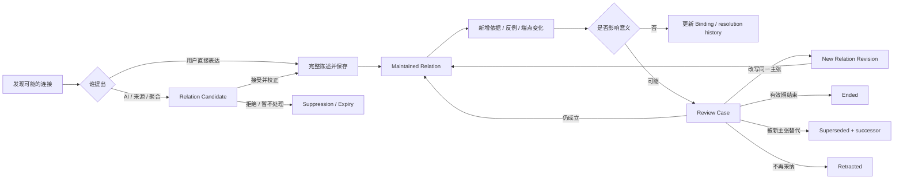

# AI-native 个人知识库

## 关系陈述生命周期与网络可信性合同 v1.0

> 日期：2026-08-10  
> 文档层级：Tier 3 领域合同  
> 适用对象：Knowledge Relation、Group Relation、Relation Candidate、Relation Revision、Evidence Binding、Challenge、Review Case、Relation Transition、Library Network / Group Map / Local Graph 投影  
> 上位文档：`AI-native-个人知识库-终局产品设计文档-v4.0.md`  
> 相邻合同：`AI-native-个人知识库-知识深度与关系探索合同-v1.0.md`、`AI-native-个人知识库-知识群边界与跨群架构合同-v1.0.md`、`AI-native-个人知识库-来源证据与可追溯性合同-v1.0.md`、`AI-native-个人知识库-知识群状态演化与身份连续性合同-v1.0.md`  
> 群级聚合覆写：`AI-native-个人知识库-群级关系聚合门槛与支撑充分性合同-v1.0.md` 对 Aggregation Signal、Effective Support Unit、Boundary coverage、type-specific gate、CounterSignal、removal test 与 Candidate eligibility 拥有更具体的领域覆写权  
> 群级类型覆写：`AI-native-个人知识库-群级关系类型注册表与语义互斥合同-v1.0.md` 对 GroupRelationTypeDefinitionRevision、`partially_overlaps_with`、Shared Knowledge Observation、`complements / challenges`、advanced `influences` 与 type migration 拥有更具体的领域覆写权  
> 知识类型覆写：`AI-native-个人知识库-知识关系类型注册表与跨层语义合同-v1.0.md` 对 KnowledgeRelationTypeDefinitionRevision、25-type registry、三种 support 分权、`prevents / implements / partially_overlaps_with` 与 `supersedes / retracts / reopens / uncertain_about` 降级拥有更具体的领域覆写权  
> 视觉边界：本文继续采用“方向 3 的层级阅读 + 方向 2 的按需关系空间”，但不授权制作原型

---

# 0. 执行结论

## 0.1 这轮审计发现了什么

现有产品定义已经正确建立了以下基础：

- Relation 是完整、可读、可限定的知识陈述，不是一条装饰线；
- Relation 拥有稳定 identity、Revision、Evidence 与 History；
- AI 推断不能直接进入正式 Network；
- Group Relation 与跨群 Knowledge path 分开；
- 底层支持变化不能静默删除或改写 Group Relation；
- Split / Merge 必须预览 Relations 的影响；
- Network 的显示优先级不能冒充知识状态。

但长期使用仍有六个结构缺口：

1. **Candidate 与正式 Relation 仍共用 `proposal_state`。** 这会让一个被拒绝的系统建议，看起来像一条处于“rejected”状态的正式知识关系。
2. **`epistemic_state` 把证据数量、反例、用户判断和当前采用混成一枚标签。** `supported / contested / unknown` 无法解释具体由什么支持、哪里被挑战、冲突是否真的处于同一 Applicability。
3. **`freshness_state = current / review_due / stale` 把时间有效性和维护动作混在一起。** 一条截至 2024 年正确成立的历史关系不是“陈旧垃圾”；一个来源更新也不等于关系已经失效。
4. **`lifecycle_state = active / superseded / archived` 把语义替代和对象收纳混在一起。** Supersede 是陈述连续性决定，Archive 是用户的保留与默认使用决定，两者不能在同一轴上互斥。
5. **Evidence 增减与 Relation Revision 边界不稳。** 增加一条参考资料不应制造新的语义版本；改变 Applicability 却必须进入语义 Revision。
6. **Split / Merge 后的端点处理缺少逐边结果。** “合并或保留 Group Relations”仍不足以阻止系统把旧 Group 的关系静默挂到新 Group 上，或把一条旧关系复制给所有 split successors。

## 0.2 本文件冻结的四十项决定

1. **Candidate 不是 Relation。** AI、来源抽取、相似度、共现和自动聚合先创建 `RelationCandidate`；接受后才物化为正式 Relation。
2. **被拒绝的是 Candidate，不是正式 Relation。** 拒绝只保留低成本 suppression memory，防止无新依据时重复建议。
3. **Relation identity 表示一条长期陈述谱系。** `RelationRevision` 表示这条陈述在某一时刻的完整意义。
4. **Qualifier / Applicability 属于陈述意义。** 移除后会改变主张，因此属于 Relation Revision。
5. **Evidence / supporting paths 不属于陈述意义。** 它们通过独立 Binding 或 Support Set 绑定到具体 Revision。
6. **增加或替换 Evidence 默认不创建 Relation Revision。** 只有陈述、方向、端点角色、类型或限定变化才创建语义 Revision。
7. **一条 Relation 的当前采用状态不由证据数量决定。** 用户可以维护一条没有外部证据、但明确属于个人理解的关系。
8. **`epistemic_state` 不再作为 canonical truth。** 界面改为表达具体事实：有无依据、是否存在未解决挑战、哪些依据不可用。
9. **`freshness_state` 不再作为 Relation canonical truth。** 时间有效性由 `valid_from / valid_to / applicability` 表达；维护需求由 `change_condition` 表达。
10. **Relation 的陈述连续性使用 `assertion_disposition`。** 取值为 `maintained / ended / superseded / retracted`。
11. **`ended` 与 `retracted` 必须分开。** 前者表示在明确时间或旧范围内曾经成立；后者表示当前不再采纳或认为有误。
12. **Supersede 必须指向 successor Relation。** 没有替代主张时不能为了隐藏旧边而使用 superseded。
13. **Archive 不表达真伪。** `lifecycle_state = current / archived / trash` 与 assertion disposition 正交。
14. **Review 不表达失效。** `change_condition = review_due` 只说明存在足以影响意义的变化，需要判断。
15. **一条当前 Relation 可以同时是 maintained、review_due、evidence-limited、open-challenged 与 current lifecycle。** 界面不得把它压缩成“低质量”。
16. **Challenge 是一等对象。** 它绑定具体 Relation Revision、重叠 Applicability、挑战陈述与依据，并拥有独立 resolution history。
17. **AI 找到反例先创建 Challenge Candidate。** 未经用户保存或明确采用，不修改 Relation 的长期状态。
18. **Evidence Binding 的 role 继续使用 supports / challenges / qualifies 等，但 role 属于 Binding，不属于 Fragment 或 Relation 全局状态，也不解析为 `knowledge.supports / contradicts / qualifies`。**
19. **Relation Review Case 是影响处理容器，不是管理收件箱。** 只有需要语义判断的变化才创建，低风险 locator repair 不制造维护任务。
20. **Review Case 解决后必须留下 Decision Event。** 结果可以是 maintain、revise、end、supersede、retract 或 defer。
21. **Defer 不改变 Relation truth。** 它只保存推迟原因和再次提醒条件。
22. **Relation 的撤回不删除端点、Evidence、Overview、Answer 或 Saved Path。** 下游继续保存当时使用的 Revision。
23. **正确的历史 Relation 进入 as-of 查询和 History，不进入默认当前 Network。**
24. **Retracted Relation 默认不参与当前 Ask。** 只有显式历史、争议或“为什么改变”查询才使用。
25. **Review-due Relation 仍是当前关系。** 若被 Ask 使用，回答必须说明影响；Network 不可因为 review_due 静默消失。
26. **同一 endpoint pair 可有多条 Relation。** Duplicate detection 只提出比较，不自动合并。
27. **Relation Bundle 仍是纯呈现对象。** 它不拥有 standing、Evidence 或 successor。
28. **Relation Merge 是 identity 变换。** 只有确认两条陈述语义等价时才选择 canonical relation_id，并为另一 identity 建 redirect。
29. **Group Relation 的 supporting paths 使用独立 `SupportSetRevision`。** 支撑集合变化不自动改写 Relation Revision。
30. **SupportSet 的重大变化触发 Review Case，不直接改 assertion disposition。**
31. **Endpoint rename、唯一 redirect 和安全 Anchor relocation 不改变 Relation identity。** 它们写 resolution history。
32. **Endpoint successor、split 或 scope-changing merge 不允许静默 retarget。** 系统创建 `RelationTransitionCase`，旧端点引用保持可重建。
33. **Split 不复制 Relations。** 每个 successor 只得到独立候选；用户逐条确认适用范围与新陈述。
34. **Merge 不自动合并 Relations。** 对外重复边先做语义比较；内部变成 self-edge 的旧关系只保留历史，不改造成其他类型。
35. **端点变换可以让旧 Relation `ended` 或 `superseded`，但必须记录原因。** 不能用 Archive 掩盖结构影响。
36. **Network 默认边来自 maintained + current lifecycle + 可解析端点的正式 Relations。** Candidate、retracted、ended、superseded 与 trash 不进入默认边集合。
37. **图形线型不承担多维状态。** Candidate layer、当前关系和历史关系可以有不同层，但 Evidence、Challenge、Review 原因必须用文字可读。
38. **Search、Ask、Overview、Saved Path 与 Export 都引用 relation_revision_id。** 不只引用会漂移的 relation_id。
39. **关系数量、接受率和图密度不是成功指标。** 可信性以可解释、可重建、无静默改义和可完成探索衡量。
40. **普通用户默认只需要理解“当前关系、需要检查、存在反例、已结束、已被替代、已撤回、已归档”。** 内部对象与状态留在 Inspector / History。

---

# 1. 产品中的关系到底是什么

## 1.1 一句话心智模型

> **一条关系是一句可以长期被检查、修订、限定、挑战和追溯的理解；Network 只是这些关系在当前范围内的可读投影。**

用户不是在维护图数据库。他做的是：

- 说清楚两份知识为什么相连；
- 指明这句话在什么条件下成立；
- 在需要时查看它的依据和反例；
- 当理解变化时，决定是澄清、结束、替代还是撤回；
- 以后仍能知道过去为什么这样理解。

## 1.2 为什么“边”不足以成为产品单位

一条边只能表达 `A — B`。真实知识关系至少还需要回答：

- 从 A 到 B 还是从 B 到 A；
- `supports`、`causes`、`applies_to` 还是 `contrasts_with`；
- 对哪个对象、时间、地区、方法或目标成立；
- 是用户理解、来源直接表达、导入数据还是系统推断；
- 哪些材料支持、挑战或限定它；
- 当前仍采纳、已经结束、被替代还是被撤回；
- 端点重组后，这句话是否仍指向同一个知识范围。

因此 Graph edge 只能是 Relation 的一个 projection，不是 canonical truth。

类型本身也必须被版本化。Knowledge-level Relation 使用独立 `knowledge.*` registry；Group-level 使用独立 `group.*` registry。即使两层都显示“为……提供基础”，它们也不能共享 endpoint constraint、充分性门槛或 TypeDefinitionRevision。

`superseded / retracted` 在本文中仍然是 Relation assertion disposition，表示一条**已经存在的 Relation**当前怎样被看待；它们不是可由用户在两个 Knowledge 之间新建的 Relation types。Knowledge identity 的 current replacement 使用 KnowledgeIdentityTransition，Question 的 reopen 使用 QuestionLifecycleEvent。类型 registry 与生命周期轴必须保持正交。

## 1.3 关系生命周期不是“创建—删除”

长期循环是：



这条循环中，Candidate、Relation、Review Case 和历史结果是不同对象；不能靠一个 status enum 承担全部责任。

---

# 2. Canonical 对象模型

## 2.1 对象总览

| 对象 | 长期责任 | 是否是正式知识关系 | 默认进入 Network |
|---|---|---:|---:|
| `RelationCandidate` | 保存一个待判断建议及形成理由 | 否 | 否，只有 Suggested layer |
| `Relation` | 保存一条关系陈述谱系的稳定 identity | 是 | 取决于当前 disposition / lifecycle |
| `RelationRevision` | 保存某次完整语义表达 | 是 | current revision 才可成为默认边 |
| `EvidenceBinding` | 说明某 Fragment 如何作用于某 Revision | 否，属于依据层 | 不单独成边 |
| `GroupRelationSupportSetRevision` | 保存聚合群关系在某时刻依赖的 paths | 否，属于支撑层 | 不单独成边 |
| `RelationChallenge` | 保存具体反例、冲突陈述及重叠范围 | 否，作用于关系 | 不单独成边 |
| `RelationReviewCase` | 保存一次需要语义判断的影响处理 | 否 | 不单独成边 |
| `RelationDecisionEvent` | 保存用户或策略做出的维护决定 | 否 | 影响当前投影 |
| `RelationTransitionCase` | 处理 endpoint split / merge / successor | 否 | 过渡期只说明影响 |
| `RelationBundle` | 折叠同 pair 多关系的展示容器 | 否 | 只呈现成员 |

## 2.2 Relation

```text
Relation
  identity
    relation_id
    endpoint_kind: knowledge | group
    current_revision_ref?

  continuity
    assertion_disposition:
      maintained
      ended
      superseded
      retracted
    successor_relation_refs[]
    predecessor_relation_refs[]
    disposition_reason_ref?
    disposition_decided_at?

  maintenance
    change_condition:
      no_material_change
      changes_available
      review_due
      transition_in_progress
    open_review_case_refs[]
    open_challenge_refs[]

  lifecycle
    lifecycle_state:
      current
      archived
      trash

  lineage
    created_by
    formation_basis
    adopted_by?
    created_at
    revision_refs[]
    decision_event_refs[]
    identity_redirect_ref?
```

`current_revision_ref` 可以在 Relation 被 trash 后保留，便于恢复；是否参与当前知识由 disposition 与 lifecycle 共同决定。

## 2.3 RelationRevision

```text
RelationRevision
  identity
    relation_revision_id
    relation_id
    previous_revision_ref?

  endpoints
    canonical_from_ref
    canonical_to_ref
    from_role
    to_role
    from_anchor_ref?
    to_anchor_ref?

  meaning
    canonical_relation_type
    type_definition_revision_ref
    relation_statement
    inverse_reading_label?
    applicability?
    qualifiers[]
    valid_from?
    valid_to?
    exceptions_or_limits[]
    why_it_matters

  authorship
    authored_by
    committed_at
    revision_reason
    formation_basis_snapshot

  integrity
    semantic_fingerprint
    endpoint_snapshot_refs[]
```

Revision 是不可变快照。当前编辑先发生在 Edit Buffer 或 Change Set；成功本地提交后才推进 `current_revision_ref`。

## 2.4 RelationCandidate

```text
RelationCandidate
  candidate_id
  proposed_endpoint_refs[]
  proposed_relation_type?
  proposed_statement
  proposed_applicability?
  proposed_qualifiers[]
  why_suggested
  formation_basis:
    system_inferred
    source_extracted
    similarity_detected
    repeated_path_aggregated
    imported_unreviewed
  basis_refs[]
  candidate_state:
    open
    adopted
    dismissed
    expired
  suppression_key?
  reconsider_when[]
  created_at
  decided_at?
```

Candidate 不拥有 `epistemic_state`、`lifecycle_state` 或 Network standing。它只回答“有一个建议是否值得变成知识”。

接受 Candidate 时：

1. 用户核对两个端点；
2. 产品用完整句子回读方向；
3. 用户校正必要限定；
4. 保存成功后创建 Relation + RelationRevision；
5. Candidate 标记 adopted，并保存 `materialized_relation_ref`；
6. Formation basis 仍保留原始来源，adoption event 记录用户确认。

## 2.5 EvidenceBinding

```text
EvidenceBinding
  binding_id
  target_relation_revision_ref
  fragment_ref
  support_role:
    supports
    challenges
    qualifies
    defines
    exemplifies
    provides_context
  scope_note?
  applicability_overlap?
  verification_state
  valid_from?
  valid_to?
  created_by
  created_at
  lifecycle_state
```

同一个 Fragment 可以通过不同 Bindings 对两条 Relations 承担不同作用；也可以对同一 Revision 同时通过两条 Bindings表达“支持主结论、限定适用地区”。

## 2.6 RelationChallenge

```text
RelationChallenge
  challenge_id
  target_relation_revision_ref
  challenge_statement
  overlap_analysis
    same_subject?
    same_predicate_family?
    applicability_overlap
    time_overlap
    method_or_definition_difference?
  basis_binding_refs[]
  raised_by
  raised_at
  challenge_state:
    open
    resolved
    dismissed
  resolution:
    out_of_scope
    source_error
    insufficient_overlap
    relation_revised
    relation_ended
    relation_superseded
    relation_retracted
    remains_open
  resolution_note?
  resolved_at?
```

一个 challenges Binding 不必自动创建 open Challenge；如果它只是限制性材料，可以直接作为 qualifier evidence。只有它构成了需要判断的反命题，才创建 Challenge。

## 2.7 RelationReviewCase

```text
RelationReviewCase
  review_case_id
  relation_ref
  basis_revision_ref
  trigger_type
  trigger_refs[]
  impact_summary
  affected_dimensions[]
  proposed_actions[]
  review_state:
    open
    deferred
    resolved
    cancelled_as_no_impact
  decided_action?
  decision_event_ref?
  remind_when?
  created_at
  resolved_at?
```

Review Case 不拥有新的 truth。打开 Case 前和 defer 后，Relation 仍保持原 disposition；只有 Decision Event 才改变 current revision 或 assertion disposition。

## 2.8 RelationDecisionEvent

```text
RelationDecisionEvent
  decision_event_id
  relation_ref
  basis_revision_ref
  decision_type:
    create
    adopt_candidate
    maintain
    revise
    end
    supersede
    retract
    archive
    restore
    move_to_trash
    merge_identity
  reason
  actor
  decided_at
  resulting_revision_ref?
  successor_relation_refs[]
  affected_downstream_refs[]
  undo_change_set_ref?
```

Decision Event 是审计历史，不是用户每天看到的“活动流”。普通界面只在需要解释变化时进入。

---

# 3. 六个正交维度

## 3.1 Assertion Disposition / 当前怎样看待这条陈述

| 内部值 | 用户语言 | 当前 Ask | 当前 Network | 历史意义 |
|---|---|---:|---:|---|
| `maintained` | 当前关系 | 默认可用 | 可进入 | 当前仍采纳 |
| `ended` | 已结束 | 默认不作为当前事实 | 不进入默认边 | 在明确过去范围内成立 |
| `superseded` | 已被新关系替代 | 默认使用 successor | 不进入默认边 | 旧理解可重建 |
| `retracted` | 已撤回 | 默认排除 | 不进入默认边 | 记录为何不再采纳 |

这不是“好—坏”等级。Ended Relation 可能证据充分；maintained Relation 也可能没有外部证据或存在公开挑战。

## 3.2 Change Condition / 是否需要处理变化

| 内部值 | 含义 | 是否改变 truth |
|---|---|---:|
| `no_material_change` | 没有已知影响 | 否 |
| `changes_available` | 有可检查更新，但当前可安全继续使用 | 否 |
| `review_due` | 变化可能影响方向、类型、限定或当前采用 | 否 |
| `transition_in_progress` | Endpoint identity 正在 split / merge / successor 处理中 | 否，提交前冻结旧 truth |

`review_due` 不能自动升级成 retracted，也不能因为用户暂时不处理就反复制造红色警报。

## 3.3 Evidence Condition / 当前有哪些可核验依据

Evidence Condition 是从 Bindings 计算的、可重建的 Summary，不是 canonical truth：

```text
evidence_summary
  bound_binding_count
  support_binding_count
  challenge_binding_count
  qualifier_binding_count
  unavailable_binding_count
  open_challenge_count
  last_assessed_at
  assessment_basis_refs[]
```

P0 不显示“证据分数”。人话示例：

- `你的理解；暂无外部依据`；
- `有 3 条可核验依据`；
- `2 条依据支持，1 个反例仍未解决`；
- `唯一依据已更新，需要检查`；
- `旧来源不可访问，本地快照仍可核验`。

## 3.4 Temporal Condition / 是否仍在声明的时间范围

Temporal Condition 从 RelationRevision 的 `valid_from / valid_to / qualifiers` 派生：

- within_declared_validity；
- validity_ended；
- future_applicability；
- no_declared_time_boundary；
- cannot_evaluate。

`validity_ended` 不等于 stale，也不自动意味着错误。若结束时间是原陈述的一部分，Relation 可以自动退出当前投影，但必须保留为 ended historical statement，并记录派生依据。

## 3.5 Lifecycle / 用户怎样保留这个对象

| lifecycle | 默认当前 Ask | 默认 Network | History / Restore |
|---|---:|---:|---:|
| `current` | 按 disposition 决定 | 按 disposition 决定 | 是 |
| `archived` | 否，可显式包含 | 否 | 是，可恢复 |
| `trash` | 否 | 否 | 在保留期内可恢复 |

Archive 适用于“我想保留，但不再放入当前工作知识库”的关系。它不等于“这句话是错的”。

## 3.6 Endpoint Resolution / 当前能否可靠解释端点

- `resolved`：端点 identity 和 Anchor 均可解析；
- `redirected`：唯一映射到同一语义 identity；
- `anchor_ambiguous`：端点 identity 仍在，局部 Anchor 不唯一；
- `endpoint_orphaned`：原端点不可作为当前对象解析；
- `transition_pending`：Split / Merge / Successor 正等待逐边决定。

Endpoint resolution 只说明定位可靠性，不说明 Relation 真伪。

## 3.7 Presentation / 当前为什么被看见

Presentation 继续独立维护：

- user_pinned；
- current_selection；
- current_query_used；
- current_path_step；
- curated_for_scope；
- derived_salience；
- hidden_by_filter。

它只决定显示，不改变 Relation Revision、disposition、Evidence 或 lifecycle。

---

# 4. Candidate 到当前关系

## 4.1 用户直接建立

用户明确选择两个稳定端点、完成一句可读陈述并成功本地保存时：

- 直接创建 Relation 与首个 RelationRevision；
- `assertion_disposition = maintained`；
- `lifecycle_state = current`；
- `formation_basis = user_asserted`；
- Evidence 可为空；
- Receipt 说明 Network / Overview 是否因此发生可见变化；
- Undo 撤销本次 Change Set，但不删除端点。

产品不要求用户再点一次“接受自己的关系”。

## 4.2 AI、来源抽取与自动聚合

以下行为只产生 Candidate：

- 模型认为两个 Knowledge 相似或有因果关系；
- 来源文本直接出现两个对象与某个谓词；
- 多个跨群 paths 似乎构成 Group Relation；
- 一次 Ask 同时使用两个 Groups；
- 用户在 Network 中多次走过相同路线；
- 导入数据缺少可信类型或 Applicability。

即使来源明确表达，自动抽取仍可能选错端点、方向或适用范围。因此“来源直接表达”是形成依据，不是自动采用权。

其中“多个跨群 paths”只形成 Aggregation Signal，不自动拥有 Candidate 资格。系统必须先折叠 assertion、content、provenance 与 traversal 重复，再以当前 Boundary Revision 检查明确群级 statement、relation-type policy、Applicability、coverage、方向、CounterSignals 与 strongest-unit removal。通过全部资格门后才创建 Group RelationCandidate；未通过的真实连接保留为 cross-group exits。Raw path count、confidence、degree 与共同出现次数都不能补偿任一失败 gate。

## 4.3 Candidate 采用

采用前必须展示：

- 完整陈述；
- canonical direction 与从另一端的读法；
- Applicability / 时间 / 比较维度；
- 为什么被建议；
- 使用了哪些来源、paths 或相似信号；
- 是否与现有 Relations 重复或冲突；
- 接受后会进入哪些 Network / Overview / Ask 范围。

用户可以：

- 原样采用；
- 改类型；
- 反转方向；
- 收窄 Applicability；
- 改为 Reference Link；
- 仅保存 Path；
- 拒绝；
- 暂不处理。

## 4.4 Candidate 拒绝与抑制

拒绝不创建 Relation history。系统只保留：

```text
CandidateSuppression
  suppression_key
  endpoint_pair
  predicate_family?
  applicability_signature?
  dismissed_reason?
  basis_fingerprint
  reconsider_when[]
```

只有以下情况允许重新建议：

- 出现新的直接来源；
- 端点或 Applicability 实质变化；
- 用户主动要求重新发现；
- 原 Candidate 的 basis 已经过期；
- 用户清除 suppression。

共现次数增加但没有新语义依据，不足以反复打扰。

---

# 5. Relation identity 与 Revision 边界

## 5.1 同一 Relation 的新 Revision

以下变化通常保持 relation_id，并创建新 Revision：

- 文案澄清，但端点角色与核心谓词不变；
- 修复语病或 inverse reading label；
- 增补 why_it_matters；
- 把过度宽泛的 Applicability 收窄为该关系真正 intended 的范围；
- 增补例外、有效时间或比较维度；
- 安全重定位 endpoint Anchor；
- 修复一个唯一 redirect，且端点语义 identity 未改变。

旧 Revision 进入历史，但 Relation 仍 maintained。

## 5.2 新 Relation，并 supersede 旧 Relation

以下变化默认创建新 relation_id：

- canonical type 跨到另一语义家族；
- from / to 角色真正反转，而不是 inverse reading；
- 一个端点变成 scope 不连续的 successor；
- 原陈述被发现其实是另一条关系的 supporting path；
- 新 Applicability 需要与旧 Applicability 同时独立成立；
- 用户需要同时保留两个不同的“为什么相连”；
- 一条 Group Relation 从“共享核心知识”改变为“提供方法”，且两者不互相替代。

如果新陈述承担旧陈述的当前决策角色，旧 Relation `superseded` 并指向 successor。若两者仍可并列成立，不 supersede。

## 5.3 Ended、Superseded、Retracted 的判断

| 问题 | 结果 |
|---|---|
| 这句话在过去明确成立，只是有效期或旧范围结束了吗？ | `ended` |
| 现在应沿另一条更准确关系理解，而且新关系承担同一作用吗？ | `superseded` + successor |
| 用户不再采纳，或认为原陈述有误，且没有可替代主张吗？ | `retracted` |
| 只是暂时不想在默认知识库中使用吗？ | `archived`，不改 disposition |
| 只是依据发生变化、还没判断吗？ | `review_due`，不改 disposition |

## 5.4 Evidence 变化不创建语义 Revision

以下变化只更新 Binding / Support Set / Review history：

- 新增一条支持材料；
- 原网页 locator 安全迁移；
- 一条来源暂时不可访问；
- 用新 Source Revision 替换同义 Fragment；
- 聚合 Group Relation 换了一条等价 supporting path；
- 用户补充“我为什么建立这条关系”的非语义维护注记。

如果新 Evidence 促使用户改写 Applicability、方向或 statement，改写结果才创建 RelationRevision。

## 5.5 Relation Merge

两条 Relations 只有同时满足以下条件，才能进入 identity merge：

- endpoint identities 相同或有唯一 identity redirect；
- canonical direction / symmetric normalization 等价；
- relation type 相同；
- Applicability 实质重叠且不需要并存；
- 两句 statement 对当前用户表达同一个主张；
- 合并后不会丢失独立争议、时间范围或下游历史。

提交时：

1. 选择 canonical relation_id；
2. 选择 current RelationRevision；
3. 迁移或保留 Evidence Bindings 的原 target snapshot；
4. 为 duplicate identity 建 redirect；
5. 更新 Overview / Path / Answer 的 current resolution，但保留历史 refs；
6. Undo 可恢复两个 identities；
7. 任何不确定都保留两条，并交给 Bundle 呈现。

---

# 6. Evidence、Challenge 与 Review

## 6.1 Evidence 不投票决定真值

“3 条支持、1 条挑战”不能自动计算成 75% 置信度。原因包括：

- 四条材料可能复制同一个原始来源；
- 支持和挑战可能针对不同 Applicability；
- 一条高质量直接证据可能比十条二手摘要更关键；
- 个人知识关系可以表达设计判断，而非外部可验证事实；
- 用户可能明确保留一个少数观点或探索性假设。

产品应显示材料角色、来源距离、可核验性和重叠范围，而不是给 Relation 一个伪精确分数。

## 6.2 Challenge 成立的门槛

在把两条材料称为真正冲突前，至少比较：

- 是否谈同一端点 identity；
- 是否属于可冲突的 predicate family；
- Applicability 是否重叠；
- 时间是否重叠；
- 定义与测量方法是否相容；
- 一条是否只是限定另一条；
- 一条是否是来源声称，另一条是用户推论。

若范围不重叠，结果是 qualification / parallel claims，不创建 open conflict。

## 6.3 Review trigger 分级

### 低影响：不创建 Review Case

- Evidence locator 唯一 relocation；
- 新增同义支持材料；
- endpoint 改名但 identity 不变；
- graph layout、filter 或 salience 改变；
- Source 短暂离线但本地 snapshot 完整。

写 resolution history 或 `changes_available` 即可。

### 中影响：创建 Review Case，但 Relation 继续 maintained

- 主要 Evidence wording / context changed；
- 新 Challenge 与当前 Applicability 明显重叠；
- endpoint Anchor ambiguous；
- Aggregated Group Relation 失去一条重要 path，但仍有其他支撑；
- Boundary Revision 可能收窄 Group Relation 的适用范围；
- valid_to 到达但是否自动结束存在歧义。

### 高影响：进入 transition_in_progress

- endpoint Knowledge / Group split；
- scope-changing merge；
- endpoint successor；
- relation type contract migration；
- duplicate Relation identity merge；
- 端点已进入 trash 或 permanent-delete preview。

## 6.4 Review 的六种结果

1. **Maintain**：当前陈述仍成立；记录为什么变化不影响意义。
2. **Revise**：同一关系谱系的新语义 Revision。
3. **End**：陈述在过去范围正确，当前有效期结束。
4. **Supersede**：新 Relation 承担当前解释角色。
5. **Retract**：不再采纳原陈述，无 successor。
6. **Defer**：保留原状态，保存再次判断条件。

“Dismiss review”只在确认 trigger 无实质影响时使用；它不是隐藏警报的快捷方式。

## 6.5 一条状态说明预算

Graph edge / Relation row P0 最多显示一个综合说明：

- `有新依据，可继续使用`；
- `主要依据发生变化，需要检查`；
- `存在一个未解决的反例`；
- `端点正在重组，暂按原关系显示`；
- `已被“新关系陈述”替代`；
- `在 2024 年前成立，现已结束`。

Inspector 再展开：Revision、Evidence、Challenge、Review Case、Decision history。禁止在边旁堆叠五枚 chips。

---

# 7. Group Relation 与 Support Set

## 7.1 Group Relation 仍是独立断言

Group Relation 不是底层 paths 的自动总结。即使它由多个 paths 聚合形成，接受后也拥有：

- 独立 relation_id；
- 完整 RelationRevision；
- 独立 Applicability 与 why_it_matters；
- 独立 assertion disposition；
- 可变化的 Support Set；
- 独立 history。

删除某一条底层 Relation 不能删除群级 Relation；同样，撤回群级 Relation也不能删除底层 paths。

## 7.2 GroupRelationSupportSetRevision

```text
GroupRelationSupportSetRevision
  support_set_revision_id
  group_relation_ref
  target_relation_revision_ref
  previous_support_set_revision_ref?
  aggregation_assessment_ref?
  boundary_revision_refs[]
  policy_revision_ref?
  supporting_paths[]
    path_ref
    path_revision_refs[]
    role: core | corroborating | boundary | exception
    removal_impact: survives | weakens | invalidates_candidate
  supporting_knowledge_refs[]
  supporting_relation_revision_refs[]
  evidence_binding_refs[]
  effective_support_unit_refs[]
  origin_cluster_refs[]
  boundary_coverage_footprint_ref?
  counter_signal_refs[]
  exclusions[]
  strongest_unit_removal_result?
  assessed_by
  assessed_at
```

Support Set 是“为什么当前认为这条群关系成立”的快照。它不是 Relation statement 的一部分，因此换支撑不必改写陈述；但必须可追溯到当时的 paths、revisions、折叠后的 Effective Support Units、被排除的重复信号、Boundary coverage、CounterSignals 与 removal impact。Direct Group Relation 可以没有 aggregation assessment，但仍保存当前依据与限制。

## 7.3 支撑变化传播

| 变化 | 默认结果 |
|---|---|
| corroborating path unavailable | changes_available |
| core path superseded，但有等价 successor | Review Case，建议换支撑 |
| 唯一 core path 被 retracted | review_due，不自动撤回 Group Relation |
| Boundary 收窄但 statement 仍成立 | RelationRevision 收窄 Applicability |
| Boundary 变化使方向不再成立 | 新 Relation 或 retract；不得自动换类型 |
| 所有 paths 只是 shared tags / co-use | 不能继续维持 aggregated basis，要求重新判断 |

主动建议门槛与正式关系维护门槛必须分开：一个已经采用的 Aggregated Group Relation 后来只剩一个 core unit，不自动 retracted，也不退回 Candidate。系统创建 Support Set Revision 与 Review Case，说明当前依据如何变化，由用户 Maintain、收窄 Applicability、换支撑、End、Supersede、Retract 或 Defer。

## 7.4 Direct 与 Aggregated 不形成两套 standing

`formation_basis` 永久保留 Direct / aggregated_paths 区别，但两者采用后都使用同一 Relation lifecycle。Aggregated 不因为“机器帮忙总结”永远低一等；Direct 也不因为用户亲手创建就自动证据充分。

---

# 8. Endpoint 变化、Split 与 Merge

## 8.1 总原则

> **历史 Relation 永远保存当时的端点引用；当前投影可以解析 redirect，但不能把旧引用静默改写成另一个 scope。**

每次 endpoint 变化先判断：

1. identity 是否连续；
2. 当前 Relation statement 是否仍指同一语义角色；
3. Applicability 是否仍覆盖新 scope；
4. 是否会形成 self-edge、duplicate 或 type violation；
5. 下游 Overview、Path、Answer 是否引用了具体 Revision。

## 8.2 Identity-preserving 变化

以下情况可以保持 Relation identity：

- endpoint rename / alias；
- 内容 Revision，但对象主要理解任务不变；
- Topic / Placement move；
- 唯一 Anchor relocation；
- canonical identity merge，且被合并对象确认语义等价。

系统保留原 endpoint snapshot，并通过 redirect / resolution event 解释当前打开位置。若 Relation statement 不变，无需新 Revision。

## 8.3 Knowledge / Group Split

Split preview 必须列出每一条 incoming / outgoing Relation，并为每条提供：

- 原 Relation statement；
- 原 Revision 与 endpoint snapshot；
- 新 successors 的 Boundary / Knowledge summary；
- Evidence 和 Anchors 落在哪一侧；
- 现有 Paths / Answers / Overviews 的使用情况；
- 建议结果及其不确定性。

合法结果：

| 判断 | 处理 |
|---|---|
| 只适用于一个 successor | 创建 successor Relation Candidate；采用后旧 Relation superseded |
| 分别适用于多个 successors | 为每个 scope 创建独立 Candidates；不得复制成 maintained Relations |
| 只适用于旧整体 | 旧 Relation ended，原因是 endpoint scope ended |
| 原关系本来过宽 | 先修订 / 撤回旧 Relation，再建立精确 successors |
| 无法判断 | 旧 Relation 的 endpoint_resolution=transition_pending 且 change_condition=transition_in_progress；新 Network 不画未经确认的边 |

Split 提交可以先完成对象结构，再把未决 Relations 放入有限的 transition summary；但不得把所有未决边静默挂到某一新端点。

## 8.4 Knowledge / Group Merge

Merge preview 对外 Relations 分四类：

1. **唯一继承**：canonical endpoint identity 连续，statement 对合并后 scope 仍完全成立；保持 Relation，写 resolution event。
2. **Scope 扩大**：旧 statement 只适用于被合并对象的一部分；保留旧历史，创建带限定的 successor Candidate，不能无条件 retarget。
3. **对外重复**：两个旧 endpoints 分别与同一外部对象有近似 Relation；保持两条直到 Relation Merge 审查完成。
4. **内部 self-edge**：旧 A↔B Relation 在 A、B merge 后变成 self-edge；旧 Relation ended 或 superseded 为内部 lineage / Evidence，不改造成新的自关系。

如果 Merge 实际创造了 governing purpose 不连续的新 Group，所有旧 Group Relations 都进入 endpoint transition；新 Group 不继承 maintained current edges。

## 8.5 Group successor

旧 Group 被 successor 替代时：

- 原 Group Relations 继续绑定旧 group_id 与旧 Boundary Revision；
- Library Network 当前层不把旧边画到 successor；
- 系统可以按每条旧 Relation 生成 successor Candidate；
- 用户检查新 Boundary、statement、direction 和 Applicability；
- 采用后旧 Relation superseded 或 ended；
- historical Ask 仍回到旧 Group / Overview / Relation revisions。

## 8.6 Archive、Trash 与端点删除

- Endpoint archived：Relation 不被撤回；当前 Network 默认隐藏该 endpoint 与相关边，显式包含 archived scope 时可见。
- Endpoint trash：相关 Relations 进入影响预览，默认不参与 Ask / Network；Trash restore 恢复解析。
- Permanent delete：若历史 Answer、Path、Overview 或 Relation 仍引用该 endpoint，保留最小 tombstone、id、类型、标题 snapshot 与 deletion event；不保留正文时必须明确无法重建的部分。
- 删除 Relation 不能级联删除 endpoint；删除 endpoint 也不能无提示级联删除所有 Relations。

## 8.7 Undo

Split / Merge / Relation Merge Undo 必须恢复：

- endpoint identities 与 redirects；
- Relation identities、current revisions 与 dispositions；
- Support Set revisions；
- open / resolved Review Cases；
- Network layout anchors；
- Saved Path 和 Overview resolution；
- Candidate suppression 与 adopted lineage。

如果提交后又产生新 Relations，Undo 进入三方影响预览，不删除后续知识。

---

# 9. Network 的可信投影合同

## 9.1 默认边集合

一条 Relation 进入当前默认 Network 的必要条件：

```text
assertion_disposition = maintained
AND lifecycle_state = current
AND current_revision_ref exists
AND endpoint_resolution in {resolved, redirected}
AND layer = formal_relation
AND included_by_current_scope
```

`review_due`、open challenge 或 evidence-limited 不自动排除。它们通过一句状态说明影响阅读和 Ask 解释。

## 9.2 不进入默认边集合

- RelationCandidate；
- Query retrieval jump；
- Reference Link；
- Evidence Binding；
- Structural Placement；
- Derived path；
- ended / superseded / retracted Relation；
- archived / trash Relation；
- transition_pending 且无法可靠映射的 Relation；
- embedding similarity / shared tag / co-use cluster。

## 9.3 Suggested、Current 与 History 三层

Network 只允许三种可理解层：

- **Current**：默认正式关系；
- **Suggested**：用户显式打开的 Candidate layer，关闭后不污染 Current；
- **History**：用户显式查看 as-of、变化或旧路径时出现。

History layer 不把 retracted Relation画得像当前边；Suggested layer 必须可关闭，且不影响 Group degree、默认布局或 Ask truth。

## 9.4 Review-due 不静默消失

若一条边原本在 resting / focused Network 可见，仅因为进入 review_due：

- 继续保留原位置与可读 statement；
- 增加一条低噪声说明；
- Inspector 首先解释触发变化及当前影响；
- 不用红色断线暗示已失效；
- 用户做出 end / supersede / retract 后才退出 Current layer。

如果因为 Scope / Filter 不再可见，界面解释是范围变化，而不是状态变化。

## 9.5 同 pair 多关系与 Bundle

Bundle 默认选择：

1. user pinned；
2. current task / query directly used；
3. curated for current scope；
4. maintained Direct；
5. maintained Aggregated；
6. review_due 但仍解释当前关键路径。

Bundle 必须显示 `另有 N 条关系`。打开后按 statement 列出，不只显示 predicate 名。Ended / superseded / retracted 放入 History 子区，不与 Current members 混排。

## 9.6 图与列表等价

List Equivalent 至少读出：

- 完整 relation statement；
- canonical direction / inverse reading；
- Applicability 摘要；
- 当前 disposition；
- review / challenge 的一句说明；
- Evidence / supporting paths 入口；
- target；
- history / successor 入口。

屏幕阅读器不能只读“节点 A，连到节点 B”。

---

# 10. Search、Ask、Overview 与 Path 的长期行为

## 10.1 Search

默认 Search 返回 maintained current Relations。用户可以显式筛选：

- 需要检查；
- 存在挑战；
- 已结束；
- 已被替代；
- 已撤回；
- 已归档；
- Candidates。

Search snippet 说明为什么命中 statement、endpoint、qualifier、Evidence 还是 history。Evidence 命中不能冒充 Relation statement 命中。

## 10.2 Ask

Ask 使用 Relation 时保存 `relation_revision_id` 和 usage role。默认规则：

- maintained + current lifecycle：可使用；
- review_due：可使用，但相关 Answer Claim 必须说明变化；
- open Challenge：对重叠 Applicability 显示冲突或限定；
- ended：只用于历史 / as-of / evolution；
- superseded：默认使用 successor，并允许比较；
- retracted：默认排除，只有“为什么撤回”等查询使用；
- archived：默认排除，可显式纳入；
- Candidate：不作为内部已知事实，可作为“系统建议”单独说明。

AI 不得根据一条 retracted Relation 得出当前回答，再只在脚注里说明它已撤回。

## 10.3 Overview

Overview Support Map 绑定 relation_revision_id。Relation 变化时：

- Evidence locator repair：Overview 不变；
- review_due：相关 Anchor 显示“依据有变化”；
- Revision：提出 block-level impact diff；
- ended：若 Overview 描述历史，可继续；若写成当前判断，进入 review；
- superseded：提出 successor replacement；
- retracted：当前综合段落必须 review，不自动删除 prose；
- archived：不自动改写 Overview，但下次 refresh 默认排除。

## 10.4 Saved Path

SavedPathStep 保存：

```text
connector
  relation_id
  relation_revision_id
  saved_statement
  saved_endpoint_snapshots
```

重新打开时：

- Revision changed：显示 saved vs current；
- ended：标明这是历史路径；
- superseded：提供 successor connector；
- retracted：保留原路线，明确当前不再采纳；
- endpoint redirect：安全解析并说明；
- transition_pending：保留旧 step，等待或手工替换；
- Relation trash / deleted tombstone：保留 manual historical connector，不伪造当前边。

Re-evaluate Path 创建新 Path Revision，不覆盖旧路线。

## 10.5 Export / Restore

完整 Knowledge Package 必须包含：

- Relation identity 与所有 Revisions；
- Candidate adoption lineage 和必要 suppression preferences；
- assertion dispositions 与 successor graph；
- Evidence Bindings；
- Challenge 与 Review Case；
- Decision Events；
- Support Set revisions；
- endpoint snapshots / redirects / tombstones；
- Network projection rules，不要求导出 cache layout；
- Saved Path / Answer / Overview 对具体 relation_revision_id 的引用。

Restore 后即使图布局丢失，Relation truth、历史和默认边集合仍可重建。

---

# 11. 用户语言与渐进披露

## 11.1 P0：只说当前最重要的事实

默认可见词汇：

- 当前关系；
- 有变化需要检查；
- 存在未解决的反例；
- 已结束；
- 已被新关系替代；
- 已撤回；
- 已归档；
- 系统建议。

不在默认边上显示：

- `epistemic_state`；
- `freshness_state`；
- `proposal_state`；
- `semantic_fingerprint`；
- `support_set_revision`；
- `relation confidence` 百分比。

## 11.2 P1：Relation Inspector

顺序固定为：

1. 完整陈述；
2. 方向与反向读法；
3. Applicability / exceptions / time；
4. 为什么重要；
5. 当前状态说明；
6. Evidence / supporting paths；
7. open Challenges；
8. affected Overviews / Paths / Answers；
9. History / successor。

用户先理解这句话，再理解系统记录。

## 11.3 P2：Review Workspace

Review Workspace 只在用户选择“检查变化”时出现：

- 左侧：当前 Relation statement 与范围；
- 中间：变化前后 Evidence / endpoint / Boundary diff；
- 右侧：Maintain、Revise、End、Supersede、Retract、Defer；
- 提交前：下游影响与 Undo 范围；
- 同时最多一个 primary decision。

它不是长期后台页面，也不要求用户清空收件箱。

## 11.4 P3：Forensic History

显示 ids、Revision chain、Binding selectors、Decision Events、actors、timestamps、redirects、Support Set diffs 与 export representation。普通用户无需理解这些术语也能使用产品。

---

# 12. 代表场景

## 12.1 用户建立没有外部来源的设计关系

用户写下：

> “认知负荷理论”限制“AI Agent 首次使用流程”一次可要求用户理解的概念数量。

保存后它是 maintained current Relation；P0 写“你的理解；暂无外部依据”。它进入 Local Graph 和相关 Group Map，不因为没有 Citation 留在 Proposal。

## 12.2 AI 发现相似但不确定的连接

AI 发现两个 Knowledge embedding 接近。它只创建 Candidate，说明“正文讨论了相似的失败恢复问题”。用户改成 `contrasts_with` 并补充比较维度后采用；History 保留 system-inferred formation basis 与 user adoption。

## 12.3 新报告挑战旧关系

新报告只在企业团队场景下挑战旧 Relation，而原 Relation 适用于个人用户。Overlap analysis 判定 Applicability 不重叠；系统建议新增 qualification，不把关系全局标成 contested。

## 12.4 正确历史关系自然结束

“旧 Visale 规则适用于 2025 年申请流程”带 `valid_to = 2025-12-31`。到期后进入 ended；历史 Ask 仍使用，当前 Ask 默认寻找新 Relation。它不显示“错误”或“低质量”。

## 12.5 原理解被新理解替代

旧关系是“共享标签足以形成 Group Relation”，新关系是“只有明确 typed statement 通过 Effective Support Unit collapse、Boundary coverage、type-specific gate、CounterSignal 与 removal test，才有资格形成 Group RelationCandidate”。新 Relation承担同一产品判断角色，旧 Relation superseded 并指向 successor；旧决策文档仍可重建当时依据与 Type Definition Revision。

## 12.6 用户撤回一条错误关系

用户发现自己把“相关”误写成“因果”。如果没有足够依据建立新关系，原 Relation retracted；Network 移除当前边，History 保留原因。产品不自动把它改成 `related_to`。

## 12.7 Aggregated Group Relation 失去主要 path

Group Relation仍有两条 corroborating paths，但唯一 core path 被撤回。它保持 maintained，进入 review_due；Network 边继续可见并说明“主要依据发生变化”。用户可以换支撑、收窄 Applicability、supersede 或 retract。

## 12.8 Group Split

“France living”拆成“法国住房”和“法国行政”。原 Relation“France living applies_to 留学准备”不能复制给两者。系统为两个 successors 分别生成 Candidates；用户只采用住房相关关系，旧 Relation ended 或 superseded，取决于新关系是否承担原解释角色。

## 12.9 Group Merge 形成 self-edge

Group A `partially_overlaps_with` Group B，之后两者合并成一个新 Group。旧 Relation成为解释 Merge 历史的 ended relation；当前 Network 不创建 self-edge，也不把它改成 `evolved_from`。若此前只是 Shared Knowledge Observation，则随 Placements / curation roles 重算，不创建 ended Relation。

## 12.10 Relation duplicate

导入产生两条同 pair、同 type 关系，但一条仅适用于 2024，一条适用于 2025。系统不得合并。Bundle 折叠显示两条；as-of Ask 选择对应 Revision。

## 12.11 Saved Path 使用被撤回关系

用户重新打开一条旧探索路线。Path 保留原 statement，并显示“这条关系后来被撤回”；用户可查看原因或重新评估路线。产品不删除整个 Path。

## 12.12 Archived Relation

用户暂时不想让一条实验性 maintained Relation参与当前知识库，但不认为它错误。Archive 后默认 Ask / Network 排除；显式查看归档或 Restore 后仍保留原 disposition、Evidence 和 History。

---

# 13. 极端状态与失败恢复

## 13.1 零 Relation

Network 诚实显示“当前没有明确关系”。不展示 Candidates、相似度或空星云填充画面。

## 13.2 一个 endpoint 有 1000 条 Relations

初始按当前 Scope / task / family 展示少量 maintained relations；List Equivalent 可穷尽搜索。Review-due 不因密度被隐藏；Bundle 与过滤不改变 truth。

## 13.3 10,000 个 Candidates

Candidates 不进入 current graph，不制造逐条收件箱。系统按 endpoint / predicate / basis 聚合 suggestion sets；只有用户主动探索或当前任务相关时显示。过期和重复 Candidates 批量清除不影响 Relations。

## 13.4 500 个 Review Cases

默认不显示维护 Dashboard。产品只在用户打开受影响 Relation、Ask 使用它或执行相关 Split / Merge 时给 contextual notice；可以按 high-impact、current-use 和 user-pinned 过滤，但不能暗示需要“清零”。

## 13.5 AI unavailable

用户仍可创建、修订、结束、替代、撤回、Archive、Restore、检查 Evidence 和沿正式 Relations探索。Candidate generation、overlap suggestion 和自动 impact summary unavailable，但不改变任何状态。

## 13.6 Index / graph layout unavailable

Relation List、statement、Revision history 与 endpoint links 仍可用。Derived summary 可以显示重建中；不能显示空知识库或丢边。

## 13.7 Source unavailable

Binding verification_state 变化；Relation不自动 retracted。若唯一依据不可核验，可进入 review_due；本地 snapshot 完整时说明仍可核验。

## 13.8 Concurrent edits

两个窗口同时修改同一 RelationRevision 时，不做 last-write-wins。系统创建 conflict branch，比对 statement、Applicability、Evidence Bindings 和 Decision intent；解决后提交一个新 Revision 或保留两个 Relations。

---

# 14. Given / When / Then 验收合同

## 14.1 Candidate 与 Relation 分开

**Given** AI 根据相似度发现 A 与 B 可能有关，但无法形成精确类型，因此只提出 `ambiguous_type` Candidate  
**When** 用户关闭建议  
**Then** 当前 Network、Overview、Ask truth、Relation count 与 endpoint history 均不变化；系统只按 suppression rule 决定以后是否重提。

## 14.2 接受 Candidate

**Given** Candidate 来自系统推断  
**When** 用户改方向、收窄 Applicability 并采用  
**Then** 创建新的 Relation + Revision；formation basis 保留 system-inferred，adoption event 记录用户修改与确认；Candidate 不再作为独立边显示。

## 14.3 用户直接创建

**Given** 用户手工完成一条完整 Relation statement  
**When** 本地保存成功  
**Then** 直接成为 maintained current Relation；不要求额外“接受”；Evidence 为空时只说明个人理解。

## 14.4 Evidence 不改变 statement identity

**Given** maintained Relation 新增三条支持材料  
**When** statement、direction 和 Applicability 未变  
**Then** 只创建 Bindings / support update；relation_id 与 current relation_revision_id 不变。

## 14.5 Qualifier 改变必须 Revision

**Given** Relation 从“所有用户”收窄为“首次使用的新用户”  
**When** 用户提交  
**Then** 创建新 RelationRevision；旧 Revision 留在历史；相关 Overview / Answer 收到精确 impact。

## 14.6 正确历史不被撤回

**Given** 一条带 2024 有效期的 Relation 当时正确  
**When** valid_to 到达  
**Then** 它成为 ended historical Relation；默认当前 Ask / Network 排除，但 as-of 查询可使用；不标成错误或 retracted。

## 14.7 Supersede 必有 successor

**Given** 用户选择“已被替代”  
**When** 没有提供或创建 successor Relation  
**Then** 系统要求改为 End、Retract、Archive 或先创建 successor；不能提交悬空 superseded。

## 14.8 Retract 不级联删除

**Given** Relation 被 Overview、Saved Path 和历史 Answer 使用  
**When** 用户 retract  
**Then** 当前 Network 移除边；三个下游对象保留 relation_revision_id 和当时 statement，并显示当前影响；端点和 Evidence 不删除。

## 14.9 Challenge Applicability

**Given** 新材料表面上反驳 Relation  
**When** 两者时间或对象范围不重叠  
**Then** 不创建全局 contested 状态；保存 qualification / parallel scope，并解释为什么不是真冲突。

## 14.10 Open Challenge

**Given** Challenge 与当前 Applicability 重叠且未解决  
**When** Ask 使用该 Relation  
**Then** 对应 Claim 明确说明冲突、依据和 Unknown；不能只在 Citation footer 给一个警告图标。

## 14.11 Review due 不等于失效

**Given** 主要 Evidence 发生 meaning change  
**When** Review 尚未完成  
**Then** Relation保持 maintained；原本可见的 Network edge 不静默消失；Inspector 解释影响，用户可 Defer。

## 14.12 Split 不复制边

**Given** endpoint Group 被 split 为 A1、A2  
**When** 原 Relation只明确适用于 A1  
**Then** 系统提出 A1 successor Candidate；A2 不获得边；旧 Relation保留历史，并在采用后 ended 或 superseded。

## 14.13 Split 无法判断

**Given** 原 Relation statement 对新 scopes 的适用无法确定  
**When** Split 提交  
**Then** 结构变换可完成，但 Relation进入 endpoint_resolution=transition_pending 与 change_condition=transition_in_progress；Current Network不把它挂到任一 successor；旧历史仍可查看。

## 14.14 Merge 不自动合并 Relations

**Given** A、B merge 后各自与 C 有近似 Relation  
**When** 系统发现 duplicate candidate  
**Then** 两条 identities 保留；用户比较 statement、Applicability、Evidence 和下游历史后才能 merge。

## 14.15 Merge self-edge

**Given** A 与 B 有正式 Relation  
**When** A、B 合并为同一 endpoint  
**Then** 旧 Relation不成为 self-edge，也不自动换 type；它以 ended / merge lineage 保留。

## 14.16 Group Relation 支撑变化

**Given** maintained current Aggregated Group Relation 的唯一 core path 被 retracted  
**When** 仍有两条 corroborating paths  
**Then** Support Set创建新 Revision，Relation进入 review_due；不自动撤回、改类型或影响同 pair 其他 Relations。

## 14.17 Bundle 不拥有 truth

**Given** 同 pair 有三条 maintained、两条 historical Relations  
**When** Network折叠显示 Bundle  
**Then** 默认显示一条 current statement 与“另有 2 条当前关系”；History另列两条；Bundle排序不改任何 identity 或状态。

## 14.18 Archive 与 Retract 分开

**Given** 用户只想暂时排除 Relation  
**When** 选择 Archive  
**Then** assertion disposition不变；默认 Ask / Network排除；Restore恢复原 current usage。界面不写“已撤回”。

## 14.19 Source unavailable

**Given** 唯一远程来源不可访问但本地 snapshot完整  
**When** 打开 Relation  
**Then** 说明仍可从本地核验；不自动把 Evidence称为缺失，不 retract Relation。

## 14.20 Historical Path

**Given** Path 中 Relation后来 superseded  
**When** 用户重新打开  
**Then** 保留 saved statement 和旧 Revision，显示 successor入口；Re-evaluate创建新 PathRevision，不覆盖原路线。

## 14.21 Duplicate symmetric relation

**Given** A `similar_to` B 已存在  
**When** 导入 B `similar_to` A  
**Then** normalized identity检测为 duplicate Candidate；不创建镜像边，也不自动覆盖 Evidence。

## 14.22 Derived path 不升级

**Given** A supports B，B supports C  
**When** Explore显示 A→B→C  
**Then** 路径可保存，但不创建 A supports C；若提出 Candidate，必须说明它是推导且等待独立判断。

## 14.23 Permanent delete impact

**Given** Relation被多个历史对象引用  
**When** 用户从 Trash永久删除  
**Then** Preview列出不可恢复内容；保留最小 tombstone 与历史指针；不级联删除 Path、Answer、Overview 或 endpoints。

## 14.24 Offline restore

**Given** 仅有本地 Knowledge Package，graph cache不存在  
**When** Restore完成  
**Then** Relation revisions、dispositions、Bindings、Challenges、Support Sets、successors 与默认 current edge集合可重建。

## 14.25 无障碍等价

**Given** 用户只使用键盘和屏幕阅读器  
**When** 检查一条 review-due Relation  
**Then** 可听到完整 statement、方向、限定、变化原因、Evidence / Challenge、目标与动作；状态不只依赖颜色、线型或动画。

---

# 15. 指标与反指标

## 15.1 核心结果指标

| 指标 | 衡量什么 |
|---|---|
| Relation Statement Comprehension | 用户能否复述端点、方向、限定与 why |
| Relation Basis Traceability | 能否从边进入具体 Evidence / supporting paths |
| Historical Reconstructability | 能否重建过去 Revision、端点与采用原因 |
| Silent Retarget Prevention | Split / Merge 后是否出现未确认的新边 |
| Disposition Comprehension | 用户能否区分 ended、superseded、retracted、archived |
| Review Decision Quality | Review后结果是否与变化影响一致 |
| Path Continuity | 关系变化后旧探索路线是否仍可解释 |
| Duplicate Semantic Precision | 真重复被识别，同时不同 Applicability 不被误合并 |

## 15.2 诊断指标

- Candidate → adopted / dismissed / ignored，按 formation basis 分组；
- Candidate 重复建议率；
- review trigger → no impact / revise / end / supersede / retract 分布；
- endpoint transition 未决数量与被实际访问比例；
- Relation Merge undo rate；
- open Challenge 被 Ask 使用时的 disclosure success；
- historical link resolution success；
- current Network 中无法解释依据的边比例。

## 15.3 反指标

不得用以下数字证明产品成功：

- Relation 总数；
- 平均每个 Group 的边数；
- Network 密度；
- Candidate 接受率；
- “零 review_due”比例；
- 自动生成 Relation 数；
- AI confidence 平均值；
- 图谱停留时长；
- 用户清空 Review 收件箱的速度。

这些指标会鼓励伪关系、过度建议、隐藏变化或制造维护劳动。

---

# 16. 官方研究事实、产品推论与证据边界

## 16.1 Wikibase：Statement、Qualifier、Reference 与 Rank 分工

Wikibase 官方数据模型把 Statement 表达为 subject、main statement、qualifiers、references 与 rank；Qualifier 用于补充时间等限定，Reference 保存来源记录。[Wikibase Data Model](https://www.mediawiki.org/wiki/Wikibase/DataModel)

Wikibase Primer 进一步明确：Qualifier 是 statement 意义的组成部分，移除 qualifier 会改变意义；Reference 与它承担不同责任。[Wikibase Data Model Primer](https://www.mediawiki.org/wiki/Wikibase/DataModel/Primer)

**产品推论：** 本产品把 Applicability、时间、对象范围与比较维度放进 RelationRevision；Evidence Bindings 独立于语义 Revision。新增 Evidence 不应制造新的关系意义版本。

## 16.2 Wikidata：历史有效与 deprecated 不同

Wikidata 的 rank 文档说明，deprecated 用于已知有误或曾被认为正确但现已不再采纳的 statement；而在明确过去时间内正确的值，应使用开始 / 结束时间限定，而不是 deprecated。Deprecated statement 默认不进入查询，但保留可核验来源和知识演化背景。[Wikidata Help: Ranking](https://www.wikidata.org/wiki/Help:Ranking/en-gb)

**产品推论：** 本产品必须区分 `ended` 与 `retracted`。一条在过去范围内正确的 Relation 不应被标成错误；撤回也不应等于删除。

## 16.3 PROV-O：Revision 与 Invalidation 是有历史的事件

W3C PROV-O 将 `wasRevisionOf` 定义为一种保留大量原内容的 derivation，并允许 qualified revision 描述如何修订；它也用 generation / invalidation 及时间、活动来表达实体何时产生和何时不再可用。[W3C PROV-O](https://www.w3.org/TR/prov-o/)

**产品推论：** Relation Revision、Decision Event、successor 与撤回时间需要可重建；不能只覆盖一行 edge 数据。本文的 End / Supersede / Retract 是产品语义，不声称与 PROV-O 术语一一等价。

## 16.4 RDF 1.2：命题与对命题的陈述可以分开

RDF 1.2 Concepts 引入 triple term 与 reifier：triple term 表示一个 proposition；reifier 可以表示某人作出的 statement、belief 或具体情境，而且同一 proposition 可以有多个不同 reifiers。[RDF 1.2 Concepts](https://www.w3.org/TR/rdf12-concepts/)

**产品推论：** “A supports B”这个抽象命题，与“用户在某时刻、基于某些依据采纳了这句话”不是同一个事实。因此 Relation Revision、formation basis、adoption event 与 Evidence Bindings需要分开。RDF 1.2 当前是 Candidate Recommendation，本文只借用概念边界，不把它作为实现依赖。

## 16.5 研究没有证明什么

上述来源没有证明：

- 本产品必须使用本文的 enum 名称；
- 用户一定理解 ended / superseded / retracted 的中文表达；
- 四种 change condition 是最佳数量；
- 个人知识库应该复制 Wikibase rank；
- Network 应默认显示多少 review-due edges；
- Candidate suppression 的时间规则；
- Split / Merge 逐边审查的最佳交互成本；
- 用户愿意维护 Relations 到什么粒度。

这些是本产品为了长期可解释、低维护负担和无静默改义做出的产品决定，仍需真实任务验证。

---

# 17. 对文档体系与后续设计的约束

## 17.1 立即覆写的旧模型

任何文档出现以下语义时，以本文为准：

- `Relation.proposal_state`：迁移为独立 RelationCandidate；
- `Relation.epistemic_state`：迁移为 Evidence Bindings、open Challenges 与可重建 evidence summary；
- `Relation.freshness_state`：迁移为 Temporal qualifiers + change_condition；
- `Relation.lifecycle_state = active / superseded / archived`：迁移为 assertion_disposition + `current / archived / trash` lifecycle；
- “supporting path 变化后直接修改关系状态”：改为 Support Set Revision + Review Case；
- “Split / Merge 后合并或保留 Relations”：改为逐边 RelationTransitionCase；
- “被拒绝的 Relation”：改为 dismissed Candidate；
- “过期 Relation”：必须判断 ended、review_due、archived 或 retracted，禁止继续使用含糊 stale。

## 17.2 进入视觉设计前必须证明的状态

未来原型至少需要真实覆盖：

1. 当前 Relation，无外部 Evidence；
2. Candidate layer 与 Current layer 分开；
3. review_due 但仍 maintained；
4. open Challenge 且 Applicability 重叠；
5. ended historical relation；
6. superseded + successor；
7. retracted without successor；
8. archived maintained relation；
9. Group Relation Support Set changed；
10. Split 后一个 successor适用、另一个不适用；
11. Merge 形成 self-edge；
12. same pair multiple current + historical Relations；
13. Saved Path 使用旧 Relation Revision；
14. mobile / list / keyboard 等价；
15. AI unavailable。

静态截图只展示“漂亮的当前关系”不能通过 Gate。

## 17.3 待真实验证的关键假设

- 用户是否能通过人话稳定区分 ended、superseded 与 retracted；
- “有变化需要检查”是否足够低噪声，又不会被忽略；
- Candidate acceptance 是否需要默认展示全部 Evidence，还是先展示 statement + basis；
- Split / Merge 逐边处理能否通过分组与批量建议降低负担；
- open Challenge 在 Ask 中怎样表达才不压垮回答；
- Archive Relation 是否真有用户价值，还是只需 endpoint / scope archive；
- Support Set Revision 是否需要用户显式感知；
- 同 pair 多关系的 Bundle 默认排序是否可理解；
- historical Network 是否有独立使用价值，还是只需 Path / Inspector 内呈现。

---

# 结论

关系网络长期可信，不取决于边画得多漂亮，也不取决于 AI 能发现多少相似连接。它取决于每条边背后是不是一条可读的陈述：有稳定 identity，有完整限定，有与陈述分开的依据，有具体可检查的挑战，有不会静默改义的 Revision，有正确区分的结束、替代与撤回，并且在知识群 Split / Merge 后仍能解释它当时连接的到底是什么。

因此，本产品的 Network 不是“所有可能连接的海报”，而是当前 maintained Relations 的一个可读窗口。Candidate 可以帮助发现，Evidence 可以支持或挑战，Review 可以推动演化，History 可以解释过去，但它们都不能冒充当前关系。这样，方向 2 的关系空间才不是视觉特效，而会成为方向 3 的层级知识真正可信、可探索、可长期拥有的另一条轴。
