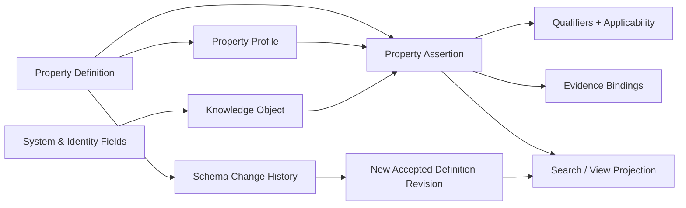
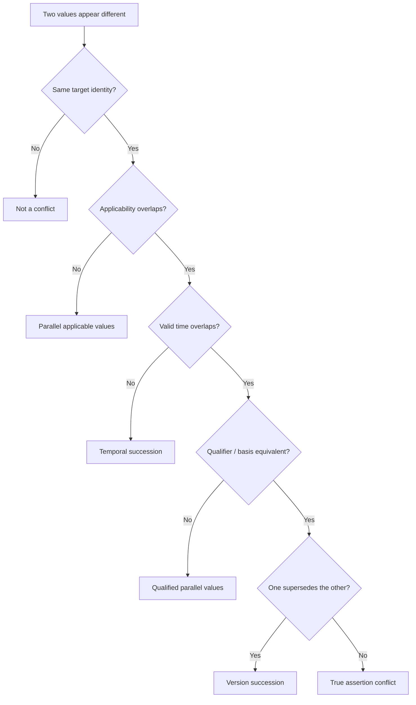

# AI-native 个人知识库

## 属性、Facet 与适用条件合同 v1.0 — Property Definition、Assertion、Applicability、Provenance 与动态视图

> 文档日期：2026-08-06  
> 文档性质：终局产品本体、行为、状态与验收合同；不是数据库建模器说明、字段控件清单、技术选型或原型授权  
> Canonical 产品定义：`AI-native-个人知识库-终局产品设计文档-v4.0.md`；本合同只证明 Property 与 Applicability 责任，不得反向改写 v4.0  
> 2026-08-07 写入冻结：直接正文使用 Buffer / Recovery / Direct Edit Commit；低风险用户直接填写可局部 commit；Explicit Draft / Proposal / Sync / Projection 与 Current Assertion 分开  
> 2026-08-10 Relation Lifecycle 覆写：Property reference 永不自动造边；用户补全完整语义后可直接提交 Relation，AI 发现只产生 RelationCandidate；Relation Applicability 的变化属于 RelationRevision，EvidenceBinding 的变化不属于语义修订。完整合同见`AI-native-个人知识库-关系陈述生命周期与网络可信性合同-v1.0.md`  
> 历史深层模型：`AI-native-个人知识库-产品定义-v3.0.md`  
> 相邻合同：`AI-native-个人知识库-Library浏览与动态视图合同-v1.0.md`、`AI-native-个人知识库-知识节点粒度与内容组成合同-v1.0.md`、`AI-native-个人知识库-知识群边界与跨群架构合同-v1.0.md`、`AI-native-个人知识库-搜索定位与知识找回合同-v1.0.md`、`AI-native-个人知识库-直接创作编辑与版本历史合同-v1.0.md`、`AI-native-个人知识库-产品对象层级与身份治理合同-v1.0.md`  
> 核心问题：怎样让知识拥有可搜索、可筛选、可比较、可由 AI 协助提取的结构，同时不把知识库退化为任意数据库，不把条件误当属性，不把属性引用伪装成正式关系，也不因字段演化而损坏长期知识

---

# 0. 执行决定

本轮冻结四十八项产品决定。

1. **属性系统服务知识理解与找回，不成为产品本体。** 默认阅读仍是从 Group Overview 深入到 Node、Detail 与 Evidence；属性只在能帮助识别、比较、过滤、解释或维护知识时出现。
2. **本产品不是 Notion / Airtable 式任意业务数据库。** 不提供通用公式、Rollup、自动化脚本、看板工作流、任意表间联接和关系型应用搭建；这些能力不能借“高级属性”进入核心产品。
3. **Property Definition 与 Property Assertion 永久分开。** Definition 说明一个属性是什么、可用于哪些对象、允许何种值；Assertion 说明某个对象在某个语境下具有何值。
4. **Property Definition 是有稳定 identity 的 Definition & Policy Supporting Record，不是新增 Primary Resource 或知识对象。** 它可以被引用、演化、归档和恢复，但不进入 Atlas、Overview、知识深度层级或正式 Relation 端点。
5. **Property Assertion 是目标对象内容状态的一部分，不是独立顶层知识。** 它随 Node / Group / Source / Placement 的 Buffer / Draft / Proposal、Current、History 与 Conflict 规则演化。
6. **系统字段、身份字段、知识属性和呈现设置分层。** `object_id`、当前 Current Revision、归档状态等系统事实不能被用户属性覆盖；标题、别名、类型等身份语义不能被普通字段同名替代；视图是否显示字段不改变字段值。
7. **Applicability 不是普通属性集合。** 当“对谁、在何处、在何条件、在哪段时间成立”会改变一句知识的真值时，它必须进入一等适用条件模型，而不是藏在 `region = France` 等散乱字段里。
8. **Relation 不是引用型属性。** Property 中的 Node reference 只表达一个原子特征值；只有具备语义陈述、方向、依据、Applicability 和正式端点的连接才是 Relation。
9. **属性值不能自动生成图谱边。** View、Search 和比较可以使用属性引用，但 Atlas、Group Map 与 Local Graph 只显示正式 Relation、Placement、结构和证据连接。
10. **同名不等于同义。** 系统绝不因两个 Group 都出现“状态”“阶段”或“类型”就自动合并 Property Definitions；合并需要语义、值域、目标类型和迁移影响一致。
11. **Property Definition 使用稳定 `property_id`。** 重命名、翻译、调整显示顺序或添加别名不改变 identity；Filter、View 和 Assertion 始终引用 ID，不引用可变名称。
12. **全局定义与群内使用配置分开。** Canonical Property Definition 在 Knowledge Space 中保持唯一 identity；Group / primary kind / Facet 只保存 Property Profile，决定建议、顺序、显著性与局部默认，不复制字段定义。
13. **用户可以先写知识，后加结构。** 创建 Group、Topic、Node、Relation 或 Overview 不要求填写任何自定义属性；属性缺失不能阻止 Direct Authoring、采用、离线编辑或基本查询。
14. **Primary Kind 只有一个，Facets 可以多个。** Primary Kind 决定默认 Overview 与结构建议；Facet 表达附加性质并可建议属性，但二者都不能成为封闭 schema 或容器归属。
15. **Facet 是可解释的结构角色，不是万能标签。** `Project`、`Person`、`Concept`、`Place` 等可带语义和字段建议；来源原有 tags、用户临时 markers 和任意关键词必须分开保存。
16. **产品不再使用无语义的统一 `tag`。** Source Tag、User Facet、System Marker、Alias 和普通正文关键词分别回答来源分类、对象性质、维护状态、称呼和文本命中，不能汇总成一个 tag 列表。
17. **Property Profile 只建议，不强迫。** 给 Node 添加某 Facet 后，系统可以显示推荐字段和已有覆盖，不自动填默认值、不制造空字段、不删除现有 Assertion，也不阻止用户保存。
18. **默认值是新建时的显式便利，不是继承真相。** 更新 Profile 默认值不回写既有对象；用户必须能看出一个值来自亲自填写、来源提取、AI 建议、导入、规则推导还是默认预填。
19. **值状态至少区分 `unset`、`known`、`unknown`、`no_value` 与 `not_applicable`。** 空白不等于未知，未知不等于明确不存在，不适用不等于假。
20. **值的显示顺序不表达语义优先级。** 多值 Assertion 如需“当前采用”“较优”“已废弃”，必须用 standing / valid time / Applicability 明确表达，不能靠列表第一项。
21. **多值允许共存，但必须可解释。** 不同来源、时间、对象范围或条件下的值可以同时成立；系统先比较 Applicability 与 provenance，再判断真正冲突。
22. **属性值可以带 qualifiers 与 Evidence Binding。** 对决策重要、可争议或外部事实型属性，用户可说明测量口径、单位、时间、范围与来源；轻量个人 marker 不强迫提供证据。
23. **Assertion 的语义归属必须明确。** 稳定身份特征归对象 identity；随正文版本变化的主张归 Current Content Revision；只在某次出现位置成立的值归 Placement；原文件元数据归 Source；查询筛选条件不写回对象。
24. **Source metadata 不静默变成 Node knowledge。** 导入文件的作者、标签、日期和 frontmatter 先保留为 Source Assertions；只有经过映射预览和确认，才成为目标 Node / Group 的 Current Assertion。
25. **Query Context 值不回写。** 用户在一次 Ask 中选择“法国、学生、2026 年”只限定本次检索；除非显式保存为 Node Applicability 或 Saved View，不改变知识对象。
26. **受支持的核心值类型保持有限。** Text、Number + Unit、Boolean、Enum、Date / DateTime / Interval + Precision、Node Reference、External Identifier / URL 与 Structured Applicability 足以覆盖终局知识场景；不开放任意嵌套对象。
27. **Boolean 不吞并认识论状态。** `false` 仅表示明确否定；未知、未填写、不适用和明确无值分别保存。Checkbox 不能成为五种状态的视觉替身。
28. **Date 同时保存 precision 与有效语义。** “2024”“2024-05”“约 2024 年”“2024-05-01 起有效”不被强制伪精确；记录日期、观察日期和有效期不能共用一个模糊 date 字段。
29. **Number 与单位不可拆成自由文本。** `10 km` 的数值、单位、精度、区间和测量时间可被比较；单位转换是可追溯 projection，不覆盖用户原始输入。
30. **Enum option 也有稳定 ID。** 改名不改变含义或历史；合并、拆分、删除 option 必须先显示受影响对象并产生可撤销 Migration Change Set。
31. **Derived Value 是 projection，不是 Current Assertion。** 系统可计算年龄、覆盖数量、最近更新时间等显示值，但必须标为 Derived、说明输入和时点；用户不能误以为它是独立保存的知识主张。
32. **本产品不提供通用公式与 Rollup。** 只允许少量产品定义的确定性 projections；若一个计算结果需要长期引用、证据或争议处理，应保存为普通 Node / Assertion，而不是藏在公式列。
33. **AI 只能提出属性 Patch 或 Proposal。** AI 提取必须显示目标对象、property、value、origin、support、Applicability、冲突和 Base Revision；确认前不进入 Current Search、View 或 Ask 默认集合。
34. **用户明确、低风险、可撤销的直接填写可以立即提交局部 Assertion Change Set。** 连续正文编辑遵守 Buffer / Recovery / Direct Edit Commit；批量填充、类型迁移、AI 提取和跨对象修改必须先 Preview。
35. **Search 和 View 默认只评估 Current Assertions。** 可选“包含草稿”时，Draft values 必须单独标示，不参与 Current 统计或被 Ask 当作事实。
36. **View Definition 保存规则，不保存成员快照。** Scope、criteria、filter、sort、grouping、layout 与 property visibility 引用稳定 ID；成员随 Current Knowledge 动态求值。
37. **Property visibility 只改变呈现。** 在一个 View 中隐藏、排序或固定字段不删除 Assertion、不改变 Search、不修改其他 View，也不改变 Overview 的知识内容。
38. **过滤器必须三值或多值感知。** `status != active` 不能把 `unknown / unset / not_applicable` 悄悄算作命中；用户可明确选择“已知不是”“未知”“未填写”或“不适用”。
39. **索引不完整时给出 Partial Coverage，不伪装为零结果。** 类型迁移中、离线索引未完成、Draft-only 或不支持的 qualifier 需要显示遗漏范围，并允许扩大或等待重建。
40. **Schema 变更属于知识维护，不是设置页小动作。** 重命名、类型变化、Definition merge / split、scope 变化、option 变化和归档必须有影响预览、Migration Plan、失败隔离与 History。
41. **类型变化不原地破坏值。** 可无损转换的值形成 proposed mapping；不可转换值保留 Legacy representation 并进入 Review，不被清空、截断或强制猜测。
42. **删除 Property Definition 默认是 Archive。** Definition 从新建选择器退出，但历史 Assertions、Views、Exports 和 Restore 仍可解释；永久清除需要证明无引用并遵守完整备份边界。
43. **Definition Merge 与 Assertion Merge 分开。** 合并两个字段 identity 不表示同一对象上的两个值自动去重；必须按 cardinality、Applicability、provenance 和 conflict 逐项决定。
44. **Schema Conflict 不采用 last-write-wins。** 两台设备改字段类型、选项或作用范围时保留两条版本线；未解决前旧 Accepted Definition 继续驱动读取，新的写入进入安全 Working / Proposal 状态。
45. **导出必须保留语义，而不只导出扁平 frontmatter。** 包含 Definitions、stable IDs、Assertions、value states、qualifiers、Applicability、provenance、Evidence bindings、Profile、Migration History 和 tombstones；同时提供人类可读降级。
46. **默认视觉保持低噪声。** 属性显示为正文旁按需展开的 Context Rail 或紧凑事实区；只有用户执行比较、筛选、维护或批量映射时，才进入高密度 property surface。
47. **质量以语义正确、找回完整和演化无损衡量。** 不优化字段数量、属性覆盖率、AI 填充率、模板使用率或每个 Node 的平均结构化程度。
48. **本合同不授权原型。** 在 Definitions、Assertions、Applicability、Facet、Relation 边界和 Migration 语义经用户确认前，不用一张漂亮的属性表掩盖产品本体的不确定性。

---

# 1. 当前规格中的十六个结构缺口

## 1.1 `primary_kind` 与 `facets[]` 只有字段名，没有语义合同

现有主文档说明一个 Group 有 Primary Kind 和多个 Facets，却没有定义它们是 identity、schema、filter、标签还是界面模板，也没有说明修改后是否改变对象真相、已有字段或下游 View。

## 1.2 Property Definition 与值混为一谈

当前文档提到 property filter、property visibility、property migration 和字段类型变化，却没有稳定 Definition identity。若 View 按字段名引用，重命名就会使查询失效；若类型直接挂在每个值上，同名字段又可能无法统一比较。

## 1.3 值究竟属于 Node、Revision 还是 Placement 不清楚

“重要程度”可能只在一个 Group Placement 中成立，“发布日期”可能属于 Source，“当前结论”可能随 Node Revision 更新。把它们全部挂在 Node identity 上，会让跨群复用和历史版本产生错值。

## 1.4 Applicability 被使用，但没有和普通属性划界

产品已经要求先比较 Applicability 再判断冲突，却仍可能让开发者把 location、subject、organization、condition、valid time 做成普通字段。这样 Search 可以筛选，却无法判断真值是否处于同一适用范围。

## 1.5 空值没有语义

现有规格没有区分未填写、未知、明确无值和不适用。对“是否需要担保人”“结束日期”“签证类型”等问题，这会直接导致错误过滤和 AI 回答。

## 1.6 Facet、Tag、Type、Marker 和 Alias 混用

产品会导入 source tags，也允许用户定义 Facet，并在维护中使用状态 marker。若 UI 都显示成 chip，用户无法知道哪个改变对象性质、哪个只来自文件、哪个只是临时工作标记。

## 1.7 引用型属性可能绕过正式 Relation 门槛

若用户填一个 `related projects` Node-list 字段，系统可能直接把它画成图谱边；这会绕过 Relation 的语义类型、方向、陈述、证据、Applicability 和 review state。

## 1.8 View 依赖属性，却没有 schema stability

Saved View 保存 filter、sort、grouping 和 property visibility，但字段改名、类型变化、option 删除、Definition merge 后如何演化没有规则。动态视图可能静默变空或改变成员。

## 1.9 AI 属性提取没有写入边界

“AI 自动填充”若直接写入字段，会把来源元数据、模型推断和 Accepted knowledge 混在一起；若只显示置信度，也无法表达 support、适用范围和真实冲突。

## 1.10 来源元数据和知识属性没有分开

PDF 作者、网页发布日期、导入文件夹标签和 Node 所讨论对象的作者、日期并非同一个事实。导入映射若直接扁平化，会产生看似结构化、实则指代错误的数据。

## 1.11 字段类型变化可能不可逆损坏数据

从自由文本变为 Enum、从 Text 变为 Date 或从多值变单值，都可能截断、丢弃或错误解释现有值。当前只提“迁移”，没有 Preview、Legacy retention、Review 或 rollback。

## 1.12 同名字段自动合并会污染语义

“阶段”在 Project、学科理解和人生目标里可能是三个概念。仅凭 label 或 embedding 合并 Definitions，会让 Group-local 语言错误扩散到整个 Space。

## 1.13 属性系统可能把产品推向数据库构建器

一旦加入公式、Rollup、联接、自动化、必填 schema、表格主视图和状态工作流，产品重心就会从理解知识变成维护记录。这与用户要的 Overview → detail → Evidence 和知识网络探索冲突。

## 1.14 Derived 与 Accepted truth 没有区分

“距今 3 年”“相关来源 12 个”“最近更新 2 天前”属于计算结果；如果和用户填写字段使用相同视觉，用户会误以为它们是长期保存、可引用或需要证据的知识。

## 1.15 属性冲突没有 Applicability 预判

同一 Node 出现两个价格、两个截止日期或两个状态，不一定冲突；它们可能属于不同地区、版本、对象或时间。只保留一个“当前值”会删除重要知识边界。

## 1.16 没有属性系统的反指标

若团队追求字段覆盖率、结构化率、AI 自动填充率或 View 数量，产品会鼓励过早建模、制造空字段和不必要 schema，而不是帮助用户形成更清楚的理解。

---

# 2. 产品目标与非目标

## 2.1 终局目标

1. 用户可以自然写知识，也可以在需要时增加可搜索、可比较的结构；
2. 系统能明确回答一个值“是什么、属于谁、何时成立、从哪里来、当前是否采用”；
3. Group、Facet 与 Primary Kind 提供一致体验，但不形成刚性数据库 schema；
4. Search、Saved View、AI Query 和维护流程引用稳定语义，不受名称或显示变化破坏；
5. 类型、枚举、Definition 和 Profile 的长期演化不丢值、不静默改变成员；
6. Applicability、Property 与 Relation 各自承担清楚且不可替代的角色；
7. 离线、导入、AI 不可用和历史恢复时，结构化知识仍完整、可解释、可编辑。

## 2.2 非目标

1. 不做任意业务数据库、低代码应用构建器或多表 CRM；
2. 不提供通用公式语言、Rollup、脚本自动化和流程引擎；
3. 不要求用户在写作前设计 schema、模板或完整分类体系；
4. 不让属性替代正文解释、正式 Relation、Evidence 或 Applicability；
5. 不把所有 frontmatter、标签、文件元数据自动升级为知识真相；
6. 不用“AI 置信度百分比”代替 provenance、support、适用条件和 review；
7. 不为了表格整齐而伪造日期精度、单位、布尔值或唯一当前值。

---

# 3. 七层结构化知识模型

## 3.1 Layer 1：System & Identity Fields

由产品维护、不可被普通 Property 覆盖的字段，包括：

- `object_id`、`object_type`；
- `object_lifecycle`、`identity_standing`；
- `current_revision_ref`；
- title、canonical name、aliases；
- Primary Kind、Facet assignments；
- created / modified / accepted timestamps；
- Group、Topic、Placement 与 Relation 的规范引用。

用户可以通过对应产品动作修改其中一部分，但不能创建同名自定义字段来改变系统行为。

## 3.2 Layer 2：Property Definition

稳定说明一个属性的语义、目标、值型、基数、校验、显示、索引与治理。Definition 被 Assertion、View、Search 和 Profile 按 ID 引用。

## 3.3 Layer 3：Property Profile

由 Primary Kind、Facet 或 Group 提供的使用配置。它决定：

- 哪些属性值得建议；
- 在 Context Rail 中的顺序与显著性；
- 新建时可选的预填；
- 哪些比较维度最有帮助；
- 覆盖不足时是否给出轻量提醒。

Profile 不复制 Definition、不创建值、不强制填写，也不改变既有 Assertion。

## 3.4 Layer 4：Property Assertion

某个目标在特定版本或语境下的属性陈述，包含值状态、值、origin、qualifiers、Applicability、Evidence 和 standing。

## 3.5 Layer 5：Applicability

决定一条 Node Claim、Relation 或 Assertion 对什么对象、组织、地点、条件和有效时间成立。它参与冲突判断、Ask Context resolution 和版本比较。

## 3.6 Layer 6：Projection & Index

用于展示、排序、过滤、聚合和少量确定性计算。它们可从 Accepted Definitions 与 Assertions 重建，不成为第二套知识真相。

## 3.7 Layer 7：Schema Change History

Definition、option、Profile、类型、scope 与 mapping 的版本、Preview、Migration Change Set、失败项、redirect 和 restore 历史。

## 3.8 模型关系



---

# 4. 概念边界矩阵

| 概念 | 回答的问题 | 是否用户可创建 | 是否进入正式图谱 | 是否随内容 Revision | 典型例子 |
|---|---|---:|---:|---:|---|
| System Field | 产品怎样识别与维护对象 | 否或通过专用动作 | 仅对应规范结构 | 按自身合同 | object_id、lifecycle |
| Identity Field | 这个对象是谁 | 通过专用动作 | 作为端点身份 | 独立于正文 | title、aliases、primary kind |
| Property Definition | 这个属性是什么意思 | 是 | 否 | 自身版本化 | “截止日期”的定义 |
| Property Assertion | 这个对象在何语境下有什么值 | 是 | 否 | 取决于归属 | 截止日期 = 2026-09-01 |
| Applicability | 这条知识何时、对谁成立 | 是 | 作为 Relation / Claim 语义 | 是 | 法国、学生、2026 年 |
| Primary Kind | 默认以什么结构理解该 Group | 是，单选 | 否 | Identity change | Practice、Project |
| Facet | 它还具有哪些结构角色 | 是，多选 | 否 | Identity metadata | Domain、Person |
| Source Tag | 原来源怎样分类它 | 导入 | 否 | 跟随 Source | `research`, `invoice` |
| System Marker | 当前需要怎样维护 | 系统/用户动作 | 否 | 独立状态 | review_due、index_partial |
| Alias | 这个对象还叫什么 | 是 | 否 | Identity metadata | 中文名、缩写 |
| Placement | 同一 Node 在哪里出现 | 是 | 结构连接 | 独立历史 | Node 位于某 Topic |
| Relation | 两个 Nodes / Groups 如何相连 | 是 | 是 | 自身 Revision | supports、contradicts |
| Evidence Connection | 哪段来源支持哪条陈述 | 是 | Evidence 层 | 自身 Revision | Source Anchor → Claim |
| View Definition | 此刻如何动态浏览 | 是 | 否 | 自身配置 | 法国相关、按时间排序 |
| Query Context | 本次 Ask 使用什么边界 | 是 | 只影响本次 route | Query snapshot | 当前 Group + 2026 |

## 4.1 三条不可跨越的边界

1. **Property → Relation**：引用型属性只有在用户选择“提升为正式关系”、补全陈述、类型、方向、Applicability 和依据并提交后，才产生 maintained Relation；AI 发现的可能连接只产生 RelationCandidate。
2. **Source → Knowledge**：来源元数据只有经过 Mapping Preview 和采用，才成为目标对象的 Accepted Assertion。
3. **Query → Object**：一次筛选、比较或问答条件只有显式保存后，才成为 Saved View 或对象 Applicability。

---

# 5. Property Definition 合同

## 5.1 Canonical 模型

```text
PropertyDefinition
  property_id
  accepted_definition_revision_ref
  working_definition_branch_refs[]
  canonical_name
  localized_names{}
  aliases[]
  semantic_purpose
  value_type
  cardinality: single | multiple
  allowed_target_types[]
  assertion_location_policy[]
  scope: knowledge_space
  validation_rules{}
  unit_policy?
  enum_definition_ref?
  search_policy
  display_policy
  provenance_policy
  evidence_policy
  lifecycle: active | archived | tombstoned
  supersedes_property_refs[]
  created_by
  created_at
```

## 5.2 Definition 的必需信息

新建属性只强制：

1. 名称；
2. 一句语义目的或一个明确示例；
3. 值类型；
4. 允许作用的对象类型；
5. 单值或多值。

其余规则按需展开。系统用自然语言先问“它描述什么”，而不是先展示数据库 schema 表单。

## 5.3 名称、别名与语义

- Canonical name 可重命名；View 和 Assertion 不受影响；
- localized name 只改变语言呈现；
- aliases 用于 Search 和导入匹配，不允许造成两个 active Definitions 同时自动接管同一输入；
- label 相同但 semantic purpose 不同必须保留独立 identity；
- 新建同名字段时先展示现有 Definitions、适用对象和例值，用户选择复用或明确新建。

## 5.4 Scope

Definition 在 Knowledge Space 中 canonical；不创建真正的 Group-local clone。若某 Group 需要不同含义，用户创建新 Definition，并以限定名称或语义说明消歧。Group Profile 只控制是否建议和怎样显示。

这样既避免全局字段污染，也防止每个 Group 复制出无法统一搜索的同义字段。

## 5.5 Definition History

Definition revision 至少记录：

- 名称与语义变化；
- value type / cardinality / target changes；
- option 与 unit policy 变化；
- validation、index 与 display changes；
- impact snapshot；
- migration mapping；
- failed / legacy Assertions；
- commit author、time、device 和 restore lineage。

---

# 6. Property Assertion 合同

## 6.1 Canonical 模型

```text
PropertyAssertion
  assertion_id
  property_ref
  target_ref
  assertion_location:
    identity | content_revision | placement | source
  target_revision_ref?
  placement_ref?
  value_state:
    unset | known | unknown | no_value | not_applicable
  value?
  qualifiers{}
  applicability_ref?
  origin:
    user | source_extracted | imported | ai_suggested | default_prefill | derived
  origin_ref?
  evidence_binding_refs[]
  standing:
    working | proposed | accepted | superseded | deprecated
  base_assertion_ref?
  supersedes_assertion_refs[]
  created_at
  observed_at?
  valid_from?
  valid_to?
```

## 6.2 Assertion Location 决策表

| 问题 | 应保存在哪里 | 例子 |
|---|---|---|
| 即使正文改写也仍描述同一对象吗 | identity | 人物出生日期、产品官网 |
| 它是当前内容版本中作出的结论吗 | content_revision | 当前比较结论、某段定义的状态 |
| 它只在某个 Group / Topic 出现方式中成立吗 | placement | 本群中的优先级、局部摘要角色 |
| 它描述原始文件或网页自身吗 | source | 文件作者、抓取时间、源标签 |
| 它只限定本次检索吗 | query context，不建 Assertion | “只看法国学生” |

系统在创建模糊字段时，用一问式 disambiguation 帮助选择；不向普通用户展示 `assertion_location` 枚举。

## 6.3 Value State

| 状态 | 意义 | Search 语义 | 默认文案 |
|---|---|---|---|
| `unset` | 尚未提供 Assertion | 不等于任何值 | 未填写 |
| `known` | 有明确值，包括 `false` 和 `0` | 按类型比较 | 具体值 |
| `unknown` | 确认这个属性适用，但当前不知道值 | 可明确筛选 | 未知 |
| `no_value` | 确认不存在该值 | 可明确筛选 | 无 |
| `not_applicable` | 属性不适用于此目标/语境 | 排除普通值比较 | 不适用 |

删除一个用户填写值默认回到 `unset`；选择“明确没有”才创建 `no_value`。

## 6.4 Standing 与 origin 正交

一个值可以是 `origin = imported` 且 `standing = accepted`，也可以是 `origin = user` 且仍处于 `working`。界面不能用“AI / 用户 / 导入”颜色替代 Accepted 状态，也不能把 Accepted 显示为正确性证明。

## 6.5 同一对象的多个值

单值字段出现多个 Accepted values 时，系统按顺序处理：

1. Applicability 是否不同；
2. valid time 是否不重叠；
3. qualifier 或 measurement basis 是否不同；
4. 是否一个已 superseded / deprecated；
5. 是否真正发生同范围冲突。

只有第五种进入冲突。系统不能为保持表格单元格整洁而删除前四种。

---

# 7. 值类型、基数与精度

## 7.1 支持的终局核心类型

| 类型 | 可表达 | 关键限制 |
|---|---|---|
| Text | 短原子文本 | 不承载长论证或 Markdown 文档 |
| Number + Unit | 数值、区间、精度、单位 | 原始值不被转换覆盖 |
| Boolean | 明确 true / false | 不替代 unknown / unset / N/A |
| Enum | 稳定有限值域 | option 使用 stable ID |
| Date / DateTime | 日期、时间与精度 | 保存 precision / timezone |
| Interval | 起止、开放边界、有效期 | 不要求伪造缺失终点 |
| Node Reference | 一个或多个对象引用 | 不自动成为 Relation |
| External ID / URL | 可验证外部标识 | URL 与标识语义分开 |
| Applicability | 结构化适用边界 | 只用于真值范围，不是通用对象 |

## 7.2 不作为通用属性类型

- Attachment：文件本身使用 Source / Evidence 对象；
- Relation / Rollup：使用正式 Relation 或 product projection；
- Rich text：需要论证时写进 Node Content；
- Formula：不开放任意表达式；
- User / collaborator：个人产品不把协作字段作为本体；
- Status workflow：维护状态使用正交系统状态，不做任意流程列；
- Nested object：改建 Node 或多条 Assertions，而非 JSON bag。

## 7.3 Cardinality

- `single` 表示同一 Applicability + valid time 下预期一个 Accepted value；
- `multiple` 表示同一语境可以有多个并列值；
- single 不意味着历史只能保存一个；
- multiple 不代表 UI 默认展示全部；
- 从 multiple 改为 single 必须逐对象选择 primary / split applicability / keep conflict / legacy。

## 7.4 Number + Unit

```text
NumberValue
  raw_value
  normalized_value?
  original_unit
  canonical_unit?
  precision?
  lower_bound?
  upper_bound?
  approximate: true | false
  measured_at?
```

“约 10 公里”和“10.00 公里”不能被等同；货币必须保留币种与适用日期，转换只作为显示 projection。

## 7.5 Date / Time

```text
TemporalValue
  raw_text
  normalized_value?
  precision: year | month | day | minute | second
  timezone?
  approximate: true | false
  semantic_role:
    observed_at | published_at | effective_from | effective_until | event_time
```

若用户只知道年份，系统保存 year precision，不默认补成 1 月 1 日。

## 7.6 Enum

```text
EnumDefinition
  enum_id
  options[]:
    option_id
    canonical_label
    localized_labels{}
    aliases[]
    lifecycle
    redirects_to?
```

option 顺序只影响显示。若顺序本身有语义，Definition 必须显式声明 ordinal semantics。

---

# 8. Applicability 与 Qualifier

## 8.1 Applicability 模型

```text
Applicability
  subject_refs[]
  subject_classes[]
  organization_refs[]
  locations[]
  conditions[]
  valid_time:
    from?
    to?
    precision?
  exclusions[]
  source_scope?
  notes?
```

它可以被 Node Claim、Relation 和 Property Assertion 引用，也可以作为 Query Context 的临时结构，但不能成为任意 metadata bag。

## 8.2 何时必须使用 Applicability

当一个维度改变“这句话是否成立”时使用 Applicability：

- 学生与非学生需要不同材料；
- 法国与德国规则不同；
- 2025 年前后价格不同；
- 仅对某组织、合同版本或设备型号成立；
- 某前提满足时结论才成立。

当一个维度只帮助描述或找回对象时使用 Property：作者、颜色、页面数、语言、个人评分。

## 8.3 Qualifier 与 Applicability 的区别

- Applicability：决定真值范围；
- Qualifier：解释值如何测得、采用什么口径、单位或限定；
- Evidence：说明凭什么相信；
- Provenance：说明值如何进入系统；
- Relation：说明两个独立知识对象如何相连。

例如“价格 = €800 / 月（不含水电）”：租客类型和城市属于 Applicability；“不含水电”属于 qualifier；合同第 3 页属于 Evidence；用户摘录属于 provenance。

## 8.4 比较顺序



## 8.5 自然语言呈现

默认显示“适用于法国学生，2026 年 8 月后”“只在离线模式关闭时成立”，而不是一排内部 key-value。结构化编辑器按需展开；屏幕阅读器读取同等语义。

---

# 9. Primary Kind、Facet 与 Property Profile

## 9.1 Primary Kind

Primary Kind 回答：“这个 Group 默认以哪种理解骨架呈现？”例如：

- Domain：概念、主题、理论、关键关系；
- Project：目标、决定、约束、产物、演化；
- Practice：方法、原则、操作、案例、复盘；
- Person：身份、经历、观点、关系、来源；
- Entity：基本信息、时间线、关系、主张、来源；
- Question：问题空间、假设、证据、争议、答案演化。

它决定默认 Overview 组成与建议，不限制实际内容。

## 9.2 Facet

Facet 说明附加结构角色。例如一个“AI Agent 产品设计”Group 可以：

- Primary Kind = Practice；
- Facets = Domain + Project。

Facet Definition 至少包含：名称、语义、适用对象、推荐 Properties、推荐比较维度和 Overview hints。Facet 本身不携带业务 workflow。

## 9.3 Profile Composition

当多个 Profiles 同时适用：

1. 用户固定的 Group Profile 优先于 Facet 建议；
2. Primary Kind 决定默认顺序；
3. Facets 合并推荐字段，不复制相同 `property_id`；
4. 同名不同 Definition 不自动合并；
5. 冲突的显示建议由用户选择，但不改变底层 Assertion；
6. 移除 Facet 只移除建议，不删除字段和值。

## 9.4 Coverage

Profile 可以显示“这个类型通常会记录发布日期，但当前未填写”，但只有在用户主动打开结构化信息或准备比较时才出现。系统不得：

- 在 Home 制造完成度环；
- 把缺失字段变成红色错误；
- 因覆盖低而降低知识质量评分；
- 自动生成空 Assertions；
- 用提醒驱动用户机械补表。

---

# 10. Direct Authoring 与编辑体验

## 10.1 默认阅读态

属性不占据正文第一屏。Node 默认仍显示：Orientation、核心内容、Conditions & Limits、Connections 与 Evidence。只有少量高价值 identity facts 可以在标题下紧凑显示。

## 10.2 Context Rail

用户选择“查看结构化信息”后，Context Rail 按以下顺序显示：

1. Identity facts；
2. 当前内容 Revision 的 Accepted Assertions；
3. Applicability 摘要；
4. 当前 Placement 的局部值；
5. Source metadata；
6. Derived projections；
7. Working / Proposed changes。

每层具有明确标题，不把来源字段和知识字段混成同一表。

## 10.3 新增属性值

主路径：

```text
Add structured fact
  → choose existing property or create one
  → enter value
  → if ambiguous, choose “about the knowledge / this occurrence / source”
  → optionally add applicability, basis, evidence
  → preview only when high-impact or multi-object
  → accept / keep working
```

普通已知属性不需要打开 Definition 编辑器。

## 10.4 新建 Definition

输入一个不存在的字段名时：

- 先展示相似 Definitions 的语义与例值；
- 用户可复用现有字段；
- 若新建，只问语义、类型、目标和 cardinality；
- Group / Facet usage 作为后续可选步骤；
- 高级验证、索引和显示策略默认折叠。

## 10.5 值状态控制

清空输入只表示删除当前 Working value。`未知`、`无`、`不适用` 是明确动作，并随时可改回具体值。Boolean Editor 同样提供这五种状态，不使用 indeterminate checkbox 猜测语义。

## 10.6 批量编辑

批量替换、导入映射、option merge 和 type migration 形成 Change Set：

- 列出目标范围和实际命中；
- 按 clean / ambiguous / conflict / unsupported 分组；
- 用户可只提交 clean subset；
- 失败对象保持原值；
- Undo / History 能解释每项变化；
- Search / View 在 index rebuild 期间显示 partial coverage。

---

# 11. AI、Source 与导入

## 11.1 AI Property Patch

```text
PropertyPatch
  patch_id
  target_ref
  base_revision_ref
  operations[]:
    set | add | remove | supersede | change_applicability
  property_ref
  proposed_value_state
  proposed_value
  qualifiers{}
  applicability_ref?
  origin_support_refs[]
  collision_summary
  downstream_impact
  status:
    proposed | partially_accepted | accepted | rejected | stale
```

AI 不能自行创建全局 Definition 并批量应用。若未找到合适 Definition，它提出“创建字段”建议，并展示将形成的语义与范围。

## 11.2 AI 提取的依据

提取必须能定位到：

- Source + Anchor；
- 已接受 Node + Anchor；
- 用户明确输入；
- 受限的确定性推导。

模型推测而没有直接依据时，origin 明确为 `ai_suggested`，不得伪装成 source-extracted。

## 11.3 Source Mapping

导入流程把每个输入字段先分类：

1. Source intrinsic metadata；
2. 可映射到现有 Property Definition；
3. Source Tag；
4. Alias candidate；
5. Facet candidate；
6. Relation candidate；
7. Unmapped raw metadata。

用户可以接受、改映射、保留 raw 或忽略。共享 label 不足以自动建立 mapping。

## 11.4 Frontmatter

Markdown / YAML 导入保留原 key、raw value、source path 和 parsing result。若 `author` 映射到知识对象作者，预览必须说明目标是 Source 还是 Node；若类型不匹配，原值留在 raw metadata，不清空。

## 11.5 默认规则

用户可建立有限映射规则，例如“这个导入文件夹的 `published` 总是映射到 Source published_at”。规则需要：

- 清楚 scope；
- 示例命中；
- 失败行为；
- 是否只提议或自动接受；
- 可撤销历史。

规则不能自动建立 Relation、改变 identity 或覆盖冲突值。

---

# 12. Search、Saved View、Overview 与 Explore

## 12.1 Search

Search 支持：

- property exists / missing / unknown / no value / not applicable；
- typed equality、range、contains 和 reference match；
- Applicability overlap；
- origin、standing、valid time 与 Evidence presence；
- Accepted-only 或显式包含 Working / Proposal；
- Definition aliases 和 localized names。

Search Result 说明“匹配了哪个值、属于哪层、适用于何处”，不只显示字段 chip。

## 12.2 Saved View

```text
ViewDefinition
  view_id
  scope_ref
  criteria_tree
  sort_rules[]
  grouping_rules[]
  layout
  property_visibility[]
  accepted_only: true | false
  applicability_policy
  missing_value_policy
  definition_revision_refs[]
  index_requirements[]
```

Definition revision 改变后，View 进入 `compatible`、`needs_review` 或 `temporarily_partial`；不静默改写 criteria。

## 12.3 Filter Semantics

“截止日期早于 9 月”只比较 `known` date values。`unknown`、`unset`、`no_value`、`not_applicable` 分别计入 coverage summary，除非用户显式纳入。

“状态不是 active”默认只返回已知且不等于 active；不会把未知和未填写混进来。

## 12.4 Overview

Overview 可以投影少量属性形成 Orientation 或比较入口，例如时间范围、涉及地区、关键人物；但：

- Projection 不复制 Assertion；
- Property table 不成为 Overview 默认主体；
- 统计不替代知识综合；
- 一条需要论证的属性结果应提升为 Node Claim；
- 用户编辑 Projection rule，不直接改投影结果。

## 12.5 Explore

属性用于筛选和着色解释，但不生成正式边。用户在 Local Graph 选择“只看适用于法国的知识”时，图谱减少的是显示集合；Relation 真相不变。Node reference 属性可提供“查看引用对象”导航，但线条只在提升为正式 Relation 后出现。

---

# 13. Schema Evolution 与迁移

## 13.1 变更风险分级

| 变更 | 默认行为 | 是否需要 Impact Preview |
|---|---|---:|
| 重命名 / 翻译 | 新 Definition Revision | 低风险，可轻量确认 |
| 显示顺序 / visibility default | 更新 Profile | 否，可 Undo |
| 新增 alias | 更新 Definition | 低风险 |
| 添加 enum option | 新 Definition Revision | 低风险 |
| option rename | 保持 option ID | 轻量确认 |
| option merge / split / delete | Migration Change Set | 是 |
| type change | Migration Plan | 是 |
| cardinality change | Migration Plan | 是 |
| target scope change | Migration Plan | 是 |
| Definition merge / split | Identity Operation | 是 |
| Archive | 保留 Assertions | 是，显示引用 |
| Purge | 备份与零引用证明 | 强确认 |

## 13.2 Migration Plan

```text
PropertyMigrationPlan
  plan_id
  source_definition_revision_ref
  target_definition_revision_ref
  target_scope_snapshot
  conversion_rules[]
  clean_assertion_refs[]
  ambiguous_assertion_refs[]
  unsupported_assertion_refs[]
  conflicting_assertion_refs[]
  affected_view_refs[]
  affected_query_refs[]
  affected_profile_refs[]
  index_rebuild_plan
  rollback_plan
  status
```

## 13.3 类型变化

从 Text → Date：

- 能确定解析且精度清楚的值进入 proposed conversion；
- `Spring 2024` 可保留 raw + approximate interval，不伪造成某天；
- 无法解析的值保持 Legacy Text；
- 迁移后 Definition 可接受 Date，但 legacy 值仍可读、可搜、待 Review；
- 回滚恢复原 Definition pointer 和索引，不删除迁移历史。

## 13.4 Definition Merge

必须分别回答：

1. 两个 Definition 是否真的同义；
2. canonical identity 选谁；
3. names / aliases 怎样合并；
4. target、type、cardinality、unit、option 怎样兼容；
5. 同一对象现有 values 怎样处理；
6. Views、Profiles、imports 和 Search references 如何 redirect；
7. legacy / conflict 怎样保留；
8. Undo 和 export 怎样解释。

## 13.5 Archive 与恢复

Archive 后：

- 不再出现在普通 Add Property 列表；
- 已有值仍可读，并标示定义已归档；
- View 可继续运行或提示迁移；
- Search 仍可按 archived definition 查找；
- 用户可恢复 Definition，identity 不变；
- 新增值默认受限，除非先恢复。

---

# 14. Conflict、History、Offline 与恢复

## 14.1 冲突类型

至少区分：

1. Assertion value conflict；
2. Applicability overlap conflict；
3. type conversion conflict；
4. cardinality conflict；
5. enum option identity conflict；
6. Definition semantic conflict；
7. Profile presentation conflict；
8. archive / edit conflict；
9. source mapping conflict；
10. migration / new assertion conflict。

## 14.2 读取与写入规则

- 未解决 Definition conflict 时，最后一个共同 Accepted Definition 继续驱动读取；
- 新的安全值写入 Working / Proposal，不能按竞争 schema 强制序列化；
- 与旧 schema 完全兼容的输入可继续本地保存；
- Search 显示 schema conflict coverage；
- 用户解决后先得到 Working Definition + Migration Preview，再接受。

## 14.3 Offline

离线可完成：

- 创建、编辑和接受本地 Definitions / Assertions；
- 修改 Profile；
- 本地 Search、Filter 与 Saved View；
- 查看 Definition / Assertion History；
- 运行不依赖远端的确定性 projection；
- 导入本地文件并保存 raw mapping。

需要网络的 AI extraction、remote Source fetch 和云同步明确暂停。重连时按 Revision / Change Set 合并，不阻断继续写作。

## 14.4 Restore Forward

恢复旧 Definition 或 Assertion 默认创建新的 Recovery Draft / Change Set。用户确认后形成新的 Current Revision；中间的 schema、值、View 和 migration 历史继续可见，不把时间线倒回。

---

# 15. Export、Interoperability 与本地所有权

## 15.1 Canonical Export

导出包至少包含：

```text
schema/
  property-definitions.jsonl
  facets.jsonl
  property-profiles.jsonl
  enum-definitions.jsonl
assertions/
  property-assertions.jsonl
  applicability.jsonl
  evidence-bindings.jsonl
history/
  definition-revisions.jsonl
  migration-change-sets.jsonl
  redirects-and-tombstones.jsonl
views/
  view-definitions.jsonl
manifest.json
```

stable IDs 和 references 必须可验证；raw imported metadata 也应保留。

## 15.2 Human-readable Export

Markdown frontmatter 作为兼容层，而非完整真相：

- 简单 accepted known values 可扁平输出；
- unknown / no value / N/A 使用明确保留标记；
- qualifiers、Applicability 和 provenance 进入 companion JSON 或可读注释；
- Node references 使用 stable link + readable title；
- 冲突和 legacy values 不静默丢弃；
- 导出报告列出无法无损表示的语义。

## 15.3 Round-trip

从 canonical export 恢复后，应保持：

- Definition / option / Assertion identity；
- Accepted / Working / Proposal standing；
- value states；
- Applicability、qualifiers 和 Evidence；
- Profiles 与 Views；
- migrations、redirects、archives 和 conflicts；
- Search / View 可重建性。

---

# 16. 渐进披露与语言

## 16.1 P0 日常语言

| 内部概念 | 默认中文 | 避免 |
|---|---|---|
| Property Definition | 属性说明 / 这个属性 | schema、字段定义 |
| Property Assertion | 属性值 / 结构化事实 | assertion |
| Applicability | 适用条件 | applicability |
| Facet | 附加类型 | facet、标签 |
| Primary Kind | 主要类型 | primary kind |
| `unset` | 未填写 | null |
| `unknown` | 未知 | 空 |
| `no_value` | 无 | false |
| `not_applicable` | 不适用 | 无 |
| Derived | 系统计算 | 公式字段 |
| Migration | 调整属性类型 / 合并属性 | schema migration |

## 16.2 三层披露

- **P0**：属性名、值、自然语言适用条件、来源摘要；
- **P1**：值状态、作用位置、Evidence、origin、历史和影响；
- **P2**：Definition revision、property ID、migration mapping、legacy、index coverage 和 export details。

## 16.3 状态不能只靠颜色

Working、AI suggested、Source extracted、Accepted、Conflict、Legacy、Unknown、No value、N/A、Derived 和 Index partial 均有文字、图标语义和辅助技术名称；颜色只作辅助。

---

# 17. 权限、可访问性与规模

## 17.1 可访问性

1. Property Rail 具有可预测 heading 和 reading order；
2. 每个值包含属性名、值、状态、适用条件和 origin 的 accessible name；
3. Enum、Value State 和 scope 选择可完全键盘操作；
4. Diff / Migration 表格支持行列标题和逐项接受；
5. 200% zoom 下正文仍为主表面，Rail 可移到下方；
6. 不用 hover 作为唯一编辑入口；
7. screen reader 能区分“未填写”和“未知”；
8. 中文 IME composition 不触发新建 option 或自动提交。

## 17.2 规模边界

产品必须在以下夹具上验证：

- 100,000 Nodes；
- 2,000,000 Accepted Assertions；
- 2,000 Definitions，其中 150 active 常用；
- 一个 Definition 被 60,000 Assertions、120 Views 和 25 Profiles 引用；
- 一次迁移含 20,000 clean、1,000 ambiguous、100 conflict values；
- 一个 Node 有 40 Assertions，但默认只显示 5 个高价值 facts；
- 一个 Group 同时具有 1 Primary Kind、4 Facets 和 3 local profile overrides；
- 本地离线索引落后 50,000 changes。

## 17.3 性能承诺

- Context Rail 先显示可用值，再增量加载 Evidence / History；
- Filter 在完整索引时明确给出完整结果，在不完整时给 Coverage；
- Migration Preview 可分页和分组，但总数与影响范围可核验；
- Definition rename 不要求重写所有 Assertion payload；
- View evaluation 不保存 member IDs；
- Derived projections 可重建，不阻断 canonical export。

---

# 18. 十六个代表性产品场景

## 18.1 空 Group 直接写知识

用户新建“法国租房”，直接写下第一条知识。系统不要求选择 Type、Facet 或填写属性。写完后可采用；之后在 Context Rail 添加“适用地区 = 法国”。

## 18.2 同名“状态”字段

“签证申请状态”和“知识维护状态”都简称状态。系统展示现有语义与目标对象，不自动合并；后者作为系统 marker，前者可成为知识 Property。

## 18.3 学生与非学生材料不同

两条“是否需要担保人”值不同。系统先显示不同 subject applicability，保留并列分支，不制造 conflict，也不要求选择一个全局当前值。

## 18.4 未知不是不需要

用户知道“入住日期”适用但尚不确定，选择未知。Search “未填写入住日期”不返回它；Ask 说明知识库明确记录为未知，而不是判断无需入住日期。

## 18.5 Source frontmatter 导入

Markdown 有 `author: Marie`。Mapping Preview 让用户选择“来源作者”或“知识所述对象的作者”；默认保留为 Source metadata，不直接写 Node。

## 18.6 Text → Date

字段中有 `2024-05-01`、`May 2024`、`Spring 2024` 和 `TBD`。Preview 分为 exact、month precision、approximate interval 和 unsupported；任何值都不被清空。

## 18.7 Enum option 改名

`In progress` 改为 `进行中` 只更新 localized label，option ID 不变；Views 和历史结果继续工作。

## 18.8 多值改单值

一个项目有三个“负责人”引用。系统不能任取第一个；用户选择保留多值、指定 primary、按时间拆分 Applicability 或保留冲突。

## 18.9 Node reference 不是关系

属性“作者 = 某人物 Node”提供跳转和过滤，但 Local Graph 不画线。用户可选择“建立作者关系”，补全 statement、类型、方向、Applicability 与依据后直接提交 maintained Relation；若由系统发现，则先生成 RelationCandidate。

## 18.10 AI 从合同提取租金

AI 提出 `租金 = €800/月`，附 Source Anchor 和“不含水电” qualifier。用户接受前，Accepted View 与 Ask 不使用；若已有 €850 的同范围值，Preview 显示冲突。

## 18.11 Group 移除 Facet

移除 Project Facet 后，项目相关字段不再优先建议，但所有既有 Assertions、Views 和 Search 仍保留；Overview 不再自动使用项目骨架，用户可保留 local override。

## 18.12 View 遇到 Definition 变化

一个 View 按文本 `deadline contains 2026` 过滤；Definition 改为 Date 后，系统显示 criteria 需要 review，并提出等价 date range，不静默改变成员。

## 18.13 离线新增属性

用户离线创建“决策日期”并给 20 个 Nodes 填值。另一设备同时创建同名不同义字段；重连后两条 Definition 都保留，系统展示语义冲突，不按名称覆盖。

## 18.14 Archive 属性

用户归档“旧分类”。它从新增列表退出，但历史 Nodes 仍显示值，旧 Saved View 可打开并提示 definition archived，用户可以迁移或恢复。

## 18.15 Overview 投影属性

Group Overview 显示“覆盖地区：法国、德国、西班牙”。这是从 Accepted Assertions 计算的 Projection；用户不能直接删掉“德国”来篡改真相，而是进入对应 Assertion 或调整 Projection rule。

## 18.16 Canonical Export Round-trip

导出含 unknown、N/A、多个 Applicability、AI Proposal、legacy Text、archived Definition 和 View。恢复后所有状态与动态成员可重建；Markdown 降级报告明确列出无法扁平表达的部分。

---

# 19. 失败状态与恢复动作

| 失败状态 | 用户看到什么 | 不允许发生 | 恢复动作 |
|---|---|---|---|
| Definition name collision | 两个语义与例值 | 自动合并 | 复用、改名或明确新建 |
| Invalid typed input | 原输入 + 具体原因 | 清空或截断 | 修改、保留 raw、取消 |
| Index partial | 已覆盖 / 未覆盖范围 | 显示“0 结果” | 重建、等待、扩大检索 |
| AI patch stale | Base 与当前 diff | 强制应用 | rebase、部分接受、拒绝 |
| Migration ambiguous | 分组与例值 | 自动猜测 | mapping、legacy、逐项 review |
| Migration interrupted | 已提交 / 未提交集合 | 半数静默丢失 | resume 或 rollback |
| Definition conflict | 两条版本线 | LWW | merge Working Definition |
| Assertion conflict | Applicability 对照 | 任取一个 | narrow、supersede、保留 conflict |
| Archived definition referenced | 归档说明与引用数 | 结果消失 | restore 或 migration |
| Missing unit | raw number + warning | 假设单位 | 添加单位或保留 unqualified |
| Unsupported export | loss report | 静默扁平化 | canonical companion export |
| Local write failure | 持续未保存状态 | 显示已保存 | copy、recovery package、retry |

---

# 20. 质量指标与反指标

## 20.1 核心指标

### Semantic Reuse Accuracy

用户新建或复用 Definition 时，能正确判断同名是否同义；View 与 Import 不因 label 误合并。

### Value State Comprehension

用户能区分未填写、未知、无、不适用和 false，并正确预测 Search / Ask 行为。

### Applicability Conflict Precision

真正同范围矛盾进入 conflict；不同对象、地点、条件和有效时间的值保留为并列适用分支。

### Schema Evolution Preservation

类型、option、cardinality、merge、archive 和 restore 后，所有原值、Views、Profiles、历史和 legacy representations 可找回。

### Dynamic View Fidelity

View 成员与当前 Accepted Assertions 一致；Definition 变化时显示兼容性和 Coverage，不静默漂移。

### Origin & Evidence Traceability

用户能判断值来自自己、Source、导入、AI、默认或推导，并可进入相应依据。

### Low-noise Knowledge Reading

没有使用属性的任务中，用户仍以 Overview → detail → Evidence 阅读，不被字段表和覆盖提醒占据主界面。

## 20.2 反指标

不得作为优化目标：

- 每个 Node 的平均属性数；
- 自定义 Definition 总数；
- 属性覆盖率或“完整度”；
- AI 自动填充接受率；
- 模板 / Facet 使用率；
- Saved View 数量；
- 结构化内容占正文比例；
- 迁移中被自动转换的百分比；
- 表格第一屏可见字段数；
- 用户因提醒而补字段的次数。

---

# 21. Given / When / Then 验收

## 21.1 Direct Authoring 无 schema 门槛

**Given** 一个空 Group、无 AI、无 Source、无 Facet  
**When** 用户写下并采用第一条知识  
**Then** 系统不要求属性或模板；Node 成为 Accepted knowledge，后续可按需增加结构。

## 21.2 Definition identity 抵抗重命名

**Given** 三个 Views 和一千条 Assertions 引用同一 property ID  
**When** 用户重命名并添加中文翻译  
**Then** 所有引用继续工作，历史显示名称变化，值与动态成员不被重写。

## 21.3 同名不同义

**Given** Space 已有“状态 = 知识维护状态”  
**When** 用户在签证 Group 新建申请状态  
**Then** 系统展示差异并允许创建独立 Definition，不自动复用或合并。

## 21.4 五种值状态

**Given** 五个 Nodes 分别为 unset、known false、unknown、no value、N/A  
**When** 用户按每种状态过滤并向 AI 询问  
**Then** 五者结果和解释互不混淆，空白不被当成 false。

## 21.5 Applicability 先于 Conflict

**Given** 同一属性有法国学生 €800 和法国非学生 €900  
**When** 系统维护任务比较它们  
**Then** 显示两个适用分支而非冲突；只有 subject overlap 后才要求解决。

## 21.6 Node Reference 不生成关系

**Given** 一个 Accepted Node-reference Assertion  
**When** 用户打开 Atlas 和 Local Graph  
**Then** 可从属性导航到引用对象，但图中没有正式边；用户补全并提交后才产生 maintained Relation，系统自动发现则只产生 RelationCandidate。

## 21.7 Source Mapping 边界

**Given** 导入文件包含 author、tags 和 date  
**When** 用户未确认映射  
**Then** 值只存在 Source/raw metadata，Node properties、Facets、Relations 与 Ask Accepted corpus 不被修改。

## 21.8 AI Proposal

**Given** AI 从 Source 提取一个带 Anchor 的日期  
**When** 用户尚未接受  
**Then** Proposal 可搜索为提议但不进入 Accepted View、Overview projection 或 Ask 默认答案。

## 21.9 Text → Date 无损迁移

**Given** exact、month-only、approximate 和 unparseable 四类文本  
**When** 用户执行 Date Migration  
**Then** clean values 精确保留 precision，approximate 保留范围，unsupported 留作 Legacy；没有原值消失。

## 21.10 Enum option rename

**Given** 多个 Views 按一个 option ID 过滤  
**When** 用户只修改 option label  
**Then** View 成员不变、历史可解释、Search 同时识别旧 label alias 和新 label。

## 21.11 Definition Merge

**Given** 两个 Definitions 在部分对象上同时有值  
**When** 用户发起 merge  
**Then** Preview 分别处理 schema compatibility、Assertion conflicts、Views、Profiles 和 Imports；取消后零改变。

## 21.12 Archive 不丢历史

**Given** 一个 Definition 被 Assertions 和 Saved Views 引用  
**When** 用户归档  
**Then** 新增入口隐藏，但历史值和 Views 可解释、可搜索、可恢复，导出保留 identity。

## 21.13 Dynamic View 与 Partial Index

**Given** 本地索引只覆盖 80% Accepted Assertions  
**When** 用户打开属性筛选 View  
**Then** 产品显示已覆盖范围和遗漏原因，不把当前成员数表达为完整真相。

## 21.14 Offline Definition Conflict

**Given** 两台设备离线修改同一 Definition 的 type  
**When** 重连  
**Then** 两条版本线均可找回，旧 Accepted Definition 继续读取，新值安全暂存，不发生不可见 LWW。

## 21.15 Accessible Property Editing

**Given** 键盘、screen reader、200% zoom 和中文 IME  
**When** 用户新增值、选择 unknown、编辑 Applicability 并审查 Migration  
**Then** 全流程可完成、状态被读出、focus 返回正确对象、composition 不误提交。

## 21.16 Export Round-trip

**Given** 一个库包含 qualifiers、Applicability、legacy、conflict、archive 和 AI Proposal  
**When** 用户 canonical export 后恢复  
**Then** identity、状态、引用、Views 与 Search 可重建；human-readable export 明确报告降级而不静默丢失。

---

# 22. 官方研究依据与产品推论

## 22.1 Structured properties 有价值，但必须保持原子

Obsidian 官方 Properties 文档把属性定义为便于人和机器读取的短小结构化信息，支持 text、list、number、checkbox、date、datetime 和 tags；同名属性在整个 vault 使用同一类型，并明确不支持 nested properties、Markdown 和通用 bulk editing。产品推论：本产品需要稳定 Definition 与有限原子类型，但长论证应留在 Node，不能把属性扩展成嵌套数据库对象。[Obsidian Properties](https://obsidian.md/help/properties)

## 22.2 View 是配置，不是成员副本

Notion 官方 Views 文档把 filter、sort、group 和 property visibility 作为每个 View 的独立设置；Obsidian Bases Views 同样用 property、operator、value 组成 filter，并让 operator 依赖类型。产品推论：本产品的 View Definition 应保存稳定 property references 与 typed criteria，property visibility 只影响呈现，成员始终动态求值。[Notion Views, filters, sorts & groups](https://www.notion.com/help/views-filters-and-sorts)、[Obsidian Views](https://obsidian.md/help/bases/views)

## 22.3 属性能力很容易滑向应用构建器

Notion 官方 Database Properties 覆盖 relation、rollup、formula、status、AI autofill 等大量数据库能力；Airtable 官方 Field Type 文档也将字段置于 record、formula、linked record 和 automation 式数据建模中。产品推论：这些产品证明结构化数据的力量，也证明必须冻结非目标；本产品只保留知识识别、比较、找回和维护所需的最小强语义集合。[Notion Database Properties](https://www.notion.com/help/database-properties)、[Airtable Field Type Overview](https://support.airtable.com/v1/docs/field-type-overview)

## 22.4 类型变更是数据迁移，不是样式设置

Airtable 官方文档说明改变已有字段类型会尝试转换当前值，也明确某些转换不可能并可能清除不兼容内容；默认值变化不会回写既有记录。产品推论：本产品必须以无损 Preview、Legacy retention、失败隔离和 rollback 处理类型变化，并把 default 限定为新建便利。[Airtable Field Type Overview](https://support.airtable.com/v1/docs/field-type-overview)

## 22.5 类型与字段可以提供一致结构，但不应隐藏继承

Tana 官方 Types 文档让类型携带字段，并说明更换类型会更新可用字段而共享字段值可保留。产品推论：Primary Kind / Facet 可以组合推荐 Property Profile，但移除类型只能移除建议，不删除已有值，也不能让用户误以为自动出现的字段是当前真相。[Tana Types](https://tana.inc/learn/features/types)

## 22.6 一个事实不只是 key-value

Wikidata 官方 Statements 文档把 statement 描述为 property-value，并允许 qualifiers、references、multiple values、rank，以及明确的 unknown value 与 no value。产品推论：个人知识库中的决策型属性也需要值状态、qualifier、provenance、Evidence 与 Applicability；表格里“一个单元格一个当前值”不足以表达长期知识。[Wikidata Statements](https://www.wikidata.org/wiki/Help:Statements/en-gb)、[Wikidata Data model](https://www.wikidata.org/wiki/Wikidata:Data_model)

## 22.7 研究没有证明的内容

上述资料证明稳定字段类型、动态视图、类型模板、迁移风险和富 statement model 已被不同产品采用，不证明本合同的 Facet 组合、Definition scope、五种 value states、Property / Applicability / Relation 边界或低噪声 Context Rail 已经过真实用户验证。这些仍是本产品的终局决定与后续可用性验证对象。

---

# 23. 对后续设计的约束

1. 当前不开始原型；先由用户确认本合同的产品边界。
2. 属性不能成为 Home、Group Overview 或 Node 第一屏的主视觉。
3. 未来设计必须用同一条知识证明 Property、Applicability 和 Relation 三者差异。
4. 必须用同一属性的 unset、known false、unknown、no value 和 N/A 五种真实数据验证语言与 Search。
5. Context Rail 必须区分 identity、content revision、placement、source 和 derived 五层，不能做一张扁平字段表。
6. Definition Picker 必须证明同名不同义和别名复用，不只画下拉列表。
7. AI 提取必须展示 support、origin、Base、Applicability、collision 和 Accepted 边界。
8. Node-reference property 不得在图中自动画线；Relation Promotion 需要独立 Preview。
9. View Filter 必须证明 unknown / missing / N/A 与 typed operator，不只做 chip filters。
10. Migration 必须用 clean、ambiguous、unsupported、conflict 和 partial failure 五类值验证。
11. Definition Archive、Merge、Split 和 Restore 必须有引用影响和 forward history。
12. 属性高密度表面只用于比较和维护；日常阅读保持连续 Knowledge Paper。
13. 200% zoom、keyboard、screen reader、中文 IME、offline 和 index partial 都是设计状态。
14. 任何 UI 若让用户误以为“属性越多知识越好”，即使视觉精致也判定失败。

---

# 24. 结论

一个真正的知识库需要结构，但结构不能反过来统治知识。

本产品的正确边界是：

- **Node、Group、Overview 与 Evidence** 承担可理解、可深入的知识内容；
- **Property Definition** 给可比较事实一个稳定语义；
- **Property Assertion** 记录某个对象在特定版本或语境下的值；
- **Applicability** 说明一句知识对谁、何时、在何条件成立；
- **Relation** 表达两个知识对象之间可解释、可核验的语义连接；
- **Primary Kind 与 Facet** 提供可选的结构建议，而不形成刚性 schema；
- **View 与 Search** 动态投影 Accepted knowledge，而不复制第二套成员真相；
- **Migration、History 与 Export** 确保十年后的结构变化仍不损坏用户知识。

因此，这套属性系统既不能薄到只有任意 tags，也不能强到变成数据库构建器。它应当像知识正文旁的一层精确语义骨架：需要时帮助比较、查找、AI 查询和维护；不需要时安静退后，让用户继续沿 Overview → Detail → Evidence 阅读，并在真正有意义的关系网络中探索。
