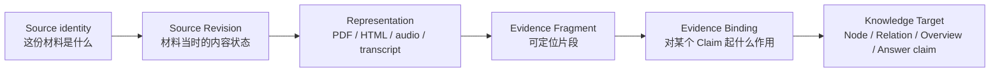
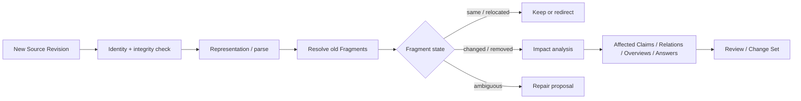

# AI-native 个人知识库

## 来源、证据与可追溯性合同 v1.0 — Source Truth、Evidence Binding、Stable Locator 与可核验知识

> 文档日期：2026-08-06  
> 文档性质：终局产品本体、交互与状态合同；不是 Source Reader 线框、引用样式指南、文件格式清单或工程存储方案  
> Canonical 产品定义：`AI-native-个人知识库-终局产品设计文档-v4.0.md`；本合同只证明 Source、Evidence 与可追溯责任，不得反向改写 v4.0  
> v4.0 精确支撑覆写：Evidence Binding 可以作用于整个 Knowledge 或它的 Content Anchor；Node Anchor 与 Source Fragment locator 是两段不同定位，Anchor 默认不是知识对象或 Relation endpoint；只有唯一可验证匹配可自动修复  
> v4.0 Relation Evidence 覆写：Relation 可拥有独立 Evidence Bindings；qualifier / Applicability 属于关系意义，Evidence 属于支撑。supporting path 不是 Evidence 的替代，Evidence 变化触发 relation impact / review，不自动删除或改类型  
> v4.0 Query 覆写：Answer 必须区分 Accepted Knowledge、Source Statement、Current User Input、External Source、Reasoned Derivation 与 Historical Answer Reference；citation 只指向真正 Used 的 revision / Anchor / locator，Source 原文不自动成为当前知识  
> v4.0 Scope Attachment 覆写：Source-only 可以通过 Source Attachment 直接加入 Group / Topic；Attachment 只保留材料进入语境，不等于 Knowledge Placement 或 Evidence Binding，detach 不删除 Source、Fragment、Annotation 或下游 Evidence  
> 2026-08-09 Source-first 覆写：首份 Source 只要本地保存、拥有稳定 identity 与可返回入口，即可作为 First Returnable Asset；它仍是 Source Truth，不冒充 Current Knowledge。解析、OCR、AI 提炼与 Evidence 形成均是后续能力。解析失败必须显示“资料已保存 + 哪项未完成”，不能结算为全量导入失败。完整规则见`AI-native-个人知识库-首日到日常核心旅程合同-v1.0.md`  
> 2026-08-10 Relation Lifecycle 覆写：Relation Evidence 必须绑定具体 relation_revision_id；新增 / 替换 Evidence 默认不创建语义 Revision；Challenge、Review Case、End / Supersede / Retract 与 Archive 分开。完整合同见`AI-native-个人知识库-关系陈述生命周期与网络可信性合同-v1.0.md`  
> 2026-08-10 Knowledge Relation Type Registry 覆写：EvidenceBinding `supports / challenges / qualifies`只表达 Fragment 对具体 target revision 的作用，不解析为 `knowledge.supports / contradicts / qualifies`；`knowledge.derived_from`表达知识推导，不替代 Source provenance、Representation transform 或 KnowledgeRevision。完整合同见`AI-native-个人知识库-知识关系类型注册表与跨层语义合同-v1.0.md`  
> 2026-08-10 研究比较证据覆写：`AI-native-个人知识库-第二真实端到端夹具-概念学习、多语境复用与群关系-v1.0.md`验证研究 Claim 必须按需要保留 sample / material、intervention、comparator、exposure、feedback、outcome、delay、assessment 与 transfer 条件；technical comment 默认以 EvidenceBinding `challenges`具体 target revision，不自动升级为 Knowledge contradiction、Conflict 或 Source 撤回  
> 历史深层模型：`AI-native-个人知识库-产品定义-v3.0.md`  
> 相邻合同：`AI-native-个人知识库-知识节点粒度与内容组成合同-v1.0.md`、`AI-native-个人知识库-Overview形成编辑与更新合同-v1.0.md`、`AI-native-个人知识库-AI查询与知识回答合同-v1.0.md`、`AI-native-个人知识库-知识形成与维护循环-v1.0.md`、`AI-native-个人知识库-属性Facet与适用条件合同-v1.0.md`、`AI-native-个人知识库-产品对象层级与身份治理合同-v1.0.md`、`AI-native-个人知识库-关系陈述生命周期与网络可信性合同-v1.0.md`  
> 核心问题：怎样让用户从一条知识、关系、概览或 AI 回答回到“哪份材料的哪个版本、什么位置、以什么方式支持或限制当前说法”，并在来源变化、失效、重新解析、导出或恢复后仍然成立

---

# 0. 执行决定

本轮冻结五十一项产品决定。

1. **Source Truth 与 Knowledge Truth 永久分开。** Source 记录材料在某个版本中实际呈现了什么；Node、Relation 与 Overview 记录用户当前接受的理解，任何一方都不能静默覆盖另一方。
2. **Source 是一个可引用作品、记录或材料身份，不等于本地文件。** 同一论文的 PDF、HTML 和本地副本通常是一个 Source 的不同 Representations；两个内容相似但作者、发布边界或可引用身份不同的材料仍是两个 Sources。
3. **Source Revision 表示同一来源在一个时间点的内容状态。** 网页更新、文档新版本、对话新增消息、数据集刷新和文件替换都形成新 Revision，不覆盖旧 Revision。
4. **Source Representation 表示某个 Revision 的可访问形态。** 原网页、PDF、HTML 快照、音频、转写、OCR 文本和翻译可以并存；它们不能被当作同一原文。
5. **Evidence Fragment 必须绑定确定的 Source Revision。** 引用不能只指向一个会变化的 URL、文件路径或“当前版本”。
6. **Evidence Fragment 不是 Highlight，Fragment 与 Binding 也不是同一层。** Fragment 是可深链核验的主要产品资源；Binding 是说明它对某个 Target 起何作用的 Supporting Identity。高亮、下划线、批注和书签是阅读记录；只有显式用于支撑、挑战、限定、定义或举例时，才形成 Fragment / Binding。
7. **Evidence Fragment 保存可核验片段身份，Evidence Binding 保存它与目标 Claim 的关系。** 同一片段可以支持一个 Claim、限定另一个 Claim；角色不能作为 Fragment 的单一全局字段。
8. **Evidence 关系不是 Semantic Relation。** Evidence Binding 连接 Fragment 与 Node Anchor、Relation statement、Overview Claim 或 Answer Claim；它不进入默认知识图谱，也不改变 Relation endpoint 合同。
9. **现有 Evidence Role 拆为至少五个正交维度。** Material Origin、Derivation Distance、Support Role、Extraction Fidelity 与 Verification State 分开，不能用一个 direct / secondary / inference 枚举代替全部判断。
10. **来源类型不直接等于可信度。** 论文、政府网页、个人观察、访谈、论坛和 AI 转写各自提供不同上下文；可信性只能相对具体 Claim、方法、版本、Applicability 与反证解释。
11. **引用默认必须进入上下文，而不是只显示孤立摘录。** 用户打开 Citation 后看到片段、前后语境、所在结构、版本与目标 Claim 的关系，并能继续回到完整来源。
12. **每种媒体使用适合自己的 Selector Bundle。** 文本、PDF、网页、表格、代码、图像、音视频、对话和数据记录不能都退化为 page number 或字符 offset。
13. **稳定定位必须使用多重 Selectors 和内容快照。** 标题路径、页码、block / message id、exact quote、prefix / suffix、position、time range、spatial region、record key 与 digest 按媒体组合，不能只押注一个脆弱 locator。
14. **Locator 解析状态至少区分 resolved、relocated、changed、ambiguous、orphaned 与 unavailable。** “打不开”不能掩盖版本变化、匹配多处、权限失效或片段被删除的差异。
15. **自动 Re-anchor 只在唯一且可验证时提交。** 多候选、内容变化或跨 Revision 推断只产生修复建议；旧 Fragment 与旧 Revision 永久可追溯。
16. **来源变化不会自动改写知识。** 新 Revision 触发 Evidence impact analysis，用户再决定保留历史依据、更新知识、限定 Applicability、标记争议或等待更多材料。
17. **来源未变化不等于知识仍然有效。** 时间、适用条件或外部环境变化可以让 Node 需要复查；Source freshness、Knowledge freshness 与 Applicability 分开。
18. **来源失效不等于知识被删除。** 只要有合法本地快照、片段快照或历史引用，知识继续存在，但 Verification State 必须诚实降低。
19. **来源删除、断开、归档和永久删除是四种不同动作。** Disconnect 停止同步，Archive 退出默认浏览，Trash 进入可恢复删除，Permanent Delete 才移除受管原件；每种动作先显示下游 Evidence 与知识影响。
20. **删除 Highlight 或批注不删除已提交 Evidence。** Evidence 已保存自己的 Revision、Locator 与内容快照；删除 Evidence Binding 也不能删除 Source 或 Node。
21. **AI 抽取结果不是原文。** native text、OCR、transcript、translation、summary 与 inference 必须分别标注，用户能一跳查看原媒体或原语言片段。
22. **OCR / transcript / translation 的修正形成新 Derived Representation Revision。** 修正不会伪装成原 Source Revision 的作者更新，也不会覆盖旧引用历史。
23. **机器生成 locator、片段和 Evidence Binding 必须保存生成活动与模型 / 规则版本。** Provenance 能说明谁或什么产生了它，但默认界面不暴露技术流水线。
24. **用户原创、个人观察与访谈可以成为合法 Source Truth。** 没有外部出版物不意味着没有来源；产品必须标明作者、记录时间、观察方式与用户给定边界。
25. **Source-only 是完整成功状态。** 一份材料可以长期保存在 Sources 中而不生成 Node、Relation 或 Proposal，不被显示为低产出或整理失败。
26. **从 Source 生成知识不是复制粘贴。** 每次 Commit 记录所用 Fragments、转换活动、用户修改、目标 Node Anchors 与 Change Set，能解释“这条知识怎样形成”。
27. **引用原句、总结材料和推断结论是三种不同写入。** Quote 使用 wasQuotedFrom，Synthesis 使用 derivedFrom，多来源推断还必须暴露推断步骤与反证；界面不能共用一个“来自此来源”。
28. **一个 Claim 可以有多个支持、挑战和限定 Bindings。** 产品不强迫单一来源，也不把“引用数量”当作结论强度。
29. **一个 Evidence Fragment 可以服务多个 Targets，但每个 Binding 独立保存作用、范围与状态。** 修正一个 Target 的解释不会改写片段本身或其他 Bindings。
30. **Evidence coverage 与 Search / Query coverage 分开。** 一个回答检索覆盖充分，不代表每个 Claim 证据充分；一个 Node 有引用，也不代表当前适用条件被覆盖。
31. **引用显示必须把身份、位置、版本、作用与可核验性组合成人话。** 默认不显示 provenance graph、selector JSON、hash 或 confidence 百分比，但核验层必须可查。
32. **Source Registry 按 Source identity 列出，不按附件或解析任务重复。** 同一 Source 的多 Representations、Revisions 与 connector locations 在详情中展开。
33. **Duplicate Source Resolution 先区分同一作品、同一 Revision 的镜像、新 Revision、衍生作品和仅相似内容。** 文件 hash 相同只能证明字节相同，标题相同不能证明身份相同。
34. **来源 metadata 有自己的 provenance。** 作者、发布日期、标题、标识符、语言与权利信息来自原文、外部元数据、用户修正或 AI 推测必须可区分。
35. **Source Reader 是核验工作区，不是附件预览。** 它同步原材料、片段、Annotations、已形成知识、影响关系和版本状态，但默认仍以阅读为主。
36. **从 Citation 返回必须恢复知识语境。** Node / Answer → Evidence → Source Reader → Back 后恢复原 Claim、Anchor、Reading Depth、Placement、scroll 与展开状态。
37. **Source Reader 的 Selection 与 Knowledge Selection 不合并成一个含混焦点。** 当前 Source Fragment 与当前 Knowledge Target 可关联显示，但切换一方不能静默改选另一方。
38. **来源内部搜索只定位 Source Revision，不升级为全库 Search。** 命中 OCR 或 transcript 时说明 fidelity；从来源 Search 生成 Evidence 仍需确认片段和作用。
39. **Re-parse 与 Re-index 只重建派生数据。** 它们不能删除 Source Revision、Evidence snapshot、Knowledge Node 或用户 Annotation；失败时保留上一份可用结果。
40. **Source Snapshot、Representation bytes 与 Knowledge Snapshot 分开。** 前者冻结材料内容，后者冻结当时问题和回答；两者不能因“快照”同名而混用。
41. **本地优先默认保存足以长期核验的材料。** 在用户拥有或允许保存的前提下，优先保存 managed copy / snapshot、metadata、digest 与 locator；reference-only 必须明确长期失效风险。
42. **完整导出同时提供可重建包和可读 fallback。** 包含 Sources、Revisions、Representations、Fragments、Bindings、Annotations、Activities、digests 与 redirects；Markdown / HTML / PDF 导出不冒充完整 provenance。
43. **恢复必须校验字节完整性和引用可达性。** 文件存在不等于恢复成功；抽样打开 Source → Fragment → Target，检查 digest、locator 与 Revision lineage 后才完成。
44. **访问权、版权和可分发性是 Source / Representation / Fragment 各自属性。** 本地个人使用可以保持低摩擦，但分享或导出时必须知道哪些原件、摘录或翻译可包含；不把隐私设置变成日常知识浏览负担。
45. **离线时本地 Source、快照、Annotations、Fragments、Bindings 与已解析全文继续可用。** Connector 刷新、远程原件与云 OCR 暂停，但产品不退化成断裂 Citation 列表。
46. **大规模 Sources 使用增量解析、按需渲染与稳定定位。** 300 Sources / 100k Fragments 下仍能从 Claim 一跳进入上下文，不靠预加载全部媒体或缩减证据语义。
47. **来源与证据质量以可核验成功衡量。** 核心指标是正确回到版本与位置、理解作用、修复失效引用和无损导出，而不是高亮数量、引用数量、AI 产出量或阅读时长。
48. **本合同不授权开始原型或视觉实现。** 在 Source identity、Revision、Representation、Evidence Binding、Locator repair 与删除影响确认前，不用漂亮 PDF Reader 或引用卡片掩盖产品本体缺口。
49. **Source identity 与 Scope Attachment 分开。** 一份 Source 可以 attached 到多个 Groups / Topics 而不复制；直接加入一个范围不改变 Source Truth，也不让它自动成为 Knowledge。
50. **Attachment 与 Evidence Binding 回答不同问题。** Attachment 回答“为什么这份材料在这个范围里”；Binding 回答“哪个 Fragment 对哪条 Claim 起什么作用”。任一方都不能从另一方静默推导为 canonical truth。
51. **Source-only 必须保留原始进入范围。** 用户在深层 Topic 添加材料后，即使解析失败或不形成知识，也能从该 Topic 和 Group Sources 再次找到；Topic transformation 必须迁移、重定向或显式移除 Attachment。

---

# 1. 当前规格中的十六个结构缺口

## 1.1 Source 仍然接近“附件记录”

现有产品已经写出 Source Registry、Reader、parse state 与 disconnect，但没有定义同一作品的 PDF、网页、镜像、本地文件和新版如何共享或分离身份。没有 Source identity，Registry 最终会变成附件列表。

## 1.2 Source 与 Source Revision 没有完整分离

网页、文档、对话和数据集会变化。若 Evidence 只指向 `source_id`，过几个月打开看到的是新内容，却仍以为它证明了历史 Claim。

## 1.3 Revision 与 Representation 被混为文件版本

同一内容状态可以有原网页、PDF、HTML snapshot、OCR text 和 translation。格式不同不一定是新 Revision，OCR 修正也不一定是作者发布的新版本。

## 1.4 Evidence Role 混合了不同问题

`direct / secondary_synthesis / user_observation / user_interpretation / system_inference` 同时在回答：材料是谁产生、离事实多远、如何提取、对 Claim 起什么作用。一个枚举无法表达“用户观察的原始记录经 OCR 提取后，限定而非支持某个 Claim”。

## 1.5 Fragment 自身没有“支持或反驳”的固定角色

片段只陈述内容。它对哪个 Claim 是支持、挑战、定义、限定还是例子，取决于具体连接。因此角色必须属于 Evidence Binding，而不是 Fragment 全局字段。

## 1.6 Locator 只说“稳定”，没有说明如何稳定

页码会因版本变化，XPath 会因页面重排，字符 offset 会因插入文本，时间码会因剪辑，表格行号会因排序。没有 Selector Bundle、Revision 与修复状态，“稳定定位”只是愿望。

## 1.7 Highlight、Annotation、Evidence 和 Knowledge Proposal 没有边界

若每次高亮都形成 Evidence 或知识，产品会制造卡片洪水；若高亮只留在 PDF 里，它又无法参与跨来源综合与长期迁移。

## 1.8 Source Reader 没有完整双向导航合同

从 Node 进入原文后，用户能否知道正在核验哪个 Claim？从片段又能否看到它支持、挑战或限定了哪些 Nodes、Relations、Overviews 与 Answers？现有规格只规定“一跳”，没有共享状态和返回语境。

## 1.9 来源变化后的影响状态过于粗糙

新版本可能完全不影响片段、只搬了位置、改了措辞、改变了含义、删除了内容或暂时无法访问。统一的 `source_changed` 不能决定后续动作。

## 1.10 OCR、转写、翻译与 AI Summary 仍可能冒充原文

只在 Citation 旁写一个小图标不足以防止误读。用户必须能知道当前看到的是哪种 Representation、精确程度、原语言和修正历史。

## 1.11 “引用次数”可能成为伪质量指标

十条重复二手引用不一定强于一条直接记录；一个 Fragment 被多个 Claims 使用也不意味着 Source 更可信。Registry 不应以计数制造权威感。

## 1.12 删除与断开缺少逐层后果

删除文件、移除快照、断开 connector、删除 Annotation、删除 Evidence Binding、Trash Source 和永久删除 Source 的影响完全不同。没有分层预览会伤害 Source Truth。

## 1.13 导出只说“保留 provenance”，没有可验收内容

如果只导出 Citation 文本和文件路径，就无法重建 Revision、Selectors、Bindings、生成活动和修复历史；如果只导出数据库，也无法被人阅读。

## 1.14 Source-only success 没有长期使用合同

已有形成合同允许不生成知识，但 Source-only 之后如何浏览、标注、搜索、引用、升级为知识、版本更新和归档仍未定义。

## 1.15 Source / Evidence 还没有独立的反指标

若团队优化高亮数、AI 生成引用数、解析速度或“每份材料产生多少知识”，产品会奖励过度提取，而不是可靠理解。

## 1.16 Source-only 缺少 Group / Topic 语境 identity

Source 可以长期不形成 Knowledge，但现有模型只保存 `source_scope` 或群级投影，没有一个明确记录回答“用户当时把这份材料加入哪个 Group / Topic”。若依赖 Evidence 反推，未形成 Evidence 的材料会悬空；若把它写成 Group membership，又会让 Source 冒充 Knowledge。

---

# 2. 产品目标与非目标

## 2.1 终局目标

1. 用户能从任何重要知识陈述一跳回到确定来源版本和具体上下文；
2. 来源变化、失效或重新解析后，旧理解仍可重建且影响可处理；
3. 文本、PDF、网页、表格、代码、图像、音视频、对话和数据记录共享一套可迁移定位原则；
4. 用户能区分材料身份、抽取方式、对 Claim 的作用和当前可核验状态；
5. 从阅读标记到 Evidence、再到正式知识的每次跨越都是可理解、可撤销的明确动作；
6. AI、网络和 connector 不可用时，本地 Source Truth 与已提交 provenance 仍完整；
7. 完整导出与恢复后，Source → Fragment → Binding → Knowledge Target 的链仍能逐跳打开。

## 2.2 永久非目标

- 不把产品变成通用参考文献排版器；可以生成引用样式，但核心是知识可追溯；
- 不以文献数量、阅读时长或高亮数量衡量知识质量；
- 不要求所有用户先填写学术级 metadata 才能保存个人材料；
- 不把所有 Source 都转成 Nodes；
- 不让 AI 为“引用完整”而补造来源、页码、时间码或原文；
- 不用一张 provenance graph 取代阅读、上下文和人话解释；
- 不让 Source 文件夹结构成为 Knowledge Group / Topic 结构的第二真相；
- 不因来源失效而自动删除、降级或改写用户已经接受的知识。

## 2.3 事实、产品决定与待验证假设

- **研究事实**：W3C Web Annotation 支持将 Target、Selector、State 与 Motivation 分开，并建议使用多个 Selectors 提高未来可定位性；PROV-O 将 Entity、Activity 与 Agent 分开表达 provenance；Zotero 把 Annotation 与 PDF bytes 分离并支持回到原页与导出。
- **产品决定**：本产品采用 Source / Revision / Representation、Evidence Fragment / Binding 和 Selector Bundle 的分层，但不要求界面或导出完全采用 RDF / JSON-LD。
- **待验证假设**：日常用户能通过渐进披露理解“原文 / 转写 / 翻译”“支持 / 限定 / 反驳”和“当前无法核验”，而不觉得产品变成学术工具。

---

# 3. 六层可追溯模型

## 3.1 从材料到知识的六层



任何核心 Citation 都必须能沿相反方向返回。默认界面可以只显示“来源 + 位置 + 作用”，但系统不能省略中间层。

### 3.1.1 可选 StudyConditionSnapshot

当一个 Evidence Binding 或 Answer ClaimSupport 的意义依赖研究比较条件时，可以保存：

```text
StudyConditionSnapshot
  population_or_sample?
  material_or_domain?
  learning_activity_or_intervention?
  comparator?
  exposure_or_dosage?
  feedback_condition?
  outcome_kind?
  outcome_delay?
  assessment_format?
  transfer_distance?
  observed_limitations[]
  source_reported_or_interpreted
```

它回答“这项研究结果在什么比较条件下成立”，不成为新 Source、Knowledge、Property 或顶级对象。只有缺少某字段会改变 Claim 的比较、适用或 Answer 时，界面才要求补充或显示`当前无法直接比较`。论文数量、citation count、source type 或 meta-analysis 标签都不能替代这些条件，也不能自动形成权威 rank。

technical comment、re-analysis 或方法 critique 默认通过 Evidence Binding 指向具体 target revision，并保存 `challenge_dimension`与预期 effect。它可以要求收窄措辞、补充 limitation 或 review criterion；除非另有两条同范围且不可并存的 Knowledge claims，不能自动创建 `knowledge.contradicts`或 Conflict。

## 3.2 Source identity

Source 回答“这是哪一份可引用材料”。它通常对应：

- 一篇论文、书、法规、报告或网页作品；
- 一段录音、视频、访谈或会议记录；
- 一个用户观察记录、实验记录或日志；
- 一个对话线程、数据集、代码仓库或版本化文档；
- 一份导入文件，当其本身就是可引用作品时。

Source 不等于：

- 每次下载的本地文件副本；
- OCR 文本；
- 某一页或某一段；
- 从材料中生成的 Node；
- 一个 Group / Topic；
- 一个 connector job。

## 3.3 Source Revision

Revision 是 Source 在确定时间、版本标识或内容 digest 下的不可变状态。`current_revision_id` 只是当前指针，历史引用永远保留原 revision。

Revision 原因至少包括：

- publisher update；
- author edit；
- live page recapture；
- conversation append；
- dataset refresh；
- file replacement；
- user-declared correction；
- imported historical version。

OCR、转写或翻译的修正通常是 Derived Representation Revision，不自动成为 Source Revision，除非原材料本身就是该文本。

## 3.4 Representation

Representation 回答“这个 Revision 以什么形态被看到或保存”。一个 Revision 可以同时拥有：

- remote original；
- linked local file；
- managed local copy；
- web snapshot；
- normalized text；
- OCR text；
- transcript；
- translation；
- thumbnail / waveform / page images；
- structured table or dataset view。

Representation 之间用 `derived_from_representation_id` 和 Transform Activity 连接，不用同一 `file_url` 覆盖。

## 3.5 Evidence Fragment

Fragment 是某个 Source Revision 中可被精确重新找到、并保存必要内容快照的片段身份。它可以是：

- 文本范围；
- PDF 页内文本或区域；
- 网页元素与 quote；
- 表格的 sheet / range / record；
- 代码的 commit / path / symbol / line range；
- 图像区域；
- 音视频时间段与 track；
- 对话消息或消息范围；
- 数据记录、字段或查询结果 snapshot。

Fragment 本身不声明“这证明了什么”。

## 3.6 Evidence Binding

Binding 回答“这个 Fragment 对这个 Target Claim 起什么作用”。Target 可以是：

- Node + Anchor；
- Relation statement / Applicability / limit；
- Overview Claim Block；
- Answer Claim；
- Change Set 中待确认的 Proposed Claim。

一个 Binding 是 provenance / support edge，不是正式 Semantic Relation。

---

# 4. 对象与运行记录

## 4.1 Source

```text
Source
  source_id
  canonical_title
  source_kind
  creators[]
  publisher_or_origin
  canonical_identifiers[]
  languages[]
  created_or_published_at
  source_scope
  metadata_assertions[]
  current_revision_id
  revision_ids[]
  lifecycle_state
  rights_summary
  created_at
  updated_at
```

`metadata_assertions[]` 记录 Source intrinsic metadata 的字段值、来源、提取方式、时间和是否用户确认。它们属于 Source，不因名称与 Node Property 相同就自动写回知识对象。一个 DOI、URL 或文件名都不是天然 canonical identity。

Source metadata 与知识 Property Assertion 的边界：

| 输入 | 默认归属 | 进入知识的条件 |
|---|---|---|
| PDF / 网页作者、发布日期、语言 | Source metadata | 用户明确映射到所述对象的 Property |
| YAML / frontmatter key | raw + Source metadata candidate | 检查语义、target、type、origin 和 collision |
| source tags | Source Tag | 明确提升为 Facet / Property；不自动成为关系 |
| DOI / URL / file path | Source identifier / location | 不直接成为 Node identity field |
| AI 推测的作者或日期 | proposed Source metadata | 先接受为 Source；再单独决定知识映射 |

Mapping 创建新的 Property Assertion Proposal，保留 Source metadata assertion ref、raw value、Definition / target、Applicability、qualifier 与 Evidence Binding；接受前不进入 Node / Group Accepted Search、View、Overview 或 Ask。删除 Mapping 不删除 Source metadata，Source metadata 修正也不静默覆盖已采用的 Node Assertion。

## 4.1.1 Source Attachment

`Source.source_scope` 只记录材料自身的内在 scope / coverage，不表达它被用户放进哪个知识范围。外部组织语境由独立 Attachment 保存：

```text
SourceAttachment
  attachment_id
  source_id
  target_scope_ref
    kind: group | topic
    id
  role: primary_material | reference | example | background
  contextual_note?
  created_by
  created_at
  lifecycle_state
  revision_history
```

不变量：

- Attachment 是 Supporting Identity，不是 Source、Knowledge 或 Group membership；
- Source 可以拥有多个 Attachments，不复制 Revisions / Representations；
- Group Attachment 与 Topic Attachment 都在 Group Sources 解析为`直接加入`，Topic Attachment 保留 exact path；
- Attachment 不自动产生 Fragment / Binding / Annotation / Knowledge Proposal；
- Evidence Binding 不自动反向产生 Attachment；
- detach 只移除当前 Scope context；
- Topic rename / move 保持 Attachment；merge / split / transfer 进入 target mapping preview；
- 完整导出与恢复保留 Attachment identity、target redirect 与 history。

## 4.2 Source Revision

```text
SourceRevision
  source_revision_id
  source_id
  predecessor_revision_ids[]
  revision_label
  revision_cause
  observed_at
  published_or_valid_at
  captured_at
  content_digest
  metadata_digest
  representation_ids[]
  completeness
  rights_snapshot
  immutable: true
```

`observed_at`、`published_or_valid_at` 与 `captured_at` 分开。系统不能把“我们今天抓取”显示成“作者今天发布”。

## 4.3 Source Representation

```text
SourceRepresentation
  representation_id
  source_revision_id
  representation_kind
  media_type
  language
  origin_location
  storage_mode
  local_object_ref
  content_digest
  byte_size
  transform_activity_id?
  derived_from_representation_id?
  availability_state
  render_capability
  extraction_coverage
  created_at
```

Storage modes：`reference_only`、`linked_local`、`managed_copy`、`captured_snapshot`、`connector_cached`、`generated_derivative`。

## 4.4 Selector Bundle

```text
SelectorBundle
  selector_bundle_id
  source_revision_id
  representation_id
  primary_selector
  fallback_selectors[]
  quote_snapshot?
  surrounding_context_snapshot?
  structural_path?
  content_digest?
  created_against_revision_id
  resolution_state
  last_resolved_at
  repair_candidates[]
```

Selectors 是互补证据，不是任取其一的重复字段。系统按媒体、Revision 和当前 Representation 决定解析顺序。

## 4.5 Evidence Fragment

```text
EvidenceFragment
  fragment_id
  source_id
  source_revision_id
  representation_id
  selector_bundle_id
  content_snapshot
  context_snapshot
  normalized_digest
  origin_axis
  derivation_axis
  extraction_axis
  verification_state
  creator_or_extractor
  created_at
  supersedes_fragment_id?
```

将 `supports_or_challenges[]` 从 Fragment 移除。作用属于 Binding。

## 4.6 Evidence Binding

```text
EvidenceBinding
  binding_id
  fragment_id
  target_ref
  target_revision_or_snapshot_id
  target_anchor
  support_role
  applicability_alignment
  scope_note?
  strength_rationale?
  created_by
  creation_activity_id
  lifecycle_state
  created_at
  supersedes_binding_id?
```

`target_revision_or_snapshot_id` 让历史 Answer 或 Node Revision 保留当时证据链。当前 Node 演化后，可以显示 binding 是否仍对齐，而不是篡改旧 Binding。

## 4.7 Annotation

Annotation 是归属于 Source Revision 的 Supporting Identity / reading record，不获得 Primary Resource 的 Library、Atlas、Placement 或 Relation endpoint：

```text
SourceAnnotation
  annotation_id
  source_revision_id
  selector_bundle_id
  motivation
  body
  style_hint?
  annotation_label_refs[]
  created_by
  created_at
  updated_at
  promoted_fragment_id?
```

Motivation 可以是 highlight、comment、bookmark、question、labeling。`annotation_label_refs[]` 只在 Source Reader 内组织批注，不是可跨对象复用的通用标签、Facet、Property Assertion 或 Relation；若要升格为知识结构，必须经过对应的显式 Proposal。颜色只是 style hint，默认没有 evidence role。

## 4.8 Provenance Activity

```text
ProvenanceActivity
  activity_id
  activity_kind
  used_entity_refs[]
  generated_entity_refs[]
  agent_ref
  tool_or_model_ref?
  policy_snapshot?
  started_at
  ended_at
  change_set_id?
```

活动包括 capture、parse、OCR、transcribe、translate、extract、summarize、synthesize、re-anchor、user-edit、import 和 restore。它是内部 provenance 记录，不是用户日常对象。

---

# 5. Source Identity 与去重

## 5.1 身份判断顺序

1. 明确 canonical identifier：DOI、ISBN、法规编号、repository object id、message / thread id；
2. 创作者、标题、发布边界与版本声明；
3. 内容 digest 与结构；
4. 来源之间的 revision / mirror / translation / derivative 关系；
5. 用户确认。

## 5.2 五种结果

| 判断 | 结果 |
|---|---|
| 同一 Source、同一 Revision、不同副本 | 新 Representation / location |
| 同一 Source、新内容状态 | 新 Source Revision |
| 同一作品的翻译或格式化派生 | 按可引用边界决定 derived Representation 或 linked Source |
| 不同作品引用或改编同一材料 | 独立 Source + provenance link |
| 只相似、无法判断 | 保持独立并显示 compare suggestion |

## 5.3 Merge Source

Merge 前显示：

- canonical metadata；
- Revisions 是否兼容；
- Representations 与 digests；
- Fragments 与 Bindings；
- Source Citations、Annotations 与 Groups；
- redirect 和 Undo。

Merge 不通过“选一个文件保留”完成；它先解决 identity，再合并 locations 和 metadata assertions。

## 5.4 Split Source

当一次导入把合集、邮件线程、多篇扫描件或混合数据误认为一个 Source 时，Split 分配 Revisions、Fragments、Annotations 与 Bindings，并为旧 `source_id` 保留 redirect / ambiguous resolution。

---

# 6. Capture、存储与 Snapshot

## 6.1 五种采集结果

| 采集方式 | 长期承诺 | 适用情况 |
|---|---|---|
| Reference only | 保存身份、位置和少量 metadata；可失效 | 无权或不希望保存原件 |
| Linked local | 原文件由用户管理；监测路径与 digest | 已有个人文件库 |
| Managed copy | 产品管理本地不可变副本 | 需要稳定核验 |
| Captured snapshot | 保存网页或远程 Representation 的当时状态 | 动态网页、远程文档 |
| Connector-backed | 保留远程 identity、revision 和可选本地 cache | 持续变化的外部系统 |

## 6.2 默认选择

本地个人知识库在权利允许时，默认优先 managed copy / snapshot + digest，而不是只留 URL。若只能 reference-only，保存时直接说明：

> 这份来源目前只保存了链接。原页面变化或失效后，部分引用可能无法重新核验。

这不是隐私警告墙，而是长期所有权说明。

## 6.3 Capture 成功状态

Source 保存成功后立即进入 Registry，并可：

- 阅读；
- 搜索已解析部分；
- 标注；
- 建立 Evidence；
- 稍后形成知识；
- 保持 Source-only；
- 归档。

若 Capture 从 Group / Topic 发起，成功状态同时确认`已加入：{Scope path}`并创建 Source Attachment；若从全局 Add / Sources 发起，不要求立刻选择 Group。系统不显示“0 Nodes produced”。Attachment 写入失败不能回滚已经保存的 Source；Destination Receipt 分别说明 Source 与 Scope context 的结果。

## 6.4 原材料不可编辑

若用户在 Source Reader 中“修正文档”，系统必须明确选择：

- 修正 metadata；
- 修正 OCR / transcript / translation；
- 创建用户批注；
- 创建一份本地派生文档 Source；
- 打开原应用编辑并等待新 Revision。

不允许直接改写 managed original bytes 后仍称其为同一 Revision。

---

# 7. 多媒体 Stable Locator 合同

## 7.1 通用原则

每个 Fragment 至少保存：

1. Source Revision；
2. Representation；
3. 一个 primary selector；
4. 一个或多个 fallback selectors（媒体允许时）；
5. content / quote snapshot；
6. surrounding context；
7. resolution state。

## 7.2 Selector 矩阵

| 媒体 | Primary | Fallback | 上下文 |
|---|---|---|---|
| Markdown / 文档 | stable block id / heading path + range | exact quote + prefix / suffix、position | section title、邻近 blocks |
| 网页 | DOM / semantic path + text quote | XPath / CSS、prefix / suffix、snapshot offset | title、URL、captured revision |
| PDF | page object / text coordinates | page label、quote + context、region | 页码、section、page image |
| 表格 | sheet id + record key / cell range | header names、row digest、A1 range | sheet、headers、邻近 rows |
| 代码 | repository + commit + path + symbol / lines | blob digest、exact text、AST identity | file、symbol、commit |
| 图像 | region coordinates / normalized polygon | object label、image digest | full image preview |
| 音视频 | time range + track | transcript quote、chapter / named fragment | 前后时间、waveform / frame |
| 对话 | thread id + message id / range | author + timestamp + exact text | previous / next messages |
| 数据记录 | dataset revision + stable key + fields | row digest、query snapshot | schema、filter、unit |

## 7.3 Position 不是唯一真相

字符 offset、行号、页码、DOM path 与时间码都可能漂移。产品不得因 primary selector 失败就立即 orphan；应依次使用 Revision、digest、exact quote、context 和结构信息重解。

## 7.4 Resolution 状态

| 状态 | 含义 | 默认动作 |
|---|---|---|
| resolved | 原 Revision 与原位置可精确打开 | 进入上下文 |
| relocated | 内容相同，结构位置变化 | 显示已移动，可接受 redirect |
| changed | 匹配位置内容已变化 | 比较 old / new |
| ambiguous | 多个候选匹配 | 用户选择或保留旧 snapshot |
| orphaned | 当前 Revision 找不到候选 | 打开历史 Revision / 修复 |
| unavailable | 原 Representation 当前不可访问 | 使用本地 snapshot / 重连 |

## 7.5 Re-anchor 提交

自动接受仅在：

- content digest 或 exact normalized quote 唯一匹配；
- surrounding context 与结构相容；
- 目标 Revision 已确定；
- 没有语义改变信号。

否则只产生候选。接受后创建 successor Fragment / Selector revision，旧 Fragment 不被覆盖。

---

# 8. Source Reader 工作区

## 8.1 阅读优先结构

1. Source identity + current / historical Revision；
2. 原始内容 / Representation；
3. 轻量 Annotation tools；
4. 当前选区动作；
5. Context Rail：Fragments、相关知识、版本与可核验状态；
6. Source metadata / provenance forensic detail。

默认不同时展开所有面板。Reader 第一任务是阅读和核验，不是管理 metadata。

## 8.2 从知识进入 Reader

进入时带入：

```text
EvidenceOpenContext
  return_target
  knowledge_target_ref
  target_anchor
  binding_id
  fragment_id
  source_revision_id
  preferred_representation_id
  selector_bundle_id
```

Reader 高亮当前 Fragment，并在 Context Rail 用一句话说明：

> 这段材料限定了“长期记忆改善依赖检索练习”的适用条件。

## 8.3 从 Reader 进入知识

选中 Fragment 后显示：

- 已用于哪些知识；
- 对每个 Claim 的作用；
- 目标当前是否变化；
- 打开知识；
- 建立新 Binding；
- 形成 Node / RelationCandidate，或由用户补全后直接提交 maintained Relation；
- 查看历史使用。

多个 Targets 不合并成“被引用 8 次”。

## 8.4 Reader Selection

Source selection 保存 Source Revision + selector；Knowledge selection 保存 target + anchor。双镜联动时二者同时存在：

- 选择 Source Fragment 可高亮关联 Targets，但不改写当前 Knowledge Scope；
- 选择 Target 可定位相关 Fragments，但不随机切换 Source Revision；
- 无 Binding 的 Annotation 不自动选中知识；
- 多 Fragment 综合时显示 selection set 和顺序。

## 8.5 Find in Source

Source Find 只在指定 Revision / Representation 中执行，结果说明 native、OCR、transcript 或 translation。选择命中后只是定位；“用作证据”才创建 Fragment / Binding。

---

# 9. Annotation、Highlight 与 Evidence

## 9.1 三层边界

| 层 | 用户意图 | 是否影响 Knowledge Truth |
|---|---|---|
| Annotation | 记号、评论、问题、书签 | 否 |
| Evidence Fragment + Binding | 让某个 Claim 可核验 | 只增加 provenance，不改 Claim 内容 |
| Knowledge Proposal / Change Set | 创建或修改正式知识 | 提交后是 |

## 9.2 高亮动作

选中文字后的默认动作按低摩擦排序：

1. 高亮；
2. 添加批注；
3. 用作当前 Claim 的依据（仅在有 Target Context 时）；
4. 保存为知识；
5. 建立关系建议。

“用作依据”和“保存为知识”不能是同一个按钮。

## 9.3 批注颜色

颜色默认只表示个人阅读习惯。用户可以自定义 palette，但系统不预设：

- 绿色 = 事实；
- 红色 = 反驳；
- 黄色 = 重要；
- 蓝色 = AI 可信。

Evidence support role 必须用文字和结构保存，不能依赖颜色。

## 9.4 从 Annotation 提升

提升时复用 selector，创建 immutable Fragment，并让用户选择 Target 与 support role。Annotation 保留 `promoted_fragment_id`，但删除任一方不会级联删除另一方。

---

# 10. Evidence 的五个正交维度

## 10.1 Material Origin / 谁产生材料

- source_author_or_publisher；
- user_observation；
- user_interview_record；
- imported_third_party_record；
- software_generated_record；
- unknown_origin。

## 10.2 Derivation Distance / 离原始记录多远

- primary_record；
- direct_quote；
- transformed_representation；
- secondary_account；
- multi_source_synthesis；
- inference。

它描述 provenance 距离，不自动判断真实性。

## 10.3 Support Role / 对 Target 的作用

- supports；
- challenges；
- qualifies；
- defines；
- exemplifies；
- documents_occurrence；
- provides_method；
- provides_context；
- originates_quote。

一个 Binding 选择一个主要 role，可附 scope note；需要表达两个不同作用时建立两个 Bindings。

## 10.4 Extraction Fidelity / 怎样得到当前片段

- native_exact；
- copied_exact；
- OCR_exact / OCR_uncertain；
- transcript_exact / transcript_uncertain；
- translated；
- normalized；
- summarized；
- inferred。

`summarized` 和 `inferred` 不能作为直接原文 Citation；必须同时链接生成它所使用的原始 Fragments。

## 10.5 Verification State / 现在能否核验

- verified_local_original；
- verified_remote_original；
- verified_snapshot；
- snapshot_only；
- locator_relocated；
- locator_ambiguous；
- source_unavailable；
- integrity_failed；
- not_yet_verified。

## 10.6 默认人话合成

P0 示例：

> 原报告，第 34 页。用于限定适用地区。

P1：

> 来自 2025-04-12 保存的报告版本；当前原网站不可访问，但本地快照仍可核验。

P3 才显示 selectors、digests、Activity、agent 与完整 lineage。

---

# 11. Source → Knowledge 的形成与 Provenance

## 11.1 四种写入

| 写入 | 结果 | 必需 provenance |
|---|---|---|
| Quote | Node / Block 中引用原句 | Fragment + quotedFrom + locator |
| Paraphrase | 对片段的改写表达 | Fragment(s) + derivedFrom + user / AI edits |
| Synthesis | 多来源综合 | all used Fragments + synthesis activity + conflicts / exclusions |
| Inference | 基于材料推出新结论 | supporting Fragments + reasoning summary + assumptions + counterevidence |

## 11.2 Knowledge Commit

Commit Preview 至少显示：

- 将创建或修改哪个 Node / Relation / Overview；
- 使用哪些 Source Revisions 和 Fragments；
- 原句、改写、综合和推断各占什么角色；
- 用户改了 AI 建议中的什么；
- 是否有挑战或限定材料；
- 哪些 Bindings 会创建；
- Undo 范围。

## 11.3 多来源综合

AI 或用户综合不能只留下“3 sources”。每个主要 Claim 都必须映射到具体 Bindings；若只存在背景材料而无直接支持，写成 context / inference，而不是支持。

## 11.4 Counterevidence

当系统找到挑战或限定材料时：

- 不自动拒绝 Claim；
- 不隐藏在 Citation footer；
- 比较 Applicability、时间、方法和 Source Revision；
- 若只是限定或范围不重叠，形成 qualification / parallel scope，不创建全局 contested 标签；
- 若对同一 RelationRevision 的重叠 Applicability 构成反命题，先形成 Challenge Candidate；用户保存后才成为 open RelationChallenge；
- 可形成 scope-narrowed RelationRevision、Maintain / End / Supersede / Retract / Defer Decision；
- 保留未解决 Unknown。

## 11.5 用户修正 provenance

用户修正 AI 提取或综合时，新的 Node Revision 记录：原 Fragments、AI proposal、用户 patch 和 accepted Change Set。界面显示“由你修订”，而不是把结果重标为纯用户原创或纯 AI 生成。

---

# 12. Citation 与 Evidence Inspector

## 12.1 Citation 最小内容

- Source title；
- creator / origin（有意义时）；
- Source Revision date / label；
- human-readable locator；
- support role；
- extraction / translation notice（若非 native）；
- verification limitation（若存在）。

## 12.2 三层显示

### Inline / P0

`法国政府学生住房指南 · 2026-03 版 · 第 12 页`

### Inspector / P1–P2

- 片段和前后文；
- “为什么用于这里”；
- 当前版本和历史版本；
- 其他支持 / 挑战材料；
- 打开原文；
- 修复 / 更换 / 删除 Binding。

### Forensic / P3

- source_id / revision；
- Representation；
- Selector Bundle；
- digest；
- extraction / transform Activity；
- Binding target revision；
- redirect / repair lineage。

## 12.3 引用编号

编号只服务当前阅读版式，不是 Evidence identity。Answer 重新排序或 Node 修改后可以重编号，但 binding_id、fragment_id 与 locator 不变。

## 12.4 Citation 不可访问

默认文案按原因：

- `原网站暂时无法访问；仍可查看你在 2026-04-03 保存的版本。`
- `这段内容在新版中已移动。已定位到新位置。`
- `新版中找到两个可能位置，需要确认。`
- `当前只保留了引用文字，无法重新打开完整上下文。`

禁止统一写“来源失效”。

---

# 13. Source Revision、Diff 与影响传播

## 13.1 新 Revision 进入



## 13.2 Fragment Diff 状态

- unchanged_same_position；
- unchanged_relocated；
- wording_changed_same_meaning_candidate；
- meaning_changed；
- context_changed；
- removed；
- cannot_compare；
- representation_unavailable。

“same meaning”只能是候选判断，不能自动覆盖旧 snapshot。

## 13.3 下游影响

Impact 分四层：

1. **Citation only**：locator 或展示变化，Claim 不变；
2. **Support changed**：Binding 作用或可核验性变化；
3. **Knowledge review**：Node / Relation / Overview 可能需修改；
4. **Historical only**：旧 Answer / Snapshot 保留当时依据，只显示 current impact。

## 13.4 用户动作

- Keep historical basis；
- Accept relocated locator；
- Replace Binding with new Fragment；
- Add qualification；
- Update Claim through Diff；
- Open / resolve a RelationChallenge；
- Maintain / End / Supersede / Retract Relation；
- Defer；
- Disconnect / archive Source。

## 13.5 不静默重排

用户阅读 Source Reader、Answer 或 Node 时，新 Revision 到达只显示“来源有新版本”。刷新后才创建新的比较状态，不在阅读中替换片段或页码。

---

# 14. Availability、Permission 与 Lifecycle

## 14.1 三个独立状态轴

### Source lifecycle

active、archived、trash、permanently_deleted。

### Connection / availability

local_available、remote_available、cached_only、permission_lost、moved、disconnected、missing。

### Processing

not_started、partial、complete、failed、stale、rebuilding。

这些轴不能合并成一个 Source status。

## 14.2 Disconnect Preview

逐项回答：

- 是否停止 future sync；
- 原 remote 是否仍可手工打开；
- managed copy / snapshot 是否保留；
- 哪些 Representations 依赖 connector；
- 哪些 Fragments 仍可 resolved；
- 哪些 Claims 降为 snapshot-only；
- 怎样 reconnect；
- 是否产生 Change Set。

## 14.3 Archive

Archive 让 Source 退出 Registry 默认列表和新知识建议，但：

- 现有 Bindings 继续可用；
- Ask 默认仍可使用被 Accepted knowledge，而不是自动使用 archived Source 原文；
- Search 在显式 Sources / Archived 范围可找；
- 新 Revision sync 可按用户策略暂停。

## 14.4 Trash 与 Permanent Delete

Trash Source 前显示原件、Revisions、Representations、Fragments、Annotations 和 Bindings。恢复保持 identity。

Permanent Delete 只在 Trash：

- 说明哪些原始 bytes 和 snapshots 无法恢复；
- 说明哪些知识将变成 provenance missing；
- 允许仅删除 managed bytes、保留 metadata / digest / lawful excerpt；
- 不自动删除 Knowledge Nodes；
- 生成不可伪造的 deletion record / tombstone 与影响报告。

## 14.5 外部权限变化

权限失效时不显示“知识被撤回”。系统区分：

- 远程不可访问；
- 本地 snapshot 仍可核验；
- 只剩 excerpt；
- 连接凭据失效；
- 资源确实被删除；
- 当前用户无权分发但可以个人查看。

---

# 15. AI、OCR、转写与翻译

## 15.1 Representation Chain

```text
Original Audio Revision
  -> Transcript Representation v1 (model A)
  -> Transcript Correction v2 (user patch)
  -> Translation Representation v1 (model B)
  -> Summary Proposal (not Source Truth)
```

每一步保存 used / generated / agent / time / version。Summary Proposal 不回写 Source Revision。

## 15.2 Fidelity 显示

- native text：默认不提示；
- OCR / transcript exact：在首次引用或 Inspector 提示；
- uncertain span：片段内标出不确定处，不能只给整页 confidence；
- translation：显示原语言、译文与回到原文；
- summary：不能以引号显示；
- inference：必须显示所用 Fragments 和假设。

## 15.3 用户修正

用户修正 OCR / transcript 时只改变 derived representation。已有 Binding 可：

- 继续指向旧 derived Revision；
- 接受 successor Fragment；
- 比较差异；
- 保留原媒体 locator。

## 15.4 AI Failure

AI / OCR service 不可用时：

- 原材料、已有解析、Annotations 与 Evidence 可用；
- 新 native text 可继续手工引用；
- 未解析媒体显示真实限制；
- 不伪造空 transcript；
- 后台任务可排队但不阻塞 Source-only success。

---

# 16. Source Registry 与派生 Views

## 16.1 Registry 的稳定单位

每行是一条 Source identity，默认显示：

- title / kind；
- creator / origin；
- current Revision；
- available Representation；
- parse coverage；
- affected knowledge（仅有高影响时）；
- 一句最重要状态。

附件数、Fragment 数和引用次数默认不作为主视觉。

## 16.2 系统 Views

- Recently added；
- Changed sources；
- Unavailable / permission changed；
- Parsing partial / failed；
- Reference-only risk；
- Source-only；
- Evidence needs repair；
- Archived。

它们复用 View Definition，不拥有 Source 成员。

## 16.3 Source-only 的长期入口

Source-only View 只说明“尚未形成正式知识”，不带警告色。允许：

- 继续阅读；
- 标注；
- 建立 Evidence；
- 稍后生成 Proposal；
- attach 到 Group / Topic 作为 browsing context，但不制造 Knowledge / Evidence；
- Archive。

## 16.4 Registry 排序

默认使用稳定用户选择或标题 / creator；Changed / Needs Attention 是 View，不静默改变所有 Sources 的顺序。最近新增不等于最重要。

---

# 17. Offline、Export、Restore 与 Integrity

## 17.1 Offline capability

离线时可用：

- managed / linked local Representations；
- web snapshots；
- parsed text、OCR、transcript 和 translation cache；
- Annotations、Fragments、Bindings；
- Source Registry 与本地 Find；
- Evidence Inspector；
- 新 Annotation / manual Fragment / Binding；
- 本地 Change Set。

暂停：remote fetch、connector refresh、云 OCR / translation 和外部 permission validation。

## 17.2 完整 Knowledge Package

必须包含：

- Source identities 与 metadata assertions；
- immutable Revisions；
- Representations 或明确 external refs；
- digests 与 storage modes；
- Source Attachments、target refs、roles、redirects 与 history；
- Selector Bundles；
- Evidence Fragments；
- Evidence Bindings；
- Annotations；
- Provenance Activities；
- lifecycle / availability / processing state；
- redirects、repair lineage 与 tombstones；
- rights / distribution metadata；
- manifest 和 schema version。

## 17.3 可读导出

Markdown / HTML / PDF 提供：

- 来源清单；
- 人话 Citation；
- 片段和必要上下文；
- Node / Relation / Overview 到来源的链接；
- 原件相对路径或稳定外部地址；
- 当前不可核验说明。

可读导出不承诺能完整恢复所有对象。

## 17.4 Integrity

每个 managed Representation 和 Package 使用现代 digest 记录字节完整性；digest 只证明内容未变，不证明作者、真实性或可信度。

## 17.5 Restore acceptance

Restore 完成前：

1. manifest / schema valid；
2. bytes / digests valid；
3. Source → Revision → Representation 可达；
4. Fragment selectors 至少按抽样和风险全量策略解析；
5. Bindings 可打开 Target；
6. redirects / tombstones 生效；
7. partial / missing 清单可读；
8. 失败原子回滚。

---

# 18. Scale、Performance 与 Accessibility

## 18.1 规模基线

设计必须在以下状态成立：

- 300 Sources；
- 100,000 Evidence Fragments；
- 单个 PDF 1,500 页；
- 12 小时音视频；
- 50,000 行表格；
- 10,000 message 对话；
- 一个 Node 绑定 50 个 Fragments；
- 一个 Source 影响 500 个 Targets。

## 18.2 性能合同

- Reader 首先打开当前页 / 时间段 /区域，不等待全量解析；
- Fragment resolution 增量执行并缓存 Revision-specific result；
- Source changed impact 在后台计算，但已知 affected targets 可先显示；
- 大列表虚拟化不改变键盘顺序、Selection 或 screen reader count；
- 旧可用 parse / index 在 rebuild 时继续服务；
- Range media 按需加载，不预取整个 12 小时文件。

## 18.3 Accessibility

- Citation、support role、fidelity 和 verification 不只靠颜色或图标；
- PDF / image region 提供文本描述和 locator；
- 音视频 Fragment 提供 transcript（存在时）和键盘可控时间范围；
- Annotation tools 可全键盘使用，不要求拖拽；
- Reader 在 200% zoom 仍保留原文、Claim Context 与返回入口；
- screen reader 能读出 Source title、Revision、位置、作用和当前限制；
- reduced motion 下定位片段使用焦点和静态高亮，不依赖飞行动画。

## 18.4 Language

中文、混合语言和双向文本定位使用 Unicode logical order；exact quote normalization 不能破坏中文标点、全半角或 grapheme。翻译不是原文，原语言可一跳查看。

---

# 19. 十七个端到端场景

## 19.1 从 Node 核验 PDF 原文

用户从一条 Method Node 的限定条件进入 Citation，Reader 打开 2025 版 PDF 第 34 页的原句与前后段，并保留返回 Node Anchor 的路径。

## 19.2 同一论文的 PDF 与 HTML

系统识别为一个 Source / Revision 的两个 Representations；引用可在 PDF 页和 HTML quote 之间选择，不产生两个来源身份。

## 19.3 网页三个月后更新

新抓取形成 Source Revision。旧 Answer 仍打开旧 snapshot；当前 Node 显示所用片段在新版已改变并进入影响检查。

## 19.4 片段只移动位置

exact quote、context 与 digest 唯一匹配，新 Revision 中 locator 自动标为 relocated；用户可接受 redirect，不产生知识复查。

## 19.5 两处重复原句

新版出现两个相同 quote。系统标 ambiguous，保留旧 snapshot，要求用户根据 section context 选择，不随机定位。

## 19.6 高亮但不形成知识

用户阅读时高亮 40 处，全部保持 Annotation；只有选择“用作这条知识的依据”的 3 处形成 Fragments / Bindings。

## 19.7 同一片段支持并限定不同 Claims

一个研究结果支持“方法有效”，同时限定“只在成人样本”。系统建立两个 Bindings，不修改 Fragment global role。

## 19.8 OCR 不确定

扫描 PDF 中关键数字 OCR 不确定。Citation 显示扫描原图和不确定 span；AI 不得以精确数字回答，用户修正后形成 derived Revision。

## 19.9 音频访谈

Fragment 用 time range + speaker / transcript quote 定位。用户可从译文回到原语言音频，并看到 transcript 是 AI 生成后经用户修正。

## 19.10 Source-only 长期保留

用户保存一份法国住房指南但暂不建知识。两个月后通过 Sources 搜索找到、标注并把一段形成 Evidence，没有收到整理欠账提醒。

## 19.11 Connector 权限失效

远程文档不可访问，本地 snapshot 和 Bindings 仍可核验；Registry 说明停止刷新及如何重连，不把关联知识标为删除。

## 19.12 删除 Annotation

用户删除一个已提升的高亮。Evidence Fragment 与 Binding 保留，并说明原阅读标记已删除；删除 Binding 也不删除 Source。

## 19.13 Source Merge

两个导入项被确认是同一论文的镜像。Merge 合并 Representations 和 metadata assertions，保留所有 Fragments、Bindings 与旧 source redirects。

## 19.14 多来源综合

AI 从四个 Sources 形成一个 Synthesis Proposal；每个主要 Claim 映射具体 Fragments，挑战材料单列，用户部分接受后生成 Change Set。

## 19.15 完整导出与恢复

在隔离位置恢复 Package 后，抽样打开 Node → Evidence → 历史网页 snapshot，以及 Answer → PDF page，所有 digest、Revision 与返回路径成立。

## 19.16 离线大规模核验

300 Sources / 100k Fragments 下断网，用户仍从 Claim 一跳打开 managed PDF 片段、筛选 Evidence needs repair，并用键盘返回原阅读位置。

## 19.17 Source-only attached 到深层 Topic

用户从“法国租房 / 担保 / Visale”添加 PDF，解析失败且没有 Knowledge Proposal。Source 已保存，Attachment 指向当前 Topic；Topic 与 Group Sources 都可按 exact path 找回。后来建立 Evidence Binding 不替代 Attachment；detach 只移除当前 Topic context，不删除 Source、Fragment 或 Binding。

---

# 20. 质量指标与反指标

## 20.1 核心指标

### Evidence Open Success

从 Target Claim 打开正确 Source Revision 和上下文的成功率。必须按媒体、availability 和 locator state 分层，不能只统计“打开了 Reader”。

### Claim–Evidence Meaning Comprehension

用户能否正确说出片段是在支持、挑战、限定、定义还是举例，以及当前看到的是原文、OCR、转写、翻译还是推断。

### Locator Recovery Success

Source Revision 变化后，resolved / relocated / changed / ambiguous / orphaned 的系统分类和用户修复成功率。

### Historical Reconstructability

历史 Node / Answer 能否打开当时 Revision、Fragment 和 policy snapshot，不被 current Source 替换。

### Provenance-preserving Export / Restore

恢复后 Source → Fragment → Binding → Target 链和字节完整性通过率。

### Source-only Usefulness

不生成知识的 Sources 能否被重新找到、阅读、标注和后续使用，而不是衡量转化率。

### Source Context Retention

从 Group / Topic Capture 的 Source-only 材料，是否在无 Knowledge / Evidence 时仍能回到原 Scope path；Topic transformation 与 export / restore 后 Attachment 是否仍可解释。

## 20.2 诊断指标

- reference-only Sources 占比及失效率；
- locator states by media；
- OCR / transcript uncertain spans；
- stale / partial parse coverage；
- unresolved Source duplicates；
- impacted targets per Source Revision；
- disconnect / restore / reparse failure causes；
- forensic disclosure usage，仅用于判断是否默认界面过度复杂。

## 20.3 反指标

禁止作为产品成功目标：

- 每份 Source 生成多少 Nodes；
- 高亮总量；
- Citation 数；
- 每天阅读分钟；
- AI 摘要数量；
- “证据置信度”平均分；
- Source 处理完成率；
- Review 清零率；
- Source-to-Knowledge conversion；
- 打开 Reader 的点击数。

这些数字会鼓励过度提取、引用堆叠和假确定性。

---

# 21. 十七条 Given / When / Then 验收

## 21.1 Source / Revision / Representation

**Given** 同一论文同时保存 PDF、HTML 和本地镜像  
**When** 用户查看 Source Registry  
**Then** 只出现一个 Source identity，当前 Revision 下展开多个 Representations；系统不会按文件数重复来源。

## 21.2 Historical citation

**Given** 网页 Source 已有两个 Revisions  
**When** 用户从旧 Saved Answer 打开 Citation  
**Then** Reader 打开回答当时使用的 Revision / snapshot，并可比较 current Revision；不会静默显示新版。

## 21.3 Multi-selector resolution

**Given** 网页 DOM 路径改变但 exact quote 与 context 唯一保留  
**When** 系统解析旧 Fragment  
**Then** 状态为 relocated，生成可解释 redirect；不会标 orphaned 或重新创建 Source。

## 21.4 Ambiguous re-anchor

**Given** 新 Revision 中有两个相同 quote  
**When** locator repair 运行  
**Then** 状态为 ambiguous，保留旧 snapshot 并列候选；系统不会自动选择最近或第一个匹配。

## 21.5 Annotation boundary

**Given** 用户高亮但未选择知识 Target  
**When** 保存 Annotation  
**Then** 不创建 Evidence Binding、Node 或 Proposal；高亮仍可搜索、导出和稍后提升。

## 21.6 Binding role

**Given** 同一 Fragment 对两个 Claims 的作用不同  
**When** 用户建立依据  
**Then** 系统创建两个独立 Bindings，各自保存 role 和 scope；Fragment 不拥有单一 supports / challenges 状态。

## 21.7 Extraction fidelity

**Given** Citation 来自 OCR uncertain 数字  
**When** Answer 使用该数字  
**Then** Answer Claim 显示不确定并提供原图；系统不能把 OCR 文本当 native exact 或省略限制。

## 21.8 Source changed impact

**Given** 新 Revision 修改了被多个 Nodes 使用的片段  
**When** impact analysis 完成  
**Then** Citation-only、support-changed、knowledge-review 和 historical-only 分层显示；任何 Node 都不会被自动改写。

对 Relation Target，support-changed 只更新 Evidence Binding / evidence summary；只有用户改写 statement、direction、type 或 qualifier 时才创建 RelationRevision。重大变化创建 Review Case，但不自动改变 maintained disposition。

## 21.9 Disconnect

**Given** Source 有远程原件、本地 snapshot 和十个 Bindings  
**When** 用户 Disconnect connector  
**Then** Preview 说明 future sync 停止、snapshot 保留、哪些 Fragments 仍可核验及重连方式；知识不会被删除。

## 21.10 Annotation deletion

**Given** Annotation 已提升为 Fragment 并建立 Binding  
**When** 用户删除 Annotation  
**Then** Fragment / Binding 保留；界面不把删除阅读标记写成删除证据或知识。

## 21.11 Re-parse safety

**Given** Source 已有用户 Annotation、Fragments 和 Nodes  
**When** Re-parse 失败  
**Then** 原 Revision、Annotations、Fragments、Bindings、Nodes 和上一份可用 parse 仍在；失败仅影响新派生结果。

## 21.12 Source-only success

**Given** Source 已保存但 semantic yield 为零  
**When** 用户稍后进入 Sources  
**Then** 可正常阅读、Find、标注、建立 Evidence 或 Archive；界面不显示失败、债务或零产出评分。

## 21.13 Quote / synthesis / inference

**Given** Proposal 同时含原句、改写总结和推断  
**When** 用户查看 Commit Preview  
**Then** 三类写入及各自 Fragments、assumptions 和 counterevidence 分开；不能用一组统一 Citations 冒充 provenance。

## 21.14 Back restoration

**Given** 用户从 Group Overview Claim 打开 Evidence，再进入历史 PDF Revision  
**When** 连续返回  
**Then** 恢复原 Claim、Overview block、Group scope、scroll、Reading Depth 与 Citation Inspector 状态。

## 21.15 Export / restore

**Given** Knowledge Package 含远程 reference-only、managed PDF、网页 snapshot、OCR 和音频 transcript  
**When** 在隔离位置恢复  
**Then** manifest / digests、Revision lineage、Selector Bundles、Bindings 与 rights limitations 可验证；缺少原件明确列出，不伪装完整成功。

## 21.16 Offline scale and accessibility

**Given** 300 Sources、100k Fragments、断网、200% zoom 和键盘操作  
**When** 用户从一个 Claim 核验 managed Source 并切换两个 Bindings  
**Then** 正确上下文按需加载、焦点顺序稳定、作用和限制可被屏幕阅读器读出，返回状态完整。

## 21.17 Source Attachment scope continuity

**Given** 同一 Source attached 到两个 Topics，并通过 Fragment 支撑第三个 Group 的共享 Knowledge  
**When** 一个 Topic 被 merge、另一个 Attachment 被移除  
**Then** Source 仍只有一个 identity；merge 后 Attachment 指向 canonical Topic 并保留 lineage；detach 不影响另一个 Attachment 或 Evidence Binding；三个 Group Sources reasons 分别可解释；完整导出恢复后 target redirects 仍成立。

---

# 22. 官方研究依据与产品推论

## 22.1 W3C Web Annotation Data Model

官方规范：<https://www.w3.org/TR/annotation-model/>

研究事实：

- Annotation 将 Body、Target 与 Motivation 分开；
- Specific Resource 可以将 Source、Selector 与 State 组合；
- 文本可以同时保存 quote、prefix / suffix 和 position；
- 多个 Selectors 可以提高未来再次找到片段的机会；
- State 用于指向资源在特定时间或 Representation 的状态；
- 模型覆盖文本、数据、图像区域和复杂资源。

产品推论：Evidence Fragment 不能只保存 URL + excerpt；Revision / Representation、Selector Bundle 与作用关系必须分开。本文借鉴概念，不要求产品界面暴露 JSON-LD。

## 22.2 W3C PROV-O

官方规范：<https://www.w3.org/TR/prov-o/>

研究事实：

- provenance 可由 Entity、Activity 和 Agent 构成；
- `used`、`wasGeneratedBy` 与 `wasDerivedFrom` 能形成生成链；
- quotedFrom、wasRevisionOf、hadPrimarySource 区分不同派生关系；
- 同一事物的具体版本、替代表达与位置可以分别表达。

产品推论：原材料、变换活动、AI / 用户 Agent 和生成知识不能压成一个 authorship 字段；但默认界面只需用人话解释关键链路。

## 22.3 W3C Media Fragments URI

官方规范：<https://www.w3.org/TR/media-frags/>

研究事实：

- 音视频片段可以按时间、track、named id 和空间区域定位；
- fragment 是原资源的一部分，适合在上下文中显示；
- 时间范围采用明确 begin / end 语义。

产品推论：音视频 Evidence 需要 time range、track 与上下文播放，不应退化为“视频 12:34”字符串或只保存 transcript quote。

## 22.4 Zotero PDF Reader 与 Annotation 数据分离

官方文档：<https://www.zotero.org/support/pdf_reader>、<https://www.zotero.org/support/kb/annotations_in_database>

研究事实：

- Annotation 加入 Note 时保留回到 PDF page 的链接和 Citation；
- Annotation 可独立存储、同步，并在需要时导出到 PDF；
- 外部 PDF page 变动可能让 Annotation 出现在错误位置；
- 数据可从本地数据库和 API 迁出。

产品推论：阅读标记应独立于原件 bytes，但必须保留可迁移定位与导出；Annotation 与 Evidence / Knowledge 的提升需要显式动作。

## 22.5 Zotero Web Snapshot

官方文档：<https://www.zotero.org/support/preferences/general>

研究事实：保存网页 item 时可以同时保存网页 snapshot，避免只依赖远程当前页面。

产品推论：本地知识库在权利允许时应优先保存足以长期核验的 snapshot；reference-only 是明确的退化模式。

## 22.6 RFC 9530 Digest Fields

官方标准：<https://www.rfc-editor.org/info/rfc9530/>

研究事实：Content-Digest 和 Repr-Digest 用于验证消息内容或 Representation 的完整性；digest 的输入边界需要明确。

产品推论：managed bytes、normalized Representation 与 package manifest 分别保存 digest；digest 只证明完整性，不升级为来源真实性或知识可信度。

## 22.7 Zotero Collections 与 Source Attachment

官方文档：<https://www.zotero.org/support/collections_and_tags>

研究事实：

- 同一个 item 可以同时出现在多个 Collections 中而不复制；
- 从 Collection 移除 item 或删除 Collection，默认都不会删除 item 本身；
- 是否同时显示 Subcollections 中的 items 是一个明确的浏览范围设置，而不是隐含成员复制。

产品推论：Source identity 与它进入 Group / Topic 的语境应分开；Source Attachment 可以多归属、可独立 detach，Topic 的直接范围与后代范围也必须显式区分。这个研究模式只支撑分层责任，不证明本产品必须复制 Zotero 的文件夹界面。

## 22.8 证据边界

上述规范和产品文档证明了可迁移 Annotation、Selector、Revision / State、Provenance、媒体片段和完整性机制具有成熟依据。它们不证明本产品的五轴 Evidence 模型、默认 snapshot 策略或渐进披露已经通过真实用户测试。这些仍需在个人研究、生活决策、项目知识和多媒体场景中验证。

---

# 23. 对后续视觉设计的约束

1. Source Reader 第一视觉任务是阅读与核验，不是 metadata 表单；
2. 当前 Source Revision 始终可见，但不抢占正文；
3. historical Revision 与 current Revision 不只靠日期颜色区分；
4. Citation 从 Claim 打开后，当前 Claim Context 保持可见或可一键恢复；
5. Fragment 默认在完整上下文中高亮，不只显示裁剪卡片；
6. 文本、PDF、网页、表格、代码、图像和音视频使用真实媒体阅读语法；
7. 原文、OCR、transcript、translation、summary 与 inference 不能共享同一排版声音；
8. uncertain span 在片段局部可见，不用整页 confidence 圆环；
9. Annotation 与 Evidence 使用不同动作和状态，不把所有高亮变成 Evidence Cards；
10. Annotation color 默认没有 epistemic legend；
11. Evidence support role 使用人话，不能只靠箭头方向或色彩；
12. Source identity、Revision、Representation 与 Fragment 在视觉层级上可区分；
13. 同一 Source 的多个 Representations 不显示成重复 Registry Rows；
14. Source-only 不使用失败、低产出或欠账视觉；
15. Changed Source 先说明哪些 Fragments 和 Claims 受影响，不显示泛化红点；
16. relocated、changed、ambiguous、orphaned 与 unavailable 拥有不同修复路径；
17. 自动 Re-anchor candidate 与已接受 redirect 不共享一种状态；
18. Evidence Inspector 能同时显示片段、作用、版本和可核验限制，但默认信息预算不超过一次判断；
19. 多 Bindings 不做 Citation 数量竞赛或 authority badge；
20. 反证与限定材料不能埋在折叠 Citation footer；
21. Quote、Paraphrase、Synthesis 与 Inference 在 Commit Preview 中可区分；
22. 新 Source Revision 到达时不在阅读中替换正文；
23. Disconnect、Archive、Trash 与 Permanent Delete 的危险层级不同；
24. 删除 Annotation、Binding、Fragment snapshot、Representation bytes 与 Source 的确认文案不同；
25. reference-only 风险使用克制的人话提示，不做持续警告墙；
26. 本地 snapshot 可用、remote unavailable 时仍表现为可工作的知识库；
27. Source Registry 以 identity 为 Row，不以文件树为唯一导航；
28. Registry 默认不强调引用数、Fragment 数和“知识产出”；
29. Source Find 命中 OCR / transcript / translation 时标明媒介；
30. 音视频 Fragment 显示时间范围并保留上下文播放；
31. 图像区域有可访问文本描述和 full-image context；
32. Reader 的 Source selection 与 Knowledge selection 有联动但不互相覆盖；
33. Back 恢复 Claim、Anchor、Revision、scroll 与 Reading Depth，不回到 Reader 顶部；
34. provenance graph 只在 Forensic 层出现，不作为默认炫技背景；
35. Warm Paper 承担来源阅读与 Citation；Relation Night 只在沿正式知识关系探索时提高权重；
36. 视觉方向 2 + 3 的星群与层叠地形只能表达 Group / Relation / Depth，不得把 Annotation、retrieval jump 或 provenance activity画成正式语义边；
37. 100k Fragments 的密度通过聚合、按需展开和稳定焦点处理，不缩小字体；
38. 200% zoom、键盘、screen reader 和 reduced motion 状态必须有真实证据；
39. Export / Restore 不以 zip 图标和成功 toast 代替 manifest、digest 和链路抽样验证；
40. 在产品定义确认前，不制作 Source Reader 高保真稿或可点击原型。
41. Source-only 从 Topic 加入时显示自然语言路径，例如`直接加入：法国租房 › 担保 › Visale`，不暴露 Source Attachment 对象名；
42. 同一 Source attached 到多个 Group / Topic 仍只显示一个 Source identity row，展开后列出各自路径与加入理由；
43. `从这个主题移除`与`删除来源`必须是不同危险层级，前者不影响其他 Attachments、Evidence 或原件；
44. Group Sources 的`直接加入`必须区分 Group root 与 exact Topic path，并允许选择是否包含子主题；
45. Topic merge / split / transfer 后，旧 Attachment path 通过 redirect 或 lineage 可解释，不能静默消失或伪装成新导入。

---

# 结论

来源与证据不是知识节点下方的一排脚注，也不是 AI 回答末尾的一组链接。它们构成个人知识库的可核验底座：Source identity 说明材料是什么，Revision 固定材料当时的状态，Representation 说明用户看到的是原文、快照、OCR、转写还是翻译，Fragment 保存可重新找到的片段，Binding 解释片段为什么与某条具体知识有关。

只有这六层分开，产品才能同时做到两件事：允许用户把材料转化为自己可编辑、可组织的知识，又永远不让这种理解伪装成原材料本身。来源变化、失效、重解析或迁移时，系统不靠“相信 AI 重新找到了”维持表面连续，而是通过 Revision、Selectors、snapshots、digests、Activities 与历史 Binding 重建真实链路。

因此，本合同把 Source Reader 从附件预览提升为核验工作区，把 Citation 从装饰提升为可返回上下文的产品承诺，并把 provenance 从后台技术日志变成用户在需要时能够理解的“这条知识怎样形成、现在还能不能核验”。
