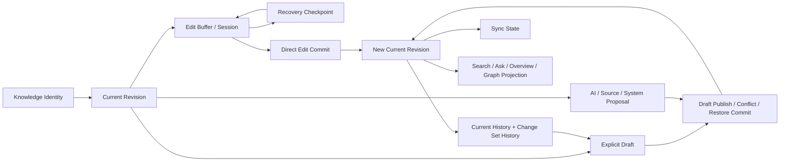
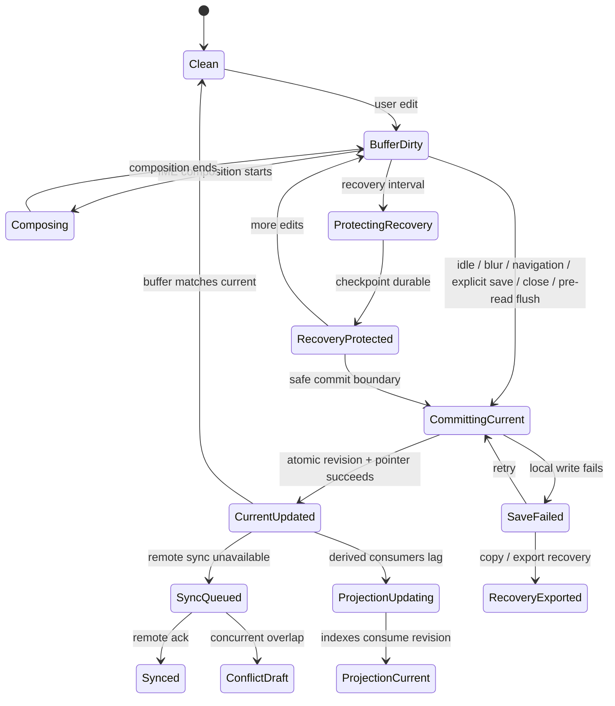

# AI-native 个人知识库

## 直接创作、编辑作用域与版本历史合同 v1.0 — Current、Draft、Suggestion、Conflict、Recovery 与长期可写知识

> 文档日期：2026-08-06  
> 文档性质：终局产品本体、交互、状态与验收合同；不是富文本编辑器控件清单、技术选型、协作白板方案或原型授权  
> Canonical 产品定义：`AI-native-个人知识库-终局产品设计文档-v4.0.md`；本合同只证明创作、编辑与版本责任，不得反向改写 v4.0  
> 2026-08-07 写入冻结：Edit Buffer、Recovery Checkpoint、Current Revision、Explicit Draft、Proposal、Sync 与 Projection 是独立责任；普通直接写作经安全 `Direct Edit Commit` 更新 current，不存在 Working-first 或“完成并采用”  
> v4.0 连续写作覆写：Knowledge Editor 默认是一篇连续 Paper；Block 边界只在编辑、选择或精确引用时出现，Section / Inline Claim 不按标题、长度或检索 chunk 自动拆成 Knowledge，AI 写回使用可检查的 block-level patch  
> v4.0 Relation 写入覆写：用户直接选择 endpoints、校正完整 relation statement 并本地保存后，默认成为 maintained current Relation；AI / 系统 / 来源推断保持独立 RelationCandidate。方向、类型或核心 Applicability 实质改义时使用新 Revision 或 successor Relation，不静默改 edge  
> v4.0 Query 写回覆写：Saved Answer 只保存历史；由 AI Answer 形成新 Knowledge 时只处理用户选择的 Claims 并先进入可编辑 draft / proposal；合入已有 Knowledge 必须是目标 Section / Anchor 的 block-level patch，不粘贴整段聊天  
> v4.0 Scope 写入覆写：Group Boundary Revision、Knowledge Placement、Source Attachment 与 Topic transformation 分开提交；Group root 是合法 Placement target；跨群 Topic transfer、merge / split 与 identity-changing Boundary 改写属于高影响结构 Change Set  
> 2026-08-09 First-write 覆写：空 Library 可直接进入连续编辑，先产生有意义内容、再按需选择新建 Group / 既有 Group 或暂不归类；位置选择不阻断开始。新 Group + Knowledge + Placement 作为同一事务独立结算；Placement 失败回退 Unplaced，Group 成功但正文失败保留 Recovery。完整规则见`AI-native-个人知识库-首日到日常核心旅程合同-v1.0.md`  
> 2026-08-10 Relation Lifecycle 覆写：Evidence 更新不创建 RelationRevision；Maintain / Revise / End / Supersede / Retract / Defer 与 Archive 分开；Node / Group Split / Merge 不复制或静默 remap Relations。完整合同见`AI-native-个人知识库-关系陈述生命周期与网络可信性合同-v1.0.md`  
> 历史深层模型：`AI-native-个人知识库-产品定义-v3.0.md`  
> 相邻合同：`AI-native-个人知识库-知识节点粒度与内容组成合同-v1.0.md`、`AI-native-个人知识库-知识形成与维护循环-v1.0.md`、`AI-native-个人知识库-Overview形成编辑与更新合同-v1.0.md`、`AI-native-个人知识库-知识群边界与跨群架构合同-v1.0.md`、`AI-native-个人知识库-属性Facet与适用条件合同-v1.0.md`、`AI-native-个人知识库-产品对象层级与身份治理合同-v1.0.md`、`AI-native-个人知识库-关系陈述生命周期与网络可信性合同-v1.0.md`  
> 核心问题：用户怎样在不依赖 Source 或 AI 的情况下亲手建设知识，并确信每次输入已安全保存、每次正式修订有明确边界、每次跨语境编辑影响可知、每次冲突和恢复都不丢失历史

---

# 0. 执行决定

本轮冻结六十五项产品决定。

1. **Direct Authoring 是知识库的主路径，不是 AI 不可用时的降级路径。** 用户可以空手创建 Group、Topic、Node、Overview 与 Relation；任何核心知识对象都不能要求先导入 Source 或先生成 AI 内容。
2. **输入成功、本地持久化与同步成功是三个不同事实。** 按键已经进入编辑状态，不代表已经持久化；但用户直接创建或修改的内容一旦本地持久化成功，默认就更新当前知识，不再要求额外采用。
3. **Node identity、编辑现场与内容 standing 永久分开。** Node 是 Primary Resource；Current Revision、Explicit Draft 与 Proposal 是 Supporting Identities；Edit Buffer / Edit Session、Recovery、Sync 与 Projection 分属运行时或支持记录。对象不能整体被粗暴标成 Draft 或 Current。
4. **现有 `draft / accepted / superseded / archived` 单一 lifecycle 被拆解。** Object Lifecycle、Identity Standing、Current Revision pointer、Edit Buffer、Recovery、Explicit Draft、Proposal、Epistemic、Freshness、Availability、Sync 与 Projection 分开保存。
5. **Current Content Revision 不可变。** 安全 Direct Edit Commit、显式 Draft 发布、Proposal 确认、冲突解决或历史恢复向前创建 Revision，并把 `current_revision_ref` 指向它；旧 Revision永不被原地覆盖。
6. **Draft Branch 只在显式草稿、冲突、恢复或需要 staging 的 AI Patch 中建立。** 它基于明确 Base Revision，自动保存只推进 Draft Checkpoint；普通无冲突的用户编辑直接推进当前版本，已完成 review 的结构化 Patch 可直接 commit。
7. **Edit Session 是短期交互状态，不是知识历史。** selection、cursor、scroll、fold、IME composition 与 session undo 可以恢复工作现场，但不成为长期知识对象。
8. **自动保存默认先落本地。** 网络、云模型、连接器或同步服务不可用时，用户仍可继续输入、关闭和重开应用，并从最近 durable checkpoint 恢复。
9. **自动保存失败必须显式且持续可见。** 磁盘写入失败、权限变化、空间不足或数据库不可写时，产品不能继续显示安静的“已保存”；必须提供复制、导出恢复包和重试。
10. **进入编辑不是进入 CMS 后台。** 阅读与编辑使用同一棵连续 Content Tree；Block handle、结构边界和属性工具只在 hover、focus、selection、键盘命令或结构模式中出现。
11. **编辑一开始就说明作用域。** Canonical Edit、Contextual Edit、Fork as New Node、Structure Edit 与 Historical Read-only 使用不同标题和影响说明，不能只靠入口位置猜测。
12. **从 Node 主正文进入默认 Canonical Edit。** 修改会影响所有 Placements、引用当前内容的 Live excerpts、Search、Ask 与相关 Overview；开始编辑时必须用一句人话说明。
13. **从 Topic 中的局部摘要进入默认 Contextual Edit。** 它只改变当前 Placement 的标题替代、局部摘要、顺序或强调，不修改 canonical Node 内容。
14. **Fork 必须创建新 identity。** Fork 继承可选择的内容、Sources 与 Applicability，并保存 identity lineage；它不是复制后假装仍是同一 Node。
15. **用户直接编辑在本地持久化后产生当前 Revision。** 版本按一次连续编辑会话合并，不按字符增生；用户只在显式选择“作为草稿继续”时保留 Draft Branch。
16. **Current 不等于有证据、正确或最新。** Current 只表示“这是用户当前让知识库使用的版本”；Epistemic、Freshness、Availability 和 Applicability 继续独立表达。
17. **用户直接操作可以是提交意图。** 新建 Relation、移动 Placement、重排 Topic 等离散动作在作用范围清楚且可撤销时可立即形成 Current Change Set；后台推断和 AI 建议永远不能借此静默提交。
18. **文本写作与结构写入使用不同提交节奏。** 连续用户输入先耐久保存，再按编辑会话形成当前 Revision；一次明确的拖动、选择或确认可以立即提交局部结构变化；跨对象高影响变化先进入 Preview。
19. **Undo、Current History、Explicit Draft、Recovery 与 Change Set History 是五套不同能力。** 它们分别回答“撤销刚才操作”“当前知识怎样演化”“继续主动保留的草稿”“找回尚未提交但被本机保护的内容”“理解一次多对象变化”。
20. **Undo 不能承担长期恢复。** Session Undo 只覆盖当前编辑线和合理的重开窗口；清空 Undo 不删除 Current Revision、Recovery Checkpoint 或 Change Set 历史。
21. **恢复历史版本默认先形成只读比较与 Recovery Draft。** 用户选择全部或局部 Blocks 后，以 forward restore commit 生成新的 Current Revision；不能移动旧 pointer 或让中间历史消失。
22. **Recovery Snapshot 不是 Backup。** 它保护近期误删、损坏和未完成编辑；完整备份还必须覆盖 identities、Relations、Placements、Sources、Indexes 配置和可验证恢复。
23. **历史 Revision 默认只读。** 用户可以引用、比较、复制、作为新 Branch 起点或 Fork；不能在历史页面上直接输入并误以为改了当前版本。
24. **恢复可以精确到 Block。** 用户不必为了找回一句话覆盖整篇当前内容；恢复预览显示目标位置、Anchor、Evidence、引用和结构影响。
25. **后台 AI 对既有知识只能提出 Patch。** Patch 说明 Base Revision、增加、删除、替换、移动、support、Applicability 与影响；不得整篇重生成覆盖 current prose。
26. **AI Patch 与用户当前编辑会话分开。** 用户可以逐块接受、修改或拒绝；AI 建议过期时先 rebase / compare，不把旧 Base 上的文本静默应用到新内容。
27. **Inline AI completion 在用户接受前只是临时候选。** 它不进入 Recovery、Search、Ask、History 或导出；接受后成为用户 Edit Buffer 的普通编辑，并随下一次 Direct Edit Commit 进入 current，不再二次采用。
28. **粘贴内容不能暗中改变身份或所有权。** 普通粘贴生成新的 Blocks；从本产品对象粘贴时显式选择 Link、Live、Pinned 或 Quote；从 Source Reader 粘贴时可以携带 Citation，但不自动形成 Current Claim。
29. **Heading 不等于 Topic，Block 不等于 Node。** 大纲只组织当前 Content Revision；只有用户执行“成为独立知识”或结构操作，才创建新 identity 或 Topic。
30. **Block identity 在合理编辑中保持稳定。** 普通改字、换格式、移动同一 Block 不创建新 Block identity；Split、Merge、重写和跨 Node 移动需要 redirect / lineage。
31. **Anchor 修复与内容编辑一起计算。** 每次 Current Revision 都映射旧 Blocks 和 Anchors 为 resolved、redirected、ambiguous 或 orphaned，并记录 Evidence、Links 与 Saved Answer 影响。
32. **并发编辑不能采用不可见的 last-write-wins。** 多设备、后台 AI、同步与恢复发生重叠时，所有竞争内容都必须可找回；自动合并只用于确定不冲突的变化。
33. **冲突至少分为内容、结构、属性、删除对编辑、作用域和身份六类。** 统一“有冲突”无法给出正确修复动作。
34. **冲突解决使用共同 Base、当前 Buffer / Draft、另一 Branch 和合并结果。** 用户可以逐 Block 或逐字段选择，并在提交前看到对下游对象的影响。
35. **解决冲突先得到 Draft Result。** 冲突消失不等于已选定当前内容；用户确认合并结果后，才推进当前 Revision。
36. **离线不是只读模式。** 本地已拥有的 Nodes、Overviews、Topics、Placements 与 Relations 可完整编辑；依赖网络的 Embed、Source fetch、云 AI 和权限操作明确降级。
37. **重连时不阻断写作。** 同步和 merge 在后台进行；只有同一语义位置产生无法安全判断的竞争变化时，才要求用户处理。
38. **Group / Topic 创建不要求模板。** Group 第一步只需名称或一条边界句；Topic 只需名称和直接父级；类型、结构与 Sources 均可稍后补充。
39. **空 Group、无 Placement Node 与显式 Draft Node 都是合法状态。** 它们可从不同 Library 动态视图找回，但不进入高压 Inbox，也不被显示为失败或低质量。
40. **Section Promotion 与 Node Split / Merge 是 identity operation。** 它们拥有独立 Preview、redirect、Evidence、Placement、Relation、Overview、Search 与 Answer 影响，不能藏在普通 Cut / Paste 中。
41. **Relation Editor 不因拖线而跳过语义。** 起点、终点、类型、方向、Applicability 和必要依据需明确；拖线只预填 endpoints。
42. **Overview 的 Editorial 与 Projection 保持不同编辑语义。** 用户直接编辑 Editorial prose 经 Direct Edit Commit 更新 current；Projection 只编辑规则和展示；Projection result 不能被手工改成影子 current truth。
43. **批量编辑按用户意图成组。** 批量移动、标签替换、状态调整、关系修订或导入清理形成一个可预览 Change Set，并允许部分提交、部分撤销和失败隔离。
44. **编辑恢复必须保留现场。** 重开 Buffer、Explicit Draft 或 Conflict Draft 时恢复 Node、Placement context、cursor / selection、scroll、outline、open panels、Edit Scope 与未处理 Patch / Conflict。
45. **编辑器的默认视觉服务连续思考。** 正文和层级阅读采用方向 3 的纵向深度，关系、作用域和影响使用方向 2 的空间语境；不把两者压成同时常驻的复杂控制台。
46. **质量以不丢失、不误提交和可恢复衡量。** 核心指标不是字符数、Block 数、AI 改写接受率、编辑时长或“每天创建知识数”。
47. **所有状态必须可由键盘和辅助技术理解。** Buffer dirty / Recovery protected / Current updated / Draft / Proposal / Sync / Projection / Conflict / Offline / Read-only history 不能只用颜色或动画；Toolbar、Block actions、Diff 与 Focus 顺序拥有等价键盘路径。
48. **本合同不授权原型或视觉实现。** 在状态轴拆分、完成语义、冲突、恢复和 AI Patch 被用户确认前，不用漂亮编辑器界面掩盖产品定义缺口。
49. **Boundary Revision 只修改范围意图。** rename / clarification 可以直接保存 revision；根本替换 governing question 进入 successor / split / merge 预览，任何 Boundary edit 都不自动迁移 Topics、Placements 或 Attachments。
50. **Group root 是合法 Placement target。** 用户可选择`直接放在这个知识群`，无需创建占位 Topic；root Placement 与 Unplaced 必须可区分。
51. **Source Attachment 是独立结构写入。** 从 Group / Topic 添加 Source 时保存 exact target；detach 不删除 Source、Evidence 或 Knowledge，也不由 Binding 反推存在。
52. **Topic rename / move 与 merge / split / transfer 使用不同提交级别。** 同 Group低风险 rename / move 可直接提交并 Undo；merge / split / cross-group transfer 必须有 impact preview、redirect / successor、原子失败与恢复。
53. **结构 Change Set 维护返回连续性。** Topic transform 后，Reading Path、Saved Path、Search result、Source Attachment 和 historical Overview 必须解析到新 target、候选选择或历史只读状态，不可断链或复用旧 ID。
54. **Edit Buffer 不是持久化事实。** 它可以包含 cursor、selection、IME composition、dirty text 与 session undo；任何默认知识读取都不能直接绕过 commit 读取它。
55. **Recovery Checkpoint 不是 Current Revision。** 它可高频保护未完成输入和现场，默认 device-local，不进入普通 History、Search、Ask、Overview 或 Graph。
56. **Direct Edit Commit 只在安全边界发生。** active IME composition、尚未完成的结构拖拽和无效属性值不能被自动提交；idle、blur、导航、正常关闭、保存快捷键与读前 flush 可以触发。
57. **Current Revision 与同步正交。** 离线本地提交成功后 current 已成立；sync queued、synced 与 conflict 不能倒推内容是否 current。
58. **Current Revision 与 Projection 正交。** 索引、Overview、Graph 或 embedding 刷新失败不得回滚 commit；owner 立即读取 current，Search / Ask 优先读取 local delta 或诚实说明延迟。
59. **Explicit Draft 只能由用户意图或异常分流创建。** 正常停顿、关闭或 app background 不得把普通写作自动变成 Draft。
60. **新 Knowledge 的 first meaningful commit 创建稳定 identity。** 完全空白退出不建对象；title-only 对 Question / Concept 合法；恢复保护可以先于 identity，但不能制造 Untitled 垃圾。
61. **从编辑器发起 Ask 先 flush current。** commit 失败时不得静默使用 Buffer；仅在用户明确选择后，未提交文字可成为本次临时 Query Basis。
62. **结构化 Proposal 的确认可以直接原子提交。** 当用户已经看完 Base、Diff、支持与影响，确认本身就是 commit intent；不能再要求一次“完成并采用”。
63. **正常关闭必须先 flush Direct Edit Commit。** 成功则无对话关闭；失败则保持可恢复现场并提供复制、导出与重试，不得把失败伪装成已保存。
64. **多窗口和多设备都以 Base Revision 参与合并。** 非重叠变化可自动合并；重叠变化进入 Conflict Draft，不使用不可见 LWW。
65. **用户可见状态使用一组互斥而可组合的人话。** `正在保存… / 已更新当前知识 / 等待同步 / 已同步 / 已保存为草稿 / 建议尚未改变当前知识 / 近期修改已在本机保护 / 最近修改尚未安全保存`不能收缩成一个绿色 Saved。

---

# 1. 当前规格中的十六个结构缺口

## 1.1 `draft / accepted / superseded / archived` 混合了四类事实

`draft` 说明是否存在当前接受版本，`accepted` 说明用户采用，`superseded` 说明 identity 或结论已被替代，`archived` 说明对象退出默认浏览。它们不能放在同一个 lifecycle 枚举里，否则一个“已接受但已归档、且另有未完成修订”的 Node 无法表达。

## 1.2 Working Copy 只有一句“自动保存”

现有文档没有回答 Working Copy 是否拥有 identity、基于哪个 Revision、何时 durable、关闭应用后如何恢复、被另一设备改动后如何处理，也没有区分用户 Branch 与 AI Proposal Branch。

## 1.3 “保存”和“接受”缺少可感知边界

如果工具栏只显示 `Saved`，用户不知道它表示已写入本地、已同步、已创建历史版本，还是已进入 Ask 的默认知识。这个歧义会直接污染 Query 和 Overview。

## 1.4 Current Revision 的提交时机没有产品合同

每次按键、每次 auto-save、离开页面、点击完成或后台定时都可能成为 Revision。若不冻结语义，历史会过密、过稀或与用户意图无关。

## 1.5 Undo、History、Recovery 和 Backup 互相代替

当前文档提到撤销、版本和备份，却没有说明四者的覆盖范围、保留时间、是否跨设备、是否包含未完成内容，以及恢复是否改变当前知识。

## 1.6 编辑作用域只是一条 Banner

Canonical、Contextual 与 Fork 已被命名，但没有定义切换时 Buffer / Draft 如何迁移、已有改动怎样处理、影响范围如何计算、在多 Placement 中怎样返回。

## 1.7 AI Patch 只有“block-level”口号

缺少 Base Revision、Patch 生命周期、stale / rebase、部分接受、用户再编辑、来源支持、拒绝历史和失败恢复，实际实现仍可能退化成整篇替换。

## 1.8 并发仍被假设为未来协作问题

即使单用户，本地设备、移动端、后台解析、AI Patch、同步和恢复都可能产生并发。没有 branch 与 merge 合同，last-write-wins 会在“个人产品”里同样丢数据。

## 1.9 Block identity 与编辑操作的关系不清楚

稳定 Anchor 已定义，但普通重排、复制、拆段、合并、格式转换和粘贴分别是否保留 Block identity 没有规则。Evidence 和 deep link 会因此漂移。

## 1.10 Paste / Import / Embed 仍可能绕过知识边界

从网页、Source Reader、另一个 Node 或外部编辑器粘贴时，内容的格式、身份、引用、来源和同步语义不同；若统一为 rich paste，容易复制知识或伪造出处。

## 1.11 历史恢复可能静默覆盖当前内容

“Restore previous version”如果直接移动 current pointer，后来完成的知识、Anchors 与下游引用可能一起消失。需要默认 Branch + Diff，而不是时间倒流。

## 1.12 离线编辑只被写成能力清单

缺少 durable checkpoint、queued changes、remote changes、network-dependent blocks、storage failure 与 reconnect merge 的完整状态；“支持离线”无法验收。

## 1.13 Direct Authoring 仍然偏向创建 Node

一个完整知识库还要直接创建 Group 边界、Topic 结构、Placement、Relation、Overview 和局部 Applicability。它们不能都被迫通过 Node Editor 或 AI Suggestion 完成。

## 1.14 普通结构动作和高影响身份动作没有提交分层

重排同级 Topic 与把 Topic 提升为 Group 的风险完全不同；普通拖动若每次打开巨大 Preview 会破坏流畅，高影响动作若只给 Toast 又会伤害 identity。

## 1.15 编辑器状态没有与 Ask / Search 默认集合对齐

用户正在写的内容是否能被 Search 找到、是否被 Ask 当作事实、是否进入 Overview Projection、是否显示在 Atlas，没有统一答案。Current、Explicit Draft 与 Recovery 必须使用不同读取规则；可恢复不等于可作为知识使用。

## 1.16 没有直接创作的反指标

如果团队优化日新增 Node、Block 数、AI 改写率、平均正文长度或完成率，产品会迫使用户碎片化、过早接受和过度整理，而不是保护真实思考。

---

# 2. 产品目标与非目标

## 2.1 终局目标

1. 用户可以不依赖 Source、AI、模板或既有 Group，立即开始写作；
2. 每次输入都能区分 Edit Buffer、Recovery protection、Current Revision、同步和派生刷新；
3. 用户可以同时保留 current knowledge、显式 Draft、Proposal 与 Recovery state；
4. 用户可以从任何历史、冲突或损坏状态恢复，而不删除后来历史；
5. canonical、contextual、fork 与 structure edits 的影响在提交前可理解；
6. AI、离线、多设备和后台任务不会静默覆盖用户内容；
7. Editor 保持连续 Knowledge Paper，同时支持精确结构、关系、证据和历史。

## 2.2 非目标

1. 不把产品做成通用文档排版、桌面出版或专业代码 IDE；
2. 不以实时多人协作为产品本体，但数据模型不能因多设备并发而丢失内容；
3. 不用 Git、CRDT、DOM、transaction 或 revision hash 作为普通用户语言；
4. 不要求每次短编辑都通过审批流，也不允许后台变化静默提交；
5. 不让 Slash menu、Block handle 或 AI toolbar 占据默认阅读界面；
6. 不把普通直接写作强迫进入 Draft / Publish 审批，也不把显式 Draft 自动转为 current 以追求“完成率”；
7. 不把 Recovery Snapshot 冒充完整 Backup。

---

# 3. 八层创作与版本模型

## 3.1 Layer 1：Knowledge Identity

Node、Overview、Group、Topic、Relation 与 Placement 各自保持稳定 identity。内容改写不创建新 identity；Split、Merge、Promotion、Absorb 与 Fork 才进入 identity operation。

## 3.2 Layer 2：Edit Buffer / Edit Session

当前设备上的 dirty content、cursor、selection、scroll、fold、IME composition、viewport、tool state 与 short undo line。它可以被 Recovery 保护，但在 commit 前不是真正的 current knowledge。

## 3.3 Layer 3：Recovery Checkpoint

为 crash、异常关闭、误操作和写入中断保存的近期本机快照。它可以包含未完成 composition 或尚未通过验证的编辑现场，默认 device-local，不参与 Search、Ask、Overview、Graph 和普通 Version History。

## 3.4 Layer 4：Current Revision

当前被知识库默认阅读、查询和投影使用的不可变内容版本。一个对象最多只有一个 `current_revision_ref`；正常用户写作经 Direct Edit Commit 更新它，不经过发布审批。

## 3.5 Layer 5：Explicit Draft / Proposal

Explicit Draft 是用户明确选择暂不影响 current 的修改线，也承载 conflict / restore 结果；Proposal 是 AI、来源重编译或系统维护提出的候选变化。二者都基于确定 Base Revision，但只有用户意图能够让它们进入 current。

## 3.6 Layer 6：Direct Edit Commit / Decision Change Set

Direct Edit Commit 是单一 owner 的普通写作原子提交；Decision Change Set 是用户一次明确意图改变多个 identity、relation、scope 或结构对象的集合。前者安静发生，后者先预览影响，两者都向前创建 immutable Revision。

## 3.7 Layer 7：History / Undo

Current Revision History、Explicit Draft checkpoints、Recovery Checkpoints、Session Undo 与 multi-object Change Set History 各自保留。用户可见 History 可以把多个低层 direct commits 合并成一次可理解 edit session，但恢复永远向前创建新 Revision。

## 3.8 Layer 8：Sync / Projection

Sync 说明 current 是否已传播到其他设备；Projection 说明 Search index、Overview、Graph、embedding 与 derived views 是否已消费 current。两者可以延迟或失败，但都不能改变哪个 Revision 是 current。

## 3.9 模型关系



---

# 4. 正交状态模型

## 4.1 Knowledge Object

```text
KnowledgeObject
  object_id
  object_type
  object_lifecycle: active | archived | trashed | tombstoned
  identity_standing: canonical | superseded | merged_redirect | split_redirect
  current_revision_ref?
  explicit_draft_refs[]
  proposal_branch_refs[]
  epistemic_state?
  freshness_state?
  availability_state?
```

`draft` 不再是 `object_lifecycle`。无 `current_revision_ref` 只可能出现在 transient creation shell、恢复未确认状态或显式 Draft-only 对象；有 Current Revision 且另有 Draft 时，用户看到`当前知识仍是上一个版本；另有一份草稿`。

## 4.2 Content Revision

```text
ContentRevision
  revision_id
  object_ref
  parent_revision_refs[]
  content_tree
  metadata_snapshot
  applicability_snapshot?
  committed_by
  committed_at
  commit_kind: user_direct | explicit_draft_publish | proposal_accept | conflict_resolution | restore | structure_change
  change_set_ref
  content_digest
```

Content Revision 一旦创建即只读。`current` 或 `historical` 不存成可漂移字段，而由对象 current pointer 推导。

## 4.2.1 Edit Buffer 与 Recovery Checkpoint

```text
EditBuffer
  session_id
  object_ref?
  base_revision_ref?
  dirty_content_tree
  composition_state
  cursor_selection_scroll
  validation_errors[]

RecoveryCheckpoint
  checkpoint_id
  session_ref
  object_ref?
  base_revision_ref?
  protected_content_tree
  protected_workspace_state
  device_ref
  created_at
  protection_state: durable | failed | superseded | recovered
```

Checkpoint 可以保护尚未成为 current 的 Buffer，不能被 Search / Ask / Overview / Graph 作为 canonical input。恢复进入 Buffer 或 Recovery Draft，由用户检查和后续 commit，不会在 app 重启时偷偷推进 pointer。

## 4.2.2 Direct Edit Commit

```text
DirectEditCommit
  commit_id
  object_ref
  base_revision_ref?
  result_revision_ref
  trigger: idle | blur | navigation | explicit_save | normal_close | pre_read_flush
  edit_session_ref
  committed_at
  projection_jobs[]
  sync_state_ref
```

Direct Edit Commit 必须是本地原子事务：revision 与 current pointer 同时成立或同时失败。索引、Overview、Graph、embedding 与远端同步在事务之后消费 event；它们失败只改变传播状态，不回滚 commit。

## 4.3 Explicit Draft Branch

```text
ExplicitDraftBranch
  branch_id
  object_ref
  base_revision_ref?
  branch_kind: user_explicit_draft | recovery | conflict_resolution | imported_draft
  created_at
  last_local_checkpoint_at
  last_synced_checkpoint_at?
  draft_content_tree
  draft_metadata
  edit_scope
  branch_state: open | conflict | ready | abandoned | committed
  pending_patch_refs[]
```

正常用户写作不创建 Branch。只有显式草稿、恢复、冲突或导入 staging 才创建它；同一设备默认只突出一条 active draft，但其他设备、恢复或冲突 Branch 仍可存在并被列出。

## 4.4 Proposal Branch

```text
ProposalBranch
  proposal_id
  object_ref
  base_revision_ref
  proposer: ai | source_update | maintenance_rule | conflict_merge
  patch_operations[]
  support_refs[]
  applicability_delta?
  impact_summary
  proposal_state: fresh | stale | rebased | partially_applied | rejected | withdrawn
  created_at
```

Proposal 不能自己成为 current。Inline 建议被接受后进入 Edit Buffer，随下一次 Direct Edit Commit 更新 current；结构化 Patch 已完成 diff review 时，接受动作本身可以原子创建 Current Revision，不再要求第二次完成。

## 4.5 Edit Session

```text
EditSession
  session_id
  object_ref
  base_revision_ref?
  explicit_draft_ref?
  device_ref
  selection
  cursor
  scroll
  outline_state
  open_panels[]
  composition_state?
  undo_head
  last_active_at
```

## 4.6 Edit Scope

```text
EditScope
  mode: canonical | contextual | fork | structure | overview_projection_rule
  target_ref
  placement_context?
  affected_scope_refs[]
  current_impact_level: local | multi_placement | multi_object | identity_change
```

## 4.7 七组不能互换的状态

| 用户问题 | 状态来源 | 示例 |
|---|---|---|
| 这段输入在编辑器里吗？ | buffer state | clean / dirty / composing |
| 异常退出后能找回吗？ | recovery state | unprotected / checkpoint protected / recovery failed |
| 哪个版本是当前知识？ | Current pointer | no current / current revision |
| 这个对象还在日常使用吗？ | object lifecycle | active / archived / trashed |
| 这条知识成立得怎样？ | epistemic + freshness + availability | contested / review due / source degraded |
| 有别的版本在竞争吗？ | branch / conflict state | remote changes / conflict / stale proposal |
| 已传播到哪里？ | sync + projection | sync queued / synced / index updating / projection failed |

---

# 5. 创建与首次成为当前知识

## 5.1 空白编辑缓冲区与对象创建

打开“写一个知识”时先创建可恢复的 local buffer。用户输入第一个有意义字符、粘贴内容或明确命名后，系统创建稳定 `node_id`；首次本地持久化成功后即成为当前知识。只有用户显式选择草稿时才创建 Draft Branch。完全空白且从未输入的 buffer 可以在退出后消失，不制造 Untitled 垃圾。

## 5.2 最小必需输入

创建 Node 只要求正文或标题至少一个非空。Node type 默认 General；title 可以暂时由首个 Heading 或首句投影，但必须标明为临时标题，不能让 AI 推测悄悄改名。

Group 只要求名称或边界句至少一个非空；Topic 只要求名称和直接 parent；Relation 需要合法 endpoints、类型与方向；Overview identity 随合法 Scope 创建，不要求先写满模板。

## 5.3 快速记录

全局快速记录：

```text
open buffer
  → type / paste
  → Recovery Checkpoint protects the session
  → create user-authored Node identity
  → after meaningful input, optionally choose new / existing Placement or Unplaced
  → Direct Edit Commit at a safe boundary
  → current knowledge by default; optionally keep as Draft
```

无 Placement 的 Node 出现在 Library 的“未归类”视图中；显式 Draft 另外出现在“草稿”视图。两者都不是 Review item，不显示逾期。

首次写作不得用“先选知识群”阻断空白输入。用户开始形成内容后，位置提示才按需出现：`新建知识群 / 放入已有知识群或主题 / 暂不归类`。新 Group 只要求名称；标题、类型、边界与 Topic 均可稍后补。新 Group、Current Revision 与 Placement 在同一用户动作中保持独立写入结果：Placement 失败时 Knowledge 回到未归类；Group 成功但正文提交失败时保留 Group 与 Recovery Checkpoint，并清楚说明 current 尚未更新。

## 5.4 在 Group / Topic 中创建

创建入口继承当前 Placement context，但不强迫继承所有 Group 属性。用户看到“将出现在：认知科学 / 记忆模型”；可以改为稍后归类。保存 canonical body 和创建 Placement 是同一 Change Set 中可独立失败、可独立重试的操作。

## 5.5 从选区创建

选中完整 Section 后选择“成为独立知识”：

1. 预览新 Node identity、title、type 与 Applicability；
2. 选择原处保留 Link、Live excerpt、Pinned excerpt 或 Explicit quote；
3. 映射 Evidence、References 与 Anchors；
4. 选择 Placements；
5. 预览 Overview、Relation、Search 与 Answer 影响；
6. 提交 identity Change Set。

普通剪切到新页面不等于 Section Promotion。

## 5.6 首次 Direct Edit Commit

用户首次有意义输入完成 composition，并在安全边界原子提交成功时：

- 创建第一个 immutable Current Revision；
- 对象仍为 `object_lifecycle = active`；
- Search 可立即找到它；
- Ask 默认使用 Current Revision；
- Overview Projection、Atlas 与正式 Relations 才能按各自规则使用该对象；
- Recovery buffer 按版本会话保留必要 lineage，不作为第二份正文。

## 5.7 空内容与误触

完全空 buffer 不创建 Node。只有标题、没有正文的 Node 可以合法保存，但必须对类型提供合理解释，例如 Question、Entity 或入口型 Concept；产品不显示字符数警告，只说明“当前只有标题”。

---

# 6. 连续编辑、恢复保护与 Current Commit

## 6.1 编辑进入

从阅读态进入编辑态时保持：

- 当前 Node 与 Placement；
- scroll 与 selection；
- Reading Depth；
- Outline 展开；
- Context Rail 当前 tab；
- Evidence / Relation Inspector 返回栈。

编辑态在正文上方以一句话显示：

> 正在修改这条知识；本机提交后会影响它出现的所有位置。

Contextual Edit 则显示：

> 只修改它在「AI Agent 产品设计 / 知识模型」中的说明和位置。

## 6.2 Persistence 状态机



`Composing` 期间禁止 Direct Edit Commit。Recovery 可以保护 composition，但恢复后仍回到 Buffer；只有 composition 结束、内容验证通过并到达安全边界才更新 current。属性编辑若某个字段无效，可以让该字段留在 Buffer，同时对互不依赖的合法正文形成独立 commit；不能把无效值混入 Revision。

## 6.3 自动保存的可观察承诺

- 用户输入期间可以更频繁地产生 Recovery Checkpoint；它只承诺异常后可恢复，不承诺已进入 current；
- composition 结束并短暂停顿、blur、切换对象或模式、显式保存、导航、正常关闭与读前 flush 触发 Direct Edit Commit；
- 应用进入后台先尝试 commit；若操作系统只允许短暂执行，至少完成 Recovery protection，并在恢复后明确 current 边界；
- status 只在状态变化、延迟异常或失败时提高视觉优先级；
- `正在保存…`、`近期修改已在本机保护`、`已更新当前知识`、`等待同步`、`已同步`和`索引正在更新`使用不同文案；
- 任何未持久化内容在关闭前触发阻断或提供 recovery copy。

具体毫秒阈值属于性能验证，不写死为产品真理；验收要求在目标设备和大文档中证明不会丢失正常输入窗口。

## 6.4 离开编辑器

Direct Edit Commit 成功后，用户可直接离开，不弹出传统“是否保存”对话。正常 Close / Back 必须先 flush；只有以下情况要求处理：

- 本地写入失败：持续保留内存内容，提供复制、恢复导出与重试；
- 显式 Draft：保留草稿并可继续，不更新当前知识；
- 冲突或高影响变更：保留 Base 与所有候选，不在离开时默认选择。

## 6.5 当前版本的会话合并

一次连续编辑会话完成或到达合理 checkpoint 时：

1. 等待 IME composition 结束并 flush 最新合法输入；
2. 比较 Base 与 current Revision；
3. 发现非重叠变化时自动 rebase；
4. 发现重叠变化时进入 Conflict Draft，不默认选一份；
5. 计算 Block / Anchor maps 与受影响投影；
6. 以一个或多个低层 Direct Edit Commits 创建 immutable Current Revision，并在用户可见 History 中按 edit session 分组；
7. 保持当前位置、Undo 与返回路径。

## 6.6 Draft 内容的系统可见性

| 能力 | 默认是否使用 Draft |
|---|---:|
| Library 找回 | 是，单独标明草稿 |
| Search 定位 | 是，标明 Draft match |
| Find in Current Object | 是 |
| Ask 事实回答 | 否，除非用户显式包含 |
| Overview Projection | 否 |
| Atlas / formal Relation | 否 |
| AI 编辑当前 Branch | 仅在用户发起且说明范围时 |
| Export complete package | 是 |
| 普通阅读导出 | 默认 Current，可选择 Explicit Draft |

## 6.7 编辑失败

存储不可写时：

- 停止显示“已保存”；
- 不清空 editor state；
- 固定显示未保存范围与最后 durable checkpoint 时间；
- 允许复制全部 Buffer / Draft content、下载 recovery package、另存到可写位置；
- 问题解决后先验证写入再隐藏警告；
- 不因重试失败自动关闭或切换为只读。

---

# 7. 编辑作用域

## 7.1 Canonical Edit

改变 Node title、canonical content tree、Node-level Applicability、current status notes 与需要跨 Placements 一致的核心定义。影响计算至少覆盖：

- 所有 Placements；
- Live excerpts；
- Evidence Bindings 和 Anchors；
- Semantic Relations 的 statement support；
- Overview Support Map / Alignment；
- Saved Answers affected state；
- Search snippets 与 aliases。

普通文案修改可在完成时直接提交；删除高引用 Section、改变 Applicability 或 orphan Anchors 时提升为 Impact Preview。

## 7.2 Contextual Edit

只改变 Placement 语境：

```text
PlacementContext
  local_title_override?
  contextual_summary?
  local_orientation?
  semantic_order?
  local_visibility?
  entry_reason?
```

Contextual summary 不能藏入需要 Evidence、正式 Relation 或跨 Scope 复用的 Claim。系统发现候选时建议保存为 canonical Node 或新 Node，不自动提升。

## 7.3 Fork as New Node

Fork Preview 让用户选择：

- 从哪个 Current Revision / Explicit Draft 起步；
- 复制哪些 Blocks、Evidence Bindings、Sources、Applicability 与 Placements；
- 原 Node 与新 Node 是否需要 `revises`、`contrasts_with` 等正式 Relation，或只保留 identity lineage；
- 当前 Placement move、share 还是继续指向原 Node；
- Pinned / Live / Quote 如何处理。

Identity lineage 不自动显示为 Semantic Relation；只有确有知识语义时才另建 Relation。

## 7.4 Structure Edit

Topic rename、同级 reorder、indent / outdent、Placement add / remove、局部 Group order 等离散用户动作可以立即提交，并提供 Undo。以下动作必须进入独立 Preview：

- Topic Promotion；
- Group Absorb / Split / Merge；
- 删除有历史路径的 Topic；
- 批量迁移 Placements；
- 改变 Group boundary；
- 可能产生 orphaned Overview / Saved Path 的结构调整。

## 7.5 切换作用域

Buffer 或 Explicit Draft 已有修改时切换 scope：

1. 显示当前改动属于哪个 scope；
2. 允许保留为当前 Branch、把可合法部分迁移到新 scope、或放弃；
3. 不能把 Contextual Summary 整段静默升级为 canonical body；
4. Fork 迁移后保留原 Branch，直到新 identity 成功创建；
5. 失败时当前内容和 selection 不丢失。

## 7.6 作用域语言

默认不用 canonical / contextual：

| 内部状态 | 用户文案 |
|---|---|
| canonical | 修改这条知识；会影响它出现的所有位置 |
| contextual | 只修改它在当前主题中的说明和位置 |
| fork | 另存为一条独立知识，原内容不变 |
| structure | 调整这个知识群的结构 |
| historical | 正在查看历史版本；不能直接修改 |

---

# 8. Content Tree 与编辑操作

## 8.1 单一 Content Tree

Node 和 Overview 在任一 Revision / Draft 中分别只有一棵 Content Tree。HTML、Markdown、DOM、搜索 chunk、AI prompt text 和导出格式都是表示或投影，不能成为第二份正文真相。

## 8.2 Block 类型

核心支持：Paragraph、Heading、List、Quote、Code、Table、Media、Callout、Reference、Equation 与 Divider。Node 特有的 semantic roles 和 Overview 的 Editorial / Projection / Reference / Navigation / Status 是 Block metadata，不要求每种都显示成独立卡片。

## 8.3 Block identity

```text
ContentBlock
  block_id
  block_type
  semantic_role?
  content
  child_refs[]
  origin
  created_in_revision
  lineage_refs[]
```

保留 `block_id` 的操作：改字、格式、同一 Content Tree 内移动、类型兼容转换。创建新 identity 的操作：普通复制、外部粘贴、新增。需要 lineage 的操作：Split、Merge、跨 Node move、AI replacement、Section Promotion。

## 8.4 Selection 与命令

文本 selection 作用于字符范围；Block selection 作用于完整 Block；结构 selection 作用于 Section / multi-block range。用户按 `Esc` 等平台一致动作可以从文本选择提升为 Block selection，但界面必须显示当前选择层级，避免误删整块。

## 8.5 Drag、Indent 与 Outline

拖动只改变当前 Content Tree 的 Block order / nesting；不创建 Topic、Placement 或 Relation。Drop target 在鼠标和键盘中都可理解。Outline 来自 Heading 结构并跟随 Buffer / Draft content；它不进入 Group hierarchy。

## 8.6 Paste Matrix

| 来源 | 默认结果 | 可选升级 |
|---|---|---|
| 外部纯文本 | 新 Blocks，清理不安全格式 | 保留少量基础结构 |
| 外部富文本 | 新 Blocks + import report | 映射表格、媒体和引用 |
| 本产品 Node | 普通复制，不保留 identity | Link / Live / Pinned / Quote |
| Source Reader | Quote / copied text + source context | 创建 Fragment + Binding |
| AI Answer | Buffer text，保留 Answer Claim lineage | Node Proposal / Merge Patch |
| 历史 Revision | 新 Recovery Draft Blocks + historical lineage | 恢复整个 Revision |

普通 paste 不能因为内容来自 Source Reader 就自动声明 supports；用户要选择 Target Claim 和 Support Role 才创建 Binding。

## 8.7 Unknown Block 与跨工具退化

导入无法识别的 Block 时保存原始 payload、可读 fallback 和警告，不丢弃内容。导出到 Markdown / HTML 时保留正文、Heading、Link、Quote、media reference 与必要语义注释；不能因目标格式不支持 Projection 或 Relation 就删除 current text。

## 8.8 大文档

长 Node 使用增量 layout、viewport rendering、稳定 selection 和结构索引；折叠只改变视图，不改变内容。后台分析不得阻塞输入；AI、semantic index 或 Evidence mapping 未完成时，普通写作继续成立。

---

# 9. Current Revision、Direct Commit 与 Decision Change Set

## 9.1 Revision 不是每次按键快照

Recovery Checkpoint 可以高频；Direct Edit Commit 在安全边界创建不可变 Current Revision。底层可以保留多个小 commits，用户可见 History 按连续编辑会话分组，但不能跨越 restore、AI proposal acceptance、conflict resolution、identity change 或明显不同语义动作而吞并历史。

## 9.2 Direct Commit 与 Decision Change Set

```text
DecisionChangeSet
  change_set_id
  intent_label
  actor
  object_changes[]
  base_revision_refs[]
  new_revision_refs[]
  anchor_redirects[]
  changed_objects[]
  affected_objects[]
  review_items[]
  undo_scope
  committed_at
```

## 9.3 局部与多对象提交

- 只改 Node 正文：安全边界上的 Direct Edit Commit；
- 改正文并新增 Evidence Binding：同一 Change Set 内两个对象变化；
- Section Promotion：新 Node + 原 Node Revision + redirects + Placements；
- Node Merge：canonical identity + content Revision + redirects + Relation / Evidence remap；
- Topic reorder：结构 Change Set，不制造 Node Revision；
- Overview Diff：Overview Revision + Alignment / Support updates。

## 9.4 影响等级

| 等级 | 典型变化 | 提交行为 |
|---|---|---|
| Local | 改字、格式、小段补充 | 安全边界自动 commit，提供 Undo |
| Multi-placement | canonical title / body | 直接 commit；进入编辑时用一句 scope 摘要说明所有位置会更新 |
| Multi-object | Evidence、Relation、Overview、Saved Answer 受影响 | 展开式 Impact Preview |
| Identity change | Split、Merge、Fork、Promotion、Absorb | 独立全屏 Preview，不与普通 Save 混合 |

## 9.5 Partial Commit

普通 Buffer 的合法编辑按 Direct Edit Commit 提交；AI Proposal、Explicit Draft publish 或 multi-object Change Set 允许逐项确认。若部分提交会破坏结构完整性，例如删除 Heading 却保留依赖 child Blocks，系统必须把它们绑定为一个原子组并说明原因。

## 9.6 Revision message

系统从实际 diff 生成一句可编辑摘要，例如“补充限制条件并修正法国租房适用时间”；用户不必写 commit message。AI 不能根据主题泛化生成虚假的变化理由。

## 9.7 Commit 后的 Buffer、Draft 与传播状态

Direct Edit Commit 成功后：

- current pointer 指向新 Revision；
- 与 result 相同的 Buffer 切换到 clean；显式 Draft 不受影响；
- selection / scroll 映射到新 Revision；
- 未应用 Proposal 保留并重新判断 fresh / stale；
- sync、索引、Overview Projection 和 impact jobs 异步消费 result revision；owner 立即可读，exact search 优先使用 local delta；传播失败不回滚 current。

---

# 10. AI 辅助编辑

## 10.1 三种 AI 形态

1. **Inline Candidate**：短续写或局部补全，接受前不持久化；
2. **Selection Rewrite**：只针对选区，先显示原文与候选；
3. **Structured Patch**：跨 Blocks、属性、Evidence 或 Applicability 的完整 Proposal Branch。

三者在用户确认前都不能更新 Current Revision。Inline Candidate 被接受后只进入 Buffer；Selection Rewrite / Structured Patch 在完成 diff review 后，确认动作可以直接形成 `proposal_accept` commit，不再二次采用。

## 10.2 Patch operation

```text
PatchOperation
  operation_id
  base_revision_ref
  target_block_ref?
  target_anchor?
  kind: insert | replace | delete | move | metadata_change | relation_suggestion
  before_snapshot?
  proposed_value
  rationale
  support_refs[]
  applicability_delta?
  anchor_effect
```

## 10.3 生成前范围

用户发起 AI 编辑时先用一句话说明：

- 修改哪条知识、哪个选区或哪些 Blocks；
- 可以读取哪些相邻 Nodes / Sources；
- 是否允许外部知识；
- 输出只是候选，不会直接采用。

## 10.4 生成后阅读顺序

1. 直接说明候选改变了什么；
2. 显示 block-level additions / removals / moves；
3. 对事实性变化显示 support 与 Applicability；
4. 显示 Anchors、Evidence、Relations 与 Overview 影响；
5. 允许逐组 Accept、Edit、Reject；
6. 用户确认的部分应用到当前编辑会话；如果当前是显式 Draft，则继续保留为 Draft。

## 10.5 Stale Proposal

若 Base Revision 已变化：

- 完全不重叠的 Patch 可以自动 rebase，并标记“已按最新内容调整位置”；
- 同一 Block 但不同范围可提出 rebase preview；
- 语义重叠、目标删除或 Anchor ambiguous 时标为 stale；
- 用户可以重新生成、手工迁移或保留历史 Proposal；
- 不能以“AI 已完成”覆盖当前 Branch。

## 10.6 用户修改 AI 文本

用户接受候选后再改写，最终文字属于用户 Edit Buffer；origin lineage 仍说明哪些部分来自 Proposal。默认界面不把每个字符涂成 AI 色，但 History 和核验层可查。

## 10.7 AI 不可用

Inline、Rewrite、Patch 与 semantic suggestions 停止；Node Editor、Group / Topic authoring、Relations、History、Recovery、Search、Sources 和 Current Knowledge 完全可用。未完成 Prompt 不阻断当前输入，也不生成空 Proposal。

---

# 11. 并发、同步与冲突

## 11.1 并发来源

- 同一用户的两台设备；
- 应用的两个窗口；
- 本地 Buffer / Draft 与远端 Current Revision；
- 用户 Branch 与 AI Proposal；
- Source update 触发的知识 Proposal；
- 从历史恢复形成的新 Branch；
- 外部文件或导入操作。

## 11.2 自动合并边界

可以安全自动合并：

- 不同 Blocks 的独立修改；
- 同一 Block 中确定不重叠且位置可映射的字符修改；
- 不同 metadata fields；
- 一个设备新增 Block，另一设备修改其他 Block；
- 可证明无语义竞争的局部结构变化。

不得静默自动选择：

- 同一 Claim 的不同结论；
- 同一属性的竞争值；
- 删除对编辑；
- 同一 Block 的重叠替换；
- canonical edit 与 contextual/fork 意图冲突；
- Split / Merge / Promotion 等 identity operation。

## 11.3 Conflict Record

```text
ConflictRecord
  conflict_id
  object_ref
  common_base_revision_ref
  branch_refs[]
  conflict_kind: content | structure | property | delete_vs_edit | scope | identity
  conflict_ranges[]
  auto_merged_ranges[]
  preserved_values[]
  resolution_branch_ref
  state: unresolved | partially_resolved | resolved | deferred
```

## 11.4 Conflict UI

默认按冲突组而非整篇双栏：

- 共同 Base；
- 你的修改；
- 另一设备 / 系统修改；
- 可编辑合并结果；
- 受影响 Evidence、Anchors 和下游对象；
- 保留两条独立 Branch / Fork 的选择。

未冲突内容折叠为摘要。颜色之外使用 added / removed / changed 文本和可访问标签。

## 11.5 删除对编辑

若一端删除对象、另一端继续编辑：

- 删除不吞掉编辑内容；
- 显示“此知识已在另一设备移入废纸篓，但这里有未同步修改”；
- 允许恢复对象并合入、把修改 Fork 为新 Node、保留 recovery package 或确认丢弃；
- 只有用户完成决定后同步最终 lifecycle。

## 11.6 冲突解决后的状态

解决动作生成 Draft Result 和 Conflict Resolution Change Set proposal。用户确认合并结果后才更新 current Revision；若保留两个 Branch，产品明确哪个仍是 current，另一个从 Library 的 Draft / Recovery 可找回。

## 11.7 同步状态语言

| 状态 | 用户文案 |
|---|---|
| local durable, network unavailable | 已保存到本机；联网后同步 |
| syncing | 正在同步 |
| synced | 已同步 |
| remote revision arrived | 另一设备有新版本；正在比较 |
| safe merge | 已合并非冲突修改 |
| conflict | 有几处修改需要你决定；内容都已保留 |

---

# 12. Undo、Version History、Recovery 与 Backup

## 12.1 五种历史与保护的职责

| 能力 | 时间尺度 | 覆盖对象 | 默认动作 |
|---|---|---|---|
| Session Undo | 秒到小时 | 当前 Buffer / Draft 的编辑操作 | 原位撤销 / 重做 |
| Current Version History | 用户可理解的编辑会话与显式提交 | 单个 Node / Overview 等对象 | 比较、从此创建 Draft |
| Explicit Draft History | 用户主动保留的修改线 | Draft content 与 checkpoints | 继续、比较、发布或放弃 |
| Recovery Checkpoints | 分钟到天，策略可见 | Buffer 与近期现场 | 异常后局部或整体找回 |
| Change Set History | 长期 | 一次跨对象正式变化 | 查看影响、在安全范围 Undo |

这些能力可以共享底层记录，但用户语义和恢复后果不能共用一个“History”抽屉。Recovery 默认设备级，不因 Sync 成功就自动变成多端 Backup。

## 12.2 Session Undo

- 文本输入、格式、Block move 和局部属性修改进入当前 Buffer / Draft undo line；
- AI Patch 应用按一个或多个用户可理解组进入 Undo；
- commit 后可以保留近期 Undo；撤销跨过 commit boundary 时向前创建新 Revision，而不是删除已记录历史；
- 切换对象、应用重启或同步不应任意清空仍可安全恢复的 Undo；
- Undo 不撤销其他设备已经形成的独立 Current Revision。

## 12.3 Current Version History

历史列表按用户意图而非每次 keystroke 显示：

- 时间与 actor；
- revision message；
- changed Blocks / metadata / Applicability；
- support、Anchor 和 impact 摘要；
- 是否由 edit、restore、conflict resolution、AI-assisted patch 或 identity operation 形成；
- 与 current 的 comparison。

打开历史 Revision 时正文只读，Context Rail 可查看当时 Placements、Relations、Evidence 与 Knowledge Status snapshot。

## 12.4 Restore as Forward Change

恢复流程：

```text
select historical revision
  → compare with Current Revision
  → choose full revision or selected blocks
  → create recovery working branch
  → remap current anchors and dependencies
  → edit if needed
  → complete and accept as a new revision
```

接受后 current 指向新 Revision，原 current 和被恢复的历史 Revision 都继续可见。界面不使用“回滚后后续版本消失”的时间旅行模型。

## 12.5 Partial Recovery

用户可以从历史或 Recovery 中选择 Blocks / Sections 并决定：

- 插回原位置；
- 插入当前 selection；
- 替换对应 current Block；
- 作为 Pinned excerpt 保留历史语境；
- Fork 为独立 Node。

若原位置已消失或有多个候选，只提供 placement proposal，不自动猜测。

## 12.6 Recovery Checkpoints

Recovery 在本机周期性保存：

- Buffer / Explicit Draft content；
- current selection / scroll 的必要部分；
- Base Revision；
- last durable time；
- session / Draft / scope；
- 必要的 pending patch / conflict refs。

用户可检查保留策略、设备范围和最近保护时间。清理 Recovery 前说明不可恢复范围；自动 retention 不能删除唯一尚未提交的内容而不先提升保护或警告。

## 12.7 Recovery 与 Backup 的边界

Recovery 可能只保护本机近期编辑，不能证明整个 Knowledge Space 可重建。Backup 必须由 Ownership 合同覆盖全部 identities、content revisions、relationships、placements、sources、configuration、digests 与 restore verification。Settings 中明确写：

> 编辑恢复保护近期误删和损坏，不代替完整备份。

## 12.8 Change Set Undo

对可逆 Change Set，Undo 生成反向 Change Set，不删除原记录。若下游已经继续编辑、Relation 已改变或 identity redirect 被使用，系统先计算 current impact，并允许部分撤销、创建修复 Proposal 或放弃。

## 12.9 History Search 与隐私

普通 Search 默认不返回每个历史 Revision；用户显式进入 Historical scope 时才搜索。History 和 Recovery 属于本地个人资产；清理、导出和保留策略可见，但不在日常编辑中制造隐私提示噪声。

---

# 13. Group、Topic、Placement 与 Relation 的直接创作

## 13.1 Create Group

第一步只要求 Group name 或 Boundary sentence。创建后立即进入合法空 Group Overview，并按优先级提供：

1. 写一条知识；
2. 建立一个主题；
3. 添加来源。

Suggested skeleton、Group kind、facets、默认 Projection rules 和 Source import 都是可选，不阻断创建。AI 不可用时行为完全相同。

## 13.2 Group Boundary Edit

Boundary sentence 是 Group identity 判断的重要内容。普通改字可直接提交；范围明显扩大、缩小或与其他 Group 重叠时，显示：

- 可能不再适合的 Topics / Placements；
- 可能改变的 Group Relations；
- Overview Alignment；
- Saved Paths 与 scoped Ask 的历史不被改写；
- 可保持原 boundary 并 Fork / Split 的选择。

Boundary change 不自动搬移 Nodes、Topics、Placements 或 Source Attachments。普通澄清保存新的 Boundary Revision；若 governing question 被根本替换，产品应建议 successor Group、Split 或 Merge，而不是用同一 identity 掩盖范围重建。

## 13.3 Topic Authoring

Topic 只保存 identity、name、direct parent、semantic order、local Overview identity 和 lifecycle。用户可以：

- create / rename；
- reorder；
- indent / outdent；
- move；
- split / merge；
- archive；
- promote to Group。

children、ancestors 和 breadcrumbs 均由 direct parent 推导。Heading 和 tag 不能自动创建 Topic。

## 13.4 Topic Move

低风险同 Group move 可以由拖放 / 键盘命令直接提交，并显示 Undo。跨 Group 不使用普通 move：它是 Topic transfer，必须预览整个 subtree、Topic Overview、Placements、Source Attachments、Group boundaries、Saved Paths、relation support、old links 与 failure rollback。Knowledge 是否在两群都出现通过各自 Placements 决定；不能把“复制所有 Nodes”误当成迁移 Topic identity。

## 13.5 Placement Authoring

一个 Node 加入 Topic 时创建 Placement，不复制 Node。用户选择：

- 直接放在 Group root，或加入 exact Topic；
- appear here；
- contextual summary；
- semantic order；
- optional local title override；
- current entry context。

Remove Placement 明确写“只从这里移除；知识本身和其他位置保留”。

## 13.5.1 Source Attachment Authoring

从 Group root / Topic 添加 Source 时，在 Source Commit 之后独立创建 Source Attachment。用户看到 exact path 和`只从这里移除`；Attachment failure 不回滚已保存 Source，detach 不影响 Fragment、Binding、Knowledge Placement 或其他 Attachments。Topic merge / split / transfer 时，Attachment 跟随结构 Change Set 的 redirect / successor 规则。

## 13.6 Manual Relation

Relation Editor 入口可以来自正文 selection、Node menu、Relation Inspector、Atlas / Local Graph 拖线或 Search picker。最低提交合同：

```text
ManualRelationCommit
  from_ref
  to_ref
  relation_type
  direction
  relation_statement
  applicability?
  evidence_bindings[]
  limits?
```

用户直接表达并成功本地保存时，创建 maintained current Relation + 首个 RelationRevision，不要求再采用。AI、来源抽取与自动聚合使用单独 RelationCandidate，不复用这个 Commit object。用户也可以只加入 Saved Path；`related_to` 不作为默认逃生类型。

编辑现有 Relation 时：statement、direction、type、Applicability 或 qualifiers 改变才创建 RelationRevision；新增 / 替换 Evidence 只更新 EvidenceBinding / Support Set。维护动作必须分别提供 Maintain、Revise、End、Supersede、Retract、Defer 与 Archive；Supersede 必须先确定 successor。

## 13.7 Relation from Selection

用户选中一句话并创建 Relation 时，该 Anchor 可以成为 relation statement 的 supporting location，但 selection 本身不成为 endpoint。若句子还不是独立可维护 Claim，系统不强迫创建 Node；只有需要独立 Evidence、Applicability 或跨 Scope 复用时才建议提升。

## 13.8 Graph Editing Boundary

Atlas 主要用于方向感和 Group relation inspection，不承担所有关系编辑。Local Graph 可以预填 endpoints；拖动 Node 只改变派生布局或个人 View position，不改变 canonical relation truth。拖线打开 Relation Editor，不能直接落一条无类型边。

## 13.9 批量结构编辑

multi-select move / add placement / remove placement / archive / replace property 形成 Batch Change Set：

- 先按同一用户意图分组；
- 显示 identity 与 placement 单位；
- 共享 Node 只修改一次 identity；
- partial failure 保留已成功与未提交项；
- Undo 以安全边界逆向执行；
- 不因批量便利自动执行 Split / Merge。

---

# 14. Overview 直接编辑

## 14.1 同一阅读与编辑表面

Overview 阅读和编辑使用同一连续 Paper。编辑态在需要时显示 Block role、authorship、update policy、lock 与 support；退出编辑后这些治理信息回到渐进披露层。

## 14.2 Editorial Direct Commit

用户直接修改 Editorial Blocks 时使用同一 Edit Buffer / Recovery / Direct Edit Commit 合同；安全边界后创建 immutable Current Overview Revision，不需要`完成并采用`。只有用户明确选择草稿、发生冲突或接受 AI / Source Semantic Diff 时才建立 Draft / Proposal。Scope structure 或 Projection 可以在编辑期间变化，系统显示 alignment notice，不覆盖当前 Buffer prose。

## 14.3 Projection Rule Edit

Projection Block 的用户可编辑内容是：

- query / inclusion rule；
- sort / grouping；
- display density；
- pinned exceptions；
- fallback behavior。

Projection result 由当前 structure 计算，不进入 Editorial text history。用户想固定当前结果时选择 Pinned Snapshot / Reference，不直接编辑 result。

## 14.4 AI Prose 经确认后的 current 语义

AI 生成的 Overview prose 在用户检查 Semantic Diff 并确认后，与用户文字共享 immutable Current Revision；确认本身可以原子 commit，不再要求二次采用。后续生成只能继续提出 Semantic Diff；authorship、update policy 与 lock 继续正交。

## 14.5 Claim Promotion

Overview prose 需要独立 Evidence、Applicability、正式 Relation、跨 Scope 复用或长期维护时，编辑器提供“保存为独立知识”：

- 新建或匹配既有 Node；
- 选择 Link / Live / Pinned / Quote 回填；
- 迁移 support；
- 预览 Overview Alignment 和 Anchors；
- 不在 Overview 内继续保存一份影子 current truth。

## 14.6 Formation Phase 不改写内容

Orientation Profile 只改变 Presentation；Change / Attention / Lifecycle / Boundary condition 只按各自合同叠加。任何状态变化都不会自动创建 Overview Revision，也不会删除用户 Buffer / Explicit Draft。

---

# 15. 生命周期、删除与身份变更

## 15.1 Object Lifecycle

```text
active
  → archived
  → active
active / archived
  → trashed
trashed
  → restored
trashed
  → tombstoned after permanent delete
```

Archive、Trash 和 Permanent Delete 不属于 Content Revision；它们是 object lifecycle Change Sets。

## 15.2 Archive

Archive 隐藏于默认导航和默认 Search / Ask，但 identity、Current / Historical Revisions、Explicit Drafts、Relations、Sources 与 history 保留。Archive 前若有 dirty Buffer，系统先尝试 Direct Edit Commit；若有 Explicit Draft，用户选择保留、发布或放弃，默认保留并可在 Archived scope 找回。

## 15.3 Trash

Move to Trash：

- 停止默认派生和新的 AI Proposals；
- 保留恢复所需 identity、revisions、branches、links 和 impact；
- 其他对象的引用显示“此知识在废纸篓”，不改写文本；
- Explicit Draft / Recovery content 不被永久删除；
- 用户可以 Restore 到原 Placements 或选择新位置。

## 15.4 Permanent Delete

仅从 Trash 发起，先显示：

- Current / Explicit Draft / Recovery content；
- Placements、Relations、Evidence Bindings、Links、Live excerpts；
- Saved Paths、Answers 和 Overview support；
- export / recovery options；
- tombstone 和 redirect 后果。

永久删除正文后仍可保留最小 tombstone，说明 identity 曾存在和为何不可达；除非用户明确要求清除全部 lineage，不让旧引用错误跳到新对象。

## 15.5 Section Promotion

Promotion 是向前的 identity Change Set：

- 新 Node identity；
- 原 Node 新 Current Revision；
- 选择原处 reference semantics；
- Anchor redirects；
- Evidence remap；
- Placements 与 Relation suggestions；
- Undo lineage。

取消或失败时原 Content Tree 完全不变。

## 15.6 Node Split

Split 先让用户定义两个或多个独立理解任务，再分配 Blocks、Evidence、Applicability、Placements 和 Relations。旧 Node 可以成为 redirect gateway、保留一个 canonical identity 或 superseded tombstone；每条 Relation进入 RelationTransitionCase，新 Nodes 只获得适用的 RelationCandidates，不能自动复制全部 Relations。

## 15.7 Node Merge

Merge 先做 identity resolution：确认确为同一知识，而非相似或相关。选择 canonical Node 后，把另一 Node 的内容作为 block-level Patch 合入；冲突、不同 Applicability 和 Evidence 分开处理；旧 identity 保留 merge redirect。对外 Relations 分为 identity-continuous、scope-expanded、duplicate 与 self-edge；只有第一类安全解析，其余保持历史或进入 Candidate / Relation Merge review。

## 15.8 Supersede

Superseded 属于 `identity_standing` 或知识演化关系，不等于 Archive。被替代 Node 仍可 active-readable、可进入历史 Ask，并说明当前替代者和适用边界；Explicit Draft / Recovery content 不能因为 supersede 自动删除。

---

# 16. 离线、重启与故障恢复

## 16.1 Offline Full Authoring

离线时用户可以：

- 新建与编辑 Group、Topic、Node、Overview；
- 创建 Placements 和手工 Relations；
- 查看 Current History 与本机 Recovery；
- Search 本地 index；
- 打开本地 Sources 和 Evidence；
- 直接写入并更新本地 Current Revision；显式 Draft / conflict merge 仍可单独确认；
- 导出 recovery package。

暂停：云 AI、远程 Source fetch、connector refresh、远端权限、尚未下载的媒体和跨设备 sync。

## 16.2 Offline 状态不覆盖内容

网络断开只改变 sync availability，不改变 Working persistence 或 object lifecycle。Editor 状态显示“已保存到本机；联网后同步”，而不是红色失败。

## 16.3 App Crash

重新启动后：

1. 验证上次 durable checkpoint；
2. 若有比 checkpoint 更新的 crash journal，建立 recovery candidate；
3. 恢复 Node、Branch、scope、selection、scroll 与未完成 Patch；
4. 不自动接受恢复内容；
5. 若检测到损坏，保留 last known good 与 raw recovery copy。

## 16.4 Storage Full / Permission Lost

产品立即停止确认新的 durable saves；已在内存中的内容保持可复制。用户可选择：释放空间后重试、导出到指定位置、切换存储位置、只复制正文。不能用同步成功掩盖本地主副本不可写。

## 16.5 Index / AI / Source Failure

Index rebuild、AI failure 和 Source unavailable 不阻断 Editor。Direct Edit Commit 先写 canonical store，再异步刷新 Index / Projection；刷新失败显示局部 degraded state，不能回滚已经成功的 current 提交。

## 16.6 Reconnect

重连流程：

```text
flush local checkpoint
  → exchange change ancestry
  → merge safe operations
  → queue remote media / index work
  → create conflicts only for unresolved overlaps
  → keep editor usable
  → sync current + draft lineage
```

## 16.7 Cross-device Recovery

本机 Recovery Checkpoint 默认 device-specific；若完整包或 sync policy 包含 Explicit Draft，则跨设备可见，但必须标明来源设备和最后 checkpoint 时间。不能让另一设备的旧 Recovery 自动成为 current。

---

# 17. Search、Ask、Explore 与编辑的边界

## 17.1 Search

Search 默认返回 Current Revision，并可在单独开启的 Draft scope 中返回 Explicit Draft，以`草稿`分组。Recovery Checkpoint 永不进入 Search。新 current 尚未完成全量索引时优先合并 local delta，无法保证时说明索引正在更新；历史 Revision 只有显式 Historical scope 才进入。

## 17.2 Ask

Ask 默认使用 active Current Revision。用户在 Editor 中提问时先 flush Direct Edit Commit；成功后按新 current 回答。若本地写入失败，Composer 显示：

> 最近修改尚未安全保存。修复保存后提问，或仅在本次问题中使用未提交文字。

若用户明确选择临时文字，Answer Claim 必须标明 basis 为 `本次未提交文字`，不能与 current 混成同一声音，也不能被后续 Follow-up 默认继承。Explicit Draft 仍需用户单独选择`包含草稿`。

## 17.3 Explore

Atlas 和 Local Graph 默认只显示 current identities、Placements 和 formal Relations。显式 Draft / conflict branch 可以以局部 ghost / list entry 出现在用户当前编辑语境，但不进入稳定地图或群关系聚合。

## 17.4 Search → Author

无结果后用户可以开始写新 Knowledge，并继承 Query 作为 provisional title / context；本地持久化后成为 current。Search 本身不自动保存 Query 或创建 Group。若存在相似结果，先呈现 identity comparison，不阻断用户明确创建独立 Knowledge。

## 17.5 Ask → Edit

Answer 提供：

- 保存某个 Answer Claim 为可编辑 Knowledge Draft；
- 向既有 Node 提出 Merge Patch；
- 把用户问题保存为 Question Knowledge；
- 建议 Overview Diff；
- 保存 Answer Snapshot。

它们是不同对象后果，不能共用一个“保存到知识库”。

## 17.6 Explore → Relation

从探索路径建立正式 Relation 时，Path step 只预填 endpoints 和 why-now context；用户仍选择类型、方向、statement、Applicability 与依据。未提交的是编辑缓冲或 RelationCandidate，不污染 Current graph。

---

# 18. 产品语言与渐进披露

## 18.1 默认语言

日常用户只需要理解：

- 正在修改什么；
- 是否安全保存；
- 是否已经成为当前知识；
- 会影响哪里；
- 是否有其他修改需要决定；
- 如何找回。

Branch、Base Revision、Current pointer、Conflict Record、Patch operation 和 CRDT 等词不进入 P0 / P1。

## 18.2 保存状态语言

禁止单独使用 `Saved`。使用：

- 正在保存…；
- 近期修改已在本机保护，尚未更新当前知识；
- 已更新当前知识；
- 已更新当前知识，等待同步；
- 已同步；
- 索引正在更新；
- 已保存为草稿，不用于默认回答；
- 建议，尚未改变当前知识；
- 最近修改尚未安全保存，还有 3 段未写入；
- 当前知识仍是上一个版本（草稿 / 冲突 / 异常恢复时）。

## 18.3 编辑语言

CTA 默认：

- `已更新当前知识`：用户直接编辑已本地持久化；
- `作为草稿继续`：不影响当前知识；
- `放弃这份草稿`：不改变 current，并可从 Recovery 找回；
- `从这个版本开始修改`：历史 → 显式 Draft；
- `另存为独立知识`：Fork；
- `只修改这里的说明`：Contextual Edit。

具体中文可在可用性测试后微调，但语义不能退回 `Save / Publish / Done` 三者混用。

## 18.4 Conflict 语言

不用“合并失败”制造恐慌。默认：

> 另一设备也修改了这里。两份内容都已保留，请决定最终怎样组合。

删除对编辑：

> 这条知识已在另一设备移入废纸篓，但你这里还有未同步修改。

## 18.5 版本语言

P1 显示“当前版本 / 历史版本 / 未完成修改”；P2 显示时间、actor、变化摘要；P3 才显示 revision id、parent lineage、digest 与完整 Change Set。

## 18.6 可逆性语言

Toast `已移动` 必须附 `撤销`；Impact Preview 写清“知识本身保留 / 只移除当前出现位置 / 会创建新知识身份 / 历史仍可查看”。危险动作不靠红色垃圾桶单独表达。

---

# 19. 可访问性与大规模约束

## 19.1 Keyboard First

- 正文、Toolbar、Block actions、Outline、Context Rail 和 Diff 均有可预测 focus order；
- Toolbar 作为一个 tab stop，内部用方向键导航；
- 提供从正文跳到对应 Toolbar / Scope / status 的快捷键；
- Block move、indent / outdent、relation target selection 与 conflict resolution 都有非拖拽路径；
- `Esc`、Enter、Space 与平台 Undo 遵循原生预期，不随模式任意改变。

## 19.2 Screen Reader

动态状态使用可控 live announcement：save failed、current updated、conflict arrived、sync complete。普通 Recovery Checkpoint 不反复播报。Added / removed / changed、current / historical / draft、canonical / contextual 均有文字语义。

## 19.3 IME 与多语言

中文、日本语等 composition 期间不触发错误 autosave snapshot、Slash command、AI completion acceptance 或 conflict merge。标题、Anchor 和 word boundary 不能只按英文空格处理。

## 19.4 Zoom 与 Reflow

200% zoom 下正文保持可写；Scope、save status 与完成动作不被挤出可达区域。双栏 Diff 可以转为逐块堆叠；关系 Context Rail 可以收起并从按钮恢复。

## 19.5 Reduced Motion

Block move、Patch apply、Revision transition 和 conflict highlighting 使用短、可关闭的动效；不依赖空间飞移动画说明内容去哪了。

## 19.6 Scale

在 10k Nodes、单 Node 2k Blocks、100k current / historical revisions 与 checkpoints 的终局规模下：

- 输入和 selection 不等待全库分析；
- Version History 按需加载；
- Diff 按 changed ranges 渲染；
- autosave 增量持久化；
- Background index / AI / impact 可暂停；
- Recovery retention 和 storage usage 可检查；
- 长文 Outline 与 Find 保持键盘可用。

数字是压力测试尺度，不是用户配额或营销承诺。

---

# 20. 十六个代表场景

## 20.1 空库写下第一条知识

用户没有 Group、Source 或 AI，打开快速记录写下一段关于记忆巩固的理解。本地持久化后它立即成为当前知识；用户可以暂不归类，稍后从 Library 找回，或直接放在 Group root / Topic，不需要再“采用自己的写作”。

## 20.2 编辑已在三个 Group 出现的 Node

从 Node 正文进入时显示“会影响所有位置”。完成前展示三个 Placements、两个 Live excerpts 和一个受影响 Overview，而不是让用户误以为只改当前 Group。

## 20.3 只改当前 Topic 的摘要

用户从 Topic row 修改 contextual summary。canonical body 与其他 Placements 不变；Ask 仍按 canonical Current Revision 回答。

## 20.4 写到一半关闭应用

正常关闭先等待 composition 结束并 flush Direct Edit Commit，成功后无对话关闭，重开即读取新 current。只有 crash、强杀或写入失败导致 commit 未完成时，重开才恢复 Recovery Checkpoint、cursor、scroll 和 Outline，并显示`近期修改已在本机保护，尚未更新当前知识`；旧 Current Revision 继续用于默认 Ask，直到用户检查并形成新 commit。

## 20.5 存储空间不足

自动保存失败后固定显示未写入范围，允许复制全部内容和导出 recovery package。释放空间后验证写入成功再恢复安静状态。

## 20.6 两台设备离线修改同一段

重连后其他 Blocks 自动合并，同一段竞争内容进入 conflict group。两份都保留，用户确认合并结果后再更新 current Revision。

## 20.7 一台设备删除、另一台继续写

系统不吞掉 Buffer / Explicit Draft；提供恢复原 Node、Fork 新 Node、导出或确认放弃，而不是让 Trash 状态覆盖编辑内容。

## 20.8 AI 改写过期

AI Proposal 基于 Revision 7，用户已直接编辑形成 Revision 8。目标 Block 内容变化后 Proposal 标记 stale，显示重新生成或手工迁移，不静默覆盖。

## 20.9 接受部分 AI Patch

用户接受机制解释，拒绝未经支持的结论，并手工修改措辞。最终 Edit Buffer 保留 provenance；下一次 Direct Edit Commit 只提交实际采用内容。

## 20.10 从历史找回一段被删内容

用户打开历史 Revision，选择一个 Section 插回当前位置。系统建立 Recovery Branch、映射 Anchors，并在接受时创建新 Revision，不覆盖当前历史。

## 20.11 从 Source Reader 粘贴

粘贴原句时带入 Source Revision 与 locator context，但只有用户选择“作为当前 Claim 的依据”才创建 Evidence Binding；普通粘贴不伪装为支持。

## 20.12 Section 成为独立 Node

用户把长 Method 中一个可独立复用步骤提升为 Node，选择原处 Live excerpt，迁移对应 Evidence，预览 Placements 与 Anchors；失败时原文不变。

## 20.13 Heading 重排

用户拖动 Heading 只改变 Node Outline，不创建 Topic 或正式 Relation。键盘用户可用等价 move commands 完成。

## 20.14 Topic 跨 Group 移动

系统将其作为 Topic transfer，预览 subtree、Placements、Source Attachments、两侧 Overview / Boundary、Saved Paths、relations 与旧链接；提交后使用 redirect / lineage，失败则原子回滚。不会复制 canonical Nodes，也不会把 transfer 降格为一次普通拖拽。

## 20.15 Current Claim 被新证据挑战

来源更新只形成 Proposal / Review impact，不把 Node lifecycle 改回 Draft，也不覆盖用户正在编辑的 Branch。用户可以更新 Applicability、保留争议或接受新 Revision。

## 20.16 AI、网络和索引同时不可用

用户仍能直接写并更新当前知识、创建 Topic / Placement / Relation、查看本地历史和导出 recovery package；仅相关增强显示暂停。

---

# 21. 质量指标与反指标

## 21.1 核心指标

### Durable Edit Recovery

应用异常关闭、断网或重启后，用户能够恢复最后一次已承诺 durable 的 Current Revision，或被 Recovery 明确保护但尚未成为 current 的 Buffer、scope 和必要现场。

### Acceptance Boundary Comprehension

用户能正确回答：内容是否已保存在本机、是否同步、是否已经成为当前知识、Ask 默认会使用哪个版本。

### Direct Commit Predictability

用户能预测 idle、blur、导航、显式保存、正常关闭与 pre-Ask flush 的提交后果；IME composition、半句话和无效字段不会被误提交。

### Recovery Boundary Comprehension

用户能区分 Edit Buffer、Recovery Checkpoint、Current Revision、Explicit Draft 与 Backup，并能解释异常重启后哪一版被默认查询。

### Projection Freshness after Commit

Current Revision 更新后，owner 立即可读，Search / Ask local delta 和派生刷新状态准确；index / Overview / Graph failure 不回滚 current。

### Edit Scope Comprehension

提交前用户能正确说出此次修改影响当前语境、全部 Placements、多个对象还是新 identity。

### Conflict Preservation

所有竞争修改均可找回；用户成功解决真正冲突，而非依赖不可见 LWW。

### Revision Restore Success

用户能从历史或 Recovery 找回整篇或局部内容，恢复后 current knowledge、Anchors 与 History 仍可解释。

### AI Patch Fidelity

Proposal 准确描述实际 diff、support、Base 与影响；过期 Proposal 不覆盖新内容。

### Authoring Without AI

AI unavailable 时，核心创建、编辑、组织、接受、历史与恢复任务完成率不下降到不可用。

## 21.2 反指标

不得作为优化目标：

- 每日新建 Node / Block 数；
- AI 改写接受率；
- Explicit Draft 转为 Current Revision 的速度；
- 平均正文长度；
- 编辑时长或按键数；
- 每次编辑产生的 Revision 数；
- 用户使用模板比例；
- 冲突被系统自动隐藏的比例；
- “Saved”状态出现速度但未验证 durable write；
- 因提醒产生的整理行为。

---

# 22. Given / When / Then 验收

## 22.1 用户直接编辑的本地保存

**Given** 一个已有 Current Revision 的 Node  
**When** 用户修改正文并看到“已保存到本机”后离开  
**Then** 新内容已是当前知识，Ask 与 Overview 使用最新持久化 Current Revision；历史按编辑会话合并且可 Undo。

## 22.2 首次直接创作

**Given** 空 Knowledge Space、AI offline 且没有 Source  
**When** 用户快速写下一段内容  
**Then** 编辑器先允许写作，再按需提供新建 Group、既有 Group / Topic 或暂不归类；durable local save 成功后创建可恢复的 user-authored Current Knowledge，不强迫 Group、type、模板、Source、Relation 或二次采用；无 Placement 时可从 Unplaced 找回，Placement 失败不回滚正文。

## 22.3 Crash Recovery

**Given** 用户输入已形成 durable local checkpoint  
**When** 应用异常退出并重启  
**Then** 恢复正确 Buffer / Recovery Draft、内容、scope、selection 和 scroll，明确它尚未更新 current，且不因重启自动创建 Current Revision。

## 22.4 Save Failure

**Given** 本地存储变为不可写  
**When** 用户继续输入  
**Then** 产品不显示“已保存”，持续说明未写入范围，并允许复制、导出 recovery package 和验证后重试。

## 22.5 Canonical 与 Contextual

**Given** 同一 Node 有三个 Placements  
**When** 用户分别从正文和 Topic summary 进入编辑  
**Then** 前者清楚说明影响所有位置，后者只修改当前 Placement；两种 Working changes 不被静默迁移。

## 22.6 Restore Forward

**Given** 当前 Revision 10 与需要找回的 Revision 6  
**When** 用户恢复 Revision 6 的一个 Section  
**Then** 创建 Recovery Draft，用户确认恢复后形成 Revision 11；Revision 7–10 继续可见。

## 22.7 Multi-device Conflict

**Given** 两台离线设备同时修改同一 Block  
**When** 重连同步  
**Then** 两份修改均保留，非冲突变化自动合并，重叠范围由用户决定且不使用不可见 LWW。

## 22.8 Delete versus Edit

**Given** 设备 A 把 Node 移入 Trash，设备 B 有未同步编辑  
**When** 两者重连  
**Then** Buffer / Draft content 不丢失，用户可恢复、Fork、导出或放弃，Trash 不自动获胜。

## 22.9 Stale AI Patch

**Given** Proposal 基于旧 Base Revision  
**When** target Block 已被用户改变  
**Then** Proposal 被标为 stale 或进入 rebase preview，不直接应用到当前 Branch。

## 22.10 Partial AI Acceptance

**Given** 一个包含事实补充、措辞改写和 Relation suggestion 的 Patch  
**When** 用户只接受措辞改写  
**Then** 只有对应措辞操作进入当前编辑会话；事实与 Relation 不写入，不再要求第二次“采用已确认的 AI 措辞”。

## 22.11 Section Promotion

**Given** 一个 Section 拥有独立 Evidence 与跨群复用价值  
**When** 用户选择成为独立知识  
**Then** 预览 identity、原处 reference、Anchors、Evidence、Placements、Relations 与 Undo；取消后原文完全不变。

## 22.12 Paste Semantics

**Given** 用户从另一个 Node、Source Reader 和外部网页分别粘贴  
**When** 内容进入 Editor  
**Then** 普通 copy、Link / Live / Pinned / Quote 与 Source Citation 使用不同结果，任何粘贴都不自动成为正式 Evidence。

## 22.13 Draft Visibility

**Given** 一个基于 Current Revision 的 Explicit Draft  
**When** 用户 Search、Ask 和打开 Atlas  
**Then** Search 在 Draft scope 可找回并标明草稿，Ask 默认不作为事实，Atlas 不把 Draft 显示为正式稳定关系节点，Recovery Checkpoint 在这些界面完全不可见。

## 22.14 Structure Commit Levels

**Given** 用户先同级重排 Topic，后执行 Topic Promotion  
**When** 两个动作提交  
**Then** 重排直接提交并可 Undo；Promotion 进入完整 identity Impact Preview，二者不共用相同轻量流程。

## 22.14.1 Boundary / root / Topic transfer 分级

**Given** 用户依次澄清 Group Boundary、把 Knowledge 放在 Group root、再把一个深层 Topic transfer 到另一 Group  
**When** 三个动作执行  
**Then** Boundary 只新增 revision 且不搬内容；root Placement 直接提交并不进入 Unplaced；Topic transfer 使用完整结构 Change Set，覆盖 Attachments、Paths、Overview、redirects 与 failure rollback。

## 22.15 Accessible Authoring

**Given** 仅键盘、200% zoom、screen reader 与中文 IME  
**When** 用户完成 Block move、Toolbar formatting、Diff review 和 conflict resolution  
**Then** 全部动作可完成，状态有文字语义，composition 不触发误提交，focus 返回正确位置。

## 22.16 Offline Complete Loop

**Given** 网络、云 AI 和远程 Sources 均不可用  
**When** 用户创建 Group、写 Node、加入 Topic、建立 Relation、形成 Current Revision 并重启应用  
**Then** 全流程成立、内容可恢复；仅网络增强显示暂停，重连后安全 merge。

## 22.17 IME 与半句话边界

**Given** 用户正在中文 IME composition，Recovery Checkpoint 已成功  
**When** 后台索引、Overview Projection、Graph 或 Ask 尝试读取内容  
**Then** 它们继续读取旧 Current Revision；composition 结束前不触发 Direct Edit Commit，状态不冒充`已更新当前知识`。

## 22.18 Pre-Ask Flush

**Given** Editor 中存在 dirty Buffer  
**When** 用户发起 Ask  
**Then** 系统先 flush commit；成功时按新 current 回答，失败时保留问题并让用户选择修复保存或仅本次使用未提交文字，后者不改变 current 或后续默认上下文。

## 22.19 Close 与 Save Failure

**Given** 用户在普通直接写作中关闭对象或应用  
**When** Direct Edit Commit 成功或失败  
**Then** 成功时无审批对话关闭；失败时不静默离开，持续保留 Buffer、Recovery、复制、导出与重试入口，不显示 Saved。

## 22.20 Proposal 无双重采用

**Given** 用户接受 Inline Candidate 或完成 Structured Patch review  
**When** 内容进入 current  
**Then** 前者随下一次 Direct Edit Commit 更新，后者的确认动作直接形成 proposal_accept Revision；任何路径都没有第二个`完成并采用`。

## 22.21 Current、Sync 与 Projection 正交

**Given** Direct Edit Commit 成功而设备离线、索引失败或 Overview Projection 延迟  
**When** 用户继续阅读、搜索、提问和重启  
**Then** owner 始终读取新 current；sync / projection 分别显示状态，local delta 尽可能补齐 Search / Ask，失败不回滚 Revision，冲突内容全部可找回。

---

# 23. 官方研究依据与产品推论

## 23.1 Editor State 不应等同 DOM

Lexical 官方 Editor State 文档明确说明 source of truth 是底层状态模型而不是 DOM；更新期间存在 pending state，提交后形成不可变 snapshot，并且 state 可序列化。产品推论：本产品必须把 canonical Content Tree、Buffer / Draft state 与 rendered editor surface 分开；“画面已经显示”不等于 durable 或 current。[Lexical Editor State](https://lexical.dev/docs/concepts/editor-state)

## 23.2 Local-first 要求本地副本是主副本

Ink & Switch 的 local-first 研究把离线、跨设备、长期保存和用户控制放在同一体系中，并指出 server-centric 产品会让本地副本退化为 cache。产品推论：Working checkpoint 必须先在本地成立，网络不可用不能阻止写作；这是一条产品所有权约束，不是可选 offline feature。[Local-first software](https://www.inkandswitch.com/essay/local-first/)

## 23.3 自动合并不能等于隐藏冲突

Automerge 官方文档说明独立设备可离线修改、同步和保留历史；其 conflict 文档也明确指出同一属性的并发写入没有天然唯一正确答案，非显示值仍应可取回。产品推论：底层可以自动合并确定安全的操作，但产品层必须保留竞争值、显示真正冲突，并拒绝不可见 LWW。[Automerge overview](https://automerge.org/docs/hello/)、[Automerge conflicts](https://automerge.org/docs/reference/documents/conflicts/)

## 23.4 Recovery 不是完整 Backup

Obsidian 官方 File Recovery 把定期完整 snapshot 用于误删、损坏和错误变化，同时明确说明它不是完整 backup，且 snapshot 具有保留时间、设备和路径限制。产品推论：Recovery、Version History 与 Backup 必须分开命名、分开验收，并让用户知道保护范围。[Obsidian File Recovery](https://help.obsidian.md/plugins/file-recovery)

## 23.5 历史需要查看、比较与恢复

Obsidian Sync Version History 提供编辑历史、删除文件历史和版本恢复；Notion Version History 则允许查看过去状态、突出变化、恢复整页或复制局部 Blocks，并说明版本采样并不捕捉每个动作。产品推论：长期用户历史应按可理解 Revision 呈现，局部 Recovery 与完整 Restore 都需要，但不能把 periodic snapshot 冒充用户提交意图。[Obsidian Version History](https://help.obsidian.md/Obsidian%2BSync/Version%2Bhistory)、[Notion Delete & Restore](https://www.notion.com/help/duplicate-delete-and-restore-content)

## 23.6 复用内容必须显示影响范围

Notion 官方 Synced Blocks 文档明确说明任一实例的编辑会反映到所有位置，并在编辑时显示它还出现在哪里；unsync 后各副本独立。产品推论：本产品的 canonical / contextual / fork 以及 Link / Live / Pinned / Quote 必须在编辑前说明作用范围，不能用一个 Embed 行为包办。[Notion Synced Blocks](https://www.notion.com/help/synced-blocks)

## 23.7 Offline 需要说明真实降级和冲突风险

Notion 官方 Offline 文档允许创建和编辑已下载页面，但部分高级 Blocks、分享和权限不可用，也明确提示非文本属性存在冲突风险。产品推论：本产品不能用一个 Offline badge 冒充完整能力；每种操作要么本地成立，要么说明依赖和 merge 后果。[Notion Offline](https://www.notion.com/help/use-pages-offline)

## 23.8 Block 工具应按需出现

Notion 官方 Writing & Editing 让 Block handle 在 hover 时出现，并通过 selection、drag、command 和 block link 提供结构操作。产品推论：连续 Knowledge Paper 是默认视觉；Block identity 和结构能力完整存在，但不常驻成卡片后台。[Notion Writing & Editing](https://www.notion.com/help/writing-and-editing-basics)

## 23.9 Editor Toolbar 需要键盘模型

W3C APG Toolbar Pattern 建议把 Toolbar 作为一个 tab stop、内部使用方向键，并为从编辑上下文移动到对应 Toolbar 提供可发现快捷方式。产品推论：功能丰富不能以数十个 tab stops 或鼠标 hover 为代价；Editor、Diff 和 Block actions 都要有等价键盘路径。[W3C APG Toolbar Pattern](https://www.w3.org/WAI/ARIA/apg/patterns/toolbar/)

## 23.10 Buffer、Recovery、Current、History 与 Sync 应分开

VS Code 把 dirty editor、Save / Auto Save 与 Hot Exit backup 分开；WordPress 把 autosave 存成特殊 Revision，避免覆盖 current published content；Google Docs 与 Notion 提供版本查看、比较和 forward restore；Obsidian 明确 File Recovery 不是 Backup；Anytype 说明 local-first 内容先在本机保存、同步后续发生。产品推论：这些职责不能共用一个 Saved，但个人知识库也不应照搬 CMS 的 draft / publish。普通直接写作采用安全本地 commit，显式 Draft 与 Proposal 才需要用户决定。[VS Code Basic Editing](https://code.visualstudio.com/docs/editing/codebasics) · [WordPress Revisions](https://wordpress.org/documentation/article/revisions/) · [Google Docs Version History](https://support.google.com/docs/answer/190843) · [Notion Delete & Restore](https://www.notion.com/help/duplicate-delete-and-restore-content) · [Obsidian File Recovery](https://obsidian.md/help/plugins/file-recovery) · [Anytype Data Storage](https://doc.anytype.io/anytype-docs/advanced/data-and-security/data-storage-and-deletion)

## 23.11 研究没有证明的内容

上述资料证明某些状态分离、恢复、离线、冲突和编辑模式已经被实现或研究，不证明本产品的文案、默认完成动作、Revision 密度、Branch 可见度或视觉布局已经被真实用户验证。这些仍属于产品决定和待验证假设。

---

# 24. 对后续设计的约束

1. 当前仍不开始原型；本合同只冻结产品行为和设计证据要求。
2. 视觉主表面采用方向 3 的连续层级 Paper；方向 2 只承载关系、作用域和影响语境，不与正文争夺主视觉。
3. Node Editor 至少要有 clean、buffer dirty、IME composing、recovery protected、committing current、current updated、sync queued、synced、projection updating、explicit draft、proposal、conflict、save failed、read-only historical 十四种可区分状态。
4. 同一证据组必须证明 Recovery protected、Current updated、Sync queued 与 Projection updating 不同，不能只画一个绿色对勾。
5. Canonical / Contextual / Fork 需要三组真实任务，而不是三个切换标签。
6. Version History 必须证明 current、historical、explicit draft、recovery 和 restore-forward 的转换，不只画时间列表。
7. Conflict 必须用同一 Base 的真实重叠编辑证明两份内容保留，不能用通用 error banner 代替。
8. AI Patch 必须显示 block-level diff、support、stale 和 partial acceptance，不只展示“AI rewrite”按钮。
9. Offline 流必须证明写作、Direct Edit Commit、重启、恢复和 reconnect merge，而不是只在右上角放 Offline chip。
10. Section Promotion、Node Merge 和 Topic Promotion 必须各自拥有 identity Impact Preview。
11. Block handles 默认隐藏；200% zoom、键盘、screen reader、IME 和 long document 必须作为产品设计状态。
12. 设计审查必须同时看到阅读态和同一内容进入编辑后的状态，不能把 Editor 画成第二套产品。
13. 视觉设计完成前必须能从任何 Frame 回答：用户正在改什么、是否只是 Buffer、是否已受 Recovery 保护、哪一版是 current、是否等待同步或投影、会影响哪里、如何撤销或找回。

---

# 25. 结论

一个真正属于用户的知识库，不只要允许“输入文字”。它必须让用户在任何时候都知道：

- 这段内容是否已经安全落地；
- 它是否已经成为当前知识；
- 当前修改作用于知识本身还是一个出现语境；
- AI、其他设备和历史版本有没有竞争变化；
- 接受以后哪些关系、概览、证据和回答会受到影响；
- 发生错误、误删或后悔时能否只取回需要的部分；
- 网络和 AI 都失效时，这些能力是否仍然成立。

因此，本产品的 Direct Authoring 不是一个富文本页面，而是一套把 **Identity、Edit Buffer、Recovery Checkpoint、Current Revision、Explicit Draft、Proposal、Direct Edit Commit、Edit Scope、Sync / Projection、Conflict 与 History** 分开的长期知识写入系统。只有这套系统成立，“这是一个知识库”才不只是浏览和查询层面的描述。
