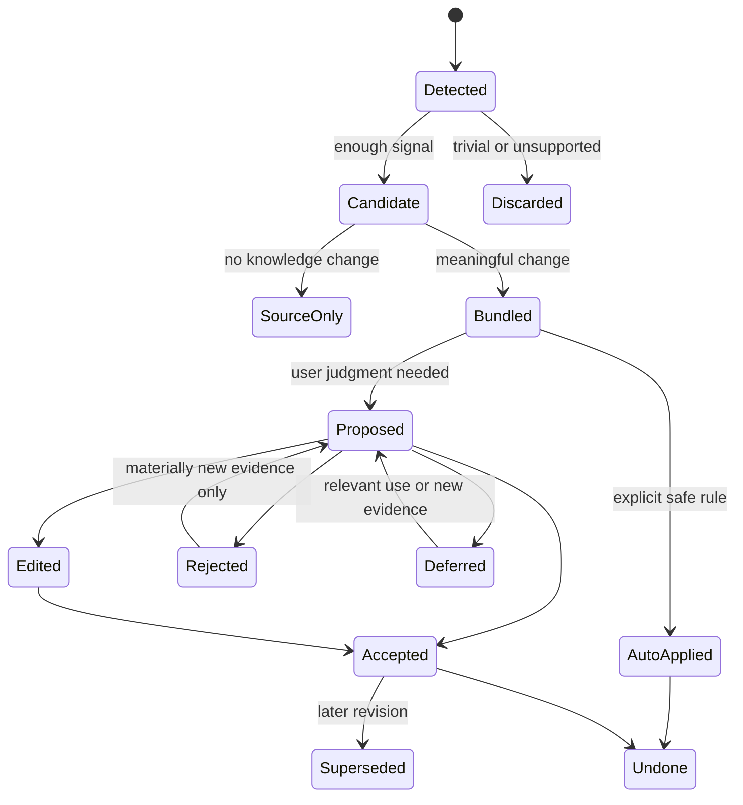

# AI-native 个人知识库

## 知识形成与维护循环 v1.0 — 从“收进来”到“成为我的知识”

> 文档日期：2026-08-06  
> 文档性质：产品本体合同，不是界面稿、技术方案或原型规格  
> 适用范围：Capture、Direct Authoring、Ask 保存、Knowledge Compiler、Review、Maintenance  
> Canonical 产品定义：`AI-native-个人知识库-终局产品设计文档-v4.0.md`；本文档只证明知识形成与维护责任，不得反向改写 v4.0  
> 2026-08-07 写入冻结：用户自己的普通写作经安全 Direct Edit Commit 直接成为当前 Knowledge；Edit Buffer、Recovery Checkpoint、Explicit Draft、Proposal、Sync 与 Projection 分开，本文不再使用 Working-first / “完成并采用”作为普通路径  
> 2026-08-08 Group Formation 覆写：Knowledge Compiler、embedding cluster、Source metadata、View / Search result 与 imported folder 都不能静默创建 Group；它们最多提出 Group Candidate，只有用户接受当前显式选择与 Placement / Attachment 计划后才建立 Group  
> v4.0 Query 写回覆写：Saved Answer 是历史 Snapshot；Answer 只有通过所选 Claim → identity / Applicability / support 检查 → Knowledge Draft 或目标 Anchor 的 block-level patch 才进入形成循环，未选 Claims、Session 与外部网页不得顺带写入  
> v4.0 Scope 覆写：从 Group / Topic Capture 的 Source Commit 同时创建独立 Source Attachment；它保留材料进入语境，不自动创建 Knowledge Placement 或 Evidence Binding。Group Boundary、Placement、Attachment 与 View / Ask observation 分开  
> 2026-08-10 Relation Lifecycle 覆写：AI、来源抽取与路径聚合的关系产物是 RelationCandidate；用户直接提交完整关系才创建 maintained Relation；证据变化只改 EvidenceBinding / Support Set，语义变化才创建 RelationRevision。完整合同见`AI-native-个人知识库-关系陈述生命周期与网络可信性合同-v1.0.md`  
> 历史深层模型：`AI-native-个人知识库-产品定义-v3.0.md`  
> 知识群边界与跨群架构：`AI-native-个人知识库-知识群边界与跨群架构合同-v1.0.md`  
> 知识节点粒度与内容组成：`AI-native-个人知识库-知识节点粒度与内容组成合同-v1.0.md`  
> Overview 形成、编辑与更新：`AI-native-个人知识库-Overview形成编辑与更新合同-v1.0.md`  
> AI 查询与知识回答：`AI-native-个人知识库-AI查询与知识回答合同-v1.0.md`  
> 来源、证据与可追溯性：`AI-native-个人知识库-来源证据与可追溯性合同-v1.0.md`  
> 直接创作、编辑与版本历史：`AI-native-个人知识库-直接创作编辑与版本历史合同-v1.0.md`  
> 属性、Facet 与适用条件：`AI-native-个人知识库-属性Facet与适用条件合同-v1.0.md`  
> 产品对象层级与身份治理：`AI-native-个人知识库-产品对象层级与身份治理合同-v1.0.md`  
> 核心约束：产品必须减少整理负担，不能把“AI 批量生成卡片，再让用户清垃圾”伪装成智能知识管理

---

# 0. 执行决定

这一轮冻结二十五项决定。

1. **Source、Current Revision、Explicit Draft、Proposal 与 Recovery 是五种不同落点和 identity class。** Source 是 Primary Resource / Source Truth；Revision、Draft 与 Proposal 是 Supporting Identities；Recovery 是设备级保护记录。它们不是同一 lifecycle 的五个状态，不能因为都显示文字就被当成同一种对象。
2. **采集成功不等于知识形成。** 文件、链接或录音安全保存、可阅读、可搜索，本身就是完整成功结果。
3. **一份来源可以产生零条正式知识。** “没有值得抽成知识的内容”是合法的编译结论，不是失败。
4. **用户自己的想法在本地持久化后直接成为当前 Knowledge。** 不需要制造虚假 Source，也不需要先选择知识群或“采用自己的写作”；显式 Draft、冲突恢复与 AI / 来源建议才使用 Working / Proposal Branch。
5. **AI 回答默认只是 Query Result。** 只有用户明确选择“保存为知识”或“合并到已有知识”时，才进入知识形成流程。
6. **全局快速记录可以是当前知识但仍未归类。** 没有 active Placement 的 Node 出现在 Library 的“未归类”视图；只有用户显式保存 Draft、冲突分支或恢复状态时才进入“未完成”视图。两者是独立条件，不新增 Inbox 对象或一级导航。
7. **外部材料首先进入 Sources。** 新来源出现在 Sources 的“新添加”视图，不因为尚未整理而进入 Review。
8. **Knowledge Compiler 的职责是提出最小必要变更，不是最大化产出。** 它可以发现大量信号，但默认只呈现少量有意义的决策包。
9. **提案必须围绕用户要做的决定组织。** 不按“AI 检测到的每一张卡片”逐项轰炸用户。
10. **是否为同一知识身份，先于是否相似。** Identity Resolution 必须允许“同一来源版本、重复来源、既有 Node 的新证据、既有 Node 的新修订、仅新增 Placement、独立 Node、只保留来源”七种结果。
11. **不使用裸置信度等级替代解释。** 用户看到的是匹配依据、语义重要性、影响范围、可逆性和系统为何建议，不是 High / Medium / Low 标签。
12. **后台 AI 可以准备，不能默认替用户定案。** 身份合并、正式关系、已接受主张改变、锁定内容改写与删除永远需要规则或明确确认。
13. **Review 不是第二个收件箱。** 只有身份、认识状态、适用条件、锁定内容或广泛下游影响需要用户判断时，事项才进入待确认。
14. **拒绝需要被记住。** 没有实质新证据时，同一建议不能反复出现。
15. **维护必须沿依赖传播，但不能静默重写历史。** 新来源、用户纠正与身份变化可以影响 Overview、Relation、Saved Answer 和 View；历史快照保持原样并显示影响。
16. **产品不以知识数量为成功。** 节点数、提案数、编译产量和 Review 清零都不是北极星。
17. **Overview Projection 与 Editorial prose 分开更新。** Projection 可以按规则刷新；accepted prose 只能经用户可选的 Semantic Diff 修改。
18. **“概览一下”不是写入指令。** Ask 返回 Query Result；只有明确“建议更新概览”才形成 Overview Proposal。
19. **Overview 中的独立 Claim 不停留为影子知识。** 需要 Evidence、Applicability、Relation 或跨群复用时，先提升为 Node，再由 Overview 引用。
20. **Answer Transform 必须按对象分流。** Saved Answer、Knowledge Draft、Merge Patch、Question Knowledge、Saved Path、RelationCandidate / Direct Relation、Overview Diff 与 Save Source 不能被一个 Save / Accept all 动作合并；Saved Answer 默认不回流为当前事实。
21. **Scoped Source Commit 同时保存 Source Attachment。** 从 Group root 或 exact Topic 采集时，Attachment 在 Source 安全保存后独立提交；解析、AI、Evidence 或 Knowledge formation 失败都不应让原进入路径消失。
22. **Attachment、Placement 与 Binding 分别提交。** Attachment 回答材料为何进入此范围，Placement 回答 Knowledge 在哪里出现，Binding 回答片段怎样支撑 Claim；任何一步都不能把另外两步当作隐式副作用。
23. **Group root 是合法形成目标。** 用户可以把 Knowledge 直接放到 Group root，不必创建占位 Topic；只有没有任何 active Placement 才是 Unplaced。
24. **Boundary 不自动驱动归类。** Compiler 可以基于 Boundary 提出 Placement / Topic 建议，但 current Boundary Revision 不会自动纳入、排除、移动或删除内容；不一致先形成可解释 tension。
25. **Topic transform 是结构 Change Set。** merge / split / cross-group transfer 必须预览 Placements、Source Attachments、Paths、Overview 与 redirects；失败时原结构和已保存 Source Commit 保持。

这二十五项决定共同回答一个产品级问题：

> 用户放进一段材料、写下一条想法或得到一次 AI 回答之后，系统如何既不丢失它，也不急于把它伪装成已经成立的知识？

---

# 1. 核心问题：知识库不能变成 AI 卡片工厂

最容易做错的产品路径是：

```text
用户导入资料
  → AI 拆出很多卡片
  → AI 自动建立很多关系
  → 用户面对大量“待确认”
  → 用户既不理解产出逻辑，也没有精力清理
  → 知识库越来越大，但越来越不可信
```

这种路径的问题不是模型不够准，而是产品把三个不同任务混在了一起：

- 保存材料；
- 发现潜在知识；
- 确认什么属于用户当前的知识结构。

本产品必须改为：

```text
先保存真实输入
  → 再识别值得形成知识的变化
  → 只把需要判断的少数决定交给用户
  → 形成可追溯、可撤销的知识变更
  → 在未来使用与新证据中继续修正
```

知识形成不是一次导入任务的尾声，而是知识在使用中不断被澄清、连接和修正的循环。

---

# 2. 四种落点，而不是一个万能 Inbox

## 2.1 来源已保存

适用于文件、链接、PDF、图片、音视频、外部选区和可校验的粘贴材料。

它代表：

- 原始内容或可校验快照已经保存；
- 来源身份、版本、观察时间和可用状态已经记录；
- 用户可以立即阅读、搜索和引用；
- 系统尚未声称它已经形成新的 Node、Relation 或 Overview 结论。

用户界面结果写作：`来源已保存`。

## 2.2 已保存并成为当前知识

适用于用户快速写下的想法、问题、解释、判断或工作中的片段。

本地持久化成功后，它拥有稳定 identity 与 current Content Revision，可以有或没有 active Placement。它：

- 通过 durable local save 与恢复点保护；
- 可搜索；
- 可继续编辑；
- 按当前 Knowledge 规则进入 Search / Ask；
- 不需要伪造 Source；
- 不自动获得 Placement、Relation、Evidence、Overview 代表角色或真实性背书。

归类与写作完成度不能合并为一个含混“草稿状态”：

```text
Unplaced:
  object_lifecycle = active
  AND active_placement_count = 0

Unfinished:
  explicit_draft_or_recovery_branch = true
```

它们是 View 条件，不是新的 Primary Resource，也不是一级导航。普通用户直接写作不进入 Unfinished。

## 2.3 整理建议

Proposal 是系统对“可能应该如何改变知识库”的可撤回建议，而不是半正式知识。

Proposal 可以建议：

- 为既有 Node 增加 Evidence；
- 更新既有 Node 的一个限定或修订；
- 创建新 Node；
- 新增或调整 Placement；
- 建立有类型的 Relation；
- 为既有对象提出 Property Assertion Patch，或建议创建 / 复用 Property Definition；
- 把 Source metadata 映射为 Node / Group Assertion、Facet、Alias 或保留 raw；
- 为 Overview Editorial prose 提出 Semantic Diff；
- 更新 Overview Projection rule；
- 把 Overview 中的独立 Claim 保存为 Node；
- 标记冲突、过时或适用条件变化。

它必须携带目标、依据、影响和下一步。Property Proposal 还必须携带 Definition、assertion location、value state、origin、qualifier、Applicability、Evidence、Base Revision 与 collision summary；没有目标对象或没有清楚改变内容的“发现”不能升级为 Proposal。

Source frontmatter、作者、日期和 tags 默认只形成 Source Assertions / raw metadata。只有用户接受 Mapping，才可能成为 Node / Group Accepted Assertion、Facet 或 Alias；共享标签、Node-reference value 和 AI similarity 都不能自动建立 Relation。一次 Ask 的 Query bindings 也不在 Compiler 后台写回知识对象。

## 2.4 经明确决定进入当前知识

这一落点专指 AI、来源、系统 Proposal、显式 Draft 发布和高影响结构变更。它们经过用户 review，或命中用户明确建立且范围有限的规则后，写入 Node、Relation、Placement、Overview Editorial revision 等对象。普通用户直接写作不经过这一审批落点，而由 Direct Edit Commit 更新 Current Revision。Projection refresh 属于派生结果更新，不伪装成新的 prose revision。

“正式”不等于“永远正确”。它只表示：

- 当前版本被知识库作为默认可使用状态；
- 认识状态和适用条件清楚；
- 来源与用户原创部分可以区分；
- 后续变化通过 revision、supersede、contested、stale 等机制演化；
- 任何重大改变都能追溯到 Change Set。

---

# 3. 三条合法的知识进入路径

## 3.1 外部来源路径

```text
文件 / 链接 / 录音 / 选区 + optional Group / Topic context
  → Source Commit
  → optional Source Attachment Commit
  → 可阅读与可搜索
  → 可选编译
  → Knowledge Proposal
  → Knowledge Commit
```

重点是：`Source Commit` 后任务已经成功。后续编译不是解锁来源的必经步骤。

## 3.2 用户直接创作路径

```text
写下想法
  → durable local save
  → 建立 / 更新 Current Knowledge Revision
  → 可暂不归类
  → 继续编辑 / 放入知识群 / 连接来源
  → 编辑会话按规则合并历史版本
```

用户原创内容使用 `origin = user_authored`。缺少外部 Source 不降低其合法性；如果它是个人判断或观察，authorship / Material Origin 明确为用户，形成方式记录为 observation 或 interpretation。只有显式选择`保存为草稿`或发生冲突 / 历史恢复时才产生 Draft Branch；AI / Source Proposal 在 review 前保持独立，review 后确认动作可直接形成 commit，不再二次采用。只有用户原创内容被用作另一条 Claim 的依据时，才通过 Evidence Binding 另行说明 supports / qualifies / context 等作用。

这条路径内部仍分成三个边界：

1. Edit Buffer 保存当下输入与 IME composition，不进入默认知识读取；
2. Recovery Checkpoint 高频保护异常恢复，但不形成 Current Revision；
3. composition 结束并到达 idle、blur、导航、显式保存、正常关闭或 pre-Ask flush 等安全边界后，Direct Edit Commit 原子推进 current。

离线、sync queued 或 projection lag 不改变第 3 步是否成立。若 commit 失败，内容保持在 Buffer / Recovery 中并持续提示；系统不能把它悄悄当作 current，也不能让用户误以为已经保存。

## 3.3 查询与探索结果路径

```text
Ask / Explore
  → Query Result 或 Saved Path
  → Query Result 保留 Query Turn / Run / Context / Claim Support
  → 默认停留在查询历史，Saved Answer 不参与当前事实检索
  → 用户明确保存
  → Saved Answer / Knowledge Draft / Question Knowledge / Merge Proposal
  → RelationCandidate / Direct Relation / Overview Diff / Save Source / Saved Path
  → 对需要成为知识的 Claims 执行独立 Knowledge Commit
```

“保存回答”不能等同于“回答全文成为事实”。用户需要选择：

- 保存为 Saved Answer；
- 保存为综合知识；
- 保存为待研究问题；
- 合并一段稳定理解到已有 Node；
- 只保存探索 Path；
- 建议建立正式关系；
- 建议更新 Overview；
- 保存本次使用的外部 Source。

整段 Answer 可能同时包含事实、来源陈述、推论、Unknown 和建议，因此不能整体接受。进入 Node / Relation 的部分按 Claim 检查 identity、Applicability、support、冲突与影响；Re-evaluate 生成新的 Answer Snapshot，不进入 Knowledge Commit，也不覆盖 Original。

---

# 4. Capture 的模态判断

Capture 不先问“你要创建哪一种数据库对象”，而根据输入形态给出可预测默认值。

| 用户动作 | 默认落点 | 是否要求 Group | 是否自动形成知识 |
|---|---|---:|---:|
| 全局输入一段自己的想法 | Current Knowledge；无 Placement 时进入 Unplaced | 否 | 是，保存成功后 |
| 在 Node / Topic 内写新内容 | 当前 Knowledge Revision；Topic context 可预填 Placement | 否，已继承 | 是，保存成功后 |
| 上传文件、PDF、图片、音视频 | Source；从范围内发起时另建 Source Attachment | 否 | 否 |
| 粘贴网址 | Source；可选择仅保留 inline link | 否 | 否 |
| 从网页保存选区 | Source + 可定位片段 | 否 | 否 |
| 粘贴带明确外部出处的大段材料 | Source | 否 | 否 |
| 保存 AI 回答 | Query Result / Answer Snapshot | 否 | 否 |
| 从 AI 回答提取一条理解 | Knowledge Draft / Merge Proposal | 否 | 否 |
| 导入旧知识库 | Migration batch | 否 | 预览后决定 |

当系统无法可靠判断“这是用户自己的想法还是外部材料”时，只问一个轻量问题：

> 这是你写下的知识，还是要保存的一份来源？

两个选项分别是 `写下知识` 与 `保存为来源`，不暴露 Node / Source schema。

---

# 5. 不强迫归类：Unplaced 是正常状态

## 5.1 为什么允许没有 Placement

快速记录的价值在于先保留思路。强制选择 Group 会产生三种伤害：

- 用户为了结束表单随便归类；
- 新领域必须先设计结构才能记录；
- 用户在思考最脆弱的瞬间被迫切换成资料管理员。

因此 Current Knowledge 可以暂时 `active_placement_count = 0`；显式 Draft 也可以没有 Placement。写入状态与归类是两个正交决定。

Placement 同时是 Group membership 的唯一 canonical 真相：没有 active Placement 就没有群归属；在某 Group 中存在至少一个 active Placement 就属于该 Group。编译、直接创作和迁移都不能另写第二份 `member_node_refs` 真相。

Placement target 可以是 Group root 或 Topic。Group root Placement 写作`直接放在这个知识群`，同样计入 active placement count；系统不能为了实现根级归属而创建`其他 / 未分类`占位 Topic。

## 5.2 如何重新出现

系统不以红点和催促制造整理债务。未归类对象或 Explicit Draft 会在以下时机自然出现：

- 用户打开 Library 的“未归类”或“未完成”动态视图；
- 搜索明确匹配它；
- 用户打开一个语义相关 Group 时，系统在 P1 区域建议“可能属于这里”；
- Ask 明确允许包含 Explicit Draft 且它与问题相关；
- 用户回到该 Explicit Draft 继续写作。

## 5.3 AI 可以做什么

AI 可以提出最多三个放置建议，并说明：

- 该 Group 的边界与这份 Current Knowledge / Explicit Draft 的匹配点；
- 是否已有相似 Node；
- 放入后哪些 Overview 可能受影响；
- 保持未归类是否有任何实际后果。

默认不自动 Placement。只有用户为一个稳定规则明确开启自动归类，且动作可一键撤销时，系统才可自动应用。

---

# 6. Source-only Success 与 Semantic Yield

## 6.1 一份来源不欠知识库任何节点

来源的语义产出可能是：

- 零个 Node；
- 仅为现有 Node 增加 Evidence；
- 让现有 Node 增加一个限定条件；
- 形成一个新 Node；
- 形成多个相互关联的 Node；
- 只暴露一个待研究问题；
- 证明某个旧理解已经过时；
- 暂时无法可靠判断。

系统不得以“每份来源创建几张卡片”作为处理成功标准。

## 6.2 片段不自动等于知识

Parse / Segment 可以识别很多可引用片段，但 Evidence Fragment 只是来源中的可定位证据。它只有在支持、反驳、限定或解释某个 Node / Relation 时，才进入知识连接。

摘录、OCR 段落、高亮、Heading、embedding cluster 和 compiler chunk 不会因为被抽取就自动成为独立 Node。它们可以成为 Evidence Fragment 或候选 Content Block；只有具备独立语义、适用条件、证据、关系、跨群复用或更新节奏时，才建议形成 Node。

编译器合入既有 Node 时只提出 block-level patch，并标明 Anchor、Evidence、ownership 与下游影响；不得用重新生成的整篇正文替换 accepted revision。完整粒度合同见 `AI-native-个人知识库-知识节点粒度与内容组成合同-v1.0.md`。

## 6.3 编译完成的合法结果

编译结束必须明确区分：

- `发现 3 个值得检查的知识变化`；
- `只补充了 6 处证据，不需要你决定`；
- `没有发现值得形成知识的变化，来源仍已保存并可搜索`；
- `解析不完整，当前无法可靠判断`。

最后一种是 partial，不得显示为“0 条知识”。

## 6.4 Source-only 的范围连续性

Source-only 不代表没有结构语境：

- 从全局 Sources / Add 采集：Source 可以没有 Attachment；
- 从 Group root 采集：创建 target = Group 的 Source Attachment；
- 从 Topic 采集：创建 target = exact Topic 的 Source Attachment；
- Source 保存成功而 Attachment 提交失败：Source Commit 保持成功，Receipt 精确说明语境未保存并允许重试；
- parse / index / AI failure：Attachment 仍保留；
- 后续形成 Knowledge：另建 Placement；使用片段支撑 Claim：另建 Evidence Binding；
- detach：只结束当前 Attachment，不删除 Source、Annotation、Fragment、Binding、Knowledge 或其他 Attachments。

Topic merge / split / transfer 时，Attachments 进入同一结构 Change Set；能唯一重定向则保留 lineage，多 successor 时必须让用户选择或暂留历史 target，不可静默丢弃。

---

# 7. Knowledge Compiler 的精确流水线

```text
1. Ingest
   接收输入，不做知识判断

2. Source Commit
   保存来源身份、版本、位置、权限、observed_at 与原始内容/快照

2a. Scope Attachment Commit（仅当 Capture 有 Group / Topic context）
   保存 Source 为什么进入这个范围；失败不回滚 Source Commit

3. Parse
   提取结构、文本、媒体转写和机器可读元数据

4. Segment
   建立可引用片段及 exact locator

5. Candidate Signal Detection
   发现实体、主张、定义、机制、条件、冲突、重复、关系和问题信号

6. Identity Resolution
   判断该信号对应哪个 Source / Node identity，或是否根本不应形成 Node

7. Applicability Resolution
   确定对象、地点、组织、时间、条件与例外；无法确定时保留 unknown

8. Knowledge Difference
   比较现有知识，识别新增、补证、修订、冲突、重复与无变化

9. Proposal Grouping
   按目标 Node、Topic、主张族或结构决策合并成用户能理解的决策包

10. Impact Preview
    计算可能改变的对象、派生内容、历史回答、锁定内容和 Review 项

11. Knowledge Commit
    只提交用户选择或明确规则允许的变化

12. Rebuild
    更新搜索、Overview、图谱、Answer impact、Views 与索引
```

每一步都保存实际完成状态。停止、失败或 AI 不可用不能回滚已经完成的 Source Commit。

---

# 8. Identity Resolution：先判断“它是谁”

相似不等于相同。每个候选信号必须落入以下七种之一：

| 结果 | 含义 | 默认动作 |
|---|---|---|
| Same Source Revision | 同一来源的新版本 | 建立版本链并比较影响 |
| Duplicate Source | 内容重复或镜像 | 保留一个 canonical Source，记录 duplicate link；用户可选择两者都保留 |
| Evidence for Existing Node | 只是为已有知识补充依据 | 增加 Evidence Connection，不新建 Node |
| Revision of Existing Node | 改变已有知识的正文、限定或状态 | 形成 Node Diff Proposal |
| Contextual Placement | 同一 Node 在新 Group / Topic 中出现 | 新增 Placement，不复制 Node |
| Distinct Node | 身份和语义边界独立 | 创建新 Node Proposal；确认后产生 Current Revision |
| Source Only | 不值得或不足以形成知识 | 停在 Source |

## 8.1 判断依据

Identity Resolution 显示的不是单一相似度，而是：

- 标题、别名与实体匹配；
- 定义或主张是否等价；
- 适用对象与时间是否相同；
- 来源版本关系；
- 已有 Node 的边界句；
- 分开维护是否会产生不同后续变化；
- 合并后影响哪些 Placements、Relations 与 Overviews。

## 8.2 不确定时的规则

- 保留为两个 Candidate，不静默合并；
- 允许“先只加来源，稍后判断”；
- 不因文本相似就创建 `same_as`；
- 不因共享主题就复制 Node；
- 用户拒绝合并后，记录 identity decision 与依据；
- 只有新版本、新属性或新证据改变判断时才重新提出。

---

# 9. Candidate 与 Proposal 生命周期

内部检测和用户可见提案分开。



## 9.1 Proposed 的最低合同

每个 Proposal 必须具有：

```text
Proposal
  proposed_change
  target_refs[]
  source_refs[]
  evidence_refs[]
  formation_basis
  applicability
  identity_alternatives[]
  impact
    changed_objects[]
    affected_derived_objects[]
    locked_content[]
    reversibility
  suggested_action
  alternative_actions[]
  rejection_memory
```

若系统不能说明它准备改变什么，就不能要求用户 Accept。

## 9.2 不显示裸置信度

界面禁止只显示：

- 92% confidence；
- High confidence；
- AI strongly recommends；
- based on similarity。

替代为：

- `与“情境依赖检索”的定义和适用条件一致，建议补充为新证据`；
- `名称相同，但适用国家和生效时间不同，建议分开保留`；
- `这条变化会改写 2 个概览并影响 1 个历史回答，需要你确认`；
- `尚未找到直接证据，建议保留为待研究问题`。

---

# 10. Proposal Bundling：让用户审一个决定，而不是一百张卡片

## 10.1 决策包的单位

Proposal 默认按以下逻辑合并：

- 同一目标 Node 的多个 Evidence → 一个“补充证据”包；
- 同一主张的定义、条件和反例 → 一个“修订理解”包；
- 同一新 Topic 下的一组结构候选 → 一个“形成主题”包；
- 同一身份冲突的多个相似项 → 一个“确认是否相同”包；
- 同一来源更新导致的多个下游变化 → 一个“来源更新影响”包。

用户首先看到一句决定：

> 是否把这份新政策作为“法国租房担保要求”的当前版本，并保留旧版本为历史？

随后才查看它包含的证据、Node Diff、Overview Diff 和 Saved Answer impact。

## 10.2 默认呈现预算

一次审查默认展示 **3–7 个最高价值决策包**。若存在更多候选：

- 显示总量和被归并方式；
- 提供“查看其余建议”；
- 允许按 Group、来源或变更类型继续；
- 不把隐藏部分算成已确认；
- 不用红点催促清空。

这是呈现预算，不是检测上限。系统可以在后台发现更多信号，但不能把内部检测规模转嫁为用户工作量。

## 10.3 排序依据

Review 优先级由以下维度决定：

1. **Identity ambiguity**：不决定就可能复制或错误合并；
2. **Epistemic impact**：是否改变当前接受的理解；
3. **Reach**：影响多少 Overview、Relation、Saved Answer 和常用路径；
4. **Irreversibility**：是否容易撤销；
5. **Current relevance**：是否与用户当前正在阅读、查询或更新的 Group 有关；
6. **Time sensitivity**：是否涉及即将失效或刚刚生效的条件。

不使用“存在时间最长”作为默认最高优先级。

---

# 11. 自动化与写入边界

## 11.1 四级主动性

| 级别 | 系统可以做什么 | 是否可写入正式知识 |
|---|---|---:|
| A0 读取辅助 | 保存、解析、索引、OCR、语言识别与搜索基础 | 否 |
| A1 低风险派生 | 阅读摘要、Candidate preparation、临时聚焦与未保存预览 | 否；不进入 Knowledge Truth |
| A2 结构 / 知识建议 | Decision Bundle、Placement、Relation、identity、Overview Semantic Diff、Claim Promotion | 否；接受后才进入 Commit |
| A3 正式变更 | 创建、合并、拆分或改变 canonical knowledge、正式关系、边界与状态 | 是；必须预览确认，或命中用户明确建立的有限规则 |

默认策略是：A0 自动运行、A1 可在后台准备、A2 只在相关语境少量呈现、A3 需要确认。用户可以关闭 AI 派生或进一步限制某个 Group；这属于 policy 设置，不另造一套与 A0–A3 冲突的等级。

## 11.2 永远不能静默发生

即使在 A3，以下动作也不能无提示执行：

- 合并两个不确定 identity；
- 删除 Source、Node 或用户正文；
- 把 Explicit Draft / inference 提议为 Current claim；
- 把旧 Accepted claim 标为 Superseded；
- 覆盖任何 accepted 或 locked Overview Editorial prose；
- 将 retrieval jump 变成正式 Relation；
- 改变关键 Applicability；
- 让历史 Answer Snapshot 随当前知识重写。

## 11.3 可以安全自动完成

在可撤销、可观察且用户未禁用时，可以自动：

- 抽取文件元数据与结构；
- 建立全文和片段索引；
- 为 Source 生成非权威阅读摘要；
- 识别已有 tag / Group 候选但不创建新对象；
- 修复确定性的 locator 或格式；
- 更新 Source availability 和 Source intrinsic metadata；
- 按明确规则执行低风险 Placement；
- 标记“可能受影响”，但不自动改写内容。

所有自动动作进入 Activity / History。只有需要用户判断的动作进入 Review。

确定性元数据抽取“可自动”只意味着 Source 层记录成立，不意味着 Node Property 已被用户接受。Default / Facet Profile 只可在新建时预填并显示 origin，不回写既有 Assertions。

---

# 12. Knowledge Commit 与 Change Set

## 12.1 Commit 不是一个模糊的“全部应用”

提交前，用户必须看见：

- 会新增什么；
- 会更新什么；
- 哪些只是新增证据；
- 哪些正式关系会建立或改变；
- 哪些 Overview / Saved Answer / View 会受到影响；
- 哪些用户锁定内容保持不变；
- 哪些事项会留到以后；
- 撤销会撤销什么，保留什么。

## 12.2 原子性与部分提交

一个决策包应尽量原子提交。如果依赖不可用：

- 不把部分成功显示成普通成功；
- 列出已提交、未提交和保持不变的对象；
- 允许重试未完成部分；
- 撤销只作用于实际提交项；
- Source Commit 默认始终保留。

## 12.3 用户原创内容的直接更新

新建 Node 时：

- 输入持续写入 durable local save 与 recovery checkpoint；
- 关闭编辑器不会丢失；
- 首次持久化成功后建立 Current Knowledge identity / revision；
- 连续输入按 edit session 合并为可理解的版本历史，不要求每个按键生成一版；
- 用户可显式`保存为草稿`而不更新 Current；
- 如果该 Node 没有 Placement，可以保持`未归入知识群`，也可以直接放在 Group root 或 Topic。

编辑既有 Current Knowledge 时，本地持久化成功就更新 Current，并分别表达`已保存到本机`与`等待同步 / 已同步`。离开 Editor 不弹传统 Save dialog；历史按连续编辑会话形成可恢复 revisions。显式 Draft 不移动 current pointer；AI / Source diff 先进入 Proposal Branch，再经可审查 Patch 合入；冲突进入独立 branch / merge。这样用户自己的写作保持直接，系统与外部变化仍不能借 auto-save 偷偷改写知识。

---

# 13. Review：只处理真正需要判断的变化

## 13.1 进入 Review 的门槛

只有满足至少一个条件才进入待确认：

- identity 不能可靠判断；
- 新证据可能推翻或限定 Current Knowledge；
- Applicability 的对象、地点、条件或时间会改变结论；
- 需要建立、改变或撤销正式 Relation；
- 需要覆盖或使用户锁定内容失效；
- 影响多个高频 Overview、Saved Answer 或 Saved Path；
- 需要删除、合并、拆分或重定向 identity；
- 用户明确要求每次确认该类动作。

以下默认不进入 Review：

- 格式整理；
- 可确定的元数据抽取；
- 解析进度；
- 无语义变化的来源重同步；
- 新来源仅被保存和索引；
- 尚未归类的普通对象与 Explicit Draft；
- 只影响 AI 阅读摘要且未影响正式知识的更新。

## 13.2 Review Item 的阅读顺序

每一项先回答：

1. 发生了什么；
2. 为什么需要用户决定；
3. 系统建议什么；
4. 还有哪些合理选择；
5. 不处理会怎样；
6. 会影响哪里；
7. 如何撤销。

## 13.3 Deferred 的语义

`稍后决定` 不等于失败，也不默认触发每日提醒。它只有在以下情况重新浮现：

- 出现实质新证据；
- 用户进入受影响的 Node / Group；
- 用户的问题依赖这项未决判断；
- 相关时间条件即将生效或失效；
- 用户主动打开待确认。

---

# 14. 更新与纠错如何传播

## 14.1 新来源版本

```text
New source revision
  → version diff
  → Evidence locator validity
  → Applicability comparison
  → affected Node / Relation detection
  → Overview / Saved Answer / View impact
  → Proposal or low-risk status update
```

新版本不会自动删除旧版本。旧版本可以继续作为历史证据，并明确 valid time。

## 14.2 来源不可用

权限丢失、链接失效或连接器断开只改变 `availability`。它不能自动：

- 删除已经形成的知识；
- 将 Accepted 改为 Rejected；
- 重写历史 Answer；
- 假装 Evidence 仍能定位。

系统显示保留了什么、失去了什么以及如何重新连接。

## 14.3 用户纠正

用户纠正一个 AI-assisted Node、Overview Editorial prose 或 Projection rule 时，系统必须先辨认内容类型，再沿各自合同处理：

1. 保存用户修改为新 revision；
2. 标记被替换内容及原因；
3. 找出引用旧内容的 Overview、Relation explanation、Saved Answer 和 View；
4. 对 Node 与 Overview accepted prose 只生成可选择 Diff，不自动改写；
5. 对 Projection 修正规则并刷新结果，不把刷新记成 prose revision；
6. 记录此次纠正，避免同一错误在无新依据时重新生成；
7. 允许按 Change Set 撤销。

## 14.4 依赖传播矩阵

| 上游变化 | 可自动更新 | 需要 Proposal | 保持原样但标记影响 |
|---|---|---|---|
| Source metadata 修正 | 索引、显示元数据 | 无 | 历史快照 |
| Source availability 变化 | availability、连接状态 | 恢复动作 | 已接受知识、历史回答 |
| 新 Evidence 支持既有 Node | evidence count / link | 若改变认识状态 | 原 Node 正文 |
| 新 Evidence 反驳既有 Node | 受影响标记 | contested / qualify / supersede | 原 revision、历史回答 |
| Node 用户纠正 | current revision after confirm | 下游用户文本 | Answer Snapshot original |
| Relation 改变 | Graph / list rendering、Overview Projection | Overview Editorial Semantic Diff / Saved Path 影响 | 历史 Path、accepted Overview prose |
| Placement 调整 | hierarchy / context、Overview Projection | 只有依赖旧结构的 Editorial prose 才提出 Diff | canonical Node、无关 Overview prose |
| Overview input 改变 | alignment / support impact | Editorial Semantic Diff 或 Claim Promotion | locked / rejected Blocks、Historical Overview |

---

# 15. 大型导入：控制整理债务，而不是制造规模幻觉

以 300 份来源导入为例，默认流程是：

1. 先显示范围、格式、重复风险和预计存储；
2. Source Commit 逐项进行，失败不阻塞已保存项目；
3. 对代表样本运行解析并给出质量预览；
4. 用户可调整排除目录、来源类型和归属规则；
5. 全量解析在后台进行，可暂停；
6. 先呈现跨批次 identity 与高影响变化；
7. 其余建议按 Group / 主题 / 目标 Node 聚合；
8. 用户可以接受规则用于相似项，但必须预览命中范围；
9. 导入完成不要求 Review 归零；
10. 随后使用、搜索和 Ask 会逐步让相关候选在正确语境中出现。

大型导入的成功指标是：材料安全、映射可信、重复受控、当前知识可继续使用，而不是“一次性把 300 份来源全部知识化”。

---

# 16. 后台处理、暂停与失败

## 16.1 AI unavailable

AI 不可用时仍然可以：

- 创建和编辑 Node；
- 保存、阅读与搜索已索引 Source；
- 手工建立 Topic、Placement 与 Relation；
- 浏览 Overview 与图谱；
- 查看历史 Evidence 和 Change Set；
- 将编译请求排队但不伪装为已完成。

## 16.2 暂停与取消

- 停止解析不删除 Source；
- 停止 Proposal generation 保留已完成解析；
- 取消 Knowledge Commit 不改变已有知识；
- 取消流式 Ask 保留 Query Turn、当前 Run、Requested / Effective Context 与已 grounded Claims，并标记 cancelled / incomplete；未完成 Answer 不能保存成普通可引用 Snapshot；
- 用户输入的任何正文都先写入 durable local Working Checkpoint；
- 后台任务重启后从最近安全阶段继续，不重复创建对象。

## 16.3 部分成功

系统必须分别显示：

- 已保存来源；
- 已完成解析；
- 尚未解析或解析失败；
- 已形成提案；
- 已提交知识；
- 需要恢复的依赖。

不得用一个绿色“完成”覆盖部分失败。

---

# 17. 代表性场景

## 17.1 无知识群时快速写下一条想法

用户全局输入：“关系图不应该替代层级阅读。”

预期：

- 本地持久化后立即建立 user-authored Current Knowledge，并保留 recovery checkpoint；
- 标题可自动建议，但用户原文不被改写；
- 不强迫创建 Group；
- 因没有 Placement 出现在“未归入知识群”动态视图；普通直接写作不进入“未完成”；
- 后续打开“AI-native 个人知识库”Group 时，可以建议放入并显示匹配原因；
- 用户可以继续保持未归类、直接放在 Group root，或加入具体 Topic；三种选择都不改变其 Knowledge identity。

## 17.2 导入一份 120 页研究 PDF

预期：

- Source Commit 先完成；
- 用户可立即阅读已解析部分；
- 系统不创建 120 个页面对应的 Nodes；
- 片段先作为 Evidence；
- 提案围绕少量高价值变化组织，例如“为现有 Node 补证”“出现一个新机制”“与既有结论冲突”；
- 用户只保存来源也被视为完整成功。

## 17.3 导入 300 份旧资料

预期：

- 先做样本与映射预览；
- 批次部分失败不要求重传全部；
- 重复来源和同一 Node identity 分开判断；
- 默认只展示 3–7 个最高价值决策包；
- 不产生 300 个待确认红点；
- 可按用户规则逐批提交并精确撤销。

## 17.4 法国租房规则的新版本

预期：

- 识别为同一 Source 的新 revision；
- 对比生效时间、适用地区与申请人条件；
- 不把条件不同误判为冲突；
- 显示哪些 Node、Overview 和历史回答受影响；
- 用户可接受当前版本并保留旧版本为历史证据。

## 17.5 用户纠正 AI 生成的解释

预期：

- 用户正文成为新 revision；
- AI 旧解释不再作为 current；
- Overview Projection 按修正后的规则或知识刷新；
- 已接受的 Overview Editorial prose 只显示 alignment 影响并在需要时形成 Semantic Diff，不自动合入；
- 保存的旧 Answer 保持原文并显示“相关知识后来改变”；
- 相同错误没有新依据时不再生成。

## 17.8 Ask 生成概览与写入概览分开

用户在“认知科学”Group 问：“概览一下现在最重要的理解。”

预期：

- Answer 保持 Query Result，并显示实际 Query Context、Nodes 与 Evidence；
- `保存这个回答`只创建 Saved Answer；
- `建议更新概览`创建 Overview Semantic Diff，用户可逐段接受；
- Answer 中一个需要独立依据与关系的判断使用`保存为独立知识`创建 Node；
- 普通关闭或保存回答不改变 `overview_id`、Editorial revision 或长期关系。

## 17.6 AI 回答只在当前问题中关联两个 Node

预期：

- Answer Route 把两个 Node 分别连接到 Answer Claim；
- 显示“本次回答中一起使用”；
- 不创建 `related_to`；
- 用户可以显式提交一条完整 Relation；AI 只能提出 RelationCandidate，待采用后才物化正式 Relation；
- 关闭回答后长期图谱边数不变。

## 17.7 来源没有产生知识

预期：

- 显示“没有发现值得形成知识的变化”；
- Source 仍可阅读、搜索与以后引用；
- 不产生空 Draft Node、空 Topic 或 Review Item；
- 用户可以稍后从真实使用语境重新编译。

---

# 18. 内部产品质量指标

这些指标用于验证产品是否减轻认知与整理负担，不在界面中做积分、等级或健康分。

## 18.1 核心指标

- **Time to first reusable knowledge**：从首次输入到第一条可在真实查询或探索中复用的知识所需时间；
- **Proposal decision quality**：Accepted、Edited、Rejected、Deferred 的分布，以及接受后被快速撤销的比例；
- **Identity resolution error rate**：错误合并、错误复制与用户重新拆分的比例；
- **Correction propagation completeness**：用户纠正后应受影响对象被正确标记或更新的覆盖率；
- **Review load per meaningful import**：每次真实导入需要用户做的决策数，而不是 AI 产出数；
- **Source-to-evidence usefulness**：来源片段后来被核验、引用或用于回答的比例；
- **Answer-to-knowledge conversion quality**：保存的 AI 结果后来是否被继续编辑、引用或保留，而不是保存量；
- **Unplaced / explicit-draft recovery rate**：无 Placement 的当前 Knowledge 与显式 Draft / conflict / recovery branch 是否能分别在相关语境被找回并继续使用；
- **User-overturn rate**：自动规则写入后被用户撤销、重写或取消的比例；
- **Trust recovery time**：错误发生后，用户是否能找到原因、修正并确认影响已经传播。

## 18.2 反指标

- 每份来源平均产生多少 Nodes；
- 总 Node 数增长；
- 每日 Review 清零率；
- AI 自动接受率本身；
- 用户在整理页面停留时间；
- 自动建立 Relation 数；
- “知识完整度”百分比。

如果这些数量上涨，但复用、纠错和信任下降，产品正在变坏。

---

# 19. 验收标准

## 19.1 输入与落点

- 用户能在不选择 Group 的情况下写下并找回一条想法；
- 文件或链接完成 Source Commit 后，即使 AI 失败也不会丢失；
- 用户能区分“来源已保存”“已更新当前知识”“显式草稿 / 建议尚未采用”“未归入知识群”与“来源已加入某个 Group / Topic”；
- AI Answer 不会因为点击普通 Save 就自动成为 Accepted claim。
- Saved Answer 默认不参与当前事实 Ask，显式历史查询才可使用；
- 只有选中 Claims 能进入 Working / Proposal / Patch，整段 Answer 不存在 Accept all。

## 19.2 编译忠实度

- 一份来源可以以零 Node 正常结束；
- Evidence Fragment 不因被抽取就成为 Node；
- 同一来源版本、重复来源和相似来源能被分开处理；
- 新 Evidence 优先补充既有 Node，而不是默认复制；
- 条件不同的主张优先进入 Applicability 对照，而不是红色冲突。

## 19.3 决策负担

- 120 页 PDF 不按页或段落生成等量待确认事项；
- 300 份来源导入后默认首屏不超过 3–7 个决策包；
- 用户可以理解一个决策包包含多少候选和影响；
- Deferred 不产生惩罚性提醒；
- Rejected 在无实质新证据时不重复出现。

## 19.4 写入与撤销

- 用户在 Knowledge Commit 前能看到 changed、affected、locked 和 undo scope；
- Undo Knowledge Commit 默认保留 Source；
- partial commit 准确显示已提交与未提交；
- 普通用户写作的 durable local save 更新当前知识但不等于同步；显式 Draft / AI Proposal 的 checkpoint 不移动 current pointer；
- 后台 AI 不能静默改写 Accepted、user-authored 或 locked 内容。
- AI 合入既有 Node 必须显示新增、改写、移动与删除的 Blocks，并保留未接受内容；
- Section Promotion、Split / Merge 必须显示 identity、Anchor redirects、Evidence、Placement 与 Relation 影响；
- Link、Live、Pinned 与 Quote 不因 Compiler 写入而静默改变复用模式。

## 19.5 维护传播

- Source unavailable 只改变 availability；
- 新版本能显示 Applicability 和下游影响；
- 用户纠正能刷新规则派生内容并为 accepted prose 提出 Diff，而不重写历史快照；
- Saved Answer 可以查看 original 和按当前知识重新回答；
- 一个变更可沿同一 Change Set 被追溯和精确撤销。
- Placement / Topic / Relation 变化会刷新相应 Overview Projection，但不会改写无关 Editorial prose；
- accepted AI prose、user-authored prose 与 locked prose 都只经 Semantic Diff 改变；
- 独立 Overview Claim 提升为 Node 后，Evidence、Applicability、Relation 与历史归属于 Node，Overview 保留 Reference 与 Support Map。

## 19.6 降级体验

- AI unavailable 时知识仍可写、读、搜、组织和探索；
- parse failure 不回滚 Source Commit；
- 停止后台处理不会丢失用户正文；
- 部分成功不被普通完成状态掩盖。

---

# 20. 研究依据与产品推论

## 20.1 NotebookLM

Google 官方文档把来源、用户笔记与聊天回答明确分开：来源用于 grounding；用户可以单独写 Note；喜欢的聊天回答需要显式 `Save to Note`；引用可以回到原文上下文。Drive 来源更新也作为来源同步处理，而不是直接修改用户笔记。[Learn about NotebookLM](https://support.google.com/notebooklm/answer/16164461?hl=en) · [Create & add notes](https://support.google.com/notebooklm/answer/16262519?hl=en) · [Use chat](https://support.google.com/notebooklm/answer/16179559?hl=en) · [Add sources](https://support.google.com/notebooklm/answer/16215270?co=GENIE.Platform%3DDesktop&hl=en-GB)

本产品吸收的不是 NotebookLM 的 notebook 边界，而是三个机制：

- Source 是可核验输入，不等于正式知识；
- AI 结果需要显式保存；
- 引用必须回到具体上下文和来源版本。

## 20.2 Capacities

Capacities 官方文档允许用户在保存链接时选择简单 inline URL 或完整 weblink object；AI collection selection 只从已有 collections 中建议，并允许用户事后编辑；AI chat 可以保存为 object，但它仍然是可组织的独立对象，而不是自动改变所有既有知识。[Weblinks](https://docs.capacities.io/reference/basic-types/weblinks) · [AI Assistant](https://docs.capacities.io/reference/ai-assistant)

本产品进一步做出的决定是：

- 输入类型决定默认落点，但用户可以纠正；
- AI 优先从已有 Group / identity 中建议，而不是不断发明结构；
- 保存 AI 结果与把稳定理解提交为知识是两个动作。

## 20.3 Heptabase

Heptabase 的官方 MCP 说明把外部 AI 写入设计为 `save_to_note_card` 到 Inbox，然后再由用户组织；这说明“先安全落地，再进入结构”是可理解的模式。本产品保留外部建议 staging 原理，但不增加一个万能 Inbox：来源进入 Sources，Explicit Draft 进入 Library 的“草稿”View，无 Placement 的 Current Knowledge 进入“未归类”View，真正需要判断的变化才进入 Review。[Heptabase MCP](https://support.heptabase.com/en/articles/12679581-how-to-use-heptabase-mcp)

## 20.4 研究带来的共同约束

成熟工具普遍把“原始输入”“AI 输出”“用户知识”保持为可区分层。由此得到的产品约束是：

- 自动抽取不能消灭输入的原始身份；
- 保存动作必须说明保存到哪里、成为什么；
- AI 写入需要清楚的对象边界；
- 来源同步与知识修订必须分开；
- 用户必须能在原始材料、AI 解释和自己的判断之间来回核验。

---

# 21. 对后续视觉与原型的约束

本合同只定义产品，不授权开始原型。未来进入视觉阶段时必须证明：

1. Capture 能在一个轻量入口中区分“写下知识”与“保存来源”；
2. “来源已保存”是完整完成态，不用次要灰色文案表达；
3. “未归类”与“未完成”是两个独立 Library Views，都不变成高压 Inbox；
4. Proposal 首屏围绕决定，而不是卡片瀑布流；
5. 决策包能先看摘要，再展开 Evidence 和 Change Set；
6. AI-assisted、Suggested、Working、Accepted 与 Projection 在相关语境可区分，但不靠满屏状态徽章；
7. 暂停、失败和部分成功保留用户的空间位置与输入；
8. 视觉方向继续结合“层级阅读的清晰度”与“网络探索的空间感”，但不能让图谱吞掉知识形成流程。
9. 放入知识群必须创建或调整 Placement；界面不同时显示另一套可单独修改的“成员归属”。
10. Overview Projection refresh 与 Editorial Semantic Diff 是两个不同状态；前者不制造一次用户审核，后者不静默提交。
11. Ask 的`保存回答`、`建议更新概览`与`保存为独立知识`具有不同的预览、结果和撤销范围。
12. Saved Answer、Synthesis、Merge、Question、Path、Relation、Overview 与 Source 八种 Transform 的对象后果可在动作前理解；Re-evaluate 与 Knowledge Commit 不混淆。

---

# 结论

这个产品的智能不应体现在“每次导入能生成多少知识”，而应体现在：

> 它知道什么时候只需要保存，什么时候应该提出一个有价值的改变，什么时候必须让用户判断，以及一个改变如何诚实地进入、影响并继续留在用户自己的知识网络中。

只有当来源、Current Knowledge、Explicit Draft、Recovery 和 Proposal 之间的边界足够清楚，AI 才能真正降低整理负担，而不是用自动化制造新的知识债务。
