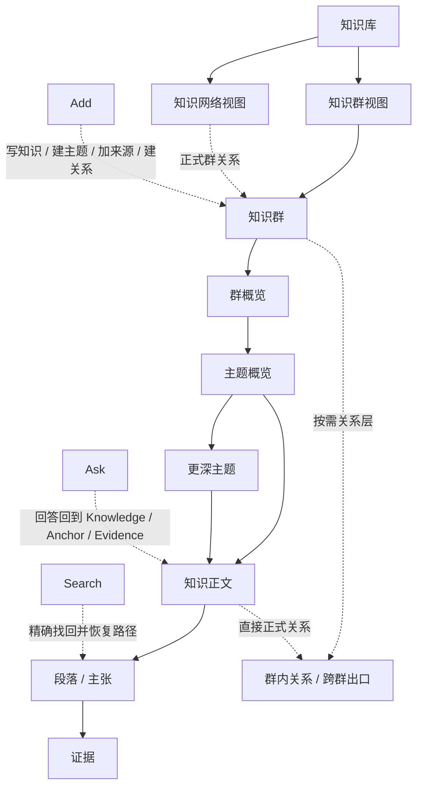

# AI-native 个人知识库

## 终局产品设计文档 v4.0 — Personal Knowledge Library

> **版本状态说明（2026-08-10）：HISTORICAL。本文件已经由 v5.0、继而由 `AI-native-个人知识库-终局产品设计文档-v6.0.md` 取代；冲突时以用户最新明确意图和 v6.0 为准。**  
> 文档日期：2026-08-06  
> 最近修订：2026-08-10（新增第二真实端到端夹具；同步研究条件、多 Placement、父子 Question、同 pair 多关系与程序知识边界）  
> 文档状态：**历史深层合同；非当前 Canonical 入口**  
> 文档性质：终局产品设计，不是 MVP、技术方案、界面稿、原型授权或商业计划  
> 工作名：Personal Knowledge Library；仅用于产品讨论，不代表最终品牌  
> 当前阶段：先确认产品本身；方向 3 的层级阅读与方向 2 的关系空间已被吸收为产品原则，但尚未授权制作新原型  
> 历史取代关系（v4.0 发布时）：本文件曾取代 `AI-native-个人知识库-产品定义-v3.0.md` 作为产品本体入口；v3.0 与专项合同保留为决策历史、深层模型和验收依据
> 核心心智模型：`AI-native-个人知识库-核心心智模型与连续探索合同-v1.0.md`；它对旧合同中的“四 Places / 四 Group Roots”拥有领域覆写权
> 首日到日常旅程：`AI-native-个人知识库-首日到日常核心旅程合同-v1.0.md`；它对旧文档中的强制 onboarding、三个同权 Seed Hero、首日必须建立 Topic / Relation，以及空库 Ask 行为拥有领域覆写权
> 规模化知识空间：`AI-native-个人知识库-规模化知识空间与长期可浏览性合同-v1.0.md`；它对旧文档中的自动 Group regions、Top-N 核心节点、Recent 默认首页、规模阈值切换产品模式与全图全边拥有领域覆写权
> 知识群长期状态：`AI-native-个人知识库-知识群状态演化与身份连续性合同-v1.0.md`；它对旧文档中的单一 `formation_phase`、`Established → Evolving`、`Dormant → prior phase` 与“五个形成阶段”拥有领域覆写权
> 关系陈述生命周期：`AI-native-个人知识库-关系陈述生命周期与网络可信性合同-v1.0.md`；它对旧文档中的 Relation `proposal_state / epistemic_state / freshness_state`、`active / superseded / archived` 单轴生命周期、Evidence 触发语义 Revision、以及 Split / Merge 静默继承关系拥有领域覆写权
> 群级关系聚合门槛：`AI-native-个人知识库-群级关系聚合门槛与支撑充分性合同-v1.0.md`；它对旧文档中的“多条跨群 paths 即可提出群关系”、raw path count、可靠来源自动直写、core / bridge 数量、关系强度分数与 Candidate 排名拥有领域覆写权
> 群级关系类型注册表：`AI-native-个人知识库-群级关系类型注册表与语义互斥合同-v1.0.md`；它对旧 Group-level `overlaps_with`、`shares_core_knowledge_with` 正式类型、宽泛 `influences`、类型方向 / 互斥 / 迁移与视觉编码拥有领域覆写权
> 知识群对照与关系检查器：`AI-native-个人知识库-知识群对照与关系检查器合同-v1.0.md`；它对 Compare pair identity、Current / Shared / Paths / Suggested / History 顺序、snapshot consistency、Pair Ask、Graph / List / mobile 等价与 exact return 拥有领域覆写权
> 知识关系类型注册表：`AI-native-个人知识库-知识关系类型注册表与跨层语义合同-v1.0.md`；它对 Knowledge-level 25-type registry、Evidence / Answer support 与 semantic support 分权、`blocks / overlaps_with` 收紧、`implements`、`supersedes / retracts / reopens / uncertain_about` 降级、跨层 namespace 与类型迁移拥有领域覆写权
> 问题知识与求解生命周期：`AI-native-个人知识库-问题知识、未知与求解生命周期合同-v1.0.md`；它对 Query Turn、Runtime Unknown、Persistent Gap、Conflict 与 Question Knowledge 的边界，QuestionTargetReference、Resolution Criteria、部分 / 暂时 / 充分回答、暂停 / 结束 / 重开 / successor，以及 AI 不自动解决问题拥有领域覆写权
> 真实端到端内容夹具：`AI-native-个人知识库-真实端到端使用样例与设计数据夹具-v1.0.md`；它用“法国私人租房、Visale 与住房补助”跑通 Group → Overview → Question → Ask → 形成 Knowledge → Relation → 变化复核 → Reopen，作为产品真实性与未来 Screen 2 / 3 的内容证明输入，不新增产品中心、不授权原型
> 第二真实端到端夹具：`AI-native-个人知识库-第二真实端到端夹具-概念学习、多语境复用与群关系-v1.0.md`；它用“记忆与学习科学 → 个人学习策略设计”验证概念层级、同一 Knowledge 多 Placement、研究条件、父子 Question、Shared Knowledge 与同 pair 的 foundation / method 双关系，证明本产品不是资格规则查询系统，也不新增学习模块或任务中心

---

# 阅读规则与证据边界

## 这份文档解决什么

这份文档只回答五个问题：

1. 用户最终得到的是一个什么产品；
2. 用户如何建立、理解、查询和探索知识；
3. 知识群、层级、关系、AI 与来源怎样组成同一个体验；
4. 哪些能力必须完整存在，哪些复杂度不应长期可见；
5. 后续设计图需要证明什么，才算开始接近完整产品设计。

它不要求读者先理解十四类资源、六个数据平面、状态机或内部记录。那些内容仍然重要，但只能证明产品决定可以被可靠实现，不能反过来定义用户看到的产品。

## 事实标记

| 标记 | 含义 | 使用纪律 |
|---|---|---|
| **[用户确认]** | 用户已经明确表达 | 不因竞品或技术便利改变 |
| **[研究事实]** | 官方文档或研究可以直接支持 | 必须能回到来源 |
| **[产品决定]** | 本产品选择 | 可被后续验证推翻，但在推翻前约束设计 |
| **[待验证假设]** | 尚无真实用户证据 | 不写成已成立结果 |
| **[开放项]** | 当前不应擅自决定 | 不阻塞产品本体时留到下一阶段 |

## 文档优先级

发生冲突时，按以下顺序处理：

1. 用户最新明确意图；
2. 本 v4.0 产品定义；
3. 产品语言、核心导航与知识群工作区合同；
4. AI、搜索、来源、编辑、对象等专项合同；
5. 交互、流程板、状态图与完整性审计；
6. 旧 v3.0、Personal Cognitive OS、Project Continuity 文档与现有七张 Ardot 设计图。

低优先级文档可以增加证明，不能新增或改写高优先级产品中心。任何影响产品本体的新决定必须先进入本文件，再同步到专项合同和设计证据。

---

# 0. 最终产品答案

## 0.1 一句话定义

> **一个把用户的资料与思考组织成知识群、层级和有意义关系，并允许用户通过阅读、网络探索或 AI 查询不断深入的本地优先个人知识库。**

## 0.2 用户实际拥有的东西

用户最终拥有的不是一批 AI 摘要、卡片、聊天或文件索引，而是一张可以长期进入的个人知识世界：

- 一个个拥有清楚边界的**知识群**；
- 每个知识群都有可读的**群概览**与丰富的**目录层级**；有必要的 Topic 还拥有局部概览；
- 用户可以从群概览进入主题概览、下一层主题、知识正文、具体段落和原始证据；
- 知识群之间、知识之间存在有语义、有方向、可解释的**关系**；
- 用户可以直接浏览，也可以向全部知识或当前范围**提问**；
- 新资料与新思考可以修正既有理解，但不会静默覆盖历史；
- 所有知识、关系、来源、版本与路径都可以完整带走和恢复。

## 0.3 产品的三个主动作

这个产品每天最重要的行为只有三类：

1. **理解**：从整体进入细节，获得结构化认识；
2. **探索**：沿层级、关系和路径发现相邻知识；
3. **调用**：通过搜索或 AI 问题找到、综合并重新进入知识。

建设、导入、整理、冲突、历史、备份和恢复是让这三类行为长期成立的完整性责任。它们必须可靠存在，但不能与知识本身争夺产品中心。

## 0.4 产品的可见骨架



知识库是唯一主地点。知识群视图与知识网络视图观察同一套 Group；Ask、Search、Add 是全局动作；来源库、历史、回收站、备份与设置是完整但降权的支撑入口。进入 Group、Topic 与 Knowledge 后沿同一阅读现场连续深入，关系只在需要时以 Peek、Companion 或 Explore 出现。

## 0.5 它不是什么

它不是：

- 以聊天记录为主要资产的 AI 助手；
- 以文件和文件夹为最终组织方式的文档库；
- 要求用户先搭数据库、模板和标签体系的低代码工具；
- 把所有节点画在无限画布上的装饰性知识图谱；
- 以 Review、Activity、Today 或通知队列驱动使用的维护系统；
- 以自动捕获、屏幕回放或项目恢复为唯一中心的 Cognitive OS；
- 通用项目管理、任务排期或团队审批系统。

Project Resume、写作工作台、学习路线和研究专题都可以由知识群派生，但不能改变产品本体。

---

# 1. 用户、问题与产品结果

## 1.1 用户已经确认的核心需求

**[用户确认]** 产品必须同时满足：

1. 知识以一个个知识群存在；
2. 知识群之间的关系可以看见；
3. 知识拥有从 Overview 到细节的丰富层级；
4. 用户可以用 AI 查询自己的知识；
5. 用户可以在知识网络中主动探索；
6. 视觉上希望层级阅读与关系空间结合；
7. 当前先定义好产品，不马上制作原型。

任何功能如果不能增强这七项中的至少一项，也不是长期所有权或可信度所必需，就不应进入产品中心。

## 1.2 首要用户

**[待验证假设]** 首要用户是长期处理多个复杂知识范围、需要反复返回、深化与调用这些知识的个人。

他们可能是产品经理、研究者、创作者、学生、咨询顾问或独立开发者；职业不是准入条件，以下行为才是：

- 材料跨文档、网页、PDF、对话和时间存在；
- 同一个主题会持续数周、数月或更久；
- 既需要阅读和写作，也需要比较、判断与复用；
- 不愿把大量时间花在维护文件夹、标签和双向链接上；
- 不接受无法定位来源、范围和历史的 AI 结论；
- 希望知识逐渐变得更清楚，而不是只变得更多。

## 1.3 五个核心问题

### 材料很多，但没有形成理解

文件、笔记和网页保存了内容，却没有告诉用户整个领域怎样组成、应该从哪里开始、不同材料之间有什么关系。

### 手工整理成本与真实工作竞争

用户必须不断决定文件夹、标签、拆分粒度、链接和模板。维护系统本身逐渐成为第二份工作。

### AI 回答只解决这一问

一次回答可能有用，但脱离用户已有结构；新综合留在聊天里，下次再次生成，不能成为长期资产。

### 全局图谱能展示复杂，却难以支持理解

当所有节点同时出现，用户看见的是密度，而不是方向、层级、关系含义和阅读顺序。

### 新信息会增加副本，而不是演化理解

新资料、旧结论、不同条件和相互矛盾的来源被并排堆积，用户不知道当前应相信什么、为什么改变、历史去了哪里。

## 1.4 核心 Jobs to Be Done

| Job | 用户期望的结果 | 产品必须避免 |
|---|---|---|
| 建立整体理解 | 快速说清一个领域的边界、主干和入口 | 用文件数量或 AI 摘要冒充结构 |
| 深入细节 | 从 Overview 连续进入主题、知识、段落与证据 | 摘要直接跳原文、丢失中间理解层 |
| 找回知识 | 知道某条知识在哪里、还出现在哪里 | 返回相似片段或重复副本 |
| 查询知识 | 得到基于明确范围、有依据的回答 | 把通用模型知识混入个人知识而不说明 |
| 探索连接 | 沿有含义的关系进入相邻知识群或节点 | 把共现、相似度和引用都画成正式关系 |
| 形成知识 | 从资料或思考形成可编辑、可复用的知识 | AI 候选卡片倾倒给用户 |
| 修正理解 | 一次纠正传播到概览、关系和未来回答 | 静默覆盖旧版本或保留错误派生 |
| 长期拥有 | 可离线使用、完整导出和可靠恢复 | 只能导出扁平文本或依赖云服务取回 |

## 1.5 非目标用户

本产品不优先服务：

- 只需要一次性对一批文件问答的人；
- 主要需要团队权限、审批和发布流程的人；
- 主要需要任务排期、看板和资源管理的人；
- 主要希望搭建任意业务数据库和自动化的人；
- 只想画自由脑图或无限白板的人；
- 只想让系统自动捕获一切、自己不参与判断的人。

---

# 2. 产品宪法

以下原则共同定义产品。任何界面、AI 能力或工程便利与之冲突时，优先遵守这些原则。

## 2.1 Knowledge before Documents

来源文档是输入与证据，用户长期浏览的是知识群、主题、知识和关系。文件夹不能成为最终知识架构。

## 2.2 Overview before Detail

每个重要知识范围先提供整体定位，再允许深入。Overview 不是 AI 摘要，而是这个范围当前最稳定、最有用的入口知识。

## 2.3 Hierarchy and Graph are Complementary

层级回答“它属于哪里、怎样从整体进入局部”；关系回答“它还与什么有关、为什么有关”。二者共享对象，但不能互相替代。

## 2.4 One Knowledge, Multiple Contexts

同一条知识可以出现在多个知识群和主题中，但正文身份只有一份。不同位置可以拥有局部说明，不复制 canonical knowledge。

## 2.5 AI Navigates Knowledge

AI 的首要责任是理解问题范围、找到相关知识、组织回答、说明依据并带用户回到知识路径。聊天不能成为第二个知识库。

## 2.6 Evidence Remains Reachable

重要主张、关系和综合必须能够回到具体来源片段、版本与上下文。证据不可被 AI 静默改写。

## 2.7 User-owned Canonical Knowledge

用户明确写下、接受、修改或锁定的知识拥有稳定身份和版本。AI 输出默认是建议或回答，不自动成为当前知识。

## 2.8 Unknown and Conflict are Knowledge

不知道、证据不足、条件不同、观点冲突和来源不可用都是合法状态。产品不得用流畅文本消除不确定性。

但“合法状态”不等于“都自动成为一条知识”。一次 Ask 的 Runtime Unknown 只解释本次为什么没能充分回答；局部缺口可以先成为附着在对象上的 Gap Marker；相互不兼容的主张由 Conflict 保存。只有当用户决定某个未知值得长期求解时，它才成为拥有稳定 identity、Current Revision、Placements、targets、resolution criteria、当前回答依据与历史的 **Question Knowledge**。

Question 的求解程度、继续追问意愿、依据变化提醒与 Library 存续状态彼此独立。`已充分回答 · 仍在继续研究`与`尚未回答 · 已停止追问`都是合法状态；“关闭”不等于“回答”，“出现一段 Answer”也不等于“已采纳”。AI 只能提出 criteria coverage、Resolution Proposal 或变化影响，不能自动宣布 resolved、停止追问或重新打开。

## 2.9 Direct Authoring is First-class

用户可以从空白开始建立知识群、主题、知识和关系，不必先导入资料或调用 AI。没有外部来源不等于知识无效，但作者与依据类型必须清楚。

## 2.10 Structure Evolves without Silent Rewriting

目录、概览、关系和群边界可以变化；任何高影响变化都必须保留旧理解、说明影响、允许暂缓与撤销。

## 2.11 Local-first Personal Ownership

用户在 AI、网络或外部来源不可用时仍能浏览、搜索、编辑、导出和恢复知识。云端能力可以增强，不成为所有权前提。

## 2.12 Deep Model, Calm Surface

内部可以严谨，表面必须安静。日常用户只需要理解：知识群、主题、知识、关系、来源。复杂度只有在改变当前判断或动作后果时出现。

## 2.13 Curation before Ranking

“这是理解当前范围最重要的入口”是一项编辑判断，不是点击率、更新时间、向量相似度或 AI 排名。人工策展、结构顺序、规则投影与本次推荐必须分开；动态相关性可以帮助用户继续，不能静默改写知识的稳定阅读主干。

## 2.14 Continuous Knowledge, Precise Addressing

一条 Knowledge 首先是一篇围绕一个主要理解任务持续演化的连续正文，不是一袋卡片；但它的章节、主张、例子与证据又必须可以被精确进入、引用、核验和修复。**连续阅读与局部可寻址必须同时成立。** 内部 Block、Section 与 Anchor 服务这项能力，不自动成为新的知识对象；只有需要独立理解、独立适用、独立求证、独立关系、独立复用或独立修订的内容，才提升为新的 Knowledge。

## 2.15 Meaning before Edge

关系首先是一条可以读懂、质疑、限定和修订的知识陈述，其次才是一条图上的线。任何 edge 都必须回答“哪两个稳定对象，以什么方向、在什么条件下、为什么相连”；相似、共现、引用、结构邻接、一次检索路径或空间距离都不能只因被画成线就获得关系真值。

## 2.16 Context before Answer

回答首先是对一个明确知识范围的临时解释，其次才是一段生成文本。产品必须先知道用户要求查什么、系统实际查了什么、最终用了什么，再允许答案显得流畅。**Answer 是知识的可核验视图，不是新的真值层；保存 Answer 只保存历史，只有用户选择的具体内容经过写回才改变 Knowledge。**

## 2.17 Boundary is not Membership

知识群的边界回答“这个范围打算理解什么”，Placement 与 Source Attachment 回答“目前哪些知识和材料被放进这里”。二者必须互相检查，但不能互相冒充：添加一条 Knowledge 不会静默扩大边界，修改边界也不会自动移动、删除或接受任何内容。**范围意图、当前内容与动态观察是三种不同真相。**

## 2.18 Location is not Journey

结构路径回答“我在哪里”，返回历史回答“我刚才从哪里来”，探索轨迹回答“这一轮怎样走到这里”，保存路线回答“哪个理解顺序值得长期复用”，继续位置回答“下次从哪里接上”。五者共享对象但不共享写入、生命周期或删除后果。**自由探索不能污染知识，阅读进度也不能改写路线本身。**

## 2.19 Protection is not Approval

输入出现在编辑器、近期修改已被本机恢复保护、内容已更新为当前知识、修改已等待同步、派生索引已完成刷新，是五个不同事实。普通用户直接写作在安全的本地提交边界后更新当前知识，不需要再“完成并采用”；恢复保护不能冒充当前知识，网络同步也不能成为当前知识成立的前提。

---

# 3. 用户可理解的产品模型

## 3.1 五个日常概念

| 概念 | 用户问题 | 不是什么 |
|---|---|---|
| **知识群** | 这一整个知识范围是什么 | 文件夹、标签集合、数据库表 |
| **主题** | 当前分支是什么、由哪些更深主题与知识组成 | 独立知识副本、子知识群 |
| **知识** | 我可以独立阅读、理解和复用什么 | 每个段落都拆成一张卡片 |
| **关系** | 两条知识或两个知识群为什么相连 | 相似度、共现、装饰连线 |
| **来源** | 这条理解来自哪里、能否核验 | 只剩 URL 或附件名称 |

Overview、目录、证据、路径、历史与建议可以使用普通语言按需出现，但不成为用户必须先学习的新本体。

## 3.2 产品对象关系

```text
个人知识空间
  知识群
    群概览
    主题层级
      主题
        ├─ 可选的局部概览
        ├─ 子主题
        └─ 知识位置 ─────────┐
    群关系                    │
    群来源                    │
                              ▼
  知识 ── 稳定身份
    ├─ 当前正文版本 ── Section / Content Block ── Anchor
    │    ├─ 连续 Knowledge Paper
    │    └─ 局部主张 ── Evidence Binding ── Source Fragment
    ├─ 出现在一个或多个知识群与主题
    ├─ 与其他知识建立语义关系
    └─ 由零个或多个来源片段支撑、限定或挑战

  关系 ── 稳定陈述身份
    ├─ 两个端点与语义角色
    ├─ 类型 / 方向 / 反向读法
    ├─ 适用条件 / why it matters
    └─ Evidence / Revision / History

  来源 ── 不可变版本 ── 可定位片段 ── 具体知识或关系
```

## 3.3 用户看不见但产品必须维护的区分

以下内部责任仍然存在，但默认通过所属知识、关系或来源进入：

- 知识身份与它在某个主题中的位置；
- 当前采用版本与未完成修改；
- 来源本身、来源版本和具体证据片段；
- 正式关系与关系候选；
- 一次 AI 问题、一次执行与保存的回答；
- 动态视图规则与当前计算结果；
- 一次变更、它影响的对象与撤销链；
- 当前工作现场、选择、滚动、筛选和图谱位置。

稳定 ID、可深链或可导出不自动让内部记录成为新的用户对象、页面或导航入口。

## 3.4 一份知识，多处出现

同一知识可以：

- 在“认知科学 / 记忆”中作为理论；
- 在“AI Agent 产品设计 / 知识模型”中作为设计基础；
- 被两个 Overview 引用；
- 出现在一次 AI 回答与一条 Saved Path 中。

这些位置共享同一知识正文与版本。每个位置可以保存“为什么它在这里重要”的局部说明。修改知识本身会影响所有位置；只修改当前说明不会改写其他语境。

## 3.5 Topic 是可阅读的局部范围，但不是 Subgroup

Topic 不只是目录标签。用户**显式打开**任意深度的 Topic，都应先获得对当前分支的局部方向感：它在父级中承担什么、有哪些子主题与代表知识、当前缺口在哪里、从哪里继续。这个局部概览属于 Topic 本身，可以被直接编辑和版本化；没有足够内容时，一句说明加真实结构投影已经成立，不生成占位长文。目录中的 disclosure / expand 只展开子项，不改变主阅读目标；点击具体 Knowledge 则直接进入 Knowledge，不被 Topic Overview 截停。

Topic 仍然没有独立 Group 边界、四个群级根入口、Group Relation 身份、完整来源政策或 Library Network 节点身份。它的局部关系只投影后代 Knowledge 已有的正式关系、结构连接与跨群出口；Topic 本身不是正式 Relation 端点，也不拥有第二份 Knowledge 正文。

当一个 Topic 已经形成独立边界、长期进入价值、稳定跨群关系和可脱离父 Group 理解的整体时，用户可以把它提升为新的 Knowledge Group；原位置保留 Gateway，旧 Topic Overview 进入历史，新 Group 建立新的 Overview identity，不复制成两处同步正文。

---

# 4. Knowledge Group：有边界的知识空间

## 4.1 定义

> **Knowledge Group 是围绕一个领域、长期问题、对象或工作范围形成的、有边界且可独立进入的知识空间。**

它的本体不是书、文件夹或图，而是同一批具有稳定身份的知识及其范围。它同时拥有两种互补结构：

- **阅读主干**：Group Overview → Topic Overview → 更深 Topic → Knowledge → Detail → Evidence，让用户纵向建立理解；
- **关系场**：Knowledge Relations 与少量 Group exits，让用户横向发现依赖、冲突、对照和跨群方向。

默认阅读体验更接近一册会演化、会连接的知识书，而不是文件夹：

- 有一句清楚边界；
- 有整体概览和进入路径；
- 有稳定目录与可继续扩展的主题；
- 有可独立阅读的知识正文；
- 有对外关系与跨群入口；
- 有使用过的来源和可核验证据；
- 会随着新知识形成、重组、分裂、合并或休眠。

“知识书”只是阅读比喻，不是产品本体或线性存储模型。与传统书不同，同一条 Knowledge 可以出现在多个 Group 中，目录可持续重组，并且可以沿正式 Relation 跨入另一个知识空间。

## 4.2 创建门槛与稳定边界分开

创建 Group 不是一次本体资格考试。用户只要想把一个范围作为整体继续理解，输入名称即可创建合法 Bare Group；边界句可选，无内容、无 Topic、无 Source、无 Relation 都不影响它成立。

当 Group 开始增长时，用以下信号检查它是否仍是有用的独立知识范围：

1. 用户会主动把它作为整体进入；
2. 它能逐渐说清包含什么、不包含什么；
3. 它已有或预期形成多个可组织的知识部分；
4. 它值得拥有独立 Overview 或查询作用域；
5. 它会在较长时间内继续演化。

这些是反思信号，不是硬性得分。当一个已成长 Group 长期只剩标签、一次任务、来源类型或临时筛选价值时，产品可建议改为 Topic、View、Saved Path 或 Source bundle / View，但不自动重组。

与其他 Group 建立 Relation 是价值增强，不是 Group 准入条件。第一个、唯一一个或长期孤立的 Group 都必须完整可用。

### 4.2.1 六种合法起点，共用一种 Group identity

用户不是为了完成分类而创建 Group，而是决定把某个范围作为整体反复进入、理解、查询和维护。产品支持六种起点：

| 起点 | 提交后的 canonical 结果 | 关键边界 |
|---|---|---|
| **空白** | Bare Group | 名称即成立；不自动生成假目录、假概览或假关系 |
| **选择已有 Knowledge** | Group + active Placements | 每个 existing Placement 可 move / keep both / reference；Knowledge identity 与正文不复制 |
| **一组 Sources** | Group + Source Attachments | Source-only 是成功；解析或 AI 形成失败不制造占位 Knowledge |
| **Topic 提升** | Group + lineage + 原位置 Gateway | 迁移结构，不在父 Group 与新 Group 维护同步 Topic tree |
| **View / Search 当前结果** | Group + 当前显式选择的 Placements | View 继续动态；future matches 不自动进入 Group |
| **导入层级** | Group + 映射后的 Topics / Placements / Attachments + import lineage | folder / heading / tag 先预览映射，不自动等于知识边界 |

Blank 只需要名称。其他路径根据影响显示紧凑预览或完整 Change Set：暂定边界、纳入 / 排除 identities、existing Placements、Source Attachments、初始 Topics 与 Relation / Overview / Path / Ask impact。产品不把所有创建都做成重型向导，也不因为入口不同生成多种 Group。

### 4.2.2 Group Candidate 是可丢弃方案，不是半成立知识群

AI 可以从 Unplaced Knowledge、Sources、Topic growth、Saved View 或重复探索中提出 Group Candidate，但它必须同时解释：

- 为什么这是可独立再次进入的范围，而不是 Topic、View、Saved Path 或一次相似度簇；
- 建议 Boundary 与明确排除项；
- 哪些 Knowledge / Sources 被纳入或排除，依据是什么；
- existing Placements 如何 move / keep both / reference；
- 初始 Topics 只是怎样的建议，不是已形成结构；
- 接受后哪些 Overview、Relations、Paths 与 Ask scopes 会受影响。

Candidate 是短期 Formation State，不拥有 `group_id`、Overview、stable URL、Relations 或 History，不进入 Library catalog、Network、Search、Ask 默认范围或 canonical export。接受时才把当时计划冻结为原子 Change Set 并建立 Group；拒绝 / 丢弃不产生任何结构副作用，同一证据没有变化时不反复提示。

系统主动提出 Candidate 的必要条件是：边界可独立说明、存在独立再次进入意图、已有多个连贯方向或稳定知识集合、纳入与排除理由可解释；并至少出现独立 Sources、跨群出口、重复进入或父 Group 失去方向中的一个增强信号。数量、文件夹名、共同 tag / Source、一次 Query 与 embedding similarity 只能帮助发现，不能单独触发创建。

## 4.3 边界、内容与观察是三种不同真相

一个成熟 Group 同时维护三层，但日常只用一句边界和真实内容表达：

| 层 | 回答的问题 | 由什么改变 |
|---|---|---|
| **Boundary** | 这个知识群打算理解什么、明确不处理什么 | 用户直接编辑或接受 Boundary Diff |
| **Current Contents** | 目前哪些 Knowledge、Topics 与 Sources 在这里 | Placement、Topic parent、Source Attachment 与 lifecycle 变化 |
| **Observation** | 此刻按什么条件查看这批内容 | View、Search、Ask、filter、sort 与 Query Run |

Boundary 不是由所有成员标题自动拼出的标签，也不是内容的硬校验器：

- 加入一条超出边界的 Knowledge 可以作为 example、bridge 或 reference，但产品显示一次 `边界张力`，让用户决定调整 Placement、限定 Boundary 或保留例外；
- 扩大或收窄 Boundary 不自动新增、移动、归档或删除任何 Knowledge / Source；它只刷新 Scope interpretation，并对 Overview、Ask defaults、策展入口和 Group Relations 提出影响；
- 一次 Search / Ask 同时使用多个 Groups 不改变任何 Group 的 Boundary 或 Membership；
- View 命中一批内容不等于它们形成一个 Group；反之，Group 内容暂时稀少也不失去边界 identity。

Group title 与 aliases 是进入语言，不是 identity。改名、补充 includes / excludes 或澄清 Applicability 通常创建新的 Boundary Revision，保持同一 Group；如果 governing question 与长期用途已经被替换，应创建 successor Group、Split 或 Merge，并保留 redirect，而不是让同一个 identity 静默换成另一个知识范围。

## 4.4 固定组成：一个连续 Group scene

每个 Group 固定具备四类完整责任，但不把它们变成四个同权后台 Roots：

| 责任 | 回答的问题 | 默认呈现 |
|---|---|---|
| **概览** | 这是什么、边界是什么、从哪里开始 | 普通打开 Group / Topic 的主阅读面 |
| **结构** | 它由哪些层级组成、我在哪里 | DepthTrail、结构 rail、正文中的子项与完整 tree mode |
| **关系** | 这里的知识为什么相连、还通向哪里 | R0 隐退；按需 Peek、Companion 或 Explore |
| **来源** | 当前范围使用了哪些材料、怎样核验 | Scope summary、Evidence 入口与 supporting Source utility |

打开 Topic、Knowledge 或具体 Anchor 后，产品沿同一 Group shell 和 Reading Path 连续深入。Group / Topic / Knowledge 不切换成不同应用；关系半径的变化也不改变阅读位置。

变化、历史和“需要你判断”同样不成为常驻入口。普通变化进入对象历史；影响当前理解时，Overview 最多出现一条提示；需要高影响判断时，从受影响对象打开 contextual Knowledge Decision Workspace。

## 4.5 Scope Overview：概览是一种递归责任

Overview 不是只存在于 Group 首页的一篇摘要，而是每个有意义阅读范围的**方向说明**。Group 与 Topic 使用同一种基本责任：先让用户理解“我进入了什么范围”，再让用户决定继续读、沿关系探索还是提问。

一个 Scope Overview 最多承担六件事：

1. **定位**：当前范围是什么，在父级中承担什么；
2. **结构**：有哪些直接子主题与主要方向；
3. **代表知识**：哪些 Knowledge 最能建立初始理解；
4. **关系出口**：哪些正式 Knowledge Relations 或跨群路径值得继续；
5. **未知与边界**：哪里仍空白、争议或不在当前范围；
6. **下一入口**：下一步最值得打开哪个 Topic、Knowledge、Path 或问题。

不是每个 Overview 都必须写成长文。结构和代表知识可以从当前真相投影；用户写的方向说明在本地持久化后就是当前版本；AI 或系统只能提出可检查 Diff。需要独立引用、正式关系或证据支撑的主张应提升为 Knowledge，Overview 只链接它，不形成隐藏的第二套知识正文。

## 4.6 Group Overview

Group Overview 是整个知识空间的 canonical orientation，也是普通打开 Group 时的默认入口。它在通用 Scope Overview 责任之外，必须说明：

1. 这个知识群关于什么；
2. 它包括与不包括什么；
3. 先理解哪三到五个主要方向；
4. 哪些知识最能代表当前整体；
5. 与哪些知识群有重要关系；
6. 当前有哪些真正影响整体理解的未知或变化；
7. 用户可以从哪里继续阅读、探索或提问。

Group Overview 是可维护的知识产品，不是 Dashboard、活动流或每次进入重新生成的 AI 摘要。人工文字使用同一正文与版本历史演化；目录、关系和来源概况可以刷新投影，但不能静默重写人工整体解释。

Bare Group 的 Overview 不伪造概览文字或三个假 Topic。它诚实显示已有名称、可选边界与真实内容，以“写下第一条知识”为主动作，“添加来源 / 建立主题”为次要入口。当内容足以形成整体解释时，才邀请用户补充概览或检查 AI 建议。

## 4.7 Topic Overview

**[产品决定] 显式打开任意深度 Topic，默认进入同一 Group shell 中的 Topic Reading 顶部；这里先出现一个紧凑的局部开场，而不是自动跳到第一篇 Knowledge，也不是再经过一张独立 Overview 页面。** Topic Overview 是 Topic Reading 的开头区域，结构与正文在同一个连续 surface 中向下展开。

这一决定避免两种极端：直接打开第一篇 Knowledge 会让某一篇内容被迫代表整个分支；每层都放一张完整 Overview 页面又会把深入变成重复的“中转大厅”。正确形态是**可轻可重、默认紧凑、与结构连续**的局部方向说明。

默认组合：

- 它在父 Group / Topic 中承担的作用；
- 直接子 Topic 及它们的区别与推荐顺序；
- 少量代表 Knowledge 与为什么先读；
- 后代 Knowledge 中真正相关的正式关系、跨分支桥接与跨群出口；
- 当前 knowledge gaps、争议或覆盖边界；
- 一条清楚的继续阅读入口。

Topic Opening 使用三种内容密度，但始终是同一个 Topic、同一个 Overview identity 与同一条 Reading Path：

| 密度 | 适用条件 | P0 默认内容 | 不做 |
|---|---|---|---|
| **Bare** | 新建、空 Topic、只有单一分支或只有 Sources | title、DepthTrail、已有一句说明、真实直接子项、添加 / 继续动作 | AI 填充介绍、空关系区、空“知识缺口” |
| **Compact** | 默认成熟度；结构已可辨认但无需独立长叙事 | 1–3 句局部 Orientation、stable start 或 structure fallback、3–5 个主要直接方向 | 重复父 Overview、罗列全部后代 Knowledge |
| **Editorial** | 当前 Topic 已形成需要长期维护的局部综合、争议或阅读顺序 | Compact 全部内容 + accepted synthesis、条件 / 分歧、少量关系出口与推荐 Path | 把可独立核验的知识藏在概览 prose |

密度不是 formation phase、质量等级或用户必须选择的模板。它由当前 accepted Overview content 与真实结构决定：删除长叙事会自然退回 Compact，空 Topic 保持 Bare；系统不能为视觉对称自动升档。

进入动作固定分权：

| 用户动作 | 结果 |
|---|---|
| 在层级树 disclosure / Expand Topic | 只展开 children；主阅读、History 与 Resume 不变 |
| Focus / Inspect Topic | 显示局部 Preview；不写 ReturnStack 或 Trail |
| Enter / Open Topic | 打开 Topic Reading 顶部的局部开场 |
| 点击 Topic 下的 Knowledge row | 直接打开该 Knowledge 与 Placement context |
| 点击 stable start / `按目录开始` | 显式进入对应 Topic、Knowledge 或 Saved Path |
| Search / Ask / Relation 命中深层 Knowledge / Anchor | 直接进入 exact target；Topic Overview 通过 DepthTrail 与 Up 可达，不强制插入 |
| Resume | 恢复 last-safe exact scene，不重置到 Topic 顶部 |

Topic Reading 顶部的 P0 可见预算固定为：当前 Topic 身份与路径、一段局部 Orientation、一个 stable start 或明确标注的 structure fallback、三至五个直接方向。代表 Knowledge、关系出口、缺口、Sources 与 descendant rollup 进入 P1；长 Editorial synthesis 只在真实存在时连续展开，不以卡片墙并列。

深层去重使用“差异说明”而不是复制：Group Overview 讲整体边界；父 Topic 讲父分支；当前 Topic 只说明自己在父级中的作用、与兄弟分支的区别和当前局部进入顺序。祖先内容收敛为 DepthTrail 与最多一句 context，不复制 Boundary、主要结论、全部 Relations、Sources 或变化状态。Projection 永远从 direct children 开始；`包含子主题`是显式 rollup，不为祖先生成镜像 Placement。

单一子项 Topic 不自动重定向，也不伪装成 Knowledge。它先用 Bare / Compact 开场解释这个结构节点为何存在，再给出唯一进入动作；若长期只有一个子项、没有独立 Orientation、没有兄弟边界且不承担稳定路径，系统可以提出 flatten 建议，但拒绝零副作用。

Topic Overview 遵守五条边界：

1. **可递归，不套工作区**：Topic 可以任意嵌套，但不会获得自己的四个根入口、Header 系统或 Library Network 节点；
2. **局部，不缩写整个群**：只解释当前分支，不重复 Group 边界、全部主要结论和所有群关系；
3. **可空，不伪造**：新建或内容不足时显示真实子项与开始动作，不生成泛化介绍；
4. **可编辑，不重复知识**：用户文字直接版本化；可独立复用或核验的段落提升为 Knowledge，而不是在 Overview 留下影子正文；
5. **关系是投影，不是 Topic 边**：展示后代 Knowledge 的正式 Relations 与结构出口，不把 Topic 变成正式 Relation endpoint。

这让每一级都“先理解当前局部，再继续深入”，同时避免把 Topic 变成一层层 Subgroup。

## 4.8 Group Contents

目录负责完整阅读主干与结构编辑，不是文件夹树的重新包装：

- Topic 表达理解顺序、局部范围与父子结构；
- 每个 Topic 可打开局部 Overview，但是否拥有长叙事由内容决定；
- Knowledge placement 表达一条知识在当前 Group 中的位置；
- 同一知识可以出现于多个 Topic，但正文不复制；
- 拖动前必须说明是移动当前出现位置、增加另一个位置还是跨群迁移；
- 临时排序和筛选不改写语义顺序；
- 空 Topic、过深层级和重复分支需要被识别，但不自动重构。

Topic 的递归深度不设硬上限；默认只展开当前路径、少量兄弟、一级子主题和代表 Knowledge。丰富层级用于建立方向感，不要求用户逐级点击：Search、Ask、Library Network 和 deep link 都可直接进入深层对象，同时恢复完整 DepthTrail。

每个 Placement 只有一个**直接容器**：某个 Topic 或 Group root。由此必须区分：

- `直接放在这里`：Placement 直接指向当前 Topic；
- `包含子主题`：当前 Topic 的后代 Topics 中存在 Placement；
- `在这个知识群中`：任意 active Placement 可解析到该 Group；
- `未归入知识群`：Knowledge 没有任何 active Placement。

后代内容属于当前 Topic 的查询和阅读**范围**，但不会在每个祖先 Topic 再创建 Placement。若同一 Knowledge 在一个父 Topic 和子 Topic 都有直接 Placement，必须保留两个不同的 contextual roles，否则建议合并入口。直接放在 Group root 的 Knowledge 是合法的群内知识，适用于 Bare Group、跨主题基础知识或尚不需要 Topic 的内容；它不是“未归类”，也不形成整理债务。

Topic Overview、Search 与 Ask 默认说明当前显示的是`直接内容`还是`包含子主题`。同一 Knowledge 在多个后代路径出现时按 identity 去重，同时保留所有实际进入路径与 contextual summaries。

## 4.9 Source Attachment：材料可以先属于一个范围，而不必先形成知识

Source-only 必须能保留用户添加材料时的知识语境。产品使用 `Source Attachment` 表达“这份材料被直接加入某个 Group 或 Topic”，但它不是 Knowledge Placement、Evidence Binding 或 Source 的复制品。

用户在 Group 或任意深度 Topic 中添加 Source 时：

1. Source 先在全局 Sources 获得唯一 identity 与可用 Revision；
2. 同时建立指向当前 Group / Topic 的 Source Attachment；
3. 即使没有形成任何 Knowledge、Annotation 或 Evidence，这个材料仍能从原范围再次找到；
4. Topic 没有第五个`来源`Root；Topic Overview、局部动作或 Group Sources 的范围筛选负责进入这些材料；
5. 从 Source 后续形成 Knowledge 或 Evidence 时新增对应 Placement / Binding，不替换原 Attachment；
6. 移除 Attachment 只取消“直接加入这里”的语境，不删除 Source、其他 Attachments、Annotations、Fragments 或 Evidence Bindings。

Group Sources 对同一 Source 只显示一个 identity，并展开三类原因：

- 直接加入这个 Group 或其某个 Topic；
- 用于当前 Group 内已接受 Knowledge / Relation / Overview 的 Evidence；
- 通过跨群共享 Knowledge 被引用。

直接 Attachment 可以精确显示 Topic path；后两类是根据当前 knowledge / evidence truth 推导的范围投影。删除 Topic 时必须先处理它的 Source Attachments：移动到父级、移动到另一个 Topic、只移除当前语境，或随 Topic transformation 迁移；任何选择都不删除 Source identity。

## 4.10 阅读策展：知识怎样成为一个可理解的整体

知识进入同一 Group，不代表它们已经组成可读的知识整体。产品必须明确区分四层责任：

| 层 | 决定什么 | 真相来源 | 能否自动改变 |
|---|---|---|---|
| **结构顺序** | Topic 父子关系、同级语义顺序、Knowledge placement 顺序 | Contents 的 canonical structure | 用户直接修改；AI 只能提结构方案 |
| **编辑策展** | 为什么从这里开始、哪些 Topic / Knowledge 最能代表当前范围、哪条 Path 值得推荐 | Scope Overview 的 Editorial / Navigation references | 用户直接修改；AI 只能提出 Diff |
| **规则投影** | 按当前结构显示哪些子项、关系、缺口或覆盖结果 | 可解释 Projection rule | 可刷新结果，不改结构或策展判断 |
| **会话引导** | 继续上次阅读、当前问题相关、这次探索的下一步 | Workspace state / Query run / recommendation | 可随当前任务变化，不进入长期知识真相 |

### 4.10.1 策展不是新的日常对象

用户不需要学习“Curation”或维护一张额外配置表。策展以普通动作存在：

- `设为从这里开始`：为当前 Group / Topic 选择一个稳定主入口；
- `作为代表知识`：在当前 Scope 中引用同一 Knowledge，并写明为什么重要；
- `调整理解顺序`：改变 Topic / placement 的 canonical semantic order；
- `推荐这条路径`：把已有 Saved Path 作为当前 Scope 的阅读路线，不复制其步骤；
- `取消推荐`：只移除当前 Scope 的策展角色，不删除 Knowledge、Topic 或 Path。

“代表知识”不是 Knowledge 的全局属性。同一 Knowledge 可以代表 Topic A，却只是 Topic B 的补充材料。策展记录绑定 `scope + object identity + role + rationale`，正文仍只有一份。

### 4.10.2 无策展也必须完整可用

Group 和 Topic 不以人工策展完成为成立条件。没有任何稳定策展时，Overview 使用可预测的无配置回退：

1. 显示用户写下的边界或一句局部说明；
2. 按 canonical semantic order 显示真实直接子 Topic；
3. 优先显示被明确标为代表的 Knowledge；没有时，只按 placement 顺序投影少量可独立阅读的 Knowledge；
4. 没有明确主入口时，使用第一个可读子 Topic / Knowledge，并写`按当前目录从这里开始`，不冒充用户推荐；
5. 没有可靠关系或 Path 时不补齐卡片，不制造“你可能感兴趣”。

这套回退让空白和自然生长的知识库立刻可读，又不把后续策展变成必须清零的维护债务。

### 4.10.3 稳定入口与动态相关性分开

同一 Overview 可以出现四种进入理由，但必须使用不同语言与位置；Stable Start 与 Structure Fallback 二选一作为范围主入口：

| 进入理由 | 用户看到 | 是否改写稳定阅读主干 |
|---|---|---:|
| Stable Start | 从这里开始 / 推荐路线 | 是，属于用户策展或已接受 Diff |
| Structure Fallback | 按当前目录从这里开始 | 否，只是无策展时的确定性回退 |
| Resume | 继续上次读到的位置 | 否，只恢复个人现场 |
| Contextual Next | 因为当前问题、缺口或关系而继续 | 否，只属于本次 Ask / Explore |

最近打开、编辑时间、点击频率、相似度和模型评分不能自动把一个对象变成“最重要”“代表知识”或“从这里开始”。它们只可影响会话引导，并必须解释“为什么现在显示”。

### 4.10.4 默认可见预算

一个成熟 Scope 的 P0 默认只有：一段 Orientation、一个 stable start 或 structure fallback、三到五个主要方向。P1 再展开少量代表 Knowledge、零到三条有明确目的的推荐 Path，以及真正改变理解的关系出口或缺口。

多个阅读目的不复制 Overview。用户可以把 Saved Path 标记为“快速理解”“建立基础”或其他自然语言目的；不存在真实第二条路径时，不为了对称强行生成。

### 4.10.5 阅读主干的变化传播

| 变化 | 自动发生 | 必须检查 |
|---|---|---|
| Knowledge 正文修订但 identity 与作用不变 | live excerpt 与当前标题刷新，策展引用保持 | 策展理由或 Overview 判断不再成立时提出 Diff |
| Knowledge 在同一 Scope 内移动 | 解析新 placement，旧入口保留 redirect | 新位置改变“为什么在这里”时检查 contextual rationale |
| 被策展对象离开当前 Scope、归档或删除 | 保留历史去向并使用明确的结构回退 | 不静默换成另一个“代表知识”；进入 `review_due` |
| Topic semantic order 改变 | Structure Projection 刷新 | Editorial prose 写明旧顺序时提出 Diff |
| 正式 Relation 变化 | live relation projection 刷新 | 该关系承担入口理由或综合判断时提出 Diff |
| AI 发现可能更好的入口或顺序 | 生成有理由、有影响预览的建议 | 未接受前不改 stable start、representatives 或 semantic order |
| 最近使用和个人行为变化 | Resume / contextual next 更新 | 永不因此改变 canonical curation |

产品应优先让过时策展退化为诚实的结构入口，而不是用另一个自动排名悄悄填洞。

## 4.11 Group 的长期状态：正交配置，不是五段升级

旧模型曾把 Seed、Forming、Established、Evolving、Dormant 排成一条互斥 `formation_phase`。这个抽象失效：前三项描述当前能否提供清楚 Orientation，Evolving 描述变化，Dormant 描述注意力，Archived 描述 lifecycle；它们可以同时成立，不能互相覆盖。

**[产品决定] Group 使用五个彼此独立的维度：**

| 维度 | 回答的问题 | canonical 值 | 影响 |
|---|---|---|---|
| **Orientation Profile** | 当前能怎样诚实呈现整体与进入路径 | `bare / structuring / oriented` | 只改变 Overview 的 Presentation；不是成熟度 |
| **Change Condition** | 是否有会影响当前理解的变化 | `no_material_change / changes_available / review_due / transition_in_progress` | 叠加可定位的 impact；不夺走普通阅读 |
| **Attention Mode** | 用户是否希望它参与当前注意力竞争 | `normal / paused` | Paused 仍是 current knowledge、仍可 Search / Ask |
| **Lifecycle State** | 它是否仍属于 current knowledge | `current / archived / trash` | Archive 可读可恢复；Trash 进入删除路径 |
| **Boundary Condition** | 当前范围是否仍保持同一 identity | `continuous / tension / revision_available / identity_transition_required` | 普通 Revision 保持 identity；不连续时 successor / split / merge |

例如，一个 Group 可以同时是：

```text
oriented + changes_available + paused + current + continuous
```

它的用户语义是：这个知识群仍有清楚 Overview，仍属于当前知识库，用户暂时暂停关注，同时有一项新变化可能影响部分理解。ordinary open 仍进入同一 Overview；顶部至多出现一条合成的 reorientation / impact 说明；Search、Ask、Relations、History 与 last-safe path 都不消失。

状态配置遵守以下边界：

- Bare、Structuring、Oriented 是由 accepted content、Boundary、Overview 与有效进入路径解析出的呈现能力；数量、年龄、Relation 度数与 AI confidence 不能决定；
- Oriented 不等于正确、完整、新鲜或“成熟”，Bare 不等于失败；Profile 改变不创建 Editorial revision、不改 Library 排序；
- Evolving 不再是 Group 阶段，而是 `changes_available / review_due` overlay；最后稳定理解和未受影响分支始终可读；
- Dormant 不再是形成阶段，而是用户控制的 `attention_mode = paused`；系统可以建议但不能自动执行；
- Paused 不等于 stale 或 Archived；Archived 不等于 Trash；Permanent Delete 只能从 Trash 发起并先解释影响；
- Rename、边界澄清、内容增删、Topic 重排和普通变化保持同一 `group_id`；governing question 被替换时才创建 successor / split / merge lineage；
- 状态只改变必要的信息权重、权限或一条事实 notice，不改变同一 Group shell、Overview identity、Reading Depth、Relation Radius 与返回语义。

完整 resolver、组合矩阵、Archive / Restore、Boundary continuity、事件分权与 20 项验收见`AI-native-个人知识库-知识群状态演化与身份连续性合同-v1.0.md`。

## 4.12 Group、Topic 与范围的结构变换

改名、移动、合并与拆分的后果不能共用一个模糊的“整理”动作：

| 操作 | 身份规则 | 必须预览 |
|---|---|---|
| **Topic rename** | 保持 Topic identity，旧标题成为可选 alias | Overview prose、Search 与路径显示 |
| **Topic move within Group** | 保持 Topic identity，只改变直接 parent 与 order | descendants、DepthTrail、Placements、Source Attachments、Overview 与 Paths |
| **Topic merge** | 选择 canonical Topic；另一 Topic redirect | child Topics、重复 Placements、两个 Overviews、attachments 与 saved entries |
| **Topic split** | 原 Topic 保留或成为结构入口；新 Topics 获得新 identity | 每个 child、Placement、Attachment、Overview Block 与 path 去向 |
| **Topic transfer across Groups** | 不是普通拖动；保留 lineage 并重新绑定 Group scope | Boundary fit、Topic parent、Placements、Attachments、Overviews、Ask history 与 exits |
| **Topic promotion** | 创建新 Group，旧 Topic 成为 Gateway | 知识 move / share、Attachments、Overview lineage、Relations 与 Paths |
| **Group split** | 新 Groups 获得独立 boundary / overview identity | 每个 Topic、Knowledge、Attachment、Relation、Source 与 Path 去向 |
| **Group merge / absorb** | 选择 canonical Group；被吸收 identity 保留 redirect 与历史 | Boundary、Topic trees、Overviews、source policy、Relations 与 Query history |

Topic move 只有在同一 Group 内才可以是低摩擦结构编辑；跨 Group 会改变 Scope、Ask、Group Sources、Overview 与 Library Network 解释，必须进入 `Topic Transfer` 影响预览。Merge Topics 不自动合并同名 Knowledge；Split Topic 不复制正文；删除 Topic 先逐项处理 child Topics、Knowledge Placements、Source Attachments、stable entry 与 Saved Paths，默认不删除任何 Knowledge 或 Source。

Group Boundary 的普通澄清保持 identity；governing question 被替换时使用 successor / split / merge。Archive 停止默认出现但保留可读入口、引用与恢复；Permanent Delete 只有在依赖、历史、导出和恢复后果清楚时成立。

所有高影响操作提交为可撤销 Change Set，并保留 old URL、redirect、historical Overview、Saved Answer Scope 与 lineage。一次历史 Undo 遇到后续新内容时必须进入三方影响预览，不能为恢复旧结构而删除后来形成的知识。

---
# 5. 从范围概览到 Evidence 的纵向理解

## 5.1 六个语义尺度

“深入”不是放大字体、展开无限卡片或在六张页面之间跳转。产品使用六个语义尺度表达同一知识世界：

| 尺度 | 用户理解 | 主要对象 | 主要动作 |
|---|---|---|---|
| L0 Knowledge Space | 我拥有哪些知识范围 | Groups + maintained current Group Relations | 选择群、比较整体、进入路径 |
| L1 Group Scope | 这个群整体是什么 | Group Overview + main Topics + representative Knowledge | 定位、选择方向、提问 |
| L2 Topic Scope（可递归） | 当前分支是什么、下一层怎样组成 | Topic Overview + direct children + representative Knowledge | 理解局部、进入下一层、重组 |
| L3 Knowledge | 这一条知识是什么 | 一份连续正文 + context + relations | 阅读、编辑、连接 |
| L4 Deep Detail | 它为什么成立、怎样工作、何时不成立 | sections、claims、examples、limits | 深入、比较、引用 |
| L5 Evidence | 依据到底是什么 | Source revision + exact fragment + context | 核验、对照、返回 |

L2 是一种可重复的语义尺度，不是“只能有一层 Topic”。`Topic > Subtopic > …` 每深入一级，都使用同一套局部 Overview 责任；层数改变结构位置，不制造新的对象类型或群级工作区。

这些是表达深度，不是六个固定 Route。用户可以从 Search 直接落到 L4 Anchor，也可以从 Library Network / R3 先进入 L1，再经过一个或多个 L2 逐步深入；产品始终保留父级位置与返回现场。

## 5.2 连续 Reading Path

路径固定表达为：

```text
Knowledge Group > Topic > … > Subtopic > Knowledge > Section / Anchor
```

进入更深层级时必须保留：

- 当前 Group 与 placement context；
- 所有祖先 Topic、当前 Scope Overview 与少量兄弟方向；
- 当前知识在其他 Group / Topic 的位置；
- 当前关系焦点；
- 打开前的 scroll、selection 和 viewport；
- 回到来源、回答、搜索结果或图谱边的原路径。

`Back` 不是“返回 Group 首页”。它恢复用户实际经过的知识路径和界面现场；`Up` 回到语义父范围。两者在直接搜索命中、跨关系进入和逐层阅读时可能不同，不能合并。

阅读主干也不是一条强制线性课程。它由稳定 Scope Overview、canonical semantic order 与当前选择共同形成；用户可以逐层浏览，也可以从 Search / Ask / Relation 直接进入。Saved Path 是为某个目的保存的一条具体理解路线；它可以被 Scope 推荐，但不取代目录顺序，也不因为访问次数增加而自动成为默认路线。

## 5.3 Knowledge Paper：一条知识的产品定义

> **Knowledge 是拥有稳定身份、围绕一个主要理解任务组织、可以独立进入并持续修订的知识单元；Knowledge Paper 是它当前版本的连续、可编辑正文。**

“主要理解任务”可以是解释一个概念、陈述并限定一个主张、说明一个方法、记录一个决定、追踪一个对象或事件、阐明一条原则，或持续回答一个问题。它可以只有几句话，也可以有数千字；长度、标题数、Block 数和模型切出的 chunk 数都不决定 identity。

内容保持在同一 Knowledge 中，当且仅当它们共同服务同一个主要理解任务，并且大体共享：

- 同一个可独立命名与进入的对象；
- 同一组核心适用条件与判断语境；
- 相近的修订节奏；
- 连续阅读所需的上下文；
- 用户对“修改这条知识”的共同预期。

因此，完整定义、推理、机制、步骤、例子、反例和限制可以共同构成一篇长 Knowledge Paper；不因“原子化”被拆成跳转链。反过来，一个只有三句的决定，只要需要被独立引用、修正和复用，也可以是完整 Knowledge。

## 5.4 四层内容模型

| 层 | 回答的问题 | 用户是否把它当知识对象 | 核心责任 |
|---|---|---|---|
| **Knowledge identity** | 这是哪一条知识 | 是 | 稳定 ID、标题、类型、关系、位置、适用条件与生命周期 |
| **Content Revision** | 这条知识在此时完整表达了什么 | 通过 Knowledge 进入 | 当前正文版本、作者、形成依据、变化说明与历史 |
| **Section / Content Block** | 正文怎样连续组织和编辑 | 否 | 标题、段落、列表、图表、引用与语义角色 |
| **Anchor** | 正文的确切哪一处 | 否 | Search、Ask、引用、Evidence、Path 与返回的稳定定位 |

Section 是阅读结构，Block 是编辑结构，Anchor 是 locator；三者都不能直接成为 Group member、Library 结果 identity 或正式 Relation endpoint。用户日常看到的是“知识 / 这一节 / 这一段 / 此处 / 依据”，而不是 Node、Block 和 Anchor。

正文只有一份 canonical content tree。定位、摘要、例子、限制不能再分别保存成互相漂移的六份真相；所有深度视图从同一当前版本投影，并能回到原文位置。

## 5.5 一份连续正文，多种语义骨架

所有 Knowledge 共享六类阅读责任，但不是六个必填字段、六张卡片或固定模板：

1. **定位**：它是什么、回答什么、为什么值得理解；
2. **核心理解**：最重要的定义、主张、原则、决定或机制；
3. **展开说明**：推理、结构、步骤、例子、反例或对照；
4. **条件与限制**：适用于谁、何时、在哪些情况下不成立；
5. **连接**：它与哪些知识或知识群相关，关系为什么成立；
6. **来源与历史**：依据、争议、未知、版本和变化。

类型只改变阅读优先级，不生成表单墙：

| Knowledge 类型 | 优先形成的阅读骨架 |
|---|---|
| Concept | 定义、边界、机制、例子、常见混淆 |
| Claim | 主张、适用条件、理由、支持与反证、当前状态 |
| Principle | 原则陈述、理由、适用范围、例外、应用示例 |
| Method | 目的、前置条件、步骤、失败模式、例子 |
| Decision | 决定、上下文、选项、理由、后果、何时被取代 |
| Entity / Event | 身份或发生了什么、时间线、重要主张、关系、来源 |
| Question / Inquiry | 问题、语境与适用范围、当前回答、怎样算回答、已有依据、剩余未知、targets / subquestions 与求解历史 |

如果某类责任尚未形成，阅读态不显示空卡。产品可以诚实显示“尚未记录限制”或把它列为 knowledge gap，但不把缺失伪装成生成内容。

## 5.6 同一正文的四个阅读深度

| 深度 | 用户要解决什么 | 呈现内容 | 禁止 |
|---|---|---|---|
| **D0 定位** | 这是什么、是否值得进入 | 标题、当前语境、用户写下的 orientation、最重要状态 | 另存一份 AI 摘要冒充正文 |
| **D1 综合** | 它由什么组成、关键条件是什么 | orientation、目录、关键理解、条件和主要入口 | 用几个卡片替代完整内容 |
| **D2 正文** | 连续理解、编辑和推理 | 完整 Knowledge Paper、内联引用与证据标记 | 把每个 Block 包成独立卡片 |
| **D3 证据** | 这句话凭什么成立 | 当前 Anchor、Source Fragment、上下文、版本与作用 | 脱离被核验主张打开孤立原文 |

D0–D3 共享同一个 Knowledge identity 和同一个当前 Content Revision。折叠与展开只改变呈现深度，不创建“摘要对象”“详情对象”或影子正文。直接搜索到 D2 的深 Anchor 时，用户仍能看到 D0 定位、当前目录路径和 Up；从 D3 返回时恢复同一 Anchor 与滚动位置。

## 5.7 内联 Claim 与 Claim Knowledge 的边界

“Claim”有三个容易混淆的含义，产品必须分开：

| 名称 | 身份 | 何时使用 |
|---|---|---|
| **内联主张** | Knowledge 内的一段语义内容，可有 Anchor；不是独立知识 | 与父 Knowledge 共享身份、适用条件和修订节奏 |
| **Claim Knowledge** | 类型为 Claim 的独立 Knowledge | 需要独立适用范围、证据、状态、关系、复用或修订 |
| **Answer Claim** | 一次 AI Answer 中的运行时陈述 | 只解释这次回答；保存或引用前不进入知识库本体 |

Section 或内联主张只有在出现以下一项或多项时，才值得提升为新 Knowledge：

- 可以脱离父文被独立命名、理解、成立或反驳；
- 需要自己的 Applicability、Evidence 集合或认识状态；
- 需要成为正式 Relation endpoint；
- 会跨 Knowledge、Topic 或 Group 独立复用；
- 与父 Knowledge 有不同的长期修订节奏；
- 用户反复从 Search / Ask / link 直接进入这一处。

AI 只能提出“把这一节变成独立知识”的有理由建议，不能按 Heading、段落、token 或检索热度自动拆分。用户可以接受、调整范围、以后再说或永久压低同一建议。提升后原 Knowledge 保留有语义的引用和旧 Anchor redirect，不制造两份同步正文。

## 5.8 引用与复用的四种语义

| 方式 | 用户看到什么 | 来源变化后 | 是否形成新 Knowledge |
|---|---|---|---|
| **Link** | 指向整条 Knowledge 或某个 Anchor | 打开当前版本 | 否 |
| **Live excerpt** | 在当前正文内显示目标 Knowledge 的当前局部内容 | 同步变化，并说明影响位置 | 否 |
| **Pinned excerpt** | 固定到某个历史 Revision / Anchor | 保持当时内容，可提示有新版本 | 否 |
| **Explicit quote** | 一份有出处的本地引文 | 不随来源变化，保留引用来源 | 否 |

Live excerpt 的编辑必须进入原 Knowledge，并提示它还出现在哪里；若用户需要局部独立修改，必须明确转换成 explicit quote 或创建新 Knowledge。引用不会自动增加 Group membership，也不会因相邻出现而产生正式 Relation。

## 5.9 Anchor、Evidence 与精确核验

Evidence 使用两段定位链：

```text
Knowledge + Content Revision + Anchor
  → Evidence Binding（supports / challenges / qualifies / defines / exemplifies / contextualizes）
  → Source + Source Revision + Source Fragment + locator / snapshot
```

Evidence 可以作用于整个 Knowledge，也可以精确作用于一条内联主张。Anchor 至少组合稳定 Block ID、所属 Revision、exact quote 与前后文；单独字符 offset 不足以承担长期定位。正文变化后，Anchor 只允许：

- **resolved**：仍唯一指向原位置；
- **redirected**：因移动、提升、拆分或合并指向新位置；
- **ambiguous**：存在多个合理候选，需要判断；
- **orphaned**：无法安全定位，保留旧 Revision 与快照。

只有唯一、可验证的匹配可以自动修复；相似度不能静默决定。进入证据时必须看见“哪一条知识的哪一句正在被核验”、来源上下文与该证据的作用；Back 恢复原 Claim / Anchor、Placement、滚动和进入路径。

## 5.10 Split、Merge 与 Promotion 是 identity 变换

拆分 Knowledge 不能只是剪切正文，合并也不能把 B 粘到 A 底部。产品必须预览并处理：

- 哪个 identity 保留、创建、redirect、archive 或 supersede；
- Sections、Blocks 与 Anchors 的迁移；
- Placements、Relations、Evidence、Backlinks 与 Applicability；
- Overviews、Saved Answers、Saved Paths 与引用的下游影响；
- 当前版本、历史版本、作者与形成依据；
- 提交失败、部分提交与 Undo。

能够唯一映射的旧链接进入新位置；不确定的重绑定保持待判断。任何变换都不能静默复制正文、丢失历史或把两个不同适用范围的主张压成一个“更完整”的结论。

## 5.11 Group Overview、Topic Overview 和 Knowledge 的分工

| 表面 | 保持什么 | 不应做什么 |
|---|---|---|
| Group Overview | 整个 Group 的边界、整体解释与主要入口 | 复制完整目录、保存所有细节 |
| Topic Overview | 当前分支的局部解释、子主题、代表知识与继续入口 | 重复 Group Overview、拥有群级入口或正式关系身份 |
| Topic structure | 父子层级、顺序与局部范围 | 拥有第二份 Knowledge 正文 |
| Knowledge Paper | 围绕一个主要理解任务的连续正文 | 变成每段一张卡片或领域全部内容的黑箱 |
| Section / Block | 阅读与编辑结构 | 冒充独立 Knowledge identity |
| Anchor | 精确进入正文位置 | 升级为新的用户对象 |
| Evidence | 核验整个 Knowledge 或具体主张 | 冒充知识正文或整体结论 |

## 5.12 Focus + Context

深入时，产品同时显示当前焦点与足够上下文：

- 当前 Group / Topic Overview 或 Knowledge Paper 是主阅读视图；
- 目录只展开当前路径与少量兄弟；
- 长 Knowledge 使用同一 Paper 内的 section outline，不虚构新的 Topic 层级；
- Topic Overview 的关系场只投影当前分支的重要正式关系与出口；Local Graph 只显示当前 Knowledge 的高价值一跳；
- Evidence 只围绕当前 Claim / Anchor；
- Overview 不在后台重置；
- 用户可以固定一个 Companion，但默认不无限增加面板。

这让方向 3 的层级阅读成为主轴，同时保留方向 2 的关系空间，而不是固定把文章与星图各占一半。

---

# 6. 横向关系与网络探索

## 6.1 三个关系尺度

产品有三种关系空间，不能合并成一个全量图：

| 空间 | 默认对象 | 回答的问题 | 默认密度 |
|---|---|---|---|
| **Library Network / R3** | Knowledge Groups | 我的知识世界由哪些整体组成、它们怎样相连 | 少量高价值群关系 |
| **Group Map** | Topics + bridge Knowledge + exits | 当前群内部主干怎样连接、从哪里跨群 | 主要分支与桥接点 |
| **Local Graph** | 当前 Knowledge + 一跳关系 | 这条知识最值得沿哪些方向继续 | 4–8 个任务相关对象 |

Library Network 不显示全部 Knowledge；Group Map 不复制完整 Topic tree；Local Graph 不冒充整个知识群。

Topic Overview 中看到的“局部关系场”不是第四种图谱或 Topic 关系层。它是当前 Topic 后代 Knowledge 的正式 Relations、结构连接和跨群出口的有界投影；需要检查或继续探索时，进入 Group Map、Local Graph 或对应 Knowledge。

## 6.2 Relation 是一条知识陈述，不是一条线

> **正式 Relation 是拥有稳定身份的语义陈述：A 在明确条件下，以一种可读、可核验的方式与 B 相连。**

一条 Relation 至少保存：

- 两个稳定端点及各自承担的语义角色；
- canonical relation type 与方向；
- 一句能独立读懂的 relation statement；
- Applicability、时间、对象或其他限定；
- 为什么这条关系值得存在；
- 形成依据、当前状态、Evidence 与历史；
- 可选的 endpoint Anchors，用于解释端点正文的哪一处参与关系。

例如默认不显示 `provides_foundation_for`，而显示：

> “认知科学”为“AI Agent 产品设计”提供关于注意、记忆与认知负荷的理论基础。

端点角色、类型、陈述或限定发生实质变化时，Relation 需要新的 Revision；新增或替换 Evidence 只更新独立 Binding / Support Set，不制造语义版本。如果已经变成另一条不同主张，则新建 Relation；只有新关系承担旧关系的当前解释角色时，才把旧 Relation 标为 superseded 并指向 successor，而不是偷偷复用同一个 edge identity。

## 6.3 方向、反向阅读与语义约束

每条有方向关系只保存一份 canonical assertion。用户从另一端进入时，产品使用 inverse reading label 阅读同一 Relation，例如：

```text
A provides_foundation_for B
B builds_on A
```

它们不是两条镜像边。对称关系只保存一份 normalized edge；同一对象不能与自己建立正式 Relation；同一对端点可以拥有多条不同关系，但每条必须在类型、限定或意义上真正不同。

关系类型还必须声明产品级语义约束：

| 约束 | 产品行为 |
|---|---|
| Directed | 保留 canonical from / to；从反方向派生可读 label |
| Symmetric | 只保存一份 normalized relation，A↔B 任一端打开相同 identity |
| Inverse pair | 两个动词是同一 assertion 的双向读法，不生成镜像记录 |
| Direct vs. derived | 用户直接建立的关系与系统推导路径分层，不把 closure 冒充直接陈述 |
| Transitivity | 默认关闭；只有类型合同明确允许时才产生 derived path，而且不会自动成为 maintained Relation |
| Cycle / self constraints | subtype、scope_within 等禁止 self 和不合法 cycle；similar / contrast 等不借此推导层级；successor standing 由 IdentityTransition 维护，不是 ordinary relation edge |

`A supports B` 与 `B supports C` 不推出 `A supports C`；`A similar_to B` 与 `B similar_to C` 也不推出 `A similar_to C`。系统可以显示一条多步 Path，但不能把 Path 压成一条新的直接边。

## 6.4 Knowledge Relation：五个家族、二十五种正式类型

Knowledge-level 类型使用独立 `knowledge.*` namespace；即使中文动词与 Group Relation 相同，也不共享 endpoint、充分性门槛或 TypeDefinitionRevision。完整精确定义、相邻类型互斥、旧数据迁移、场景与验收，以`AI-native-个人知识库-知识关系类型注册表与跨层语义合同-v1.0.md`为准。

默认创建从用户问题开始，而不是一次展示完整本体：

| 家族 | 用户先回答的问题 | Canonical types |
|---|---|---|
| 分类与组成 | 它是什么、属于什么、展示什么或由什么组成？ | `subtype_of`、`instance_of`、`exemplifies`、`defines`、`component_of` |
| 解释与因果结构 | 它为什么发生、怎样发生、使什么成为可能、阻止什么或依赖什么？ | `explains`、`causes`、`contributes_to`、`enables`、`prevents`、`depends_on`、`provides_foundation_for` |
| 论证与推导 | 一条理解怎样支持、反驳、限定、假设或推导另一条？ | `supports`、`contradicts`、`qualifies`、`assumes`、`derived_from` |
| 比较与应用 | 它们怎样相似、不同、部分重叠、适用或被实际采用？ | `contrasts_with`、`similar_to`、`partially_overlaps_with`、`applies_to`、`implements` |
| 时间与演化 | 它们怎样先后、精化或演化？ | `precedes`、`refines`、`evolved_from` |

`blocks` 改为精确的 `prevents` 或反向 `depends_on`；Knowledge-level `overlaps_with` deprecated，必须逐条检查 identity、subtype、component 与真正 partial overlap；`related_to` 永远不是正式关系。

`supersedes`、`retracts`、`reopens`、`uncertain_about` 不再进入 ordinary Knowledge Relation registry：取代由 `KnowledgeIdentityTransition` 与 current standing 表达，撤回由 disposition event 表达，重开由 Question lifecycle 表达，不确定对象由 Question Knowledge + `QuestionTargetReference` 表达。

创建关系时，产品先让用户选择自然意图，再展示当前 family 中 3–5 条完整候选句并即时回读方向。默认界面不能要求用户从二十五项英文 enum 中挑选；Network 也只使用五个 family visual tokens，edge label 与完整 statement 才是意义主载体。

## 6.5 五类连接必须分开

| 连接类型 | 回答的问题 | 是否进入正式图谱 |
|---|---|---|
| Structural | 它在哪里 | 否 |
| Evidence | 依据是什么 | 否 |
| Reference | 哪里提到它 | 否，可提出关系候选 |
| Semantic Relation | 为什么相连 | 是 |
| Retrieval Route | 为什么这次一起被使用 | 否，只属于本次 Search / Ask |

共享标签、向量相似、共现、正文相邻、画布距离和一次跳转不能直接生成正式边。它们可以解释候选或本次路径，不能充当 Relation truth。

## 6.6 创建关系：从一句人话开始

用户可以从 Knowledge、正文选区、Local Graph、Relation List 或 Library Network 开始：

1. 选择“建立关系”；
2. 搜索并确认另一个稳定端点；
3. 用自然意图选择关系家族；
4. 产品回读完整句子，并让用户校正方向；
5. 只有会改变含义时才要求补充条件、时间或比较维度；
6. 可选说明为什么重要、指向两端的具体段落、添加 Evidence；
7. 本地持久化成功后，用户直接创建的 Relation 成为当前关系；AI、来源抽取和系统推断先创建独立 `RelationCandidate`，接受后才物化为 Relation；
8. Receipt 说明创建了哪条关系、是否影响 Library Network / Overview，以及如何撤销。

关系可以 evidence-limited；缺少外部来源不阻止用户表达自己的理解，但形成依据必须诚实。`related_to` 只允许作为尚未定型的 Reference / Proposal，不进入默认正式图谱。

## 6.7 端点粒度与 Anchor

正式 Relation 的端点只有 Knowledge ↔ Knowledge 或 Group ↔ Group。Topic 负责结构范围与阅读入口，不成为 Relation endpoint；Topic↔Knowledge 使用 Placement，Knowledge / Relation→Evidence 使用 Evidence Binding。

当一条关系只涉及长 Knowledge 的某一部分时，Relation 可以保存 `from_anchor_ref? / to_anchor_ref?` 作为解释定位，但端点 identity 仍是 Knowledge。Anchor 变化时尝试安全重定位；ambiguous / orphaned 会让 Relation 进入 review_due，而不是悄悄改指其他段落。

如果局部主张需要自己的 Relation neighborhood、Applicability、Evidence 或长期状态，应先把它提升为独立 Knowledge。产品不能因为用户想连一条边，就自动把整段复制成新卡片。

## 6.8 跨群出口不等于 Group Relation

Knowledge A 与 Knowledge B 建立正式关系，而它们当前位于不同 Groups 时，产品可以在 Group Map 或 Topic Overview 显示一条**跨群出口**：

```text
当前 Knowledge → 正式 Knowledge Relation → 目标 Knowledge → 目标 Placement / Group
```

这条出口是真实可走的路径，但不是 Library Network 的 Group Relation。一个共享 Knowledge、一个跨群 Node Relation、一次 Saved Path、一个 Gateway 或一次 Ask 同时使用都不足以宣称两个 Groups 在整体上存在某种关系。

## 6.9 Group Relation：对两个知识范围的整体判断

Group Relation 回答：

> 为什么理解 Group A 会整体改变、支持、限定、应用或对照 Group B？

它有两种形成方式：

- **Direct**：用户亲自完成 Group endpoints、完整 statement、类型、方向与 Applicability 后明确提交；外部 Evidence 可以为空；
- **Aggregated**：系统、来源抽取或导入先形成聚合评估；只有满足资格时才提出 RelationCandidate，不能自动进入当前关系。

这里有四个不同 standing：cross-group exit 只说明“可以走过去”；aggregation signal 是系统观察；Group RelationCandidate 是已经通过资格检查但仍待用户判断的建议；maintained Group Relation 才是当前被用户拥有的群级知识。前两者永不进入 Current Network，Candidate 只进入 Suggested。

系统主动创建 Aggregated Candidate 时，不使用“至少三条边”或 confidence score，而逐项通过九道不能互相抵消的资格门：端点与 Boundary 可解析、能写成明确群级陈述、relation type 允许聚合、底层 paths 当前且 Applicability 可合并、重复与依赖已折叠、支撑真正触及两侧 Boundary、方向一致、反例与例外已检查、移除最强支撑后仍有合理 standing，以及当前值得占用用户注意力。

Raw paths 必须先折叠为 Effective Support Units：同一 assertion 的 inverse / mirror、同一 canonical Knowledge 的多 Placements、同一 Source / study lineage 的多份摘录或转述、同一 Query / Saved Path 的重复经过，都不能制造独立支撑。两个 Effective Support Units 只是系统主动建议的下限，不是充分条件；还必须形成 `bilateral_core`、`anchor_and_spread` 或明确写入 Applicability 的 `named_subscope`。`fringe_only` 只保留为出口。

Group-level formal registry 包含十一种类型：`scope_within`、`partially_overlaps_with`、`provides_foundation_for`、`provides_method_for`、`applies_to`、`complements`、`contrasts_with`、`challenges`、`constrains`、advanced `influences` 与 `evolved_from`。旧 Group-level `overlaps_with` deprecated；新类型明确要求双方 Boundary 只是部分相交、互不包含。Knowledge-level registry 也独立完成收紧：旧 `overlaps_with` 逐条迁移为 `knowledge.partially_overlaps_with`、identity resolution、taxonomy / composition 或无正式关系；不能因两个层级标签相同而共用定义。

`shares_core_knowledge_with` 不再是 formal Group Relation type。同一 canonical Knowledge 在两侧都承担 core / representative role 时，形成可重建的 `shared_core_knowledge` GroupConnectionObservation；它进入按需 Shared Knowledge Lens 与 Ask explanation，不需要采用，不拥有 Relation lifecycle，不计入 Relation count，也不影响 resting Network layout。它可以支撑更具体 Candidate，但不能替代群级陈述。

Type-specific 门槛继续成立：`scope_within`只能来自 Boundary；`evolved_from`需要 direct / indirect lineage；`provides_method_for`必须证明实际采用；`applies_to`只声明适用，不暗示采用；`complements`需要共同目标与非冗余贡献；`contrasts_with`需要共同维度但不判断谁错；`challenges`有方向并明确削弱对象；`constrains`减少选择空间；`influences`只有在机制明确且没有更窄类型时才作为 advanced fallback，系统 Candidate 默认只按需出现。

Aggregated Group Relation 在接受前只是 RelationCandidate。它必须列出 statement、direction、Applicability、Boundary coverage、去重后的 Effective Support Units、collapsed / excluded signals、CounterSignals、strongest-unit removal result，以及接受后 Library Network、Overview 与 Ask 会怎样变化。接受后才物化为独立 Relation；接受只确认群级陈述，不把底层路径合并、复制或锁死。用户直接建立 Relation 不受系统主动建议门槛阻止，但产品仍诚实显示它是 user-asserted、当前有哪些依据和限制。

底层支撑使用独立 `GroupRelationSupportSetRevision`。支撑变化不改 Relation statement，也不直接改当前采用；重大变化创建 Review Case，使 Group Relation 进入 `review_due`。它不静默消失，也不自动改类型或方向。用户可以 Maintain、创建同一 Relation 的新 Revision、End、Supersede、Retract 或 Defer。

## 6.10 同一对 Groups 可以有多条不同关系

“A 为 B 提供理论基础”和“A 与 B 在方法选择上形成对照”可能同时成立。它们不能被压成一条含糊的 `related_to`，也不能在 Library Network 上画成无法选择的重叠线。共享核心知识若存在，只作为可选观察层解释，不成为 Bundle member。

Library Network 使用 **Relation Bundle** 作为纯呈现容器：

- 保留每条 Relation 的独立 identity、类型、方向、状态与历史；
- 默认显示用户固定或当前任务最有解释价值的一句，并说明还有几条；
- Inspect 展开完整关系列表和 supporting paths；
- Bundle 的排序或折叠不改变任何 Relation truth；
- Query Highlight 可以临时提高某条 Relation 的显著性，关闭后恢复。

### Group Pair Comparison：把两群关系变成可读、可核验的工作现场

用户显式选择`比较两个知识群`后进入临时 `GroupPairComparisonState`，不是普通 Group open，也不创建新的 Primary Product Resource。Pair 使用规范化 unordered key，左右顺序只影响阅读排列；每条 directional Relation 仍保留自己的 from / to 与 inverse reading。

一次比较固定同一 `PairComparisonSnapshot`：两侧 Boundary / Overview revisions、Current Relation revisions、Registry revision、Candidate assessments、Placements / Knowledge identity basis 与 index coverage 必须属于同一 evaluation boundary。后台变化先提示`比较内容有更新`，由用户刷新；不能让两侧与关系区处在不同时间点。

主阅读责任依次是：Pair Orientation、Current formal Relations、Shared Knowledge Observation、cross-group paths、Suggestions / Unknown、Evidence & Limits、History / Change。Current / Shared / Paths / Suggested / History 不能按“连接数量”混排；Shared Lens 不改变 resting layout；没有 Relation 是合法结果。Ask in Pair 以两侧 Groups 为 Requested Scope，回答仍不写关系。Close / Back 通过 ReturnEnvelope 恢复原 Graph viewport、Relation、Ask Claim、Knowledge Anchor 或 List filter。

## 6.11 Relation 的长期变化、结束与失效

Relation 的 canonical truth 拆为正交责任：

- `assertion_disposition = maintained / ended / superseded / retracted` 回答当前怎样看待这条陈述；
- `change_condition = no_material_change / changes_available / review_due / transition_in_progress` 回答是否需要处理变化；
- Evidence Bindings 与 open Challenges 说明具体依据和反例，不压成一个 `epistemic_state`；
- `valid_from / valid_to / Applicability` 表达时间与适用范围，不使用含糊的 `stale`；
- `lifecycle_state = current / archived / trash` 只回答怎样保留对象，不表达真伪。

`ended` 表示在过去明确范围内成立但有效期结束；`superseded` 必须指向承担同一当前作用的 successor Relation；`retracted` 表示不再采纳且没有替代主张；Archive 只是默认排除。以下变化只触发 impact / review，不自动重写关系：

- endpoint Knowledge 的标题、正文或 Placement 变化；
- endpoint Anchor moved、ambiguous 或 orphaned；
- supporting Evidence unavailable、superseded 或受到挑战；
- Applicability、时间范围或 Group boundary 改变；
- endpoint 被 Split、Merge、Archive 或 Supersede；
- Aggregated Group Relation 的主要 supporting path 失效。

能够唯一映射且 identity 连续的 endpoint 或 Anchor 使用 redirect；无法唯一映射时保留旧 Revision 与 Relation history。Endpoint successor / split / scope-changing merge 创建逐边 `RelationTransitionCase`：新端点只得到 RelationCandidate，不静默继承 maintained edge；Merge 后形成 self-edge 的旧关系只保留历史。撤回 Relation 不删除端点、Evidence、Saved Path 或历史 Answer；这些下游对象显示影响，并保留当时使用的 Relation Revision。

## 6.12 候选关系不冒充知识

AI 可以提出 RelationCandidate，但它不是带 `proposal_state` 的 Relation，默认必须与正式 Relation 视觉和行为分开：

- 相似度、共同来源、引用或检索共现只解释“为什么被建议”；
- 用户可以接受、改类型、改方向、补充说明或拒绝；
- 被拒绝的候选只保留低成本 suppression memory，没有新证据或新语义依据时不反复出现；
- 候选不进入 Library Network resting state、Overview 的正式关系或默认 Ask truth；
- 用户在探索中临时经过一条 route，不自动保存为关系。

## 6.13 图与列表等价

每个图谱必须有正式 List Equivalent。二者共享：

- Scope；
- 对象与 Relation identity；
- relation statement、type、direction 与 endpoint roles；
- assertion disposition、RelationCandidate、open Challenge 与 review_due；
- direct / derived / Query-only provenance；
- filters；
- Focus、Inspect、Open；
- 当前路径和返回。

图负责空间模式与方向感，列表负责精确阅读、键盘操作、密集数据和无障碍使用。列表不是失败降级。

## 6.14 Focus、Inspect、Open、Compare

- **Focus**：只移动键盘或视觉焦点；
- **Inspect**：更新关系陈述、端点角色、依据与高亮，不改变正文；
- **Open**：明确让目标成为当前阅读对象并写入返回历史；
- **Compare**：临时并列少量对象，不创建关系或新知识。

Hover、Focus 或图谱选中不能暗中改变 Ask Scope、正文、History 或正式 Selection。点击 edge 默认先 Inspect Relation；只有用户选择端点或“进入这条路径”才 Open Knowledge。

## 6.15 探索连续性的五种状态

一次真正可继续的探索需要五种不同记录：

| 状态 | 回答的问题 | 生命周期 |
|---|---|---|
| **DepthTrail** | 我在结构的哪里 | 由当前 Scope、Placement 与 Anchor 计算 |
| **ReturnStack** | 我刚才从哪个现场来 | 当前窗口 / 标签页 |
| **ExplorationTrail** | 这一轮沿什么线索走过 | 当前探索会话 |
| **Saved Path** | 哪个理解顺序值得以后复用 | 长期、可版本化 |
| **PathProgress / ResumePoint** | 我下次从哪里继续 | 可清除的个人工作现场 |

DepthTrail、ReturnStack 与 Trail 都不是 Saved Path。最近访问、hover、图谱展开和正文滚动不会因为被记录就获得长期意义。

## 6.16 Inspect、Open 与场景操作怎样写入连续性

- Hover / Focus 只帮助定位，不写 History、Trail、Recent 或 Progress；
- Inspect 只查看局部语境，不改变 durable Reading Target，也不形成返回步骤；
- Open 才改变主要目标、捕获 Return Envelope，并在 active Exploration Session 中形成有意义的 Trail step；
- Compare 是临时有界集合，不自动成为 Path；
- Expand、filter、dismiss、group、pan、zoom、viewport 与 undo / redo 只改变当前 graph scene，不是知识、关系或路线步骤。

从正式 Relation 打开目标时，Trail step 保存 relation connector；从 Evidence、Reference、结构或 Query Route 进入时分别保留真实 connector kind。无法说明正式关系的跳转必须标为 manual / runtime，不能补一条假边。

## 6.17 Back、Forward、Up、Close 与 Resume

五个动作承担不同责任：

- **Back / Forward**：沿时间恢复前后工作现场，包括 Place、owner、Scope、Placement、Anchor、filter、viewport、scroll 与 focus；
- **Up**：沿 DepthTrail 返回结构父级，不回 Search、Answer 或 Library Network；
- **Close**：关闭最上层 Preview、Inspector、Overlay 或 Compare，并把 focus 还给触发点；
- **Resume**：恢复最近安全 Workspace 或 PathProgress，不重放 AI、提交、删除和外部副作用。

原位置失效时，先 repair Anchor、redirect 到 successor，再退到最近可解释父范围，并明确说明“原位置已变化”；不能无提示地回到 Library 根层或页面顶部。

## 6.18 分支与 Saved Path

Back 后打开新目标会形成探索分支：浏览器式 Forward 可以失效，但当前 Exploration Session 保留一个轻量的“刚才的另一条分支”。默认不展示复杂树；用户需要时可以恢复另一分支或从多条分支挑选步骤。

Saved Path 是用户主动策展的长期理解路线，至少保存 title、purpose、ordered steps、真实 connector、可选 placement context、step rationale 与 revision basis。保存前允许删除弯路、重排、补充未访问但必要的步骤，并明确 manual step。它不复制 Knowledge，不改变 Topic order，也不让相邻步骤自动升级为 Relation。

## 6.19 Saved Path 与 Progress 必须分开

Saved Path identity 与 Revision **不保存 `last_position`**。当前 step、完成 / 跳过、scroll、anchor 与 last-safe workspace 属于单独的 PathProgress / ResumePoint：

- Continue Path 只更新 Progress，不创建 Path revision；
- Reset Progress 不删除 Path 或 Overview 推荐引用；
- Path 增删或重排步骤才创建 revision；
- Node、Relation、Placement 或 Source 变化时，step 显示 current、redirected、changed、historical-only 或 unavailable；
- Re-evaluate 提出当前 successor / draft revision，不覆盖保存时路线；
- Query Route 只有经过用户显式筛选和编辑，才可转成 Saved Path draft。

完整对象、分支、变化与验收见`AI-native-个人知识库-探索路径、回返与继续合同-v1.0.md`。

---

# 7. Search、Ask 与 Explore 的分工

## 7.1 三种意图，三个不同结果

| 能力 | 用户意图 | 核心输出 | 不应发生 |
|---|---|---|---|
| **Search** | 我知道要找什么 | 已存在对象或精确位置 | 生成综合答案 |
| **Ask** | 我有一个问题 | 对明确知识范围的一次可核验解释 | 形成独立聊天知识库 |
| **Explore** | 我还不知道该问什么 | 可解释的相邻方向与路径 | 伪造关系或无限推荐 |

三者可以建议互相转换，但不能静默切换、扩大范围或写入知识。Ask 的结果最终仍应回到 Search 可以找到、Explore 可以继续、Reading 可以打开的同一批知识对象。

## 7.2 Search：找回已有知识，不替用户综合

Search 以稳定对象为结果单位：

- Group、Topic、Knowledge、Source、Saved Path、Saved Answer、View；
- 正文 Anchor 命中聚合回所属 Knowledge；
- Evidence Fragment 命中聚合回所属 Source，并保留精确 locator；
- 同一 Knowledge 多处出现只显示一个 identity，并说明其他位置；
- 同名不同 identity 在打开前消歧；
- exact title、alias、phrase 与 full text 优先于 semantic similarity；
- 结果说明为什么命中，不显示裸相关性百分比。

检索内部可以命中 Content Block、Section、Anchor 或 embedding chunk，但这些都只是定位手段。用户结果必须回到 `Knowledge identity + matched Anchor + 当前 Placement context`；不能让“片段 17”“chunk 42”成为可收藏、可连线或可放入 Group 的伪知识对象。

无结果必须限定实际 Scope、filters、索引覆盖、来源可用性和历史状态，不能直接说“知识库里没有”。

## 7.3 Ask 是一次知识操作，不是一个聊天容器

用户表面只需要看到“问题、当前范围、回答和继续动作”；产品内部必须把以下对象分开，才能保证回答可以解释、重试、保存和重评：

| 记录 | 责任 | 是否进入知识库 |
|---|---|---|
| **Ask Session** | 一段连续研究或追问的临时工作上下文 | 否；默认不进入 Library |
| **Query Turn** | 用户这一问的原始意图与 Context Delta | 否 |
| **Query Run** | 某次实际执行使用的范围、索引、模型、策略与状态 | 否；Retry / Re-evaluate 都创建新 Run |
| **Answer Snapshot** | 某个 Run 当时生成的 Claims、依据、Route、Coverage 与未知 | 否；未保存时只是工作现场 |
| **Saved Answer** | 用户明确保留的一份历史回答 | 是，但属于 Knowledge Snapshot，不是当前 Knowledge |

一个问题可以因 Retry、换模型、恢复失败或 Re-evaluate 产生多个 Runs；旧 Run 和旧 Answer 不被覆盖。Ask Session 可以分支或删除，但删除查询历史不会删除由其中显式形成的 Knowledge、Relation、Path 或 Source。

## 7.4 Scope Anchor 与 Expansion Policy 必须分开

`Scope Anchor` 回答“从哪里开始查”：全部知识、Group、Topic、Knowledge、Selection、Saved Path、Saved Answer 或 Sources。`Expansion Policy` 回答“从这些起点允许走多远”：

- 是否包含后代 Topic；
- 是否沿正式 Relations 扩展，以及最多几跳；
- 是否读取底层 Evidence 或指定 Sources；
- 是否包含 Draft / Proposed / Archived / Historical；
- 是否允许外部资料；
- 是否绑定特定人、地点、组织、条件与时间；
- 明确排除哪些对象。

系统可以继承当前 **Open target**，但 Focus、hover、Inspect 或屏幕上恰好可见的内容不扩大 Scope。Topic 是正式 Ask Scope：默认包含其当前 Overview、后代 Topic 的 Knowledge placements 及合法 Evidence；不自动包含父级、兄弟分支、整个 Group 或只因相似而命中的知识。

来源策略与知识状态也不能混在一个“全部”开关里。默认使用当前 Accepted Knowledge，并按需核验其 Evidence；`只看来源原文`、`包含未完成知识`、`查询历史时点`与`允许外部资料`都是独立且可见的选择。外部资料默认关闭。

## 7.5 Requested、Effective 与 Used Context

每个 Run 都保存三层 Context：

| 层级 | 回答的问题 | 产品规则 |
|---|---|---|
| **Requested Context** | 用户让我查什么 | 保存原始 Scope、条件、时间、来源策略与排除项 |
| **Effective Context** | 系统最终按什么范围执行 | 记录经用户允许的扩张、澄清、能力降级与实际索引覆盖 |
| **Used Context** | 哪些对象真正支撑或限定了回答 | 只包含实际进入 Claim Support 的 Knowledge、Relation、Evidence、输入或外部来源 |

检索到的 candidate 不等于 Used Context；没有进入任何 Claim 的对象不能被陈列成“回答依据”。Requested 与 Effective 不一致时，P0 用一句人话说明；完整差异、排除与索引状态按需展开。系统提出扩大范围但用户未同意时，可以说明另有相关内容，不能使用它完成答案。

## 7.6 Query Intent 塑造回答，不增加模式按钮

系统识别问题主要需要哪种回答形态，但默认不要求用户先选择模式：

- **直接理解**：是什么、怎样工作、有哪些条件；
- **综合**：多个 Knowledge / Groups 共同说明什么；
- **对照**：在统一维度下比较对象、条件或时期；
- **关系 / 路径解释**：为什么 A 与 B 相连，中间经过什么；
- **证据核验**：什么支持、限定或反驳某个 Claim；
- **冲突与适用性**：哪些只是条件不同，哪些真正冲突；
- **变化与历史**：现在与当时为什么不同；
- **缺口发现**：缺什么知识或证据才能回答；
- **决策支持**：在事实、约束、推论与价值判断分开的前提下比较选择。

Compare 必须显式列出被比较的 scopes 与共同维度；Explain Relation 必须区分正式 Relation、结构连接、Evidence connection 与 runtime retrieval jump；Decision Support 可以提出可逆下一步，但不能替用户执行决定。

## 7.7 Answer 的责任与渐进呈现

完整 Answer 模型保留 Direct Answer、Key Claims、Knowledge Route / Used Knowledge、Evidence、Conflict & Unknown、Coverage、Explore Next 与 Save / Transform 八类责任，但它们不是八个固定展开的界面区块。

| 层级 | 默认呈现 | 何时出现 |
|---|---|---|
| **P0 直接回答** | 最短充分答案、实际 Scope、主要 Claims 的内联依据、重要限制、0–3 个真实后续方向 | 所有正常回答 |
| **P1 理解依据** | Used Knowledge / Route、具体 Evidence、Coverage | 用户展开或依据会改变理解 |
| **P2 判断与转化** | Conflict / Unknown、版本对照、Context 详情、Save / Transform 后果 | 确有冲突、不足、历史问题或用户要写回 |

简单问题可以只有一段答案和几个可进入的知识链接；复杂问题才逐步展开。只要存在会改变结论的重要冲突、未知、范围变化或覆盖限制，必须在 P0 先给出短警示。没有真正有价值的后续方向时，不为满足格式强行生成“你还可以问”。

## 7.8 六种 Answer Basis 必须有不同声音

每个主要 Answer Claim 都要明确它以什么为基础：

| Basis | 默认语言 | 真值边界 |
|---|---|---|
| **Accepted Knowledge** | `来自你的知识` | 进入 Knowledge / Relation revision 与 Anchor，再按需进入 Evidence |
| **Source Statement** | `来源原文写道` | 进入 Source Fragment；不暗示用户已接受 |
| **Current User Input** | `根据你在本次问题中提供的信息` | 只属于当前 Run，除非用户另行保存 |
| **External Source** | `外部资料` | 必须有来源身份、访问时间和定位；不自动进入 Sources |
| **Reasoned Derivation** | `基于这些知识可以推断` | 列出输入 Claims 与推导限制；不冒充来源原话 |
| **Historical Answer Reference** | `在当时的回答中` | 只用于历史或元问题，并继续回到底层旧 revisions 与 support |

用户原创但没有外部 Source 的 Knowledge 仍然是合法的 Accepted Knowledge；产品说明作者与核验缺口，不把“没有引用”误写成“无效”。外部资料、来源原文和模型推论不得混成一种 citation 样式。

## 7.9 Answer Claim 与 Claim-level Support

事实陈述、主要结论、条件与例外、冲突判断、推荐前提以及“没有找到”都必须成为可单独核验的 Answer Claim。每条 Claim 的 support 可以扮演 `supports / qualifies / contradicts / context_only`；Overview 只提供范围定位时属于 `context_only`，不能代替具体证据。

Answer Claim 只属于本次 Query Run。它即使精确引用了某条 Knowledge 的 Anchor，也不会自动获得 Knowledge identity、Placement、认识状态或正式 Relation；只有用户选择具体 Claim 并执行“形成新 Knowledge”或“合入已有 Knowledge”，它才进入长期知识。

Citation 必须打开实际使用的 revision 与 Anchor / Source locator，显示足够上下文，并能 Back 回原 Claim。若原位置已移动，使用 redirect；无法唯一重定位时保留当时引用并标记 ambiguous / orphaned，不把相近段落伪装成原证据。

## 7.10 Coverage、Unknown、Conflict 与负面回答

Coverage 描述“这次检索是否覆盖到足够材料”，不等于答案语气的自信，也不等于是否存在冲突：

| Coverage | 含义 | 默认表达 |
|---|---|---|
| **sufficient** | 当前 Context 足以回答 | 不额外制造状态提示 |
| **partial** | 只能覆盖部分问题或范围 | `以下结论只覆盖……` |
| **insufficient** | 缺少决定性知识或条件 | `现有知识还不足以回答……` |
| **indeterminate** | 因索引、权限、来源或历史缺口无法判断覆盖 | `当前无法确认知识库是否包含完整答案……` |

Unknown 至少区分：没有相关知识、Evidence 有限、Scope 太窄、Applicability 缺失、Source unavailable、Index partial、历史缺口、External off、未解决冲突与必须由用户判断。不同原因给出不同下一步，不共享一个“暂无答案”。

只有在全 Scope、相关状态、索引、来源可用性与排除项都已完整检查时，系统才可以断言“知识库没有 X”。通常应说：`在当前选择的范围和已完成索引的内容中，没有找到 X；另有……尚未覆盖。`

文字不一致时先比较 Applicability、valid time 与 Source revision；条件不同优先表达为并存分支，相同条件下不能同时成立才进入 true conflict。

## 7.11 Knowledge Route 的忠实度

Route 可以包含结构连接、正式 Semantic Relation、Evidence connection、只属于本次检索的 retrieval jump 与外部来源。只有真实 Relation 才画成正式边。两个 Knowledge 仅因本次问题共同支撑一个 Claim 时，应分别连接到 Claim 并说明作用，不能自动生成 `related_to`。

无法形成可靠路径时显示 Used Knowledge List + Evidence；单一 Knowledge 可以只显示 Knowledge + Anchor；外部资料为主时显示 Source list。图不是每个回答的必需装饰。

## 7.12 回答必须回到知识

点击 Claim 或 Route Step 后：

- Reading 打开主要 Knowledge + Anchor；
- Relation companion 只高亮对应真实关系；
- Evidence 只显示支撑或限定该 Claim 的片段；
- Back 返回 Answer 的原 Claim 位置；
- 关闭临时 Query overlay 后，正式图谱恢复原状态。

AI 回答的价值不只在文本质量，而在能否让用户继续进入自己的知识世界。

## 7.13 Follow-up、Retry、Branch 与 Rephrase

追问继承上一 Run 的**实际 Context Snapshot**，不是重新读取当前页面，也不是把上一 Answer 当成 Evidence。任何 Scope、Applicability、时间、状态、来源、关系半径、排除或外部策略变化都形成一句可见的 `Context Delta`。

“它”“刚才第二点”“这条关系”优先绑定当前选中的 Answer Claim，其次绑定明确 Selection，再绑定上一 Turn 的焦点；无法唯一解析时只问一个必要问题。

- **Follow-up**：创建新 Turn + 新 Run，继承并修改 Context；
- **Retry**：同一 Turn 创建 successor Run；
- **Rephrase**：保留原 Turn，创建 sibling Turn；
- **Branch**：从历史 Turn 的 Context Snapshot 建立新分支；
- **Re-evaluate**：针对 Saved Answer，在当前知识上创建新 Run 与新 Answer Snapshot。

## 7.14 保存不是 Save Chat

用户选择明确后果：

| 动作 | 结果 |
|---|---|
| 保存回答 | 保存问题、Requested / Effective / Used Context、当时 Claims、Route、Evidence、Coverage 与运行策略；默认不作为当前事实 |
| 保存 Path | 保存用户确认的理解顺序，不复制 Knowledge，也不把 retrieval jump 升级为 Relation |
| 形成新 Knowledge | 只把所选 Claims 组织成围绕一个理解任务的可编辑 AI draft / proposal，保留来源与推论说明；用户接受后才进入当前知识 |
| 合入已有 Knowledge | 只生成所选 Claims 对目标 Section / Anchor 的 block-level patch，预览 add / replace / qualify / retract / add evidence |
| 提出 Relation | AI / 系统发现形成包含端点、类型、方向、Applicability、理由与 support 的 RelationCandidate；用户补全并提交则物化为 maintained Relation 与首个 RelationRevision |
| 建议更新 Overview | 形成对应 Anchor 与 Support Map 的 Semantic Diff，不直接覆盖正文 |
| 保存外部来源 | 保存 Source identity、访问时间与 snapshot policy，不自动接受其内容 |

完整 Answer 不得一键变成当前 Knowledge；保存一个 Claim 不顺带保存其他 Claims、全部外部网页或整个 Session。

## 7.15 Saved Answer 是历史快照，Re-evaluate 不覆盖它

Saved Answer 回答“当时在什么范围、依据哪些版本、怎样回答”，不是“现在应该相信什么”。普通当前事实查询默认排除 Saved Answers；只有历史问题或用户显式选择它们时才纳入 Context。

上游 Knowledge、Relation、Applicability、Source availability 或 Group structure 变化后，Saved Answer 原文保持不变，并在受影响 Claims 上显示原因。Re-evaluate 复制原问题与 Requested Context，在当前知识上创建新 Run；比较 Claim、support、Route、Coverage、Conflict、Unknown 与 Context 变化。新 Answer 不能覆盖 Original，也不能只因措辞相同就隐藏依据变化。

## 7.16 Streaming、取消与能力退化

系统可以先呈现已经完成 support alignment 的 Direct Answer，再补充 Route 或外部检索；尚未对齐依据的主要 Claim 不得以普通完成态出现。Stop 保留 incomplete Answer，Cancel 保留 Question 与 Context，Resume / Retry 创建 successor Run。

AI unavailable 时，Search、Reading、Graph、Evidence、Saved Answers 与手工创作仍然完整可用；Source 或 Index partial 时，用户可以基于明确选中的可用对象继续，但 Coverage 必须降级。模型不能访问本地 Scope、指定 Source 或所选策略时，提交前说明能力差异，不能静默改成 Web-only。

---

# 8. 建设、形成与维护知识

## 8.1 两条同等正式的起点

用户可以：

1. **直接写知识**：从空 Group、Topic 或全局 Add 开始；
2. **添加来源**：保存文件、网页、文本、图片、音视频或对话，再决定是否形成知识。

直接创作不是 AI 失败时的替代；Source-only 也不是未完成失败。

## 8.2 Add 的三个入口

全局“添加”只显示三个用户意图：

- 写下知识；
- 添加来源；
- 迁移旧知识库。

若粘贴文本无法判断是用户原创还是外部材料，只问：“这是你写下的知识，还是要保存的一份来源？”不先要求选择 schema、类型或 Group。

## 8.3 Capture 的双提交

外部材料进入时：

```text
真实输入保存为 Source
  → 可立即阅读、搜索和引用
  → 解析与索引
  → 可选 Knowledge Proposal
  → 用户选择或明确安全规则
  → Knowledge Commit
```

Source Commit 与 Knowledge Commit 分开。解析失败不能回滚已经保存的 Source；没有形成新 Knowledge 也可以是完整成功。

## 8.4 AI Knowledge Formation

AI 可以：

- 识别已有 Knowledge；
- 提出新 Knowledge；
- 提出 Topic placement；
- 提出 typed Relation；
- 发现现有理解可能受影响；
- 建议 Overview Diff；
- 提议 stable start、representative Knowledge 或 recommended Path，并说明它依据的是结构、知识缺口、正式关系还是当前任务。

系统不把所有候选变成卡片列表。候选先按相同目标、主张、结构或影响合并为 3–7 个高价值 Decision Bundles；其余候选可解释地归并、延后或忽略。

策展建议不能因为模型排名高、最近访问多或用户走过一次就自动生效；它进入 Overview Diff / curation proposal，拒绝后没有新依据不重复出现。

Identity Resolution 至少区分：同一来源新版本、重复来源、现有 Knowledge 的证据、现有 Knowledge 的修订、只增加语境位置、独立新 Knowledge、仅保存来源。

## 8.5 Direct Authoring

用户直接写 Knowledge 时，产品同时维护六种互不冒充的状态：

| 状态 | 责任 | 默认进入 Search / Ask / Overview / Graph |
|---|---|---:|
| **Edit Buffer** | 当前光标、选区、输入法组合和尚未安全提交的文字 | 否 |
| **Recovery Checkpoint** | 高频、本机、设备级的崩溃恢复保护 | 否 |
| **Current Revision** | 用户当前让知识库读取的不可变内容版本 | 是 |
| **Explicit Draft** | 用户明确选择“暂不用于当前知识”的修改线 | Search 可标记找回；其余默认否 |
| **Proposal** | AI、来源或系统提出的候选修改 | 否 |
| **Sync / Projection State** | 当前版本的远端同步与派生刷新进度 | 不决定 current；只说明传播是否完成 |

正常写作遵循以下合同：

- 用户亲手创建或修改的内容，在完成输入法组合并到达安全提交边界后，通过原子 `Direct Edit Commit` 更新 Current Revision，不再要求额外“采用自己的写作”；
- 安全边界包括短暂 idle、失焦、切换对象或模式、显式保存快捷键、导航、正常关闭，以及 Ask / Search / Projection 必须读取最新正文之前；阈值由真实设备验证，不写死为产品真理；
- 按键级和输入法组合期内容先留在 Edit Buffer；Recovery Checkpoint 可以更频繁地保护它，但半句话和活跃 composition 不进入默认回答、概览或图谱；
- Current Revision 内部保持不可变并向前演化；用户可见历史按一次可理解的编辑会话分组，不为每个字符制造版本噪音；
- 正文保持连续写作；Block 边界只在选择、编辑或精确引用时出现，不要求用户先把思考拆成卡片；
- 用户可以显式选择“作为草稿继续”，用于长篇重写、未完成想法或尚不想影响 Ask 的修改；
- AI 改写、来源抽取、导入结构和高影响跨对象变更仍默认为建议或预览，不因“去审批化”自动进入当前知识；
- 接受 inline AI completion 后，文字先成为用户 Edit Buffer 的普通编辑，下一次 Direct Edit Commit 即进入 current；已经完成 diff review 的结构化 Patch 可以把“接受”本身作为一次原子 commit，不再要求第二次采用；
- 可在没有 Placement 时继续写，并由 Library 的“未归类”找回；
- Ask 默认使用当前 Knowledge；显式草稿只在用户选择“包含草稿”时参与；
- 没有外部 Source 时记录作者为用户与依据类型，不伪造低置信分数。

只有三类情况需要显式提交：AI / 系统建议进入当前知识；一次动作同时改变多个 identity、relation 或 group boundary；从显式 Draft 切换为当前版本。

若用户从编辑器发起 Ask，系统先尝试 Direct Edit Commit；提交失败时不能静默把内存文字冒充当前知识。产品应保留原问题，并让用户选择`修复保存后提问`，或明确以`本次未提交文字`作为临时 Query Basis。后者不改变 current，也不被后续 Ask 默认继承。

Current Revision 与传播状态正交：离线但本地提交成功时显示`已更新当前知识，等待同步`；索引或 Overview Projection 延迟时，owner 页面必须立即读取新 current，Search / Ask 优先使用本地 delta，无法保证时明确写`索引正在更新`。派生失败不得回滚已经成功的 Direct Edit Commit。

## 8.6 编辑作用域

每次可能影响多个位置的编辑必须明确选择：

- 修改这条知识本身；
- 只修改它在当前 Topic / Group 中的说明；
- 另存为独立 Knowledge；
- 调整 Group 结构；
- 查看历史版本，不能直接编辑。

切换或扩大作用域前先保护未完成内容并显示影响。

## 8.7 变化、历史与决定

Change 是 event，不是长期容器。

- 普通编辑进入 owner History；
- 可重建投影刷新在原位置解释；
- 来源变更先在 Sources 修复 locator 与版本；
- 真正影响当前知识、identity、Group boundary、关键 Relation、Applicability 或 locked content 时，打开 Knowledge Decision；
- Library Resume 最多出现一条真正影响当前理解的提示；
- Group Overview 最多出现一条相关提示；
- 同一 event 只有一个 identity 和一个 Primary Destination。

## 8.8 Knowledge Decision Workspace

它不是一级 Place、Inbox 或 Queue。只有高影响判断才进入，并固定显示：

- 依据哪个 Base；
- 发生了什么；
- 哪些 Knowledge、Overview、Relations、Answers 或 Paths 受影响；
- 哪些内容保持不变；
- 可选方案与各自后果；
- 暂不处理会怎样；
- 提交、部分提交、失败隔离与撤销；
- 完成后回到哪里。

没有事项时，产品不显示空 Decision 页面、0 badge 或清零奖励。

## 8.9 Conflict

冲突先比较 Applicability：对象、组织、地点、条件与有效时间不同的两条 Claim 可以同时成立。只有同一条件下无法同时成立才进入 contested。

用户可以：

- 两者在不同范围成立；
- 保留 A 或 B 作为当前理解；
- 保持争议；
- 增加限定说明；
- 需要更多证据；
- 拆分为两条 Knowledge。

“选择 A”不自动删除 B，除非用户明确撤回。

## 8.10 History、Undo、Recovery 与 Backup

四者责任不同：

| 能力 | 解决什么 |
|---|---|
| Undo | 撤销刚才的局部动作 |
| Current History | 查看当前知识怎样随用户编辑演化 |
| Draft / Recovery | 继续显式草稿，或找回未安全完成的内容 |
| Change Set History | 查看多对象变更、影响与批次撤销 |
| Backup / Restore | 恢复完整知识资产与存储状态 |

恢复旧内容向前创建新 version，不删除中间历史。完整恢复必须验证 identity、层级、Relations、Sources、Evidence 与 versions，而不是只验证文件解压成功。

Recovery Checkpoint 只保护近期编辑现场，可以包含尚未成为 current 的不完整输入，并且默认只在产生它的设备上可用。它不是日常历史、不是显式草稿，也不是备份。异常退出后，用户先看到`近期修改已在本机保护，尚未更新当前知识`，检查或继续写作后再通过安全提交边界更新 current。

---

# 9. 产品信息架构

## 9.1 一个 Knowledge Library 主地点

产品不再要求用户在首页、知识库、图谱和来源四个同权地点间判断。唯一主地点是**知识库**，它用两个同义视图观察同一套 Group：

| Library view | 用户问题 | 默认内容 | 不承担 |
|---|---|---|---|
| **知识群** | 我拥有哪些知识范围、从哪里继续 | Groups、边界、主要方向、固定与最近入口、最多一条 Resume | 统计 Dashboard、任务队列、随机推荐 Feed |
| **知识网络** | 这些知识群为什么相连、可以向哪里探索 | Groups、maintained current Direct / adopted Aggregated Group Relations、filter、List Equivalent | 全 Knowledge 节点汤、相似度图、检索共现 |

两种视图共享 selection、filter、recent path 与 Library state。切换只改变观察方式，不改变 Group identity、关系真相或当前阅读现场。

## 9.2 全局动作

Search、Ask、Add 随处可用，不占 Place。Command 是高级快捷入口，不进入普通主导航。

每个动作继承当前 Open target 与范围，但继承内容必须可见；关闭或完成后恢复原 Library / Reading surface、owner、selection、anchor、scroll 和 focus。

## 9.3 知识库默认入口

**[产品决定] 默认入口采用“一个克制的 Resume + 稳定 Groups catalog”，且 catalog 始终拥有页面主权。** 普通启动恢复上次稳定的 Library mode、catalog scope、filter、selection hint 与 scroll；它不自动打开深层 Reading Workspace。只有用户显式点击`继续`，才恢复上次安全现场。

默认顺序是：

1. 最多一个可安全恢复的知识现场，明确标为`继续`；
2. 一个紧凑的用户 Pins 区域；没有 Pins 时整块消失；
3. 始终拥有页面主权、包含全部 active / dormant Groups 的稳定 Catalog；
4. 可选的 Saved Views / Paths / Saved Answers 与独立 Recent 入口；
5. 最多一条真正影响当前理解的 contextual notice；
6. 安静的 Search / Ask / Add。

All Groups 默认按语言感知标题稳定排序；用户可以显式切换并保存 Catalog View，但 Recent、点击频率、更新时间、AI relevance、关系度数与“活跃度”不静默重排。Recent 是次级 View，不成为默认内容流；Paused Group 仍在 Catalog，只有显式 Archive 才离开 current catalog。F1、F10、F100 使用同一个 Library、Row contract、ordinary open 与 Continue 后果；规模只增加 jump、filter、Saved Group View、progressive loading 与 focus，不触发第二套首页或 Search-first 模式。

普通点击 Group 始终打开 canonical Group Overview；只有明确点击`继续`才恢复 last-safe Reading Target、Anchor、scroll 与 Relation Companion。Library 的 Recent、Resume 和动态推荐不改变任何 Group / Topic 的 stable start、representative Knowledge 或 semantic order。

Resume 不是最近内容流，也不是另一个 Home：

- 最多一条；没有安全且有意义的 checkpoint 时整块消失；
- 固定显示`继续`、Group、当前 Knowledge / Topic、上次位置的一句话、last-safe time，以及`从群概览进入`；
- 只有沿明确 Saved Path 时才显示“第 3 步”等路线进度，不显示通用完成百分比；
- 排序依据只有 checkpoint 安全性、用户尚未结束的明确意图与时间，不使用 AI relevance、点击频率或内容重要性；
- Pin 是用户快捷入口，Recent 是访问记录，Resume 是一个可恢复现场，三者不合并、不互相排序。

| 进入条件 | 默认落点 | Resume 行为 | 禁止 |
|---|---|---|---|
| 有安全 checkpoint 的普通启动 | 上次稳定 Library catalog state | 显示最多一条，等待显式`继续` | 自动跳回深层正文或编辑器 |
| 有知识但无安全 checkpoint | 稳定 Groups catalog | 不显示 | 用随机最近对象填充 |
| 完全空 Library | Empty Library | 不显示 | 伪造示例知识群或 AI feed |
| 新窗口 | 独立 Stable Library state | 可引用当前最安全 Resume，但不自动恢复 | 复制另一个窗口的 live scene |
| checkpoint 需要修复 | 最近安全 Reading fallback | 说明“上次现场需要恢复”，提供恢复草稿 / 重新授权等动作 | 重放 IME、AI run、提交、删除或高影响 Decision |
| 目标已归档、删除或失效 | Stable Library 或最近可解释父范围 | 显示原目标变化与 repair / redirect | 静默换成相似内容 |
| AI / Index 离线 | 本地 Library catalog | 本地 checkpoint 仍可继续 | 因 AI 不可用而阻断浏览 |

多窗口各自保留 ReturnStack 与 live scene；Library 默认只突出全局最近一个安全 Resume，其他合法现场进入按需展开的`其他最近位置`，不堆叠多张竞争卡片。产品默认保持这一明确入口，不在普通设置中提供“启动后自动进入深层现场”；如果长期任务测试证明 Stable Library 与 last Library state 的偏好确实分裂，才考虑高级落点偏好。

## 9.4 连续 Group / Topic / Knowledge 场景

Group 不再被切成四个并列后台 Roots。打开 Group、Topic 与 Knowledge 后留在同一个持续阅读壳层：

- Group Overview 说明整体边界、主要方向、代表 Knowledge 与关键出口；
- Topic Reading 说明当前分支、子 Topic、直接 / 后代内容与局部出口；
- Knowledge Reading 让连续正文拥有主权，并按需打开其他 Placements、Relations、Evidence 与 History；
- 完整层级通过 DepthTrail、结构 rail 和正文中的继续入口持续可见；
- 关系通过 Peek、Companion 或 Explore 出现；来源通过当前范围或对象上下文进入。

因此“概览、目录、关系、来源”是同一 Group scene 的四类责任，不再是四个需要来回切换的一级 tabs。结构、关系与来源能力仍完整存在，且拥有稳定 deep link 和响应式等价。

## 9.5 知识网络视图与关系半径

Library Network resting state 只显示 Groups 与少量高价值正式 Group Relations。选中 Group 后显示 3–7 个主要邻接、关系陈述、依据和继续入口。

群内关系与单条 Knowledge 的 Local Relations 不是另一个 Place，而是当前阅读位置上的关系半径：R0 Reading、R1 Local、R2 Group、R3 Library。切换半径不得改变正文 Anchor、scroll、DepthTrail 或 Ask scope。

只有一个 Group 或没有正式关系时不伪造网络；100+ Groups 时使用搜索、过滤、聚合和 List Equivalent，而不是缩小所有标签。

这里的`聚合`只允许 Relation Bundle、明确 Saved Group View / Facet Scope 与用户可清除的临时 overlay，不允许自动生成 canonical Group regions。当 Effective Network Scope 超过可理解预算且没有 anchor 时，Network 进入 **Anchor Required**：显示 Scope Summary 与穷尽 List Equivalent，让用户通过 Group、Search、Facet、Saved View 或 Path 选择焦点；不得按 degree、recent 或 AI relevance 任意抽取 Top N。选择 anchor 后，初始只显示选中 Group 与少量 curated / task-relevant maintained current neighbours，二跳与其他 relation families 按明确动作展开。

F1 / F10 / F100 是压力测试夹具而不是用户模式。数量跨越阈值时，Network 名称、Scope、Selection、Relation truth、List Equivalent 与 ReturnEnvelope 不改变。

## 9.6 来源、历史与所有权工具

Sources 是支撑性 Library，不与 Knowledge Library 争夺产品中心。它以 Source identity 去重，不以附件或导入批次列出。Source Detail 包含：

- 当前与历史 revisions；
- 原始与派生 representations；
- Reader、Find 与 annotations；
- Evidence fragments 与它们支撑的 Knowledge；
- 当前 availability 与 verification；
- source change impact；
- archive、disconnect、trash 与 permanent delete 的不同后果。

History / Impact、Knowledge Decision、Import / Export、Backup / Restore、Storage Health、Trash 与 Settings 也属于 supporting utilities：它们完整存在，可被深链，但主要从受影响的 Group、Knowledge、Relation、Source 或失败状态进入。

## 9.7 Contextual Utilities

以下能力拥有稳定 deep link、历史和返回，但不进入一级导航：

- Knowledge Decision；
- History / Impact；
- Answer inspection / history；
- Search results；
- Import / Export；
- Backup / Restore；
- Settings / Status；
- Trash。

它们通过 owner 和用户意图进入，不能成为隐藏的第二导航系统。

Topic Reading 也不是新增 Utility 类型或第五个 Group root。它以当前 Topic 作为 Reading target，在同一 Group reading shell 内呈现局部 Overview，并保留进入它时的目录、概览、关系、搜索、回答或 deep-link 现场。

## 9.8 三层位置模型

产品始终分开：

1. **Active Library Surface**：Library、Scope Reading、Knowledge Reading 或 Supporting Utility；
2. **Surface Owner**：当前完整工作属于哪个 Group、Knowledge、Source 或 Answer；
3. **Entry Context**：从哪里进入、怎样返回。

Selection 只说明当前焦点，不决定以上三层。Inspect 不等于 Open；Relation pan / zoom、hover 与临时 Query overlay 不推进 Reading Trail。

## 9.9 响应式责任

Desktop、compact 与 mobile 使用同一信息架构：

- desktop：可折叠 sidebar + Primary + 可选 Companion + Rail；
- compact：Primary 保持，Companion 与 Rail 按需覆盖；
- mobile：Knowledge Library 仍为主入口，Reading、Relations、Evidence 按同一现场顺序展开；
- Graph 默认可切 List；
- 不因窄屏删除 Ask、Search、Add、History、Evidence 或返回责任。

---

# 10. 核心用户旅程

## 10.1 从空白到首份可返回资产

**[产品决定] 首次使用不是一条“先设置、再导入、最后开始”的漏斗。** 用户可以从写第一条 Knowledge、建立 Group、加入 Source、迁入已有内容或先问一个问题开始；五条路径都进入同一对象模型，不产生 onboarding 专用卡片、聊天记忆或临时导入对象。

首个产品价值定义为 **First Returnable Asset**：至少一条 Current Knowledge 或一份 Source-only Asset 已在本地持久保存，拥有稳定 identity 与可解释位置，离开后能够从 Library、Group / Topic、Search、Sources 或显式 Resume 再次打开。Current Knowledge 是已经形成的理解，Source-only 是可继续形成或核验知识的材料，二者不混成同一种真值。Source identity 至少从 Sources 返回；如果用户选择 Group / Topic，再建立 Source Attachment。只创建 Empty Group 是合法状态，但不冒充已经形成可使用资产；一次未保存 Answer、Import preview、Candidate、Edit Buffer、连接器授权或同步成功也不计入。

| 起点 | 第一个真实结果 | 关键约束 |
|---|---|---|
| 写第一条知识 | Current Knowledge | 先写后归位；可新建 / 选择 Group，也可暂时未归类 |
| 建立知识群 | Empty Bare Group，再写 / 加资料 | 名称是唯一必填；一个首要动作 + 两个安静替代 |
| 加入资料 | Source-only Asset | Source identity 先保存后解析；Attachment 可选；AI / OCR 失败不撤销成功 |
| 迁入已有内容 | 接受后的 Knowledge / Source / Placements | 隔离预览；拒绝零正式副作用；部分成功逐项结算 |
| 先问一个问题 | 保留问题；可转为 Question Knowledge、加入资料或按次外部研究 | 空库不伪造内部回答；外部资料默认关闭；Answer 不自动成为 Knowledge |

首次价值不是完成设置。用户不需要先选择模板、schema、属性、模型、账号、同步、导入或 Relation；AI 完全不可用时，写作、归位、来源保存、阅读、关闭与返回仍必须成立。产品只在当前动作旁解释直接后果，不使用强制教程、示例知识库、完成环、彩带或功能 checklist。

首次返回属于核心旅程而非事后留存：普通启动进入稳定 Library catalog，Group row 进入 canonical Overview，只有明确`继续`恢复 exact last-safe target / Anchor / scroll / safe relation scene。产品成立的最终证明是用户能说清“我保存了什么、它在哪里、下次怎样继续”。

完整合同见 `AI-native-个人知识库-首日到日常核心旅程合同-v1.0.md`。

### 10.1.1 从空白建立第一个知识群

1. 用户选择“从空白开始”；
2. 只输入 Group 名称与可选的一句边界；
3. 产品进入合法的 Bare Overview，不显示空 Dashboard；
4. Overview 以`写下第一条知识`为唯一首要动作，`添加资料`与`建立主题`作为安静替代；三项能力都完整存在，但不要求用户在空群中先做结构选择；
5. 写下的内容先安全保存在本机；
6. 本地持久化成功后它就是当前 Knowledge；如果用户显式选择草稿，则保留为草稿；
7. Overview 出现第一条可理解入口，目录显示实际结构；
8. AI 可以建议标题、Topic 或 Relation，但不阻塞开始。

成功标准：用户不需要先导入、选模板或理解本体，也能建立合法 Empty Group，并从写作或 Source-only 形成一份可再次找到和继续扩展的知识；Relation 永远不是首次建立门槛。

### 10.1.2 从已有 Knowledge、Sources、View 或导入层级开始

1. 用户在 All Knowledge、Unplaced、Sources、Search、Saved View 或导入预览中选择`建立知识群`；
2. 产品按 identity 去重，并说明当前选择、明确排除项与 existing Placements / Attachments；
3. 用户输入名称，可选补一句暂定边界；
4. Knowledge 逐项选择`两处保留 / 移动当前位置 / 仅引用`；Sources 只建立 Attachments；外部路径先映射为 Group / Topic / Source / 保持原路径；
5. 若来源是 View / Search，固定显示`当前结果 N 条，已选择 M 条；未来匹配不会自动加入`；
6. AI 可以建议初始 Topics 和排除项，但只保留在 Candidate preview；
7. 用户接受后原子创建一个标准 Group 与所选 Placements / Attachments，原 View / Search / Sources 保持独立；
8. 用户拒绝或关闭时不创建 Group、Topic、Placement、Relation 或待清理空壳。

成功标准：用户可以从已经存在的知识自然长出一个稳定范围，同时始终知道哪些内容真的进入、哪些只被动态观察、哪些位置会改变。

## 10.2 从资料形成知识

1. 用户添加文件、网页或一批旧资料；
2. Source 先完成持久保存并可阅读；
3. 产品显示已经可用的范围、解析状态与失败项；
4. 用户可以停在 Source-only；
5. 若继续，AI 把候选合并为少量 Decision Bundles；
6. 用户核对 identity、知识变化、Topic placement 与 Relations；
7. Knowledge Commit 只提交选中内容；
8. Destination Receipt 分别说明 Source、草稿 / 当前 Knowledge、建议与失败项去向；
9. 用户进入形成后的 Group Overview，而不是导入完成页。

成功标准：第一次价值是“这些资料已经形成一个可以进入的理解结构”，不是“解析了 N 个文件”。

## 10.3 从 Overview 深入到证据

1. 用户从 Library 打开“认知科学”；
2. Overview 用短文说明边界、主干与入口；
3. 用户进入“记忆”Topic，先看到它在群中的作用、子主题、代表知识与缺口；
4. 用户继续进入“检索机制”Subtopic，它以同一 Topic Overview 责任说明当前更小范围；
5. 打开“情境依赖检索”Knowledge；
6. 展开机制、例子与限制；
7. 点击一条 Claim 的 Evidence；
8. Source Reader 定位到原始片段与版本；
9. Back 逐层恢复 Claim、Knowledge、Subtopic、Topic 与 Group Overview 的原位置；Up 始终回到语义父范围。

成功标准：用户在每一级都能说清“我现在看的范围是什么、它与上一级什么关系、下一步为什么进入这里”，且不在概览、正文和原文之间断裂。

## 10.4 从群关系跨领域探索

1. 用户在 Knowledge Library 的知识网络视图选择“认知科学”；
2. 看见它与“AI Agent 产品设计”的正式关系陈述；
3. Inspect 显示为什么相连及 supporting paths；
4. 用户打开一条桥接 Knowledge；
5. Reading 进入具体正文，Local Graph 只显示当前一跳；
6. 用户跨到另一个 Group 的对应 Topic；
7. 保存一条 Path；
8. Back 返回 Library Network 原 edge、viewport 与 filters。

成功标准：关系产生真实理解和继续方向，而不是只证明“内容有关”。

## 10.5 从 AI 问题进入知识

1. 用户在“AI Agent 产品设计”Group 提问“为什么长期记忆是产品基础，而不是附加功能？”；
2. Composer 用一句话说明 Requested Context：当前 Group、Accepted Knowledge、沿正式关系一跳、允许底层 Evidence、不使用外部资料；
3. 系统发现“认知科学 / 外部记忆”可能改变回答，只提出扩大范围；用户同意后，Effective Context 明确新增该 Group；
4. Answer 先给最短充分结论，区分 `来自你的知识`、`来源原文`与`基于这些知识可以推断`，并说明 Coverage 为 sufficient；
5. Used Context 只列出真正支撑或限定 Claims 的 Knowledge、Relation 与 Evidence，不展示未使用 candidates；
6. 用户点击一条 Claim，Reading 打开对应 Knowledge + Anchor，Relation / Evidence companion 只高亮真实支撑；
7. Back 返回原 Claim；用户追问“那在一次性项目中呢？”，Context Delta 只改变 Applicability，新 Run 重新检索；
8. 用户选择其中一条稳定 Claim，预览它对既有 Knowledge 某个 Section 的 block-level patch；其他 Claims、Session 与外部内容不被顺带写入；
9. 本地保存并接受 patch 后，当前 Knowledge 更新；原 Answer Snapshot 保留当时版本。

成功标准：用户能在回答前预测范围、回答后解释实际范围与每条主要依据，并从 Claim 回到自己的知识；AI 产生的学习只有经过具体、可预览的写回才改变知识。

## 10.6 直接写作与跨群复用

1. 用户在“AI Agent 产品设计”直接写“Knowledge Group”Knowledge；
2. 本地保存后形成当前 version，历史按编辑会话合并；
3. 用户把同一 Knowledge 放入“认知科学 / 外部记忆”；
4. 产品说明这是增加一个位置，不复制正文；
5. 用户为新位置写局部说明；
6. 修改 canonical Knowledge 时看到两个 Group 的影响；
7. 只修改局部说明时其他位置不变；
8. Search 和 Ask 始终识别为同一 identity。

成功标准：复用不会制造副本，多语境也不强迫唯一文件夹归属。

## 10.7 新来源改变旧理解

1. 新 Source Revision 到达；
2. Sources 先比较 locator 与 evidence availability；
3. 系统判断它是否只修复来源、限定 Applicability 或真正挑战当前 Claim；
4. 若影响高，受影响 Knowledge 显示一条 notice；
5. 用户进入 Knowledge Decision；
6. 对照 Base、new evidence、alternatives 与 downstream impact；
7. 用户接受新 version、限定范围、保留争议或暂缓；
8. Overview、Relations 与未来 Ask 使用新状态；Saved Answer 保留 Original 并显示 impact；
9. 用户可以从 Change Set 撤销。

成功标准：知识发生演化，旧理解和依据仍然可追溯。

## 10.8 继续上次探索

1. 用户普通重启产品；
2. 若 last-safe scene 可恢复，直接回到原 Group、Knowledge、Anchor 与 layout；
3. 若无法安全恢复，Knowledge Library 的 Resume region 显示一条可解释入口；
4. 用户继续 Saved Path 或最近阅读；
5. state corruption 只重置当前布局或 filters；
6. canonical Knowledge 与其他窗口不受影响。

成功标准：产品保留工作连续性，但不会因此退回以 Project Resume 为中心的旧产品方向。

## 10.9 从知识集合形成稳定阅读入口

1. “AI Agent 产品设计”已经积累多个 Topic、几十条 Knowledge 和若干 Relations；
2. Group Overview 仍按 canonical structure 显示真实主干，不按最近编辑时间重排；
3. 用户选择“知识模型”为稳定起点，并把两条 Knowledge 标记为当前 Group 的代表知识；
4. 用户把已有 Saved Path 标记为“第一次理解这个领域”的推荐路线；
5. AI 发现“失败与恢复”可能更适合作为第二个入口，只提出理由与影响预览；
6. 用户拒绝建议后，系统不重复用同一依据覆盖原策展；
7. 其中一条代表 Knowledge 后来移动到另一个 Group；Overview 保留历史去向、回退到真实结构，并提示检查入口；
8. 用户选择新的代表 Knowledge，其他 placement、正文、Relation 和 Saved Path 不被复制或删除。

成功标准：用户能区分“这是我长期设定的入口”“这是按当前目录显示”“这是继续上次位置”“这是 AI 针对当前情境的建议”，并且维护一次策展不需要管理另一套内容。

## 10.10 在一篇长 Knowledge 中理解、求证与提升

1. 用户打开一篇较长的 Concept Knowledge；D0 先说明它回答什么，D1 显示由同一正文投影的 section outline、关键理解与限制；
2. 用户进入 D2 连续阅读，不在每个段落之间跳卡；
3. Search / Ask 直接命中“适用边界”中的一条内联主张，页面滚动到准确 Anchor，同时保留标题、当前 Topic 和 section path；
4. 用户展开依据，D3 显示该主张对应的 Source Fragment、上下文、版本和 `qualifies` 作用；
5. Back 回到相同 Anchor、滚动和高亮；
6. 这条主张后来需要独立反证、跨群关系与不同修订节奏，用户选择“变成独立知识”；
7. Promotion Preview 显示新 Claim Knowledge、留下的上下文引用，以及 Evidence、Relations、Placements、Overview、Saved Answer 和 Path 的影响；
8. 提交后原段落成为指向新 Knowledge 的有语义引用，旧深链 redirect 到新 Anchor；无法唯一映射的引用保持待判断；
9. 原 Knowledge 仍是一篇连续正文，新 Knowledge 获得独立身份；没有重复 canonical content。

成功标准：用户既能像读文章一样连续理解，又能像使用知识网络一样精确引用和演化局部主张；产品不因长正文变成文档孤岛，也不因精确定位制造卡片碎片。

## 10.11 从跨群 Knowledge 路径形成可解释的 Group Relation

1. 用户在“认知科学 / 记忆”阅读一条 Knowledge，并沿 `provides_foundation_for` 进入“AI Agent 产品设计 / 长期记忆”；
2. Group Map 把它显示为一条跨群出口，但 Library Network 不因此立刻生成群关系；
3. 随着更多当前 Knowledge Relations 和 bridge Knowledge 出现，系统先形成 Aggregation Signal；它把同一 Knowledge 的多 Placements、同一 Relation 的 inverse reading 和同一 Source lineage 的重复摘录折叠，不把 raw path count 当资格；
4. 系统根据当前 Boundary Revision 检查支撑是否形成 bilateral-core、anchor-and-spread 或 named-subscope，验证 relation type、方向和 Applicability，扫描 CounterSignals，并执行 strongest-unit removal test；
5. 只有九道资格门通过后，系统才创建 RelationCandidate：“认知科学在记忆机制与认知负荷范围内，为 AI Agent 产品设计提供部分理论基础”；未通过时保留具体 cross-group exits，不呈现失败或整理债务；
6. Candidate 展示完整 statement、方向、Applicability、为什么重要、Boundary coverage、Effective Support Units、被折叠 / 排除的信号、反例与移除结果；
7. 用户校正限定并接受；系统原子物化 Relation、首个 RelationRevision 与 Support Set Revision，Library Network 才出现正式 Group Relation；
8. 同一对 Groups 已有一条 `contrasts_with`，Library Network 将两条独立 Relations 呈现为一个可展开 Bundle，不合并成 `related_to`；Shared Knowledge Lens 另行说明双方当前共享的核心 Knowledge，不把观察混入 Bundle；
9. 用户从 B 端进入时读到 inverse label“AI Agent 产品设计建立在认知科学的部分理论上”，但仍是同一 Relation identity；
10. 后来主要 supporting path 被 supersede，Support Set 创建新 Revision，Group Relation 保持 maintained、进入 review_due 并保留旧版本；系统不会因为它低于主动建议门槛而静默删边；
11. 用户检查后选择 Maintain、更新限定、换支撑路径、End、Supersede、Retract 或 Defer，不影响其他仍成立的 Group Relation。

成功标准：用户能区分一条可走的跨群路径与两个知识范围的整体关系，能解释 Library Network 每条边为什么存在，也不会因底层知识变化看到群关系被静默删除或改义。

## 10.12 比较多个知识群并沿依据继续探索

1. 用户选择“认知科学”“AI Agent 产品设计”“个人知识管理”三个 Groups，询问它们怎样理解“长期记忆”；
2. Scope Summary 明确三个 anchors、统一比较维度、当前时间与外部资料关闭；
3. 系统把同一 Knowledge 在多个 Group 中的 placements 识别为一个 identity + 多个语境，不重复计数；
4. Answer 按共同点、差异、Applicability 与缺口组织；跨群综合标为 Reasoned Derivation；
5. 只有真实 Group / Knowledge Relations 进入 Route；其他并列支撑使用 Used Knowledge List；
6. 用户选择某一差异，Library Network 进入临时 Query overlay；关闭后恢复正式 Graph，不新增边；
7. 用户可保存所选比较结果为历史 Answer、保存一条确认过的 Path，或把具体 Claim 形成 Knowledge Proposal；三种动作互不代替。

成功标准：跨群 Ask 帮用户理解网络，而不是把三批摘要拼在一起；同一 identity、不同 placement、正式 Relation 与运行时共同使用保持清楚。

## 10.13 在不完整索引中得到诚实的负面回答

1. 用户在“法国租房”Topic 询问一个具体规则；
2. 当前 Topic 没有命中，但全局有相关 Knowledge，且两份 Sources 尚未解析；
3. 系统不说“知识库没有”，而是说明 Requested Scope、当前已完成索引的范围与尚未覆盖内容；
4. Coverage = indeterminate；全局候选只作为可能扩大范围的提示，不进入 Used Context 或 citations；
5. 用户可以选择扩大到整个 Group、等待索引完成、直接加入指定 Source，或允许本次外部查询；
6. 任一选择都形成新的 Effective Context 与 successor Run，旧回答保持可检查。

成功标准：用户能区分“当前范围没找到”“证据不足”“索引不完整”“外部资料未启用”和“确实不存在”，不会把系统能力边界误认为知识事实。

## 10.14 把一份材料先放进深层 Topic，而不被迫形成知识

1. 用户在“法国租房 / 资格与文件 / 担保 / Visale”中添加一份官方 PDF；
2. Source 先保存到全局 Sources，并建立指向当前 Topic 的 Source Attachment；
3. 解析失败，但 PDF 仍能从“Visale”Topic 再次打开；Topic Overview 说明“这里有 1 份尚未形成知识的材料”，不显示整理债务；
4. Group Sources 只显示一个 Source identity，并写明`直接加入：资格与文件 › 担保 › Visale`；
5. 用户后来从其中一段形成 Knowledge 与 Evidence Binding；Source Attachment 继续保留材料进入语境，Binding 另行说明支撑哪条 Claim；
6. 用户移除 Topic Attachment，系统说明不会删除 Source、Annotation、Fragment、Binding 或已形成 Knowledge；
7. Back 返回原 Topic 与来源位置。

成功标准：材料可以先被放在正确的知识语境中，再逐渐形成理解；Source-only 不是悬空附件，也不会因为用户尚未总结而变成任务。

## 10.15 调整知识群边界并重组 Topic，而不重写知识世界

1. “AI Agent 产品设计”的 Boundary 从“长期知识产品”澄清为“知识的组织、查询、解释与维护”，明确排除通用模型训练；
2. 产品保存新的 Boundary Revision，但不自动移动任何 Knowledge；两条训练相关 Knowledge 显示 boundary tension，用户可保留为 reference、移动 Placement 或移出 Group；
3. 用户把“查询与检索”和“AI 回答”两个 Topics 合并为“知识调用”，选择 canonical Topic；
4. Preview 分开显示 child Topics、Knowledge Placements、Source Attachments、两个 Topic Overviews、stable entries、Ask scopes 与 Saved Paths；
5. 同一 Knowledge 在两边承担相同角色时合并入口，角色不同时保留多 Placement；同名 Knowledge 不自动合并 identity；
6. 被吸收 Topic 的旧 URL 与历史 Overview redirect 到 canonical Topic；旧 Saved Answer 仍保存当时 Scope；
7. 用户随后把“失败与恢复”迁到另一个 Group，系统将其作为 Topic Transfer，重新检查 Boundary、Attachments、Overviews 与跨群出口，而不是普通拖动；
8. 提交后的 Change Set 可撤销；Undo 遇到后来新增内容时先做三方影响预览。

成功标准：用户可以大胆重组知识结构，却不会因改边界、合并 Topic 或跨群移动而复制正文、丢失来源、改写历史或静默改变 Ask 范围。

## 10.16 从跨群探索形成路线，关闭后继续而不改写路线

1. 用户从“认知科学 / 工作记忆限制”打开 Local Graph，先 Inspect 一条`解释`关系；Preview 不改变当前正文和返回历史；
2. 用户明确 Open“AI Agent 产品设计 / 上下文管理”，系统保存原阅读 Anchor、Relation、Placement 与 graph viewport；
3. 用户继续到“长期记忆架构”，随后 Back 到“上下文管理”，再沿另一条关系 Open“检索策略”；当前 Trail 形成分支，界面只提示`刚才的另一条分支：长期记忆架构`；
4. 用户选择`保存这条探索路线`，从两个分支中挑出 5 个有意义步骤，删除弯路，为没有正式 Relation 的一步写下“先比较实现边界”的 manual reason；
5. Saved Path 保存 title、purpose、ordered steps、connector 与 revision basis；它没有 `last_position`，也不新建 Relations 或 Placements；
6. 用户读到第 3 步后关闭应用；PathProgress 与 ResumePoint 单独保存当前 step、Anchor 和 last-safe workspace；
7. Library Resume 显示`继续“从认知限制到产品机制”第 3 步：长期记忆架构`；普通从知识群视图打开 Group 仍进入 Group Overview；
8. 之后一条 Relation 被 supersede。再次继续时，产品显示该步骤`保存后已变化`，允许查看保存时版本、按当前知识继续或重新整理为 successor Path，不覆盖原路线。

成功标准：用户能区分结构位置、返回历史、当前探索分支、长期路线与继续进度；自由探索不会制造伪关系，继续阅读不会修改路线 identity。

## 10.17 连续写作、异常恢复与立即提问

1. 用户打开一条已有 Knowledge，直接改写其中一段；正文保持连续 Paper，状态先显示`正在修改`；
2. 中文输入法仍在 composition 时，文字只属于 Edit Buffer；系统可以创建 Recovery Checkpoint，但不刷新 Ask、Overview 或 Graph；
3. composition 结束并短暂停顿后，系统原子创建 Direct Edit Commit，状态从`正在保存…`变为`已更新当前知识`；版本历史把连续小改动归入同一编辑会话；
4. 此时断网，状态追加`等待同步`，但当前 owner、Search local delta 与本地 Ask 仍使用新 Current Revision；
5. 用户继续输入一句尚未提交的话并立即点击 Ask；系统先 flush commit，成功后用新 current 回答；
6. 若本地写入失败，Ask 不把这句内存文字当作 current，而是保留问题并提供`修复保存后提问`或`仅本次使用未提交文字`；
7. 应用在下一段输入中异常退出；重开后恢复 Recovery Checkpoint、光标与滚动，并写明`近期修改已在本机保护，尚未更新当前知识`；旧 Current Revision 继续服务默认 Ask；
8. 用户检查后继续输入或离开，新的 Direct Edit Commit 向前产生 Current Revision；恢复不覆盖旧历史，也不制造第二次“完成并采用”。

成功标准：用户能正确回答`现在屏幕上的文字是否安全`、`哪一版是当前知识`、`Ask 会使用哪一版`、`是否已经同步`；普通正常写作始终没有审批动作。

---

# 11. 状态、可信度与长期所有权

## 11.1 四类知识 standing、六种写作状态与两条写入规则

内容写入至少区分：

| 用户语言 | 内部 Standing | 含义 | 默认参与 Ask / Overview / Library Network |
|---|---|---|---|
| **当前知识 / 关系** | Accepted | 当前用于阅读、概览、Ask 和 Library Network 的版本 | 是 |
| **草稿** | Working | 用户显式保留的未完成改写，或冲突 / 恢复分支 | 否，用户可显式包含 |
| **建议** | Proposed | AI、来源抽取或系统提议 | 否 |
| **历史版本** | Historical | 旧当前版本或当时快照 | 否，仅历史或 as-of 查询 |

这张 standing 表不承担编辑器运行状态。Edit Buffer、Recovery Checkpoint、Direct Edit Commit、Sync State 与 Projection State 由各自状态轴维护；其中只有成功的 Direct Edit Commit 推进 Current Revision pointer。

两条写入规则决定产品是否安静：

1. **用户直接写入默认信任用户**：用户直接编辑 Knowledge / Overview 或建立完整 Relation，成功本地保存后更新当前版本，并保留 Undo 与历史；
2. **AI 或系统写入默认不代表用户**：保持为建议、Diff 或草稿，只在用户明确确认后进入当前 Knowledge / Overview / Relation truth。

“已保存到本机”、“已同步”、“已更新当前知识”仍是三个不同事实；但用户正常直接编辑不需要另外一次人工采用。

## 11.2 认识状态、生命周期与可用性分开

一条 Knowledge 可以同时是：

- identity active；
- current knowledge；
- evidence limited；
- freshness current；
- source temporarily unavailable。

产品不能把这些压缩成一个“低质量”或“过期”徽章。默认只显示对当前判断最重要的一句，例如：

> 这仍是当前知识，但唯一来源已经更新，需要检查。

RelationCandidate 与 Relation 分开；正式 Relation 分别维护 assertion disposition、change condition、Evidence / Challenges、time qualifiers 与 lifecycle。用户已经采用一条关系，不等于它证据充分；关系进入 review_due，也不等于它已经失效或应该从图上消失。`ended` 表示正确历史已经结束，`superseded` 必须指向 successor，`retracted` 表示不再采纳，Archive 只改变默认使用。

## 11.3 AI unavailable

AI 不可用时仍可：

- 浏览 Knowledge Library 的知识群 / Knowledge Network 两种视图，并从知识现场打开 Sources utility；
- 打开 Overview、目录、Knowledge 与 Evidence；
- 使用 exact / full-text / property Search；
- 直接写作、编辑、建立 Relation 与保存当前知识；
- 查看 History、导出与恢复。

Ask、semantic Search、自动建议和部分解析明确降级，不把整个知识库显示为不可用。

## 11.4 Source unavailable

来源不可用时：

- 当前 Knowledge 保留；
- 历史保存的合法 snapshot 继续可读；
- Citation 说明当前无法重新核验；
- Ask 降低证据覆盖说明；
- 用户可以重连、替换来源或保留现状；
- 不自动删除 Knowledge 或把它判为错误。

## 11.5 Index unavailable

索引损坏或重建时：

- canonical Knowledge、目录、Relations 与 Sources 继续成立；
- exact local fallback 尽可能可用；
- Search / View / Graph 显示实际 coverage 与 last-good result；
- 重建只影响可重建投影，不回滚当前知识变更。

## 11.6 Write failed

保存失败必须持续保留内存内容并提供：

- 未写入范围；
- 复制全部内容；
- 导出恢复文件；
- 重试；
- 可写存储检查。

Offline 与 write failed 不得共用一个状态。离线但本地保存成功时应写“已保存到本机，联网后同步”。

## 11.7 并发与冲突

多窗口、设备、AI Patch 与恢复任务不得使用不可见 last-write-wins：

- 安全的独立 Block 变化可以合并；
- 同一区域竞争变化保留共同 Base 和所有版本；
- 用户在无冲突的当前正文上直接编辑，本地保存后更新当前 version；
- 同一区域竞争修改、显式 Draft、AI Patch 与高影响变更不自动移动 current pointer；
- 两份内容都不能因冲突被丢弃。

## 11.8 本地优先的准确含义

本地优先首先是所有权与可用性，不是复杂隐私产品：

- canonical Knowledge 与核心 metadata 有本地持久化；
- Source 原件与本地 representations 由用户控制；
- 本地浏览、编辑、版本、Undo、Search fallback 与导出不依赖云；
- 云 AI、同步和 connectors 是可选增强；
- 用户可以检查每次 Ask 是否发送内容、发送哪些范围、是否使用外部知识。

## 11.9 Knowledge Package

完整导出必须分层保存：

- Groups 与 Boundary Revisions、Topics 与 transformation lineage、Knowledge、Placements、Relations、Overviews，以及 stable start / representative / recommended Path 的 Scope curation references 与理由；
- current / draft / proposed / historical versions；
- Sources、revisions、representations、Source Attachments、fragments 与 bindings；
- Views、Paths、Saved Answers 与 Definitions；
- Change Sets、redirects、tombstones 与 provenance；
- optional indexes、graph layouts 与 workspace continuity。

Optional cache、workspace Resume 与 contextual recommendations 可以缺失；identity、truth、history、canonical curation 与 provenance 不能缺失。Restore 后必须验证 Group → Boundary Revision、Group / Topic → Placement → Knowledge、Source → Attachment → exact Scope path、Source → Evidence → Claim、Topic redirect / successor、Relation endpoints 与 curated entry targets 可达。

---

# 12. 产品语言与复杂度预算

## 12.1 默认中文词汇

稳定主地点：`知识库`；其内视图：`知识群 / 知识网络`；继续区域：`继续上次 / 最近进入 / 从这里开始`  
Group 连续场景责任：`概览 / 结构 / 关系 / 来源`；它们不要求成为四个同权标签  
全局动作：`搜索 / 提问 / 添加`  
上下文责任：`需要你判断 / 查看修改记录 / 查看影响 / 恢复`

范围与结构：`这个知识群想理解 / 直接放在这个知识群 / 直接放在这里 / 包含子主题 / 未归入知识群 / 边界和当前内容暂时不完全一致`  
材料语境：`直接加入：{知识群或主题路径} / 包含子主题中的来源 / 只从这个主题移除`  
结构变换：`重命名主题 / 移动主题 / 合并主题 / 拆分主题 / 转移到另一个知识群`

上述词分别对应 Boundary、root / Topic Placement、descendant observation、Unplaced、Source Attachment 与 Topic transformation；P0 / P1 不显示 Boundary Revision、Source Attachment、root Placement、descendant evaluation 或 lineage 等内部词。

正文内优先使用：`知识 / 这一节 / 这一段 / 此处 / 依据 / 变成独立知识`。只有在区分主张与例子、支持与反证、或一次 AI 回答的陈述时，才把“主张”作为认识语义显示；不要求用户把每句话命名成 Claim。

关系优先回读为完整句子，并使用：`关系 / 为什么相连 / 通过这些知识相连 / 通向另一个知识群 / 群之间的关系 / 本次回答使用的路径 / 关系建议`。其中“通向另一个知识群”是可走的跨群出口，不等于“两个群整体上已经存在正式关系”。

提问优先使用：`本次查询范围 / 实际查询范围 / 回答使用的知识 / 来自你的知识 / 来源原文 / 根据你这次提供的信息 / 外部资料 / 基于这些知识可以推断 / 当时的回答 / 当前范围没有找到 / 根据当前知识重新回答`。Requested / Effective / Used Context 是内部精确名称，日常只用上述人话；只有诊断、历史和完整导出显示模型名。

默认不出现：Place、Workspace、Root、Lens、Placement、canonical、Scope Curation、Applicability、Query Context、Snapshot、Change Set、Primary Destination、Projection、Content Block、Anchor、Revision pointer。

## 12.2 P0–P3 渐进披露

| 层级 | 用户正在做什么 | 默认显示 |
|---|---|---|
| P0 Calm | 阅读、定位、继续 | 当前位置、主要内容、一个主动作 |
| P1 Focused | 选择、查看关系或来源 | 局部语境、重要状态、为什么相关 |
| P2 Decision | 编辑、接受、删除、合并、恢复 | Base、作用域、影响、保留、撤销 |
| P3 Forensic | 主动核验历史与诊断 | 完整版本链、来源链、记录与技术详情 |

## 12.3 默认可见预算

- 一个 Frame 只有一个主任务和一个主动作；
- 一个 Group Header 只显示 identity、path、一句必要状态、一个主动作与 overflow；
- 默认同时出现的核心产品名词不超过五个；
- Library Resume contextual notice 最多一条；
- Group Overview 高影响 notice 最多一条；
- desktop 默认最多一个 Primary、一个 Companion 与一个 Rail；
- Graph resting state 只显示少量主要 labels 与 maintained current Relations；
- 没有写入动作时不提前显示影响矩阵；
- P2 / P3 一跳可达，不能以简洁为由隐藏高风险后果。

## 12.4 关键动作必须说后果

使用：

- `修改这条知识；它出现的所有位置都可能更新`；
- `只修改它在当前主题中的说明`；
- `另存为独立知识，原内容保持不变`；
- `来源已保存；尚未形成新知识`；
- `近期修改已在本机保护，尚未更新当前知识`（仅用于异常恢复或尚未提交的保护状态）；
- `已保存为草稿，不用于默认回答`；
- `建议，尚未改变当前知识`；
- `最近修改尚未安全保存`；
- `已更新当前知识，等待同步`；
- `需要你判断：新证据与当前理解冲突`；
- `关闭后回到刚才的回答 / 搜索结果 / 关系位置`。

禁止只写 Save、Apply、Done、Sync complete、Review 或 Confidence 92%，让用户猜实际后果。

## 12.5 禁止制造管理焦虑

默认界面不显示：

- 未读变化数量；
- 待整理数量；
- Review 清零率；
- 知识健康分；
- 每日 AI 总结；
- 节点、关系或导入增长；
- “你还有 N 条知识需要处理”；
- 因低价值 metadata 变化产生的通知。

维护系统最好的默认状态是安静地退场。

---

# 13. 方向 3 + 2 的产品化约束

## 13.1 不是固定分屏

方向 3 的价值被产品化为纵向**阅读主干**；方向 2 的价值被产品化为横向**关系场**。两者共享 Topic、Knowledge 与 Relation identity：用户在 Overview 中选择一个方向、进入更深 Topic 或 Knowledge，再从当前范围沿真实关系横向探索。它们不是两张相互同步的独立知识库。

两者结合后形成三种 presentation profile：

| Profile | 适用任务 | Primary | Companion |
|---|---|---|---|
| Reading-dominant | 阅读、写作、核验证据 | Knowledge Paper | Local Graph / Contents / Evidence |
| Balanced | 对照理解、沿关系边读边探索 | 当前任务决定 | 一个同步 Companion |
| Map-dominant | Library Network 或 Group Map 探索 | Relation Space | Knowledge Preview |

它们不是三套页面，也不是要求用户预先选择的“工作模式”。系统只根据用户已经表达的动作给出合适主次；用户可以显式固定或交换主次，但 profile 不改变 truth、scope、history 或 selection semantics，也不能无限增加 panes。

## 13.2 关系呈现阶梯：静默、窥视、陪伴、探索

“方向 3 + 2”最终冻结为一条**弹性关系镜头**，而不是一块永久占据右侧的深色区域。层级阅读拥有 resting-state 主权；关系只随明确意图逐级增长：

| Presentation | 用户正在做什么 | 表面后果 | 是否改变 Reading Target / Trail |
|---|---|---|---|
| **Quiet / 静默** | 普通打开 Group、Topic、Knowledge，继续阅读或写作 | 不打开独立关系面；正文只在 Connections 段、关系句或“还有 N 条关系”中给出少量可读 Cue | 否 |
| **Peek / 窥视** | 明确选择一条关系、一个端点或一个关系提示 | 在触发点附近或 Inspector 中显示 statement、方向、两端角色、适用条件、依据与“为什么现在出现” | 否；关闭后 focus 回触发点 |
| **Companion / 陪伴** | 明确执行`查看相关知识 / 在旁边查看关系` | 打开唯一 Relation Companion；Reading 仍是 Primary，默认只随显式 Open target 更新 | 否；只有从 Companion 明确 Open 端点才写入 ReturnStack / Trail |
| **Explore / 探索** | 明确执行`在地图中探索 / 查看知识网络` | Relation Space 成为 Primary；Reading 降为 Preview / Companion，并保存可完整返回的阅读现场 | 只有明确 Open 端点时改变 |

这四级是**呈现强度**，与 R0–R3 的**关系范围**正交。Peek 可以检查 R1、R2 或 R3 中的一条关系；Companion 可以承载 R1 Local Graph 或 R2 Group Map / List；Explore 可以以 R1、R2 或 R3 为主画布。切换强度或范围都不能重置正文 Anchor、scroll、DepthTrail、Ask scope 或已保存路径。

默认触发规则冻结如下：

- 普通启动、普通打开 Group / Topic / Knowledge、Search 命中正文、Ask 打开 supporting Knowledge：进入 Quiet；
- hover、keyboard focus、文字光标和滚动：最多高亮 Cue，不打开 Peek 或 Companion；
- 单击可读 Relation 或显式`查看`：进入 Peek；
- `查看相关知识 / 显示关系`：进入 Companion；
- `在地图中探索 / 打开知识网络`：进入 Explore；
- Relation deep link 默认进入可关闭的 relation-focused Peek；只有链接明确保存了 Network / Map scene 才恢复 Explore；
- Resume 可以恢复上次安全的 Companion / Explore；普通打开不能借“最近用过”自动恢复它；
- RelationCandidate、Challenge、Answer Route 与后台变化只显示 contextual Cue；除非用户打开，否则不能夺走正文或弹出图谱。

Companion 默认 `follow_open`：只跟随用户显式打开的 Topic / Knowledge，不跟随 hover、Focus、Inspect、selection、光标或滚动。用户可以`固定`当前 target；固定后即使正文移动到别处，也必须持续写明`已固定：{target}`。一个 Workspace 同时最多一个 Companion；另一个支撑对象进入 Peek / Rail、替换当前 Companion、显式 Compare 或新窗口，不能叠出面板墙。

关系数量也决定诚实表达：0 条时 resting state 不显示空图，用户显式查看时说明`当前范围没有正在使用的正式关系`；1 条时优先使用完整关系句或列表，不强行画图；2–8 条可以使用 Local Graph / List；更高密度先保留 4–8 条最有解释价值的 maintained、currently-applicable 当前关系，再按家族、方向、Group、Challenge 或 review state 展开。点击频率、最近访问、AI 相似度和视觉对称不能提高关系的重要性；RelationCandidate、Current 与 History 永远分层。

## 13.3 双重视觉气质

产品保留两种互补气质：

- **Knowledge Paper**：温暖、安静、可长期阅读，强调文字层级、边界、引用与留白；
- **Relation Space**：更深、更具空间感，强调选择、方向、路径与跨群关系。

二者共享 App Shell、type scale、interaction states 与 object identity。关系空间不能用整张星云图片代替真实数据；Knowledge Paper 也不能退化为灰色文档管理器。

## 13.4 视觉优先级

1. 当前知识与当前位置；
2. 主要理解与主要动作；
3. 当前路径和必要关系；
4. 来源与状态；
5. 建议、历史、系统健康与高级操作。

AI 建议、同步状态和维护 notice 不能因为有颜色或动效而越过知识正文。

## 13.5 图谱视觉约束

- 节点、边、label、focus 和 selection 必须是实际可操作元素；
- edge 默认能读成“对象 A — 关系陈述 — 对象 B”；relation type、direction、direct / derived 与状态不能只靠颜色；
- 有方向关系只画一条 canonical edge；从另一端读取 inverse label，不画两条镜像线；
- 同一 pair 的多条 Relation 使用可展开 Bundle；不能重叠成不可选线，也不能合并为 `related_to`；
- 跨群出口、正式 Group Relation 与 Query Highlight 使用不同语法，关闭临时层后恢复 Current graph；
- endpoint Anchor 只在 Inspect 时说明“关系涉及正文哪一处”，不把段落渲染为新的图谱节点；
- 不自动旋转、持续漂浮或闪烁；
- resting state 不铺满全部节点；
- dense state 使用聚合、搜索、过滤、路径高亮和 List Equivalent；
- reduced motion 下保持同样语义；
- hover 只 Inspect，不触发昂贵跳转；
- 没有关系时让阅读与目录成为主角。

## 13.5 阅读视觉约束

- Overview 以编辑型长文与清楚入口为中心，不做卡片 Dashboard；
- Group Overview 与 Topic Overview 使用同一种阅读语法，但通过范围标题、DepthTrail 和内容责任明确区分；
- stable start 保持在 Overview 阅读流中；Resume 与 contextual suggestion 使用次级、可解释入口，不做同权推荐卡片轮播；
- 目录表达完整层级但不占据正文；打开 Topic 后进入局部阅读，不只展开文件夹行；
- Knowledge 保持连续 Paper，不把每个 Block 包成卡片；
- D0、D1 与 D2 使用同一正文和稳定 heading hierarchy，不做三套摘要卡或分离的“详情页”；
- 内联 Claim 不显示永久边框；只有 hover、键盘聚焦、引用或核验时，才出现局部动作和状态；
- Anchor、Evidence 与 Relation 可以精确进入，但默认不污染阅读；深链进入后同时显示局部高亮、section path 与回到进入面的路径；
- Link、Live excerpt、Pinned excerpt 与 Explicit quote 在编辑后果上可区分，但不把引用块做成另一种视觉主角；
- 长正文、200% zoom、键盘与 screen reader 使用同一 heading hierarchy；
- 编辑时 Block 边界可见，阅读时退到背景。

## 13.6 当前设计阶段边界

现有七张 Ardot Screen 与三个视觉方向只作为气质和旧概念证据，不能证明：

- 稳定导航；
- Group roots 与 Reading Path；
- Focus / Inspect / Open；
- 真实图谱；
- Search / Ask 返回；
- failure / recovery；
- responsive / accessibility；
- 完整核心 journeys。

本 v4.0 不授权马上制作原型。下一阶段只有在产品本体确认后，才能把本文件转换成 Surface skeleton、关键 Frame、状态与真实任务流程。

---

# 14. 产品成功标准

## 14.1 核心结果指标

| 指标 | 定义 | 验证什么 |
|---|---|---|
| Orientation Success | 用户能否快速说清一个 Group 的边界、主干和入口 | Overview 与层级是否成立 |
| Boundary–Membership Comprehension | 用户能否区分 Group 想理解什么、当前放了什么、这次筛选看见什么 | Boundary、Placement 与 View 是否被误当同一种容器 |
| Boundary Tension Resolution | 超出边界的内容能否被保留为合理语境、移动或促成边界修订，而不被静默删除 | Group 是否能演化又不失去范围意图 |
| Hierarchy Continuity | 从 Group 进入任意深度 Topic 时，用户能否说清当前范围、父级关系与下一入口 | Topic Overview 是否补上中间理解而非只增加目录深度 |
| Direct–Descendant Scope Comprehension | 用户能否区分直接放在当前 Topic 的内容与后代 Topics 的范围内容 | Topic 查询、Overview 与移动是否可预测 |
| Source Context Retention | Source-only 材料是否在无 Knowledge / Evidence 时仍能从原 Group / Topic 找回 | Source Attachment 是否保住材料进入语境 |
| Topic Transformation Continuity | Topic rename / move / merge / split / transfer 后 identity、redirect、Overview、Attachments、Paths 与 Ask history 是否可解释 | 丰富层级能否安全演化 |
| Root Placement Clarity | 用户能否区分直接放在 Group 的 Knowledge 与真正未归类 Knowledge | 空白与自然生长是否被误写成整理债务 |
| Entry Provenance Comprehension | 用户能否区分稳定策展、结构回退、继续现场与本次推荐 | Overview 是否可信且不被动态排名偷换 |
| Continuous Understanding Success | 用户能否从 D0 定位进入 D2 连续正文，并在不被卡片跳转打断的情况下复述主要理解与限制 | Knowledge Paper 是否兼顾完整上下文与可读结构 |
| Reference Mode Comprehension | 用户能否在操作前说清 Link、Live excerpt、Pinned excerpt 与 Explicit quote 的更新后果 | 内容复用是否透明且不制造隐性副本 |
| Relation Statement Comprehension | 用户能否不用 enum 或颜色，复述端点角色、方向、条件与为什么重要 | 图上的边是否真的是可理解知识 |
| Cross-group Elevation Precision | 被接受的 Group Relation 中，有多少能由群级直接陈述或多条有效 supporting paths 解释 | Library Network 是否把局部路径误升为整体关系 |
| Relation Revision Continuity | endpoint、Anchor、Evidence 或 Group boundary 变化后，Relation 是否正确保持、review、redirect 或 supersede | 关系能否随知识演化而不静默改义 |
| Time to First Reusable Knowledge | 首次输入到能被再次找到、查询或探索所需时间 | 形成流程是否产生资产 |
| First Durable Asset Rate | 首次使用是否形成 Current Knowledge 或 Source-only Asset，而不是只完成设置、预览或一次回答 | 首日是否产生真实资产 |
| First Return Success | 离开首个资产现场后，能否从 Library、Group / Topic、Search、Sources 或显式 Resume 再次打开同一 identity | “可返回”是否真的成立 |
| First Location Comprehension | 用户能否说清首个资产位于 Group / Topic、Sources 或未归类中的哪里 | 位置模型是否在首日可理解 |
| No-AI First-value Completion | AI、网络与派生索引不可用时，能否完成写 / 加资料 / 归位 / 关闭 / 返回 | AI 是否错误成为知识库门槛 |
| Catalog Exhaustiveness Confidence | 用户能否确认当前 Catalog 是否包含全部 active / dormant Groups，并解释 filters、Archived 与 partial coverage | 大规模 Library 是否保住所有权 |
| Focus–Context Comprehension | 在深层 Topic 或 focused Network 中，用户能否同时识别当前焦点、父范围与未显示内容 | 局部细节是否造成迷失 |
| Browse-to-Target Success at Scale | 在 F10 / F100 中不使用 Search / Ask，仅沿 Catalog 与 hierarchy 找到目标 Knowledge 的成功率 | Browse 是否仍是一等方式 |
| Broad Ask Coverage Calibration | 全库 Ask 对 included / excluded Groups、partial index 与 Source-only 的表达是否与实际 coverage 一致 | AI 是否从抽样冒充全局 |
| Direct Commit Predictability | 离开、切换对象、快捷保存或发起 Ask 前，用户能否预测哪段文字会成为 current | 正常写作是否无审批又不误提交半句话 |
| Recovery Boundary Comprehension | 用户能否区分恢复保护、当前知识、显式草稿和完整备份 | 崩溃保护是否被误当知识真相 |
| Current–Sync Separation | 离线本地提交后，用户是否仍能正确理解 current 已更新而同步待完成 | local-first 是否只是文案 |
| Buffer Pollution Rate | 未提交 buffer / 活跃 IME composition 被默认 Search、Ask、Overview 或 Graph 使用的比例 | 临时输入是否污染知识面 |
| Projection Freshness after Commit | Direct Edit Commit 到 Search / Ask / Overview 可解释读取新 current 的延迟与降级准确率 | 派生层是否跟得上且不回滚 canonical truth |
| Retrieval Success | 用户能否找到目标 Knowledge 与精确位置 | Search 与 identity 是否可靠 |
| Scope Prediction Success | 提交前用户能否说清 Requested Scope 与允许的扩展 | Ask 是否可预测 |
| Actual Context Comprehension | 回答后用户能否区分 Requested、Effective 与 Used Context | 范围扩大、降级与实际依据是否透明 |
| Claim Basis Comprehension | 用户能否区分个人知识、来源原文、本次输入、外部资料、推论与历史回答 | Answer 是否混淆不同真值来源 |
| Coverage Calibration | sufficient / partial / insufficient / indeterminate 是否与实际检索覆盖一致 | 系统是否诚实表达知识与能力边界 |
| Negative Answer Precision | “没有找到”是否正确限定 Scope、索引、来源与排除 | 无结果是否被误写成不存在 |
| Context Delta Comprehension | 追问改变的 Scope、Applicability、时间与策略能否被准确复述 | 多轮查询是否发生隐性漂移 |
| Answer-to-Knowledge Continuation | Answer 后进入 Knowledge / Relation / Evidence 的有效比例 | Ask 是否连接知识空间 |
| Saved Answer Historical Comprehension | 用户能否区分 Original、上游影响与 Re-evaluation | 回答历史是否被误当当前真值 |
| Cross-group Discovery | 沿正式关系进入另一个 Group 并继续理解的比例 | Library Network 是否产生真实价值 |
| Knowledge Reuse | 同一 identity 在多个语境、查询或产出中复用 | 知识是否成为长期资产 |
| Correction Propagation | 一次纠正对 Overview、Relations、Ask 与历史影响是否正确 | 演化与可维护性 |
| Organization Burden | 为维持结构主动投入的时间与判断量 | AI 是否真正减负 |
| Evidence Reachability | 重要 Claim 在一到两次动作内到达证据的比例 | 可追溯性 |
| Evidence Target Precision | 用户能否确认 Evidence 支撑的是整条 Knowledge 还是正文中的准确主张 | 长 Knowledge 是否仍可被精确核验 |
| Anchor Survival & Repair | 正文修订、移动、Promotion、Split / Merge 后深链 resolved / redirected 的比例，以及歧义能否被修复 | 局部定位是否能随知识演化 |
| Semantic Portability | 导出恢复后 identity、层级、Relations、Sources 与 history 等价 | 长期所有权 |
| Return Continuity | Back / restart / deep link 后现场恢复正确率 | 产品空间是否连续 |
| Return Fidelity | Back 后 target、Anchor、Scope、filter、viewport、scroll 与 focus 的恢复正确率 | 返回是否真的恢复现场而非只换页面 |
| Wayfinding Comprehension | 用户能否预测 Back、Up、Close 与 Resume 的不同后果 | 位置、历史与临时层是否被混淆 |
| Trail Signal Ratio | Exploration Trail 中真正改变理解目标的步骤占比 | hover、Inspect 与 scene 操作是否污染轨迹 |
| Branch Recoverability | Back 后走新分支时找回另一分支的成功率 | 网络探索是否允许自由试走 |
| Saved Path Fidelity | 保存结果与用户主动挑选的理解顺序、理由和 connector 一致率 | 路线是否是策展而非点击流水 |
| Resume Confidence | 点击 Continue 前能否准确说出将恢复的 Group、Knowledge、Anchor 与 Path step | 继续是否可预测 |
| Progress Independence | Continue / reset progress 不触发 Path revision 的正确率 | 路线 identity 与阅读进度是否真正分开 |
| Path Impact Explainability | 路线受上游变化影响时，用户能否区分保存时与当前路线 | 长期路线能否随知识演化而可信 |

## 14.2 反指标

以下指标不能作为北极星：

- Knowledge、Relation、Group 或 Source 数量；
- AI 对话轮数或回答长度；
- AI 建议接受率；
- 每份 Source 生成的 Knowledge 数量；
- Review 清零率；
- 用户停留时长；
- 图谱密度；
- 自动整理次数；
- 通知点击率。

它们容易诱导碎片化、错误关系、冗长回答和管理压力。

## 14.3 待验证基线

进入视觉设计前，真实任务研究至少需要验证：

1. 用户能否在 30 秒内理解陌生 Group 的整体；
2. 能否从 Group Overview 经过必要的 Topic Overview 进入目标细节，同时理解每次范围收缩；直接命中时能否恢复同一 DepthTrail；
3. 能否区分目录层级、正式 Relation、引用和 AI Route；
4. 能否在提交前预测 Requested Scope，在回答后区分 Effective / Used Context、六种 Answer Basis、Coverage 与未知；
5. 能否从 Library Network 理解一条 Group Relation 为什么存在；
6. 能否不借助 AI 建立 Group、Topic、Knowledge 与 Relation；
7. 能否理解 canonical edit 与 contextual edit；
8. 新 Source 改变旧理解时，能否判断影响与历史；
9. AI unavailable 时是否仍认为产品完整可用；
10. 完整导出恢复后，核心 journeys 是否语义等价；
11. 用户能否说清一个入口为何显示，并正确区分`从这里开始 / 按当前目录显示 / 继续上次 / 因为当前问题建议`；
12. 当被策展对象移动、归档或改变作用时，用户能否修复入口而不误删或复制 Knowledge。
13. 当前 Scope 无结果且 Index partial 时，用户是否会误以为整个知识库没有相关内容；
14. 追问只改变 Applicability 时，用户能否识别 Context Delta，并理解上一 Answer 不是本轮 Evidence；
15. Saved Answer 上游知识变化后，用户能否区分历史原文、影响提示与新的 Re-evaluation；
16. 用户能否区分 Group Boundary、当前 Placements、Source Attachments 与一次 View / Query 结果；
17. 用户能否区分 Topic 直接内容、后代范围、Group root placement 与真正未归类 Knowledge；
18. 一份 Source-only 材料加入深层 Topic 后，是否能被再次找到且不会被催促形成 Knowledge；
19. Topic merge / split / cross-group transfer 与 Boundary Revision 后，用户能否预测内容、来源、Overview、路径和历史的去向。
20. 用户能否区分`回到上一处 / 回到上一级 / 关闭当前查看 / 继续刚才的位置`，并预测各自恢复什么；
21. Graph hover、Inspect、Open、Compare 与 scene expand 是否只有 Open 写入 ReturnStack / Trail；
22. Back 后走向新目标时，用户能否理解分支并找回`刚才的另一条分支`，而不必阅读复杂路径树；
23. 用户能否从一次包含弯路的探索中挑出 Saved Path，并理解 manual step 不等于正式 Relation；
24. Continue 与 Reset Progress 是否始终不修改 Saved Path revision；
25. Path 中对象或 Relation 变化后，用户能否在 current、historical 与 re-evaluate 之间作出正确选择；
26. 图与关系列表、desktop 与 mobile、鼠标与键盘是否产生相同 Trail、Return 与 Saved Path 语义。
27. 用户能否从已有 Knowledge、Sources、View / Search 或 imported hierarchy 建立 Group，并正确预测 move / keep both / reference、future matches 与拒绝后的结果。
28. 用户能否不学习 R0–R3 或 profile 名称，就预测关系 Cue、Peek、Companion 与 Explore 的后果，并理解普通阅读不会自动打开或恢复右侧关系空间。

这些数值和通过率均是待建立的基线，本文不虚构验证结果。

---

# 15. 终局边界与产品验收

## 15.1 终局必须完整具备

### 建设知识

- 空白创建 Group、Topic、Knowledge、Relation；
- 从已有 Knowledge、Source bundle、Topic、View / Search snapshot 与 imported hierarchy 形成同一种 Group，并可检查 existing Placements / Attachments；
- Group Candidate 的纳入 / 排除解释、拒绝无副作用与 future-match 不继承；
- 多格式 Source capture 与 Source-only；
- Boundary Revision 与 Contents / Observation 分离；
- Topic / Group Source Attachment，使 Source-only 材料保留进入语境；
- AI-assisted formation 与少量 Decision Bundles；
- canonical / contextual / fork / structure edits；
- Overview editing 与 Diff；
- multi-placement without duplication；
- archive、trash、restore 与 identity-safe transformations。
- Topic rename / move / merge / split / transfer、Group promotion / split / merge / absorb 的 identity-safe transformations。

### 理解与探索

- 一个 Knowledge Library 主地点，以及同义的知识群 / Knowledge Network 两种视图；
- Group / Topic / Knowledge 的连续 Reading shell，以及 Overview、结构、关系、来源四类完整责任；
- 任意深度 Topic 的局部 Overview、子主题、代表 Knowledge、缺口与继续入口；
- Topic direct / descendant scope、Group root placement 与 unplaced Knowledge 的清楚区分；
- stable start、representative Knowledge、recommended Path、structure fallback、Resume 与 contextual next 的明确分工；
- continuous Reading Path；
- Library Network、Group Map、Local Graph 与 List Equivalent；
- Quiet → Peek → Companion → Explore 的关系呈现阶梯，以及普通打开不自动恢复关系面、Companion 只 follow explicit Open、Pinned target 明示和单 Companion 上限；
- Relation statement、端点角色、direction / inverse、Applicability、Evidence、Revision 与 History；
- 跨群出口与正式 Group Relation 的严格分层；Direct / Aggregated Group Relation 与 supporting paths；
- 同一 endpoint pair 的多 Relation identity 与 Relation Bundle 呈现；
- Saved Paths；
- Search、Ask 与 precise Anchor entry；
- Ask Session / Turn / Run / Answer Snapshot 的内部可追溯性，但不把它们提升为日常知识本体；
- Scope Anchor、Expansion Policy 与 Requested / Effective / Used Context 的分离；
- 六种 Answer Basis、Claim-level Support、Coverage、Unknown、Conflict 与诚实负面回答；
- Question Knowledge 的稳定身份，以及 Query Turn、Runtime Unknown、Persistent Gap、Conflict 与 Source Annotation 的明确边界；
- `unresolved / partially_resolved / provisionally_resolved / resolved`、`active / paused / concluded`、`changes_available / review_due` 与 Library state 的正交组合；
- QuestionTargetReference、Resolution Criteria、QuestionResolutionRevision、Subquestion、close / reopen / successor 的可追溯生命周期；
- 保存 Answer、形成 Knowledge、链接回答依据、采纳当前回答、标记充分回答与停止追问的原子后果；
- Follow-up Context Delta、Retry / Rephrase / Branch / Re-evaluate lineage；
- Saved Answer 历史排除、Claim-level 写回与 block-level patch；
- Overview → Evidence 的完整深度。
- 围绕一个主要理解任务的连续 Knowledge Paper、单一 content truth 与 D0–D3 同源投影；
- 内联主张与 Claim Knowledge 的明确提升边界；
- Link、Live excerpt、Pinned excerpt、Explicit quote 的不同复用语义；
- Anchor 重定位、Promotion、Split 与 Merge 的 identity-safe continuity。

### 信任与维护

- current / draft / proposed / historical，且用户直接写入不需要额外审批；
- claim-level evidence；
- source revisions 与 locator repair；
- Applicability-aware conflicts；
- History / Impact / Knowledge Decision；
- Change Set、Undo、Recovery 与 forward-only restore；
- AI / Source / Index / network / write failure degradation。

### 所有权

- local canonical store；
- complete Knowledge Package；
- export / restore verification；
- model and external-knowledge policy visibility；
- optional cloud / sync without ownership dependence；
- system can be used without AI.

## 15.2 永久非目标

- 通用项目管理和任务排期；
- 团队审批、CRM 或业务工作流；
- 任意数据库与公式平台；
- 自动监控全部生活作为成立前提；
- 聊天记录作为知识主结构；
- 全局图谱作为唯一导航；
- AI 自动接受全部建议；
- AI、文件夹、共同标签、一次查询或相似度聚类自动创建知识群；
- 用户先维护复杂 ontology 才能使用；
- 以通知、Activity 或清零驱动留存；
- 以视觉星云代替可操作关系数据。

## 15.3 当前开放项

以下选择不能反向改变产品本体，留到后续阶段：

- 品牌名；
- 首发支持的 Source 类型；
- 本地模型与云模型组合；
- 同步协议与多端范围；
- 可选协作、分享和发布；
- 商业模式；
- 最终视觉 tokens、布局比例和动效；
- 工程路线与版本切片。

## 15.4 九十条产品验收合同

### 1. 产品中心

**Given** 没有变化、建议或待判断事项  
**When** 用户打开产品  
**Then** 仍看到完整、安静、可进入的知识空间，不出现空维护页或零计数。

### 2. 空白开始

**Given** 用户没有导入任何 Source  
**When** 创建 Group 并直接写 Knowledge  
**Then** 本地保存后直接成为当前知识，可再次找到和继续组织；不要求 AI、外部证据、Relation 或额外采用。

### 3. Source-only

**Given** Source 已保存但没有发现值得形成的 Knowledge  
**When** 解析完成  
**Then** 显示来源已保存、可搜可引用，不创建空 Knowledge 或整理债务。

### 4. 一个 Knowledge Library 主地点

**Given** 用户处于任意深层 Reading 或 Supporting Utility  
**When** 查看全局导航并回到知识库  
**Then** Knowledge Library 是唯一知识主地点；群视图与 Network 共享同一 Groups、selection、filter 与 recent path；Search、Ask、Add 是动作，Sources、History 与 Settings 是支撑入口。

### 5. 连续 Group scene

**Given** 用户打开 Group、深层 Topic、Knowledge 与 Evidence  
**When** 在结构阅读、关系 Companion 与来源核验之间移动  
**Then** 始终保留同一个 Group shell、DepthTrail、Reading Target 与 Return Stack；概览、结构、关系、来源是同一 scene 的责任而非四个后台 Roots；Topic 不套 Subgroup 工作区。

### 6. Overview 深入

**Given** 用户从 Group Overview 进入 Topic Overview、下一层 Topic Overview、Knowledge、Anchor 与 Evidence  
**When** 逐层返回  
**Then** 每一级都能说明当前局部、父级关系与下一入口；Back 恢复实际访问现场，Up 回到语义父级，parent context、scroll、selection 与 entry path 全部保留。

### 7. 单一 Knowledge identity

**Given** 同一 Knowledge 出现在三个 Group / Topic  
**When** 修改 canonical content  
**Then** 三处读取同一新 version；局部说明和 placement 保持独立。

### 8. Relation truth

**Given** 两条 Knowledge 只有相似度或本次 Query 共现  
**When** 打开 Graph  
**Then** 不出现正式 Relation；只在候选或 Query Route 中解释。

### 9. Inspect 不等于 Open

**Given** 用户正在阅读 Knowledge A  
**When** hover、focus 或 inspect Knowledge B  
**Then** A 仍是 Reading target，Ask Scope 和 History 不变化。

### 10. Ask 范围

**Given** 用户在当前 Group 提问  
**When** 系统需要扩大范围或使用外部知识  
**Then** 在提交前或 Answer header 明确说明，不静默扩张。

### 11. Claim-level grounding

**Given** Answer 包含多个主要 Claims  
**When** 用户先阅读 P0，再核验任一 Claim  
**Then** P0 不被八个固定区块淹没；展开后能进入实际使用的 Knowledge / Anchor 或 Source Fragment，并返回原 Claim。

### 12. Answer 不自动成为 Knowledge

**Given** 用户保存完整 Answer  
**When** 未来 Ask 使用默认当前知识  
**Then** Answer 不作为事实；只有显式合入的 Claims 进入 Knowledge。

### 13. 来源变化

**Given** Source Revision 改变 locator 但不改变语义  
**When** 系统能唯一重定位  
**Then** 修复 Evidence connection 并保留历史，不创建高影响 Decision。

### 14. 真正冲突

**Given** 两个 Claims 文本冲突  
**When** Applicability 不同  
**Then** 优先表达不同条件下分别成立，不误判为二选一。

### 15. Contextual Decision

**Given** 高影响变化需要用户判断  
**When** 从受影响 Knowledge 打开 Decision 并完成  
**Then** 返回原位置；Library Resume、Source utility 与 History 共享同一处理状态，不产生重复任务。

### 16. AI unavailable

**Given** AI 服务不可用  
**When** 用户继续浏览、搜索、写作和探索  
**Then** 核心知识库仍成立，只对增强能力说明降级。

### 17. Source unavailable

**Given** 唯一远程 Source 暂时不可访问  
**When** 用户阅读相关 Knowledge  
**Then** Knowledge 与合法历史 snapshot 保留，并清楚说明当前核验限制。

### 18. Responsive equivalence

**Given** 同一 Group 从 desktop 缩到 mobile  
**When** 继续 Reading → Relation → Evidence → Back  
**Then** 责任、identity、selection 和 return 等价，只改变布局顺序。

### 19. Export / Restore

**Given** Knowledge Package 不包含 optional indexes 和 layouts  
**When** 在新环境恢复  
**Then** Groups、Knowledge、Relations、Sources、Evidence、versions、history 与 canonical Scope curation 可达；投影可重建，Resume 与 contextual recommendation 可以缺失。

### 20. 不以设计图数量证明完整

**Given** 一张画面呈现 Library Resume、Knowledge Network 或 Ask 正常态  
**When** 检查产品完成度  
**Then** 没有 entry、transition、failure、recovery、return、responsive 与 accessibility 证据时仍标记 incomplete。

### 21. 策展、投影与推荐不混淆

**Given** 一个 Group 同时拥有用户设置的稳定起点、按目录自动显示的可读入口、上次阅读现场与 AI 的当前建议  
**When** 最近使用行为变化，或被策展 Knowledge 移出当前 Scope  
**Then** 每个入口说明为什么显示；Resume 与建议不改写 stable start 或 semantic order；失效策展保留历史去向、使用诚实结构回退并等待用户修复，不静默替换成另一个“最重要”对象。

### 22. 连续正文不变成卡片汤或文档孤岛

**Given** 一条 Knowledge 包含定义、机制、多个例子、限制和数条可核验主张  
**When** 用户从 D0 进入 D1、连续阅读 D2，并从 Search 直接命中其中一段  
**Then** 所有深度使用同一 identity 与 current Revision；D2 不把每个 Block 包成卡片，命中结果回到 Knowledge + Anchor + Placement；Section 与内联主张不因 Heading、长度、chunk 或被检索而自动成为 Knowledge。

### 23. 局部主张提升保持身份连续

**Given** Knowledge A 内的一条内联主张需要独立 Evidence、Applicability、Relation 和跨群复用  
**When** 用户将它提升为 Claim Knowledge B  
**Then** 先预览内容范围、原文引用、Evidence、Relations、Placements、Overviews、Answers、Paths 与历史影响；提交后只有一份 canonical content，旧 Anchor 唯一可映射时 redirect，不确定时保留待判断，Answer Claim 也不会被顺带自动接受。

### 24. 方向和反向读法不制造镜像边

**Given** Knowledge A `provides_foundation_for` Knowledge B，并且 A 与 B 还有一条独立的 `contrasts_with`  
**When** 用户分别从 A、B 和 Local Graph 打开这些关系  
**Then** 第一条 Relation 从反方向以 `builds_on` 读取但仍是同一 identity；对称关系只保存一份 normalized edge；两条不同 Relations 保持独立 Revision、状态和 Evidence，不合并成 `related_to`，也不画成重复镜像记录。

### 25. 跨群出口不冒充群关系

**Given** 两个不同 Groups 中的 Knowledge A 与 B 存在一条正式 Relation  
**When** 用户在 Group Map、Topic Overview 与 Library Network / R3 查看  
**Then** 前两处可以显示可进入的跨群出口；Library Network 在没有独立 maintained Direct / adopted Aggregated Group Relation 时不显示群级边；共享 Knowledge、Gateway、Saved Path 或 Query 共现也不会单独越过此门槛。

### 26. 聚合群关系可解释且不会随底层静默改义

**Given** 系统根据多条跨群 Knowledge Relations 提出 Group A `provides_foundation_for` Group B  
**When** 用户检查、接受，之后一条主要 supporting path 被 supersede  
**Then** 接受前能查看完整陈述、方向、限定、各 supporting path 的角色与移除影响；接受后 Candidate 才物化为拥有独立 identity / Revision 的 Relation；底层变化创建 Support Set Revision 与 Review Case，只触发 review_due，不自动消失、改类型或覆盖历史；同 pair 的其他 Group Relations 不受影响。

### 27. Requested、Effective 与 Used Context 不混淆

**Given** 用户只请求 Group A，系统发现 Group B 可能改变答案，并且检索阶段还召回了未使用的 Knowledge C  
**When** 用户拒绝扩大范围并查看 Answer 依据  
**Then** Requested 与 Effective 都只包含 A；B 只能作为可选扩展提示；C 不进入 Used Context、Route 或 citations；任何能力降级、索引不足或已同意扩张都在 Effective Context 中可见。

### 28. 六种 Answer Basis 与 Claim Support 可核验

**Given** 一个 Answer 同时包含个人当前知识、来源原文、本次用户条件、外部资料、综合推论与历史回答对照  
**When** 用户逐条打开主要 Claims  
**Then** 六种 basis 使用不同人话标签与进入路径；每条 Claim 的 supports / qualifies / contradicts / context_only 可检查；推论列出输入与限制，历史回答继续回到底层旧 revisions，任何一类都不借统一 citation 样式冒充另一类。

### 29. Coverage 与负面回答不冒充不存在

**Given** 当前 Topic 无命中、全局存在候选、部分 Sources 尚未索引  
**When** Ask 无法给出完整答案  
**Then** Coverage 为 indeterminate 或 partial，并限定实际 Scope、索引、来源与排除项；系统不说“知识库没有”，也不静默使用全局候选；扩大范围、等待索引、选择 Source 或允许外部资料分别创建清楚的新 Context。

### 30. Follow-up、Retry、Branch 与 Re-evaluate 保持 lineage

**Given** 用户追问只改变 Applicability，随后 Retry，再从旧 Turn Branch，并对 Saved Answer Re-evaluate  
**When** 查看查询历史与 Context Delta  
**Then** Follow-up 建立新 Turn / Run，Retry 是同 Turn 的 successor Run，Branch 继承被选历史 Context，Re-evaluate 使用当前知识创建新 Answer Snapshot；上一 Answer 不成为事实 Evidence，任何旧 Run、旧 Scope 和 Original 都不被覆盖。

### 31. Saved Answer 与写回不会污染当前知识

**Given** Answer 包含三条 Claims、一条外部 citation 和一条 runtime retrieval jump  
**When** 用户先保存 Answer，再只把其中一条 Claim 合入已有 Knowledge  
**Then** Saved Answer 只成为历史 Snapshot，普通当前 Ask 默认排除它；写回只产生目标 Section / Anchor 的 block-level patch；其余 Claims、外部网页、Session 与 retrieval jump 不自动成为 Knowledge、Source 或 Relation；接受 patch 后保留 Answer 当时版本与后续 impact lineage。

### 32. Boundary 不被成员或查询结果静默改写

**Given** Group Boundary 排除通用模型训练，但用户加入一条相关 Knowledge，并在一次 Ask 中跨群使用更多训练资料  
**When** 返回 Group Overview 与 Contents  
**Then** 新 Knowledge 以明确 Placement role 进入并显示一次 boundary tension；Ask 的 Used Context 只属于 Query Run；Boundary 保持原 Revision，除非用户直接修改或接受 Boundary Diff；系统不自动移除内容，也不把检索结果变成成员。

### 33. Topic 直接内容与后代范围可区分

**Given** Knowledge A 直接放在 Topic T，Knowledge B 只放在 T 的子 Topic，Knowledge C 在两个后代路径中共享  
**When** 用户查看 T、Search T 或以 T 提问  
**Then** 产品能分别显示`直接放在这里 / 包含子主题`；A、B、C 都可进入当前范围，C 按 identity 去重并保留两条实际路径；祖先 Topics 不产生额外 Placements。

### 34. Group root placement 不等于未归类

**Given** Bare Group 没有 Topic，用户直接在 Group 中写下 Knowledge A；另有 Knowledge B 没有任何 Placement  
**When** 用户打开 Contents 与 Library 的`未归类`  
**Then** A 是合法 Group root content，可参与该 Group 的 Overview、Search 与 Ask；B 才进入未归类；系统不催促 A 建 Topic，也不把 B 误算为任何 Group member。

### 35. Source-only 材料保留 Topic 语境

**Given** 用户在深层 Topic 添加 Source，但解析失败且未形成 Knowledge 或 Evidence  
**When** 重新打开 Topic 与 Group Sources，再移除当前 Attachment  
**Then** Source 可由 Topic path 找回；Group Sources 用一个 identity row 显示 direct target；移除 Attachment 只取消当前语境，不删除 Source、Revision、Annotation、其他 Attachments 或未来合法 Bindings。

### 36. Topic 结构变换保持 identity、来源与历史

**Given** 两个 Topics 将被 merge，之后其中一个分支需要 transfer 到另一个 Group  
**When** 用户检查并提交变换  
**Then** Merge 选择 canonical Topic，分别处理 children、Placements、Source Attachments、Overviews、stable entries 与 Paths；Transfer 重新检查两个 Group Boundaries、Ask scope 和 exits；同名 Knowledge 不自动合并，旧 Topic URLs、historical Overviews 与 Saved Answer scopes 可追溯。

### 37. Boundary Revision 与 Group successor 边界正确

**Given** 用户先改名和澄清 includes / excludes，后来把 governing question 改成另一个长期知识范围  
**When** 系统判断 identity continuity  
**Then** 前者保持同一 Group 并创建 Boundary Revision；后者要求 successor / split / merge，而不是静默复用原 identity；两种情况都不自动移动或删除 Knowledge / Sources，并对 Overview、Relations、Paths 与 historical Ask 提供影响和 redirect。

### 38. 五种连续性状态不混淆

**Given** 用户位于深层 Knowledge Anchor，并沿一条关系完成跨群探索  
**When** 系统保存现场与路径  
**Then** DepthTrail、ReturnStack、ExplorationTrail、SavedPath、PathProgress / ResumePoint 分属不同记录；清除任一临时状态不删除知识或 Path，继续阅读不创建 Path revision。

### 39. Focus、Inspect、Open 与 scene operation 副作用正确

**Given** 用户在 Local Graph 中 hover、focus、inspect、expand、filter 后明确 Open 一个目标  
**When** 检查历史、Trail 与长期图  
**Then** 只有 Open 改变 primary target 并写 ReturnStack；只有有意义的 Open 写 Trail；scene 操作可恢复但不形成 PathStep、Relation、Recent 或 Progress。

### 40. Back、Forward、Up、Close 与 Resume 可预测

**Given** 用户从 Search 经 Preview、Relation Inspector 进入深层跨群目标  
**When** 分别执行 Close、Up、Back 与 Resume  
**Then** Close 还给触发点，Up 进入结构父级，Back 恢复 Search 现场，Resume 恢复 last-safe workspace；任何动作都不无提示地回到 Library 根层或页面顶部。

### 41. Saved Path 是选择性路线而不是原始历史

**Given** 一次探索包含弯路、Preview、scene 操作和没有正式 Relation 的手工跳转  
**When** 用户保存 Path  
**Then** 可选择、删除、补充、重排并写 purpose / rationale；Preview 与 scene 操作不进入；manual step 明确标注且不创建 Relation 或 Placement。

### 42. PathProgress 与 Saved Path identity 分开

**Given** 用户沿被 Overview 推荐的 Saved Path 继续到第 4 步  
**When** 关闭、重启、继续或重新开始  
**Then** 只更新或重置 PathProgress / ResumePoint；Path revision、ordered steps、RecommendedPathReference 与保存时历史不变。

### 43. 探索分支可找回但不制造复杂度

**Given** Trail 为 A → B → C  
**When** 用户 Back 到 B 后 Open D  
**Then** 当前分支变为 A → B → D；browser-like Forward 可以失效，但`刚才的另一条分支`仍可恢复；只有用户选中的分支 / 步骤进入 Saved Path。

### 44. Saved Path 变化与重评不覆盖历史

**Given** Path 中 Knowledge、Placement、Relation 与 Evidence 分别发生 revision、redirect、supersede 与 unavailable  
**When** 用户再次打开或 Re-evaluate  
**Then** 每步显示 current、redirected、changed、historical-only 或 unavailable；可比较保存时与当前路线；successor / draft 不覆盖 original revision。

### 45. 图、列表、响应式与无障碍连续性等价

**Given** 同一探索分别使用 Graph、Relation List、mobile、200% zoom 与 keyboard  
**When** 完成 Inspect、Open、Back、branch、Save Path 与 Continue  
**Then** target identity、connector、ReturnEnvelope、Trail、Path、Progress 与 focus restoration 等价；颜色和空间位置不是唯一语义。

### 46. 编辑缓冲、恢复保护与当前知识互不冒充

**Given** 用户正在中文输入法 composition，Recovery Checkpoint 已产生但 Direct Edit Commit 尚未成功  
**When** 检查 owner、Search、Ask、Overview、Graph 与 History  
**Then** 屏幕和恢复入口可以保留新文字，但默认知识面仍读取旧 Current Revision；状态明确写`近期修改已在本机保护，尚未更新当前知识`，不显示`已保存`或`已采用`。

### 47. 普通直接写作没有审批动作

**Given** 用户直接修改自己的 Knowledge 或 Editorial Overview，且没有显式草稿、冲突或高影响 identity 变更  
**When** composition 结束并到达安全提交边界  
**Then** 原子 Direct Edit Commit 向前创建 Current Revision；关闭或返回无需`完成并采用`，旧版本仍可在 History 找回。

### 48. 半句话与活跃输入法不会污染知识面

**Given** Edit Buffer 包含尚未结束的半句话或 composition  
**When** 后台索引、Overview Projection 或 Graph refresh 运行  
**Then** 它们不能读取 Buffer / Recovery Checkpoint；只有成功的 Current Revision 可作为默认 canonical input。

### 49. 从编辑器提问先建立清楚的 Query Basis

**Given** 用户有尚未提交的 Buffer 并立即发起 Ask  
**When** Direct Edit Commit 成功或本地写入失败  
**Then** 成功时 Ask 使用新 Current Revision；失败时保留问题并让用户选择修复保存，或明确仅本次使用未提交文字，后者不改变 current、History 或后续默认 Scope。

### 50. 显式草稿是主动选择而不是普通写作中间态

**Given** 用户选择`作为草稿继续`  
**When** 草稿形成 checkpoint、被 Search 找到或应用重启  
**Then** 它以 Draft 标记可恢复，默认 Ask / Overview / Graph 继续使用 current；只有用户明确切换为当前版本才推进 pointer。

### 51. AI 建议接受后没有双重采用

**Given** 用户接受 inline completion，或完成结构化 Patch 的逐项 diff review  
**When** 继续普通写作或确认 Patch  
**Then** inline 文字成为 Edit Buffer 并随下一次 Direct Edit Commit 进入 current；结构化 Patch 的确认本身可原子提交；两者都不再要求第二个`完成并采用`。

### 52. Current、同步与派生刷新正交

**Given** Direct Edit Commit 本地成功，但设备离线或索引 / Overview Projection 失败  
**When** 用户立即阅读、搜索、提问或关闭应用  
**Then** owner 始终读取新 current；状态分别说明等待同步或索引更新；Search / Ask 优先使用 local delta，无法保证时诚实降级；派生失败不回滚 current，重连冲突也不使用不可见 LWW。

### 53. 动态结果与 AI 聚类不会静默形成知识群

**Given** Saved View 当前命中 31 条 Knowledge，AI 建议其中 12 条形成新 Group，之后又有 4 条满足 View criteria  
**When** 用户检查 Candidate、接受这 12 条并再次打开 View 与 Library Network  
**Then** Candidate 清楚说明 Boundary、纳入 / 排除理由、existing Placements 与 future-match 规则；接受后 Group 只有 12 条 active Placements，View 动态更新为 35 条，未来命中不自动加入；没有 maintained current Group Relation 时 Network 不生成边；若用户拒绝，则不创建任何 Group、Topic、Placement、Relation 或空壳。

### 54. 启动保持目录主权，继续必须显式

**Given** 用户拥有多个 Groups，既有一个安全 Resume，也有 Pin、Recent、Saved Path 与一个需要修复的旧现场  
**When** 分别普通启动、从 Group row 打开、显式点击`继续`、新开窗口和离线重启  
**Then** 普通启动与新窗口都停在稳定 Library catalog；页面最多突出一个可解释的安全 Resume；Group row 始终进入 canonical Overview；只有`继续`恢复精确 target / Anchor / scroll / Relation Companion；Pin、Recent 与 Path 不参与 Resume 排名；不安全现场只进入安全阅读 fallback 并提供 repair；离线仍可浏览目录与恢复本地 checkpoint，任何路径都不重放 AI、提交或高影响副作用。

### 55. Topic 开场提供方向，但不制造中转大厅

**Given** 同一 Group 中同时存在空 Topic、只有一个 Knowledge 的 Topic、拥有四个子分支的 Topic，以及可维护 Editorial synthesis 的深层 Topic  
**When** 用户分别 Expand、Inspect、Open Topic、直接打开 Knowledge、从 Search 命中 Anchor、执行 Up / Back 与 Resume  
**Then** Expand / Inspect 不改变主阅读；Open Topic 进入同一 Topic Reading 顶部，并分别呈现 Bare、Compact 或 Editorial 的真实密度；不会自动打开第一篇 Knowledge；直接 Knowledge / Anchor 入口不被 Overview 截停；每层只解释与父级的差异，默认只投影 direct children；单一子项不自动重定向；Up、Back 与 Resume 各自恢复结构父级、caller 与 exact last-safe scene。

### 56. 关系随明确意图增长，而不是永久占屏

**Given** 用户在同一 Knowledge 上依次普通打开、hover 一条关系提示、选择该关系、点击`查看相关知识`、再点击`在地图中探索`  
**When** 产品在 Quiet、Peek、Companion 与 Explore 之间转换，并分别执行 Close、Back、Pin、Open endpoint 与 mobile 重排  
**Then** 普通打开保持正文独占主权；hover 只高亮；Peek 不改 Reading Target / ReturnStack / Trail；Companion 只随 explicit Open 更新且最多一个；Pinned target 始终明示；Explore 才让 Relation Space 成为 Primary；Close / Back 精确恢复触发点、Anchor、scroll、DepthTrail、Ask scope 与 viewport；0 / 1 / dense relation 分别使用诚实空态、可读陈述与预算化图 / 列表，不伪造星图或把 RelationCandidate / History 混入 Current。

### 57. 五种首日入口汇入同一份可返回资产

**Given** 完全空的本地 Library，且 AI、网络与同步都可以不可用  
**When** 用户分别从写第一条知识、建立知识群、加入资料、迁入已有内容和先问一个问题开始，并在形成首份资产后离开再回来  
**Then** 写作形成 Current Knowledge；Empty Group 合法但不冒充首次价值；Source 先于解析形成可返回 Source-only；迁移拒绝零正式副作用且部分成功逐项结算；空库 Ask 保留问题、不伪造内部回答、外部资料只按次开启；所有成功路径都使用终局 identity / Placement / Attachment / Current Revision，从稳定 Library 再次到达同一资产，Relation、Topic、模板、账号与 AI 均不是门槛。

### 58. F1 / F10 / F100 保持同一知识库与可读网络

**Given** 同一 Library 从 1 增长到 10、100+ Groups，并拥有 10,000+ Knowledge、深层 Topics、partial index、无关系 Groups 与一个高连接 hub  
**When** 用户启动、浏览 All Groups、筛选、进入深层 Knowledge、切到 Network、选择 anchor、执行全库 Ask 并返回  
**Then** Library、Row identity、稳定排序、ordinary open / Continue、Overview / Topic / Knowledge 主干与返回语义不因阈值改变；All Groups 穷尽且 Paused Group 不被隐藏；Search ranking 不传播；Over-budget Network 不画 hairball、不抽 Top N、不生成自动 Group regions，而先显示 Scope Summary / List 并要求 anchor；全库 Ask 按 Groups 校准 coverage；Graph / List / mobile / keyboard 等价，派生失败仍保留 canonical browse。

### 59. Relation 的结束、替代、撤回与归档不混淆

**Given** 四条 Relations 分别是：在 2024 年范围内正确但有效期已结束、被一条更准确主张替代、用户发现有误且没有 successor、用户只想暂时排除  
**When** 用户分别在 Network、Ask、History、Search 与 Relation Inspector 中检查  
**Then** 四者依次表达 ended、superseded + successor、retracted、archived；只有 maintained + current lifecycle 进入默认 Network / Ask；正确历史不被标错，撤回不级联删除端点或下游快照，Archive 不表达真伪，所有历史对象继续解析到当时的 Relation Revision。

### 60. Endpoint Split / Merge 不静默制造新关系

**Given** 一个 Group split 为两个 successors，随后两个其他 Groups merge，并包含 incoming、outgoing、duplicate 与将变成 self-edge 的 Relations  
**When** 用户提交两个结构变换  
**Then** 每条受影响 Relation 都拥有 endpoint snapshot 与 RelationTransitionCase；Split successors 只获得独立 RelationCandidates，不继承 maintained edge；Merge 只在 identity 与 statement 连续时安全解析，近似重复仍保持独立，self-edge 只保留历史；无法判断的边进入 endpoint_resolution=transition_pending 与 change_condition=transition_in_progress，并且 Saved Path、Overview 与历史 Answer 仍能回到原 Revision。

### 61. 多条跨群路径不会因数量升级

**Given** 两个 Groups 之间出现七条 raw paths，但它们来自同一 canonical Knowledge 的多个 Placements、同一 Relation 的 inverse reading 与同一 Source lineage 的三份转述  
**When** 系统评估是否提出 Group RelationCandidate  
**Then** 先执行 assertion、content、provenance 与 traversal collapse，只得到一个 Effective Support Unit；Library Network 与 Suggested 默认层都不新增边，具体 exits 仍可进入，用户主动比较时可解释“线索尚不足以代表两个知识群整体”。

### 62. 群级候选必须通过边界、类型与反例门槛

**Given** 去重后存在两个以上 Effective Support Units，但它们只触及两侧 fringe Knowledge，或方向 / Applicability 分裂，或同一范围存在核心 CounterSignal  
**When** 九道聚合资格门运行  
**Then** 数量不能抵消失败的 gate；结果分别落到 exit_only、named-subscope、ambiguous_type、conflicting 或 needs_more_support，不生成 ambient Candidate，不显示 confidence score，也不把没有关系呈现成产品缺陷。

### 63. 候选采用与正式关系维护分开

**Given** bilateral-core Candidate 通过全部 gates 并被用户采用，后来最强 supporting unit 被 supersede  
**When** 系统重评 Support Set  
**Then** 采用时原子创建 Relation、RelationRevision 与 SupportSetRevision；后续只创建新的 Support Set Revision 与 Review Case，maintained Relation 保持可见并进入 review_due，不因低于系统主动建议门槛而静默消失、改方向或改类型。

### 64. Partial overlap 与 scope containment 不混淆

**Given** A Boundary 完整落在 B 内，或双方只共享几个核心 Knowledge  
**When** 系统评估 Group-level overlap  
**Then** 前者进入 `scope_within` comparison，后者只形成 Shared Knowledge Observation；只有双方 Boundary 部分相交且互不包含时才可提出 `partially_overlaps_with`。

### 65. Shared core 是观察而不是正式关系

**Given** 两个 Groups 当前共享三条 representative Knowledge identities  
**When** 用户打开或关闭 Shared Knowledge Lens，随后修改一个 Placement role  
**Then** Observation 从 3 自动更新为 2；Current / Suggested / History Relation counts、Relation lifecycle、resting layout 与 Editorial prose 均不变化。

### 66. Narrow type 优先于 broad influence

**Given** A 通过一个实际采用的方法影响 B  
**When** 用户或 AI 在 `influences` 与 `provides_method_for`之间选择  
**Then** 产品优先窄类型；同 mechanism / Applicability 不保留两条 Current edges；`influences`只有机制明确且没有 foundation / method / applies / challenge / constraint 可表达时才可保存。

### 67. Complement、Contrast 与 Challenge 各自成立

**Given** 三个 pair 分别表现为非冗余贡献共同完成目标、同一维度上的重要差异、一方在重叠 Applicability 内削弱另一方  
**When** 创建 Group Relations  
**Then** 依次使用 symmetric `complements`、symmetric `contrasts_with`、directed `challenges`；Challenge 不自动撤回被挑战 Group 或其具体 Relations。

### 68. Type Registry 更新不静默改旧边

**Given** legacy `overlaps_with` 或 `shares_core_knowledge_with` Relations 已存在  
**When** 新 Registry 生效  
**Then** 旧 Revision 固定原 TypeDefinitionRevision；Migration Review 分别提出 partial overlap、scope containment、shared-core observation、精确 directional relation、keep legacy 或 end / retract；用户决定前当前 truth 与历史不变。

### 69. Group Pair Comparison 不混淆 standing，也不破坏返回现场

**Given** 用户从 Network edge、Ask Claim 或 Knowledge Anchor 进入同一 Group pair，且该 pair 同时有多条 Current Relations、一项 shared-core observation、具体 exits、一项 Candidate 与历史 Relation  
**When** 用户交换左右、切换 Graph / List、打开 Shared Lens、检查 Candidate、沿 Evidence 深入并 Back  
**Then** pair identity 与 directed relation meaning 不变；Current / Shared / Paths / Suggested / History 分层且使用同一 snapshot；Observation 不成为 Relation；Graph / List / mobile 同义；任何比较或 Ask 都不写入；Back 分别恢复原 edge / viewport、Claim / Answer scroll 或 Knowledge / Anchor。

### 70. 三种 Support 不再共享一个含糊对象

**Given** 一个 SourceFragment 支持 RelationRevision R、Knowledge A 通过论证桥支持 Claim Knowledge B，且 A、B 同时支撑本次 Answer Claim C  
**When** 用户分别从正文、Relation Inspector、Answer 与 History 检查“支持”  
**Then** 系统依次显示 EvidenceBinding、`knowledge.supports` 与 ClaimSupport；三者拥有不同端点、Revision、语言与副作用；保存 Answer 或 Evidence 不会把 A、B、Fragment 互相自动连成 semantic Relation。

### 71. 分类、实例、例子、组成与阅读结构不混淆

**Given** Concept A 是 Concept B 的一种类型，Entity x 是 A 的具体实例，Case y 展示 A 的一项原则，Knowledge c 是 Model m 的语义组成，并且 c 被放在 Topic T 下  
**When** 用户在 Local Graph 与结构阅读中检查  
**Then** 分别使用 `subtype_of`、`instance_of`、`exemplifies`、`component_of` 与 Placement；classification closure 只形成 derived path；Topic / Block hierarchy 不冒充 Knowledge Relation。

### 72. 因果、促成、使能、阻止与依赖保持精确强度

**Given** 五条陈述分别表达充分因果、多因素贡献、使结果成为可能、主动阻断结果、dependent 缺少 prerequisite  
**When** 用户或 AI 选择类型  
**Then** 依次使用 `causes`、`contributes_to`、`enables`、`prevents`、`depends_on`；旧 `blocks` 只能通过 MigrationReview 重分类；时间先后、共同出现与 confidence score 都不能把较弱陈述升级为因果。

### 73. 适用、真实采用、推导、来源与版本不混淆

**Given** 原则 P 适用于项目 X，项目 X 后来真实采用 P，结论 D 由知识 B 推导，B 来自 Source S，并且 B 的正文又产生新 Revision  
**When** 用户查看 Relations、Sources 与 History  
**Then** 分别呈现 P `applies_to` X、X `implements` P、D `derived_from` B、B 的 provenance→S 与 B 的 Revision lineage；任一对象都不借相似标签替代另一对象。

### 74. 取代、撤回、问题重开与不确定对象不进入普通关系图

**Given** Knowledge K2 取代 K1 成为 current、Relation R 被撤回、Question Q 因新证据重开，且 Q 指向 Knowledge T  
**When** 用户查看 Local Graph、Relation filters、Question 与 History  
**Then** 系统分别使用 KnowledgeIdentityTransition、disposition event、QuestionLifecycleEvent 与 QuestionTargetReference；`supersedes / retracts / reopens / uncertain_about` 不作为 ordinary Knowledge Relation types 出现，历史仍可完整回读。

### 75. 运行时未知不会自动制造问题债务

**Given** 一次 Ask 因证据不足、Scope 太窄与 Index partial 产生多项 Unknown  
**When** 用户关闭 Answer，或只保存其中一项重要未知  
**Then** 未保存 Unknown 只属于原 Query Run，不产生 Library 条目、红点或待办；显式保存的一项才创建 Question Knowledge，并保留 origin、scope receipt 与 Unknown reason。

### 76. 问题的求解程度与继续意愿分开

**Given** 一个 Question 已有充分回答但仍在继续研究，另一个没有答案但已不再相关  
**When** 用户在 Reader、Library、Search 与 Overview 查看  
**Then** 前者显示`已充分回答 · 正在追问`，后者显示`尚未回答 · 已停止追问（不再相关）`；任何 Surface 都不使用单一 open / closed 或 done 代替两项语义。

### 77. AI 回答、形成知识、采纳与停止追问互不偷写

**Given** Question Ask 产生 grounded Answer，其中含可复用 Claims  
**When** 用户依次保存 Answer、形成 / 合并 Knowledge、链接 answer basis、采纳当前回答与结束追问  
**Then** 五个动作分别写 Answer Snapshot、Knowledge Revision、Resolution Proposal / basis、QuestionResolutionRevision 与 QuestionLifecycleEvent；任一步都不暗自完成下一步。

### 78. 部分、暂时与充分回答由标准、范围和依据决定

**Given** Question 有多项 required Resolution Criteria、明确 Applicability 与候选依据  
**When** 用户采纳 partial、provisional 或 resolved Resolution  
**Then** 系统固定 exact Question / Knowledge / Relation revisions、criterion results、remaining unknowns、保留条件与采用时间；百分比、引用数量、模型 confidence 或一段流畅 Answer 都不能替代这项采用决定。

### 79. 变化、复核、重开与 successor 保留历史

**Given** adopted basis 后来被修订或撤回，concluded Question 因新证据再次进入，且其中一个新表述已改变核心求知意图  
**When** 用户检查变化、开始复核并决定继续  
**Then** 系统先标记 changes_available / review_due，不覆盖旧 Resolution；同一问题使用 Reopen event，不同问题建立 successor identity；旧 closure、criteria、targets、Resolution 与准确依据始终可回读。

### 80. 高后果当前回答固定适用快照

**Given** 一个资格型 Question 的答案依赖日期、地域、主体身份、奖学金、职业活动与具体制度  
**When** 用户采纳 current Resolution  
**Then** 系统固定 `as_of`、jurisdiction、decision period、subject context、governing rule refs、assumptions、exclusions 与 `operational_decision_pending`；之后的个人情境或规则变化不能反向改写这份历史回答。

### 81. 来源陈述、情境推断与机构结果不混流

**Given** 官方来源声明一项资格规则，本次用户条件允许作出适用推断，但机构尚未处理具体申请  
**When** AI 回答并生成 Resolution Proposal  
**Then** Answer 能分别说明 source statement、contextual inference 与 operational outcome；“规则上可能 / 不可能”不冒充“已经批准 / 拒绝”。

### 82. 时间与人群差异先做限定检查

**Given** 一条一般规则与一条后来对特定日期和人群生效的规则看似不一致  
**When** 系统检查 Relation 或 Conflict  
**Then** 先对齐时间、jurisdiction、主体与问题维度；若两者可在各自范围内同时成立，使用 `qualifies`、validity 与 Applicability，不创建 `contradicts` 或静默取代。

### 83. 个人条件变化只触发受影响标准

**Given** adopted Resolution 的主体快照中只有职业活动条件发生改变  
**When** 系统检测变化  
**Then** 写入 `changes_available`、指出受影响 criterion 与新旧快照差异；AI 可以提议复核，但不能自动 reopen、降级 Resolution、宣布旧答案错误或把个人条件保存为全局 Knowledge。

### 84. 真实跨群旅程不强迫群级关系

**Given** 用户从“私人租房申请”的已签约知识沿两个具体 exits 进入“住房补助与资格”  
**When** 完成 Overview → Knowledge → Question → Ask → Resolution → Reopen 的完整旅程  
**Then** 阅读、回返与 AI 写回都能成立；若没有独立 maintained Direct / adopted Aggregated Group Relation，Library Network 仍不显示正式群级边。

### 85. 稳定概念主题仍使用同一知识库本体

**Given** 用户处理的是低时效、概念密集、需要理解机制与比较研究的主题，而不是资格规则  
**When** 完成“记忆与学习科学 → 个人学习策略设计”的 Overview → Topic → Knowledge → Evidence → Ask → Question → Relation 旅程  
**Then** 仍只使用 Group、Topic、Knowledge、Placement、Relation、Question、Source、Evidence 与 Ask；不建立学习课程、计划中心、论文管理器或第二套产品模式。

### 86. 同一 Knowledge 在多语境复用但不复制正文

**Given** `提取练习`、`间隔学习`与`学习表现不等于长期学习`分别在理论群和策略群承担不同角色  
**When** 用户从两个 Placement 打开同一 Knowledge  
**Then** canonical identity、正文、Revision 与 Evidence 相同；Placement contextual summary、role、neighbor priority 与 Return Envelope 可以不同；Shared Knowledge 只形成 derived observation。

### 87. 研究比较保留条件，评论先挑战证据

**Given** 一个 Answer 比较重读、提取练习和概念图，后来又加入针对其中一项研究的方法学评论  
**When** 系统生成 Claim Support 与影响分析  
**Then** 可检查 population / material、intervention、comparator、outcome、delay、feedback 与 transfer 条件；评论先形成指向具体 target revision 的 `challenges` Evidence Binding，不自动产生 `knowledge.contradicts`、Conflict 或整篇论文撤回。

### 88. 父问题按标准汇总，暂时可用仍能继续追问

**Given** 一个决策型 parent Question 有四个 required Subquestions，且各自为 sufficient、partial 或 provisional  
**When** 用户采纳当前策略  
**Then** parent 按 criterion mapping 而不是子问题数量投票；可以成为`暂时足够 · 继续追问`，并保留 objective、retention horizon、assessment target、material、constraints 与 remaining unknowns。

### 89. 同一 Group pair 的两条关系与共享观察分权

**Given** A 同时为 B 提供理论 / 证据基础，并且 B 实际采用 A 中的可重复方法，且两群共享三条 canonical Knowledge  
**When** 打开 Pair Comparison  
**Then** `provides_foundation_for`与`provides_method_for`作为两条独立 Current Relations 显示，Shared Knowledge 作为三条 observation 显示；Bundle 不合并 identity，shared Placements 不重复计为独立 support units，宽泛 `complements` 可以被拒。

### 90. 程序知识不扩张成任务系统

**Given** 用户采用一条“间隔提取 + 反馈 + 结构综合”的方法 Knowledge  
**When** 需要安排具体日期与提醒  
**Then** 知识库保留方法、适用条件、依据与版本；具体待办只有在用户显式发送到外部任务 / 日历后才产生，本产品不新增 Today、计划执行或完成率中心。

---

# 16. 研究依据与产品推论

## 16.1 研究事实

### 群级关系不能由未声明的路径、重复报告或集合成员身份自动推出

W3C SKOS 对 `broadMatch`、`relatedMatch` 等 mapping 明确不给予普遍的 transitive entailment；OWL 2 只有在显式声明 property-chain axiom 时才允许链式推出新的 property；PROV-O 又把 collection membership、derivation、revision 与 source 分开。Cochrane Handbook 则要求把同一 study 的多个 reports 合并，以免把多个报告重复计算为多个独立研究。[SKOS Reference](https://www.w3.org/TR/skos-reference/) · [OWL 2 Structural Specification](https://www.w3.org/TR/owl-syntax/) · [PROV-O](https://www.w3.org/TR/prov-o/) · [Cochrane Handbook Chapter 4](https://training.cochrane.org/handbook/current/chapter-04)

产品推论：成员级 path、Group membership 与报告数量都不能自动推出群级 Relation；本产品以 type-specific policy、Effective Support Unit、Boundary coverage、CounterSignal 与 removal test 约束系统建议。两个 units、九道 gates 与三种 coverage shape 是本产品为了克制自动聚合做出的决定，不是上述规范给出的通用公式。

### Relation characteristics 与类型语义需要显式定义

W3C SKOS 将 hierarchical relation 与 symmetric associative relation 分开；OWL 2 将 inverse、symmetric 与 transitive 作为显式 property characteristics；PROV-O 又把 broad influence 与更具体 derivation / revision 分层。OBO Relation Ontology 的 overlap 采用包含 part-of 的广义形式，并区分 direct / indirect develops-from。[SKOS Reference](https://www.w3.org/TR/skos-reference/) · [OWL 2 Structural Specification](https://www.w3.org/TR/owl-syntax/) · [PROV-O](https://www.w3.org/TR/prov-o/) · [OBO RO Process Relations](https://oborel.github.io/obo-relations/process-relations/) · [OBO RO Direct and Indirect Relations](https://oborel.github.io/obo-relations/direct-and-indirect-relations/)

产品推论：Group Relation TypeDefinitionRevision 显式声明 direction、inverse、symmetry、transitivity、directness、qualifiers 与 adjacent-type checks；Group-level overlap 收紧为 partial overlap；broad influence 退到 advanced fallback；lineage 分 direct / indirect。十一种 formal types、Shared Knowledge Observation、complement / challenge 与具体视觉分组仍是本产品决定，不是标准直接给出的答案。

### 语义关系、来源、限定、注释与生命周期需要分对象

OWL 2 把 classes、properties、individuals、axioms 与 annotations 分开，并为 object properties 独立定义 inverse、domain、range、symmetry、transitivity 与 disjointness；PROV-O 把 derivation、revision、primary source、quotation 与 invalidation 分开；Web Annotation 把 Body、Target、Motivation 与精确 segment / state 分开。Wikibase conceptual model 则把 Statement 的主值、additional qualifiers、rank 与 ReferenceRecords分开，并明确强调表达能力与复杂度 / 可用性的平衡。CiTO 展示 citation intent 可以被类型化，但 citation metadata 仍与作品本体分离。[OWL 2 Structural Specification](https://www.w3.org/TR/owl2-syntax/) · [PROV-O](https://www.w3.org/TR/prov-o/) · [Web Annotation Data Model](https://www.w3.org/TR/annotation-model/) · [Wikibase Data Model](https://www.mediawiki.org/wiki/Wikibase/DataModel) · [CiTO](https://sparontologies.github.io/cito/current/cito.html)

产品推论：Knowledge Relation 使用独立的 25-type registry 与 required qualifiers；EvidenceBinding、Answer ClaimSupport、ReferenceLink、Source provenance、KnowledgeRevision、IdentityTransition、Disposition 与 QuestionLifecycle 各自保留对象身份。`implements`补足真实采用，`applies_to`只保留潜在适用；`supersedes / retracts / reopens / uncertain_about`移出 ordinary Relation。五个 families、具体二十五种类型与中文意图选择是本产品的可用性决定，不是任何一个标准直接给出的词表。

### 问题对象、被采纳答案、停止追问与未知值必须分开

ActivityStreams 将 Question 作为独立对象，并把 responses / result 与 `closed` 分开；其中 `closed` 只表示不再接受回答。Schema.org 也把 suggested Answer 与 accepted Answer 分开，并说明采纳机制可能来自社区或提问者判断。Web Annotation 用 `questioning` motivation 表达“对某个准确 Target 提问或质疑”；Wikibase 则明确区分“值存在但未知”与“确认没有该值”。[W3C Activity Vocabulary — Question](https://www.w3.org/TR/activitystreams-vocabulary/#dfn-question) · [Schema.org Question](https://schema.org/Question) · [Web Annotation Data Model](https://www.w3.org/TR/annotation-model/#motivation-and-purpose) · [Wikibase Data Model](https://www.mediawiki.org/wiki/Wikibase/DataModel#Snaks)

产品推论：Question Knowledge 是长期 Knowledge；Query Turn、Runtime Unknown、Gap Marker、Conflict、Annotation 与它分开。`resolution_state`、`pursuit_state`、`change_state` 与 Library state 正交；当前回答由带 criteria、Applicability 与精确 basis 的 QuestionResolutionRevision 固定。AI 只能提出 Resolution Proposal，不能自动采纳、停止追问或重开。这套四轴模型、中文状态语言与原子动作是本产品决定，不是任何外部标准直接给出的工作流。

### 大型知识集合需要 overview、filter、focus + context 与明确未显示范围

Shneiderman 将大型信息集合的操作分为 overview、zoom、filter、details-on-demand、relate、history 与 extract；Furnas 的 focus + context 研究强调局部细节与远处 landmarks 同时存在；Hearst 的 faceted navigation 研究说明 Browse、Facet、keyword search 与 history 可以协作，但大型 label 系统仍有显著界面挑战。Apple 也要求在大集合无法全部显示时明确还有内容未显示。Notion Library 将统一目录、Recents、Favorites、Search 与 filters 分开；Obsidian 区分 global / local graph，并提供 filter 与 local depth。

产品推论：F1 / F10 / F100 必须保持同一 Library；All Groups 穷尽、当前 Scope 可见、深层 Topic 保留 ancestor context、Over-budget Network 先 Anchor / Filter 而不是全图全边。默认标题排序、Recent 退到次级 View、Anchor Required、Groups 作为 broad Ask coverage units 与具体数字预算仍是本产品决定，不是研究直接证明的唯一答案。

[Shneiderman — The Eyes Have It](https://drum.lib.umd.edu/items/155a868e-fb83-4115-9899-9187ea8c0498) · [Furnas — Generalized Fisheye Views](https://www.cs.columbia.edu/~feiner/courses/csw4170/resources/furnasCHI86.pdf) · [Hearst — UIs for Faceted Navigation](https://people.ischool.berkeley.edu/~hearst/papers/hcir08.pdf) · [Apple — Layout](https://developer.apple.com/design/human-interface-guidelines/layout) · [Notion — Manage your Library](https://www.notion.com/help/manage-your-library) · [Obsidian — Graph view](https://obsidian.md/help/plugins/graph)

### 首次使用应尽快进入真实内容，并把复杂能力推迟到相关时刻

Apple 的 Onboarding 与 Launching 指南建议快速开始、允许跳过教学、使用情境提示、推迟非必要设置，并把启动与状态恢复分开。Obsidian 官方先教第一条 note，再在存在多个 notes 后进入链接和图；Tana 让图底层首先表现为简单 node / outline；Capacities 允许先建立 blank object，之后再加入链接与类型。

产品推论：本产品首日应从真实 Current Knowledge、Source-only、Bare Group 或 Question 开始，不使用强制设置漏斗；关系晚于稳定端点，schema、同步与 AI 晚于真实需要。五种入口、First Returnable Asset、Source-only 首份资产与普通启动回到 Library 仍是本产品决定，不是这些来源直接证明的唯一答案。

[Apple Onboarding](https://developer.apple.com/design/human-interface-guidelines/onboarding) · [Apple Launching](https://developer.apple.com/design/human-interface-guidelines/launching/) · [Obsidian Help](https://obsidian.md/help/) · [Tana Nodes and references](https://outliner.tana.inc/learn/features/nodes-and-references) · [Capacities Creating new objects](https://docs.capacities.io/tutorials/creating-new-objects)

### 层级可以是图数据库的默认交互

Tana 官方说明其底层是 knowledge graph，但选择 outline 作为默认界面；信息可嵌套、折叠、重排，任一节点可 zoom 成当前文档，并通过 breadcrumb 保持位置。

产品推论：底层图不要求默认显示成节点汤；本产品应以可读层级为主轴，让关系在需要时增强。

[Tana Outline Editor](https://outliner.tana.inc/learn/features/outline-editor)

### Workspace、动态查询与知识范围不是同一种容器

Tana 官方把 Workspace 定义为拥有 members、Home、daily notes、schema、library、settings、trash、publishing / export 与 access boundaries 的顶层容器；Search Node 则保存条件并实时返回原节点 references，编辑结果会编辑原对象。Obsidian Bases 同样允许多个 Views 在同一份 notes / properties 上分别保存 filter、sort、group 与 layout。

产品推论：本产品只有一个系统级 Knowledge Library；Group 不拥有独立权限、schema、settings 或隔离导出边界，View / Search 不拥有 Group membership。动态结果可以帮助发现 Group Candidate，但只有用户明确选择的当前 identities 才能形成 Placements。

[Tana Workspaces](https://outliner.tana.inc/learn/features/workspaces) · [Tana Search Nodes](https://outliner.tana.inc/learn/features/search-nodes) · [Obsidian Bases](https://obsidian.md/help/bases)

### 目录、关系与反向链接可以承担不同责任

Obsidian 官方把 File Explorer、Backlinks、Internal Links 与 Graph 作为不同能力：目录管理位置，backlinks 围绕当前 note，graph 表达网络。

产品推论：稳定目录、当前对象关系和全局图谱不应压缩为一个万能视图。

[Obsidian File Explorer](https://obsidian.md/help/plugins/file-explorer) · [Obsidian Backlinks](https://obsidian.md/help/backlinks) · [Obsidian Internal Links](https://obsidian.md/help/links)

### 同一对象可以用不同表面打开

Capacities 官方把同一 object 的 full page、preview modal、side panel 与 tabs 分开；side panel 用于不离开主内容地查看关系与附加对象。

产品推论：Preview、Companion 与 Full Reading 可以共享 identity，不必生成多套对象或固定分屏。

[Capacities Navigation](https://docs.capacities.io/reference/navigation)

### 支撑信息可以逐级出现，而不夺走主内容

Apple 的 Split View 指南把主内容、层级导航与 supplementary panes 分开，并建议在编辑任务中允许隐藏其他 pane 以减少干扰；Material 3 Adaptive 的 Supporting Pane 明确让 main pane 保持主焦点，在宽屏并列 supporting information、窄屏则一次只显示一个 pane并保留返回；Obsidian 又把 hover Page Preview、跟随 active note 的 Backlinks / Local Graph 与真正打开 note 分开。

产品推论：方向 3 + 2 不应被冻结成永久 50/50 双栏。Quiet、Peek、Companion 与 Explore 是四种不同后果；宽屏可以并列，窄屏可以顺序呈现，但 Reading Target、关系 identity 与返回现场必须相同。本产品进一步规定普通打开进入 Quiet、Companion 只 follow explicit Open、最多一个 Companion；这些是产品决定，不是平台指南直接给出的唯一答案。

[Apple Split Views](https://developer.apple.com/design/human-interface-guidelines/split-views) · [Android Supporting Pane](https://developer.android.com/develop/adaptive-apps/guides/build-a-supporting-pane-layout) · [Obsidian Page Preview](https://obsidian.md/help/plugins/page-preview) · [Obsidian Backlinks](https://obsidian.md/help/backlinks) · [Obsidian Graph](https://obsidian.md/help/plugins/graph)

### 类型与视图不等于知识群

Capacities 官方 object types 负责“内容是什么”，dashboards / queries 负责按属性观察；Notion Wiki 又分 Home、All pages 与 owner views。

产品推论：类型、动态 View、稳定知识群和 Resume 是不同责任，不应全部变成一级导航或容器。

[Capacities Object Types](https://docs.capacities.io/reference/content-types) · [Notion Wikis and Verified Pages](https://www.notion.com/help/wikis-and-verified-pages)

### 人工策展与规则投影回答不同问题

Capacities 官方明确区分手工 Collection 与自动 Query：前者适合“哪些内容值得进入”这种判断，后者按属性、标签、日期或链接规则自动增减结果。Obsidian Bases 也把每个 View 的 filter、sort、group 与 underlying notes 分开保存。

产品推论：`代表知识 / 从这里开始 / 推荐路线`属于 Scope 内的编辑策展；`按当前结构显示 / 最近修改 / 满足条件的知识`属于规则投影或 View。二者可以同屏协作，但不能共享一套自动排名真相。

[Capacities: Queries vs Collections](https://docs.capacities.io/faq/editing/queries-vs-collections) · [Obsidian Bases Views](https://obsidian.md/help/bases/views)

### Overview → zoom / filter → details on demand 是成熟信息探索原则

Shneiderman 的 Information Seeking Mantra 支持先给整体、再聚焦与筛选、最后按需展开细节的交互次序。

产品推论：Overview-first 与 semantic depth 有研究基础；但本产品的 D0–D5 阅读深度、R0–R3 关系半径、Library-first 与连续 Group scene 仍是产品选择。

[The Eyes Have It](https://www.cs.umd.edu/~ben/papers/Shneiderman1996eyes.pdf)

### Focus、selection 与 activation 必须区分

WAI-ARIA 的 Tabs、Tree View 与 Keyboard Interface practices 明确区分焦点移动、选中与激活，并要求可预测键盘行为。

产品推论：Graph hover、Tree focus 和 Reading open 不能继续共用一个 `selection changed` 后果。

[WAI-ARIA Tabs](https://www.w3.org/WAI/ARIA/apg/patterns/tabs/) · [Tree View](https://www.w3.org/WAI/ARIA/apg/patterns/treeview/) · [Keyboard Interface](https://www.w3.org/WAI/ARIA/apg/practices/keyboard-interface/)

### 对象、内部内容与局部定位可以分层

Anytype 官方把 Object 描述为图中的可链接单位，同时说明一个 Object 的 Canvas 由不同 Blocks 组成，并允许把某个 Block 显式转成 Object。Obsidian 官方支持链接或嵌入 Note 的 heading / block。Notion 的 Synced Blocks 说明同一内容可以在多个页面出现、从任一同步位置编辑，并且取消同步后才成为独立副本。W3C Selectors and States 又把完整资源与局部 Selector 分开，指出单独依赖文本位置在资源变化后很脆弱，并提供 Text Quote、Position 与 State 的组合模型。

产品推论：Knowledge identity、连续 Content Revision、内部 Block 与局部 Anchor 应分层；Block 可被精确引用，不等于它已经是知识对象。内容复用必须明确 live、pinned 或 independent，长期 Anchor 不能只靠字符 offset。具体 Promotion 门槛、四种复用方式和 Anchor 状态仍是本产品决定，而不是这些资料直接给出的答案。

[Anytype Objects](https://doc.anytype.io/anytype-docs/getting-started/object-editor) · [Anytype Blocks](https://doc.anytype.io/anytype-docs/getting-started/object-editor/blocks) · [Obsidian Internal Links](https://obsidian.md/help/links) · [Obsidian Embeds](https://obsidian.md/help/embeds) · [Notion Synced Blocks](https://www.notion.com/help/synced-blocks) · [W3C Selectors and States](https://www.w3.org/TR/selectors-states/)

### 关系陈述、限定、证据与推导关系必须分开

Wikibase 官方数据模型把 Statement 分为 subject、主要陈述、qualifiers、references 与 rank；其 Primer 特别指出 qualifier 是陈述意义的组成部分，移除它会改变陈述含义。W3C SKOS 又区分直接 `broader / narrower` 与用于查询的 transitive closure，并把 inverse、symmetric 与不同 mapping semantics 分开，而不是把所有连接压成 `related`。

Wikidata 的 Rank 文档还区分：在过去时间范围内正确的 statement 应使用开始 / 结束时间限定；deprecated 用于已知有误或曾被采纳、但当前不应继续使用的 statement。W3C PROV-O 又把 Revision 与 Invalidation 表达为有来源、有活动和有时间的事件；RDF 1.2 的 reifier 模型允许把抽象 proposition 与某次具体 claim / belief 分开。

产品推论：Relation 应是拥有 identity、端点角色、canonical type、Applicability 与 Revision 的完整陈述；Evidence / supporting paths 通过独立 Binding / Support Set 连接具体 Revision。条件不是边的附注，direct assertion 与 derived path 也不是同一种真值。当前采用、正确历史结束、被新关系替代、不再采纳和 Archive 必须分开；反向 label、对称 edge、transitive path 与多关系 Bundle 都应在类型合同中明确，不能交给图布局或模型相似度临时决定。

[Wikibase Data Model](https://www.mediawiki.org/wiki/Wikibase/DataModel) · [Wikibase Data Model Primer](https://www.mediawiki.org/wiki/Wikibase/DataModel/Primer) · [Wikidata Help: Ranking](https://www.wikidata.org/wiki/Help:Ranking/en-gb) · [W3C PROV-O](https://www.w3.org/TR/prov-o/) · [RDF 1.2 Concepts](https://www.w3.org/TR/rdf12-concepts/) · [W3C SKOS Reference](https://www.w3.org/TR/skos-reference/)

### AI 查询中的来源选择、精确引用与显式保存必须分开

NotebookLM 官方帮助显示，用户可以勾选或取消勾选 Sources 来控制本次 Chat 的来源范围；回答中的 citation 可预览引用文字并进入来源中的具体位置；把回答固定为 Note 又是一个独立保存动作。Perplexity 的官方 Internal Knowledge Search 也把 Org Files、Web + Org Files 与 None 作为显式来源选择，并让文件结论通过 inline citation 回到对应文件。

产品推论：Ask 不能只显示一个模糊的“已引用 N 条资料”。来源范围、实际使用依据、回答文本与保存结果是四项不同责任。本产品进一步把 Requested / Effective / Used Context、个人当前 Knowledge 与 Source Statement、Saved Answer 与知识写回分开；这些更严格的对象边界是产品决定，不是竞品界面的直接复制。

[NotebookLM — Use chat](https://support.google.com/notebooklm/answer/16179559?hl=en) · [NotebookLM — Get started](https://support.google.com/notebooklm/answer/16164461?hl=en) · [Perplexity — Internal Knowledge Search](https://www.perplexity.ai/help-center/en/articles/10352914-what-is-internal-knowledge-search)

### 编辑缓冲、恢复保护、版本历史与同步承担不同责任

VS Code 官方文档把 dirty editor、写入磁盘的 Save / Auto Save 与 Hot Exit 的未保存恢复备份分开；WordPress 把自动保存保存为特殊 Revision，不让它覆盖当前发布内容；Notion 与 Google Docs 都允许查看、比较、恢复历史版本，而不是把每次按键变成一个用户可见发布动作。Obsidian 明确说明 File Recovery 是本机近期快照而非完整 Backup；Anytype 的 local-first 说明内容先在设备上保存，同步是后续责任。

产品推论：Edit Buffer、Recovery Checkpoint、Current Revision、History grouping 与 Sync State 不能共用一个`Saved`。但这些资料也不要求个人知识库采用 CMS 发布模型；本产品选择让普通用户直接写作在安全本地边界后更新 current，把显式草稿、AI 建议、冲突和高影响结构变更留在独立分支。

[VS Code — Basic Editing](https://code.visualstudio.com/docs/editing/codebasics) · [WordPress — Revisions](https://wordpress.org/documentation/article/revisions/) · [Notion — Delete & Restore](https://www.notion.com/help/duplicate-delete-and-restore-content) · [Google Docs — Version history](https://support.google.com/docs/answer/190843) · [Obsidian — File Recovery](https://obsidian.md/help/plugins/file-recovery) · [Obsidian — Back up your files](https://obsidian.md/help/backup) · [Anytype — Data storage and deletion](https://doc.anytype.io/anytype-docs/advanced/data-and-security/data-storage-and-deletion)

### 手工归属、动态观察与内容 identity 必须分开

Capacities 官方把 Collection 定义为人工决定 membership 的集合，把 Query 定义为随规则自动变化的 saved filter，并明确同一内容可以进入多个 Collections 而无需复制。Anytype 也把需要手工加入对象的 Collection 与从整个 Graph 动态取回对象的 Query 分开。Zotero 的官方 Collections 模型进一步说明：同一 Source item 可以进入多个 collections；从某个 collection 移除或删除 collection 不会删除 item；是否显示 subcollections 中的 items 又是独立的 View 选择。

产品推论：本产品不能让 Group Boundary、Knowledge Placement、Source Attachment、Topic descendant scope 与 View result 共用一个“属于”字段。Knowledge / Source identity 必须独立于出现位置；直接成员与后代范围必须可区分；删除结构容器默认只处理语境，不删除内容。本产品的 Boundary Revision、Topic Transfer 与 Source Attachment 是进一步的产品决定，并未由竞品直接给出。

[Capacities — Queries vs. Collections](https://docs.capacities.io/faq/editing/queries-vs-collections) · [Capacities — Tags vs. Collections](https://docs.capacities.io/tutorials/tags-vs-collections) · [Anytype — Collections](https://doc.anytype.io/anytype-docs/getting-started/sets/collections) · [Zotero — Collections and Tags](https://www.zotero.org/support/collections_and_tags)

### 结构位置、局部预览、访问轨迹与图谱场景是不同责任

WAI-ARIA Breadcrumb Pattern 把 breadcrumb 定义为当前页面在层级中的位置路径；Tree View 与 Keyboard Interface 又区分 focus、selection 与 activation。Obsidian 把 Global Graph、围绕 active note 的 Local Graph、hover Page Preview 与 Backlinks 分成不同能力。Neo4j Bloom / Explore 则把 expand、dismiss、filter、group、undo / redo 与 viewport 作为当前 scene 操作。TheBrain 的 Past Thought List 按访问顺序保留 train of thought。

产品推论：结构位置、Open 后的可返回现场、当前语义探索、图谱 scene 与长期 Saved Path 不能共享一个 `path`。Preview 不写导航，scene 不写知识，访问序列也只有在用户挑选并补充目的后才成为 Saved Path。进一步把 PathProgress 从 Saved Path identity 中拆出，是本产品为长期版本、推荐与继续语义作出的决定。

[W3C Breadcrumb Pattern](https://www.w3.org/WAI/ARIA/apg/patterns/breadcrumb/) · [W3C Tree View](https://www.w3.org/WAI/ARIA/apg/patterns/treeview/) · [Obsidian Graph](https://obsidian.md/help/plugins/graph) · [Obsidian Page Preview](https://obsidian.md/help/plugins/page-preview) · [Neo4j Explore Scene Interactions](https://neo4j.com/docs/aura/explore/explore-visual-tour/scene-interactions/) · [TheBrain Navigation](https://help.thebrain.com/androidphone/navigating.html)

### 稳定目录、最近入口与状态恢复承担不同责任

Apple 的启动指导建议应用保留足够细的上次状态，避免用户重复寻找；Notion 允许用户把 Home、Last visited page 或侧栏顶层页面设为默认打开页，同时其侧栏把 Home / Recent / Favorites 与 Library 浏览责任分开；Tana 也把固定入口与按最后编辑排序的 Recents 分开。

产品推论：恢复价值是真实的，但“应该能恢复”不等于“普通启动必须自动跳进深层现场”。本产品因此让 Library catalog 保持稳定主权，只用一条有明确后果的 Resume 保存连续性；Pin、Recent、Saved Path 与 Group order 各自保留原语义。是否需要高级默认页偏好仍属于长期任务验证，不在首轮用设置回避产品判断。

[Apple — Launching](https://developer.apple.com/design/human-interface-guidelines/launching/) · [Notion — Home and My tasks](https://www.notion.com/help/home-and-my-tasks) · [Notion — Navigate with the sidebar](https://www.notion.com/help/navigate-with-the-sidebar) · [Tana — Sidebar](https://outliner.tana.inc/learn/features/sidebar)

### 层级项可以同时拥有局部开场与真实子结构

Tana 允许任意节点 zoom 成当前页面，同时用 breadcrumb 保持其在层级中的位置，并把 expand / collapse 与真正进入节点分开。Docusaurus 的 category link 可以为一组文档提供介绍页；generated index 只投影直接 children，也允许把自动目录嵌入一篇有编辑性内容的普通文档。Wikipedia 的 lead guideline 要求开头能够独立提供简洁概览、按正文重要性分配权重，并避免把正文没有的重要内容只写在开头。Apple 则把 disclosure 定义为展开相关层级或细节，而不是替代真正的导航与内容打开。

产品推论：Topic 不应被迫在“纯文件夹”和“完整文章”之间二选一。它可以是一个可聚焦的局部阅读范围：开头用最低必要 Orientation 建立方向，随后投影真实 direct children，需要时再承载 accepted editorial synthesis。Expand、Open 与直接进入 child 必须有不同后果；Overview 不得成为每层必读的独立中转页。

[Tana — Outline editor](https://outliner.tana.inc/learn/features/outline-editor) · [Tana — Navigation](https://outliner.tana.inc/learn/features/navigation) · [Docusaurus — Sidebar items](https://docusaurus.io/docs/sidebar/items) · [Wikipedia — Lead section](https://en.wikipedia.org/wiki/Wikipedia:Manual_of_Style/Lead_section) · [Apple — Disclosure controls](https://developer.apple.com/design/human-interface-guidelines/disclosure-controls) · [Apple — Outline views](https://developer.apple.com/design/human-interface-guidelines/outline-views)

## 16.2 研究没有证明什么

以上资料不能证明：

- 用户一定理解 Knowledge Group；
- 单一 Knowledge Library、群视图 / Network 同义切换与连续 Group scene 一定优于多个独立产品中心；
- Overview 应采用哪种最终排版；
- Bare / Compact / Editorial 三档 Topic opening 是否能在真实大型知识库中降低迷失，又不会增加递归阅读与维护负担；
- 用户是否能稳定区分 disclosure、Topic Open 与 Knowledge Open，并理解 Topic Reading 是局部开场而不是 Subgroup 首页；
- 用户是否能稳定区分长期策展入口、结构回退、Resume 与本次推荐；
- 用户是否认同“一条 Knowledge 可很长，只要围绕一个主要理解任务”，并能稳定判断 Section 何时应提升；
- 用户能否理解内联主张、Claim Knowledge 与 Answer Claim 的身份差异；
- Link、Live excerpt、Pinned excerpt 与 Explicit quote 的四分法是否足够自然，还是需要更少的可见选项；
- 组合 Anchor 在长期大幅改写后的 survival / repair 表现是否足够可靠；
- 用户能否在不理解图数据库术语的情况下，用一句完整陈述建立方向正确、限定充分的 Relation；
- 用户能否稳定区分跨群出口、Aggregated Group Relation、Relation Bundle 与 Query Highlight；
- 用户能否在提问前自然理解 Scope Anchor 与 Expansion Policy，而不感到在配置检索器；
- 用户能否自然区分 Boundary、当前 Placements / Attachments 与一次动态 View，而不需要学习内部模型名；
- `直接放在这里 / 包含子主题`是否足够解释 Topic 的 direct / descendant scope；
- Group root placement 是否能降低建 Topic 的早期负担，还是会制造另一个不清楚的层级；
- Source Attachment 是否能让 Source-only 保持语境，又不会被误解为已经形成知识或证据；
- Topic merge / split / transfer 的影响预览是否足够可判断，还是会阻碍日常重组；
- 用户是否能稳定区分结构位置、上一处、当前探索分支、保存路线与继续位置；
- `刚才的另一条分支`是否足以恢复分支，而无需暴露完整探索树；
- 用户从原始 Trail 筛选 Saved Path 时需要多少编辑，manual step reason 是否自然；
- 用户能否自然理解“普通打开进入 Overview，显式继续才恢复现场”；Library Resume 只突出一个恢复现场是否足够，还是会遮蔽并行的长期路线；
- Path 默认打开当前对象并提供历史比较，是否比默认固定保存时版本更符合预期；
- 多窗口共享 Progress、隔离 ReturnStack 与 Trail cursor 的规则是否可理解；
- Requested / Effective / Used Context 的三分法是否需要全部命名，还是只在异常时用人话呈现；
- 六种 Answer Basis 是否足够清楚，且不会因标签过多破坏连续阅读；
- sufficient / partial / insufficient / indeterminate 是否能让用户正确理解覆盖，而不是把它们误当模型置信度；
- Saved Answer 默认排除和 Claim-level 写回是否符合用户对“保存回答”的直觉；
- Group Relation 的聚合门槛是否足够克制，又不会让真正重要的群关系长期缺席；
- review_due 是否能帮助用户维护关系，还是会重新制造管理负担；
- 一个主入口、三到五个主要方向与零到三条推荐 Path 是否是合适的信息预算；
- AI 建议阅读顺序能否降低策展负担，而不让用户怀疑稳定入口被暗中改写；
- 图谱默认预算和关系家族是否正确；
- 方向 3 + 2 的最终比例；
- 用户是否理解当前知识、显式草稿与 AI 建议的区别；
- 用户能否在不学习技术词的情况下区分`正在修改`、`本机恢复保护`、`已更新当前知识`、`等待同步`和`索引正在更新`；
- Direct Edit Commit 的 idle / blur / navigation 边界是否足够及时，又不会在中文 IME、语音输入和长粘贴中提交半成品；
- 从编辑器发起 Ask 时，自动 flush 与`仅本次使用未提交文字`是否符合用户预期；
- 用户能否根据 Boundary、纳入 / 排除理由和 existing Placements 判断 Group Candidate，并理解 View future matches 不会自动加入；
- 用户可见 History 的 edit-session grouping 应有多大，才能既可恢复又不产生按键级噪音；
- AI formation 能显著降低整理负担；
- 本产品已经具有商业需求或留存。

这些仍然需要真实用户、真实知识库与连续任务验证。

---

# 17. 文档体系与下一阶段 Gate

## 17.1 当前文档体系

### Tier 0：用户意图

当前对话中的最新明确要求，是所有文档的最高约束。

### Tier 1：Canonical Product Definition

本文件只定义产品本体、用户体验、边界与验收。任何新产品决定先修改这里。

### Tier 2：体验合同

- 首日到日常核心旅程；
- 规模化知识空间与长期可浏览性；
- 核心心智模型与连续探索；
- 核心导航与复杂度收敛；
- 知识群工作区与双镜连续性；
- 产品语言与渐进披露；
- 交互架构与设计系统。

它们只能细化本文件，不新增产品中心。

### Tier 3：领域合同

- Knowledge / Overview / Relation / Knowledge Relation type registry / Relation lifecycle / Group boundary / Group Relation aggregation / Group Relation type registry；
- Question Knowledge / Runtime Unknown / Resolution Criteria / adopted Resolution / pursuit and reopen lifecycle；
- AI Ask / Search / Library；
- Exploration Trail / Saved Path / Progress / Resume；
- Sources / Evidence；
- Direct Authoring / History；
- Property / Applicability；
- identity / export / restore。

它们负责内部不变量与边界情况，不要求普通产品读者全部阅读。

### Tier 4：证明与审计

- 产品流程板与状态图；
- 场景压力测试；
- 两份真实端到端内容夹具（资格 / 时效型与稳定概念 / 关系型）；
- 完整性审计；
- Ardot 设计审查；
- 探索连续性与直接写作提交的设计证明增补。

它们证明决定是否被覆盖，不拥有新的产品真相。

### Tier 5：历史资料

- 产品定义 v3.0；
- Personal Cognitive OS v1 / v2.0 / v2.1；
- Project Continuity PRD；
- 现有七张 Ardot Screen 与三个视觉方向。

历史资料可以解释决定来源，不能覆盖当前产品。

## 17.2 文档变更纪律

任何新决定必须依次回答：

1. 它服务哪个已确认用户需求；
2. 它改变用户可见产品还是内部完整性；
3. 是否需要成为长期稳定入口；
4. 是否与现有 identity、scope、history 或 ownership 冲突；
5. 哪些 journey 与 acceptance contract 会变化；
6. 哪些专项合同与设计证据必须同步；
7. 它是研究事实、产品决定还是待验证假设。

没有回答这些问题的功能，不直接加入主文档。

## 17.3 进入视觉设计前的 Gate

只有同时满足以下条件，才进入新的 Surface / Frame 设计：

1. 用户确认产品中心是知识群、层级、关系、AI 查询与网络探索；
2. 用户确认 Knowledge Library 是唯一主地点，群视图与 Network 是同义观察，Group / Topic / Knowledge 使用连续 reading shell；
3. Knowledge Group、Topic、Knowledge、Relation、Source 的边界不再互相替代；
4. 用户确认 Group Boundary、Knowledge Placement、Source Attachment、Topic descendant scope 与动态 View 是不同责任；
5. 用户确认 Knowledge 可以很长，只要围绕一个主要理解任务；Section / Inline Claim 只有在需要独立适用、证据、关系、复用或修订时才提升；
6. 用户确认 Relation 是一条可读陈述；跨群 Knowledge path 不自动等于 Group Relation；同 pair 的多种关系保持独立 identity；
7. stable start、structure fallback、Resume 与 contextual recommendation 的边界被用户理解；
8. 用户确认结构位置、ReturnStack、ExplorationTrail、SavedPath 与 PathProgress / ResumePoint 是不同责任；
9. 用户确认 Ask 默认 Scope、允许扩张、六种 Answer Basis、Saved Answer 历史属性与 Claim-level 写回边界；
10. 核心 journeys 与 failure / return 责任冻结；
11. 方向 3 + 2 被定义为三种 profile，而非固定视觉布局；
12. 产品语言与复杂度预算冻结；
13. 旧 Ardot Screen 全部降为 reference，不再直接迭代；
14. 下一轮先做 Surface skeleton 与真实内容 fixture，再做高保真气质；
15. 每个 Frame 能映射至少一个 journey 与 acceptance contract；
16. 原型只有在选定视觉目标之后才开始；
17. 直接写作状态已经证明 Edit Buffer、Recovery Checkpoint、Current Revision、Explicit Draft、Proposal、Sync 与 Projection 的区别，且正常路径没有`完成并采用`。
18. 六种 Group formation 入口、Group Candidate、View snapshot 与 reject / accept 后果已经通过产品合同冻结，不让 AI cluster 或 folder 自动成为知识群。
19. 启动、普通 Group open、显式 Continue、新窗口、unsafe restore 与离线状态已经由同一 Library-entry 合同约束，Resume 不成为第二个 Home 或推荐 feed。
20. Topic disclosure、Inspect、Open、direct child open、deep link、Up、Back 与 Resume 的后果已经分权；Bare / Compact / Editorial 只改变真实内容密度，不制造多套 Topic 页面。
21. Group 的 Orientation、Change、Attention、Lifecycle 与 Boundary continuity 已被分成正交维度；未来设计必须证明组合状态仍使用同一 Group shell，不能再画五套互斥阶段页面。
22. RelationCandidate、RelationRevision、Evidence / Challenge、Assertion Disposition、Change Condition 与 Lifecycle 已分权；未来设计必须证明 ended、superseded、retracted、archived 与 review_due 可被正确理解，并证明 Split / Merge 不自动复制、合并或 retarget 关系。
23. Group Relation 的 exit、signal、Candidate 与 maintained standing 已分权；系统聚合必须证明 Effective Support Unit collapse、Boundary coverage、type policy、CounterSignal 与 strongest-unit removal，且 Current / Suggested / History 在 Graph 与 List 中同义。
24. Group Relation 的十一种 formal types、五个 families 与 Shared Knowledge Observation 已分权；未来设计必须证明 partial overlap / containment、foundation / method / applies / influence、complement / contrast / challenge、direct / inverse / symmetric / derived，以及 legacy migration 不靠颜色或线型猜测。
25. Group Pair Comparison 已被定义为临时 Workspace State；未来设计必须证明同一 snapshot 下的 Pair Orientation、Current / Shared / Paths / Suggested / History、Bundle / Inspector、Pair Ask、Graph / List / mobile 等价，以及从 edge、Claim、Anchor 精确返回。
26. Knowledge Relation 的二十五种 formal types、五个 families 与七类非 Relation 对象已分权；未来设计必须证明 classification / composition、explanation / causality、argument / evidence、comparison / application、time / evolution 的相邻类型边界，证明 `applies_to / implements` 与三种 support 不混淆，并把 successor、retraction 与 Question state 移出普通关系图。
27. Question Knowledge、Runtime Unknown、Gap Marker、Conflict、Annotation 与 Query Turn 已分权；未来设计必须证明 partial / provisional / resolved 与 active / paused / concluded 的正交组合，证明 Answer、形成 Knowledge、adopted Resolution、停止追问、review、reopen 与 successor 的原子后果，并让 Target / Basis / Subquestion layer 不污染 ordinary Relations。
28. 真实端到端夹具已经以两个 Groups、二十三个 Topics、十条 Knowledge、两条 Questions、七条 Relation 判断与二十二步旅程证明产品对象可以承载真实、时效、适用条件和机构结果边界；未来 Screen 2 / 3 必须使用这类真实内容证明长标题、`as_of`、changed criterion、cross-group exit、Graph / List / mobile 同义与 exact return，不能再用抽象占位符或概念海报替代。
29. 第二真实端到端夹具已经以两个 Groups、三十二个 Topics、十五条 canonical Knowledge、十八个 Placements、三条 Shared Knowledge observations、六条 Questions、十一条 Knowledge Relations、两条同 pair Current Group Relations、二十七步旅程与三十条验收，证明产品也能承载稳定概念理解、研究条件、多语境复用、父子问题与关系检查；未来 Screen 2 / 3 必须同时证明同一 Knowledge 双 Placement、same-pair relation bundle、evidence challenge 与 precise return，不能把产品画成规则查询器、论文卡片墙或学习任务系统。

当前状态：第 1 项已由用户明确确认。第 2、19、20、21、22、23、24、25、26、27 项已经形成 Library-first、显式 Resume、Topic-opening、Group 正交状态、Relation 长期生命周期、群级聚合资格、两个独立类型 registry、Group Pair Comparison、跨对象语义隔离与 Question 求解生命周期的产品决定；第 28、29 项已经分别通过资格 / 时效型与稳定概念 / 关系型真实内容夹具做了结构性压力测试，但尚未获得真实用户可用性证据。第 3 项中“Topic 局部概览但不成为 Subgroup”的用户可理解性、第 4 项的 Group / Topic / Source 归属模型、第 5 项的 Knowledge 粒度、第 6 项的 Relation / Group Relation 门槛、第 7 项的普通打开 / Continue 可理解性、第 8 项的两轴探索连续性、第 9 项的 Ask 真值与写回边界、第 17 项的直接写作状态可理解性、第 18 项的 Group Candidate 判断与动态结果不继承、第 21 项的 Group 复合状态语言、第 22 项 ended / superseded / retracted / archived / review_due 的人话区分、第 23 项九道聚合门与 exit-only 失败落点、第 24 项 Relation / Observation 与相邻类型选择、第 25 项五层 standing / snapshot / exact return、第 26 项五个 Knowledge relation families、三种 support、适用 / 落实与状态对象边界，以及第 27 / 28 / 29 项部分 / 暂时 / 充分回答、研究条件、规则 / 推断 / 机构结果分层、多 Placement、同 pair 多关系、变化复核与长内容可理解性仍需真实任务验证。因此当前继续停留在产品定义阶段，不授权新原型。

---

# 结论

> **这个产品就是一个个人知识库：用户拥有一个个知识群，可以沿丰富层级从概览读到细节与证据，也可以沿有意义关系横向探索，并让 AI 帮助查询已有知识。**

Knowledge Library 是唯一主地点：群视图与 Network 观察同一批 Groups，而不是两个产品中心。Knowledge Group 提供整体边界，但不占有知识；Placement 让同一 Knowledge 在多个 Group / Topic 中承担不同角色而不复制正文；Source Attachment 让尚未形成知识的材料也保留语境。Group Overview 与递归 Topic Overview 组成纵向阅读主干，Knowledge Paper 提供连续理解，Claim 与 Evidence 让细节可核验。Question Knowledge 则让“还不知道什么”也拥有稳定 identity、求解标准、当前回答依据与历史；部分回答、暂时可用、充分回答、继续追问、停止追问与复核彼此不偷换，AI 不能用一段 Answer 自动宣布问题解决。关系是可读、可限定、可检查依据的陈述；Candidate 只帮助发现，采用后才成为 Relation；跨群出口先沿具体 Knowledge 走通，只有 Direct 或被采用的 Aggregated Group Relation 才连接两个整体。Evidence / Challenge 与陈述 Revision 分开，正确历史结束、被新关系替代、不再采纳和 Archive 各自保留意义；Split / Merge 不静默制造新边。Reading Depth 与 Relation Radius 分开，DepthTrail、ReturnStack 与 ExplorationTrail 让用户深入和跨越后仍能返回。Ask 以 Requested / Effective / Used Context 和 Claim-level support 把回答带回 Knowledge / Anchor / Evidence；普通直接写作安全提交后自然成为 current，Recovery、Draft、Proposal、Sync 与 Projection 各守边界。

Group 的长期状态也遵守同一原则：Orientation、Change、Attention、Lifecycle 与 Boundary continuity 各自回答一个问题。一个 Group 可以清楚可读、正在变化、被暂停关注且仍属于 current knowledge；这些条件不会互相覆盖，也不会把同一 Group 换成另一套页面。只有 governing question 本身不再连续时，才通过 successor、split 或 merge 建立新的 identity 与 lineage。

完整不等于所有能力常驻；简单也不等于删除深度。最终产品品味来自同一件事：**把内部复杂度用在保护知识，把界面注意力留给知识本身。**
