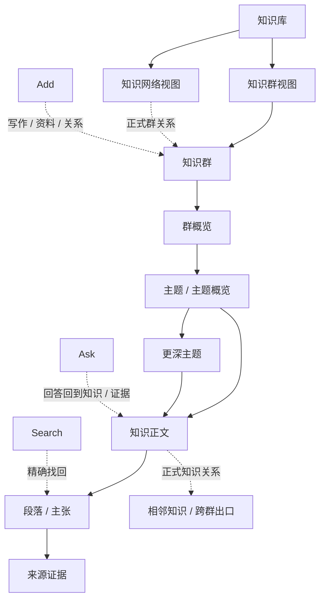

# AI-native 个人知识库

## 终局产品设计文档 v5.0 — Personal Knowledge Library

> 文档日期：2026-08-10  
> **版本状态说明（2026-08-10）：HISTORICAL。本文件已由 `AI-native-个人知识库-终局产品设计文档-v6.0.md` 取代，不再是当前产品入口。**  
> 文档状态：**历史形成证据；不得指导新设计、对象模型或实现**  
> 产品阶段：先定义产品；方向 3 的层级阅读与方向 2 的关系空间已经成为产品结构，但尚未授权制作新原型或修改 Ardot 画布  
> 历史关系：本文件发布时曾取代 v4.0；当前权威、专项文档状态和迁移规则以 `AI-native-个人知识库-文档权威注册表-v1.0.md` 为准  
> 真实内容证明：资格 / 时效型夹具与稳定概念 / 关系型夹具共同约束本文，不能用抽象占位内容代替  
> 决策审阅伴侣：`AI-native-个人知识库-关键产品决策审阅稿-v1.0.md`；用于确认高影响选择，不新增产品真相  
> 工作名：Personal Knowledge Library；只用于产品讨论，不代表最终品牌

---

# 如何阅读这份文档

这不是把既有合同重新拼在一起的“总目录”，而是一份可以独立回答产品问题的主文档。

如果只想理解产品，依次阅读：

1. `0. 最终产品答案`；
2. `3. 用户拥有的知识世界`；
3. `4–10. 核心体验`；
4. `13. 方向 3 + 2`；
5. `16. 两个真实夹具`。

如果要继续做设计或实现，再阅读：

- `11. 信息架构与连续性`；
- `12. 可信、维护与所有权`；
- `17. 完整对象模型`；
- `18. 终局能力清单`；
- `20. 产品验收合同`。

专项合同仍负责罕见边界和精确状态机，但它们不能再反过来要求用户先理解内部模型，才能理解这是一个什么产品。

## 事实与决定标记

| 标记 | 含义 | 使用纪律 |
|---|---|---|
| **[用户确认]** | 用户已经明确表达 | 优先级最高，不因技术或竞品便利改变 |
| **[研究事实]** | 官方资料、标准或论文直接支持 | 必须能返回来源；不把来源没证明的内容补成事实 |
| **[产品决定]** | 本产品当前选择 | 约束后续设计；可被真实验证推翻，但不能被草图暗改 |
| **[待验证假设]** | 尚无真实用户证据 | 不写成已成立结果或成功指标 |
| **[开放项]** | 现在不应擅自冻结 | 不妨碍产品本体时留给后续验证 |

---

# 0. 最终产品答案

## 0.1 一句话定义

> **一个把用户的资料与思考组织成知识群、丰富层级和有意义关系，并允许用户通过阅读、网络探索或 AI 查询不断深入的本地优先个人知识库。**

它不是“文件加 AI”，也不是“图谱加聊天”。它把同一套知识做成三种连续能力：

- 像一本层次清楚、会持续演化的知识书一样阅读；
- 像一张有方向、有语义的地图一样探索；
- 像与一位知道范围、依据和未知的研究伙伴交谈一样查询。

## 0.2 用户最终拥有的东西

用户拥有一个长期存在、可进入、可演化、可带走的个人知识世界：

- 一个个边界清楚的**知识群**；
- 每个知识群都有编辑性**概览**和可以递归深入的**主题层级**；
- 每条重要知识都有连续正文、稳定身份、来源、版本和精确位置；
- 同一条知识可以在多个知识群承担不同作用，不复制正文；
- 知识之间、知识群之间可以存在有语义、有方向、可限定的**关系**；
- 用户可以浏览、搜索、提问，也可以沿网络主动探索；
- AI 回答可以被保存、拆解或写回，但不会自动变成当前知识；
- 尚未解决的问题、真正冲突和变化也可以被诚实保存；
- 云服务、AI 或索引不可用时，已拥有的知识仍可阅读、编辑、导出和恢复。

## 0.3 产品的三个主动作

产品日常只要求用户理解三个行为：

1. **理解**：从整体进入细节，形成结构化认识；
2. **探索**：沿层级、关系和路径发现相邻知识；
3. **调用**：通过 Search 或 Ask 找到、综合并重新进入知识。

写作、导入、整理、证据、历史、冲突、备份和恢复是让这三个行为长期成立的完整性责任。它们必须完整，但不能与知识本身争夺产品中心。

## 0.4 体验承诺

用户每次进入产品，都应该获得四种确定感：

1. **我在哪里**：当前知识群、主题、知识和段落位置始终可理解；
2. **我为什么看到它**：结构位置、正式关系、来源依据或本次查询路径不会混为一谈；
3. **我可以去哪里**：下一层主题、相邻知识、跨群出口和返回路径清楚但克制；
4. **什么被保存了**：回答、知识、关系、当前版本、草稿和恢复保护拥有不同后果。

## 0.5 产品的可见骨架



知识库是唯一主地点。知识群与知识网络是同一套 Group 的两种观察方式。Search、Ask、Add 是随处可调用的全局动作。来源、历史、回收站、备份与设置是支撑性工具。

## 0.6 永久不是这些产品

它不是：

- 以聊天记录为主要资产的 AI 助手；
- 以文件、文件夹和标签为最终组织方式的文档库；
- 要求用户先搭数据库、模板和属性系统的低代码工具；
- 把所有节点铺在无限画布上的装饰性知识图谱；
- 用 Today、Inbox、Review 或通知队列驱动使用的维护系统；
- 通用任务管理、项目排期、团队审批或课程计划产品；
- 自动捕获一切、回放屏幕或恢复项目现场为唯一中心的 Cognitive OS；
- 用论文数量、引用数或模型置信度替用户决定什么是真的。

这些相邻能力可以通过知识群、来源、路径或外部系统连接，但不能改变产品本体。

---

# 1. 用户、问题与产品结果

## 1.1 用户已经确认的核心需求

**[用户确认]** 产品必须同时满足：

1. 知识以一个个知识群存在；
2. 知识群之间的关系可以看见；
3. 知识拥有从 Overview 到细节的丰富层级；
4. 用户可以用 AI 查询自己的知识；
5. 用户可以在知识网络中主动探索；
6. 视觉上希望方向 3 的层级阅读与方向 2 的关系空间结合；
7. 当前先把产品定义准确，不马上制作原型。

任何新增能力如果不能增强这七项中的至少一项，也不是长期所有权、可信度或恢复所必需，就不能进入产品中心。

## 1.2 首要用户

**[待验证假设]** 首要用户是长期处理多个复杂知识范围、需要反复返回、深化、比较和调用这些知识的个人。

职业可以是产品经理、研究者、创作者、学生、咨询顾问或独立开发者。真正的共同条件是：

- 材料跨文件、网页、PDF、对话和时间存在；
- 同一主题会持续数周、数月或更久；
- 既要读和写，也要比较、判断和复用；
- 不愿把维护文件夹、标签和双链变成第二份工作；
- 不接受无法定位来源、范围与历史的 AI 结论；
- 希望知识逐渐更清楚，而不只是数量增长。

## 1.3 五个核心问题

### 材料存在，但理解没有形成

文件、笔记和网页保存了内容，却没有回答：这个领域怎样组成、从哪里开始、各部分为什么有关。

### 整理系统与真实工作竞争

用户需要不断决定文件夹、标签、模板、拆分粒度和链接。维护系统本身逐渐成为负担。

### AI 只解决这一问

回答可能有用，却留在聊天里；它没有进入用户已有结构，下次再次生成，无法成为长期资产。

### 图谱展示复杂，却不能支持理解

所有节点同时出现时，用户看到的是密度而非方向、层级、关系含义和阅读顺序。

### 新信息制造副本，而不是演化理解

同一知识在多个项目和主题出现时被复制；来源变化后旧内容被覆盖；用户无法知道当前理解怎样形成。

## 1.4 核心 Jobs to Be Done

### 建立一个知识范围

> 当我开始长期理解一个主题时，我希望建立一个有边界的知识群，让材料、问题和知识逐渐形成可读结构，而不是先设计数据库。

### 从整体进入细节

> 当我回到一个复杂主题时，我希望先看懂它现在由什么组成，再沿层级读到具体知识和证据，而不是在文件列表中搜索。

### 找到真正相关的连接

> 当一条知识与另一个主题有关时，我希望知道具体怎样相连、条件是什么，并能沿关系继续，而不是只看到“相关”。

### 查询自己的知识

> 当我提出问题时，我希望知道系统实际查了哪些范围、用了哪些知识、哪里仍不确定，并能从答案回到原文。

### 让新信息修正旧理解

> 当来源、条件或我的判断变化时，我希望看到受影响部分并决定怎样修订，而不是让 AI 静默覆盖当前知识。

### 长期拥有并带走

> 当 AI、网络、供应商或设备发生变化时，我仍希望能阅读、编辑、导出、恢复并验证自己的知识世界。

## 1.5 用户结果

产品成立后，用户获得的不是“更快记笔记”，而是：

- 对知识范围拥有稳定方向感；
- 对一条知识的出处、条件与历史拥有可检查信任；
- 在深入和横向探索之间切换时不迷失；
- AI 回答与长期知识真正汇合，而不是平行堆积；
- 同一理解可以在多个语境复用并持续演化；
- 复杂度增长时，知识库仍然可读而不是退化成搜索框。

## 1.6 非首要用户与非首要任务

以下需求可以被部分满足，但不驱动本体：

- 只需要一次性问答、不打算保留知识的人；
- 只管理文件或参考文献、无需形成个人理解的人；
- 主要需要任务协作、销售流程或团队审批的人；
- 需要发布型 CMS、社交网络或课程管理的人；
- 希望自动捕获所有行为，但不愿进行任何知识判断的人。

---

# 2. 产品宪法

以下十二条原则是设计、模型和实现都不能破坏的长期边界。

## 2.1 Knowledge before Documents

资料是来源，知识是用户形成并可以持续编辑的理解。文件结构不能成为知识结构的第二真相。

## 2.2 Overview before Detail

每次进入一个范围，先给最低必要的整体方向，再允许深入。Overview 是编辑性导读，不是自动摘要或卡片 Dashboard。

## 2.3 Hierarchy and Graph are Complementary

层级回答“怎样深入”，关系回答“为什么横向相连”。二者使用同一知识身份，不能互相替代。

## 2.4 One Knowledge, Multiple Contexts

同一 Knowledge 可以出现在多个 Group / Topic 中。位置可拥有不同语境说明，正文、版本和来源不复制。

## 2.5 Meaning before Edge

关系首先是一句完整、可读、可限定的陈述，然后才是一条线。相似、共现、引用和一次检索路径不自动成为正式关系。

## 2.6 Context before Answer

AI 回答必须知道用户请求什么范围、系统实际采用什么范围、最终用了什么。流畅不能替代范围和依据。

## 2.7 Evidence remains reachable

重要知识、关系与回答必须能回到来源的具体版本和位置。来源不可访问时保留历史，不补造原文。

## 2.8 User-owned Canonical Knowledge

AI、来源抽取和系统聚类默认产生回答或建议；只有用户直接写作或明确接受的变化才能推进当前知识。

## 2.9 Unknown and Conflict are Knowledge

重要未知可以成为 Question Knowledge；真正不兼容的当前主张可以成为 Conflict。二者都不能被“有一段回答”自动消除。

## 2.10 Structure evolves without silent rewriting

Group、Topic、Knowledge、Relation 与 Source 都可以修订、拆分、合并、结束或迁移，但历史、旧链接和影响必须可解释。

## 2.11 Local-first personal ownership

本地是 canonical knowledge 的可用和所有权底座。云 AI、同步和连接器是增强，不是已拥有知识成立的条件。

## 2.12 Deep model, calm surface

内部复杂度用于保护身份、证据、状态、历史和恢复；界面注意力留给知识正文、当前位置和下一步理解。

---

# 3. 用户拥有的知识世界

## 3.1 五个日常概念

| 概念 | 用户心智问题 | 不是什么 |
|---|---|---|
| **知识群** | 这一整个知识范围是什么 | 文件夹、标签集合、数据库表 |
| **主题** | 当前分支是什么，怎样继续深入 | 子知识群、独立正文副本 |
| **知识** | 我可以独立阅读、编辑和复用什么 | 每个段落都拆成一张卡片 |
| **关系** | 两条知识或两个知识群为什么相连 | 相似度、共现、装饰连线 |
| **来源** | 这条理解来自哪里，能否核验 | 只剩 URL、附件名或引用数量 |

用户不需要先学习 Revision、Placement、Binding、Projection、Context Ledger 或 Workspace State。它们只在会改变当前判断时，用人话逐层出现。

## 3.2 一个知识库，两条认知轴

### 纵向阅读深度

```text
D0 Library / 知识世界
  D1 Knowledge Group / 知识范围
    D2 Topic / 局部分支
      D3 Knowledge / 连续正文
        D4 Section / Claim / 局部理解
          D5 Evidence / 来源上下文
```

### 横向关系半径

```text
R0 只阅读当前对象
R1 当前 Knowledge 的一跳关系
R2 当前 Group 的主干、桥接与跨群出口
R3 Library 中 Groups 的整体关系网络
```

D 与 R 正交：用户可以保持当前段落不动，只扩大关系半径；也可以完全关闭关系，继续从 Overview 向 Evidence 深入。

## 3.3 产品空间

```text
Knowledge Library
├─ Groups View
│  ├─ Knowledge Group
│  │  ├─ Group Overview
│  │  ├─ Topic tree
│  │  ├─ Knowledge placements
│  │  ├─ Group sources
│  │  └─ Current / Suggested / Historical relations
│  └─ Saved Paths / Views / Answer history（按需）
├─ Network View
│  ├─ Groups
│  ├─ maintained Group Relations
│  └─ Shared Knowledge Lens（按需 observation）
└─ Supporting Utilities
   ├─ Sources & Evidence
   ├─ History & Impact
   ├─ Decisions / Proposals
   ├─ Import / Export / Backup / Restore
   └─ Trash / Settings / Status
```

## 3.4 五种连接不能混边

| 连接 | 回答的问题 | 进入正式知识网络？ |
|---|---|---|
| Structure | 它在哪里、怎样深入 | 否 |
| Evidence | 依据来自哪里 | 否 |
| Reference | 哪里提到或引用它 | 否，可产生候选 |
| Semantic Relation | 为什么两条知识稳定相连 | 是 |
| Retrieval Route | 为什么本次 Search / Ask 一起使用 | 否，只属于本次运行 |

这项区分是整个产品可信度的基础：一条来源支持某个 Claim，不意味着来源与知识成为图谱端点；两个对象被同一次 Ask 使用，也不意味着它们彼此建立了关系。

---

# 4. Knowledge Group、Topic 与 Overview

## 4.1 Knowledge Group 的定义

Knowledge Group 是一个值得被反复整体进入、拥有稳定边界、内部层级与长期演化价值的知识范围。

一个 Group 至少拥有：

- 稳定 identity 与名称；
- governing question / purpose；
- 当前 Boundary：包含什么、排除什么、为什么独立；
- 一个 Group Overview；
- Topic tree 或 root-level Knowledge；
- Knowledge Placements 与 Source Attachments；
- 可选的正式 Group Relations、入口路径和历史。

Empty Group 也合法。名称和边界意图足以创建 identity；没有 Topic、Source、Relation 或“成熟度”不构成失败。

## 4.2 六种合法形成起点

用户可以从六种地方建立同一种 Group：

1. 空白；
2. 选择已有 Knowledge；
3. 选择一组 Sources；
4. 把成熟 Topic 提升为 Group；
5. 从当前 Search / View 结果保存一个人工选择的范围快照；
6. 导入一棵已有 hierarchy。

系统聚类只生成可丢弃的 Group Candidate。Candidate 在用户接受前没有 `group_id`、Overview、Relations、Search standing 或空壳页面；拒绝不产生副作用。

## 4.3 Boundary、内容与动态观察分开

| 责任 | 回答的问题 | 变化方式 |
|---|---|---|
| Group Boundary | 这个范围打算理解什么 | 用户直接修订或接受 Boundary Diff |
| Knowledge Placement | 哪条知识目前出现在这里 | 直接放置、移动、移除；不复制正文 |
| Source Attachment | 哪份材料为什么加入这里 | attach / detach；不自动形成知识 |
| View Evaluation | 当前哪些对象满足规则 | 随规则和数据重算；不成为成员 |

添加一条 Knowledge 不静默扩大 Boundary；修改 Boundary 也不自动移动或删除内容。两者不一致时显示具体 tension，不制造“知识群健康分”。

## 4.4 Topic 的定义

Topic 是 Group 内可递归打开的稳定知识范围。它不是文件夹行，也不是 Subgroup。

显式打开 Topic 时，用户至少得到：

- 它在父范围中的作用；
- 一句或一段最低必要的局部概览；
- 子 Topics；
- 直接放在这里与来自后代的 Knowledge；
- 代表知识和当前可走出口；
- 上一级、下一层与返回路径。

目录中的 Expand 只展开结构，不改变主阅读位置。直接点击 Knowledge 可以绕过 Topic Overview，不被强制中转。

Topic 不拥有 Group Boundary、Library Network 节点、Group Relation endpoint 或第二份 Knowledge 正文。只有当它已经形成独立 governing question、长期入口价值和可脱离父群理解的整体时，用户才可以提升为新 Group。

## 4.5 Overview 是编辑性导读

Overview 的责任不是“把当前内容缩短”，而是回答：

1. 这个范围想理解什么；
2. 现在的主要结构是什么；
3. 哪些知识最能建立方向；
4. 从哪里开始、怎样继续；
5. 当前有哪些重要未知、变化或跨群出口。

Group Overview 与 Topic Overview 使用同一种阅读语法，但范围不同：前者解释整个 Group；后者解释当前分支。Overview 可以包含用户编辑的 accepted synthesis 与结构投影，但投影不可被误编辑为第二份知识。

## 4.6 Overview 的内容预算

一个健康 Group Overview 默认包含：

- 一段开场；
- 三到五个主要方向；
- 一到三条稳定入口；
- 最多一条真正影响当前理解的变化提示；
- 少量代表 Knowledge 与跨群出口；
- 完整目录入口。

它不默认包含：

- Recent feed；
- AI 推荐墙；
- 统计 Dashboard；
- 待整理数量；
- 所有 Relations；
- 所有 Sources；
- 管理状态徽章。

## 4.7 Group 的长期状态

Group 不使用 Seed → Mature → Dormant 的单轴升级。五项状态分别回答不同问题：

| 维度 | 问题 | 例子 |
|---|---|---|
| Orientation | 当前能否建立方向 | Bare / Structuring / Oriented |
| Change | 最近内容是否发生实质变化 | stable / changing |
| Attention | 用户现在是否关注 | active attention / paused |
| Lifecycle | 是否仍属于当前知识库 | current / archived / trash |
| Boundary continuity | governing question 是否连续 | continuous / successor / split / merge |

一个 Group 可以已经清楚可读、正在变化、暂时暂停关注且仍属于 current knowledge。界面用一句人话合成，不展示五排状态码。

## 4.8 结构变化

- Rename / Move：通常保留 Topic identity；
- Merge：预览 Placements、Attachments、Overview、Paths 和旧链接；
- Split：新范围分别获得 identity，旧 Topic 保存 lineage；
- Promote Topic to Group：建立新 Group identity，原位置保留 Gateway；
- Group Split / Merge：逐条检查 Boundaries、Relations、Sources 与 saved paths，不自动继承群关系。

所有变化都必须回答：什么保持、什么移动、什么产生 successor、什么只是 redirect、旧链接怎样解释。

---

# 5. Knowledge：连续正文、精确地址、多处复用

## 5.1 Knowledge 的定义

一条 Knowledge 是围绕一个主要理解任务组织的可独立阅读内容。它可以是一段，也可以很长；长度不决定 identity。

判断边界时问：

- 它是否能以一个主要问题或理解目标被命名；
- 大部分内容是否共同服务这个目标；
- 是否需要独立被放置、关系、适用、引用或修订；
- 从原文拆出后是否会更容易理解，而不是只增加卡片数量。

## 5.2 Knowledge Paper

默认阅读形态是连续 Paper：

```text
标题
一句定位
正文 Sections
局部 Claims / Examples / Methods
必要 Relations 与跨群出口
Evidence / Sources
History / other Placements（按需）
```

Block 是编辑和定位单位，不是视觉卡片。阅读时边界退到背景；只有编辑、引用、关系或核验时才出现局部 handle 和状态。

## 5.3 四层内容模型

| 层 | 责任 | 是否自动成为独立知识 |
|---|---|---|
| Knowledge identity | 独立理解、关系和复用 | 是 |
| Content Revision | 某个时间点的完整正文 | 否，通过 History 进入 |
| Section / Block | 组织连续内容 | 否 |
| Anchor / Inline Claim | 精确定位或表达局部主张 | 否；需要独立责任时显式提升 |

可深链、可搜索、可引用或有 ID 都不是升级为 Knowledge 的理由。

## 5.4 一份正文，多种语义骨架

同一正文可以同时拥有：

- heading hierarchy；
- inline claim anchors；
- relation endpoint anchors；
- evidence bindings；
- property assertions；
- answer write-back targets。

这些骨架服务不同任务，但都指向同一 canonical content tree。不能为每种功能复制一份内容。

## 5.5 同一 Knowledge 的多 Placement

同一 Knowledge 可以在多个 Group / Topic 出现。每个 Placement 可以拥有：

- placement role；
- contextual summary；
- semantic order；
- local representative / stable-start role；
- 当前语境优先显示的邻接关系；
- Return Envelope。

它不能拥有独立正文、独立 current revision 或独立 Evidence truth。

例如 `提取练习` 在“记忆与学习科学”中是被研究的方法，在“个人学习策略设计”中是被采用的方法基础。两个入口看到同一正文，但知道自己为什么从这里进入。

## 5.6 引用与复用的四种语义

| 方式 | 意义 | 原文变化后 |
|---|---|---|
| Link | 只建立导航 | 打开 current target |
| Live excerpt | 显示随 current 更新的局部内容 | 显式提示变化 |
| Pinned excerpt | 固定某个 revision 的内容 | 保持历史并可对比 current |
| Explicit quote | 作为带来源的引用 | 保留原文、locator 与版本 |

产品不能用一个“嵌入”按钮混合四种后果。

## 5.7 Anchor 的稳定责任

Anchor 组合结构路径、heading、文本 quote / context 与 revision mapping，不只依赖字符 offset。正文变化后：

- 唯一可验证匹配 → 自动 redirect；
- 多个可能位置 → ambiguous，等待判断；
- 内容已删除且无合理 successor → orphaned；
- 旧位置仍可在 historical revision 打开 → preserved historical target。

关系、Evidence、Saved Answer 和 deep link 都必须得到影响说明，不能悄悄指向相似段落。

## 5.8 直接写作是一等能力

用户直接写作遵循自然编辑模型：

1. 输入进入 Edit Buffer；
2. 本地 Recovery Checkpoint 保护异常恢复；
3. 安全 Direct Edit Commit 推进 Current Revision；
4. Sync 和派生索引随后更新。

普通写作不要求用户“采用自己的内容”。Explicit Draft、AI Proposal、Conflict merge 和高影响结构变更仍有独立提交语义。

## 5.9 Split、Merge 与 Promotion

- 一个 Section 需要独立 Placement / Relation / Applicability / Evidence / lifecycle 时，可以提升为 Knowledge；
- 原 Knowledge 保留自然引用和 Anchor redirect；
- Merge 只在两条内容实际承担同一理解任务时发生；
- 同题不同观点不因标题相似自动合并；
- AI 可以建议，但不能按 heading、token 或检索热度自动拆分。

---

# 6. Relation：从一句话到知识网络

## 6.1 Relation 的定义

> **正式 Relation 是拥有稳定 identity 的知识陈述：对象 A 在明确条件下，以一种可读、可核验的方式与对象 B 相连。**

一条 Relation 至少拥有：

- 两个稳定端点和端点角色；
- canonical type 与方向；
- 一句独立可读的 statement；
- Applicability / valid time / comparison dimension 等必要限定；
- why it matters；
- Evidence / support、current standing、Revision 与 History；
- 可选的 endpoint anchors。

## 6.2 Knowledge Relation

Knowledge Relations 使用五个语义家族、二十五种正式类型。默认界面先让用户选择意图，再展示少量完整句，不展示枚举墙。

| 家族 | 用户问题 | 正式类型 |
|---|---|---|
| 分类与组成 | 它是什么、属于什么、由什么组成 | `subtype_of`、`instance_of`、`exemplifies`、`defines`、`component_of` |
| 解释与因果 | 为什么、怎样、使什么可能、依赖什么 | `explains`、`causes`、`contributes_to`、`enables`、`prevents`、`depends_on`、`provides_foundation_for` |
| 论证与推导 | 怎样支持、反驳、限定、假设或推导 | `supports`、`contradicts`、`qualifies`、`assumes`、`derived_from` |
| 比较与应用 | 怎样相似、不同、部分重叠、适用或落实 | `contrasts_with`、`similar_to`、`partially_overlaps_with`、`applies_to`、`implements` |
| 时间与演化 | 怎样先后、精化或演化 | `precedes`、`refines`、`evolved_from` |

`related_to` 永远不是正式类型。`supersedes / retracts / reopens / uncertain_about` 分别属于 identity transition、disposition 或 Question lifecycle，不进入普通关系图。

## 6.3 方向与反向阅读

Directed Relation 只保存一份 canonical assertion：

```text
A provides_foundation_for B
B builds_on A
```

两句是同一关系的双向读法，不是两条镜像边。Symmetric Relation 规范化 endpoints；所有关系默认 non-transitive，除非类型合同明确允许 derived closure。Path 可以存在，但不能自动压成直接 Relation。

## 6.4 创建关系

1. 用户从正文、选区、Local Graph 或 Network 选择另一个端点；
2. 用自然语言意图选择关系家族；
3. 产品回读完整句并让用户校正方向；
4. 只有意义需要时才补条件、时间或比较维度；
5. 可选定位两端具体段落、说明 why it matters、添加 Evidence；
6. 用户直接创建的 Relation 本地成功后成为 Current；
7. AI、来源抽取或系统聚合只产生 RelationCandidate；
8. Receipt 说明新增了什么、影响哪里、如何撤销。

缺少外部 Evidence 不阻止用户表达自己的理解，但必须标明 authored basis，不能伪造来源权威。

## 6.5 跨群出口不等于 Group Relation

两条位于不同 Groups 的 Knowledge 建立正式关系时，可以形成一条真实可走的 cross-group exit：

```text
当前 Knowledge → Knowledge Relation → 目标 Knowledge → 目标 Placement / Group
```

这条路径足以探索，但不足以声明两个完整 Group 之间存在整体关系。共享 Knowledge、共同 Source、一次 Ask 共现、Saved Path 或 embedding similarity 都不够。

## 6.6 Group Relation

Group Relation 回答：

> 为什么理解 Group A 会整体改变、支持、限定、应用或对照 Group B？

正式 registry 有十一种：

| 家族 | 类型 | 核心区别 |
|---|---|---|
| 范围 | `scope_within`、`partially_overlaps_with` | 完整包含 vs. 部分相交 |
| 贡献 | `provides_foundation_for`、`provides_method_for`、`applies_to` | 提供基础 vs. 实际采用方法 vs. 仅适用 |
| 协同与比较 | `complements`、`contrasts_with` | 非冗余贡献 vs. 同维度差异 |
| 限制 | `challenges`、`constrains` | 削弱主张 / 假设 vs. 缩小选择空间 |
| 其他 / 演化 | advanced `influences`、`evolved_from` | 有机制但无窄类型 vs. 历史连续性 |

## 6.7 Direct 与 Aggregated

Group Relation 可以：

- **Direct**：用户亲自完成 endpoints、statement、type、direction 与 Applicability 后提交；
- **Aggregated**：系统从底层关系评估，先生成可检查 Candidate，用户采用后才成为 Current。

系统聚合不能使用“路径数 ≥ N”或一个 confidence score。它必须检查：

1. Group Boundary 可解析；
2. 能写成独立群级陈述；
3. 类型允许聚合；
4. 底层路径 current 且 Applicability 可合并；
5. 同一 Knowledge 多 Placements、同一 Source lineage 与镜像路径已折叠；
6. 支撑触及两侧 material Boundary；
7. 方向一致；
8. CounterSignals 已扫描；
9. 移除最强支撑后仍有合理 standing；
10. 当前值得占用注意力。

失败后的正确落点可以是 exit-only、shared-only、ambiguous、conflicting 或 insufficient。没有 Candidate 也是合法结果。

## 6.8 Shared Knowledge Observation

同一 canonical Knowledge 在两个 Groups 中出现时，产品可以动态显示：

> 当前有 3 条同一知识同时出现在两个知识群。

这是一项 derived observation：

- 不需要 Adopt；
- 不拥有 Relation lifecycle；
- 不计入 Relation count；
- 不改变 resting Network layout；
- 展开后显示两侧 Placement role 与 contextual summary；
- 可以帮助形成更具体 Candidate，但不能一键升级。

## 6.9 同一 Group pair 的多条关系

同一 pair 可以同时存在多条独立陈述。例如：

- `记忆与学习科学 provides_foundation_for 个人学习策略设计`；
- `记忆与学习科学 provides_method_for 个人学习策略设计`。

前者回答理论 / 证据依赖，后者要求目标群实际采用方法。它们不能合并为`相关`，也不能因为共享路径就去掉一个。

Network 使用 Relation Bundle 作为纯呈现容器：保留每条 identity、direction、Applicability 和 history；默认展示最有解释价值的一句并说明还有几条。

## 6.10 Group Pair Comparison

用户显式`比较两个知识群`后进入临时工作现场，不创建新知识对象。固定顺序是：

1. Pair Orientation：两群分别想理解什么；
2. Current Relations；
3. Shared Knowledge；
4. Paths Between；
5. Suggested / Unknown；
6. Evidence & Limits；
7. History。

一次比较使用同一 snapshot，避免左右 Boundary、Current Relations 与 observations 来自不同时间。关闭后精确返回原 Network edge、Ask Claim、Knowledge Anchor 或 scroll position。

## 6.11 Relation 生命周期

以下状态分权：

- Candidate：建议尚未成为关系；
- Current Relation：当前采用的 statement；
- Revision：同一关系的语义修订；
- Evidence / Support Set：为什么成立；
- Challenge：什么削弱它；
- Review due：依据变化，需要检查；
- Ended：在过去时间范围内正确，现在结束；
- Superseded：由更准确 successor 接替；
- Retracted：用户不再认为它成立；
- Archived：暂时不在普通表面显示，但未改变 truth standing。

Evidence 更新不自动制造语义 Revision；Split / Merge 不自动 retarget、复制或合并关系。

---

# 7. Search、Ask 与 Explore

## 7.1 三种意图

| 动作 | 用户意图 | 结果 |
|---|---|---|
| Search | 找到已经存在的对象或文字 | 精确结果、路径、命中位置 |
| Ask | 综合一个问题 | Answer、coverage、basis、unknowns |
| Explore | 沿关系理解相邻结构 | 可逆场景、路径与相邻对象 |

Search 不替用户综合；Ask 不变成聊天容器；Explore 不依赖全图节点汤。

## 7.2 Search

Search 默认返回用户真正要进入的 identity：Group、Topic、Knowledge、Source、Relation、Saved Path 或 Question。Section、Anchor、Revision、Fragment 作为命中位置进入 owner，不与主要对象同权竞争。

搜索结果必须说明：

- 命中 title、body、OCR / transcript、historical revision 还是 annotation；
- current / historical / draft standing；
- Group / Topic path 与 exact Anchor；
- index coverage 与排除范围；
- 打开后怎样返回。

历史规则或旧版本可以找回，但不能因文本更相似而冒充 current。

## 7.3 Ask 不是聊天容器

Ask 是一次锚定知识范围的操作：

```text
问题
→ Requested Context
→ Expansion Policy
→ Effective Context
→ Retrieval / Reasoning
→ Used Context
→ Answer Claims + Basis + Coverage
→ 用户选择保存、形成知识、采纳或继续
```

关闭 Ask 后恢复原阅读现场。聊天历史可以被回看，但它不是产品的主要资产。

## 7.4 Requested、Effective 与 Used Context

| 层 | 回答的问题 |
|---|---|
| Requested | 用户让我查什么 |
| Effective | 系统实际解析和获准采用了什么 |
| Used | 哪些对象真正支撑了回答中的 Claims |

用户在某个 Topic 提问时，Requested Scope 默认是当前 Topic；系统可以按 Expansion Policy 在当前 Group、related Groups、whole Library 或 external research 之间请求扩张。它不能因为“答案可能更好”静默全库或联网。

## 7.5 六种 Answer Basis

| Basis | 默认人话 | 写入边界 |
|---|---|---|
| Accepted Knowledge | 来自你的当前知识 | 可回到 Knowledge Revision / Anchor |
| Source Statement | 来源原文说明 | 不表示用户已经接受 |
| Current User Input | 根据你本次提供的信息 | 默认只属于本 Run / Question Applicability |
| External Source | 来自本次允许的外部资料 | 权限不自动继承到下一问 |
| Reasoned Derivation | 基于这些内容可以推断 | 显示前提、步骤类型与限制 |
| Historical Answer Reference | 当时的回答 | 不冒充 current Knowledge |

## 7.6 Answer 的阅读结构

Answer 默认包含：

1. 当前结论；
2. 适用范围与关键限定；
3. 主要理由；
4. Claim-level basis；
5. coverage 与仍不知道什么；
6. 可以回到的 Knowledge / Source / Relation；
7. 原子写入动作。

长答案仍保持连续阅读；Citation 和 basis 在相关 Claim 附近可展开，不集中成末尾来源墙。

## 7.7 Coverage 与诚实负面回答

Coverage 不是模型 confidence。它分别说明：

- eligible scopes；
- successfully covered；
- explicitly excluded；
- unavailable；
- index partial；
- external research disabled；
- decisive Applicability missing。

只有覆盖足够时才能说“在所查范围内没有发现”。覆盖不足时写“当前无法确认”，不能写“知识库里没有”。

## 7.8 Knowledge Route

当 Answer 使用了真实连接，可以显示一条可读 Route：

```text
Question → Knowledge A → Relation → Knowledge B → Evidence
```

若没有可靠关系，使用 Used Knowledge List + Claim Support。产品不能为让图好看而生成假边。

## 7.9 Follow-up、Retry、Branch、Re-evaluate

- Follow-up：继承上一 Run 的实际 Context，并显示 Context Delta；
- Retry：同一问题和范围重新执行；
- Branch：保留原 Run，改变假设、范围或方法；
- Rephrase：问题措辞改变，但 intent 未必改变；
- Re-evaluate：在当前 Knowledge / Source revisions 上创建新 Answer Snapshot，并提供 diff。

任一动作都不覆盖历史回答。

## 7.10 Answer 后的原子动作

1. 保存本次回答；
2. 形成新 Knowledge；
3. 合并到既有 Knowledge；
4. 建立 / 修订 Relation Candidate；
5. 保存值得长期追踪的问题；
6. 采纳为某个 Question 的当前回答；
7. 结束或继续追问。

每项写不同对象。不存在默认`保存并全部应用`。

---

# 8. Question Knowledge、Unknown 与 Conflict

## 8.1 Question Knowledge

Question Knowledge 是用户决定长期保留、可以持续求解的一项“已知未知”。它仍然是一条 Knowledge，拥有正文、Placements、Sources、History 和稳定 identity。

最小正文回答：

1. 问题是什么；
2. 为什么重要、适用于什么；
3. 目前知道什么；
4. 还差什么。

## 8.2 Question 不等于这些东西

- Query Turn：一次提问行为；
- Runtime Unknown：本次执行中的缺口；
- Gap Marker：某个 Anchor 附近的局部缺口；
- Annotation：对 Source Fragment 的阅读质疑；
- Conflict：两条 current claims 不兼容；
- Task：需要在某个日期完成的行动。

只有用户显式保存或直接创作，Runtime Unknown 才成为 Question Knowledge。

## 8.3 三条正交状态轴

| 轴 | 内部状态 | 用户问题 |
|---|---|---|
| Resolution | unresolved / partial / provisional / resolved | 回答到什么程度 |
| Pursuit | active / paused / concluded | 现在还要不要继续追问 |
| Change | no material change / changes available / review due | 已采用依据是否需要检查 |

Library lifecycle 的 current / archived / trash 继续独立。

合法组合包括：

- 已充分回答 · 正在追问；
- 暂时可用 · 正在追问；
- 尚未回答 · 已停止追问；
- 已充分回答 · 依据有变化。

单一 open / closed / done 不能表达这些状态。

## 8.4 Resolution Criteria

Current Resolution 不是“最新一段 Answer”。它固定：

- exact Question revision；
- Applicability；
- required criteria 及结果；
- adopted Knowledge / Relation / Evidence revisions；
- remaining unknowns；
- limitations / valid time / review triggers；
- actor 与 adopted time。

引用数量、回答长度、模型 confidence 或多数子问题 resolved 都不能替代采用决定。

## 8.5 Decision-facing Applicability

需要时可以结构化保存：

- decision objective；
- desired outcome horizon；
- assessment / transfer target；
- population / jurisdiction / time；
- material or domain；
- effort / time constraints；
- assumptions 与 exclusions。

这些字段只在会改变答案时出现，不把每个问题变成表单。

## 8.6 Subquestions

复杂 Question 可以拥有 required、optional、alternative 或 diagnostic Subquestions。每个子问题独立被 Ask、resolve、pause 或放在不同 Topic。

父问题只投影状态，不复制正文。Rollup 由 criterion mapping 与 blocking requirement 决定，不按 3/4、80% 或引用数投票。

## 8.7 Reopen 与 Successor

- 同一核心求知意图、依据变化或继续优化 → Reopen / Review；
- 答案类别、决策对象、核心人群或主要时间范围实质改变 → successor / scope fork；
- 旧 Question、Resolution、closure reason 与 basis 永远可读。

## 8.8 Conflict

Conflict 只在两条 current Knowledge claims 同时满足以下条件时成立：

1. 同一问题维度；
2. Applicability、time、population 等范围重叠；
3. 两条陈述无法同时为真；
4. 差异不能由版本、测量或 source role 解释。

一般规则与特定人群条件、研究结果与方法学 critique、source statement 与 user inference 往往不是 Conflict。它们更可能是 `qualifies`、Evidence `challenges` 或并列 scoped claims。

---

# 9. Source、Evidence 与可追溯知识

## 9.1 六层来源模型

```text
Source identity
→ Source Revision
→ Representation
→ Evidence Fragment
→ Evidence Binding
→ Knowledge / Relation / Overview / Answer Claim
```

默认界面只需显示“来源 + 位置 + 作用 + 当前可核验性”，但底层必须能够逐步回读。

## 9.2 Source identity

Source 是一份可引用作品、记录或材料身份，不等于一个文件。论文的 PDF、HTML 和本地副本通常是同一 Source 的不同 Representations；作者、发布边界或可引用身份不同的内容仍是不同 Sources。

## 9.3 Revision 与 Representation

- Source Revision：同一来源在某个时间点的内容状态；
- Representation：该 revision 的访问形态，如原网页、PDF、HTML snapshot、OCR、transcript、translation。

OCR 修正不一定是作者新 Revision；网页内容变化也不能只覆盖旧快照。

## 9.4 Fragment 与 Binding

- Evidence Fragment 保存可重新找到的片段；
- Evidence Binding 保存它对具体 target revision 起什么作用：supports、challenges、qualifies、defines、exemplifies 等。

同一 Fragment 可以支持一个 Claim、限定另一个。作用属于 Binding，不属于 Fragment 的全局标签。

## 9.5 Stable locator

文本使用 heading / structure、Text Quote、prefix / suffix、position 与 revision state 的组合；PDF、表格、代码、图像、音视频使用适合媒介的 selector bundle。

来源改变后，locator 可能是：

- resolved；
- relocated；
- changed；
- ambiguous；
- orphaned；
- unavailable。

它们拥有不同修复路径，不共用`引用失效`。

## 9.6 Source Attachment

一份 Source 可以直接加入 Group / Topic，而不形成 Knowledge 或 Evidence。Attachment 回答“为什么材料在这个范围里”；Binding 回答“哪个片段对哪条 Claim 起什么作用”。

从某个 Topic 移除 Attachment 不删除 Source identity、其他 Attachments、Annotations、Evidence 或原件。

## 9.7 研究比较条件

研究 Claim 在需要比较时，可以附带可选 `StudyConditionSnapshot`：

- population / sample；
- material / domain；
- intervention / learning activity；
- comparator；
- exposure / dosage；
- feedback；
- outcome kind；
- outcome delay；
- assessment format；
- transfer distance；
- observed limitations。

它不是新日常对象。只有缺失条件会改变 Claim 或 Answer 时才显示。论文数量、citation count、source type 或“meta-analysis”标签都不能替代条件判断。

## 9.8 来源变化

新 Source Revision 到达时：

1. 固定新 revision 和 locator mapping；
2. 判断 Fragment 是 relocated、wording changed 还是 semantic changed；
3. 找到受影响 Bindings 和 exact target revisions；
4. 生成 impact proposal；
5. 用户决定 Maintain、Revise、Defer、End、Supersede 或 Retract；
6. 旧 Knowledge / Resolution / Relation 保持当时可读。

来源变化永不直接重写 Knowledge Truth。

## 9.9 Source Reader

Reader 第一责任是阅读与核验，不是 metadata 表单。用户从 Claim 进入时，Reader 同时保留：

- 正在核验的 Claim；
- Source revision / representation；
- 片段在完整上下文中的位置；
- Binding role；
- 返回原 Knowledge / Anchor 的路径。

从 Reader 也能查看该 Fragment 参与了哪些 Knowledge、Relations、Overviews 与 Answers，但 provenance graph 只在 forensic 层出现。

---

# 10. 建立、形成与维护知识

## 10.1 首份价值：First Returnable Asset

第一次成功不是“完成设置”，而是用户拥有一份离开后还能再次找到、打开和继续的真实资产。

合法的首份资产包括：

- 一条 current Knowledge；
- 一个 Empty but valid Knowledge Group；
- 一份本地保存、可返回的 Source；
- 一条用户保存的 Question Knowledge；
- 一次迁入后可核验的已有 Knowledge。

AI 完成分类、生成建议、展示动画或建立关系都不是首份价值门槛。

## 10.2 空知识库

Empty Library 仍然是完整产品，不展示 Demo library、AI feed、完成进度或强制 onboarding。

默认首要动作是`写第一条知识`，并安静提供：

- 建立知识群；
- 加入资料；
- 迁入已有内容；
- 问一个问题。

五种起点最终都汇入同一个 Library、同一种身份和同一种返回责任。

## 10.3 Add 是全局动作

Add 根据当前位置提供三个日常入口：

1. 写一条知识 / 建立 Topic；
2. 加入资料；
3. 建立关系。

高级导入、迁移、批处理和 property mapping 进入专门 flow，不让普通 Add 变成导入中心。

## 10.4 Source-first 的双提交

资料导入至少分两次独立成功：

1. **Source Commit**：原材料、本地副本、identity、加入范围与可返回入口已经保存；
2. **Knowledge Commit**：用户检查后，形成或更新 Knowledge、Relations 与 Overview。

解析、OCR、转写或 AI 失败时，Source Commit 仍然成立。界面必须说“资料已保存，解析尚未完成”，不能把整个导入标成失败。

## 10.5 AI Knowledge Formation

AI 可以：

- 提出 Topic 结构；
- 识别重复、冲突与可能关系；
- 从 Source Fragments 草拟 Knowledge；
- 建议 Overview、Placement、Relation 或 Boundary Diff；
- 解释影响与不确定项。

AI 不可以：

- 直接把聚类变成 Group；
- 把全文摘要自动写成 current Knowledge；
- 按标题或 token 自动拆分；
- 因来源可靠就跳过用户判断；
- 用“清理完成”隐藏未采用 Proposal；
- 为提升图密度自动创建 Relations。

## 10.6 Formation 的结果

一次形成可以独立产生：

- current Knowledge；
- Explicit Draft；
- Proposal；
- Source-only；
- zero-yield with reason；
- partial success。

这些结果按对象逐项结算。Placement 失败不能丢掉已保存正文；Relation 建立失败不能撤回 Knowledge；AI 不可用时仍能写作和组织。

## 10.7 Proposal 与当前知识

Proposal 只有在已经聚合为用户可以判断、接受、拒绝或延期的 Decision Bundle 后才拥有长期 identity。Raw candidate、ranking 或 hover suggestion 不进入 Library、Search、Network 或 canonical export。

高影响 Proposal 必须显示：

- 建议改变什么；
- 为什么出现；
- 使用哪些 exact revisions；
- 接受后影响哪些 Group、Overview、Relation、Path 或 Answer；
- 拒绝或延期后怎样；
- 如何撤销。

## 10.8 Knowledge Decision Workspace

只有以下任务需要进入独立判断现场：

- 多对象形成；
- Split / Merge / Move；
- Relation Candidate 采用或类型迁移；
- Source change impact；
- true Conflict；
- Boundary change；
- restore / import mapping；
- 可能覆盖当前知识的结构化 Patch。

它是 contextual utility，不是 Review 主入口。没有待处理事项时不显示空队列或红点。

## 10.9 History 与 Undo

History 回答“发生了什么”；Undo 回到一个安全 prior state；Recovery 保护未完成输入；Backup 保护长期资产。四者不能共享一个`版本`按钮。

用户可见 History 按有意义 edit session 分组，不按每次按键生成记录。任何恢复都先预览：Current pointer、Relations、Placements、Evidence、Anchors 和 dependent Answers 会怎样变化。

## 10.10 维护的进入方式

维护只在上下文中出现：

- Source 改变时，在受影响 Knowledge / Relation 显示一句 notice；
- Anchor 无法重定位时，在具体 Citation / Relation 提示；
- Index partial 时，在当前 Search / Ask 解释 coverage；
- Sync conflict 时，在当前编辑对象处理；
- Backup / storage 风险时，在 supporting utility 显示。

产品不以“还有 N 条知识需要整理”制造管理焦虑。

---

# 11. 信息架构、打开、返回与探索连续性

## 11.1 一个 Knowledge Library 主地点

一级主地点只有 Knowledge Library。它包含两个同义视图：

| View | 用户问题 | 默认内容 |
|---|---|---|
| Groups | 我有哪些知识范围，从哪里开始或继续 | 完整 Group catalog、Pins、最多一条 Resume |
| Network | 这些知识群为什么相连，向哪里探索 | Groups、Current Group Relations、List Equivalent |

Sources、History、Decision、Trash、Backup 和 Settings 是支撑入口，不与 Library 并列成多个产品中心。

## 11.2 Library 默认入口

默认顺序：

1. 最多一条可安全恢复的`继续`；
2. 用户 Pins；没有就消失；
3. 始终拥有主权、包含全部 current Groups 的稳定 Catalog；
4. 可选 Saved Views / Paths / Answers；
5. 最多一条真正影响当前理解的 notice；
6. 安静的 Search / Ask / Add。

All Groups 默认稳定排序。Recent、点击频率、更新时间、关系度数和 AI relevance 不静默重排。

## 11.3 普通打开与继续

- 普通打开 Group → canonical Group Overview；
- 普通打开 Topic → Topic Reading；
- 普通打开 Knowledge → current Knowledge Paper；
- 显式`继续` → last-safe target、Anchor、scroll、relation presentation 与可选 Path progress；
- 新窗口 → 独立 Stable Library state，不复制 live scene。

普通启动不会自动跳进深层正文或编辑器。Resume 最多一条，没有安全 checkpoint 时整块消失。

## 11.4 连续 Reading Shell

Group、Topic 与 Knowledge 共用同一阅读壳层：

- 当前 Scope / object title；
- DepthTrail；
- Primary content；
- 可折叠 structure context；
- 可选 Relation Companion；
- Evidence / History rail；
- Search / Ask / Add；
- Back / Up / Close / Continue 责任。

“概览、目录、关系、来源”是同一 scene 的四类责任，不是四个必须切换的同权 tabs。

## 11.5 三层位置模型

产品始终分开：

1. Active Surface：Library、Scope Reading、Knowledge Reading 或 Supporting Utility；
2. Surface Owner：当前完整工作属于哪个 Group、Knowledge、Source、Question 或 Answer；
3. Entry Context：从哪里进入、怎样返回。

Selection 只说明当前焦点，不决定 owner 或 return。

## 11.6 Focus、Inspect、Open、Compare

| 动作 | 后果 |
|---|---|
| Focus | 键盘 / hover / selection 移动，不导航 |
| Inspect | 暂时查看摘要、关系或 evidence，不推进 Trail |
| Open | 改变当前 Reading Target，写 ReturnStack / Trail |
| Compare | 建立临时 pair workspace，不改变 endpoints identity |

任何设计如果用一次 click 同时做 Focus、Inspect 和 Open，都无法保证返回语义。

## 11.7 五种连续性状态

| 状态 | 回答的问题 | 是否长期资产 |
|---|---|---|
| DepthTrail | 我在结构中的哪里 | 随当前 object |
| ReturnStack | 我刚才从哪里来 | 当前窗口 / tab |
| ExplorationTrail | 这一次怎样走到这里 | session history |
| SavedPath | 哪一条理解路线值得复用 | 是 |
| PathProgress / ResumePoint | 我上次走到哪里 | 可清除 continuity |

结构位置不等于访问历史；访问历史不自动成为 Saved Path；阅读进度不改写 Path identity。

## 11.8 Back、Forward、Up、Close

- Back / Forward：时间顺序；
- Up：结构上一级；
- Close：关闭 transient Compare / Peek / Utility，恢复 Entry Context；
- Resume：从 Library 显式恢复 last-safe scene；
- Reset view：只重置当前 Workspace state，不改 Knowledge。

从 Search 命中 Anchor、Ask Claim、Citation、Relation edge 或 Pair Evidence 进入后，关闭必须恢复原对象、Anchor、scroll、focus 与必要 disclosure。

## 11.9 Saved Path

Saved Path 是用户选择并命名的一段理解路线。每一步必须拥有：

- target identity；
- exact revision / anchor policy；
- 为什么这一站存在；
- 与前一步的连接；
- current / historical 打开策略。

Hover、pan、zoom、temporary filters 和纯 retrieval jump 不自动成为 Path steps。系统可以从 Trail 提议，但用户筛选后才保存。

## 11.10 探索分支

一次探索可以形成多个临时分支。产品只需要帮助用户：

- 回到 origin；
- 回到上一分叉；
- 找回刚才另一条分支；
- 把其中一条筛选为 Saved Path。

不把完整探索树持续显示在主界面，也不把未选择的分支写入知识结构。

---

# 12. 可信度、失败、规模与所有权

## 12.1 Truth roles

产品内部至少区分：

| Truth role | 例子 | 谁可以推进 |
|---|---|---|
| Current Knowledge | Knowledge / Overview / Relation current revision | 用户直接写作或明确接受 |
| Source Truth | Source revision / original representation | 原材料与可核验 snapshot |
| Proposal | AI / system suggestion | 采用前不改变 current |
| Historical | old revision / Saved Answer / ended relation | 不冒充 current |
| Derived Observation | View result / Shared Knowledge / coverage | 从 canonical inputs 重算 |
| Workspace Continuity | selection / scroll / viewport / resume | 可丢失，不改 truth |

## 12.2 AI unavailable

AI 不可用时，用户仍能：

- 浏览 Groups、Topics、Knowledge 与 Overviews；
- 直接写作和编辑；
- 查看 Current Relations 与本地 Network List；
- 搜索本地 index fallback；
- 查看 Sources、Evidence 和 History；
- 手工建立 Group、Topic、Knowledge 与 Relation；
- 导出、备份与恢复。

AI 建议、外部研究和重新综合可以延后，不阻断知识库。

## 12.3 Index unavailable or partial

- 已知对象仍按 structure 和 direct links 打开；
- Search / Ask 明确 partial coverage；
- 不删除或隐藏 canonical Knowledge；
- 不把“未检索到”写成“不存在”；
- index 可重建而不改变 truth。

## 12.4 Source unavailable

Remote URL 不可访问、权限丢失或 representation 缺失时：

- 本地 snapshot 若存在仍可核验；
- Fragment、Binding 和旧 Citation 保持；
- 显示 current verification state；
- 不自动删除 Knowledge 或降级 Relation；
- 允许替换 representation 或重新授权。

## 12.5 Write failed

失败必须按层结算：

- Buffer / Recovery 是否安全；
- Current Revision 是否推进；
- Placement 是否成功；
- Relation / Evidence 是否成功；
- Sync / index 是否待处理。

不能用一个红色 toast 同时声称“保存失败”，让用户不知道正文是否已经存在。

## 12.6 Local-first

本地优先准确意味着：

- canonical Knowledge 与核心 metadata 本地持久化；
- Source 原件和本地 representations 由用户控制；
- 浏览、编辑、版本、Undo、Search fallback、导出与恢复不依赖云；
- 云 AI、同步、外部研究和 connector 是可选增强；
- 每次 Ask 的外发范围可检查；
- 删除云账户不应使本地知识失去可读结构。

隐私设置不成为产品主角，但所有权边界必须真实。

## 12.7 Knowledge Package

完整导出分层保存：

- Groups、Boundaries、Topics、Overviews；
- Knowledge、Placements、Relations、Questions；
- current / draft / proposal / historical revisions；
- Sources、Revisions、Representations、Attachments、Fragments、Bindings；
- Saved Paths、Views、Saved Answers / Snapshots；
- Change Sets、decisions、redirects、tombstones、provenance；
- definition / policy versions；
- optional indexes、graph layouts 与 Workspace continuity。

删除所有 optional cache 后，仍能从 canonical package 重建。Restore 必须抽样验证 identity、references、relations、anchors、evidence 和 old redirects，而不是只显示“导入成功”。

## 12.8 规模不改变产品模式

F1、F10、F100、F10K 使用同一个 Library、Group open、Knowledge Paper、Search、Ask 和 Network semantics。

规模增加时使用：

- stable catalog + jump / filter；
- progressive loading；
- focus + ancestor context；
- Saved Views / Paths；
- Network Anchor Required；
- exhaustive List Equivalent；
- Group-level coverage receipt。

禁止：

- 自动 Top N 冒充完整 Catalog；
- canonical Group regions；
- “大型知识库模式”；
- Search-first 替代 Library；
- 缩小字体、隐藏 labels 或删除历史。

## 12.9 Network Anchor Required

当有效范围超过可理解预算且没有 anchor 时：

1. 显示 Scope Summary；
2. 显示穷尽 List Equivalent；
3. 让用户选择 Group、Facet、Saved View、Path 或 Search result；
4. 选择后只显示 anchor 与少量当前相关 maintained neighbours；
5. 二跳和其他 families 按动作展开。

系统不能按 degree、recent 或 AI relevance 私自截取一张看似完整的图。

## 12.10 Responsive equivalence

| Surface | 表达方式 | 不可删除的责任 |
|---|---|---|
| Desktop wide | Primary + optional Companion / Rail | 阅读主次、relation scope、evidence、return |
| Compact / tablet | Primary + on-demand overlay | 同一 inventory 与 actions |
| Mobile | 顺序表达 Reading → Relations → Evidence | Ask、Search、Add、History、exact return |

Graph 必须有语义等价 List。Narrow screen 可以改变布局，不能改变 truth、standing、scope 或可完成动作。

## 12.11 Accessibility

- 完整 heading hierarchy；
- Focus、selection 与 activation 分开；
- Tree / disclosure / tabs 使用正确 programmatic state；
- 关系 direction、type、current / suggested / historical 不只靠颜色；
- keyboard 可以打开、检查、建立关系并返回；
- 200% zoom 不丢主要动作和上下文；
- screen reader 能读完整 relation statement 和 list inventory；
- reduced motion 不改变 path / selection 语义。

截图无法证明完整无障碍；这些责任必须进入后续可交互验证。

---

# 13. 方向 3 + 2 的最终产品含义

## 13.1 不是视觉拼贴

方向 3 的层级阅读是默认体验；方向 2 的关系空间按需要出现。二者不是永久左右分屏，也不是两套相互同步的产品。

> **方向 3 负责让知识可读、可深入；方向 2 负责让连接可见、可选择。关系空间永远不取代阅读。**

## 13.2 三种 Presentation Profile

| Profile | 当前任务 | Primary | Companion |
|---|---|---|---|
| Reading-dominant | 阅读、写作、核验证据 | Knowledge Paper | Contents / Relations / Evidence 按需 |
| Balanced | 比较、边读边探索 | 当前明确任务 | 一个同步 Companion |
| Map-dominant | Group Map / Library Network | Relation Space | Knowledge Preview |

它们不是用户要先选择的模式。用户动作决定主次；切换 profile 不改变 object identity、scope、history 或 selection semantics。

## 13.3 关系呈现阶梯

| 强度 | 触发 | 表面结果 | 是否改变 Reading Target |
|---|---|---|---|
| Quiet | 普通打开、阅读、写作 | 只显示少量可读 cues | 否 |
| Peek | 明确查看一条关系 | 局部 Inspector 显示 statement / direction / basis | 否 |
| Companion | 查看相关知识 | 打开唯一 relation companion，Reading 仍 Primary | 只有显式 Open endpoint 才改变 |
| Explore | 在地图中探索 | Relation Space 成为 Primary，保留返回现场 | 显式 Open 时改变 |

这四级是 presentation intensity，与 R0–R3 relation radius 正交。

## 13.4 触发规则

- hover、focus、scroll、文字光标：不打开关系面；
- 点击 Relation 的`查看`：Peek；
- `查看相关知识 / 在旁边查看`：Companion；
- `在地图中探索 / 打开知识网络`：Explore；
- ordinary open 总是 Quiet；
- 只有显式 Resume 可以恢复上次安全 Companion / Explore；
- Candidate、Challenge 和后台变化只显示 contextual cue，不能抢走正文。

一个 Workspace 同时最多一个 Companion。用户可以固定 target；固定后必须持续写明`已固定：{target}`。

## 13.5 Knowledge Paper 的视觉气质

- 温暖、安静、适合长期阅读；
- 标题、开场、section hierarchy 与留白建立深度；
- Overview 是连续编辑性内容，不是卡片 Dashboard；
- Knowledge 不把每个 Block 包成卡片；
- Evidence、Anchor、Relation 默认退场，需要时在局部出现；
- 编辑时结构边界清楚，阅读时弱化；
- 长标题、限定条件和长正文不能为“干净”被截成误导性短句。

## 13.6 Relation Space 的视觉气质

- 更深、更具空间感，但仍属于同一 App Shell；
- 节点、边、label、focus、selection 是实际数据和可操作元素；
- edge 能读成完整 statement，direction 不只靠箭头或颜色；
- relation families 共享少量视觉语法，不使用 11 色或 25 色；
- Current、Suggested、Shared Observation、History 与 Query Highlight 分层；
- 0 条关系时不显示空图；1 条优先用完整句；2–8 条可用 Local Graph；更高密度先 anchor / filter / list；
- 禁止星云背景冒充图数据、自动旋转、持续漂浮和不可选择的线团。

## 13.7 真实内容是视觉验收的一部分

未来 Screen 2 / 3 必须同时承载：

- 资格 / 时效型长问题、`as_of`、主体条件、规则变化和 provisional Resolution；
- 稳定概念型长 Knowledge、Study Conditions、双 Placement、parent + Subquestions；
- same-pair foundation / method Relation Bundle；
- Shared Knowledge Lens；
- Evidence challenge 与 exact Anchor return；
- List / keyboard / mobile equivalent。

抽象短标签、占位节点、完美三角关系和概念海报不再算产品设计证明。

## 13.8 当前视觉阶段边界

现有 Ardot 七屏保留为气质和早期构图参考，但尚未证明：

- 一个 Library 的稳定导航；
- 真实层级与长内容；
- Focus / Inspect / Open；
- Relation standing；
- Ask scope / write-back；
- failure / recovery；
- responsive / accessibility；
- 两份真实夹具的完整任务。

本 v5.0 仍不授权制作原型。只有用户确认产品本体后，才开始以真实夹具生成新的 Surface skeleton 和视觉选项。

---

# 14. 产品语言与复杂度预算

## 14.1 默认中文词汇

| 内部概念 | 默认用户语言 |
|---|---|
| Knowledge Library | 知识库 |
| Knowledge Group | 知识群 |
| Topic | 主题 |
| Knowledge | 知识 |
| Relation | 关系 / 完整关系句 |
| Evidence Binding | 这段来源支持 / 限定 / 挑战什么 |
| Placement | 这条知识放在这里 / 在这里承担什么作用 |
| Boundary | 这个知识群想理解什么 |
| Current Revision | 当前知识 |
| Recovery Checkpoint | 近期修改已在本机保护 |
| Proposal | 建议的修改；采用前不会改变当前知识 |
| review_due | 依据有变化，需要复核 |

## 14.2 四层渐进披露

| 层 | 用户正在做什么 | 可以看到什么 |
|---|---|---|
| Calm | 阅读、写作、普通浏览 | 正文、层级、主要动作、少量关系 cue |
| Focused | 检查当前对象 | Scope、Relation statement、basis、版本摘要 |
| Decision | 接受高影响变化 | Diff、影响、保留 / 撤销、CounterSignals |
| Forensic | 深度核验 / 恢复 | selectors、IDs、hash、definition revision、provenance graph |

Forensic 层的存在保护产品，不能占据 Calm 层的注意力。这四层是信息披露深度，不是版本优先级或实施顺序，也不与 D0–D5 阅读深度共用编号。

## 14.3 关键语言纪律

### 资格 / 规则问题

- `官方说明`；
- `按你本次提供的条件`；
- `尚未有机构结果`；
- `依据有变化，影响这一项判断`。

不写：`已经获批`、`资格已恢复`、`旧答案错误`，除非有对应 standing。

### 研究比较

- `在这项研究及这些条件下`；
- `这项结果支持……，但不能单独推出……`；
- `该评论挑战的是比较方法与外推范围`。

不写：`研究证明`、`最佳方法`、`X 已被推翻`、`N 篇论文一致认为`。

### Group pair

- `当前有 2 条正式关系，并共享 3 条同一知识`；
- `可以沿这里继续，但还没有形成群关系`；
- `这是一条关系建议，采用前不会进入当前网络`。

不把 Current、Shared、Path 和 Candidate 混称为`相关`。

## 14.4 信息预算

默认一个 surface 同时只突出：

- 一个 Primary content；
- 一个 Primary action；
- 最多一个 Companion；
- 一条必要 notice；
- 三到五个主要方向；
- 关系图中 4–8 个任务相关邻接。

更多内容必须通过明确动作展开，而不是缩小字体、增加 badges 或堆叠 panels。

## 14.5 反焦虑原则

产品不默认显示：

- 知识健康分；
- 待整理数；
- 每日 AI 总结；
- 连续登录；
- relation completion；
- review 清零率；
- 逾期 Question；
- 节点 / 导入增长；
- “你还有 N 条知识需要处理”。

维护系统最好的默认状态是安静退场。

---

# 15. 核心用户旅程

## 15.1 从空白到首份可返回资产

1. 用户看到一个安静的 Empty Library；
2. 选择写 Knowledge、建 Group、加 Source、迁入或 Ask；
3. 最小必要输入被本地保存；
4. 创建稳定 identity 与返回入口；
5. 用户离开；
6. 第二次打开仍从稳定 Library 找到它；
7. 没有 onboarding completion 或首日关系任务。

## 15.2 从资料形成知识

1. 用户在当前 Group / Topic 加入 Source；
2. Source identity 和 Attachment 先保存；
3. 解析产生可检查 Fragments；
4. AI 提出 Topic / Knowledge / Relation 草稿；
5. 用户逐项选择；
6. Knowledge Commit 只写入接受项；
7. Source-only 与 rejected items 保持诚实状态；
8. Receipt 返回原 Scope。

## 15.3 从 Overview 深入到 Evidence

1. 普通打开 Group Overview；
2. 从主要方向进入 Topic；
3. Topic Reading 解释局部分支；
4. 打开 Knowledge Paper；
5. 沿 Section / Claim 深入；
6. 打开 Evidence；
7. 在 Source 上下文核验；
8. Back 回到原 Claim、scroll 和 disclosure。

## 15.4 一条 Knowledge 跨两个 Groups

1. 用户从理论 Group 打开 Knowledge；
2. 查看 other Placements；
3. 进入实践 Group 的 Placement context；
4. 正文 identity 与 revision 保持；
5. contextual summary、neighbors 和 Return Envelope 改变；
6. 修改 canonical body 后两处都更新；
7. 修改 Placement note 不影响另一侧。

## 15.5 从当前 Topic 提问

1. Ask 继承当前 Topic 为 Requested Context；
2. 用户检查 expansion policy；
3. 系统说明 Effective Context；
4. Answer 显示 Claim-level basis 和 coverage；
5. 用户打开 supporting Knowledge / Evidence；
6. Back 回到 Answer 原 Claim；
7. 保存 Answer、形成 Knowledge、保存 Question 或建立 Relation 分别执行。

## 15.6 从关系跨群探索

1. 用户在 Knowledge 中看到一条 cross-group exit；
2. Peek 阅读完整 relation statement；
3. 选择 Open endpoint；
4. 进入目标 Placement context；
5. ExplorationTrail 记录有意义 Open；
6. Back 回到 source Anchor；
7. 用户可把部分 Trail 保存为 Path；
8. exit 不自动升级为 Group Relation。

## 15.7 建立 Group Relation

1. 系统发现多个底层 signals；
2. collapse duplicate / shared lineage；
3. 检查 Boundary、type、direction、counter 与 removal；
4. 合格时生成 Candidate；
5. 用户阅读完整群级 statement；
6. 查看 support / limits / acceptance impact；
7. 采用后才进入 Current Network；
8. 支撑变化只产生 review case，不静默改边。

## 15.8 比较两个 Groups

1. 从 Network bundle、Knowledge basis 或 Ask Claim 进入；
2. 使用同一 Pair snapshot；
3. 先读双方 Boundary；
4. 区分 Current、Shared、Paths、Suggested、History；
5. 沿 Evidence 深入；
6. 可采用、修订、拒绝 Candidate；
7. 关闭后精确返回 origin。

## 15.9 保存并持续求解 Question

1. Runtime Unknown 出现；
2. 用户显式保存其中一项；
3. 建立 QuestionFrame、criteria 与 targets；
4. 可拆为 Subquestions；
5. 多次 Ask / research 形成 Answer Snapshots；
6. 用户采纳 partial / provisional / resolved Resolution；
7. pursuit 独立保持 active / paused / concluded；
8. basis 变化后 review / reopen / successor 保留历史。

## 15.10 新来源改变旧理解

1. 新 Source Revision 到达；
2. locator 与 semantic diff 解析；
3. 找到受影响 Claims / Relations / Resolution criteria；
4. 显示 exact impact；
5. 用户局部 Maintain / Revise / Defer；
6. 无关内容保持 current；
7. 旧 Revision 和旧 Answer 可回读。

## 15.11 长 Knowledge 中提升局部主张

1. 用户选中一个需要独立复用的 Section / Claim；
2. 产品预览新的 Knowledge boundary；
3. 检查标题、正文范围、Evidence、Relations 和 Placements；
4. 提交后创建一个新 Knowledge identity；
5. 原位置保留自然引用和 Anchor redirect；
6. 不复制同步正文；
7. Back / old links 仍可解释。

## 15.12 继续上次探索

1. 用户离开一个安全 Reading / Explore scene；
2. Workspace 保存 last-safe ResumePoint；
3. 普通启动仍进入 Library；
4. 最多显示一条`继续`；
5. 用户显式点击后恢复 object、Anchor、scroll、relation profile；
6. live AI run、未确认删除和不安全 IME 不重放；
7. 关闭后返回稳定 Library。

---

# 16. 两个真实内容夹具

## 16.1 为什么需要两份

单一主题很容易反向塑造产品。资格型案例会让知识库看起来像规则查询器；概念型案例又可能忽略时效、主体条件和机构结果。两份夹具共同覆盖，才能证明本体是一般知识库。

## 16.2 夹具 A：法国租房、Visale 与住房补助

详细文件：`AI-native-个人知识库-真实端到端使用样例与设计数据夹具-v1.0.md`

它验证：

- 2 Groups、23 Topics、10 Knowledge、2 Questions；
- 从租房材料到担保、签约、住房补助的层级阅读；
- `as_of`、jurisdiction、subject context 与 personal applicability；
- Source Statement / Contextual Inference / Operational Outcome 分层；
- 一般规则与特定人群新条件先用 `qualifies`，不制造假冲突；
- personal context change 只复核受影响 criterion；
- cross-group exits 可以成立而没有 formal Group Relation；
- adopted provisional Resolution、review 与 Reopen。

它防止产品：

- 把动态规则写成永恒知识；
- 把“可能符合”写成“已经批准”；
- 把个人条件保存为全局事实；
- 因新网页出现就静默推翻旧答案。

## 16.3 夹具 B：记忆与学习科学 → 个人学习策略设计

详细文件：`AI-native-个人知识库-第二真实端到端夹具-概念学习、多语境复用与群关系-v1.0.md`

它验证：

- 2 Groups、32 Topics、15 canonical Knowledge、18 Placements；
- 3 条 Knowledge 各有双 Placement，但只有一份正文；
- 10 Sources、20 Fragments、25 Evidence Bindings；
- 1 parent + 4 required Subquestions + 1 context Question；
- acquisition performance、delayed retention 与 transfer 不混合；
- research Claim 保留 study conditions；
- technical comment 先形成 Evidence challenge，不自动成为 contradiction；
- 11 条 Knowledge Relations；
- 同一 pair 同时拥有 foundation / method 两条 Current Group Relations；
- 3 条 Shared Knowledge observations 与 rejected complements Candidate；
- 27 步旅程、Pair Comparison 与 exact Anchor return。

它防止产品：

- 退化成论文卡片墙；
- 把共享知识画成群关系；
- 把“概念图”词面相似错误合并；
- 把方法学 critique 写成论文互相打脸；
- 把程序性 Knowledge 扩张成任务中心。

## 16.4 两份夹具共同得到的结论

| 产品责任 | 资格型 | 概念型 | 共同结论 |
|---|---|---|---|
| Overview → Detail | 流程与规则层级 | 理论、机制与方法层级 | 层级是默认理解主干 |
| Applicability | 时间、地区、主体 | 目标、材料、结果时点 | 条件是 Claim 意义的一部分 |
| Question | 资格判断与 Reopen | 决策问题与 Subquestions | Question 是长期 Knowledge |
| Relation | `qualifies`、cross-group exit | foundation、method、shared observation | 关系必须精确、分层 |
| Evidence change | 新规则 / personal context | technical critique | 只复核受影响部分 |
| AI Answer | 规则 / 推断 / 机构结果 | 表现 / 保持 / 迁移 | Answer 必须区分 standing |
| Product boundary | 不变成法律流程工具 | 不变成学习计划工具 | 同一知识库本体足够 |

---

# 17. 完整对象模型与真相边界

本节是完整产品语义，不是要求界面展示对象列表，也不是数据库 ERD。

## 17.1 五个日常概念与十四类主要资源

用户只需要理解知识群、主题、知识、关系和来源。产品内部有十四类承担独立长期责任的主要资源：

| Primary Resource | 用户意图 | 默认出现位置 | 普通语义关系端点？ |
|---|---|---|---|
| Knowledge Space | 我的全部个人知识边界 | 隐式 App root | 否 |
| Knowledge Group | 整体进入一个知识范围 | Library Groups / Network | Group↔Group |
| Topic | 进入群内稳定分支 | Group hierarchy | 否 |
| Knowledge | 阅读、编辑、复用一条知识 | Group / Search / Ask | Knowledge↔Knowledge |
| Placement | 理解同一知识为什么在这里 | Topic row / context | 否 |
| Relation | 理解两端为什么相连 | statement / graph / inspector | 自身是陈述 |
| Overview | 从整体进入一个 Scope | Group / Topic | 否 |
| Source | 阅读和管理一份材料 | Sources / Citation | 否 |
| Evidence Fragment | 精确核验被使用的片段 | Source Reader | 否 |
| Saved Path | 保存有顺序的理解路线 | Library / Explore | 否 |
| Knowledge Snapshot | 保留当时问题、范围与理解 | Answer / Path / History | 否 |
| Change Set | 检查一次有意义的多对象变化 | History / Impact | 否 |
| Proposal | 对高价值变化作决定 | inline / Decision | 否 |
| View | 保存一种动态观察规则 | Library / saved surface | 否 |

“主要资源”不等于十四张页面、十四个导航入口或十四种 Search results。Placement、Fragment、Change Set 和 Proposal 通常从 owner context 进入。

## 17.2 身份等级

| Identity class | 责任 | 示例 |
|---|---|---|
| Primary Resource | 独立用户意图与生命周期 | Knowledge、Source、Relation、View |
| Supporting Identity | 版本、运行、证据、定义 | Content Revision、Query Run、Evidence Binding |
| Embedded Record | 只在 parent context 中完整 | Anchor、Property Assertion、Path Step |
| Derived Evaluation | 可从 canonical inputs 重建 | Search result、View result、Shared observation |
| Workspace State | 连续任务现场 | selection、scroll、viewport、temporary filter |

稳定 ID、可深链、可导出或可点击都不自动提高对象等级。

## 17.3 六个内部平面

| Plane | 保存什么 | 不能冒充什么 |
|---|---|---|
| Knowledge | Group、Topic、Knowledge、Overview、Relation current truth | Source 原文或 Proposal |
| Source & Provenance | Source、Revision、Representation、Fragment、Binding | 用户已接受知识 |
| Structure & Curation | Placement、Topic order、Path、View、Pin | 第二份正文 |
| Governance & History | Revision、Draft、Proposal、Change Set、Snapshot、Decision | current truth pointer |
| Definition & Policy | Relation type、Property、View dependency、AI / import policy | 批量自动改写知识 |
| Projection & Workspace | Search / View result、graph layout、selection、scroll、buffer | canonical asset |

任何新能力必须先选择平面和 Truth Role，不能用通用 `object`、`memory`、`insight`或`card`创建第二套知识真相。

## 17.4 新对象准入测试

一个新概念只有同时满足以下问题，才可成为 Primary Resource：

1. 是否对应独立、可命名的用户意图；
2. 是否需要稳定地址；
3. 是否拥有独立生命周期；
4. 是否需要自己的 History / impact / delete semantics；
5. 是否不能从既有 canonical resources 完整重建；
6. 是否需要独立导出 / restore；
7. 是否不能只是 Supporting、Embedded、Derived 或 Workspace；
8. 新增后是否仍能用五个日常概念解释产品。

数据库表、API object、卡片、页面或 AI 生成结果都不是准入理由。

## 17.5 Question 的对象归属

Question Knowledge 使用 Knowledge identity，而不是第十五类 Primary Resource。它通过 QuestionFrame、Targets、Criteria、Subquestion references、Resolution revisions 和 lifecycle events 获得专门责任。

## 17.6 Relation namespace

- `knowledge.*`只连接 Knowledge endpoints；
- `group.*`只连接 Group endpoints；
- Evidence Binding、Question Target、Structure、Reference、Identity Transition 和 Retrieval Route 使用自己的对象；
- 同名动词在不同 namespace 拥有不同充分性门槛和 definition revision。

## 17.7 Truth 变更规则

| 输入 | 默认结果 | 不会自动发生 |
|---|---|---|
| 用户直接写作 | Current Knowledge Revision | Proposal / approval workflow |
| AI synthesis | Answer 或 Proposal | Current Knowledge |
| Source extraction | Fragment / Binding proposal | Accepted Claim |
| Search / Ask retrieval | Run-local route | Semantic Relation |
| Shared placement | Derived observation | Group Relation |
| Definition update | Migration Review | Existing truth rewrite |
| Source change | Impact proposal | Resolution / Relation overwrite |
| Workspace reset | 清除 scene state | Delete knowledge |

## 17.8 删除与 Archive

删除后果由 ownership 与可重建性决定：

- 删除 View result 只删 evaluation / cache；
- 删除 View definition 不删任何 Knowledge；
- 从 Topic 移除 Placement 不删 Knowledge；
- detach Source 不删 Source 或 downstream Evidence；
- 删除 Binding 不删 Fragment；
- Trash Knowledge 保留 tombstone 和被引用历史；
- permanent delete 必须枚举 exact targets、references、representations 和恢复可能；
- 跨平面级联默认禁止。

---

# 18. 终局能力清单

以下是完整产品能力，不是首版裁剪或优先级列表。任何实施顺序都不能改变终局边界。

## 18.1 Library 与 Group

1. 完整、稳定、可筛选的 Group catalog；
2. Groups / Network 同义视图；
3. Empty Group 合法；
4. 六种 Group formation 起点；
5. Group Candidate accept / reject 零副作用；
6. Group Boundary revision；
7. Group Overview；
8. root-level Knowledge；
9. Topic hierarchy 任意深度；
10. Topic Overview；
11. direct / descendant content distinction；
12. Group root / Topic / unplaced distinction；
13. Topic rename / move / merge / split / promote；
14. Group state axes 与 Archive / Restore；
15. F1 / F10 / F100 / F10K 同一产品。

## 18.2 Knowledge 与写作

16. 连续 Knowledge Paper；
17. Heading / Block / Anchor；
18. 单一 Knowledge 多 Placements；
19. contextual summaries 与 local roles；
20. Link / Live / Pinned / Quote 四种复用；
21. Direct authoring；
22. Edit Buffer / Recovery / Current / Sync 分权；
23. Explicit Draft 与 AI Proposal；
24. Knowledge Split / Merge / Promotion；
25. Anchor redirect / ambiguous / orphaned；
26. Version history、diff、undo 与 restore；
27. concurrent edit / merge conflict；
28. properties / applicability 按需结构化。

## 18.3 Relation 与 Explore

29. 25-type Knowledge relation registry；
30. 11-type Group relation registry；
31. intent-first relation authoring；
32. direction / inverse / symmetric semantics；
33. endpoint anchors；
34. cross-group exits；
35. effective support unit collapse；
36. Group relation eligibility / counter / removal gates；
37. Relation Candidate；
38. Relation Bundle；
39. Shared Knowledge Lens；
40. Group Pair Comparison；
41. Current / Suggested / History layers；
42. Relation Revision / Challenge / Review；
43. End / Supersede / Retract / Archive；
44. Local Graph / Group Map / Library Network；
45. Graph / List equivalence；
46. Saved Path / Trail / Progress / Resume separation。

## 18.4 Search、Ask 与 Question

47. Global / scope Search；
48. deep result → exact Anchor → return；
49. current / historical / draft ranking discipline；
50. Ask from Library / Group / Topic / Knowledge / Pair；
51. Scope Anchor / Expansion Policy；
52. Requested / Effective / Used Context；
53. six Answer Basis roles；
54. ClaimSupport and Knowledge Route；
55. Group coverage receipt；
56. sufficient / partial / insufficient / indeterminate coverage；
57. follow-up / retry / branch / re-evaluate；
58. Save Answer / write back / relation / resolution atomic actions；
59. Runtime Unknown classification；
60. Question Knowledge；
61. Targets / Criteria / Subquestions；
62. resolution / pursuit / change axes；
63. adopted Resolution with exact basis；
64. review / reopen / successor；
65. true Conflict and scoped alternatives。

## 18.5 Source、Evidence 与所有权

66. Source identity / dedup / split / merge；
67. Source Revision / Representation；
68. local snapshot / availability / verification；
69. text / PDF / web / table / code / image / audio / video locators；
70. Annotation / Highlight / Fragment / Binding distinction；
71. Source Attachment；
72. Evidence support / challenge / qualification；
73. optional StudyConditionSnapshot；
74. Source Reader bidirectional context；
75. source change impact and re-anchor；
76. import partial success；
77. offline browse / edit / local search；
78. canonical export / restore；
79. backup / recovery / storage health；
80. Trash / permanent delete with impact preview。

## 18.6 Surface 与 accessibility

81. stable Library shell；
82. continuous Group / Topic / Knowledge reading shell；
83. Quiet / Peek / Companion / Explore；
84. Reading / Balanced / Map profiles；
85. responsive equivalence；
86. keyboard flow；
87. screen-reader relation inventory；
88. 200% zoom；
89. reduced motion；
90. partial / offline / failed / empty states in the same product。

完整能力有九十项，但用户不会看到九十个入口。产品品味来自把这些责任压进一个清楚知识世界，而不是删掉长期正确性。

---

# 19. 成功标准、反指标与待验证假设

## 19.1 核心结果指标

指标必须以真实任务基线建立。以下定义是测量合同，不虚构当前目标值。

| 指标 | 定义 | 验证什么 |
|---|---|---|
| First Returnable Asset rate | 新用户是否在首轮形成并再次找到真实资产 | 首次价值，不是完成 onboarding |
| Overview-to-Evidence success | 能否从一个 Group 整体定位并进入可核验证据 | 层级阅读是否成立 |
| Exact return success | 从 Search / Ask / Relation / Evidence 返回原 Anchor 的成功率 | 连续探索是否成立 |
| Grounded Answer inspectability | 关键 Answer Claims 是否可检查 exact basis / coverage | AI 查询可信度 |
| Knowledge write-back correctness | Answer 写回是否只修改用户选择的目标 | AI 与知识真相分权 |
| Multi-context reuse integrity | 同一 Knowledge 多 Placements 是否无正文副本和错位 return | 单一 identity |
| Relation semantic accuracy | 用户能否正确理解 type、direction、conditions 和 standing | 网络是否有意义 |
| Group relation precision | Current 群关系中有多少拥有可读 statement、boundary coverage 与独立 support | 避免局部外推 |
| Source trace survival | 来源更新 / restore 后 Fragment → Binding → Target 是否仍可达 | 长期可追溯 |
| Round-trip recovery | 完整导出恢复后 identity、relations、anchors、history 等价 | 所有权 |
| AI-offline core completion | AI 不可用时核心浏览、写作、关系和导出任务完成率 | 产品不依赖 AI 才成立 |
| Longitudinal return | 用户数周后能否理解知识怎样形成、为何 current | 长期价值 |

## 19.2 质量目标的设定纪律

- 初次 benchmark 来自两份真实夹具与至少三类真实个人知识库；
- 目标值在真实任务 baseline 后冻结，不从行业平均拍脑袋；
- 每个指标都记录分母、时间窗、数据缺口和人工判断规则；
- “用户没有点击高级功能”不自动视为失败；
- 内部 object count、token、embedding 或 edge count 不作为价值指标。

## 19.3 反指标

以下指标上升可能意味着产品变差：

- 每条 Knowledge 的卡片数；
- 每日生成摘要数；
- 自动 Relation 数；
- 引用数量；
- AI 建议接受率；
- Review 清零率；
- 元数据完整度；
- 平均 session 时长；
- 通知点击率；
- 节点或 Group 增长。

例如 Relation 自动增长可能说明系统把相似度当真相；建议接受率高可能说明用户没理解后果或按钮有诱导。

## 19.4 待验证假设

1. 用户能否自然理解 Knowledge Group，而不把它当文件夹；
2. Topic Overview 是否提供方向，又不制造层层中转；
3. 同一 Knowledge 多 Placement 的心智模型是否可理解；
4. Shared Knowledge 与正式 Group Relation 是否能稳定区分；
5. same-pair 多关系是否会被误认为重复；
6. Quiet → Peek → Companion → Explore 是否比固定分屏更自然；
7. Requested / Effective / Used Context 需要暴露多少命名；
8. `暂时可用 · 正在追问`是否自然；
9. Evidence challenge → scoped revision 是否会制造警报疲劳；
10. stable Catalog + one Resume 是否适合并行长期项目；
11. F100 / F10K 下 Network Anchor Required 是否足够可理解；
12. local-first ownership 是否被用户感知为价值而非技术配置；
13. 五个日常概念能否覆盖所有 Calm 层阅读与写作任务；
14. 关系类型 vocabulary 的低频项是否应进入 advanced，而不删除语义；
15. 两种视觉气质的最终比例和转场节奏。

这些假设只能通过真实用户、真实知识库、连续任务和可交互设计验证，不能由本文档或静态图宣布成立。

---

# 20. 产品验收合同

以下六十条验收覆盖产品本体、关键失败和方向 3 + 2。专项合同保留更深的九十项回归，但后续任何设计至少必须逐条回答本节。

## A. 产品中心与首次价值

### 1. 一个产品中心

**Given** 用户打开产品  
**When** 进入主导航  
**Then** Knowledge Library 是唯一主地点；Groups / Network 是同一套 Groups 的视图，Sources / History / Review 不成为同权首页。

### 2. 空库可直接开始

**Given** Library 完全为空  
**When** 用户进入  
**Then** 首要动作是写第一条知识，同时允许建 Group、加 Source、迁入和 Ask；没有 Demo library、强制 onboarding 或完成率。

### 3. First Returnable Asset

**Given** 用户第一次写 Knowledge、建 Empty Group、保存 Source 或 Question  
**When** 本地提交成功并重新打开  
**Then** 可以从稳定 Library 找回；AI 解析或关系建立不是成功前提。

### 4. Source-first 部分成功

**Given** Source bytes 保存成功但 OCR / AI 失败  
**When** 导入结束  
**Then** 显示资料已保存和未完成项；Source identity、Attachment 与返回入口存在。

### 5. Candidate 拒绝零副作用

**Given** AI 从 Search / Sources 提议 Group  
**When** 用户拒绝  
**Then** 不创建 Group、Topic、Placement、Relation、Overview 或空壳历史。

## B. 层级阅读与知识身份

### 6. Overview 深入

**Given** 一个 Group 有多层 Topics 和 Sources  
**When** 用户从 Overview 进入  
**Then** 可沿 Group → Topic → Subtopic → Knowledge → Claim → Evidence 连续深入，并始终知道位置。

### 7. Topic 可读但不是 Subgroup

**Given** 用户显式打开深层 Topic  
**When** Topic Reading 加载  
**Then** 显示局部方向、children、direct / descendant Knowledge 与 exits；不获得 Group Boundary 或 Library Network identity。

### 8. Expand 不等于 Open

**Given** 目录行可展开且可打开  
**When** 用户只执行 disclosure  
**Then** 只改变结构显示；Primary Reading Target、ReturnStack 和 Trail 不改变。

### 9. 单一 Knowledge 多处出现

**Given** 一条 Knowledge 有两个 Placements  
**When** 分别从两个 Groups 打开  
**Then** canonical body、Revision 与 Evidence相同，contextual summary、neighbors 和 return target 可以不同。

### 10. Placement 移除不删 Knowledge

**Given** Knowledge 同时出现在两个 Groups  
**When** 从其中一个 Topic 移除  
**Then** 只结束该 Placement；另一 Placement、正文、Relations、History 和 Sources 保持。

### 11. 长 Knowledge 不变卡片汤

**Given** Knowledge 有多 Sections、Claims 与 Evidence  
**When** 普通阅读  
**Then** 保持连续 Paper；Block / Anchor controls 只在编辑、引用或核验时出现。

### 12. 局部提升保持连续性

**Given** 一段内容需要独立 Placement / Relation / Evidence  
**When** 用户提升为 Knowledge  
**Then** 创建新 identity，原位置保留引用和 redirect；不留下两份同步正文。

### 13. Anchor 不静默漂移

**Given** 被引用段落在新 Revision 中移动或重写  
**When** resolver 无唯一匹配  
**Then** 标为 ambiguous / orphaned 并保留旧位置；不自动指向相似文本。

### 14. 普通写作没有审批

**Given** 用户直接编辑 current Knowledge  
**When** 安全本地提交完成  
**Then** Current Revision 推进；不再要求“完成并采用”，Recovery / Sync / Index 单独显示。

## C. 关系与网络

### 15. Relation 是完整陈述

**Given** 用户建立一条关系  
**When** 提交  
**Then** 可读 statement、type、direction、conditions、why it matters 与 basis 完整；`related_to`不可提交为正式关系。

### 16. 反向读法不造镜像边

**Given** A provides foundation for B  
**When** 从 B 侧查看  
**Then** 显示 B builds on A，仍解析到同一 Relation identity。

### 17. 五类连接分权

**Given** 一个 Claim 有 Structure、Evidence、Reference、Semantic Relation 和 Ask route  
**When** 查看 Network / Inspector  
**Then** 只有 Semantic Relation 进入正式图；其他连接有独立语言与后果。

### 18. Cross-group exit 不冒充 Group Relation

**Given** 两条跨群 Knowledge 有正式关系  
**When** 在 Group Map 查看  
**Then** 可以沿 exit 进入目标 Group；若没有独立 Group statement，Library Network 不显示群边。

### 19. Shared Knowledge 是观察

**Given** 同一 Knowledge 在两个 Groups 出现  
**When** 打开 Shared Lens  
**Then** 显示两侧 Placements；不增加 Relation count、Adopt action 或 resting layout edge。

### 20. Group relation 不按路径计票

**Given** 多条 paths 来自同一 Knowledge placements 或同一 Source lineage  
**When** 计算 support  
**Then** collapse 为独立 Effective Support Units；raw count 和 confidence 不决定 Candidate。

### 21. Method relation 需要实际采用

**Given** B 只提到 A 中的方法  
**When** 评估 `provides_method_for`  
**Then** 不通过；只有 target current revision 有 actual-use anchors 才可成立。

### 22. Same-pair 多关系

**Given** A 同时为 B 提供理论基础和已采用方法  
**When** 打开 Network Bundle  
**Then** 显示两条独立 Current Relations，不合并为`相关`或冗余删除。

### 23. Pair standing 分层

**Given** pair 同时有 Current、Shared、Paths、Candidate 与 History  
**When** 打开 Comparison  
**Then** 按固定顺序分层并使用同一 snapshot；任何比较动作本身不写知识。

### 24. Relation lifecycle 分权

**Given** 关系分别是过去正确但结束、被新关系接替、被用户撤回和只被归档  
**When** 查看 History  
**Then** Ended、Superseded、Retracted、Archived 使用不同 standing 和后果。

### 25. Graph / List 同义

**Given** Graph unavailable、用户关闭颜色或使用 screen reader  
**When** 切换 List  
**Then** inventory、statements、direction、standing、inspect 和 actions 完全等价。

## D. Search、Ask 与 Question

### 26. Search 深层进入可返回

**Given** Search 命中历史 Revision 的具体 Anchor  
**When** 打开并关闭  
**Then** standing、Group path、历史版本和返回结果位置保持。

### 27. Ask 范围可解释

**Given** 用户在 Topic 内 Ask  
**When** 系统希望扩展到另一个 Group  
**Then** 请求 per-run permission，Answer 可检查 Requested / Effective / Used Context。

### 28. 六种 Basis 不混声

**Given** Answer 同时使用当前知识、来源原文、本次输入、外部资料、推断和历史回答  
**When** 阅读 Claims  
**Then** 六种 basis 分别标明，任何一项不冒充另一项。

### 29. Claim-level grounding

**Given** Answer 有多个主要 Claims  
**When** 用户检查其中一个  
**Then** 能回到 exact Knowledge / Relation / Fragment revisions 和 applicability；citation count 不替代 support。

### 30. Coverage 不冒充 confidence

**Given** 一部分 Groups index partial  
**When** Answer 没有找到结论  
**Then** 说明 covered / excluded / unavailable 范围；不写成全库不存在或模型低 confidence。

### 31. Answer 不自动成为 Knowledge

**Given** AI 生成流畅、grounded Answer  
**When** 用户关闭或只保存回答  
**Then** current Knowledge、Relation、Question Resolution 与 Overview 不改变。

### 32. 写回原子化

**Given** Answer 含三条可复用 Claims  
**When** 用户只选择一条形成 Knowledge  
**Then** 只写目标 patch；其余 Claims 和本次 route 保持 Answer history。

### 33. Runtime Unknown 不制造 Inbox

**Given** 一次 Ask 产生十个未知  
**When** 用户不保存  
**Then** 只属于 Query Run；不创建 Question、红点、待办或 review debt。

### 34. Question 状态正交

**Given** 一个 Question 当前回答暂时足够且用户继续研究  
**When** 采纳  
**Then** 显示`暂时可用 · 正在追问`，并保留 criteria、limitations 与 remaining unknowns。

### 35. Subquestion 不自动解决父问题

**Given** required Subquestions 中一个 blocking criterion 仍 partial  
**When** 生成 parent proposal  
**Then** 不按数量投票 resolved；显示 criterion contribution 与剩余缺口。

### 36. Reopen 与 successor 分开

**Given** 一次变化保持核心问题，另一次改变答案类别  
**When** 用户继续  
**Then** 前者 Reopen / Review，后者建立 successor；旧 Resolution 和 closure 可回读。

## E. Evidence、变化与真相

### 37. Source Statement 不等于 Current Knowledge

**Given** 官方页面写出一条规则  
**When** 保存 Source  
**Then** 形成 Source Truth / Fragment；只有用户形成或接受 Claim 后才成为 Knowledge。

### 38. 个体推断不等于机构结果

**Given** 规则与用户条件允许 provisional inference，但机构未处理  
**When** Answer 生成  
**Then** 分别写 source statement、contextual inference、operational outcome pending。

### 39. 时间与人群先限定

**Given** 一般规则和后来对特定人群生效的规则看似冲突  
**When** 对齐 time / jurisdiction / population  
**Then** 可同时成立时使用 qualifier / validity，不创建 contradiction。

### 40. 研究结果保留条件

**Given** Answer 比较两种学习活动  
**When** 用户检查 basis  
**Then** 可查看 material、intervention、comparator、outcome、delay、feedback 与 transfer；不写无条件排名。

### 41. Technical critique 先挑战 Evidence

**Given** 一篇评论质疑某研究的方法和外推  
**When** impact analysis  
**Then** 形成 Evidence `challenges` exact target revision；不自动撤回 Source、创建 Knowledge contradiction 或全局 Conflict。

### 42. Source change 不覆盖 Current

**Given** Source 发布新 Revision  
**When** 语义变化影响 Claim  
**Then** 生成 exact impact / review proposal；旧 Knowledge / Relation / Resolution 保持当时可读。

### 43. 只复核受影响部分

**Given** 变化只影响一个 criterion  
**When** 用户打开 Review  
**Then** 只标记该 criterion；无关 Claims 不降级、不重开、不产生警报。

### 44. Source unavailable 保留历史

**Given** remote Source 不可访问  
**When** 打开 Citation  
**Then** 本地 snapshot 若有仍可读，verification state 显示；Knowledge / Relation 不自动删除。

### 45. Evidence support 与 semantic support 分开

**Given** Fragment supports Relation R，Knowledge A supports Claim B，两者又支持 Answer C  
**When** 检查“支持”  
**Then** EvidenceBinding、Knowledge Relation 与 ClaimSupport 拥有不同 endpoints、history 和 side effects。

## F. 连续性、规模、失败与所有权

### 46. 普通打开与 Continue 分权

**Given** Group 有 last-safe deep scene  
**When** 普通打开 Group  
**Then** 进入 Overview；只有显式 Continue 恢复 scene。

### 47. Focus / Inspect 不写 Trail

**Given** 用户 hover、keyboard focus 或打开 Peek  
**When** 关闭  
**Then** Reading Target、ReturnStack、Trail 和 recent open 不改变。

### 48. Exact return

**Given** 用户从 Knowledge Anchor 进入 Pair → Evidence  
**When** 连续 Close / Back  
**Then** 返回原 Knowledge、Anchor、scroll、focus 与 disclosure。

### 49. Saved Path 不复制历史

**Given** ExplorationTrail 有多个分支  
**When** 用户保存一条 Path  
**Then** 只保存选择的 steps 与 reasons；未选分支和 scene operations 不进入 Path。

### 50. F1 / F100 同一产品

**Given** Library 分别有 1 与 100 个 Groups  
**When** 浏览、打开、Ask 和 Explore  
**Then** 使用同一 Catalog、Group shell、scope semantics 和 return；没有大库首页或自动 Top N。

### 51. Network 过大需要 Anchor

**Given** 全库 Network 超过可读预算且没有 focus  
**When** 打开  
**Then** 显示 Scope Summary + exhaustive List + anchor options；不随机抽取高 degree nodes 冒充全图。

### 52. AI unavailable

**Given** AI service offline  
**When** 用户完成核心任务  
**Then** Library、reading、writing、manual relations、local search、evidence、history、export 均可用。

### 53. Index partial

**Given** local index 只覆盖部分 Sources  
**When** Search / Ask  
**Then** canonical objects 不消失，coverage 明确，negative conclusion 收窄。

### 54. Write failure 分层结算

**Given** Current Revision 成功但 Placement / Sync 失败  
**When** Receipt 显示  
**Then** 明确正文已保存、位置待修复、同步待处理；不回滚或重复创建正文。

### 55. Responsive responsibility

**Given** Desktop、tablet 和 mobile 打开同一 Knowledge  
**When** 查看 Relations / Evidence / History  
**Then** 布局不同但 inventory、standing、actions 和 return 等价。

### 56. Accessibility equivalence

**Given** 用户只用键盘、screen reader、200% zoom 或 reduced motion  
**When** 浏览层级、检查 Relation、Ask、返回  
**Then** 核心任务完整，无语义仅靠颜色或动效。

### 57. Export without caches

**Given** Knowledge Package 排除 indexes、graph layout 和 Workspace state  
**When** 在新环境 Restore  
**Then** Groups、Topics、Knowledge、Relations、Sources、Anchors、History 与 provenance 可重建。

### 58. Delete does not cascade across truth planes

**Given** 用户删除 View、Placement、Binding 或 Source Attachment  
**When** 查看 impact  
**Then** 各自只删除本责任；不级联删除 Knowledge、Source、Fragment 或其他 Placements。

## G. 视觉方向与完整性

### 59. 关系按意图增长

**Given** 用户普通阅读、查看一条关系、打开 Companion、进入 Explore  
**When** 执行四种动作  
**Then** 依次为 Quiet、Peek、Companion、Explore；任何级别不重置 Reading Anchor 或 Ask scope。

### 60. 真实内容而不是概念海报

**Given** 后续设计声称覆盖方向 3 + 2  
**When** 进行设计验收  
**Then** 同时使用两份真实夹具的长标题、层级、conditions、Subquestions、Relation Bundle、Shared observation、challenge、failure、mobile、List 与 exact return；抽象占位节点不能通过。

---

# 21. 研究依据与产品推论

本节只记录外部资料直接支持的模式，以及本产品进一步作出的决定。竞品存在某项能力不证明本产品的组合已经可用。

## 21.1 多归属不应复制内容

Capacities、Anytype 与 Zotero 的官方模型都区分对象 identity 与 Collections / Sets / membership；Zotero 还明确同一 item 可以进入多个 collections，而移除 collection 不删除 item。

**产品推论：**Knowledge identity 与 Placement 分开；同一 Knowledge 多 Group / Topic 不复制正文，结构删除默认不删除知识。

- [Capacities：Queries vs Collections](https://docs.capacities.io/faq/editing/queries-vs-collections)
- [Anytype：Collections](https://doc.anytype.io/anytype-docs/getting-started/sets/collections)
- [Zotero：Collections and Tags](https://www.zotero.org/support/collections_and_tags)

## 21.2 Overview → focus → detail 是成熟探索原则

Shneiderman 的 Information Seeking Mantra 提出 overview first、zoom and filter、details on demand。

**产品推论：**产品以 Overview 为纵向主干，但 D0–D5、递归 Topic Overview 与 Relationship Radius 是本产品决定，仍需真实任务验证。

- [The Eyes Have It](https://www.cs.umd.edu/~ben/papers/Shneiderman1996eyes.pdf)

## 21.3 全局图与局部图承担不同任务

Obsidian 官方区分 Global Graph 与围绕 active note 的 Local Graph；Neo4j Explore / Bloom 使用 expand、dismiss、filter 和 scene 操作，而不是一次显示全部图。

**产品推论：**Library Network、Group Map、Local Graph 与 R0–R3 分层；scene operation 不写 Knowledge 或 Saved Path。

- [Obsidian Graph View](https://help.obsidian.md/plugins/graph)
- [Neo4j Explore scene interactions](https://neo4j.com/docs/aura/explore/explore-visual-tour/scene-interactions/)

## 21.4 层级位置、焦点和激活必须分开

WAI-ARIA Breadcrumb、Tree View、Tabs 与 Keyboard Interface 明确区分当前位置、focus、selection 和 activation。

**产品推论：**DepthTrail、Focus、Inspect、Open 与 ReturnStack 分权，Graph / List 和 keyboard 必须语义等价。

- [WAI-ARIA Breadcrumb Pattern](https://www.w3.org/WAI/ARIA/apg/patterns/breadcrumb/)
- [WAI-ARIA Tree View](https://www.w3.org/WAI/ARIA/apg/patterns/treeview/)
- [WAI-ARIA Tabs Pattern](https://www.w3.org/WAI/ARIA/apg/patterns/tabs/)
- [WAI-ARIA Keyboard Interface](https://www.w3.org/WAI/ARIA/apg/practices/keyboard-interface/)

## 21.5 对象、Block 与局部引用可以分层

Anytype 区分 Object 与 Blocks；Obsidian 支持 heading / block links；W3C Selectors and States 将完整资源、specific resource、selectors 和 time state 分开，并允许组合选择器增强长期定位。

**产品推论：**Knowledge identity、Content Revision、Block 与 Anchor 分层；可引用不自动产生 Knowledge，locator 不只依赖字符位置。

- [Anytype Object editor](https://doc.anytype.io/anytype-docs/getting-started/object-editor)
- [Obsidian Internal Links](https://help.obsidian.md/links)
- [W3C Selectors and States](https://www.w3.org/TR/selectors-states/)

## 21.6 Statement、qualifier 与 reference 分开

Wikibase 数据模型把 statement 的主陈述、qualifiers 与 references 分开；SKOS 区分 direct hierarchy、inverse / symmetric 和 transitive closure；PROV-O 区分 Entity、Activity 与 Agent。

**产品推论：**Relation statement、Applicability、Evidence、Revision、direct / derived 与 provenance 分权；关系不是图上的无类型线。

- [Wikibase Data Model](https://www.mediawiki.org/wiki/Wikibase/DataModel)
- [W3C SKOS Reference](https://www.w3.org/TR/skos-reference/)
- [W3C PROV-O](https://www.w3.org/TR/prov-o/)

## 21.7 AI 来源范围、citation 与保存是不同责任

NotebookLM 官方帮助允许用户选择本次 Chat 使用的 Sources，回答引用可以进入来源具体位置，Save to Note 又是独立动作。

**产品推论：**Requested / Effective / Used Context、Citation、Saved Answer 与 Knowledge write-back 必须分开；NotebookLM 的实现不直接证明本产品的六种 Basis 和 Question lifecycle。

- [NotebookLM：Use chat](https://support.google.com/notebooklm/answer/16179559?hl=en)
- [NotebookLM：Create and add notes](https://support.google.com/notebooklm/answer/16262519?hl=en)

## 21.8 编辑、恢复、版本和同步承担不同责任

VS Code 区分 dirty editor、save / auto save 与 Hot Exit；WordPress 把 autosave 作为特殊 Revision；Obsidian 明确 File Recovery 不是完整 Backup；Anytype 的 local-first 文档强调设备上的本地数据与同步责任。

**产品推论：**Edit Buffer、Recovery Checkpoint、Current Revision、History、Sync 与 Backup 不能共享一个`Saved`状态；普通个人写作不采用 CMS 发布审批模型。

- [VS Code：Basic Editing](https://code.visualstudio.com/docs/editing/codebasics)
- [WordPress：Revisions](https://wordpress.org/documentation/article/revisions/)
- [Obsidian：File Recovery](https://help.obsidian.md/plugins/file-recovery)
- [Anytype：Data storage and deletion](https://doc.anytype.io/anytype-docs/advanced/data-and-security/data-storage-and-deletion)

## 21.9 学习科学夹具的研究边界

真实研究夹具使用论文和官方记录检查：学习表现与长期学习的区别、提取练习、间隔、迁移、编码特异性、环境情境与方法 critique。

**产品推论：**研究 Claim 需要条件快照；technical comment 先 challenge Evidence / interpretation，不自动制造 Knowledge contradiction。

- [Roediger & Karpicke 2006](https://www.psychologicalscience.org/journals/psychological-science/j.1467-9280.2006.01693.x/)
- [Cepeda et al. 2006](https://pubmed.ncbi.nlm.nih.gov/16719566/)
- [Soderstrom & Bjork 2015](https://pubmed.ncbi.nlm.nih.gov/25910388/)
- [Karpicke & Blunt 2011](https://pubmed.ncbi.nlm.nih.gov/21252317/)
- [Mintzes et al. 2011 comment](https://doi.org/10.1126/science.1203698)

## 21.10 研究没有证明什么

以上资料不能证明：

- 用户一定理解 Knowledge Group；
- 本产品的一个 Library + 两轴模型优于其他 IA；
- Overview 的最终排版；
- Topic Overview 不会制造层层中转；
- 五个日常词足够；
- Quiet → Peek → Companion → Explore 一定自然；
- 25 / 11 relation registries 的用户语言已经合适；
- stable catalog + one Resume 满足并行长期任务；
- 方向 3 + 2 的最终视觉比例；
- 本产品已经有商业需求、留存或学习效果。

这些仍属于待验证假设。

---

# 22. 文档权威、设计 Gate 与下一阶段边界

## 22.1 文档权威

冲突时按以下顺序：

1. 用户最新明确意图；
2. 本 v5.0 产品定义；
3. v4.0 与专项体验 / 领域合同；
4. 两份真实内容夹具与完整性审计；
5. 旧 v3.0、Personal Cognitive OS、Project Continuity 文档；
6. 当前七张 Ardot Screen 与历史视觉方向。

低优先级文档可以提供证明，不能新增产品中心、改变对象身份或覆盖本文件的非目标。

## 22.2 v4.0 与专项合同怎样继续使用

- v4.0 保留九十条更细回归与大量边界说明；
- 专项合同继续拥有各自领域的精确 state / migration / failure 规则；
- 它们内部指向 v4.0 的 Canonical 引用视为版本来源，不表示 v4.0 高于 v5.0；
- 后续修改先进入 v5.0，再同步受影响合同；
- 不因主文档收敛而删除深层真相、历史或验收。

## 22.3 进入视觉设计前的确认账本

不能把“文档已经写明”冒充“用户已经确认”。当前状态如下：

| 产品命题 | 当前状态 | 依据 / 仍需确认 |
|---|---|---|
| 产品中心是个人知识库 | **用户已确认** | 用户明确纠正此前的 Cognitive OS 偏移 |
| 知识以 Groups、丰富层级和可见跨群连接存在 | **用户已确认方向** | 已确认 Group、Overview → detail、关系可见；精确对象边界仍由本文提出 |
| AI 查询与知识网络探索都是核心动作 | **用户已确认** | 用户明确要求两者同时成立 |
| Direction 3 reading-first + Direction 2 relation space | **用户已确认方向** | 用户明确认为 3 与 2 的结合接近理想；具体比例和转场尚未确认 |
| 当前先定义产品，不马上制作原型 | **用户已确认** | 本阶段硬边界 |
| 一个 Library、Groups / Network 两个同义视图 | **产品决定，待整体确认** | 用于防止双系统和首页中心漂移 |
| Group → Topic → Knowledge → Evidence 的完整阅读主干 | **产品决定，待整体确认** | 用户确认了 Overview → detail，尚未逐层确认对象语义 |
| Overview 是可编辑导读，而非只读 AI 摘要 | **产品决定，待整体确认** | 用于保存用户对范围、结构和入口的长期判断 |
| Knowledge 默认是连续 Paper，而非原子卡片墙 | **产品决定，待整体确认** | 用于保留复杂理解的上下文与可读连续性 |
| Relation 是完整陈述；cross-group exit 与 Group Relation 分开 | **产品决定，待整体确认** | 由网络可信性与两份夹具推导 |
| 同一 Knowledge 可多 Placement、正文不复制 | **产品决定，待整体确认** | 由跨语境复用问题推导 |
| Library Network 以 Groups 为 resting level，Knowledge 图按范围展开 | **产品决定，待整体确认** | 用于避免全库节点云，同时保留局部与全局探索 |
| Ask 的 scope、basis、coverage 与 write-back 分权 | **产品决定，待整体确认** | 由可追溯和长期知识边界推导 |
| Question / Resolution / pursuit 模型 | **产品决定，待整体确认** | 由长期未知与时效问题推导 |
| 维护提示出现在相关上下文，不以 Inbox / Review 驱动首页 | **产品决定，待整体确认** | 用于防止维护系统重新成为产品中心 |
| 本地 current knowledge、可导出可恢复；云与 AI 是增强 | **产品决定，待整体确认** | 本地不仅是隐私策略，也是长期所有权和 AI-offline 可用性 |
| 新视觉以两份真实 fixtures 为内容证明 | **设计 Gate，待整体确认** | 避免再次用概念海报掩盖产品缺口 |

因此当前继续停留在产品定义阶段。只有上表的“产品决定”得到整体确认，才进入 Surface skeleton；即使进入视觉阶段，也不等于已经授权制作可点击原型。

## 22.4 后续视觉工作不是什么

它不是继续修补旧七屏，也不是直接搭原型。正确顺序是：

1. 从 v5.0 提取 Surface skeleton；
2. 为真实 fixture 冻结任务与 content state；
3. 生成恰好三种视觉选项；
4. 用户选择一个目标；
5. 再制作关键 Frames 与状态矩阵；
6. 参考图与新设计进行逐屏对照；
7. 最后才决定是否制作可点击原型。

## 22.5 完成定义

产品设计完成不能以“有一份 PRD”和“有七张图”证明。至少需要：

- 本文产品本体得到确认；
- 两份真实夹具的核心旅程有完整 Frames；
- 60 条核心验收映射到设计证据；
- empty / error / offline / partial / historical / review 状态覆盖；
- desktop / compact / mobile / keyboard / screen reader 责任可验证；
- 视觉图中的节点、边、内容与状态来自真实 fixture；
- 文档、设计和可交互行为没有互相矛盾。

---

# 结论

这个产品不是一个“更聪明的笔记软件”，也不是给文件加一层 AI。它是一种更完整的个人知识形态：

- 知识以一个个有边界的知识群存在；
- Overview 和 Topic 层级让用户从整体逐渐深入；
- Knowledge Paper 让复杂理解保持连续，而不是碎成卡片；
- Placement 让同一知识在多个语境复用而不复制；
- Relation 把“为什么相连”保存为可读、可限定、可维护的陈述；
- Network 让知识群之间的联系可见，但不把全库变成节点汤；
- Ask 以范围、依据、Coverage 与写回边界连接 AI 和长期知识；
- Question、Conflict、Evidence 与 History 让知识面对未知和变化时仍然诚实；
- Local-first、Export 与 Restore 让这张知识世界真正属于用户。

方向 3 + 2 的结合也因此不再是一种构图偏好，而是产品结构：

> **层级阅读是用户理解知识的默认道路；关系空间是在用户需要比较、迁移和发现连接时打开的第二维度。两者共享同一知识、同一来源、同一历史和同一返回链。**

完整不等于把所有能力常驻，简单也不等于删掉长期正确性。这个产品真正的品味，是把复杂度用来保护知识，把注意力留给知识本身。
