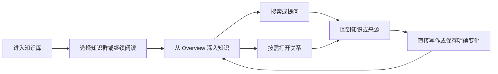

# AI-native 个人知识库

## 终局产品设计文档 v6.0 — Personal Knowledge Library

> 文档日期：2026-08-10  
> 文档状态：**当前唯一 Canonical 产品定义；完整终局，不是 MVP、原型说明或工程排期**  
> 产品阶段：产品定义继续收敛；当前不授权制作新原型或修改 Ardot 画布  
> 版本关系：本文件取代 v5.0。v5.0 保留为形成证据，不再承担现行产品权威  
> 文档权威：`AI-native-个人知识库-文档权威注册表-v1.0.md`  
> 决策状态：用户明确表达的方向标为`用户已确认`；其余是当前`推荐默认`，可以被用户反对，但不能被旧草图静默改写  
> 工作名：Personal Knowledge Library；只用于讨论，不代表最终品牌名  

---

# 如何阅读

如果只想判断“这是不是我要的产品”，阅读：

1. `0. 产品答案`；
2. `2. 产品宪法与决定账本`；
3. `3. 产品骨架`；
4. `5–8. 知识、关系与 AI`；
5. `11. 方向 3 + 2 的产品化`。

如果要继续设计或实现，再阅读：

- `4. 资源与真相模型`；
- `9–10. 形成、演化与所有权`；
- `12–15. 旅程、状态与验收`；
- `17. 文档权威与设计 Gate`。

本文可以独立定义产品。专项附录只能解释稀有边界，不能新增产品中心、日常概念或强迫界面暴露内部对象。

---

# 0. 产品答案

## 0.1 一句话定义

> **一个把资料与思考组织成知识群、丰富层级和有意义关系，并允许用户通过阅读、网络探索与 AI 查询不断深入的本地优先个人知识库。**

它首先是一座知识库，不是聊天应用、任务系统、文件管理器、无限白板或装饰性知识图谱。

## 0.2 用户真正拥有的东西

用户最终拥有：

- 一个长期存在、可导出、可恢复的个人知识库；
- 一个个有边界、有导读、有内部层级的知识群；
- 可以连续阅读、直接编辑和反复返回的知识正文；
- 同一知识在多个语境中的不同入口，而不是复制出来的多份正文；
- 能用完整句子解释“为什么相连”的知识关系与群关系；
- 可以从 Overview 一直深入到来源原文的核验路径；
- 能说明范围、依据与未知的 AI 回答；
- 未解决的问题、真正的冲突、历史版本和变化记录；
- AI、网络或索引暂时不可用时仍能阅读、写作和带走的 current knowledge。

## 0.3 三个主动作

日常体验只围绕三个主动作：

1. **理解**：从知识群 Overview 逐层进入 Topic、Knowledge、Claim 与 Evidence；
2. **探索**：沿层级、可读关系和策展路径发现相邻知识；
3. **调用**：通过 Search 或 Ask 找到、综合并重新进入已有知识。

写作、导入、来源、历史、恢复、冲突和维护是使这三个动作长期可信的支撑责任，不与知识本身争夺首页。

## 0.4 最简单的日常循环



产品价值不依赖用户先导入全部资料、搭建复杂结构或处理 AI 待办。写下第一条知识、建立第一个知识群、保存一份来源或提出一个问题，都会生成可以再次返回的真实资产。

## 0.5 可见骨架

```text
知识库
├─ 知识群：完整、稳定的知识群目录
├─ 知识网络：同一批知识群的关系观察
├─ 连续阅读
│  ├─ 知识群概览
│  ├─ 主题 / 子主题
│  ├─ 知识正文
│  └─ 具体判断 → 依据
└─ 次级入口
   ├─ 全部知识 / 已归档
   ├─ 来源
   ├─ 历史与恢复
   ├─ 导入 / 导出 / 备份
   ├─ 废纸篓
   └─ 设置 / 状态

全局动作：搜索 / 提问 / 添加
关系按需展开（内部责任：Quiet → Peek → Companion → Explore）
```

## 0.6 永久非目标

本产品永久不成为：

- 以聊天记录为主要资产的 AI 助手；
- 以文件夹、标签和模板配置为最终价值的文档库；
- 要求用户先搭数据库 schema 的低代码工具；
- 把全部节点平铺在画布上的全局星图；
- 用 Inbox、Review、Today、红点和通知驱动使用的维护系统；
- 通用任务管理、项目管理或学习打卡产品；
- 自动捕获所有屏幕活动的生活日志；
- 用关系数量、笔记数量、引用数量或 AI confidence 证明知识质量的 Dashboard；
- 只有启用 AI 或云服务才可使用的知识壳层。

---

# 1. 用户、问题与成功结果

## 1.1 用户已确认的意图

1. 产品本质是一个知识库；
2. 知识以一个个知识群存在；
3. 知识群之间的关系可以看见；
4. 知识从 Overview 到细节拥有丰富层级；
5. 用户可以用 AI 查询知识；
6. 用户可以在知识网络中主动探索；
7. 视觉上方向 3 的层级阅读与方向 2 的关系空间结合；
8. 当前先定义产品，不马上做原型；
9. 产品主要在本地使用，隐私不是本轮首要阻碍。

新增能力若不服务上述意图，也不是可信、历史、恢复或长期所有权所必需，就不进入产品中心。

## 1.2 首要用户假设

首要用户是需要长期理解多个复杂主题，并会反复返回、比较、修正和调用这些知识的个人。

职业可能是产品经理、研究者、创作者、学生、咨询顾问或独立开发者。真正的共同特征是：

- 材料跨网页、PDF、文件、对话和时间存在；
- 一个主题持续数周、数月甚至更久；
- 既需要读写，也需要比较、判断和复用；
- 不愿把维护标签、双链和模板变成第二份工作；
- 不接受不知道来源、范围与时效的 AI 结论；
- 希望知识变得更清楚，而不只是数量增加。

这是待验证假设，不代表已经拥有用户研究样本。

## 1.3 核心问题

### 材料存在，理解没有形成

文件和笔记保存了内容，却没有回答：这个知识范围如何组成、应该从哪里开始、各部分为什么有关。

### 层级与连接被迫二选一

文件夹提供层级但割裂关系；全局图展示连接却丢失阅读顺序、边界和语义。

### AI 解决了这一问，却没有建设知识

回答可能有用，却留在聊天历史里；它无法回到当前知识、来源和后续演化。

### 系统维护与真实理解竞争

用户需要不断处理标签、拆分粒度、模板、自动建议和未归类项目，知识库变成待办系统。

### 新信息制造副本，而不是修正理解

重复导入、重新总结和新的回答制造更多版本，却没有说明旧判断是否仍成立、什么改变了、怎样恢复。

## 1.4 核心 Jobs to Be Done

- 当我开始理解一个复杂领域时，我希望建立一个可整体进入的知识群，以便材料不是散落的笔记；
- 当我回到这个领域时，我希望先获得 Overview，再选择向哪一层深入；
- 当一个概念跨多个领域出现时，我希望复用同一知识，而不是复制正文；
- 当两条知识有关时，我希望知道它们为什么相关，而不是只看见一条线；
- 当我提出问题时，我希望 AI 明确使用了什么范围和依据，并能回到原知识；
- 当新来源改变旧判断时，我希望只检查受影响部分，而不是重新整理全部知识；
- 当服务、模型或设备变化时，我希望仍然拥有、读取、导出和恢复自己的知识。

## 1.5 用户结果

产品成功后，用户应该感到：

- 我知道自己的知识世界由哪些范围组成；
- 我可以从整体快速进入真正需要的细节；
- 我看得懂连接，不需要解释图谱本身；
- 我能判断回答来自哪里、覆盖到哪里、还有什么不知道；
- 我写下或确认的知识不会被 AI 静默替换；
- 我可以离开后准确回到原来的阅读和思考位置；
- 我不需要每天维护系统，知识仍会随着真实工作演化。

## 1.6 上线前验证门槛

在没有真实线上数据前，使用可验证的任务门槛，不虚构增长目标：

1. 8/10 名目标用户无需指导即可从空库写下第一条知识并再次找到；
2. 8/10 能从 Group Overview 进入指定 Evidence，再精确返回原段落；
3. 8/10 能从 Graph 或 List 正确复述一条关系的两端、方向和含义；
4. 8/10 能解释一次 Answer 使用了什么范围、哪些来源和哪些未知；
5. 10/10 不会把 AI 建议、Answer 或 retrieval route 误认为已保存的 Current Knowledge；
6. 离线、AI unavailable、index partial 和 write failed 的核心任务有独立验证；
7. desktop、compact、mobile、keyboard 与 screen reader 路径保留同一核心责任。

这些是预发布质量门槛，不是已取得的用户结果。

---

# 2. 产品宪法与决定账本

## 2.1 十条产品宪法

1. **Knowledge before Documents**：产品组织理解，不把文件格式当最终结构；
2. **Overview before Detail**：进入范围时先获得方向，再选择深入；
3. **Hierarchy and Relations are Complementary**：层级负责理解顺序，关系负责跨越和比较；
4. **One Knowledge, Multiple Contexts**：同一知识可在多个语境出现，正文不复制；
5. **Meaning before Edge**：关系先是一句可读陈述，图中才是一条线；
6. **Context before Answer**：AI 先说明范围、依据和覆盖，再给出结论；
7. **User-owned Current Knowledge**：AI 可以建议，不能静默推进 Current；
8. **Unknown is allowed**：问题、缺口、冲突和不确定性可以长期存在；
9. **Local ownership, calm surface**：本地、历史、恢复完整，但日常界面保持安静；
10. **Deep model, simple language**：内部模型可以精确，日常只暴露会改变用户决定的部分。

## 2.2 决定账本

| 产品命题 | 状态 | 当前决定 |
|---|---|---|
| 产品中心是知识库 | 用户已确认 | 唯一 Knowledge Library |
| 知识群、丰富层级、跨群关系 | 用户已确认方向 | Group → Topic → Knowledge → Evidence |
| AI 查询与网络探索都是核心 | 用户已确认 | Search / Ask / Explore 共享同一知识身份 |
| 方向 3 + 2 | 用户已确认方向 | Reading Primary，Relation on demand |
| 当前不做原型 | 用户已确认 | 先完成产品定义和设计 Gate |
| 用户可见信息架构 | 推荐默认 | 一个可见地点`知识库`；五个日常内容概念`知识群 / 主题 / 知识 / 关系 / 来源`；三个全局动作`搜索 / 提问 / 添加`；Scene、Surface、Current、Placement 等只作内部责任语言 |
| 表面架构先于页面清单 | 推荐默认 | 一个稳定 App Shell；Library、Reading、Relation、Answer、Source 五类 Scene 共享 Primary / Companion / Inspector / Overlay / Utility 角色与 Return Envelope |
| 完整度按任务证据计算 | 推荐默认 | 使用 18 个 Design Proof Bundles 证明入口、主动作、结果、失败、恢复、返回与责任等价；不按 Screen 数量计算 |
| Stable Library entry | 推荐默认 | cold start / new window 先到 Catalog；最多一条安全 Resume 由用户显式选择，普通 Open Group 进入 Current Overview |
| Library lenses 分权 | 推荐默认 | All Groups 穷尽；All Knowledge 为次级 inventory；Resume、Pin、Recent、Saved View、Saved Path 与 Recovery 不混淆 |
| 无 Group 的 Knowledge 合法存在 | 推荐默认 | Library 以`独立知识`安静承接，不设 Inbox 或整理债务 |
| Groups / Network 是同一 Library 两视图 | 推荐默认 | 防止目录与图谱成为两套系统 |
| Overview 是可编辑导读 | 推荐默认 | 不是只读 AI 摘要 |
| Topic 可递归 | 推荐默认 | 丰富层级但不强制每层中转 |
| Knowledge 默认连续正文 | 推荐默认 | 不默认拆成原子卡片墙 |
| 方向 3 是统一连续阅读系统 | 推荐默认 | Group Overview、Topic Opening 与 Knowledge Paper 共用 Reading Shell，不是三类中转模板 |
| Overview 三种权力分开 | 推荐默认 | Editorial prose、Structure projection 与 Reference 不互相冒充 |
| Anchor 是稳定 locator | 推荐默认 | 深层定位但不成为 Knowledge identity；移动、歧义与失效必须可见 |
| 编辑状态分权 | 推荐默认 | Current、Edit Buffer、Recovery、Explicit Draft、Proposal 与 Sync 不混淆 |
| 同一 Knowledge 多 Placement | 推荐默认 | 语境复用不复制正文 |
| Relation 是完整陈述 | 推荐默认 | Graph edge 只是投影 |
| Network 以 Group 为 resting level | 推荐默认 | Knowledge 网络必须有 scope anchor |
| Network 只投影 Current Relation truth | 推荐默认 | Exit、Observation、Candidate 与 History 分层；没有关系合法 |
| Scene / Trail / Path 与 Relation truth 分权 | 推荐默认 | pan、zoom、访问顺序和 Query Route 不自动成为知识关系 |
| Ask 不自动修改知识 | 推荐默认 | 所有写回都是明确、原子动作 |
| Ask 是知识操作而非聊天产品 | 推荐默认 | Composer 临时出现；提交后 Answer 是同一 Shell 中的主阅读对象 |
| Query history 不自动成为知识 | 推荐默认 | 恢复现场、Saved Snapshot、Question 与 Current Knowledge 分权 |
| Answer 与 Explore 可逆联动 | 推荐默认 | 从具体 Claim / Knowledge 进入 Network，并精确返回原 Claim |
| 用户直接写作就是 Current Knowledge | 推荐默认 | 不先变成 Draft、Candidate 或 AI Review item |
| Source save 与 Knowledge formation 分权 | 推荐默认 | 资料先成为可返回 Source；形成、补证和修订分别提交 |
| AI 形成追求最少必要变化 | 推荐默认 | zero-yield 合法，不建立卡片审批队列 |
| 维护在相关上下文出现 | 推荐默认 | 不建立独立 Review 首页 |
| 本地 current、可导出可恢复 | 推荐默认 | 云和 AI 是增强，不是所有权前提 |

## 2.3 暂不冻结的开放项

- 最终品牌名；
- Overview 中用户编辑文字与结构投影的具体比例；
- Topic hierarchy 的默认可见深度；
- desktop 中 Companion 的具体宽度和动效；
- Relation starter taxonomy 的最终词表；
- Answer Workspace 在不同窗口宽度下使用 full / companion presentation 的具体阈值；
- 移动端关系图何时从 List 升级为空间图；
- AI 自动整理的默认主动程度；
- 商业模式、协作和插件生态。

这些开放项不能阻止产品定义，也不能提前进入不可逆导航或对象模型。

---

# 3. 产品骨架

## 3.1 一个主地点

一级知识地点只有 **Knowledge Library**。

Library 有两个同义视图：

| View | 用户问题 | 内容责任 |
|---|---|---|
| Groups | 我有哪些知识范围，从哪里开始或继续 | 一条安全 Resume、少量 Pins、完整 All Groups Catalog；Recent / Saved Views 为次级 Lens |
| Network | 这些知识群为什么相连，可以向哪里探索 | 同一批 Groups、Current Group Relations、List Equivalent |

冷启动、正常重开应用和新窗口都先进入稳定 Library，而不是自动深开上次正文、Answer 或 Relation Scene。窗口尺寸、Library 的 Groups / Network 偏好可以恢复；深层现场只通过最多一条、符合安全条件的显式 Resume 恢复。普通打开 Group 始终进入 Current Overview，只有选择`继续`才恢复该 Group 内最近安全场景。未提交 Buffer、崩溃 checkpoint 与冲突属于 Recovery，不进入 Resume。

Groups view 的默认注意力顺序是：最多一条 Resume → 少量 Pins → All Groups。Recent 与 Saved Views 是次级 Lens，不能把 All Groups 挤成隐藏的“查看全部”。Pin 只表达用户固定的快捷入口；Recent 只记录成功 Open，不记录 hover、Peek、AI 使用或后台修改；最近打开与最近修改分开。Resume、Pin、Recent、Saved View、Saved Path 与 Recovery 使用不同生命周期，清除任一快捷状态都不改变 canonical knowledge。

`Groups`视图还承担一个安静但稳定的兜底：当 Current Knowledge 没有任何 active Placement 时，在 Catalog 之后显示`独立知识`。空库写下第一条 Knowledge 后，它直接成为主要内容；随着 Groups 建立，这一区域退到次要位置。它没有红点、清空目标、自动归类或维护压力，也不改变“Groups / Network 两个主视图”的结构。

`All Groups`始终是可穷尽、可搜索和可排序的 current Catalog。Pins、Resume、Recent 与 Saved Views 只是 Lens，不能替代或截断它。Saved View 可以是手工策展的一组 Group refs、明确规则的动态结果或带时间的 snapshot；它不拥有 Group、不创建 Relation、不改变 Ask scope，除非用户明确从该 View 发起操作，也不允许递归嵌套成第二棵目录树。

`All Knowledge`是 supporting navigation 中按 Knowledge identity 浏览的次级完整 inventory，用于对象级找回、检查多个 Placements 与查看独立知识；它不是第三个主视图、第二棵层级或首页卡片墙。同一 Knowledge 无论有多少 Placements 只出现一个 identity entry。Catalog 在 Search、AI、embedding、relation layout 或派生索引不可用时仍须通过 canonical metadata 工作。

不存在第二个 Home truth，也不存在独立 Atlas 产品中心。Sources、History、Recovery、Trash、Backup 和 Settings 是 supporting utilities。

## 3.2 三个全局动作

Search、Ask、Add 在 Library、Reading、Answer、Relation 与 Source Reader 中都可以调用；用户可见标签固定为：

- **搜索（Search）**：找回已知对象或内容位置；
- **提问（Ask）**：在明确范围内综合、比较、解释或发现缺口；
- **添加（Add）**：直接写作、建立 Group、保存 Source 或迁入知识。

三个动作不能合并成一个含混输入框，因为它们对数据有不同后果；也不增加 Command、Review、Explore 或 Inbox 作为第四个全局动作。Explore 是从当前知识、关系或回答进入的任务，不是全局模式。

Search、Ask 与 Explore 可以显式转换，但不静默改模式：Search 只有在用户选择`用当前结果回答`后才进入 Ask；Answer 只有在用户选择具体 Claim / Knowledge 后才进入 Explore；Network 只有在用户选择对象并确认范围后才发起 Ask。

## 3.3 连续阅读主干

```text
D0 Library
  D1 Knowledge Group / Group Overview
    D2 Topic / Topic Overview
      D3 Knowledge Paper
        D4 Section / Claim
          D5 Evidence Fragment in Source context
```

Topic 可以递归。产品只持续显示当前路径附近的有限层级，不把完整无限树同时展开。

## 3.4 横向关系半径

```text
R0 当前对象，无关系面
R1 当前 Knowledge 的一跳关系
R2 当前 Topic / Group 的主干、桥接与跨群出口
R3 Library 中 Groups 的正式关系网络
```

D 与 R 正交。扩大关系半径不改变当前阅读对象、Anchor 或 scroll；关闭关系面精确回到原位置。

## 3.5 持续 App Shell

Shell 始终回答：

1. 我在 Library 的哪个范围；
2. 当前打开的是 Group、Topic、Knowledge、Answer 还是 Source；
3. 我从哪里进入，关闭后回到哪里；
4. 当前 Relation presentation 是 Quiet、Peek、Companion 还是 Explore；
5. Search、Ask、Add 和 Library 怎样到达。

Shell 不用大量 tabs 解释产品。Overview、Structure、Relations、Sources 是当前 scene 的责任，不是四个同权根页面。

Scene family、Surface role、Presentation profile、Current、Placement、Anchor、Proposal、Return Envelope 与 DPB 都是内部合同语言，不成为普通用户必须学习的导航或模式。用户只需要一个稳定地点`知识库`、五个日常内容概念`知识群 / 主题 / 知识 / 关系 / 来源`和三个全局动作`搜索 / 提问 / 添加`。内部精度必须通过自然动作、完整状态句和渐进披露表达，不能直接把数据库模型搬上界面。

Shell 使用统一的 Surface roles，而不是每个功能各造一类页面：

| Surface role | 产品责任 | 核心约束 |
|---|---|---|
| Primary | 当前唯一主任务 | 同一时刻只有一个；面积大不等于拥有 Primary |
| Companion | 与 Primary 直接相关的第二责任 | desktop 最多一个；关闭后恢复 Primary 原 focus |
| Inspector | 检查 identity、relation、evidence、history 或 impact | 不创建导航中心，不推进 Current truth |
| Overlay | Search、Quick Ask、Add 等短暂、可取消动作 | 完成或取消都回到 origin；不能堆叠成工作区 |
| Decision / Recovery | 有明确后果的选择、冲突或未提交恢复 | 显示影响、失败隔离和下一步，不压成 toast |
| Utility | History、All Knowledge、Import / Export、Trash、Settings | 支撑长期可信，但不接管 Library 冷启动 |

Library、Continuous Reading、Relation Space、Answer 与 Source Reader 是五个 **Scene families**，不是五个一级地点；同一 Resource 可以因任务需要以不同 Surface role 出现，但 identity、Current truth、History 和 Return Envelope 不复制。

## 3.6 打开、检查与返回

| 动作 | 结果 |
|---|---|
| Focus | 移动键盘焦点或选中，不导航 |
| Inspect | 暂时查看摘要、关系或 Evidence，不推进历史 |
| Open | 改变主阅读目标，记录返回上下文 |
| Compare | 建立临时 pair workspace，不改变两端身份 |
| Close | 关闭临时表面并恢复进入现场 |
| Up | 回到结构上一级 |
| Back / Forward | 按访问时间返回 |
| Continue | 从 Library 显式恢复安全现场 |

普通打开 Group 进入 canonical Group Overview；普通打开 Topic 进入同一 Reading Shell 的 Topic 开场；普通打开 Knowledge 直接进入 Knowledge Paper。只有显式 Continue 才恢复深层阅读位置和安全的 relation presentation。

## 3.7 渐进组织而非组织债务

Knowledge identity 先于组织位置。`独立知识`只是由`Current Knowledge + 0 active Placements`推导出的 Library view，不是新 Resource、内容类型、生命周期或待办状态。Active Placement 指尚未结束或删除的语境归属；其 Group 当前、暂停或归档都不改变这项归属。

- 在 Library 直接写作，结果进入独立知识；
- 在 Group / Topic 内直接写作，结果同时拥有该 Scope 的 Placement；
- 添加第一个 Placement 后，Knowledge 从独立知识视图自然消失；
- 移除最后一个 active Placement 后，它自然回来，正文、Relations、Sources 和 History 不变；
- Group archive 不把其内容重新分类为独立知识；merge / redirect 事务性迁移 Placement；真正删除 Group 时必须逐类预览 Move、End Placement、Keep independent 或 Archive Knowledge 的后果；
- Knowledge archive 后才离开 current Library；
- AI 可以建议 Placement，但不能自动移动或用数量制造整理压力。

只有 1 条独立 Knowledge 时，它可以是 Library 主内容；增长到约 10 条后 Groups 优先、独立知识只显示少量继续项和`查看全部`；达到 100 / 10K 量级时使用稳定 List、Search、filters 和显式批量 Placement，不在首页铺开 All Objects。具体阈值仍需真实使用验证。

---

# 4. 资源与真相模型

## 4.1 五个日常概念

| 概念 | 用户心智问题 | 不是什么 |
|---|---|---|
| Group / 知识群 | 这一整个知识范围是什么 | 文件夹、标签、临时项目 |
| Topic / 主题 | 当前分支是什么，怎样继续深入 | 子知识群、正文副本 |
| Knowledge / 知识 | 我可以独立阅读、编辑和复用什么 | 每个段落一张卡片 |
| Relation / 关系 | 两端为什么相连 | 相似度、共现、装饰线 |
| Source / 来源 | 这条理解来自哪里，怎样核验 | 只有 URL、附件名或引用数 |

Question 是 Knowledge 的一种角色，Overview 是 Scope 的导读，Saved Path 是可选的策展产物；用户不需要先学习这些内部分类才能开始。

## 4.2 四类 canonical truth families

| Resource | 用户长期拥有的东西 | 核心生命周期 |
|---|---|---|
| Group | 一个有边界、可整体进入的知识范围 | create、restructure、merge、split、archive |
| Knowledge | 一份可独立阅读、编辑和复用的理解 | write、revise、split、merge、archive |
| Relation | 一句两端之间可读、可限定的长期陈述 | propose、adopt、revise、end、supersede |
| Source | 一份可定位、可版本化的原始材料 | add、parse、revise、unavailable、remove |

Library 是隐式根，不要求用户把它当一个可管理对象。

Topic 是 Group 内稳定、可寻址的结构身份；它不拥有独立 Group Boundary 或群关系网络。Saved Path 是用户显式策展的可选资产，不进入 canonical knowledge truth。

Group 与 Group 不做结构性嵌套。一个范围若主要在父 Group 内负责阅读深入，就是 Topic；若值得独立 Boundary、Overview 与整体 Relation，就是同级 Group。Group 之间的“子领域、组成、基础或应用”用完整 Group Relation statement 表达；只为一起浏览则使用 Saved View。

## 4.3 不是独立 Primary Resource 的责任

| 概念 | 正确身份 | Owner |
|---|---|---|
| Topic | Group 内的稳定层级身份 | Group |
| Overview | Group / Topic 的导读角色 | Scope |
| Placement | Knowledge 在某个 Group / Topic 的语境入口 | Knowledge + Scope |
| Section / Claim / Anchor | Knowledge 内部可定位结构 | Knowledge Revision |
| Evidence Fragment / Binding | Source 片段及其对 Claim 的作用 | Source + Knowledge |
| Question state | Knowledge 的一种语义角色 | Knowledge |
| Answer Run / Snapshot | 一次查询结果与保存快照 | Query history / optional Knowledge |
| Proposal | 对 Current 的候选变化 | affected owner |
| Change Set | 一次多对象提交的影响与历史 | History |
| View | 保存的动态观察规则 | Library / Scope |
| Saved Path | 用户策展的理解路线 | Library / exploration history |
| Pin | 用户显式固定的快捷入口 | Library supporting identity |
| Recent opened | 成功 Open 的有限历史 | device-local Library state |
| Resume point / selection / layout | 最近安全连续工作现场 | device-local Workspace state |
| All Groups / All Knowledge / 独立知识 | canonical identities 的穷尽或派生 inventory | Library projection |

这些身份仍需精确、可追溯和可恢复，但默认通过所属对象和动作后果出现，不进入一级创建菜单或导航。

## 4.4 五类连接分权

| 连接 | 回答的问题 | 是否进入正式关系网络 |
|---|---|---|
| Structure | 它在哪里、怎样深入 | 否 |
| Evidence | 依据来自哪里 | 否 |
| Reference | 哪里提到或引用它 | 否，可产生候选 |
| Semantic Relation | 两端为什么稳定相连 | 是 |
| Retrieval Route | 为什么本次 Search / Ask 一起使用 | 否，只属于本次运行 |

同一次查询使用两个对象不创建 Relation；一份来源支持 Claim 不把 Source 画成普通知识节点；同名和相似度不自动成为正式连接。

## 4.5 Current、Proposal、History 与 Projection

产品必须区分：

- **Current**：用户当前认可并实际使用的知识；
- **Proposal**：尚未采纳的明确变化；
- **History**：过去发生过什么，不能反向冒充 Current；
- **Projection**：可以从 canonical inputs 重建的目录、图布局、搜索结果、Overview 结构摘要；
- **Workspace state**：Resume、selection、scroll、展开程度、临时 filter 和 panel 比例；不含未提交 Recovery truth。

AI、索引或 layout 损坏最多影响 Proposal / Projection / Workspace，不得损坏 Current。

## 4.6 身份与删除原则

- 从一个 Placement 移除 Knowledge，不删除 Knowledge 本身；
- 删除 Source 不静默删除引用它形成的 Current Knowledge，但必须标记 Evidence unavailable；
- 删除 Relation 不删除两端；
- 删除 Topic 必须预览其直接内容、子 Topic 和 Placements 的移动方式；
- restore 总是形成可审计的新 current revision，不抹掉后续历史；
- derived index、graph layout 和 cache 可以重建，不进入必需导出资产。

---

# 5. Knowledge Group、Topic 与 Overview

## 5.1 Knowledge Group 的定义

Knowledge Group 是一个值得被反复整体进入、拥有稳定边界、内部层级和长期演化价值的知识范围。

一个成熟 Group 通常拥有：

- 名称与一句 Boundary；
- Group Overview；
- Topic tree；
- root knowledge 和多处 Placements；
- Sources；
- 主要 Knowledge Relations 与少量跨群出口；
- Current Group Relations；
- History 与结构变化记录。

这些不是创建门槛。一个只有名称和第一条 Knowledge 的 Group 已经合法。

## 5.2 何时建 Group，何时建 Topic

建立 Group，当一个范围：

- 会被反复整体进入；
- 拥有自己的 Overview 与边界；
- 内部可能形成多条 Topic 分支；
- 与其他范围的关系值得长期表达。

建立 Topic，当一个分支：

- 主要用于当前 Group 内继续深入；
- 不需要独立 Group Boundary；
- 不需要独立群关系网络；
- 离开父 Group 后价值明显下降。

日常判断使用三问测试。一个范围满足其中至少两项，系统才推荐 Group：

1. 用户会不会反复把它作为一个整体重新进入；
2. 它是否需要自己的 Boundary、Overview 和主要入口；
3. 它是否需要与其他 Groups 表达整体 Relation，而不只是具体 Knowledge exits。

内容数量不是决定因子：一条 Knowledge 也可能值得成为 Group，一百条 Knowledge 也可能仍只是父范围内的 Topic。若三问对普通用户过重，界面只问结果性问题“你以后会把它作为一个完整知识范围反复进入吗？”，其余放在 Preview 解释。

系统可以建议 Group / Topic，但不得因内容数量、聚类或标签相似度静默提升。

## 5.3 六种合法形成起点

同一种 Group 可以从以下入口形成：

1. Blank：只有名称；
2. 选中一条或多条 Knowledge；
3. 一组 Sources；
4. Topic promotion；
5. Saved View / Search snapshot；
6. imported hierarchy。

无论入口如何，最终都是同一种 Group。AI 聚类只产生可拒绝 Candidate；拒绝、取消或关闭零副作用。

## 5.4 Overview 是可编辑导读

Overview 回答：

- 这个范围是什么；
- 为什么值得进入；
- 当前结构怎样理解；
- 主要入口在哪里；
- 有哪些重要限定、争议和未知；
- 与哪些 Group 存在真正有意义的出口。

Overview 不是全文摘要、卡片拼接、AI 自动生成的首页，也不是第二套知识真相。

每个 Group / Topic scope 至多有一个随 scope 存续的 Current Overview identity；Bare、Structural、Oriented 与 Authored 只是密度变化，不复制正文、URL、History 或 Anchors。

它由三类可见内容共同构成：

1. **Editorial prose**：用户维护的导读、判断和组织意图；
2. **Structure projection**：从 Topic、Knowledge、Relation 和状态生成的可刷新结构信息；
3. **Reference**：指向真实 Knowledge / Anchor / Question / Relation / Source 的可读引用，不复制目标知识。

AI 不自动覆盖 Editorial prose。结构变化只对受影响片段提出 Diff。AI 或 Source change 形成的 **Proposal overlay** 是第三种临时权力：它必须显示 target、before / after、basis、影响和可撤销后果；关闭后恢复纯阅读，未采纳内容既不进入 Current，也不被未来 Ask 当成用户已认可知识。

Bare Group 可以完全没有 Editorial prose。此时界面可以显示标记清楚的 structure-generated orientation scaffold，但不能自动写出一段看似属于用户的成熟导读。Overview 中需要独立 Evidence、Relation、复用或修订节奏的判断应提升为 Knowledge，原位置留下 Reference；否则 Overview 会形成不可核验的影子知识层。

## 5.5 Overview 的默认信息预算

正常阅读态最多优先显示：

1. 一句 orientation；
2. 3–7 个主要入口；
3. 一段结构导读；
4. 最多 3 个关键关系或跨群出口；
5. 最多一条真正影响理解的变化或未知。

完整来源、历史、所有关系、结构操作和 AI 建议按需展开。

## 5.6 Topic 可递归但有限可见

- Topic 自身可以打开，但不要求每层写一篇页面：Structural Opening 只显示 path、children 与 root Knowledge；Oriented Opening 增加一句方向和主要入口；Authored Opening 才包含用户维护的局部 Overview；
- Topic Opening 是同一 Reading Shell、同一主滚动中的局部开场，不是一张必须再次点击才能进入正文的中转页；
- Topic 可以包含 Subtopics；
- 用户可直接打开深层 Knowledge，不被强迫逐层经过中转页；
- Structure 控件默认只展开当前路径、相邻 siblings 和少量下一层；
- Group root content 是正式内容，不叫“未归类”；
- Topic 不是 Subgroup，不拥有独立 Group Relations；
- Expand / Collapse 只改变 projection；Open 才改变主阅读目标并记录返回现场；
- Placement 指向一个具体 Group root / Topic。祖先 Overview 可以投影 descendant Knowledge，但不会因此生成额外 Placements。

模型不设置固定三层上限。Breadcrumb 保留 ancestors，过长时只压缩中段；mobile 用 drill-in list 表达同一层级。只有连续多个 Topic 都没有 orientation、root Knowledge 或 siblings 且各自只有一个 child 时，系统才可以建议 flatten；拒绝零副作用。

## 5.7 Group 状态

不用 Seed / Mature / Dormant 之类单一阶段替 Group 打分。以下状态正交：

- Orientation：Bare / Structuring / Oriented；
- Change：stable / changes available / review due；
- Attention：normal / needs decision；
- Lifecycle：current / paused / archived；
- Boundary continuity：stable / restructuring / redirected。

所有组合使用同一 Group shell。默认界面最多显示一条与当前任务相关的状态说明。

## 5.8 结构变化

Move、merge、split、promote、absorb 和 rename 必须预览：

- 哪些 Topics 与 Placements 改变；
- Overview 哪些结构投影刷新；
- 哪些 Knowledge / Group Relations 需要复核；
- Saved Paths、deep links 与 Anchors 怎样重定向；
- 哪些操作失败可以独立回滚。

结构变化不拼接或覆盖 Editorial prose，不因目录改变复制 Knowledge。

关键操作的默认语义：

- Rename 保持 identity，旧 path 可解析；
- Topic within-Group Move 保持 children 与 direct Placements，只改变 owner path；
- cross-Group Move 是 Boundary transaction，必须整体预览和回滚；
- Promote Topic 建立新 Group，迁移结构与 Placements，旧 Topic path redirect；不复制 Knowledge；
- Absorb Group 必须逐条处理其 Group Relations，Overview prose 不自动拼接；
- Split 先定义新 Boundaries，再 Move / Add Placements；
- Merge 选择 canonical Group identity，同名 Topics 与 Overview 不自动合并；
- Delete Topic / Group 必须分开处理 subtopics、Placements、Knowledge、Relations、Paths 和 prose。结束最后 active Placement 后 Knowledge 才进入独立知识；Archive Group 不触发。

---

# 6. Knowledge：连续正文与多语境复用

## 6.1 Knowledge 的定义

Knowledge 是一份围绕一个主要理解任务、可以独立阅读、直接编辑、被精确引用并在多个语境复用的长期内容。

它可以很短，也可以是长文。粒度由“是否需要独立理解、引用、演化和复用”决定，不由段落数量决定。

## 6.2 Knowledge Paper

默认阅读形态是连续 Knowledge Paper，而不是原子卡片墙：

- 标题和一句 orientation；
- 连续正文；
- 从同一正文投影出的 local outline 与可见但克制的 section structure；
- 局部 Claim / Anchor；
- 来源与 Evidence 入口；
- 关系与其他 Placements 入口；
- history / status 按需。

同一 Knowledge 只有一棵 Current content tree；orientation、outline、正文与 Claim view 不分别保存为互相同步的五份内容。Block 是编辑和定位机制，不要求阅读者感知每个 Block 都是对象。

## 6.3 深度投影

同一份 Knowledge content 可以按深度呈现：

| Depth | 表达 |
|---|---|
| Orientation | 一句主旨与适用范围 |
| Outline | 主要 sections 与结论入口 |
| Explanation | 连续正文 |
| Claims | 可单独引用和核验的局部主张 |
| Evidence | 来源片段及上下文 |

这些是同一正文的投影，不是五份互相同步的内容。

## 6.4 同一 Knowledge 多 Placement

一条 Knowledge 可以在多个 Group / Topic 中出现，但拥有同一 identity 和正文。

每个 Placement 可以保存：

- 所属 Group / Topic；
- 在这个语境里的说明；
- 局部排序与入口；
- 是否是主要入口；
- 与该 Scope 相关的关系或问题。

编辑正文会更新所有 Placements；编辑 Placement context 只改变当地语境。移除一个 Placement 不删除正文。

## 6.5 直接写作是一等能力

用户可以在任何合法 Scope 直接创建 Knowledge，不需要：

- 先添加来源；
- 先让 AI 拆分；
- 先选择复杂类型；
- 先经过 Proposal / Review；
- 先建立 Topic 或 Relation。

安全的直接保存立即更新 Current，并保留恢复 checkpoint 与 history。普通写作不使用“完成并采用”语言。

## 6.6 Question 是一种 Knowledge role

一个值得长期追踪的问题可以保存为 Question Knowledge。默认只显示：

- 问题；
- 当前回答或状态；
- 依据；
- remaining unknowns；
- 何时值得重查。

只有复杂研究场景才展开 resolution criteria、subquestions、applicability、review condition 与 successor。一次临时 Ask 不自动制造 Question 对象或 Inbox。

高后果 Question 的可选 Applicability Snapshot 至少可以保存：`as_of`、jurisdiction、decision period、subject conditions、governing basis、assumptions、exclusions 与 operational decision boundary。它可以被时间到达、Source material revision、basis / target change、subject condition change、applicability change、basis unavailable 或用户手动请求触发复核。系统只标出受影响 criteria，不自动宣判旧回答错误、重开 pursuit 或建立 successor。

## 6.7 Split、Merge 与局部提升

- 把 Section 提升为独立 Knowledge 时，原位置留下可读引用和 redirect；
- Split 预览 Placements、Relations、Anchors 和 Sources；
- Merge 选择 canonical identity，并保留旧 deep links；
- 历史引用默认仍可打开当时 revision，用户可切换 current；
- 任何 identity change 都不得依赖静默复制和删除。

## 6.8 阅读、编辑与历史连续性

- 在 Overview / Knowledge Paper 中直接编辑，经安全 commit 更新 Current；普通写作没有“完成并采用”；
- Edit Buffer、Recovery Checkpoint、Current Revision、Explicit Draft、Proposal 与 Sync 是不同状态，只有 safe commit 可以推进 Current；
- `已保存到本机`只表示 local Current 成功，不表示同步、索引或 AI 分析完成；
- 正常 close、navigation、Search、Ask、Evidence 与 Relation open 前先尝试 flush；成功不弹确认，失败时保留 Recovery；
- Ask 前 commit 失败时默认使用上一个 Current，只有用户明确同意才可仅本次包含未保存 Buffer；
- 用户可见 History 按有意义编辑会话分组；Restore 形成新的 Current revision，不抹掉后续历史；
- AI 默认对明确 Anchor / section 提出局部 Diff，不整篇改写，不移动 Current pointer；
- Anchor 结合 stable block / section id、origin revision、text quote context 与 structural path 解析；只能诚实进入 exact、relocated、redirected、ambiguous、orphaned 或 unavailable；
- 从 Evidence、Search、Ask、Relation 与 History 返回时，恢复 origin revision、Placement、Anchor、scroll、focus 与必要 scene。

---

# 7. Relation 与知识网络

## 7.1 Relation 的定义

Relation 不是一条线，而是一句可以独立阅读、核验和维护的陈述。

每条正式 Relation 至少拥有：

- left endpoint；
- relation phrase；
- right endpoint；
- direction / inverse reading；
- why it matters；
- qualifiers：时间、条件、范围、人群或语境；
- formation basis 与当前 Evidence condition；
- Current / needs check / historical disposition；
- Revision、decision history 与结束条件。

Graph edge 只是这条 Relation 的空间投影。

Candidate 不是一种 suggested Relation standing，而是采用前的独立建议；它不进入 Current Network、Ask truth、Overview 或 relation count。

## 7.2 两个关系层级

### Knowledge Relation

连接 Knowledge ↔ Knowledge，表达两份理解为什么相关。

### Group Relation

连接 Group ↔ Group，表达两个知识范围为什么值得整体连在一起。

Topic、Source、Evidence、Answer、Question state、Placement 和 retrieval route 不成为普通 semantic relation endpoints。

## 7.3 起始意图家族

主产品先冻结少量用户可理解的意图，不在界面暴露 25 + 11 项枚举：

| 意图 | 用户问题 | 示例表达 |
|---|---|---|
| Support / Explain | 它怎样支持或解释另一条知识 | A supports B under condition C |
| Challenge / Qualify | 它在哪里限制、反驳或修正另一条知识 | A qualifies B for population P |
| Extend / Refine | 它怎样补充或细化另一条知识 | A refines B by adding mechanism M |
| Apply / Implement | 它怎样把方法用于具体问题 | A applies B to context C |
| Example / Instance | 它怎样作为具体例子或实例 | A exemplifies B |
| Compare / Contrast | 两端在哪些维度相同或不同 | A contrasts with B on criterion K |

正式 type registry 可以在附录中版本化，但新类型必须证明用户能稳定选择、反向阅读不歧义，并且确实改变行为或解释。

## 7.4 关系创建

合法入口：

- 用户在阅读中直接写一句关系；
- 从两个已选对象显式 Compare；
- AI 基于明确 Evidence 提出 Relation Proposal；
- 从重复跨群出口提出 Group Relation Candidate。

关系按三层增长：

1. **Observation / Signal**：shared identity、unlinked mention、similarity、co-use、cross-group exit 或 candidate path；不进入正式网络；
2. **Candidate**：两端、完整 statement、方向、qualifiers、basis 与 counterexample 可以检查；它还不是 Relation，也不进入 Current；
3. **Current Relation**：用户直接声明或明确采纳，拥有 standing 与 history，才进入 Graph / List。

用户自己写出完整关系时，可以像直接写 Knowledge 一样提交 Current；系统提出的关系始终先是 Candidate。无论入口如何，提交表面必须看见两端、完整陈述、限定、依据和后果。拒绝 Candidate 零副作用。

## 7.5 Cross-group exit 不等于 Group Relation

一条 Knowledge 指向另一个 Group 内的 Knowledge，只证明存在跨群出口。

用户直接写出完整 Group Relation 时，可以作为个人判断提交 Current，并诚实显示当前 Evidence condition。系统主动提出聚合 Candidate 时才必须完成以下资格检查：

1. 一个能整体描述两群关系的 statement；
2. 不被重复引用夸大的有效支持；
3. 足够的边界覆盖或明确 named subscope；
4. 对反例、限制和移除关键支持后的结果进行检查；
5. 用户显式采纳。

系统聚合先折叠同一 Knowledge 的多 Placements、同一 Source lineage、inverse duplicate 与重复 traversal；默认至少需要两个独立有效支撑单位。来源明确陈述可以形成 source-asserted Candidate，但仍不能自动采用。

没有群关系是合法状态。路径数量、共同标签、相似度、degree 和 confidence 都不能自动升级；未通过门槛的真实连接保留为可走的 cross-group exits，不制造整理债务。

## 7.6 Shared Knowledge 是观察，不是新关系

当同一 Knowledge identity 在两个 Groups 都有 Placement 时，Pair Comparison 可以显示 Shared Knowledge Lens。

关闭 Lens 后不留下 edge，不改变正式 Relation，也不因为共享内容自动声明两个 Group 的语义关系。

## 7.7 关系呈现阶梯

| Presentation | 用户意图 | 视觉责任 |
|---|---|---|
| Quiet | 只阅读 | 不显示关系面，只保留克制入口 |
| Peek | 检查一个局部连接 | 临时 inspector，不推进导航 |
| Companion | 对照当前阅读与相邻关系 | 次级关系面，跟随显式 Open |
| Explore | 主动网络探索 | Relation Space 成为 Primary，阅读退为 context |

Presentation 与 R0–R3 半径分开。普通打开始终 Quiet；系统不因“上次打开过图”自动恢复关系面，除非用户显式 Continue 安全现场。

- R0：不主动显示图，只保留安静 cue 或 List entry；
- R1：当前 Knowledge / Group 的直接正式关系；
- R2：一条有解释的多步路径或 Pair context；
- R3：Library Group Network。

用户可以在 Peek 检查一条 R3 群关系，也可以在 Explore 中只查看 R1；注意力强度不会偷偷改变关系范围。

## 7.8 Graph 与 List 同义

每个 Graph 必须有 List Equivalent，并共享：

- 当前 scope 与 anchor；
- selection；
- filter；
- endpoints；
- relation statement、direction、standing 与 qualifiers；
- Open / Inspect / Compare 行为；
- exact return。

颜色、位置、线宽和动画只帮助扫描，不能承担唯一语义。

Current、Suggested 与 History 必须分层。打开 Suggested layer 不改变 Current layout、endpoint degree、Ask truth 或关系数量；Graph layout unavailable 时自动使用 List，而不是显示“没有关系”。

## 7.9 网络规模

- Library Network resting level 只显示 Groups 与 Current Group Relations；
- Knowledge network 必须锚定当前 Group、Topic、Knowledge、Relation 或 Query Route；
- 超过可读预算时先显示 effective scope、visible / total、隐藏原因、穷尽 List，并要求明确 anchor；
- 不用 AI relevance、degree 或“Top N 核心节点”静默决定什么重要；
- 大规模状态不创建新的产品模式或首页。

零 Group Relation 时不画空星云、不用 similarity 补边，也不显示“网络尚未完成”；未连接 Groups 仍可从 Catalog / List 穷尽找回。

## 7.10 探索与返回

Inspect 只临时检查 Relation / endpoint，不改变 Reading Target；Open 才改变 Primary target。打开 Relation target 前保存 origin object、Revision、Placement context、Anchor、scroll、focus、selection、filters、viewport、presentation / radius 与 Ask Claim origin。Explore 中的 hover、pan、zoom、filter 和 Inspect 不进入知识历史；显式 Open 才增加 ReturnStack 与 Exploration Trail。

用户可以：

- 回到 origin；
- 回到上一分叉；
- 找回刚才另一条分支；
- 把筛选后的路线保存为 Saved Path。

完整访问流水不自动成为 Path；用户需删除弯路、命名目的并确认步骤。

Relation Scene、Exploration Trail、ReturnStack、Saved Path 与 Path Progress 是不同状态。Query Route 只解释本次 Answer，转成 Explore origin、Saved Path 或 Relation 都需要不同的显式动作。

## 7.11 Current、变化与历史

- **Current**：用户当前仍采用，进入默认 Network；
- **Needs check**：当前仍采用，但变化可能影响它；Ask 使用时必须说明；
- **Ended**：在明确旧时间或范围内曾经成立，现在自然结束；
- **Superseded**：由更准确的 successor Relation 承担同一作用；
- **Retracted**：用户不再认为原陈述成立；
- **Archived**：保留但退出当前工作视图，不等于错误。

增减 Evidence 只更新 Binding / support snapshot；statement、direction、qualifier 或 named subscope 改变才产生 Relation Revision。Group / Knowledge split、merge、redirect 与 delete 必须逐条预览 Relation 后果，不能静默复制、retarget 或改型。

---

# 8. Search、Ask、Answer 与 Question

## 8.1 三种不同意图

| 意图 | 用户在做什么 | 默认结果 |
|---|---|---|
| Search | 找到已知对象、文字或位置 | 直接打开对象 / Anchor |
| Ask | 综合、比较、解释、发现缺口 | 一次可核验 Answer Run |
| Explore | 主动沿关系和结构导航 | 可返回的阅读 / 关系现场 |

Search 不生成答案；Ask 不静默改变知识；Explore 不因为访问而创建正式关系。

它们不是三个隔离模块。一次完整使用可以从 Search 定位开始，经 Ask 综合，再从 Answer Claim 进入 Explore，最后精确回到原 Search / Reading 现场；转换必须保持同一 identity、scope、selection 和 Return Envelope。

## 8.2 Search

Search 支持：

- Group、Topic、Knowledge、Relation、Source、Saved Path；
- 标题、正文、Claim、属性、来源文字；
- 当前 Scope 或全 Library；
- exact Anchor deep open；
- redirected、historical-only、unavailable 与 ambiguous 结果；
- filter 后 0 result 与 Library 真正不存在的区别。

打开结果后 Back 恢复 query、filters、result set、scroll、focus 和原工作现场。

当用户输入完整问题时，Search 仍先返回匹配对象；可以提供`基于当前结果提问`并预览 result set、scope 与 exclusions，但不因问句形式自动生成 Answer。

## 8.3 Ask 的默认范围

Ask 可以从任何位置调用，但必须显示用户可理解的请求范围：

- 当前 Knowledge；
- 当前 Topic；
- 当前 Group；
- 已选择的多个 Groups / Knowledge；
- 整个 Library；
- 指定 Sources；
- 可选 Web。

Composer 用一句人话说明“你让我查的范围”，不默认堆满 scope chips。系统实际采用的 Effective Context 和真正用于回答的 Used Context 可以进一步检查。

明确 Topic / Group 的结构性后代属于其范围；越过 Group Boundary 的 Knowledge 不自动进入 Used Context，除非问题点名另一 Group / Knowledge，或用户接受一次性扩大。Web 默认关闭，且本次允许不继承到 Follow-up 之外的新调查。

## 8.4 Answer 的阅读结构

Answer 默认按以下顺序呈现：

1. Direct Answer；
2. Scope：系统实际查询了什么；
3. 主要依据：内联 claim-level citations；
4. Coverage：充分、部分、不足或无法判断；
5. Limits / Unknowns；
6. Knowledge Route：本次使用的知识与来源；
7. 原子化后续动作。

长答案使用连续正文，不使用聊天气泡堆积。流式生成期间，未形成依据的文字不得冒充完整 grounded answer。

这是一组按需出现的责任，不是七个常驻区块。默认先显示 Direct Answer、决定性限制与主要 citations；Scope、Coverage、Route 与写回按用户检查意图展开。提交前 Composer 是临时层，提交后 Answer 成为同一 Shell 中的 Primary Reading Target。

## 8.5 Answer Basis

每个主要 Claim 可以展开查看其依据角色：

- 来自用户 Current Knowledge；
- 来自 Source 原文；
- 来自外部 Web 来源；
- 基于已有知识的明确推论；
- 两个或多个对象的比较综合；
- 尚无充分依据的 unknown。

来源数量不等于 Coverage；检索相似度不等于 correctness；系统不能用一个统一“引用 3 条”替代逐 Claim 的 basis。

## 8.6 诚实负面回答

产品不说无边界的“你的知识库里没有”。负面回答必须限定：

- 查了哪些 Groups / Sources；
- 索引是否完整；
- 是否启用了 Web；
- 找到什么相邻内容；
- 当前结论是未找到、材料不足、条件冲突还是无法访问。

## 8.7 Answer 后的原子动作

以下动作后果不同，不能合成一个`保存`：

| 动作 | 结果 |
|---|---|
| 保存回答快照 | 保存本次 Question、Context、Answer、Citations 与时间 |
| 保存为 Knowledge | 建立新的 Current Knowledge，先预览范围、来源和 Placement |
| 更新现有 Knowledge | 对指定 Anchor 提出局部 Diff |
| 保存 Question | 建立 Question Knowledge，不自动采纳当前回答 |
| 提出 Relation | 建立 Relation Proposal，显示两端与 statement |
| 保存 Source | 保存外部材料，不自动形成 Knowledge |
| 保存为 Path | 进入可编辑 Path draft，不复制 Query Route |

用户可以只阅读并关闭，不被强迫保存。

AI 写回按发起权分开：

| 发起情境 | 默认权力 |
|---|---|
| 用户只 Ask / Explain | 生成 Answer；不写 Current |
| 系统主动发现 Source 或结构变化 | 只产生局部 Proposal |
| 用户明确要求“把它写入 / 更新 X” | 生成目标明确的 Change Preview；确认目标后原子提交。若用户同时明确说“直接改”，可以提交并提供 Undo |
| 用户本人在编辑器直接写作 | 与普通编辑相同安全提交；AI 辅助不引入 Review 门槛 |

Answer 上可以用`用于知识`作为渐进披露入口，但展开后仍必须落到表中的具体原子动作，不能重新合成`Accept all`。

## 8.8 Follow-up 与 Re-evaluate

- Follow-up 保存相对上一步改变了哪些条件或 Scope；
- Retry 重新运行同一问题，不覆盖旧 Run；
- Branch 从某一轮建立新分支；
- Re-evaluate 用新 Context / Sources 生成新 Run，并显示 Answer Diff；
- Saved Answer 保留 Original Snapshot，不默认成为未来 Ask 的知识来源。

最新 Answer 始终是主 Paper；旧轮次以可展开的 investigation lineage 存在，不堆成无限消息流。每轮 Follow-up 用一句话说明问题、条件、Scope、Web policy 或 Used Context 相对上一轮发生了什么变化。

## 8.9 Question 的长期演化

Question Knowledge 可以处于：

- open：尚无可用回答；
- partial：有局部回答，仍有重要未知；
- provisional：当前可用，但依赖时效或条件；
- resolved：当前 criteria 已满足；
- paused / concluded：用户暂停追踪或结束追求。

回答状态与是否继续追踪分开。新 Answer 不自动关闭 Question；Source revision 不自动宣布旧 Resolution 错误；reopen 与建立 successor question 是不同动作。

## 8.10 Answer Workspace、恢复与保存

当前 Investigation Workspace 可以为崩溃恢复而在本机自动保存 unfinished prompt、Run state、Answer scroll、Claim focus、expanded citation 和 Explore return state。它不进入 Library、Group、Network、backlinks、普通 Search 或未来 Answer truth。

用户显式`保存回答快照`后才建立 durable Saved Answer Snapshot。Snapshot 可以从 origin / Question History 或带过滤的 Search 找到并进入 Knowledge Package，但仍不成为未来 Ask 的默认依据。保存为 Question、保存为 Knowledge 与更新现有 Knowledge 继续使用 §8.7 的独立提交。

## 8.11 Answer 与 Explore 的可逆桥

选中 Answer Claim 后，用户可以检查其 Knowledge、Source、inference 与 Relation steps。只有存在真实 structure、Evidence 或 Current Relation chain 时才显示 Knowledge Route；没有真实路径时显示 Used Knowledge List，不补`related_to`。

`在知识网络中查看`只携带当前 Claim / Knowledge anchor。Relation Space 中的 runtime retrieval jumps 保持临时；关闭后恢复 Answer Claim、scroll、Scope Summary、expanded citations 和 follow-up draft。反向从 Network 发起 Ask 时，只使用显式 selection，不把 viewport、hover、隐藏邻居或整个 scene 当作 Context。

---

# 9. Add、直接写作、来源与知识形成

## 9.1 Add 不是导入中心

Add 提供五种真实起点：

1. 写一条 Knowledge；
2. 建一个 Group；
3. 添加一份 Source；
4. 迁入已有知识；
5. 保存一个 Question。

默认突出当前 Scope 最自然的一个动作，其余作为安静替代。首日不要求 Topic、Relation 或 AI 整理。

## 9.2 直接写作路径

```text
Add / 在当前位置写
→ 直接输入正文；标题可以稍后补
→ 默认放入当前 Scope；无 Scope 时成为独立知识
→ 安全保存 Current Knowledge
→ 返回 Library / Scope 可再次找到
```

用户选择`写知识`后，粘贴长内容也仍按用户意图形成 Knowledge；系统可以提示切换为`保存资料`，但不能按长度偷偷改判 truth role。AI 可以帮助润色或提出结构，但普通写作没有 Candidate、Review 或 Accept all。

## 9.3 Source-first 双提交

来源路径分成两次独立承诺：

1. **Source Commit**：原材料一旦成功接收即成为 Source；
2. **Knowledge Commit**：用户稍后选择哪些内容值得形成 Knowledge、Relation、Overview Diff 或 Placement。

AI 解析、OCR 或提取失败不撤销已保存 Source。Source-only 是合法完成结果。

回执必须准确区分`原文件已保存`、`网页快照已保存`、`只保存链接，内容尚未存档`和`资料已保存，当前只解析部分`。Source Attachment 只记录材料为何进入某个 Group / Topic，不等于 Knowledge Placement 或 Evidence Binding。

## 9.4 AI Knowledge Formation

AI 形成知识时，必须先回答：

- 这是现有 Knowledge 的补证、修正或重复吗；
- 它是否真的增加新的可复用理解；
- 适用条件和时间是什么；
- 依据来自哪些 Source fragments；
- 建议进入哪些 Scope；
- 接受后会改变哪些 Current objects；
- 是否可以只保存 Source 而不形成 Knowledge。

建议按少量有意义的决定组织，不按 chunk 或“抽取到 23 条洞察”制造卡片队列。

从 Source 选区形成时，用户可以选择`写下我的理解`、`让 AI 起草`或`作为现有知识的依据`。Highlight / Annotation 默认保留在 Source context；纯摘录不自动成为 Current Knowledge。AI 起草始终是 Proposal，除非用户明确提交。

## 9.5 Formation 可能的结算

- Source 已保存，暂不形成知识；
- 新 Knowledge；
- 现有 Knowledge 的 Evidence 补充；
- 对现有 Claim 的局部修订建议；
- 一个或多个 Placements；
- Relation Proposal；
- Overview Diff；
- Question / Unknown；
- zero-yield：没有发现值得形成的变化。

每项单独结算。部分失败必须明确说明什么已保存、什么未保存、如何重试。

Evidence-only 只建立 Binding，不改正文；真正改变用户理解时才对指定 Knowledge Anchor 提出局部 Diff。新 Knowledge 声称 Source basis 时，Knowledge Current Revision 与 required Binding 必须原子提交；Placement 可以独立失败并安全落入独立知识。

## 9.6 Placement 与独立知识

Knowledge 可以没有 Group / Topic Placement。它稳定出现在 Library Groups 视图的`独立知识`区域，并可通过 Search 找回；这可以是暂时状态，也可以长期保持。它由零 active Placements 推导；Group archive 不结束 Placement，也不会让整群内容涌入该区域。它不是红点 Inbox、内容类型或需要清空的队列。

建议 Placement 时显示：

- 候选 Group / Topic；
- 为什么适合；
- 是否与现有 Placement 重复；
- Keep both / Move / Add context 的后果。

AI 不因相似度自动移动内容。

## 9.7 批量与大来源

120 页 PDF、300 Sources 或大批迁入不按每段生成审批项。系统应：

- 先保护原材料；
- 后台解析并显示可用范围；
- 把高影响变化合并成少量 Decision Bundles；
- 允许 zero-yield、parse partial 和 cancelled；
- 保持逐对象失败隔离；
- 支持暂缓，无 Review debt。

迁入已有内容前先区分`我的知识`、`参考资料`、`混合`和`不确定`。Imported folder path 只保存 provenance，并可提出 Placement / Topic / Saved View mapping；它不自动成为 nested Groups、Group Relations 或 semantic edges。

## 9.8 Source Reader 与 Evidence

Source Reader 至少分开：

- Source identity：同一材料是什么；
- Revision：材料在什么时间发生了什么版本变化；
- Representation：原文件、解析文字、网页快照或媒体转写；
- Fragment：被引用的精确片段与 locator；
- Binding：该片段怎样支持、限定、挑战或仅提供背景；
- Availability：当前能否打开原材料、是否只剩历史快照；
- Used by：哪些 Claims、Relations 或 Answer Runs 实际使用它。

Source Reader 中的 Highlight、Annotation、Add Evidence、Form Knowledge 与 Ask selected fragment 是不同动作。Highlight / Annotation 可以长期保留并返回原 locator，但不会自动进入 Overview、Network 或未来 Ask 的 Current Knowledge scope。

研究型 Claim 可以在 Binding 上按需保存 population、material、intervention、comparator、outcome、delay、assessment 与 limitations 等 Condition Snapshot。这是会改变可比性和适用范围时才出现的 Forensic 信息，不是所有 Source 的表单门槛。

打开 Source Fragment 后，关闭必须返回原 Claim、Answer citation 或 Relation support。Source 新 Revision 只触发影响评估；无法打开原网页不删除历史 Fragment、Knowledge 或 adopted Answer。

---

# 10. 演化、维护、历史与本地所有权

## 10.1 用户拥有 Current

用户直接编辑可以安全提交 Current。AI、Source revision、import 和 schema change 只能：

- 更新 derived projection；
- 产生局部 Proposal；
- 标记某个具体判断需要复核；
- 说明当前仍然有效的部分。

它们不能静默覆盖用户正文、改变 Relation statement 或移动 Placement。

## 10.2 Proposal 的出现条件

只有当变化真正需要用户判断，Proposal 才出现：

- 会改变 Current meaning；
- 会改变 identity、Placement 或 Relation；
- 存在多个合理选择；
- 需要接受风险或丢失；
- 无法自动合并而保持语义。

低风险 projection refresh、索引重建、格式迁移和 cache 恢复不进入 Review。

## 10.3 Contextual maintenance

维护入口出现在受影响对象和上下文：

- Overview 某一段显示`这里有变化可检查`；
- Relation Inspector 显示 support changed；
- Source Reader 显示 revision changed；
- Question 显示触发了重新检查条件；
- Library 最多显示一条真正影响当前理解的 notice。

产品不建立需要清空的 Review 首页或 AI Inbox。

## 10.4 局部 Diff

Proposal 必须显示：

- base revision；
- exact target；
- proposed change；
- basis；
- affected Placements / Relations / Paths；
- locked / unaffected content；
- partial accept；
- undo 和 failure isolation。

整篇覆盖、Accept all 和单一 confidence 分数不适用于高影响知识变化。

## 10.5 History 与 Undo

History 分开记录：

- Knowledge content revisions；
- Group structure changes；
- Relation revisions；
- Source revisions；
- Answer runs / saved snapshots；
- Change Set commits；
- Workspace continuity checkpoints。

Restore 总是建立新 current revision，并保留恢复前状态。Undo 只撤销明确事务，不跨越已发生的独立后续变更。

## 10.6 失败分层

| 失败 | 仍然可以做什么 | 不得显示成什么 |
|---|---|---|
| AI unavailable | 读、写、搜已索引内容、浏览关系 | 整个产品不可用 |
| Index partial | 读写 Current，查看 last good results | “知识库为空” |
| Source unavailable | 读历史 Knowledge 和引用文字 | 自动删除 Evidence / Knowledge |
| Write failed | 保留 buffer / recovery，重试或另存 | 假成功 Toast |
| Graph layout failed | 使用 List Equivalent | 关系不存在 |
| Sync unavailable | 本地继续工作并显示 pending | 阻塞本地写作 |

## 10.7 Local-first 的产品责任

本地优先不是首屏技术选择器，而是四个用户承诺：

1. current knowledge 默认存在本地可用副本；
2. AI、云和同步不可用时，已拥有知识仍可读写；
3. 用户可以导出 canonical content、structure、relations、sources、history 与 redirects；
4. restore 不依赖 graph layout、search index、embedding cache 或 workspace state。

## 10.8 Knowledge Package

完整导出至少包含：

- Groups、Topics 与 Boundaries；
- Knowledge current / history；
- Placements；
- Relations 与 qualifiers；
- Sources、revisions、fragments 与 bindings；
- Saved Paths；
- stable IDs、Anchors、redirects 与 tombstones；
- machine-readable manifest 和人可读内容。

可选包含 saved views 和 answer snapshots。派生索引、embeddings、graph layout 与临时 selection 不作为恢复必需品。

## 10.9 删除与恢复

- Archive 默认可逆，保留 deep links 与历史；
- Trash 清楚显示将影响哪些 current references；
- 永久删除前先验证目标、数量和非级联后果；
- Source、Knowledge、Relation、Placement 与 Workspace state 使用不同删除语义；
- 恢复后旧链接可解析到 current 或明确 historical target；
- cache / projection corruption 不触发 canonical deletion。

---

# 11. 方向 3 + 2 的产品化与表面架构

## 11.1 不是两张图的平均叠加

方向 3 + 2 的准确解释：

- 方向 3 负责 Scope、层级、Overview 和连续阅读，是默认主体验；
- 方向 2 负责关系探索，是随意图逐级展开的第二维度；
- 两者共享同一 identity、selection、source truth、history 和 return context；
- 两个空间不会永久等宽，也不会生成两套状态；
- 星云、节点密度和空间感只能表达真实数据，不能替数据创造意义。

## 11.2 五种主要产品场景

Scene family 描述“用户正在完成哪类任务”，不等于 route、page template 或新的产品 Place。五者共用同一 App Shell；打开一个新 Surface 不创建 Resource，存在一个 Resource 也不要求独立全页。

### Scene A · Library

Groups / Network 两个视图；冷启动先进入稳定 Library；最多一条安全 Resume、少量 Pins、完整 All Groups Catalog，Recent / Saved Views / All Knowledge 为次级入口。普通 Open Group 进入 Current Overview，显式 Continue 才恢复深层现场。不是 Dashboard、推荐 feed、全局星图 Hero 或维护队列。

### Scene B · Continuous Reading

Group、Topic、Knowledge 共用 Shell；Primary content 是温暖、安静、可连续阅读的 Knowledge Paper。

### Scene C · Relation Space

Peek / Companion / Explore 使用深色空间语法；关系标签、方向、standing 和 List Equivalent 是真实控件。

### Scene D · Answer

同一 Shell 中以连续 Paper 呈现最新 Answer；先给 Direct Answer 与决定性限制，再按需检查 Scope、claim citations、Coverage、Unknown、Route / Used Knowledge、Follow-up Delta 与原子动作。它不是聊天首页，旧轮次不以无限气泡堆积，Answer 可以从具体 Claim 进入 Relation Space 并精确返回。

### Scene E · Source Reader

显示 Source identity、revision、representation、original context、fragment locator 和被哪些 Claims 使用。

History、Recovery、Import / Export、Trash、Settings 是 Supporting Utilities，不成为并列产品中心。

## 11.3 三种 Presentation Profiles

| Profile | Primary | Secondary |
|---|---|---|
| Reading | Knowledge Paper | Structure / optional Evidence |
| Companion | Knowledge Paper | Relation Companion |
| Explore | Relation Space | Reading context / Inspector |

Profile 是当前 Workspace presentation，不改变 Knowledge、View、Relation 或 Group state。

## 11.4 Warm Paper

阅读空间的视觉责任：

- 高可读正文；
- 清楚 hierarchy 和 DepthTrail；
- 大段连续内容而非卡片墙；
- Overview、Topic Opening 与 Knowledge Paper 共用连续 Reading Shell，但类型和责任清楚；
- long Knowledge 有真实 local outline、current section 与 deep Anchor，不以长度自动拆卡；
- 辅助信息退后；
- AI cue、change cue 和 relation cue 不抢占注意力；
- 直接编辑、保存、Recovery、History 与局部 Diff 保持同一阅读现场；
- 低饱和强调色只表达 selection / action，不表达真值。

## 11.5 Relation Night

关系空间的视觉责任：

- 明确当前 scope / anchor；
- 真实 labels、edges、direction 和 standing；
- selection 与 focus 可辨；
- 图、列表和 Inspector 同义；
- Current、Suggested 与 History 分层，零关系和一条关系都能诚实表达；
- 节点数量服从可读性；
- 不使用星云图片、随机光点或装饰连线冒充数据。

## 11.6 渐进披露

所有核心场景使用四层披露：

1. **Calm**：完成主任务所需的最少信息；
2. **Focused**：当前 selection、局部关系和精确位置；
3. **Decision**：Diff、影响、basis、undo；
4. **Forensic**：revision、bindings、policy 和修复工具。

内部模型不因为存在就进入 Calm 层。

四层同时是语言责任：Calm 先说明当前对象、主任务与一个主要动作；Focused 补充位置、范围和局部关系；Decision 解释改变、保留、失败隔离与恢复；Forensic 才显示 revision、binding、policy、内部 ID 与修复工具。可见标签必须足以理解关键后果，不得把范围、方向或危险动作只藏在图标、tooltip、颜色或 accessible name 中。

## 11.7 Responsive equivalence

### Desktop wide

最多一个 Primary + 一个 Companion + 一个可折叠 Rail。

### Compact / tablet

Companion 变为可切换 pane 或 sheet；Primary 不缩水；Return context 保留。

### Mobile

阅读、Search、Ask、Add、基本写作、Evidence 和恢复成立；关系默认 List Equivalent，空间图按能力升级。

响应式只改变布局，不删除核验、写回边界和返回能力。

## 11.8 Accessibility

- hierarchy tree、graph、list 和 editor 有明确 name / role / state；
- focus、selection、activation 和 current 分开；
- 关系语义不只依赖颜色、位置、线宽或动画；
- 200% zoom 时阅读主面保持顺序，Companion 不遮挡内容；
- reduced motion 不损失关系方向或导航反馈；
- screen reader 可以按 endpoint、statement、qualifier、standing 读取关系；
- 从 Citation / Inspector 关闭后，焦点回到原 Claim / control；
- 键盘用户能够完成 Search → Open → Evidence → Back、Relation List → Compare → Close 等核心任务。

---

# 12. 核心端到端旅程

## 12.1 空库到第一条可返回知识

Library empty → 写第一条 Knowledge → 自动保存到安全 Current → 返回 Library → 再次打开同一 Knowledge。

成功标准：无模板、AI、来源、Topic 或 Relation 门槛。

## 12.2 建立第一个知识群

Add Group → 输入名称与可选 Boundary → Group Overview empty state → 写 root Knowledge 或建立 Topic → Library Catalog 可再次进入。

成功标准：Bare Group 合法，不伪装成熟，也不制造完成度压力。

## 12.3 从 Overview 深入到 Evidence

Library → Group Overview → Topic → Knowledge → Claim citation → Source Fragment → Close → 精确返回 Claim、scroll 与 focus。

成功标准：路径、来源角色和返回现场连续。

## 12.4 同一 Knowledge 跨两个 Groups

打开 Knowledge → Add Placement → 选择第二 Group / Topic → 填写当地语境 → 两处打开共享同一正文 → 移除一个 Placement 不删除 Knowledge。

成功标准：身份统一、语境不同、删除后果清楚。

## 12.5 Search 深层找回与返回

在 Library 或深层 Reading 打开 Search → 输入标题、正文片段或条件 → 结果区分 Group、Knowledge、Claim 与 Source → 打开 exact Anchor → 查看必要上下文 → Back → 恢复 query、filters、result set、scroll、focus 和原工作现场。

成功标准：Search 直接找回而不生成 Answer；historical、redirected、ambiguous、source unavailable 与 index partial 不冒充普通 current result。

## 12.6 当前 Topic 内 Ask

Topic Reading → Ask → 显示 requested scope → Answer 展示 used knowledge、citations、Coverage 和 Unknown → 打开引用 → 返回 Answer → 只阅读并关闭。

成功标准：不自动保存 Answer 或改变 Topic。

## 12.7 Answer 形成知识

Answer → 保存为 Knowledge → 预览 title、content、basis、Placements → 明确提交 → 打开新 Knowledge → Back 返回 Answer Snapshot。

成功标准：形成行为原子化、可撤销、不会连带保存所有建议。

## 12.8 沿关系跨群探索

Knowledge Quiet → 显式 Inspect 进入 Peek → 打开唯一 Companion → Open related Knowledge in another Group → Explore pair → Close / Back → 回到原 Knowledge exact Revision、Placement、Anchor、scroll、focus 与 relation scene。

成功标准：Presentation 与 Radius 分权；Inspect 与 Open 后果不同；Scene、Trail 与 Path 不污染知识真相。

## 12.9 建立 Group Relation

观察多个跨群 exits → 系统折叠重复支撑形成 Signal → 检查 Boundary coverage、type fit、counterexamples 与 strongest-support removal → Candidate 说明完整 statement 和 limits → 用户采纳 → Library Network 出现 Current Relation → List 可读同义内容。

成功标准：raw path count 不自动变边，没有关系也是合法结果。

## 12.10 新来源改变旧知识

保存 Source revision → 识别受影响 Claim → 在该 Knowledge 显示局部 cue → 打开 Diff → 接受一部分、拒绝其余 → Current revision 更新 → Overview 仅刷新受影响投影。

成功标准：不建立 Review Inbox，不整篇重写。

## 12.11 离线与恢复

离线打开 Library → 阅读和编辑 Current → Graph 使用 last good / List → 写入 local checkpoint → 网络恢复后同步 → 导出 Knowledge Package → 在干净环境恢复 canonical content。

成功标准：AI、index、layout 缺失不影响知识所有权。

---

# 13. 状态、规模与完整性

## 13.1 核心状态家族

每个主要场景至少考虑：

- empty；
- loading / generating；
- partial；
- failed；
- offline；
- stale / changed；
- historical；
- permission / unavailable；
- conflict；
- destructive preview；
- recovery；
- large-scale / anchor required。

状态不是一组通用空插画。每个状态必须说明什么仍然是真的、还能做什么、丢失什么、怎样恢复。

## 13.2 Group scale 与 Knowledge scale

规模必须分成两条轴，不能把`一万个 Groups`与`一万条 Knowledge`混成同一个 F10K：

| 轴 | 小规模 | 中规模 | 大规模责任 |
|---|---|---|---|
| Groups | G1 / G10：All Groups 可直接扫描 | G100：Search、stable sort、filters、Manual / Rule Views | G1K：仍保持 exhaustive Catalog；Network anchor required，禁止无范围全图 |
| Knowledge | K1：root Knowledge 合法 | K100：Overview + Topic path + local Search | K10K / K100K：只展开当前路径，Search / View / Anchor direct，canonical content 可穷尽导出 |

所有规模保持同一产品骨架：

- `All Groups`始终能穷尽 current Groups；
- `All Knowledge`作为次级 inventory 始终能按 identity 穷尽 current Knowledge；同一 Knowledge 多 Placement 不复制 entry；
- Pins、Resume、Recent 和 Saved Views 不取代 Catalog；
- Saved Views 不拥有 Group，也不嵌套成新目录树；
- Network 从小规模直接图逐步进入 scope summary、filter、List 和 anchor required；
- Ask 显示实际 Group / Knowledge coverage，不假装扫描了全部 Library；
- 不产生“大库首页”“自动 region”“AI Top N 核心图”等第二产品模式；
- 分页、virtualization 与 index 是实现责任，不得改变身份和可找回语义。

## 13.3 真实内容证明

后续设计必须使用三类互补 fixture：

1. 基础可用性：空库、直接写作、Search、Source partial、离线、导出与恢复；
2. 时效资格：条件、来源变化、高后果 Question 与机构结果边界；
3. 概念学习：稳定概念、多语境复用、研究条件、群关系与 Pair Comparison。

三份 fixture 共同覆盖长标题、三层 Topic、同一 Knowledge 多 Placement、Current / Suggested / Historical Relation、Question、partial answer、Evidence challenge、exact return 和 semantic restore；不要求每一份重复所有复杂对象。

另用一份 synthetic scale fixture 压力测试 G100 / K10K 的 Catalog、Views、Network scope、archived Groups 与 Independent Knowledge。它只证明状态和设计责任，不冒充真实用户规模或性能结果。

抽象短标签、随机节点和“AI 产品设计”演示文案不能作为真实性证明。

## 13.4 完整设计证明

产品完整不等于每个功能一张图。每个核心 Journey 需要：

- 起点；
- 用户意图；
- 主动作；
- 结果；
- 至少一个 partial / failure；
- 恢复与返回；
- object identity continuity；
- desktop / compact / mobile responsibility；
- keyboard / screen reader equivalent。

证据可以由 Full Frame、Overlay、Inspector、Component State、Flow Annotation 和 State Matrix 共同组成。

完整度使用 18 个 **Design Proof Bundles（DPB）**管理，而不是把七张或更多静态 Screen 当作完成度分母：

| Bundles | 证明范围 |
|---|---|
| DPB-01–04 | Empty / daily Library、G100 Catalog、Groups ↔ Network 同义与零关系 |
| DPB-05–09 | Overview → Knowledge → Evidence、multi-Placement、关系渐进与 Group Network truth |
| DPB-10–12 | Search、Ask、Claim citation、Answer ↔ Explore、原子写回与 exact return |
| DPB-13–17 | 直接写作、Recovery / History、Source partial、local Diff、失败降级、export / clean restore |
| DPB-18 | desktop / compact / mobile、keyboard、screen reader、200% zoom 与 reduced motion 责任等价 |

每个 Bundle 必须登记 owner、fixture、entry、context、main action、result、至少一个 failure / partial、recovery、return、evidence link 与 last verified date。静态 Frame 只证明可见结构；它不能单独证明持久化、键盘、读屏、响应式或 exact return。完整 Bundle 定义与 SEC-01–SEC-32 见 Active Appendix `AI-native-个人知识库-表面架构、场景家族与完整设计证明合同-v1.0.md`。

每个 Bundle 还必须登记 Default user copy、Disclosure level、partial / error copy、return copy 与 accessible name；真实文案和信息顺序属于设计证据，不允许以占位文本或只画按钮替代。专项语言证明与 LAC-01–LAC-32 见 Active Appendix `AI-native-个人知识库-用户可见信息架构、产品语言与复杂度披露合同-v1.0.md`。

---

# 14. 成功指标、反指标与待验证假设

## 14.1 产品质量指标

上线后应测量，但当前不写成已取得结果：

- First Returnable Asset completion；
- 从 Library 到目标 Knowledge / Evidence 的 task success 和 time；
- Search exact-open success；
- Ask scope comprehension、citation inspection 和 unsupported-claim rate；
- Answer → Knowledge 的选择率与撤销率；
- Relation statement comprehension；
- exact return success；
- Source-only success 与 AI partial recovery；
- offline read / write / export success；
- restore semantic integrity；
- 用户报告的维护负担与系统焦虑。

## 14.2 反指标

出现以下趋势说明产品正在偏离：

- 首页 AI feed、Review item 或通知成为主要进入方式；
- 用户建立 Knowledge 前先建立大量标签、类型和模板；
- 笔记越碎、关系越多被当作质量；
- 大多数关系无法被用户复述为完整句子；
- Answer 保存后产生大量重复 Knowledge；
- 用户不敢忽略 AI 建议；
- 全局图节点密度增加但探索任务成功率下降；
- Search / Ask 打开后无法回到原现场；
- sync / index / model 故障阻塞阅读和写作；
- 文档再次出现多个并列产品中心。

## 14.3 待验证假设

- 用户是否愿意显式建立 Group Boundary；
- Overview 自由编辑、structure projection 与 Reference 在 Calm 状态中的最佳比例；
- 多 Placement 的用户语言是否足够自然；
- Group Relation 是否真的需要长期维护，还是少量 Saved Paths 已足够；
- Quiet → Peek → Companion → Explore 是否能被理解而不增加模式负担；
- Ask 的 Scope / Basis / Coverage 信息怎样做到可信但不沉重；
- 用户何时愿意把 Answer 形成 Knowledge；
- 本地优先与可恢复是否会显著提高长期使用信心；
- 方向 3 + 2 的具体比例在不同任务和设备上如何变化。

---

# 15. 核心产品验收合同

以下 32 条是主产品定义的最小验收。专项附录可以增加边界测试，但不能改变这些责任。

## A. 产品中心与层级

### AC-01 一个产品中心

**Given** 用户打开应用或新窗口，**Then** 先进入稳定 Library Catalog，不自动进入聊天、图谱、Review 或深层正文；即使存在安全 Resume，它也只是最多一条显式入口，不能替代 All Groups；第一条无 Placement Knowledge 可从`独立知识`和 All Knowledge 再次打开。

### AC-02 Groups / Network 同义

切换两视图不创造或丢失 Group，selection、scope 和 filters 有可解释映射；零群关系不移除 Network，Graph unavailable 时使用同义 List。

### AC-03 Bare Group 合法

只有名称的 Group 可保存、再次打开和继续建设，不显示伪造完整度。

### AC-04 Topic 可递归但不强迫中转

用户可以逐层打开 Topic，也可以从 Search / deep link 直接进入深层 Knowledge；Expand 不导航，Open 才改变主阅读目标。Topic Opening 与 direct structure / root Knowledge 位于同一连续阅读现场，Structural Topic 不要求额外 prose。

### AC-05 Overview 不形成影子知识

Overview 的 Editorial prose、Structure projection、Reference 与 Proposal overlay 分权；刷新结构不覆盖用户文字，ancestor aggregation 不生成影子 Knowledge 或 Placements。Bare → Authored → Bare 不复制 Overview identity。

## B. Knowledge 与身份

### AC-06 连续 Knowledge Paper

长 Knowledge 默认连续阅读，不因内部 Blocks 变成卡片汤；orientation、outline、正文与 Claim view 来自同一 Current content tree，Section 是否 Promotion 不由长度、token 或 AI chunk 决定。

### AC-07 多 Placement 不复制

同一 Knowledge 在两个 Groups / sibling Topics 出现时共享 identity 和正文，同时保留当地 context；ancestor projection 不增加 Placement count。

### AC-08 移除 Placement 不删除 Knowledge

移除一个入口后其他入口、正文、Relations 和 History 保持存在；移除最后一个 active Placement 后，Current Knowledge 出现在`独立知识`。仅归档 Group 不触发这一变化。

### AC-09 普通写作没有审批

用户直接编辑经安全 commit 更新 Current；Edit Buffer、Recovery、Explicit Draft、Proposal 与 Sync 不推进 Current，AI Review 不是写作门槛。保存、同步、索引状态分别讲真话。

### AC-10 Anchor 不静默漂移

内容、Topic 或 Group 移动、重命名、拆分后，旧引用和旧 path 只能通过 exact、relocated、redirect、historical locator、ambiguous、orphaned 或 unavailable state 解析；Evidence / Search / Ask / Relation / History 关闭后恢复原 revision、Placement、Anchor、scroll 与 focus。

## C. Relation 与探索

### AC-11 Relation 是完整陈述

Graph / List / Inspector 都能读出 endpoints、statement、direction、qualifier、formation basis 与 standing；Candidate 不冒充 suggested Relation。

### AC-12 五类连接不混边

Structure、Evidence、Reference、Semantic Relation 和 Retrieval Route 使用不同语义和后果。

### AC-13 Cross-group exit 不冒充群关系

存在跨群链接但没有合格 statement、独立支撑、Boundary coverage、type fit 或反例检查时，Library Network 不生成 Current Group Relation；真实 exit 保留可走。

### AC-14 Shared Knowledge 是观察

同一 Knowledge 双 Placement 可以被观察，但不自动留下正式边。

### AC-15 关系按意图增长

普通阅读 Quiet；只有显式动作才进入 Peek、Companion 或 Explore。Presentation 与 R0–R3 Radius 分权，零关系合法。

### AC-16 Graph / List 等价

仅使用 List 和键盘也能完成选择、检查、打开、比较和返回；Graph layout failed 自动进入同义 List。

### AC-17 Exact return

从关系跨群打开后关闭，恢复 origin Knowledge / Revision、Placement context、Anchor、scroll、focus、selection、filters、presentation / radius 与 Ask Claim origin。

## D. Search、Ask 与 Question

### AC-18 Search 直接找回

Search 命中 Claim 时直接打开 exact Anchor，Back 恢复结果现场。Search 找 target、Filter 改变当前列表切片；临时 Filter 不自动成为 Saved View，Search results 不冒充 All Groups / All Knowledge 的完整 membership。

### AC-19 Ask 范围可解释

Composer 用人话显示 requested scope；Answer 可检查 effective scope 和 used context。跨 Group 扩大由问题点名或用户按本次接受；whole Library Ask 按 eligible、covered、excluded 与 unavailable Groups 说明 coverage。

### AC-20 Claim-level grounding

每个主要 Claim 可返回 Knowledge Anchor、Source Fragment 或明确 inference；关闭依据检查后回到原 Answer Claim。没有真实 Relation path 时显示 Used Knowledge List，不绘制伪路线。

### AC-21 Coverage 不冒充 confidence

材料不足时显示 partial / insufficient / indeterminate 和原因，不用引用数量、检索 Top N 或无边界概率冒充 Coverage。

### AC-22 Answer 不自动成为知识

生成、重试、追问、Branch、Re-evaluate、恢复现场、保存 Answer Snapshot 和关闭均不改变 Current Knowledge，也不让 Query history 成为未来 Ask 的默认依据。

### AC-23 写回原子化

保存快照、形成 Knowledge、更新 Anchor、保存 Question、提出 Relation、保存 Source、标记 Gap 和保存 Path 是不同提交；每次只有一个明确 target / action，Cancel 或 partial failure 零副作用。

### AC-24 临时问题不制造 Inbox

一次 Ask 的 unknown 不自动建立长期 Question 或 Review item。

## E. 来源、形成与演化

### AC-25 Source-first 部分成功

Source receipt 准确区分 original、snapshot、URL-only 与 partial representation；AI / OCR / parser 失败时，已成立的 Source 仍然保存、可读或可打开原材料并可重试。Source Attachment、Knowledge Placement 与 Evidence Binding 不混淆。

### AC-26 Candidate 拒绝零副作用

拒绝 Knowledge / Relation / Group / Placement Candidate 不创建 Current、Binding、Placement 或 Review debt；无新 basis 时同一建议不重复出现。zero-yield 被视为 Source-only 合法完成。

### AC-27 Source change 不覆盖 Current

新 Source revision 先产生 Binding / Claim impact；Evidence-only 不修改正文，语义变化只对受影响 Anchor 提出局部 Diff。未采纳前旧 Current 保持。

### AC-28 History restore 向前

恢复旧版本创建新的 current revision，保留恢复前历史、Source revisions、Bindings 与引用。Imported folder provenance 或 parser cache 不改变 canonical History。

## F. 所有权、失败与责任等价

### AC-29 AI / Index unavailable

用户仍可读写、通过 canonical metadata 浏览 All Groups / All Knowledge、使用 last good data 和导出；空结果不冒充知识为空，index partial 必须说明 coverage。

### AC-30 Export / Restore 语义完整

不依赖 Resume、Recent、embeddings、graph layout、Search index 和 cache，也能恢复 Groups、Knowledge、Placements、Relations、Sources、History、Anchors 与 redirects；Views、Saved Paths 与显式 Pins 可单独恢复或重建且不拥有内容。缺少 device-local workspace state 不算 canonical restore failure。

### AC-31 Responsive responsibility

desktop、compact 和 mobile 改变布局但不删除范围、依据、关系语义和返回能力。

### AC-32 Accessibility equivalence

keyboard、screen reader、200% zoom、reduced motion 和 non-color 路径可以完成核心 Journeys。

---

# 16. 研究依据与产品推论

## 16.1 局部关系图更适合任务锚定

Capacities 官方 Graph View 只围绕当前对象展示 incoming / outgoing connections，并提供 backlinks / related content 列表；Obsidian 同时区分全库 Graph 与围绕 active note、可调 depth 的 Local Graph。

产品推论：Library Network 以 Groups resting；Knowledge graph 必须有 current scope / anchor，并提供 List Equivalent。

- [Capacities — Graph view](https://docs.capacities.io/reference/graph-view)
- [Obsidian — Graph view](https://obsidian.md/help/plugins/graph)
- [Obsidian — Backlinks](https://obsidian.md/help/plugins/backlinks)

## 16.2 归属、层级与动态观察应分开

Anytype 区分手工添加对象的 Collections 与从整个 Graph 动态返回对象的 Queries；Capacities 也区分 Collections、Tags 和 Queries，并允许延迟决定永久位置；Zotero 的 Library root 始终包含全部 items，Collections 像 playlists，同一 item 可多处放置且不复制，Unfiled Items 只是可选 special collection。Notion 用 subpages 与 breadcrumb 表达任意层级，Obsidian 用 folders / subfolders 表达存储树，Heptabase 同时保留 Card Library 与 sub-whiteboards；这些模式证明层级有价值，也说明容器、内容、目录和语义很容易被同一种 parent / child 关系混在一起。

产品推论：Knowledge identity 先于组织位置；Placement 是长期结构；Saved View 和`独立知识`是动态观察；同一 Knowledge 可以多处出现但不复制正文；延迟组织不能自动变成 Inbox 债务。Group 内只用 Topic hierarchy 深入，Groups 不结构性嵌套；Group 间 scope / foundation / application 用完整 Relation，Catalog 聚合用 Saved View。

- [Anytype — Collections](https://doc.anytype.io/anytype-docs/getting-started/sets/collections)
- [Anytype — Queries](https://doc.anytype.io/anytype-docs/getting-started/sets)
- [Capacities — Tags vs. Collections](https://docs.capacities.io/tutorials/tags-vs-collections)
- [Capacities — Queries](https://docs.capacities.io/reference/queries)
- [Capacities — Object types vs. folders](https://docs.capacities.io/tutorials/object-types-vs-folders)
- [Zotero — Collections and Tags](https://www.zotero.org/support/collections_and_tags)
- [Notion — Create a subpage](https://www.notion.com/help/create-a-subpage)
- [Obsidian — File explorer](https://obsidian.md/help/plugins/file-explorer)
- [Heptabase — Collaboration and sub-whiteboards](https://support.heptabase.com/en/articles/10510497-collaboration-q-a)

## 16.3 AI 查询需要范围、来源与显式保存

NotebookLM 允许用户选择参与回答的 Sources，点击 citation 进入对应位置，并从 Mind Map node 发起聚焦问题；Notion Enterprise Search 可以把范围缩到 workspace、page / teamspace、connected app 或 Web；Heptabase 又明确区分“可以搜索整个 Space”和“模型实际只读取检索得到的少量对象”。

产品推论：Ask Run 与 Current Knowledge 分权；Requested、Effective、Used Context 必须区分；citation、Query Route 和 network selection 需要可逆联动；范围、来源、保存和写回是不同责任。竞品能力不直接证明普通聊天历史应自动成为知识对象。

- [NotebookLM — Use chat](https://support.google.com/notebooklm/answer/16179559?hl=en)
- [NotebookLM — Use Mind Maps](https://support.google.com/notebooklm/answer/16212283?hl=en)
- [Notion — Enterprise Search](https://www.notion.com/en-gb/help/enterprise-search)
- [Heptabase — Space search in AI](https://support.heptabase.com/en/articles/13009956-what-data-can-ai-access-when-i-turn-on-the-space-search-option-in-an-ai-conversation)
- [Capacities — AI Assistant](https://docs.capacities.io/reference/ai-assistant)

## 16.4 空间画布存在规模与连续性边界

Heptabase 官方说明，单个 whiteboard 超过约 100–150 cards 可能出现明显延迟，媒体、长内容、高连接度会更早触发；同时其 deeplinks 可以定位 cards、blocks、whiteboards 和 sections。

产品推论：自由白板不是全库默认结构；范围、有限展开、层级、精确地址和列表等价是核心能力。

- [Heptabase — Performance and lag](https://support.heptabase.com/en/articles/11430704-troubleshooting-performance-and-lag-issues-in-heptabase)
- [Heptabase — Deeplinks](https://support.heptabase.com/en/articles/11176386-how-to-use-deeplinks-in-heptabase)

## 16.5 Local-first 解决长期所有权

Anytype 官方把 offline-first、local storage 与用户数据所有权直接关联；其 Collections / Queries 也把 canonical membership 与动态 view 分开。

产品推论：本产品必须在云、AI 和索引之外保留 current truth，并把 canonical assets 与可重建 projections 分开导出和恢复。

- [Anytype — Storage & Deletion](https://doc.anytype.io/anytype-docs/advanced/data-and-security/data-storage-and-deletion)
- [Anytype — Welcome](https://doc.anytype.io/anytype-docs)

## 16.6 Source、Annotation 与 Knowledge formation 应分权

Zotero Reader 允许用户先建立 PDF annotation，再选择将 annotation 加入 note，并保留 citation 与返回原 PDF 页面的链接；Obsidian Web Clipper 可以分别保存整页、selection 或 highlights，并让 Interpreter 在提交前转换页面数据；Readwise Reader 的 highlight、highlight note 与 document note 继续依附原文语境；NotebookLM 也区分用户写的 note、保存的 AI response 与另行转换为 source。

产品推论：保存材料、标记原文、形成用户理解和更新既有知识必须拥有不同后果；Source-first、exact return、AI Proposal 与 zero-yield 都是核心产品责任。竞品能力不直接证明每条 Highlight、AI summary 或 imported file 应成为 Current Knowledge。

- [Zotero — PDF Reader and Note Editor](https://www.zotero.org/support/pdf_reader)
- [Obsidian — Clip web pages](https://obsidian.md/help/web-clipper/capture)
- [Obsidian — Interpreter](https://obsidian.md/help/web-clipper/interpreter)
- [Readwise Reader — Highlights, Tags, and Notes](https://docs.readwise.io/reader/docs/faqs/highlights-tags-notes)
- [NotebookLM — Create & add notes](https://support.google.com/notebooklm/answer/16262519?hl=en)

## 16.7 关系陈述、局部锚定与临时 Scene 应分权

Obsidian 官方把全库 Graph 与围绕 active note、可调 depth 的 Local Graph 分开；TheBrain 以 Active Thought 为中心重组 parent / child / jump context，并保留 Past Thought List；Wikidata / Wikibase 的 statement 可以包含 qualifiers、references 与 rank；Neo4j Bloom 又把 underlying graph 的业务 Perspective 与当前 Search / Explore 得到的 Scene 分开。

产品推论：关系空间必须有明确 anchor 与范围；Relation 的条件、方向和依据不能被压成一条无标签线；当前可见 Scene、访问序列与 underlying truth 分权；全局图、局部图、List 与 Inspector 承担不同表达责任但共享同一关系真相。竞品能力不直接证明 AI similarity、共同访问或普通 link 应成为本产品的 Current Relation。

- [Obsidian — Graph view](https://obsidian.md/help/plugins/graph)
- [TheBrain — Thought Relationships](https://help.thebrain.com/androidphone/thoughtrelationships.html)
- [TheBrain — Navigating Brains](https://help.thebrain.com/androidphone/navigating.html)
- [Wikidata — Statements](https://www.wikidata.org/wiki/Help:Statements/en)
- [Neo4j Bloom — Perspectives](https://neo4j.com/docs/bloom-user-guide/current/bloom-perspectives/bloom-perspectives/)
- [Neo4j Bloom — Scene overview](https://neo4j.com/docs/bloom-user-guide/current/bloom-visual-tour/bloom-overview/)

## 16.8 长文结构、深链接、共享正文与恢复必须分权

Notion 的 Table of Contents 从真实 headings 投影并可随滚动提供页内跳转；Obsidian Outline 同样从 active note headings 导航。Obsidian 还区分 heading / block deep links，并明确 block reference 有互操作边界。Notion Synced Blocks 会在多处共享同一内容，且用 original / other pages 和 unsync 明确共享与复制的后果。Google Docs 与 Notion 提供已提交版本的查看、复制与恢复；Obsidian File Recovery 则用本地 snapshots 保护意外删除和未预期变化，并明确它不是完整备份。W3C Web Annotation 又指出仅按字符位置选择内容对编辑非常脆弱。

产品推论：long Knowledge 应通过同一正文投影 outline 与 deep Anchor，而不是自动拆卡；同一 Knowledge 多 Placement、live excerpt、fork 与普通 copy 必须有不同后果；Current History、未提交 Recovery 与完整 Backup 分权；Anchor 使用 stable id、revision、quote context 与 structural path 的 selector bundle。竞品能力不直接证明本产品应采用 block-level transclusion、restore pointer rewind 或 W3C 数据模型。

- [Notion — Columns, headings & dividers](https://www.notion.com/help/columns-headings-and-dividers)
- [Notion — Synced blocks](https://www.notion.com/help/synced-blocks)
- [Obsidian — Internal links](https://obsidian.md/help/Linking%2Bnotes%2Band%2Bfiles/Internal%2Blinks)
- [Obsidian — Outline](https://obsidian.md/help/Plugins/Outline)
- [Obsidian — File recovery](https://obsidian.md/help/Plugins/File%2Brecovery)
- [Google Docs — Version history](https://support.google.com/docs/answer/190843?hl=en_)
- [Notion — Delete & restore content](https://www.notion.com/en-gb/help/duplicate-delete-and-restore-content)
- [W3C — Selectors and States](https://www.w3.org/TR/selectors-states/)

## 16.9 完整目录、Workspace、Recent 与快捷入口应分权

Apple HIG 把应用启动的状态连续性延伸到窗口和滚动位置；Obsidian 分别用 Workspaces 保存 tabs / sidebars 等工作布局、用 Quick Switcher 呈现最近打开、用 Bookmarks 固定文件、搜索、图与 deep targets；Zotero 的 Library root 穷尽 items，Collections 多处引用而不复制，Saved Searches 保存动态条件；Notion 的 Library 又让 Recents、Favorites、Search、filters 与完整内容浏览共存。

产品推论：稳定 Catalog、显式 Resume、Pin、Recent、Saved View、Saved Path 与 Recovery 必须分权；完整 inventory 不能被快捷入口和个性化替代。外部产品强调恢复连续性，但不直接证明本产品应自动深开上次 scene；本产品选择先进入稳定 Library，再由一条安全 Resume 恢复深层现场。

- [Apple — Launching](https://developer.apple.com/design/human-interface-guidelines/launching)
- [Obsidian — Quick Switcher](https://obsidian.md/help/plugins/quick-switcher)
- [Obsidian — Workspaces](https://obsidian.md/help/Plugins/Workspaces)
- [Obsidian — Bookmarks](https://obsidian.md/help/Plugins/Bookmarks)
- [Zotero — Collections and Tags](https://www.zotero.org/support/collections_and_tags)
- [Zotero — Searching](https://www.zotero.org/support/searching)
- [Notion — Navigate with the sidebar](https://www.notion.com/help/navigate-with-the-sidebar)
- [Notion — Manage your Library](https://www.notion.com/help/manage-your-library)

## 16.10 同一对象的呈现、局部图、Modal 与焦点语义应分权

Capacities 官方 Navigation 允许同一对象以 full page、preview modal、side panel 与 tabs 出现，并保留相应工作环境；其 Graph View 又以当前对象为局部 anchor，并提供 backlinks / related content 列表。Apple HIG 把 modality 限定为有明确收益、需要聚焦且可清楚退出的独立上下文。WAI-ARIA Tree View 与 Tabs patterns 都区分 focus、selection 与 activation，并规定层级展开、激活与 active panel 的语义。

产品推论：Surface role 不应复制对象或发明新 Place；Relation Space 必须有 anchor 与 List Equivalent；Overlay 只适合短暂、可取消的聚焦任务；Focus、Select、Inspect 与 Open 必须有不同后果。外部模式不直接决定本产品采用固定侧栏、tabs、modal 或具体布局。

- [Capacities — Navigation](https://docs.capacities.io/reference/navigation)
- [Capacities — Graph view](https://docs.capacities.io/reference/graph-view)
- [Apple — Modality](https://developer.apple.com/design/human-interface-guidelines/modality)
- [WAI-ARIA — Tree View Pattern](https://www.w3.org/WAI/ARIA/apg/patterns/treeview/)
- [WAI-ARIA — Tabs Pattern](https://www.w3.org/WAI/ARIA/apg/patterns/tabs/)

## 16.11 清楚语言、渐进披露与错误恢复必须共同成立

Apple 的 Disclosure controls 建议把最常用内容置于层级顶部，并让高级能力在相关时就近出现；Apple Design principles 强调清楚反馈、用户能动性与恢复。Microsoft Fluent 2 把内容视为设计材料，要求突出关键决定和下一步。W3C 要求 visible labels / instructions 足以帮助用户理解输入与动作，并建议常见词、短句和清楚结构。GOV.UK 的错误文案规范要求具体说明发生了什么、如何修复并保留已有输入。

产品推论：内部模型可以深，但用户界面必须以一个`知识库`、五个日常内容概念和三个全局动作保持稳定；错误先说明什么仍然存在、什么未完成、现在能做什么；DPB 必须交付真实默认、partial、failure、return 与 accessible copy。外部规范不直接证明本产品的中文词已经通过用户测试。

- [Apple — Disclosure controls](https://developer.apple.com/design/human-interface-guidelines/disclosure-controls)
- [Apple — Design principles](https://developer.apple.com/design/human-interface-guidelines/design-principles)
- [Microsoft Fluent 2 — Content Design](https://fluent2.microsoft.design/content-design)
- [W3C — Labels or Instructions](https://www.w3.org/WAI/WCAG21/Understanding/labels-or-instructions.html)
- [W3C — Clear and Understandable Content](https://www.w3.org/WAI/WCAG2/supplemental/objectives/o3-clear-content/)
- [GOV.UK — Error message](https://design-system.service.gov.uk/components/error-message/)

## 16.12 研究没有证明什么

上述官方资料只能证明这些产品当前采用的模式与边界，不能证明：

- 本产品的四类 canonical truth families 与 Topic 结构身份一定是最佳最终模型；
- 用户一定理解“知识群”或多 Placement；
- Group-level Network 比 Saved Paths 更有价值；
- 方向 3 + 2 的具体布局；
- AI 写回和 relation taxonomy 的最佳主动程度；
- 本产品已有需求、留存、学习或商业效果。

这些仍需真实 fixture、可用性测试和长期使用验证。

---

# 17. 文档权威、设计 Gate 与完成定义

## 17.1 文档权威

冲突时按以下顺序：

1. 用户最新明确意图；
2. 本 v6.0 Canonical；
3. Active Appendices；
4. Fixtures / Evidence；
5. Historical / Superseded documents；
6. 当前 Ardot 七屏与历史视觉方向。

旧文档不能通过顶部覆写、历史编号或更详细的状态表反向改变本文件。

当前 Active Appendices：

- `AI-native-个人知识库-知识群层级、目录规模与结构演化合同-v1.0.md`：深化 Group / Topic / Overview / Catalog / Placement 与结构变化；
- `AI-native-个人知识库-AI查询、知识探索与返回连续性合同-v1.0.md`：深化 Search / Ask / Answer / Explore、Query history、Claim support 与 exact return；
- `AI-native-个人知识库-知识进入、来源保存与知识形成合同-v1.0.md`：深化 Add、直接写作、Source save、Annotation、Evidence、AI Proposal、import 与 partial success；
- `AI-native-个人知识库-关系、群级网络与探索连续性合同-v1.0.md`：深化 Relation statement、Candidate / Current / History、Group Relation qualification、Pair、Graph / List、relation scene 与 exact return。
- `AI-native-个人知识库-Overview、连续阅读与知识正文合同-v1.0.md`：深化 Overview / Topic Opening / Knowledge Paper、正文深度、Anchor、直接编辑、History、Recovery 与阅读 exact return。
- `AI-native-个人知识库-Library入口、目录浏览与继续阅读合同-v1.0.md`：深化冷启动、日常返回、All Groups / All Knowledge、Resume / Pin / Recent / Saved View / Saved Path / Recovery 分权、Open / Continue 与目录降级。
- `AI-native-个人知识库-表面架构、场景家族与完整设计证明合同-v1.0.md`：深化统一 App Shell、Scene family、Surface role、Search / Ask / Add transition、Return Envelope、state / responsive / accessibility equivalence 与 DPB-01–18。
- `AI-native-个人知识库-用户可见信息架构、产品语言与复杂度披露合同-v1.0.md`：深化一个`知识库`、五个日常内容概念、三个全局动作、结果与错误文案、Calm / Focused / Decision / Forensic、accessible naming、LPX-01–18 与 LAC-01–32。

八者任何冲突仍以本文件为准，也不得互相新增新的产品中心或 Primary Resource。

## 17.2 Active Appendices 的准入

一份专项文档只有满足以下条件才可标为 Active Appendix：

- Canonical 指针明确指向 v6.0；
- 正文不存在与 v6 冲突的产品中心、日常概念和导航数量；
- 只深化自身领域，不新增 Primary Resource；
- 所有内部术语有 owner 和 disclosure level；
- 关键验收可以映射到本文件 AC-01–AC-32；
- 与真实 fixture 和当前设计证据不矛盾。

未完成正文迁移的旧合同一律视为 Historical Reference，即使顶部已有“覆写说明”。

## 17.3 进入视觉设计前的 Gate

必须先确认或接受推荐默认：

1. 一个稳定 Library、Groups / Network 两视图；冷启动先到 Catalog，最多一条安全 Resume 只在用户选择后恢复深层现场；Pin、Recent、Saved View、Saved Path 与 Recovery 分权；
2. 无 Group 的 Current Knowledge 以`独立知识`合法存在，不设 Inbox；
3. Overview 是可编辑导读；Editorial prose、Structure projection 与 Reference 分权；
4. Topic Opening 与 Knowledge Paper 构成同一连续阅读系统；Topic 可递归，Knowledge 默认连续 Paper；
5. 同一 Knowledge 多 Placement；
6. Relation 是完整语义陈述；Candidate 与 Current 分开；
7. Library Network 以 Current Groups / Relations 为 resting level，没有群关系合法；
8. Ask 不自动改变 Current Knowledge；
9. 维护提示在相关上下文，而非 Review 首页；
10. Answer 是同一 Library Shell 中的可核验 Paper；Query history 不自动成为知识，Answer 与 Network 通过具体 Claim 可逆联动；
11. 用户直接写作就是 Current；Edit Buffer、Recovery、Draft、Proposal、Sync 与 Current 分权；Source save 本身可以完成，Annotation、Evidence、Knowledge formation 和 semantic update 分别提交，AI 不建立卡片审批队列。

以上十一项落实为一条不可绕开的设计结构：一个稳定 App Shell 承载五个 Scene families；Primary / Companion / Inspector / Overlay / Decision / Utility 分权，所有跨 Scene 导航携带 Return Envelope；产品完整度按 DPB-01–18 而非 Screen 数量计算。这是上述选择的设计证明方式，不增加第十二个用户概念。

这十一项在用户表面进一步收敛为一个稳定地点`知识库`、五个日常内容概念`知识群 / 主题 / 知识 / 关系 / 来源`和三个全局动作`搜索 / 提问 / 添加`。它们是十一项选择的用户表达，不是第十二项产品选择；Scene、Surface、Current、Placement、Proposal 等仍留在内部合同和按需 Forensic 层。

## 17.4 视觉工作顺序

确认产品后也不直接搭原型：

1. 用三份真实内容 fixture 与一份 synthetic scale fixture 冻结任务、内容、状态和规模责任；
2. 冻结统一 App Shell、五个 Scene families、Surface roles、Return Envelope 与 DPB-01–18；
3. 冻结一个`知识库`、五个日常内容概念、三个全局动作，以及 DPB-01–18 的 default / partial / error / return / accessible copy proof；
4. 提取不带视觉风格的 Surface Skeleton；
5. 生成恰好三种视觉目标；
6. 用户选择一个；
7. 制作核心 Frames 与 state matrix；
8. 与当前 Ardot 参考逐屏并列比较；
9. 验证 desktop / compact / mobile / keyboard；
10. 最后才决定是否制作可点击原型。

## 17.5 当前 Ardot 七屏的地位

- Screen 2：保留“温暖阅读主面 + 深色关系空间”的视觉母体；以后必须证明 Overview → Topic Opening → long Knowledge → Claim / Evidence 的同一 Reading Shell，并淘汰永久双栏，用 Quiet → Peek → Companion → Open → exact Back 重做；
- Screen 6：保留 user-owned Overview 与 AI 不自动改写；以后必须证明 Editorial / Projection / Reference、direct Current、save / Recovery / History 和 local Diff，淘汰常驻建议栏；
- Screen 5：只保留长 Answer 的阅读气质；从真实 Query Journey 重做 Contextual Composer、Claim Focus、Citation return、Route / Used List、Coverage、Follow-up Delta、Answer → Explore → Back 与原子写回；
- Screen 4：只保留 staged formation 的阶段感；从真实 Add Journey 重做 Direct Current、Source receipt、partial parse、Source Reader、Highlight / Annotation、Evidence-only、Formation Preview、semantic Diff、zero-yield、mixed import 与 exact return；
- Screen 1：重构为 Stable Library Catalog，证明 Resume → Pins → All Groups 的注意力顺序、All Knowledge / Recent / Saved Views 的次级地位、普通 Open 与 Continue 分权，以及 Empty / G1 / G100 / zero-relation / index-partial 状态；
- Screen 3：只保留 Relation Night 艺术气质；从真实 Group Network 重做 Current / Suggested / History、same-pair bundle、Pair、exit-only、zero / dense、Graph / List 与 exact return，不作为混合对象 IA；
- Screen 7：降为 supporting responsibilities，不作为核心主屏。

当前七屏全部只属于 **Visual Specimens**：Screen 2 可保留方向 3 + 2 的视觉母体，Screen 3 可保留 Relation Night 艺术气质，其余只保留被明确点名的局部语言。它们不自动通过任何 DPB，也不授权在旧图上继续补按钮。

当前 Ardot 中`知识星图、双镜工作区、八类对象、AI 新析出、提问 / 收录`与数量型价值展示属于迁移证据，不进入现行用户语言；后续 successor 必须用真实 fixture 验证`知识库 / 知识群 / 主题 / 知识 / 关系 / 来源`以及`搜索 / 提问 / 添加`。

## 17.6 产品设计完成定义

至少满足：

- 用户确认或明确接受推荐默认；
- 本文件 AC-01–AC-32 全部映射到设计证据；
- DPB-01–18 均至少达到 CONTINUOUS，且 DPB-04 / 08 / 16 / 18 达到 EQUIVALENT；每个 Bundle 有 owner、fixture、failure、return、证据位置与复核日期；
- 五个主要 Scene families 与 supporting utilities 共享一个 App Shell；Search / Ask / Add、Primary / Companion / Inspector / Overlay / Decision / Utility 与 Back / Up / Close / Library 后果不混淆；
- 用户可见表面只有一个稳定`知识库`、五个日常内容概念与三个全局动作；内部 Scene / Surface / Current / Placement / Proposal 不成为默认产品术语；
- DPB-01–18 均具备真实 default、partial、error、return 与 accessible copy proof，并通过 LAC-01–LAC-32；
- 十一条核心 Journeys 有入口、结果、失败、恢复和返回；Ask / Explore 跨旅程转换另有完整证据；
- 三份真实内容 fixture 共同贯穿 Library、Reading、Relation、Ask、Source、Search 与 Restore，synthetic scale fixture 证明 G100 / K10K 不另造产品模式；
- desktop、compact、mobile、keyboard、screen reader 责任可验证；
- Current、Proposal、History、Projection 和 Workspace 没有混淆；
- Overview Editorial、Structure projection、Reference 与独立 Knowledge 没有混淆；
- Edit Buffer、Recovery Checkpoint、Current Revision、Explicit Draft、Proposal 与 Sync 没有混淆；
- Group Overview、Topic Opening 与 Knowledge Paper 共用连续 Reading Shell，但没有形成三套正文或强制中转；
- Query recovery、Saved Answer Snapshot、Question Knowledge 与 Current Knowledge 没有混淆；
- Resume、Pin、Recent、Saved View、Saved Path、Recovery 与 canonical History 没有混淆；All Groups / All Knowledge 在 AI、索引或 Graph 不可用时仍可浏览；
- Direct Current、Source、Annotation、Evidence Binding、Formation Proposal 与 Knowledge Revision 没有混淆；
- Relation、Exit、Shared Observation、Candidate、Query Route、Scene、Trail、Saved Path 与 History 没有混淆；
- 文档、设计和未来交互行为没有相互矛盾；
- 旧文档不再通过覆写说明保留另一套产品结构。

---

# 结论

这个产品的核心并不复杂：

> **用户进入一个知识群，先理解整体，再沿层级进入细节；需要时打开关系空间，看见知识与知识群为什么相连；遇到问题时用 AI 在明确范围内查询，并把答案重新带回知识和来源。**

完整性来自可信、连续和长期可拥有，不来自页面数量、对象数量和图谱密度。

方向 3 + 2 也因此获得了准确边界：

> **方向 3 是默认道路，负责层级、Overview 和连续阅读；方向 2 是按需打开的第二维度，负责比较、迁移和发现连接。两者共享同一知识身份、同一来源真相、同一历史和同一返回链。**
