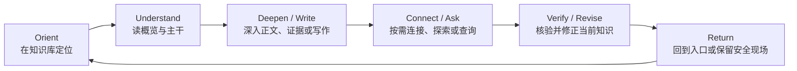

# AI-native 个人知识库

## 首日到日常核心旅程合同 v1.0 — First Returnable Asset

> 文档日期：2026-08-09  
> 文档状态：产品定义合同；不是新手引导稿、界面稿、原型、工程切片或增长漏斗  
> 上位真相源：`AI-native-个人知识库-终局产品设计文档-v4.0.md`  
> 领域责任：冻结用户从空知识库到第一份可返回知识，再到阅读、关系探索、Ask 与第二次回来的完整旅程  
> 视觉边界：继续采用“方向 3 的层级阅读 + 方向 2 的关系空间”，但本文不授权制作原型
> 状态语义：本文所有 Bare / return 行为遵守`AI-native-个人知识库-知识群状态演化与身份连续性合同-v1.0.md`；首次价值不建立单独生命周期轴
> Question lifecycle 覆写：Question Knowledge 的 frame、targets、resolution criteria、partial / provisional / resolved、active / paused / concluded、采纳、结束、重开与 successor 遵守`AI-native-个人知识库-问题知识、未知与求解生命周期合同-v1.0.md`；首日 Answer 不自动形成 Resolution

---

# 0. 执行决定

1. **首次使用不是一条漏斗。** 用户可以先写、先建群、先加资料、先迁移既有知识，也可以先问一个问题；产品不得强迫所有人先建立目录或先导入。
2. **首个产品价值不是完成设置，而是形成一份“可返回知识”。** 它必须真实保存、可以再次找到、可以继续阅读或发展，并且位置与状态可解释。
3. **空 Knowledge Group 是合法状态，但不是 First Returnable Asset。** 它证明容器已建立，不证明可使用的知识资产已经形成。
4. **一条 Current Knowledge 或一份 Source-only Asset 都可以成为首份可返回资产。** Source identity 至少可从 Sources 返回；如果选择 Group / Topic，再拥有 Source Attachment。用户不必先总结、提炼、建 Topic 或建立 Relation。
5. **第一条 Knowledge 可以先写后归位。** 产品只在用户已经写出有意义内容后，询问放入现有 Group、新建 Group，或暂时不归类；不能用结构选择阻断思考。
6. **第一份 Source 先保存、后解析、再决定是否形成知识。** 解析或 AI 失败不撤销 Source-only 成功。
7. **Question-first 是合法入口，但“得到一次回答”本身不等于拥有知识。** 空知识库中的 Ask 必须诚实说明内部覆盖为空，并帮助用户加入材料、写下已有理解、保存问题或明确允许外部研究。
8. **外部研究永远按次显式开启。** 空知识库不会因为用户提问就静默打开网络或把外部回答冒充个人知识。
9. **第一条 Relation 不是首次价值门槛。** 只有已经存在两个稳定端点，并且关系可以被一句话陈述时，才出现建立正式 Relation 的机会。
10. **Network 不为空库或单节点制造假图。** 没有正式关系时保持安静；一个端点显示可读对象与下一步，不画孤立星云。
11. **首次教学发生在动作旁边。** 不使用强制教程、欢迎轮播、完成进度、示例知识库、模板墙或术语考试。
12. **空知识库仍然是完整 Knowledge Library。** 它展示产品身份、五种合法开始方式和清楚的所有权承诺，不把页面交给 Chat 或 Import。
13. **Empty Bare Group 只突出一个首要动作：写下第一条知识。** `添加资料`和`建立主题`是安静的并列替代，不再显示为三个竞争 Hero。
14. **首次返回是产品成立的证明。** 用户关闭或离开后，必须能从稳定 Library catalog 找到同一个 Group / Knowledge / Source，并理解自己回到了哪里。
15. **普通打开与继续严格分开。** 普通打开 Group 回到 canonical Overview；只有显式`继续`恢复精确编辑、阅读或关系现场。
16. **AI 不可用时完整首日旅程仍成立。** 写、建群、加来源、阅读、查找、关闭与返回全部本地可完成。
17. **首次使用不要求同步、账号、模型选择、模板、schema、属性、标签或导入授权。** 这些只在用户触发相应能力时出现。
18. **没有庆祝式“完成”。** 产品用真实保存回执和可再次进入的内容证明成功，不用彩带、等级、连续打卡或“知识库完成度”。
19. **中途失败按已经持久化的真实结果结算。** Group 成功但正文失败，就保留 Group 与恢复缓冲；Source 成功但解析失败，就保留 Source-only；不能把部分成功写成全失败。
20. **日常循环不是维护队列。** 默认循环是定位 → 理解 → 深入或写作 → 可选连接 / 查询 → 修正 → 返回；AI 建议、Inbox、Review 与 Activity 都不能接管入口。
21. **First Returnable Asset 是用户结果，First Return Observation 是测量事件。** 产品不向用户显示激活状态、漏斗阶段或“你已完成第几步”。
22. **所有首日入口最终汇入同一对象模型。** 它们不产生“临时笔记”“导入对象”“聊天记忆”或“第一天专用卡片”等第二套真相。
23. **首次归位是原子事务。** 新 Group 与第一条 Knowledge 同时建立时，要么形成可解释的 Group + Placement + Current Revision，要么保留可恢复文字并明确失败边界。
24. **首次提问也必须保留问题本身。** 如果内部知识为空，用户的问题不能因关闭提示、切换入口或加入资料而丢失。
25. **真正的首日终点不是功能覆盖，而是用户知道三件事：** 我拥有什么、它在哪里、下次怎样回来继续。

---

# 1. 要解决的产品问题

## 1.1 核心矛盾

这个产品的终局能力很丰富：Knowledge Group、递归 Topic、连续 Knowledge、Relation、Source、Evidence、Ask、Search、Saved Path、History 与 Recovery 都必须成立。但一个空知识库中的用户没有义务先理解这些对象。

首次使用因此不能在两个错误之间摇摆：

- 过度简单，只给一个 Chat 输入框，导致用户以为产品是聊天工具；
- 过度完整，一次暴露 Group、Topic、Relation、Source、schema、AI、同步和导入，导致用户先管理系统再拥有知识。

本文的答案是：**从真实资产开始，用当前动作逐步显露完整模型；每一步都已经是终局产品的一部分。**

## 1.2 用户问题

首次进入时，用户真正需要回答的不是“我该选择哪种模板”，而是：

1. 我现在可以把什么放进来；
2. 我必须先整理好吗；
3. 写下或加入的东西会去哪里；
4. AI 在没有我的知识时会做什么；
5. 我下一次还能不能找到；
6. 随着内容增加，它怎样从一条内容成长为群、层级和网络。

## 1.3 产品目标

- 让不同起点的用户都能在不学习系统术语的情况下形成第一份真实资产；
- 让用户在首次返回时仍能找到它，并正确理解位置、状态和下一步；
- 让层级、关系与 AI 从真实需要中渐进出现，而不是在开始前成为配置；
- 让 Source-only、Unplaced Knowledge 和 Bare Group 都成为受尊重的合法状态；
- 让无 AI、离线、解析失败和中途退出都不破坏核心价值；
- 让首日路径自然接入完整日常循环，而不是结束在 onboarding celebration 或导入报告。

## 1.4 永久非目标

- 用 onboarding completion、上传文件数或 AI 对话轮数定义成功；
- 要求用户第一次进入就搭好知识体系；
- 用 Demo 内容、假 Relation 或自动生成的完整目录制造“已经很强”的观感；
- 把未处理资料标成欠债，把空 Topic 标成错误，把 Unplaced 标成失败；
- 以强制账号、云同步、模型选择或网络授权换取首次价值；
- 把首次使用设计成与日常产品完全不同的模式。

---

# 2. 首个价值的严格定义

## 2.1 First Returnable Asset

**[产品决定] First Returnable Asset（首份可返回资产）是：用户在本地拥有至少一份持久、可定位、可再次打开，并能继续发展或核验的知识资产。** Current Knowledge 是已经形成的理解；Source-only Asset 是可继续形成、查询或核验知识的材料，二者保持不同真值角色。

一项首日结果只有同时满足以下条件，才算达到这个结果：

| 条件 | 解释 |
|---|---|
| Durable | 至少存在一条 Current Knowledge，或一份已保存的 Source-only Asset；只有输入缓冲不算 |
| Owned | 资产属于用户的 Knowledge Library，不依赖一次 AI Session 或临时导入预览 |
| Located | 用户能知道它在某个 Group / Topic、Group root、Sources，或明确的`未归类`中 |
| Returnable | 离开当前现场后，可以从稳定 Library / Search / Sources 再次到达同一 identity |
| Legible | 产品能说清已成功、未完成、失败与下一步，不把候选或解析结果冒充当前知识 |
| Extensible | 用户可以继续写、加来源、建立结构、提问或连接，但这些不是首次价值前置条件 |

## 2.2 哪些状态不等于 First Returnable Asset

- 只创建一个空 Group；
- 只输入 Group 名称但尚未本地提交；
- 只得到一次未保存的 AI Answer；
- 只完成连接器授权或云同步；
- 只进入导入预览但未接受任何结果；
- 只让 AI 生成 Topic / Relation 候选；
- 只在 Edit Buffer 中输入尚未安全提交的文字；
- 只打开一份外部文件但没有保存到 Library。

这些都可能是合法中间状态，但产品不能把它们宣传成用户已经拥有可复用知识。

## 2.3 合法首份资产

| 首份资产 | 能否成立 | 最低条件 | 不要求 |
|---|---:|---|---|
| Current Knowledge | 是 | 一次安全 Direct Edit Commit + 可找回 identity | Source、Topic、Relation、AI |
| Source-only Asset | 是 | Source identity 已保存，并可从 Sources 或所选 Group / Topic Attachment 返回 | Attachment、解析成功、摘要、Knowledge、Evidence |
| 显式 Question Knowledge | 是 | 用户明确`保存这个问题`并完成本地提交 | Answer、外部研究 |
| Empty Bare Group | 否，但合法 | Group identity 与名称已保存 | 不能冒充知识价值 |
| Saved Answer | 否 | 只是 Answer 历史资产 | 除非用户把具体内容形成 Knowledge |
| Candidate / Proposal | 否 | 尚未进入 current truth | 不计入 Search / Ask 默认依据 |

## 2.4 First Return Observation

产品可以在不打扰用户的前提下测量是否发生“首次返回”：用户在离开首个资产的现场后，通过 Library、Group Overview、Search、Sources 或显式 Resume 再次打开同一 identity。

这只是测量事件，不是用户可见的生命周期字段，也不改变任何内容状态。用户不需要完成一次人为退出或被要求“现在回来试试”。

---

# 3. 空 Knowledge Library

## 3.1 空态仍然是谁

页面标题始终是`知识库`。空态不能变成`欢迎使用 AI`、`导入中心`或模板商店。

首屏必须传达：

> 这里会成为你的个人知识库。你可以先写一条知识、建立一个知识群、加入一份资料，或直接提出你现在的问题。以后再整理也可以。

## 3.2 五种合法开始

空 Library 提供五个入口，但不做五张同权营销卡：

1. **写第一条知识** — 默认首要动作；最直接地形成 Current Knowledge；
2. **建立知识群** — 用户已经知道自己要长期理解的范围；
3. **加入资料** — 用户手上先有文件、网页或摘录；
4. **迁入已有内容** — 用户已有笔记、文件夹或其他知识库；
5. **问一个问题** — 用户先有疑问，还没有材料或结构。

视觉层级是一个主要按钮、两个次级动作和两个文字入口；它不是必须照此排版的 UI 指令，但必须保持“开始写”拥有最低理解成本。

## 3.3 空态禁止项

- 伪造示例 Groups、Relations、统计数字或最近活动；
- 默认打开 Chat 或要求先提问；
- 要求命名 Space、选择数据库结构或安装模板；
- 显示“0 个节点 / 0 条边 / 0% 完成”等负向统计；
- 把同步、连接器、AI 模型、订阅或导入作为唯一开始；
- 在用户形成两端点前展示空白图谱画布；
- 用自动生成内容替代用户的第一份真实资产。

---

# 4. 路径 A：先写一条知识

## 4.1 适用意图

用户已经有一个想法、解释、观察、方法、规则、问题或暂时结论，希望先写下来，不想先做结构决定。

## 4.2 完整流程

1. 用户点击`写第一条知识`；
2. 打开无结构障碍的连续编辑面，光标直接进入正文；标题可稍后补；
3. 输入尚在 IME composition 或 Edit Buffer 时，不创建空 Knowledge；
4. 达到首次有意义输入边界后，产品在不打断写作的位置显示`放在哪里`；
5. 用户可以选择：
   - 新建知识群；
   - 放入已有知识群 / Topic；
   - 先不归类；
6. 若新建 Group，只要求名称；边界说明可选；
7. 安全提交时原子创建所需 Group、Knowledge identity、Current Revision 与 Placement；
8. 若用户选择不归类，Knowledge 进入明确的`未归类`，不是隐藏草稿；
9. 保存回执只说明真实结果，例如`已保存到「认知科学」`或`已保存，暂未归类`；
10. 页面继续停留在正文，不把用户送到完成页。

## 4.3 标题与位置

- 标题不是开始写的前置条件；
- 产品可根据首段提出标题建议，但建议不是 current；
- 用户未命名时使用可辨认的首行回退，不生成虚假“Untitled 47”；
- 位置选择可以在首次安全提交前后补齐；未选择时默认`未归类`，不丢内容；
- 只有用户接受，AI 才能建议 Group / Topic；不自动移动。

## 4.4 原子提交与部分失败

| 结果 | 产品行为 |
|---|---|
| Group、Knowledge、Placement 全成功 | 回执说明位置，正文成为 current |
| Group 成功，Knowledge 提交失败 | 保留 Group；文字留在 Recovery Checkpoint；明确`知识群已建立，正文尚未更新当前知识` |
| Knowledge 成功，Placement 失败 | Knowledge 进入`未归类`；提供重试归位，不撤销正文 |
| 本地持久化失败 | 不声称已保存；保护恢复缓冲；保留用户选择与原问题 |
| 索引 / Overview 刷新失败 | current 仍成立；owner 立即读取本地版本；说明索引正在更新 |

---

# 5. 路径 B：先建立知识群

## 5.1 适用意图

用户先知道自己想长期理解什么，例如“认知科学”“AI Agent 产品设计”或“法国租房”，但不一定已经有内容。

## 5.2 最低建立合同

建立 Group 只要求名称。边界句是鼓励而非门槛；Topic、属性、模板、来源与 Relation 都不是必填。

成功后进入真实 Bare Overview：

- 标题与暂定边界；
- 状态句：`这个知识群刚刚建立，还没有形成稳定结构。`；
- 一个首要动作：`写下第一条知识`；
- 两个安静替代：`添加资料`、`建立主题`；
- 返回 Knowledge Library 的清楚入口。

## 5.3 为什么不再展示三个同权大动作

三个动作能力都存在，但同权 Hero 会让用户在尚无内容时承担结构判断。默认鼓励先写，是因为一条真实内容可以自然暴露边界、Topic 和关系需要；用户已有材料或明确结构时仍可直接选择另外两条。

## 5.4 Empty Group 的尊重边界

- Empty Group 可关闭、重开、重命名、归档或删除；
- 不显示“未完成”“空壳”“还差 3 步”；
- 不自动生成 Topics、Overview 正文或 Relations 来填空；
- Library 中可以显示克制状态`尚无内容`；
- 它不会进入 First Returnable Asset 指标，直到存在首份 durable asset；
- 用户可以长期保留一个只有边界的 Group，而不被通知追赶。

---

# 6. 路径 C：先加入资料

## 6.1 Source-first 原则

用户加入文件、网页、摘录、音视频或旧资料时，第一责任是安全保存与再次打开，不是 AI 总结。

## 6.2 完整流程

1. 用户选择本地文件、URL、粘贴内容或受支持的导入来源；
2. 产品先显示 identity、大小 / 类型、目标位置与本地所有权；
3. Source 保存成功后立即出现 Source Detail；
4. 用户可以选择新建 Group、加入现有 Group / Topic，或仅保留在 Sources；
5. Source Attachment 记录材料进入语境；它不等于 Knowledge Placement 或 Evidence Binding；
6. 解析、OCR、分段与 AI 提炼在保存后进行；
7. 用户可停在 Source-only，直接阅读、标注、搜索已可用内容；
8. 若继续形成知识，候选摘要、Claims、Topics 与 Relations 进入 Proposal / Preview；
9. 只有用户接受的部分进入 Current Knowledge、Placements 与 Evidence；
10. 完成后回到 Source 所属 Group / Topic 或 Source Detail，不进入导入成绩页。

## 6.3 解析失败不是首次失败

只要 Source 已本地保存并可再次打开，就已经形成合法首份资产。产品应写：

> 资料已保存到「法国租房 / Visale」。文字识别尚未完成，你仍可以打开原文件；之后可以重试识别或直接写下你的理解。

不得写成`导入失败`并隐藏已经成功保存的资产。

## 6.4 去重与重复来源

发现可能重复时，用户可以：

- 复用既有 Source identity 并增加 Attachment；
- 保存为新的 revision；
- 明确保存为不同 Source；
- 比较后取消。

系统不能只凭文件名自动覆盖，也不能以“重复”为由阻止用户先保存恢复副本。

---

# 7. 路径 D：迁入已有知识

## 7.1 迁移不是首次设置的默认门槛

迁移入口适合已有资产的用户，但不能支配空 Library。用户可以先在新产品里写一条，再以后迁移全部历史。

## 7.2 完整流程

1. 用户选择笔记、目录、导出包、现有 Knowledge、Sources、Search result 或 Saved View；
2. 产品先做隔离预览，不创建正式 Group、Topic、Placement 或 Relation；
3. 预览区分：
   - 识别到的 identity；
   - 新建 / 复用 / 冲突；
   - Group / Topic 映射；
   - Source-only 与 Knowledge；
   - 明确排除项；
   - 动态结果与当前固定选择；
4. AI 可以提出结构候选，但所有候选保持 Proposal；
5. 用户逐类接受、修改或拒绝；
6. 接受时以可撤销 Change Set 创建真实对象；
7. 只要至少一个 Knowledge 或 Source 成功持久化并可返回，就可达到 First Returnable Asset；
8. 拒绝或关闭预览时零正式副作用；
9. 部分失败时显示逐项 Destination Receipt，不把成功项回滚成失败。

## 7.3 不允许的“智能迁移”

- 把文件夹直接永久等同于 Group boundary；
- 把标签直接变成 Relation；
- 把相似内容静默合并；
- 把反向链接或共现静默升级为正式关系；
- 让未来 View / Search 命中自动加入 Group；
- 因导入规模大而跳过 identity、版本或来源说明。

---

# 8. 路径 E：先问一个问题

## 8.1 为什么必须支持

有些用户不是带着资料或结构进入，而是带着一个当前问题。拒绝这个入口会使产品显得僵硬；把它直接变成通用 Chat 又会改变产品中心。

Question-first 因此是一条**进入知识库建设的路径**，不是把知识库降为问答框。

## 8.2 空 Library 中的 Ask

用户在完全空的 Library 提问时：

1. 系统保留原问题；
2. Requested Context 明确为`你的知识库（当前为空）`；
3. 不运行一个假装有内部依据的回答；
4. 用简短状态说明：`你的知识库里还没有可用于回答这件事的知识。`；
5. 提供四个继续动作：
   - `为这个问题加入资料`；
   - `写下我已经知道的`；
   - `保存这个问题`；
   - `这次允许查找外部资料`；
6. 进入任一路径时，原问题作为明确上下文保留；
7. 用户返回 Ask 后，重新显示 Requested / Effective / Used Context。

## 8.3 保存问题

`保存这个问题`会创建一条 Question Knowledge，而不是 Saved Answer：

- 正文是用户的问题、可选背景、适用范围与为什么重要；
- 可以新建 / 选择 Group 或暂不归类；
- 本地提交后成为 Current Knowledge；
- 可以先不设置 targets、resolution criteria 或问题类型，不用完成表单才能保存；
- 系统可建议 QuestionTargetReferences、重复 Question 与“怎样算回答”，但采用前都只是预览；
- 以后可以添加已有理解、来源、候选答案、当前回答、remaining unknowns 与 Subquestions；
- 默认状态是`尚未回答 · 正在追问`，而不是一条待完成任务；
- AI 生成的回答不会自动写入该 Knowledge、采纳为当前回答或停止追问。

首日后续动作也保持原子：`保存这次回答`只保存历史；`从回答形成知识`写入具体 Knowledge；`链接为回答依据`只形成 Resolution Proposal；`采纳为当前回答`创建 QuestionResolutionRevision；`暂停 / 停止追问`另写 lifecycle event。用户不必在首日理解内部名词，但按钮必须预告真实后果。

## 8.4 显式外部研究

用户按次允许外部资料后：

- Effective Context 明确标记`外部资料开启；内部知识为空`；
- Answer Basis 只能是 External Source Statement、Runtime Input 或 Reasoned Derivation，不能标成`来自你的知识`；
- Coverage 说明的是本次外部检索覆盖，不代表个人知识库已经拥有内容；
- 保存 Answer 只保存历史回答；
- 形成 Knowledge 需要另一次明确写回，并显示具体内容、Sources、位置与影响；
- 关闭后不默认给后续 Ask 继承外部权限。

## 8.5 一条 Knowledge 或 Source-only 时的 Ask

| 当前资产 | 默认 Ask 行为 |
|---|---|
| 一条 Current Knowledge | Requested Context 默认为当前 Knowledge / Group；诚实说明覆盖有限 |
| 一份 Source-only | 只有用户选择该 Source 或从 Source 发起时才使用；Basis 是 Source Statement，不冒充 Current Knowledge |
| 一个 Empty Group | 说明当前 Group 无可用知识；保留问题并给写 / 加资料 / 外部研究入口 |
| 一条 Question Knowledge | 可以围绕问题检索已有库、选定 Sources 或外部资料；Question 本身是 Runtime / Current Knowledge context，不等于答案 |

---

# 9. 从首份资产进入层级阅读

## 9.1 首次成功后的下一步不是“继续设置”

形成首份资产后，产品留在其真实 owner surface，并只给与当前对象相关的下一步：

- Knowledge：继续写、加入来源、放入 Topic、提问、建立连接；
- Source-only：阅读、标注、写下理解、加入 Topic、围绕此资料提问；
- Question Knowledge：补背景、加入资料、开始回答、采纳当前回答、暂停或继续追问、放入 Group；
- Bare Group：写知识、加资料、建 Topic。

没有全局 checklist，也不要求用户体验所有功能。

## 9.2 Overview 如何逐渐成立

| Group 状态 | Overview 的真实责任 |
|---|---|
| Empty Bare | 名称、边界、诚实空态、一个首要动作 |
| 有一条 Knowledge | 直接显示该知识回答什么；不制造“主题地图” |
| 有 Source-only | 说明已有材料但尚未形成当前理解；提供阅读与写下理解 |
| 出现多个方向 | 开始显示候选 / 已接受 Topic 与代表 Knowledge |
| 结构稳定 | 显示策展主干、关键理解、限制和关系出口 |

## 9.3 Topic 何时出现

- 用户明确建立；
- 用户把内容放入一个新的局部范围；
- AI 提出候选并被用户接受；
- 导入映射被用户确认。

产品不会因为存在两条内容就自动正式建立 Topic。Topic 出现后必须解释它相对父范围的差异，不能只是一个目录标题。

## 9.4 从 Overview 到 Detail

首日已经遵守终局深度模型：Group Overview → Topic Overview → Knowledge Paper → Section / Claim → Evidence。当前没有某一级时直接跳过，不创建空中转页面；以后该级形成时仍沿同一 identity 与路径补上。

---

# 10. 第一条关系与第一次探索

## 10.1 Relation 的出现条件

只有满足以下条件，产品才把`建立关系`提升为可见动作：

1. 已经存在两个稳定端点；
2. 用户正在查看其中一个端点、同时明确引用另一个，或正在处理可信候选；
3. 关系可以写成一句可读陈述；
4. 方向、端点角色或对称性可解释；
5. 用户可以核对并接受。

简单链接、提及、相似度或共同来源可以先存在，但不自动成为正式 Relation。

## 10.2 0、1 与多关系状态

| 状态 | 正确呈现 |
|---|---|
| 0 条正式关系 | Reading 保持 Quiet；不显示空图；必要时说明`还没有明确关系` |
| 1 条正式关系 | 用可读陈述 + 端点 + 为什么重要；图不是必需 |
| 少量关系 | Peek / Companion 显示局部一跳和列表等价 |
| 稠密关系 | 用户显式 Explore 后进入预算化 Relation Space，保留过滤、Trail 与 List Equivalent |

## 10.3 第一次探索

1. 用户在正文或 Overview 看见关系提示；
2. hover / focus 只高亮，不改变现场；
3. Inspect 进入 Peek，读到关系陈述与依据；
4. 用户显式`查看相关知识`才打开 Companion；
5. 用户显式`在地图中探索`才让 Relation Space 成为 Primary；
6. Open endpoint 后 Reading Target 改变并写入 ReturnStack / ExplorationTrail；
7. Back 回到原 Anchor、scroll 与关系触发点；
8. Close Companion 不改变主阅读；
9. 用户可以选择保存 Path，但第一次探索不强迫命名或保存。

## 10.4 Relation 不是首日任务

产品不提示`再建立一条关系就完成设置`，不把第一条边作为激活指标，也不因为没有 Relation 降低 Group 的质量分。关系只在真实理解之间出现。

---

# 11. 第一次 Ask 与回到知识

## 11.1 提问前

Composer 必须用普通语言显示 Requested Context：

- 当前 Knowledge / Topic / Group 或整个 Library；
- 是否包含 Source-only；
- 是否沿正式 Relation 扩大；
- 是否使用本次未提交文字；
- 是否允许外部资料。

用户不需要理解内部 enum，但必须能预测范围。

## 11.2 回答中

- 只使用真实可用的 Effective Context；
- 主要 Claim 区分 Current Knowledge、Source Statement、Runtime Input、External Source、Reasoned Derivation 与 Historical Answer；
- 知识少时优先短答，并明确 partial / insufficient / indeterminate；
- 没找到不等于不存在；
- 未完成索引、来源不可用和未授权外部查询分别说明；
- AI unavailable 时保留问题与范围，不阻断用户继续阅读或写作。

## 11.3 回答后

用户可以：

- 打开支撑的 Knowledge / Anchor / Evidence；
- 打开 Source 原文；
- 查看关系路径；
- 修改 Scope 后重试；
- 保存历史 Answer；
- 选择具体 Claim 形成 Knowledge 或 patch 既有 Knowledge。

Back 必须回到原 Answer Claim 与 scroll。形成 Knowledge 必须预览内容、位置、来源与影响，不能用`保存`一词混淆 Saved Answer 与 Current Knowledge。

---

# 12. 第一次离开与第二次回来

## 12.1 为什么这是核心旅程的一部分

一个只在创建瞬间看起来成功、关闭后却找不到的系统不是知识库。首次价值必须包含可返回性，而不只是写入。

## 12.2 离开前

产品在自然导航或关闭前完成安全提交边界：

- composition 未结束时先保护缓冲，不提交半句话；
- current 提交成功但索引延迟时明确区分；
- 未提交失败时显示 Recovery 状态，不假装保存；
- 不弹出“是否完成设置”；
- 不强迫用户创建第二条内容。

## 12.3 第二次启动

| 情况 | 默认结果 |
|---|---|
| 有一个或多个 Groups | 打开稳定 Library catalog |
| 有安全 Resume | catalog 仍拥有主权，最多显示一个明确`继续` |
| 普通点击 Group | 进入 canonical Group Overview |
| 点击`继续` | 恢复 exact last-safe target / Anchor / scroll / editing state / safe Relation scene |
| 首资产未归类 | Library 中明确显示`未归类`入口；Search 可找到 |
| 只有 Source-only | Sources 与相关 Group / Topic 都能再次到达 |
| checkpoint 损坏 | 回到最近安全 parent，并提供恢复或修复，不静默换目标 |

## 12.4 首次返回的理解证明

产品应通过可用性研究验证用户能回答：

1. 我刚才保存了什么；
2. 它现在在哪个知识范围；
3. 普通打开与`继续`有什么不同；
4. 我下一步可以如何深化、连接或提问；
5. 哪些内容是我的当前知识，哪些只是来源或 AI 回答。

---

# 13. 稳定日常循环

## 13.1 默认循环

不是每次都要经过全部动作。用户可以从 Search 直接进入 Detail，从 Add 直接写作，从 Relation 直接探索，或只阅读后离开；所有入口仍归入同一循环与同一对象模型。

## 13.2 Library 的日常主权

Library 默认显示：

1. 最多一个显式 Resume；
2. 稳定 Groups catalog；
3. 固定 / 最近进入的 Groups；
4. 可选 Saved Paths / Answers；
5. 最多一条真正影响当前理解的 notice；
6. 安静的 Search / Ask / Add。

它不显示通用任务列表、AI 推荐 Feed、未处理数量、知识健康分或连续使用奖励。

## 13.3 维护如何进入

冲突、来源失效、边界张力、关系复核和恢复只从 owner 或一条高影响 notice 进入。没有事项时不存在空 Review Center；有事项时也不改变日常入口。

---

# 14. 渐进披露与产品语言

## 14.1 何时教什么

| 用户正在做 | 此刻最多解释 | 不在此刻解释 |
|---|---|---|
| 写第一条知识 | 安全保存、放在哪里 | Relation 类型、版本图、schema |
| 建立 Group | Group 是长期知识范围 | 全部 lifecycle、复杂边界修订 |
| 加 Source | 已保存、解析状态、进入语境 | 完整 Evidence ontology |
| 建 Topic | 与父范围的差异 | Group merge / split 全规则 |
| 第一次 Ask | 本次范围与依据 | 全部检索策略枚举 |
| 看见 Relation | 一句关系陈述、方向、依据 | 图算法、关系家族总表 |
| 第一次返回 | 普通打开与继续 | 多窗口 checkpoint 冲突细节 |

## 14.2 教学规则

- 每次只解释当前动作的直接后果；
- 提示可忽略，且忽略后不反复打扰；
- 用真实内容教学，不创建 Demo；
- 首次出现的内部概念先用用户语言，再在需要时给精确定义；
- 失败说明先说已经保住什么，再说哪里没完成；
- 按钮使用结果词：`写第一条知识`、`加入资料`、`保存这个问题`、`这次允许外部资料`；
- 不使用`激活`、`摄取`、`节点化`、`完成知识图谱`等内部或夸张措辞。

## 14.3 首日关键文案

| 场景 | 推荐文案 |
|---|---|
| 空 Library | `先从你现在拥有的一条理解、一个范围、一份资料或一个问题开始。以后再整理也可以。` |
| Empty Group | `这个知识群刚刚建立，还没有形成稳定结构。` |
| Source-only 成功 | `资料已保存。你可以先保留原文，之后再形成知识。` |
| 空库 Ask | `你的知识库里还没有可用于回答这件事的知识。` |
| 未归类保存 | `已保存，暂未归类。你可以随时把它放入知识群。` |
| 索引延迟 | `当前知识已更新；搜索和概览正在同步。` |
| AI unavailable | `AI 目前不可用。你的内容已保留，仍可继续阅读和写作。` |
| 0 Relation | `还没有明确关系。链接和相似内容不会自动变成正式关系。` |

---

# 15. 失败、恢复与边界情况

## 15.1 失败结算原则

每次复合动作都按已经完成的 canonical writes 结算：

1. 先列成功保存的 identity；
2. 再列尚未完成的 derived work；
3. 再列用户可以立即继续的动作；
4. 任何重试都不得复制已成功对象；
5. 任何取消都只取消未提交部分，除非用户明确撤销已提交 Change Set。

## 15.2 关键边界表

| 场景 | 必须保住 | 必须说明 | 禁止 |
|---|---|---|---|
| 本地离线 | 当前内容、Group、Source、历史 | 同步待完成 | 阻断写作或浏览 |
| AI 不可用 | 问题、范围、用户资产 | AI 能力暂不可用 | 把产品变成空壳 |
| Source 解析失败 | 原文件、identity、Attachment | 哪些 representation 不可用 | 写成全量导入失败 |
| Direct Commit 失败 | Edit Buffer / Recovery | current 尚未更新 | 让 Ask 静默读取内存文字 |
| Placement 失败 | Knowledge identity | 暂在未归类 | 回滚已经成功正文 |
| 索引不完整 | local current / source | coverage indeterminate | 说知识库里没有 |
| 外部授权取消 | 原问题与内部范围 | 外部资料未使用 | 记住永久权限 |
| 重复内容 | 两个候选与比较 | 复用 / revision / 独立选项 | 静默覆盖 |
| 首资产删除 | 历史 / Trash 规则 | Group 是否回到 Empty | 自动删除 Group |
| Source 权限丢失 | Attachment、annotations、bindings、历史 | 原文暂不可访问 | 删除已形成 Knowledge |

## 15.3 移动端与无障碍

- 五种开始方式必须在小屏保持语义等价，不把次级入口藏到不可发现的设置；
- 创建、保存、位置选择、Requested Context 与失败回执可由键盘、屏幕阅读器和触控完整操作；
- Relation 没有图也必须通过列表陈述完整表达；
- Companion 在窄屏顺序呈现，但 Close / Back / Open 后果不变；
- 焦点顺序先主内容、再当前动作、再次级解释；
- 成功、失败与状态差异不能只靠颜色、动效或空间位置。

## 15.4 首日观察状态不进入内容本体

为了测试旅程，分析层可以从真实事件派生以下观察状态，但不得把它们写进 Group lifecycle、Knowledge standing 或用户可见“成长等级”：

| 观察状态 | 进入条件 | 退出条件 |
|---|---|---|
| Empty Library | 没有 Current Knowledge 或 Source identity | 首份资产成功持久化 |
| Intent Started | 用户选择写、建群、加资料、迁入或提问 | 取消、离开或形成合法结果 |
| Legal Intermediate | 只有 Empty Group、保留问题、Import preview 或 Recovery | 形成资产、明确放弃或继续恢复 |
| First Returnable Asset | Current Knowledge 或 Source-only Asset 满足 Durable / Located / Returnable | 不退出；这是一次结果事实，不是 lifecycle |
| First Return Observed | 用户离开首现场后再次打开同一 identity | 不退出；只记录观察事实 |
| Oriented Daily Use | 多次从 Library / Search / Ask / Relation 进入同一知识世界并完成真实任务 | 不作为用户等级，不按频率降级 |

分析事件不得改变排序、提醒、Overview、Resume eligibility 或内容状态；没有被观测到首次返回也不证明资产不可返回。

---

# 16. 测量定义与假设

## 16.1 结果指标

| 指标 | 定义 | 验证什么 |
|---|---|---|
| First Durable Asset Rate | 首次会话形成 Current Knowledge 或 Source-only Asset 的会话比例 | 产品是否产生真实资产 |
| Time to First Returnable Asset | 从首次有意动作到满足 Durable、Located、Returnable 的时间 | 开始路径是否阻塞 |
| First Return Success | 离开首现场后再次到达同一 identity 的比例 | 知识库是否真的可返回 |
| First Location Comprehension | 用户能否说清资产位于 Group / Topic / Sources / 未归类中的哪里 | 位置模型是否可理解 |
| No-AI Completion | AI 完全不可用时形成首份可返回资产的成功率 | AI 是否错误成为产品门槛 |
| Source-only Returnability | 未形成 Knowledge 的 Source 是否能从原语境再次打开 | Source-only 是否被尊重 |
| Question-to-Knowledge Continuation | Question-first 后形成 Question Knowledge、Current Knowledge 或 Source Attachment 的比例 | Ask 是否回到知识库建设 |
| First Scope Comprehension | 第一次 Ask 前后能否复述 Requested / Effective / Used Context | AI 范围是否可预测 |
| First Relation Intent Precision | 用户首次接受 Relation 时能否复述端点、方向、陈述与依据 | 关系是否由理解产生 |
| Recovery Honesty | 部分失败时用户能否区分成功资产、恢复缓冲与未完成派生 | 失败是否诚实 |

## 16.2 反指标

不得以以下数字定义首日成功：

- 创建了多少 Groups / Topics / Relations；
- 导入了多少文件；
- AI 生成了多少摘要；
- 用户完成了多少 onboarding 步骤；
- 首次会话时长；
- 点击 Network 或 Ask 的比例；
- 建立第一条 Relation 所用时间。

## 16.3 待验证假设

- `写第一条知识`是否应在空 Library 成为唯一视觉首要动作；
- 用户是在第一次安全提交前还是之后更愿意选择位置；
- Question-first 的四个继续动作是否过多，是否需要依据问题内容排序；
- Bare Overview 的一个主动作 + 两个安静替代是否足够表达能力；
- 用户能否自然理解 Source-only 已经是成功，而不是未完成任务；
- 首次普通返回到 Library 而不是自动回到正文，是否增强长期空间感；
- 用户何时才真正需要看到 Relation 候选与 Network；
- `未归类`是否能被理解为合法缓冲，而不被误读为整理欠债。

在获得真实基线前，不为这些指标设目标值，也不把假设写成研究结论。

---

# 17. 可验证场景

## 17.1 首日任务集

1. 完全空库，直接写一条知识，新建 Group 并关闭；
2. 完全空库，写一条知识但选择暂不归类；
3. 先建立 Empty Group，退出，再回来写第一条知识；
4. 加入一份无法解析的 PDF，放入深层 Topic，退出后再次打开；
5. 导入预览后全部拒绝，验证零正式副作用；
6. 导入 20 项仅接受 3 项，验证逐项 identity 与部分成功；
7. 空库先问问题，不允许外部资料，转去写下已有理解；
8. 空库先问问题，保存为 Question Knowledge；
9. 空库按次允许外部资料，保存 Answer 但不形成 Knowledge；
10. 只有一条 Knowledge 时 Ask，并回到精确 Anchor；
11. 只有一份 Source-only 时从 Source 发起 Ask；
12. 创建两个端点但不建立 Relation，验证产品不催促也不造图；
13. 显式建立第一条 Relation，完成 Peek → Companion → Explore → Back；
14. AI 全程不可用，完成写作、归位、关闭与返回；
15. Group 建立成功但正文提交失败，验证 Recovery；
16. Knowledge 成功但 Placement 失败，验证未归类回退；
17. 索引延迟时立即从 owner 和 Ask 使用 local current；
18. 移动端和屏幕阅读器完成同一条首日路径；
19. 删除唯一 Knowledge，验证 Group 回到真实 Empty 而不被自动删除；
20. 普通点击 Group 与显式 Resume 分别打开，验证不同后果。

---

# 18. Given / When / Then 验收合同

## 18.1 空库可直接写

**Given** Library 完全为空且 AI 不可用  
**When** 用户直接写第一条 Knowledge，并选择新建 Group  
**Then** 只要求 Group 名称；Group、Knowledge、Current Revision 与 Placement 原子持久化；正文留在当前阅读 / 编辑现场；用户无需 Source、Topic、Relation、模板、账号或额外采用。

## 18.2 先写后归位

**Given** 用户还不知道内容属于哪个范围  
**When** 先写出有意义正文，再选择`暂不归类`  
**Then** Knowledge 形成稳定 identity 与 current，Library 的`未归类`和 Search 均可找回；产品不把它标成 Draft、错误或欠债。

## 18.3 Empty Group 合法但不冒充价值

**Given** 用户只建立了 Group 名称  
**When** 关闭并重新打开  
**Then** Group 可从 Library 找回，Overview 诚实显示尚无内容并突出`写下第一条知识`；不生成假 Topic / Relation，不显示完成度，也不把它计为 First Returnable Asset。

## 18.4 Source 先于解析成立

**Given** 用户加入一份 PDF 到某个 Topic  
**When** 原文件已保存但 OCR 与 AI 解析失败  
**Then** Source identity 与 Attachment 仍成立，原文件可从 Topic 与 Sources 再次打开；状态写`资料已保存，文字识别尚未完成`，不写`导入失败`。

## 18.5 导入拒绝零副作用

**Given** 导入预览包含 Group、Topic、Relation 和 merge 候选  
**When** 用户关闭或全部拒绝  
**Then** 不创建任何正式 Group、Topic、Placement、Attachment、Relation 或待清理空壳；原选择与外部内容不被改写。

## 18.6 空库 Question-first 不幻觉

**Given** Library 没有 Current Knowledge 或 Source  
**When** 用户提问且未允许外部资料  
**Then** Requested Context 明确为空；系统不生成冒充内部知识的回答；原问题保留，并提供加入资料、写下已有理解、保存问题与按次允许外部资料。

## 18.7 外部研究不冒充个人知识

**Given** 空 Library 中用户按次允许外部资料  
**When** 系统返回 Answer  
**Then** 每条主要依据标为 External Source / Runtime Input / Derivation；保存 Answer 不创建 Current Knowledge；只有显式写回预览与提交才改变知识库，权限不自动继承给下一次 Ask。

## 18.8 只有一条 Knowledge 也能 Ask

**Given** 当前 Group 只有一条 Current Knowledge  
**When** 用户围绕它提问  
**Then** Requested Context 默认指向该 Knowledge / Group；回答诚实说明 coverage；点击 Claim 打开精确 Anchor，Back 恢复 Answer Claim 与 scroll。

## 18.9 Source-only Ask 不偷换 Basis

**Given** Group 只有一份 Source-only Attachment  
**When** 用户从 Source 发起 Ask  
**Then** Used Context 把依据标为 Source Statement；产品不说`来自你的知识`，也不自动形成 Knowledge 或 Evidence Binding。

## 18.10 Relation 非首次门槛

**Given** 用户已经有一个 Group 与一条 Knowledge，但没有第二端点  
**When** 阅读 Overview、正文与 Network 入口  
**Then** 产品不催促建立 Relation、不画假图、不降低质量分；层级阅读和 Ask 仍完整可用。

## 18.11 第一条 Relation 由明确意图产生

**Given** 已存在两个稳定端点，用户能陈述它们的关系  
**When** 用户接受 Relation statement、方向与依据  
**Then** 只创建一条正式 Relation identity；Peek / Companion / Explore 按明确意图增长；Back 恢复原 Anchor，列表与图语义等价。

## 18.12 普通打开与继续分离

**Given** 首日留下一个安全编辑现场  
**When** 用户第二次启动，分别点击 Group row 与`继续`  
**Then** 启动停在 Library catalog；Group row 打开 canonical Overview；只有`继续`恢复 exact target / Anchor / scroll / safe editing and relation scene。

## 18.13 部分失败诚实结算

**Given** Group 已保存但 Knowledge Direct Commit 失败  
**When** 产品显示结果并退出  
**Then** Group 保持存在；正文位于 Recovery Checkpoint；状态清楚区分`知识群已建立`与`正文尚未更新当前知识`；重试不复制 Group。

## 18.14 Placement 失败不丢正文

**Given** Knowledge Current Revision 已提交但目标 Placement 失败  
**When** 用户返回 Library  
**Then** Knowledge 进入`未归类`并可找到；提供重试归位；不撤销 current，不创建重复 Knowledge。

## 18.15 AI 不可用时闭环完整

**Given** AI、网络与索引派生服务全部不可用  
**When** 用户写 Knowledge、建 Group、加 Source、关闭并重开  
**Then** 本地 canonical writes、Library、Overview、Reading、Sources 与首次返回全部成立；只对不可用派生能力降级，不阻断产品本体。

## 18.16 没有 onboarding 模式

**Given** 用户首次与第十次进入同一个 Empty Group  
**When** 比较页面结构与动作后果  
**Then** 两次都使用真实 Group Overview 和相同对象模型；首次只在动作旁增加可忽略解释，不出现必须完成的教程、示例库或第一天专用数据。

## 18.17 响应式与无障碍等价

**Given** 同一首日路径分别在 desktop、mobile、键盘与屏幕阅读器完成  
**When** 用户写、选择位置、读取回执、Ask、打开 Relation 并返回  
**Then** identity、current、Requested Context、Relation statement、ReturnStack 与错误结算完全等价；图的含义可由列表和文字完整获得。

## 18.18 删除唯一资产

**Given** Group 只有一条 Knowledge  
**When** 用户删除或移出这条 Knowledge  
**Then** Group 回到诚实 Empty Bare Profile；删除 / 移动影响先解释；Group 不被自动删除，历史与 Trash 继续遵守各自合同。

## 18.19 日常入口不被维护接管

**Given** 用户没有需要处理的高影响变化  
**When** 日常打开产品  
**Then** Library catalog、最多一个 Resume 和 Search / Ask / Add 构成入口；不出现空 Review、AI Feed、0 badge、连续打卡或知识健康分。

## 18.20 首次返回证明

**Given** 用户通过任一合法入口形成首份 durable asset 后离开现场  
**When** 之后从 Library、Group Overview、Search、Sources 或显式 Resume 再次打开  
**Then** 到达同一 identity；用户可以说清保存了什么、位于哪里、哪些是 current / source / answer，以及下一步如何继续。

---

# 19. 研究事实、产品决定与证据边界

## 19.1 研究事实

- Apple 的 onboarding 指南建议让用户快速开始、教学可跳过、在情境中提示，并推迟非必要设置和定制。  
  [Apple Human Interface Guidelines — Onboarding](https://developer.apple.com/design/human-interface-guidelines/onboarding)
- Apple 的 launching 指南强调精简启动、尽快允许交互，并把状态恢复与启动本身区分。  
  [Apple Human Interface Guidelines — Launching](https://developer.apple.com/design/human-interface-guidelines/launching/)
- Apple 的 disclosure controls 指南把渐进披露定义为在相关时再显示细节，并优先保留常用内容。  
  [Apple Human Interface Guidelines — Disclosure controls](https://developer.apple.com/design/human-interface-guidelines/disclosure-controls)
- Obsidian 官方首先教用户建立 vault 与第一条 note，之后才进入链接、反向链接与图；链接至少需要两个 notes。  
  [Obsidian Help](https://obsidian.md/help/) · [Create your first note](https://obsidian.md/help/create-note) · [Link notes](https://obsidian.md/help/link-notes)
- Tana 官方说明底层可以是 knowledge graph，但首次接触仍是一条简单 node 与 outline；节点可以从普通条目逐渐成长为复杂结构。  
  [Tana Outline editor](https://outliner.tana.inc/learn/features/outline-editor) · [Nodes and references](https://outliner.tana.inc/learn/features/nodes-and-references)
- Capacities 官方允许先建立 blank object，再加入内容和链接；也明确说明不需要在开始前定义全部 object types。  
  [Capacities — Creating new objects](https://docs.capacities.io/tutorials/creating-new-objects) · [Custom content types](https://docs.capacities.io/tutorials/custom-content-types)

## 19.2 研究支持的原则

这些资料共同支持：

- 真实内容先于完整结构教学；
- 非必要配置可以推迟；
- 复杂能力应在相关情境中出现；
- 图底层不要求图成为默认首次界面；
- 链接 / 关系依赖已经存在的端点；
- 启动、onboarding 与状态恢复是不同责任。

## 19.3 研究没有证明什么

这些来源没有证明以下决定必然是唯一答案：

- 本产品必须有五种首日入口；
- `写第一条知识`必须拥有最高视觉权重；
- Empty Group 不计 First Returnable Asset；
- Question-first 必须提供本文四个后续动作；
- 普通启动必须停在 Library catalog；
- Relation 的 Quiet → Peek → Companion → Explore 阶梯；
- Source-only 可以作为本产品的首份可返回资产。

它们都是本产品基于用户已确认方向、对象模型与长期连续性做出的产品决定，必须通过真实首日和第二次返回任务继续验证。

---

# 20. 对文档与后续设计的约束

1. Canonical 产品定义必须加入 First Returnable Asset、五种合法起点、Question-first 与首次返回；
2. 核心心智模型必须把空 Library 与 Bare Group 从“三个同权动作”改为“一个首要 + 两个安静替代”，同时保留全部能力；
3. 流程板必须显示五路起点汇入 durable asset、Library return proof 与日常循环；
4. AI 查询合同必须加入 Empty Library / Question-first 的范围、外部权限、保存问题与 Source-only Basis；
5. 产品语言合同必须加入空 Library、Empty Group、Source-only、索引延迟与 AI unavailable 文案；
6. 交互合同必须加入 FirstUseStart、PlacementPrompt、SaveReceipt 与 PartialSuccessReceipt 的责任；
7. 所有旧验收中“首次两分钟内必须建立 Group + Node + Topic + Relation”失效；Relation 永远不是首日强制项；
8. 视觉设计不得用 onboarding screens 数量证明完整，只能用真实首日任务、第二次返回和日常循环证明；
9. 原型继续暂停，直到产品核心旅程与下游合同完成一致性 QA；
10. 后续视觉必须证明方向 3 的纵向理解与方向 2 的按需关系探索从第一条内容开始可以自然生长，而不是同时铺满屏幕。

---

# 结论

> **这个知识库不要求用户先搭一个知识系统。它让用户从眼前的一条理解、一个范围、一份资料或一个问题开始，先拥有一份能再次回来的真实知识；随后，层级、关系与 AI 在需要它们的时刻自然长出来。**

首日与日常不是两个产品。第一条 Knowledge 使用终局的 Current Revision，第一份 Source 使用终局的 Source identity，第一次归位使用终局的 Placement，第一次 Ask 使用终局的范围与依据合同，第一条 Relation 使用终局的可读关系模型，第二次回来使用终局的 Library 与 Resume。复杂度被推迟，但产品本身没有被缩水。
