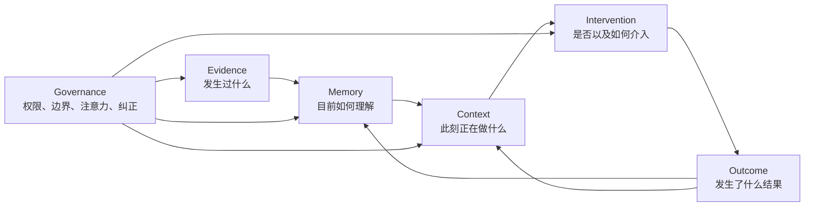

# Personal Cognitive OS

## 终局产品设计文档

> 当前状态：**历史产品方向，已不是产品定义入口**  
> Canonical 产品定义：`AI-native-个人知识库-终局产品设计文档-v4.0.md`；本文仅保留 Cognitive OS 决策来源，冲突时以 v4.0 为准  

**文档性质：** 产品宪法、体验定义与系统设计  
**状态：** 完整概念基线  
**日期：** 2026-08-03  
**适用对象：** 产品、交互、客户端、AI、数据、安全与隐私团队

> 本文不定义 MVP，也不把产品分割成“截图工具—AI 搜索—知识库—Agent”的渐进拼装。它从完整终局出发，定义一个系统必须拥有哪些稳定对象、能力、边界和体验，才有资格被称为 Personal Cognitive OS。开发可以有顺序，系统本体不能被阶段性实现反向定义。

---

## 0. 执行摘要

Personal Cognitive OS 不是更自动的知识库，也不是记录一切后提供语义搜索的个人录像机。它是一层运行在应用之上的个人认知基础设施：在用户授权范围内持续观察发生过的事情，把原始证据编译为可演化的个人记忆，实时判断用户正在做什么，并在净收益大于认知成本时，以合适的强度介入。

系统闭环是：

> **Evidence → Memory → Context → Intervention → Outcome → Revision**

四个一级对象承担不同责任：

- **Evidence** 回答“系统实际上看见或听见了什么”。
- **Memory** 回答“基于这些证据，系统目前如何理解世界、用户和未完成的意图”。
- **Context** 回答“用户此刻正在做什么、为何这样做、卡在哪里，以及什么信息现在有用”。
- **Intervention** 回答“系统是否应该出现、以什么方式出现、是否有权行动，以及出现后发生了什么”。

它的核心体验不是“我可以问它任何问题”，而是以下五种连续感：

1. **我不需要先成为一个勤奋的资料管理员。** 捕获发生在工作流内，系统承担结构维护。
2. **它记得的是我的事情如何演变，而不是一堆过去文本。** 旧事实、现状、观点、承诺和冲突不会被压扁。
3. **它知道我现在在做哪件事。** 恢复中断、召回旧判断和发现阻塞不依赖我先想出搜索词。
4. **它大多数时候安静，真正重要时才出现。** 主动性受到注意力预算、置信度、权限和可逆性共同约束。
5. **我永远可以追问、纠正和撤销。** 每条派生记忆和介入都能回到原始证据；纠正会传播，删除会兑现。

最重要的架构决定是：

> **系统真相源不是向量数据库、知识图谱、摘要或模型上下文，而是不可变 Evidence Vault 与追加式 Cognitive Event Ledger。**

图谱、当前状态、摘要、全文索引和向量索引都是可重建投影。这使系统能够解释过去、纠正错误、重算派生结论、执行真正删除，并在模型升级后重新编译，而不是把用户的人生困在某一代模型的黑箱输出里。

---

## 1. 产品命题

### 1.1 真正的问题不是“信息太多”

用户已经拥有大量信息，但这些信息散落在文档、网页、聊天、邮件、会议、截图、语音、日历和人的脑中。传统 PKM 把问题定义成“把信息放进一个更好的容器”，因此要求用户完成四种额外劳动：判断什么值得保存、给它命名、选择归属、在未来主动找回。

这套模式的根本缺陷不是操作步骤多，而是把认知维护责任交给了已经承受认知负荷的人。最有价值的信息往往产生于正在工作、交谈和决策的时刻，恰好也是用户最不愿停止工作去归档的时刻。

Personal Cognitive OS 重新定义问题：

> 用户缺少的不是另一个内容容器，而是一套能持续维护“我知道什么、我相信什么、我答应了什么、什么已经变化、我现在要完成什么”的个人认知状态系统。

### 1.2 产品不管理文档，管理认知连续性

文档仍然存在，但它只是 Evidence 的一种。系统真正管理的是：

- 过去发生过的事件与当时上下文；
- 当前被接受、被质疑、已过时或仍待验证的断言；
- 人物、项目、关系和责任随时间的变化；
- 目标、任务、承诺、决策与其未闭环状态；
- 用户工作在不同应用之间切换时的任务连续性；
- 什么时候应该召回什么，以及什么时候不应该打扰；
- 系统依据什么采取了何种行为。

因此，它的核心资产不是内容数量，而是**个人认知状态的准确度、连续性、可纠正性和情境可用性**。

### 1.3 Personal 与 OS 的含义

**Personal** 不只是“数据属于个人”。它意味着系统以个人的目标、角色、判断、关系和边界为中心；同一个外部事实可以与用户无关，也可以在某个项目里极其重要。系统必须区分“世界声称什么”“某个人认为是什么”“用户当时相信什么”和“系统目前推断什么”。

**OS** 不意味着复制传统操作系统界面，而意味着它提供跨应用的基础能力：统一身份与对象引用、权限、记忆、上下文、动作能力、策略执行和审计。应用通过受限接口提供结构化内容与动作，系统不依赖某个知识库首页才能工作。

---

## 2. 研究基础与设计推论

本产品不能简单照搬人脑，也不能只照搬当前 Agent Memory 论文。认知科学用于提醒我们什么是有价值的记忆行为，数据系统研究用于保证状态可维护，现有产品用于暴露真实的信任边界。

| 研究或实践 | 可靠结论 | 对产品的直接推论 |
|---|---|---|
| 事件分段研究 | 人会把连续经验切成有意义的事件；事件边界对后续记忆有重要作用 | 捕获不能只依赖固定时间截图，应识别应用切换、任务完成、决定形成、对话主题变化等语义边界，形成 Episode |
| 编码特异性 | 有效的回忆线索与记忆形成时的上下文相关 | Evidence 必须保留项目、人物、应用、位置、时间和相邻材料等编码上下文；召回不应只做语义相似度 |
| 前瞻记忆 | “未来要做什么”可由时间、事件、活动和环境线索触发 | 承诺和任务不是普通文本；触发条件必须是一等对象，支持 when/where/with whom/after what |
| 认知卸载研究 | 外部提醒能减轻负担，但也可能降低内部学习与无提醒时的表现 | 系统不能把“替用户记住一切”当作唯一目标；对关键知识应支持理解、复述、回顾和主动选择，不以依赖性换留存 |
| 注意力敏感通知 | 通知价值需要与打断成本共同计算；延迟到任务边界可降低损害 | Intervention 必须支持延迟、合并、等待低成本断点，而不是只有“推送/不推送” |
| Truth Maintenance System | 智能系统需要记录相信一个结论的理由，并在前提变化时修正依赖结论 | 每条 Memory 必须保存 justification 与 dependency；冲突、撤回和重算是核心能力，不是数据清洗 |
| 双时态数据库 | 现实有效时间与系统记录时间是两条不同时间轴 | 必须区分“什么时候是真的”和“系统什么时候知道”；否则无法表达迟到证据、回溯纠错和历史视图 |
| W3C PROV | 来源可以用 Entity、Activity、Agent 及其关系表达 | Provenance 不是一个 source_url 字段，而是一张能描述提取、合并、推断和模型参与过程的谱系图 |
| Generative Agents / MemGPT | 观察、反思、动态检索和分层记忆能提升 Agent 跨时段连续性 | 系统需要分层工作集与长期记忆，但不能照搬“自然语言记忆流”；个人系统还必须处理权限、真伪、第三方数据和纠正 |
| 长期记忆评测 | 长期系统常重复使用已经失效的旧记忆；只测检索命中会掩盖更新失败 | 评测必须惩罚依赖失效记忆，覆盖冲突、更新、遗忘和时间推理，而不仅是 Recall@K |
| Recall、Limitless、PCC 等实践 | 全量捕获会立刻触及设备安全、旁观者同意、敏感内容过滤、云端留存和用户可见控制 | 隐私不是设置页功能，而是捕获、推理、关联、同步、展示和行动每一层的结构性边界 |

参考资料：

- [Event Segmentation](https://pmc.ncbi.nlm.nih.gov/articles/PMC3314399/)
- [Encoding specificity and retrieval processes](https://doi.org/10.1037/h0020071)
- [Cognitive Offloading](https://pubmed.ncbi.nlm.nih.gov/27542527/)
- [Event-based and time-based prospective memory](https://pubmed.ncbi.nlm.nih.gov/41981065/)
- [Attention-Sensitive Alerting](https://www.microsoft.com/en-us/research/publication/attention-sensitive-alerting/)
- [Balancing Awareness and Interruption](https://www.microsoft.com/en-us/research/?p=316112)
- [A Truth Maintenance System](https://www.sciencedirect.com/science/article/abs/pii/B9780934613033500398)
- [Bitemporal database semantics](https://papers.ssrn.com/sol3/papers.cfm?abstract_id=1289024)
- [W3C PROV-O](https://www.w3.org/TR/prov-o/)
- [Generative Agents](https://arxiv.org/abs/2304.03442)
- [MemGPT](https://arxiv.org/abs/2310.08560)
- [Evaluating the Long-Term Memory of LLMs](https://aclanthology.org/2025.findings-acl.1014/)
- [From Recall to Forgetting](https://arxiv.org/abs/2604.20006)
- [Microsoft Recall privacy and control](https://support.microsoft.com/en-us/windows/privacy/privacy-and-control-over-your-recall-experience)
- [Limitless privacy](https://www.limitless.ai/privacy)
- [Apple Private Cloud Compute](https://security.apple.com/documentation/private-cloud-compute/)

### 2.1 现有产品空间与空缺

现有产品大致占据五个局部位置：

1. **捕获与回放工具**记录屏幕或对话，擅长“我在哪里见过它”，但通常不维护信念、项目和承诺如何演化。
2. **AI 笔记与研究工具**基于用户主动提供的语料进行总结和问答，仍以容器和 Pull 交互为中心。
3. **聊天助手记忆**保存偏好和对话事实，提高下一次回答连续性，但缺少跨应用证据层、完整时态和用户可治理的本体。
4. **Agent Memory 基础设施**优化模型跨会话完成任务的能力，记忆的主体往往是 Agent，而不是拥有多重角色和隐私边界的人。
5. **系统动作框架**把应用动作暴露给 Siri、Shortcuts 或 Agent，但没有决定何时调用记忆、何时介入的个人认知政策。

Personal Cognitive OS 的独特性不是把五类功能全部放进一个产品，而是用一个稳定闭环把它们约束起来：**Evidence 保证真实性，Memory 保证连续性，Context 保证相关性，Intervention 保证克制与行动价值，Governance 保证所有能力受个人控制。**

---

## 3. 产品宪法

以下不是品牌口号，而是任何实现都必须满足的系统不变量。

### 3.1 认识论不变量

1. AI 不得把推断伪装成观察。
2. “Fact” 是当前证据和适用范围下被接受的 Claim 状态，不是模型生成时的标签。
3. 每条派生 Memory 必须连接至少一条 Evidence，或明确标记为用户直接断言。
4. 置信度必须保留构成维度，不能用一个分数掩盖来源可靠性、推理不确定性、时效性和冲突。
5. 冲突默认并存，除非有明确规则或用户决定解决；系统不得通过摘要把冲突抹平。
6. 世界变化、过去理解错误、范围细化和来源撤回必须使用不同的版本语义。

### 3.2 交互不变量

1. 捕获状态必须可见，连续录音或屏幕捕获绝不隐蔽运行。
2. 用户无需维护文件夹、标签或图谱，才能获得系统主要价值。
3. 任何主动介入都必须提供“为什么现在出现”。
4. 用户可以用一次轻量操作区分：内容错误、上下文错误、时机错误、无需再提醒和请求删除。
5. 打断式 Intervention 的阈值显著高于用户主动打开的 Pull 界面。
6. 系统不得以提升活跃、点击或停留时间为目标训练主动介入。

### 3.3 权限与行动不变量

1. 读取数据、跨来源关联、云端处理、长期保留、主动展示和外部行动是六项独立能力。
2. 来自网页、邮件、文档和聊天的内容一律是不可信数据，不能被当作系统指令或能力授权。
3. 单纯由 AI 推断出的意图不能授权不可逆外部操作。
4. 每项外部副作用必须拥有明确 Capability、幂等标识、执行结果与事后验证。
5. 删除 Evidence 时，所有派生 Memory、索引、缓存和同步副本必须按谱系传播删除或重算。
6. 权限收回后，新推理立即停止；历史派生物是否保留必须由权限政策明确，而不是系统自行决定。

### 3.4 架构不变量

1. Evidence 原件与 Cognitive Event Ledger 是权威源。
2. 图谱、全文、向量、摘要和 Current View 必须能够重建。
3. 模型、提示词、抽取器和合并器都是有版本的 Processor；升级不能改写历史而不留痕。
4. Context 推断默认有有效期，不能无限期固化成用户画像。
5. 系统在离线、云端不可用或部分权限关闭时必须优雅降级，而不是停止访问用户自己的 Evidence。

---

## 4. 服务对象、核心工作与产品边界

### 4.1 首要服务对象

系统首先服务于具有以下共同特征的个人：

- 每天跨多个应用、沟通渠道和资料源工作；
- 同时推进多个周期较长的项目；
- 经常被会议、消息和临时任务打断；
- 决策依据散落，旧结论可能被新信息推翻；
- 对承诺、截止、关系和信息来源承担实际责任；
- 需要 AI 帮助，但不愿把隐私、判断权和注意力交给黑箱。

这不是按职业划分的窄人群。研究者、产品经理、创作者、管理者、独立开发者、咨询顾问和个人事务复杂的普通用户都可能属于这一群体。共同点是**认知连续性比内容整理更重要**。

### 4.2 核心 Jobs to Be Done

**当信息自然产生时**，我希望系统在不打断工作的情况下保留足够证据和上下文，以便我无需当场整理也不会失去它。

**当我回到一件被中断的工作时**，我希望迅速恢复当时的目标、已做决定、当前阻塞和下一步，而不是重新阅读所有文档。

**当新信息改变旧理解时**，我希望系统能指出变化、冲突和受影响的下游判断，而不是同时搜索到两个互相矛盾的答案。

**当过去的知识在当前情境有用时**，我希望它在正确时机出现，并说明相关性，而不是等我准确记起关键词。

**当我形成承诺或未来意图时**，我希望系统在满足时间、人物、地点、事件或前置条件时帮助我闭环，而不是只设一个固定闹钟。

**当系统理解错时**，我希望一次纠正能永久改善当前记录和未来行为，而不是每次都重新解释。

**当系统需要行动时**，我希望它在权限范围内准备或执行，并对结果负责；越不可逆的动作，越需要明确授权和验证。

### 4.3 明确不是这个产品的东西

- 不是以多人协作文档为核心的工作区；团队资料可以成为 Evidence，但个人认知状态不等同于团队数据库。
- 不是无差别记录一切的监控软件；完整性来自有意义的 Evidence 与事件结构，不来自摄取最大化。
- 不是自动给文件分类的智能文件柜；目录和标签只是兼容视图。
- 不是用知识图谱可视化制造“聪明感”的工具；图谱首先服务计算、解释和修正。
- 不是以聊天窗口为唯一入口的助手；用户不发问时系统仍持续维护状态。
- 不是替用户作决定、建立依赖或最大化效率的自治机器；目标是增强判断与连续性，而不是剥夺主体性。

---

## 5. 顶层概念模型



Governance 不是第五种记忆对象，而是横切控制平面。Outcome 也不是第五个一级认知对象，它是 Intervention 产生的新 Evidence，并通过编译更新 Memory 和 Context。

### 5.1 Evidence：不可替代的证据层

Evidence 分为五类：

| 类型 | 示例 | 关键特性 |
|---|---|---|
| Artifact Evidence | 文件、截图、网页快照、照片 | 有内容哈希和精确片段引用 |
| Communication Evidence | 邮件、聊天、会议录音与转写 | 有参与者、说话人和同意状态 |
| Interaction Evidence | 应用切换、编辑、选中、执行结果 | 默认短期、最小化保留 |
| External State Evidence | 日历、任务系统、CRM、代码仓库状态 | 有来源系统、读取时间和外部版本 |
| Direct Assertion | 用户明确说“记住”“这是我的决定” | 用户权威高，但仍需适用范围和时间 |

Evidence 不要求所有原始字节永久保存。系统可以根据政策保存原件、结构化快照、加密摘要或仅保存引用，但任何压缩都必须明确损失了什么，并且不能把派生摘要伪装成原件。

### 5.2 Memory：有类型、有理由、有生命周期的认知状态

Memory 的最小单位不是页面，也不强制是 RDF 三元组，而是一个 **typed frame**：它拥有主体、关系、对象或参与者，以及类型专属字段。简单事实可以投影成三元组，事件、决定和流程则保留自身结构。

### 5.3 Context：短期、分层、可竞争的情境假设

Context 是对当前情况的概率性解释。系统必须保留 Top-K 假设、证据、有效期与切换成本，避免因一次窗口变化就认为用户更换了项目。

### 5.4 Intervention：候选、决策、呈现和行动的完整记录

Intervention 不等于通知。它包括候选生成、政策门控、延期、合并、澄清、呈现、准备动作、执行和结果验证。被抑制的候选也需要保留最小决策记录，用于调试策略，但不得因此无限保存敏感内容。

---

## 6. Personal Memory Ontology

### 6.1 统一的 Memory Frame

每个 Memory Frame 至少包含：

```text
MemoryIdentity
  memory_id                     # 跨版本稳定身份
  frame_type                    # Claim / Episode / Intent / ...
  canonical_key                 # 用于候选去重，不等于全局真值

Semantics
  subject / participants
  predicate_or_role
  object_or_payload
  qualifiers                    # 地点、数量、条件、角色等
  applicability_scope           # 对谁、哪个项目、何种条件成立

Epistemics
  epistemic_mode                # observed / user_asserted / reported / inferred / predicted / assumed
  lifecycle_state
  confidence_vector
  evidence_links
  justifications
  conflicting_memory_refs

Temporality
  occurred_at
  valid_from / valid_to
  observed_at
  recorded_at
  due_at / completed_at          # 仅适用类型

Governance
  sensitivity
  memory_zone
  permission_constraints
  retention_policy

Lineage
  revision_id
  processor_versions
  supersedes / refines / retracts
  derived_memory_refs
```

### 6.2 Memory 类型体系

#### A. Claim Memory：关于世界的断言

用户界面可显示为事实、转述、观点、假设、预测或因果判断，但内部统一使用 Claim，并通过 `epistemic_mode`、`claim_role` 和状态区分。

- **Observation**：由直接 Evidence 支持，例如“屏幕显示构建失败”。
- **Reported Claim**：某个来源声称的内容，例如“客户说预算被冻结”。
- **User Belief / Opinion**：用户的判断，不冒充外部事实。
- **Hypothesis**：待验证的解释。
- **Prediction**：面向未来且可到期验证的判断。
- **Causal Claim**：关于原因、机制或影响的断言。

“Fact” 是 Claim 在当前作用域内经过规则接受后的显示状态。来源权威、直接证据、用户确认和无未解决冲突可以提高接受度，但永远保留其来源。

#### B. Episode Memory：发生过的有边界事件

Episode 是连接 Evidence、Context 与长期 Memory 的桥梁：一次会议、一段研究、一轮修改、一次决策对话、一次购买或一次故障处理。

字段包括：开始与结束、参与者、环境、当时目标、关键动作、边界原因、产出、未完成线索以及关联 Evidence。Episode 不等于自动摘要；摘要只是其可重建视图。

#### C. Entity Memory：持续存在的对象

- Person
- Organization
- Project
- Product
- Place
- Artifact
- Topic / Concept

Entity 保存稳定身份与别名，状态变化由独立 Memory Revision 表达。Person 不是联系人卡片：它可以关联关系、承诺、沟通历史和用户边界，但涉及第三方推断时必须使用更严格权限与展示规则。

#### D. Intent Memory：尚未兑现的未来状态

- Goal：期望达到的结果。
- Intention：用户已经形成但尚未排定的行动意图。
- Task：可执行工作单元。
- Commitment：对自己或他人的明确承诺。
- Habit / Routine：重复性意图。

Intent 必须保存成功条件、触发条件、受益者、责任人、依赖、期限、可放弃性和完成 Evidence。系统不能仅凭一句模糊愿望自动创建高优先级任务。

#### E. Inquiry Memory：未被解决的认知缺口

- Question
- Unknown
- Assumption to validate
- Research lead
- Decision gap

Inquiry 的价值在于维持“系统不知道什么”，防止生成式总结用流畅语言填平不确定性。

#### F. Choice Memory：具有规范意义的选择

- Decision
- Preference
- Principle
- Policy
- Boundary
- Rejected alternative

Decision 必须保存当时选项、理由、约束、决策人、适用范围和重审条件。只保存最终结论会使未来无法判断新信息是否足以推翻决定。

#### G. Process Memory：如何完成事情

- Procedure
- Method
- Skill
- Heuristic
- Lesson learned
- Failure pattern

Process Memory 可以从重复 Episode 中提炼，但推断出的“用户习惯”与用户确认的“应该这样做”必须分开。

#### H. Meta-memory：关于记忆系统自身的状态

- Conflict
- Duplicate candidate
- Dependency
- Blocker
- Risk
- Unresolved loop
- Staleness warning
- Missing evidence
- Correction constraint

Meta-memory 让系统能对自己的不确定性和维护任务进行推理，而不是只对外部内容推理。

### 6.3 关系本体

关系本身需要版本、来源和适用范围，不能作为无证据的永久边。

| 关系族 | 关系 |
|---|---|
| 来源 | derived_from, extracted_from, asserted_by, generated_by |
| 认识论 | supports, contradicts, assumes, explains, weakens, confirms |
| 时间演化 | supersedes, retracts, refines, reopens, expires |
| 语义 | about, same_as, distinct_from, exemplifies, part_of |
| 目标与行动 | serves_goal, depends_on, blocks, enables, assigned_to, fulfills, violates |
| 社会与项目 | participant_in, stakeholder_of, promised_to, belongs_to_project |
| 因果 | causes, contributes_to, prevents, risks |

`same_as` 必须谨慎使用。名称相似只能生成候选；真正合并需要实体证据或用户确认。时间范围不同的两个 Claim 也不能因为文本相似而合并。

---

## 7. 时间、版本、信念维护与遗忘

### 7.1 四条时间轴

| 时间 | 回答的问题 | 示例 |
|---|---|---|
| occurred_at | 事件何时发生 | 会议发生在 7 月 1 日 |
| valid_time | 断言在现实中何时有效 | 旧价格在 6 月 1 日至 7 月 10 日有效 |
| observed_at | 用户或系统何时获知 | 7 月 12 日才收到通知 |
| recorded_at | 该版本何时进入系统 | 7 月 13 日同步进本机 |

如果只保留一个 `created_at`，系统无法回答：“截至 7 月 5 日，当时用户有理由相信什么？”也无法区分迟到信息和现实变化。

### 7.2 版本操作不是同义词

**Supersede：现实或选择发生变化。** 旧版本曾经有效，新版本从新的有效时间开始生效。

**Retract：过去记录或理解有误。** 旧版本被撤回，但仍保留撤回历史和影响范围。

**Refine：新版本缩小或补充适用范围。** 例如“所有客户”修正为“欧洲企业客户”。

**Dispute：存在尚未解决的竞争断言。** 系统保留多个分支和各自支持证据。

**Expire：信息超过有效期或外部条件失效。** 过期不等于错误。

**Reopen：已完成的问题、任务或决定因新证据重新进入活动状态。**

### 7.3 Confidence Vector

禁止把置信度压成一个神秘分数。至少保留：

- `evidence_strength`：证据直接性与覆盖度；
- `source_reliability`：来源在该领域的可靠性；
- `inference_confidence`：抽取或推断模型的不确定性；
- `temporal_freshness`：距离最后验证多久，以及该类型通常变化多快；
- `user_confirmation`：未确认、隐式确认、明确确认或明确否定；
- `conflict_level`：是否存在竞争断言及其强度；
- `scope_fit`：当前适用范围是否匹配。

产品可以在特定场景投影为“高/中/低”，但解释界面必须能展开维度。Intervention Policy 使用各维度和硬门控，不直接使用平均值。

### 7.4 合并与冲突规则

候选 Memory 只有在以下条件兼容时才可自动合并：

- 主体和实体身份一致；
- 语义谓词等价；
- 时间区间兼容；
- 作用域兼容；
- 认识论模式兼容；
- 合并不会消除来源差异或竞争观点。

否则建立 `possibly_same_as`、`supports` 或 `contradicts`，等待更多证据。系统宁可短期保留两个可解释对象，也不能生成一个无法拆开的错误对象。

### 7.5 衰减与遗忘

系统需要区分四种衰减：

1. **检索激活度衰减**：近期不相关，降低默认排序。
2. **事实新鲜度衰减**：某类型信息可能已经变化，进入待验证状态。
3. **意图紧迫度变化**：截止临近或触发条件满足，提升操作显著性。
4. **证据保留衰减**：根据隐私政策删除高成本原件，但不伪装其派生摘要仍是原始证据。

遗忘不只是删除按钮，还包括：

- 用户主动硬删除；
- 到期自动删除；
- 撤回某来源授权后的派生重算；
- 对第三方敏感信息的最小保留；
- 降低召回但保留审计；
- 仅保留不可逆匿名统计。

硬删除必须通过谱系图传播。如果一个结论只由被删除 Evidence 支持，它应被删除；如果还有其他独立证据，则移除该来源并重算状态。

---

## 8. Memory Compiler：认知状态的持续编译

Memory Compiler 不是一次性的“AI 总结任务”，而是一组持续运行、可重放的处理器。任何处理器都只能提出或修订 Memory，不能绕过 Ledger 直接改变权威状态。

### 8.1 捕获不是越多越好

系统支持三种明确的捕获模式：

| 模式 | 用户预期 | 适用场景 |
|---|---|---|
| Pin | 用户主动保存一个片段、语音或文件 | 明确知道值得记住 |
| Ambient Session | 用户开启一段可见的工作会话，系统按事件边界采样 | 深度工作、研究、设计、排障 |
| Connected Source | 用户授权系统读取某个结构化来源及其增量 | 邮件、日历、任务、代码仓库 |

Ambient Session 不应默认每隔固定秒数永久截图。系统先在设备上检测边界信号：文档切换、主题变化、长停顿后的新动作、决定语句、任务完成、错误出现、会议议题切换。边界附近保存高保真 Evidence，区间内部使用较低频或结构化增量。这样既提高 Episode 质量，也降低隐私与存储成本。

密码管理器、身份验证、支付、私密浏览、DRM 内容以及用户配置的 Private Zone 默认绝不捕获。仅依靠 OCR 事后过滤敏感内容不够，因为原始像素已经进入系统；过滤必须尽可能发生在采集前。

### 8.2 编译流水线


各处理阶段的责任如下：

1. **Ingest**：验证来源、内容哈希、权限和捕获状态。
2. **Parse**：OCR、ASR、文档结构、说话人、应用实体和外部对象 ID。
3. **Segment**：将连续信息组织为有语义边界的 Episode。
4. **Resolve**：识别人、项目、时间表达、别名和指代，但只合并高置信实体。
5. **Atomize**：提取 Claim、Intent、Decision、Question、Risk 等候选 Frame。
6. **Ground**：每个字段关联到具体 Evidence Span；无法定位来源的内容标记为模型推断。
7. **Reconcile**：发现重复、更新、范围变化、冲突和下游依赖。
8. **Govern**：应用数据区、第三方隐私、保留和云端处理政策。
9. **Commit**：记录处理器版本、输入、输出和关系，追加到 Ledger。
10. **Project**：更新当前图谱、工作集、全文和向量索引。

### 8.3 LLM 与确定性组件的分工

LLM 适合语义分段、候选提取、跨表达匹配、关系解释和自然语言生成；它不应独自负责：

- 权限判断；
- 时间区间闭合；
- ID 合并；
- 数据删除；
- 外部动作授权；
- 幂等执行；
- 数值、日期和枚举 Schema 校验；
- 冲突被“解决”的最终决定。

这些必须由确定性代码、类型系统、政策引擎和用户决定共同约束。模型可以提出“这似乎是更新”，系统必须根据时间、实体和来源规则验证。

### 8.4 Consolidation 与 Reflection

系统需要从多个 Episode 中形成更高层 Memory，但 Reflection 必须满足四个条件：

1. 明确列出输入 Memory 与适用时间范围；
2. 区分归纳出的模式与用户明确确认的原则；
3. 保留反例和样本数量，不能把一次行为升级为稳定偏好；
4. 当任一前提撤回或过期时可重算。

例如，系统可以提出：

> “过去六次研究任务中，用户都先建立评估标准再收集案例；可能是一种工作偏好。”

它不能未经确认就写成：

> “用户始终喜欢先写评分标准。”

### 8.5 后台维护循环

除了新 Evidence 到达时的编译，系统持续运行：

- 新鲜度审计：哪些仍被依赖的 Claim 可能过时；
- 冲突审计：新 Evidence 是否使旧结论失效；
- 未闭环审计：承诺、问题和决策是否长期悬置；
- 身份审计：重复实体是否可安全合并；
- 权限审计：派生物是否仍符合当前政策；
- 索引重建：模型升级后重算可替换投影；
- 删除传播：确保缓存、备份和同步设备完成删除；
- 质量采样：请求用户确认少量高价值、低置信 Memory，而不是让用户维护全部内容。

---

## 9. Context Engine：理解用户此刻在做什么

### 9.1 Context 不是传感器数据集合

经典定义把 Context 视为描述实体处境的信息；对本产品而言仍然不够。系统真正需要的是一个**面向行动的当前情境模型**：哪些事实决定了此刻什么信息有用、什么动作可接受。

Context Frame 包含：

```text
Immediate Activity
  active_app, focused_entity, selected_content, recent_actions

Task Hypotheses[]
  task, stage, confidence, supporting_signals, contradictory_signals

Goal Chain
  current_step -> task -> project -> higher_goal

Social Context
  participants, relationship_role, audience, confidentiality

Friction Hypotheses[]
  error, missing_info, repeated_attempt, blocked_dependency, indecision

Attention State
  focus_mode, task_boundary_probability, interruption_cost

Environment
  device, location_class, time, calendar_state, network_state

Governance
  active_memory_zone, permitted_sources, prohibited_crossings

Lifecycle
  valid_from, expires_at, alternative_frames[]
```

### 9.2 信号分层

| 层级 | 信号 | 默认可信度 |
|---|---|---|
| Explicit | 用户说“我正在写发布方案”、手动选择项目 | 最高 |
| Structural | 当前文件属于项目、会议日历、应用暴露的 App Entity | 高 |
| Semantic | 屏幕或文本内容与某任务相关 | 中 |
| Behavioral | 连续操作、查找、撤销、切换模式 | 中到低 |
| Predictive | 根据历史猜测用户下一步 | 低，必须易失效 |

明确输入可以覆盖推断，但覆盖也有作用域：用户说“这次不是 Project A”不应永久删除文档与 Project A 的客观关联。

### 9.3 Context 分层与时间窗口

- **Moment**：数秒到数分钟，当前交互对象和注意焦点。
- **Episode**：一次连续工作或对话，通常数分钟到数小时。
- **Task**：具有完成条件的当前工作。
- **Project**：跨多个 Task 的持续目标空间。
- **Role**：用户在当前关系和场景中的身份。
- **Life Context**：长期责任、健康、家庭或职业背景；最敏感且最少主动使用。

不同层级具有不同失效速度。当前选中文本数秒后失效，项目关联可以持续数周，角色则随参与者与场景切换。所有层级不能使用同一个缓存期限。

### 9.4 防止 Context Flapping

如果用户从编辑器切到浏览器查资料，系统不应立即认为任务改变。Context Engine 使用：

- 时间连续性；
- 共享实体和关键词；
- 当前计划中的预期下一步；
- 窗口切换模式；
- 手动固定的 Task；
- 切换的认知成本；
- 新假设需达到的优势阈值。

只有新假设持续占优或出现强显式信号时才切换主 Context。系统保留次级假设，使用户短暂并行处理另一件事后可以自然返回。

### 9.5 工作阶段识别

同一份 Memory 在不同阶段价值不同。Context Engine 至少区分：

- Orient：理解问题和现状；
- Explore：发散信息与可能性；
- Synthesize：形成结构和判断；
- Decide：比较选项并承担取舍；
- Execute：按既定路径完成动作；
- Verify：检查结果、证据和风险；
- Communicate：向特定对象表达；
- Wait / Blocked：等待外部条件或遇到阻塞；
- Resume：从中断恢复。

在 Explore 阶段，系统可以提供相邻材料和反例；在 Execute 阶段，过多扩展内容会制造干扰；在 Decide 阶段，应优先呈现冲突、约束和被否决方案；在 Verify 阶段，应优先呈现验收标准和未覆盖风险。

### 9.6 Friction Detection

系统可以从下列信号生成“可能遇到困难”的候选，而不是直接断言：

- 相同错误重复出现；
- 在多个来源间频繁往返却没有状态进展；
- 大量撤销、重写或重复搜索；
- 当前任务依赖的对象缺失或权限失败；
- 决策长期停留在选项比较；
- 用户明确表达困惑或否定；
- 计划中的下一步与实际状态持续不一致。

Friction 只用于生成候选帮助。低置信度时，系统宁可安静或问一个低成本问题，也不能用“你似乎很挣扎”之类人格化判断破坏信任。

### 9.7 Context 的可见与可纠正体验

系统提供一条极简的 **Now Capsule**：

> Automation 2.0 · 正在重构权限模型 · Verify 阶段

用户点击后能看到：主要依据、次级假设、当前工作集和“不是这个”入口。纠正选项包括：

- 这不是当前任务；
- 项目正确，阶段错误；
- 暂时处理另一件事；
- 本次会话不要推断；
- 以后遇到这个文件默认属于某项目。

Context 纠正默认不写成永久人物偏好，除非用户明确选择形成规则。

---

## 10. Retrieval Engine：不是更好的搜索框

### 10.1 Retrieval 的任务

检索目标不是找“最相似的文本”，而是构造对当前任务有帮助且认识论安全的 Working Set。检索需要回答：

- 哪些旧决定仍约束当前工作？
- 哪些事实在当前作用域内仍有效？
- 哪些未闭环问题和承诺与当前人物或事件有关？
- 哪些新证据与旧判断冲突？
- 用户上次中断时停在哪里？
- 哪些经验、失败和方法可复用？
- 哪些内容虽然相似，但已过时、权限不匹配或不适合当前受众？

### 10.2 混合检索策略

Working Set 由多路候选融合：

1. **Identity retrieval**：同一人物、项目、文件、外部对象。
2. **Temporal retrieval**：最近状态、当时状态、截止窗口和事件顺序。
3. **Relational retrieval**：依赖、冲突、决定、阻塞和目标链。
4. **Semantic retrieval**：概念相似和表达改写。
5. **Episodic retrieval**：与当前情境结构相似的过去 Episode。
6. **Prospective retrieval**：触发条件已满足的 Intent。
7. **Counter-evidence retrieval**：主动寻找反例、撤回和冲突。

排序不能只使用 recency × relevance × importance。必须先做权限、有效期、作用域和冲突过滤，再计算任务价值。

### 10.3 Working Set

Working Set 是当前任务的短期认知包，不等于复制长期记忆。它通常包括：

- 当前目标与完成标准；
- 最近一次有效状态；
- 关键决定及理由；
- 活跃问题、阻塞和承诺；
- 正在使用的 Evidence；
- 少量高价值旧记忆；
- 明确的不确定性与冲突。

Working Set 有容量和来源多样性约束，防止相似摘要挤占所有空间。Task 切换后它被封存为 Episode 输入；再次恢复时根据最新 Memory 重建，而不是原样回放过时上下文。

### 10.4 主动召回与用户搜索的区别

用户主动搜索时可以展示更广候选，并允许低置信结果；主动介入只使用经过高阈值过滤的 Working Set。相同检索结果不能无条件从搜索页升级成通知。

---

## 11. Intervention Engine：受约束的混合主动系统

### 11.1 Intervention 的目标

系统主动性的价值不是“比用户早一步说话”，而是以最低认知成本改变一个真实结果：帮助恢复、避免遗漏、暴露冲突、满足承诺、解除阻塞或验证行动。

Intervention 类型包括：

| 类型 | 价值 |
|---|---|
| Resume | 恢复被中断工作的目标、状态和下一步 |
| Recall | 在当前情境带回相关知识或 Evidence |
| Conflict | 指出新旧信息、来源或决定不一致 |
| Commitment | 在时间、人物、事件或条件满足时闭环承诺 |
| Risk | 暴露即将造成损失的约束、遗漏或过期信息 |
| Opportunity | 某个长期等待条件已经满足 |
| Coordination | 当前行动与人物、项目或其他任务相互影响 |
| Verification | 外部动作完成后检查结果与预期是否一致 |
| Reflection | 在合适时机帮助用户形成理解，而不是只替用户完成 |

### 11.2 候选生成

候选生成器不是通知规则集合，而是从四种差异中发现价值：

- **Memory–Context fit**：过去内容与当前任务高度匹配；
- **Expected–Observed gap**：计划状态与现实状态不一致；
- **Old–New inconsistency**：新 Evidence 改变旧判断；
- **Intent–Trigger match**：未来意图的触发条件现在满足。

每个候选必须生成：预期帮助、目标用户结果、所需信息、时间敏感度、错误代价、可逆性、最佳呈现时刻和可验证 Outcome。

### 11.3 硬性政策门控

以下门控先于任何价值打分：

1. 数据来源与当前 Memory Zone 是否允许关联；
2. 当前受众是否允许看到内容；
3. Context 置信度是否达到对应介入强度；
4. 关键 Memory 是否有来源且未被撤回；
5. 内容是否已过期、已解决、被压制或处于冷却期；
6. 当前 Focus、会议或隐私模式是否禁止出现；
7. 候选是否重复另一个已呈现 Intervention；
8. 动作是否拥有与副作用匹配的 Capability；
9. 捕获内容中是否存在潜在 Prompt Injection 或不可信动作指令；
10. 展示本身是否会泄露第三方或跨角色信息。

任一硬门控失败，系统只能抑制或请求必要授权，不能用“高价值”越权。

### 11.4 Expected Net Value

通过门控后，策略引擎估计：

```text
Expected Net Value =
  Benefit(relevance, impact, actionability, time_criticality, novelty)
  × Confidence(context, memory, outcome)
  - Cost(interruption, cognitive_switching, repetition, anxiety)
  - Risk(error, privacy, social, irreversible_side_effect)
```

该表达式是决策分解，不要求所有项折算成一个伪精确数字。高风险场景使用规则门控和校准概率；低风险环境提示可使用相对排序。

### 11.5 注意力预算

预算按用户、专注会话、渠道、项目、主题和介入强度共同维护：

- Ambient 提示消耗很少，但重复会累积成本；
- Context Card 消耗中等预算；
- 打断式通知消耗高预算；
- 要求用户判断或授权额外消耗“决策预算”；
- 安全、明确截止和用户显式承诺拥有有限保留预算；
- 连续被忽略的类别进入冷却，而不是提高音量。

预算不是每天允许弹几次的机械配额。策略优先寻找低成本任务断点，并可使用 **bounded deferral**：在不超过信息价值允许的最晚时间前，等待用户结束一个段落、会议或执行步骤。

### 11.6 系统可选择的不只是“显示/不显示”

策略动作集合包括：

- Suppress：当前无净价值；
- Cache：加入 Working Set，用户主动打开时可见；
- Defer：等待任务断点或最晚呈现时间；
- Merge：与其他候选合成一张卡；
- Ambient：边缘微提示，不占据焦点；
- Ask：用一个低成本问题消除关键不确定性；
- Surface：展示情境卡片；
- Interrupt：高优先级打断；
- Prepare：准备草稿、对比或动作预览；
- Execute：在明确授权内执行；
- Verify：读取外部状态确认动作结果。

“Ask”也有注意力成本。系统不能因自己不确定就把每个判断都外包给用户。

### 11.7 呈现强度与行动权限是两条轴

**呈现强度：** Invisible → Ambient → Contextual → Interruptive  
**行动权限：** Inform → Prepare → Approve-once → Standing bounded delegation

高置信提醒不自动拥有发送邮件的权力；预授权的本地整理动作也不自动拥有打断权。不可逆、财务、法律、公开发布和涉及第三方的动作，即使存在长期授权，也应设置更严格的行动时确认或额度边界。

### 11.8 Intervention Outcome

系统需要区分：

- Seen：用户看见；
- Engaged：用户展开或继续；
- Useful：用户认为有用或行为证明解决了问题；
- Dismissed：此刻不需要；
- Wrong：Memory 或 Context 错误；
- Snoozed：价值存在但时机不对；
- Acted：用户或系统采取动作；
- Verified：外部结果符合预期；
- Failed / Rolled back：动作失败或撤销。

点击不是成功。真正目标是 Outcome，同时避免系统为了证明价值制造更多交互。

---

## 12. 产品形态与交互架构

### 12.1 产品不是一个首页

完整产品由三个共存层构成：

1. **Ambient Cognitive Layer**：后台捕获、编译、上下文和策略运行时。
2. **In-flow Surfaces**：在用户当前应用旁出现的召回、恢复、冲突和行动界面。
3. **Memory Studio**：用于审计、纠正、探索、授权、导出与遗忘的认知控制台。

Memory Studio 很重要，但不是日常使用价值的唯一入口。如果用户每天必须打开 Studio 才能获得价值，产品已经退化为知识库。

### 12.2 平台角色

- **桌面端**是认知运行时核心：多应用 Context、深度工作、结构化 Evidence 和动作执行最丰富。
- **移动端**承担快速捕获、情境触发、关系与地点相关提醒、轻量确认和跨设备继续。
- **浏览器扩展**提供网页结构、选区、标签页与受控网站 Context，不承担完整系统本体。
- **系统菜单/命令入口**提供无论在哪个应用都能召唤的统一界面。
- **Connector / App Intent 层**使应用以结构化、最小权限方式暴露实体、事件和动作。

### 12.3 六个核心界面

#### A. Capture Halo

全局快捷键或硬件入口打开极小捕获层：语音、文字、选区、截图、文件。默认继承当前 Context，用户无需选择文件夹。提交前明确显示将保存的内容和 Memory Zone。

连续捕获时，系统菜单常驻清晰指示器；点击可暂停、结束、切换 Zone 或查看最近捕获。隐私比“无感”更重要。

#### B. Now Capsule

显示当前 Task、Project 与 Stage 的一句话状态。它既是系统透明度界面，也是纠正入口，而不是生产力仪表盘。

#### C. Cognitive Edge

屏幕边缘或应用内的微弱信号，只表达“这里有一条相关内容”，不弹出正文。用户忽略时不产生额外动画或重复提示。

#### D. Context Card

每张卡只回答一个问题：为什么这条内容现在有用。结构固定为：

```text
结论或需要注意的变化
为什么现在出现
证据与当时上下文
建议动作（如果存在）
```

默认不展示长 AI 摘要。来源缩略图、人物、时间、置信状态和“解释”始终可达。

#### E. Working Set Drawer

用户主动展开时看到当前任务所需的少量状态：目标、最后决定、活跃材料、未闭环、冲突和下一步。它是动态任务视图，不是用户维护的项目页面。

#### F. Memory Studio

Studio 提供四种主视图：

- **Timeline**：按 Episode 与有效时间查看发生和变化；
- **State**：人物、项目、目标、承诺和当前 Claim；
- **Why**：查看来源、处理活动、冲突与派生谱系；
- **Control**：权限、Zone、保留、注意力政策、导出与删除。

知识图谱只能作为 Why/State 的一种诊断视图，不能成为产品主导航。

### 12.4 视觉与行为品味

- 系统不使用红点数量制造焦虑；未闭环只有在具有当前行动意义时提升显著性。
- AI 不使用拟人化语言假装确定，例如“我知道你正在焦虑”；应表达“根据三次重复失败，可能遇到构建阻塞”。
- 来源优先于生成装饰。任何重要结论附近都能一跳回到原始片段。
- 纠正入口与 AI 结论同层，不藏在设置或更多菜单深处。
- 默认界面只呈现足够继续工作的内容，完整谱系按需展开。
- 主动卡片提供安静退出：“这次不需要”“这个项目别再提示”“判断错误”，而不是只提供接受动作。
- 系统用状态连续性建立信任，不用“今天为你总结了 128 条记忆”展示工作量。

### 12.5 自然语言是接口，不是数据结构

用户可以说：

> “以后客户会议里的内容不要在个人时间主动提醒。”

系统应将其编译为可检查政策：

```text
IF source.zone = work
AND evidence.kind = meeting
AND context.role != work
THEN intervention.max_level = cache
```

用户看到并确认编译结果。自然语言不能成为模糊且不可审计的永久指令。

---

## 13. 端到端关键体验

### 13.1 从中断中恢复工作

**情境：** 用户两天前在写一份权限模型，因临时会议中断。

1. 系统在中断时根据文件切换和长时间离开形成 Episode 边界。
2. Episode 保存当时目标、最后一次明确决定、未解决问题、打开材料和失败状态。
3. 用户再次打开相关文件，Context Engine 判断进入 Resume 阶段。
4. Working Set 使用最新 Memory 重建，发现期间有一封邮件改变了依赖条件。
5. 系统展示一张 Resume Card：

   - 当时目标：完成权限能力元组；
   - 已决定：读取与外部行动分离授权；
   - 未解决：长期授权如何撤销；
   - 新变化：安全团队要求所有跨 Zone 关联单独授权；
   - 下一步：更新政策状态机。

6. 用户可以直接继续、查看证据或纠正当前任务。

它不展示“过去两天你做过什么”的泛化摘要，而是重建可行动状态。

### 13.2 新信息推翻旧结论

**情境：** 用户曾根据旧政策认定某功能无需明确同意，新导入的正式政策说明相反。

1. 新 Evidence 被解析为 Reported Claim，并标记来源权威和有效日期。
2. Reconcile 发现它与一个仍被多个设计决定依赖的 Claim 冲突。
3. 系统不覆盖旧 Claim，而是建立 Conflict，识别受影响的决定和文档。
4. 如果用户正在相关项目中，展示 Conflict Card；否则进入待处理工作集，不立即通知。
5. 卡片同时呈现两条证据、各自时间和下游影响。
6. 用户可以选择：旧结论曾经有效但已变化、旧理解一直错误、两者作用域不同、暂不解决。
7. 选择后系统传播版本语义，更新下游状态并保留历史解释。

### 13.3 情境触发的承诺

**情境：** 用户在会议中说：“下次和 Lin 讨论定价时，把欧洲客户流失数据带上。”

1. 系统提取 Commitment，但由于这是对话推断，只以 Candidate 状态存在。
2. 会后轻量确认：“要把这作为与 Lin 下一次定价讨论的承诺吗？”
3. 用户确认后，触发条件被建模为 `person=Lin AND topic=pricing AND activity=meeting`，而非虚构一个日期。
4. 下一次日历会议或对话 Context 满足条件时，系统准备相关数据和来源。
5. 在会议开始前的低成本断点展示，不在用户深度工作中提前一天打断。
6. 用户打开材料即标记为已支持，不自动假定承诺完成；会议 Evidence 证明使用或用户确认后才闭环。

### 13.4 长期等待条件终于满足

**情境：** 用户曾暂停一个项目，因为缺少无需付费 API 的本地执行方案。

1. 项目进入 Paused，Blocker 是结构化 Memory，恢复条件是可匹配的 Predicate。
2. 数周后导入的新文档出现本地模型执行方案。
3. 系统建立 `possibly_enables`，评估证据和方案适用性。
4. 若只是概念相似，进入项目工作集；若条件明确满足且项目仍有价值，生成 Opportunity 候选。
5. Policy Engine 根据当前项目负荷和用户注意力决定安静显示、延期到规划时段或通知。
6. 介入明确说明：“你曾因 X 暂停；新证据可能满足 X；尚未验证 Y。”

### 13.5 获得授权的跨应用行动

**情境：** 用户希望系统在确认会议时间后更新日历并发送邮件。

1. Memory 提供人物、候选时间和约束；Context 表明用户正在安排会议。
2. 系统只能先 Prepare：生成候选时间和邮件草稿。
3. 行动预览明确显示将读取、写入和发送的对象。
4. 用户确认后，Action Gateway 使用一次性 Capability 与幂等键执行。
5. 系统重新读取日历和邮件已发送状态，验证结果。
6. 部分失败时不得假装完成：例如日历已创建但邮件失败，应显示 PARTIAL，并提供安全恢复或撤销。
7. Outcome 作为新 Evidence 更新 Commitment 和 Episode。

### 13.6 用户纠正一次，系统全面修复

**情境：** 系统把两位同名联系人合并。

1. 用户在任意错误 Memory 上选择“人物错误”。
2. 系统展示合并依据和受影响范围，不要求用户理解图数据库。
3. 用户选择正确身份后，系统创建 Correction Constraint：这两个外部身份不得自动合并。
4. 传播引擎拆分关系，重算 Claim、Episode、承诺和索引。
5. 已经生成但未执行的 Intervention 候选被撤回；曾经显示的卡片保留“已纠正”审计状态。
6. 未来模型升级不能重新产生同一合并，除非有新的明确证据并请求用户复核。
