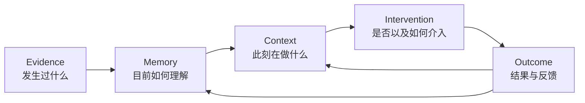
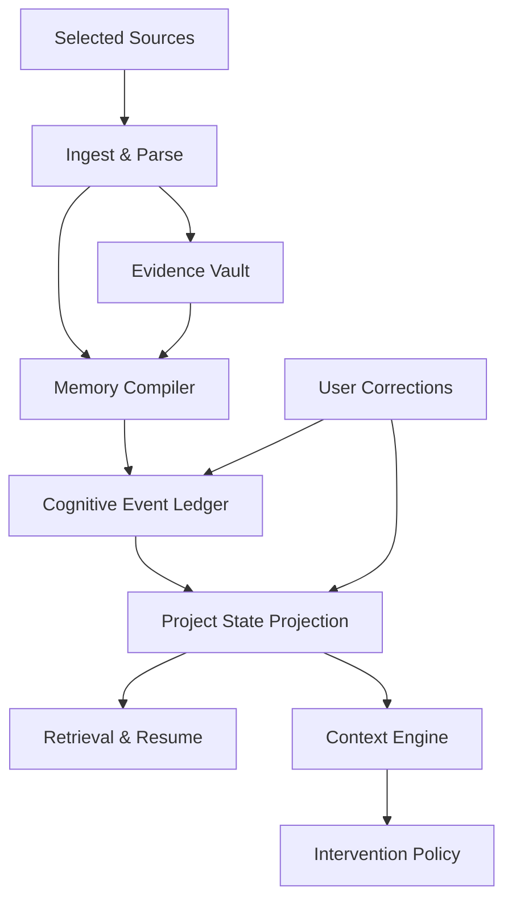
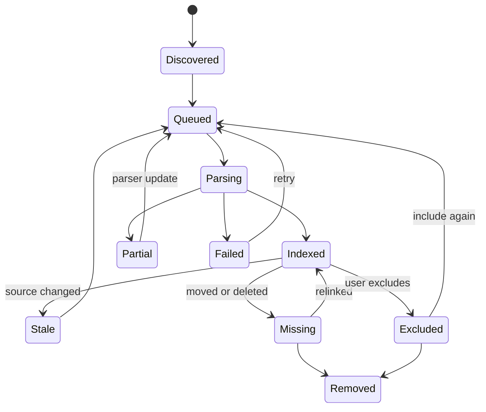
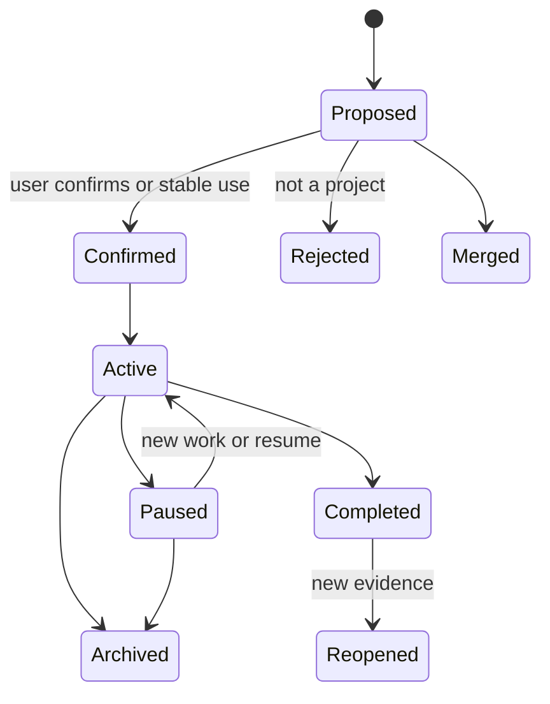
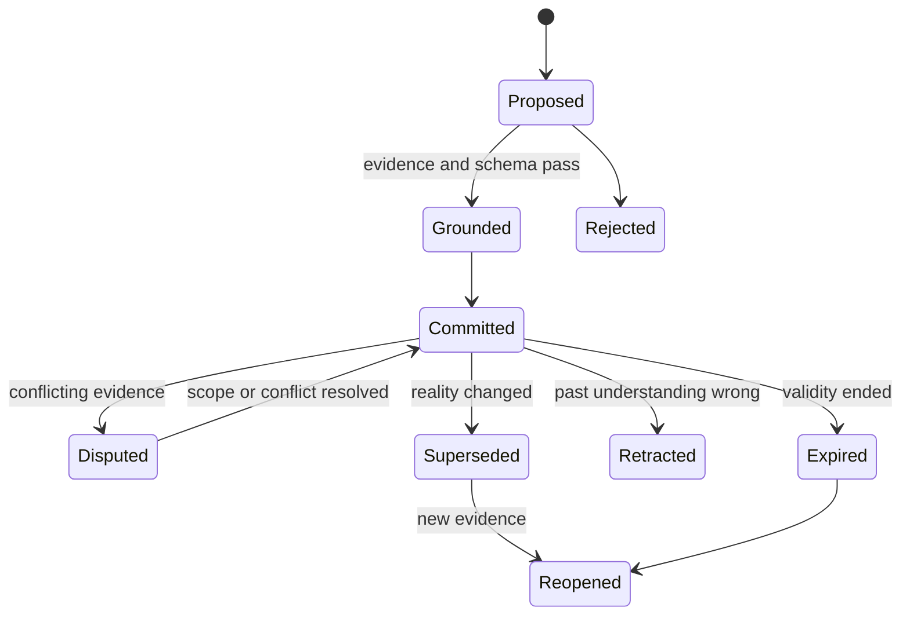

# Personal Cognitive OS

## 产品设计文档 v1.0 — Continuity First

> 当前状态：**历史产品方向，已不是产品定义入口**  
> Canonical 产品定义：`AI-native-个人知识库-终局产品设计文档-v4.0.md`；本文仅保留 Continuity First 决策来源，冲突时以 v4.0 为准  

**文档性质：** 产品战略、体验定义、PRD、系统边界与验证计划  
**状态：** 决策级产品基线；核心假设仍需用户验证  
**日期：** 2026-08-03  
**首发范围：** macOS 优先的桌面端、本地优先、单人使用  
**工作名：** Personal Cognitive OS 仅代表产品类别，不是最终品牌名  

> 本文不把“想清楚了”伪装成“已经验证”。标为 **产品决策** 的内容用于约束后续设计；标为 **产品假设** 的内容必须通过原型、真实数据或用户研究验证；标为 **开放项** 的内容尚未决定。

## 阅读地图

| 如果你关心 | 优先阅读 |
|---|---|
| 产品究竟是什么、为什么这样切 | 0、2、3、5 |
| 首发用户与真实使用方式 | 4、6、8、9 |
| Figma、界面与内容设计 | 10、11、12、17、22 |
| 系统对象、Context 与本地架构 | 7、13–16、26–27 |
| 是否具备发布条件 | 18–21、23–24 |

第一次评审建议顺序：`0 → 3 → 5 → 8 → 11.4 → 18 → 19 → 21.1`。附录用于实现与争议定位，不需要所有评审者逐字阅读。

---

## 0. 执行摘要

### 0.1 一句话产品定义

Personal Cognitive OS 是一个运行在个人电脑上的**认知连续性层**：它从用户主动选择的本地资料中建立可追溯的项目状态，在用户回到一项被打断的工作时，恢复目标、最后决定、未闭环、重要变化和下一步；只有当系统长期证明自己理解正确时，才逐步获得主动提示和准备动作的资格。

### 0.2 产品真正解决的问题

知识工作中最昂贵的损耗通常不是“找不到某个文件”，而是：

- 回到一个项目后，不记得自己停在哪里；
- 记得结论，却忘了当时为什么这样决定；
- 新材料已经改变前提，但旧结论仍在被使用；
- 会议、文档、网页和聊天分别保存了同一件事的不同片段；
- 系统能找到相似内容，却不能告诉用户“现在应该相信什么、还有什么没有闭环”。

现有知识库主要保存内容，搜索工具主要找回内容，聊天助手主要生成回答。Personal Cognitive OS 的任务是维护**用户认知状态的连续性**。

### 0.3 核心产品楔子

**产品决策：首发楔子不是“记录一切”，不是“万能搜索”，也不是“主动提醒”；而是 Project Resume。**

用户首次选择一到三个活跃项目文件夹后，系统建立 Project Map；当用户数小时或数天后重新进入某个项目时，呈现一份可核验的 Resume Brief：

1. 我上次要完成什么；
2. 已经做了哪些决定；
3. 还卡在哪里；
4. 离开期间什么发生了变化；
5. 最合理的下一步是什么；
6. 每条结论来自哪里。

这条闭环同时满足四个条件：价值高、容易解释、可以用本地文件先实现、能够为未来 Context 与 Intervention 积累可信数据。

### 0.4 首次价值与重复价值

| 时刻 | 用户获得的价值 | 系统需要证明什么 |
|---|---|---|
| 前 5 分钟 | 从所选文件中识别出真实项目与近期材料 | 它能读懂我的资料，而不是制造漂亮摘要 |
| 第一次纠正 | 用户拆分、合并或重命名一个项目 | 它接受纠正，并立即改变后续结果 |
| 第一次恢复 | 用户重返项目，得到准确 Resume Brief | 它理解“我停在哪里”，且每条都能追溯 |
| 第一次变化提示 | 新材料推翻旧决定或解除阻塞 | 它能维护变化，而不是只搜索旧文本 |
| 第一次主动提示 | 在低打扰时机出现一条高价值信息 | 它知道什么时候保持安静 |

### 0.5 产品北极星

> **用户在重新进入一项真实工作后，以更少重读和搜索恢复到可行动状态，并且相信系统给出的状态。**

北极星不是捕获量、记忆条数、通知点击或聊天轮数。主要衡量：恢复时间、状态准确度、来源可追溯率、纠正成本和主动提示有用率。

### 0.6 终局与首发的关系

终局闭环仍然是：



但产品不会同时交付整套终局能力：

- **V1：** Evidence → Project State → Resume；
- **V1.5：** 可见、可纠正的 Context；
- **V2：** 克制的主动提示；
- **V3：** 受限、可验证的跨应用动作。

这是开发顺序，不是对终局本体的否定。

---

## 1. 输入、研究方法与证据边界

### 1.1 本文使用的输入

本文综合并重构两份既有材料：

1. WorkBuddy 版《Personal Cognitive OS 产品设计文档》：保留其桌面体验、控制台、追溯和情境卡决策；原文件 SHA-256：`6dcb6fbdd465919572dcf3ff015330cfc5e9033e01fb224923882cce0c7316fb`。
2. Codex 版《Personal Cognitive OS 终局产品设计文档》：保留其 Evidence、Memory、Context、Intervention、事件账本、时态、谱系和信念维护模型；原文件 SHA-256：`724b4b37665609a27adacf3a27efbcae8f9cbd4008ac413d226c69ef77d6897b`。

本文不是把两份材料拼接起来，而是重新回答三个问题：

- 什么是用户最先愿意使用、最容易感知的价值；
- 哪些系统理念必须进入产品，哪些只应留在实现层；
- 哪些能力应该按信任逐级解锁，而不是一次性出现在导航里。

### 1.2 研究证据分级

| 证据级别 | 含义 | 本文如何使用 |
|---|---|---|
| A：官方当前产品资料 | 截至 2026-08-03 可核验的公开能力 | 判断竞品占位与平台可行性 |
| B：同行评审或原始研究 | 记忆、事件分段、打扰与信念维护研究 | 推导交互原则，不直接当成市场需求 |
| C：现有内部规格 | 已形成的产品哲学和系统模型 | 作为候选决策，重新做产品化取舍 |
| D：产品假设 | 尚无真实用户数据支持的判断 | 明确标记并进入验证计划 |

### 1.3 研究结论与直接设计推论

1. **连续经历会被人按有意义的事件边界组织。** 事件分段与后续记忆、学习相关，因此系统应围绕“打开项目、形成决定、发生错误、离开任务、重新进入”等边界组织 Episode，而不是机械地每隔固定时间截图。来源：[Event Segmentation](https://pmc.ncbi.nlm.nih.gov/articles/PMC3314399/)。
2. **中断后的恢复是独立成本。** 关于计算任务中断与恢复的现场研究说明，恢复需要重新建立目标和状态，因此 Resume Brief 应优先重建“可行动状态”，而不是回放一段活动流水。来源：[Disruption and Recovery of Computing Tasks](https://www.microsoft.com/en-us/research/publication/disruption-recovery-computing-tasks-field-study-analysis-directions/)。
3. **通知价值必须减去打断成本。** Attention-Sensitive Alerting 与 bounded deferral 的研究支持等待低成本任务边界、延期和合并，而不是只有“推送/不推送”。来源：[Attention-Sensitive Alerting](https://www.microsoft.com/en-us/research/publication/attention-sensitive-alerting/)、[Balancing Awareness and Interruption](https://www.microsoft.com/en-us/research/?p=316112)。
4. **认知卸载有价值，但不能让系统替代用户判断。** 产品应帮助恢复和理解，同时保留证据、冲突与确认动作；不能只优化“替用户记住更多”。来源：[Cognitive Offloading](https://pubmed.ncbi.nlm.nih.gov/27542527/)。
5. **长期记忆的难点不只是检索。** LongMemEval 表明长期交互中的信息抽取、时间推理和知识更新仍然困难；产品评测必须包含旧信息失效、冲突、纠正传播和时间变化。来源：[LongMemEval](https://proceedings.iclr.cc/paper_files/paper/2025/file/d813d324dbf0598bbdc9c8e79740ed01-Paper-Conference.pdf)。
6. **来源谱系应是一等模型。** W3C PROV 使用 Entity、Activity 与 Agent 表达来源过程；产品中的“为什么”也应记录来源、处理活动和版本，而非只有一个 `source_url`。来源：[W3C PROV-O](https://www.w3.org/TR/prov-o/)。
7. **信念维护需要保存理由和依赖。** Truth Maintenance System 的核心不是宣告真理，而是记录为什么相信并在前提变化后修订。来源：[A Truth Maintenance System](https://www.sciencedirect.com/science/article/abs/pii/0004370279900080)。

### 1.4 证据边界

本文没有真实用户访谈、留存数据、任务日志或可用性测试。因此：

- “高认知复杂度个人工作者”是首要用户假设，不是已验证市场细分；
- “Project Resume 是最佳楔子”是基于价值、差异化和可实现性的产品判断；
- 所有数值目标都是首轮验证门槛，不是行业基准；
- 文档完成不等于产品风险已消失，验证计划是产品的一部分。

---

## 2. 竞争空间与产品空缺

### 2.1 当前产品占位

| 产品类别与代表 | 已经做得好的部分 | 仍然留下的空缺 | 对本产品的启示 |
|---|---|---|---|
| Microsoft Recall | 选择加入的屏幕快照、时间线、语义找回、回到原位置；快照与索引本地加密 | 重点是“我见过什么”，不是项目决定和承诺如何演变 | 回放必须能跳回原始证据，但不能把截图时间线当成认知模型 |
| DEVONthink | 本地文档库、搜索、关系推荐、版本与自动化，长期处理大规模个人资料 | 仍以用户维护数据库、分组与资料管理为主要模型 | 本地和专业资料能力是基线；差异化必须来自无需维护的状态连续性 |
| Mem | 快速捕获、后台组织、相关内容浮现，Agent 会跟进承诺与截止 | 主要状态仍围绕 Mem 中保存的笔记、会议和链接 | “内容回来找你”已经不是独特口号，必须用可追溯状态与变化维护胜出 |
| Notion AI | 跨工作区和连接器搜索、回答引用、研究与团队知识 | 团队工作区与用户主动查询是中心 | 不与企业搜索争宽度；坚持个人、本地、跨项目连续性 |
| Granola | 聚焦会议，用户笔记与转写结合；生成内容可回看对应转写 | 单一事件域，跨项目和长期状态弱 | 对窄场景做深、把生成点回原文，是值得学习的产品纪律 |
| NotebookLM | 用户明确选择来源，回答高度依赖来源集合 | 需要用户先建立 Notebook；被动捕获和跨时段状态不是中心 | 来源选择与引用体验应成为默认，而不是高级审计功能 |
| Supermemory / Agent Memory 基础设施 | 为 Agent 提供抽取、连接器、短长期记忆和 RAG 基础设施 | 记忆主体通常是 Agent；不是完整个人体验 | 后端能力可借鉴，但用户认知状态不能退化为 Agent personalization |

当前能力依据：[Microsoft Recall](https://support.microsoft.com/en-us/windows/ai/ai-features-retrace-your-steps-with-recall)、[DEVONthink](https://devontechnologies.com/apps/devonthink/ai)、[Mem](https://mem.ai/)、[Notion Enterprise Search](https://www.notion.com/product/enterprise-search)、[Granola](https://docs.granola.ai/help-center/taking-notes/ai-enhanced-notes)、[NotebookLM](https://workspace.google.com/products/notebooklm/)、[Supermemory](https://supermemory.ai/docs/intro)。

### 2.2 真正的产品空缺

空缺不是“把以上功能全做一遍”。真正缺少的是一个面向个人、可追溯、能维护变化的状态层：

> 它不仅能找到用户曾经看过什么，还能说明某个项目目前处于什么状态、这个状态基于哪些证据、离开期间发生了什么变化，以及用户现在怎样继续。

### 2.3 产品不参与的竞争

- 不和 Notion 竞争多人文档协作；
- 不和 Recall 竞争最长、最完整的屏幕录像；
- 不和 NotebookLM 竞争单次研究任务的全部生成格式；
- 不和任务管理器竞争人工排期与团队派发；
- 不和聊天助手竞争“任何问题都能回答”；
- 不用知识图谱动画、记忆数量或 AI 拟人感制造差异。

---

## 3. 产品命题与品味原则

### 3.1 产品命题

传统 PKM 的隐含合同是：**你负责保存与整理，我负责存储与检索。**

Personal Cognitive OS 的合同应变成：

> **你负责工作、表达和纠正；系统负责在授权来源内维护状态，并在需要时用证据帮助你继续。**

### 3.2 三个核心价值

1. **Continuity：** 事情跨应用、跨天、跨版本仍保持连续。
2. **Grounding：** 任何重要状态都能回到来源，推断与观察清楚分开。
3. **Agency：** 用户能纠正、忽略、固定、拆分和改变系统行为；系统不以“替你做主”证明聪明。

### 3.3 产品品味原则

1. **状态优先于信息流。** 首页回答“现在怎样继续”，而不是展示系统又处理了多少条内容。
2. **来源优先于生成。** 重要结论附近永远有来源和适用时间；漂亮摘要不能替代证据。
3. **安静也是成功。** 主动能力的 KPI 不是出现次数，而是有用率和避免打扰。
4. **Context 是提议，不是读心。** 使用“看起来你正在……”而不是“我知道你正在……”。
5. **纠正与结论同层。** 用户不需要进入设置页才能说“项目错了”“这已经过时”。
6. **逐级赢得信任。** 系统先读、再组织、再恢复、再提示、最后才准备动作。
7. **复杂度留在系统里。** 用户看到“来源、状态、变化、下一步”，而不是本体、向量、COT 或策略分数。
8. **保留不确定性。** 不知道时显示缺口或竞争解释，不用流畅文案掩盖。

### 3.4 绝不采用的反模式

- 首屏展示“已为你生成 1,248 条记忆”；
- 用一个 0.87 分数表现伪精确；
- 把所有低置信判断丢给用户审核；
- 默认连续截图、连续录音或全盘扫描；
- 把完整思维链当作解释；
- 每张卡都有“Ask AI”但没有明确主任务；
- 用红点、逾期数量和连续提醒制造焦虑；
- 因为是本地产品，就忽略屏幕共享、密码应用和第三方录音等基本边界。

### 3.5 V1 目标与非目标

**用户目标：**

- 不持续整理，也能看见一个项目当前最可信的状态；
- 回到中断项目后，在一分钟内找到正确材料或下一步；
- 重要结论一跳回到来源；
- 纠正一次后，错误不会继续污染其他视图。

**产品目标：**

- 证明状态型 Resume 明显优于“最近文件 + 普通摘要”；
- 建立 Project、Evidence、Correction 与事件账本的最小正确闭环；
- 用真实使用结果决定是否继续投入 Context 与主动能力；
- 形成无需 Plugin、无需云端、无需人工知识库维护的首次价值。

**V1 非目标：**

- 最大化摄取覆盖；
- 成为团队知识中枢；
- 替代项目管理、日历或任务系统；
- 自动替用户关闭项目、问题或承诺；
- 证明系统“了解整个人生”；
- 通过聊天时长或日活建立伪成功。

### 3.6 为什么本地优先

本地优先首先是一个体验与架构决定：本地文件变化能够低延迟进入状态；无网络时用户仍可访问自己的资料；大规模增量索引不必反复上传；产品可以从用户现有工作方式开始，而不是要求把资料迁移到另一个容器。隐私是收益之一，但不是唯一理由。

---

## 4. 首要用户与核心工作

### 4.1 首要用户

**产品假设：** 首发用户是“高认知复杂度的个人知识工作者”，而不是所有需要记笔记的人。

行为特征比职业更重要：

- 同时推进 3–10 个持续数周或数月的项目；
- 每天在文档、浏览器、沟通和创作工具之间切换；
- 经常因会议、消息和临时任务离开当前工作；
- 重要决定、约束和承诺散落在多个文件版本；
- 愿意选择本地资料范围，但不愿持续维护文件夹、标签或图谱；
- 需要知道“为什么”，而不是接受没有来源的 AI 结论。

典型角色包括产品经理、研究者、创作者、咨询顾问、独立开发者、管理者与复杂个人项目拥有者。

### 4.2 次要用户

- 长期研究或论文写作者；
- 同时管理多个客户的自由职业者；
- 使用大量本地 PDF、Office 文档和 Markdown 的专业人士；
- 希望自己的 AI 工具共享个人上下文，但不想先搭建知识库的人。

### 4.3 非目标用户

- 主要需求是团队协作、审批和权限管理的组织；
- 只需要简单便签或日程提醒的用户；
- 希望系统直接替自己做决定、自动发送所有外部消息的用户；
- 没有稳定桌面工作流、主要在手机完成任务的用户；
- 需要法律级取证、完整监控或合规归档的机构。

### 4.4 核心 Jobs to Be Done

**JTBD-1：恢复。** 当我回到一项被打断的工作时，我希望迅速恢复目标、决定、阻塞和下一步，不必重新翻完所有文件。

**JTBD-2：理解变化。** 当新信息改变旧理解时，我希望系统指出变化和影响范围，而不是同时给我两个冲突答案。

**JTBD-3：带回证据。** 当过去的材料与当前任务有关时，我希望直接看到相关片段和当时上下文，而不是只得到一段 AI 转述。

**JTBD-4：保持闭环。** 当一个问题、决定或承诺尚未完成时，我希望它在真正相关的时刻回到工作集，而不是变成另一条永久逾期任务。

**JTBD-5：纠正系统。** 当系统理解错误时，我希望一次纠正能改变当前视图和未来推断，而不是每次重新解释。

### 4.5 优先用户故事

**多项目个人负责人**

- 作为同时推进多个项目的人，我希望重新打开一个项目时直接看到上次目标、已决定和下一步，以便不用先重读半小时。
- 作为对结果负责的人，我希望系统指出离开期间的新变化，以便不会基于旧前提继续工作。
- 作为频繁切换应用的人，我希望项目状态跨文件和工具保持一致，以便目录位置不决定我能否找回事情。

**研究与创作型用户**

- 作为研究者，我希望每个综合判断都能打开原始来源，以便快速核验而不是相信一段生成文本。
- 作为长期写作者，我希望知道某个结论在什么时间、基于哪些材料形成，以便新证据出现时正确修订。

**纠正与异常场景**

- 作为被系统误归类的用户，我希望在当前页面直接拆分项目，以便不进入复杂设置。
- 作为使用混合格式资料的用户，我希望知道哪些文件没有被读懂，以便不会误以为系统已经覆盖全部证据。
- 作为离线工作的用户，我希望仍能打开资料与现有 Brief，以便产品不因网络不可用而失去基本价值。

---

## 5. 产品范围、MVP 与阶段路线

### 5.1 V1 的产品承诺

> 从用户明确选择的本地项目资料中，建立可信 Project Map，并在用户重新进入项目时生成可追溯的 Resume Brief。

### 5.2 V1 必须包含（P0）

1. **选择性本地来源：** 用户选择文件夹或文件；系统不移动原件。
2. **增量索引：** 首扫后只处理新增、修改、删除和移动。
3. **Project Map：** 识别项目候选、关键人物、主题、近期材料和时间边界。
4. **项目纠正：** 合并、拆分、重命名、排除、固定归属；纠正进入后续规则。
5. **Project State：** 目标、最近活动、决定、问题、阻塞、下一步和重要来源。
6. **Resume Brief：** 在用户主动打开项目或重新进入关联文件时生成恢复包。
7. **Why / 来源抽屉：** 每条重要状态可以打开原文件和尽可能精确的页码、段落或片段。
8. **Review Queue：** 只收纳高影响且系统无法安全决定的项目归属、冲突与缺失证据。
9. **统一搜索：** 支持关键词与语义找回，但结果以来源和项目上下文组织。
10. **Quick Capture：** 全局快捷键保存文字、文件或选区，并继承当前项目候选。
11. **本地运行与离线访问：** 无网络时仍能查看来源、项目状态与已生成 Brief。
12. **可理解的失败状态：** 未解析、索引中、来源已移动、信息冲突、需要确认必须明确可见。

### 5.3 V1 明确不做

- 不默认连续屏幕截图或录音；
- 不以全盘扫描作为首次设置；
- 不主动发送系统通知；
- 不执行邮件、日历、付款、发布或其他外部动作；
- 不做多人协作空间；
- 不做移动端完整控制台；
- 不把知识图谱作为主导航；
- 不要求连接任何 Plugin、邮箱或云盘才能获得首次价值；
- 不承诺理解用户所有生活领域；
- 不展示完整 COT；仅展示结构化依据、假设、冲突和策略说明。

### 5.4 V1.5：可见 Context

在 V1 恢复闭环达到质量门槛后增加：

- Now Capsule：当前项目、任务和工作阶段候选；
- Working Set Drawer：当前任务的少量材料、决定、未闭环和下一步；
- 可选 Focus Session：用户明确开启一段高频上下文捕获；
- 日历只读或手动导入，用于事件边界和 Resume，不直接创建动作；
- Context 纠正与短期固定。

### 5.5 V2：克制主动

- Ambient Cue：屏幕边缘的轻提示；
- Context Card：变化、冲突、承诺和恢复提示；
- bounded deferral、合并、冷却和注意力预算；
- 提示历史与反馈学习；
- 默认无声音、无强制弹窗；Interruptive 必须显式开启。

### 5.6 V3：受限行动

- Prepare：准备邮件、日历变更、对比或清单；
- Approve-once：单次确认后执行；
- Verify：重新读取目标系统证明结果；
- Standing bounded delegation：仅适用于低风险、可撤销且边界明确的重复动作。

### 5.7 阶段解锁原则


后一级不能因为技术可用而提前上线；必须以前一级的质量和信任门槛为前提。

---

## 6. 核心产品循环

### 6.1 用户循环


### 6.2 系统循环

1. **Observe：** 读取用户明确选择的来源与增量变化。
2. **Ground：** 保留原始来源和精确片段定位。
3. **Compile：** 提取项目、事件、决定、问题、阻塞与下一步候选。
4. **Reconcile：** 识别更新、冲突、重复和作用域变化。
5. **Project：** 构建当前 Project State 与 Working Set。
6. **Surface：** 在用户主动进入项目时呈现 Resume Brief。
7. **Learn：** 将纠正、使用、忽略和完成结果写回编译规则与当前状态。

### 6.3 两个信任循环

**内容信任循环：** 来源 → 结论 → 打开原文 → 纠正 → 结论更新。  
**时机信任循环：** Context 候选 → 提示 → 有用/无用/时机错 → 预算与阈值更新。

V1 只需完整完成第一个循环。第二个循环在 V2 才能成为正式产品承诺。

---

## 7. 用户可理解的概念模型

系统内部可以复杂，用户语言必须稳定而少。

| 内部对象 | 用户界面名称 | 用户能理解的含义 |
|---|---|---|
| Evidence | 来源 | 系统实际读到的文件、片段、录音或事件 |
| Episode | 工作片段 / 事件 | 一段有开始、结束和目标的工作或对话 |
| Entity / Project Memory | 项目 / 人物 / 材料 | 持续存在并随时间变化的对象 |
| Claim / Choice / Intent | 状态 / 决定 / 未闭环 | 系统当前认为成立、已决定或尚待完成的内容 |
| ContextFrame | 当前任务判断 | 系统认为用户此刻在做什么，以及依据是什么 |
| Working Set | 当前工作集 | 继续当前任务最需要的少量内容 |
| Intervention | 提示 / 建议 | 系统认为现在可能有用的一条信息或动作 |
| Provenance | 为什么 / 来源链 | 结论来自哪些片段、经过什么处理和修订 |

### 7.1 顶层对象边界

#### Source

- 原件不被 AI 静默改写；
- 保存内容哈希、路径、修改时间、类型和精确片段；
- 文件移动后尽量通过稳定标识重新关联；
- 解析失败不会伪装成“没有内容”。

#### Project

Project 不是文件夹，也不是标签。它是围绕一个持续目标形成的状态空间，包含：目标、参与者、材料、时间、决定、问题、阻塞和下一步。

一个文件可以属于多个项目；一个项目也可以跨多个文件夹。系统的聚类只是候选，用户纠正拥有更高权威。

#### Project State

Project State 是可重建的当前视图，不是永久摘要。至少包含：

- 当前目标与完成标准；
- 最近一次有意义的工作边界；
- 仍有效的决定及其理由；
- 活跃问题、冲突和阻塞；
- 近期新增或变化的来源；
- 可行动的下一步；
- 明确的不确定项。

#### Resume Brief

Resume Brief 是对 Project State 的任务化投影，只服务“现在怎样继续”。它不是日报、周报或活动总结。

#### Context

Context 永远是短期候选。用户打开一个文件不等于已经切换项目；系统应结合连续性、共享实体、时间间隔、明确选择和近期工作判断。

#### Prompted Help

提示不是通知的同义词。系统可以选择缓存、等待、合并、轻提示、提问或展示；大多数候选最终不应出现。

### 7.2 禁止向用户暴露的内部概念

- 原始 chain-of-thought；
- embedding、chunk、token 与模型上下文；
- MemoryAssertion、ContextFrame 等工程类名；
- 未经校准的概率小数；
- 处理器内部评分公式；
- “AI 已思考 15 步”之类表演性文案。

---

## 8. 首次使用：前 15 分钟体验

### 8.1 体验目标

用户第一次使用后必须明白三件事：

1. 系统读取的是我选择的资料，而不是神秘地观察整台电脑；
2. 它识别出的项目与我的真实工作有关；
3. 如果它错了，我可以很轻地纠正，并立刻看到变化。

### 8.2 步骤 1：价值说明

首屏只说一件事：

> **重新回到项目时，不必再从头读起。** 选择一个活跃项目的资料，我会先建立可核验的项目状态。

次要说明：文件保留在原位置；系统建立本地索引；稍后可增减范围。

不在首屏讲 Evidence Vault、知识图谱、六维置信度或 Agent。

### 8.3 步骤 2：选择来源

默认引导用户选择**一个最近在工作的文件夹**，而不是整块磁盘。

选择后先显示扫描预估：

- 预计文件数和支持类型；
- 将忽略的缓存、构建产物、隐藏目录、重复文件和超大文件；
- 可能需要额外解析的文件；
- “只索引这个文件夹”与“包含子文件夹”控制。

主按钮文案：`建立项目地图`，而不是 `允许访问所有文件`。

### 8.4 步骤 3：渐进式扫描

扫描不使用单一进度条假装确定。显示三个真实阶段：

1. 找到资料；
2. 读取内容；
3. 识别项目与变化。

在完整扫描结束前，只要已经有足够证据，就展示第一个项目候选。用户可以边看边继续，不必等待黑箱任务完成。

### 8.5 步骤 4：Project Map 预览

默认展示 3–6 个高置信项目候选，每个候选包含：

- 项目名候选；
- 一句目标描述；
- 最近更新时间；
- 3–5 个代表来源；
- “为什么归在一起”；
- 操作：正确、重命名、拆开、并入其他项目、不是项目。

低置信材料放入“暂未归类”，不强迫用户完成整理才能继续。

### 8.6 步骤 5：第一次纠正

用户做一次纠正后，界面立即：

- 更新受影响项目数量与代表来源；
- 告诉用户“以后相同文件路径/名称/人物关系会沿用这次纠正”；
- 提供一次撤销；
- 不弹出额外表单询问原因。

这一步比展示更多 AI 结论更重要，因为它证明系统可控。

### 8.7 步骤 6：第一次 Resume Brief

用户选择一个项目，系统生成首份 Brief：

```text
你上次在做什么
准备定稿桌面端权限模型，重点是拆分读取、关联和外部行动。

已经决定
• 外部行动不能从“读取权限”继承。
• 项目先做桌面端，移动端暂缓。

仍未闭环
• 长期授权撤销后，派生内容是否保留。

最近变化
• 新文档提出跨 Zone 关联必须单独授权。

建议下一步
更新权限状态机，并检查三个旧界面是否仍使用总开关。
```

每一条都可打开来源；“建议下一步”必须标记为建议，不与已有决定混在一起。

### 8.8 首次使用的失败与恢复

| 失败 | 正确体验 |
|---|---|
| 文件太少，无法形成项目 | 不生成虚假项目；展示已读取来源，并建议增加一个相邻文件夹 |
| 文件太多，扫描时间长 | 先处理最近 30 天与常用类型，提供“继续后台扫描” |
| 项目混在一起 | 在候选卡直接拆分，以代表来源为操作对象 |
| 文件不支持 | 显示类型、原因和可选替代方式，不把它静默忽略 |
| 模型无法可靠概括 | 展示来源时间线和“暂未形成状态”，而不是低质量摘要 |
| 用户中途退出 | 下次从真实检查点继续，不重新开始 |

---

## 9. 日常核心体验

### 9.1 场景 A：从中断中恢复

**触发：** 用户主动选择项目，或在离开四小时以上后打开一个高置信关联文件。

**流程：**

1. 系统识别项目候选，但不立刻弹出完整卡片；
2. 菜单栏出现轻量 `恢复 Project A`；
3. 用户展开后看到 Resume Brief；
4. 系统突出离开期间变化，不重复用户刚刚看到的内容；
5. 用户可选择 `继续`、`打开上次材料`、`不是这个项目`；
6. 继续动作记录为有用信号，但不自动把所有建议标记完成。

**成功状态：** 用户在 60 秒内打开正确材料或明确下一步。

### 9.2 场景 B：新信息改变旧决定

1. 新来源与一个仍有效的决定冲突；
2. 系统建立“需要确认的变化”，不覆盖旧决定；
3. 项目页显示两条来源、各自时间和影响对象；
4. 用户选择：现实变化、旧理解错误、作用域不同、暂不判断；
5. 系统重算 Project State，并标出被影响的 Brief 内容；
6. 已显示过的旧状态保留“此后已修订”标记。

### 9.3 场景 C：无关键词找回材料

用户搜索“上个月说过客户不接受年付的那份材料”。结果按以下顺序呈现：

1. 精确来源片段；
2. 所属项目和当时 Episode；
3. 相关决定或冲突；
4. 生成式回答，且明确引用前述来源。

搜索结果不先给一段无法核验的答案。

### 9.4 场景 D：系统理解错项目

1. 用户在任何状态项上选择 `项目不对`；
2. 就地选择正确项目、拆分或暂不归类；
3. 系统展示受影响范围：Project State、搜索、Brief 和待处理项；
4. 修正立即生效；后台重算可稍后完成，但界面不得继续展示已知错误；
5. 相同错误在没有新证据时不得因模型升级重新出现。

### 9.5 场景 E：未来主动提示

只有当 V2 解锁后：

1. 用户进入相关任务；
2. 系统发现一条有时间价值的变化；
3. 先经过来源、状态、重复、冷却、Context 和打扰门槛；
4. 默认显示 Ambient Cue；
5. 用户主动展开后才出现 Context Card；
6. 用户可以反馈“有用”“内容错”“时机错”“别再提示这类”；
7. 错误反馈更新 Memory 或策略，而不是只隐藏当前卡片。

---

## 10. 信息架构与产品形态

### 10.1 三层产品形态

1. **Local Cognitive Runtime：** 索引、编译、项目状态、Context 与策略后台。
2. **In-flow Layer：** 菜单栏、全局快捷键、Resume Cue、Working Set Drawer。
3. **Studio：** 项目、来源、Review、时间线、搜索与设置的主应用。

### 10.2 主应用导航

| 导航 | 回答的问题 | 主要内容 |
|---|---|---|
| Now | 我现在怎样继续？ | 当前项目、Resume Brief、少量待处理、最近变化 |
| Projects | 每件长期工作现在是什么状态？ | 项目列表、项目详情、决定、未闭环、来源 |
| Review | 哪些高影响判断需要我确认？ | 冲突、项目归属、缺失证据、重要更新 |
| Sources | 系统实际读到了什么？ | 文件、片段、解析状态、来源范围 |
| Timeline | 事情如何变化到现在？ | Episode、版本、决定与修订 |
| Settings | 系统读取什么、怎样工作？ | 来源范围、模型、捕获、提示、存储、快捷键 |

`Knowledge Map` 不进入一级导航。图谱仅作为项目 Why 视图中的诊断方式。

### 10.3 全局入口

- 菜单栏：当前项目候选、索引状态、Quick Capture、暂停 Session、打开 Now；
- `⌘ ⇧ Space`：全局命令框，支持搜索、切换项目、快速保存和打开当前工作集；
- 文件右键或分享扩展：添加到系统并选择项目；
- 可选浏览器扩展：保存网页结构与选区，V1 不依赖它才能成立。

---

## 11. 核心界面规格

### 11.1 Now — 认知控制台

**目的：** 让用户继续，而不是汇报系统工作量。

**桌面结构：**

- 顶部：当前项目候选 / 手动切换 / `不是这个`；
- 主区：Resume Brief 或当前 Working Set；
- 右侧：最近变化、最多三个需要确认项；
- 底部弱状态：最后索引时间、解析问题、来源范围。

**禁止：** 大型指标卡、记忆总数、捕获动画、全量活动 Feed。

**空状态：** `选择一个活跃项目，让系统先帮你恢复一次。`

### 11.2 Projects — 项目列表

默认按近期活动与未闭环价值排序，不按 AI 估计的“重要性”制造黑箱排名。

项目卡只显示：

- 项目名与一句目标；
- 最近有意义的变化时间；
- 当前阶段；
- 一个最重要未闭环；
- 来源覆盖与状态质量提示。

### 11.3 Project Detail — 项目状态页

**主区顺序：**

1. 目标与完成标准；
2. Resume / 当前工作集；
3. 已决定；
4. 未闭环与阻塞；
5. 最近变化；
6. 关键来源。

**右侧 Inspector：** 当前选中状态的来源、时间、适用范围、竞争解释和修订历史。

项目页不是另一个用户手工维护的 Notion 页面。用户可编辑目标和确认决定，但系统负责从来源维护其余状态。

### 11.4 Resume Brief

**固定结构：**

```text
上次目标
停下时的状态
已经决定
仍未闭环
离开期间的变化
建议下一步
```

规则：

- 总长度默认不超过一屏；
- 每个区块最多三条，更多内容进入展开；
- 决定与建议使用不同视觉样式；
- 没有变化时明确说“离开期间未发现重要变化”；
- 无法确认的内容使用“可能”“尚未确认”并给出原因；
- 用户可在每条上选择：正确、内容错、项目错、已过时、无用。

### 11.5 Why Drawer — 结构化解释

Why Drawer 不是 COT。它回答：

1. 结论是什么；
2. 来自哪些来源片段；
3. 来源发生与修改时间；
4. 系统做了什么转换；
5. 是否存在冲突、缺口或替代解释；
6. 哪次用户纠正影响了它；
7. 它被用于哪些 Brief 或提示。

### 11.6 Review Queue

Review 只容纳三类事项：

- 不处理会明显改变项目状态的冲突；
- 高影响但低置信的项目或人物归属；
- 系统无法确定是现实变化还是过去理解错误的更新。

Review 不容纳：低价值标签建议、普通摘要润色、所有新实体或每条低置信提取。

每个 Review Item 必须能在 30 秒内处理；支持 `暂不决定`，不把所有不确定性转成用户债务。

### 11.7 Sources

Sources 视图提供：

- 当前纳入范围与排除范围；
- 文件解析状态和最后更新时间；
- 重复、移动、删除与不支持状态；
- 文件预览和命中片段；
- `从系统移除索引` 与 `在 Finder 中显示`；
- 重新解析单个来源。

### 11.8 Context Card（V2）

卡片固定回答四件事：

1. **这是什么；**
2. **为什么现在；**
3. **依据是什么；**
4. **我可以做什么。**

默认行为：

- 无声音；
- 先以 Cognitive Edge 弱提示，用户展开后才展示正文；
- 不使用几秒自动消失的完整信息卡；
- 用户主动展开的卡持续到明确关闭；
- 多条候选先合并为一个“2 条相关变化”，不堆叠覆盖当前应用；
- 屏幕共享时隐藏正文和声音，仅在本机菜单栏保留私密状态。

---

## 12. 文案与交互语言

### 12.1 语气

准确、克制、非拟人化。系统描述自己的依据，而不是描述用户内心。

| 不采用 | 采用 |
|---|---|
| 我知道你正在准备定价会议 | 看起来你重新进入了定价项目 |
| 我记得你的一切 | 我从 23 个已选来源中恢复了这个项目 |
| 这是事实 | 当前来源支持这个状态 |
| 置信度 0.83 | 依据充分 / 仍有冲突 / 来源可能已过时 |
| AI 认为你应该…… | 建议下一步：……；依据是…… |
| 我替你解决了 | 已准备；等待你确认 / 已执行并验证 |

### 12.2 状态词汇

- `已确认`：用户明确确认或有直接、稳定来源；
- `来源支持`：来源充分但未由用户确认；
- `可能`：推断或范围仍不确定；
- `有冲突`：存在竞争来源；
- `可能已过时`：超过该类型的新鲜度窗口；
- `已修订`：后来版本改变了旧状态；
- `缺少依据`：系统无法安全形成状态。

### 12.3 纠正文案

全局统一使用：

- 内容不对；
- 项目不对；
- 已经过时；
- 这是观点，不是事实；
- 正确，但现在没用；
- 时机不对；
- 以后别提示这类；
- 从系统中移除。

纠正后用一句话说明作用范围，并提供撤销。

---

## 13. 捕获与来源策略

### 13.1 三种捕获模式

| 模式 | 默认状态 | 用途 |
|---|---|---|
| Selected Library | V1 默认 | 用户选择文件夹或文件，持续增量索引 |
| Quick Capture | V1 默认 | 主动保存文字、选区或文件；语音在 P1 |
| Focus Session | V1.5 可选 | 用户明确开启一段高频任务 Context 捕获 |

### 13.2 为什么不默认全盘扫描

这不是主要因为隐私，而是产品质量：全盘包含缓存、构建产物、下载副本、应用数据、旧备份和大量无意义文本，会降低项目聚类质量、拖慢首次价值并让纠正成本失控。

产品应该让用户从一个真实活跃项目开始，证明价值后再逐步扩大来源。

### 13.3 文件类型优先级

**P0：** PDF、Markdown、纯文本、DOCX、PPTX、常见代码与配置文件；XLSX 先支持可定位到工作表/单元格的文本与表格数据。  
**P1：** 图片 OCR、语音、本地邮件导出、日历导出、网页快照、会议转写。  
**P2：** 结构化 Connector 与应用实体。

### 13.4 默认排除

默认排除隐藏目录、依赖与构建目录、包缓存、临时文件、系统目录、重复下载、超大二进制、密码与身份验证应用内容。用户可以查看并调整规则。

### 13.5 Focus Session 原则

- 明确开始和结束；
- 菜单栏持续显示；
- 优先记录事件边界和结构化变化，不永久保存高帧率视频；
- 可以只捕获选定应用或窗口；
- 结束后展示“保存了什么”，允许删除一段 Session；
- 屏幕共享不是自动增强捕获的理由；默认进入安静模式并提示用户选择。

---

## 14. Memory、时间与变化维护

### 14.1 系统真相源

> 原始 Source/Evidence 与追加式 Cognitive Event Ledger 是权威源；项目状态、摘要、图谱、搜索和向量索引都是可重建视图。

### 14.2 Memory 不是摘要

Memory 的最小产品单元是带类型、来源、时间、适用范围和状态的结构化记录。V1 优先支持：

- Project；
- Episode；
- Decision；
- Question；
- Blocker；
- Next Step；
- Claim；
- Person / Artifact；
- Correction Constraint。

更广的 Intent、Policy、Process 与长期人物状态可在后续扩展。

### 14.3 四类变化

1. **现实变化：** 旧状态曾经正确，新状态从某个时间开始生效；
2. **过去理解错误：** 旧状态从一开始就不应被接受；
3. **范围细化：** 状态只适用于更窄项目、人物或条件；
4. **未解决冲突：** 多个来源暂时并存，系统不替用户选边。

### 14.4 时间模型

- `occurred_at`：事件何时发生；
- `valid_from / valid_to`：状态何时有效；
- `observed_at`：系统或用户何时获知；
- `recorded_at`：何时进入系统。

V1 UI 不展示字段名，但 Timeline 与 Why 必须能够表达“当时知道什么”和“后来何时改变”。

### 14.5 Confidence 设计

内部保留：证据强度、来源可靠性、推断不确定性、时效性、用户确认、冲突程度和作用域匹配。

用户界面只投影为可理解状态：

- 依据充分；
- 依据有限；
- 有冲突；
- 可能已过时；
- 用户已确认。

绝不把维度平均为一个面向用户的神秘分数。

### 14.6 纠正传播

用户纠正必须：

1. 立即隐藏已知错误的当前视图；
2. 记录纠正对象与作用范围；
3. 重算派生 Project State、搜索和候选 Brief；
4. 撤回尚未展示的错误提示；
5. 保留“为什么曾经这样理解”的最小历史；
6. 在没有新证据时阻止同类错误重现。

---

## 15. Context 与主动介入策略

### 15.1 Context Frame

Context 至少包含：当前应用与对象、项目候选、任务阶段、近期动作、注意力状态、任务边界概率和备选解释。

信号优先级：

1. 用户明确选择；
2. 文件与项目稳定关系；
3. 时间与操作连续性；
4. 内容语义；
5. 历史行为预测。

低层信号不能覆盖高层明确选择。

### 15.2 防止 Context 抖动

用户从编辑器切到浏览器查资料通常仍是同一个任务。切换主 Context 需要：

- 新候选持续占优；或
- 用户明确选择；或
- 出现强事件边界。

系统保留次级候选，但不把每次窗口切换变成 UI 变化。

### 15.3 主动提示解锁门槛

对单个用户，系统在满足下列条件前不启用 Context Card：

- 至少两个项目被用户确认或稳定使用；
- 至少三次 Resume Brief 被使用且没有严重纠正；
- 用户明确开启“在相关时机提醒”；
- 候选内容有可打开来源；
- 提示历史可查看和关闭。

### 15.4 决策顺序

硬门控先于价值排序：

1. 来源仍存在且状态未撤回；
2. 当前项目和任务匹配；
3. 内容未解决、未重复、未处于冷却；
4. 当前不是屏幕共享、演示或用户设定的安静状态；
5. 错误代价与提示强度匹配；
6. 用户允许该类别提示。

通过后再比较：预期帮助、时间价值、可行动性、打断成本、重复和不确定性。

### 15.5 提示动作集合

- Suppress：不出现；
- Cache：加入 Working Set；
- Defer：等待任务边界或最晚时间；
- Merge：合并多个候选；
- Ambient：边缘弱提示；
- Ask：只在一个答案能显著改变结果时提问；
- Surface：显示 Context Card；
- Interrupt：仅限用户显式允许的极少类别；
- Prepare：准备动作但不执行。

### 15.6 注意力预算

- V2 默认每个项目每天最多一个可见 Context Card；
- 连续两次忽略的类别自动进入冷却；
- “内容正确但时机错”只调整时机，不降低 Memory 可信度；
- Review Queue 与主动提示共享决策预算，不能双重轰炸；
- 紧急不由 AI 自行定义，必须来自明确截止、用户承诺或确定性状态。

---

## 16. 本地优先产品架构

### 16.1 首发平台决策

**产品决策：macOS 优先，之后 Windows。**

原因：首发用户与本地资料工具高度重合；单一平台有利于把文件变更、菜单栏、全局快捷键、窗口与捕获体验做完整。Windows 版本应复用系统本体，但单独适配权限、索引与窗口信号。

### 16.2 可行性基础

- macOS File System Events 可用于监听所选目录的增量变化；
- Core Spotlight 提供设备内私有索引与语义搜索能力，可作为系统能力或补充索引，而非唯一真相源；
- ScreenCaptureKit 支持按显示器、应用或窗口过滤的屏幕与音频捕获，适合后续可选 Focus Session。

官方资料：[File System Events](https://developer.apple.com/documentation/coreservices/file_system_events)、[Core Spotlight](https://developer.apple.com/documentation/corespotlight)、[ScreenCaptureKit](https://developer.apple.com/documentation/screencapturekit)。

### 16.3 逻辑组件



### 16.4 LLM 与确定性代码的分工

LLM 可以：语义分段、候选项目命名、状态提取、关系解释、Brief 文案。  
LLM 不得独自决定：文件身份合并、权限、时间闭合、删除、外部动作、数值校验、冲突已经解决。

### 16.5 模型策略

- P0 核心索引和已生成状态在离线时可用；
- 解析、OCR、embedding 和轻量抽取优先本地；
- 对无法在目标设备上高质量完成的复杂综合，可提供可选云模型，但不是首次价值前提；
- 不把产品绑定到某一个模型或提示词版本；处理器必须有版本；
- 模型升级后重建投影视图，不静默改写历史来源与用户纠正。

### 16.6 编译流水线


1. **Discover：** 发现新增、修改、移动和删除；建立稳定 Source Identity。
2. **Parse：** 恢复文档结构、页码、工作表、标题、代码符号和可引用片段。
3. **Segment：** 形成有意义的文档与 Episode 边界，避免任意字符切块破坏语义。
4. **Resolve：** 解析项目、人物、文件版本、时间与别名，只产生候选关联。
5. **Extract：** 提取目标、决定、问题、阻塞、下一步和状态变化候选。
6. **Ground：** 将每个字段连接到精确 Source Span；找不到依据的内容标记为推断或建议。
7. **Reconcile：** 处理重复、更新、冲突、作用域与下游依赖。
8. **Policy Check：** 检查来源范围、排除规则和当前产品阶段允许的动作。
9. **Commit：** 连同处理器版本和输入输出追加到 Ledger。
10. **Project：** 重建 Project State、搜索索引、Review 与候选 Brief。

失败必须停留在发生的阶段并保留可重试输入；系统不能因为后续摘要成功，就把前序解析失败标成成功。

### 16.7 Retrieval 与 Resume 组装

检索不能只按向量相似度。候选至少来自五条路径：

1. **Identity：** 同一项目、文件、人物与显式链接；
2. **Temporal：** 最近有效状态、离开期间变化、截止与版本顺序；
3. **Structural：** 决定、依赖、阻塞、问题、目标和完成标准；
4. **Semantic：** 表达不同但概念相关的片段；
5. **Counter-evidence：** 主动寻找撤回、冲突、过期和反例。

组装 Resume 时先做作用域、有效期和冲突过滤，再按用户当前阶段排序。每个区块保留来源多样性，防止同一份摘要的多个切片挤满上下文。建议下一步只能从已确认目标、未闭环和当前材料推导，并始终与已有决定分开显示。

### 16.8 性能设计目标

以下是首轮工程目标，需要在真实设备基线后校准：

| 指标 | 目标 |
|---|---|
| 首次可见项目候选 | 选择典型 500 个文件后 p50 < 90 秒 |
| 首次完整可用状态 | 典型 1,000 个文件 p50 < 8 分钟，允许后台继续 |
| 增量文件进入搜索 | 修改后 p95 < 30 秒 |
| 本地搜索首屏 | p95 < 700 ms |
| 缓存 Resume Brief 展开 | p95 < 1 秒 |
| 重新编译 Resume Brief | p95 < 8 秒，并展示进行中状态 |
| 后台稳态 CPU | 非处理高峰平均 < 5% 单核等价 |
| 崩溃后恢复 | 从检查点继续，不重做已提交 Evidence |

---

## 17. 视觉系统与交互细节

### 17.1 视觉气质

克制、温暖、精确。它应像一个可信的专业工具，而不是科幻大脑或 AI 仪表盘。

- 默认亮色，提供完整暗色；
- 暖灰和米白为背景，避免冷蓝灰造成无菌感；
- 青色表示 Context 与系统状态；
- 琥珀表示需要判断；
- 红色只表示真实冲突或风险；
- 绿色表示已确认或已验证；
- 任何状态不能只依赖颜色。

### 17.2 Figma 基准布局

- 基准画布：1440 × 900；最小验证：1280 × 800；
- 左导航：224 px；
- 主阅读列：640–760 px；
- 右侧 Why Inspector：320–360 px；
- 8 pt spacing system；
- 卡片圆角 12 px，浮层 14 px；
- 主要内容区不使用超过两层嵌套卡片；
- 正文中文 14–15 px / 1.55 行高；
- 状态与来源 12–13 px，但不得低于可读下限；
- 关键数字不使用仪表盘式超大字号。

### 17.3 信息密度

默认高信息密度，但每屏只有一个主决策：继续、确认、纠正或查看来源。详情采用 progressive disclosure，不把所有谱系直接铺开。

### 17.4 动效

- 动效只解释来源展开、状态修订和轻提示；
- 不使用持续脉冲、呼吸光或“AI 正在思考”的装饰；
- 支持 Reduce Motion；
- Ambient Cue 淡入后可自行降低显著性，但已展开内容不自动消失；
- 状态重算使用局部更新，不让整个页面闪烁重排。

### 17.5 键盘与无障碍

- 所有核心流程完全支持键盘；
- Hover 行为同时支持焦点、点击和快捷键；
- 焦点顺序遵循视觉阅读顺序；
- 状态有文字与图形双重表达；
- 200% 缩放下主任务不丢失；
- 列表、标题、来源引用和 Review 操作有明确语义；
- 红/绿不作为唯一对比；
- 屏幕阅读器可读出“结论—状态—来源数量—操作”。

---

## 18. 功能需求与验收标准

### 18.1 P0 需求

| ID | 需求 | 验收标准摘要 |
|---|---|---|
| P0-01 | 选择本地来源 | 用户可添加/移除文件夹；系统不移动原文件；范围始终可见 |
| P0-02 | 增量索引 | 新增、修改、移动和删除会更新索引；失败可重试且不产生重复 Evidence |
| P0-03 | Project Map | 每个候选显示代表来源与归类理由；低置信内容不被强行归类 |
| P0-04 | 项目纠正 | 合并、拆分、重命名、排除均可撤销；后续状态立即尊重纠正 |
| P0-05 | Project State | 目标、决定、未闭环、变化、下一步有独立状态与来源 |
| P0-06 | Resume Brief | 用户重新进入项目时可在一屏内恢复；每个重要项目可主动生成 |
| P0-07 | 来源追溯 | 重要状态 100% 有来源或明确标记为用户断言/系统建议 |
| P0-08 | 精确打开来源 | PDF 尽量到页，文本到片段，Office 到文档与匹配位置；无法精确时诚实降级 |
| P0-09 | Review Queue | 只进入高影响不确定项；支持处理、暂缓和查看影响范围 |
| P0-10 | 搜索 | 支持关键词和自然语言线索；结果先展示来源，再提供综合回答 |
| P0-11 | Quick Capture | 全局入口可保存文字、文件与选区；提交前显示项目候选 |
| P0-12 | 离线与恢复 | 离线可搜索和查看已编译状态；异常退出后从检查点继续 |
| P0-13 | 解析状态 | 不支持、失败、等待和过期均可见；不得静默丢失 |
| P0-14 | 纠正传播 | 当前视图立即隐藏错误，派生状态在后台重算，未来不无故复发 |
| P0-15 | 数据移除 | 用户可从索引移除来源；所有派生视图重算，不保留可搜索正文 |

### 18.2 关键 Given / When / Then

**AC-1 首次项目地图**  
Given 用户选择包含 50 个以上相关资料的文件夹，  
When 系统完成首轮渐进解析，  
Then 至少展示一个带代表来源与归类理由的项目候选，且用户可在卡片内纠正。

**AC-2 恢复被中断工作**  
Given 用户四小时以上未进入已确认项目，  
When 用户主动选择项目或打开高置信关联文件，  
Then 系统提供 Resume 入口，并在 Brief 中区分已有决定、未闭环、最近变化与建议。

**AC-3 结论追溯**  
Given Brief 展示一条“已决定”，  
When 用户打开 Why，  
Then 系统显示支持来源、时间、相关修订，并能打开原文件；若没有直接来源，状态不得显示为已决定。

**AC-4 项目纠正传播**  
Given 系统把一个文件归入错误项目，  
When 用户改为正确项目，  
Then 错误项目立即移除该文件的状态影响，受影响 Brief 进入重算，搜索结果使用新项目关系。

**AC-5 冲突不静默覆盖**  
Given 新来源与仍有效决定冲突，  
When 编译完成，  
Then 两个状态并存并进入项目变化；系统不得直接用新摘要覆盖旧决定。

**AC-6 解析失败**  
Given 一个文件无法解析，  
When 用户查看 Sources 或项目覆盖状态，  
Then 系统显示失败原因、影响范围和重试/排除操作，不把它计入已理解来源。

**AC-7 离线使用**  
Given 网络断开，  
When 用户打开已索引项目，  
Then 来源、搜索、Project State 与缓存 Brief 可用；需要云模型的重编译明确显示暂不可用。

### 18.3 P1

- 可见 Now Capsule 与 Working Set Drawer；
- Focus Session 与事件边界；
- 日历只读上下文；
- 浏览器结构化保存；
- 项目模板与领域词表；
- 时间线对比；
- 导出项目状态与来源包；
- 跨设备只读同步。

### 18.4 P2

- 主动 Context Card；
- 会议、邮件和任务 Connector；
- 移动端 Quick Capture；
- 动作 Prepare / Execute / Verify；
- 跨角色与长期 Context；
- 面向第三方 AI 的本地 Context API。

---

## 19. 成功指标与发布门槛

### 19.1 指标原则

- 衡量用户是否更快恢复，而不是系统是否生成更多内容；
- 把“正确但无用”和“内容错误”分开；
- 主动功能必须同时看收益和打扰；
- 在没有基线前，目标是验证门槛，不是增长承诺。

### 19.2 原型门槛

在 8–12 名目标用户的可点击原型与真实资料演示中：

- ≥ 80% 能在无解释情况下说出产品核心价值；
- ≥ 75% 能完成“查看来源—纠正项目—回到 Brief”；
- ≥ 70% 认为 Resume Brief 比普通最近文件列表更有帮助；
- 不超过 20% 把 Review Queue 理解为必须清空的任务箱；
- 100% 能找到暂停/调整来源入口。

### 19.3 Closed Alpha 门槛

- Time to First Useful Project：p50 < 5 分钟，p90 < 12 分钟；
- 用户在首个 Project Map 中确认至少一个真实项目的比例 ≥ 75%；
- 重要状态来源覆盖率 = 100%；
- Project 代表来源 Top-5 准确率 ≥ 85%；
- 严重错误纠正后复发率 < 5%；
- Resume Brief “有用或非常有用”比例 ≥ 70%；
- 用户恢复到正确材料/下一步的中位时间相对手动基线降低 ≥ 40%；
- 不支持或失败来源的可见率 = 100%。

### 19.4 主动能力发布门槛

V2 Context Card 在满足以下条件前不能默认推荐开启：

- 离线回放评测中，候选来源与 Context 正确率 ≥ 90%；
- 测试用户认为“有用”的可见卡比例 ≥ 80%；
- “内容错误” < 5%；
- “时机错误或打扰” < 10%；
- 重复提示率 < 3%；
- 用户可在一次操作内关闭类别或说明错误。

### 19.5 Guardrail Metrics

- 日均 Review 负债；
- 每次纠正所需操作数；
- 错误项目合并率；
- 过时状态继续出现在 Brief 的比例；
- 解析失败但用户不知情的数量；
- 后台 CPU、存储增长与电量影响；
- 用户主动关闭来源、提示或卸载的原因。

### 19.6 测量方法与事件口径

Closed Alpha 默认把产品事件保存在本机；研究参与者明确同意后，导出不含原文的测量包。核心事件：

- `source_scope_added / removed`；
- `project_proposed / confirmed / split / merged / rejected`；
- `state_corrected`，并区分内容、项目、时间和作用域；
- `resume_opened / source_opened / next_step_used`；
- `review_resolved / deferred`；
- `cue_useful / wrong / mistimed / dismissed`；
- `parse_failed / partial / recovered`。

恢复时间不能仅靠点击推断。研究中以“用户打开正确材料或明确说出下一步”为完成点，并和同一用户不使用产品时的基线任务比较。来源准确度由盲审或用户确认的 Source Span 计算，不用模型自评。

---

## 20. 验证与研究计划

### 20.1 阶段 1：问题与语言验证

访谈 8–12 名目标用户，要求他们用真实项目复盘：

- 最近一次被打断后如何恢复；
- 哪些决定只能靠记忆或重读找回；
- 什么内容变化最容易漏掉；
- 哪种系统行为会让他们觉得“它在装懂”；
- 他们愿意选择哪些本地来源作为开始。

不先展示完整 Cognitive OS 概念，避免概念赞美替代问题证据。

### 20.2 阶段 2：Wizard-of-Oz Resume Test

让用户提供一个去敏或自选项目资料包，由研究者/系统生成 Resume Brief。对比：

- 最近文件列表；
- 普通 AI 摘要；
- 本文定义的状态型 Resume Brief。

盲测恢复速度、遗漏、来源核验和主观信任。

### 20.3 阶段 3：Project Map Alpha

真实本地索引 2–4 周，观察：

- 首次聚类纠正；
- 项目随时间演变；
- 文件移动和版本变化；
- Resume 被打开后的实际行为；
- 哪些低置信项值得进入 Review。

### 20.4 阶段 4：主动能力离线评测

先回放历史 Context 生成候选，不真正弹出。用户批量判断：内容是否正确、当时是否有用、什么时机合适。通过门槛后才做小规模 Ambient Cue。

### 20.5 质量评测集

必须包含：

- 同名人物；
- 相似但不同项目；
- 同一决定的多个版本；
- 旧结论被新材料推翻；
- 文件删除与移动；
- 只有弱证据的下一步；
- 多语言文件；
- 扫描 PDF 与表格；
- 解析失败；
- 项目暂停后重新启动；
- 用户纠正后模型升级重编译。

评测不仅看 Recall@K，还看错误合并、过时依赖、冲突保留、来源定位和纠正传播。

---

## 21. 风险与明确取舍

| 风险 | 为什么危险 | 产品取舍 |
|---|---|---|
| 愿景过大 | 容易变成截图、搜索、知识库和 Agent 的拼盘 | 首发只承诺 Project Resume，其他能力按门槛解锁 |
| 项目聚类错误 | 错误一旦进入状态会污染所有后续体验 | 候选化、代表来源、轻纠正、持久 Correction Constraint |
| Brief 看似正确但不可行动 | 会退化为活动摘要 | 固定目标、决定、未闭环、变化、下一步结构 |
| 用户被 Review 淹没 | AI 把不确定性转成用户劳动 | 只升级高影响项目，允许暂不决定，限制每日负债 |
| 主动提示打扰 | 一次明显错误会破坏长期信任 | 先离线评测、默认 Ambient、bounded deferral、高门槛 |
| 本地设备性能不足 | “本地优先”可能牺牲质量和速度 | 渐进解析、轻重模型分层、可选云增强但不作为首次价值前提 |
| 文件解析碎片化 | 不同格式难以精确定位来源 | P0 收紧格式、显示解析覆盖与诚实降级 |
| 系统概念过多 | 用户会把产品理解成复杂知识库 | UI 只使用项目、来源、状态、变化、Brief、提示 |
| 过度依赖 AI 摘要 | 模型升级造成状态漂移 | 账本、结构化状态、处理器版本和可重建投影 |
| 本地等于“无需边界”的误解 | 屏幕共享、第三方录音仍可能造成严重体验事故 | 只保留必要的捕获可见性、排除和安静模式 |

### 21.1 最重要的杀死条件

如果真实测试表明用户不能从 Resume Brief 中比“最近文件 + 搜索”更快恢复工作，或者为了得到准确 Brief 需要持续人工整理，当前产品楔子不成立；应停止扩展主动能力，重新选择更窄场景，而不是用更多功能掩盖。

---

## 22. Figma 与原型落稿顺序

首批不再只画 Intervention 卡。正确顺序是：

### Wave 1：首次价值闭环

1. 首跑价值页；
2. 来源选择与扫描预估；
3. 渐进扫描；
4. Project Map 预览与纠正；
5. 第一次 Resume Brief；
6. Why Drawer。

### Wave 2：日常使用

7. Now；
8. Projects 列表；
9. Project Detail；
10. Review Queue；
11. Sources 与解析失败；
12. 全局命令框 / Quick Capture。

### Wave 3：Context 与主动

13. Now Capsule；
14. Working Set Drawer；
15. Cognitive Edge；
16. Context Card；
17. 提示历史与策略反馈。

每个 Wave 必须先完成可用性测试，再扩大视觉系统。Intervention 的视觉吸引力不能先于 Project Map 和 Resume 的可理解性。

---

## 23. 路线图与发布 Gate

### Gate 0：概念可证伪

- 完成用户访谈；
- 完成三种 Resume 形式盲测；
- 证明状态型 Brief 明显优于最近文件和普通摘要。

### Gate 1：Project Map 可用

- 支持 P0 文件类型；
- 渐进索引和增量更新；
- 项目候选与轻纠正；
- 达到项目代表来源准确率门槛。

### Gate 2：Resume 闭环成立

- Project State；
- Resume Brief；
- Why Drawer；
- 纠正传播；
- 恢复时间显著下降。

### Gate 3：Context 可见

- Now Capsule；
- Working Set；
- Context 修正；
- Focus Session；
- 不发生频繁 Context 抖动。

### Gate 4：主动有用

- 离线候选评测；
- Ambient Cue；
- Context Card；
- 注意力预算和冷却；
- 达到有用率与打扰门槛。

### Gate 5：行动可验证

- Prepare；
- 单次批准；
- 幂等执行；
- 结果 Verify；
- PARTIAL、FAILED 与撤销体验。

不使用固定日期代替 Gate。在团队规模、模型成本和真实基线未知前，时间承诺没有意义。

---

## 24. 开放项

### 发布前阻塞

1. **目标用户验证：** Project Resume 是否是最高频、最高价值痛点；Owner：Product Research。
2. **macOS 最低版本与设备基线：** 8GB/16GB 内存下的解析与模型策略；Owner：Engineering。
3. **P0 文件格式边界：** Office 精确片段定位能做到什么程度；Owner：Document Pipeline。
4. **Project Map 算法与交互共同基线：** 如何定义“项目代表来源准确率”；Owner：AI + Product。
5. **首次资料范围：** 一个文件夹、多个文件夹或项目包哪种最易理解；Owner：Design Research。

### 非阻塞

6. 最终产品名与命名系统；
7. 是否提供可选云增强订阅；
8. Windows 进入路线的具体 Gate；
9. 移动端只做 Capture 还是也做 Resume；
10. 第三方 AI 的本地 Context API 形态；
11. 面向专业领域的模板与本体扩展。
12. 商业模式与许可：一次性桌面软件、订阅式模型增强或二者组合；在核心留存得到验证前不锁定。

---

## 25. 从旧版到 v1.0 的关键变化

| 旧方向 | v1.0 决策 | 原因 |
|---|---|---|
| “全部产品决策已锁定” | 区分产品决策、假设和开放项 | 诚实表达验证状态 |
| 日常默认本地扫盘 | 默认选择一个活跃项目来源 | 提高首次质量与可控性 |
| 首批 Figma 先画 Intervention | 先画来源 → Project Map → Resume → Why | 与首次价值和信任顺序一致 |
| 完整 COT | 结构化 Why：来源、转换、冲突、假设 | 真实、稳定、用户可理解 |
| 默认叮声与浮窗 | 默认 Ambient、无声、展开后持久 | 减少不必要打断 |
| 控制台承载大量系统状态 | Now 只服务“怎样继续” | 状态优先于系统工作量 |
| 五种长期导航并列 | Now / Projects / Review / Sources / Timeline / Settings | 以用户问题组织 IA |
| 终局本体直接变产品范围 | 终局保留，MVP 聚焦 Project Resume | 降低拼盘与实现风险 |
| 隐私治理占较大篇幅 | 保留本地产品所需最低边界 | 遵循本地优先定位，不让隐私压过核心价值 |

---

## 26. 附录 A：核心数据对象

### A.1 Evidence

```text
Evidence
  evidence_id
  source_uri / stable_file_id
  content_hash
  source_type
  captured_at / modified_at
  exact_spans[]
  parser_version
  parse_status
  selected_scope
```

### A.2 Memory Frame

```text
MemoryFrame
  memory_id
  frame_type
  subject / participants
  predicate_or_role
  object_or_payload
  applicability_scope
  epistemic_mode
  lifecycle_state
  evidence_links[]
  justifications[]
  confidence_vector
  occurred_at
  valid_from / valid_to
  observed_at
  recorded_at
  revision_id
  processor_versions[]
```

### A.3 Project State

```text
ProjectState
  project_id
  title
  goal
  success_criteria[]
  stage
  active_decisions[]
  open_inquiries[]
  blockers[]
  next_steps[]
  recent_changes[]
  key_sources[]
  last_meaningful_episode
  confidence_summary
  unresolved_conflicts[]
```

### A.4 Context Frame

```text
ContextFrame
  immediate_activity
  project_hypotheses[]
  task_hypotheses[]
  stage_hypotheses[]
  supporting_signals[]
  contradictory_signals[]
  attention_state
  task_boundary_probability
  valid_from / expires_at
```

### A.5 Intervention Decision

```text
InterventionDecision
  candidate_type
  target_outcome
  source_memories[]
  context_basis
  why_now
  policy_gates[]
  chosen_action
  presentation_level
  user_response
  observed_outcome
```

---

## 27. 附录 B：状态机与关系约束

### B.1 Source 生命周期



约束：`Failed` 与 `Partial` 不是隐藏错误；它们会降低项目覆盖状态。`Removed` 后正文不能继续进入搜索和新推断。

### B.2 Project 生命周期



约束：Project 可以在任何非 Archived 状态被拆分；拆分与合并必须保留旧引用的迁移记录。`Completed` 不能仅凭长时间无活动自动产生。

### B.3 Memory 生命周期



约束：显示为“已决定”或“已确认”的状态必须是 `Committed`，且有适用来源或用户直接断言。摘要生成本身不能把 `Proposed` 升级为 `Committed`。

### B.4 Review Item 生命周期

```text
candidate → impact check → queued → shown
shown → resolved / deferred / dismissed
deferred → queued when trigger arrives
resolved → reopened only by new evidence
```

约束：相同根因的多个 Review Item 必须合并；已延期项在没有新触发条件时不得反复回到队列。

### B.5 Intervention 生命周期

```text
generated → policy gated → suppressed / cached / deferred / surfaced
surfaced → seen / useful / wrong / mistimed / dismissed / acted
acted → verified / partial / failed / rolled_back
```

`seen` 和 `clicked` 不是成功；系统必须保留内容错误与时机错误的区别。

### B.6 关系族

| 关系族 | 关系 | 关键约束 |
|---|---|---|
| 来源 | `derived_from`, `extracted_from`, `asserted_by`, `generated_by` | 派生状态必须有来源或明确用户断言 |
| 认识论 | `supports`, `contradicts`, `assumes`, `weakens`, `confirms` | 关系自身也有来源和作用域 |
| 时间演化 | `supersedes`, `retracts`, `refines`, `reopens`, `expires` | 不同操作不能被一个“更新”吞并 |
| 语义 | `about`, `same_as`, `distinct_from`, `part_of` | `same_as` 不得仅由名称相似自动提交 |
| 目标行动 | `serves_goal`, `depends_on`, `blocks`, `enables`, `fulfills` | 完成与解除阻塞需要 Outcome 或用户确认 |
| 项目社会 | `participant_in`, `stakeholder_of`, `belongs_to_project` | 关系允许随时间和角色变化 |

---

## 28. 附录 C：研究与产品资料

**检索日期：2026-08-03。以下链接用于支持设计推论，不代表对产品宣传口径的独立效果验证。**

### 认知、打扰与记忆

- [Event Segmentation — Zacks & Swallow](https://pmc.ncbi.nlm.nih.gov/articles/PMC3314399/)
- [Disruption and Recovery of Computing Tasks — Iqbal & Horvitz](https://www.microsoft.com/en-us/research/publication/disruption-recovery-computing-tasks-field-study-analysis-directions/)
- [Attention-Sensitive Alerting — Horvitz, Jacobs & Hovel](https://www.microsoft.com/en-us/research/publication/attention-sensitive-alerting/)
- [Balancing Awareness and Interruption](https://www.microsoft.com/en-us/research/?p=316112)
- [Cognitive Offloading — Risko & Gilbert](https://pubmed.ncbi.nlm.nih.gov/27542527/)
- [A Truth Maintenance System — Doyle](https://www.sciencedirect.com/science/article/abs/pii/0004370279900080)
- [W3C PROV-O](https://www.w3.org/TR/prov-o/)
- [MemGPT](https://arxiv.org/abs/2310.08560)
- [LongMemEval, ICLR 2025](https://proceedings.iclr.cc/paper_files/paper/2025/file/d813d324dbf0598bbdc9c8e79740ed01-Paper-Conference.pdf)

### 当前产品与平台

- [Microsoft Recall](https://support.microsoft.com/en-us/windows/ai/ai-features-retrace-your-steps-with-recall)
- [Mem](https://mem.ai/)
- [Notion Enterprise Search](https://www.notion.com/product/enterprise-search)
- [Granola AI-enhanced notes](https://docs.granola.ai/help-center/taking-notes/ai-enhanced-notes)
- [Google NotebookLM](https://workspace.google.com/products/notebooklm/)
- [DEVONthink AI](https://devontechnologies.com/apps/devonthink/ai)
- [Supermemory](https://supermemory.ai/docs/intro)
- [Apple File System Events](https://developer.apple.com/documentation/coreservices/file_system_events)
- [Apple Core Spotlight](https://developer.apple.com/documentation/corespotlight)
- [Apple ScreenCaptureKit](https://developer.apple.com/documentation/screencapturekit)

---

## 29. 最终产品判断

Personal Cognitive OS 值得做的原因，不是它能容纳更多 AI 能力，而是它把一个长期被分散工具忽略的问题放到了中心：**人需要的不是无限回放，而是在真实工作重新开始时，恢复一个仍然可信、可以行动、能够修正的认知状态。**

产品的第一性质量标准是：

> **少管理、快恢复、有来源、能纠正、懂得安静。**

只要这五件事没有同时成立，就不应该用更多捕获、更多图谱、更多 Agent 或更多主动卡片来掩盖。先把 Project Resume 做到用户真正舍不得失去，再谈完整 Cognitive OS。
