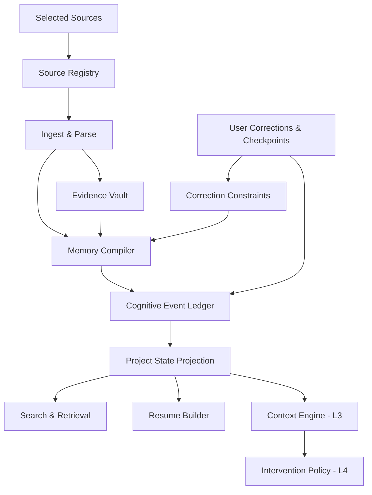

# Personal Cognitive OS

## 产品设计文档 v2.1 — Project Continuity

> 当前状态：**历史产品方向，已不是产品定义入口**  
> Canonical 产品定义：`AI-native-个人知识库-终局产品设计文档-v4.0.md`；本文仅保留 Project Continuity 决策来源，冲突时以 v4.0 为准  

> **工作描述名**：Project Continuity / 项目连续性层（不是最终品牌名）  
> **文档性质**：产品战略、体验规格、系统边界、验收标准与验证计划的唯一候选基线  
> **首发形态**：macOS 原生桌面应用，本地优先，单人使用  
> **日期**：2026-08-03  
> **状态**：建议决策版；需通过 Gate 0 研究后才能称为“已验证产品基线”

---

## 阅读地图

如果只读 10 分钟，阅读：§0、§2、§4、§6、§8、§20、§25。  
如果负责体验设计，继续阅读：§9–§12、§18、§24。  
如果负责工程与 AI，继续阅读：§13–§17、附录 A–C。  
如果负责研究、增长或商业化，继续阅读：§1、§3、§5、§20–§23。

### 决策标注

本文不把作者判断伪装成负责人已批准，也不把漂亮文案伪装成用户证据。

| 标注 | 含义 | 后续处理 |
|---|---|---|
| **[建议决策]** | 基于现有证据与产品判断，建议作为当前设计约束 | 负责人确认后进入正式决策日志 |
| **[产品假设]** | 尚无充分真实用户数据支持 | 必须进入验证计划，可被推翻 |
| **[研究信号]** | 来自论文、官方产品资料或公开用户讨论 | 只支持方向，不自动等于市场需求 |
| **[开放项]** | 当前不应拍脑袋决定 | 指定 Owner、截止 Gate 与决策材料 |
| **[未来方向]** | 不进入当前版本范围 | 不得以“以后会有”掩盖 V1 价值不足 |

---

## 0. 执行摘要

### 0.1 最终产品判断

**[建议决策]** 这款产品值得继续验证，但唯一有资格成立的差异不是“本地 AI”“自动整理”“语义搜索”“和文件聊天”或“知识图谱”。到 2026 年，这些能力已经被 DEVONthink、Elephas、Clipbeam、NotebookLM、Mem、Recall 等成熟或新兴产品覆盖。

真正值得验证的产品命题是：

> **系统持续维护一个可追溯、可修订的项目状态；当用户回到被打断的工作时，用最少重读恢复目标、决定、未闭环、变化与下一步。**

它不是第二大脑，不承诺理解整个人生；不是笔记软件，不要求持续整理；不是任务管理器，不替用户排期；不是桌面录像机，不以完整回放为目标；也不是 Agent，不在建立信任前执行外部动作。

### 0.2 一句话定义

> Personal Cognitive OS 是 Mac 上的**项目连续性层**：它从用户明确选择的本地资料中维护有来源的项目状态，并在用户重新进入一项长期工作时，生成一份可信、可纠正、能直接继续的 Resume Brief。

### 0.3 首发楔子

首发只证明一个闭环：

```text
选择一个真实项目资料夹
    ↓
系统识别来源与项目候选
    ↓
用户用一次轻纠正确认边界
    ↓
系统维护 Project State 与变化
    ↓
用户离开数小时或数天后回来
    ↓
Resume Brief 帮用户回到可行动状态
    ↓
用户查看来源、纠正或直接继续
```

### 0.4 产品终局

终局仍是完整的认知连续性系统：被动获得信号、维护长期状态、理解当前 Context、在正确时机带回相关知识、最后准备受限动作。但终局按信任逐级解锁：

```text
L0 读懂来源
 → L1 组织项目
 → L2 准确恢复
 → L3 可见 Context
 → L4 安静介入
 → L5 准备与受限执行
```

Project Resume 是**第一可信价值**，不是产品全部；情境介入是**赢得信任后的签名体验**，不是冷启动首屏。

### 0.5 北极星

**北极星结果：** 用户回到一项真实工作时，以更少重读和搜索恢复到可信、可行动的状态。

**首要产品指标：** `Validated Resume Success Rate`，定义见 §20。  
**核心质量约束：** 重要状态有来源或明确标为用户断言/系统建议；系统不靠流畅文案掩盖缺口。

### 0.6 五条第一性质量标准

1. **少管理**：价值不能依赖用户持续维护标签、图谱或总结。
2. **快恢复**：Brief 必须缩短恢复时间，而不只是生成一段好看的摘要。
3. **有来源**：任何决定、变化和建议都能说明依据与适用时间。
4. **能纠正**：一次纠正改变当前与未来视图，并明确影响范围。
5. **懂得安静**：主动能力的成功包括“不出现”。

### 0.7 本版相对 v1.0 与 WorkBuddy v2.0 的决定

- 保留 v1.0 的研究边界、P0、验收、架构、性能、指标、状态机与发布 Gate。
- 保留 WorkBuddy v2.0 对“灵魂—楔子”关系的表达、冷启动预览和两层情境卡。
- 纠正“v1 把主动介入推到 V3”的事实错误：v1 的 V2 已是 Context Card，V3 是行动。
- 永久取消“任何情况下展示原始 COT”；只展示结构化依据。
- 识别模式永远需要用户显式开始；日历或屏幕共享只能触发建议，不能自动捕获。
- 取消 Throughline 作为强推荐品牌名；当前已有多个同名、相邻品类产品。
- 将知识图谱移出一级导航；恢复 Sources 作为一等产品表面。
- 新增可选 **Checkpoint / 停驻点**，解决仅靠文件内容无法可靠知道“我停在哪”的根本缺口。

---

## 1. 输入、研究方法与证据边界

### 1.1 输入材料

本文综合并重构：

1. WorkBuddy v2.0《Personal Cognitive OS 产品设计文档》；SHA-256：`6678d8a528eee3e2090631a8c82733faf81868f1b30b92ddb3989e7461d9b202`。
2. Codex v1.0《Personal Cognitive OS 产品设计文档》；SHA-256：`c7aa69a17a890a1040ee1c596497febfea520a00f67740ae84797fd32794c022`。
3. 截至 2026-08-03 可核验的官方产品与 Apple 平台资料。
4. 关于中断恢复、事件分段、认知卸载、通知时机、人机 AI 交互、长期记忆、来源谱系与信念维护的研究。
5. 公开社区中关于多项目切换、恢复上下文和本地 AI 文件工具的定性信号。

### 1.2 研究范围

**产品：** 尚未上市的本地优先个人认知连续性产品。  
**首要受众：** 在 Mac 上同时推进 3–8 个长期项目、工作证据主要存在于本地文档中的个人知识工作者。  
**时间范围：** 当前产品决策服务未来 6–12 个月的概念验证、原型、Closed Alpha 和 V1。  
**研究问题：**

- 中断后的恢复是否是足够频繁、足够痛的独立问题？
- 当前市场为何仍未解决“项目状态连续性”？
- Project Resume 是否比最近文件与普通摘要更有价值？
- 本地设备能否达到可信来源、变化维护和可接受性能？
- 何时允许 Context 与主动介入出现？

### 1.3 证据等级

| 等级 | 类型 | 能支持什么 | 不能支持什么 |
|---|---|---|---|
| A | 官方当前产品/平台资料 | 已存在能力、技术接口、公开限制 | 竞品真实留存与满意度 |
| B | 同行评审论文/正式标准 | 认知机制、交互原则、系统建模依据 | 本产品一定有市场 |
| C | 公开用户讨论/社区反馈 | 语言、工作流、潜在痛点与替代方法 | 频率、总体市场规模、因果结论 |
| D | 两份前版文档 | 既有产品哲学与候选决策 | 用户已验证或负责人已批准 |
| E | 本文判断 | 当前最合理的产品取舍 | 不经验证成为事实 |

### 1.4 关键研究结论与直接产品推论

1. **中断恢复是独立成本。** 真实计算工作中的任务暂停与恢复研究指出，重新建立任务目标与状态是恢复过程的一部分。产品因此应恢复“可行动状态”，而不是只展示活动流水。[Iqbal & Horvitz, CHI 2007](https://www.microsoft.com/en-us/research/publication/disruption-recovery-computing-tasks-field-study-analysis-directions/)
2. **人按事件边界组织经历。** 事件分段与后续记忆、理解有关；系统应识别打开项目、形成决定、发生冲突、离开与重返等边界，而不是机械地按时间切片。[Event Segmentation](https://pmc.ncbi.nlm.nih.gov/articles/PMC3314399/)、[Event Boundaries in Memory and Cognition](https://pmc.ncbi.nlm.nih.gov/articles/PMC5734104/)
3. **认知卸载有效，但应帮助用户判断而不是替代判断。** 外部提醒与记录能提高延迟意图的完成率；产品应减少记忆负担，同时保留来源、适用时间和用户控制。[Outsourcing Memory to External Tools](https://pmc.ncbi.nlm.nih.gov/articles/PMC9971128/)
4. **主动服务必须考虑当前 Context 和出错恢复。** Human-AI Interaction 指南强调设定能力预期、基于 Context 选择时机、支持高效忽略与纠正、解释原因、谨慎适应。[Guidelines for Human-AI Interaction](https://www.microsoft.com/en-us/research/publication/guidelines-for-human-ai-interaction/)
5. **通知不是越快越好。** Bounded deferral 说明可以用有限延迟换取更低打断成本；主动候选应支持 Suppress、Cache、Defer、Merge，而非只有弹或不弹。[Balancing Awareness and Interruption](https://www.microsoft.com/en-us/research/?p=316112)
6. **长期记忆难点包含时间、更新和拒答。** LongMemEval 覆盖抽取、多会话推理、时间推理、知识更新与 abstention，并显示长期历史会显著拉低准确度；评测不能只看向量召回。[LongMemEval, ICLR 2025](https://proceedings.iclr.cc/paper_files/paper/2025/hash/d813d324dbf0598bbdc9c8e79740ed01-Abstract-Conference.html)
7. **谱系应是一等模型。** W3C PROV 将 Entity、Activity、Agent 及其关系作为来源描述基础；本产品的 Why 也必须记录来源、处理过程和版本。[W3C PROV-O](https://www.w3.org/TR/prov-o/)
8. **状态维护需要保存理由与依赖。** Truth Maintenance System 的价值在于记录为什么相信某事，并在前提变化时修订信念；这比“每次重新摘要全部内容”更适合长期项目状态。[Doyle, 1979](https://www.sciencedirect.com/science/article/abs/pii/0004370279900080)

### 1.5 公开用户信号

公开讨论中反复出现三种自助策略：项目结束时写一句“停在哪/下一步”、为每个项目保留固定工作区、依靠纯文本日志或 Git diff 恢复。这些信号说明用户已经在手工制作简陋的 Resume，但不能证明大众市场规模。

- 一名多客户自由职业者描述每次切换先花 10–15 分钟回忆上下文，并用“一句停驻说明”降低恢复成本。[Reddit：Project Switching Anxiety](https://www.reddit.com/r/productivity/comments/1maipk6)
- Hacker News 讨论中，多位开发者使用项目日志、TODO 或会话目录保留“在哪里停下”。[Ask HN：task switching](https://news.ycombinator.com/item?id=16453227)、[coding journal discussion](https://news.ycombinator.com/item?id=36293752)
- 2026 年仍有用户将 AI 编程 Agent 当作跨项目恢复记忆的辅助，但抱怨多个复杂项目间的上下文重建。[ExperiencedDevs discussion](https://www.reddit.com/r/ExperiencedDevs/comments/1sac8ct/)

**产品推论：** 核心竞品不只是软件，也包括用户自己的 `README / devlog / notes / 最近文件 / 浏览器标签 / Git diff`。Resume 必须明显优于这些低成本替代物。

### 1.6 证据边界

截至本版完成，仍没有：

- 本产品真实用户访谈；
- 真实项目资料上的盲测；
- 可点击原型的可用性数据；
- 本地模型在目标设备与文件规模上的基准；
- 留存、付费意愿或卸载原因；
- Context 识别与情境卡的离线回放数据。

因此，“首要用户”“Project Resume 是最佳楔子”“所有数值门槛”“商业模式”仍是可证伪假设。

---

## 2. 问题定义与产品楔子

### 2.1 用户不是缺信息，而是缺当前状态

用户通常已经拥有需要的信息。问题在于它散落在不同文件、版本、会议记录和未写下的意图中：

- 知道某份材料存在，却不记得文件名；
- 记得讨论过决定，却不知道哪个版本最终生效；
- 打开项目后先重读十几个文件，才能想起为什么停下；
- 新材料改变旧判断，但两个结论继续并存；
- “下一步”只存在于当时脑中，离开后无法重建；
- AI 能总结单个文件，却不能说明项目目前处于什么状态。

### 2.2 问题的最小单位

**[建议决策]** 产品的最小价值单位不是 Note、File、Memory 或 Chat，而是一次**有边界的项目恢复事件**：

```text
用户离开一个持续目标
    +
期间材料或理解可能变化
    +
用户再次尝试推进该目标
    =
一次 Resumption
```

系统成功的定义不是“找到了相关文件”，而是用户重新知道：

1. 我想完成什么；
2. 上次真实停在哪里；
3. 哪些决定仍然有效；
4. 什么尚未闭环；
5. 离开期间发生了什么；
6. 我现在可以从哪里继续；
7. 以上判断凭什么成立。

### 2.3 Why now

三个趋势使该命题现在可验证：

1. macOS 已具备目录增量监听、语义索引、受控屏幕捕获和设备端模型接口；FSEvents、Core Spotlight、ScreenCaptureKit 与 Foundation Models 分别提供可组合的底层能力，但都不直接解决项目状态。[Apple FSEvents](https://developer.apple.com/documentation/coreservices/file_system_events)、[Core Spotlight](https://developer.apple.com/documentation/corespotlight)、[ScreenCaptureKit](https://developer.apple.com/documentation/screencapturekit)、[Foundation Models](https://developer.apple.com/documentation/FoundationModels)
2. 本地 AI 文件搜索已从差异化能力变成入场券，证明用户愿意让桌面工具理解本地资料，也意味着单做搜索没有空间。
3. AI 输出越来越多，项目中的“哪个结论仍有效、依据是什么、变化影响哪里”会比“再生成一份摘要”更重要。

### 2.4 核心楔子：Project Resume

**[产品假设]** Project Resume 是当前最优楔子，因为它同时满足：

- 价值具体：直接减少重新理解项目的时间；
- 可解释：每一条都能展示来源和时间；
- 可测量：可与最近文件、搜索、普通摘要做任务对比；
- 可渐进实现：先从用户选择的文件夹开始；
- 能积累未来能力：每次恢复、纠正与继续都会改善 Project State；
- 不要求用户迁移到新笔记容器。

### 2.5 新增关键对象：Checkpoint / 停驻点

仅靠文件内容无法可靠知道用户脑中“停在哪”。因此引入可选 Checkpoint：

> **Checkpoint 是一次工作阶段结束时，对“当前目标、刚完成什么、下一步、未解决问题”的轻量停驻记录。**

它有三种创建方式：

1. 用户通过快捷键主动记录一句话；
2. 系统依据最近修改生成草稿，用户一键确认；
3. 用户不创建，系统仅用来源推断，并明确降低“停下时状态”的确定性。

Checkpoint 是**质量加速器，不是使用前提**。若产品只有在用户每次认真填写 Checkpoint 后才有用，楔子失败。

### 2.6 不解决的问题

- 不决定用户应该优先做哪个人生目标；
- 不替团队项目管理工具分配任务、资源和工期；
- 不保存完整桌面历史以供取证；
- 不替代原始文件、Git、日历或会议系统；
- 不宣称 AI 结论等于事实；
- 不依赖聊天成为每天必开的应用；
- 不以捕获量、记忆数量或知识图谱规模证明价值。

---

## 3. 竞争空间与战略位置

### 3.1 2026 年竞争地图

| 类别与代表 | 用户合同 | 已经做得好的部分 | 仍留下的机会 |
|---|---|---|---|
| 屏幕回放：Microsoft Recall | “帮我找回看过的瞬间” | 选择加入的本地快照、语义搜索、时间线、跳回内容 | 重点仍是出现过什么，不维护决定、未闭环和状态演变 |
| 本地资料库：DEVONthink | “把资料放进强大的本地知识库” | 长期资料管理、索引、关系、自动化、本地 AI | 用户仍需理解数据库、分组与资料管理；状态恢复不是主合同 |
| 本地 AI 文件工具：Elephas、Clipbeam 等 | “搜索、聊天、自动组织本地文件” | 快速接入文件夹、离线索引、引用问答、多媒体捕获 | 搜索和聊天高度同质化；多数围绕内容库而非可修订项目状态 |
| AI 笔记：Mem | “随手捕获，系统帮你组织并带回相关内容” | 低摩擦捕获、后台组织、Heads Up、Agent | 状态主体主要是保存进产品的笔记、会议和链接 |
| 来源型研究：NotebookLM | “基于我选的来源回答和生成” | 来源集合、行内引用、跳到原文、多格式生成 | 仍以 Notebook 与主动提问为中心，长期跨项目状态不是主产品 |
| 会议纵深：Granola | “会议中少记，会议后得到可追溯笔记” | 聚焦单一事件域、转写、AI 笔记、点回转写 | 会议以外的文件变化与长期项目状态较弱 |
| 企业搜索：Notion AI | “跨工作区和连接器找到团队知识” | 权限感知搜索、引用、连接器、研究 | 团队工作区和主动查询是中心；不做个人本地项目连续性 |
| 用户自制系统：README、日志、Git diff、最近文件 | “我自己留一个恢复点” | 免费、透明、可控、贴近实际工作 | 维护成本高、跨来源变化弱、经常忘记写 |

官方能力依据：[Microsoft Recall](https://support.microsoft.com/en-us/windows/retrace-your-steps-with-recall-aa03f8a0-a78b-4b3e-b0a1-2eb8ac48701c)、[DEVONthink AI](https://devontechnologies.com/apps/devonthink/ai)、[Elephas local indexing](https://elephas.app/support/privacy-data-protection/how-your-data-is-stored/)、[Clipbeam](https://clipbeam.com/)、[Mem](https://mem.ai/)、[NotebookLM](https://support.google.com/notebooklm/answer/16164461)、[Granola](https://docs.granola.ai/help-center/taking-notes/ai-enhanced-notes)、[Notion Enterprise Search](https://www.notion.com/help/enterprise-search)。

### 3.2 不可使用的差异化口号

以下已经不是差异化，只能是基线：

- “完全本地”；
- “你的第二大脑”；
- “自动整理所有信息”；
- “和文件聊天”；
- “语义搜索，不记得关键词也能找到”；
- “内容在需要时回来找你”；
- “AI 知识图谱”；
- “一个地方保存所有东西”。

### 3.3 可防守的产品差异

**[产品假设]** 真正可形成产品心智的是四件事的组合：

1. **State, not storage**：维护目标、决定、未闭环、阻塞与变化，而非只存内容。
2. **Change-aware**：知道旧结论为何被修订，避免新旧摘要并存。
3. **Resumption-first**：默认任务不是 Ask AI，而是帮助继续一项被打断的工作。
4. **Grounded correction**：来源、时间、冲突和用户纠正共同决定当前状态。

### 3.4 战略定位句

> Recall 帮你回到见过的瞬间，NotebookLM 帮你理解一组来源，Granola 帮你还原一次会议，DEVONthink 与本地 AI 工具帮你管理和搜索资料；本产品要帮助你**恢复一个仍然可信、已经随变化更新、可以继续推进的项目状态**。

### 3.5 竞争反应与护城河

功能层护城河很弱；任何竞品都能增加“项目摘要”。潜在护城河来自：

- 长期积累的 Correction Constraints；
- 项目级状态与变化评测集；
- 对同名实体、版本、冲突、失效与作用域的处理质量；
- 恢复行为反馈形成的排序与用户模型；
- 稳定、可验证的本地事件账本；
- “Resume”这一任务心智，而不是功能清单。

---

## 4. 产品战略与宪法

### 4.1 产品合同

传统知识库的隐含合同是：

> 你负责保存与整理，我负责存储与检索。

本产品的合同是：

> **你负责工作、表达与纠正；系统负责在你选择的来源内维护状态，并在你回来时用证据帮你继续。**

### 4.2 三个核心价值

1. **Continuity**：事情跨应用、跨天、跨版本仍保持连续。
2. **Grounding**：重要状态能回到来源，观察、用户断言与推断分开。
3. **Agency**：用户能纠正、固定、排除、忽略和改变系统行为。

### 4.3 产品宪法

1. **Evidence 不可被 AI 静默改写。** 原始来源与提取片段保留身份，生成内容另存为投影。
2. **当前状态不是一段摘要。** 它是带来源、时间、作用域、状态与依赖的断言集合。
3. **AI 不宣布真理。** Fact 在界面上表现为“用户已确认”或“来源支持”，不是模型自封。
4. **更新产生新事件，不覆盖历史。** 当前状态是账本编译出的视图。
5. **Context 是可过期假设。** 使用“看起来你在……”而非“我知道你在……”。
6. **任何主动介入都解释 why this 与 why now。**
7. **纠正必须传播。** 改一条后，错误不得继续污染派生 Brief、搜索与提示。
8. **推断不能单独触发高风险外部动作。** 行动需要用户确认、可验证结果与失败状态。
9. **图谱、向量与总结都是可重建投影。** 真相源是 Source Registry / Evidence Vault + Cognitive Event Ledger。
10. **不知道是一种合法状态。** 缺来源、解析失败、冲突未解时，产品应诚实降级。
11. **安静是一等输出。** Suppress、Cache、Defer 与不提示必须可度量。
12. **复杂度留在系统里。** 用户只需理解项目、来源、状态、变化、Resume 与提示。

### 4.4 绝不采用的反模式

- 首屏展示“已生成 8,214 条记忆”；
- 用 0.83 一类单分数表现伪精确；
- 把所有不确定性变成用户 Review 劳动；
- 默认连续截图、录音或整盘扫描；
- 把原始 COT 当解释；
- 每个模块都放一个 Ask AI；
- 用红点、逾期数和频繁提示制造焦虑；
- 重要结论没有来源却用肯定语气；
- 模型升级后静默改变历史状态；
- 因为产品本地运行就自动开启屏幕捕获。

### 4.5 设计品味原则

- **状态优先于信息流。** 首页回答“怎样继续”，不是汇报系统工作量。
- **来源优先于生成。** 结论附近直接显示依据与时间。
- **明确优先于聪明。** 一条可靠的“仍未决定”胜过漂亮但错误的下一步。
- **单屏单决策。** 每屏主要服务继续、确认、纠正或查看来源之一。
- **弱打扰、强归宿。** 浮现可以轻，但展开后的内容必须稳定、可回溯。
- **渐进披露。** 默认显示可行动状态；谱系、冲突和处理器细节按需展开。
- **恢复而非接管。** 产品把判断力还给用户，不证明自己比用户更懂项目。

---

## 5. 首要用户、场景与 Jobs to Be Done

### 5.1 首要用户 [产品假设]

**项目型个人知识工作者**，以行为而非职业定义：

- 同时推进 3–8 个持续数周或数月的项目；
- 每周至少有两次离开某项目超过 4 小时后再回来；
- 工作证据主要存在于 Mac 本地的 PDF、Office、Markdown、文本与导出材料；
- 决定、约束和下一步散落在多个版本；
- 愿意选择一个或多个资料夹，但不愿持续维护标签、数据库或图谱；
- 对“为什么”敏感，不接受无来源 AI 结论；
- 愿意为明显节省恢复时间的专业工具付费。

优先招募角色：独立顾问、产品经理、研究者、策略/内容创作者、设计负责人、多客户自由职业者。

### 5.2 切入场景 [建议决策]

Closed Alpha 优先选择：

> **一个人在 Mac 上用本地文档推进多个客户或内部项目，项目周期 2–12 周，每次恢复需要重新打开和重读若干文件。**

理由：资料边界可选择、恢复任务频繁、价值可观察、无需先接企业 Connector。

### 5.3 次要用户

- 使用 Git/本地仓库但跨文档决策较多的独立开发者；
- 长期论文、书籍或调查项目的研究/写作者；
- 同时准备多门课程或研究计划的高阶学生；
- 在多个案件/项目间切换的专业服务人员，但不在 V1 承诺法律级准确性。

### 5.4 非目标用户

- 主要需求是团队协作、审批、排期和权限管理的组织；
- 工作几乎全部存在 SaaS、邮件和聊天中且没有可选本地来源；
- 只需要简单便签、待办或日历提醒；
- 希望系统直接替自己决定或自动发送所有外部消息；
- 主要在手机完成工作；
- 需要法律取证、合规归档或医疗诊断级保证的机构。

### 5.5 核心 JTBD

**JTBD-1 恢复**  
当我回到一项被会议、消息或其他项目打断的工作时，我希望迅速恢复目标、决定、未闭环与下一步，以免重读所有材料。

**JTBD-2 理解变化**  
当新文件或新版本改变旧理解时，我希望看到“什么变了、为什么、影响哪些状态”，而不是同时得到两个冲突答案。

**JTBD-3 找回证据**  
当我只记得含义或场景而不记得文件名时，我希望从项目状态直接回到相关原文，而不是只相信 AI 转述。

**JTBD-4 保持未闭环**  
当一个问题、承诺或决定尚未完成时，我希望它在真正相关的项目恢复中回来，而不是进入另一个永久逾期任务箱。

**JTBD-5 纠正系统**  
当系统理解错时，我希望一次轻量纠正改变当前和未来结果，并知道它影响了哪里。

### 5.6 优先用户故事

- 作为顾问，我想在重新打开某客户项目时看到上次目标、客户已经否决的选项和仍待确认的问题。
- 作为产品经理，我想知道新研究文档是否推翻了旧 PRD 中的关键假设。
- 作为研究者，我想从一条项目结论跳回具体 PDF 页和段落。
- 作为创作者，我想知道某个案例素材曾用于哪个论点、后来为何被放弃。
- 作为自由职业者，我想在切换客户前留一个 5 秒 Checkpoint，第二天直接继续。
- 作为任何用户，我想把误归项目的文件改正一次，而不是每次搜索时重复说明。

### 5.7 当前替代方案

| 替代方式 | 为什么被使用 | 失败点 | 本产品必须胜出的地方 |
|---|---|---|---|
| 最近文件/浏览器历史 | 零设置 | 只有时间顺序，没有状态 | 直接恢复决定、变化和下一步 |
| 全文/语义搜索 | 找已知信息快 | 用户仍需知道该搜什么 | 无关键词也能从项目入口恢复 |
| 普通 AI 摘要 | 生成快 | 混淆有效/过时，缺少依赖 | 状态化、时间化、可修订 |
| README/日志/一句停驻说明 | 透明可靠 | 容易忘写、跨来源弱 | 自动维护为主，Checkpoint 为辅 |
| Notion/任务管理器 | 显式可控 | 维护成本高、状态常过期 | 从原工作材料维护，不要求迁移 |

---

## 6. 核心循环与信任阶梯

### 6.1 用户价值循环

```text
选择来源
 → 看见项目候选
 → 轻纠正确认边界
 → 离开并继续真实工作
 → 回来获得 Resume
 → 查看来源/纠正/继续
 → 系统把反馈写回后续状态
```

循环必须从“继续工作”结束，而不是从“和 AI 多聊一轮”结束。

### 6.2 系统循环

```text
Discover
 → Parse
 → Segment
 → Resolve
 → Propose Assertions
 → Ground
 → Reconcile
 → Policy Check
 → Commit Event
 → Rebuild Project State
 → Assemble Resume
```

### 6.3 两个信任循环

**准确性信任循环：** 来源 → 状态 → Why → 纠正 → 重算。  
**注意力信任循环：** 候选 → 策略门控 → 安静呈现/不呈现 → 反馈 → 冷却与适应。

V1 只需完成准确性信任循环；没有前者，不允许上线后者。

### 6.4 信任阶梯

| 层级 | 用户得到什么 | 解锁前提 | 版本 |
|---|---|---|---|
| L0 读懂来源 | 可见解析范围、搜索与失败状态 | 解析不静默失败，增量更新可靠 | V1 |
| L1 组织项目 | 候选项目、代表来源、轻纠正 | 项目边界达到门槛，纠正可传播 | V1 |
| L2 准确恢复 | Project State、Resume、Why | 恢复时间下降，重要状态可追溯 | V1 |
| L3 可见 Context | 当前项目候选、Working Set | 至少两个稳定项目，Context 不抖动 | V1.5 |
| L4 安静介入 | 情境卡、变化/冲突提示 | 个人解锁 + 离线评测 + 打扰门槛 | V2 |
| L5 准备/行动 | 准备草稿、一次确认、结果验证 | 可逆、幂等、边界清晰、可验证 | V3 |

### 6.5 个人级解锁规则

产品整体达到 Gate 4 仍不代表每个用户都应看到情境卡。对单个用户，L4 需同时满足：

- 至少 2 个项目被确认并稳定使用；
- 至少 3 次 Resume 被使用，且无严重状态错误；
- 用户显式开启“在相关时机提示”；
- 每个候选有可打开来源；
- 提示历史、类别关闭和全局暂停可用。

### 6.6 阶段纪律

- 不因模型“能做”就提前解锁；
- 不因终局吸引人就把所有能力塞进导航；
- 不用固定日期替代质量 Gate；
- 后一级失败不得反向污染前一级的可信恢复；
- V1 若不成立，停止 Context 与 Agent 扩张。

---

## 7. 用户概念模型

### 7.1 界面词汇

| 内部对象 | 用户词汇 | 用户理解 |
|---|---|---|
| Source/Evidence | **来源** | 系统实际读到的文件、片段或用户输入 |
| Project | **项目** | 围绕持续目标形成的状态空间，不是文件夹 |
| Assertion | **状态/决定/未闭环/变化** | 系统当前认为成立或仍待解决的内容 |
| Project State | **项目状态** | 目标、阶段、决定、问题、阻塞、变化与下一步 |
| Resume Brief | **恢复简报** | 帮助现在继续的项目状态投影 |
| Checkpoint | **停驻点** | 某次工作阶段结束时“停在哪”的记录 |
| Provenance | **来源/为什么** | 结论来自哪里、何时有效、如何被修订 |
| ContextFrame | **当前判断** | 系统认为此刻在做什么，及其依据 |
| Intervention | **情境卡/提示** | 系统判断现在可能有用的一条信息或动作 |

### 7.2 Project 不是文件夹

**[建议决策]** Project 是围绕一个持续目标形成的状态空间，包含：

- 目标与完成标准；
- 参与者与对象；
- 来源与版本；
- 时间边界；
- 决定与理由；
- 未闭环问题；
- 阻塞与依赖；
- 下一步与 Checkpoint；
- 当前阶段与最近有意义 Episode。

一个文件可支持多个项目；一个项目可跨多个文件夹。系统聚类只能产生候选，用户纠正拥有更高权威。

### 7.3 Assertion 类型

- **Claim**：关于世界或项目状态的断言；
- **Choice**：已经做出的选择及适用范围；
- **Intent**：承诺、目标或待执行意图；
- **Inquiry**：尚未回答的问题；
- **Blocker**：阻止推进的条件；
- **Change**：新旧状态之间的变化；
- **Suggestion**：系统提出、尚未被用户接受的下一步；
- **Checkpoint**：某次工作结束时的停驻记录。

### 7.4 状态词汇

| 界面状态 | 含义 | 可用于“已决定”吗 |
|---|---|---|
| `用户已确认` | 用户明确确认该内容与范围 | 是 |
| `来源支持` | 有直接来源且无未解决强冲突 | 是，但显示来源状态 |
| `可能` | 推断、范围或身份仍不确定 | 否 |
| `有冲突` | 存在竞争来源或状态 | 否 |
| `可能已过时` | 超过新鲜度窗口或来源已变化 | 否 |
| `已修订` | 后续状态替代或细化旧状态 | 历史可见，当前不作为有效决定 |
| `已撤回` | 旧状态从一开始就不应成立 | 否 |
| `缺少依据` | 无法安全形成状态 | 否 |

### 7.5 禁止暴露的内部概念

- 原始 chain-of-thought；
- embedding、chunk、token、向量距离；
- MemoryAssertion、ContextFrame 等工程类名；
- 未经校准的概率小数；
- 处理器内部评分公式；
- “AI 思考了 N 步”等表演性文案。

### 7.6 Why 不是 COT

Why 只回答可验证问题：

1. 当前结论是什么；
2. 来自哪些来源片段；
3. 来源发生、修改和被观察的时间；
4. 系统做了何种结构化转换；
5. 是否有冲突、缺口或替代解释；
6. 哪次用户纠正影响了它；
7. 它被用于哪些 Brief 或提示。

---

## 8. 产品范围、MVP 与路线

### 8.1 V1 产品承诺

> 从用户明确选择的本地项目资料中建立可信 Project State，并在用户重新进入项目时提供一屏可追溯 Resume Brief。

### 8.2 V1 P0 范围

1. 选择一个或多个本地文件夹/文件；
2. 建立稳定 Source Identity 与增量索引；
3. 支持首批文件格式并显示解析覆盖；
4. 识别项目候选、代表来源和归类理由；
5. 合并、拆分、重命名、排除与固定项目归属；
6. 维护目标、决定、未闭环、变化、阻塞与下一步；
7. 生成 Resume Brief；
8. 可选 Checkpoint；
9. Why Drawer 与精确/诚实降级的来源打开；
10. Sources 管理与失败恢复；
11. 只包含高影响项的 Review；
12. 关键词 + 语义搜索，以来源结果为先；
13. Quick Capture 保存文字、选区与文件；
14. 离线查看来源、搜索、Project State 与缓存 Brief；
15. 纠正传播、删除派生数据和异常恢复。

### 8.3 V1 内部交付切片

上述 P0 是 **V1 发布集合**，不是一个工程迭代，更不能在 Gate 0 前整体开工。按可验证纵切面交付：

| 切片 | 只证明什么 | 包含 | 明确不带入 |
|---|---|---|---|
| **S0 Research Harness** | 状态型 Resume 是否有独立价值 | 真实资料包、人工/Wizard-of-Oz Resume、最近文件与普通摘要基线 | 常驻后台、自动项目识别、完整视觉系统 |
| **S1 Evidence Spine** | 本地来源能否稳定、可追溯 | 一个手动命名项目、Selected Sources、P0 解析、增量更新、Sources、打开来源 | 自动状态结论、主动能力 |
| **S2 Grounded State** | 系统能否维护可信项目状态 | 目标/决定/未闭环/变化、Why、冲突、纠正传播 | 多项目自动切换、Context |
| **S3 Resumption Loop** | Resume 是否真的缩短恢复 | Resume、Checkpoint、覆盖说明、恢复测量、错误状态 | 主动通知、外部行动 |
| **S4 V1 Productization** | 多项目日常使用是否成立 | 项目候选、Continue、Review、Search、Quick Capture、导出、可靠性与无障碍 | V1.5/V2/V3 能力 |

任何切片未达到对应 Gate，就不以“后面能力更完整”作为继续扩建的理由。每个切片都必须可独立演示失败、部分成功、模型不可用与来源丢失状态。

### 8.4 V1 明确不做

- 不连续截图或录音；
- 不默认扫描整块磁盘；
- 不接邮箱、Slack、Notion、云盘等 Connector；
- 不主动发送 Context 通知；
- 不执行邮件、日历、付款或发布动作；
- 不做多人协作与权限继承；
- 不做移动端完整应用；
- 不把关系图作为首页或主要导航；
- 不要求云模型、Plugin 或账号登录才能获得首次价值；
- 不承诺自动发现用户所有项目；
- 不将聊天作为主界面。

### 8.5 文件格式范围

**P0 完整支持：** 数字文本 PDF、DOCX、PPTX、Markdown、TXT、RTF。  
**P0 基础支持：** 常见纯文本代码文件，只作为可引用文本，不理解代码执行语义。  
**P0.5：** CSV/XLSX 单元格级引用、扫描 PDF OCR。  
**P1：** Apple Notes、网页结构化保存、图片 OCR、邮件/会议导出包。  
**不支持格式：** 必须可见、可解释、可排除，不能静默跳过。

### 8.6 V1.5：可见 Context

- Now Capsule：当前项目、任务与阶段候选；
- Working Set：当前任务的少量材料、决定、未闭环与下一步；
- Context 纠正与短期固定；
- 用户显式开启的 Focus Capture Session；
- 日历只读，仅用于事件边界和 Resume；
- 浏览器结构化保存。

### 8.7 V2：克制主动

- Ambient Cue；
- Context Card；
- Suppress/Cache/Defer/Merge/Surface 策略；
- 全局注意力预算、项目预算、冷却与静默时段；
- 提示历史和内容/时机分离反馈；
- 默认无声音、无强制弹窗。

### 8.8 V3：准备与受限行动

- Prepare：准备邮件、日历建议、对比或清单；
- Approve once：每次动作单独确认；
- Execute：幂等、边界明确；
- Verify：重新读取目标系统确认结果；
- Partial/Failed/Rolled back 一等状态；
- Standing delegation 仅限低风险、可撤销、对象与额度明确的重复动作。

### 8.9 平台路线

**[建议决策]** Closed Alpha 与 V1 只做 macOS。Windows 不在日期路线中，只有当：

- Gate 2 证明 Resume 闭环成立；
- macOS W4 继续使用与付费意愿达到门槛；
- 核心状态模型已与平台捕获层解耦；
- Windows 研究证明同一问题与资料形态存在；

才进入 Windows Discovery。

### 8.10 版本不是营销承诺

V1/V1.5/V2/V3 表示能力与信任层，不表示季度日期。任何路线时间必须在团队、设备基线、模型成本和真实测试后制定。

---

## 9. 首次使用：前 15 分钟

### 9.1 首次价值目标

用户应在不理解 Evidence、Ledger、向量或知识图谱的情况下完成：

1. 知道产品能做什么与不能做什么；
2. 选择一个最近正在工作的资料夹；
3. 看见至少一个有代表来源的项目候选，或诚实的“不足以识别”；
4. 完成一次纠正；
5. 打开第一份 Resume；
6. 从任一重要状态跳回来源。

### 9.2 Step 1：价值页

标题：`回来时，不必重新读完一遍。`  
说明：`选择一个正在进行的项目资料夹。系统会整理目标、决定、未闭环和变化，并在你下次回来时帮你继续。`  
能力边界：`它会出错。重要内容始终带来源，你可以随时纠正。`  
主按钮：`选择一个项目资料夹`  
次按钮：`先看示例`

首屏不出现“第二大脑、全盘记忆、Agent、知识图谱、自动理解一生”。

### 9.3 Step 2：选择来源

默认引导用户选择**一个活跃项目文件夹**，而非 Documents、Home 或整个磁盘。

选择后展示：

- 文件数与粗略格式分布；
- 支持、基础支持、不支持数量；
- 是否包含子文件夹；
- 原文件不会被移动；
- 预计首次可见候选的时间区间，而不是伪精确倒计时。

### 9.4 Step 3：渐进扫描

用真实阶段替代单一进度条：

1. `正在找到资料`；
2. `正在读取内容`；
3. `正在识别项目和变化`。

每阶段展示已完成、部分、失败数量。达到足够证据后立即进入候选预览，后台继续。

### 9.5 Step 4：项目候选

每张候选卡显示：

- 候选项目名；
- 一句推测目标；
- 3–5 个代表来源；
- 时间范围；
- `为什么归在一起`；
- 操作：`正确`、`重命名`、`拆开`、`并入`、`这不是项目`。

禁止只显示“识别出 7 个项目”而不给理由。

### 9.6 Step 5：第一次纠正

用户完成纠正后立即显示：

`已更新这个项目，并重新计算 3 条受影响状态。以后遇到相同文件关系会沿用此次纠正。`  
操作：`撤销`、`查看影响`。

不弹问卷，不要求填写标签规则。

### 9.7 Step 6：第一份 Resume

即使没有真实“离开期间变化”，也生成首次状态预览：

- 当前目标；
- 已识别决定；
- 未闭环；
- 最近有意义变化；
- 建议从哪里开始；
- 覆盖说明：读到多少来源、哪些失败、哪些只是推断。

主 CTA：`打开工作材料`。次 CTA：`留一个停驻点`。

### 9.8 首次使用失败路径

| 失败 | 界面行为 | 禁止行为 |
|---|---|---|
| 文件夹为空 | 说明未找到文件，支持重新选择 | 生成空项目 |
| 文件多数不支持 | 显示格式与影响，允许继续支持部分 | 把未解析计入已理解 |
| 资料不足以形成项目 | 展示来源列表，允许用户命名项目 | 强行编造项目目标 |
| 文件主题混杂 | 提供多个候选或手动拆分 | 用一个大项目吞掉全部 |
| 模型暂不可用 | 先完成确定性索引，稍后编译状态 | 卡死整段 onboarding |
| 权限失效 | 指向系统权限与重新授权 | 反复静默重试 |
| 用户关闭应用 | 保存检查点，下次从当前阶段继续 | 从头重扫 |

### 9.9 首次价值门槛

若 15 分钟内无法展示一个有来源、可纠正的项目状态，产品必须明确说“目前还不足以形成可靠简报”，而不是用活动数量制造成功感。

---

## 10. 核心使用场景

### 10.1 场景 A：从中断中恢复

**触发：** 用户主动选择项目，或离开 ≥4 小时后从菜单栏选择 `恢复项目`。  
**系统：** 组装上次目标、最后 Checkpoint、有效决定、未闭环、离开期间变化、建议下一步与来源覆盖。  
**用户：** 扫一屏，打开一条来源或工作材料，继续。  
**成功：** 用户更快进入正确文件/下一步，无严重纠正。

### 10.2 场景 B：新信息改变旧决定

新文件写明“客户不接受年付”，旧方案仍包含年付折扣。系统：

- 不静默覆盖旧决定；
- 创建冲突或现实变化候选；
- 显示两条来源、时间与作用域；
- 将高影响项进入 Review；
- Resume 中说明“离开期间出现一项可能改变方案的变化”。

### 10.3 场景 C：无关键词找回材料

用户只记得“三周前有个客户反对年付”。搜索结果先返回来源卡：会议记录片段、相关项目、当时决定与后续修订；综合回答位于来源之后。

### 10.4 场景 D：系统理解错项目

用户把“定价研究.pdf”从 Project A 改到 Project B。系统立即：

- 从 A 当前视图撤掉它的影响；
- 将 A/B 的 Resume 标记为重算中；
- 更新搜索与后续归类约束；
- 保留撤销；
- 说明影响了哪些状态。

### 10.5 场景 E：用户离开前留停驻点

用户按快捷键，系统用最近修改草拟：

`刚完成：对比三种定价结构。下一步：确认企业版折扣上限。未解决：客户是否接受年付。`  
用户可确认、改一句或直接忽略。确认后 Checkpoint 成为下次 Resume 的高权重来源，但不覆盖后续文件变化。

### 10.6 场景 F：解析失败但不误导

某扫描 PDF 无法 OCR。Project Detail 显示“来源覆盖有限：1 个关键文件未读”，Resume 不引用该文件，也不宣称“没有发现变化”。用户可重试、手动标注或排除。

### 10.7 场景 G：未来的主动情境卡

用户重开“定价方案 v3”，系统有高置信项目 Context，发现当前年付方案与已确认客户约束冲突。策略先判断来源、重复、冷却、静默状态和全局预算，再决定 Cache、Defer 或 Surface。只有 Surface 才出现卡片。

---

## 11. 信息架构与产品形态

### 11.1 三层产品形态

1. **Local Continuity Runtime**：后台完成来源监听、解析、状态编译、检索与策略；默认无存在感。
2. **In-flow Layer**：菜单栏、全局快捷键、Checkpoint、Resume 入口；活在原工作应用旁边。
3. **Studio**：主应用，用于继续、查看项目、管理来源、纠正系统与设置。

### 11.2 V1 主导航

| 导航 | 回答的问题 | 核心内容 |
|---|---|---|
| **Continue / 继续** | 我现在怎样继续？ | 最近/固定项目、Resume、最近变化、少量待确认 |
| **Projects / 项目** | 每项长期工作现在什么状态？ | 项目列表、项目详情、项目内关系 |
| **Sources / 来源** | 系统实际读到了什么？ | 资料范围、解析状态、移动/删除、覆盖与重试 |
| **Review / 待确认** | 哪些高影响判断需要我处理？ | 冲突、归属、缺失证据、重要变化 |
| **Settings / 设置** | 系统怎样工作？ | 模型、捕获范围、暂停、外观、导出与最小本地边界 |

**[建议决策]** 不设一级 `Map`。关系图只在 Project Detail 的 `关系` 视图中出现。  
**[建议决策]** 不把首页叫 `Today`，避免退化为日计划工具。`Continue` 直接表达首要任务。

### 11.3 全局搜索与命令框

快捷键：`⌘⇧Space`，全局唯一入口，支持：

- 搜索来源与项目；
- 切换/恢复项目；
- 快速保存文字、文件与选区；
- 创建 Checkpoint；
- 打开最近来源；
- 暂停/恢复索引；
- V1.5 后固定当前 Context。

命令结果按任务分组，不把所有结果混成聊天回答：`继续项目`、`来源`、`状态`、`命令`。

### 11.4 菜单栏

V1 菜单栏包含：

- 最近项目与固定项目；
- `恢复…`；
- `留一个停驻点`；
- `快速保存`；
- 索引状态与失败数量；
- 暂停到明天/恢复；
- 打开 Studio。

V1 不显示自动推断的“当前项目”，因为 Context 尚未解锁。

### 11.5 能力分层后的首页

**L0–L2 Continue：** 用户手动选择或最近使用项目、Resume、变化、待确认。  
**L3 Continue：** 才增加当前项目候选、Working Set 与 Context 纠正。  
**L4 Continue：** 才增加情境历史与介入设置。

这样避免在 V1 界面中偷用尚未验证的 Context。

---

## 12. 核心界面与交互规格

### 12.1 Continue — 首页

**首要任务：** 让用户在最短路径内继续一项工作。

#### 布局

- 左侧：固定 224 px 主导航；
- 顶部：项目切换器、全局搜索、Quick Capture；
- 主阅读列：680–760 px，显示 Resume；
- 右侧 Inspector：320–360 px，显示覆盖、最近变化和至多 3 个高影响待确认项；
- 底部弱状态：最后索引时间、失败数量、本地/云模型状态。

#### 默认状态

顶部显示：`继续「定价策略」`、`离开 1 天 6 小时`。  
主区显示 Resume Brief。  
主 CTA：`打开工作材料`。  
次操作：`查看变化`、`留停驻点`、`不是这个项目`。

#### 空状态

`选择一个活跃项目，让系统先帮你恢复一次。`  
按钮：`选择资料夹`、`查看示例`。

#### 禁止

- 记忆总数、捕获数量和“大脑成长值”；
- 大型 KPI 仪表盘；
- 全量活动 Feed；
- 默认聊天输入框占据主视觉；
- 为了显得智能自动选择项目且不允许快速切换。

### 12.2 Project List — 项目列表

默认排序：`最近有意义活动` + `未闭环价值`，不使用不可解释的“AI 重要性”。

项目卡只显示：

- 项目名与一句目标；
- 当前阶段；
- 最近有意义变化时间；
- 一个最重要未闭环；
- 来源覆盖：完整/有限/有失败；
- 最近 Resume 时间。

筛选：Active、Paused、Completed、Needs Review。  
排序：最近活动、最近 Resume、名称、手动固定。

### 12.3 Project Detail — 项目状态页

主区顺序：

1. 目标与完成标准；
2. 当前 Resume / Working State；
3. 已决定；
4. 未闭环与阻塞；
5. 最近变化；
6. Checkpoints；
7. 关键来源；
8. 历史与关系（按需切换）。

右侧 Inspector 随选择变化，展示来源、时间、适用范围、冲突、修订历史与纠正入口。

用户可直接编辑项目名、目标与完成标准，可确认/修订决定；系统负责从来源维护其余状态。页面不应变成另一个空白文档编辑器。

### 12.4 Resume Brief — 英雄制品

#### 固定结构

```text
目标
停下时的状态
已经决定
仍未闭环
离开期间的变化
建议下一步
来源覆盖
```

#### 内容规则

- 默认一屏；每区块最多 3 条；
- `已经决定` 与 `建议下一步` 使用不同样式；
- 每条重要状态展示来源数量、时间与状态词；
- 无变化时写 `在已读取来源中，未发现重要变化`，不能绝对说“没有变化”；
- 有解析失败时显示 `变化判断可能不完整`；
- 建议必须从确认目标、未闭环与当前材料推导；
- 建议不可伪装为用户决定；
- 默认不重复用户刚打开的文件内容；
- Checkpoint 优先用于“停下时状态”，后续来源可修订它。

#### 示例

```text
目标
确定企业版定价结构，并形成客户可评审方案。

停下时的状态
已完成三种定价结构对比；尚未确认折扣上限。
来源：停驻点 · 昨天 18:42 · 用户已确认

已经决定
• 首发提供月付与年付两种周期。
  来源：定价决策记录.docx §2 · 来源支持

仍未闭环
• 企业版折扣上限是 15% 还是 20%。
  来源：方案 v3 + 会议记录 · 有冲突

离开期间的变化
• 新会议记录显示客户不接受强制年付，影响方案 v3 第 4 节。
  来源：客户会议 2026-08-02 · 来源支持

建议下一步
先确认客户约束是否适用于所有企业客户，再修改年付折扣段落。
（系统建议，可忽略）

来源覆盖
已读取 34/36 个文件；1 个扫描 PDF 待 OCR，1 个文件已移动。
```

#### Resume 触发

V1：

- 用户在 Continue 或菜单栏主动选择项目；
- 用户点击项目卡的 `恢复`；
- 用户打开应用后，系统建议最近项目，但不自动弹通知。

V1 不承诺可靠检测任意第三方应用中“打开了哪个文件”。若未来引入该能力，必须通过平台技术 Spike 和 Context Gate。

### 12.5 Why Drawer — 结构化解释

Why Drawer 由七块组成：

1. **当前状态**：界面看到的结论；
2. **直接来源**：精确片段与预览；
3. **时间**：发生/有效/观察/记录时间；
4. **处理**：提取、合并、范围细化或冲突保留；
5. **反证与缺口**：竞争来源、未解析文件、替代解释；
6. **修订**：哪个旧状态被更新、撤回或细化；
7. **影响**：该状态出现在何处。

#### 打开来源的降级层级

1. PDF：页码 + 高亮片段；
2. Markdown/TXT/代码：行或段落；
3. DOCX/PPTX：文档/页或幻灯片 + 匹配文本；
4. 解析器无法定位：打开原文件并复制匹配短语；
5. 原件移动：显示缓存片段并要求重新链接；
6. 原件删除且无保留：只显示事件记录，不伪装可打开。

不承诺所有 Office 文件 100% 精确跳到编辑光标位置。

### 12.6 Sources — 来源管理

Sources 是可信产品的一等表面，不属于重型隐私治理。

#### 页面结构

- 顶部：添加来源、暂停、重新扫描；
- 左侧：文件夹范围；
- 主列表：名称、项目、格式、状态、最后修改、最后解析；
- 右侧：解析覆盖、提取预览、相关项目、派生状态；
- 筛选：Failed、Partial、Stale、Missing、Excluded、Large。

#### 状态动作

- Failed：查看原因、重试、排除；
- Partial：查看未读取部分；
- Stale：重新解析；
- Missing：重新链接或移除；
- Excluded：恢复；
- Unsupported：查看格式路线或导出建议。

### 12.7 Review — 高影响待确认

Review 不是必须清空的任务箱。只进入满足至少一项的内容：

- 影响 Resume 的强冲突；
- 低置信项目归属会改变多个状态；
- 关键来源缺失/解析失败；
- 新信息可能撤回用户已确认决定；
- 一次纠正影响范围不明确。

每项提供：`发生了什么`、`为什么需要你`、来源、影响范围、操作、`稍后`。

#### 纠正动作

- 内容不对；
- 项目不对；
- 已经过时；
- 这是观点，不是事实；
- 正确但范围不对；
- 正确但对 Resume 无用；
- 来源不可信；
- 删除派生状态；
- V2：Context 错、时机错、以后别提示这类。

纠正默认作用最窄：当前状态 + 强制重算派生；可扩展到同来源或同实体。系统必须说明后果并提供撤销。

### 12.8 Search — 来源优先

搜索首屏分组：

1. 直接来源；
2. 项目状态；
3. 项目；
4. 综合回答（若请求需要）。

综合回答中的每个重要句子必须有引用或明确标注为推断。检索无充分证据时返回来源候选和缺口，不生成确定答案。

### 12.9 Quick Capture

支持：

- 文字；
- 当前选区；
- 文件；
- 剪贴板内容；
- V1.5 后网页结构化保存；
- V1.5 后语音。

提交前显示项目候选，可选 `稍后归类`。主动捕获成功可用轻提示；批量/后台捕获静默，不逐条通知。

### 12.10 Checkpoint 交互

快捷键打开 360–420 px 小面板：

- 项目（继承最近手动选择，可改）；
- `刚完成`；
- `下一步`；
- `未解决`（可选）；
- 最近修改的 1–3 个来源；
- 按钮：`保存停驻点`、`只保存文件关系`、`取消`。

系统可生成草稿，但用户未确认时显示 `系统草稿`，不得当作用户已确认状态。

### 12.11 键盘主路径

- `⌘⇧Space`：搜索/命令；
- `⌘⇧R`：恢复项目；
- `⌘⇧.`：Checkpoint；
- `⌘↩`：打开主工作材料；
- `⌥⌘S`：打开来源；
- `⌥⌘Y`：打开 Why；
- `⌘Z`：撤销最近纠正。

快捷键在最终实现前做冲突检测，可在设置中修改。

---

## 13. 捕获与来源策略

### 13.1 三种模式

| 模式 | 阶段 | 默认 | 目的 |
|---|---|---|---|
| **Selected Sources** | V1 | 开 | 监听用户选择的文件夹与文件，是主体来源 |
| **Quick Capture / Checkpoint** | V1 | 开 | 保存用户主动表达或停驻状态 |
| **Focus Capture Session** | V1.5 | 关，显式开始 | 在有限时段捕获选定窗口/应用的高频上下文 |

### 13.2 为什么不默认全盘扫描

不只因为隐私，还因为：

- 信号质量会被下载、缓存、模板与重复文件稀释；
- 首次处理时间和资源不可控；
- 项目边界更难解释；
- 用户无法判断系统到底理解了什么；
- 删除、移动和错误关联的成本更高。

### 13.3 Selected Sources 原则

- 用户明确选择范围；
- 原文件不移动，默认原地索引；
- 文件移动后优先用稳定标识/内容哈希重连；
- 每个范围可暂停、移除、重扫；
- 新增子文件夹继承规则，但状态可见；
- 排除临时文件、缓存、构建产物与隐藏系统目录；
- 不把“发现文件”计为“已理解文件”。

### 13.4 默认排除

- `.git` 内部对象、`node_modules`、构建缓存；
- 系统和应用缓存目录；
- 临时/锁文件；
- 重复下载与零字节文件；
- 超过配置上限的媒体/归档文件；
- 加密或损坏文件（显示但不解析）；
- 用户排除的路径和扩展名。

### 13.5 Focus Capture Session

**[建议决策]** 永远需要用户显式开始。系统可在会议开始或密集工作时建议，但不能自动开启。

要求：

- 系统级内容选择器选择应用/窗口；
- 菜单栏持续显示捕获状态与时长；
- 一键暂停/结束；
- 优先记录事件边界与稀疏关键帧，不保存高帧率视频；
- 结束页展示保存内容并允许删除区间；
- 屏幕共享时默认建议暂停，而不是增强捕获；
- 任何自动恢复都必须再次可见。

Apple 推荐使用系统分享选择器并在捕获前请求权限；实现应遵循 [ScreenCaptureKit](https://developer.apple.com/documentation/screencapturekit) 的系统选择与权限模型。

### 13.6 捕获确认感

- 用户主动保存：轻微视觉确认，可配置声音；
- 系统识别到文件变化：默认静默，只更新菜单栏状态；
- 高影响解析失败：在 Sources/Continue 弱提示，不逐文件弹窗；
- 捕获提示与情境介入使用不同视觉语义，避免混淆“已收到”和“建议你行动”。

### 13.7 噪声处理

噪声不直接硬删除：

1. 标为 Excluded Candidate；
2. 不进入活跃检索与 Project State；
3. Ledger 记录排除理由与处理器版本；
4. 用户可恢复；
5. 用户确认删除或保留期到期后清理派生内容；
6. 清理触发受影响投影重算。

---

## 14. Project State、时间与变化维护

### 14.1 系统真相源

```text
Source Registry / Evidence Vault
            +
Append-only Cognitive Event Ledger
            ↓
Project State / Search / Resume / Review / Context 等可重建投影
```

原文件仍是内容权威来源；Evidence Vault 保存稳定身份、哈希、提取片段、必要缓存与解析结果，不默认复制用户全部文件形成第二套文件系统。

### 14.2 Assertion 最小字段

每条状态至少包含：

- `assertion_id`；
- 类型；
- 规范化内容；
- 项目与适用范围；
- 来源 spans；
- 来源强度；
- 发生/有效/观察/记录时间；
- 状态与修订关系；
- 用户确认/纠正；
- 处理器与模型版本；
- 下游依赖；
- 新鲜度和冲突。

### 14.3 四种时间

- **occurred_at**：事件实际发生；
- **valid_from / valid_to**：状态在现实中有效；
- **observed_at**：系统何时从来源得知；
- **recorded_at**：何时写入账本。

文件修改时间不等于内容发生时间；无法确认时保留未知。

### 14.4 四种变化

1. **现实变化**：旧状态曾正确，后来世界改变；旧版本关闭，新版本生效。
2. **原理解错误**：旧状态从一开始就不成立；执行 Retract，而不是假装世界变化。
3. **证据冲突**：两个来源并存；创建 Conflict，解决前不静默选边。
4. **范围细化**：新状态只在更窄范围成立；用 Refines 连接并重算依赖。

### 14.5 置信度六分量

内部保留：

- Evidence 强度；
- 来源可靠性；
- 推断置信；
- 新鲜度；
- 用户确认；
- 冲突程度。

不得简单平均成用户可见单分。界面投影为：来源支持、依据有限、有冲突、可能过时、用户已确认。

### 14.6 来源强度层级

1. 用户明确断言/确认；
2. 原始决定记录、合同、正式版本；
3. 直接会议转写/原文；
4. 多个一致的独立来源；
5. 单一间接来源；
6. 系统从上下文推断；
7. 纯生成建议。

低层级不能静默覆盖高层级；时间与适用范围仍可改变优先级。

### 14.7 纠正传播

纠正写成一等事件，而不是修改最终文案：

```text
Correction
 → invalidate affected projection
 → identify downstream assertions/resumes/search entries
 → rebuild with constraint
 → expose impact and completion state
```

严重纠正后当前界面应立即隐藏错误；完整重算可后台完成并显示 `正在更新 4 个相关状态`。

### 14.8 衰减不是遗忘

分别维护：

- **truth freshness**：状态可能过时；
- **retrieval activation**：近期相关程度；
- **operational urgency**：是否需要近期处理。

长期未使用只影响排序或复核，不自动删除 Evidence，也不自动把项目标为完成。

### 14.9 Checkpoint 与来源冲突

Checkpoint 代表“用户当时认为自己停在哪里”，不是外部现实的永久事实。后续来源可：

- 补充它；
- 显示离开期间变化；
- 与其冲突；
- 证明其中下一步已完成。

用户确认的 Checkpoint 不能被模型静默改写，只能通过后续事件修订。

---

## 15. Context 与主动介入

### 15.1 ContextFrame

至少包含：

- 当前应用与对象；
- 项目候选；
- 任务与阶段候选；
- 最近动作；
- 注意力状态；
- 任务边界概率；
- 支持/反对信号；
- 有效期；
- 备选解释。

### 15.2 信号优先级

1. 用户明确选择或固定；
2. 文件与项目稳定关系；
3. 时间与操作连续性；
4. 内容语义；
5. 日历只读边界；
6. 历史行为预测。

低层信号不能覆盖用户明确选择。

### 15.3 防抖

切换主 Context 需满足至少一项：

- 新候选持续占优超过稳定窗口；
- 用户明确选择；
- 出现强事件边界；
- 当前项目显式结束。

从编辑器切到浏览器查资料通常仍属同一任务。系统可保留次级候选，但不让 UI 随每次窗口切换改变。

### 15.4 决策顺序

硬门控先于价值排序：

1. 来源存在、状态未撤回；
2. 当前项目/任务匹配；
3. 内容未解决、未重复、未冷却；
4. 不是屏幕共享、演示、Focus 或用户静默状态；
5. 错误代价与呈现强度匹配；
6. 用户允许该类别；
7. 全局和项目注意力预算允许。

通过后再比较：预期帮助、时间价值、可行动性、来源强度、打断成本、重复与不确定性。

### 15.5 策略动作

- **Suppress**：不出现；
- **Cache**：加入 Working Set，不提示；
- **Defer**：等待任务边界或最晚时间；
- **Merge**：合并多个候选；
- **Ambient**：边缘弱提示；
- **Ask**：只有答案会显著改变结果时才问；
- **Surface**：显示情境卡；
- **Interrupt**：仅限用户显式许可类别；
- **Prepare**：准备动作但不执行。

### 15.6 注意力预算

- 全局默认每天最多 2 张可见情境卡；
- 单项目默认每天最多 1 张；
- 同一工作阶段最多 1 张；
- 连续两次忽略的类别进入 7 天冷却；
- Review 与提示共享决策预算；
- 紧急只能来自明确截止、用户承诺或确定性系统状态；
- 用户可设置安静时段、演示模式和永久禁用类别。

数值为初始假设，需离线回放与测试校准。

### 15.7 情境卡两层模型

#### 浮窗卡：分诊

必须回答：

1. 这是什么；
2. 为什么是现在；
3. 为什么是这条；
4. 可以做什么。

操作：`打开`、`稍后`、`忽略`、`纠正`。默认无声音。

#### 专属界面：深度

展开进入稳定界面，显示完整来源链、相关状态、Context 快照、历史提示与编辑入口。浮窗淡化后进入提示历史，不消失。

### 15.8 卡片力学

- 右上角单卡槽，不堆叠多张卡；
- 新候选合并为 `还有 2 条已放入情境中心`；
- 6–10 秒降低显著性，而非完全不可见；
- hover、键盘聚焦和 VoiceOver 焦点均暂停淡化；
- 用户展开后不自动关闭；
- Reduce Motion 下取消位移动画。

### 15.9 反馈分离

必须区分：

- 内容错误；
- 项目/Context 错；
- 内容正确但时机错误；
- 正确但无用；
- 重复；
- 已经完成；
- 以后别提示此类。

时机错误只更新介入策略，不降低对应项目状态的来源可信度。

---

## 16. 本地优先架构

### 16.1 平台基线 [建议决策]

Closed Alpha：Apple Silicon、macOS 26.4+，16 GB 统一内存为参考设备。  
8 GB 与 macOS 15–26.3 是否支持，需在 Gate 1 前通过设备基准决定，不提前承诺。

理由：

- 收窄首发设备组合；
- macOS 26.4 的 Foundation Models 能提供设备端结构化抽取能力；
- Apple 明确提示系统模型会随 OS 更新，必须版本化提示与回归测试；
- P0 仍不能把整个产品绑定到系统模型，因为用户可能未开启 Apple Intelligence，且设备端模型上下文与复杂推理有限。[Apple Foundation Models updates](https://developer.apple.com/documentation/Updates/FoundationModels)、[Prompting on-device model](https://developer.apple.com/documentation/foundationmodels/prompting-an-on-device-foundation-model)

### 16.2 逻辑组件



### 16.3 组件职责

- **Source Registry**：路径、稳定文件标识、权限 bookmark、哈希、移动/删除状态；
- **Parser Pipeline**：结构恢复、文本、页/段/幻灯片/单元格定位、OCR；
- **Evidence Vault**：来源元数据、可引用 span、必要缓存、解析版本；
- **Ledger**：追加式事件、用户纠正、模型版本、状态变化；
- **Compiler**：实体解析、候选断言、接地、冲突与状态调和；
- **Projection Store**：Project State、Resume、Review 和搜索视图；
- **Retrieval**：混合检索与反证检索；
- **Context Engine**：L3 后短时项目/任务判断；
- **Intervention Policy**：L4 后策略、预算与结果；
- **Model Router**：确定性、系统设备端模型、应用内模型与可选云模型的选择。

### 16.4 Apple 平台能力的正确用法

- **FSEvents**：监听用户选择目录的变化，不能替代文件身份与内容哈希。[官方文档](https://developer.apple.com/documentation/coreservices/file_system_events)
- **Core Spotlight**：可作为应用内索引和语义搜索加速，但应用仍负责索引内容与维护；不能作为唯一真相源。[官方文档](https://developer.apple.com/documentation/corespotlight/building-a-search-interface-for-your-app)
- **Foundation Models**：适合短文本理解、实体抽取、结构化生成和工具调用；不适合直接吞下整个大型项目做复杂事实推理。[官方能力边界](https://developer.apple.com/documentation/FoundationModels/generating-content-and-performing-tasks-with-foundation-models)
- **ScreenCaptureKit**：只用于 V1.5 显式 Focus Session，采用系统选择器和权限机制。[官方文档](https://developer.apple.com/documentation/screencapturekit)

### 16.5 LLM 与确定性代码分工

LLM 可以：

- 语义分段；
- 候选项目命名；
- 目标、决定、问题和下一步候选抽取；
- 同义实体候选；
- Brief 文案压缩；
- 结构化解释初稿。

LLM 不得独自决定：

- 文件是否为同一身份；
- 权限与来源范围；
- 哈希、数字、日期计算与排序；
- 冲突已解决；
- 删除原件或派生数据；
- 用户意图已完成；
- 项目自动完成；
- 外部动作执行与成功；
- 一条无来源内容升级为“已决定”。

### 16.6 模型策略

1. 确定性解析与规则优先；
2. Foundation Models 可用时承担小范围结构化任务；
3. 对不支持设备提供应用自带或可下载本地模型的技术 Spike，不在 V1 前承诺；
4. 复杂综合可选云增强，默认关闭且不是首次价值前提；
5. 模型、提示、Schema、parser 均版本化；
6. OS 模型升级后跑固定回归集，不静默重编译所有已确认状态；
7. 模型不可用时，搜索、来源和已缓存状态仍可用。

### 16.7 编译流水线

1. **Discover**：新增、修改、移动、删除；
2. **Parse**：恢复结构与引用位置；
3. **Segment**：按文档结构和有意义 Episode 分段；
4. **Resolve**：项目、人物、组织、文件版本、时间与别名候选；
5. **Extract**：目标、决定、问题、阻塞、变化和下一步候选；
6. **Ground**：连接到精确 span；无依据标记推断/建议；
7. **Reconcile**：重复、版本、冲突、范围与依赖；
8. **Policy Check**：来源范围、阶段能力、用户约束；
9. **Commit**：输入/输出哈希、处理器版本与事件写入 Ledger；
10. **Project**：重建 Project State、搜索、Review 与 Resume。

每一阶段独立失败、可重试、幂等。后续摘要成功不能把前序解析失败标为成功。

### 16.8 Retrieval 与 Resume 组装

候选至少来自：

1. Identity：同一项目、来源、人物与显式链接；
2. Temporal：最近有效状态、离开期间变化、截止与版本；
3. Structural：决定、依赖、阻塞、Inquiry、目标；
4. Semantic：表达不同但概念相关；
5. Counter-evidence：撤回、冲突、过期和反例；
6. Checkpoint：用户确认或系统草拟的停驻点。

组装前先做作用域、有效期、冲突和覆盖过滤，再按当前项目阶段排序。每区块保持来源多样性，避免同一文档的多个切片挤满上下文。

### 16.9 本地数据结构建议

- SQLite：Source Registry、Ledger、关系、状态、事件；
- FTS5/Core Spotlight：关键词检索；
- 应用内向量索引：语义候选；
- 内容哈希存储：解析结果与 span 去重；
- macOS security-scoped bookmarks：持续访问用户选择位置；
- 不将向量数据库当真相源；
- 所有投影带 schema/version，可从账本重建。

---

## 17. 性能、可靠性与最小本地边界

### 17.1 性能目标 [待基准校准]

| 指标 | Closed Alpha 目标 |
|---|---|
| 500 个典型文件首次出现项目候选 | p50 < 90 秒，p90 < 4 分钟 |
| 1,000 个文件首次完整可用状态 | p50 < 10 分钟，后台继续 |
| 增量修改进入搜索 | p95 < 30 秒 |
| 本地搜索首屏 | p95 < 700 ms |
| 缓存 Resume 展开 | p95 < 800 ms |
| 本地重新编译 Resume | p95 < 12 秒，并显示进度 |
| 空闲后台 CPU | 平均 < 5% 单核等价 |
| 空闲内存（模型卸载） | 目标 < 600 MB |
| 低电量模式 | 暂停重型 OCR/模型批处理 |
| 崩溃恢复 | 从最后提交阶段继续，不重复 Evidence |

### 17.2 可靠性不变量

- 同一来源同一版本不生成重复 Evidence；
- 文件移动不自动生成新身份；
- 删除/排除后不再出现在搜索与 Brief；
- 解析失败始终可见；
- 用户纠正优先于后续同类模型推断；
- 缓存 Brief 明确标记生成时间与是否过期；
- 状态重建失败不破坏上一个可用投影；
- 所有后台任务可暂停、取消和重试；
- 所有重要事件有 idempotency key。

### 17.3 最小本地边界

隐私不作为外部主叙事，但本地产品仍需保留保证数据完整性、可控性与可恢复性所必需的边界：

1. 用户选择来源范围；
2. 原文件不移动；
3. 核心搜索与已编译状态离线可用；
4. 可选云增强默认关闭；
5. 一键暂停所有捕获；
6. Focus Capture 显式开始、持续可见；
7. 可按来源/项目移除派生数据并重算；
8. 外部执行不在 V1；
9. 诊断导出默认不含原文；
10. 用户可导出项目状态、来源清单与纠正记录。

### 17.4 删除语义

必须区分：

- **移出系统**：原文件保留，删除索引、缓存 span 与派生状态；
- **排除来源**：保留注册记录以防再次索引，不进入活跃视图；
- **删除 Checkpoint/用户输入**：删除本地记录并重算；
- **删除原文件**：V1 不由产品执行，仅打开 Finder 由用户处理；
- **清空所有派生数据**：保留设置或全部重置，由用户明确选择。

### 17.5 资源与热管理

- 初扫可暂停；
- 使用低优先级后台 QoS；
- 设备接电时优先 OCR 与全量重编译；
- 模型闲置后卸载；
- 大文件先提取结构与摘要候选，按需深化；
- 每个来源显示处理成本与状态；
- 提供“仅在接电时进行重型处理”。

---

## 18. 视觉、动效、文案与无障碍

### 18.1 视觉气质

克制、温暖、精确，像一个可信的专业桌面工具，而不是科幻大脑或 AI 仪表盘。

- 默认亮色，完整暗色；
- 暖灰/米白背景，避免冷蓝灰医疗感；
- 青色：Context 与系统状态；
- 琥珀：需要判断；
- 红色：真实冲突/失败；
- 绿色：用户确认或已验证；
- 紫色不作为默认“AI 魔法色”；
- 状态永不只依赖颜色。

### 18.2 Figma 基准

- 主画布：1440 × 900；最低验证：1280 × 800；
- 左导航：224 px；
- 主阅读列：680–760 px；
- Inspector：320–360 px；
- 8 pt spacing system；
- 页面横向 gutter：24–32 px；
- 卡片圆角：12 px；浮层：14 px；
- 正文中文：14–15 px / 1.55；
- 元数据：12–13 px，不低于可读下限；
- 一屏最多两层嵌套卡片；
- 关键数字不使用仪表盘式超大字号。

### 18.3 信息密度

默认中高密度，但每屏只有一个主决策。内容按：

1. 状态；
2. 变化；
3. 来源；
4. 操作；
5. 深度解释；

渐进披露。来源标记应像专业脚注，不像社交标签。

### 18.4 文案语气

使用：

- `在已读取来源中，发现…`；
- `看起来这个文件属于…`；
- `这可能改变此前决定`；
- `依据有限`；
- `我还不能确定`；
- `系统建议，可忽略`。

禁止：

- `我完全理解你的项目`；
- `AI 已替你决定`；
- `没有任何变化`（来源不完整时）；
- `你必须处理 7 项`；
- `置信度 83%`；
- `你的第二大脑正在成长`。

### 18.5 动效

- 只解释来源展开、状态修订、重算与轻提示；
- 不用持续脉冲、呼吸光或思考动画；
- 状态重算局部更新，页面不闪烁重排；
- Ambient Cue 可降低显著性，已展开内容不消失；
- 支持 Reduce Motion；
- 动效时长原则：微交互 120–180 ms，面板 180–240 ms，非关键淡化 300–500 ms。

### 18.6 无障碍

- 核心流程完整键盘可达；
- hover 行为同时支持焦点、点击和快捷键；
- 焦点顺序与视觉阅读一致；
- 200% 缩放下主任务不丢失；
- 状态有文字、图形和颜色三重表达；
- VoiceOver 读出 `结论—状态—来源数量—操作`；
- 表格/列表有语义标题；
- 情境卡出现不抢走当前键盘焦点；
- 自动淡化不影响 VoiceOver 用户访问；
- 最小点击目标遵循 macOS HIG，关键操作保留明确文本标签。

### 18.7 视觉验证原则

首批原型不先追求完整品牌。先验证信息架构、阅读顺序、来源可理解性、纠正路径与错误状态，再扩展视觉系统。

---

## 19. 功能需求与验收标准

### 19.1 P0 功能需求

| ID | 需求 | 验收摘要 |
|---|---|---|
| P0-01 | 选择本地来源 | 添加/移除文件夹或文件；原件不移动；范围始终可见 |
| P0-02 | 稳定来源身份 | 修改、移动、重命名不无故产生重复来源 |
| P0-03 | 增量索引 | 新增、修改、移动、删除更新索引；任务幂等、失败可重试 |
| P0-04 | 解析覆盖 | 支持/部分/失败/不支持/过期可见，不静默丢失 |
| P0-05 | 项目候选 | 每个候选有代表来源、时间范围与归类理由 |
| P0-06 | 项目纠正 | 合并、拆分、重命名、排除、固定均可撤销并传播 |
| P0-07 | Project State | 目标、决定、未闭环、变化、阻塞、下一步独立建模 |
| P0-08 | Resume Brief | 用户可为已确认项目生成一屏恢复简报 |
| P0-09 | Checkpoint | 主动创建、确认系统草稿、编辑和删除停驻点 |
| P0-10 | 来源追溯 | 重要状态 100% 有来源或标为用户断言/系统建议 |
| P0-11 | 打开来源 | 尽量定位页/段/幻灯片；不能精确时诚实降级 |
| P0-12 | Review | 只进入高影响项；支持处理、暂缓、查看影响与撤销 |
| P0-13 | Search | 关键词与语义检索；来源结果先于综合回答 |
| P0-14 | Quick Capture | 保存文字、选区和文件；提交前可选项目 |
| P0-15 | 离线 | 离线可看来源、搜索、状态与缓存 Resume |
| P0-16 | 纠正传播 | 当前视图立即移除错误，派生投影后台重算 |
| P0-17 | 数据移出 | 按来源/项目移除派生数据；原文件不被应用删除 |
| P0-18 | 崩溃恢复 | 从处理流水线检查点继续，不重复提交 Evidence 或事件 |
| P0-19 | 模型降级 | 模型不可用时保留索引、来源与已编译状态 |
| P0-20 | 导出 | 导出项目状态、来源清单、Checkpoints 与纠正记录 |

### 19.2 P1 需求

- CSV/XLSX 单元格级引用；
- 扫描 PDF OCR；
- Now Capsule 与 Working Set；
- Context 纠正与短期固定；
- 用户显式 Focus Capture Session；
- 日历只读；
- 网页结构化保存；
- Apple Notes 导入/只读索引；
- 项目时间线对比；
- 项目状态与来源包导出；
- 模型/解析器升级回归报告；
- 可选云增强。

### 19.3 P2 需求

- Context Card 与 Ambient Cue；
- 全局注意力策略；
- 提示历史与反馈学习；
- 会议/邮件/任务 Connector；
- 移动端 Quick Capture；
- 跨设备只读 Resume；
- Prepare/Execute/Verify；
- 第三方 AI 的本地只读 Context API；
- 领域模板和术语表。

### 19.4 Given / When / Then 验收

#### AC-01 首次项目候选

**Given** 用户选择包含至少 50 个相关、受支持文件的项目资料夹，  
**When** 首轮渐进解析达到候选门槛，  
**Then** 系统至少展示一个带代表来源、时间范围与归类理由的项目候选，且用户能在卡片内纠正。

#### AC-02 资料不足

**Given** 来源中没有足够证据形成目标或项目边界，  
**When** 首轮解析完成，  
**Then** 系统显示“还不足以形成可靠项目”，允许用户命名项目或更换范围，不生成虚构目标。

#### AC-03 恢复被中断工作

**Given** 用户四小时以上未进入已确认项目，  
**When** 用户主动选择 `恢复`，  
**Then** Brief 区分目标、停驻状态、决定、未闭环、变化与建议，并显示来源覆盖。

#### AC-04 决定追溯

**Given** Brief 展示一条 `已经决定`，  
**When** 用户打开 Why，  
**Then** 系统显示直接来源、适用时间、范围和修订历史；无直接来源或用户确认时不得显示为已决定。

#### AC-05 精确定位降级

**Given** Office 文件无法从应用直接跳到匹配光标，  
**When** 用户打开来源，  
**Then** 系统打开原文件并展示/复制匹配短语，明确说明未能精确定位，而不是声称失败或跳到错误位置。

#### AC-06 项目纠正传播

**Given** 文件被错误归入 Project A，  
**When** 用户改到 Project B，  
**Then** A 立即移除该文件的状态影响，A/B Resume 进入重算，搜索使用新关系，且可撤销。

#### AC-07 冲突不静默覆盖

**Given** 新来源与仍有效决定冲突，  
**When** 编译完成，  
**Then** 两个状态并存并创建 Conflict；系统不得用新摘要直接覆盖旧决定。

#### AC-08 现实变化

**Given** 新来源明确说明旧状态从某日后不再有效，  
**When** 系统调和变化，  
**Then** 旧状态保留历史有效期，新状态从对应时间生效，Resume 说明离开期间变化。

#### AC-09 原理解错误

**Given** 用户指出旧状态从一开始就是误解，  
**When** 用户选择 `内容不对`，  
**Then** 系统 Retract 旧状态、重算依赖，不将其呈现为“后来发生变化”。

#### AC-10 解析失败

**Given** 一个关键文件无法解析，  
**When** 用户查看 Sources、Project 或 Resume，  
**Then** 系统显示失败原因、影响范围和重试/排除操作，并降低覆盖状态。

#### AC-11 文件移动

**Given** 用户在 Finder 中移动或重命名已索引文件，  
**When** FSEvents 报告变化，  
**Then** 系统优先维持原 Source Identity；无法确认时标记 Missing/候选重连，不静默生成副本。

#### AC-12 文件删除

**Given** 原文件被删除，  
**When** 增量索引运行，  
**Then** 来源标为 Missing，相关状态进入覆盖复核；系统不再声称原件可打开。

#### AC-13 Checkpoint 草稿

**Given** 系统根据最近修改生成 Checkpoint 草稿，  
**When** 用户未确认，  
**Then** 它只能显示为 `系统草稿/可能`，不得升级为用户已确认的停驻状态。

#### AC-14 离线使用

**Given** 网络断开，  
**When** 用户打开已索引项目，  
**Then** 来源、搜索、Project State 与缓存 Resume 可用；需要云增强的操作明确显示暂不可用。

#### AC-15 模型升级

**Given** 系统模型或应用模型版本改变，  
**When** 后台计划重编译，  
**Then** 先跑回归集；已确认状态不被静默改写，变化记录处理器版本。

#### AC-16 删除派生数据

**Given** 用户选择将某来源移出系统，  
**When** 用户确认，  
**Then** 索引、缓存 span 和派生状态被清除/重算，原文件保持不变。

#### AC-17 Review 负债

**Given** 系统产生大量低置信候选，  
**When** Review 构建，  
**Then** 只有高影响项进入；低影响候选留在不确定状态，不要求用户逐条审核。

#### AC-18 Context 卡硬门控（V2）

**Given** 候选内容相关但用户正在屏幕共享，  
**When** Intervention Policy 评估，  
**Then** 卡片被 Suppress/Cache，不出现可见浮窗，且该安静决策可计量。

#### AC-19 Context 时机反馈（V2）

**Given** 用户选择 `内容正确，但现在不合适`，  
**When** 反馈提交，  
**Then** 只更新 Context/策略模型，不降低该状态的来源可信度。

#### AC-20 行动验证（V3）

**Given** 用户批准一次可逆外部动作，  
**When** 系统执行，  
**Then** 使用幂等键并重新读取目标系统；结果只能是 Verified、Partial、Failed 或 Rolled back，点击按钮不算成功。

### 19.5 非功能验收

- VoiceOver 可完成来源选择、打开 Resume、查看来源与纠正；
- 200% 缩放下主 CTA 与来源状态可见；
- Reduce Motion 下无必要位移动画；
- 空闲资源与索引性能达到 §17；
- 断网、模型不可用、权限失效、磁盘空间不足有明确状态；
- 日志不记录原文，除非本地诊断包由用户明确包含；
- 任何不可恢复错误不破坏上次可用投影。

---

## 20. 成功指标、事件口径与发布门槛

### 20.1 北极星指标

**Validated Resume Success Rate（VRSR）**

一次合格 Resumption 满足：

1. 用户离开项目 ≥4 小时，或显式标记切换；
2. 打开 Resume；
3. 5 分钟内打开正确材料、采用/确认下一步，或明确自报“已恢复”；
4. 本次会话没有 Critical State Error；
5. 研究场景中由观察/任务答案验证，产品内日常使用只作为代理信号。

```text
VRSR = 成功且无严重错误的合格 Resumption / 所有合格 Resumption
```

它不是纯遥测指标，必须结合任务研究与抽样自报校准。

### 20.2 核心结果指标

- **Resumption Time Reduction**：相对同用户最近文件/搜索基线的恢复时间下降；
- **Resume Utility**：有用/非常有用比例；
- **Repeat Resume**：每周完成 ≥2 次成功 Resume 的用户比例；
- **Source-to-Action Rate**：Resume 后打开正确来源或工作材料；
- **Checkpoint Optionality**：不创建 Checkpoint 仍成功 Resume 的比例；
- **W4 Continued Use**：Closed Alpha 第四周仍自发使用 Resume 的比例。

### 20.3 质量指标

- 重要状态来源覆盖率；
- Critical State Error Rate；
- 过时状态仍出现在当前 Brief 的比例；
- 项目代表来源 Top-5 准确率；
- 错误项目合并率；
- 严重纠正后复发率；
- 精确来源定位成功/诚实降级率；
- 解析失败但用户不可见数量；
- Checkpoint 草稿被误当已确认数量。

### 20.4 负担与资源 Guardrails

- 每周 Review 项数与处理时间；
- 每次纠正中位操作数；
- 用户因系统错误关闭来源/项目的比例；
- 后台 CPU、内存、电量和存储增长；
- 初扫中止率；
- 模型不可用造成的阻塞率；
- 卸载/停用原因。

### 20.5 Closed Alpha 门槛 [产品假设]

- Time to First Useful Project：p50 <5 分钟，p90 <12 分钟；
- 首次候选中确认至少一个真实项目的用户 ≥75%；
- 重要状态：100% 有来源或清楚标为用户断言/系统建议；
- Project 代表来源 Top-5 准确率 ≥85%；
- 严重纠正后复发率 <5%；
- Resume `有用/非常有用` ≥70%；
- 恢复到正确材料/下一步的中位时间相对基线降低 ≥40%；
- 失败/不支持来源可见率 =100%；
- Critical State Error <5% 的合格 Resume；
- 至少 50% 的合格 Alpha 用户在第 4 周仍自发完成 ≥2 次 Resume。

这些是继续投资门槛，不是公开营销承诺；样本小于 20 时同时报告分子/分母，不只报百分比。

### 20.6 L4 主动能力门槛 [产品假设]

默认推荐开启前必须同时满足：

- 离线回放：项目 Context 准确率 ≥90%；
- 候选来源正确率 ≥95%，与 Context 指标分开；
- 可见卡 `有用` ≥80%；
- 内容错误 <5%；
- 时机错误/打扰 <10%；
- 重复提示 <3%；
- 屏幕共享/静默状态错误弹出 =0；
- 用户一次操作可关闭类别或说明错误；
- 全局预算生效，实际日均可见卡 ≤目标上限。

### 20.7 事件口径

核心事件保存在本机；研究参与者明确同意后导出不含原文的测量包。

```text
source_scope_added / removed
source_discovered / parsed / partial / failed / stale / missing / relinked
project_proposed / confirmed / split / merged / rejected / paused / completed
assertion_proposed / committed / disputed / superseded / retracted
checkpoint_drafted / confirmed / edited / deleted
resume_requested / shown / source_opened / next_step_used / corrected
review_shown / resolved / deferred
correction_applied / propagated / rolled_back
context_proposed / corrected / pinned
intervention_suppressed / cached / deferred / merged / surfaced
intervention_useful / wrong / mistimed / dismissed / acted
```

每个事件至少含：匿名本地 user/session id、项目 id、处理器版本、时间、状态、延迟、错误码；不含原文和文件名，除非研究包明确授权。

### 20.8 恢复时间测量

不能只靠点击推断。研究任务以以下任一为完成点：

- 用户打开预先标注的正确材料；
- 用户准确说出下一步与关键约束；
- 用户完成一个真实后续动作；
- 研究者按盲评分规则确认已恢复。

与同一用户在同等资料上使用最近文件/搜索和普通 AI 摘要比较。

### 20.9 指标解释纪律

- 点击卡片不是有用；
- 看过 Brief 不是恢复成功；
- 生成状态数量不是价值；
- 自报信任不能替代来源正确率；
- 低提示量不能单独证明策略优秀，可能是候选能力不足；
- 留存不证明因 Resume 留存，需访谈与行为拆分。

---

## 21. 验证与研究计划

### 21.1 Phase 0A：问题与语言访谈

样本：12–15 名目标用户，覆盖顾问、产品、研究、创作、多客户自由职业。  
材料：最近一次真实中断项目、文件结构、恢复过程屏幕共享或回顾。

研究问题：

- 最近三次中断后如何恢复；
- 哪些状态只能靠重读或脑内记忆；
- 是否已有项目日志/停驻点；
- 变化和冲突如何被发现；
- 愿意选择哪些本地来源；
- 什么错误会立即失去信任；
- 对“Resume/恢复简报/项目状态”的理解；
- 当前工具与付费替代。

不先展示完整 Cognitive OS 愿景，避免概念赞美替代问题证据。

**通过条件：** 至少 8/12 人能举出过去两周具体恢复事件；至少 6/12 已使用某种手工状态恢复方法；若不足，重新选择更窄场景。

### 21.2 Phase 0B：两周轻量日记研究

8–10 名参与者记录：

- 何时离开/回来；
- 离开时是否留下线索；
- 回来先做什么；
- 恢复耗时与失败；
- 哪些文件/应用参与；
- 是否存在离开期间变化。

目的：获得频率、真实触发和来源形态，不依赖回忆偏差。

### 21.3 Phase 0C：Wizard-of-Oz Resume 盲测

每位参与者提供两个自选、可去敏项目包。研究者制作三种恢复形式，随机顺序：

1. 最近文件列表；
2. 普通 AI 摘要；
3. 本文定义的状态型 Resume。

盲测：恢复时间、遗漏、错误、来源核验、主观负担和行动质量。  
同时测试有/无 Checkpoint 条件，验证 Checkpoint 是加速器还是必要依赖。

**Gate 0 核心条件：** 状态型 Resume 在时间与正确性上都优于至少一个强基线，且优势不是由研究者额外人工理解造成的不可实现效果。

### 21.4 Phase 1：可点击原型

8–12 名新用户，测试：

- 选择来源；
- 识别并纠正项目；
- 扫读 Resume；
- 从决定打开来源；
- 处理冲突；
- 理解系统建议与已决定的区别；
- 找到失败来源；
- 创建 Checkpoint。

门槛：

- ≥80% 无解释说出产品核心价值；
- ≥75% 完成 `查看来源—纠正项目—回到 Brief`；
- ≥70% 认为状态型 Resume 更有帮助；
- ≤20% 把 Review 当必须清空任务箱；
- 100% 找到暂停/来源入口；
- 0 人把系统建议误认为用户决定。

### 21.5 Phase 2：来源与 Project State 技术 Alpha

15–25 名用户，真实本地索引 2–4 周：

- 初扫与设备性能；
- 项目候选质量；
- 文件移动/删除/版本；
- 解析失败；
- 纠正传播；
- 模型升级回归；
- Sources 的理解与使用。

这阶段不弹主动情境卡。

### 21.6 Phase 3：Resume Closed Alpha

同一用户至少 4 周，重点观察：

- 自发 Resume 次数；
- 恢复时间相对基线；
- 来源打开与后续动作；
- 严重错误；
- Checkpoint 使用与非使用条件；
- W4 继续使用；
- 愿意失去产品吗；
- 付费意愿与价格敏感度。

### 21.7 Phase 4：Context 离线回放

在用户明确同意的 Focus Session 或结构化事件日志上离线生成候选，**不真正弹出**。用户批量判断：

- 当时在做什么；
- 候选内容是否正确；
- 是否有用；
- 何时出现更合适；
- 不出现是否更好。

达到 L4 门槛后才做少量 Ambient Cue。

### 21.8 质量评测集

必须包含：

- 同名人物/公司；
- 相似但不同项目；
- 同一决定多版本；
- 旧结论被推翻；
- 范围细化；
- 文件移动与删除；
- 只有弱证据的下一步；
- Checkpoint 与后续来源冲突；
- 多语言文件；
- 扫描 PDF；
- PPTX 与表格；
- 解析失败；
- 项目暂停后重启；
- 用户纠正后模型升级重编译；
- 来源权限丢失；
- 大项目中无变化；
- 反证只出现在旧文件；
- 同一文件属于多个项目。

指标不仅看 Recall@K，还看：错误合并、过时依赖、冲突保留、来源定位、纠正传播、abstention 与 Resume 行动质量。

### 21.9 研究证据包

每次研究保留：

- 参与者筛选标准；
- 任务与资料规模；
- 产品/模型/parser 版本；
- 基线条件；
- 原始时间与任务结果；
- 严重错误定义；
- 盲评分 rubric；
- 分子/分母；
- 异常与退出原因；
- 决策如何因研究改变。

---

## 22. 风险、取舍与杀死条件

### 22.1 风险表

| 风险 | 为什么危险 | 当前取舍 | 早期信号 |
|---|---|---|---|
| 愿景过大 | 变成截图、搜索、知识库、Agent 拼盘 | V1 只证明 Resume 闭环 | 路线不断把 P1 拉进 P0 |
| 市场已拥挤 | 本地 AI 搜索同质化 | 用状态维护与恢复任务差异化 | 用户只把它理解成文件聊天 |
| 恢复痛点不够频繁 | 产品成为偶尔使用工具 | 先验证项目型高频人群 | 日记研究每周不足 2 次 |
| 项目聚类错误 | 污染全部后续状态 | 候选化、代表来源、轻纠正 | 合并/拆分率过高 |
| Brief 漂亮但不可行动 | 退化为摘要 | 固定结构 + 正确任务测量 | 看完仍要重读全部文件 |
| 下一步不存在于文件 | 系统只能猜 | 可选 Checkpoint + 诚实缺口 | 无 Checkpoint 时效用崩溃 |
| 用户被 Review 淹没 | AI 把成本转嫁给用户 | 只升级高影响项 | 每周 Review 负债上升 |
| 长期状态漂移 | 模型升级改写历史 | Ledger、版本化、回归集 | 同资料重编译差异大 |
| 本地模型质量不足 | 本地优先牺牲正确性 | 短任务、本地缓存、可选云 | 复杂变化错误率过高 |
| 本地性能不足 | 电量和等待破坏信任 | 收紧格式、渐进解析 | 初扫中止、CPU 投诉 |
| 来源定位脆弱 | 无法核验就无差异 | 多级定位与诚实降级 | Office 来源打开失败 |
| 主动提示打扰 | 一次错误破坏长期信任 | 离线评测、硬门控、全局预算 | 时机错误 >10% |
| 品牌过度承诺 | “OS/第二大脑”抬高预期 | 外部先讲 Project Resume | 用户期待人生全知 |
| 商业模式不匹配 | 本地用户反感订阅 | 基础许可 + 可选服务假设 | 价格访谈强烈拒绝 |

### 22.2 关键取舍

1. **深度胜过覆盖**：宁可支持六种文件并准确追溯，也不支持所有格式但无法定位。
2. **主动 Pull 先于被动 Push**：先让用户主动恢复，再让系统主动出现。
3. **项目状态先于个人画像**：不建立“你是谁”的宏大长期人格模型。
4. **来源管理仍是一等表面**：本地产品不需要重型隐私台，但必须让解析覆盖可见。
5. **人工纠正用于高杠杆边界**：不让用户审核每条模型输出。
6. **Chat 是工具，不是首页**：用户可以问，但产品价值不依赖聊天。

### 22.3 杀死条件

满足任一项，应停止扩展主动能力并重新选择场景：

1. 状态型 Resume 未能显著优于最近文件 + 搜索或普通摘要；
2. 为得到准确 Brief，用户必须持续手工整理；
3. 无 Checkpoint 时 Resume 价值接近消失，而用户又不愿稳定创建 Checkpoint；
4. 严重状态错误无法稳定降到 5% 以下；
5. 本地目标设备无法在可接受资源内完成首扫和增量更新；
6. 四周后用户没有自发重复 Resume；
7. 用户核心价值理解持续停留在“本地文件聊天”，无法形成恢复心智。

### 22.4 Pivot 方向

若通用项目场景失败，优先考虑收窄，而非扩功能：

- 顾问客户项目交接/恢复；
- 研究写作的论点与来源变化；
- 产品决策与 PRD 版本连续性；
- 长期软件项目的决策/上下文恢复；
- 会议决定到本地交付物的一致性检查。

---

## 23. 商业模式、包装与命名

### 23.1 商业模式假设

核心价值本地发生，商业模式不应强迫云订阅。

建议测试两种包装：

**方案 A：永久许可 + 更新期**  
基础应用一次性购买，包含一年更新；到期可继续使用当前版本，续费获得更新。

**方案 B：本地基础订阅 + 可选云增强**  
较低年费覆盖持续模型与解析器维护；复杂综合按月可选，不影响本地 Resume。

DEVONthink 当前 Standard/Pro 为 $99/$199，并采用永久许可 + 一年更新模式，说明专业本地资料工具存在该价格结构。[官方价格](https://devontechnologies.com/apps/devonthink/pricing)

### 23.2 价格研究区间 [开放项]

不在产品价值验证前定价。访谈可测试：

- 一次性 $79 / $119 / $159；
- 年更新 $39 / $59；
- 可选云增强 $8–15/月；
- 免费试用 14–30 天或限定 2 个项目。

测试重点不是“哪个数字最喜欢”，而是：是否愿意为恢复时间和可信状态付费、哪种许可建立长期安全感、云增强是否被理解为可选。

### 23.3 V1 包装

一个产品版本，不做复杂 Basic/Pro 功能切割：

- 本地项目与来源；
- Resume、Why、Review、Search、Checkpoint；
- 离线核心；
- 有限试用。

未来云增强、团队或 Connector 可以单独定价，但不能把来源追溯、纠正和离线访问放进高价层；它们是产品正确性。

### 23.4 分发

Closed Alpha 优先 Developer ID 签名、notarized 直接分发：

- 便于模型包与诊断；
- 便于持续访问用户选择资料夹；
- 避免在验证前受 App Store 商业限制；
- 仍使用 security-scoped bookmarks 与系统权限模型。

App Store 在 Gate 2 后评估，不作为 V1 概念成立前提。

### 23.5 命名决定

**[建议决策]** `Throughline / ThroughLine` 不进入品牌候选：

- 已有 macOS/Windows 写作软件 [Throughline](https://getthroughline.com/)；
- 中国市场已有个人目标与项目产品 [ThroughLine](https://throughline.cn/)；
- 另有个人记忆、心理与项目管理等同名产品。

文档继续使用描述性工作名 `Project Continuity`，不做商标主张。

### 23.6 命名标准

最终品牌必须：

- 不暗示全知、永生记忆或替代大脑；
- 能承载恢复、连续与可信状态；
- 中文与英文可发音、可搜索；
- 不与生产力、记忆、项目软件重名；
- 域名、App Store、主要商标类别完成专业检索；
- 经目标用户概念测试后再决定。

命名不是 Gate 0 阻塞项；只有准备公开 Alpha 时才成为阻塞。

---

## 24. Figma 与原型落稿顺序

### 24.1 原型原则

不从情境卡开始，不先画知识图谱，不先做品牌首页。每个 Wave 先验证任务与错误状态，再扩大视觉系统。

### 24.2 Wave 0：内容模型纸面验证

先用真实资料制作：

1. 普通摘要；
2. 最近文件；
3. 状态型 Resume；
4. 有/无 Checkpoint 的 Resume；
5. 冲突与覆盖不足版本。

目标：确认 Resume 内容结构，不投入高保真视觉。

### 24.3 Wave 1：首次价值闭环

1. 价值说明页；
2. 来源选择与范围预览；
3. 渐进扫描；
4. 解析失败/不足状态；
5. 项目候选与纠正；
6. 第一份 Resume；
7. Why Drawer；
8. 打开来源的降级状态。

### 24.4 Wave 2：日常使用

9. Continue；
10. Projects；
11. Project Detail；
12. Sources；
13. Review；
14. Search/命令框；
15. Quick Capture；
16. Checkpoint；
17. 菜单栏。

### 24.5 Wave 3：可见 Context

18. Now Capsule；
19. Working Set；
20. Context 指示与纠正；
21. Focus Capture Session；
22. Context 防抖与候选切换。

### 24.6 Wave 4：主动签名体验

23. Ambient Cue；
24. 情境卡浮窗；
25. 专属详情；
26. 提示历史；
27. 内容/时机反馈；
28. 全局预算与安静模式。

### 24.7 必画状态矩阵

每个核心界面至少包含：

- loading；
- empty；
- partial；
- failed；
- stale；
- conflict；
- offline；
- model unavailable；
- permission lost；
- correction propagating；
- completed；
- accessibility/focus state。

### 24.8 原型测试任务

- 从首页恢复指定项目；
- 找到某决定的直接来源；
- 识别一个系统建议不是已有决定；
- 把误归文件移到正确项目；
- 发现一个关键来源未解析；
- 创建并修改 Checkpoint；
- 处理冲突但选择稍后；
- 在离线状态打开缓存 Resume；
- V2：把正确但时机错的提示反馈给系统。

---

## 25. 路线图与发布 Gate

### Gate 0：问题与楔子可证伪

**输入：** 访谈、日记研究、三种 Resume 盲测。  
**通过：**

- 目标用户存在可重复恢复事件；
- 状态型 Resume 明显优于强基线；
- 用户不需大量训练即可理解；
- 无 Checkpoint 条件仍有基本价值；
- 至少一个窄场景表现出高痛点与付费信号。

**失败：** 收窄场景或停止通用产品，不进入全产品设计。

### Gate 1：来源与项目边界可用

**必须：**

- P0 格式与解析覆盖；
- 500/1,000 文件性能基线；
- 稳定来源身份与增量更新；
- 项目候选、代表来源、轻纠正；
- Top-5 代表来源准确率达到门槛；
- 失败、移动、删除和模型不可用状态完整。

### Gate 2：Resume 闭环成立

**必须：**

- Project State；
- Resume；
- Why；
- Checkpoint；
- Sources；
- Review；
- 纠正传播；
- 恢复时间相对基线下降 ≥40%；
- Critical State Error 达标；
- W4 重复使用达标。

**这是商业化前最重要的 Gate。**

### Gate 3：Context 可见且稳定

**必须：**

- Now Capsule；
- Working Set；
- Context 修正与固定；
- Focus Capture；
- 不发生频繁抖动；
- Context 失败不影响 Resume；
- 用户理解当前判断是候选，不是读心。

### Gate 4：主动有用且安静

**必须：**

- 离线回放达到正确率；
- 个人级解锁；
- Suppress/Cache/Defer/Merge；
- 情境卡与历史；
- 全局/项目注意力预算；
- 内容错误、时机错误、重复指标达标；
- 屏幕共享错误弹出为零。

### Gate 5：行动可验证

**必须：**

- Prepare；
- 单次批准；
- 幂等执行；
- 结果重新读取；
- Verified/Partial/Failed/Rolled back；
- 可撤销边界；
- 推断出的项目状态不能单独触发高风险动作。

### Gate 之间的规则

- Gate 不能用发布日期替代；
- 未通过 Gate 的能力不进入默认路径；
- Alpha 可实验后一级能力，但不得污染前一级数据或承诺；
- Gate 失败必须记录原因、样本、版本和下一决定；
- 只有 Gate 2 后才讨论规模化增长与 Windows。

---

## 26. 开放项、Owner 与决策材料

### 26.1 Gate 0 前阻塞

| 开放项 | Owner | 需要的材料 | 决策 Gate |
|---|---|---|---|
| 首要用户是否足够高频 | Product Research | 访谈 + 2 周日记 | Gate 0 |
| Resume 是否优于强基线 | Product + Research | 三条件盲测 | Gate 0 |
| Checkpoint 是否必要依赖 | Research | 有/无 Checkpoint 对照 | Gate 0 |
| 最窄高价值场景 | Product | 场景分层与付费信号 | Gate 0 |

### 26.2 Gate 1 前阻塞

| 开放项 | Owner | 需要的材料 | 决策 Gate |
|---|---|---|---|
| macOS 最低版本/8GB 支持 | Engineering | 设备矩阵基准 | Gate 1 |
| P0 文件格式 | Document Pipeline | 真实文件解析与定位覆盖 | Gate 1 |
| Office 精确定位能力 | Engineering + Design | 技术 Spike + 降级原型 | Gate 1 |
| Foundation Models 与自带模型分工 | ML Engineering | 质量/延迟/可用性对比 | Gate 1 |
| 项目代表来源准确率定义 | AI + Product | Gold dataset + rubric | Gate 1 |
| 本地存储增长 | Engineering | 1k/10k 文件基准 | Gate 1 |

### 26.3 Gate 2 前阻塞

| 开放项 | Owner | 需要的材料 | 决策 Gate |
|---|---|---|---|
| Resume 缓存/重编译策略 | Engineering | 延迟与陈旧性实验 | Gate 2 |
| Critical State Error 定义 | Product + Research | 盲评分 rubric | Gate 2 |
| Review 升级阈值 | Product | 负债与遗漏数据 | Gate 2 |
| Checkpoint 触发时机 | Design Research | 工作流测试 | Gate 2 |
| 免费试用与付费包装 | Growth/Product | 价格访谈 | Gate 2 |

### 26.4 非阻塞开放项

- 最终产品名；
- Windows 进入路线；
- 移动端只做 Capture 还是也做 Resume；
- Connector 优先级；
- 第三方本地 Context API；
- 专业领域模板；
- 云增强提供商与计费；
- App Store 分发；
- 跨设备同步。

---

## 附录 A：核心数据对象

### A.1 SourceRecord

```text
source_id
stable_file_id
security_scoped_bookmark
canonical_uri
content_hash
source_type
mime_type
size_bytes
created_at / modified_at / discovered_at
parse_status: queued | parsing | indexed | partial | failed | stale | missing | excluded
parser_version
selected_scope_id
project_candidates[]
exact_spans[]
```

### A.2 EvidenceSpan

```text
span_id
source_id
content_hash
locator: page | paragraph | line | slide | cell | timecode | fallback_phrase
raw_or_normalized_text_ref
observed_at
parser_version
quality_flags[]
```

### A.3 CognitiveEvent

```text
event_id
event_type
actor: user | parser | model | policy | system
occurred_at / recorded_at
input_refs[]
output_refs[]
processor_name / processor_version
schema_version
idempotency_key
status: proposed | committed | failed | rolled_back
reason_summary
```

### A.4 Assertion

```text
assertion_id
type: claim | choice | intent | inquiry | blocker | change | suggestion | checkpoint
normalized_content
project_id
scope
source_spans[]
occurred_at
valid_from / valid_to
observed_at / recorded_at
status: proposed | grounded | committed | disputed | superseded | retracted | expired
confidence_components
user_confirmation
conflicts[]
dependencies[]
revision_links[]
processor_version
```

### A.5 ProjectState

```text
project_id
title
goal
success_criteria[]
stage
participants[]
active_decisions[]
open_inquiries[]
blockers[]
next_steps[]
checkpoints[]
recent_changes[]
key_sources[]
source_coverage
last_meaningful_episode
unresolved_conflicts[]
state_version
compiled_at
```

### A.6 ResumeBrief

```text
resume_id
project_id
trigger_type
baseline_checkpoint_or_episode
goal_items[]
stopped_state_items[]
decision_items[]
open_loop_items[]
change_items[]
suggested_next_steps[]
coverage_summary
source_refs[]
critical_gaps[]
processor_version
generated_at / expires_at
user_outcome
```

### A.7 CorrectionConstraint

```text
correction_id
target_type / target_id
correction_type
replacement_or_rule
scope: item | source | entity | project
affected_projection_ids[]
created_by_user_at
propagation_status
undo_event_id
```

### A.8 ContextFrame（L3）

```text
context_id
immediate_activity
project_hypotheses[]
task_hypotheses[]
stage_hypotheses[]
supporting_signals[]
contradictory_signals[]
attention_state
task_boundary_probability
user_override
valid_from / expires_at
```

### A.9 InterventionDecision（L4）

```text
intervention_id
candidate_type
target_outcome
source_assertions[]
context_basis
why_this
why_now
policy_gates[]
chosen_action: suppress | cache | defer | merge | ambient | ask | surface | interrupt | prepare
presentation_level
budget_state
user_response
observed_outcome
created_at / surfaced_at
```

---

## 附录 B：状态机

### B.1 Source 生命周期

```text
Discovered
 → Queued
 → Parsing
 → Indexed | Partial | Failed

Indexed ↔ Stale
Indexed → Missing → Relinked | Removed
Any → Excluded → Queued
```

规则：Partial/Failed 不得隐藏；Missing 不立即删除历史事件；Relinked 维持 Source Identity。

### B.2 Project 生命周期

```text
Proposed → Confirmed | Rejected | Merged
Confirmed → Active ↔ Paused
Active → Completed | Archived
Completed → Reopened
```

规则：长时间无活动不能自动 Completed；新证据可 Reopen；Merged 保留来源项目历史。

### B.3 Assertion 生命周期

```text
Proposed → Grounded → Committed
Committed → Disputed | Superseded | Retracted | Expired
Disputed → Committed | Superseded | Retracted
Expired → Reopened
```

规则：生成摘要不能使 Proposed 升为 Committed；显示“已决定”需 Committed 且有直接来源或用户确认。

### B.4 Review Item 生命周期

```text
Created → Queued → Shown
Shown → Resolved | Deferred | Dismissed
Deferred → Queued | Expired
Resolved → Reopened
```

规则：Dismissed 不等于断言错误；Deferred 不得每天重新顶回；低影响项不创建 Review。

### B.5 Resume 生命周期

```text
Requested → Assembling → Ready | Partial | Failed
Ready → Opened → SourceOpened | NextStepUsed | Corrected | Closed
Ready/Partial → Stale → Rebuilding
```

规则：Partial 必须显示缺口；Opened 不是成功；成功需要任务结果或代理信号。

### B.6 Intervention 生命周期

```text
Generated
 → PolicyGated
 → Suppressed | Cached | Deferred | Merged | Surfaced
Surfaced → Seen | Useful | Wrong | Mistimed | Dismissed | Acted
Acted → Verified | Partial | Failed | RolledBack
```

规则：Seen/Clicked 不是成功；Wrong 与 Mistimed 分开；Suppressed 是合法并可计量结果。

### B.7 外部行动生命周期（V3）

```text
Proposed → Prepared → AwaitingApproval
AwaitingApproval → ApprovedOnce | Cancelled | Expired
ApprovedOnce → Executing
Executing → Verified | Partial | Failed
Verified/Partial → RollbackAvailable | Final
RollbackAvailable → RolledBack | Expired
```

---

## 附录 C：关系族与约束

### C.1 来源与推导

`derived_from` `extracted_from` `generated_by` `quoted_from`

### C.2 证据关系

`supports` `contradicts` `weakens` `lacks_evidence`

### C.3 时间与修订

`supersedes` `retracts` `refines` `valid_during` `observed_after`

### C.4 语义与项目

`about` `part_of` `same_as` `different_from` `belongs_to_project`

### C.5 因果与工作

`causes` `depends_on` `blocks` `unblocks` `fulfills` `violates` `assigned_to`

### C.6 约束

- `same_as` 必须有确定性或高置信身份依据；
- `supersedes` 不等于 `retracts`；
- `contradicts` 不自动决定哪条有效；
- `suggestion` 不通过 `supports` 升级为用户决定；
- 项目关联可以多值，不强制唯一父项目；
- 用户 Correction Constraint 高于同类模型候选。

---

## 附录 D：研究与产品资料

### D.1 认知、恢复与注意力

- [Disruption and Recovery of Computing Tasks](https://www.microsoft.com/en-us/research/publication/disruption-recovery-computing-tasks-field-study-analysis-directions/)
- [Event Segmentation](https://pmc.ncbi.nlm.nih.gov/articles/PMC3314399/)
- [Event Boundaries in Memory and Cognition](https://pmc.ncbi.nlm.nih.gov/articles/PMC5734104/)
- [Outsourcing Memory to External Tools](https://pmc.ncbi.nlm.nih.gov/articles/PMC9971128/)
- [Balancing Awareness and Interruption](https://www.microsoft.com/en-us/research/?p=316112)
- [Guidelines for Human-AI Interaction](https://www.microsoft.com/en-us/research/publication/guidelines-for-human-ai-interaction/)

### D.2 长期记忆、谱系与状态维护

- [LongMemEval, ICLR 2025](https://proceedings.iclr.cc/paper_files/paper/2025/hash/d813d324dbf0598bbdc9c8e79740ed01-Abstract-Conference.html)
- [W3C PROV-O](https://www.w3.org/TR/prov-o/)
- [A Truth Maintenance System](https://www.sciencedirect.com/science/article/abs/pii/0004370279900080)

### D.3 当前产品

- [Microsoft Recall](https://support.microsoft.com/en-us/windows/retrace-your-steps-with-recall-aa03f8a0-a78b-4b3e-b0a1-2eb8ac48701c)
- [DEVONthink AI](https://devontechnologies.com/apps/devonthink/ai)
- [Elephas local indexing](https://elephas.app/support/privacy-data-protection/how-your-data-is-stored/)
- [Clipbeam](https://clipbeam.com/)
- [Mem](https://mem.ai/)
- [NotebookLM](https://support.google.com/notebooklm/answer/16164461)
- [Granola AI-enhanced notes](https://docs.granola.ai/help-center/taking-notes/ai-enhanced-notes)
- [Notion Enterprise Search](https://www.notion.com/help/enterprise-search)

### D.4 Apple 平台

- [File System Events](https://developer.apple.com/documentation/coreservices/file_system_events)
- [Core Spotlight semantic search](https://developer.apple.com/documentation/corespotlight/building-a-search-interface-for-your-app)
- [ScreenCaptureKit](https://developer.apple.com/documentation/screencapturekit)
- [Foundation Models](https://developer.apple.com/documentation/FoundationModels)
- [Foundation Models updates](https://developer.apple.com/documentation/Updates/FoundationModels)
- [On-device model prompting limits](https://developer.apple.com/documentation/foundationmodels/prompting-an-on-device-foundation-model)

### D.5 公开用户信号

- [Project Switching Anxiety](https://www.reddit.com/r/productivity/comments/1maipk6)
- [Ask HN: task switching](https://news.ycombinator.com/item?id=16453227)
- [Coding journal discussion](https://news.ycombinator.com/item?id=36293752)
- [Experienced developers and multi-project context](https://www.reddit.com/r/ExperiencedDevs/comments/1sac8ct/)
- [Local semantic file search discussion](https://www.reddit.com/r/macapps/comments/1kvx6b5/)

**来源说明：** 官方资料用于确认当前能力；论文用于设计推论；社区讨论只作为定性信号，不用于估计市场频率。

---

## 附录 E：关键决策日志

| ID | 决策 | 状态 | 原因 | 复核 Gate |
|---|---|---|---|---|
| D-001 | 首发楔子为 Project Resume | 建议决策 | 价值具体、可测、可渐进实现 | Gate 0 |
| D-002 | V1 只做 macOS | 建议决策 | 收窄平台，完成桌面深度 | Gate 2 |
| D-003 | 默认选择一个活跃项目资料夹 | 建议决策 | 信号质量与冷启动可控 | Gate 1 |
| D-004 | V1 不连续截图/录音 | 建议决策 | 非楔子，侵入与性能高风险 | Gate 3 |
| D-005 | Sources 为一级导航 | 建议决策 | 解析覆盖是可信度的一部分 | 原型测试 |
| D-006 | 关系图不进一级导航 | 建议决策 | 诊断价值高、日常任务价值低 | 原型测试 |
| D-007 | 原始 COT 永不展示 | 建议决策 | 不稳定、不可验证、非用户解释 | 固定 |
| D-008 | 引入可选 Checkpoint | 产品假设 | 文件未必记录脑内停驻状态 | Gate 0/2 |
| D-009 | Context 在 L3 后可见 | 建议决策 | 先让用户校准系统理解 | Gate 3 |
| D-010 | 主动介入需产品 Gate + 个人解锁 | 建议决策 | 避免整体质量掩盖个体冷启动 | Gate 4 |
| D-011 | 主动卡有全局预算 | 建议决策 | 单项目预算无法控制总打扰 | Gate 4 |
| D-012 | Throughline 不作为品牌候选 | 建议决策 | 多个同名、相邻产品 | 公开 Alpha 前 |
| D-013 | Foundation Models 不是唯一模型依赖 | 建议决策 | 可用性、上下文与 OS 版本限制 | Gate 1 |
| D-014 | 基础正确性功能不做高价分层 | 建议决策 | 来源、纠正、离线是产品合同 | 商业化前 |

---

## 附录 F：从前版到 v2.1 的实质变化

| 前版问题 | v2.1 处理 |
|---|---|
| v2.0 把 v1 主动介入误写为 V3 | 恢复正确路线：V2 主动、V3 行动 |
| “信任阶梯”作为新发明 | 承认 v1 已有，保留更清晰 L0–L5 表达 |
| COT 禁止与“冲突时展示”矛盾 | 永久只展示结构化 Why |
| 识别模式可被自动武装 | 改为永远显式开始，只能建议 |
| 内容库未定义 | 恢复 Sources 一级表面 |
| Project Map 与知识 Map 混名 | 项目候选与项目内关系分开 |
| V1 首页提前依赖 Context | 分离 L0–L2 Continue 与 L3 Context |
| Office 100% 精确定位承诺 | 多级定位与诚实降级 |
| 仅按项目限制卡片数量 | 新增全局/工作阶段预算 |
| 核心 Gate 没有数字门槛 | 恢复 Closed Alpha、质量与 L4 门槛 |
| 缺架构、性能、验收与开放项 | 完整恢复并按当前 Apple 能力更新 |
| 仅靠文件推断停驻状态 | 新增可选 Checkpoint 并验证其必要性 |
| Throughline 强推荐 | 因当前名称冲突而取消 |
| 本地 AI 仍被视为差异化 | 明确它只是基线，差异是状态与恢复 |

---

## 结语：产品应该让用户舍不得失去什么

用户不会因为系统“记住了很多”而长期留下，也不会因为有一张漂亮知识图谱而信任它。

真正值得建立的依赖是：

> **每当我重新打开一个复杂项目，它都能用一屏让我想起目标、停驻点、有效决定、未闭环和离开期间的变化；我能验证每一条，也能一次纠正它。**

只有当这个体验稳定到用户不愿回到“最近文件 + 重读 + 猜测”的旧方式时，Personal Cognitive OS 才拥有继续扩展 Context、主动介入与 Agent 的资格。

在此之前，更多捕获、更多连接器、更多图谱、更多通知和更多行动都不是产品进步，只是掩盖楔子尚未成立。
