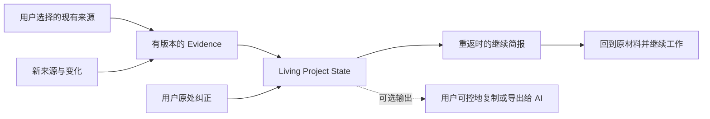

# Project Continuity

## 最终产品需求文档

> 当前状态：**历史产品方向，已不是产品定义入口**  
> Canonical 产品定义：`AI-native-个人知识库-终局产品设计文档-v4.0.md`；本文仅保留 Project Continuity 决策来源，冲突时以 v4.0 为准  

> 文档性质：单一终局产品定义，不是阶段版本、功能愿望清单或融资叙事  
> 研究基线：2026-08-05  
> 首要平台：macOS  
> 产品类别：AI-native Project Continuity / 项目连续性工具  
> 外部品牌名：待命名；`Project Continuity` 是类别与工作名，不主张品牌占位  
> 核心对象：Living Project State / 持续更新的项目当前状态  
> 英雄体验：Continue / 回来即继续  

---

## 阅读说明

这份文档回答的不是“还能加什么”，而是以下六个更根本的问题：

1. 这个产品本质上应该是什么；
2. 为什么它不是 Personal Cognitive OS、Notion 替代品或另一种知识库；
3. AI 应该在哪些地方成为产品结构，哪些地方必须克制；
4. 哪一组能力必须一起成立，才能构成一个完整而非半成品的产品；
5. 用户究竟会看到什么、如何理解、如何继续工作、如何纠错；
6. 用什么证据判断它是一个真产品，而不是一份漂亮的概念。

### 决策标签

| 标签 | 含义 |
|---|---|
| **[产品决定]** | 本文对完整产品做出的明确选择；除非出现反证，不作为开放讨论项 |
| **[外部事实]** | 可由论文、官方产品资料或平台资料核验 |
| **[产品假设]** | 当前最合理但尚未被本产品用户数据证明的判断 |
| **[质量门槛]** | 产品对外发布前必须满足的结果，不代表当前已经达到 |
| **[开放验证]** | 不影响产品定义，但必须通过研究或基准确定具体数值 |

“最终”指产品合同、概念模型和交互闭环一次定义完整；它不意味着所有市场假设已经成为事实，也不意味着可以跳过验证。

---

# 0. 执行决策

## 0.1 最终判断

**[产品决定] 不再把产品定义为 Personal Cognitive OS。**

`OS` 是一个过重、失真的外部承诺。它天然让用户期待：理解完整人生、默认看见所有应用、长期记住一切、跨应用主动行动、拥有平台级权限与生态。当前真正值得做、也可能做好的价值远比这更窄、更具体：

> **让一个长期项目在时间与工具之间不断线。**

若交付 EXT-02，这份连续性还可以由用户主动带入新的 AI 会话；它不是核心产品成立的前提。

产品不保存“一个人的全部认知”，而是从用户明确选择的工作来源中，持续维护一个项目此刻仍然有效的状态；当用户回来时，立即交还可恢复的最近工作位置、有效决定、未闭环、关键变化，以及可执行的下一步或明确未知，并允许用户追溯与纠正。若交付 `SUP-01`，用户确认的停驻点可提高脑内状态的恢复质量，但不是核心成立的前提。

因此：

| 层次 | 唯一核心 |
|---|---|
| 数据单位 | Evidence / 有定位与版本的证据 |
| 产品单位 | Living Project State / 持续更新的项目状态 |
| 交互单位 | Re-entry / 重新进入项目 |
| 价值单位 | 从返回项目到开始正确行动的时间 |
| 学习单位 | 用户纠正及其后续传播 |

最短产品判断：

> **知识库保存“有什么”；本产品维护“这件事现在是什么状态”。**

## 0.2 一句话定义

> **一款运行在用户现有工作工具之上的 Mac 应用：它从用户选择的文件、沟通与会议资料中持续维护一份有来源、会修订的项目当前状态，让用户回来时不必重新读一遍，就能知道上次做到哪里、什么变了、哪些判断仍有效、现在从哪里继续。**

对用户更短的表达：

> **回来，马上接着做。**

英文心智：

> **Never lose the thread of a project.**

## 0.3 它是什么，不是什么

| 它是 | 它不是 |
|---|---|
| 项目连续性工具 | 个人操作系统 |
| 自动维护的项目当前状态 | 另一个知识库或第二大脑 |
| 原工作工具之上的状态层 | Notion、Obsidian 或文件管理器替代品 |
| 回到正确行动的入口 | 项目计划、任务管理或团队协作工具 |
| 有证据、能修订、可纠错的 AI 产物 | 把摘要写得更漂亮的聊天机器人 |
| 若交付 EXT-02，可为人和用户选择的 AI 导出同一份可信上下文 | 通用 Agent、自动发信或跨应用执行平台 |
| 用户主动选择来源的本地专业工具 | 默认截图、录音并记录一切的桌面录像机 |

判断产品是否正在变质，只需问一句：

> 这项功能是在缩短“回来后开始正确行动”的距离，还是在建设另一个需要用户管理的内容世界？

若答案是后者，默认不做。

## 0.4 完整产品合同

**[产品决定] 一个可售、完整的产品必须同时兑现以下合同：**

1. 用户不迁移内容、不搭页面、不维护标签数据库，也能获得核心价值；
2. 用户为项目选择真实来源后，系统持续维护目标、有效决定、未闭环、阻塞、变化和下一步候选；
3. 用户重新进入项目时，不必先打开本产品寻找信息，系统即可在克制的入口准备好一份 `继续简报`；
4. 简报不是活动摘要，而是当前可行动状态；
5. 每个重要对象都能看到来源、时间与适用范围；Claim 另有权威，Suggestion 与 Transition 显示各自类型和提交状态；
6. 新资料不会静默覆盖旧决定；系统必须区分更新、撤回、细化、范围差异和未解决冲突；
7. 用户可在错误出现的位置纠正；纠正立即重算、可撤销，并阻止同类错误复发；
8. 资料不足、解析失败、状态过时或项目识别不确定时，系统明确承认，不补写一个看似完整的答案；
9. 主动作是 `继续`，把用户送回正确的原应用、文件和尽可能精确的位置。

这九条共同构成可售产品。缺少其中任何一条，都可能退化为文件搜索、AI 摘要、手工日志或通知插件。停驻点、项目候选、AI Context Pack、Scoped Find 与原生邮件/日历适配是有界 `SUP/EXT`；它们能增强工作流，但不伪装成核心成立的必要条件。



## 0.5 产品力终审

### 当前概念判断

| 维度 | 审计判断 | 说明 |
|---|---|---|
| 问题真实度 | **有研究与替代行为支持** | 中断恢复有认知研究依据，也存在手工日志和停驻说明 |
| 价值清晰度 | **强** | “回来即继续”比“管理认知”更具体、可演示、可度量 |
| 差异化 | **有条件** | Resume 已有直接竞品；差异取决于长期状态修订、来源和纠正质量 |
| AI-native 合理性 | **强** | 没有 AI，用户必须手工维护 Project State，核心体验会消失 |
| 交互潜力 | **强** | 零查询准备、原处纠错、回到原工作现场具有明确产品品味 |
| 技术与信任 | **高风险** | 跨来源覆盖、权威、严重错误与精确定位都很难 |
| 使用频率与商业性 | **未验证** | 必须证明真实重返频率、净收益和付费意愿 |
| 平台防守力 | **中等** | 平台拥有广义 Context；本产品只能靠项目状态纵深防守 |

**结论：有条件 GO。** 收敛后的产品有形成高品质专业工具的潜力；原先的 OS 方向会稀释它。此处不使用一个看似精确的总分，因为技术正确性、使用频率与付费意愿尚未实证。能否成为强产品只取决于三项实证：

1. 用户是否足够频繁地需要恢复；
2. 简报是否比“最近文件 + 搜索 + 自己写一句日志”的强基线更快、更准；
3. 一次严重状态错误是否会摧毁长期信任。

如果这三项不能成立，增加聊天、搜索、捕获、Agent 或通知都不能救产品。

## 0.6 北极星与反指标

北极星不是“记住多少”，而是：

> **Validated Re-entry Success（经验证的项目重返成功）**：用户回到一个中断项目后，在没有重读全部资料的情况下，于研究预注册的任务时间窗内进入正确材料或执行正确下一步，并确认简报中的关键状态没有误导。

核心价值公式：

```text
净连续性收益 = 节省的恢复时间 - 接入、权限维护、来源管理与纠正成本
```

频率与信任决定这项净收益能否累积为长期产品价值；这不是模型评分公式。

**反指标：**

- 不最大化用户在本产品内的停留时长；
- 不最大化导入量、记忆数量、AI 生成字数、提问次数或通知点击；
- 不用“创建了很多内容”证明智能；
- 不用频繁打扰制造使用频次。

一个有品味的成功状态是：**用户打开它更少，继续工作更快，却在换电脑时舍不得失去它。**

---

# 1. 问题、用户与任务

## 1.1 真正的问题不是找不到文件

长期项目通常散落在文档、表格、演示、邮件、会议记录、网页和 AI 对话里。现有工具已经能解决相当一部分“在哪里”问题；更难的是回来时重新回答：

- 我上次到底做到哪里；
- 哪个方案后来被否掉了；
- 哪个决定仍然有效，适用于什么范围；
- 离开期间哪些资料发生了变化；
- 哪些问题还没有闭环；
- 我现在最应该打开什么，从哪一处继续。

最近文件只能说明“碰过什么”；搜索要求用户先想起关键词；摘要往往压平时间与冲突；任务列表记录待办，却不保存为什么；聊天历史保存对话，却不保证状态仍然有效。

**[外部事实]** 对真实计算工作的研究表明，任务中断后的恢复包含重新建立目标和任务状态，而不只是重新打开窗口。[Iqbal & Horvitz, CHI 2007](https://www.microsoft.com/en-us/research/publication/disruption-recovery-computing-tasks-field-study-analysis-directions/)

产品因此不优化“更多召回”，而优化“正确恢复”。

## 1.2 问题的最小单位：一次 Re-entry

一次有效的项目重返至少包含五个判断：

1. **身份**：我正在回到哪个项目或工作分支；
2. **停驻**：我离开时的目标、进度和下一步是什么；
3. **有效性**：哪些旧决定仍有效，哪些已经过时；
4. **变化**：离开期间什么发生了实质变化；
5. **入口**：现在最小、最正确的下一步是什么，应该从哪里打开。

普通知识库把这些信息当作需要搜索的内容；本产品把它们维护成一个可直接使用的状态。

## 1.3 首要用户

**[产品假设] 首要用户：**

> 每周多次回到被中断的高价值客户交付，离开期间常有新资料进入，使用过时决定会造成返工或专业风险的独立顾问、自由职业项目负责人和小型专业工作室负责人。

首要购买时刻不是“我有很多项目”，而是：

> **我离开一个客户交付后回来，期间资料变了；我需要先确认什么仍有效，再准确回到工作位置。**

典型特征：

- 每个项目持续两周到数月；
- 每周多次发生真实重返，而不只是短暂切窗口；
- 离开期间会有文件、邮件或会议信息改变项目状态；
- 项目交付价值高，恢复错误比工具费用贵；
- 主要在 Mac 上独立完成判断与交付；
- 不希望把客户资料迁入新 Workspace；
- 已经用文件夹、浏览器标签、邮件星标、TODO、会议摘要或一句 handoff 自救；
- 可能在 ChatGPT、Claude、Codex 等 AI 工具中反复解释项目背景；这是 EXT-02 的机会信号，不是首要用户成立条件。

项目数量只是筛选信号，不是定义。选择这个人群是因为其恢复频率、变化密度、过时决定成本、来源组合与付费动机相对集中。

## 1.4 次要用户

- 同时推进多个研究主题的研究者与分析师；
- 长周期写作、课程、咨询提案或创意制作的独立创作者；
- 负责多个并行项目、但主要个人使用的产品与设计负责人；
- 需要跨 AI 会话维持项目背景的高级知识工作者（仅 EXT-02 对应次要场景）。

次要用户不得反向决定首要产品 IA。产品不因为研究者需要关系探索就增加知识图谱，也不因为产品经理需要排期就增加任务系统。

## 1.5 非目标用户

- 只需要保存零散灵感、日记或阅读笔记的人；
- 以团队协作、审批、排期、看板为核心需求的组织；
- 主要问题是文件全文检索或文献问答的人；
- 希望 AI 自动发邮件、创建日历、付款或发布内容的人；
- 希望记录屏幕与完整人生历史的人；
- 只推进一个短任务、几乎没有恢复成本的人；
- 开发者项目恢复是唯一需求的人：IDE、Git、Claude Code 等已有更低摩擦替代。

## 1.6 核心 Jobs to Be Done

### 功能任务

> 当我在几小时、几天或几周后重新进入一个项目时，我希望无需重新翻阅全部资料，就能恢复仍然有效的工作状态，并从正确位置继续。

### 判断任务

> 当新资料与旧结论冲突时，我希望知道到底是现实变了、旧理解错了、适用范围不同，还是问题尚未解决，而不是被一段新摘要静默改写历史。

### 信任任务

> 当 AI 告诉我“这是当前决定”时，我希望立即知道它依据什么、何时成立、是否有缺口，并能在原处纠正。

### 情绪任务

> 当我回到一个久未推进的项目时，我希望从“我得重新把一切想起来”的压力，变成“我知道从这里继续”的确定感。

### AI 协作任务

> 若产品交付 EXT-02：当我把项目带入新的 AI 会话时，我希望提供一份当前、可引用、已吸收纠正的上下文，而不是每次重新拼 Prompt。

## 1.7 当前替代与必须超越的基线

| 替代方案 | 做得好的地方 | 连续性缺口 |
|---|---|---|
| 最近文件、窗口和浏览器标签 | 零学习成本，保留局部现场 | 不知道目标、决定、变化和下一步 |
| README、CONTINUE.md、工作日志 | 精确记录用户当时理解，便携透明 | 依赖手写；离开期间不会更新；跨来源弱 |
| TODO / 项目管理工具 | 明确待办、负责人、截止时间 | 不保存状态理由、决定有效性和原始证据 |
| 文件搜索 / Spotlight | 找具体资料快 | 必须记得关键词；结果不是当前状态 |
| Notion / Obsidian / PKM | 组织、连接、编辑自由 | 要迁移和维护；很容易产生整理债务 |
| ChatGPT / Claude 项目与记忆 | 对话内连续性强、问答自然 | 依赖会话与提供的来源；长期状态修订和跨工具权威有限 |
| 会议 AI / Granola | 从会议中提取状态和后续 | 视角受会议来源限制 |
| 系统 Recall / activity history | 找回曾看过的界面与活动 | 活动不是项目状态；权威与修订语义弱 |

**强基线不是“没有产品”，而是：最近文件 + 搜索 + 用户自己写的一句停驻说明。** 任何评测都必须与它比较。

## 1.8 尚未被证明的关键假设

1. 首要用户每周发生足够多、且足够痛的项目重返；
2. 真实下一步有足够比例能从来源、近期操作与可选停驻点中恢复；
3. 用户愿意连接足够来源，而不产生新的配置负担；
4. 自动状态维护节省的劳动大于纠正 AI 所增加的劳动；
5. 本地专业工具的付费意愿足以覆盖解析、模型与适配维护成本；
6. 纵深的时间、权威与纠错体验，能抵御平台把“项目摘要”做成系统功能。

这些是假设，不应被营销语言掩盖。

---

# 2. 市场、竞争与战略位置

## 2.1 2026 年的竞争现实

这个市场不是空白，且“AI 总结项目”“记住上下文”“回来继续”都不再是独占概念。

- [Notion Enterprise Search](https://www.notion.com/product/enterprise-search) 已能跨工作区和连接来源搜索、引用答案并从散落信息生成项目更新；[Notion Agents](https://www.notion.com/product/agents) 继续把工作区推进到可执行 AI。
- [ChatGPT Projects](https://help.openai.com/en/articles/10169521-chatgpt-projects) 已以项目内记忆维持对话连续性。
- [ContextOS](https://www.contextos.tools/features) 直接提供项目记忆与一键 briefing，覆盖“在哪里停下、为什么、阻塞、决定、下一步”。
- [Mem Agent](https://get-v2.mem.ai/features/agent) 公开强调对用户正在兼顾事项的动态模型与适时提示；其项目能力也覆盖 open loops、决定与历史。
- [Granola Briefs](https://www.granola.ai/blog/briefs-prepare-you-for-your-next-meeting-as-you-join) 会在会议前从历史资料生成有来源的简报；Granola Chat 已能回答项目状态、当前问题和下一步。
- [NotebookLM](https://support.google.com/notebooklm/answer/16179559?hl=en) 已建立成熟的来源引用与回到原文体验。
- [Microsoft Recall](https://learn.microsoft.com/en-us/windows/apps/develop/windows-integration/recall/) 以本地活动快照、时间线和语义检索帮助用户找回曾经做过的事情。
- Apple 在 2026 年公开的 [Siri AI](https://www.apple.com/newsroom/2026/06/apple-introduces-siri-ai-a-profoundly-more-capable-and-personal-assistant/) 已把 personal context、onscreen awareness 与跨应用动作定义为系统能力方向。

**战略推论：**

1. “OS / personal context assistant” 是平台拥有天然分发优势的战场，不应进入；
2. “项目摘要”“Ask AI”“语义搜索”“自动整理”均已商品化，不能作为差异化；
3. `Resume` 是英雄交互，但不是护城河；
4. 唯一值得纵深建设的空位，是**跨异构来源、自动维护、能解释状态变化、可通过纠正长期变准的 Project State**。

### 对产品初心的修正

“现在的知识库都大同小异”只能作为观察起点，不能作为创立产品的充分理由。当前产品在对象模型、编辑、协作、搜索、会议、Agent 和系统集成上并不相同，而且都在快速吸收 AI。真正共同的限制是：它们大多仍以内容、会话或活动为主要单位，需要用户进入某个容器再搜索、整理或提问；**项目跨时间后哪些状态仍有效**通常不是被持续维护的首要合同。

因此，本产品不是因为 Notion“不够好”而成立，而是因为“存储与检索”即使做得很好，也不自动等于“持续维护可行动状态”。如果竞品真正把后者做到同等深度，本产品的差异就应被视为消失，而不是继续重复“我们不是知识库”。

## 2.2 竞争类别

| 类别 | 代表 | 用户为什么选它 | 本产品不可硬碰的优势 | 仍未充分解决的缝隙 |
|---|---|---|---|---|
| 工作区/知识库 | Notion、Tana、Capacities、Mem、Fabric | 把内容、协作和 AI 放进统一空间 | 内容编辑、生态、协作、广度 | 不迁移前提下的状态维护；跨时间修订 |
| 来源问答 | NotebookLM、DEVONthink AI | 对一组资料进行可信检索和问答 | 引用、搜索、已有资料库 | 自动重返；当前有效状态；停驻与变化 |
| 会议记忆 | Granola 等 | 会前会后连续、自动会议记录 | 会议数据纵深与自然触发 | 文件、邮件、AI 对话等非会议来源 |
| 会话/项目记忆 | ChatGPT Projects、Claude 项目能力 | 在同一 AI 环境里延续对话 | 模型入口与分发 | 核心维护原应用状态；若交付 EXT-02，再提供跨 AI 的一致快照 |
| 活动记忆/系统助手 | Recall、Siri AI | 系统级 Context 和低摩擦找回 | 权限、分发、跨应用可见性 | 项目权威、状态语义、纠正约束 |
| 项目恢复 | ContextOS、CONTINUE.md、工作日志 | 直接记录停驻、决定与下一步 | 简单、便宜、明确 | 自动维护、异构来源、版本冲突与长期纠正 |

## 2.3 与 Notion 的真实差异

不能用“Notion 没有 AI”或“知识库都只是静态文档”来定义本产品。那已经不符合市场现实。

| Notion 的产品合同 | 本产品的产品合同 |
|---|---|
| 把工作、知识和流程带入一个 Workspace | 保留现有工作工具，在其上方维护状态 |
| 用户建立页面、数据库、关系与流程 | 系统从自然工作中编译项目状态 |
| Workspace 是主要工作目的地 | 主 CTA 把用户送回原工作现场 |
| 广度覆盖文档、项目、协作、搜索与 Agent | 深度只覆盖重返、状态变化、证据与纠正 |
| 页面和数据库是主要真相载体 | 原始来源版本与用户权威是主要真相载体 |
| 更多组织结构通常带来更多价值 | 结构复杂度应尽量不让用户感知 |

本产品不是“反 Notion”，也不要求用户讨厌 Notion。一个用户完全可以在 Notion 工作，同时由本产品维护项目连续性。竞争边界是默认行为，不是文件格式。

## 2.4 真正的差异化楔子

### 不可再使用的口号

- AI-native knowledge base；
- local-first second brain；
- knows everything about you；
- all your knowledge in one place；
- smart project summary；
- context at the right time；
- personal OS for the AI era。

这些表达要么已商品化，要么承诺失控。

### 可防守的产品组合

1. **不迁移**：用户继续在原应用创作；产品不是内容目的地；
2. **自维护**：不是要求用户每次写 session log 才能工作；
3. **时间语义**：区分有效、过时、被替代、撤回、争议与已解决；
4. **来源邻接**：重要状态旁就是依据，不把解释藏在另一个审计后台；
5. **纠正传播**：一次纠正不是 feedback，而是以后必须遵守的约束；
6. **重返时刻**：用当前项目与来源 Context 做零查询准备，但不建设全人生画像；
7. **回到现场**：产品价值结束于正确原材料被打开，而非停留在自己的页面；
8. **人与 AI 共用**：同一份状态可被用户和其选择的 AI 读取，减少反复拼 Prompt。

任何单点都能被复制；组合质量、长期状态历史和纠正可靠性才可能形成个人级迁移成本。

## 2.5 竞争胜负条件

不使用没有用户数据的竞品打分。战略只保留可证伪的胜负条件：

| 对手/替代 | 它天然更强的地方 | 本产品必须证明的差异 | 证明失败意味着什么 |
|---|---|---|---|
| Notion 等 Workspace | 编辑、协作、生态、来源广度 | 不迁移也能持续维护当前有效状态，并更快回到现场 | 没有独立产品必要，最多是 Workspace 功能 |
| ContextOS / 手工 session log | 直接、简单地保存停驻和下一步 | 少维护仍能吸收新来源、保留修订与逐条依据 | 继续用 Markdown handoff 更合理 |
| Mem / Granola | 自然捕获、会议纵深、适时简报 | 跨文件与显式导入来源形成更可靠的项目状态 | 应收窄成某一来源垂直产品 |
| Recall / Siri / 系统助手 | 系统级 Context、权限与分发 | 对项目权威、作用域、冲突和纠正的语义深度 | 会被平台低摩擦吞并 |
| 最近文件 + 搜索 + 用户日志 | 零成本、透明、用户自己最懂 | Net Continuity Gain 为正，且严重错误可控 | 核心命题被反证 |

如果本产品无法在“自动维护、时间修订、来源、纠正”四项形成明显纵深，就没有独立存在的理由。

## 2.6 平台威胁与防守边界

Apple、Microsoft、Google 迟早会更好地识别当前应用、屏幕内容和个人 Context。本产品不和它们争“看见更多”，而争“把一个项目维护得更对”。

防守策略：

- 将平台 Context 当作可替换信号，不当作产品本体；
- 深入 Project State 的权威、版本、适用范围与纠正；
- 若交付 EXT-02，用用户触发的标准 Context Pack 让系统助手或外部 AI 使用状态，而不运行常驻控制接口；
- 不依赖某个模型、某个系统 API 或“本地”口号建立护城河；
- 用真实恢复任务评测，不用摘要偏好或模型基准自证。

---

# 3. 产品原则与边界

## 3.1 十条产品原则

### 原则 1：State over Storage

产品维护“当前是什么状态”，不建设“存了多少东西”。原始资料留在原处。

### 原则 2：Maintenance over Generation

生成一次漂亮摘要很容易；在新来源、矛盾和纠正后持续维护正确状态，才是产品。

### 原则 3：Evidence adjacent to claim

依据必须在重要判断旁一跳可达；不是深藏在调试页，也不是用“AI 生成”替代解释。

### 原则 4：AI is a compiler, not an authority

AI 把来源编译成候选状态；确定性系统管理身份、版本、状态转换和权限；用户与来源按作用域决定权威。

### 原则 5：Correction is product input

纠正不是点赞/点踩。它必须有作用域、影响预览、即时重算、撤销与回归约束。

### 原则 6：No review debt

AI 不确定性不能批量变成用户 Inbox。只有会改变当前行动的歧义才请求确认；其他不确定性保留并降低语气强度。

### 原则 7：Stable shell, adaptive content

界面结构稳定，内容根据项目状态自适应。AI 不临时发明页面、按钮、卡片类型或交互规则。

### 原则 8：Calm, zero-query re-entry

重返不应从空白搜索框或聊天框开始。系统先准备最小可用状态；用户主动展开深度。

### 原则 9：Return users to work

主动作打开正确的原应用和材料。产品成功时，用户不需要在本应用里逗留。

### 原则 10：Unknown is a valid answer

脑内状态、未接入来源、解析失败和真实冲突都可能导致未知。承认未知比补全一个合理故事更高级。

## 3.2 AI-native 的判定标准

如果移除 AI 后产品只是“速度慢一点”，它不是 AI-native；如果移除 AI 后用户必须自己维护 Project State，核心体验才真正依赖 AI。

AI 的合理渗透：

- 从自然产生的文件、邮件、会议和显式分享中提取状态候选；
- 识别决定、问题、阻塞、承诺、变化及其作用域；
- 比较新旧来源，提出 supersede、retract、refine、dispute 候选；
- 根据当前项目、来源中的最近工作状态、离开期间变化，以及已交付 `SUP-01` 时的用户停驻点生成继续简报；
- 在来源充分时提出下一步，在不足时保留未知；
- 理解自然语言纠正，并转成可执行约束；
- 若交付 EXT-02，按用户明确动作生成当前、有限、可引用的 Context Pack。

AI 不应渗透：

- 每个页面放聊天框；
- 自动创建大量笔记、任务或“记忆”；
- 猜测用户情绪、人格、人生目标、角色或注意力状态；
- 以生成摘要替代来源；
- 让模型决定权限、删除、文件身份或最终冲突；
- 未经确认发送、发布、支付、创建日程或修改外部系统；
- 通过全盘截图和持续录音获得默认 Context；
- 根据用户忽略而升级打扰强度。

## 3.3 完整产品能力边界

“终局完整”不等于把所有集成同时设成生死依赖。产品按价值责任分成三层；这是架构优先级，不是对用户出售半成品。

### A. 可售价值核心：缺一项就不成立

1. **Selected Sources**：从用户显式选择的现有资料开始，不要求迁移；
2. **Project Boundary**：维护稳定项目边界，允许来源多归属与必要的工作分支；
3. **Living Project State**：维护 Claim 与 Suggestion，而非一段最新摘要；
4. **Change & Conflict**：维护 Transition、冲突与新旧状态关系；
5. **Continuity Brief & Open Original**：重返时压缩当前状态，并把用户送回正确材料；
6. **Evidence, Freshness & Sufficiency**：每个重要陈述可追溯，并清楚说明数据截至何时、缺什么；
7. **Correction & Reconciliation**：原处纠正、区分用户 Override 与来源事实、可撤销且不复发；
8. **Menu-bar Continue**：稳定菜单栏入口，用户点击即得到当前或所选项目简报。

### B. 信任核心：横贯所有能力

- 权威与作用域；
- 来源版本与变化语义；
- 部分、过时、冲突、离线和失败状态；
- 确定性提交、纠正事务、撤销与回归；
- 本地模式、删除、导出与恢复；
- 无未授权外部副作用。

信任核心不是高级功能，也不能晚于任何面向用户的自动状态结论。

### C. 有界扩展面：可存在，但不定义核心是否成立

- `SUP-01` 一句可选 `留个停驻点`，用于补足脑内状态；
- `EXT-01` 当前项目检测候选与安静状态点；
- `EXT-02` 把当前简报复制/导出为带引用的 AI Context Pack；
- `EXT-03` 只定位现有对象、不综合回答的 Scoped Find；
- `EXT-04` 原生邮件/日历读取适配器。

扩展面必须服从同一状态与权限合同，不得变成 Connector 平台、全局感知层、聊天产品或外部 Agent。工程可以有实现顺序，但不能先发布“只有 Sources、Search 和 Review 的知识库”，再承诺未来补上真正体验。

## 3.4 永久非目标

以下能力不是隐藏路线图，也不是“以后再说”；它们不属于本产品合同：

- Personal Cognitive OS、第二大脑或完整人生记忆；
- Role / Life Context、情绪和 Friction 推断；
- 通用笔记编辑器、Block、数据库、Wiki 与模板市场；
- 项目排期、任务分派、团队 Workspace、审批与协作；
- 通用 Quick Capture Inbox；
- 默认连续截图、录音或记录一切；
- 全局 Review 待办箱；
- 知识图谱、关系地图或时间线作为主产品表面；
- 泛化的“所有事情在正确时机出现”；
- 邮件、日历、付款、发布等外部动作执行；
- Standing delegation、Agent 平台或插件市场；
- 手机端完整工作台；
- 以 Search 或 Chat 作为首页；
- 为制造频次而增加通知、Feed 或每日回顾。

未来若要进入任何一项，应作为新产品命题重新论证，不能通过功能膨胀偷偷进入。

## 3.5 来源范围决策

产品不是通用 Connector 平台，但必须覆盖首要用户完成项目连续性所需的来源束。

### 核心来源束

1. 用户选择的本地文件：PDF、DOCX、PPTX、XLSX、Markdown 与纯文本；
2. 用户选择的文件夹，作为后台增量范围而不是首次价值前置；
3. 用户通过 Share Extension、拖放或标准导出显式加入的邮件、会议纪要、网页、消息片段与 AI 对话；
4. 用户本人输入或确认的目标、停驻与纠正。

常见图片 OCR、原生邮箱范围与日历事件属于有界适配器。它们能提高状态充分性，但不能成为核心闭环成立的隐形前提。

### 来源原则

- 默认从少量代表来源开始，不自动扫描整块磁盘；
- 一个来源可以属于多个项目，且在不同项目中作用域不同；
- “已接入”不等于“已解析完整”；不得用一个无分母的笼统覆盖率表示完整性；
- 来源角色只是项目作用域内的权威提示：正式合同、已发送提案、个人草稿、会议转录不能只按更新时间排序；
- 产品允许用户只连接本地文件，但必须明确说明邮件或会议未覆盖，不能宣称项目完整；
- 接入新来源的唯一理由是提升当前状态完整度，而不是增加内容库存。

## 3.6 隐私与信任的取舍

本产品本地优先，但“本地”不是差异化核心，也不能成为正确性设计的替代品。

### Local-only 项目模式

- 用户明确选择项目来源范围；
- 来源访问默认只读；
- 本地完成索引、状态读取、简报、结构化纠正和导出；
- 原始资料、状态、索引、纠正和备份均不离开设备；
- 凭据与密钥使用系统 Keychain，备份加密且可完整恢复；
- 自然语言纠正在本地模型不可用时退化为结构化表单。

### Remote-assisted 项目模式

- 默认关闭，逐项目启用；
- 启用前展示提供商、实际发送字段/片段、用途、保留与训练政策；
- 默认只发送完成当前任务所需的最小片段，不发送整个来源库；
- 若交付 EXT-02，外部 AI Context Pack 默认只含状态摘要与引用元数据；原始证据逐次授权；
- 用户可撤销并查看本地删除结果；对提供商侧无法技术验证的残留必须明确说明；
- 远程能力失败时自动退回 Local-only 合同，不降低既有状态可用性。

### 两种模式共同要求

- 用户可暂停观察、移出项目、导出状态与删除派生数据；
- 删除、权限和外部副作用由确定性代码执行，不交给模型；
- 通知和系统级提示默认不展示敏感正文。

本文不建设复杂企业合规平台；但“可看见、可控制、可移除”是产品可信度，不是隐私装饰。

---

# 4. 用户概念模型

## 4.1 用户最多只需要理解五件事

| 用户词汇 | 用户理解 | 不需要理解的内部概念 |
|---|---|---|
| **项目** | 一件持续推进、有目标和边界的工作 | 聚类、实体解析、Context Graph |
| **现在** | 项目目前仍有效的目标、决定、未闭环和下一步 | Assertion Store、Truth Maintenance |
| **变化** | 自己离开后发生、或新证据揭示的重要改变 | diff pipeline、event taxonomy |
| **依据** | 这句话来自哪里、何时成立、是否完整 | Evidence Span ID、provenance graph |
| **留个停驻点**（仅交付 SUP-01 时） | 离开前保存“刚做到哪里/回来做什么” | Checkpoint object、session boundary |

`Continuity Brief` 在界面中叫“继续简报”或直接以 `继续` 为标题，不要求用户学习 Resume、Working Set、ContextFrame、Intervention 等系统术语。

## 4.2 Project 不是文件夹

项目是一个持续目标空间，不等于目录、客户、标签或某个应用中的 Workspace。

它包含：

- 名称与一句目标；
- 当前状态；
- 一个或多个可选工作分支；
- 用户选择或确认的来源；
- 重要状态变化；
- 纠正历史，以及交付 SUP-01 时的停驻点历史；
- 活跃、暂停、完成、归档四种生命周期状态。

必须支持：

- 同一文件属于多个项目；
- 同一项目横跨文件夹、邮件和会议；
- 项目改名不改变其身份；
- 项目边界纠正必须预览受影响 Claim、来源作用域和简报；
- 完成项目仍可恢复历史，但不再主动提示；
- 归档不等于删除。

## 4.3 Workstream / 工作分支

工作分支用于防止复杂项目被压成单一答案，例如“方案 A / 方案 B”“客户交付 / 内部研究”。

规则：

- 简单项目不显示 Workstream 概念；
- 只有系统检测到并行目标或用户明确创建时出现；
- 一个 Claim、Suggestion 或 Transition 可以属于项目整体或一个/多个分支；
- 不同分支的结论不得互相覆盖；
- 简报默认聚焦当前分支，并显式提醒其他仍活跃分支。

## 4.4 Claim、Suggestion 与 Transition

Project State 不再用一个 `State Item` 同时承载事实、建议和变化。它由三类对象组成：

### Claim / 当前主张

| 类型 | 回答的问题 | 示例 |
|---|---|---|
| **Goal / 目标** | 当前究竟要完成什么 | “在周五前交付客户可评审的定价方案” |
| **Decision / 决定** | 什么已经被明确选定 | “正式方案使用年度授权，不做免费版” |
| **Open Question / 未闭环** | 什么仍未知或待判断 | “客户是否接受按席位计费？” |
| **Blocker / 阻塞或风险** | 什么阻止继续或可能改变路径 | “缺最终成本模型，无法锁定价格” |
| **Commitment / 已存在承诺** | 谁已经承诺做什么 | “我承诺在周五前更新报价表” |

Commitment 只投影来源或用户已表达的承诺；产品不提供任务创建、分派、提醒或排期。

### Suggestion / 建议

`建议下一步` 是独立对象，不是 Claim 类型，也不是权威模式。它必须显式标为建议，可引用其依据，但不得伪装成 Decision、Commitment 或用户停驻点。

### Transition / 状态变化

变化是 Claim 之间的版本化关系或事件，例如替代、撤回、细化、范围不同、争议与解决。它不再同时作为当前 Claim 类型。用户看到的 `变化` 页面是这些 Transition 的可读投影。

活动记录、主题标签、人物档案和泛化事实不进入 Project State，除非它们直接影响继续工作。

## 4.5 Claim 的权威与生命周期必须分开

### Claim 权威模式

| 模式 | 含义 | 典型显示 |
|---|---|---|
| **用户拥有** | 用户对自身意图、停驻点或主观判断的明确声明 | “你确认” |
| **来源支持** | 有足以支持该表述的来源，且适用范围清楚 | “来自已发送提案” |
| **系统推断** | 模型从多条信号综合，但没有直接权威声明 | “系统推断” |

用户对“我打算做什么”权威最高，但不自动高于合同价格、法规或外部事实。权威按字段与作用域判断，不能使用一条全局排名粗暴覆盖。

权威是 Claim 的属性，不是所有对象的通用标签。Suggestion 显示对象类型 `建议`、依据与生命周期；Transition 显示变化类型、支持/反对证据、影响等级与 `candidate / committed / rejected` 提交状态。不得把“建议”伪装成第四种权威，也不得给 Transition 贴一个含义不清的权威标签。

### 生命周期

| 状态 | 含义 |
|---|---|
| **Active** | 当前适用 |
| **Disputed** | 存在未解决冲突 |
| **Stale** | 可能过时，缺少足够新证据 |
| **Superseded** | 被更新结论替代，历史仍保留 |
| **Retracted** | 原结论被明确撤回 |
| **Resolved** | 问题、阻塞或承诺已闭环 |

一个“用户拥有”的停驻点仍可能过时；一个“来源支持”的决定仍可能被撤回。两个维度不得合并为一个置信度标签。

## 4.6 SourceVersion / 来源版本

每条重要 Claim 必须绑定具体 `SourceVersion` 或版本化 `UserAssertion`，而不只绑定文件名或一段模型输出。外部事实若没有来源只能显示为推断；用户可以对自身目标、意图、停驻与纠正形成 UserAssertion。

最小要求：

- 稳定来源身份；
- 内容版本或可验证指纹；
- 原始位置与解析时间；
- 来源的默认角色提示；真正权威角色记录在“证据—Claim—项目作用域”关系上；
- 处理水位、语义充分性与定位能力；
- 删除、移动、重命名、不可访问状态；
- 可引用的 Evidence Span；
- 当前版本与历史版本的关系。

若文件移动，系统应找回同一来源；若内容改变，历史状态仍指向当时版本；若原版本不可恢复，必须显示“历史片段当前无法验证”，不能跳到一段相似的新文字冒充原证据。

## 4.7 Leave My Place / 停驻点

本节只在 `SUP-01` 通过对应 Gate 并交付时适用。停驻点是用户离开时对自身工作状态的短声明，不是表单，也不是必须完成的仪式；未交付时，核心简报依靠来源状态、最近可定位材料与明确未知完成重返。

它最多包含：

- `刚做到这里`；
- `回来先做这个`。

系统根据近期来源与操作生成一句草稿；用户可以直接确认、编辑或忽略。未经确认的草稿必须标为系统推断，不能在下一次简报中冒充“你上次说”。

## 4.8 Continuity Brief / 继续简报

继续简报不是新的持久内容对象，而是当前 Project State 在重返时刻的投影。

它按需包含：

1. 上次停在哪里；
2. 离开后什么变了；
3. 哪些决定仍有效；
4. 仍未闭环或仍在阻塞什么；
5. 建议从哪里继续；
6. 授权范围、处理水位、语义充分性与不确定性。

空区块自动省略。默认视觉只强调“上次、变化、下一步”；决定、未闭环与资料充分性按相关性展开，避免固定六段模板把轻项目写成报告。

## 4.9 Correction / 纠正

纠正是带作用域的确定性约束，至少记录：

- 用户纠正了哪一条状态；
- 错误类型：内容错、项目错、已过时、不相关、范围错、来源角色错；
- 正确内容或排除规则；
- 作用域：此状态、此来源、此项目、此实体关系或用户明确同意的更广范围；
- 受影响的简报、状态和历史；
- 应用时间、模型/规则版本；
- 撤销记录。

“用户点了不对”不等于模型得到一个模糊负反馈；产品必须让用户看到这次纠正会改变什么。

### 纠正与来源的协调模型

产品内纠正不能偷偷建立一套比原资料更“真实”的影子数据库。每个受纠正 Claim 同时记录两个正交维度，不能把“当前对齐谁”与“是否等待来源更新”混成一个枚举：

| 维度 | 值 | 含义与界面行为 |
|---|---|---|
| **alignment** | `source_backed` | 当前 Claim 与权威来源一致；正常显示来源支持 |
|  | `user_owned` | 内容属于用户自己的目标、意图或停驻；显示“你确认” |
|  | `user_override` | 用户明确覆盖系统/来源理解；若来源仍不同，显示“你的修正；原来源仍不同” |
| **source_sync** | `not_required` | 不需要改变外部来源，例如解析纠正或用户自己的意图 |
|  | `pending_update` | 外部事实/正式决定应在权威来源中更新；持续提示分歧并提供打开来源 |
|  | `reconciled` | 新 SourceVersion 已与修正一致；关闭分歧并保留协调历史 |

典型转换是：

| 事件 | 纠正后 | 后续触发 | 协调后 |
|---|---|---|---|
| 系统读错、原文已支持正确值 | `source_backed + not_required` | 无 | 保持 |
| 用户纠正自己的停驻或意图 | `user_owned + not_required` | 新 UserAssertionVersion | 按版本修订 |
| 用户更改合同价格，但权威提案仍为旧值 | `user_override + pending_update` | 新权威 SourceVersion 支持新值 | `source_backed + reconciled` |

用户对自己的意图和停驻可直接形成 UserAssertion；对合同价格、客户决定等外部事实，纠正只能先成为显式 `user_override + pending_update`，不能冒充 `source_backed`。产品只负责把用户送回权威来源，不代替用户写回。

外部事实 Override 不伪造第四种 Claim 权威，也不立刻生成一条“来源支持的新 Claim”。底层原 Claim 继续保留原 `authority_mode` 与来源；CorrectionConstraint + UserAssertionVersion 形成一个优先显示的纠正覆盖层，界面把有效表述标为 `你的修正，原来源仍不同`。只有新权威 SourceVersion 支持修正后，系统才生成/晋升新的 `source_supported` Claim、替代旧 Claim，并把覆盖层标为 reconciled。对用户自身意图的纠正则可直接生成 `user_owned` Claim。

---

# 5. 产品形态与信息架构

## 5.1 一个产品，三种表面

产品不是一个需要每天管理的“大后台”。同一份 Project State 只通过三种稳定表面出现：

1. **Menu-bar Continue / 菜单栏继续入口**  
   菜单栏常驻一个图标；用户点击后打开唯一的继续弹窗。它不在菜单栏长期占用项目名，也不创建自动侧栏或悬浮条。

2. **Project State / 项目状态主应用**  
   当用户需要深入时，查看现在、变化、依据和来源健康。它不是自由搭建的项目主页。

3. **Control / 数据与控制面**  
   管理来源范围、解析健康、模型、导出、暂停和删除；仅显示已交付扩展的项目候选或导出控制。它不是日常内容目的地。

所有表面使用同一套对象、文案和状态。不得出现菜单栏叫 Resume、主应用叫 Working Set、另一处又叫 Context Card 的多重命名。

### 表面规范映射

| 能力 | 收起态 | 展开态 | 用户文案 | 是否自动抢焦点 |
|---|---|---|---|---|
| 菜单栏继续 | 通用图标；可选“所选项目有更新”状态点 | 用户点击后的继续弹窗 | `继续` | 从不 |
| 主应用继续 | 侧栏 `继续` | 单列继续视图 | `继续` | 不适用 |
| 依据 | 对象旁常驻来源与对象特有标签 | 锚定该对象的依据抽屉 | `查看依据` | 从不；关闭后回原对象 |
| 项目候选（仅 EXT-01） | 单独授权后可形成候选状态点 | 菜单栏弹窗内候选行/项目选择列表 | `检测到可能的项目` | 从不 |

本文后续统一使用 `菜单栏图标`、`继续弹窗`、`继续视图` 和 `依据抽屉`，不再使用 Continue Strip、轻量侧栏或自动浮条。

## 5.2 主应用信息架构

### 一级位置

| 位置 | 用户意图 | 默认内容 |
|---|---|---|
| **继续** | 我现在要接着做 | 用户已选择项目的一份继续简报；高影响变化嵌入简报 |
| **项目** | 我要切换或深入一个项目 | 活跃、暂停、完成项目；进入后看现在、变化、来源 |
| **数据与设置** | 我要控制系统看什么、是否正常 | 来源健康、连接范围、模型、导出与删除；仅显示已交付扩展的控制 |

`数据与设置` 固定在侧栏底部，不与日常入口竞争视觉层级。

### 全局入口

- `⌘K`：切换项目、找状态/证据、打开来源；若交付 SUP-01，再出现 `留个停驻点`；
- 菜单栏：核心始终可打开继续弹窗、切换项目；若交付 EXT-01，再显示检测候选与暂停检测；
- Share Extension：把当前文件、网页、邮件或文本片段加入某项目；
- 若交付 EXT-02，才出现 `复制 AI 上下文`：导出用户明确选择项目的当前简报与引用；

### 明确不存在的一级页面

- Search；
- Sources；
- Review；
- Capture；
- Graph；
- Timeline；
- Chat；
- Agent。

它们中的必要能力以命令、抽屉或项目内视图存在，不形成新的产品重心。

## 5.3 Project Detail 信息架构

项目详情只有三个稳定标签：

### 现在

- 当前目标；
- 上次停驻；
- 仍有效决定；
- 未闭环与阻塞；
- 下一步或明确未知；
- 一键回到原材料。

### 变化

- 相对上次重返后的重要变化；
- 被替代、撤回、细化或争议中的状态；
- 用户纠正与其影响；
- 可按时间和工作分支查看历史。

### 来源

- 该项目已连接的来源束；
- 每类来源的授权范围、处理水位、最近更新、解析失败和权限状态；
- 添加、移出、重新定位和改变来源角色；
- 不提供通用资料浏览器或文件组织功能。

详细历史通过 `变化` 或 Claim/Transition 的 `依据` 展开，不再单独增加 History 标签。

项目内 `来源` 是添加、移出、重新定位、改项目作用域与修复来源的唯一操作位置。全局 `数据健康` 只聚合异常并深链回对应项目；`设置` 只负责偏好、模式、导出、删除与高风险控制，三者不重复编辑同一来源。

## 5.4 项目候选检测规则

本节仅在 `EXT-01` 通过 Gate 并交付时适用；未交付时，菜单栏仍提供通用 Continue 和手动切换，但不显示候选、状态点或相关设置。产品只检测“当前可能正在进入哪个已连接项目”，不推断完整人生或情绪状态。必须区分：

- **Selected Project**：用户明确选择或固定，决定当前继续简报与导出内容；
- **Detected Candidate**：系统根据当前来源提出，只能建议切换，不能静默成为 Selected Project。

### 信号优先级

1. 用户显式固定的当前项目；
2. 当前前台打开的已连接来源；
3. 用户刚从项目简报打开的来源；
4. 最近稳定使用的一组项目来源；
5. 日历事件与已连接项目的明确关系；
6. 模型提出但未确认的语义相似候选。

### 行为规则

- 显式选择永远优先于模型猜测；
- 高置信候选只能在继续弹窗内显示“检测到可能的项目”，不能静默改写当前项目；
- 两个项目接近时显示可选项，不默选；
- 当前来源同时属于多个项目时，保留 Selected Project 或询问，不沿用模糊推断；
- 用户切错项目后可一键纠正，纠正成为之后的确定性约束；
- 菜单栏从不自动展开，也不在系统通知中显示正文；屏幕共享检测只能作为额外静默信号，不能充当安全保证；
- 用户可按应用、项目或全局暂停候选检测。

## 5.5 响应式产品结构

产品采用**稳定壳层、渐进展开**，不采用 AI 临时生成界面。

- 宽窗口：左侧窄导航 + 单主列；依据以右侧抽屉覆盖展开；
- 分屏或窄窗口：隐藏导航，依据成为全屏 sheet；
- 默认不同时常驻三列；
- 主列控制阅读宽度，避免简报横向摊成 Dashboard；
- 空状态、部分数据、冲突、离线和解析失败使用同一布局，只改变内容与动作；
- 动态省略空区块，但区块语义顺序保持稳定。

---

# 6. 核心界面规格

## 6.1 首次进入：先证明一次继续价值

### 目标

用户在理解最少概念的前提下，从 1–3 份代表性本地资料获得第一份可追溯的部分状态；完整索引在后台继续。

`60 秒`只适用于发布基准 fixture：完成文件选择与授权后开始计时，输入为 1–3 份可直接读取文本的 PDF/DOCX/PPTX/Markdown、合计不超过 150 页且无需 OCR，在基准 Apple Silicon 16 GB 设备上达到 p50 ≤ 60 秒、p95 ≤ 120 秒。任意文件夹、OCR、邮箱和日历不适用该承诺。

首个可用状态至少满足：出现一个有支持依据的 Goal 或明确未知，并出现至少一个 Decision/Open Question/Blocker/Commitment 候选；否则只显示资料不足，不把空模板算成功。

### 首次价值流程

1. **一句价值说明**  
   标题：`不用重新读一遍，回来就能接着做。`  
   说明：`选择一个正在推进的项目和几份代表资料。我们会整理当前状态，并且每句话都能回到原文。`

2. **命名项目**  
   系统可建议名称，但不先扫描全盘“自动发现你的人生项目”。

3. **选择 1–3 份代表本地资料**  
   支持拖入或选择文件；文件夹在第一份状态出现后再按需添加；邮件/日历适配器仅在 EXT-04 已交付时出现。

4. **快速编译**  
   优先解析最能形成目标、决定、未闭环和下一步的来源；展示真实进度与缺口。

5. **第一份 `现在`**  
   系统最多提出三项会改变下一步的高影响纠正；用户可全部跳过。低影响不确定项不形成 Review 清单。

6. **进入工作**  
   主按钮写明目的地，例如 `打开定价方案第 8 页`；后台继续补充索引，不阻塞。

7. **选择菜单栏状态能力**  
   第一份价值兑现后，产品提供默认关闭的 `显示所选项目更新状态`，只根据 Selected Project 已连接来源的后台更新形成安静状态点。仅当 EXT-01 已交付时，才另行提供独立的 `检测可能项目` 开关，观察前台已连接来源并提出 Detected Candidate。两者都不自动展开正文，用户可分别跳过、暂停或关闭。

### 首次进入禁止事项

- 六页权限教学；
- 模型选择作为首次使用前置；
- 强迫导入全部资料；
- 首屏展示知识图谱、记忆数量或 AI 工作日志；
- 在第一份简报前要求用户确认大量项目候选；
- 用假进度掩盖解析失败。

### 首次使用失败状态

| 情况 | 正确表现 | 主动作 |
|---|---|---|
| 来源太少 | “目前只能确认目标，下一步仍未知” | 添加一份代表资料 / 先继续 |
| 来源过大 | 先生成部分状态，明确处理水位与语义缺口 | 后台继续 |
| 文件不可解析 | 显示文件名、原因和对简报的影响 | 重新选择 / 以文本加入 |
| 没有明确项目边界 | 请用户命名目标，不自动创建多个项目 | 确认项目 |
| 资料互相冲突 | 展示冲突，不强迫首次使用时全部解决 | 暂时保留 |
| 模型不可用 | 创建空项目与来源索引；已有项目仍可读，结构化纠正可用 | 打开原资料 / 使用结构化纠正 |

## 6.2 `继续` 首页

### 页面目标

回答一个问题：**我现在从哪里继续？**

### 默认结构

1. 当前项目选择器；
2. 项目 `as of`、处理水位与语义充分性；
3. 一张继续简报；
4. 会改变下一步的未解决变化直接成为简报内唯一判断模块；否则只作为普通变化信息；
5. 写明目的地的主按钮，例如 `打开定价方案第 8 页`；
6. 次动作 `切换项目`；若交付 SUP-01，再出现 `留个停驻点`。依据只从具体陈述旁的 `查看依据` 进入。

若未解决的 High/Critical Transition 使下一步不可靠，页面进入 `先判断变化` 模式：该变化是唯一主模块，主 CTA 变为 `判断这个变化`，目的地 CTA 暂不作为主动作。用户解决、保留争议或明确选择“带着争议继续”后，才恢复写明目的地的 CTA。

### 明确不展示

- 项目数量、文件数量、记忆数量；
- Feed、每日回顾和红点待办；
- 最近捕获；
- 通用问答框；
- 大量推荐；
- 全局 Review；
- AI “为你完成了多少工作”。

### 状态优先级

1. 用户显式选择或固定的项目；
2. 最近主动选择的活跃项目；
3. 无 Selected Project 时，显示活跃项目与检测候选供用户选择，不猜一个。

## 6.3 继续简报

### 默认视觉内容

```text
客户定价方案
截至 8 月 5 日 14:20 · 3 份来源已更新，1 份仍在检查

你上次停在：已完成成本模型，正在把三档方案收敛为两档。 [你确认] [查看这句依据]

离开后有 1 个重要变化
客户把评审从 8 月 12 日提前到了 8 月 9 日。 [客户邮件] [查看这句依据]

建议从这里继续
更新“定价方案.pptx”第 8 页的交付日期。 [系统建议] [查看这句依据]

[打开定价方案第 8 页]
```

### 内容规则

- 标题使用项目名，不使用“AI Resume”；
- 若交付 SUP-01 且存在用户确认停驻点，第一行优先采用它；否则使用来源支持的最近工作状态、系统推断或明确未知；
- “变化”只显示会改变理解或下一步的变化；
- “现在先做”若为建议，必须标 `建议`，若来源不足则写 `下一步尚不确定`；
- 仍有效决定与未闭环默认折叠在简报下部，仅在影响当前行动时提升；
- 每个关键陈述是独立可聚焦语义组，常驻简短来源和对象特有标签（Claim 权威 / Suggestion 建议 / Transition 变化与提交状态），并提供带陈述名称的 `查看依据`；悬停只增强，不是唯一入口；
- 卡片顶部显示 `as of` 时间、来源处理水位与待处理变化；资料不全时直接显示缺口，而不是在脚注免责；
- 同一屏只允许一个主 CTA；
- 主 CTA 只在目标可解析时出现；仅在外部应用确认打开成功后，本产品才退到后台。

### 更新触发

- 用户主动打开或选择项目；
- 用户选择检测到的项目候选（仅 EXT-01 已交付）；
- 连接来源发生稳定内容变化；
- 用户确认停驻点（仅 SUP-01 已交付）；
- 用户纠正状态；
- 授权范围、处理水位、语义充分性或权限发生实质变化。

短时重复打开不反复生成；系统使用同一 Project State 进行轻量投影。

## 6.4 项目列表

列表只用于选择，不变成项目管理看板。

每行显示：

- 项目名；
- 一句当前状态或下一步；
- `更新于…`；
- 高影响变化数量，最多显示 `1 项需要判断`，不制造大量红点；
- 来源处理/充分性异常图标；
- 活跃、暂停、完成状态。

排序默认：固定项目 → 最近明确重返 → 最近更新。用户可手动固定；AI 不根据“重要性”偷偷重排。

允许动作：打开、固定、暂停/恢复、完成、归档、删除。边界错误通过来源/Claim 重新归属修复，不提供项目管理式批量合并/拆分。删除必须明确区分“移除项目状态”与“删除原文件”；产品永不默认删除原文件。

## 6.5 项目 `现在`

### 页面结构

1. 一句目标；
2. 当前分支（仅多分支项目显示）；
3. 最近工作位置；若交付 SUP-01 且用户确认过停驻点，优先显示停驻点；
4. 决定；
5. 未闭环；
6. 阻塞与风险；
7. 承诺与建议下一步；
8. 授权范围、处理水位与语义缺口。

### Claim、Suggestion 与 Transition 交互

每个可见对象按其类型提供信息，而不是强塞一组通用元数据：

- Claim：权威标签、生命周期、适用范围、生效/观察时间与逐条 `查看依据`；
- Suggestion：`建议`类型、依据、适用范围、生命周期与逐条 `查看依据`；
- Transition：变化类型、影响、提交状态、新旧关系与逐条 `查看依据`；
- `不对`；
- 必要时 `确认`、`标记已解决` 或 `保留争议`。

页面不提供富文本编辑器。用户可以纠正状态，但不能把它改造成另一份项目文档。

## 6.6 `变化`

变化页回答：**这个项目如何变成现在这样？**

### 变化卡最小内容

- 变化结论；
- 变化类型；
- 旧状态与新状态；
- 为什么认为发生了变化；
- 影响哪些当前状态与下一步；
- 用户动作。

### 用户动作

- `采用更新`：新状态进入 Active，旧状态 Superseded；
- `原决定已撤回`：旧状态 Retracted；
- `只是范围不同`：保留两者并指定作用域；
- `暂时有冲突`：两者 Disputed，不选赢家；
- `判断错误`：进入纠正；
- `稍后`：保留但不重复打扰，直到新证据或用户打开变化页。

### 变化页禁止事项

- 以“最新文件”自动覆盖正式决定；
- 把文本改写误判为现实变化；
- 用单一时间线堆出全部文件活动；
- 每次小改动都制造变化卡。

## 6.7 `依据`抽屉

依据抽屉统一承载过去 `Why + Sources + History` 的日常需求。

### 首层

1. **来自哪里**：来源名、角色、版本与片段；
2. **何时与何种变化**：生效时间、观察时间、与旧状态关系；
3. **确定到什么程度**：共同显示处理水位、语义缺口、冲突或过时；Claim 再显示权威/生命周期，Suggestion 显示建议类型/生命周期，Transition 显示变化类型/影响/commit_state。

抽屉必须由某个具体 Claim、Suggestion 或 Transition 触发并锚定它。触发按钮包含可访问名称，例如 `查看“评审改到 8 月 9 日”的依据`；关闭后焦点回到原陈述。一个全局 `依据`按钮不能替代逐条入口。

### 展开层

- 支持该状态的多条证据；
- 反对或限制其作用域的证据；
- 系统的结构化推导：提取、比较、状态转换；
- 纠正与历史版本；
- 处理器、模型与解析版本仅在高级诊断中显示。

### 打开原文的降级顺序

1. 原应用 + 原文件 + 精确页/段/单元格/时间点；
2. 原应用 + 文件内搜索定位；
3. 打开原文件并高亮可用片段；
4. 展示缓存的历史证据片段并说明当前无法验证；
5. 只剩元数据时明确写“原位置不可用”。

绝不伪造精确定位。

## 6.8 原处纠正

### 首层纠正原因

- 内容不对；
- 属于另一个项目；
- 已经过时；
- 与当前项目无关；
- 适用范围不对；
- 来源角色判断不对。

### 纠正流程

1. 用户在错误状态旁点击 `不对`；
2. 选择原因，必要时用自然语言说明正确内容；
3. 系统显示影响预览，例如“将更新本项目 3 条状态和下一份继续简报，不影响其他项目”；
4. 用户应用；
5. 当前页面即时重算，焦点保持在替代后的对象并向辅助技术播报更新范围；
6. 纠正历史中持续提供撤销，不只显示瞬时 toast；
7. 该纠正进入回归约束，模型升级后也不得静默复发。

若系统无法安全确定作用域，只应用到当前状态并询问是否扩大，不能自行做全局重写。

`属于另一个项目` 必须进一步让用户选择：`从当前项目移出`、`移动到…` 或 `同时适用于…`。`Return` 只能执行安全的当前选择，不得直接提交跨项目传播、删除或高影响状态转换。

## 6.9 `留个停驻点`

本界面仅在 `SUP-01` 通过 Gate 并交付时存在。入口位于菜单栏、`⌘K` 和项目页，完成时间目标不超过 5 秒；未交付时不显示灰置入口、升级诱饵或缺失警告。

示例：

```text
留个停驻点
刚做到这里：成本模型已完成，正在收敛两档定价。
回来先做：更新提案第 8 页。

[保存]  [编辑]
```

系统草稿来自最近编辑、打开位置和当前状态；用户若直接关闭，不创建已确认停驻点。保存后仍可编辑或删除。

## 6.10 全局查找与命令框

`⌘K` 不是第二个聊天产品，而是统一动作入口。

核心命令层始终支持：

- 切换项目；
- 继续当前项目；
- 按项目名、来源名和精确关键词定位已有对象；
- 打开原文；
- 添加证据；

若 `EXT-03 Scoped Find` 通过对应 Gate 并交付，才增加自然语言短语与语义召回；它仍只返回已有 Claim、Suggestion、Transition 或来源定位，不生成答案。

若 `SUP-01 Leave My Place` 通过对应 Gate 并交付，命令框才增加 `留个停驻点`。

若 `EXT-01 Project Candidate` 通过对应 Gate 并交付，命令框才增加 `暂停项目候选检测`。

结果顺序：

1. 当前项目状态；
2. 其他项目状态；
3. 原始来源片段。

命令框不生成开放式综合回答。若 EXT-02 已交付，用户可从明确项目复制 Context Pack 到自己选择的 AI；否则核心不承诺跨 AI 会话输出。一次查找不会自动创建 Memory、任务、笔记、项目或新的 Project State。

## 6.11 菜单栏 `继续`

### 默认形态

- 菜单栏只显示通用图标，不常驻项目名；
- 用户开启 `显示所选项目更新状态` 后，Selected Project 有会改变下一步的重要变化时可显示安静状态点；该能力不观察前台应用；
- 若 EXT-01 已交付，用户另行开启 `检测可能项目` 后，Detected Candidate 可形成同样克制的候选状态点；该能力才观察前台已连接来源；
- 用户点击后出现继续弹窗：Selected Project 的上次、变化、下一步；
- 若 EXT-01 已交付且系统有 Detected Candidate，只显示 `可能在处理…`，用户选择后才切换；
- 主按钮写明并打开原工作材料；
- `切换项目`、`候选不对`、`暂停检测` 一步可达。

### 展示与焦点合同

- 弹窗只因用户点击或键盘命令展开，不自动抢焦点；
- 两种状态能力都需要在首次价值后分别明确开启；设置中不得用一个总开关替代；
- 同一通用状态点不显示敏感内容；用户点击后，弹窗明确说明它来自 `所选项目有更新` 或 `检测到可能项目`，不让两种语义混淆；
- 弹窗遵循当前 Space/全屏窗口的标准 macOS 菜单栏 popover 行为；
- 关闭后焦点回到用户原应用；
- 屏幕共享检测失败不改变安全性，因为系统从不自动展开正文。

## 6.12 数据与设置

### 数据健康

- 各项目的授权范围、处理水位与语义充分性；
- 最近成功索引；
- 解析失败、权限变化、文件移动与缺失；
- 用户可能需要但尚未授权的来源类型；
- 占用存储与重建状态。

### 控制

- `显示所选项目更新状态` 开关；
- `检测可能项目` 开关及其前台已连接来源观察说明（仅 EXT-01 已交付）；
- 按项目暂停；
- 本地/可选远程模型选择；
- Local-only / Remote-assisted 模式；
- 导出、重建、删除。

数据健康只聚合并深链到项目 `来源` 进行修复；设置不直接编辑来源，也不暴露“七维置信向量”“事件账本”等工程概念。

## 6.13 AI Context Pack

本界面仅在 `EXT-02` 通过 Gate 并交付时存在；未交付时不显示灰置按钮或升级诱饵。目的不是建设 Agent 平台，而是让用户以一次明确动作，把当前项目状态带入自己选择的 AI 会话。

### 输出内容

- 用户明确选择的 Project ID 与 `as of` 时间；
- 当前 Goal、Decision、Open Question、Blocker、Commitment；
- Suggestion 与 Transition，保持类型区分；
- 来源引用、处理水位、语义缺口和 User override；
- Markdown 与结构化 JSON 两种本地导出。

### 边界

- 每次由用户在本产品内触发复制或导出，不运行常驻服务器；
- 只导出 Selected Project，Detected Candidate 不能被导出；
- 默认只含状态摘要与引用元数据；原始证据片段逐次选择；
- 明确标记推断和建议；
- 不提供 `open_source`、send、publish、schedule、pay、delete 或任何工具动作；
- Context Pack 是导出快照，不会反向修改 Project State。

---

# 7. 端到端用户旅程

## 7.1 建立第一个项目

**情境：** 一名顾问刚开始一个持续六周的定价项目，资料已有提案、成本表、客户邮件和两次会议记录。

1. 用户创建项目并命名“Atlas 定价方案”；
2. 先选择提案、成本表与一份会议纪要三份本地资料；
3. 系统形成目标、两个决定、一个未闭环、一个阻塞和下一步候选，并清楚说明客户邮件尚未纳入；
4. 系统发现成本表是草稿、已发送提案是正式版本，因此不按修改时间让草稿覆盖提案；
5. 用户纠正一个客户名，预览显示只影响该项目；
6. 在首次价值 fixture 的时间目标内看到第一份继续简报；
7. 用户点击 `打开提案第 8 页` 回到工作；
8. 首次价值之后，用户再选择工作文件夹或通过 Share Extension 加入邮件，后台增量处理水位可见。

**成功条件：** 用户未建立页面、标签或知识图谱，仍获得可行动状态。

## 7.2 中断后恢复

1. 用户三天后在任意应用中点击菜单栏通用图标；
2. 产品展示当前 Selected Project 的继续弹窗，不需要项目候选检测；
3. 用户看到最近可验证工作位置、期间变化与下一步或明确未知；
4. 系统说明客户把评审日期提前，且引用原邮件；
5. 用户查看逐条依据后点击 `打开提案第 8 页`；
6. 应用打开提案第 8 页并退到后台；
7. 本次恢复事件记录结果，不以“看过卡片”冒充成功。

**EXT-01 条件变体：** 若用户已单独开启 `检测可能项目` 并直接打开了已连接提案，系统可先形成 Detected Candidate 和安静状态点；只有用户点击并选择后才切换 Selected Project，其余步骤与核心旅程相同。

**成功条件：** 用户进入正确材料并开始正确动作，而不是只觉得摘要写得不错。

## 7.3 离开前留个停驻点（SUP-01 条件旅程）

1. 用户准备切换项目，按快捷键；
2. 系统草拟“成本模型已完成；回来更新第 8 页”；
3. 用户改成“先确认汇率，再更新第 8 页”并保存；
4. 停驻点标为用户拥有，绑定当前项目和分支；
5. 新资料若后来改变汇率，下一次简报同时展示停驻点与变化，不静默改写用户当时理解。

**成功条件：** 整个动作不超过 5 秒，且停驻点是补充而非强制维护。

## 7.4 新资料改变旧决定

1. 已连接邮件出现客户明确的新要求；
2. 系统发现它与当前决定冲突；
3. 不立即覆盖，而是建立“旧决定—新证据—受影响状态”关系；
4. 用户下次重返时看到一张重要变化卡；
5. 用户选择“采用更新”；
6. 旧决定变为 Superseded，新决定 Active；
7. 简报即时重算；若 EXT-02 已交付，下一次导出的 Context Pack 模板同步更新；
8. 历史依据仍可查看。

**成功条件：** 用户理解发生了什么、为什么、影响哪里。

## 7.5 草稿不覆盖正式决定

1. 用户在本地复制正式提案并尝试新价格；
2. 草稿更新时间比已发送提案晚；
3. 系统识别来源角色和语言状态，不能仅按“最新”取胜；
4. 新价格显示为工作分支中的候选，而非当前正式决定；
5. 只有用户确认或新的权威来源出现后，才改变对外方案状态。

**成功条件：** 不发生严重错误“系统宣布草稿已决定”。

## 7.6 系统理解错项目

1. 同一研究报告同时用于两个客户项目；
2. 系统把其中一条结论放进错误项目；
3. 用户在原状态旁点击 `属于另一个项目`；
4. 系统预览移动后会更新两份简报，但不改变原文件；
5. 用户确认；
6. 之后该来源仍可多项目归属，但该条状态遵守纠正后的作用域。

**成功条件：** 错误在原处修复，不要求进入全局 Review 或重建项目。

## 7.7 来源缺失或解析失败

1. 一条关键邮件线程权限失效；
2. 系统保留此前状态，但将相关 Claim 标为“来源处理中断/可能过时”；
3. 继续简报不能说“没有变化”；
4. 用户可重连、移出来源或保持 Partial 状态；
5. 未解决前，相关决定仍可作为历史状态显示，但其当前有效性语气降低。

**成功条件：** 系统诚实降级，仍可使用已缓存状态，不制造虚假完整性。

## 7.8 找回依据

1. 用户按 `⌘K` 输入“免费版”；
2. 结果先返回包含该概念的当前决定与未闭环；
3. 再返回客户邮件和会议记录片段；
4. 每条结果区分来源支持、系统推断和建议；
5. 用户一跳打开原邮件或会议时间点；
6. 命令框不生成开放式答案，也不会自动创建笔记、任务或新 Memory。

**成功条件：** 用户能验证并回到原来源，而不是只能相信生成答案。

## 7.9 把状态带入新的 AI 会话（EXT-02 条件旅程）

1. 用户在本产品明确选择 Atlas 项目并点击 `复制 AI 上下文`；
2. 产品预览将导出的状态、引用元数据和缺口；原始证据片段默认不包含；
3. 用户复制 Markdown Context Pack 或导出 JSON；
4. 用户粘贴到自己选择的 AI，会话能区分有效 Claim、Transition、Suggestion 与 User override；
5. AI 无法通过该快照修改项目、打开来源或执行动作；
6. 用户在本产品纠正后，需要重新导出才获得更新快照。

**成功条件：** 跨会话连续而不引入通用 Agent 权限。

---

# 8. 功能合同

所有合同能力使用同一需求格式：情境、输入/触发、系统保证、AI 可做、绝不能做、失败/纠正；`FR` 为可售价值核心，`SUP/EXT` 为条件交付且非核心发布依赖。

## 8.1 FR-01 Selected Sources

| 项目 | 合同 |
|---|---|
| 用户情境 | 用户的项目资料散落在现有工具中，不愿迁移 |
| 输入与触发 | 用户选择本地文件/文件夹，或显式分享、拖放、导入其他制品；原生邮件/日历只通过 EXT-04 提供 |
| 系统保证 | 保留来源身份、版本、项目作用域、处理水位和可定位证据；增量更新 |
| AI 可做 | 建议来源在特定项目中的角色、提出归属、抽取候选证据 |
| 绝不能做 | 默认全盘扫描；把“已接入”说成“完整理解”；删除或修改原文件 |
| 失败与纠正 | 显示具体失败与受影响状态；允许重连、重新定位、改角色、移出；历史引用不跳错版本 |

### FR-01 验收要点

- 同一来源可属于多个项目；
- 文件移动后可通过稳定身份恢复；
- 文件改变后生成新 SourceVersion；
- 不支持的内容不静默跳过；
- 来源移出后，相关状态重算并显示影响；
- 用户删除派生数据不删除原文件。

## 8.2 FR-02 Project Boundary

| 项目 | 合同 |
|---|---|
| 用户情境 | 资料目录不等于项目边界，同一资料可能服务多个目标 |
| 输入与触发 | 用户命名/确认项目；来源关系、当前活动和语义仅作为候选信号 |
| 系统保证 | 项目身份稳定；支持来源多归属、必要工作分支、Claim 重新归属和历史迁移 |
| AI 可做 | 建议项目名、目标、来源归属和分支 |
| 绝不能做 | 在没有高置信与用户可见性的情况下批量创建项目；强制一个来源唯一归属 |
| 失败与纠正 | 原处改项目、预览影响、支持撤销；项目识别不确定时提供选择 |

### FR-02 验收要点

- 项目改名不破坏状态与引用；
- Claim/来源重新归属前列出受影响状态；
- 已完成项目不再自动提示；
- 项目误归属纠正后不能在相同条件下复发。

## 8.3 FR-03 Living Project State

| 项目 | 合同 |
|---|---|
| 用户情境 | 用户需要知道项目当前仍有效的目标、决定、未闭环和下一步 |
| 输入与触发 | 新来源版本、纠正、状态动作、项目边界变化，以及 SUP-01 已交付时的用户停驻点 |
| 系统保证 | Claim、Suggestion、Transition 分离；Claim 具备权威/生命周期/时间/支持，Suggestion 具备类型/依据/生命周期，Transition 具备变化类型/影响/提交状态/证据；确定性状态机提交 |
| AI 可做 | 提取 Claim 候选、生成 Suggestion、提出 Transition 与可读表达 |
| 绝不能做 | 无来源或权威时把推断写成决定；把活动流水当状态；静默抹掉历史 |
| 失败与纠正 | 降级为未知/推断/争议；原处纠正后重算；模型不可用时继续读取已有状态 |

### FR-03 验收要点

- Claim 与 Suggestion 永远可区分；Change 只作为 Transition；
- Active、Superseded、Retracted、Disputed 关系可追溯；
- 来源处理水位或语义充分性下降能使相关 Claim 进入 Stale，而非继续绝对表达；
- 多工作分支不会被压平。

## 8.4 FR-04 Continuity Brief & Open Original

| 项目 | 合同 |
|---|---|
| 用户情境 | 用户主动选择一个项目继续；若 EXT-01 已交付，也可确认系统提出的项目候选 |
| 输入与触发 | 当前有效 Claim、来源中的最近工作位置、离开期间 Transition、处理水位、语义充分性与当前分支；若 SUP-01 已交付，再使用最近确认停驻点 |
| 系统保证 | 一屏恢复上次、变化、未闭环与下一步；关键判断可追溯；主 CTA 回到原材料 |
| AI 可做 | 压缩、排序、措辞和提出下一步建议 |
| 绝不能做 | 把建议伪装成决定；资料不全时宣称“没有变化”；固定填满所有模板区块 |
| 失败与纠正 | 缺数据时输出部分简报与缺口；定位失败诚实降级；纠正后即时重算 |

### FR-04 验收要点

- 缓存简报瞬时可读，新变化可在后台补充；
- 无变化区块自动省略；
- 用户从简报一跳进入正确材料；
- 简报内容与项目 `现在` 使用同一状态源，不维护两套真相。

## 8.5 FR-05 Change & Conflict

| 项目 | 合同 |
|---|---|
| 用户情境 | 新资料可能更新、撤回、细化或反驳已有状态 |
| 输入与触发 | 新 SourceVersion、用户纠正、显式状态动作 |
| 系统保证 | 保存旧状态与新状态关系；按语义区分变化；高影响冲突不静默提交 |
| AI 可做 | 提出 change type、作用域和影响候选 |
| 绝不能做 | 只按最新修改时间选赢家；把文本改写视为现实改变；吞掉反证 |
| 失败与纠正 | 无法判断时保留 Disputed；用户可选更新、撤回、范围不同、暂不处理或判断错误 |

### FR-05 验收要点

- `supersede / retract / refine / scope-different / dispute / resolve` 六种 Transition 分别测试；
- 新草稿不能覆盖正式来源；
- 高影响变化进入下一次简报，低影响变化不制造提示债务；
- 旧简报可解释当时为何成立。

## 8.6 SUP-01 Leave My Place

| 项目 | 合同 |
|---|---|
| 用户情境 | 关键下一步只在脑中，来源无法可靠恢复 |
| 输入与触发 | 用户主动调用；系统根据近期工作生成一句草稿 |
| 系统保证 | 最多两项、可在 5 秒内确认；草稿与用户确认严格区分；绑定项目/分支/时间 |
| AI 可做 | 草拟“刚做到哪里”和“回来先做什么” |
| 绝不能做 | 强迫每次离开填写；把未确认草稿说成用户声明；自动创建任务 |
| 失败与纠正 | 用户可忽略、编辑、删除；与新证据冲突时并列展示，不改写历史 |

## 8.7 FR-06 Evidence, Freshness & Sufficiency

| 项目 | 合同 |
|---|---|
| 用户情境 | 用户需要验证决定、变化或建议为何出现 |
| 输入与触发 | 点击 Claim、Suggestion、Transition 或简报句子的 `依据` |
| 系统保证 | 所有对象共同展示来源、版本、定位、时间、作用域、处理水位、语义充分性与反证；Claim 另显示权威，Suggestion 显示 `建议`类型/生命周期，Transition 显示变化类型/影响/commit_state；一跳原文 |
| AI 可做 | 生成简短解释和选择最相关证据 |
| 绝不能做 | 暴露隐藏推理链；用无引用摘要代替依据；伪造精确定位 |
| 失败与纠正 | 定位失败按降级顺序处理；原版本不可用时展示不可验证状态 |

## 8.8 FR-07 Correction & Reconciliation

| 项目 | 合同 |
|---|---|
| 用户情境 | 系统在用户正看到的状态上犯错 |
| 输入与触发 | `不对`、自然语言说明、项目/范围/来源角色修正 |
| 系统保证 | 展示作用域与影响预览；分别记录 `alignment` 与 `source_sync`；即时重算、可撤销并形成回归用例 |
| AI 可做 | 理解纠正意图、建议作用域和受影响关系 |
| 绝不能做 | 把纠正只记成反馈分数；无预览扩大到所有项目；模型升级后静默覆盖 |
| 失败与纠正 | 作用域不明时只修当前状态；传播失败可重试且保留旧状态；撤销恢复完整关系 |

## 8.9 FR-08 Menu-bar Continue

| 项目 | 合同 |
|---|---|
| 用户情境 | 用户希望从任何应用稳定打开已选择项目的继续简报 |
| 输入与触发 | 用户点击菜单栏图标或调用对应键盘命令 |
| 系统保证 | 通用图标与 Selected Project 简报始终可用；图标不自动展开；不显示敏感正文；关闭后焦点回到原应用 |
| AI 可做 | 只对已提交 Project State 做简报压缩与措辞 |
| 绝不能做 | 猜测或切换项目；自动弹窗；展示通知正文；同时堆多张卡 |
| 失败与纠正 | 没有 Selected Project 时显示项目选择；状态更新失败时继续显示上次可用简报与时间 |

## 8.10 EXT-01 Project Candidate

| 项目 | 合同 |
|---|---|
| 用户情境 | 用户选择开启后，希望菜单栏安静提示当前可能正在处理的已连接项目 |
| 输入与触发 | 前台已连接来源、稳定会话边界与用户已允许的状态点 |
| 系统保证 | Detected Candidate 与 Selected Project 分离；只在用户点击的继续弹窗中展示候选；用户选择后才切换 |
| AI 可做 | 在有限、已授权信号下提出项目候选与简短说明 |
| 绝不能做 | 猜情绪/人生角色；静默切换项目；自动弹窗；忽略后升级打扰；把候选用于导出 |
| 失败与纠正 | 不确定时不产生候选；候选错误可移除并形成确定性抑制约束；通用入口不受影响 |

## 8.11 EXT-02 AI Context Pack

| 项目 | 合同 |
|---|---|
| 用户情境 | 用户在新的 AI 会话中需要当前项目上下文 |
| 输入与触发 | 用户在本产品明确选择项目并执行复制/导出 |
| 系统保证 | 生成带 `as of`、Claim 权威、Suggestion/Transition 类型与状态、缺口和引用元数据的 Markdown/JSON 快照；可预览 |
| AI 可做 | 用户粘贴后使用该快照回答或生成草稿 |
| 绝不能做 | 运行常驻外部接口；修改 Project State；打开来源；越过所选项目；把建议当决定 |
| 失败与纠正 | 缺来源时在快照中返回缺口；导出失败不影响核心重返；状态改变后旧快照不自动更新 |

## 8.12 EXT-03 Scoped Find

| 项目 | 合同 |
|---|---|
| 用户情境 | 用户记得一句话或概念，但不知道它位于哪个已授权项目状态或来源 |
| 输入与触发 | 用户在 `⌘K` 主动输入关键词或自然语言短语；核心命令与按名称导航不依赖本扩展 |
| 系统保证 | 只在当前授权范围内返回 Claim、Suggestion、Transition 与来源定位结果；结果按项目分组并带来源/作用域；选择结果只打开现有对象或原文 |
| AI 可做 | 扩展查询语义、召回候选并排序 |
| 绝不能做 | 生成开放式综合答案；跨未授权项目读取；创建笔记、Memory、项目或状态；形成独立 Search 页面或内容浏览器 |
| 失败与纠正 | 语义模型不可用时退化为名称与精确关键词匹配；零结果说明搜索范围；错误归属从原对象进入纠正 |

## 8.13 EXT-04 Native Mail & Calendar Adapters

| 项目 | 合同 |
|---|---|
| 用户情境 | 显式分享不足以覆盖项目变化，用户愿意为某个项目授权有限邮件或日历范围 |
| 输入与触发 | 用户逐适配器授权账户与项目范围，并选择文件夹/标签、参与者、时间窗或明确事件；默认关闭 |
| 系统保证 | 只读取授权范围；保留远程对象身份、版本/同步游标、项目作用域、处理水位与撤权状态；所有候选仍经过 Promotion Policy |
| AI 可做 | 从已授权制品提取 ClaimCandidate、Suggestion 与 Transition 候选并提出项目归属 |
| 绝不能做 | 发送/回复邮件；创建/修改日历；读取未授权账户、文件夹、时间窗或其他项目；把适配器完整性当作项目完整性 |
| 失败与纠正 | 离线、API 变化、限流或撤权时保留上次可用状态并显示水位；显式 Share/`.eml`/会议资料导入始终作为核心降级 |

---

# 9. AI 与确定性系统的责任边界

## 9.1 核心原则

> **自然语言是输入与表达层，不是数据库；模型提出候选，规则提交状态，用户在高影响判断上拥有最终控制。**

产品不能把 LLM 的最新一段回答直接存成“项目真相”。所有重要输出都必须经过结构化候选、来源绑定、权威判断、冲突检测和状态提交。

## 9.2 三方责任矩阵

| 能力 | 模型负责 | 确定性系统负责 | 用户负责 |
|---|---|---|---|
| 来源身份 | 提出相似/重复候选 | 文件身份、版本、哈希、权限、路径恢复 | 解决无法判断的重复；确认项目内角色 |
| 项目边界 | 提出项目名、目标、归属、分支 | 稳定 ID、多归属与重新归属事务 | 创建/确认项目，纠正边界 |
| 状态提取 | 提出 Claim、Suggestion 与 Transition 候选 | Schema、支持引用、去重、生命周期与 Promotion Policy | 高影响歧义、主观意图、最终冲突 |
| 时间理解 | 解释“下周”“此前”“已撤回” | 文件时间、观察时间、版本顺序、时区 | 纠正语义时间或生效范围 |
| 状态修订 | 提出替代、撤回、细化、争议候选 | 保留历史、转换合法性、依赖传播 | 选择需要权威判断的结果 |
| 继续简报 | 压缩、排序、措辞、建议下一步 | 选取当前有效 Claim、处理水位、语义充分性与引用校验 | 使用、忽略、纠正或确认停驻 |
| 查找 | 仅在 EXT-03 中做语义扩展与候选排序 | 核心名称/精确匹配、权限、作用域、召回与引用完整性 | 选择并打开结果 |
| 纠正 | 理解自然语言意图、建议影响范围 | 作用域、预览、事务提交、撤销、回归约束 | 明确正确含义并确认传播 |
| Re-entry | 仅在 EXT-01 中提出项目候选与简短说明 | 核心保持手动 Selected Project；扩展保持 Candidate/Selected 分离、许可与状态点 | 选择/固定/暂停项目 |
| 删除与导出 | 不做最终决定 | 确定性执行、验证、错误恢复 | 发起并确认范围 |

## 9.3 候选到当前状态的流水线

```text
SourceVersion
→ 解析与结构化片段
→ EvidenceSpan
→ AI Claim / Suggestion / Transition Candidate
→ Schema / 引用 / 时间校验
→ 项目与作用域匹配
→ 权威、冲突与确定性 impact_floor 判断
→ 自动提交、保留 ClaimCandidate 或请求最小确认
→ Current Project State
→ Continue Brief / 条件交付的 Find 与 Context Pack
```

任何一步失败都必须产生可解释状态，而不是跳过后继续生成完整答案。

## 9.4 Promotion Policy / 候选晋升规则

不是每条 AI 候选都要求用户确认；否则整理劳动会变成 Review 劳动。系统依据错误代价分层：

### 决策矩阵

| 对象 | 项目内来源角色 | 明示语言 | 确定性最终影响 | 最高自动状态 |
|---|---|---|---|---|
| Goal | 用户 UserAssertion | 明确目标 | 任意 | User-owned Claim |
| Decision | 用户 UserAssertion，且用户对该作用域有权决定 | 明确选择/确认 | 任意 | User-owned Active；用户动作本身已完成确认 |
| Decision | 用户预先确认的权威来源 | 明确“决定/确认/采用” | Low/Medium | Source-backed Active |
| Decision | 任意其他来源或跨来源综合 | 任意 | 任意 | Inferred；不得 Active Decision |
| Commitment | 用户 UserAssertion，且承诺主体是用户 | 明确主体、动作、时间/条件 | 任意 | User-owned Active；用户动作本身已完成确认 |
| Commitment | 用户预先确认的权威来源 | 明确主体与动作；含截止时间变化时受 High 下限 | Low/Medium | Source-backed Active |
| Commitment | 草稿、会议猜测或模型综合 | 任意 | 任意 | Inferred；不得冒充承诺 |
| Open Question / Blocker | 直接来源或多来源综合 | 可明确定位 | Low/Medium | Source-backed 或 Inferred |
| Suggestion | 任意 | 任意 | 任意 | Suggested；永不晋升为 Claim |
| Transition | 权威来源的明确更新且无冲突 | 明确关系与作用域 | Low/Medium | 可自动提交 |
| Transition | 会改变下一步/正式决定 | 任意 | High/Critical | 只保留候选，必须用户判断 |

`预先确认的权威来源` 是用户在项目作用域内指定的来源—Claim 关系角色，不是 SourceRecord 的永久全局属性。

### 确定性影响下限

模型可以提出影响等级，但不能决定自动提交资格。确定性系统根据对象图和字段变更计算 `impact_floor`，最终影响等级只能等于或高于该下限：

- 触及 Active Decision、Commitment、Selected Project、项目/工作分支归属、正式适用范围、明确截止时间或当前主 CTA 的变化，最低为 `High`；
- 撤回或替代正式来源支持的 Decision/Commitment，跨项目传播纠正，最低为 `High`；
- 可能造成错误付款、错误对外承诺、错误提交或不可逆损失，最低为 `Critical`；
- 无法可靠判定对象类型、作用域或是否影响下一步时，默认 `High + candidate`；
- `Low/Medium` 只允许用于不会改变决定、承诺、项目边界、截止时间或当前 CTA 的细化与背景变化。

模型只允许上调等级，不能下调 `impact_floor`。Promotion Policy 使用确定性系统计算后的最终等级；因此即使模型把正式决定变更误报为 `Medium`，也不得自动提交。

`impact_floor` 约束的是模型或来源变化的自动晋升。用户在明确作用域内直接创建/确认 UserAssertion 已经完成必要判断，可以提交为 User-owned；它不能被扩大成用户无权代表的客户决定、法规或外部事实。

唯一的确定性协调例外：用户已提交、尚未撤销的 CorrectionConstraint 对外部事实给出精确规范值与作用域，后来新的权威 SourceVersion 在同一作用域内精确支持该值。此时用户此前的纠正已构成该转换的明确确认，系统可生成新的 `source_supported` Claim 并 reconcile，不再重复询问。只要值、单位、对象、时间或作用域不是精确匹配，仍按 `High + candidate` 处理；模型相似度不能触发此例外。

### 可自动进入当前状态的共同条件

- EvidenceSpan 能直接支持规范化表述；
- 作用域、有效时间与来源角色清楚；
- 没有高影响冲突；
- 使用正确的对象特有标签：Claim 权威、Suggestion 类型、Transition 变化类型与提交状态；
- Promotion Policy 明确允许。

示例：用户已指定“已发送提案”为本项目交付承诺的权威来源，提案明确写明交付日；该日期可作为 Source-backed Commitment 进入状态。

### 只能以系统推断显示

- 需要跨来源综合；跨来源一致也不自动成为 Decision/Commitment；
- 语言不明确；
- 只是模式与可能关系；
- 对下一步有帮助但非事实。

示例：根据最近编辑推断“可能正在收敛两档方案”。

推断出的 Decision/Commitment 进入 `ClaimCandidate`，不进入当前 Claim 集，不驱动主 CTA，也不出现在“仍有效决定/承诺”中。它只在会改变当前行动且需要最小确认时显示；否则保留在内部候选集并随来源版本更新、过期、拒绝或去重，不形成 Review Inbox。

### 必须请求用户判断

- 会改变当前下一步或正式决定的 Transition；
- 区分草稿与正式决定失败；
- 项目/分支归属不确定且影响多个状态；
- 涉及用户主观意图、承诺或“已完成”声明；
- 纠正将跨项目传播；
- 旧决定可能被撤回但证据不明确。

系统一次只请求解决当前行动所需的最小问题，不建立全局 Inbox。

## 9.5 语言强度规则

| 状态 | 允许表达 | 禁止表达 |
|---|---|---|
| 用户拥有 | “你上次确认…” | 将其扩展到未声明的外部事实 |
| 来源支持且明确 | “已发送提案确定…” | 隐去适用范围和时间 |
| 多来源一致推断 | “资料显示…” | “已经决定…” |
| 单一弱信号 | “可能…”、“目前看起来…” | 确定语气 |
| 有冲突 | “存在两种尚未解决的说法” | 静默选一个 |
| 语义资料不足 | “在已连接资料中未找到；邮件未授权/未处理” | “没有变化/没有决定” |
| 系统建议 | “建议从…开始” | “下一步是…”或“你应该…” |

## 9.6 模型策略

- 产品逻辑不得绑定单一模型或 Prompt；
- 模型输出必须符合版本化 Schema；
- 关键状态提取支持可重复的温度与结构约束；
- 小模型优先做分类、去重与候选排序；复杂跨来源语义只在必要时使用更强模型；
- 本地模型不可用时，可继续读取、精确查找、打开来源、使用已有状态和提交结构化纠正；若 SUP-01 已交付，也可保存停驻点。自然语言纠正退化为结构化表单或安全排队；
- 可选远程模型不得成为离线核心路径的唯一依赖；
- 模型升级先对固定评测集和用户纠正回归集离线重放；
- 升级不得静默改写用户拥有或已确认的状态；
- 生成失败、超时和引用校验失败均返回旧的可用简报与“正在更新/更新失败”，不返回半截新真相。

## 9.7 拒答与未知

系统必须在以下情况 abstain：

- 没有足够来源判断当前决定；
- 真实下一步只存在脑内且没有停驻点；
- 两个来源权威与作用域无法比较；
- 处理水位或语义充分性不足以支持问题；
- 问题超出当前项目或授权来源；
- 精确位置已经不可验证；
- 模型输出无法通过引用或 Schema 校验。

拒答必须提供可行动缺口，例如：

> `下一步尚不确定。当前只连接了提案和成本表；最近一次客户会议没有资料。你可以添加会议记录。`（若 SUP-01 已交付，可再提供 `留一句停驻点`。）

## 9.8 不展示隐藏推理链

`依据`解释的是可核验的来源、状态转换和不确定性，不展示模型私有思维过程。产品应能回答：

- 使用了哪些来源；
- 哪些内容直接支持；
- 新旧状态是什么关系；
- 哪些授权、处理或语义信息缺失；
- 用户纠正如何影响结果。

这比暴露长篇“AI 为什么这样想”更可信、更可操作。

---

# 10. 状态、时间与数据模型

## 10.1 产品真相源

当前 Project State 由以下材料重建：

1. 来源版本与可定位证据；
2. 用户拥有的目标与纠正，以及 SUP-01 已交付时的停驻点；
3. 已提交 Claim、Suggestion 与其生命周期；
4. Transition、支持/反对关系与依赖；
5. 项目/工作分支边界；
6. 授权范围、处理水位、语义充分性、权限与来源健康。

“一段最新摘要”不是系统真相源；它只是这些状态的显示投影。

## 10.2 核心对象

### Project

```text
id
name
goal_summary
lifecycle: active | paused | completed | archived
pinned_context
source_scope[]
workstream_ids[]
created_at / updated_at
```

### Workstream

```text
id
project_id
name
goal_scope
lifecycle
source_scope[]
```

### SourceRecord

```text
id
source_type
stable_identity
display_name
origin_location
default_role_hint: formal | sent | working | reference | transcript | personal
project_scopes[]
permission_state
health_state
```

### SourceVersion

```text
id
source_id
content_fingerprint
observed_at
source_authored_at?
effective_time_hint?
parser_version
processing_state
processed_units / known_total_units?
location_capability
previous_version_id?
```

### EvidenceSpan

```text
id
source_version_id
locator
verbatim_or_structured_span
surrounding_context
extraction_method
availability_state
```

### UserAssertionVersion

用户对自身目标、停驻、纠正和 Override 的声明也是版本化支持材料，但必须与外部来源区分。

```text
id
kind: goal | checkpoint | correction | override | confirmation
statement
project_id / workstream_id?
scope
confirmed_at
valid_from? / valid_to?
lifecycle: active | stale | superseded | retracted | resolved
previous_version_id?
```

### EvidenceSupport

来源支持关系记录在“支持材料—目标对象—项目作用域”上，而不是作为 SourceRecord 的永久属性。候选、建议与变化在成为 Claim 前后都可绑定证据，不能把候选证据伪装成已提交 Claim 的支持。target 为 `claim_candidate` 时必须已记录并校验 `role_in_project_scope`，Promotion Policy 才能判断可否晋升；晋升时该角色连同证据复制到新 Claim。Suggestion/Transition 只使用支持、反对与 Context 关系，不产生权威模式。

```text
id
target_type: claim | claim_candidate | suggestion | transition
target_id
support_ref: evidence_span_id | user_assertion_version_id
relation: supports | opposes | contextualizes
role_in_project_scope?  # ClaimCandidate/Claim 权威判断使用；其他 target 可空
scope
observed_at
```

### Claim

```text
id
project_id
workstream_ids[]
type: goal | decision | open_question | blocker | commitment
canonical_statement
authority_mode: user_owned | source_supported | inferred
lifecycle: active | disputed | stale | superseded | retracted | resolved
scope
valid_from? / valid_to?
observed_at
evidence_support_ids[]
correction_alignment?: source_backed | user_owned | user_override
correction_source_sync?: not_required | pending_update | reconciled
origin_candidate_id?
created_by
revision
```

### ClaimCandidate

`ClaimCandidate` 是尚未满足 Promotion Policy 的提议，不属于当前 Project State。尤其是缺少明确权威的 Decision/Commitment，只能存在于这里。

```text
id
project_id / workstream_ids[]
proposed_type
proposed_statement
proposed_authority_mode
evidence_support_ids[]
scope
impact_proposal
impact_floor
status: pending | confirmed | rejected | expired | deduplicated
source_version_ids[]
created_at / expires_at?
promotion_reason / blocking_reason
```

只有满足 Promotion Policy 后，候选才在一次确定性事务中生成 Claim、写入 `origin_candidate_id`，并把候选证据复制为以新 Claim 为 target 的 EvidenceSupport；候选证据关系本身保留用于审计。用户拒绝、证据版本失效或候选被更新后，不得继续出现在当前状态或反复请求确认。

### Suggestion

```text
id
project_id / workstream_ids[]
statement
based_on_claim_ids[]
evidence_support_ids[]
lifecycle: active | dismissed | stale | superseded
created_at / revision
```

### Transition

所有变化关系支持多对多。

```text
id
project_id / workstream_ids[]
type: supersedes | retracts | refines | scope_different | disputes | resolves
from_claim_ids[]
to_claim_ids[]
evidence_support_ids[]
scope
model_impact_proposal: low | medium | high | critical
impact_floor: low | medium | high | critical
final_impact: low | medium | high | critical
impact_basis[]
commit_state: candidate | committed | rejected
observed_at / effective_at?
```

### Checkpoint

仅在 `SUP-01` 已交付的构建中创建；核心 Project State 与 BriefSnapshot 不得要求存在 Checkpoint。

```text
id
project_id
workstream_id?
where_left_off
return_first_action?
confirmation_state: ai_draft | user_confirmed
observed_at
confirmed_at?
valid_from? / valid_to?
lifecycle: active | stale | superseded | retracted
user_assertion_version_ids[]
related_source_versions[]
```

### CorrectionConstraint

```text
id
target_ids[]
error_type
replacement_or_rule
scope
affected_ids[]
user_assertion_version_id
alignment?
source_sync?
applied_at
reverted_at?
regression_case_id
```

### BriefSnapshot

`BriefSnapshot` 仅用于性能、历史解释和重返评测；它不是用户要管理的内容对象。

```text
id
project_state_revision
checkpoint_id?
reentry_context
rendered_sections
authorized_scope_snapshot
processing_waterline_snapshot
semantic_sufficiency_snapshot
generated_at
opened_target?
```

## 10.3 四种时间

必须区分：

1. **来源创作时间**：作者何时写下；
2. **系统观察时间**：产品何时看见；
3. **语义生效时间**：该决定/变化何时开始适用；
4. **用户确认时间**：用户何时确认停驻或纠正。

示例：“周一收到一份周五生效的新价格表，周三才导入系统”。这四个时间不同。不能用文件修改时间替代所有语义时间。

## 10.4 新鲜度、处理水位与语义充分性

产品禁止用一个笼统“项目覆盖率”表达完整性。每份继续简报必须分别显示：

1. **Authorized Scope / 授权范围**  
   用户允许本项目读取哪些文件、文件夹或显式导入制品；以清单表示，不伪造百分比。

2. **Processing Waterline / 处理水位**  
   已知来源中哪些版本已处理、仍在排队、失败或权限失效。只有分母可知时才显示比例。

3. **Semantic Sufficiency / 语义充分性**  
   对简报每个区块分别标 `supported / partial / unknown / conflicted`，说明资料是否足以支持目标、决定、变化和下一步。

简报固定显示 `as of` 时间与待处理变化。关键来源尚未刷新时：

- 显示 `正在检查新变化`；
- 相关 Claim 可读但进入 Stale 或 Partial 表达；
- 不得说“没有变化”；
- 不得给出依赖该来源的无条件下一步。

## 10.5 变化语义

| 关系 | 含义 | 处理 |
|---|---|---|
| **supersedes** | 新状态替代旧状态 | 新 Active，旧 Superseded |
| **retracts** | 原状态被明确撤回 | 旧 Retracted，不假定有新答案 |
| **refines** | 新信息缩小、补充或具体化 | 保留旧范围与新细节关系 |
| **scope-different** | 两条状态适用于不同对象/分支/时间 | 两者并存，显式作用域 |
| **disputes** | 证据相互冲突，尚无权威结论 | 两者 Disputed，不选赢家 |
| **resolves** | 未闭环、阻塞或承诺已完成 | 原项 Resolved，保留解决依据 |

文本相似度不等于变化语义；必须综合来源角色、时间、作用域和明确措辞。

## 10.6 状态转换不变量

- Active Decision 必须有用户权威或来源支持；
- Suggestion 永远不能直接转换为 Claim 或 User-owned；
- Superseded、Retracted 与 Resolved 不得从历史消失；
- Disputed 未解决前不得作为确定下一步的唯一依据；
- Stale 可以重新激活，但必须有新来源或用户确认；
- 用户对外部事实的纠正必须形成 `user_override + pending_update`，不能冒充 `source_backed`；
- 用户自身意图纠正产生的新 Claim 必须记录 UserAssertionVersion；外部事实 Override 只形成 CorrectionConstraint 覆盖层，直到新权威来源出现才生成 `source_supported` Claim；
- 模型候选不能覆盖 CorrectionConstraint；
- 项目删除后，派生状态与索引可彻底删除，原来源不受影响；
- 来源删除或失权不自动删除历史判断，但会降低其可验证性与当前表达强度。

## 10.7 来源角色与权威

产品不使用“用户确认 > 正式来源 > 其他来源”的单一全局排序，也不把单一 role 固化在 SourceRecord。`default_role_hint` 只用于建议；真正权威记录在 EvidenceSupport 的项目、Claim 类型和作用域上。权威取决于问题：

- 用户对自己的目标、意图、停驻点有最高权威；
- 已发送合同/客户确认对外部承诺通常高于个人草稿；
- 会议转录可能支持“有人说过”，不自动支持“正式决定”；
- 最新文件可能只是探索草稿，不自动高于较旧正式版本；
- 法规、价格或外部事实需要对应权威来源；用户确认只能表达“用户选择采用”，不能改写事实来源。

无法比较时保留冲突。

## 10.8 纠正传播事务

纠正应用必须满足原子性：

1. 计算受影响 Claim、Suggestion、Transition 与简报；若 EXT-02 已交付，再计算下一次 Context Pack 模板；
2. 显示影响预览；
3. 验证作用域和状态转换合法性；
4. 一次提交；
5. 重建当前简报；
6. 生成回归用例；
7. 保留完整撤销信息。

若任何关键步骤失败，旧状态保持可用，系统显示“纠正尚未完全应用”，不得出现页面之间一半新、一半旧。

## 10.9 可审计历史，而非工程教条

产品要求：

- 能解释当前状态从何而来；
- 能重建某次简报当时的依据；
- 能传播与撤销纠正；
- 能在来源变化后重算；
- 能彻底删除指定派生数据。

是否采用 Event Sourcing、append-only ledger 或特定数据库是技术方案，不写成用户宪法。实现必须同时满足审计与删除，不能以“不可变账本”为由拒绝删除语义。

## 10.10 本地状态连续性

- 索引、状态和纠正使用版本化迁移；
- 崩溃后从最后完整事务恢复；
- 更新应用或模型前保留可回滚快照；
- 用户可导出项目状态、来源清单、依据引用、纠正与历史；
- 导出格式包含人可读 Markdown/JSON 与稳定 ID；
- 用户可在清除模型缓存后从来源和纠正重建；
- 重建结果若因模型变化不同，用户拥有状态与 CorrectionConstraint 保持不变。

---

# 11. 系统状态、异常与反例

## 11.1 所有核心页面必须覆盖的状态

| 状态 | 用户看到什么 | 系统允许什么 | 系统禁止什么 |
|---|---|---|---|
| **Empty** | 尚无足够资料；说明最小下一步 | 添加代表来源、先打开原资料 | 生成通用示例冒充项目状态 |
| **Building** | 已完成部分状态、授权范围、处理水位与语义充分性 | 使用已验证部分、后台继续 | 锁住全部产品或显示无分母覆盖率 |
| **Ready** | 当前状态与更新时间 | 继续、查依据、纠正 | 隐藏来源角色或时间 |
| **Partial** | 明确哪些授权范围未处理、哪些语义问题仍未知 | 使用部分简报、补来源 | “没有变化”“这是全部” |
| **Stale** | 哪些状态可能过时及原因 | 重新连接、确认、继续看历史 | 继续使用绝对语气 |
| **Conflict** | 两种说法、作用域与影响 | 采用、分范围、保留争议 | 自动选最新或更像真的一条 |
| **Source failed** | 文件/邮件与失败原因 | 重试、移出、以文本加入 | 静默忽略 |
| **Offline** | 已有状态可用；新变化待处理 | 精确查找缓存、继续、结构化纠正；若 SUP-01 已交付可使用/保存停驻点 | 伪装已同步最新来源 |
| **Model unavailable** | 旧状态可读；编译暂停 | 打开来源、结构化纠正；若 SUP-01 已交付则使用/保存停驻点；自然语言纠正排队/降级 | 清空状态或生成无校验结果 |
| **Location lost** | 证据片段仍在但原位置不可验证 | 查看缓存、重新定位 | 跳到相似位置冒充原文 |
| **Permission changed** | 受影响来源、处理水位与 Claim | 重新授权、移出 | 继续后台读取或隐瞒充分性下降 |
| **Deleted** | 删除范围与结果确认 | 必要时从来源重建 | 删除用户原文件或留下幽灵状态 |

### Surface × State 适用矩阵

“覆盖状态”不等于每个表面都强行显示同一组件。所有表面读取同一 Project State/BriefSnapshot，并按下表明确投影；`N/A` 表示该对象在该状态不存在，不能用空抽屉或假卡片补齐。

| 状态组 | 继续弹窗 | 继续视图 | 项目 `现在` | `变化` | 依据抽屉 | 数据健康/控制 |
|---|---|---|---|---|---|---|
| Empty | 选择项目/添加来源 | 空状态与最小下一步 | 目标或明确未知 | N/A | N/A（无可引用对象） | 授权范围与添加入口 |
| Building / Partial | 上次可用简报 + `正在检查/资料不全` | 部分简报、缺口、可用 CTA | 逐 Claim 显示 supported/partial/unknown | 只显示已验证 Transition | 仅对已有对象可用，显示处理水位 | 队列、失败、受影响项目 |
| Ready | 压缩的同版本 BriefSnapshot | 完整简报 | 当前 Claim/Suggestion | 已提交变化 | 对应对象的版本化依据 | 正常健康摘要 |
| Stale / Permission changed | 上次状态 + 过时/失权标记 | 阻止绝对“无变化” | 受影响 Claim 降低语气 | 显示导致过时的来源事件 | 缓存依据 + 当前不可验证原因 | 重新授权/移出/重定位 |
| Conflict | `先判断变化`，主 CTA 同步门控 | 同一冲突与同一主 CTA 门控 | 两条 Disputed 状态 | 唯一高影响判断卡 | 支持与反对证据并列 | 来源健康仅作诊断 |
| Source/Location failed | 上次可用状态 + 明确降级 | 同一降级与替代动作 | 受影响对象可见 | 失败若改变理解则记录 | 缓存片段或 N/A，绝不伪造位置 | 失败原因与修复深链 |
| Offline / Model unavailable | 缓存简报与 `as of` | 缓存状态、结构化动作 | 已提交状态可读 | 已提交变化可读 | 本地缓存依据 | 上次同步、排队与本地能力 |
| Deleted | 返回项目选择 | 删除结果/重建入口 | N/A | N/A | N/A | 删除验证与残留检查 |

继续弹窗与继续视图的长度可以不同，但项目选择、BriefSnapshot 版本、冲突门控、资料缺口、主 CTA 与失败降级不得不同步。

## 11.2 十六个必须通过的负向场景

### 1. 下一步只存在用户脑中

显示未知；若 SUP-01 已交付，可提供停驻点。不得生成一个“合理的下一步”冒充记忆。

### 2. 同一文件服务多个项目

允许多项目与不同作用域；不能强制唯一文件夹树。

### 3. 同一项目有多个并行方案

使用工作分支；不能压成单一当前结论。

### 4. 新文件是草稿但时间更新

根据来源角色和明确状态处理；不得按最近修改自动覆盖正式决定。

### 5. 关键决定在未连接的邮件中

显示邮件未覆盖；不得说“当前决定就是…”或“没有变化”。

### 6. 用户纠正同名人物后模型升级

纠正约束阻止同类合并；升级前回归，不能复发。

### 7. 文件移动、改名、更新或删除

历史引用绑定 SourceVersion；无法恢复时诚实显示不可验证。

### 8. 简报很漂亮但用户仍需重读全部资料

判定产品失败；审美偏好不能替代真实恢复任务。

### 9. 屏幕共享时准备了敏感简报

只显示通用菜单栏图标或无正文状态点；产品从不自动展开，屏幕共享检测不是安全前提。

### 10. 用户每周只恢复一次且不愿付费

触发商业杀死/转向判断；不能增加通知和聊天制造频次。

### 11. 来源中出现 Prompt Injection

来源文本只作为不可信内容；不能改变系统权限、工具调用或数据边界；可疑指令作为普通证据显示或隔离。

### 12. AI 把“我们可以考虑”提取成决定

只能作为候选/开放问题；Decision 需要明确语义和权威规则。

### 13. 新证据只适用于某个国家或客户

建立作用域差异，不替代项目全局决定。

### 14. 用户撤销一次纠正

恢复纠正前完整关系与简报；回归约束同步撤销，不留下半应用状态。

### 15. Context Pack 选错项目（仅 EXT-02 已交付）

导出只使用用户明确选择的 Project ID，不允许 Detected Candidate 或语义相关项目混入；预览必须显示项目名与来源范围。

### 16. 用户纠正了外部价格但原提案未改

状态进入 `user_override + pending_update`，简报持续标出与原来源的分歧，并提供打开提案的动作；只有新 SourceVersion 与纠正一致后才进入 `source_backed + reconciled`。

## 11.3 错误严重度

| 等级 | 定义 | 示例 | 产品反应 |
|---|---|---|---|
| **Critical** | 会导致用户采取明显错误行动或错误相信正式状态 | 把草稿价格说成客户已确认 | 阻止自动提交；必须修复并进入回归 |
| **High** | 改变当前下一步、项目归属或关键范围 | 把一个阻塞标为已解决 | 简报内请求最小确认 |
| **Medium** | 影响理解但不直接改变行动 | 漏掉次要背景 | 低语气显示，可原处纠正 |
| **Low** | 措辞、排序或非关键重复 | 句子不够简洁 | 不请求用户维护；后台优化 |

产品资源优先降低 Critical 和 High，不以总体“摘要满意度”掩盖长尾严重错误。

## 11.4 降级优先级

```text
可信的部分状态
> 用户确认的旧停驻点（若 SUP-01 已交付且存在）
> 可验证来源搜索
> 仅打开原材料
> 明确未知
> 生成一个未经支持的完整答案
```

最后一项永远不允许。

---

# 12. 人机交互与设计语言

## 12.1 设计理念

产品的气质不是“全知智能”，而是**安静、精确、可追溯的专业同伴**。

三条体验判断：

1. **把复杂性放在系统里，把选择留在高影响处。**  
   用户不管理图谱、本体和置信向量，只处理会改变行动的歧义。

2. **AI 先准备，用户再决定。**  
   重返时提供零查询状态；决定、纠正与授权仍由用户掌控。

3. **帮助用户离开产品。**  
   每个核心路径最终指向原材料或清晰的下一步，而非更深的内容浏览。

这符合当前 Human-AI 设计共识：说明能力边界、基于 Context 选择时机、支持忽略、纠正与恢复，并保持用户控制。[Microsoft Guidelines for Human-AI Interaction](https://www.microsoft.com/en-us/research/publication/guidelines-for-human-ai-interaction/)、[Apple Generative AI HIG](https://developer.apple.com/design/human-interface-guidelines/generative-ai)

## 12.2 视觉层级

### 最高层级

- 当前项目；
- 上次停驻；
- 关键变化；
- 下一步；
- 写明目的地的继续动作。

### 第二层级

- 有效决定；
- 未闭环与阻塞；
- 权威、`as of` 与语义缺口；
- 依据入口。

### 第三层级

- 历史版本；
- 模型/处理器诊断；
- 完整来源健康；
- 修订谱系。

不能因为系统底层复杂，就把所有维度铺在首页。

默认 `Active` 不显示；无差异的作用域、生命周期和时间谱系隐藏到依据抽屉。只有冲突、过时、User override、特殊范围或资料不足时，才在正文旁显示自然语言标签。用户无需同时学习五类 Claim、三种 Claim 权威、六种 Transition 与内部时间字段。

## 12.3 视觉气质

- 原生 Mac、轻、沉静、阅读优先；
- 不用赛博发光、神经网络、星云、脑图或“AI 魔法”意象；
- 不用大量彩色卡片营造智能感；
- 背景与分组保持克制，重要变化才使用强调色；
- 来源和时间是正文旁的次要但可见元信息；
- 冲突使用中性警示，不用红色恐吓；
- 建议与事实通过标签和文案区分，而不只依赖颜色；
- 原生系统字体与动态字号优先；不在 PRD 锁死像素和具体品牌色。

## 12.4 一屏一决策

- `继续`页只有一个主 CTA；
- 变化卡一次只要求判断一个语义冲突；
- 纠正首层只问错误类型，必要时再展开作用域；
- 依据抽屉默认三块，不把调试数据倾倒给用户；
- 项目列表不混入搜索结果、推荐和活动流；
- 数据健康问题只在影响当前状态时进入日常页面。

## 12.5 文案系统

### 推荐用词

- `继续`；
- `你上次停在…`；
- `离开后发生了 1 个重要变化`；
- `仍未解决`；
- `来自…`；
- `资料显示…`；
- `系统推断`；
- `建议从…开始`；
- `目前无法确定`；
- `这会影响…`。

### 禁止用词

- `我知道你…`；
- `你的认知状态是…`；
- `已为你理解一切`；
- `唯一真相`；
- `AI 认为`而没有来源；
- `没有变化`而授权范围/处理水位/语义充分性不完整；
- `你应该`；
- `记忆已固化`；
- `自主执行`；
- `魔法般`、`第二大脑`、`认知 OS`。

### 语气

- 直接但不武断；
- 短句；
- 用事实说明缺口，不用法律式免责声明；
- 不因用户久未推进而羞辱或催促；
- 不把忽略提示解释成“缺乏自律”。

## 12.6 交互反馈

- 来源正在更新时，旧状态保持可读并显示更新时间；
- 纠正应用后，受影响句子就地变化，焦点保持在替代项并播报“已更新 3 处”；纠正历史持续提供撤销；
- 打开原文失败时，不让按钮无响应；在同一位置提供降级动作；
- 状态变化使用轻微过渡帮助理解，不用持续动画；
- 删除、项目边界调整和跨项目纠正必须预览并支持撤销；
- 用户完成 `打开并继续` 后不弹满意度问卷；反馈在适当的任务结束点采集。

## 12.7 键盘主路径

- `⌘K`：全局命令；
- `Return`：仅执行安全、可逆的当前主动作；跨项目传播、删除和高影响转换必须再次确认；
- `⌘⇧L`：留个停驻点（仅 SUP-01 已交付时注册并展示）；
- `⌘[`：从依据返回状态；
- 上下键：在项目、结果与 Claim/Transition 间移动；
- `Space`：预览来源；
- 所有快捷键可在菜单发现并自定义。

快捷键数量不成为产品卖点；核心只教学 `⌘K`；若 SUP-01 已交付，再在首次使用该能力时教学停驻点快捷键。

## 12.8 无障碍

- 完整键盘操作与明确焦点顺序；
- VoiceOver 读出对象类型与来源；对 Claim 读出权威/生命周期，对 Suggestion 读出建议/生命周期，对 Transition 读出变化类型/影响/commit_state，而非只读颜色；
- 支持系统字号、提高对比度、减少动态效果；
- 点击目标与菜单符合 macOS 可访问尺寸；
- 状态变化不只用色相表达；
- 依据片段支持复制为纯文本；
- 长简报可用语义标题导航；
- 菜单栏状态点不抢夺焦点；继续弹窗关闭后焦点返回原应用；依据抽屉关闭后返回原陈述；
- 动画关闭后不损失状态反馈。

## 12.9 通知与注意力

- 默认无系统通知正文；
- 项目重返内容只在用户点击菜单栏或打开主应用后出现；
- 用户开启 `显示所选项目更新状态` 后，高影响变化才形成菜单栏状态点，不逐条发送系统通知；若 EXT-01 已交付并单独开启，项目候选才可形成候选状态点；
- `关闭所选项目更新状态` 一步可达；若 EXT-01 已交付，`暂停项目候选检测` 也一步可达；
- 若 EXT-01 已交付，项目候选错误会降低同类候选，不提高提示强度；
- 反思、机会、协调、承诺提醒等泛类型不进入产品。

---

# 13. 非功能要求

## 13.1 NFR-01 性能目标

以下是待验证的发布目标，不是当前实测结果。统一基准设备为入门 Apple Silicon、16 GB 内存、当前受支持 macOS、Local-only 模式；每项测试必须固定项目规模、来源格式、缓存状态与模型版本，并报告 p50/p95。

| 场景 | 目标 |
|---|---|
| 打开已有 `继续`页 | 缓存状态 p95 ≤ 400 ms 可读 |
| 切换已有项目 | p95 ≤ 700 ms 显示当前缓存状态 |
| 点击 `依据` | p95 ≤ 300 ms 打开本地抽屉 |
| 打开可定位本地来源 | 本产品 p95 ≤ 500 ms 发出正确导航；外部应用到达按能力矩阵单测 |
| 已选来源发生稳定变更 | p95 ≤ 2 s 标记“正在检查”；文本 diff ≤10 页时语义刷新目标 p95 ≤ 60 s |
| `⌘K` 名称/精确关键词匹配 | p95 ≤ 250 ms 首批结果；若交付 EXT-03，语义召回另报 p50/p95 且不得阻塞精确结果 |
| 保存停驻点（仅 SUP-01 已交付） | p95 ≤ 200 ms 本地持久化 |
| 冷启动 | p95 ≤ 2 s 显示可交互壳层与缓存状态 |

解析、OCR 或模型耗时不能阻塞已有状态读取。

## 13.2 NFR-02 可靠性不变量

- 状态提交、纠正传播和项目边界调整使用事务；
- 崩溃不会留下部分应用的纠正；
- 来源解析失败不删除上一次可用状态；
- 新模型输出通过校验前不替换当前状态；
- 冲突静默覆盖为 0；
- 重要 Claim 无来源/权威标签为 0；Suggestion 无建议类型/生命周期为 0；Transition 无变化类型/impact/commit_state 为 0；
- 授权/处理/语义不完整时绝对声明“没有变化”为 0；
- 用户纠正被模型候选覆盖为 0；
- 未授权外部副作用为 0；
- 数据迁移失败时保留旧库并提供恢复，不自动清空。

## 13.3 NFR-03 资源与热管理

以下是 `FX-RESOURCE-01` 的初始发布 Gate，不是当前实测结果；工程冻结前可依据真实基准调整数值，但发布时不得仍以“明显”“较低”代替阈值：

- 空队列、无前台交互、远程能力关闭且本地模型已卸载时，连续 30 分钟 `CPU p95 ≤ 1%`、`wakeups p95 ≤ 2/min`、应用 RSS `p95 ≤ 350 MB`；
- 菜单栏图标常驻但两种状态能力关闭时，不得产生周期性文件系统轮询；
- 与应用完全退出相比，基准设备 2 小时同负载空闲电量额外消耗不超过 2 个百分点；
- 使用文件事件增量处理，不轮询全盘；
- macOS thermal state 进入 `serious/critical` 后 5 秒内暂停 OCR、本地推理和大文件重编译；已有状态读取与打开原文保持可用；
- 使用电池时，默认不启动超过 10 页 OCR 或超过 500 MB 的新批处理，除非用户显式选择；接电或用户恢复后只做增量处理；
- 提供“暂停后台处理”“仅接电处理大任务”和项目级排除；
- 控制页显示预计存储、当前队列和最近高资源任务；
- 模型与缓存可清理，清理不删除用户纠正和核心状态；
- 在目标入门设备上分别报告 10、50、200 项目的 CPU、内存、能耗、存储和更新时间曲线，50 项目/20,000 页必须通过上述 Gate；200 项目不满足时必须显示已验证规模上限，不能宣称无限扩展。

这些阈值必须进入自动回归；本地模型加载时的模型专属内存另行逐模型报告，不得混入空闲壳层指标掩盖。

## 13.4 NFR-04 离线与网络降级

- 已连接本地来源、当前状态、继续简报、名称/精确关键词匹配、依据与结构化纠正在离线可用；若已交付 SUP-01，停驻点也必须离线可用；若已交付 EXT-03，本地语义模型不可用时按其合同降级；
- 自然语言纠正在本地模型不可用时退化为结构化原因/作用域表单，或由用户选择安全排队；
- 若 EXT-04 已交付，邮件/日历等新远程来源在离线时显示上次同步时间；
- 可选远程模型失败不影响读取与本地确定性能力；
- 联网恢复后按来源版本增量处理，不重新覆盖整个状态；
- 远程回答不得先于本地权限与来源范围校验。

## 13.5 NFR-05 macOS 能力与定位

- 支持当前 macOS 主版本与前一主版本；
- **[产品决定] 只支持 Apple Silicon Mac**，避免本地模型、性能与热管理合同分裂；
- 文件解析器版本化并可回滚；
- Office/PDF 等来源定位按格式能力分级；
- 原应用不支持深链时使用文件内搜索或普通打开；
- Share Extension 失败时提供拖放与复制粘贴降级；
- 若 EXT-02 已交付，Context Pack 使用普通 Markdown/JSON，不绑定单一 AI 供应商。

### macOS Capability Matrix

| 能力 | 核心/扩展 | 用户授权 | 可承诺粒度 | 必须降级 |
|---|---|---|---|---|
| 本地单文件 | 核心 | 标准文件选择器 / security-scoped access | 文件身份、版本、解析片段 | 解析失败时仅文件级打开 |
| 用户选择文件夹 | 核心 | 文件夹选择；无默认 Full Disk Access | 已选范围内增量文件事件 | 轮询关闭、权限失效可见 |
| PDF | 核心 | 随文件 | 页级；文本层存在时片段级 | OCR/定位失败退到页或文件 |
| DOCX/PPTX/XLSX | 核心 | 随文件 | 可靠解析；外部打开至少文件级 | 应用不支持深链时文件内搜索/普通打开 |
| 邮件 | 核心为 Share/`.eml` 显式导入；原生读取为扩展 | 每次分享或明确账户/范围授权 | 导入消息与线程关系 | 原生适配不可用时继续使用分享/导出 |
| 日历 | 扩展 | EventKit 明确授权 | 事件元数据与关联附件 | 不影响核心；以显式导入会议资料代替 |
| 会议文本 | 核心为文件/Share 导入 | 随文件或分享 | 文本定位；若含时间码则时间点 | 无时间码退到文档片段 |
| 所选项目更新状态 | 核心可选偏好 | 用户单独开启；不观察前台应用 | 只显示通用状态点 | 关闭时通用菜单栏入口仍可用 |
| 当前项目候选 | 扩展 | 用户单独开启 `检测可能项目`；仅观察前台已连接来源 | 只提出 Detected Candidate | 无法识别时保持 Selected Project/通用入口 |
| 屏幕共享检测 | 非安全依赖 | 无需作为核心权限 | 只能额外静默 | 检测失败仍安全，因为从不自动展开正文 |

核心路径必须能在 App Sandbox 与用户选择的来源内成立。若某个原生适配器需要不同分发或额外系统权限，必须作为独立能力说明，不能偷偷把全盘/辅助功能权限变成安装前提。

## 13.6 NFR-06 安全最低要求

- 来源文本视为不可信数据，不得驱动工具权限；
- 本地数据库与凭据使用系统保护能力；
- 若 EXT-02 已交付，Context Pack 每次显示项目与导出范围；原始证据片段逐次选择；
- 日志默认不记录完整来源正文；
- 删除与导出操作显示精确范围并验证结果；
- 不允许模型生成或修改文件路径、权限规则和删除目标后直接执行；
- 更新包与解析器签名验证；
- 加密备份可导入验证；换机后必须重新授权原来源位置；
- Remote-assisted 模式记录提供商、发送范围与本地删除结果。

## 13.7 NFR-07 可观测性与诊断

用户可见诊断只回答：

- 哪些来源正在工作；
- 哪些失败；
- 哪些状态受影响；
- 上次成功更新何时；
- 可以做什么。

高级诊断可导出脱敏的解析状态、版本与错误码。产品分析事件不得把“卡片展示”当作业务成功，必须与实际打开来源、任务继续和用户验证区分。

发布 Gate：每个解析、权限、模型与事务失败都必须映射到稳定错误码、受影响 Project/Source ID、最后成功时间、当前降级与用户可执行动作；诊断导出默认排除来源正文、EvidenceSpan、用户自然语言纠正内容和其他项目数据，并通过 `AC-39` fixture 校验。

---

# 14. 验收矩阵

## 14.1 验收原则

- 按真实用户任务验收，不按页面是否存在验收；
- 同时验证正常、部分、失败、冲突与纠正后的状态；
- 关键状态必须在真实多来源资料上测试，不能只用为模型编写的干净样例；
- 视觉截图只能证明静态呈现，不能证明状态正确、定位成功和重返有效；
- “生成成功”“卡片打开”不是业务完成；
- 每个严重纠正自动成为之后模型与规则的回归样例。

每条可执行验收记录必须包含 `fixture_id、设备档、来源与状态 Oracle、模型/解析器版本、阈值、观察窗口、成功判定、允许降级等级`。参数未冻结的条目是验收场景，不得被报告为已通过的发布测试。

### 基准 Fixture

| ID | 固定输入 | 核心判定 |
|---|---|---|
| `FX-FIRST-01` | 1–3 份可读文本的 PDF/DOCX/PPTX/MD，≤150 页，无 OCR；基准 Apple Silicon 16 GB | p50 ≤60 s、p95 ≤120 s；至少一个有支持的 Goal/明确未知 + 一个其他 Claim 候选 |
| `FX-LARGE-01` | 500 页扫描 PDF、一个 20 MB 表格、三份普通文档 | 普通文档先可用；OCR/表格处理水位与语义影响可见 |
| `FX-CHANGE-01` | 同一项目含六类已标注 Transition | 关系、作用域、影响与用户动作均匹配 Oracle |
| `FX-IMPACT-01` | 模型把会改变 Active Decision、截止时间与主 CTA 的 Transition 误报为 Medium | 确定性 impact_floor 至少 High；保持 candidate，不自动提交 |
| `FX-OPEN-01` | 可定位 PDF、Office 文件、已丢失历史版本各一份 | 分别到页级、文件内搜索/文件级、缓存不可验证降级 |
| `FX-CORRECT-01` | 项目误归属、外部事实 Override、跨项目纠正、撤销各一例 | 影响预览、协调状态、原子传播、焦点与撤销均正确 |
| `FX-CORE-ONLY-01` | SUP-01 与 EXT-01…04 均未交付；来源可定位最近工作材料与有效决定，但脑内下一步没有证据 | 核心简报返回最近可验证位置、明确下一步未知并打开正确材料；手动菜单栏 Pull 可用；不显示任何缺失入口或升级诱饵 |
| `FX-FIND-01` | 两个已授权项目含重叠词，第三个项目未授权；查询含疑似指令文本 | 只返回授权对象与原文定位，不综合回答、不创建对象、不泄露第三项目 |
| `FX-ADAPTER-01` | 邮件与日历各有已授权范围、范围外对象、撤权和离线样本 | 只读取范围内版本；水位/撤权可见；无任何写入；显式导入降级可用 |
| `FX-RESOURCE-01` | 50 个项目、20,000 页已索引文本；30 分钟空队列、受控增量任务、独立 2 小时同负载“应用运行/完全退出”电量对照 | 满足 NFR-03 空闲、能耗与热降级 Gate；10/200 项目另报扩展曲线 |
| `FX-DIAG-01` | 解析失败、权限失效、模型失败与纠正事务失败各一例 | 用户诊断回答来源/影响/时间/动作；导出无来源正文并可关联错误码 |

## 14.2 核心 Given / When / Then

### AC-01 第一份状态

**Given** `FX-FIRST-01` 且用户已完成文件选择与授权，  
**When** 系统开始首次编译，  
**Then** 达到 fixture 的时间与质量下限；每个重要 Claim 带支持引用，后台处理不阻塞打开原材料。

### AC-02 资料不足

**Given** 来源只能支持目标，无法支持下一步，  
**When** 生成继续简报，  
**Then** 明确写“下一步尚不确定”并说明缺口，不生成貌似合理的行动。

### AC-03 一份来源多项目归属

**Given** 同一研究报告同时服务两个项目，  
**When** 用户将其关联到第二个项目，  
**Then** 来源保留单一身份、两个项目作用域，两个项目状态互不覆盖。

### AC-04 大文件与渐进可用

**Given** `FX-LARGE-01`，  
**When** 大文件仍在 OCR/解析，  
**Then** 已验证的小文件状态先可用，并清楚标记大文件未覆盖及其可能影响。

### AC-05 解析失败

**Given** 一个关键来源无法解析，  
**When** 项目状态更新，  
**Then** 失败对用户可见，指出受影响状态；系统不静默跳过或宣称完整。

### AC-06 文件移动与重命名

**Given** 已引用文件被移动或重命名但内容身份可恢复，  
**When** 用户打开依据，  
**Then** 系统重新定位同一 SourceRecord，历史版本和引用不丢失。

### AC-07 文件删除或原版本丢失

**Given** 历史来源版本已不可访问，  
**When** 用户查看旧决定依据，  
**Then** 展示缓存片段和“当前无法验证”，绝不跳转到相似的新版本片段。

### AC-08 决定的权威

**Given** 来源明确写出正式决定且作用域清楚，  
**When** 状态被提交为 Decision，  
**Then** 显示来源支持、适用范围、时间和一跳依据。

### AC-09 建议不能成为决定

**Given** 模型从近期活动生成下一步建议，  
**When** 它出现在简报，  
**Then** 明确标为 `建议`，不得成为 Commitment 或“你上次决定”。

### AC-10 草稿不能覆盖正式版本

**Given** 较新的本地草稿与较旧的已发送提案冲突，  
**When** 系统维护状态，  
**Then** 草稿作为候选/分支保留，正式决定不被静默替代。

### AC-11 变化类型

**Given** `FX-CHANGE-01` 包含替代、撤回、细化、作用域不同、争议和解决，  
**When** 系统重算状态，  
**Then** 六种 Transition 被分别保存和呈现，不合并为统一“新信息”。

### AC-12 多工作分支

**Given** 同一项目同时推进方案 A 和 B，  
**When** 用户查看当前状态，  
**Then** 每个分支的决定与问题保持独立，简报说明当前聚焦分支和其他活跃分支。

### AC-13 明确项目重返

**Given** EXT-01 已交付，且用户打开已连接项目来源并已允许候选状态点，  
**When** 系统形成 Detected Candidate，  
**Then** 菜单栏只显示安静状态点；用户点击并选择候选后才切换 Selected Project、展示简报和目的地 CTA。

### AC-14 项目识别不确定

**Given** EXT-01 已交付，当前来源同时属于两个项目且没有显式固定，  
**When** 用户调用继续入口，  
**Then** 系统提供两个项目选择，保留原 Selected Project，不默选、不在状态点展示敏感正文。

### AC-15 覆盖不足时的“变化”

**Given** 邮件来源离线或失权，  
**When** 本地文件没有发现变化，  
**Then** 系统分别显示授权范围、邮件处理失败和相关区块 `partial/unknown`，表述为“在当前可用资料中未发现；邮件未覆盖”，不能说“没有变化”。

### AC-16 回到正确材料

**Given** `FX-OPEN-01`，  
**When** 用户点击主 CTA，  
**Then** 三个样本分别达到 Oracle 指定的页级、搜索/文件级和“历史片段不可验证”降级；只有外部应用成功打开后本产品退到后台。

### AC-17 停驻点草稿

**Given** SUP-01 已交付，系统生成一条停驻草稿但用户未确认，  
**When** 用户下次重返，  
**Then** 草稿只能以系统推断显示，不能写“你上次说”。

### AC-18 停驻点与新变化

**Given** SUP-01 已交付，用户确认了停驻点，之后新证据使其中一项判断过时，  
**When** 生成下一份简报，  
**Then** 同时呈现“你当时停在”和“之后发生变化”，不重写历史。

### AC-19 原处项目纠正

**Given** `FX-CORRECT-01` 中一条 Claim 属于错误项目，  
**When** 用户选择 `从当前移出 / 移动到 / 同时适用` 之一并确认影响预览，  
**Then** 对应项目原子更新，原文件不移动，焦点保持在替代项，当前简报即时重算。

### AC-20 跨项目纠正的作用域

**Given** 自然语言纠正可能影响多个项目，  
**When** 系统不能安全确定作用域，  
**Then** 默认只修当前状态，并询问用户是否扩大，不自行全局传播。

### AC-21 撤销纠正

**Given** 一次纠正已影响多个状态，  
**When** 用户撤销，  
**Then** 所有受影响状态、关系、简报和回归约束完整回滚。

### AC-22 模型升级不复发

**Given** 用户曾纠正同名实体误合并，  
**When** 更换模型或重新编译，  
**Then** CorrectionConstraint 先于模型候选生效，同类错误不会重新出现。

### AC-23 菜单栏安全展示

**Given** 无论系统是否检测到屏幕共享/演示，  
**When** 有重要变化，  
**Then** 都只显示通用状态点或完全静默，不自动展开项目正文。

### AC-24 错误候选抑制

**Given** EXT-01 已交付，用户把某来源条件下的 Detected Candidate 标为错误，  
**When** 相同来源与项目关系再次出现，  
**Then** CorrectionConstraint 阻止相同候选复发；通用菜单栏入口仍可用。

### AC-25 Context Pack 项目边界

**Given** EXT-02 已交付，且在同时交付 EXT-01 时 Selected Project 与 Detected Candidate 不同，  
**When** 用户点击 `复制 AI 上下文`，  
**Then** 预览和输出只包含 Selected Project，并显示项目名、`as of`、引用范围与缺口。

### AC-26 Context Pack 无控制面

**Given** EXT-02 已交付且用户已导出 Context Pack，  
**When** 外部 AI 使用该快照，  
**Then** 不存在回调、常驻服务、`open_source` 或写入能力；状态变化不会静默更新旧快照。

### AC-27 离线继续

**Given** 网络与可选远程模型均不可用，  
**When** 用户重返已有项目，  
**Then** 仍可查看缓存状态、按名称/精确关键词匹配本地来源、打开依据和提交结构化纠正；若 SUP-01 已交付，停驻点也可保存；已交付的 Scoped Find 按合同降级，自然语言纠正退化/排队，并显示上次远程同步时间。

### AC-28 崩溃恢复

**Given** 系统在纠正传播或项目边界调整中崩溃，  
**When** 应用重新启动，  
**Then** 只出现完整旧状态或完整新状态，不出现部分提交；恢复原因可诊断。

### AC-29 删除派生数据

**Given** 用户选择删除一个项目及其派生状态，  
**When** 用户确认精确范围，  
**Then** 项目状态、索引、简报、纠正与缓存被删除并验证；原文件、邮件和会议资料不被删除。

### AC-30 无障碍主路径

**Given** 用户只使用键盘和 VoiceOver，  
**When** 完成切项目、读简报、查依据、纠正和打开原文，  
**Then** 所有动作可达，权威与冲突不依赖颜色，焦点不被自动提示夺取。

### AC-31 Prompt Injection

**Given** 来源正文包含要求系统泄露其他项目或执行工具的指令，  
**When** 来源被解析，  
**Then** 其仅作为不可信内容处理，不能改变权限、系统 Prompt 或调用边界。

### AC-32 简报一致性

**Given** 同一项目同时通过菜单栏 `继续弹窗`、主应用 `继续`视图、项目 `现在`、`⌘K`，以及已交付时的新 Context Pack 访问，  
**When** 状态版本相同，  
**Then** 所有表面使用同一 Project State；继续弹窗与继续视图使用同一 BriefSnapshot、冲突门控、缺口、主 CTA 与失败降级；Claim 权威、Suggestion 类型、Transition 提交状态和语义充分性一致，只允许表达长度不同。

### AC-33 外部事实纠正协调

**Given** 用户纠正了合同价格，但权威提案仍保留旧值，  
**When** 纠正提交并随后出现由权威来源产生、在值/单位/对象/时间/作用域上与 CorrectionConstraint 精确一致的 SourceVersion，  
**Then** 纠正覆盖层先处于 `alignment=user_override, source_sync=pending_update`，原 Claim 与原来源仍保留且有效表述不能标 Source-backed；新版本出现后生成/晋升新的 `source_supported` Claim、替代旧 Claim，并把覆盖层标为 `alignment=source_backed, source_sync=reconciled`；历史分歧始终可追溯。

### AC-34 核心菜单栏 Pull

**Given** 用户已选择一个项目，但没有开启项目候选检测，  
**When** 用户从任意应用点击菜单栏通用图标，  
**Then** 继续弹窗显示该 Selected Project 的同版本简报；不观察前台应用、不切换项目、不自动抢焦点，关闭后焦点返回原应用。

### AC-35 模型低估影响等级

**Given** `FX-IMPACT-01` 中模型把正式决定、截止时间和主 CTA 变化标为 Medium，  
**When** Promotion Policy 评估该 Transition，  
**Then** 确定性系统把 `impact_floor` 设为至少 High，最终状态保持 candidate 并请求最小判断；模型输出不能降低等级或触发自动提交。

### AC-36 Scoped Find 边界

**Given** `FX-FIND-01` 且 `EXT-03` 已交付，  
**When** 用户用自然语言短语查找，  
**Then** 结果只包含授权范围内、按项目分组且带来源/作用域的已有对象；选择结果只打开对象或原文，不综合回答、不创建内容、不泄露未授权项目；模型不可用时退化为精确匹配。

### AC-37 原生适配器边界与降级

**Given** `FX-ADAPTER-01` 且 `EXT-04` 已交付，  
**When** 适配器同步、离线并随后撤权，  
**Then** 只处理授权范围内对象，版本与处理水位可见，撤权后停止读取且不产生任何外部写入；上次可用状态诚实降级，显式 Share/导入路径仍可使用。

### AC-38 资源与热管理 Gate

**Given** `FX-RESOURCE-01`，  
**When** 分别执行 30 分钟空队列、受控增量处理、serious thermal state，以及独立 2 小时同负载“应用运行/完全退出”电量对照，  
**Then** 达到 NFR-03 的 CPU、wakeups、内存和电量门槛；高资源任务在 5 秒内暂停且已有状态保持可读，恢复后只做增量处理。

### AC-39 可诊断但不泄露正文

**Given** `FX-DIAG-01`，  
**When** 用户查看数据健康并导出高级诊断，  
**Then** 每个故障都能回答失败来源、受影响状态、上次成功时间与可执行修复；导出包含稳定错误码和版本，不包含来源正文、EvidenceSpan 或其他项目内容。

### AC-40 纯核心构建仍可完成重返

**Given** `FX-CORE-ONLY-01` 且产品未交付任何 SUP/EXT，  
**When** 用户从菜单栏或主应用继续该项目，  
**Then** 系统从来源状态返回最近可验证工作位置、仍有效决定与关键变化，对脑内下一步明确显示未知，并能打开正确材料；通用菜单栏、手动项目选择、逐条依据与纠正完整可用，界面不出现任何灰置 SUP/EXT、升级诱饵或核心能力缺失提示。

## 14.3 发布前质量不变量

以下项目任一不满足，产品不得作为完整付费产品发布：

- 重要 Claim 的来源/权威标注覆盖 100%；Suggestion 的建议类型/生命周期、Transition 的变化类型/impact/commit_state 覆盖 100%；
- 解析失败与来源失权对用户可见率 100%；
- 测试集中冲突静默覆盖 0；
- 不完整覆盖下绝对“没有变化” 0；
- 用户纠正被重新编译覆盖 0；
- 未授权跨项目读取 0；
- 未授权外部副作用 0；
- 关键事务半提交 0；
- 触及确定性 High/Critical 下限的模型降级提交 0；
- Scoped Find 与原生适配器未授权跨项目/范围读取 0；
- 诊断导出包含来源正文或其他项目内容 0；
- 所有核心旅程通过键盘完成；
- 所有 Critical 级回归用例通过。

---

# 15. 成功指标与事件口径

## 15.1 北极星指标定义

### Validated Re-entry Success（VRS）

一次事件只有同时满足以下条件才计成功：

1. 用户确实在恢复一个中断后的既有项目，而非首次浏览；
2. 产品在用户重读全部来源前提供了继续简报；
3. 用户进入与任务相关的正确来源或采取可验证的正确下一步；
4. 用户在轻量确认、研究观察或任务结果中未发现关键状态误导；
5. 完成时间优于同一用户/同类任务的强基线。

```text
VRS = 满足全部条件的重返次数 / 研究中全部合格重返次数
```

VRS 是研究指标，不是普通产品遥测。合格重返必须在研究方案中预注册，并对全部合格事件随机取样验证；验证失败或无法确认不得悄悄从分母删除，必须分别报告并做敏感性分析。不能用 `brief_opened`、`continue_clicked` 或停留时长替代 VRS。

## 15.2 强基线

评测基线固定为：

> 最近文件 + 系统搜索 + 用户现有手工日志/任务清单。

对有成熟手工 `CONTINUE.md` 或项目日志的用户，必须保留该工具；不能要求其停用以制造产品优势。

## 15.3 核心结果指标

| 指标 | 定义 | 当前决策状态 |
|---|---|---|
| Net Continuity Gain | 强基线恢复耗时 - 产品恢复耗时 - 分摊后的接入、权限维护、来源管理与纠正耗时 | 必须为正且达到用户可感知的实用差异；阈值在研究前预注册 |
| VRS | 研究中经验证的成功重返比例 | 研究指标；不设未经样本支持的伪精确百分比 |
| Destination Success | 继续动作到达 Oracle 指定的精确/搜索/文件级目的地 | 产品代理；按能力等级分开报告 |
| Critical State Error | 会导致明显错误行动的简报事件数与比例 | 固定回归集必须为 0；真实使用报告绝对数、比例与置信上界 |
| High-impact Correction Rate | 需要至少一次 High/Critical 纠正的重返比例；同时报告每次事件的 P75 纠正数 | 趋势必须随成熟使用下降 |
| Correction Recurrence | 已纠正错误在相同作用域复发 | 质量不变量：0 |
| Sufficiency Honesty | Partial/Unknown/Conflict 是否按 Oracle 正确表达 | 质量不变量：测试集 100% |
| Repeat Re-entry Use | 首要用户在后续真实重返中是否自发再次使用 | 用 cohort 与置信区间报告，不先写行业标准 |
| Candidate Regret（仅 EXT-01） | 用户明确标记项目候选错误的比例 | 用于决定候选状态点是否值得保留 |

研究团队必须在看结果前冻结样本、最小实用差异、置信区间与决策规则；质量不变量不因商业压力降低。

## 15.4 输入与诊断指标

- 每个活跃项目的授权来源范围；
- 处理水位、失败率、重试成功率与各简报区块语义充分性；
- 有确认停驻点的重返比例；
- Claim 按权威/生命周期分布，Suggestion 按类型/生命周期分布，Transition 按变化类型/impact/commit_state 分布；
- conflict / stale / unknown 的正确保留率；
- 项目候选的选择、拒绝和 abstain 率（仅 EXT-01）；
- 原文精确定位、搜索定位和普通打开的分布；
- 从简报到原材料的时间；
- 纠正原因、作用域与传播规模；
- 候选状态点被打开、选择、关闭、项目不对的比例；
- CPU、内存、耗电、存储、队列延迟和初始扫描中止。

诊断指标用于找原因，不作为成功叙事。

## 15.5 事件定义

| 事件 | 何时记录 | 不代表什么 |
|---|---|---|
| `reentry_candidate_created`（仅 EXT-01） | 满足会话规则并形成 Detected Candidate | 不代表识别正确或项目已切换 |
| `project_explicitly_selected` | 用户明确选择/固定项目 | 不代表简报有用 |
| `brief_ready` | 指定 Project State 版本可呈现 | 不代表用户看到 |
| `brief_viewed` | 简报达到可见阈值 | 不代表恢复成功 |
| `continue_invoked` | 用户执行主 CTA | 不代表打开正确位置 |
| `source_exact_arrived` | 到达 Oracle 指定精确位置 | 不代表开始正确任务 |
| `source_search_arrived` | 打开正确文件并进入搜索定位 | 与精确到达分开 |
| `source_file_only_arrived` | 只打开正确文件 | 与前两级分开 |
| `resume_validated` | 通过研究/轻量确认验证正确行动 | 才可用于 VRS |
| `state_corrected` | 纠正事务完整提交 | 不只是点击“不对” |
| `correction_recurred` | 同作用域违反既有约束 | 质量事故 |
| `candidate_rejected`（仅 EXT-01） | 用户明确标项目候选不对 | 区别于简报内容错误 |

## 15.6 指标解释纪律

- 先冻结分母后看结果：VRS 使用研究中全部合格重返；无法验证事件单列，不能排除；
- 区分系统没识别、识别错、简报错、定位错、任务不适用；
- 分开统计首次项目与成熟项目；
- 分开统计有无用户停驻点；
- 分开统计授权范围、处理水位与语义充分性；
- 不用均值掩盖少量极慢或严重错误；
- 对 Critical Error 报绝对事件数与完整根因；
- 用户关闭候选状态点不等于简报无用；必须分离候选项目、内容与目的地反馈；
- 任何公开“节省时间”必须来自真实任务，不从阅读速度推算。

## 15.7 反指标

以下指标上涨不应被视为成功：

- 应用停留时长；
- 每日打开次数；
- 导入文件数量；
- AI 生成字数；
- 创建 Claim/Transition 数量；
- Review 数量与处理率；
- 通知点击率；
- Chat 消息数；
- Context Pack 导出次数（仅 EXT-02）。

---

# 16. 研究与验证方案

## 16.1 证据边界

截至本文：

- 有中断恢复、事件边界、认知卸载、人机 AI、长期记忆和谱系研究；
- 有官方竞品能力与平台方向证据；
- 有公开社区中的定性痛点与自救方法；
- 有两轮既有 PRD 与本次结构审计。

仍然没有：

- 本产品首要用户的系统访谈；
- 真实项目资料上的状态正确率；
- 用户重返任务的强基线对照；
- 来源接入与纠正负担的长期数据；
- 真实留存与付费意愿；
- 目标设备资源基准；
- 可点击原型的视觉与可用性验证。

文档完整不等于产品被验证。

## 16.2 问题与语言访谈

### 样本

- 12–15 名首要人群；
- 至少一半每周多次重返高价值项目，且离开期间常有新资料进入；
- 覆盖轻度与重度手工记录者；
- 不以“喜欢 AI”筛选。

### 只问过去行为

- 最近一次中断后恢复发生在什么时候；
- 打开了什么、花了多久、哪里最不确定；
- 最终如何知道下一步；
- 是否发生过使用旧决定/错误版本；
- 当前如何写 handoff、TODO 或日志；
- 哪些来源绝不会接入；
- 一次恢复失败的真实代价；
- 对什么结果愿意付费，而非对概念是否喜欢。

### 输出

- 重返事件频率分布；
- 恢复步骤与强基线；
- 用户自然语言词典；
- 来源组合与缺口；
- 错误严重度案例；
- 付费触发与拒绝原因。

## 16.3 两周自然日记研究

参与者每次切出或重返项目时只记录：

- 项目与中断时长；
- 用了哪些工具恢复；
- 从开始找回到开始行动的时间；
- 最难恢复的一项；
- 是否有手工停驻；
- 结果是否正确。

研究者不得要求参与者使用产品概念词，以免把“Project State”强加给真实行为。

## 16.4 Wizard-of-Oz 盲测

### 材料

使用参与者授权的真实项目资料，研究团队人工制作三种输出：

1. 最近文件 + 系统搜索 + 参与者真实使用的 handoff/日志/任务清单；
2. 通用 AI 摘要；
3. 本文定义的继续简报：停驻、变化、有效决定、未闭环、下一步、来源。

### 任务

在用户离开一段时间后，让其完成一个真实继续任务。随机化输出顺序，评测：

- 恢复时间；
- 关键约束回忆；
- 是否进入正确来源；
- 是否采取正确下一步；
- 严重错误与过度自信；
- 用户愿意舍弃哪一种输出。

只有第三种稳定优于强基线，产品核心才成立。

## 16.5 交互原型验证

原型必须覆盖完整状态而非只画理想首页：

- 第一次建立项目；
- 继续简报；
- 有/无变化；
- 资料不足；
- 冲突；
- 来源失效；
- 依据抽屉与定位降级；
- 原处纠正与影响预览；
- 留停驻点（仅在 SUP-01 原型分支中）；
- 模糊项目候选（仅 EXT-01 原型分支）；
- 菜单栏状态点与弹窗的焦点往返；
- Context Pack 项目/范围预览（仅 EXT-02 原型分支）。

无障碍实测必须覆盖：菜单栏图标与弹窗；依据抽屉/窄窗口全屏 sheet 的焦点往返；纠正后对象重排播报；Building → Ready/Conflict 的状态通知；放大字号后的窄窗口重排；提高对比度与减少动态效果；以及切换到原应用后的焦点落点。

核心任务：用户能否在没有讲解术语的情况下回答“我在哪里、什么变了、依据是什么、如何纠正、从哪里继续”。

## 16.6 状态质量评测集

建立代表首要用户的脱敏多来源项目集，必须包含：

- 正式文件与较新草稿冲突；
- 同一来源多项目；
- 多工作分支；
- 邮件、会议与文件跨来源更新；
- 替代、撤回、细化、范围差异、争议和解决；
- 外部事实从 `user_override + pending_update` 到 `source_backed + reconciled`；
- 相同人名/项目名；
- 文件移动、删除和版本丢失；
- OCR、表格、幻灯片与长文档；
- Prompt Injection；
- 用户停驻点与后续现实变化（SUP-01 条件样本）；
- 至少 30、90、180 天的时间跨度；
- 已知未知：答案确实不在资料中。

每个样本标注 Claim、Suggestion、Transition、支持关系、作用域、生命周期、允许语气和正确拒答。

## 16.7 纵向使用验证

对首要用户进行不少于四周的完整产品使用，关注：

- 项目成熟后状态是否越来越有用；
- 纠正是否下降而不是积累；
- 用户是否自发依赖继续入口；
- 候选状态点是否被关闭、是否经常认错项目；
- 是否仍需维护平行日志；
- 哪类来源决定状态完整性；
- 严重错误后信任能否恢复；
- 用户换电脑或卸载时最舍不得失去什么；
- 用户是否愿意在试用结束后付费。

## 16.8 价格与包装研究

不先问“你愿意付多少钱”，而测试：

- 产品替代了哪种实际劳动；
- 每周节省多少真实恢复时间；
- 一次状态错误的代价；
- 永久许可、年度更新与订阅的偏好；
- 本地核心与可选云计算的支付边界；
- 试用需要经历几次重返才足以判断价值；
- 个人支付与公司报销的差异。

## 16.9 研究停止与反证

以下结果不是“需要更多功能”，而是核心反证：

- 首要用户的重返频率不足以形成自发重复使用和付费；
- 强基线已经足够，继续简报不能显著改善时间或正确性；
- 用户必须持续手工写停驻点，自动状态价值很小；
- 来源接入成本高于恢复收益；
- 严重错误率无法降低到专业工作可接受范围；
- 用户认为有用但试用后不愿为其付费；
- 主要价值被系统/AI 工具原生能力完全覆盖。

---

# 17. 商业、包装与分发

## 17.1 商业定位

产品不是大众免费第二大脑，而是高价值、低噪音的专业 Mac 工具。

### 购买者

- 独立顾问、自由职业项目负责人；
- 2–10 人小型专业工作室中的个人使用者；
- 由个人决策购买、可能公司报销的高级知识工作者。

### 购买理由

- 少花时间重新进入客户项目；
- 避免使用已过时决定或错误版本；
- 若交付 EXT-02，在多个 AI 工具间保持同一项目背景；
- 不迁移现有工作与客户资料；
- 长期纠正后形成个人专属状态资产。

## 17.2 包装决定

**[产品决定] 一个付费产品方案，不用功能墙拆散信任闭环。**

付费方案必含 A+B 核心：

- 用户选择的核心本地/显式导入来源；
- Project State 与继续简报；
- 依据、变化与纠正；
- 菜单栏继续入口；
- 离线能力；
- 导出、删除与重建；
- 所有失败、冲突、过时、权限与纠正状态。

`SUP-01` 与 `EXT-01…04` 只有通过各自合同、验收与质量 Gate 后，才可随同一个付费方案提供；它们不另设“高级信任版”，也不成为核心产品成立或首次发布的隐形前置：

- 留个停驻点；
- 项目候选检测；
- AI Context Pack；
- Scoped Find；
- 原生邮件/日历读取适配器。

以下能力绝不单独作为高价升级墙：

- 来源引用；
- 纠正；
- 覆盖缺口；
- 离线读取；
- 导出与删除。

这些是正确性合同，不是高级功能。

## 17.3 收费结构

**[产品假设] 推荐结构：**

- 30 天完整功能试用，使用户有机会经历多次真实重返；
- 本地核心采用永久使用许可 + 12 个月更新与支持；
- 年度更新续费可选，过期后已购版本仍可运行；
- 可选云模型按月或用量独立计费，不影响本地核心合同；
- 不做靠限制项目数、隐藏来源或禁用纠正驱动升级的免费版。

具体价格不在没有付费研究前伪精确。价格应由每周恢复频率、节省时间、专业错误成本、模型成本和支持成本共同决定。

## 17.4 试用设计

试用的目标不是让用户导入最多资料，而是让其经历至少三次真实重返：

1. 第一天建立一个正在推进的项目；若试用包已交付 SUP-01，离开前可选保存停驻点；
2. **重返一**：数小时或隔天回来，体验第一份继续简报；
3. **重返二**：在新资料变化后回来，体验一次状态修订；
4. 在错误出现处至少纠正一次；
5. **重返三**：再次回来，验证纠正未复发且目的地正确；
6. 试用末展示真实恢复记录：节省时间只用经验证事件，不做夸张估算。

如果用户在试用期没有足够重返事件，产品应承认场景不匹配，而不是发送更多通知。

## 17.5 分发

- 官方网站直售与可信 Mac 分发；
- 面向顾问、研究者、独立工作室的真实工作流案例；
- 若 EXT-02 已通过 Gate，标准 Context Pack 可作为 AI 工作流中的自然传播面；
- 演示围绕“周五离开—周一回来—先看变化—回到准确位置”的真实项目，不展示 AI 炫技；
- 对比手工日志和最近文件，而非攻击 Notion 用户；
- 社区内容聚焦状态错误、来源和恢复方法，不做“打造第二大脑”教程。

## 17.6 商店与首页叙事

### 首页第一屏

**标题：** `回来时，先看什么变了，再从正确位置继续。`  
**说明：** `不用翻最近文件，也不用维护另一份 handoff。它从你选择的项目资料中维护仍有效的目标、决定、未闭环和关键变化，每句话都有依据。`  
**主动作：** `用一个项目试试`  
**信任说明：** `不用迁移，不用重新整理。`

### 三个证明点

1. `比最近文件多一步：先告诉你离开后什么改变了。`
2. `比手工 handoff 少维护：资料变化后状态会继续更新。`
3. `不是黑箱或新工作区：逐条回到原文，再打开准确位置。`

不在首页使用 OS、第二大脑、记住一切、Agent、知识图谱等表达。

## 17.7 命名标准

外部名称必须：

- 让人联想到继续、线索、接续或状态，而不是存储；
- 易读、易拼、可作为 Mac 专业工具；
- 不包含 OS、Brain、Memory OS、Notion 替代；
- 不与 ContextOS、Continuity coding tools 等已知类别/品牌产生明显混淆；
- 中英文都能解释但不强求直译；
- 经过商标、域名、App Store 和搜索可用性核验。

本文不仓促发明最终品牌名，以免用漂亮名字掩盖产品判断。

---

# 18. 风险、取舍与完整发布条件

## 18.1 主要风险

| 风险 | 为什么致命 | 产品应对 | 不能用什么掩盖 |
|---|---|---|---|
| 脑内状态缺口 | 文件未必记录真正下一步 | 可选 5 秒停驻、明确未知、使用近期现场信号 | 自动编造下一步 |
| 覆盖—摩擦悖论 | 来源少不完整，来源多接入重 | 代表来源先行、来源束、覆盖可见、项目级范围 | 全盘扫描或 Connector 平台 |
| 严重状态错误 | 一次错决定会摧毁信任 | 权威/角色/冲突规则、原处纠正、回归集 | 总体摘要满意度 |
| 恢复频率不足 | 低频难支撑独立付费产品 | 聚焦多客户专业用户、实测频率 | 通知、Feed、每日回顾 |
| 功能可复制 | Resume UI 没有壁垒 | 时间修订、纠正约束、真实评测和跨来源深度 | 品牌词或本地口号 |
| 平台吞并 | 系统拥有 Context 与分发 | 做深项目状态，并成为平台可读的状态层 | 和系统争全局感知 |
| 来源适配脆弱 | 邮件/Office/API 改变会破坏覆盖 | 版本化适配、健康可见、分享/文件降级 | 静默降低质量 |
| 本地资源成本 | OCR/模型影响电量与性能 | 增量、调度、可暂停、真实基准 | “完全本地”营销 |
| IA 反向膨胀 | Sources/Review/Search 会重塑产品 | 主导航和非目标写入产品宪法 | 用户“可能会需要” |
| 纠正劳动过多 | AI 整理债变 Review 债 | 只问高影响、降低语气、学习约束 | 待办完成率 |

## 18.2 关键取舍

### 取舍 1：准确深度优先于来源广度

覆盖首要用户来源束，但不建设任意 Connector。新来源只有在真实恢复质量显著提升时进入。

### 取舍 2：Pull 优先于 Push

产品从第一天具备菜单栏入口；若交付 EXT-01，情境信号只产生 Detected Candidate 和单独授权的候选状态点，绝不自动展开正文或切换 Selected Project。

### 取舍 3：状态优先于聊天

核心 `⌘K` 只做命令、名称和精确匹配；若交付 EXT-03，语义查找仍只定位已有对象，不生成开放式综合回答。若交付 EXT-02，AI 协作通过用户预览的 Context Pack；未交付时核心不承诺跨 AI 会话协作。Chat 不能成为内容垃圾桶或新的真相源。

### 取舍 4：建议优先于行动

产品能准备上下文和本地草稿，但不跨应用执行。无副作用设计保护产品聚焦，也降低授权与验证复杂度。

### 取舍 5：完整闭环优先于功能数量

八项可售价值核心与横贯信任核心必须一起可靠；任何扩展面都不能以牺牲状态、来源、纠正或重返质量为代价。

## 18.3 完整产品发布条件

产品只有在以下闭环同时可用时才称为“完成”：

1. 用户选择的核心来源可连接、增量更新并分别显示授权范围、处理水位和语义充分性；
2. 项目边界支持多归属与工作分支；
3. Living Project State 能分离维护五类 Claim、Suggestion 与 Transition；
4. 继续简报在真实重返时可用；
5. 新旧状态的六类 Transition 可区分；
6. 重要状态均可追溯，定位失败诚实降级；
7. 原处纠正可预览、传播、撤销且回归不复发；
8. 菜单栏 Pull 从第一天存在；若启用 Detected Candidate，它永不静默改写 Selected Project；
9. 部分、冲突、过时、离线、模型失败、权限变化均有完整状态；
10. 所有核心适用验收通过；任何已交付的 `SUP/EXT` 能力也通过其对应验收；
11. 质量不变量全部满足；
12. 在真实任务上获得为正且可感知的 Net Continuity Gain；
13. 首要用户表现出自发重复使用与付费意愿。

`SUP-01` 与 `EXT-01…04` 属于有界支持/扩展面；缺少停驻点、项目候选、Context Pack、Scoped Find 或原生邮件/日历适配器不会把核心退化成知识库，因此不伪装成“缺一不可”的发布条件。若交付，它们必须通过对应合同与验收，且不能降低上述十三项。

这不是先做一个知识库、以后再加 Context 的路线。无法同时兑现时，应继续内部打磨或收窄首要场景，不应把半个合同包装成完整产品。

## 18.4 杀死或转向条件

出现以下任一长期事实，应停止当前独立产品方向，而不是继续加功能：

- 首要用户真实项目重返频率不足以形成习惯与付费；
- 相对强基线没有达到研究前预注册的最小实用差异，Net Continuity Gain 不为正；
- VRS 与重复使用的置信区间不能支持独立产品成立；
- 严重状态错误在高价值项目中无法稳定控制；
- 用户纠正负担没有随使用下降；
- 为获得足够覆盖必须接入几乎所有生活和应用，产品不可避免变成 OS；
- 用户主要使用 Search/Chat，却很少使用继续简报；
- 用户愿意试用但不愿购买；
- 平台原生能力以更低摩擦提供同等状态质量与纠正能力。

可能的转向应基于证据，例如把 Project State Compiler 做成现有工作工具的能力层；不能通过增加任务管理、通用知识库或 Agent 人为制造新产品。

## 18.5 最终产品纪律

每个新增提案必须回答：

1. 它改善哪一个重返步骤；
2. 它影响哪个北极星结果；
3. 为什么现有 `继续 / 项目 / 数据与设置 / ⌘K` 不能承载；
4. 是否创造新的用户概念或维护债；
5. 是否扩大来源、权限、主动打扰或副作用；
6. 如何失败、如何纠正；
7. 删除它是否仍能兑现完整产品合同。

如果第 7 项答案是“能”，默认不加入核心产品。

---

# 附录 A：前版功能逐项裁决

| 旧概念/功能 | 最终裁决 | 最终位置或原因 |
|---|---|---|
| Personal Cognitive OS | **删除外部定义** | 过重且与平台竞争；仅可作内部历史隐喻 |
| Project Resume | **保留价值、改交互命名** | 用户界面用 `继续/继续简报`；产品本体是 Project State |
| Checkpoint | **保留为 SUP-01，并去对象化** | 条件交付的 `留个停驻点`，5 秒动作；不做页面、核心依赖或用户必学名词 |
| Sources 一级导航 | **删除** | 项目内 `来源` + 全局数据健康；不塑造资料库心智 |
| Review 一级导航 | **删除** | 只有改变当前行动的歧义在原处确认；不制造 AI 待办债 |
| Search 一级页面 | **删除** | `⌘K` 全局命令与查找；结果来源优先 |
| ContextFrame 六层 | **大幅收敛** | 只保留当前项目、来源与稳定会话；删除 Role/Life/情绪 |
| Intervention Engine | **删除主动弹出** | 只保留用户点击的菜单栏继续弹窗与可选状态点 |
| 通用 Capture | **删除** | 核心仅显式添加项目证据；若交付 SUP-01，再提供有界停驻动作 |
| Quick Capture Inbox | **删除** | 避免变成笔记软件与未归属垃圾箱 |
| Focus Capture Session | **删除核心地位** | 可显式分享来源；不建设默认环境采集模式 |
| 连续截图/录音 | **删除** | 非核心且信任/资源/平台成本高；会议文本制品可作为来源 |
| Working Set | **合并** | 与项目 `现在` 和继续简报共用同一状态，不做新对象 |
| Why + Sources | **合并** | 一种 `依据`抽屉；来源健康另在控制面 |
| Now Capsule / Cognitive Edge / Context Card | **合并** | 通用菜单栏图标 + 一种继续弹窗 |
| Knowledge Graph UI | **删除** | 关系仅作为内部状态维护手段 |
| Timeline 主界面 | **删除** | 只有解释变化时按需出现 |
| Chat 首页 | **删除** | `⌘K` 只查找，不生成开放式综合答案 |
| Agent Action | **删除** | 外部副作用属于另一套产品；核心只保留打开/查找，若交付 EXT-02 才增加复制 Context Pack |
| 完整 Memory Ontology | **删除用户层** | 收敛为五类 Claim、Suggestion 与 Transition |
| 七维 Confidence Vector | **删除用户层** | 权威模式、生命周期、覆盖与冲突更可理解；内部质量可多维 |
| Evidence Vault + Immutable Ledger | **降为实现选择** | 产品要求可追溯、可重建、可删除，不规定工程教条 |
| Expected Net Value 公式 | **删除** | 无数据前是伪精确；使用硬门控、许可、冷却和后悔率 |
| Mobile 全功能工作台 | **删除** | 首要产品为 Mac 原生；移动端不是完整合同的一部分 |
| Windows 路线 | **删除 PRD** | 平台扩展不应稀释产品定义 |

---

# 附录 B：关键研究依据

## B.1 认知、恢复与人机协作

- [Disruption and Recovery of Computing Tasks](https://www.microsoft.com/en-us/research/publication/disruption-recovery-computing-tasks-field-study-analysis-directions/)：中断后需要恢复目标与任务状态。
- [Event Segmentation](https://pmc.ncbi.nlm.nih.gov/articles/PMC3314399/) 与 [Event Boundaries in Memory and Cognition](https://pmc.ncbi.nlm.nih.gov/articles/PMC5734104/)：事件边界与理解、记忆有关。
- [Outsourcing Memory to External Tools](https://pmc.ncbi.nlm.nih.gov/articles/PMC9971128/)：认知卸载能帮助延迟意图，但不代表系统应替代判断。
- [Guidelines for Human-AI Interaction](https://www.microsoft.com/en-us/research/publication/guidelines-for-human-ai-interaction/)：能力预期、Context、纠错、适应与用户控制。
- [Principles of Mixed-Initiative User Interfaces](https://www.microsoft.com/en-us/research/publication/principles-mixed-initiative-user-interfaces/)：混合主动系统的价值与风险。
- [Apple Human Interface Guidelines: Generative AI](https://developer.apple.com/design/human-interface-guidelines/generative-ai)：具体价值、用户控制、修订与非 AI 降级。

## B.2 长期状态、谱系与更新

- [LongMemEval, ICLR 2025](https://proceedings.iclr.cc/paper_files/paper/2025/hash/d813d324dbf0598bbdc9c8e79740ed01-Abstract-Conference.html)：长期记忆评测必须覆盖时间、更新与拒答，而不只是召回。
- [W3C PROV-O](https://www.w3.org/TR/prov-o/)：来源实体、活动与代理的可追溯建模。
- [A Truth Maintenance System](https://www.sciencedirect.com/science/article/abs/pii/0004370279900080)：保存信念依据并在前提变化时修订的系统思想。

## B.3 当前产品与平台

- [Notion Enterprise Search](https://www.notion.com/product/enterprise-search)
- [Notion Agents](https://www.notion.com/product/agents)
- [ChatGPT Projects](https://help.openai.com/en/articles/10169521-chatgpt-projects)
- [ContextOS Features](https://www.contextos.tools/features)
- [Mem Agent](https://get-v2.mem.ai/features/agent)
- [Mem for Project Management](https://get.mem.ai/use-cases/project-management)
- [Granola Briefs](https://www.granola.ai/blog/briefs-prepare-you-for-your-next-meeting-as-you-join)
- [NotebookLM](https://support.google.com/notebooklm/answer/16179559?hl=en)
- [Tana](https://tana.inc/)
- [Capacities](https://capacities.io/)
- [Fabric](https://fabric.so/features)
- [DEVONthink AI](https://devontechnologies.com/apps/devonthink/ai)
- [Microsoft Recall](https://learn.microsoft.com/en-us/windows/apps/develop/windows-integration/recall/)
- [Apple Siri AI, 2026](https://www.apple.com/newsroom/2026/06/apple-introduces-siri-ai-a-profoundly-more-capable-and-personal-assistant/)

## B.4 公开用户信号的使用边界

公开社区中反复出现手工项目日志、TODO、固定工作区和“一句停驻说明”等自救方式。这些材料可帮助理解语言与替代行为，但不能证明总体频率、市场规模或付费意愿。

- [Ask HN: task switching](https://news.ycombinator.com/item?id=16453227)
- [Coding journal discussion](https://news.ycombinator.com/item?id=36293752)
- [Obsidian and project continuity discussion](https://www.reddit.com/r/ObsidianMD/comments/1sw616g/)

---

# 附录 C：核心需求追踪

## C.1 原始问题追踪

| 用户原始追问 | 本文最终答案 | 关键章节 |
|---|---|---|
| 功能是否太重 | 是；删除人生记忆、通用 Capture、Review、Graph、Agent、任务管理与多套主动表面 | 3.3–3.4、附录 A |
| OS 是否太重 | 是；OS 仅可作内部历史隐喻，外部类别改为 Project Continuity | 0.1、2.6 |
| 本质是什么 | 维护有来源、可修订的 Living Project State | 0.1–0.4、4 |
| 是不是不一样的知识库 | 不是；原工作留在原工具，产品只维护状态并把用户送回现场 | 0.3、2.3、3.1 |
| 为什么不再像 Notion | 不提供内容容器与组织系统，不迁移、不搭建、不最大化停留 | 2.3、3.4、5 |
| AI-native 是否合理 | 合理，AI 负责状态编译与语义维护；确定性系统负责权威、版本和提交 | 3.2、9 |
| 功能是否合理 | 八项价值核心 + 横贯信任核心；邮件/日历、候选状态点、查找、Context Pack 为有界扩展 | 3.3–3.4、8 |
| Idea 是否明确 | 功能是继续简报，产品是 Project State，类别是 Project Continuity | 0、2.4 |
| 人机交互是否合理 | 零查询、稳定壳层、原处纠正、一屏一决策、回到原材料 | 5、6、12 |
| 设计理念是否先进 | AI 先准备但不掌权；不确定性可见；不把整理变成 Review 债 | 3.1、9、12 |
| 功能布局是否合理 | 一级仅继续、项目、数据与设置；搜索为命令；依据为抽屉 | 5 |
| 如何从第一天完整 | 八项价值核心、信任核心、所有异常状态与质量不变量一起满足；不以集成数量假装完整 | 0.4、3.3、18.3 |

## C.2 Requirement → Experience → Acceptance → Metric

| Requirement | 主要界面/旅程 | 验收 | 结果/质量指标 |
|---|---|---|---|
| `FR-01 Selected Sources` | 项目 `来源`；7.1、7.7 | AC-01–07 | 处理水位、语义充分性、解析失败可见 |
| `FR-02 Project Boundary` | 项目选择/分支；7.1、7.6 | AC-03、12、19、20 | 项目纠正率、复发率 |
| `FR-03 Living Project State` | 项目 `现在`；7.4、7.5 | AC-08–12、22、32、33、35 | Critical State Error、Sufficiency Honesty |
| `FR-04 Continuity Brief` | 继续视图/弹窗；7.2 | AC-01、02、15、16、32、34、40 | VRS、Net Continuity Gain、Destination Success |
| `FR-05 Change & Conflict` | 项目 `变化`；7.4、7.5 | AC-10、11、15、18、33 | Transition Oracle 准确率、静默覆盖事件 |
| `SUP-01 Leave My Place` | 条件停驻动作；7.3 | AC-17、18；缺席 AC-40 | 有/无停驻的 VRS 差异、完成耗时 |
| `FR-06 Evidence/Freshness` | 逐条依据抽屉；7.7、7.8 | AC-05–08、15、16 | Sufficiency Honesty、定位等级 |
| `FR-07 Correction/Reconciliation` | 原处纠正；7.6 | AC-19–22、28、33 | High-impact Correction、复发率 |
| `FR-08 Menu-bar Continue` | 菜单栏通用图标/继续弹窗；7.2 | AC-23、32、34 | Menu Re-entry、Destination Success、焦点恢复 |
| `EXT-01 Project Candidate` | 候选状态点/弹窗候选；7.2 | AC-13、14、23、24；缺席 AC-40 | Candidate Regret、选择率 |
| `EXT-02 AI Context Pack` | 导出预览；7.9 | AC-25、26、32；缺席 AC-40 | 边界错误事件；导出量仅作诊断 |
| `EXT-03 Scoped Find` | `⌘K` 条件语义层；6.10 | AC-31、36；缺席 AC-40 | 授权边界错误、打开结果率；查询量不作成功 |
| `EXT-04 Native Mail & Calendar Adapters` | 项目来源/数据健康；3.5、13.5 | AC-05、15、27、31、37；缺席 AC-40 | 授权越界 0、处理水位、降级成功 |
| `NFR-01 Performance` | 全局性能 | AC-01、16、34、38 | 各场景 p50/p95 |
| `NFR-02 Reliability` | 状态与事务 | AC-06、07、21、22、28、29、32、33、35 | 半提交/静默覆盖/纠正复发均为 0 |
| `NFR-03 Resource & Thermal` | 后台处理/控制 | AC-38 | CPU、wakeups、RSS、电量、热暂停与规模曲线 |
| `NFR-04 Offline` | 所有本地核心表面 | AC-27、32 | 离线可用路径与降级完整性 |
| `NFR-05 macOS Capability` | 打开原文/来源适配 | AC-06、07、16、34、37 | 格式定位等级、授权降级 |
| `NFR-06 Security` | 授权/导出/删除 | AC-25、26、29、31、36、37、39 | 未授权读取/副作用/正文泄露均为 0 |
| `NFR-07 Diagnostics` | 数据健康/诊断导出 | AC-05、15、28、39 | 错误码覆盖、影响可见、修复可执行 |

---

# 附录 D：决策日志

| ID | 决策 | 原因 | 反证条件 |
|---|---|---|---|
| D-01 | 外部删除 `Personal Cognitive OS` | 概念过重、心智不清、直面平台 | 用户研究证明 OS 心智显著提高理解且不扩张预期 |
| D-02 | 类别定义为 Project Continuity | 对应明确问题与可测价值 | 用户不把“重返项目”视为独立任务 |
| D-03 | 产品本体是 Living Project State | 摘要可复制，长期状态维护才有纵深 | 状态维护不比按次摘要更有用 |
| D-04 | Continue 是英雄交互，不是独立数据对象 | 避免两套真相和术语膨胀 | 用户需要持久编辑简报本身 |
| D-05 | 首要用户聚焦高频重返、变化密度高的独立专业者 | 恢复频率、过时决定成本、来源组合与付费更集中 | 该行为人群频率/付费不成立而其他群体显著成立 |
| D-06 | 主导航只保留继续、项目、数据与设置 | 防止知识库化与治理债 | 真实任务长期需要独立页面且命令/项目内入口失败 |
| D-07 | Context 只提出项目候选，不改写 Selected Project | 支持无需搜索的入口，同时避免误项目和读心感 | 候选长期无用或错误率不可接受 |
| D-08 | 删除外部 Agent Action | 不改善核心恢复，扩大权限、验证和产品边界 | 用户研究证明无副作用状态产品无法独立付费 |
| D-09 | 纠正是确定性约束 | 信任与长期个性价值的核心 | 实测用户不纠正或约束无法降低复发 |
| D-10 | 单一付费方案 | 信任功能不可拆分；避免免费知识库化 | 付费研究证明其他包装显著更可持续且不伤合同 |

---

# 附录 E：非阻塞开放验证项

产品定义已经明确，但以下数值必须通过证据确定：

- 首要用户一周真实重返频率；
- 60 秒首次状态目标在不同来源组合上的可达性；
- 项目候选的排序阈值与会话边界；
- 各类来源对语义充分性的边际贡献；
- 允许自动提交的具体来源角色与语言模式；
- `显示所选项目更新状态` 与 `检测可能项目` 两个独立开关的开启率、候选错误率与抑制规则；
- 目标 Mac 设备的 CPU、内存、电量与索引规模；
- 精确定位在各格式中的成功率；
- 30 天试用是否足够经历价值；
- 永久许可、更新续费与订阅的真实偏好；
- Context Pack 的首要导出格式与目标 AI 工作流；
- 最终品牌名、商标与域名。

这些开放项不得成为重新引入 OS、通用知识库或 Agent 的入口。

---

# 附录 F：输入与本次重构方法

## F.1 输入文档

| 文档 | 用途 | SHA-256 |
|---|---|---|
| `Personal-Cognitive-OS-产品设计文档-v2.1.md` | 可研发 PRD、Resume 楔子、验收与指标基础 | `642751cdc9fc8ed2d845fe15cd00cb4b96003302494796ccfd4c2b9b75304a6c` |
| `Personal-Cognitive-OS-Product-Design.md` | 终局系统原则、Evidence/Context/纠正思想 | `724b4b37665609a27adacf3a27efbcae8f9cbd4008ac413d226c69ef77d6897b` |

## F.2 本次不是表面改写

本次重构采用四条并行审计线：

1. **产品战略审计**：重新判断类别、竞争、首要用户、购买心智与平台威胁；
2. **系统 PRD 审计**：检查对象模型、权威、状态、来源、验收、指标与异常是否形成闭环；
3. **功能与 HCI 审计**：逐项裁决 Checkpoint、Sources、Review、Search、Context、Intervention、Capture、Agent、Graph 与多套界面；
4. **2026 竞争研究**：核验 Notion、ContextOS、Mem、Granola、NotebookLM、Recall、Apple Siri AI 等当前官方能力。

最终不是把两份文档拼接，而是先删除相互冲突的产品中心，再围绕唯一产品合同重建概念模型、IA、功能合同、交互、异常、验收、指标与商业边界。

## F.3 视觉验证边界

本次输入只有产品文档，没有可运行界面或完整设计稿，因此本文能完成交互逻辑、信息架构和设计原则审计，不能声称已完成真实截图、动效、点击路径或无障碍工具验证。视觉与可用性必须按 16.5 的完整状态原型另行实测。

---

# 结语

这个产品最值得守住的，不是“AI 记住了很多”，而是一个极其具体的感觉：

> 我离开了，但这件事没有散掉。  
> 我回来时，不需要重新成为三天前的自己。  
> 我知道哪里是事实，哪里是推断，什么已经改变。  
> 我可以从正确的地方继续。

最终产品纪律可以压缩为一句：

> **功能是继续简报，产品是持续更新的 Project State，类别是 Project Continuity；AI 的作用不是替用户写更多内容，而是让项目在时间与工具之间不断线。若交付 EXT-02，用户还能把这份连续性带入新的 AI 会话。**
