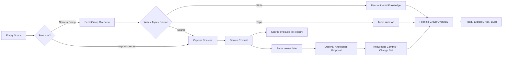
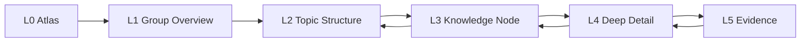
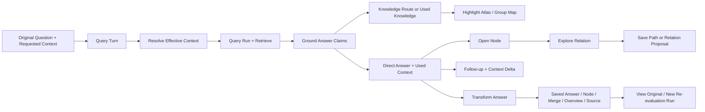
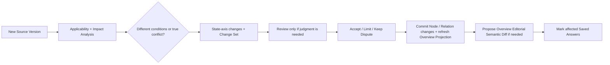

# AI-native 个人知识库

## Ardot 设计审查与全量设计蓝图 v1.0

> 审查日期：2026-08-05  
> 覆盖合同修订：2026-08-06（第二轮完整性审计后由 62 项扩展为 81 项与十一块流程板）  
> 当前画布复核：2026-08-07（在当前 Chrome 会话重新逐屏捕获 Page 1 七屏；画布仍为同一七个 Screen，未写入或制作新原型）  
> 审查对象：[AI-native 个人知识库 · 设计探索 v2（星图手稿）](https://ardot.tencent.com/file/711670254240951?node_id=0%3A1)  
> 审查范围：Page 1 的 7 个 Screen；Page 2 为空  
> Canonical 产品定义：`outputs/AI-native-个人知识库-终局产品设计文档-v6.0.md`；本文档状态为 EVIDENCE，不得反向改写 v6.0  
> 文档权威注册表：`outputs/AI-native-个人知识库-文档权威注册表-v1.0.md`；旧专项合同在完成迁移前不具规范权威  
> 产品决策 Gate：`outputs/AI-native-个人知识库-关键产品决策审阅稿-v1.0.md`；八项高影响选择确认前，现有七屏不进入补画、重绘或原型阶段  
> 当前核心心智模型：`outputs/AI-native-个人知识库-核心心智模型与连续探索合同-v1.0.md`；它取代旧“四 Places / 四 Group Roots”表面数量结论  
> 2026-08-09 Scale Invariance 证明覆写：未来视觉设计必须用同一产品证明 F1 / F10 / F100 / F10K；All Groups 穷尽，Resume / Pins / Recent 分权，Network 超预算进入 Scope Summary + List + Anchor，全库 Ask 显示 Group coverage。自动 Top N、canonical Group regions、大库首页与新增 Shelf 均判失败；完整规则见`outputs/AI-native-个人知识库-规模化知识空间与长期可浏览性合同-v1.0.md`  
> 2026-08-10 Group Relation Aggregation 证明覆写：未来视觉必须证明 exit → signal → qualified Candidate → adoption → support reassessment；raw path count、confidence、degree 或金色连线不能替代 Effective Support Unit、Boundary coverage、type policy、CounterSignal、removal test 与 standing。完整规则见`outputs/AI-native-个人知识库-群级关系聚合门槛与支撑充分性合同-v1.0.md`  
> 2026-08-10 Group Relation Type Registry 证明覆写：未来视觉必须用真实 fixture 证明十一种正式类型的意图选择、相邻消歧、方向 / inverse reading、definition revision 与 migration；Shared Knowledge observation 只能是按需 Lens，不能成为第十二种 edge。类型按语义家族组织，禁止十一色编码。完整规则见`outputs/AI-native-个人知识库-群级关系类型注册表与语义互斥合同-v1.0.md`  
> 2026-08-10 Group Pair Comparison 证明覆写：Screen 2 / 3 未来必须共同证明两个真实 Group Boundaries、同一 pair snapshot、Current / Shared / Paths / Suggested / History、Bundle / Inspector、Pair Ask 与 exact return；文章 + 星图并排本身不构成证明。完整规则见`outputs/AI-native-个人知识库-知识群对照与关系检查器合同-v1.0.md`  
> 2026-08-10 Knowledge Relation Type Registry 证明覆写：Screen 2 / 3 未来还必须共同证明五类意图、25-type 精确语义、三种 support、`applies_to / implements`、direct / derived，以及 Relation 与 Evidence / Reference / Answer / IdentityTransition / Question state / disposition 的分层；禁止 25 色编码。完整规则见`outputs/AI-native-个人知识库-知识关系类型注册表与跨层语义合同-v1.0.md`  
> 2026-08-10 Question Resolution 证明覆写：Screen 2 / 3 未来还必须共同证明 Question Knowledge 的连续阅读、current Resolution、criteria、remaining unknowns、partial / provisional / resolved、active / paused / concluded、change review、targets / basis / Subquestions 分层、原子写入、reopen / successor 与 exact return。AI Answer 不自动解决或关闭。完整规则见`outputs/AI-native-个人知识库-问题知识、未知与求解生命周期合同-v1.0.md`  
> 2026-08-10 真实内容证明覆写：后续 Screen 2 / 3 必须使用`outputs/AI-native-个人知识库-真实端到端使用样例与设计数据夹具-v1.0.md`中的两个真实 Groups、长 Question、2026 生效时间、主体条件、Source fragments、changed criterion、七条 Relation 判断与 cross-group exits；抽象短标签和概念星图不再计为产品真实性证明。当前仍不修改 Ardot、不制作原型  
> 2026-08-10 第二真实内容证明覆写：后续 Screen 2 / 3 还必须使用`outputs/AI-native-个人知识库-第二真实端到端夹具-概念学习、多语境复用与群关系-v1.0.md`中的两个稳定概念 Groups、32 Topics、15 条 Knowledge、3 条双 Placement shared identities、6 条 Questions、11 条 Knowledge Relations、2 条 same-pair Current Group Relations、research challenge 与 exact return；它专门防止视觉把产品误塑造成规则查询器、论文卡片墙或学习待办。当前仍不修改 Ardot、不制作原型  
> 2026-08-10 基础可用性证明覆写：后续完整设计还必须使用`outputs/AI-native-个人知识库-基础可用性夹具-空库直接写作搜索与恢复-v1.0.md`证明空 Library、无 Source 直接写作、安静的未入群知识、Search exact Anchor、Bare Group、Source parse partial、offline Current、Knowledge Package 与干净环境 Restore；不能只画成熟研究库。当前仍不修改 Ardot、不制作原型  
> 2026-08-10 v5 产品决策错位复核：已从当前登录画布重新只读捕获 Page 1 七屏，并按十四项关键产品决定逐屏判定保留、重构与淘汰。Screen 2 只保留“温暖阅读主面 + 深色关系空间”的方向，Screen 6 只保留 user-owned Overview 与 AI 不自动改写；“知识星图”产品中心、永久双栏、混层全局图、无语义连线、置信度审批与存储模式主屏均不得迁移。完整报告见`outputs/design-audit-ardot/Ardot-v5产品决策错位审计-v1.0.md`。本轮仍未修改 Ardot、补画 Screen 或制作原型  
> 2026-08-10 v6 结构收敛：产品从十四类 Primary Resources 收敛为 Group、Knowledge、Relation、Source 四类 canonical truth families，加一个 Group 内稳定 Topic 结构身份；Overview、Placement、Question state、Answer Run、Proposal、Change Set、View 与 Saved Path 降为 owner / supporting layer 的责任。25 + 11 relation registries 降为实验附录。所有后续设计只读取 v6、Decision Companion、Fixtures 与当前 Evidence  
> 历史对照产品定义：`outputs/AI-native-个人知识库-产品定义-v3.0.md`  
> 核心体验：`outputs/AI-native-个人知识库-核心体验与知识群生命周期-v1.0.md`  
> 知识深度与关系：`outputs/AI-native-个人知识库-知识深度与关系探索合同-v1.0.md`  
> 知识形成与维护：`outputs/AI-native-个人知识库-知识形成与维护循环-v1.0.md`  
> 知识群边界与跨群架构：`outputs/AI-native-个人知识库-知识群边界与跨群架构合同-v1.0.md`  
> 知识节点粒度与内容组成：`outputs/AI-native-个人知识库-知识节点粒度与内容组成合同-v1.0.md`  
> Overview 形成、编辑与更新：`outputs/AI-native-个人知识库-Overview形成编辑与更新合同-v1.0.md`  
> AI 查询与知识回答：`outputs/AI-native-个人知识库-AI查询与知识回答合同-v1.0.md`  
> 搜索定位与知识找回：`outputs/AI-native-个人知识库-搜索定位与知识找回合同-v1.0.md`  
> Library 浏览与动态视图：`outputs/AI-native-个人知识库-Library浏览与动态视图合同-v1.0.md`  
> 来源、证据与可追溯性：`outputs/AI-native-个人知识库-来源证据与可追溯性合同-v1.0.md`  
> 直接创作、编辑与版本历史：`outputs/AI-native-个人知识库-直接创作编辑与版本历史合同-v1.0.md`  
> 属性、Facet 与适用条件：`outputs/AI-native-个人知识库-属性Facet与适用条件合同-v1.0.md`  
> 产品对象层级与身份治理：`outputs/AI-native-个人知识库-产品对象层级与身份治理合同-v1.0.md`  
> 产品表面架构与完整设计证明：`outputs/AI-native-个人知识库-产品表面架构与完整设计证明合同-v1.0.md`  
> 地点编排与跨地点连续性：`outputs/AI-native-个人知识库-地点编排信息归属与跨地点连续性合同-v1.0.md`  
> 知识群工作区与双镜连续性：`outputs/AI-native-个人知识库-知识群工作区与双镜连续性合同-v1.0.md`  
> 核心导航与复杂度收敛：`outputs/AI-native-个人知识库-核心导航与复杂度收敛合同-v1.0.md`  
> 当前复核证据：`outputs/design-audit-ardot/current-run/01-current-ardot.png` 与 `02-screen-1-home.png` 至 `08-screen-7-sources-storage.png`  
> 最新 v5 决策审计证据：`outputs/design-audit-ardot/v5-decision-audit-2026-08-10/01-current-ardot.png` 与 `02-screen-1-knowledge-home.png` 至 `08-screen-7-sources-storage.png`  
> 证据边界：结论基于本次实际捕捉的 Ardot 画布与截图；没有把旧生成图或记忆当作审查证据

---

# 当前群级关系复核结论（2026-08-10）

本轮针对“什么时候几条跨群知识连接才有资格上升为一条群级关系”重新检查了当前 Screen 3 与 Screen 2。当前截图为：

- `outputs/design-audit-ardot/group-relation-round-2026-08-10/accepted/01-current-network-concept.png`；
- `outputs/design-audit-ardot/group-relation-round-2026-08-10/accepted/02-current-dual-mirror.png`。

完整逐屏结论与未来视觉 Gate 见 `outputs/design-audit-ardot/群级关系升级门槛与视觉证明缺口审计-v1.0.md`。

本轮不改变此前“方向 3 + 方向 2”的视觉选择，但把两个画面的产品地位进一步收紧：

- **Screen 3 只保留为关系空间的艺术方向参考。** 它目前仍是一张概念星图，没有真实 object identity、relation statement、type、direction、Applicability、Current / Suggested / History、selection、Inspector 或 List Equivalent；
- **Screen 2 继续作为总体视觉方向。** 温暖阅读主面 + 深色关系 companion 符合“本质仍是知识库”，但右镜仍是装饰图，尚未证明 cross-group exit、Aggregation Signal、Candidate、maintained Relation 与 History 的区别；
- **两张图也尚未证明 Knowledge-level semantic precision。** 当前无法分辨知识支持主张、来源支持陈述与本次回答依据；无法区分适用与真实采用；也无法看出 successor、retraction、Question target 为什么不应成为 ordinary edge；
- **下一轮不能直接补按钮。** 必须用真实 fixture 先证明 exit-only、duplicate collapse、bilateral-core / anchor-and-spread / named-subscope Candidate、CounterSignal、removal result、adoption、review_due、Graph / List / mobile / keyboard；
- **没有关系是合法状态。** 一条或多条具体 exits 可以继续探索，不需要为了画面丰富生成群级边；
- **视觉不决定 truth。** 线宽、亮度、颜色、动画、节点大小、path count、confidence 和 degree 都不能承担 relation standing 或资格。
- **同 pair 可以有多种不冲突的正式陈述。** `complements`、`contrasts_with`等关系各有 identity 与完整 statement；Bundle 只折叠展示，不能合并语义。
- **共享核心知识是观察 Lens。** 它显示同一 Knowledge identity 在两群中的真实 Placements，关闭后不留 edge、不改变 resting layout，也没有 Current / Suggested / History。
- **精确类型不能靠十一色图例。** 视觉只用有限关系家族语法辅助；类型、方向、限定和反向读法由可读标签与 List Equivalent 负责。
- **旧关系定义不会被新 Registry 偷换。** 未来设计必须出现 definition revision 与 migration review 的真实状态，而不是更新后全图静默变线。

本轮仍没有修改 Ardot、绘制 Frame 或制作原型。

---

# 当前复核结论（2026-08-07）

## A. 当前证据

本轮重新选择并以 91% zoom 捕捉了七个 Frame；以下文件是本轮审查证据，不使用旧截图推断当前画布：


| Step | 当前画面 | 健康度 | 当前证据 |
|---|---|---|---|
| 1 | 知识主页 | 视觉方向成立，产品入口错误 | `current-run/02-screen-1-home.png` |
| 2 | 双镜工作区 | 核心隐喻成立，层级与操作缺失 | `current-run/03-screen-2-dual-mirror.png` |
| 3 | IA 概念星图 | 可作概念海报，不是产品界面 | `current-run/04-screen-3-ia-graph.png` |
| 4 | 采集流 | 有来源入口，仍会滑向 AI 卡片工厂 | `current-run/05-screen-4-capture.png` |
| 5 | 回答页 | 有引用外观，缺少查询真值与返回知识 | `current-run/06-screen-5-answer.png` |
| 6 | 概览编辑器 | 有 AI 建议边界，仍是独立后台编辑器 | `current-run/07-screen-6-overview-editor.png` |
| 7 | 来源与存储 | 把材料、连接器与存储策略混成产品结尾 | `current-run/08-screen-7-sources-storage.png` |

## B. 最重要的新判断

当前问题不是“七张图没有覆盖 81 个状态”，而是七张图没有共享一个正确的产品中心。现有稿把首页、文章、星图、采集、回答、编辑和设置做成七个并列功能页面；用户却已经明确要的是一个知识库。

新冻结的表面骨架是：

```text
Knowledge Library
  ├─ Knowledge Groups view
  └─ Knowledge Network view
       ↓ open
Group Overview → Topic Overview → Knowledge → Anchor → Evidence
                         ↕
              R0–R3 Relation Radius
```

因此：

- 不再设计独立营销 Home；Screen 1 应成为真实 Knowledge Library；
- 不再把 Atlas 作为第二产品中心；Network 是 Library view，局部关系是当前 Reading 的 Companion；
- 不再把 Group 切成 Overview / Contents / Relations / Sources 四个后台 Roots；四者是同一连续 scene 的责任；
- 不再把 Screen 3 当作可实现 UI；它只保留视觉隐喻价值；
- Ask、Search、Add 是动作，Answer 是 contextual scene，Sources / History / Backup 是 supporting utilities；
- D0–D5 Reading Depth 与 R0–R3 Relation Radius 必须分别证明，不能再用一条 L0–L5 刻度混合表达。

## C. 七张图的处理结果

| 画面 | 处理 | 原因 |
|---|---|---|
| Screen 1 | 重定义为 Knowledge Library | 用户首先看见 Groups；Network 是同一 selection 的视图；Resume 轻量存在 |
| Screen 2 | 作为核心场景重构 | 保留温暖阅读 + 深色关系的气质，补 DepthTrail、Structure、真实 relation state 与 return |
| Screen 3 | 退出产品屏幕集 | 生成式星云与随机标签无法承载真实 identity / relation / interaction |
| Screen 4 | 降为 Add → Source 分支 | 写 Knowledge、建 Topic、加 Source、建 Relation 必须同等自然；Source-only 是成功 |
| Screen 5 | 并入 contextual Ask | 显示 Requested / Effective / Used Context、Claim Support、Coverage 与回到 Knowledge |
| Screen 6 | 并回 Overview 阅读面 | 用户直接编辑 current；AI 建议是 Diff，不打开 CMS 后台 |
| Screen 7 | 拆为 Source utility 与 Storage / Recovery | 资料核验和存储策略不是同一个任务，也不是核心产品主路径 |

## D. 完整性证明口径修正

旧文档中的 81 项继续保留为**状态责任清单**，但不再称为“81 个屏幕或关键状态”。新设计先按十二个 proof families 组织：Empty / Seed Library、Mature Library、Group Overview、Topic Reading、Knowledge Reading / Editing、Local Relation、Group / Library Network、Search / Deep Link、Scoped Ask / Answer、Source / Evidence、Structure Evolution、Ownership / Recovery。

每个 family 再覆盖 entry、normal、empty、loading、partial、failure、recovery、return、desktop、mobile 与 accessibility。这样既不缩减终局能力，也不鼓励页面数量膨胀。

## E. 当前边界

本轮没有修改 Ardot、没有生成新 Screen、没有制作原型。视觉方向 3 + 2 仍保留，但只有在 Library-first、Topic Overview 与 Relation Companion 三个产品决定被用户判断后，才进入三种视觉方案探索。

---

# 0. 总体判断

## 0.1 结论

当前设计稿**不是一个完整产品设计**。它是一个方向正确、气质明确、覆盖了少数关键概念的视觉概念集。

它已经回答了：

- 产品希望具有什么审美气质；
- 首页、知识群、图谱、采集、回答、概览编辑和来源设置大概长什么样；
- “温暖阅读空间 + 深色关系宇宙”的视觉张力；
- AI 查询、Overview 与关系探索需要共存。

它尚未回答：

- 用户如何在 7 个画面之间移动；
- 产品的稳定导航和信息架构是什么；
- Knowledge Group、Topic、Node、Detail、Evidence 六级结构如何真实进入；
- 关系图如何选择、展开、过滤、解释和返回；
- AI 回答如何在图谱与阅读区中定位；
- 知识如何创建、更新、冲突、纠正、合并和撤销；
- 用户如何不依赖 AI 直接创建 Group、Node、Topic 与正式 Relation；
- canonical Node 与当前 Placement 的编辑作用域如何区分；
- Archive、Trash、Remove Placement 与 Permanent Delete 如何恢复；
- 旧知识库如何迁入、完整备份、恢复和迁出；
- 空、加载、失败、离线、建议未接受、证据有限、无答案等状态如何工作；
- 当前视觉如何成为可复用组件系统，而不是七张风格相似的图片。

## 0.2 完整度判断

| 维度 | 当前状态 | 判断 |
|---|---|---|
| 视觉方向 | 已形成 | 温暖纸张感与星图隐喻具有辨识度 |
| 产品本体表达 | 部分形成 | 画出了若干概念，但对象关系不完整 |
| 信息架构 | 不完整 | 没有稳定 App Shell 与全局导航 |
| 核心任务流 | 不完整 | 7 个页面没有组成可执行流程 |
| 语义缩放 | 概念化 | L0-L5 只作为标签出现，没有逐层状态 |
| AI 查询 | 部分形成 | 有回答页，但没有知识路径联动 |
| 知识维护 | 缺失 | 冲突、版本、纠正、合并、更新差异未画 |
| 直接创作与组织 | 缺失 | 没有空 Group、Node Editor、Placement 与 Relation Editor |
| 迁移与所有权 | 缺失 | 本地存储只有概念，没有迁入、备份、恢复和完整导出 |
| 来源与证据 | 部分形成 | 有来源设置，没有 Source Reader 与片段追溯 |
| 交互状态 | 缺失 | 只有静态正常态 |
| 组件与规范 | 缺失 | Screen 是整图填充，未形成组件系统 |
| 可访问性 | 高风险 | 小字号、低对比、图上文字、颜色依赖均需验证 |
| Group 形成阶段 | 缺失 | 只画了理想 Established 状态，没有 Seed、Forming、Evolving、Dormant |
| 连接语义与 Route 忠实度 | 缺失 | 连线只有抽象视觉，没有区分结构、证据、引用、正式关系和检索跳转 |
| 结构化知识语义 | 缺失 | 没有 Definition / Assertion、五种值状态、Facet / Profile、Property / Applicability / Relation 边界或 Migration 状态 |

## 0.3 最关键的产品设计错误

目前设计把“完整产品”理解成了“覆盖七种功能页面”。

真正完整的设计至少需要同时覆盖：

1. 稳定的信息架构；
2. 核心对象在不同深度的表现；
3. 用户任务从进入到完成的连续流程；
4. 数据和 AI 状态变化；
5. 失败与纠错；
6. 可复用的组件和行为规范。
7. 用户直接创作、编辑、组织和删除知识；
8. 知识资产的迁入、校验、备份、恢复与迁出。

因此，下一轮不能继续追加第 8、9、10 张孤立页面，而应先建立**产品壳层、核心状态机和屏幕覆盖合同**。

---

# 1. 本次捕捉步骤与逐屏审查

## Step 1 — 知识主页

**健康度：方向可用，产品入口不完整。**


### 优点

- 第一眼具有“进入个人知识世界”的情绪，而不是普通 SaaS 仪表盘。
- 主标题、Ask 输入与知识星图形成清楚的主次关系。
- 温暖纸张与深色星图的对比建立了产品独特气质。
- 首页没有被统计卡片、任务数量和通知淹没。

### 主要问题

- 星图中的对象看起来像随机标签，用户看不出哪些是知识群、哪些是节点。
- 首页只显示两张知识卡，不能解释知识群的整体结构、层级和关系。
- Ask 的作用域不明确：是全部知识、当前群还是默认最近上下文。
- “继续探索”缺少最近路径、未完成阅读和知识变化等具体对象。
- 顶部导航太弱，无法推导出 Atlas、Explore、Sources、Review 等核心区域。

### 需要补齐

- 全局 App Shell；
- Knowledge Group 列表与 Atlas 切换；
- Ask 作用域；
- 最近探索 Path；
- 新知识变化；
- Empty / Loading / No Sources 状态。

### 可访问性风险

- 说明文字和卡片正文偏小、对比不足；
- 星图标签依赖深色图像背景，缩放后可读性弱；
- 仅凭截图无法验证键盘焦点与阅读顺序。

## Step 2 — 双镜工作区

**健康度：核心方向正确，但还不是可操作的 Knowledge Group Workspace。**


### 优点

- “左侧阅读、右侧关系”准确表达了层级阅读与横向探索的共存。
- 阅读内容保持编辑感，星图承担发现关系而非承载全文。
- Knowledge Group 的 Overview 与关系视图可以共享当前主题。

### 主要问题

- 没有目录、breadcrumb 或深度状态，用户不知道自己位于 Overview、Topic 还是 Node。
- 右侧图像像装饰背景，缺少节点选择、关系标签、过滤、返回和展开。
- “知识群概览”浮卡重复正文，没有形成真正的结构摘要。
- 没有跨群出口、其他出现位置、来源与证据入口。
- 没有显示图谱与正文如何同步响应同一选择。

### 需要补齐

- 稳定层级目录；
- L1-L5 深度导航；
- 当前 Node 选择态；
- Local Graph 一跳 / 二跳展开；
- 关系检查器；
- 跨群跳转；
- Evidence Drawer；
- Ask 后的同步高亮状态。

### 可访问性风险

- 右侧关系标签很小；
- 关系只依赖视觉位置和连线；
- 图谱必须提供列表等价视图与键盘遍历方式。

## Step 3 — IA 概念星图

**健康度：产品说明图，不是产品界面。**


### 优点

- 左侧对象、中央关系、右侧进入方式、底部 L0-L5 的概念表达完整。
- 能快速向团队说明产品不是文件夹树，也不是单一聊天框。
- 深色模式适合高亮关系和知识路径。

### 主要问题

- 中央视觉采用大量生成式星云与随机标签，不能代表真实、可操作的数据结构。
- 左侧八类对象是概念说明，不是用户导航；右侧 Ask/Search/Explore 是说明卡，不是入口。
- L0-L5 只是静态刻度，没有说明每次缩放具体改变什么。
- 关系没有类型、方向、证据和状态。
- 这张图不能回答“用户点击一个知识群后发生什么”。

### 处理建议

保留为**产品概念海报或 Atlas 空间隐喻**，不要把它直接当作全局图谱实现稿。真实 Atlas 应只显示 Knowledge Group 和少量高价值群关系。

### 可访问性风险

- 深色背景上大量细线和小字难以阅读；
- 颜色、亮度和空间位置承担过多意义；
- 缩放到 200% 时布局与标签重叠风险高。

## Step 4 — 采集流

**健康度：有起点，缺少从来源到知识的完整确认链。**


### 优点

- 支持链接、文件和浏览器剪藏三种自然入口。
- 试图在写入前展示 AI 提取结果与置信度。
- 有“放入知识群”的意识，而不是只把来源丢进收件箱。

### 主要问题

- 采集流程将“解析、节点提取、关系识别、群归属”压成一个静态确认页。
- 没有原文预览，用户无法核对提取内容。
- 没有重复来源、已有节点匹配、冲突或不可解析状态。
- 置信度数字没有解释，也没有说明低置信会造成什么。
- “确认修改”不清楚是保存来源、保存知识还是提交整个批次。
- 默认假设每次解析都会产生 Node，没有 zero-yield 完成态；
- 没有用户原创 Current Knowledge、Explicit Draft / Recovery 与 AI Query Result 的独立落点；
- 提取结果按卡片平铺，尚未围绕少量 Decision Bundles 组织。

### 需要补齐

- Import → Parse → Preview → Knowledge Proposal → Commit 五步状态；
- 单项接受、编辑、忽略；
- 重复与已有知识匹配；
- 错误、部分解析和重试；
- 批次撤销；
- 保存来源但暂不生成知识。

### 可访问性风险

- 大量细小浅色文字；
- 仅凭绿色状态表达接受；
- 每行的操作目标偏小。

## Step 5 — AI 回答页

**健康度：是传统带引用回答页，尚未体现知识网络产品。**


### 优点

- 先给答案，再给引用与相关问题，基本信息顺序合理。
- 引用卡片包含来源类型与位置，方向正确。
- 回答风格偏阅读而非聊天气泡。

### 主要问题

- 回答没有显示使用了哪些知识群、节点和关系。
- 点击引用只能推测会打开来源，没有展示回到证据后的上下文。
- 相关问题仍然把用户拉回连续问答，而不是进入知识探索。
- 没有冲突、未知、作用域排除和低证据状态。
- 没有保存为 Synthesis、合并进节点或保存 Path 的知识化动作。

### 需要补齐

- Direct Answer；
- Knowledge Route；
- Evidence；
- Conflict & Unknown；
- Explore Next；
- Atlas / Group Map 同步高亮；
- Query Result → Knowledge 的明确保存流程。

### 可访问性风险

- 正文行距与字号需要真实实现验证；
- 引用卡片文字偏小；
- 相关问题胶囊的点击区域与焦点态不可见。

## Step 6 — Overview 编辑器

**健康度：有 AI 协作概念，缺少版本与结构维护。**


### 优点

- 主文与 AI 建议分栏，避免 AI 直接覆盖用户内容。
- 建议按“定义、关系、冲突”等类型组织，方向正确。
- 显示“AI 建议开/关”，体现用户控制。

### 主要问题

- Overview 仍然只被表现成一篇普通文档，无法辨认 Editorial、Projection、Reference、Navigation 与 Status 的不同更新语义。
- 建议只提供“插入”，没有接受、改写、忽略、查看依据和影响范围。
- 没有显示 Semantic Diff、Support Map、alignment、更新时间、覆盖范围和锁定状态。
- 没有说明插入建议后哪些节点、关系或群 Overview 会改变。
- 缺少并发编辑、撤销和 AI 重写冲突状态。

### 需要补齐

- 连续阅读态与 Block-aware 编辑态；
- Editorial / Projection 的更新路径分离；
- 逐条建议的依据与影响；
- Semantic Diff、Projection refresh 与 Support Inspector；
- authorship、update policy、lock 与 alignment 正交状态；
- Overview Claim Promotion；
- 批量接受与撤销；
- 更新后受影响关系、路径与历史的提示。

### 可访问性风险

- AI 建议卡片对比度较弱；
- “插入”按钮目标小且重复；
- 需要明确屏幕阅读器如何区分正文、建议与差异。

## Step 7 — 来源与存储

**健康度：设置草图，不是来源管理产品。**


### 优点

- 来源连接状态和存储策略被明确放到用户可见界面。
- 本地文件、浏览器剪藏、Notion、微信等来源形成了合理示例。

### 主要问题

- A/B/C 单选将复杂存储、索引、同步和所有权问题过度简化为一次设置。
- 来源列表没有数量、最近同步、失败、权限、解析覆盖和断开影响。
- 没有 Source Reader、Evidence Fragment、引用节点和知识影响。
- “断开”没有说明是否保留已形成知识和来源缓存。
- 没有来源级作用域、排除、重新解析和版本更新。

### 需要补齐

- Source Registry；
- Source Detail / Reader；
- Sync Status；
- Parsing Coverage；
- Referenced By；
- Disconnect Impact；
- Re-index / Re-parse；
- Source Version Diff。

### 可访问性风险

- 单选项主要通过边框与小圆点表达；
- 状态文字过小；
- 连接、断开和保存的反馈不可从静态图验证。

---

# 2. 当前设计的结构性优点

1. **视觉立场明确。** 它没有变成常见的灰白知识库 SaaS。
2. **知识具有空间隐喻。** 星图适合表达跨群关系和探索感。
3. **阅读仍然重要。** 产品没有被纯图谱吞没。
4. **AI 不是唯一入口。** 首页、工作区与 Overview 都存在非聊天路径。
5. **来源意识存在。** 回答、采集与设置都试图保留来源。
6. **用户控制开始出现。** Overview 建议没有直接覆盖正文。

这些优点应保留，但需要从“画面气质”升级为“组件、状态和行为”。

---

# 3. 最高优先级缺口

## 3.1 没有稳定 App Shell

七张图没有共享一致的：

- 一级导航；
- 当前知识路径；
- 全局 Ask / Search / Capture；
- Knowledge Group 切换；
- 同步与 AI 状态；
- 返回与历史。

结果是每张图看起来都像独立专题页，用户无法建立长期空间感。

## 3.2 没有真正画出 Knowledge Group

文档把 Knowledge Group 定义为产品主要组织单位，但设计没有一张完整表现：

- 群边界；
- Overview；
- 主题骨架；
- 由 Placements 推导的成员知识；
- 深层 Topic 与 Topic Promotion Gateway；
- 群关系；
- 来源覆盖；
- 冲突与未知；
- 更新时间；
- 群拆分与合并。

Screen 2 只是“一个文档 + 一张关系图片”。

## 3.3 没有画出 Semantic Zoom

底部写了 L0-L5，但缺少六个真实状态及其转场：

- L0 Atlas；
- L1 Group Overview；
- L2 Topic Structure；
- L3 Knowledge Node；
- L4 Deep Detail；
- L5 Evidence。

如果这六级没有被逐层画出和验证，“从 Overview 到细节”仍然只是口号。

## 3.4 Ask 没有进入知识网络

回答页仍是线性文章。缺少：

- 查询作用域；
- 使用的知识节点；
- 跨群路径；
- 图谱高亮；
- 证据上下文；
- 保存为知识；
- 沿关系继续探索。

## 3.5 没有知识维护闭环

产品的长期价值取决于新来源如何改变旧知识，但设计完全没有画：

- 新证据支持旧主张；
- 新证据反驳旧主张；
- 节点重复；
- 关系候选；
- Overview 更新差异；
- 用户纠正后的传播；
- 群拆分与合并；
- 旧版本与过时状态。

## 3.6 没有状态设计

当前只有正常、数据充足、AI 成功的理想态。至少缺少：

- empty；
- loading / indexing；
- partial；
- low confidence；
- conflict；
- no result；
- permission lost；
- source changed；
- offline；
- AI unavailable；
- undo / recovery。

## 3.7 当前稿是整图，不是设计系统

从 Ardot 的图层与右侧属性可见，每个 Screen 以一张整图作为 1440×920 画面填充；没有可编辑按钮、输入框、导航、节点、关系和状态组件。

因此它不能直接支持：

- 可点击原型；
- 组件复用；
- 状态变体；
- 响应式；
- 设计 token；
- 开发交付；
- 可访问性标注。

下一版必须从组件和状态重建，而不是继续在整图上修字。

## 3.8 把“知识建设”误写成“资料导入”

Screen 4 画了 Capture → AI 提取 → 知识提案，但没有空 Group、直接写 Node、编辑既有 Node、建立 Topic、管理多重 Placement 或人工正式 Relation。若只按现有稿扩展，用户必须先给 AI 一份材料，才能拥有知识。

这与“个人知识库”冲突。下一轮设计必须证明：

- 空 Group 是有效状态；
- 用户原创内容不需要伪造 Source；
- Node Editor 与阅读态属于同一产品；
- canonical edit、contextual edit 与 fork 的影响范围可理解；
- 图谱拖线不能绕过关系类型与方向；
- Overview 可以由用户直接编辑并锁定段落。

## 3.9 “本地”没有形成所有权体验

Screen 7 展示了来源与存储气质，但没有回答：数据实际在哪里、索引是否健康、备份是否验证、旧库如何映射、完整导出包含什么、恢复失败如何回滚、Ask 是否把哪些内容发送到云端。

本地优先不需要变成隐私控制中心，但必须变成可操作的长期所有权：Storage & Index、Migration Mapping、Knowledge Package、Backup / Restore 与 AI Policy 都要有真实状态。

## 3.10 严谨术语可能变成新的视觉负担

后续产品定义已经拥有 Node、Placement、Applicability、Query Context、Snapshot、Change Set 与四轴状态。如果视觉稿把这些词全部直接写进导航、徽章、筛选器和卡片，产品会从“漂亮但不完整”转向“完整但难以使用”。

下一轮必须同时证明：

- 默认界面只围绕知识群、主题、知识、关系、来源；
- 选择对象后才出现局部关系、来源和一句状态；
- 编辑、删除与保存前才显示影响；
- 版本链、状态轴、manifest 和诊断只在主动核验时出现；
- 简化用词不删除 canonical identity、multiple Placement、typed Relation 与 provenance。

完整映射见 `outputs/AI-native-个人知识库-产品语言与渐进披露规范-v1.0.md`。

## 3.11 只画了“已经成熟的知识世界”

当前七张 Screen 和三个后续视觉候选都默认用户已经拥有：清楚的群边界、丰富主题、稳定 Overview、大量关系和足够来源。这会遗漏产品能否真正开始、变化和恢复：

- Seed Group 如何只凭名称成立；
- Forming Group 如何显示候选结构而不伪装成熟；
- Established Group 如何让阶段信息退到背景；
- Evolving Group 如何保留旧理解并解释变化；
- Dormant Group 如何恢复上次焦点而不被判定过期；
- 多种阶段并存时 Home 如何保持十秒定位。

这一缺口也会扭曲视觉判断：如果只画 Established，图谱会天然显得更密、更重要，空状态则被误解为需要用模板、AI 内容或装饰性星图填满。

下一轮设计必须让同一 Group Overview 构图支持 Seed、Established、Evolving、Dormant 四个关键变体；阶段只改变信息权重，不改变对象身份、导航和 Selection State，也不引入成熟度分数。

## 3.12 “有连线”尚未证明关系网络成立

当前视觉使用统一抽象线条表达知识连接，但完整产品至少存在五种完全不同的连接：结构位置、Evidence、普通引用、正式 Relation 和本次 AI 检索跳转。

如果下一轮仍让它们共享一种视觉语法，会产生三个严重后果：

- 用户把“位于某主题”误解为一个可争议的知识主张；
- AI 把本次检索到的对象画成永久关系，污染长期知识网络；
- 一条虚线同时承担系统推断、尚未确认、证据不足和低显著四种含义。

下一轮必须分别证明 Scope Level、Reading Depth 与 Relation Radius 的独立转场，并让 Relation 的形成依据、提案状态、知识状态和显示显著性可分别检查。没有可靠 Knowledge Route 时，应显示 Used Knowledge List 与 Evidence，不为了视觉完整制造假路径。

## 3.13 Capture 仍可能退化为 AI 卡片工厂

当前采集画面已经意识到 Source 与知识不是同一件事，但仍没有视觉证明：

- 用户自己写的一条想法如何在没有 Group 时安全落地；
- 一份 Source 完整解析后为何可以零 Node 成功；
- Evidence Fragment、Candidate、Proposal 与 Current Knowledge 如何保持边界；
- 300 份来源如何不产生数百个待确认卡片；
- 同名内容如何在补证、修订、新 Placement、新 Node 与 Source-only 之间判断；
- 用户纠正如何传播而不重写历史 Answer。

若这些状态仍被压成“上传 → AI 分析 → 卡片瀑布 → 全部接受”，产品会把整理劳动从手工建库转移成清理 AI 产出。

下一轮必须让来源已保存、本地已保存但尚未采用、未归入知识群、整理建议与已作为当前知识采用具有不同完成语义；Proposal 首屏围绕 3–7 个 Decision Bundles，而不是显示模型检测到的所有卡片。完整合同见 `outputs/AI-native-个人知识库-知识形成与维护循环-v1.0.md`。

## 3.14 Overview 仍可能退化为第二套 AI 摘要

当前 Screen 6 已经表达“AI 建议不直接覆盖正文”，但仍没有回答更基础的产品问题：

- 一个 Group / Topic 到底有几份 Overview，Home、View 与 Answer 是否也会各自生成一份；
- 用户正文、AI 协助正文、动态结构与固定引用分别怎样更新；
- 新 Topic、Placement 或 Relation 出现后，哪些内容应刷新、哪些只能提出文字修改；
- “已锁定编辑”和“内容可能过时”如何同时成立；
- 一段 Overview 判断如何回到具体 Node / Relation / Evidence；
- 需要被独立核验和复用的 Claim 如何离开 Overview 成为 Node；
- Ask 中的“概览一下”为什么不应静默写入 canonical Overview。

若这些问题只用一个“AI 生成 / 用户锁定”开关表达，视觉会掩盖四种不同状态：谁写的、怎样更新、能否编辑、当前是否仍与知识一致。下一轮必须证明每个合法 scope 只有一个 Overview identity 和一棵连续 content tree；Editorial、Projection、Reference、Navigation、Status 在编辑时可辨认，阅读时仍是一篇完整概览；Support Map、Semantic Diff、alignment 与 Claim Promotion 都有真实状态。完整合同见 `outputs/AI-native-个人知识库-Overview形成编辑与更新合同-v1.0.md`。

## 3.15 Ask 仍可能退化为知识库旁边的聊天产品

Screen 5 已经有 Answer、Route 和 Evidence 的雏形，但视觉还没有证明：

- 原问题与一次执行是否分开，Retry / Follow-up / Re-evaluate 会不会覆盖历史；
- 用户要求的范围、系统实际采用的范围和真正使用对象是否可分别检查；
- 一条结论来自用户知识、来源原文、外部资料还是 AI 推论；
- 没有命中、Scope 太窄、索引不完整、来源不可用和真实未知是否拥有不同状态；
- Follow-up 怎样显示条件变化，又不把上一 Answer 当成下一轮事实；
- Saved Answer 是否会回流进当前查询，Original 与 Re-evaluation 怎样比较；
- Save Answer、形成 Node、合入 Node、保存 Path、Relation Proposal、Overview Diff 与 Save Source 的后果怎样区分。

若这些问题只通过 Scope chips、统一 citations footer 和 Save Chat 处理，Ask 仍会成为“用个人资料做 Context 的聊天框”。下一轮必须证明 Query Turn / Run、Requested / Effective / Used Context、Claim Support、Coverage、Context Delta、Run History 与 Answer Diff 都能用安静的人话界面成立；同时 Query overlay 清除后不改变 canonical graph。完整合同见 `outputs/AI-native-个人知识库-AI查询与知识回答合同-v1.0.md`。

---

# 4. 完整产品设计覆盖地图

以下不是 MVP 列表，而是“完整产品最终需要被设计清楚”的覆盖合同。

## 4.1 A. 产品壳层与全局导航

| 编号 | 屏幕 / 状态 | 必须回答 |
|---|---|---|
| A01 | App Shell | 一级导航、全局 Ask、Search、Capture、返回与当前路径 |
| A02 | Knowledge Home | 我的知识世界整体是什么 |
| A03 | Knowledge Group Switcher | 如何跨群、固定和最近访问 |
| A04 | Global Search | 群、节点、来源、证据和 Path 如何分组返回 |
| A05 | Global Ask | 全部知识或多群作用域如何选择 |
| A06 | Notifications / Knowledge Changes | 哪些变化值得用户知道 |

## 4.2 B. 知识群与语义缩放

| 编号 | 屏幕 / 状态 | 对应层级 |
|---|---|---|
| B01 | Knowledge Atlas | L0 |
| B02 | Group Overview | L1 |
| B03 | Topic Structure | L2 |
| B04 | Knowledge Node | L3 |
| B05 | Deep Detail | L4 |
| B06 | Evidence View | L5 |
| B07 | Cross-group Placement | 同一节点的其他路径 |
| B08 | Group Relation Inspector | 群关系类型、依据与方向 |
| B09 | Local Graph | 当前节点一跳与二跳关系 |
| B10 | Saved Path | 保存和继续一段探索路径 |
| B11 | Topic Overview | 当前分支的 Orientation、Structure 与知识缺口 |
| B12 | Topic Reorganization | 移动、拆分、合并或删除 Topic 时如何保留 Nodes 与旧路径 |

## 4.3 C. Ask、Search 与 Explore

| 编号 | 屏幕 / 状态 | 必须回答 |
|---|---|---|
| C01 | Scoped Ask Composer | 原问题、Requested Context、当前焦点与 Expansion 是否可预测 |
| C02 | Answer + Knowledge Route | Effective / Used Context、Claim Support 与真实 Route / Used Knowledge |
| C03 | Answer Conflict | 多个观点或证据冲突 |
| C04 | Answer Unknown | Coverage、当前范围无结果、索引不完整与真正缺知识如何区分 |
| C05 | Answer-to-Graph | 如何高亮群、节点和关系 |
| C06 | Answer Transform | Saved Answer / Node / Merge / Question / Path / Relation / Overview / Source 的不同后果 |
| C07 | Search Results | 精确找回对象 |
| C08 | Explore Recommendations | 不知道问什么时如何继续 |
| C09 | Query Context | Requested / Effective / Used、As-of、状态、适用条件、来源、外部策略与 Follow-up Delta |
| C10 | Saved Answer Version | Run lineage、Original Snapshot、Impact、Re-evaluate 与 Answer Diff |

## 4.4 D. Capture 与 Knowledge Compiler

| 编号 | 屏幕 / 状态 | 必须回答 |
|---|---|---|
| D01 | Capture Entry | 链接、文件、文字、选区、媒体 |
| D02 | Parsing Progress | 当前解析到哪里、可否后台继续 |
| D03 | Source Preview | 原文与结构是否正确 |
| D04 | Knowledge Proposal | 候选节点、关系、群归属 |
| D05 | Duplicate Match | 与已有节点是否重复 |
| D06 | Partial / Failed Import | 部分成功、重试与保留来源 |
| D07 | Batch Commit | 写入前确认和写入后撤销 |
| D08 | Source Commit | 只保存来源、延迟解析或稍后生成知识提案 |

## 4.5 E. 知识维护

| 编号 | 屏幕 / 状态 | 必须回答 |
|---|---|---|
| E01 | Review Queue | 只呈现高价值待确认事项 |
| E02 | Relation Suggestion | 候选关系依据与影响 |
| E03 | Node Merge / Split | 身份改变如何预览和撤销 |
| E04 | Conflict Resolution | 冲突如何限定、保留或解决 |
| E05 | Overview Semantic Diff | 新知识如何提出 Editorial prose 变化；Projection refresh 如何保持分离 |
| E06 | Correction Propagation | 一次纠正影响哪些对象 |
| E07 | Group Split / Merge | 群边界如何演化 |
| E08 | Stale Knowledge | 过时知识如何提示与复核 |
| E09 | Applicability Comparison | 两条主张是否只是对象、条件或有效时间不同 |
| E10 | Change Set Impact | 一次提交影响哪些对象、Overview、Answer、View 与 Review |

## 4.6 F. 来源与证据

| 编号 | 屏幕 / 状态 | 必须回答 |
|---|---|---|
| F01 | Source Registry | 来源整体、同步和解析状态 |
| F02 | Source Reader | 原文阅读、搜索和引用位置 |
| F03 | Annotation / Evidence Fragment / Binding | 阅读标记、片段身份与对具体知识的作用如何分开 |
| F04 | Source Revision Diff | 来源更新怎样改变 locator、support 与下游知识 |
| F05 | Disconnect Impact | 断开后保留和失去什么 |
| F06 | Re-index / Re-parse | 重新处理如何影响知识 |
| F07 | Evidence 五轴 | Material Origin、Derivation Distance、Support Role、Extraction Fidelity 与 Verification State 如何区分 |

## 4.7 G. 系统状态与恢复

| 编号 | 屏幕 / 状态 | 必须回答 |
|---|---|---|
| G01 | Empty Space | 没有来源和知识群时如何开始 |
| G02 | Indexing | 后台处理、部分可用与进度 |
| G03 | Offline | AI 不可用时知识库仍能做什么 |
| G04 | AI Failure | 失败原因、重试和非 AI 路径 |
| G05 | Permission Lost | 来源失效及影响 |
| G06 | Undo / History | 自动整理和用户操作如何恢复 |
| G07 | Large Graph | 拥挤时如何聚合、过滤和降级 |
| G08 | Knowledge State Detail | lifecycle、epistemic、freshness、availability 如何解释 |
| G09 | Historical Impact | 旧 Answer、Decision 与 Path 如何保留当时状态并显示当前变化 |

## 4.8 H. 直接创作与组织

| 编号 | 屏幕 / 状态 | 必须回答 |
|---|---|---|
| H01 | Create Knowledge Group | 不导入资料时如何创建并进入空 Group |
| H02 | Group Setup & Boundary | 名称、边界、类型与默认结构如何设置 |
| H03 | Create Knowledge Node | 如何从 Group、Topic、选区或快捷入口直接写知识 |
| H04 | Edit Scope Choice | 编辑 canonical Node 还是当前 contextual Placement |
| H05 | Node Editor | Buffer、Recovery、Current Commit、Draft、Proposal、冲突、离线与长内容如何工作 |
| H06 | Topic Authoring | 创建、改名、排序、移动、缩进与提升 Topic |
| H07 | Placement Manager | 同一 Node 如何加入、移出或移动到多个位置 |
| H08 | Manual Relation Editor | 用户如何建立类型、方向、条件与依据明确的关系 |
| H09 | Overview Editor & Governance | Editorial / Projection / Reference 如何共存，authorship、update policy、lock 与 alignment 如何分开 |
| H10 | Archive / Trash / Restore | 移出位置、归档、删除和恢复如何不混淆 |
| H11 | Bulk Organize | 多选移动、关系、归档与状态改变如何预览影响 |

## 4.9 I. 迁移、所有权与配置

| 编号 | 屏幕 / 状态 | 必须回答 |
|---|---|---|
| I01 | First-run Knowledge Space | 空白开始、迁移旧库或添加来源如何选择 |
| I02 | Library Migration Mapping | 文件夹、链接、标签、属性与附件如何映射 |
| I03 | Full Export / Knowledge Package | 导出是否包含可完整重建的知识语义 |
| I04 | Backup & Restore | 校验、恢复预览、冲突与失败回滚如何工作 |
| I05 | Storage & Index Health | 本地数据、Sources、附件、索引与缓存如何区分 |
| I06 | AI & External Knowledge Policy | 模型、发送范围与外部知识策略如何检查 |
| I07 | Optional Sync & Device Conflict | 同步可选，启用后如何解释设备冲突 |
| I08 | Preferences & Accessibility | 字号、快捷键、动效与图谱等价视图如何配置 |

完整产品当前至少有 **81 项状态责任** 需要被明确设计：A 6 项、B 12 项、C 10 项、D 8 项、E 10 项、F 7 项、G 9 项、H 11 项、I 8 项，共 81 项。它们由十二个 proof families 组织，并在流程、组件变体或状态矩阵中验证；不能解释成 81 张独立页面。

这 81 项责任的旧主归属、十一块流程板与组件状态图仍可作为检查清单；当前 scene 编排以核心心智模型的十二个 proof families 为准：

- `outputs/AI-native-个人知识库-产品流程板与组件状态图-v1.0.md`

后续设计完成度以该追踪矩阵为准，不再用 Screen 数量或 Page 面积替代流程证据。第二轮完整性原因与十一项冻结修订见：

- `outputs/AI-native-个人知识库-完整性审计与产品修订-v1.1.md`

---

# 5. 核心任务流

## 5.1 建立第一个知识群



第一价值时刻不是必须完成 Source 导入，而是用户第一次拥有一个可继续建设的 Seed Group；来源编译是平行路径，不是知识成立的前置条件。

## 5.2 从 Overview 到 Evidence



## 5.3 AI 查询进入网络



## 5.4 新来源改变旧知识



---

# 6. 下一轮设计的统一结构

## 6.1 固定 App Shell

所有核心工作屏共用：

- 左侧：Knowledge Library；Groups / Network 是 view control，Sources / History / Settings 进入 utility menu；
- 顶部：当前路径、全局 Search、全局 Ask、Capture；
- 中央：当前主任务；
- 右侧：Context Rail，可切换关系、来源、AI 建议、历史；
- 底部或浮层：缩放与当前深度，只在图谱模式出现。

## 6.2 Group Workspace

Group Workspace 是核心，而不是七个页面中的一个：

```text
Group Header
  ├─ Title / Boundary / Freshness
  ├─ Group actions: Ask（次要 / 情境化，不作常驻主 CTA）
  └─ Root: Overview | Structure | Relations | Sources | Changes

Main Workspace
  ├─ Primary: Overview / Hierarchy / Reading Path / Relations / Sources / Changes
  └─ Companion: Hierarchy / Local Graph / List / Source usage / Compare

Context Rail
  ├─ Relations
  ├─ Evidence
  ├─ Other placements
  └─ AI suggestions
```

“2 + 3”不应被理解为固定 60/40 分屏，而是两个镜头共享同一 Selection State。

## 6.3 Selection State

整个产品必须有统一选择状态：

```text
selection
  space
  group
  hierarchy_path
  topic
  node
  relation
  evidence_fragment
  query_context
  highlighted_path
```

目录、正文、图谱、回答与来源都根据这一个状态联动。

---

# 7. 视觉系统打磨方向

## 7.1 保留

- 温暖、安静、编辑感强的阅读基底；
- 深色星图作为关系探索的聚焦模式；
- 金色作为知识路径和关键关系的高亮；
- Serif 标题与 Sans UI 的组合；
- 大面积留白与克制信息密度。

## 7.2 修正

- 不再使用生成式星云图直接承载产品数据；
- 深色关系模式只在 Atlas / Map / Local Graph 使用；
- 阅读态保持高对比、可选中、可编辑；
- 字号以 14–16px 正文为基线，不把说明文字压到不可读；
- 关系类型不仅靠颜色，同时使用文字、线型和图例；
- 节点布局稳定，不随每次进入重新漂移；
- 纸张纹理不影响正文对比与渲染性能；
- 统一圆角、描边、间距和控件密度。

## 7.3 基础组件

下一版至少建立：

- AppNavItem；
- Breadcrumb / DepthTrail；
- ScopePicker；
- AskComposer；
- KnowledgeGroupTile；
- TopicTreeItem；
- KnowledgeNodeRow；
- RelationChip；
- GraphNode；
- EvidenceCitation；
- SourceRow；
- SuggestionCard；
- ChangeDiff；
- OverviewProjection；
- OverviewSupportInspector；
- OverviewAlignmentNotice；
- OverviewClaimPromotion；
- StatusBanner；
- EmptyState；
- LoadingState；
- UndoToast。

每个组件至少定义 default、hover、focus、selected、disabled、loading、error、evidence-insufficient 与 suggestion-unexplained 中适用的状态。

---

# 8. 设计验收标准

下一轮设计不能只以“看起来完整”验收，必须满足：

## 8.1 覆盖

- 81 项状态责任全部映射到十二个 proof families、流程或组件变体；
- 所有产品定义中的一级对象都有视觉与交互表示；
- L0-L5 六级各有真实状态；
- Search、Ask、Explore 三种模式清楚区分。

## 8.2 连续性

- 至少四条核心流程可从起点连续走到结果；
- 任意深度都能看见当前位置与返回路径；
- Ask 回答能定位到知识群、节点、关系和证据；
- 图谱与阅读区对同一选择保持同步。

## 8.3 状态

- normal、empty、loading、partial、conflict、failure、offline、recovery 均有明确设计；
- AI 不可用时仍可浏览、搜索和阅读；
- 证据有限和候选未接受分别表达，候选关系不会伪装成正式知识；
- 自动整理可以撤销。

## 8.4 可访问性

- 正文、辅助文字、图上文字达到明确对比目标；
- 所有图谱关系有非颜色表达；
- 所有核心动作有可见 focus；
- 图谱提供列表等价入口；
- 200% zoom 下核心流程仍可完成；
- 屏幕阅读器语义、键盘顺序和动态更新需要在实现后测试，不能由静态稿宣称通过。

## 8.5 交付质量

- 不以整张图片作为最终 Screen；
- 页面由可复用组件构成；
- 组件、token、状态、交互说明齐全；
- 关键路径可以点击验证；
- 设计稿与产品定义有双向覆盖矩阵；
- 任何产品定义变更必须明确影响哪些 Screen 和组件。

## 8.6 产品语言与复杂度

- 每个 Frame 标注 Internal object、Default user copy 与 P0–P3；
- P0 只要求理解知识群、主题、知识、关系、来源；
- 默认屏幕只有一个主动作和一个首要状态说明；
- Node、Placement、canonical、Applicability、Query Context、Snapshot、Change Set 和状态枚举不直接占据普通中文界面；
- P2 决策完整说明影响与恢复，不能用“简洁”隐藏风险；
- P3 版本、来源链、manifest 与诊断一跳可达；
- 5 秒可指出当前位置，10 秒可指出主动作。

## 8.7 知识深度与关系忠实度

- Scope Level、Reading Depth 与 Relation Radius 可以分别改变且不互相重置；
- 同一 Node 的 Orientation、Explanation、Evidence 连续可返回；
- Structural、Evidence、Reference、Formal Relation 与 Retrieval Jump 在图和列表中都可区分；
- Relation formation basis、proposal state、knowledge state 与 display salience 不混成一个线型；
- Local Graph 在 60 个一跳连接夹具下仍有可理解初始集合与按类展开；
- Answer Claim 能高亮对应 Route Steps 与 Evidence；
- 没有可靠 Route 时使用 Used Knowledge List，不制造 `related_to`；
- 关闭 Answer 后，长期图不会因为本次检索新增正式边。

## 8.8 知识形成与维护忠实度

- 外部材料、用户原创输入和 AI Query Result 进入不同默认落点；
- Working / Accepted Node 都可以无 Placement，并能从 Library 的独立视图自然找回；
- Source-only zero yield、Parse Partial 与 Parse Failed 使用不同语义；
- Candidate 经过 identity、Applicability 与 knowledge difference 后按用户决定 bundling；
- 一次默认只呈现 3–7 个高价值 Decision Bundles；
- 提案用身份依据、适用条件、影响与可逆性解释，不用裸置信度；
- 新来源、普通 Current Knowledge、Explicit Draft 与 Recovery 不进入 Review；
- 用户纠正、来源版本与 availability 变化分别传播，历史 Snapshot 不被重写。

## 8.9 知识群边界与跨群架构忠实度

- Group、Topic、Node 与 View 使用不同身份、动作和结构语法；不存在 Subgroup；
- Group membership 完全由 active Placements 推导，界面不维护第二份可编辑成员真相；
- Topic 只保存一个同 Group 的直接父级，深层结构使用 Focus + Context；
- Topic Promotion 保留 Gateway、旧路径与历史，Group Absorb / Split / Merge 显示完整影响；
- Group structure change 不顺带自动合并 Node identity；
- 正式 Relation endpoint 只允许 Node↔Node 或 Group↔Group；
- 每条 Atlas 群边可以展开 relation statement、why it matters、supporting paths、Evidence 与 limits；
- 100+ Groups、深层 Topics 与未连接 Group 都存在真实可用状态。

## 8.10 知识节点粒度与内容组成忠实度

- 长 Concept 与短 Decision 都以 Node identity + 单一 Content Revision 成立，不按长度或 Heading 自动拆成卡片；
- D0 Orientation、D1 Synthesis 与 D2 Explanation 是同一 content tree 的连续投影；
- 阅读态保持连续 Knowledge Paper，Block handles 只在编辑、引用与结构动作时出现；
- Search、Ask、Evidence 与 Reference 以 Node + Anchor + Placement 精确进入并可返回；
- resolved、redirected、ambiguous 与 orphaned Anchor 有文字说明和修复动作；
- Link、Live excerpt、Pinned excerpt 与 Explicit quote 的更新语义与视觉状态可区分；
- Section Promotion、Node Split / Merge 显示 Blocks、Anchors、Evidence、Placements、Relations、Overview、Answers、redirect 与 Undo；
- AI 对既有 Node 的修改呈现 block-level patch，不以整篇重生成覆盖 accepted content；
- 导出后仍保留可读正文、稳定 Node identity、引用文本与可重建 Anchor metadata。

## 8.11 Overview 形成、编辑与更新忠实度

- Space / Group / Topic / Saved Path 各自至多一个 canonical Overview；Home、View、Search Result 与 AI Answer 不创建平行 Overview；
- 阅读态保持一个连续 Overview，编辑态可识别 Editorial、Projection、Reference、Navigation 与 Status，而不退化为卡片拼盘；
- Projection 规则与结果刷新不会创建 prose revision；accepted AI prose 与 user-authored prose 都只经 Semantic Diff 修改；
- authorship、update policy、lock 与 alignment 分开表达，`locked + review due` 是合法可理解状态；
- Overview Anchor 可经 Support Map 回到 Node Anchor、Relation、Structure Projection、Boundary 或 Historical Overview；
- Overview 不作为正式 Evidence endpoint；需要独立 Evidence、Applicability、Relation 或复用的 Claim 通过 Claim Promotion 成为 Node；
- Ask 的`保存回答`、`建议更新概览`、`保存为独立知识`三条路径在动作、影响预览、历史和 Undo 上不同；
- formation phase 只改变 Presentation Profile，不复制 `overview_id` 或自动生成 Editorial revision；
- Topic Promotion、Group Split / Merge 与 Absorb 的 Overview lineage、Projection rebind、prose alternatives 与 historical redirect 可检查。

## 8.12 AI 查询与知识回答忠实度

- Quick Ask 与 Full Answer 展开同一 Query Turn / Run / Claim Support，不出现两个答案系统；
- Composer 用“你让我查的范围”表达 Requested Context；Answer 用“系统实际采用 / 这次真正用到”表达 Effective / Used；
- Current Focus、Scope Anchor 与 Expansion 不混成一排 chips；系统扩大范围可检查；
- 主要 Claims 分别显示“来自你的知识 / 来源原文 / 外部资料 / 基于这些知识可以推断”，并一跳到精确 locator；
- Direct Answer 默认先读，Claim Support、Route、Evidence、Conflict、Unknown 与 Coverage 渐进展开，不形成 citation 墙；
- No relevant knowledge、Scope too narrow、Index partial、Source unavailable、Conflict、AI failure 与 Cancelled 有不同状态和动作；
- Follow-up 显示 Context Delta；上一 AI Answer 默认不成为事实 support；
- Streaming ungrounded / grounded、Incomplete、Cancelled、Failed 与 Complete 分开；
- QueryRunHistory 能解释 Retry、Rephrase、Follow-up、Branch、Resume 与 Re-evaluate；
- Saved Answer 默认排除于当前事实查询，Original / Impact / Re-evaluation / Diff 可比较；
- 八种 Answer Transform 在动作前说明对象后果，整段 Answer 不存在 Accept all；
- Query overlay 清除后恢复原图布局、Selection 与正式 Relation truth。

## 8.13 搜索定位与知识找回忠实度

- Global、Scoped、Find、Picker、Command 与 Saved View 即使共享入口，也能一眼判断当前承诺与 Enter 后果；
- Search results 以对象 identity 聚合，Block / Evidence Fragment / Answer Claim 只是 Anchor / locator，不成为碎片对象；
- 同一 identity 的多 Anchors 与多 Placements 不复制结果，同名不同 identity 在打开前可消歧；
- Best Match 中 exact title、confirmed Alias、exact phrase 与 full-text 优先于 Similar Meaning，recentness 只作 tie-break；
- 结果说明是什么、为什么匹配、在哪里、状态 / Applicability 与 Coverage 限制，不用裸 relevance 百分比；
- Scoped no result / Global yes、filter excluded、Archived / Historical、Index partial / stale、Source unparsed、OCR uncertain、semantic unavailable、failure 与 true no match 均有不同状态；
- Search → Node Anchor → Evidence → Back 完整恢复 Query、Scope、filters、result order、scroll、expanded Anchors 与 Selection；
- Explicit Draft 可在 Draft Search 找回但不自动进入 Ask；Recovery 不进入 Search；Source 与 Saved Answer 可搜但不冒充 Current Knowledge Truth；
- Search → Ask 传递 identities / revisions / anchors，不传 snippets / score；Search → Explore 不生成 semantic edge；
- Find 只查当前 revision，Picker 只返回合法 target identity，Command 不与知识 ranking 共用分数；
- Saved Search 明确是动态 View；冻结结果明确是 Knowledge Snapshot / export；Recent Search 只是本地便利；
- AI、网络或 semantic index 不可用时，local exact、Alias、full-text 与 property Search 仍像完整产品；
- 10,000 Nodes / 300 Sources、中文 IME、200% zoom、键盘与屏幕阅读器场景都能完成精确找回；
- Search overlay 的视觉焦点服务于准确定位，不能用星云、连线或相似动画掩盖 Scope、identity 和 no-result 语义。

## 8.14 Library 浏览与动态视图忠实度

- Library 第一眼是稳定知识目录，不是 Home 的更长版本、推荐 feed、任务清单或文件管理器；
- Root 清楚区分知识群、全部知识、路线与回答、视图、已归档；Sources、Relations、Review 与 Trash 不复制成第二套管理页；
- All Knowledge / cross-scope View 使用 Identity Row，同一 Node 多 Placements 仍是一条；Group / Topic hierarchy 使用 Placement Row，多行也能看出它们指向同一内容；
- 同名不同 identity 在打开前通过定义、Group、Applicability 与状态消歧，不靠 `(2)`、颜色或隐藏路径；
- Group、Topic、View、Saved Path、Pin 与 Snapshot 拥有不同视觉语法和动作后果，不出现一个万能 Manual Collection 卡片；
- View 明确由规则定义并动态评估；Definition、Evaluation Result 与当前 Workspace State 不被压成一个“已保存列表”；
- temporary adjustment 有安静但可见的“仅这次调整”，保存修改、另存为和知识变化导致结果变化是三种不同反馈；
- Pin 看起来像快捷入口而不是重要性徽章；Recent 显示 open / edit / update / ask / use 的具体事件，不制造神秘活跃度；
- temporary sort / grouping / layout 与 Topic semantic order、Path order、Placement structure 的视觉和操作不同；
- 多选栏明确显示“几条知识”或“几个位置”；跨群拖放在放下前显示 add / move this / move all 的语义与影响；
- 删除 View、取消 Pin、清除 Recent、删除 Topic、Remove Placement 与 Move to Trash 在危险性和措辞上明显不同；
- true empty、filter empty、View partial、offline-local 与 index / source unavailable 有不同状态，不用一张空插图掩盖原因；
- 打开深层 Node / Evidence 后 Back 恢复 scope、View、filters、sort、grouping、layout、expanded rows、scroll 和 identity / placement selection；
- 100+ Groups / 10k Nodes 下仍有可读目录密度、虚拟化、渐进展开、键盘树导航、屏幕阅读器层级和 200% zoom；
- Warm Paper 承担目录与正文，Relation Night 只在用户明确进入关系探索时接管视觉权重；Library 不用星云背景、漂浮连线或生成式图形冒充结构；
- 任何后续视觉稿必须先证明上述对象边界、状态与返回合同，再讨论卡片风格、动效或 2 + 3 的视觉融合比例。

## 8.15 来源、证据与可追溯性忠实度

- Source Registry 每行是材料 identity，不因 PDF、HTML、snapshot、OCR、transcript、translation 或镜像重复；
- Source identity、current / historical Revision 与 Representation 在视觉层级上可区分，但 Reader 默认仍以内容为主；
- 从 Claim 打开 Citation 后，先看到片段上下文、为何用于这里、版本和可核验限制，再进入完整 Source；
- Fragment 不被画成永久“支持 / 反驳证据卡”；同一片段对不同 Claims 的作用来自独立 Bindings；
- Material Origin、Derivation Distance、Support Role、Extraction Fidelity 与 Verification State 按需显露，不合成 confidence 仪表盘；
- Highlight / comment / bookmark、用作依据、保存为知识与建立关系建议使用不同动作和后果；
- Annotation color 只是 style hint，不预设绿色事实、红色反驳、黄色重要等 epistemic legend；
- 文本、PDF、网页、表格、代码、图像、音视频、对话和数据记录使用真实媒体 locator，不统一退化为卡片 quote；
- resolved、relocated、changed、ambiguous、orphaned 与 unavailable 有不同状态、文案和修复动作；
- ambiguous 不自动选择候选，orphaned 保留历史 snapshot，unavailable 优先显示本地可用 Representation；
- native、OCR、transcript、translation、summary 与 inference 具有不同声音，译文 / 转写可一跳回到原媒体；
- Source changed 先显示 Fragment / Binding / Claim 影响，不用红点或“来源已更新”替代 Diff；
- historical Answer / Node Citation 保留当时 Revision，并能与 current 比较，不在阅读中静默替换；
- Disconnect、Archive、Trash、Permanent Delete、delete Annotation、delete Binding 与 delete bytes 在危险层级和确认内容上不同；
- Source-only 看起来是可长期阅读和使用的材料，不是零产出失败或 Review debt；
- Re-parse / Re-index 的进度明确只作用于派生数据，旧 Reader、Annotations、Fragments、Bindings 和 Knowledge 继续可用；
- Evidence Inspector 与 Source Reader 往返后恢复 Claim、Anchor、Scope、Placement、Reading Depth、Revision、scroll 与焦点；
- 300 Sources / 100k Fragments、12 小时媒体、200% zoom、键盘和 screen reader 场景可完成真实核验；
- export / restore 视觉必须展示 manifest、digest、Revision lineage、locator 与 Source → Target 抽样结果，不能只给 zip + success toast；
- provenance graph 只在 Forensic 层出现；方向 2 + 3 的星群与地形不得把 Annotation、retrieval jump、transform activity 或 Evidence Binding 画成正式 Semantic Relation；
- 后续任何 Source Reader 视觉稿必须先证明上述状态和双向导航，再讨论高亮风格、引用卡片和媒体动效。

## 8.16 直接创作、编辑与版本历史忠实度

- Editor 第一眼仍是连续 Knowledge Paper，不是 CMS 表单、卡片数据库后台或 Prompt 驱动写作台；
- Knowledge identity、Current Revision、Edit Buffer / Recovery、Explicit Draft / Proposal、Sync / Projection 与 Edit Session 在状态上可区分，但不把内部对象名堆进默认标题；
- `正在修改 / 近期修改已在本机保护 / 正在保存 / 已更新当前知识 / 保存失败`、`等待同步 / 已同步`、`索引正在更新`拥有不同文案和状态，不共用一个绿色对勾；
- 一个已有 current knowledge、另有 Buffer、Draft 或 Proposal 的 Node 能同时表达各自边界，不能把整页粗暴切成 Draft 或 Published；
- Canonical、Contextual、Fork、Structure 与 Historical Read-only scope 在进入和提交时用完整句说明影响；
- Scope 切换时已有修改不会消失或静默升级，Fork 在新 identity 成功前保留原 Buffer / Draft；
- Recovery Checkpoint 高频保护未提交 Buffer；composition 结束并到达安全边界后，Direct Edit Commit 创建 immutable Current Revision；Back / Close 先 flush，普通路径无审批；
- Explicit Draft 在 Library / Draft Search 中可找回；Recovery 不进入 Search；Ask / Overview / Atlas 默认使用 Current；
- Undo、Current Version History、Explicit Draft History、Recovery Checkpoints 与 Change Set History 有不同视觉入口、时间尺度和恢复后果；
- 历史 Revision 只读，`从这个版本开始修改`或局部取回先创建 Recovery Draft，确认后向前形成新 Revision；
- Recovery 固定说明不等于完整 Backup；设备、last durable checkpoint、retention 与保护范围可查；
- AI Inline Candidate、Selection Rewrite 与 Structured Patch 使用不同密度；Patch 显示 Base Revision、block diff、support、stale / rebase 和 partial accept；
- Inline AI 接受后进入 Buffer；Structured Patch review 后确认动作可以直接 commit；两者都没有第二个采用动作；
- 多设备冲突按冲突组显示 common Base、你的修改、另一 Branch、auto-merged ranges 和可编辑 result；所有竞争值可找回；
- content、structure、property、delete-vs-edit、scope 与 identity conflict 拥有不同说明和修复动作，不用一张 error modal；
- Offline 写作、Direct Edit Commit、History 与 Recovery 仍像完整产品，页面只说明 cloud AI、remote Source、permissions 与未下载媒体暂停；
- storage write failed 持续显示未写入范围、最后 durable 时间、copy / recovery export / retry，绝不继续显示 Saved；
- Section Promotion、Node Split / Merge、Topic Promotion 与 Group 变换各自展示 identity、Anchors、Evidence、Placements、Relations、Overview、redirect 与 Undo；
- Block handles、toolbars、diff 和 outline 按需出现；方向 3 承载纵向写作，方向 2 承载关系、作用域和影响，不形成双重常驻控制台；
- 中文 IME、keyboard-only、screen reader、200% zoom、2k Blocks、crash restore 与 reconnect merge 必须有真实状态和焦点返回证据；
- 后续任何 Node / Overview Editor 视觉稿必须先证明“Buffer / Recovery / Current 边界、影响范围、冲突保留、历史恢复、同步与投影传播”，再讨论字体、纸张质感、AI 动效或 2 + 3 的融合比例。

## 8.17 属性、Facet 与适用条件忠实度

- 日常第一屏仍是 Group Overview 或连续 Knowledge Paper；属性只在帮助识别、比较、筛选或维护时进入紧凑 facts / Context Rail；
- Context Rail 分层显示 identity、current content revision、current Placement、Source metadata、Derived 与 Working / Proposed，不画成没有归属的扁平字段表；
- Property Definition Picker 在同名时展示语义、目标、类型和例值；同名不自动合并，rename 通过 stable ID 不破坏引用；
- Primary Kind 只有一个，Facet 可以多个；Profile 只改变建议、顺序和显著性，添加或移除时明确“不创建空值，不删除已有值”；
- Source Tag、User Facet、System Marker、Alias 与正文关键词不能只靠同一种 chip 表达，更不能互相升级；
- 具体值、known false、未填写、未知、无与不适用拥有不同文案、filter 行为与 accessible name；checkbox indeterminate 不承担五种状态；
- Applicability 用自然语言表达 subject、organization、location、conditions、valid time 与 exclusions；qualifier、Evidence 和 origin 在需要核验时分别展开；
- 两个值不同时先展示 target、Applicability、valid time、basis 与 supersession，再决定是否为真实冲突；不为表格整洁强迫单一 current value；
- Node-reference Property 只提供跳转和过滤，Atlas / Local Graph 不自动画边；`建立正式关系`进入独立 Relation Editor 与 Preview；
- Source frontmatter / tags 的 Mapping 先区分 Source metadata、Property、Facet、Alias、Relation candidate 与 raw；未确认不进入 Node truth；
- AI 属性提取必须显示 target、Base、Definition、value state、origin、support、Applicability、collision 与 impact；接受前不进入 Accepted View / Ask / Overview；
- type / cardinality / enum option / Definition merge / split / archive 使用完整 Impact Preview，显示 clean、ambiguous、unsupported、conflict、Legacy、Views、Profiles、Imports 与 rollback；
- Migration / index rebuild / offline 时 View 与 Search 显示覆盖范围，`0 results` 只在评估完整时成立；
- Derived 值写“根据当前知识计算”，不与 Accepted Assertion 使用相同事实声音；Property visibility 只改变呈现；
- canonical export / restore 需要证明 Definitions、Assertions、value states、qualifiers、Applicability、Evidence、Profiles、Views、migrations 和 tombstones 可 round-trip；
- 任何把公式、Rollup、工作流、必填 schema、覆盖率环或字段墙放到产品中心的视觉方案都判定失败；
- 后续任何属性相关视觉稿必须先用同一条真实知识证明 Property、Applicability、Relation、Source metadata 与 Query filter 的不同后果，再讨论 Table 密度、chip 风格或 Facet 配色。

## 8.18 产品对象层级与身份治理忠实度

- 十四类 Primary Product Resources 不被画成十四个一级页面、十四种卡片或 Atlas 中十四类节点；
- Supporting Record 打开时先显示 owner、record role、current / historical / derived standing、basis 与返回路径，不展示孤立 UUID 页面；
- Search 命中 Block、Revision、Assertion、Fragment、Binding 或 Answer Claim 时仍聚合到 Node、Group、Source 或 Knowledge Snapshot，并保留 exact locator；
- Library 不出现 All Records、Revision Table、Run Registry 或 Assertion Browser；高级检查始终从当前知识、来源、回答、View 或 Definition 进入；
- canonical Atlas 只画 Accepted Node / Group Relations；provenance、structure、history、query overlay、similarity 与 View membership 使用明确不同图层或列表；
- View Definition、一次 Evaluation、cached result 与 Workspace State 在视觉和动作上不同；临时筛选和布局不冒充已保存规则；
- Overview Projection、Search Result Set、Graph cluster 与推荐列表显示 basis / coverage / stale state，但不能呈现可直接改写真相的编辑 affordance；
- projection rebuild 允许继续阅读 canonical knowledge，保留 last good result，partial / failed 不显示成 0；
- workspace reset 明确只重置 Selection、Return Stack、pane、scroll、temporary filter、graph viewport 与 cursor，不删除 View、Path、Placement、Relation 或 content；
- Content Revision、Source Revision、Evidence Binding、Query Run、Property Definition 与 Migration 可以深链、历史核验和导出，但不会获得与 Group / Node 相同的默认显著性；
- 删除 Annotation、Binding、View Definition、Projection cache、Source、Node 与 Definition 使用不同动作与危险层级，跨平面依赖默认不级联；
- AI Answer、Projection、Proposal、Working Patch 与 Knowledge Change 使用五种清楚后果，不能共用一个 Save / Apply 动作；
- 新 Insight、Collection、Thread、Memory、Digest 或 Agent Run 必须先通过对象准入测试，视觉探索不得先画出新页面再倒逼产品承认新对象；
- Knowledge Package 视觉区分必须保留的 truth / history / definitions / provenance 与可选 cache / workspace，不以文件数量或压缩完成冒充恢复完整；
- P0 仍只使用知识群、主题、知识、关系、来源；Primary / Supporting / Embedded / Derived / Workspace 只在 P3 高级帮助或诊断出现；
- 后续任何 2 + 3 结合方案必须先证明“深模型、安静表面”：支持记录可核验但不抢主阅读，派生图可重建但不成为知识星云。

## 8.19 产品表面架构与完整设计证明忠实度

- Knowledge Library 是唯一主地点，Groups / Network 是同义视图；Search、Ask、Add、Command 只作为可返回的全局动作；Sources / Knowledge Decision 从 utility 或受影响内容按需进入；
- Group、Topic、Node、Source、Answer、View、Path / Snapshot 使用 Scope Workspace 承载任务，但不会复制对象或 canonical content；
- Overview、Structure、Relations、Sources 是连续 Group scene 的四类责任而非 Roots；Reading 通过 Group > Topic > Knowledge > Anchor > Evidence 路径形成；Change / History / Decision 按需进入；切换与打开时保持 owner、Ask Scope、Relation Radius 与 Return Envelope；
- Tree、Map、List、Preview 与 Rail 必须证明 Focus / Inspect / Open / Compare 的不同后果，hover / focus 不得暗中改写阅读目标；
- Overlay、Inspector、Rail、Sheet、Modal 与 Decision Surface 有不同责任，不把临时工具变成隐藏导航或孤立后台页；
- 高影响 Change、Conflict、Migration、Restore、Identity Change 与 Permanent Delete 显示 Base、affected、preserved、failure isolation、undo 与 defer；
- Search、Answer、Evidence、跨群 Relation、History 与 supporting-record deep link 逐层 Back 时恢复 Place、owner、result set、Anchor、scroll、filter、pane 与 graph viewport；
- 每个 Graph 都有同 Selection、filter、relation family、direction、standing 与进入动作的 List Equivalent；
- desktop wide、compact / tablet、mobile、200% zoom、keyboard、screen reader 与 reduced motion 只改变布局，不删除产品责任；
- First-use、Empty、Partial、Stale、Rebuilding、Offline、AI / Source / Index unavailable、write failed、Conflict、Recovery 与 large-scale 都有真实设计证据；
- 每个 Coverage ID 可追踪到 Full Frame、Overlay / Rail、Component Variant、Flow Annotation 或 State Matrix；缺少 entry、failure、recovery、return 或必要 viewport 时仍为 partial；
- 七张当前画面全部归入 `99 Archive / Visual References`，不能继续以 Screen 数量、整图完成度或概念名称替代产品覆盖；
- 本合同确认前不得进入可点击原型；确认后也先建立 Surface skeleton、transitions 与 evidence index，再讨论高保真气质。

## 8.20 地点编排与跨地点连续性忠实度

- 同一 Group / Node 至少证明从 Home、Library、Atlas 三种入口打开时 Surface Owner identity 相同，Active Place、Entry Context 与返回目标分别正确；
- 普通启动恢复 last-safe Workspace，first use / New Window / unsafe restore 才进入 Home；恢复失败不能清空知识或牵连其他窗口；
- Home 第一视觉重量属于 Resume、Knowledge Groups 与知识路径，不属于 Ask composer、AI 日报、通知红点或待整理数字；
- Recent、Resume、Pin、Importance 与 Attention 不使用相同卡片或排序暗示；Home 投影与 Library 完整事件视图能被区分；
- 一个 event 只有一个 Primary Destination；Sources、contextual Decision、Home notice 与 owner History / Impact 对同一来源变化共享处理状态，不出现重复任务；
- Group scoped Map / Sources 与 global Atlas / Sources 分别证明`查看`与`在…中打开`；Notice / History / Impact 进入 Decision 时保存 origin 和 return；
- Capture complete、partial、queued、source-only、working-only、proposal-required 与 failed-but-retained 都有逐项 Destination Receipt；
- 无显式 Place 的 Group / Node / Source / Relation / Change deep links 使用确定 Default Place，并显示 owner 与进入原因；
- desktop、compact / tablet、mobile、multi-window、Space switch 与 state corruption 使用同一 Place / owner / entry 语义；
- Active Place、Surface Owner、Entry Context、Attention Signal、Primary Destination、Destination Receipt 不直接暴露给 P0 用户；
- 当前七张 Ardot 画面没有证明以上任何跨地点状态，不能因已有 Home / Map / Sources 标题获得通过；
- 本合同仍处于产品定义阶段，不构成制作 Frame、组件库或可点击原型的授权。

## 8.21 知识群工作区与双镜连续性忠实度

- Group 的群级 switcher 只能出现概览、目录、关系、来源；Reading 使用 breadcrumb / object title / return context，不画第五 Reading tab；变化、历史和判断不画成 Root；
- ordinary open、Continue、Search anchor、Relation、Source、Change 六种入口分别证明正确 Primary Task 与 exact return；
- Tree focus、Tree open、Map hover、Map inspect、Map open、Compare 使用可辨认状态；旧“点击图上 Node 立即全文跳转”不得通过；
- Group Overview 只展示主要结构 projection，完整 hierarchy / Placement authoring 在 Contents，Node outline 只组织当前 Knowledge Paper；
- Group Map 与 Local Graph 使用不同 scope、title、budget 与 empty / dense states；五类连接有同义 List Equivalent；
- Reading-dominant、Balanced dual lens、Map-dominant 分别证明一个 Primary + 一个 Companion + Rail，不能只交付固定 60/40 split；
- Companion Header 必须显示 kind、target、follow / pinned 与`设为主视图 / 打开完整内容 / 关闭`；Pinned target 不随正文静默变化；
- Group Sources 一行 Source identity 可展开 direct / used / referenced；Evidence Rail 与 global Source Workspace 不复制；
- Notice / History / Decision 解释 event、impact、old/current/proposed 与 Primary Destination；处理后 scoped / global states 同步，不出现第二 Queue；
- Group Header 不同时常驻 Boundary、phase、freshness、coverage、Ask、Add、Edit、Share、AI suggestion 与 sync；首屏知识优先；
- Seed、Forming、Established、Evolving、Dormant 使用同一 Roots / Reading / Selection contracts，只改变权重和主动作；
- Working edit 跨 Root、Companion、responsive reflow 后保留 Base、IME、undo、save / accepted state；
- multi-window、mobile、200% zoom、keyboard、screen reader、reduced motion 与 Workspace state corruption 完成同一任务；
- 当前 Screen 2 的文章 + 星图图片没有 Focus / Inspect / Open、Root / Reading、follow / pinned、Sources / History / Decision 或返回证据，仍只能作为视觉气质输入；
- 本轮依然只冻结产品行为，不授权用新合同直接生成高保真或可点击原型。

## 8.22 探索路径、回返、分支与继续忠实度

- 未来 PB-03 必须把 DepthTrail、ReturnStack、ExplorationTrail、SavedPath 与 PathProgress / ResumePoint 画成不同责任，不能继续用一条 breadcrumb 或`last position`字段包办；
- Graph hover / focus / inspect / open / compare 状态需要可辨认；只有 Open 改变 primary target 与 ReturnEnvelope；
- expand、filter、dismiss、group、pan、zoom、viewport 与 undo / redo 需要作为 scene state 证明，不进入 Trail、SavedPath、Recent 或 formal graph；
- cross-group Open 必须先证明 relation statement、target placement choice 与返回现场，再改变主阅读；Back 恢复原 relation / viewport / focus；
- A → B → C，Back 到 B 后 Open D 的分支必须被证明；默认只提示`刚才的另一条分支`，需要时可恢复 C 分支；
- Save Path 不是一键保存点击历史：必须有 title、purpose、步骤筛选、重排、真实 connector、manual reason 与 revision basis；
- SavedPath 不得包含 `last_position`；PathProgress / ResumePoint 单独证明 current / completed / skipped、exact anchor、reset 与 Continue；
- ordinary Group open 与 explicit Continue 必须分别有状态：前者进 Overview，后者恢复 exact Knowledge / Anchor / Path step；
- Path current、redirected、changed、historical-only、unavailable、view saved version 与 Re-evaluate successor 需要连续设计证据；
- QueryRoute 变 Path 必须先显示可编辑 draft，runtime retrieval jump 不得被画成正式 Relation；
- Graph、Relation List、mobile、200% zoom、keyboard、screen reader 与 multi-window 使用同一 Path / Return / Progress 语义；
- 当前 Ardot 七个 isolated image frames 只展示静态正常态：没有 ReturnEnvelope、Trail、branch、Path editor、separate Progress、Resume repair 或 historical impact，因此本项覆盖为 **0 / 未证明**；
- 详细状态矩阵见`探索连续性设计证明增补-v1.0.md`；该增补仍是设计证明蓝图，不构成制作 Frame 或原型的授权。

## 8.23 直接写作、当前知识提交与恢复边界忠实度

- 未来 PB-09 必须把 Edit Buffer、Recovery Checkpoint、Current Revision、Explicit Draft、Proposal、Sync 与 Projection 画成不同责任；一个绿色 Saved、云朵或`已采用`无法通过；
- 正常 direct edit 的证据链必须是`正在修改 → 近期恢复保护 → Direct Edit Commit → 已更新当前知识`，没有`完成并采用`；
- 中文 IME composition、语音输入中间态、长粘贴和未完成拖拽必须只进入 Buffer / Recovery；这些状态不得被 Ask、Overview、Graph 或后台索引消费；
- Normal Close、Back、switch object 与 pre-Ask 必须证明 commit flush；成功时安静离开，失败时保留问题或现场并提供复制、导出、重试；
- Recovery UI 必须明确`近期修改已在本机保护，尚未更新当前知识`，同时显示上一个 Current Revision 仍服务默认 Ask；Recovery 不得伪装成 Draft、History 或 Backup；
- Explicit Draft 只有用户主动选择时出现，文案为`已保存为草稿，不用于默认回答`；默认 Search / Ask / Overview / Atlas 读取规则必须可见；
- Inline AI Candidate 接受后进入 Buffer；Structured Patch review 的确认可以直接 commit；设计不得让用户对已确认内容执行第二次采用；
- Current locally committed + offline、sync queued、synced、index updating、projection failed 与 conflict 必须可以组合表达；派生失败不回滚 current；
- 多窗口 / 多设备必须证明 Base Revision、non-overlap merge 与 Conflict Draft，两份重叠内容均可找回，不允许不可见 LWW；
- History 必须按可理解 edit session 分组，但能展开 commit kind、restore forward、proposal accept、conflict resolution 与 identity change；不得展示按键级版本噪音；
- 当前 Ardot 七张 isolated image frames 没有 Editor buffer、Recovery、commit、Draft、Proposal、sync / projection 或 failure 状态，本项覆盖为 **0 / 未证明**；
- 详细证据矩阵见`直接写作与当前知识提交设计证明增补-v1.0.md`；它只冻结设计证明要求，不构成制作 Frame 或可点击原型的授权。

---

# 9. 建议的下一轮设计顺序

这不是缩小产品终局，而是减少返工的设计顺序：

1. Foundations：先冻结五个日常名词、十四类主要资源 / Supporting / Derived / Workspace 边界、单一 Knowledge Library、Active Surface / Surface Owner / Entry Context、Surface roles、内部术语翻译、P0–P3、三维深入、五类连接、规模夹具与复杂度预算；
2. PB-00：建立 Shared Spine、LibraryNav、Selection Layers、Return Envelope、Surface State、launch / restore、explicit handoff 与全局动作；
3. PB-01：先完成 Resume / Pins / 穷尽 All Groups / secondary browse / optional notice / quiet actions 顺序，再完成 Identity / Placement 双结果、View / Recent、Network Anchor Required、Graph / List 与 Group ordinary open / Continue / deep-target handoff；
4. PB-02：先证明连续 Group scene + D0–D5 Reading Path + R0–R3 Relation Radius，再完成 Focus / Inspect / Open、Primary / Companion 与证据返回；
   - Question fixture 必须让 Main 保持问题正文与 current Resolution 的纵向阅读，让 Companion 按需切换 Target / Basis / Subquestion / ordinary Relation；组合状态、采纳、停止追问、复核、reopen 与 successor 不得被一张聊天卡或问号节点代替；
5. PB-09：验证空 Group、Buffer / Recovery / Current / Draft / Proposal / Sync / Projection 分离、Direct Edit Commit、五类 Edit Scope、AI Patch、Conflict、History、直接 Node 创作、Relation 与对象生命周期；
6. PB-10：验证迁移映射、Storage、Backup / Restore、Knowledge Package 与 AI Policy；
7. PB-03：完成关系探索、跨群 Placement 与 Saved Path；
8. PB-04：先完成 Search identity / scope / coverage / deep-anchor / return contract，再完成 Query Context、Answer、Graph 联动与 Answer Version；
9. PB-05：完成 Source Commit → Optional Proposal → Knowledge Commit；
10. PB-06：完成 Applicability、Conflict、Correction、Overview Diff 与 Change Set；
11. PB-07：完成 Source / Revision / Representation、Annotation / Fragment / Binding、五轴 Evidence、locator repair、版本影响与生命周期；
12. PB-08：补齐正交知识状态、离线、失败、大规模与历史影响；
13. 建立组件、token 与可访问性规范；
14. 最后才制作完整可点击原型。

---

# 10. 审查限制

- 本次看到的是静态设计画面，无法验证真实点击、键盘、焦点、滚动、动画、响应式和加载性能；
- Ardot 中的 Screen 当前为整图填充，因此无法审查组件内部图层、自动布局和 token；
- 文案在截图缩放下部分不可读，本文只判断可见结构，不把模糊文字当作可靠需求证据；
- Page 2 为空，没有发现隐藏的额外产品流程；
- 本文不宣称符合 WCAG，只列出截图可见风险与实现后必须验证的项目。

---

## 最终判断

当前设计值得保留的不是七张页面本身，而是一个有潜力的视觉语言：**温暖、安静、可阅读的知识空间，与深色、聚焦、可探索的关系空间。**

下一步的真正打磨不是“再画更多同风格页面”，而是：

> 把这套视觉语言放进一个完整、连续、可亲手创作、可维护、可带走和恢复，并能表达 L0-L5 深度与知识关系状态的产品系统中。
