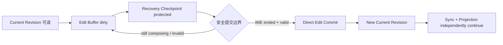
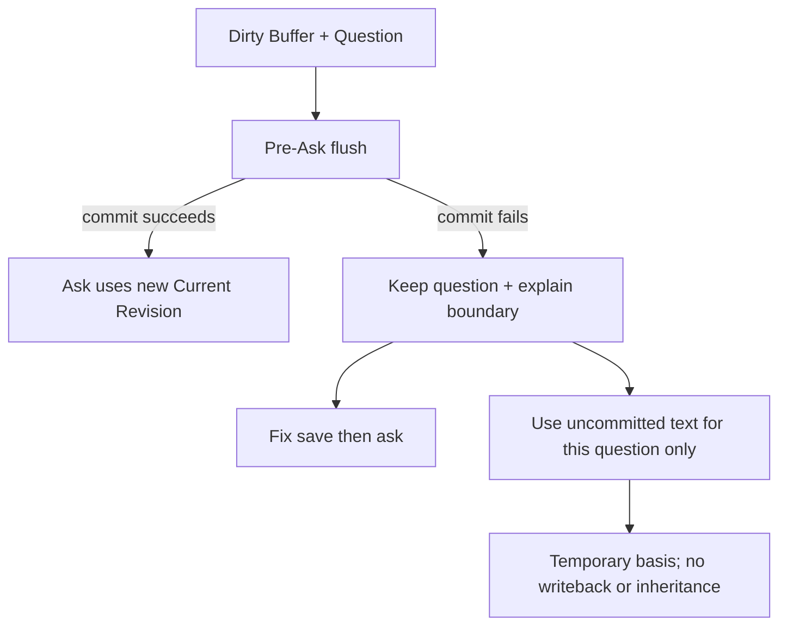

# AI-native 个人知识库

## 直接写作与当前知识提交设计证明增补 v1.0

> 日期：2026-08-07  
> 性质：产品定义阶段的设计证明合同；不是界面稿、原型、工程状态机或制作授权  
> Canonical：`../AI-native-个人知识库-终局产品设计文档-v6.0.md`；本文状态为 EVIDENCE，旧领域合同只在与 v6 一致时提供候选证明  
> 领域合同：`../AI-native-个人知识库-直接创作编辑与版本历史合同-v1.0.md`  
> 审计入口：`Ardot-设计审查与全量设计蓝图-v1.0.md`  
> 当前 Ardot 结论：七张现有整图 Frame 没有证明本合同中的任何直接写作状态；覆盖为 0，不因视觉气质相似而推定成立

---

# 0. 本增补冻结什么

它只冻结下一轮设计必须拿出哪些证据，确保个人知识库的写作体验既不像 CMS 审批，也不会把每个按键、半句话或恢复快照污染成当前知识。

核心命题：

> **用户自己的正常写作，在安全本地边界后就是当前知识；保护输入、更新 current、同步远端和刷新派生视图是四件事。**

本合同不授权：

- 立即制作新 Ardot Frame；
- 制作可点击原型；
- 决定视觉 token、布局比例或动效；
- 用一张 happy-path editor 截图宣称流程完成；
- 用 autosave 或 CRDT 等技术名词替代用户后果。

---

# 1. 七种必须独立的产品责任

| 责任 | 用户真正关心的问题 | P0 语言 | 默认知识读取 |
|---|---|---|---:|
| Edit Buffer | 我现在屏幕上还在写什么 | 正在修改 / 正在输入 | 否 |
| Recovery Checkpoint | 异常退出后能否找回 | 近期修改已在本机保护 | 否 |
| Current Revision | Ask 与阅读使用哪一版 | 已更新当前知识 | 是 |
| Explicit Draft | 哪份修改暂时不影响 current | 已保存为草稿，不用于默认回答 | Search Draft scope only |
| Proposal | AI / 来源建议是否已改变知识 | 建议，尚未改变当前知识 | 否 |
| Sync State | 新 current 是否已到其他设备 | 等待同步 / 已同步 | 不决定 current |
| Projection State | Search / Overview / Graph 是否已消费新 current | 索引正在更新 / 概览正在刷新 | 只说明传播 |

设计必须允许状态组合，例如：

- `已更新当前知识 · 等待同步`；
- `已更新当前知识 · 索引正在更新`；
- `近期修改已在本机保护 · 当前知识仍是上一个版本`；
- `已保存为草稿 · 当前知识仍可正常查询`；
- `建议尚未改变当前知识 · Base 已变化，需要重新比较`。

禁止状态组合：

- active IME + `已更新当前知识`；
- Recovery protected + `已保存`；
- sync queued + `尚未成为当前知识`；
- proposal ready + `AI 已建立知识`；
- projection failure + 回滚 current；
- normal direct edit + `完成并采用`。

---

# 2. 核心证据链

## 2.1 普通连续写作

一组证据至少包含：

1. 阅读态进入同一正文编辑态；
2. dirty buffer；
3. active 中文 IME composition；
4. Recovery protection 成功但 current 未动；
5. composition 结束后的 Direct Edit Commit；
6. current 已更新但 sync queued；
7. index / Overview Projection 更新中；
8. clean return，正文与 scroll / selection 保持。

## 2.2 Normal Close / Back

必须证明：

- Close / Back 触发 flush；
- commit 成功时没有审批对话；
- 完全空白 creation shell 退出不创建 Untitled；
- title-only Question / Concept 可以形成 current；
- commit 失败时不静默关闭；
- copy all、export recovery、retry 与 last safe current 可同时到达。

## 2.3 从 Editor 发起 Ask

Answer header 必须能说明：

- `基于已更新的当前知识`；或
- `本次还使用了未提交文字`。

第二种不能被 Follow-up、Saved Answer 写回、Overview 或 Graph 静默继承。

## 2.4 Crash Recovery

证据必须显示：

1. current Revision N；
2. Buffer 有额外修改；
3. Recovery Checkpoint 已保护；
4. app crash；
5. 重开恢复正文、cursor、selection、scroll、outline 和 edit scope；
6. 明确写`尚未更新当前知识`；
7. 默认 Ask 仍使用 Revision N；
8. 用户检查后形成 Revision N+1，或另存 Explicit Draft；
9. Recovery 不是 Version History row，也不是 Backup 成功证明。

## 2.5 Explicit Draft

只有用户主动选择`保存为草稿`后出现。证据必须证明：

- Current Revision 保持；
- Draft 在 Library / Draft Search 可找回；
- 默认 Ask / Overview / Atlas 排除；
- `包含草稿`是本次显式选择；
- `设为当前知识`向前创建 Revision；
- 放弃 Draft 不删除 current，Recovery retention 使用独立规则。

## 2.6 AI Proposal

两条路径分别证明：

- Inline Candidate：接受前不进 Recovery / History / Search；接受后进 Buffer，随下一次 Direct Edit Commit 更新 current；
- Structured Patch：显示 Base、before / after、support、impact、stale / rebase 与 partial selection；用户确认本身形成 `proposal_accept` commit，没有第二个采用动作。

## 2.7 多窗口 / 多设备

至少使用以下 fixture：

- Window A 基于 Revision 7 修改 Block 2；
- Window B 基于 Revision 7 修改 Block 5；
- 两者安全自动合并成 Revision 8；
- Device C 同时替换 Block 2 同一句；
- 重叠部分形成 Conflict Draft；
- 两份候选与 common Base 均可见；
- 用户选择`使用这个合并结果`后形成 Revision 9；
- sync / conflict 状态不能改变 Archive / Trash / epistemic standing。

---

# 3. Frame / State Matrix

| ID | 证据 | 关键变量 | 通过标准 |
|---|---|---|---|
| ED-01 | Read → Edit | same identity / same paper | 不打开第二套 CMS 页面 |
| ED-02 | Buffer dirty | cursor / selection / scope | 不显示 Saved |
| ED-03 | IME composing | composition active | 不 commit、不刷新知识面 |
| ED-04 | Recovery protected | checkpoint durable | 写明尚未更新 current |
| ED-05 | Commit in progress | atomic local write | 不等同 sync |
| ED-06 | Current updated | new revision pointer | 无审批 CTA |
| ED-07 | Sync queued | offline | current 仍可读可问 |
| ED-08 | Projection updating | index lag | owner immediate；局部 delta / honest warning |
| ED-09 | Explicit Draft | base current + draft | 默认查询排除 |
| ED-10 | Proposal fresh | base + diff + support | 未确认不改变 current |
| ED-11 | Proposal stale | target changed | rebase / compare，不覆盖 |
| ED-12 | Save failed | buffer + last safe current | copy / export / retry 常驻 |
| ED-13 | Crash recovered | device checkpoint | current boundary 清楚 |
| ED-14 | Conflict Draft | base + competing values | 不可见 LWW 禁止 |
| ED-15 | History grouped | edit-session grouping | 不出现按键级噪音 |
| ED-16 | Restore forward | historical + current | 产生新 Revision，不移动历史 |
| ED-17 | Empty new shell | no meaningful content | close 后无对象 |
| ED-18 | Title-only new knowledge | semantic title | Question / Concept 合法 |
| ED-19 | Pre-Ask success | dirty → current | Answer uses exact new revision |
| ED-20 | Pre-Ask failure | uncommitted basis choice | no silent knowledge pollution |

每个 ID 至少有 entry、primary state、failure / boundary、recovery / next action 和 return。只交付单张静态正常态，状态仍记 partial。

---

# 4. 响应式与无障碍等价

Desktop、compact、mobile、200% zoom、keyboard 与 screen reader 必须保持同一语义：

- 状态不只靠颜色、点亮或云朵；
- status message 使用 polite live region，Save failure 使用 persistent alert；
- 中文 IME composition 不被快捷键或 blur 错误提交；
- Toolbar 只占一个 tab stop，内部方向键可操作；
- Draft / Proposal / Recovery 的标签与动作有可读名称；
- focus 在 commit、error、conflict、restore、close 后回到可预测位置；
- mobile sheet 关闭后仍恢复 editor selection / scroll；
- reduced motion 不隐藏 saving → current 的状态变化；
- screen reader 能读出`当前知识仍是 Revision N，近期修改只在本机保护`。

---

# 5. 真实内容 fixture

不使用 lorem ipsum。统一使用一条长 Knowledge：

> `图谱不应替代层级阅读：层级提供稳定的理解主干，关系用于跨越结构边界；AI 查询需要把回答带回同一知识位置。`

包含：

- 三个 headings；
- 一个中文 IME 新段落；
- 一个非法日期属性；
- 一个 inline AI completion；
- 一个基于旧 Revision 的 structured patch；
- 一个跨三个 Groups 出现的 canonical Placement；
- 一个 Contextual summary；
- 一个被 Evidence Anchor 引用的 Claim；
- 一次离线 current commit；
- 一次 overlapping multi-device edit。

fixture 的目标不是演示编辑器能力，而是强迫设计证明 scope、current、recovery、query、projection 与 conflict 真实相遇。

---

# 6. 失败判定

出现任一项即不通过：

- `完成并采用`作为普通写作主动作；
- 绿色 Saved 同时代表 Recovery、current 与 sync；
- 每次按键生成用户可见 Revision；
- IME composition 进入 Ask / Overview / Graph；
- crash 恢复内容自动变成 current；
- Close 失败后仍离开且无法复制文字；
- Explicit Draft 因时间或关闭自动发布；
- AI Patch 接受后再要求第二次采用；
- sync failure 阻止本地 current；
- index failure 回滚 content；
- overlapping merge 使用 last-write-wins；
- Restore 把 pointer 移回旧版本并删除中间 History；
- 只画 desktop happy path；
- 用技术词解释结果而没有用户后果。

---

# 7. 进入视觉设计的 Gate

只有以下问题由用户确认或真实任务验证后，才把本合同转成 Surface skeleton：

1. 普通直接写作是否应在安全本地边界后自动成为 current；
2. `近期修改已在本机保护，尚未更新当前知识`是否足够自然；
3. Explicit Draft 是否真的需要成为 P1 能力，入口放在哪里；
4. pre-Ask flush 失败时，用户是否需要`仅本次使用未提交文字`；
5. user-visible History 的 edit-session grouping 粒度；
6. mobile / multi-window 中状态应该出现在哪里；
7. 方向 3 的连续 Paper 与方向 2 的 scope / impact context 如何分配视觉主次。

在 Gate 之前，正确的交付物是产品合同、状态矩阵和真实 fixture，不是原型。

---

# 8. 最终设计判断

这套产品必须同时避免两种错误：

- 把个人写作变成 CMS：每次改完还要发布；
- 把编辑器画面变成真相：每个按键、恢复快照和半句话都污染 AI、概览与图谱。

真正有产品品味的边界是：

> **写作感觉像自然地写；系统内部像可靠的知识库。用户只在出现草稿、建议、冲突、失败或传播延迟时，才看见必要的状态差异。**
